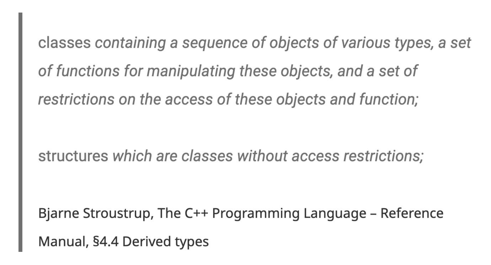

# Classes and Objects

## Declaration and Definition

在 C++ 程序设计中，仅靠变量和函数这种面向过程的范式很难表述清楚复杂的现实问题。为了解决这个问题，C++ 提供了 OOP 范式，其“核心出装”就是本篇笔记的主角**类**(classes)和**对象**(objects)。

目前，为了便于理解，我们可以将类和对象的关系对应到**类型**和**变量**的关系。其中，类定义了一系列的属性和方法，分别称作**成员变量**(member variables)和**成员函数**(member functions)；而对象则是类的一个实例(instance)，具备独立于其他对象的属性。

一个基本的类应该包含：

- 构造函数(constructor)
- 私有成员函数/变量
- 公有成员函数（面向用户的接口）
- 析构函数(destructor)

!!! note "注"

    - 在实现类的成员函数时，需要在函数名前加上类名和解析符(resolver) `::`（将类名作为[命名空间](1.md#namespace)），构成形如 `class_name::funct_name` 的形式。
    - `this` 关键字指代一个指向对象自身的指针，在成员函数的实现中会经常用到（通常用于访问成员变量，在变量前加上 `this->` 可以消除可能存在的歧义；当然如果没有歧义的话可以不用）。
    - 以下成员函数称之为**特殊的成员函数**(special member functions, SMF)，调用它们的时候会自动生成代码（当然我们也可以自己定义它们）：
        - 默认构造函数：`#!cpp T()`
        - 析构函数：`#!cpp ~T()`
        - 拷贝构造函数：`#!cpp T(const T&)`
        - 拷贝赋值运算符：`#!cpp T& operator=(const T&)`
        - 移动构造函数：`#!cpp T(T&&)`
        - 移动赋值运算符：`#!cpp T& operator(T&&)`

        >后面 4 个关于拷贝和移动的部分放到[后面](5.md)介绍。

        - 如果这些函数的默认行为够用的话，我们就没必要去修改；否则的话就去构建自己的 SMF


### Header Files

- .h 头文件用于定义接口
    - 一般包括：函数原型、类声明、类型定义、宏、常量、外部变量等，可能为多个源文件所用
    - 建议一个头文件仅包含一个类的声明
    - 用到头文件的接口时，记得在代码开头用 `#!cpp #include` 导入，它将被包含的文件插入到 .cpp 文件内这条语句的位置上
        - `#!cpp #include "xx.h"`：先搜索当前目录，然后寻找系统目录
        - `#!cpp #include <xx.h>`：直接搜索系统目录
        - `#!cpp #include <xx>`：与 `#!cpp #include <xx.h>` 相同
    - 以下是一个标准的头文件结构，里面的声明仅出现一次，这样可以避免头文件内容被多次包含，从而导致编译失败的问题

        ```cpp
        #ifndef HEADER_FLAG
        #define HEADER_FLAG
        // Type declaration here...
        #endif // HEADER_FLAG
        ```

- .cpp 源文件一般起到实现函数或类的作用
    - 一般包括：函数实现、可执行代码
    - 如果是用于类的实现的话，建议与对应的头文件同名    
    - 编译器一次只看一个 .cpp 文件，并将其编译为 .obj 文件
    - 链接器将所有的 .obj 文件链接为一个可执行文件


### Access Control

???+ info "比较 `#!cpp struct` 和 `#!cpp class`"

    <div style="text-align: center">
        
    </div>

    在结构体中，里面的所有字段默认是公有的(public)，这意味着任何人都可以修改字段值，没有针对结构体的访问控制，这往往是我们不希望看到的。

C++ 的一大重要思想是**封装**(encapsulation)，其中最重要的封装手段便是**访问说明符**(access specifiers)，用于控制成员的访问权限。C++ 提供了以下几种访问说明符：

- `#!cpp public`（**公有**）：能被任何对象访问
- `#!cpp private`（**私有**）：只能在类内部被访问
- `#!cpp protected`（**受保护**）：只能在类内部以及该类的派生类内被访问（涉及到[继承](#inheritance)的知识）

???+ example "例子"

    ```cpp
    class zjuID {
    private:
        string name; 			
        int idNumber;
    public:
        void setName(string n);
        void setIdNumber(int id);
        void display();
    };


    zjuID myCard;
    myCard.setName("NoughtQ");     // OK
    myCard.setIDNumber(114514);    // OK
    myCard.idNumber = 1919;        // Error! We cannot access private members directly
    ```


???+ note "注"

    - 访问说明符的作用范围为：从指定该说明符开始，到下一个说明符或者类定义结束为止
    - 类默认采用 `#!cpp private`，而结构体默认采用 `#!cpp public`，除此之外二者并无什么区别。但由于 `#!cpp class` 的名称更加明确，所以后面涉及到类的代码时，我们就不会用 `#!cpp struct` 而用 `#!cpp class`。


### Initialization and Clean-Up

- **构造函数**(constructor，简写为 ctor)用于初始化新创建对象的状态
    - 构造函数的名称**与类名相同**，且无需指出返回类型
    - 构造函数有两类：
        - 参数化构造函数：
            - 函数体内还可以增加一些额外限制

            ```cpp
            zjuID::zjuID(std::string name, int idNumber) {
                this->name = name;
                if (idNumber > 0)
                    this->idNumber = idNumber;
            }
            ```

            - 初始化列表：如果不需要额外限制的话，这种方法相当方便

                ```cpp
                zjuID::zjuID(std::string name, int idNumber): name(name), idNumber(idNumber) { }
                ```

                - 也可以将初始化列表里的圆括号改为花括号，这样就用到了[统一初始化](1.md#initialization)的语法，相比一般方法能够防止缩窄转换，更加安全

                    ```cpp
                    zjuID::zjuID(std::string name, int idNumber): name{name}, idNumber{idNumber} { }
                    ```

                - 初始化列表可以为空，此时编译器会进行零初始化（对于数值类型的话就会赋予0）             

        - 默认构造函数：没有参数的构造函数

            ```cpp
            zjuID::zjuID() {
                name = "NoughtQ";
                idNumber = 114514;
            }
            ```

            - 如果在类里面没有声明构造函数，那么编译器会自动为该类创建一个这样的构造函数
        - 这两类构造函数可以同时存在（函数重载）
        - C++ 11 引入了一种显式设置默认构造函数的方法：`#!cpp = default`，此时编译器会自动生成一个空的实现，为基本类型成员变量进行默认初始化（**不是**零初始化）。该关键字仅用于默认构造函数（也就是说不得有任何参数），
    
    - <span style="color: red">注意</span>：初始化的顺序不是按照初始化列表的顺序，而是按照类里面**变量声明的顺序**

- **析构函数**(destructor，简写为 dtor)在对象销毁（生命周期结束）前被调用
    - 函数名 = `~` + 类名，无需任何参数，且同样没有返回类型
    - 如果使用 `#!cpp new` 关键字动态分配数据的话，那就一定要在析构函数里用 `#!cpp delete` 释放内存空间

        ```cpp
        struct Y {
            ~Y();
        };
        ```
    
    - 可以显式调用析构函数，但一般来说没这个必要
    - 析构的顺序和构造的顺序相反


### Getters and Setters

一般情况下，类里面的成员变量都是私有的，类外部的对象无法直接访问成员变量。因此要想访问这些变量的话，我们需要通过该类的成员函数间接访问。其中用于读取成员变量的函数被称为 **getter**，用于修改成员变量的函数被称为 **setter**。

- getter

    ```cpp
    std::string zjuID::getName() {
        return this->name;
    }

    int zjuID::getIdNumber() {
        return this->idNumber;
    }
    ```

- setter

    ```cpp
    void zjuID::setName(std::string name) {
        this->name = name;
    }

    void zjuID::setIdNumber(int idNumber) {
        if (idNumber >= 0)
            this->idNumber = idNumber;
    }
    ```


## Friends

**友元**(friends)是一种用关键字 `#!cpp friend` 修饰的函数或类，它可以访问另一个类（就是在这个类内部进行 `#!cpp friend` 声明）的私有或受保护的成员（这在原来是不行的），从而实现“越权访问”（~~开后门~~）。

???+ example "例子"

    === "友元函数"

        ```cpp hl_lines="8"
        class Box {
        private:
            int length;

        public:
            Box(int l) : length(l) {}

            friend void printLength(const Box& b);
        };

        void printLength(const Box& b) {
            std::cout << "Length is: " << b.length << std::endl;
        }
        ```

    === "友元类"

        ```cpp hl_lines="9"
        class Engine;

        class Car {
        private:
            int speed;

        public:
            Car() : speed(200) {}
            friend class Engine;
        };

        class Engine {
        public:
            void boost(Car& c) {
                c.speed += 100;  
            }
        };
        ```

- 友元类不具备：
    - 对称性：类 `A` 是类 `B` 的友元，不代表 `B` 一定是 `A` 的友元
    - 传递性：若类 `A` 是类 `B` 的友元，类 `B` 是类 `C` 的友元，那么 `A` 不一定是 `C` 的友元
    - 继承性：子类不会继承父类的友元关系

- 友元函数不是成员函数，因为友元函数是在类外部实现的，不具备 `#!cpp this` 指针。所以要想访问成员变量，还得将对象引用作为参数传递


## Scope and Lifetime

### Local Objects

字段、参数和局部变量的作用域和生命周期：

- **字段**(fields)
    - 在类里面，但是在构造函数和方法外定义
    - **生命周期**等同于对象的生命周期，因此可用来维护对象的当前状态等
    - **作用域**为整个类，因此可被类里面的构造函数或方法使用（包括相同类的不同对象）
    - 不过用 `#!cpp private` 字段定义字段后，该字段不得在类之外的区域被访问（其他对象不得访问这样的字段）

- **形参**(parameters)：
    - 定义在构造函数或方法的签名/声明上，接收来自外部的值（实参值），该过程即为形参初始化的过程
    - **生命周期**仅在构造函数或方法的调用内，函数调用结束后就消失了
    - **作用域**限制在定义它们的构造函数或方法内

- **局部变量**(local variables)：
    - 定义在构造函数或方法的主体/定义内，仅在构造函数或方法内来初始化和使用变量
    - 由于局部变量没有被赋予默认值，在表达式中使用局部变量时必须先初始化
    - **生命周期**仅在构造函数或方法的调用内，函数调用结束后就消失了
    - **作用域**限制在定义它们的块内，在块外面无法访问它们


### Global Objects

全局对象(global objects)：

- 全局对象的**构造函数**(constructor)需要在进入 `#!cpp main()` 函数之前被调用，声明顺序即为代码书写顺序，因此 `#!cpp main()` 不再是程序中第一个被调用的函数
- 全局对象的**析构函数**(destructor)在 `#!cpp main()` 退出或 `#!cpp exit()` 调用时被调用


### Static

**静态初始化依赖性**(static initialization dependency)：单个文件内的对象构造顺序是已知的，但是多个文件之间的构造顺序是未定的。那么当位于不同文件的<u>非局部静态对象</u>有依赖关系时，就可能会带来问题。

满足以下情况的对象称为**非局部静态对象**(non-local static object)：

- 定义于**全局**或**命名空间**作用域内
- 在**类**中或**文件**作用域内声明为静态变量的

解决上述问题的方案：

- 避免非局部静态变量的依赖关系
- 按正确的顺序在单个文件内定义静态对象

---
`#!cpp static`（**静态**）关键字

- 静态的基本含义：静态存储（持续）、受限访问（隐藏）
- 在固定的地址上仅分配一次空间：名称可见性、内部链接
- 使用场景：
    - **全局变量**：作用域被限制在当前文件，不得被其他文件访问
    - **局部变量**：该变量的生命周期存在于整个程序的运行期间
    - **成员变量**：此时成员变量属于**类**本身，而不是属于某个特定的对象（对象属性 -> 类属性）
        - 在类的内部只能对其声明而不能定义，所以记得要在类外面定义一下这种变量
    - **成员函数**：此时成员函数属于**类**本身，而不是属于某个特定的对象（对象方法 -> 类方法）
- 对于静态成员变量/函数：
    - 由于不属于任何一个对象，所以没法对其使用 `#!cpp this` 指针
    - 访问静态成员的两种方法（推荐前者）：

        ```cpp
        <class name>::<static member>
        <object variable>.<static member>
        ```


## Constants

C++ 的 `#!cpp const` 关键字是一个限定词，表示**不可修改**。常见的用法有：

- 修饰**变量**：`#!cpp const int x = y;`，之后 `x` 就不得再被修改了
    - 不能将非 `#!cpp const` 引用绑定在 `#!cpp const` 变量上
    - 编译器尝试避免为 `#!cpp const` 变量创建内存空间，而将其保存在**符号表**(symbol table)内
    - 但如果在前面使用 `#!cpp extern` 关键字的话，就会让编译器强制分配内存空间
    - 也可以修饰数组、结构体等复杂数据结构，但此时编译器会为它们分配一块无法被修改的内存空间。但是在编译时，无法使用内部的元素，因为编译器在编译时不会获取里面的信息
    - 被 `#!cpp const` 修饰的类成员变量必须在构造函数中被初始化，但由于这样的变量没有在编译时被确定，所以要当心！解决方法有：
        - 匿名枚举
        - 在 `#!cpp const` 前加上 `#!cpp static`

        ```cpp
        // compilation error
        class HasArray {
            const int size = 100;
            int array[size];
        }

        // anonymous enumeration -- OK!
        class HasArray {
            enum { size = 100 };
            int array[size]; // OK!
        };

        // use static keyword -- OK!
        class HasArray {
            static const int size = 100;
            int array[size];
        }
        ```

- 修饰**指针**：分多种情况讨论：
    - `#!cpp const int* p1;`：`#!cpp const` 修饰的是值，所以 `p1` 指向的值不得被修改，但 `p1` 本身可以被修改
    - `#!cpp int* const p2;`：`#!cpp const` 修饰的是指针，所以 `p2` 本身不得被修改，但可以修改其指向的值
    - `#!cpp const int* const p1;`：无论是指针还是指向的值都不得变
- 修饰**函数参数**：`#!cpp void foo(const int& x);`，防止函数修改传入的参数
- 修饰**返回值**：如果返回的是指针或引用，为防止误修改，可以加 `#!cpp const`
    - e.g. `#!cpp const std::string& getStr();`
- 修饰**成员函数**：`#!cpp const` 加在函数签名之后（花括号之前）（声明和定义都要加）

    ```cpp
    class A {
    public:
        int getVal() const {
            return val;
        }

    private:
        int val;
    };
    ```

    - 必要性：在 C++ 中，由于 `#!cpp const` 对象只能使用其 `#!cpp const` 成员函数，所以不为成员函数添加 `#!cpp const` 的话，编译器就不知道这个成员函数是否会修改 `#!cpp const` 对象的成员变量，从而编译失败
    - 此时该成员函数不能修改成员变量，并且它只能调用其他 `#!cpp const` 成员函数；但它可以修改全局变量、传入的参数以及 `#!cpp static` 成员变量（因为它不属于任何对象）
    - 被 `#!cpp const` 修饰的对象只能调用同样被 `#!cpp const` 修饰的成员函数
    - 实际上，这个 `#!cpp const` 修饰的是 `#!cpp this` 指针
    - **函数重载**：可以为同名成员函数设置被 `#!cpp const` 修饰和不被 `#!cpp const` 修饰的两个版本，这两个版本可以分别被 `#!cpp const` 对象和非 `#!cpp const` 对象调用

        ```cpp
        void f() const;
        void f();
        ```

        - 一般情况下这两个版本的实现代码是一样的，所以会带来代码的冗余。一种解决方法是使用关键字 `#!cpp const_cast` 将成员函数的非 `#!cpp const` 版本转换为 `#!cpp const` 版本，避免写两遍代码。但这么做就相当于强制移除 `#!cpp const` 属性，打破了 `#!cpp const` 设计的初衷，很容易带来问题，所以应尽可能避免使用（同样打破这种限制的还有关键字 `#!cpp mutable`，同样要避免使用）  。

        ??? example "例子"

            ```cpp hl_lines="11"
            template <typename T>
            T& Vector<T>::findElement(const T& value) {
                for (size_t i = 0; i < logical_size; i++) {
                    if (elems[i] == elem) return elems[i];
                }
                throw std: :out_of_range("Element not found");
            }
            
            template <typename T>
            const T& Vector<T>::findElement(const T& value) const {
                return const_cast<Vector<T>&>(*this).findElement(value);
            }
            ```

        

---
字符串与常量：

```cpp
char * s1 = "Hello, world!";
char s2[] = "Hello, world!";
```

- 字符**指针** `s1` 可以指向其他字符串，但是不可以改变指向字符串的内容
- 字符**数组** `s2` 可以修改字符串的内容，但是不可以指向其他字符串


## Composition

**组合**(composition)：一个类将另一个类的对象作为其成员变量，组织和复用其代码，从而“拥有”另一个类的功能，体现的是一种 "**has-a**"（拥有）关系。

有以下组合方式：

- 值组合/**嵌入对象**(embedded objects)（**完全包含**）
    - 假如 "`A` has a `B`"，那么在对象 `A` 创建或销毁时，被嵌入的对象 `B` 会自动调用构造函数和析构函数（生命周期强绑定）
    - 成员初始化通常通过构造函数初始化列表进行
        - 可以只初始化部分成员，未初始化的将调用默认构造函数
        - 构造顺序由成员声明顺序决定，与初始化列表顺序无关
    - 嵌入对象通常是私有的（`#!cpp private`）

        ```cpp
        class A {
            int x;
        public:
            A(int val) : x(val) {}
        };
        class B {
            A a1, a2;
        public:
            B() : a1(10), a2(20) {}  // 初始化列表初始化子对象
        };
        ```

- **引用/指针**组合
    - 引用/指针绑定的对象不会自动调用构造函数和析构函数，需要手动初始化和销毁对象（生命周期独立）
    - 应用场景：逻辑关系并不是完全的、程序开始时还不清楚对象大小、需要在运行时分配/连接资源...
    - 其他 OOP 语言只能采用这种方式


## Inheritance

**继承**(inheritance)：基于已有的类（称为**基类**(base class)或**超类**(superclass)）创建一个新类（称为**派生类**(derived class)或**子类**(subclass)），派生类自动获得基类的属性和方法，并在此基础上进行添加或修改。

继承的好处有：

- 代码复用：避免在多个类中重复编写相同的代码
- 简化维护：修改基类可以影响所有派生类，便于统一管理
- 扩展性：方便地在现有类的基础上进行功能扩展

能继承的内容有：

- **成员变量**
    - 包括 `#!cpp private` 和 `#!cpp protected` 的成员变量，派生类拥有基类的全部变量
    - 但是派生类无法直接访问 `#!cpp private` 成员变量，必须通过基类的 `#!cpp public` 或 `#!cpp protected` 的成员函数来访问
- `#!cpp publilc` 或 `#!cpp protected` 的**成员函数**：可被派生类直接访问和调用
- **静态成员**：作用域仍然在类范围内

不能继承的内容有：

- 构造函数
    - 派生类不直接继承基类构造函数的内容
    - 创建派生类对象时，总是先调用基类的构造函数来初始化基类部分，然后再执行派生类的构造函数
    - 可以在派生类构造函数的初始化列表中显式调用指定的基类构造函数;若不显式调用，则会自动调用基类的默认构造函数
    - 派生类的[拷贝构造函数](5.md)需要显式调用基类的拷贝构造函数，否则会调用基类的默认构造函数
- 析构函数
    - 不直接继承
    - 析构函数的调用顺序与构造函数相反：先调用派生类的析构函数，再调用基类的析构函数
- 赋值运算
    - 不直接继承
    - 派生类的赋值运算符需要显式调用基类的赋值运算符，以确保基类部分的正确赋值，否则可能导致资源管理问题（如浅拷贝）
    - 如果未显式定义，编译器会生成默认的赋值运算符，进行成员逐一赋值（可能会有问题）
- 私有数据被隐藏起来，但仍然存在


访问保护：

- 成员
    - 公有：对所有用户都是可见的
    - 受保护：对派生类和友元而言是可见的
    - 私有：仅对自己和友元可见

- 继承：
    - 公有：`#!cpp class Derived : public Base ...`
    - 受保护：`#!cpp class Derived : protected Base ...`
    - 私有（默认）：`#!cpp class Derived : private Base ...`

继承对访问的影响：假设类 `B` 是类 `A` 的派生类，那么：

|继承类型|`#!cpp public`|`#!cpp protected`|`#!cpp private`|
|:-|:-|:-|:-|
|`#!cpp public A`|在 B 里是公有的|在 B 里是受保护的|被隐藏|
|`#!cpp private A`|在 B 里是私有的|在 B 里是私有的|被隐藏|
|`#!cpp protected A`|在 B 里是受保护的|在 B 里是受保护的|被隐藏|

何时“受保护”失效：

- 派生类的行为异常
- 对所有派生类而言，受保护的成员是公有的
- 因此，需要让成员函数是受保护的，而成员变量是私有的


- 析构函数按照调用构造函数时的倒序被调用

名称隐藏：

- 如果在派生类中重新定义了一个成员函数，那么其他所有在基类中重载的函数都无法被访问
- 之后会介绍关键字 `#!cpp virtual`，它能够影响函数重载的行为


## Polymorphism

下面我们学习 OOP 中另一个重要思想——**多态**(polymorphism)，它允许我们以统一的方式处理不同但相关的对象，其核心思想就是“一个接口，多种实现”。


### Subclassing and Subtyping

??? note "子类型(subtypes)"

    子类型描述了类型之间的可替换性关系。如果类型 `S` 是类型 `T` 的子类型 (记作 `S <: T`)，那么在任何需要类型 `T` 的地方，都可以安全地使用类型 `S` 的对象，而不改变程序的期望行为和正确性。

**子类**(subclassing)和**子类型**(subtyping)是多态的基础，提供了多态所需要的 “多种形态”的对象。具体是通过以下方法实现的：

- `#!cpp public` 继承
    - 在 C++ 中，`#!cpp public` 继承是设计者用来表达子类型关系的主要工具。它在语法上建立了 "is-a" 关系，并允许从子类到父类的**隐式类型转换（向上转型）**，这是实现多态的基础。
- 此外**里氏替换原则(Liskov Substitution Principle, LSP)**发挥重要作用，它保证子类还必须在**行为**上与父类兼容，结合 `#!cpp public` 继承，构成真正安全的子类型关系。LSP 有以下要求：
    - 子类不能强化父类方法的前置条件（对输入要求更严格）
    - 子类不能弱化父类方法的后置条件（对输出保证更少）
    - 子类必须维持父类的不变性（类状态的约束）
    
    如果没有遵循 LSP，即便是 `#!cpp public` 继承，在运行时也可能导致逻辑错误或程序崩溃。这种情况下，这样的子类就不能表示有效的子类型。

??? question "那么 `#!cpp private`/`#!cpp protected` 继承"

    - 这两种继承方式主要关注**实现复用** ("implemented-in-terms-of")，**不**表达 "is-a" 或子类型关系。
    - 编译器通常会**阻止**隐式的向上转型，因此它们**不**支持基于对象替换的多态性。


### Upcasting

**向上转型**(upcasting)是指将**派生类**的指针或引用转换为**基类**的指针或引用。

??? example "例子"

    ```cpp
    class Animal {};
    class Dog : public Animal {};

    Dog myDog;
    Animal* pAnimal = &myDog; // Upcasting
    Animal& rAnimal = myDog;  // Upcasting
    ```

向上转型具有以下特点：

- 隐式且安全：`#!cpp public` 继承保证了 "is-a" 关系
- 信息丢失（静态角度）：通过基类指针/引用，我们只能访问基类中定义的成员（包括虚函数），子类特有的成员在编译时是不可见的
- 多态的关键：这是使用多态机制的前提；通过基类指针/引用调用**虚函数**时，才能触发动态绑定


### Dynamic Binding

**动态绑定**(dynamic binding)（也称为**后期绑定(late binding)**或**运行时绑定(runtime binding)**）是指在程序运行时，根据指针或引用**实际指向的对象类型**（而不是指针或引用的声明类型）来决定调用哪个成员函数版本的机制。

??? info "静态绑定(static binding)"

    静态绑定在**编译期间**就已经根据指针或引用的**声明类型**（静态类型）确定了要调用的具体函数。非虚函数、静态成员函数、以及通过对象本身（而不是指针或引用）进行的函数调用都属于静态绑定。

动态绑定的发生条件为：

- 调用必须通过**基类的指针或引用**进行
- 被调用的成员函数必须在基类中声明为 `#!cpp virtual`（即**虚函数**(virtual functions)，下面马上介绍👇）

动态绑定是 C++ 实现**运行时多态**的基石，使得我们可以编写操作基类指针/引用的通用代码，而这些代码在运行时能够自动适应所指向的具体子类对象，调用该子类对象特有的行为实现（如果子类重写了该虚函数）。正是这种运行时的决策能力，赋予了程序处理不同类型对象的高度灵活性和可扩展性。


#### Virtual Functions

**虚函数**(virtual functions)允许子类重写(override)基类的行为，并在运行时根据对象的**实际类型**（而不是指针/引用的静态类型）来决定调用哪个版本的函数。

??? example "例子"

    ```cpp
    class Shape {
    public:
        virtual void Draw() { cout << "Drawing a generic shape" << endl; }
        virtual ~Shape() {}
    };
    ```

??? info "补充知识：具体实现"

    - **虚函数表**(VTable)：每个包含虚函数的类都有一个静态的虚函数表，存储着该类所有虚函数的地址
    - **虚表指针**(`vptr`)：类的每个对象内部包含一个隐藏的指针 `vptr`，指向其所属类的 `VTable`
    
    当通过基类指针/引用调用虚函数时：

    1.  通过对象的 `vptr` 找到对应的 VTable。
    2.  在 VTable 中查找被调用虚函数的地址。
    3.  跳转到该地址执行代码（可能是基类的实现，也可能是某个子类的实现）。

    性能与内存开销：

    - 内存：每个对象增加一个 `vptr` 的大小
    - 时间：每次虚函数调用涉及一次额外的间接寻址（`vptr` -> VTable -> Function），可能影响 CPU 缓存效率，相比普通函数调用有轻微开销

??? note "**非虚函数(non-virtual functions)**"

    - 静态绑定：调用地址在**编译时**就确定了，基于指针/引用的**静态类型**。
    - 无运行时开销：调用快，但不具有多态性。如果子类定义了同名非虚函数，通过基类指针调用时，执行的永远是基类的版本。

---
我们可能会遇到这样一个问题：如果通过基类指针 `#!cpp delete` 一个派生类对象，而基类的析构函数不是虚函数，那么程序只会调用基类的析构函数，而派生类的析构函数不会被调用。

??? example "例子"

    ```cpp
    class Base { public: ~Base() { /* 非虚析构 */ } };
    class Derived : public Base {
        Resource* res; // 假设 Derived 管理某种资源
    public:
        Derived() : res(new Resource()) {}
        ~Derived() { delete res; /* 清理资源 */ } // 这个析构函数可能不会被调用！
    };

    Base* pB = new Derived();
    delete pB; // !!! 未定义行为 (Undefined Behavior) !!!
               // 只调用了 ~Base()，Derived 的析构函数未调用，导致 res 内存泄漏！
    ```

因此，如果打算将一个类作为基类，并且之后可能会通过基类指针删除派生类对象，那么它的**析构函数**必须声明为 `#!cpp virtual`。或者说，只要类中有任何一个虚函数，就应该提供一个虚析构函数。即使类不打算被继承，这样做也无大碍，并且还更安全。

```cpp
class Base {
public:
    virtual ~Base() = default;
};
```


#### Overriding

**重写**(overriding)的目的是为子类提供一个与基类虚函数签名完全相同的函数，以实现自己的特定行为。其规则如下：

- 函数签名：名称、参数列表、`#!cpp const` 修饰符必须严格一致
- `#!cpp virtual` 关键字：
    - 基类函数必须是 `#!cpp virtual`
    - 子类重写时 `#!cpp virtual` 关键字可选（但强烈推荐写上）
- `#!cpp override` 关键字（C++11 标准引入，强烈推荐使用）：使用该关键字后，编译器会检查该函数是否真的重写了基类的虚函数，防止因签名错误导致的意外行为（变成隐藏而非重写）

    ??? example "例子"

        ```cpp
        class Base {
        public:
            virtual void display(int x) const;
        };
        
        class Derived : public Base {
        public:
            // 正确重写，编译器会检查
            void display(int x) const override;
            // void display(int x) override; // 编译错误！const 不匹配
            // void display(double x) const override; // 编译错误！参数类型不匹配
        };
        ```

- **返回类型协变(covariant return types)**：如果基类虚函数返回 `Base*` 或 `Base&`，子类重写时可以返回 `Derived*` 或 `Derived&`（其中 `Derived` 继承自 `Base`）（通常应用于克隆函数等场景中）

    ??? example "例子"

        ```cpp
        class Document {
        public:
            virtual Document* clone() const = 0;
            virtual ~Document() = default;
        };
        class TextDocument : public Document {
        public:
            // 返回更具体的类型，是合法的协变
            TextDocument* clone() const override { return new TextDocument(*this); }
        };
        ```

- 访问权限：子类重写函数的访问权限不能比基类更严格
    - 举例：如果基类是 `#!cpp public` 的话, 那么子类就不能是 `#!cpp protected` 或 `#!cpp private`


重写可能会带来**名称隐藏(name hiding)**的问题：如果子类定义了一个**与基类同名**但**参数列表不同**的函数（无论基类是否为 `#!cpp virtual`），基类所有同名的**重载版本**都会被隐藏。该问题的解决方法是使用 `#!cpp using` 声明将基类同名函数引入子类作用域。

??? example "例子"

    ```cpp
    class Base {
    public:
        virtual void func(int);
        void func(double); // overloading
    };
    class Derived : public Base {
    public:
        // 只重写 int 版本
        void func(int) override;
        // 如果没有下一行, Base::func(double) 将被隐藏
        using Base::func; // 将 Base 的 func(double) 引入 Derived 作用域
    };
    ```


### Abstract Classes

**抽象类**(abstract classes)是一种包含至少一个**纯虚函数**(pure virtual function)的类。
    - 纯虚函数：在声明末尾加上 `= 0`，表示该函数没有实现，必须由子类提供。

??? example "例子"

    ```cpp
    class Shape { // Shape 是一个抽象类
    public:
        // 纯虚函数：定义接口，强制子类实现
        virtual double calculateArea() const = 0;

        // 抽象类可以有普通成员函数和数据成员
        void setColor(const std::string& c) { color = c; }

        // 即使是抽象类，如果可能被继承，也需要虚析构函数！
        virtual ~Shape() = default;
    private:
        std::string color;
    };
    ```

抽象基类具备以下特点：

- 不能实例化：不能创建抽象类的对象
- 作为接口基类：主要用于定义一套接口规范，强制派生类实现这些接口

而抽象类的意义在于：它为一组具有共同特征的类提供统一的接口规范，通过包含纯虚函数强制子类实现特定行为，从而支持多态性、提高代码一致性与可扩展性，同时防止对未完全实现的类进行误用，是一种构建灵活、安全、可维护的面向对象系统的重要机制。

??? info "接口类(interface classes)"

    接口类通常是指只包含纯虚函数（和一个虚析构函数），并且没有数据成员的抽象类，以模拟其他语言中的 `interface` 概念（比如 Java、Go 等等）。它的目的是用于纯粹定义一套契约，规定了派生类必须实现哪些功能，而不涉及任何实现细节。

    ??? example "例子"

        ```cpp
        // ILogger 是一个接口类
        class ILogger {
        public:
            virtual void logMessage(const std::string& message) = 0;
            virtual void logError(const std::string& error) = 0;
            virtual ~ILogger() = default; // 接口也需要虚析构函数
        };

        // FileLogger 实现了 ILogger 接口
        class FileLogger : public ILogger {
        public:
            void logMessage(const std::string& message) override { /* ... */ }
            void logError(const std::string& error) override { /* ... */ }
            // ~FileLogger() implicitly calls ~ILogger()
        };
        ```


### Multiple Inheritance

**多重继承**(multiple inheritance)是指一个类可以同时继承多个基类的机制。该机制允许新类结合多个已有类的功能，从而在设计上具有更高的灵活性和表达能力。

多重继承有以下应用场景：

- 实现多个接口：一个类可以同时满足多个不同的契约。

    ??? example "例子"

        ```cpp
        class Clickable { public: virtual void onClick() = 0; virtual ~Clickable() = default; };
        class Serializable { public: virtual void serialize(std::ostream& os) const = 0; virtual ~Serializable() = default; };

        // Button 同时实现了 Clickable 和 Serializable 接口
        class Button : public Clickable, public Serializable { /* ... 实现接口 ... */ };
        ```

- 混合继承：继承一个具体的基类，同时实现一个或多个接口。

---
在多重继承中，我们常遇到的最经典的问题便是**菱形继承问题**(diamond problem)了：当一个类通过不同的路径继承自同一个间接基类时，该基类的成员会在派生类中存在多份拷贝，导致访问出现歧义。

??? example "例子"

    ```cpp
    class Top { public: int value; };
    class Left : public Top {};
    class Right : public Top {};
    class Bottom : public Left, public Right {};

    Bottom b;
    // b.value = 10; // 编译错误！编译器无法判断是 Left::Top::value 还是 Right::Top::value
    ```

该问题的解决方案是采用**虚继承**(virtual inheritance)，即在中间类继承共同基类时使用 `#!cpp virtual` 关键字。

- 这样做的代价是：虚继承通常会引入额外的复杂性和轻微的性能开销
- 初始化规则：虚基类的构造函数由最终派生类(most-derived class)的构造函数负责调用，即使中间类也尝试调用，也会被忽略，从而确保虚基类只被初始化一次

??? example "例子"

    ```cpp
    class Top { public: int value; };
    // 使用虚继承
    class Left : virtual public Top {};
    class Right : virtual public Top {};
    // Bottom 现在只包含一份 Top 的子对象
    class Bottom : public Left, public Right {};

    Bottom b;
    b.value = 10; // 正确！只有一份 value
    ```

???+ abstract "关于继承和多态的设计原则（来自 Qwen3-235B-A22B 和 Gemini 2.5 Pro 的总结）"

    - **优先使用组合而非继承**：继承是强耦合关系("is-a")。如果只需要复用代码或建立 "has-a" 关系，组合通常更灵活、耦合更低。
    - **谨慎使用多重继承**：虽然这个功能很强大，但也容易引入复杂性（特别是菱形继承）。所以我们优先考虑使用**接口继承**（继承多个纯抽象类）来组合能力。
    - **警惕虚函数中的默认参数**：默认参数值是**静态绑定**的！调用时使用的是指针/引用**静态类型**所对应的默认值，而不是**动态类型**（对象实际类型）的，这可能导致违反直觉的行为。所以实践中最好避免在虚函数中使用默认参数，或者确保所有重写版本都使用相同的默认值（但前者更好）。
    - **不在构造/析构函数中调用虚函数**：在基类构造函数执行期间，对象的动态类型仍然是基类（`vptr` 指向基类的 VTable）。此时调用虚函数，执行的是**基类版本**，而不是派生类的版本（派生类部分尚未构造/已析构），所以需要当心。

