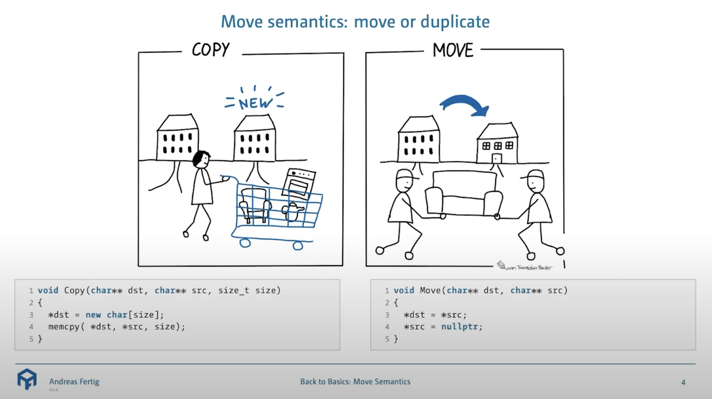

# Copying and Moving

在 C++ 的世界中，对象不仅仅是静态的数据容器——它们拥有生命周期，并且经常需要在程序的不同部分之间传递或复制。因此，理解对象如何被**拷贝**(copying)以创建副本，以及如何被**移动**(moving)以高效转移资源，是掌握 C++ 核心机制的关键一步。这些操作深刻影响着程序的性能和资源管理的正确性，尤其当对象内部管理着诸如动态分配的内存、文件句柄或网络连接等重要资源时。接下来我们将深入探讨这两个核心概念。

???+ info "一个形象的类比"

    <div style="text-align: center">
        
    </div>

    >Source: [Back to Basics: C++ Move Semantics - Andreas Fertig - CppCon 2022](https://www.youtube.com/watch?v=knEaMpytRMA)


## Copying

**拷贝**(copying)是指基于一个已存在的对象创建一个全新的、独立的对象副本的过程。

??? example "例子：按值传递触发拷贝"

    当对象作为参数按值传递给函数时，会发生拷贝：

    ```cpp
    // 假设 Currency 是一个类
    void displayCurrency(Currency item) { // item 是 bucks 的一个副本
        std::cout << "Value: " << item.dollars() << std::endl;
    }

    int main() {
        Currency bucks(100, 0);
        displayCurrency(bucks); // bucks 被拷贝到参数 item 中
        return 0;
    }
    ```

    在这个例子中，当 `#!cpp displayCurrency(bucks)` 被调用时，`bucks` 对象的内容会被用来初始化函数参数 `item`，这个过程通常由**拷贝构造函数**完成。


### Copy Ctors

**拷贝构造函数**(copy constructors)是一种特殊的构造函数，它定义了如何从同一个类的另一个对象来初始化新对象。

- 典型的函数签名为：`#!cpp className::className(const className& other);`
    - 参数通常是一个对同类型对象的 `#!cpp const` 引用 (`#!cpp const className&`)。使用**引用**是为了避免在拷贝过程中再次调用拷贝构造函数（否则会造成无限递归），而 `#!cpp const` 则保证了原始对象在拷贝过程中不会被意外修改。

- **默认拷贝构造函数**：如果我们没有为类显式提供拷贝构造函数，C++ 编译器会**自动生成**一个——这个默认的拷贝构造函数会执行**成员逐一拷贝**(member-wise copy)。
    - 对于基本数据类型（如 `#!cpp int`, `#!cpp double`）和本身具有良好拷贝语义的成员对象（如 `#!cpp std::string`），这种默认行为通常是正确的。  
    - 然而，如果类中包含**指针**成员，默认拷贝构造函数只会**复制指针的值（即地址）**，而不是指针所指向的数据，这导致原对象和拷贝后的对象的指针成员指向同一块内存区域（即**浅拷贝**）。这个时候我们就要构建自己的拷贝构造函数辣！

- 拷贝发生的时机：
    - 按值传递参数：将对象作为参数传递给函数时
    - 按值返回对象：当函数返回一个对象时，编译器通常会进行（命名）返回值优化来避免不必要的拷贝
    - 对象初始化：使用一个对象来初始化另一个对象时

    ???+ example "例子"

        ```cpp
        Person p1("Alice");
        Person p2 = p1;    // 调用拷贝构造函数
        Person p3(p1);     // 显式调用拷贝构造函数
        ```

- 拷贝构造函数使用准则（或注意事项）：
    - 显式定义：如果用户自定义类类管理资源的话，必须显式提供拷贝构造函数（以及拷贝赋值运算符和析构函数）来实现深拷贝和正确的资源管理。不要依赖默认的浅拷贝行为。
    - 禁止拷贝：如果希望类的对象不可拷贝，可以采取以下方法：
        - 将拷贝构造函数和拷贝赋值运算符声明为 `#!cpp = delete;`（C++11 及以后，推荐）
        - 将它们声明为 `#!cpp private` 并且不提供实现，这样任何尝试拷贝对象的操作都会在编译时失败（传统方法）
    - 自定义拷贝构造函数时记得拷贝所有的成员变量，以及调用所有基类中适当的拷贝构造函数（如果有的话）。
        - 如果只拷贝部分变量（即局部拷贝(partial copy)），编译器通常不会发出警告，所以请为自己的行为负责。
        - 对于派生类，在自定义它的拷贝构造函数时，如果没有调用基类的构造函数，那么 C++ 会为其自动调用基类的默认构造函数


### Shallow Copy v.s. Deep Copy

!!! bug "浅拷贝的问题"

    当类管理动态分配的资源（如通过 `#!cpp new` 分配的内存）时，**浅拷贝**(shallow copy)会引发严重问题：

    - **悬挂指针**(dangling pointers)：如果原对象被销毁，其析构函数释放了内存，那么拷贝对象的指针就会变成悬挂指针
    - **重复释放**：当拷贝对象也被销毁时，它会尝试再次释放同一块内存，导致未定义行为（通常会导致程序崩溃）
    - **数据共享意外修改**：修改一个对象所指向的数据会影响到另一个对象
    
为了解决这些问题，当类管理动态资源时，我们需要实现**深拷贝**(deep copy)，这意味着在拷贝构造函数中，我们需要为新对象分配新的内存，并复制原始对象所指向的数据内容。

??? example "例子"

    假设我们有一个 `Person` 类，它动态地存储名字：

    ```cpp
    #include <cstring>
    #include <iostream>

    class Person {
    private:
        char* name;
        // 其他成员，如 age 等

    public:
        Person(const char* n) {
            if (n) {
                name = new char[std::strlen(n) + 1];
                std::strcpy(name, n);
            } else {
                name = new char[1];
                name[0] = '\0';
            }
            std::cout << "Person created: " << (name ? name : "null") << std::endl;
        }

        ~Person() {
            std::cout << "Person destroyed: " << (name ? name : "null") << std::endl;
            delete[] name; // 释放动态分配的内存
        }

        // 如果不提供拷贝构造函数，编译器会生成一个浅拷贝版本：
        // Person(const Person& other) : name(other.name) {} // 错误的浅拷贝！

        // 正确的深拷贝构造函数
        Person(const Person& other) {
            if (other.name) {
                name = new char[std::strlen(other.name) + 1];
                std::strcpy(name, other.name);
            } else {
                name = new char[1];
                name[0] = '\0';
            }
            std::cout << "Person (deep) copied: " << name << std::endl;
        }

        // 通常还需要一个拷贝赋值运算符 (见后文)
        Person& operator=(const Person& other) {
            std::cout << "Person copy assignment for: " << (name ? name : "null") << " from " << (other.name ? other.name : "null") << std::endl;
            if (this == &other) { // 处理自我赋值
                return *this;
            }
            delete[] name; // 释放旧资源
            if (other.name) {
                name = new char[std::strlen(other.name) + 1];
                std::strcpy(name, other.name);
            } else {
                name = new char[1];
                name[0] = '\0';
            }
            return *this;
        }

        void print() const {
            std::cout << "Name: " << (name ? name : "N/A") << std::endl;
        }
    };
    ```

    在这个 `Person` 类的深拷贝构造函数中，我们为新的 `Person` 对象分配了新的内存来存储 `name`，并复制了内容。

???+ info "拷贝的开销与优化"

    - 对象拷贝尤其是深拷贝，可能涉及内存分配和数据复制，这些都是有开销的操作
    - 编译器非常智能，在很多情况下可以进行拷贝省略(copy elision)（例如 RVO(return value optimization)/NRVO(named return value optimization)），以避免不必要的拷贝，从而提高性能
    - 尽管如此，我们作为程序员仍需理解拷贝何时发生，并为那些编译器无法优化的场景提供高效的拷贝操作


### Copy Assignments

区分对象的初始化（通常调用构造函数）和赋值（调用赋值运算符）非常重要：

- **构造**(construction)：对象在其生命周期开始时只会被构造一次

    ```cpp
    Person p1("Alice");  // 调用普通构造函数
    Person p2 = p1;      // 调用拷贝构造函数 (初始化 p2)
    ```

- **赋值**(assignment)：一个已存在的对象可以被多次赋值

    ```cpp
    Person p3("Bob");
    p3 = p1;             // 调用拷贝赋值运算符 (p3 已经存在)
    ```

接下来我们重点关注拷贝语义在后者中的应用——**拷贝赋值运算符**(copy assignement operators)。它的根本目的是将一个已存在的对象的状态完全替换为另一个已存在的同类型对象的状态。

- 典型签名：`#!cpp T& T::operator=(const T& other);`
- 在重载拷贝赋值运算符时，尤其当类管理资源时，必须严谨地执行以下步骤：
    - **处理自我赋值**：这是防止潜在错误的关键步骤。如果源对象和目标对象是同一个对象 (`#!cpp obj = obj;`)，若不加检查直接执行后续的资源释放和分配，可能会导致对象持有的资源被错误地释放，进而引发未定义行为。

        ```cpp
        if (this == &other) { // 'this' 是指向当前对象的指针
            return *this;     // 若地址相同，则为自我赋值，直接返回，不执行任何操作
        }
        ```

    - **释放当前对象已持有的资源**：在从 `other` 对象复制新状态之前，当前对象 (`#!cpp *this`) 可能已经管理着一些资源。这些资源必须被正确释放，以避免资源泄漏（如内存泄漏）。

        ```cpp
        delete[] this->name_;        // 释放当前对象之前分配的内存
        this->name_ = nullptr;       // 将指针置空，这是一个良好的编程习惯
        ```


    - **分配新资源并复制源对象数据**：与拷贝构造函数类似，如果类管理资源，赋值操作也必须执行**深拷贝**。为当前对象 (`#!cpp *this`) 分配新的、独立的资源，然后将 `other` 对象的数据（包括其管理的资源内容）复制过来。

        ```cpp
        if (other.name_) {
            this->name_ = new char[std::strlen(other.name_) + 1];   // 为 this->name_ 分配新内存
            std::strcpy(this->name_, other.name_);                  // 复制内容
        } else {
            this->name_ = nullptr;
        }
        // 复制其他非资源依赖的成员变量
        this->age_ = other.age_;
        ```

    - **返回对当前对象的引用**：返回 `#!cpp *this` 以支持链式赋值。

        ```cpp
        return *this;
        ```

- 如果类没有显式定义拷贝赋值运算符，编译器会自动生成一个。这个隐式生成的版本会执行成员方式赋值 (memberwise assignment)：
    - 对内置类型的成员，直接进行值复制。
    - 对类类型的成员，调用该成员的拷贝赋值运算符。
    - 对指针类型的成员，仅复制指针的地址值（**浅拷贝**），而不复制指针所指向的数据。这就是当类需要管理动态资源时，必须用户自定义拷贝赋值运算符、拷贝构造函数和析构函数的主要原因。

- 可以看到，多数情况下，拷贝构造函数和拷贝赋值运算符的实现代码很像，即存在代码重复的情况。但即便如此，我们不应该让拷贝赋值运算符直接调用拷贝构造函数，反过来也不行，因为前者相当于构造一个已经存在的对象，而后者更是拿一个还没有构造好的对象去给其他对象赋值，这些都是没有意义的。
    - 正确的做法是将代码重复的部分放进一个第三方函数（一般声明为 `private`），然后拷贝构造函数和拷贝赋值运算符调用这个函数。


### Important Rules

- **三法则**(Rule of Three)（C++03）：如果为一个类定义了**析构函数**、**拷贝构造函数**或**拷贝赋值运算符**中的任何一个，那么通常这三者全部需要定义，因为自定义这些函数之一通常意味着类在管理资源时，需要特别处理其生命周期和复制行为。
- **五法则**(Rule of Five)（C++11 及以后）：随着移动语义的引入，此法则扩展为五法则——如果定义了上述三个中的任何一个，通常还需要考虑定义**移动构造函数**和**移动赋值运算符**，或者显式地 `#!cpp delete` 或 `#!cpp default` 它们。
- **零法则**(Rule of Zero)（C++11 及以后）：如果一个类不直接管理任何资源，而是通过其成员对象来管理资源，那么该类通常不需要定义任何析构函数、拷贝构造函数、拷贝赋值运算符、移动构造函数或移动赋值运算符；编译器生成的默认版本通常就能正确工作。

具体内容可见 [cppreference](https://en.cppreference.com/w/cpp/language/rule_of_three)


### `#!cpp delete` and `#!cpp default`

!!! warning "注意"

    这里介绍的 `#!cpp delete` 不是用于释放动态分配的内存的那个！

在 C++11 后，`#!cpp delete` 关键字还可以用于**禁用类的特殊成员函数(SMFs)的自动生成或隐式使用**，通常用于防止对象的拷贝或赋值等操作。其语法形式为 `#!cpp (function declaration) = delete;`。

???+ example "例子"

    ```cpp
    class NonCopyable {
    public:
        NonCopyable() = default;
        NonCopyable(const NonCopyable&) = delete;             // 禁用拷贝构造函数
        NonCopyable& operator=(const NonCopyable&) = delete;  // 禁用拷贝赋值运算符
    };
    ```

??? info "来看看在 `#!cpp delete` 诞生前，我们该如何禁止编译器自动生成 SMFs"

    如果我们不主动声明 SMFs 的话，编译器也会为我们自动创建默认的 SMFs。所以我们需要用一些 tricks：

    - 将 SMFs 声明为 `#!cpp private`，并且不给实现（定义），或者
    - 创建一个基类，里面声明没有定义的 SMFs，然后私有（`#!cpp private`）继承这样的类

    >这下就知道 `#!cpp delete` 的强大之处了吧！

---
和 `#!cpp delete` 新特性一起引入的新关键字 `#!cpp default`，它的主要功能是**显式地要求编译器生成默认的特殊成员函数**。之所以有这个需求，是因为当程序员声明了任何一个自定义的特殊成员函数后，编译器通常不会再自动生成默认的特殊成员函数。其语法形式为 `#!cpp (function declaration) = default;`。

???+ example "例子"

    ```cpp
    class AnotherClass {
    public:
        // ...
        AnotherClass(const AnotherClass& other) = default;              // 显式使用默认拷贝构造函数
        AnotherClass& operator=(const AnotherClass& other) = default;   // 显式使用默认拷贝赋值运算符
        ~AnotherClass() = default;                                      // 显式使用默认析构函数
    };
    ```


### std::copy()

`#!cpp std::copy` 是 C++ 标准库中 `#!cpp <algorithm>` 头文件里的一个通用算法，它能将一个范围内的元素复制到另一个位置上；可以用于各种数据结构，如数组，以及其他各种容器等。

简化后的函数签名如下：

```cpp
template<class InputIt, class OutputIt>
OutputIt copy(InputIt first, InputIt last, OutputIt result);
```

- `#!cpp first`: 输入迭代器，指向源范围中第一个要复制的元素
- `#!cpp last`: 输入迭代器，指向源范围中最后一个要复制的元素的下一个位置（即“尾后”迭代器），这个元素本身不会被复制
- `#!cpp result`: 输出迭代器，指向目标范围中第一个元素将被复制到的位置
- 返回一个输出迭代器，该迭代器指向目标范围中最后一个被复制元素的下一个位置

`#!cpp std::copy` 工作过程大致为：它会按顺序遍历从 `first` 到 `last-1` 的每个元素，并将每个元素的值赋给从 `result` 开始的目标位置。它假设目标范围有足够的空间来容纳所有被复制的元素。如果目标范围不够大，可能会导致未定义行为（例如，内存溢出）。

使用 `#!cpp std::copy` 时需要注意：

- 目标范围大小：调用者必须确保目标范围 `result` 指向的内存区域足够大，能够容纳源范围 `[first, last)` 中的所有元素。`#!cpp std::copy` 本身不进行任何内存分配或大小检查。
- 重叠范围：
    - 如果源范围和目标范围**不重叠**，`#!cpp std::copy` 可以**正常工作**。
    - 如果源范围和目标范围**重叠**，并且复制方向是**从前往后**（即 `result` 在 `first` 之后，或者 `result` 在 `first` 和 `last` 之间），行为是**未定义**的。
        - 在这种情况下，如果需要**向后复制**（从范围的末尾开始复制），应该使用 `#!cpp std::copy_backward`。
    - 如果复制方向是**从后往前**（`result` 在 `first` 之前），`#!cpp std::copy` **仍然适用**。
- 迭代器类型：
    - `first` 和 `last` 必须至少是**输入迭代器**，这意味着它们支持读取操作并且可以向前移动。
    - `result` 必须至少是**输出迭代器**，这意味着它支持写入操作并且可以向前移动。

??? example "例子"

    ```cpp
    #include <iostream>
    #include <vector>
    #include <algorithm> // For std::copy
    #include <iterator>  // For std::back_inserter

    int main() {
        std::vector<int> source = {1, 2, 3, 4, 5};
        std::vector<int> destination1(source.size()); // 目标容器需要有足够空间

        // 复制到预先分配好空间的容器
        std::copy(source.begin(), source.end(), destination1.begin());

        for (int val : destination1) {
            std::cout << val << " "; // 输出: 1 2 3 4 5
        }
        std::cout << std::endl;

        std::vector<int> destination2;
        // 使用 std::back_inserter 动态扩展目标容器 (通常用于 vector, list, deque)
        std::copy(source.begin(), source.end(), std::back_inserter(destination2));

        for (int val : destination2) {
            std::cout << val << " "; // 输出: 1 2 3 4 5
        }
        std::cout << std::endl;

        return 0;
    }
    ```

??? info "`#!cpp std::copy_if`"

    `#!cpp std::copy_if` 是 `#!cpp std::copy` 的一个变体，它只复制源范围中**满足特定条件**的元素。它需要一个额外的参数——一个**谓词**(unary predicate)（一个返回布尔值的函数或函数对象，用于判断元素是否应该被复制，一般用 [lambda 表达式](4.md#lambda)书写）。

    ??? example "例子"

        ```cpp
        #include <iostream>
        #include <vector>
        #include <algorithm> // For std::copy_if
        #include <iterator>  // For std::back_inserter

        int main() {
            std::vector<int> numbers = {1, 2, 3, 4, 5, 6, 7, 8, 9, 10};
            std::vector<int> even_numbers;

            // 只复制偶数
            std::copy_if(numbers.begin(), numbers.end(),
                        std::back_inserter(even_numbers),
                        [](int n){ return n % 2 == 0; });

            for (int val : even_numbers) {
                std::cout << val << " "; // 输出: 2 4 6 8 10
            }
            std::cout << std::endl;

            return 0;
        }
        ```

最后总结一下 `#!std::copy` 的优点：

- 通用性：可以与任何满足迭代器要求的序列一起使用
- 简洁性：比手动编写循环更简洁，意图更明确
- 潜在优化：标准库的实现可能会针对特定类型进行优化，从而获得比手动循环更好的性能


## Moving

???+ note "RVO/NRVO"

    在上一小节中，我们在讲拷贝优化时简单地提了一嘴 **RVO**——它的全称是**返回值优化**(return value optimization)，是 C++ 编译器采用的一种优化技术，旨在消除函数返回对象时产生的临时对象和不必要的拷贝（或移动）操作，能够显著提高代码效率。其核心思想是**直接在调用者提供的内存位置上构造函数要返回的对象**，从而跳过中间的临时对象以及相关的拷贝/移动构造函数的调用。

    RVO 还有一个变体叫做 **NRVO**（全称“**具名返回值优化**(named return value optimization)”）：当函数返回一个具名局部对象时（例如 `#!cpp MyClass result; /* ... */; return result;`），编译器会尝试直接在为返回值预留的内存位置构造这个具名对象，从而避免在返回时进行拷贝或移动。NRVO 的应用条件比 RVO 稍微复杂一些，例如，如果函数有多个返回路径且返回不同的具名对象，编译器可能无法执行 NRVO。

    在 C++17 之前，RVO（包括NRVO）是一种允许的编译器优化，但并非强制；但大多数现代编译器都会积极实施这一优化。不过自 C++17 起，在某些特定情况下，这种消除拷贝的操作不再仅仅是一种优化，而是标准所要求的行为，也就是说编译器**必须**避免拷贝。

C++11 引入了**移动语义**(move semantics)，允许资源（如动态分配的内存）从一个对象“转移”到另一个对象，而不是进行昂贵的拷贝。这对于临时对象、函数返回值以及容器（如 `#!cpp std::vector`, `#!cpp std::string`）的性能优化尤为重要。

移动语义的核心是[**右值引用**](1.md#right-value-reference)，用 `&&` 表示，它可以绑定到即将销毁的临时对象（右值）上。

### Move Ctors

当用一个右值（通常是临时对象或 `#!cpp std::move` 的结果）来初始化一个新对象时，就会调用**移动构造函数**(move constructors)。它的任务不是复制资源，而是从源对象“窃取”资源，并将源对象置于一个有效的、但通常是空的或未指定的状态。

移动构造函数的函数签名为：`#!cpp ClassName(ClassName&& other) noexcept;`

- `#!cpp ClassName&& other`：参数是一个对同类对象的右值引用。
- `#!cpp noexcept`（可选，但强烈推荐使用）：如果移动构造函数可能抛出异常，标准库中的某些组件可能因为无法提供强异常保证而选择拷贝而非移动，从而失去性能优势。所以需要用 `#!cpp noexcept`，不让移动构造函数抛出异常。

??? example "例子"

    ```cpp
    class MyString {
    public:
        char* data_;
        size_t size_;

        // ...
        // 移动构造函数
        MyString(MyString&& other) noexcept
            : data_(other.data_), size_(other.size_) {
            std::cout << "Move constructor from: \"" << (other.data_ ? other.data_ : "") << "\"\n";
            // 1. 窃取资源 (浅拷贝指针和大小)
            //    data_ = other.data_;
            //    size_ = other.size_; // 已在成员初始化列表完成

            // 2. 将源对象置于有效但未指定（通常是空）的状态
            //    确保源对象析构时不会释放已被窃取的资源
            other.data_ = nullptr;
            other.size_ = 0;
        }
        // ...
    };
    ```


### Move Assignments

当用一个右值（临时对象或 `#!cpp std::move` 的结果）对一个已存在的对象进行赋值时，就要调用**移动赋值运算符**(move assignment operators)。它首先释放当前对象持有的资源，然后从源对象“窃取”资源，并将源对象置于有效但未指定的状态。

移动赋值运算符的函数签名为：`#!cpp ClassName& operator=(ClassName&& other) noexcept;`

- `#!cpp ClassName&& other`：参数是一个对同类对象的右值引用。
- `#!cpp noexcept`（可选，但强烈推荐使用）：如果移动构造函数可能抛出异常，标准库中的某些组件可能因为无法提供强异常保证而选择拷贝而非移动，从而失去性能优势。所以需要用 `#!cpp noexcept`，不让移动构造函数抛出异常。
- 返回 `ClassName&` (即 `#!cpp *this`) 以支持链式赋值。

??? example "例子"

    ```cpp
    // 接着上面的例子
    class MyString {
    public:
        char* data_;
        size_t size_;

        // ...
        // 移动赋值运算符
        MyString& operator=(MyString&& other) noexcept {
            std::cout << "Move assignment operator from: \"" << (other.data_ ? other.data_ : "") << "\"\n";
            if (this == &other) { // 自我赋值检查（虽然对于右值引用源，别名情况较少，但仍是好习惯）
                return *this;
            }

            // 1. 释放当前对象持有的资源
            delete[] data_;

            // 2. 窃取源对象的资源
            data_ = other.data_;
            size_ = other.size_;

            // 3. 将源对象置于有效但未指定（通常是空）的状态
            other.data_ = nullptr;
            other.size_ = 0;

            return *this;
        }
        // ...
    };
    ```


### std::move()

`#!cpp std::move` 本身并不执行任何移动操作。它是一个库函数（位于 `#!cpp <utility>` 头文件中），其作用是**无条件地将其参数转换为右值引用**，这就好比告诉编译器：“你可以认为这个对象是一个右值，它的资源可以被移动（窃取）。”

???+ example "例子"

    ```cpp
    #include <vector>
    #include <string>
    #include <utility> 
    #include <iostream>

    int main() {
        std::string str1 = "hello";
        std::cout << "Before move, str1: " << str1 << std::endl;

        std::string str2 = std::move(str1); // 调用移动构造函数，str1 的资源被转移到 str2

        std::cout << "After move, str1: " << str1 << " (state is valid but unspecified)" << std::endl;
        std::cout << "After move, str2: " << str2 << std::endl;

        std::vector<std::string> vec1;
        vec1.push_back("world");

        std::vector<std::string> vec2 = std::move(vec1); // 移动，vec1 的内部缓冲区可能被 vec2接管

        std::cout << "vec1 size after move: " << vec1.size() << std::endl;
        std::cout << "vec2 size after move: " << vec2.size() << std::endl;
        if (!vec2.empty()) {
            std::cout << "vec2[0] after move: " << vec2[0] << std::endl;
        }

        return 0;
    }
    ```

!!! warning "注意事项"

    - 被移动对象的状态：调用 `#!cpp std::move(obj)` 后，如果确实发生了移动操作（即匹配了移动构造/赋值），那么对象 `obj` 的状态将变为“有效但未指定”。这意味着：
        - 仍然可以对 `obj` 调用析构函数（它必须能安全析构）
        - 可以对 `obj` 重新赋值
        - 但是，不应再依赖 `obj` 之前持有的值或状态，除非该类的文档明确说明了移动后的状态（例如，`#!cpp std::string` 移动后通常为空）。访问其数据成员或调用大部分成员函数（除了赋值或析构）可能导致未定义行为。
    - 不要对不再使用的左值吝啬 `#!cpp std::move`：如果有一个左值对象，并且知道在当前作用域内它的值或资源不再需要被保留，那么在将其传递给可能进行拷贝的地方时，使用 `#!cpp std::move` 可以显著提升性能。
    - 不要对 `#!cpp const` 对象使用 `#!cpp std::move`：`#!cpp std::move` 会将 `#!cpp const T` 转换为 `#!cpp const T&&`。通常，移动构造/赋值运算符期望的是非 `#!cpp const` 的右值引用，因为它们需要修改源对象（将其置空）。因此，对 `#!cpp const` 对象使用 `#!cpp std::move` 通常不会触发移动，而是会回退到拷贝。
    - 谨慎在 `#!cpp return` 语句中使用 `#!cpp std::move`：
        - 对于函数内的局部变量，当它作为函数返回值时，编译器会自动尝试应用 (N)RVO，这比移动更优，因为它直接在调用者的位置构造对象，完全避免了拷贝和移动。
        - 如果用了 `#!cpp return std::move(local_variable);`，有时反而会阻止 (N)RVO，并强制进行一次移动操作（如果可以移动的话）。
        - 隐式移动规则：如果一个局部变量或函数参数（其类型是非 `#!cpp volatile` 的对象类型或右值引用类型）被按值返回，并且它与函数返回类型相同（或可转换为返回类型），编译器会自动将其视为右值，从而可以触发移动构造，即使没有显式使用 `#!cpp std::move`。这是比手动 `#!cpp std::move` 更好的选择。
        - `#!cpp return` 中使用 `#!cpp std::move`  的主要用途是返回一个本身就是右值引用的成员变量，或者当你想强制移动一个与返回类型不完全匹配但可以从中移动构造的局部变量（这种情况较少）。
    - `#!cpp std::move` 本身不抛异常。

???+ question "何时使用移动语义"

    - 当从函数返回大型对象时
    - 在实现容器类（如自定义的向量或列表）时，用于高效地重新分配内存、插入、删除或排序元素
    - 当需要将资源的所有权从一个对象转移到另一个对象时
    - 标准库容器和算法广泛使用移动语义来提升性能


### std::swap()

`#!cpp std::swap` 函数（位于 `#!cpp <utility>`（C++11 及以后）或 `#!cpp <algorithm>`（C++11 以前））用于交换两个对象的值。

如果一个类型提供了**移动构造函数**和**移动赋值运算符**（C++11 后），`#!cpp std::swap` 通常可以被优化为只交换几个指针和基本类型成员，而不是执行完整的深拷贝。

`#!cpp std::swap` 的实现类似于：

```cpp
template<class T>
void swap(T& a, T& b) {
    T temp = std::move(a); // 移动构造
    a = std::move(b);      // 移动赋值
    b = std::move(temp);   // 移动赋值
}
```

这比原来（C++ 11 前）基于**拷贝**的版本（`#!cpp T temp = a; a = b; b = temp;`）高效得多，后者会涉及两次拷贝赋值和一次拷贝构造。

有时，我们可通过自定义 `#!cpp std::swap`，提供一个更为高效的特化版本，这是为了：

- 更细粒度的控制：对于某些复杂的数据结构，我们可能知道一种比通用移动操作更高效的交换方式（例如，直接交换内部指针，而无需创建临时对象）。
- 避免不必要的开销：即使有移动语义，默认的 `#!cpp std::swap` 仍然需要一次移动构造和两次移动赋值。如果这个类型可以实现一个更简单的交换（例如，只交换内部指针），那么可以进一步优化。

具体来说，我们可通过以下方式实现：

- 提供成员 `swap` 函数：用于执行最底层的、最高效的交换操作，通常是交换内部的指针或基本类型成员。
    - 它应该被声明为 `#!cpp noexcept`，因为交换操作通常不应该抛出异常。
- 提供非成员 `swap` 函数（在与类相同的命名空间中）：
    - 通常只是简单地调用成员 swap 函数。
    - 将其放在与类相同的命名空间中，是为了利用实参依赖查找(argument-dependent lookup，ADL)。
- 在调用 `swap` 时使用 `#!cpp using std::swap;` 和无限定调用：
    - `#!cpp using std::swap;` 将 `#!cpp std::swap` 引入当前作用域。
    - `#!cpp swap(r1, r2);`（无限定调用）：
        - 当编译器看到 `swap(r1, r2)` 时，它会首先通过 ADL 在 `r1` 和 `r2` 的类型所在的命名空间中查找 `swap` 函数。如果找到了这个函数，它就会被优先选择。
        - 如果 ADL 没有找到匹配的 `swap` 函数，编译器就会回退到全局命名空间和 `std` 命名空间中查找，从而找到 `#!cpp std::swap` 的默认模板。

??? example "例子"

    ```cpp
    #include <iostream>
    #include <string>
    #include <utility>

    class MyResource {
    public:
        int* data;
        size_t size;

        MyResource(size_t s = 0) : size(s), data(s > 0 ? new int[s] : nullptr) {
            if (data) {
                for (size_t i = 0; i < size; ++i) data[i] = i;
            }
            std::cout << "MyResource(" << size << ") constructed." << std::endl;
        }

        ~MyResource() {
            delete[] data;
            std::cout << "MyResource(" << size << ") destructed." << std::endl;
        }

        // 拷贝构造函数 (深拷贝)
        MyResource(const MyResource& other) : size(other.size), data(other.size > 0 ? new int[other.size] : nullptr) {
            if (data) {
                std::copy(other.data, other.data + other.size, data);
            }
            std::cout << "MyResource(" << size << ") copy constructed." << std::endl;
        }

        // 拷贝赋值运算符 (深拷贝)
        MyResource& operator=(const MyResource& other) {
            if (this != &other) {
                delete[] data; // 释放旧资源
                size = other.size;
                data = other.size > 0 ? new int[other.size] : nullptr;
                if (data) {
                    std::copy(other.data, other.data + other.size, data);
                }
            }
            std::cout << "MyResource(" << size << ") copy assigned." << std::endl;
            return *this;
        }

        // 移动构造函数 (浅拷贝 + 源对象置空)
        MyResource(MyResource&& other) noexcept : data(other.data), size(other.size) {
            other.data = nullptr;
            other.size = 0;
            std::cout << "MyResource(" << size << ") move constructed." << std::endl;
        }

        // 移动赋值运算符 (浅拷贝 + 源对象置空 + 释放旧资源)
        MyResource& operator=(MyResource&& other) noexcept {
            if (this != &other) {
                delete[] data; // 释放当前资源
                data = other.data;
                size = other.size;
                other.data = nullptr;
                other.size = 0;
            }
            std::cout << "MyResource(" << size << ") move assigned." << std::endl;
            return *this;
        }

        // 推荐：提供一个成员 swap 函数 (通常是 noexcept)
        void swap(MyResource& other) noexcept {
            std::cout << "MyResource::swap() called." << std::endl;
            using std::swap; // 引入 std::swap，以防万一需要交换内部成员
            swap(data, other.data);
            swap(size, other.size);
        }
    };

    // 推荐：在与 MyResource 相同的命名空间中提供一个非成员 swap 函数
    // 这个函数通常只是调用成员 swap 函数
    namespace MyNamespace {
        void swap(MyResource& a, MyResource& b) noexcept {
            a.swap(b); // 调用 MyResource 的成员 swap 函数
        }
    }

    int main() {
        MyResource r1(10);
        MyResource r2(5);

        std::cout << "\n--- Calling std::swap ---" << std::endl;
        // 关键点：使用 using std::swap; 然后无限定调用 swap(r1, r2);
        // 这会触发 ADL (Argument-Dependent Lookup)，优先找到 MyNamespace::swap
        // 如果 MyNamespace::swap 不存在，则回退到 std::swap 的默认模板
        using std::swap;
        swap(r1, r2); // 优先调用 MyNamespace::swap(MyResource&, MyResource&)

        std::cout << "\n--- After swap ---" << std::endl;
        // r1 现在是 size 5，r2 是 size 10
        std::cout << "r1 size: " << r1.size << std::endl;
        std::cout << "r2 size: " << r2.size << std::endl;

        return 0;
    }
    ```


