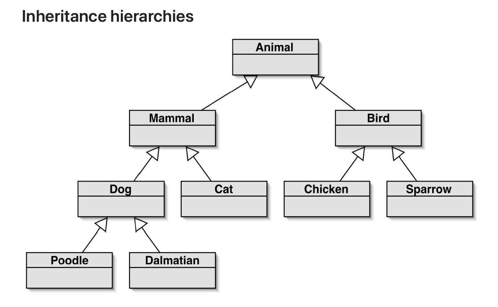
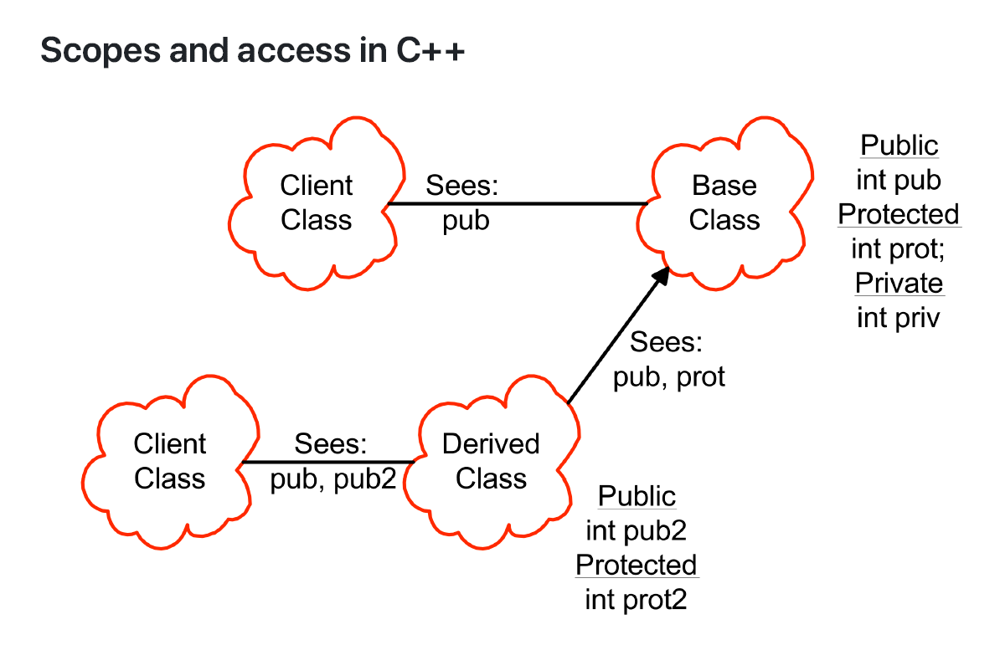

# Inheritance

**继承**(inheritance)：

- 使用现有的类并克隆一份，在克隆的基础上做一些添加和修改
- 这既是 C++ 中一种关键的语言实现技术，也是面向对象设计方法论中的一个重要组成部分，允许我们共享成员数据、成员函数和接口的设计
- 继承也是一种为某个类定义行为或实现，作为另一个类的超集（也就是现有类的扩展）的能力

使用继承：

- 定义一个超类(superclass)，用于定义共同属性
- 定义多个子类(subclasses)，用于继承超类的属性，并添加自己的属性

    

继承的好处：

- 避免代码重复
- 代码复用
- 更简单的维护
- 可扩展性

可以继承的内容有：

- **（私有）成员变量**
    - 派生类(derived class)（就是子类）的对象内部包含一个超类的对象，超类的所有成员变量都在其中
    - 但是派生类无法访问这些变量，必须通过超类的成员函数来访问
    - 如果派生类有一个与超类同名的变量，那么这个变量是独立的新变量，不会覆盖超类原有的变量
- **公有成员函数**：定义了类的接口
- **私有成员函数**：也无法被派生类访问
- **受保护的成员**：可以被派生类访问
- **静态成员**：它们仍然是类范围内的成员

???+ example "例子"

    

        
    

继承与构造函数：

- 构造函数通过类名提及基类(base class)（就是超类）
- 基类总是先被构建
- 如果没有显式向基类传参，那么会调用默认构造函数
- 析构函数按照调用构造函数时的倒序被调用

名称隐藏：

- 如果在派生类中重新定义了一个成员函数，那么其他所有在基类中重载的函数都无法被访问
- 之后会介绍关键字 `virtual`，它能够影响函数重载的行为

无法被继承的内容有：

- 构造函数
    - 如果没有显式定义构造函数，编译器会自动生成一个默认构造函数，该构造函数会逐个对成员变量进行初始化
    -  在显式定义的复制构造函数中，需要显式调用基类的复制构造函数；否则，默认构造函数会被调用
- 析构函数
- 赋值运算
    - 如果没有显式定义赋值运算符，编译器会自动生成一个默认的赋值运算符，该运算符会对成员变量进行逐个赋值
    - 在显式定义的赋值运算符中，需要显式调用基类的赋值运算符；否则，可能会导致资源管理问题
- 私有数据被隐藏起来，但仍然存在

访问保护：

- 成员
    - 公有：对所有用户都是可见的
    - 受保护：对派生类和友元而言是可见的
    - 私有：仅对自己和友元可见

- 继承：
    - 公有：`#!cpp class Derived : public Base ...`
    - 受保护：`#!cpp class Derived : protected Base ...`
    - 私有（默认）：`#!cpp class Derived : private Base ...`

继承对访问的影响：假设类 `B` 是类 `A` 的派生类，那么：

|继承类型|`public`|`protected`|`private`|
|:-|:-|:-|:-|
|`public A`|在 B 里是公有的|在 B 里是受保护的|被隐藏|
|`private A`|在 B 里是私有的|在 B 里是私有的|被隐藏|
|`protected A`|在 B 里是受保护的|在 B 里是受保护的|被隐藏|

何时“受保护”失效：

- 派生类的行为异常
- 对所有派生类而言，受保护的成员是公有的
- 因此，需要让成员函数是受保护的，而成员变量是私有的