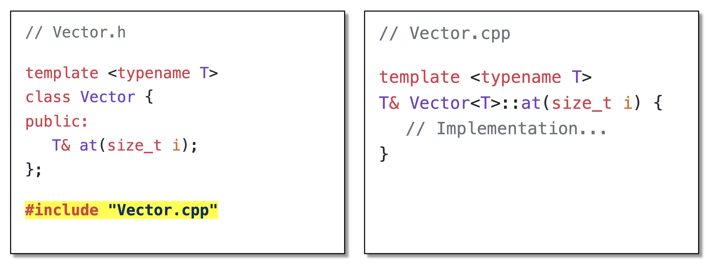

# Templates

>别看这里字数很多，其实有一大半内容都在讲 Advanced Topic...

??? question "为什么需要模板？"

    在软件开发中，我们常常会遇到这样的情景：要对不同类型的数据执行相同的一组操作。例如，你可能需要一个能存储整数的列表，也可能需要一个能存储字符串的列表，或者一个存储自定义对象的列表。这些列表的底层操作逻辑——如何添加元素、删除元素、查找元素——本质上是相同的。面对这种情况，我们有哪些选择呢？

    - 为每种类型复制粘贴代码？
        - 最直接的做法，还可以保证类型安全。但想象一下，如果之后要改列表的逻辑，我们就得同步修改所有副本，而这很容易出错且难以维护，并且代码冗余也会急剧增加。
    - 使用一个共同的基类（继承）？ 
        - 如果所有需要存储的对象都有一个共同的基类（比如 `Object`），那么我们可以创建一个能存储基类指针或引用的列表。这引入了继承的限制，但并不是所有类型都适合或愿意继承自同一个基类。此外，从列表中取出元素时，往往需要进行类型转换，增加了复杂性和潜在的运行时错误。
    - 使用 `#!cpp void*`（无类型指针）？ 
        - 这种方式可以存储任何类型的指针，但完全牺牲了类型安全。编译器无法检查存入和取出的类型是否匹配，很容易在运行时发生难以追踪的错误。

    不难看出，这些方案都各有弊端。我们需要的是这样的一种机制：允许我们仅编写一次代码，就能安全地应用于多种类型。这正是 C++ **模板**(template)发挥作用的地方。模板引入了**泛型编程**(generic programming) 的概念，让我们能够编写出独立于特定类型的、高度可复用的代码。

模板的核心价值可以概括为：

- **代码复用**：为多种数据类型编写通用的算法和数据结构，从而避免重复考虑每种类型不同的具体实现。
- **泛型编程**：创建不依赖于任何特定类型的组件。根据传递给模板的类型参数，在编译时确定它们的行为。
- **编译时多态**：与基于**虚函数**的**运行时多态**（在程序运行时解析调用）不同，**模板**在编译阶段就根据具体的类型参数生成特定的代码。这样通常能带来更高的性能，因为函数调用和类型信息在编译时就已经确定，从而减少运行时开销。

下面来认识一下模板的基本构成要素：

- **模板参数**：模板的灵活性来源于其参数。这些参数在模板定义时是未指定的占位符，在模板被使用（实例化）时才被赋予具体的值或类型。主要有以下几种模板参数：
    - **类型参数**(type parameters)：
        - 这是最常见的模板参数，它允许我们将一个类型作为参数传递给模板。
        - 声明时使用关键字 `#!cpp class` 或 `#!cpp typename`，例如 `#!cpp template <class T>` 或 `#!cpp template <typename Item>`。这两者在声明类型参数时几乎是**等价**的，但 `#!cpp typename` 在某些特定上下文中（例如，显式告诉编译器一个依赖于模板参数的名称是一个类型时）是必需的。
        - `T` 或 `Item` 在模板定义中就代表了一个待定的类型，在实例化时会被替换为像 `#!cpp int`、`#!cpp std::string` 或我们自定义的类这样的具体类型。
    - **非类型参数**(non-type parameters)：
        - 除了类型，模板还可以接受**编译时常量值**作为参数，这些值必须在编译期就能确定。
        - 它们可以是整型常量、枚举值、指向对象的指针或引用等。
        - 例如，`#!cpp template <class T, int BufferSize>` 定义了一个模板，它接受一个类型 `T` 和一个整数常量 `BufferSize`。这使得我们可以在编译时决定数组大小或缓冲区容量，例如 `#!cpp Array<int, 100>`。
    - **模板模板参数**(template template parameters)：
        - 这是一种更高级的参数类型，它允许我们将一个**模板**本身作为参数传递给另一个模板。
        - 当我们希望创建一个泛型组件，其内部结构或策略也由另一个泛型组件（模板）来决定时，这就非常有用。例如，一个泛型容器可以接受另一个模板（如 `#!cpp std::vector` 或 `#!cpp std::list` 的模板形式）作为参数，来决定其内部如何存储元素。

- **模板实例化**(template instantiation)：仅仅定义一个模板并不会产生任何可执行代码。模板只有在被实例化时，编译器才会根据提供的模板参数生成具体的类或函数代码。
    - 过程：在实例化时，编译器会将模板定义中的模板参数（如 `T`）替换为实际的类型（如 `#!cpp int`）或值。然后，它会像编译普通代码一样编译这份“填好空”的模板代码，进行语法和类型检查。
    - **隐式实例化**：最常见的实例化方式。当我们像使用普通函数或类那样使用一个模板，并提供了足够的信息让编译器推断出模板参数时，编译器会自动为我们实例化。
    - **显式实例化**：在某些情况下，即使代码中没有直接使用某个特定版本的模板，我们可能希望明确指示编译器实例化这样的模板。这在组织大型项目、分离编译或确保特定模板版本被编译时可能有用。

        ??? example "例子"

            ```cpp
            // 假设 MyList.h 中有 MyList 模板的声明和定义
            // 在某个 .cpp 文件中，我们可以显式实例化：
            template class MyList<double>; // 强制编译器生成 MyList<double> 类的完整代码
            template void print_array<char>(char*, int); // 强制生成 print_array<char> 函数的代码
            ```

- **模板特化**(template specialization)：有时对于某些特定类型，通用版本的模板可能效率不高，甚至行为不正确。这时就需要模板特化，它能让模板在保持通用性的同时，也能优雅地处理各种特殊情况，使得模板更加强大和实用。
    - 使用特化的具体原因：
        - 性能优化：通用算法对于特定类型可能有更高效的实现
        - 行为修正：通用版本的逻辑可能不适用于某些特殊类型
        - 利用类型特性：某些类型可能拥有通用模板无法预知的特性，特化版本可以利用这些特性。
    - **全特化**(full specialization)：
        - 当我们为模板的**所有参数都提供具体的类型或值**时，就构成了全特化。它为这个特定的参数组合提供了一个全新的实现，完全取代通用模板
        - 适用于**类模板**和**函数模板**

            ??? example "例子"

                ```cpp
                // 通用函数模板
                template <class T>
                const char* getTypeName(T value) {
                    return "Unknown type";
                }

                // 针对 bool 的全特化
                template <> // 空的尖括号表示这是一个全特化
                const char* getTypeName<bool>(bool value) { // <bool> 指明是为 bool 类型特化
                    return "boolean";
                }

                // 通用类模板
                template <class T> class Widget { /* 通用实现 */ };

                // 针对 void* 的类模板全特化
                template <> class Widget<void*> { /* 针对 void* 的特殊实现 */ };
                ```

    - **偏特化**(partial specialization)：
        - 仅适用于**类模板**（函数模板没有偏特化，但可以通过重载等技术达到类似效果）
        - 当类模板有多个参数时，我们可以只特化其中的一部分参数，或者对参数的某些特性（如指针类型、引用类型，或当多个类型参数相同时）进行特化，而保持其他参数仍然是泛型的

            ??? example "例子"

                ```cpp
                // 通用类模板，接受两个类型参数
                template <class T1, class T2> class DataProcessor { /* ... */ };

                // 偏特化: 当第二个类型参数是 int 时，第一个参数 T1 仍然是泛型的
                template <class T1> class DataProcessor<T1, int> { /* ... 针对 (T1, int) 的特殊实现 ... */ };

                // 偏特化: 当两个类型参数相同时，类型 T 仍然是泛型的
                template <class T> class DataProcessor<T, T> { /* ... 针对 (T, T) 的特殊实现 ... */ };

                // 偏特化: 针对 T1 是指针类型的情况，T2 仍然泛型
                template <class PointeeType, class T2> class DataProcessor<PointeeType*, T2> { /* ... 针对 (PointeeType*, T2) ... */ };
                ```

## Function Templates

函数模板使我们能够定义一个通用的函数“框架”，这个框架可以处理不同类型的数据，而无需为每种数据类型重写整个函数。

???+ example "经典的交换函数模板"

    ```cpp
    template <class T>
    void swap_values(T &a, T &b) {
        T temp = a;
        a = b;
        b = temp;
    }

    // 调用
    int x = 5, y = 10;
    swap_values(x, y);

    std::string s1 = "hello", s2 = "world";
    swap_values(s1, s2); 
    ```

!!! note "注"

    在模板参数推导时，通常要求类型**精确匹配**或能够明确推导。与普通函数不同，编译器一般**不会**为模板参数进行**隐式的类型转换**来尝试匹配。就上例来说，调用 `#!cpp swap_values(x, some_double_var)` 通常会导致编译错误，因为 `T` 无法同时被推导为 `#!cpp int` 和 `#!cpp double`。

---
大多数情况下，编译器都能成功推导出模板参数（类似 `#!cpp auto`），此时调用模板函数时就不用指出模板参数。但有时我们需要（或选择）显式地告诉编译器模板参数应该是什么，包括以下情况：

- 编译器无法推断：当模板参数没有出现在函数参数列表中，或者推断过程存在歧义时（比如我们想传入字符串，但编译器认为是字符指针，如果不显式指出的话可能会产生意料之外的后果）
    - 注：可以使用你的 IDE 查看编译器推导出来的类型，在编译前可以看看编译器是否和你想的一样

    ??? example "例子"

        ```cpp
        template <typename ReturnType> // ReturnType 无法从函数参数推断
        ReturnType create_default_value() {
            return ReturnType(); // 调用默认构造函数
        }
        int my_int = create_default_value<int>(); // 必须显式指定 ReturnType 为 int
        ```

- 覆盖推断结果（不常见）：有时我们可能希望用一个与推断结果不同的类型（只要是兼容的）来实例化模板
- 提高代码可读性：在某些复杂情况下，显式指定参数可以使代码意图更清晰

---
当一个函数调用可能匹配一个普通函数，也可能匹配一个或多个函数模板的实例化版本时，编译器需要一套规则来决定调用哪一个——这个过程称为**重载决议**(overload resolution)，其大致的解析顺序如下：

1. 寻找**精确匹配**的**普通函数**：首先，编译器会查找是否存在一个非模板函数，其参数类型与调用时提供的参数完全匹配，或者可以通过微小转换（如数组到指针，函数到函数指针）匹配。
2. 寻找**精确匹配**的**函数模板特化**：如果找不到精确匹配的普通函数，编译器会查找是否存在一个已经特化的函数模板版本，其实例化后的签名能精确匹配调用。
3. 尝试匹配**通用的函数模板**：接下来，编译器会尝试通过模板参数推导，看是否有通用的函数模板能够实例化出一个匹配的版本。
    - 如果多个函数模板都能匹配，编译器会尝试选择**“更特化” (more specialized)**的模板。确定哪个模板“更特化”本身有一套复杂的规则；如果无法明确哪个更特化，或者存在歧义，则会导致编译错误。
4. 考虑**普通函数的重载**：如果通过模板未能找到唯一最佳匹配，编译器会再次考虑普通函数，此时允许更广泛的类型转换（如标准转换、用户定义转换）来寻找匹配。


## Class Templates

与函数模板类似，类模板允许我们定义一个通用的类“框架”，这个框架可以用于创建操作不同数据类型的类。最典型的应用就是**容器类**(container classes)，如向量、列表、栈、队列等。这些容器的组织和操作数据的逻辑是相似的，而它们存储的数据类型则可以通过模板参数来指定。


### Member Functions

事实上，类模板的**成员函数**本身也是（隐式的）**函数模板**。它们的完整定义（包括函数体）只有在它们被实际调用或其地址被获取时，编译器才会为特定的类模板实例去实例化它们。

- 之所以这样做，是因为这可以节省编译时间和代码体积。如果一个成员函数从未被某个特定的类模板实例使用，那么编译器就不需要为该实例生成这个函数的代码。
- 这也意味着如果一个成员函数中包含一些不依赖于模板参数 `T` 的语法错误，这个错误可能直到该函数被某个实例调用时才会被编译器发现。而那些依赖于 `T` 的错误（例如，试图调用 `T` 类型不存在的成员函数）则会在实例化时被检查。
- 定义位置：由于实例化时需要完整的函数定义，所以类模板的成员函数定义通常也放在**头文件**中，与类模板的声明一起。如果将定义放在 .cpp 文件中，会导致链接问题（除非使用显式实例化，但这不常见且限制了通用性）。


### Parameters

类模板可以接受多个模板参数，可以是类型参数，也可以是非类型参数。

??? example "例子"

    ```cpp
    // 一个简单的哈希表模板，接受键类型、值类型，以及一个可选的哈希函数对象类型
    template <
        class Key,
        class Value,
        class HashFunction = std::hash<Key> // 默认模板参数
    >
    class HashTable {
    public:
        void insert(const Key& k, const Value& v) {
            HashFunction hasher;
            size_t hash_value = hasher(k);
            // ... 实际的插入逻辑 ...
        }
        bool find(const Key& k, Value& out_value) const {
            // ...
            return false;
        }
        // ...
    private:
        // ... 内部数据结构，例如链表数组或开放寻址表 ...
    };
    ```

#### Default Parameters

与函数参数可以有默认值一样，模板参数（包括类型参数和非类型参数）也可以有默认值，这样我们就不需要显式提供所有的模板参数了。

???+ example "例子"

    ```cpp
    template <class T = int, int DefaultSize = 100>
    class ArrayWrapper {
        T arr[DefaultSize];
    public:
        // ...
    };

    ArrayWrapper<> default_arr;        // 实例化为 ArrayWrapper<int, 100>
    ArrayWrapper<double> double_arr;   // 实例化为 ArrayWrapper<double, 100>
    ArrayWrapper<char, 256> char_arr;  // 实例化为 ArrayWrapper<char, 256>
    ```

#### Non-type Parameters

非类型模板参数（如数组大小）可以用于在编译时确定类的某些属性。

??? example "例子"

    ```cpp
    template <class T, int MaxSize>
    class FixedSizeBuffer {
        T data[MaxSize]; // MaxSize 在编译时确定
        int current_size;
    public:
        FixedSizeBuffer() : current_size(0) {}
        bool push(const T& item) {
            if (current_size < MaxSize) {
                data[current_size++] = item;
                return true;
            }
            return false;
        }
        // ...
    };

    // 模板实例化
    FixedSizeBuffer<char, 1024> network_packet_buffer;
    ```

在使用非类型参数前，我们先得考虑一下它的优缺点：

- 优点：
    - 性能：由于大小在编译时已知，编译器可能进行更积极的优化（比如循环展开等）。对象可以直接在栈上分配（如果大小合适的话），从而避免动态内存分配的开销。
    - 类型安全：对于上例而言，`#!cpp FixedSizeBuffer<char, 1024>` 和 `#!cpp FixedSizeBuffer<char, 512>` 是完全不同的类型，编译器可以区分它们。
- 缺点：
    - 灵活性降低：大小固定在编译时，不能在运行时改变。
    - 代码膨胀(code bloat)：对于上例而言，每种不同大小的 `FixedSizeBuffer`（例如，`MaxSize` 为 100、101、102...）都会生成一份独立的代码。如果有很多不同的大小，这可能导致最终可执行文件显著增大。
    - 使用复杂性：大小成为类型的一部分，这会让不同大小的缓冲区传递给同一个函数这件事变得困难（除非该函数本身也是模板化的，并接受大小作为模板参数）。

因此，是否使用非类型参数来嵌入像大小这样的属性，需要根据具体场景权衡其带来的性能/类型安全优势与灵活性/代码体积的代价。


#### Complex Parameters

模板可以自由组合和嵌套，就像普通类型一样。

- **模板嵌套**：一个模板的实例化结果本身可以作为另一个模板的参数。
    - 举例：`#!cpp Vector< Vector<int> >` 表示一个 `Vector`，其元素本身也是 `#!cpp Vector<int>`（即一个整数向量的向量，类似于二维数组）。
    - 注意语法：在 C++11 之前，`>>` 会被编译器解析为右移运算符，所以必须在两个 `>` 之间加一个空格，写成 `#!cpp Vector< Vector<int> >`。C++11 及更高版本通常能正确处理 `>>`，但添加空格仍然是一个良好的编码习惯，以保证兼容性和清晰性。
- 复杂的类型参数：模板参数本身也可以是非常复杂的类型，例如函数指针、指向成员的指针等。
    - 举例：`#!cpp Vector< int (*)(double, double) >` 定义了一个 `Vector`，它存储的是指向“接受两个 `#!cpp double` 参数并返回 `#!cpp int`”的函数的指针。


### Static Members

当一个类模板包含**静态数据成员**时，该类模板的每一个不同实例化版本都会拥有其自己的一份**独立**的静态数据成员**副本**。

???+ example "例子"

    ```cpp
    template <class T>
    class ObjectTracer {
    public:
        static int objects_created_count;
        ObjectTracer() {
            objects_created_count++;
        }
    };

    // 静态数据成员的定义 (通常也放在头文件中，因为它依赖于模板参数 T)
    template <class T>
    int ObjectTracer<T>::objects_created_count = 0; // 初始化为0

    void static_member_example() {
        ObjectTracer<int> int_obj1;
        ObjectTracer<int> int_obj2;
        // ObjectTracer<int>::objects_created_count 现在是 2

        ObjectTracer<double> double_obj1;
        // ObjectTracer<double>::objects_created_count 现在是 1

        std::cout << "Int objects created: " << ObjectTracer<int>::objects_created_count << std::endl;
        std::cout << "Double objects created: " << ObjectTracer<double>::objects_created_count << std::endl;
    }
    ```

    在这个例子中，`#!cpp ObjectTracer<int>::objects_created_count` 和 `#!cpp ObjectTracer<double>::objects_created_count` 是两个完全不同的静态变量，它们分别追踪 `#!cpp int` 版本和 `#!cpp double` 版本 `ObjectTracer` 对象的创建数量。


### Friends

在类模板中声明**友元**关系比在普通类中要复杂一些，因为我们需要考虑友元本身是否也是模板，以及友元关系是针对模板的特定实例还是所有实例。

- **非模板**的友元函数或友元类：一个普通的（非模板的）函数或类可以被声明为某个类模板（或其所有实例）的友元。

    ??? example "例子"

        ```cpp
        // 普通函数
        void inspect_internals(const MyTemplatedClass<int>& obj); // 假设只为 int 版本

        template <typename T>
        class MyTemplatedClass {
            T data;
            // 声明一个普通函数为 MyTemplatedClass<T> (所有实例) 的友元
            // 注意：这个友元函数的签名必须与外部定义匹配
            friend void global_helper_func(MyTemplatedClass<T>& mtc) {
                // 可以访问 mtc.data
            }
            // 或者如果 global_helper_func 是一个已经存在的非模板函数
            // friend void another_global_func(const MyTemplatedClass<T>&);

            // 声明一个普通类为所有实例的友元
            friend class Inspector;
        };

        class Inspector {
        public:
            template <typename T>
            void examine(const MyTemplatedClass<T>& obj) {
                // 可以访问 obj.data
            }
        };
        ```

- **模板**作为友元
    - **约束的**友元(constrained friend)：让一个函数模板或类模板的**特定实例**成为当前类模板实例的友元。这通常需要友元模板和当前类模板**使用相同的模板参数**。

        ??? example "例子"

            ```cpp
            template <typename T> class Pal; // 前向声明 Pal 模板

            template <typename T>
            class MyClass {
                T secret;
            public:
                MyClass(T s) : secret(s) {}
                // Pal<T> 是 MyClass<T> 的友元
                // 例如，Pal<int> 是 MyClass<int> 的友元，但不是 MyClass<double> 的友元
                friend class Pal<T>;
            };

            template <typename T>
            class Pal {
            public:
                void access_secret(const MyClass<T>& mc) {
                    std::cout << "Pal accessing secret: " << mc.secret << std::endl;
                }
            };

            // 模板实例化
            Pal<int> p_int; 
            MyClass<int> mc_int(42); 
            p_int.access_secret(mc_int);
            ```

    - **非约束的**友元(unconstrained friend)：让一个函数模板或类模板的**所有实例**都成为当前类模板某个实例（或所有实例）的友元。

        ??? example "例子"

            ```cpp
            template <typename T>
            class DataStore {
                T item;
                // 让 UniversalLogger 模板的所有实例都能访问 DataStore<T> 的私有成员
                template <typename LogType> // 注意这里的模板参数与 DataStore 的 T 无关
                friend class UniversalLogger;

                // 让所有 operator<< 的模板实例成为友元（用于流输出）
                template <typename CharT, typename Traits, typename DataT>
                friend std::basic_ostream<CharT, Traits>& operator<<(std::basic_ostream<CharT, Traits>& os, const DataStore<DataT>& ds);
            };

            template <typename LogType>
            class UniversalLogger { /* ... */ };

            template <typename CharT, typename Traits, typename DataT>
            std::basic_ostream<CharT, Traits>& operator<<(std::basic_ostream<CharT, Traits>& os, const DataStore<DataT>& ds) {
                os << ds.item; // 假设 item 可以被流输出
                return os;
            }
            ```

    - 在类模板内部直接定义友元函数模板是一种常见的做法，特别是对于操作符重载。

友元声明的语法，尤其是当友元本身也是模板时，可能比较复杂，需要仔细匹配模板参数和作用域。


## Templates and Inheritance

模板和继承是 C++ 中两种强大的代码复用机制，它们可以以多种方式结合，构建出灵活且层次分明的泛型代码结构。具有有以下几类结合方式：

- **模板类继承自非模板类**：为一组相关的泛型类提供一个共同的非泛型基接口或共享一些非泛型的功能

    ??? example "例子"

        ```cpp
        class Identifiable { // 非模板基类
            static int next_id;
        protected:
            int id;
        public:
            Identifiable() : id(next_id++) {}
            int get_id() const { return id; }
        };
        int Identifiable::next_id = 0;

        template <class AssetType>
        class ManagedAsset : public Identifiable { // 模板类继承非模板类
            AssetType asset_data;
        public:
            ManagedAsset(AssetType data) : asset_data(data) {}
            AssetType get_asset() const { return asset_data; }
            // ManagedAsset 实例也会有 id 和 get_id() 方法
        };

        // 模板实例化
        ManagedAsset<std::string> text_asset("important_document.txt");
        int id = text_asset.get_id();
        ```

- **模板类继承自类模板**：在已有的泛型类基础上，通过继承来扩展或特化其功能，同时保持泛型特性

    ??? example "例子"

        ```cpp
        template <class Item>
        class BaseCollection { // 泛型基类
        protected:
            std::vector<Item> items;
        public:
            void add(const Item& item) { items.push_back(item); }
            size_t count() const { return items.size(); }
        };

        // 派生模板类，继承自基类模板的实例
        // 通常，派生模板会使用相同的模板参数传递给基类模板
        template <class Item>
        class SortedCollection : public BaseCollection<Item> { // 继承自 BaseCollection<Item>
        public:
            // 重写 add 方法以保持有序
            void add(const Item& item) {
                BaseCollection<Item>::add(item); // 调用基类的 add
                std::sort(this->items.begin(), this->items.end());
            }
        };

        // 模板实例化
        SortedCollection<int> sorted_numbers;
        sorted_numbers.add(5); sorted_numbers.add(1); sorted_numbers.add(3);
        // 此时 sorted_numbers.items 应该是 {1, 3, 5}
        ```

- **非模板类继承自类模板的特定实例**：当我们需要一个特定类型的、基于某个泛型框架的类时，可以这样做；这相当于用一个具体的类型“固化”了泛型基类

    ??? example "例子"

        ```cpp
        template <class T>
        class GenericMessageHandler {
        public:
            virtual void process_message(const T& message) {
                std::cout << "Generic handler processing: " << message << std::endl;
            }
        };

        struct EmailMessage { std::string from, to, body; };
        // 重载流操作符以便打印
        std::ostream& operator<<(std::ostream& os, const EmailMessage& msg) {
            return os << "Email from " << msg.from;
        }


        // EmailHandler 是一个具体的类，它特化了 GenericMessageHandler 来处理 EmailMessage
        class EmailHandler : public GenericMessageHandler<EmailMessage> {
        public:
            void process_message(const EmailMessage& message) override { // 重写基类方法
                std::cout << "Email specific handler: Routing email from "
                        << message.from << " to " << message.to << std::endl;
                // ... email 处理逻辑 ...
            }
        };

        EmailHandler email_processor;
        EmailMessage email = {"sender@example.com", "receiver@example.com", "Hello!"};
        email_processor.process_message(email);
        ```


## Guidelines

虽然模板非常强大，但在使用过程中也有一些需要注意的方面，理解这些有助于我们更有效地利用模板，并避免一些常见的陷阱。

!!! note "模板的**声明**和**定义**都放在**头文件**里"

    当编译器需要实例化一个模板时，它必须能够看到模板的完整定义，而不仅仅是声明。这意味着与普通函数和类（通常声明在头文件 .h/.hpp，定义在源文件 .cpp）不同，模板的声明和定义（包括成员函数的实现）通常都放在头文件中。
    
    这是因为：如果模板的定义放在一个 .cpp 文件中，而我们在另一个 .cpp 文件中尝试使用这个模板，编译器在第二个文件中只看到了声明，找不到定义，于是它无法完成实例化。链接器在链接各个编译单元时，会发现找不到所需的模板实例的定义，从而导致**链接错误**。

    <!-- 如果你还是想将定义放在 .cpp 文件里，那么要在对应 .h 文件末尾 `#!cpp include` 这个 .cpp 文件；另外 .cpp 文件中的定义需要包含**完整的类型名**，比如模板 `Vector` 对应的类型名应形如 `Vector<T>`。这样也能通过编译。

    <div style="text-align: center">
        
    </div> -->

    >C++ 标准曾试图通过 `#!cpp export` 关键字来支持将模板声明和定义分离到不同文件，但由于实现复杂且编译器支持不佳，该关键字的原始功能已在 C++11 中被正式移除。

!!! info "两阶段名称查找"

    C++ 编译器在处理模板时，通常会进行两阶段名称查找：

    - 第一阶段（模板定义时）：编译器检查那些不依赖于模板参数的名称（例如，全局函数名、模板外部定义的类型名）。这些名称的有效性在模板被定义时就可以确定。
    - 第二阶段（模板实例化时）：编译器检查那些依赖于模板参数的名称（例如，`T::member_type`，或者调用一个参数类型为 `T` 的函数）。这些名称的有效性只有在 `T` 被替换为具体类型后才能确定。

    这带来的影响有：

    - 在模板定义时，如果一个依赖名称（如 `T::some_type`） 实际上是一个类型，但编译器无法在第一阶段确定，那么可能需要使用 `#!cpp typename` 关键字来显式告知编译器：`#!cpp typename T::some_type`。
    - 访问依赖基类的成员时，可能需要用 `#!cpp this->member` 或 `#!cpp Base<T>::member` 来访问。
    - 这使得模板的错误检查被分散到两个阶段，有些错误在定义时就能发现，有些则要等到实例化时。

!!! bug "代码膨胀(code bloat)"

    由于模板会为每个使用的不同模板参数组合生成一份独立的代码，如果模板被大量不同类型实例化，可能会导致最终生成的可执行文件体积显著增大。这就是所谓的“代码膨胀”。可通过以下方法缓解代码膨胀的问题：

    - **将非依赖部分提取出来**：如果模板代码中有一部分逻辑不依赖于模板参数，可以考虑将其提取到非模板的基类或非模板的辅助函数中。这样，这份通用代码就只有一份，模板实例化的部分只包含依赖于参数的逻辑。
    - **明智地使用非类型模板参数**：避免仅仅因为非类型参数的微小变化就产生大量不同的模板实例。如果可能，考虑使用运行时参数或动态分配。
    - **显式实例化**（对于库开发者）：库的开发者可以通过显式实例化来精确控制哪些模板版本被编译到库中，从而避免为所有可能的类型都生成代码。
    - **链接器优化**：现代链接器通常具备合并相同代码段或进行其他“智能”优化的能力，可以在一定程度上缓解代码膨胀。

---
直接上手编写复杂的模板可能会令人望而生畏——遵循以下结构化的方法可以帮助我们设计出良好的模板：

1. 先用具体类型把功能做出来
    - 在不考虑泛型复杂性的情况下，首先专注于实现核心算法和逻辑。选择一个代表性的具体类型，这样可以确保基本思路是正确的，并且更容易调试。
    - 最终得到一个能工作的、针对特定类型的函数或类。

2. 为具体版本编写充分的测试
    - 一套好的测试用例是代码质量的保证。对于具体版本，我们可以更容易地思考各种边界情况和预期行为。这些测试用例将来可以直接用于验证模板版本的正确性。
    - 最终得到覆盖各种场景的单元测试。

3. （如果需要）优化具体版本的性能
4. 审视代码，找出需要“参数化”的部分，这时我们需要思考：
    - 哪些数据类型是可变的？这些将成为类型模板参数 `T`。
    - 代码中是否使用了某些常量值，如果这些值也应该是可配置的，它们可以成为非类型模板参数。
    - 代码中的操作是否依赖于参数类型的某些特定行为？例如，算法是否需要比较类型 `T` 的对象 (`#!cpp operator<`)？是否需要拷贝它们（拷贝构造函数、拷贝赋值运算符）？是否需要默认构造它们？这些是泛型代码对模板参数的隐式或显式约束。
5. 将具体版本转换为模板，具体操作为：
    - 在函数或类定义前加上 `#!cpp template <...>` 声明。
    - 将代码中原先使用的具体类型替换为模板参数 `T`。
    - 确保所有依赖于模板参数的操作仍然有效。例如，如果 `T` 是一个类类型，`#!cpp T obj; T temp = obj;` 依赖于 `T` 的默认构造和拷贝构造。
    - 最终得到模板化的函数或类。
6. 用之前的测试用例检验模板版本
    - 模板版本应该能够通过所有为具体版本编写的测试（只需要将测试中的具体类型替换为模板实例化后的类型）。
    - 扩展测试：此外，还需要为模板添加新的测试用例，使用不同的、有代表性的类型来实例化模板，以确保其泛型行为的正确性。例如，测试内置类型、类类型、指针类型、包含 `#!cpp const` 的类型等。特别注意那些可能触发不同代码路径或约束的类型。
    - 最终得到一个经过充分测试的、健壮的模板。

遵循这个流程，可以使我们的模板开发过程更有条理，降低复杂性，并提高最终代码的质量和可靠性。


## Advanced Topics

!!! warning "注意"

    这部分内容不在 OOP 考试考察范围内（因为太新了），但我觉得挺有意思的，还是有必要认识一下。

### Constraints and Concepts

C++20 标准引入的一项新特性：**概念**(`#!cpp concept`)，旨在让模板的使用更安全、更清晰、也更容易被理解。

??? question "C++ 模板原有的一些痛点"

    - **天书般的错误信息**：当尝试用一个不满足模板内部隐式要求的类型来实例化模板时，编译器常常会报出一长串深入模板内部的、难以理解的错误信息，这加大了我们定位问题根源的难度。
    - **约束只能靠文档**：模板对其参数类型的要求通常只能写在文档注释里，编译器本身无法强制检查这些约束，直到实例化失败。
    - 复杂的 [SFINAE](https://en.cppreference.com/w/cpp/language/sfinae) 和 `#!cpp std::enable_if`：为了在编译时检查类型属性并有条件地启用或禁用模板，开发者不得不依赖 SFINAE 技术和像 `#!cpp std::enable_if` 这样的工具。这些技术虽然有效，但语法复杂，代码可读性差，且容易出错。

    而 `#!cpp concept` 能够解决上述痛点。

`#!cpp concept` 是一种**具名的编译时谓词**，用于约束模板参数。简单来说，一个 `#!cpp concept` 就是一个在编译时用于评估的“条件”，定义了一组对模板参数（通常是类型参数）的要求。如果一个类型满足了某个 `#!cpp concept` 所规定的所有要求，那么这个类型就满足了该 `#!cpp concept`。

- **具名**(named)：我们可以给 `#!cpp concept` 起一个有意义的名字，例如 `Sortable`、`Integral`、`Printable`
- **编译时评估**(compile-time evaluated)：`#!cpp concept` 的检查完全在编译期间进行，不产生任何运行时开销
- **谓词**(predicate)：它返回一个**布尔值**——要么符合 `#!cpp concept`（`#!cpp true`），要么不符合（`#!cpp false`）
- **约束模板参数**(constrain template parameters)：`#!cpp concept` 的主要用途是替代传统的 `#!cpp typename` 或 `#!cpp class` 关键字，或者与它们一起使用，来明确指定模板参数必须满足哪些条件

---
定义概念要用到 `#!cpp concept` 关键字和一个 `#!cpp requires` 表达式；其中 `#!cpp requires` 表达式是 `#!cpp concept` 的核心，它列出了对类型的具体要求。

???+ example "例子"

    ```cpp
    #include <concepts> // 注意要包含这个头文件！
    #include <iostream>
    #include <vector>
    #include <string>

    // 示例1: 定义一个简单的 Concept 'Hashable'
    // 要求类型 T 的对象可以被 std::hash<T> 处理，并且结果可以转换为 size_t
    template <typename T>
    concept Hashable = requires(T a) { // "requires(T a)" 引入一个 requires 表达式，a 是一个该类型的示例对象
        { std::hash<T>{}(a) } -> std::convertible_to<std::size_t>; // 复合要求
        //  ^^^^^^^^^^^^^^^^^   这个表达式必须有效
        //                      ^^^^^^^^^^^^^^^^^^^^^^^^^^^^^^^ 并且其结果类型必须能转换为 std::size_t
    };

    // 示例2: 定义 Concept 'Incrementable'
    // 要求类型 T 的对象可以进行前置自增 (++a) 和后置自增 (a++)，
    // 并且结果类型与 T 相同 (或能赋值回 T)
    template <typename T>
    concept Incrementable = requires(T a) {
        { ++a } -> std::same_as<T&>; // 前置自增，结果是 T&
        { a++ } -> std::same_as<T>;  // 后置自增，结果是 T（C++标准中后置自增返回右值副本）
                                    // 或者更宽松地写： { a++ } -> std::convertible_to<T>;
    };

    // 示例3: 定义 Concept 'OutputStreamable'
    // 要求类型 T 的对象可以被输出到 std::ostream
    template <typename T>
    concept OutputStreamable = requires(std::ostream& os, T val) {
        { os << val }; // 简单要求：这个表达式必须有效即可
    };
    ```

`#!cpp requires` 表达式的几种形式：

- **简单要求**(simple requirements)：仅仅检查某个表达式是否有效（即能否通过编译），不关心其结果类型或是否抛出异常。
    - 例如：`#!cpp requires(T a, T b) { a + b; };` 检查 `a + b` 是否是有效表达式。
- **类型要求**(type requirements)：使用 `#!cpp typename` 关键字来检查一个嵌套类型名是否存在且有效。
    - 例如：`#!cpp requires { typename T::value_type; };` 检查 `T` 是否有一个名为 `value_type` 的嵌套类型。
- **复合要求**(compound requirements)：检查表达式的有效性，并且可以对其结果类型和 `#!cpp noexcept` 属性进行约束。
    - 语法：`#!cpp { expression } noexcept(optional) -> ConceptOrTypeConstraint;`
        - `expression`: 要检查的表达式
        - `#!cpp noexcept`（可选）：如果出现，则要求 `expression` 必须是 `#!cpp noexcept` 的
        - `#!cpp -> ConceptOrTypeConstraint`（可选）：要求 `expression` 的结果类型必须满足指定的类型约束或另一个 `#!cpp concept`
    - 例如：`#!cpp { t.to_string() } -> std::convertible_to<std::string>;` 要求 `#!cpp t.to_string()` 有效，且其结果能转换为 `#!cpp std::string`
- **嵌套要求**(nested requirements)：一个 `#!cpp requires` 表达式内部，使用 `#!cpp requires` 关键字来引入对其他 `#!cpp concept` 的检查。

---
一旦定义了 `#!cpp concept`，就可以用它来约束模板参数。有几种语法形式：

- 直接替换 `#!cpp typename` / `#!cpp class`（推荐）：

    ```cpp
    template <Incrementable T> // T 必须满足 Incrementable 概念
    T add_one_and_increment(T val) {
        val++;
        return val;
    }
    ```

- `#!cpp requires` 子句：

    ```cpp
    template <typename T>
    requires Incrementable<T> // T 必须满足 Incrementable<T>
    T add_one_and_increment_v2(T val) {
        val++;
        return val;
    }
    ```

    或者用在函数声明的末尾（对于函数模板）：

    ```cpp
    template <typename T>
    T add_one_and_increment_v3(T val) requires Incrementable<T> {
        val++;
        return val;
    }
    ```

- 约束的 `#!cpp auto`：对于函数模板，如果参数类型和/或返回类型被 `#!cpp auto` 推导，可以直接用 `#!cpp concept` 来约束 `#!cpp auto`

    ```cpp
    Incrementable auto add_one_and_increment_v4(Incrementable auto val) {
        val++;
        return val;
    }
    ```

    更准确地说，`#!cpp ConceptName auto` 声明了一个**匿名的模板参数**，该参数受 ConceptName 约束。


!!! note "使用 concept 的好处"

    - **极大改善编译错误信息**：这是最显著的优点。当传递给模板的类型不满足 `#!cpp concept` 约束时，编译器会直接指出哪个 `#!cpp concept` 未被满足，以及（通常）哪个具体的要求导致了失败。错误信息变得简洁、准确，直指问题核心，而不是深入到模板内部实现细节中去。
    - **增强代码可读性和自文档性**：`#!cpp concept` 为模板接口提供了清晰的语义，做到“代码即文档”。
        - 举例：`#!cpp template <SortableRange R>` 比 `#!cpp template <typename R>` 能更清晰地表达对参数 `R` 的期望。
    - **更安全的泛型编程**：`#!cpp concept` 在编译时就对模板参数进行了检查，防止了不合适的类型被用于实例化模板，从而避免了许多难以调试的运行时行为或后期编译错误。
    - **改进的重载决议**：`#!cpp concept` 可以参与函数模板的重载决议。编译器会优先选择约束“更严格”或“更具体”的 `#!cpp concept` 的模板。这使得基于类型属性进行更细致的重载成为可能，而无需复杂的 SFINAE 技巧。

        ??? example "例子"

            ```cpp
            template <typename T>
            void process(T val) { std::cout << "Generic process\n"; }

            template <std::integral T> // std::integral 是标准库概念
            void process(T val) { std::cout << "Integral process\n"; }

            process(10.5); // 调用第一个 (Generic process)，因为 double 不是 integral
            process(10);   // 调用第二个 (Integral process)，因为它更特化
            ```

---
C++20 标准库在 `#!cpp <concepts>` 头文件中提供了大量预定义的 `#!cpp concept`，涵盖了核心语言关系、比较、对象生命周期、可调用性、算术类型等多个方面，比如：

- `#!cpp std::same_as<T, U>`：类型 `T` 和 `U` 是否相同
- `#!cpp std::derived_from<Derived, Base>`：`Derived` 是否继承自 `Base`
- `#!cpp std::convertible_to<From, To>`：`From` 类型是否能转换为 `To` 类型
- `#!cpp std::integral<T>`：`T` 是否为整数类型
- `#!cpp std::floating_point<T>`：`T` 是否为浮点类型
- `#!cpp std::signed_integral<T>`：`T` 是否为有符号整数类型
- `#!cpp std::unsigned_integral<T>`：`T` 是否为无符号整数类型
- `#!cpp std::default_initializable<T>`：`T` 是否可以默认构造
- `#!cpp std::movable<T>`：`T` 是否可移动
- `#!cpp std::copyable<T>`：`T` 是否可拷贝
- `#!cpp std::equality_comparable<T>`：`T` 是否支持 `==` 和 `!=`
- `#!cpp std::totally_ordered<T>`：`T` 是否支持所有比较运算符（`<`, `>`, `<=`, `>=`）
- `#!cpp std::invocable<F, Args...>`：函数对象 `F` 是否可以用参数 `Args...` 调用
- `#!cpp std::regular<T>`：`T` 是否是“正则”类型（可默认构造、可拷贝、可移动、可比较相等）
- 迭代器相关的 `#!cpp concept`（如 `#!cpp std::input_iterator`, `#!cpp std::forward_iterator`, `#!cpp std::random_access_iterator`）
- 范围相关的 `#!cpp concept`（如 `#!cpp std::ranges::range`, `#!cpp std::ranges::sortable`）

使用这些标准库 `#!cpp concept` 可以大大简化自定义模板的约束编写，并提高代码的标准化程度。


### Variadic Templates

C++11 引入的一项非常强大的特性：**可变（参数）模板**(variadic templates)。这项特性能让我们创建可以接受任意数量、任意类型模板参数的函数和类，这极大地增强了 C++ 模板的灵活性。

??? question "模板原有的痛点"

    在 C++11 之前，如果想编写一个像 `#!cpp printf` 那样可以接受不同数量和类型参数的函数，或者像 `#!cpp std::tuple` 那样可以存储不同类型元素的类，通常很难实现。开发者可能需要依赖大量的宏、为不同参数数量编写多个重载版本，或者使用不那么类型安全的 C 风格可变参数（`...` 和 `<cstdarg>`）。

    可变参数模板提供了一种类型安全且优雅的方式来解决这些问题。

**可变参数模板**是指那些可以接受可变数量模板参数的模板，包括函数模板和类模板。

- 这里的“可变数量”可以是零个、一个或多个
- 这些参数可以是类型参数、非类型参数，以及模板模板参数

理解可变参数模板的关键在于两个新的概念和 `...` 运算符的用法：

- **模板参数包**(template parameter pack)：在模板参数列表中，使用 `#!cpp typename... Args`（或 `#!cpp class... Args`）来声明一个模板参数包。这里的 `Args` 不是一个单一的类型，而是一个代表零个或多个类型参数的“包”。
- **函数参数包**(function parameter pack)：在函数参数列表中，如果一个参数的类型是由模板参数包推导的，那么这个函数参数本身也构成一个函数参数包。
    - 例如：`#!cpp template <typename... Args> void func(Args... args)`，这里的 `args` 就是一个函数参数包，它包含了与 `Args` 类型包中每个类型相对应的函数参数。
- **包展开**(pack expansion)：`...` 运算符用于“展开”参数包。当我们需要对包中的每一个元素执行某个操作时，就会用到包展开，这通常发生在将参数包传递给另一个函数、初始化列表、基类构造函数等场景。
    - 展开的模式是 `#!cpp pattern...`，其中 `pattern` 包含参数包的名称。


由于参数包中的参数数量和类型在编译时是可变的，我们不能像访问普通参数那样直接通过索引来访问它们。处理参数包通常有几种主要方法：

- **递归**(recursion)（C++11/14 的主要方式）：这是处理参数包最经典的方法。通过递归函数调用，每次处理包中的一个参数，直到包变为空。这通常需要一个处理包中第一个元素的递归步骤和一个处理空包的基本情况（递归终止条件）。

    ??? example "例子"

        使用递归打印所有参数：

        ```cpp
        #include <iostream>
        #include <string>

        // 基本情况：当没有参数时，什么也不做（递归终止）
        void print_all_recursive() {
            std::cout << std::endl;
        }

        // 递归步骤：打印第一个参数，然后对其余参数递归调用 print_all_recursive
        template <typename First, typename... Rest> // First 是第一个参数的类型，Rest 是剩余参数类型的包
        void print_all_recursive(const First& first, const Rest&... rest) { // first 是第一个参数，rest 是剩余参数的包
            std::cout << first;
            if constexpr (sizeof...(rest) > 0) { // C++17：if constexpr 避免空包时多余的逗号
                std::cout << ", ";
            }
            print_all_recursive(rest...); // 展开 rest 包，递归调用
        }

        int main() {
            print_all_recursive(1, "hello", 3.14, true); // 输出: 1, hello, 3.14, true
            print_all_recursive("Only one");             // 输出: Only one
            print_all_recursive();                       // 输出:（换行）
            return 0;
        }
        ```

        - `#!cpp sizeof...(Args)` 或 `#!cpp sizeof...(args)`：这个运算符在编译时返回参数包中元素的数量。
        - `#!cpp if constexpr (condition)` （C++17）：这是一个编译时 `if` 语句，它允许我们根据编译时条件包含或排除代码块。在上面的例子中，它被用来优雅地处理参数之间的逗号，避免在最后一个参数后打印逗号，或者在参数包为空时尝试打印逗号。

- **折叠表达式**(fold expressions)：C++17 引入了折叠表达式，这是一种非常简洁和强大的方式，它能对参数包中的所有元素应用一个二元运算符，大大简化了许多常见的参数包处理模式，尤其是那些涉及累积、连接或对所有元素执行相同操作的场景，从而避免了显式递归。折叠表达式有四种形式：
    - **一元右折叠**(unary right fold): `(pack op ...)` 展开为 `(E1 op (E2 op (E3 op ... EN)))`
    - **一元左折叠**(unary left fold): `(... op pack)` 展开为 `(((E1 op E2) op E3) ... op EN)`
    - **二元右折叠**(binary right fold): `(pack op ... op init)` 展开为 `(E1 op (E2 op (... op (EN op init))))`
    - **二元左折叠**(binary left fold): `(init op ... op pack)` 展开为 `(((init op E1) op E2) ... op EN)`

    ??? example "使用折叠表达式求和与打印"

        ```cpp
        #include <iostream>
        #include <string>

        // 使用折叠表达式求和（所有参数必须支持 operator+）
        template <typename... Args>
        auto sum_all(Args... args) {
            if constexpr (sizeof...(args) == 0) {
                return 0;
            } else {
                return (args + ...); // 一元右折叠 (也可以是左折叠，对于+通常结果一样)
                                    // 展开为 (arg1 + (arg2 + (arg3 + ...)))
            }
        }

        // 使用折叠表达式打印参数，用逗号分隔 (更复杂的打印，通常递归或初始化列表更好)
        // 简单地将所有参数打印出来：
        template <typename... Args>
        void print_simple_fold(Args... args) {
            // 这个 lambda 用于在打印每个元素前（除了第一个）加上逗号
            auto print_with_space = [](const auto& arg) {
                std::cout << arg << " ";
            };
            (print_with_space(args), ...); // 对每个参数调用 lambda，这是一个逗号操作符的折叠
                                        // (print_with_space(arg1), (print_with_space(arg2), ...))
                                        // 实际效果是依次调用
            std::cout << std::endl;
        }


        // 稍微改进的打印，用于演示如何将操作应用于每个元素
        template <typename... Args>
        void print_with_prefix(const std::string& prefix, Args... args) {
            // 如果只想打印一次前缀，然后打印所有参数：
            std::cout << prefix;
            // 使用 C++17 的初始化列表技巧或递归打印剩余参数会更适合这种特定格式
            // 这里演示一个技巧：使用逗号操作符和数组初始化来强制顺序执行
            // (这是一个常见的技巧，但折叠表达式本身不能直接很好地处理参数间的自定义分隔符)
            bool first = true;
            auto print_item = [&](const auto& item) {
                if (!first) {
                    std::cout << ", ";
                }
                std::cout << item;
                first = false;
            };
            (print_item(args), ...); // 将print_item应用于每个参数
            std::cout << std::endl;
        }


        int main() {
            std::cout << "Sum: " << sum_all(1, 2, 3, 4, 5) << std::endl; // 输出: Sum: 15
            std::cout << "Sum empty: " << sum_all() << std::endl;       // 输出: Sum empty: 0
            std::cout << "Sum mixed: " << sum_all(1, 2.5, 3) << std::endl; // 结果可能是 double

            print_simple_fold(10, "is greater than", 5.5); // 输出: 10 is greater than 5.5
            print_with_prefix("Items: ", "apple", "banana", "cherry"); // 输出: Items: apple, banana, cherry
            return 0;
        }
        ```


- **初始化列表**技巧：在 C++17 折叠表达式之前，一种常见的展开参数包的方法是利用初始化列表的求值顺序保证（从左到右）。

    ??? example "例子"

        ```cpp
        template <typename... Args>
        void print_using_init_list(Args... args) {
            // 创建一个 int 数组（或其他类型），其大小无关紧要，
            // 关键是初始化列表中的表达式会被依次求值。
            int dummy[] = {0, ((std::cout << args << " "), 0)...}; // 展开为 {0, (expr_for_arg1,0), (expr_for_arg2,0), ...}
                                                                // 逗号操作符确保 std::cout 先执行，然后取 0
                                                                // 第一个0是确保数组不为空（如果参数包为空）
            (void)dummy; // 避免未使用警告
            std::cout << std::endl;
        }

        print_using_init_list(100, "bottles", 0.5);
        ```

    但这种方法现在通常被折叠表达式或递归所取代，因为后者更清晰。


### Template Metaprogramming

**模板元编程**(template metaprogramming, TMP)是一种使用 C++ 模板来编写程序的技术，这些程序由编译器在编译时执行，其结果（例如计算出的值、生成的类型或选择的代码路径）会直接嵌入到最终的可执行文件中。它与我们通常编写的在运行时执行的 C++ 代码不同。模板元程序本身不是直接运行的，而是编译器在“翻译”你的 C++ 代码时，“运行”这些模板元程序。

模板元编程之所以能够工作，主要依赖于 C++ 模板系统的几个特性，这些特性使得模板系统本身构成了一种[**图灵完备的**](https://en.wikipedia.org/wiki/Turing_completeness)编程语言：

- **模板即“函数”**，类型/值为“参数/返回值”：
    - 类模板（尤其是其特化版本）可以被看作是编译时的“函数”
    - 这些“函数”接受类型或编译时常量值作为“参数”
    - 它们通过嵌套的 `#!cpp type` 别名（用于返回类型）或 `#!cpp static constexpr value` 成员（用于返回常量值）来“返回”结果

- 使用**递归**作为控制流：
    - 由于编译时没有循环语句（`#!cpp for`，`#!cpp while`），递归是实现重复计算或迭代的主要方式
    - 一个类模板的通用版本可能会实例化自身，但使用修改后的模板参数（例如 `N-1`），直到达到基本情况（通过模板特化定义）后递归才会终止
    - 编译器对模板实例化的最大深度有限制，这限制了递归的深度

- **模板特化**(specialization)作为条件逻辑（`#!cpp if` / `#!cpp else`）：
    - 全特化和偏特化充当了编译时的条件分支。编译器会根据模板参数选择最匹配的特化版本进行实例化，就像 if-else 结构
    - 例如，一个计算阶乘的模板可以有一个通用版本 `Factorial<N>` 和一个基本情况的特化版本 `Factorial`

- `#!cpp static_assert` 进行编译时断言：允许在编译时检查某些条件是否为真，如果不是，则产生编译错误并输出指定的信息；这是在 TMP 中进行错误检查和约束验证的重要工具

- **类型特性**(type traits)：
    - C++ 标准库提供的 `#!cpp <type_traits>` 头文件本身就是模板元编程的产物和重要工具
    - 它提供了一系列模板，用于在编译时查询类型的各种属性（例如，`#!cpp std::is_integral<T>::value` 判断 `T` 是否为整数类型，`#!cpp std::is_same<T, U>::value` 判断 `T` 和 `U` 是否为相同类型），这些特性可以作为 TMP “程序”的输入或判断条件

- `#!cpp constexpr` 函数和变量（C++11 及以后）：
    - 虽然不完全等同于传统的模板元编程，但 `#!cpp constexpr` 允许我们用更接近普通 C++ 函数的语法编写能在编译时执行的计算（主要针对值计算）
    - `#!cpp constexpr` 函数可以被模板元程序调用，或者在某些情况下直接替代复杂的模板元编程结构，使代码更易读

- `#!cpp if constexpr`（C++17）：这是一个编译时 `#!cpp if` 语句，允许在函数模板或类模板成员函数内部根据编译时条件包含或排除某段代码块，极大地简化了许多以前需要 SFINAE 或标签分发才能实现的条件编译逻辑

模板元编程能够做以下事情：

- 性能优化：如果某些计算的结果在编译时就可以确定，那么将这些计算从运行时移到编译时可以减少运行时的开销，使得程序运行更快
- 代码生成与自动化：TMP 可以用来自动生成重复性的、模式化的代码，例如根据一个类型列表自动生成一系列的包装函数，或者为一组枚举值生成对应的字符串转换函数等
    - **表达式模板**(expression templates)是一种高级 TMP 技术，常见于科学计算和线性代数库。它可以在编译时构建表达式树，然后为整个复杂表达式（如矩阵运算 `A = B*C + D*E`）生成高度优化的单一循环代码，避免了创建大量临时对象和多次遍历
- 增强的类型安全与静态断言：可以在编译时对类型属性、常量值、模板参数之间的关系等进行复杂的检查，如果违反了某些约束，就在编译阶段报错。这比运行时错误更容易发现和修复
- 库设计与抽象：许多现代 C++ 库（包括标准库本身）都广泛使用了模板元编程来提供高度泛化、类型安全且性能优异的组件

但模板元编程也有以下缺点：

- 复杂性和可读性差：TMP 代码的语法通常非常晦涩，与传统的命令式编程风格差异巨大，更像是函数式编程。这让 TMP 代码难以编写、阅读、理解和维护
- 编译时间长：编译器在编译期间需要执行这些模板元程序，进行大量的模板实例化和类型推导，这会显著增加编译时间，尤其是对于大型的、复杂的 TMP 项目
- 调试困难：不能像调试运行时代码那样用调试器单步跟踪模板元程序的“执行”；调试 TMP 通常依赖于分析编译器的错误信息或使用 `#!cpp static_assert`
- 编译器限制：编译器对于模板实例化的最大深度、允许的模板参数数量等都有一定的限制；过于复杂的 TMP 可能会触碰到这些限制
- 错误信息（历史问题）：在 C++20 `#!cpp concepts` 出现之前，复杂的 TMP 错误信息通常非常冗长和难以理解，因为错误可能发生在嵌套很深的模板实例化内部

正因为上述缺点，我们有时可以采用其他更方便且易于理解的技术，比如：

- `#!cpp constexpr`：**常量表达式**（C++11 引入），可以让表达式或函数在编译时被求值。它有以下几种用途：
    - `#!cpp constexpr` 变量：该变量隐含了 `#!cpp const` 属性，并且其变量值必须在编译时就能确定，所以必须通过常量表达式来初始化

        ???+ example "例子"

            ```cpp
            constexpr int max_size = 100;
            constexpr double pi = 3.14159;
            // int get_runtime_value();
            // constexpr int runtime_val = get_runtime_value(); // 错误！初始化必须是常量表达式
            ```

    - `#!cpp constexpr` 函数
        - 声明一个函数为 `#!cpp constexpr` 意味着如果给这个函数传递的参数都是常量表达式，那么对这个函数的调用本身也可以是一个常量表达式，即函数调用**可能**在编译时被求值
        - 注意这个“可能”：`#!cpp constexpr` 函数并**不强制**在编译时执行——如果参数是运行时值，那么 `#!cpp constexpr` 函数就像普通函数一样在运行时执行
        - `#!cpp constexpr` 函数有一些限制（尽管这些限制在后续标准中逐渐放宽）：
            - 早期版本中，函数体通常非常简单，主要包含一个 `#!cpp return` 语句
            - 后续版本允许更复杂的逻辑，包括局部变量、循环、条件语句等，只要这些操作在常量表达式的上下文中是允许的
            - 它们不能有副作用（如修改全局变量、进行 I/O 操作），除非这些副作用只影响在编译时求值过程中创建的对象

        ???+ example "例子"

            ```cpp
            constexpr int square(int x) {
                return x * x;
            }

            constexpr int factorial(int n) {
                if (n <= 1) {
                    return 1;
                }
                return n * factorial(n - 1);         // 递归在编译时是允许的
            }

            void usage() {
                constexpr int val1 = square(5);      // 编译时计算，val1 = 25
                int arr[factorial(4)];               // 编译时计算，数组大小为 24

                int runtime_arg = 10;
                int val2 = square(runtime_arg);      // 运行时计算，因为 runtime_arg 不是常量表达式
            }
            ```

    - `#!cpp constexpr` 构造函数：
        - 允许用户自定义类型的对象在编译时被创建和初始化，前提是构造函数的参数是常量表达式，并且构造函数体满足 `#!cpp constexpr` 函数的要求
        - 这使得自定义类型的对象可以作为 `#!cpp constexpr` 变量，或用于其他需要常量表达式的场景（如非类型模板参数）

        ???+ example "例子"

            ```cpp
            class Point {
            public:
                constexpr Point(double x_val, double y_val) : x(x_val), y(y_val) {}
                constexpr double get_x() const { return x; }
                constexpr double get_y() const { return y; }
            private:
                double x, y;
            };

            constexpr Point p1(1.0, 2.0);         // p1 是编译时常量
            constexpr double p1_x = p1.get_x();   // p1_x 也是编译时常量 (2.0)
            ```

    最后总结一下 `#!cpp constexpr` 的作用：
    
    - 提升性能：将计算从运行时提前到编译时
    - 编译时检查：允许在编译时验证某些属性
    - 作为元编程的工具：可以在模板元编程和类型特性中使用
    - 定义真正的编译时常量：比 `#!cpp const` 更强，`#!cpp const` 对象不一定是编译时常量（除非用常量表达式初始化）

- `#!cpp consteval`：**立即函数**(immediate functions)（C++20 引入）
    - `#!cpp consteval` 函数必须在编译时产生一个常量结果；对 `#!cp consteval` 函数的每次调用都必须产生一个编译时常量
    - 与 `#!cpp constexpr` 的关键区别：`#!cpp constexpr` 函数**可以**在编译时求值（如果参数是常量表达式），但也可以在运行时求值；而 `#!cpp consteval` 函数**只能**在编译时求值
    - 如果一个 consteval 函数的调用因为某些原因无法在编译时产生结果，那么代码将编译失败

    ???+ example "例子"

        ```cpp
        consteval int get_compile_time_value(int x) {
            return x * x + 5;
        }

        void usage_consteval() {
            constexpr int val1 = get_compile_time_value(10);  // OK，编译时计算，val1 = 105
            int arr[get_compile_time_value(5)];               // OK，数组大小在编译时确定

            // int runtime_arg = 20;
            // int val2 = get_compile_time_value(runtime_arg); // 编译错误！
                                                            // get_compile_time_value 必须在编译时求值，
                                                            // 但 runtime_arg 不是常量表达式。
        }
        ```

    一般来说，使用 `#!cpp consteval` 的主要目的为：

    - 强制编译时求值：确保某个函数调用总是在编译时发生，其结果总是一个编译时常量
    - 用于元编程和常量生成：特别适用于那些逻辑上只应在编译期运行的辅助函数，例如用于生成非类型模板参数、`#!cpp static_assert` 的条件等
    - 更强的语义保证：当我们看到一个 `#!cpp consteval` 函数，就知道它的调用结果必然是编译期可用的