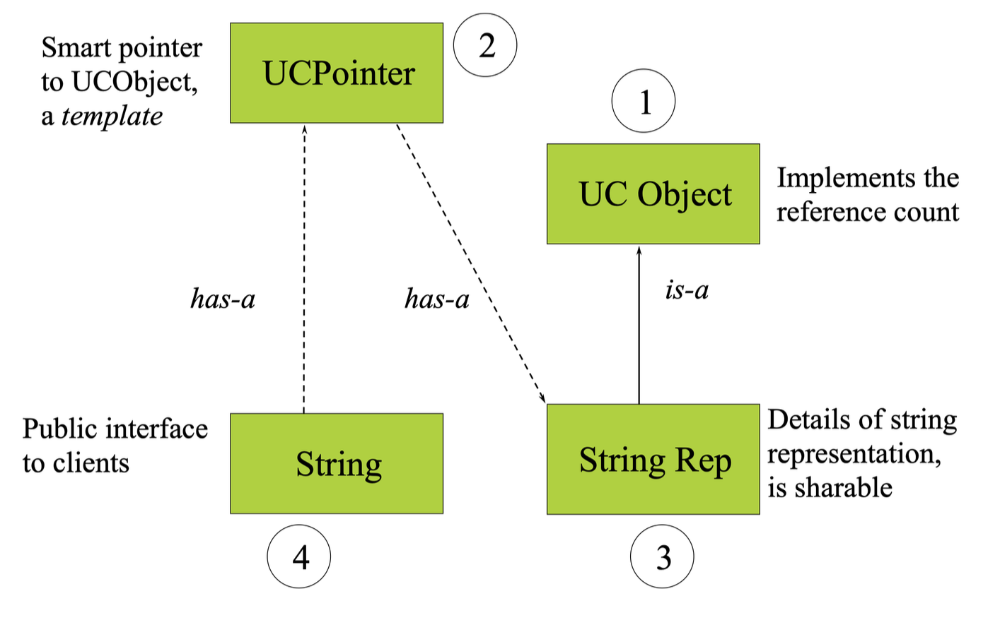

# Smart Pointers

目标：

- 引入用于维护引用计数的代码
    - 引用计数(reference count)记录了对象被共享的次数，初始值为0
    - 指针操纵必须维护这个计数
    - 对指针赋值时（`p = q`）会发生以下行为：

        ```cpp
        p->decrement(); // p's count will decrease
        p = q;
        q->increment(); // q/p's count will increase
        ```

- 类 `UCObject` ("Use-counted object")保存这个计数

    ```cpp
    #include <assert.h>
    class UCObject {
    public:
        UCObject() : m_refCount(0) { }
        virtual ~UCObject() { assert(m_refCount == 0);};
        UCObject(const UCObject&) : m_refCount(0) { }
        void incr() { m_refCount++; }
        void decr();
        int references() { return m_refCount; }
    private:
        int m_refCount;
    };

    inline void UCObject::decr() {
        m_refCount -= 1;
        if (m_refCount == 0) {
            delete this;
        }
    }
    ```

- `UCPointer` 是指向 `UCObject` 的一个智能指针
    - 智能指针是由类定义的对象
    - 使用一个模板来实现的
    - 重载 `operator ->` 和 单目运算符 `operate *`

    ```cpp
    template <class T>
    class UCPointer {
    private:
        T* m_pObj;
        void increment() { if (m_pObj) m_pObj->incr(); }
        void decrement() { if (m_pObj) m_pObj->decr(); }
    public:
        UCPointer(T* r = 0): m
        _pObj(r) { increment();}
        ~UCPointer() { decrement(); };
        UCPointer(const UCPointer<T> & p);
        UCPointer& operator=(const UCPointer<T> &);
        T* operator->() const;
        T& operator*() const { return *m_pObj; };
    };

    // copy constructor
    template <class T>
    UCPointer<T>::UCPointer(const UCPointer<T> & p){
        m_pObj = p.m_pObj;
        increment();
    }

    // assignment
    template <class T>
    UCPointer<T>& UCPointer<T>::operator=(const UCPointer<T>& p){
        if (m_pObj != p.m_pObj) {
            decrement();
            m_pObj = p.m_pObj;
            increment();
        }
        return *this;
    }

    // -> operator
    template<class T>
    T* UCPointer<T>::operator->() const {
        return m_pObj;
    }
    ```


整个过程涉及到以下几个类：

<div style="text-align: center">
    
</div>

- `String` 类：

    ```cpp
    class String {
    public:
        String(const char *);
        ~String();
        String(const String&);
        String& operator=(const String&);
        int operator==(const String&) const;
        String operator+(const String&) const;
        int length() const;
        operator const char*() const;
    private:
        UCPointer<StringRep> m_rep;
    };
    ```

- `StringRep` 类：只处理字符串存储和操纵

    ```cpp
    class StringRep : public UCObject {
    public:
        StringRep(const char *);
        ~StringRep();
        StringRep(const StringRep&);
        int length() const{ return strlen(m_pChars); }
        int equal(const StringRep&) const;
    private:
        char *m_pChars;
        // reference semantics -- no assignment op!
        void operator=(const StringRep&) { }
    };

    // Implementation
    StringRep::StringRep(const char *s) {
        if (s) {
            int len = strlen(s) + 1;
            m_pChars = new char[len];
            strcpy(m_pChars , s);
        } else {
            m_pChars = new char[1];
            *m_pChars = '\0';
        }
    }
    
    StringRep::~StringRep() {
        delete [] m_pChars ;
    }
    
    StringRep::StringRep(const StringRep& sr) {
        int len = sr.length();
        m_pChars = new char[len + 1];
        strcpy(m_pChars , sr.m_pChars );
    }

    int StringRep::equal(const StringRep& sp)
    const {
        return (strcmp(m_pChars, sp.m_pChars) == 0);
    }

    String::String(const char *s) : m_rep(0) {
        m_rep = new StringRep(s);
    }

    String::~String() {}
        // Again, note constructor for rep in list.
        String::String(const String& s) : m_rep(s.m_rep) { }
        String& String::operator=(const String& s) {
        m_rep = s.m_rep; // let smart pointer do work!
        return *this;
    }

    String::String(const char *s) : m_rep(0) {
        m_rep = new StringRep(s);
    }

    String::~String() {}
    // Again, note constructor for rep in list.
    String::String(const String& s) : m_rep(s.m_rep) { }
    String& String::operator=(const String& s) {
        m_rep = s.m_rep; // let smart pointer do work!
        return *this;
    }
    ```

其他智能指针：

- 栈上原始指针的标准库持有者
- 在销毁时释放资源（最新）

    ```cpp
    template <class X> std::auto_ptr {
    public:
        explicit auto_ptr(X* = 0) throw();
        auto_ptr(auto_ptr&) throw();
        auto_ptr& operator=(auto_ptr&) throw();
        ~auto_ptr();
        X& operator*() const throw();
        X* operator->() const throw();
        ...
    };
    ```
