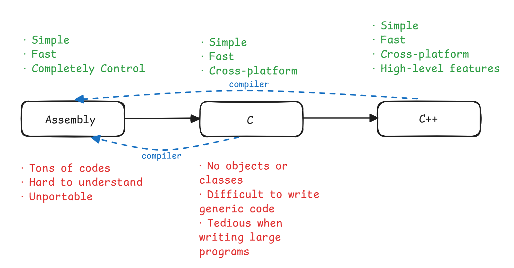

# 01 C++ 基础

## 历史

下面用一张图简单介绍一下：

<div style="text-align: center; margin-top: 0px;">

</div>

## C++ 设计哲学

- 只增加用于解决实际问题的特性
- 程序员可根据需求选择他们自己的方式
- 关键：**分划（Compartmentalization）**
- 允许程序员完全控制（当他们想要时）——程序员最清楚该怎么做
- 万不得已不牺牲性能
- 在编译期间尽可能地确保安全——但仅提供必要的检查

因此 C++ 具有较高的运行效率，但是 C++ 强大的能力意味着我们程序员需要担起更大的责任，需要对写的每一行代码负责，比如 C++ 不会检查索引越界的情况，由此引发的错误需要自行承担。

## C++ 基础

!!! card ""

    <div align="center">C++ = 基本语法 + STL（Standard Template Library，标准模板库）</div>

- **基本语法**
    - 语句以分号`;`结尾
    - 基本类型：`int`、`double`...
    - 基本语法规则

这是一个最基本的 C++ 程序：

``` cpp
#include <iostream>

int main()
{
    std:out << "Hello, world!" << std:endl;
    return 0;
}
```

- **STL**
    - 许多的通用函数，以及一些算法、容器、迭代器等（有些被称为“类（class）”）
    - 内部类，比如`map`（映射）、`set`（集合）、`vector`（向量）
    - 通过名称空间（namespace）`std::` 访问
    - 功能强大、维护完善

???+ note "名称空间"

    - 很多东西都在名称空间`std::`内，比如`std::out`、`std::cin`、`std::lower_bound`等等。
    - 虽然可以用`using namespace std;`一句话省去后面再打`std::`的功夫，提高敲代码的效率，但这并不是一个好习惯（具体原因可以看这个[博客](https://www.cnblogs.com/wozhuyinghao/p/17252479.html)）。

