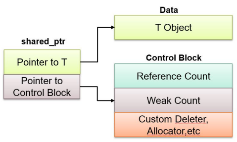

# 15 RAII、智能指针

## RAII

例外(exception)是一种应对出现于代码中的错误的一种方式，它们会被“抛出来”。我们可以设计代码捕捉这些例外：

``` cpp
try
{
    // code that we check for exceptions
}
catch([exception type] e1)
{
    // behavior when we encounter an error
}
catch([other exception type] e2) 
{
    // "else if"
}
catch
{
    // "else"
    // catch-all
}
```

!!! question "引入"

    === "问题"

        这段代码有多少“代码路径”(code path)（简单理解为运行时代码会报错的地方）

        ``` cpp
        std::string returnNameCheckPawsome(Pet p)
        {
            if (p.type() == "Dog" || p.firstName() == "Fluffy")
            {
                std::cout << p.firstName() << " " << p.lastName() << " is paw-some!" << '\n';
            }
            return p.firstName() + " " + p.lastName();
        }
        ```

    === "答案"

        23 条！

        - 这是一个 `Pet` 类的拷贝构造函数，它可能会出错 $\rightarrow$ 1
        - 临时字符串（有 5 个常量字符串）的构造函数可能会出错 $\rightarrow$ 5
        - 调用成员函数会出错（1 次 `.type()`，2 次 `.lastName()`、3 次 `firstName()`）$\rightarrow$ 6 
        - 假设所有运算符（10 个）都是用户定义的重载运算符，它们都有可能会出错 $\rightarrow$ 10
        - 返回字符串的拷贝构造函数会出错 $\rightarrow$ 1

        假设我在原来代码基础上加了一些东西：

        ``` cpp hl_lines="3 8"
        std::string returnNameCheckPawsome(Pet p)
        {
            Pet* p = new Pet(petId);
            if (p.type() == "Dog" || p.firstName() == "Fluffy")
            {
                std::cout << p.firstName() << " " << p.lastName() << " is paw-some!" << '\n';
            }
            delete p;
            return p.firstName() + " " + p.lastName();
        }
        ```

        如果在高光的两条语句的中间区域内有代码在运行时出错，那么会导致内存的泄露，后果十分严重。

下面列出的几样东西需要在获得资源后记得释放：

||Acquire|Release|
|:-:|:-:|:-:|
|Heap memory|`new`|`delete`|
|Files|`open`|`close`|
|Locks|`try_lock`|`unlock`|
|Sockets|`socket`|`close`|

当使用这些东西时发生例外的时候，我们该如何正确释放它们呢？这里就要引入 RAII 的概念。RAII 全称 Resource Acquisition is Initialization（资源获取即初始化），它是 C++ 一个具有象征性的概念，可以这样理解：

- 类（对象）所需的所有资源需要用构造函数获取
- 类（对象）所需的所有资源需要用析构函数释放

一句话概括为：资源的有效期 = 持有资源的对象的生命周期。

!!! example "反例"

    下面这两段代码均不符合 RAII 准则：

    === "代码 1"

        ``` cpp
        void printFile()
        {
            ifstream input;
            input.open("hamlet.txt");
        }

        string line;
        while (getLine(input, line))
        {
            std::cout << line << std::endl;
        }

        input.close();
        ```

        问题：`ifstream` 的开关没有用到构造函数和析构函数

    === "代码 2"

        ``` cpp
        void cleanDatabase(mutex& databaseLock, map<int, int>& db)
        {
            databaseLock.lock();
            // ...
            databaseLock.unlock();
        }
        ```

        问题：如果在 `// ...` 这块区域内有任何代码抛出例外，那么前面的锁将无法被解锁（`.unlock()`）

        解决方案是使用 `lock_guard`，它是一个符合 RAII 准则的包装(wrapper)，能够尝试将获取的资源锁住，并且在离开作用域时（抛出例外后就离开了作用域）解锁。

        ``` cpp
        void cleanDatabase(mutex& databaseLock, map<int, int>& db)
        {
            lock_guard<mutex> lg(databaseLock);
            // 无需再使用 .lock() 和 .unlock()
            //
        }
        ```

## 智能指针

对于锁，我们在前面反例的代码 2 中使用 `lock_guard` 来实现 RAII 准则；而对于内存，也有类似的指针“包装”，它们称为智能指针，有以下几种类型：

- `std::unique_ptr`：占取资源的唯一指针，无法被复制
- `std::shared_ptr`：能够被复制，当底层内存离开作用域范围便被释放
- `std::weak_ptr`：用于减轻循环依赖(circular dependenccies)问题的指针

这是原来使用指针的操作，它不符合 RAII 原则：

``` cpp
void rawPtrFn()
{
    Node* n = new Node;
    // ...
    delete n;
}
```

用上智能指针后，它就变成这样了：

``` cpp
void rawPtrFn()
{
    std::unique_ptr<Node> n(new Node);
    // ...
    // n automatically freed
}
```

在使用 `std::unique_ptr` 指针的时候请不要进行复制操作。如果在析构函数调用后还对该指针进行复制操作的话，那么该指针的副本会指向一块未分配的内存，从而造成不良后果。若要避免这一问题，需要用到 `std::share_ptr` 指针，它能够确保指针及其副本在离开作用域范围后再解除分配的内存，从而避免上述意外的发生。

<div style="text-align: center">
    
</div>

智能指针的初始化：

``` cpp
std::unique_str<T> uniquePtr = std::make_unique<T>();

std::shared_ptr<T> sharedPtr = std::make_shared<T>();

std::weak_ptr<T> wp = sharedPtr;
```

这是一段使用智能指针的错误示范：

``` cpp
#include <iostream>
#include <memory>

class B;

class A
{
    std::shared_ptr<B> ptr_to_b;
    ~A()
    {
        std::cout << "All of A's resources deallocated" << std::endl;
    }
};

class B
{
    std::shared_ptr<A> ptr_to_a;
    ~B()
    {
        std::cout << "All of B's resources deallocated" << std::endl;
    }
};

int main()
{
    std::shared_ptr<A> shared_ptr_to_a = std::make_shared<A>();
    std::shared_ptr<B> shared_ptr_to_b = std::make_shared<B>();
    a->ptr_to_b = shared_ptr_to_b;
    b->ptr_to_a = shared_ptr_to_a;
    return 0;
}
```

这段代码的问题在于：`A` 的实例 `a` 和 `B` 的实例 `b` 互相保存了对方的共享指针，导致这两个指针无法被正确地解除引用

解决方案：在 `class B` 的声明中，将 `std::shared_ptr<A> ptr_to_a;` 一句换为 `std::weak_ptr<A> ptr_to_a;`


