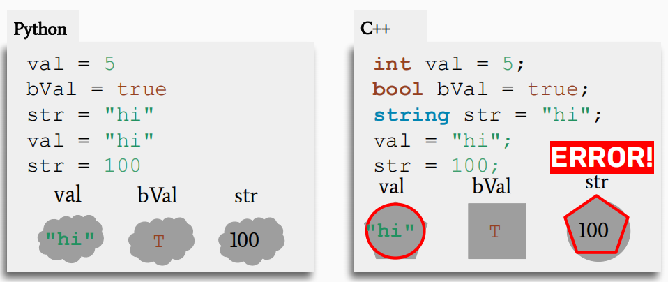

# 02 类型、结构体

## 类型

基本类型：

- `int var = 114514;`，32 位（64 位 Windows）
- `char ch = 'Q';`，8 位
- `float val1 = 19.19;`，32 位
- `double val2 = 81.0;`， 64 位
- `bool bVal = true;`，1 位
- `std::string str = "NoughtQ";`
- `void`

### 编译型语言 VS 解释型语言

C++ 是**静态类型语言**：代码中所有带名称的实体（变量、函数等）需要在**运行前**确定类型。

而以 Python 为代表的语言是**动态类型语言**：代码中所有带名称的实体，在运行时会根据它们**当前的值**来确定类型。

上述这两类语言分别称为**编译型（compiled）语言**和**解释型（interpreted）语言**，它们之间最主要的区别是：<u>源代码何时被翻译</u>。

- 动态类型-解释型：在执行过程中逐行检查类型
- 静态类型-编译型：在程序运行前的编译过程中确定类型

??? example "例子"

    <div style="text-align: center; margin-top: 0px;">
    
    </div>

!!! note "如何编译 C++ 程序"

    <figure style=" width: 70%" markdown="span">
        
        
        <figcaption></figcaption>
    </figure>

    命令：`g++ -std=c++11 hello.c -o hello`
    
    其中`-std=c++11` 指明编译器参照的 C++ 版本，若省略 `-o hello` ，输出文件名为`a.out`

### 函数重载

在 C++ 中，虽然无法定义多个相同的函数，但我们可以**重载（overload）**某个函数，使其有多种版本，也就是说可以定义函数名相同，但参数类型、参数个数或返回值类型不同的函数。

!!! example "例子"

    ``` cpp
    int half(int x, int div = 2)  // C++ 允许设置默认参数值
    {
        return x / div;
    }

    double half (double x)
    {
        return x / 2;
    }
    ```

    - `half(4)` $\rightarrow$ `2`
    - `half(3, 3)` $\rightarrow$ `1`
    - `half(3.0)` $\rightarrow$ `1.5`

## 结构体

静态类型语言的缺点：

- 弄清变量的类型可能是一件很痛苦的事
- 任何函数只能有一种返回类型
- C++ 原语（primitives）的有限性

### 关键字 `auto`

关键字 `auto` 可解决第一个问题——它用作具体类型的替代，让编译器自己推断具体的类型。

!!! question "何时使用`auto`？"

    当上下文的语境能够明确类型，或者类型写起来很麻烦的时候（比如下面的`std::pair`），使用`auto`是明智之举。

### 结构体

后两个问题可由结构体（`struct`）来解决。它是一个带名称的变量的组，每个变量都有自己的类型，允许程序员将不同的类型结合。

!!! example "应用"

    === "初始化"

        ``` cpp
        struct Student
        {
            string name;
            string state;
            int age;
        };

        // Initialization 1
        Student s;
        s.name = "NoughtQ";
        s.state = "good";
        s.age = 20;

        // Initialization 2 -- simpler!
        Student s = {"NoughtQ", "good", 20};
        ```
    
    === "作为函数的参数"

        ``` cpp
        void printStudentInfo(Student s)
        {
            // something...
        }
        ```

    === "作为函数返回值"

        ``` cpp
        Student randomStudentInfo(std:string state)
        {
            Student s;
            // something...
            return s;
        }

        Student foundStudent = randomStudentInfo("bad");
        ```

STL 有自己的结构体`std::pair`，它是一个由**两个任意类型的字段**构成的内部结构体。

- `std::pair` 是一个模板，可在`<>`里面指定字段的类型
- `std::pair` 的字段名分别为 `first` 和 `second`

`std::pair`等价于下面的结构体：
``` cpp
struct Pair
{
    fill_in_type first;
    fill_in_type second;
};
```

!!! example "应用"

    ``` cpp
    std::pair<bool, Student> lookupStudent(string name)
    {
        Student blank;
        if (notFound(name))
            return std::make_pair(false, blank);
        Student result = getStudentWithName(name);
        return std::make_pair(true, result);
    }
    auto output = lookupStudent("NoughtQ");
    ```

    - 使用`std::make_pair`方法可以避免指明`pair`内的字段类型，提升敲代码的效率。
    - 调用函数将返回值赋给某个变量时，变量的类型可设为`auto`，理由同上。
