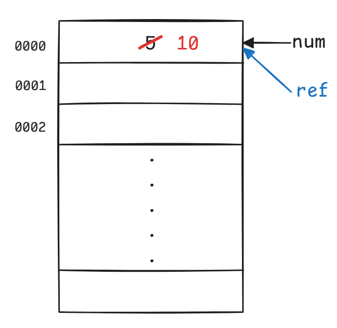

# 03 初始化、引用

## 初始化

有三种初始化的方式：直接初始化（direct initialization）、统一初始化（uniform initialization）、结构化绑定（structured binding）。

### 直接初始化

``` cpp
// 有两种形式
int num1 = 12.0;
int num2(12.0);
```

这里我将`double`类型的值赋给`int`类型的变量，C++ 在直接赋值时不会检查类型，这种情况称为**收缩转换（narrowing conversion）**，这有可能会产生错误（但上面的例子只是保留`double`类型的整数部分，不会报错）。

### 统一初始化

``` cpp
int num3{12};
int num4{12.0}; // ERROR!!!
```

统一初始化用到了花括号`{}`。这时 C++ 就会检查初始化赋值的类型是否匹配，若不匹配就会报错。

- 安全：禁止了收缩转换，从而避免意外行为（或严重的系统错误）
- 普遍：用于所有类型和各种自定义类

??? example "例子"

    === "`map`（映射）"

        ``` cpp
        int main()
        {
            std::map<std::string, int> ages
            {
                {"Alice", 25},
                {"Bob", 30},
                {"Charlie", 35}
            };

            std::cout << "Alice's age: " << ages["Alice"] << std::endl;
            std::cout << "Bob's age: " << ages.at("Bob") << std::endl;

            return 0;
        }
        ```

    === "`vector`（向量）"

        ```cpp
        int main()
        {
            std::vector<int> numbers{1, 2, 3, 4, 5};

            for (int num : numbers)
            {
                std::cout << num  << " ";
            }
            std::cout << std::endl;

            return 0;
        }
        ```

### 结构化绑定

结构化绑定是 C++ 17 新增的特性，允许对多个变量同时初始化，可以用结构体赋值，或者用函数的返回值赋值，如下例所示：

``` cpp
#include <iostream>
#include <string>
#include <tuple>

std::tuple<std::string, std::string, std::string> getClassInfo()
{
    std::string className = "CS106L";
    std::string buildingName = "Turing Auditorium";
    std::string language = "C++";
    return {className, buildingName, language};
}

int main()
{
    // structured binding
    auto [className, buildingName, language] = getClassInfo()
    /* Method 2
    auto classInfo = getClassInfo();
    std::string className = std::get<0>(classInfo);
    std::string buildingName = std::get<1>(classInfo);
    std::string language = std::get<2>(classInfo);
    */
    std::cout << "Come to" << buildingName << " and join us for " << className << " to learn " << language << std::endl;

    return 0;
}
```

## 引用

所谓「引用」，就是某个已存在变量的别名（alias），用`&`表示。某个变量的引用与该变量指向内存中同一个地址，所以改变引用的值也就是改变对应变量的值。

``` cpp
int num = 5;
int& ref = num;     // 引用 ref 作为 num 的别名
ref = 10;
std::cout << num << std::endl;   // 输出：10
```

上述过程可以用下图表示：

<div style="text-align: center; margin-top: 0px;">

</div>

可以在函数定义中采用「**按引用传递（pass by reference）**」的方法，这样的话在调用函数时就可以将实参传入函数内进行处理，从而可以改变实参的值。

!!! info "回忆"

    - 按值传递参数只是让实参的副本（copy）进入函数内部处理，而不会改变实参的值。
    - 传递指针参数也能实现与传递引用参数类似的效果，但后者写起来较为方便。

!!! example "例子"

    ``` cpp
    #include <iostream>
    #include <math.h>

    void square(int& n)
    {
        n = std::pow(n, 2);
    }

    int main()
    {
        int num = 2;
        square(num);
        std::cout << num << std::endl;
    }
    ```

!!! warning "注意引用`&`的使用"

    来看这个例子：

    ``` cpp
    #include <iostream>
    #include <math.h>
    #include <vector>

    void shift(std::vector<std::pair<int, int>>& nums)
    {
        for (auto [num1, num2] : nums)  // structured binding
        {
            num1++;
            num2++;
        }
    }
    ```

    `nums` 可以看作一个数组的引用，每个元素都是`pair`类型的。看似这个函数能够修改`nums`的每个`pair`元素里面的内容，实则它只能修改整个`nums`数组的浅层内容，因此这个函数没有改变任何值。
    
    为了修复这个 bug，只需在上面带注释的那条语句中`auto`右边加个`&`，也就是说我们使用了对`pair`元素内两个值的引用，这样就能成功修改`pair`元素的值了。

## 左值和右值

- **左值（l-value）**能放置在赋值号`=`的左侧或右侧，比如变量`x`：`int y = x; x = 344;`
- **右值（r-value）****只能**放在赋值号`=`的右侧，比如常量值`21`：`int y = 21;`，而 `21 = x;` 是禁止的。可以把右值当作临时量看待。

而函数中的引用参数应该看作左值，所以不能将右值作为实参传递给按引用传递的函数。

生命周期：

- 左值：结束于作用范围的末尾
- 右值：结束于一条语句的末尾

## 常量

常量用修饰符 `const` 表示，保证变量无法被修改。可以对常量使用常量引用，但是不能将非常量引用用在常量上。

``` cpp
const std::vector<int> const_vec{1, 2, 3};
std::vector<int>& bad_ref{const_vec};  // ERROR!
const std::vector<int>& const_ref{const_vec};  // Good!
```
