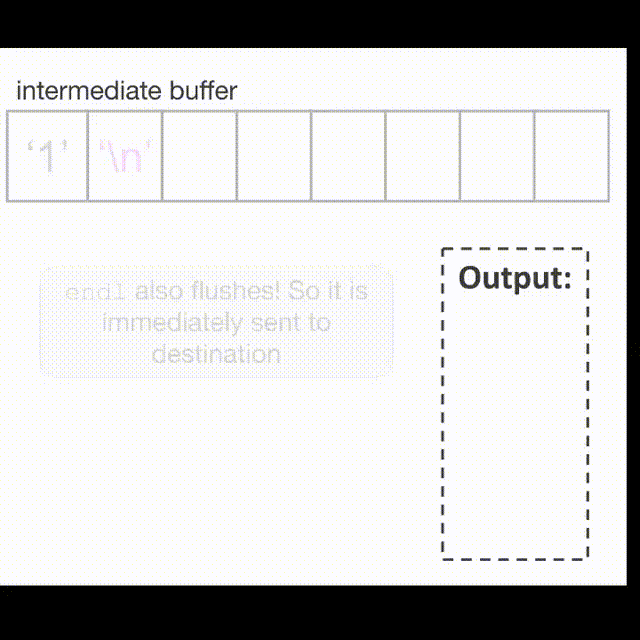
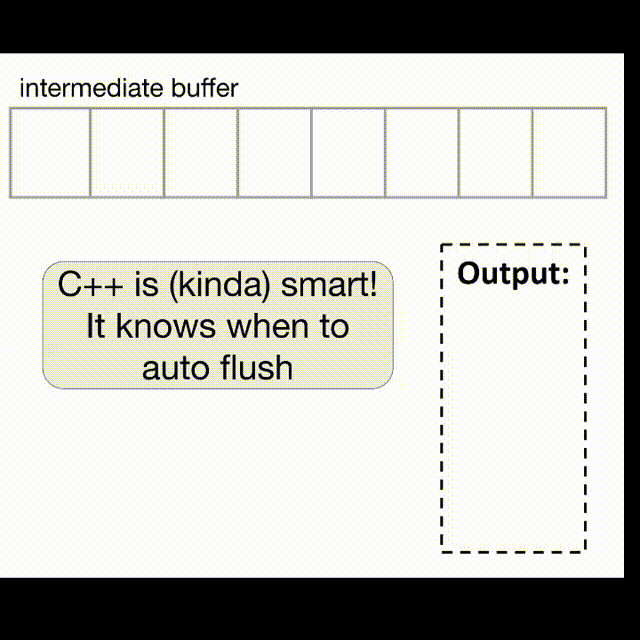

# 04 流

## 基础

**流（stream）**：一种通用的 C++ 输入输出<u>抽象</u>方法。

>抽象（abstraction）提供一种统一的接口，在「流」中这种接口是为了输入和输出数据。

常用的流：

- `cin` :star:
- `cout` :star:
- `cerr`：用于输出错误信息（无缓冲）
- `clog`：用于记录非关键事件的日志（有缓冲）

>关于 `cerr` 和 `clog` 的更多内容[戳这](https://www.geeksforgeeks.org/difference-between-cerr-and-clog/)

在之后的讲解中，我们会经常用到下面这张表示 I/O 库的图：

<figure style=" width: 70%" markdown="span">
    
    
    <figcaption></figcaption>
</figure>

### cout

`std::cout` 流是 `std::ostream` 的一个实例（instance），表示标准输出流，它能将数据写在控制台中。基本运算符为`<<`（称作插入符）。

``` cpp
std::cout << "Hello, World" << std::endl;
```

### cin

`std::cin` 流是 `std::istream` 的一个实例，表示标准输入流，它能从控制台读取数据。基本运算符为`>>`（称作提取符）。

读取控制台输入流的抽象过程：

<figure style=" width: 70%" markdown="span">
    
    
    <figcaption></figcaption>
</figure>

## 字符串流

字符串流（`stringstream`）用于处理混合数据类型的情况。现在来看下面的代码：

``` cpp
int main()
{
    std::string initial_quote = "Bjarne Stroustrup C makes it easy to shoot yourself in the foot";

    // 两种字符串流初始化方式
    // 1. 字符串构造函数
    std::stringstream ss(initial_quote);

    // 2. 插入字符串
    // std::stringstream ss;
    // ss << initial_quote;

    std::string first;
    std::string last;
    std::string language, extracted_quote;

    // >> 提取符按数据流顺序读取字符串的内容，
    // 以空白字符分隔（' ', '\n', '\t'）
    ss >> first >> last >> language >> extracted_quote;

    // 输出
    std::cout << first << "" << last << " said this: " << language << " " << extracted_quote << std::endl; 
}
```

!!! warning "问题"

    根据注释部分知，`extracted_quote` 不能读取整个字符串的剩余部分，最多读取一个单词（因为单词间以空格分隔，表示读取结束）。为了解决这个问题，需要用到`getline()`函数。

### getline()

用法：`istream& getline(istream& is, string& str, char delim)`

- `getline()`读取一串输入流，直到读取字符`delim`时停止，将读到的数据存入缓冲区`str`中。
- `delim` 默认为 `\n`
- `getline()` 读取的数据包括字符`delim`:exclamation:

将上面代码的读取部分改成以下语句，就能使`extracted_quote`保存字符串剩余部分：

``` cpp
ss >> first >> last >> language;
std::getline(ss, extracted_quote);
```

## 输出流

### 缓冲区释放

输出流的字符在被释放（flush）到目的地之前会被存储在一个中间缓冲区内，且`std::cout`流是线性缓冲的，所以缓冲区的内容不会显示在外部源上，直到执行显式的释放操作。

<figure markdown="span">
    
    
    <figcaption></figcaption>
</figure>

如上图所示，`std::endl`除了起到**换行**的作用，还有**释放缓存区**的功能。

除了 `std::flush` 和 `std::endl` 外，在输出流末尾输出换行符`\n`也能起到类似释放缓冲区的作用，但实际表现有些不同。

!!! example "例子"

    === "std::endl"

        ``` cpp
        int main()
        {
            for (int i = 1; i <= 5; ++i)
            {
                std::cout << i << std::endl;
            }

            return 0;
        }
        ```

        !!! play "动画演示"

            <div style="text-align: center; margin-top: 0px;">
            
            </div>

    === "'\n'"

        ``` cpp
        int main()
        {
            for (int i = 1; i <= 5; ++i)
            {
                std::cout << i << '\n';
            }

            return 0;
        }
        ```

        !!! play "动画演示"

            <div style="text-align: center; margin-top: 0px;">
            
            </div>

!!! warning "当源代码中加上`std::ios::sync_with_stdio(false)`一句时，`'\n'` 无法起到自动释放缓冲区的作用。"

### 输出文件流

输出文件流（output file streams）的类型为 `std::ofstream`，同样采用 `<<` 插入符将数据送入文件内。

`std::ofstream` 常用的几种方法（更多内容看[这里](https://cplusplus.com/reference/fstream/ofstream/)）：

- `is_open()`
- `open()`
- `close()`
- `fail()`

!!! example "例子"

    ``` cpp
    int main()
    {
        // 在文件 hello.txt 中创建新的输出文件流
        std::ofstream ofs("hello.txt");

        // 检查文件是否打开，若是则将一段字符串写进文件内
        if (ofs.is_open())
        {
            ofs << "Hello CS106L!" << '\n';
        }

        // 关闭文件
        ofs.close();
        // 因此下面这个字符串不会被写入文件内
        ofs << "this will not get written";

        // 重新打开文件
        ofs.open("hello.txt");
        // 下面的字符串又可以被写入文件内，但是会覆盖文件原来的内容
        ofs << "this will though! It's open again";
        return 0;
    }
    ```

    若想在文件后面继续写入数据，要在`open()`方法内加入`std::ios::app`标志，以前面的代码为例：`ofs.open("hello.txt", std::ios::app);`


## 输入流

`std::cin` 同样也有缓冲区，它会将输入流数据逐个读入缓冲区内，直到遇到空白字符为止。

看下面的代码：

``` cpp
int main()
{
    double pi;
    double tao;
    std::string name;
    std::cin >> pi;
    std::cin >> name;
    std::cin >> tao;
    std::cout << "my name is: " << " tao is: " << tao << " pi is: " << pi << '\n';

    return 0;
}
```

`std::cin` 的缓冲区内容为：

<figure markdown="span">
    
    
    <figcaption></figcaption>
</figure>

易知 `pi` 的值为 `3.14`，`name` 的值为 `Fabio`，但 `tao` 的值为 0，因为它读取到的数据为 `"Ibanez"`，类型不匹配。事实上，我们希望 `name` 能够读取到完整的字符串，即`"Faibio Ibanez"`。

不难想到使用`getline()`函数——用`std::getline(std::cin, name);` 取代 `cin >> name;`。然而，这样简单的修改并没有奏效，此时 `name` 的值为`"\n"`，因为`getline()`默认会读取包含 `\n` 的字符串，且当（默认）遇到 `\n` 时停止读取，而`std::cin`遇到空白字符停止读取且不会读取空白字符，因此 `3.14` 后面的回车符就会被读取到 `name` 里，后面的字符串就被抛弃掉了。

解决方法是在 `std::cin >> pi;` 和 `std::getline(std::cin, name);` 之间再加一句与<u>后者</u>一样的语句，这样就可以先读取掉回车符，然后继续读取后面的字符串，直到遇到空白字符（这里是第二个回车符），此时 `name` 的值为 `"Fabio Ibanez"`。

由此可见，`std::cin` 和 `getline()` 混合使用时，因为读取规则的不同，很容易出现读取问题，因此在使用的时候尽可能避免这种情况的发生，如无法避免应当小心使用！

### 输入文件流

输入文件流（input file streams）的类型为 `std::ifstream`，采用 `>>` 提取符从文件读取数据。它的方法类似输出数据流。

!!! example "例子"

    ``` cpp
    int inputFileStreamExample()
    {
        std::ifstream ifs("append.txt");
        if (ifs.is_open())
        {
            std::string line;
            std::getline(ifs, line);
            std::out << "Read from the file: " << line << '\n';
        }

        if (ifs.is_open())
        {
            std::string lineTwo;
            std::getline(ifs, lineTwo);
            std::out << "Read from the file: " << lineTwo << '\n';
        }    

        return 0; 
    }
    ```