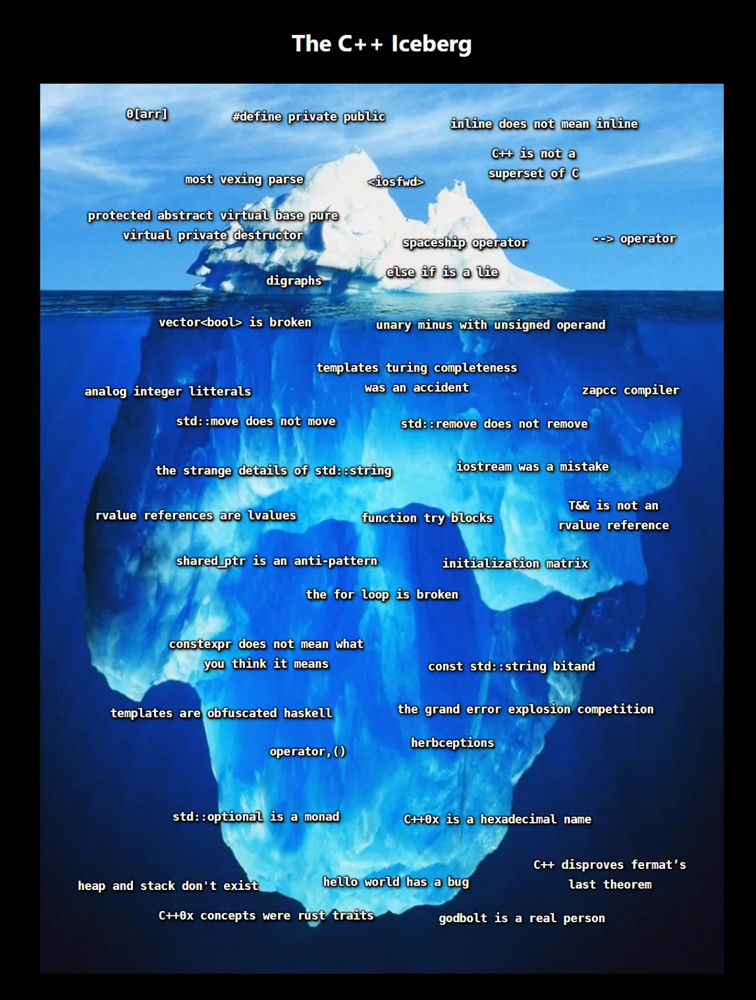

# C++ 相关知识整理

!!! abstract "说明"

    与 C++ 相关的笔记。
    
    大一暑假的时候大致浏览过 CS106L 的课件，稍微做了点记录，但由于没有实操过，很多知识都忘了。

    在大二春夏的 OOP 课程学习中，将会对 C++ 相关的知识有一个更为系统完全的整理。

!!! warning "警告"

    笔记正在修改中🚧，不过大多数内容都是可以看的了。

    但这份笔记也仅仅是 C++ 语法和思想的冰山一角罢了...

    ??? info "iceberg meme about C++"

        

            
        

        [Source](https://www.reddit.com/r/ProgrammerHumor/comments/v0gld0/i_made_an_iceberg_meme_about_c_and_all_its/)

!!! info "课程信息"

    - 课程名称：面向对象程序设计
    - 学分：2.5
    - 教师：翁恺
    - 教材：PPT 基于 *Thinking in C++*, Ver.2 修改 

!!! abstract "目录"

    - [Fundamentals](1.md)
    - [STL Containers](2.md)
    - [Classes and Objects](3.md)
    - [Functions](4.md)
    - [Copying and Moving](5.md)
    - [Overloaded Operators](6.md)
    - [Templates](7.md)
    - [Exceptions](8.md)
    - [Smart Pointers](9.md)
    - [Design Concepts](10.md)
    - [Streams](11.md)

!!! recommend "参考资料"

    C++ 的学习资料相当地丰富！

    - *Effective C++*, 3rd Edition
    - [cppreference.com](https://en.cppreference.com/w/)
    - [Jerryhzy 大佬的笔记](https://blog.jerryhzy.top/oop-lec1-using-object/)：笔记内容详细，读起来十分舒服，比干啃 PPT 好太多了！
    - [咸鱼暄前辈的笔记](https://xuan-insr.github.io/cpp/cpp_restart/)
    - [45gfg9 前辈的笔记](https://tree.45gfg9.net/lcppthw/bootstrap/#_3)（24-25 春夏 pbfx）
    - [CS106L 2025 Winter](https://web.stanford.edu/class/archive/cs/cs106l/cs106l.1254/)
        - [教材](https://cs106l.github.io/textbook/)：不太完整，但写的挺好的，期待他们能够写完🙏

