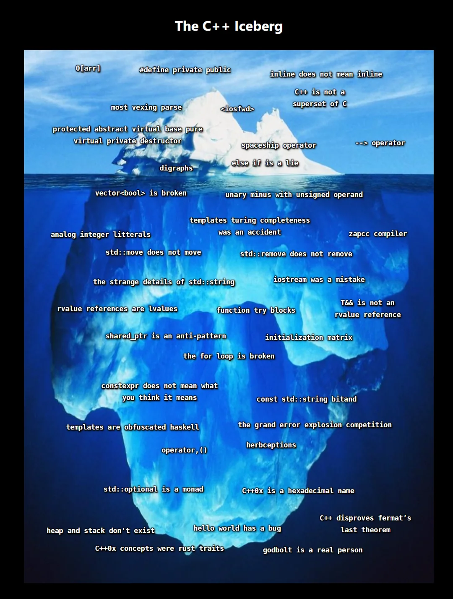

# C++ 学习！

!!! abstract "说明"

    这份笔记仅仅是 C++ 语法和思想的冰山一角罢了...

    ??? info "iceberg meme about C++"

        

            
        

        [Source](https://www.reddit.com/r/ProgrammerHumor/comments/v0gld0/i_made_an_iceberg_meme_about_c_and_all_its/)

??? info "课程信息"

    - 课程名称：面向对象程序设计
    - 学分：2.5
    - 教师：翁恺
    - 教材：PPT 基于 *Thinking in C++*, Ver.2 修改 

    ??? info "考试范围和题型"

        - 范围：
            - [类和对象](3.md)（除去高级话题外所有的部分）
            - [引用](1.md#reference)、[静态](3.md#static)
            - [模板](7.md)、[异常](8.md)
            - [运算符重载](6.md)、[转型](6.md#modern-casting)
        
        - 题型：
            - 程序输出题（30）：6-8道
            - 选择题（20）：10道
            - 填空题（30）：2道
            - 函数/类设计题（20）：1道主观题

!!! abstract "目录"

    - [Fundamentals](1.md)
    - [STL Containers](2.md)
    - [Classes and Objects](3.md)
    - [Functions](4.md)
    - [Copying and Moving](5.md)
    - [Overloaded Operators](6.md)
    - [Templates](7.md)
    - [Exceptions](8.md)
    - [Smart Pointers](9.md)
    - [Design Concepts](10.md)
    - [Streams](11.md)

!!! recommend "参考资料"

    C++ 的学习资料相当地丰富！

    - *Effective C++*, 3rd Edition
    - [cppreference.com](https://en.cppreference.com/w/)
    - [Jerryhzy 大佬的笔记](https://blog.jerryhzy.top/oop-lec1-using-object/)：笔记内容详细，读起来十分舒服，比干啃 PPT 好太多了！
    - [咸鱼暄前辈的笔记](https://xuan-insr.github.io/cpp/cpp_restart/)
    - [45gfg9 前辈的笔记](https://tree.45gfg9.net/lcppthw/bootstrap/#_3)（24-25 春夏 pbfx）
    - [CS106L 2025 Winter](https://web.stanford.edu/class/archive/cs/cs106l/cs106l.1254/)
        - [教材](https://cs106l.github.io/textbook/)：不太完整，但写的挺好的，期待他们能够写完🙏

    - [C++ 面试题](https://www.xiaolincoding.com/interview/cpp.html)（面向实习/找工，不建议用于课程学习）

