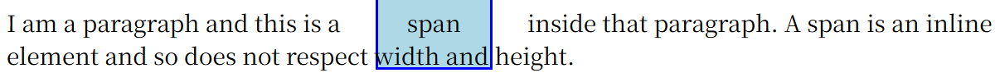
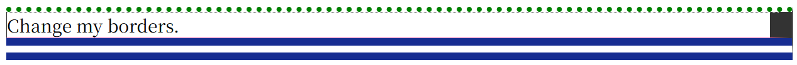

# CSS

!!! abstract "参考资料"

    - [MDN CSS 学习](https://developer.mozilla.org/zh-CN/docs/Learn/CSS)
    - [MDN CSS 参考](https://developer.mozilla.org/zh-CN/docs/Web/CSS/Reference)
    - [CSS-TRICKS](https://css-tricks.com/)

!!! info "有用的工具"

    - 开发者工具
    
## 基础知识

CSS 是一门基于规则的语言，格式大致如下所示：

``` css
selector
{
    property_1: value1;
    property_2: value2;
    /* ... */
}
```

- `selector` 选择器选定了用来添加样式的 HTML 元素（比如 `h1`、`p`等），有几种不同类型的选择器，之后会详细介绍。
- 接下来的大括号内，定义了一组键值对，键值之间用冒号分隔，值的后面跟上分号。其中的键被称为属性（property，区分 HTML 的属性（attribute）），不同的属性对应不同的合法值。
- 有些属性可以并在一起实现简写，比如 `font`、`background`、`padding`、`border`、`margin`等

??? example "例子"

    ``` css
    /* 简写1 */
    padding: 10px 15px 15px 5px;

    /* 等价于 */
    padding-top: 10px;
    padding-right: 15px;
    padding-bottom: 15px;
    padding-left: 5px;


    /* 简写2 */
    background: red url(bg-graphic.png) 10px 10px repeat-x fixed;

    /* 等价于 */
    background-color: red;
    background-image: url(bg-graphic.png);
    background-position: 10px 10px;
    background-repeat: repeat-x;
    background-attachment: fixed;
    ```

- 可以通过制定 CSS 规则的方式来覆盖浏览器的默认样式。
- 一份 CSS 文件可以指定多条这样的规则。
- 可以将同样的规则用于多个选择器上，每个选择器之间用逗号间隔（便于阅读期间，建议每个选择器占一行）。如果某条规则的选择器列表中的某个选择器无效，那么整条规则无效。

``` css
selector_1, 
selector_2,
/* ... */
selector_n
{
    /* ... */
}
```

- CSS 支持一些函数：
    - `calc()` 函数：进行一些简单的计算，比如 `calc(90% - 30px)` 的意思是盒子的宽（或高）的大小为盒子原来的宽（或高）的 90% - 30 像素。
    - `transform` 属性支持多种函数类型的值，比如 `rotate()` 等
- @rules：指定 CSS 执行时的一些规则
    - `@import "style_2.css"`：在 CSS 文件内导入另一个 CSS 文件
    - `@media`：媒体查询，它使用条件逻辑来应用 CSS 样式
- 注释：`/* ... */`
- 空白：同 HTML 一样，CSS 也忽略多余的空白。便于阅读起见，CSS 文件撰写时应注意缩进、换行等问题。

---
如何为 HTML 文件添加 CSS 样式：

- 外部样式表：（最推荐~）将样式放在 .css 文件内，在 HTML 文件的 `<header>` 元素内引入这个外部文件：`<link rel="stylesheet" href="path/to/css/file/styles.css" />`
- 内部样式表：在 HTML 文件的 `<header>` 元素内添加 `<style>` 元素，标签里内容的写法与写在 CSS 文件里的规则一致，比如：

``` html
<!-- 某个 HTML 文件的片段 -->
<head>
<meta charset="utf-8" />
<title>My CSS Test</title>
<style>
    h1
    {
        color: blue;
        background-color: yellow;
        border: 1px solid black;
    }
    p
    {
        color: red;
    }
</style>
</head>
```

- 内联样式：在 HTML 元素内使用 `style` 属性，它的值为 CSS 文件大括号的内容（写成一行，分好不要忘）

---
CSS 工作流程：

<div style="text-align: center">
    
</div>

其中的 DOM 称为文件对象模型（document object model），它是一个树形结构，HTML 中的每一个元素、属性以及每一段文字都对应着树中的一个节点。下面是一棵 DOM 树：

<div style="text-align: center">
    
</div>

当浏览器遇到无法解析的 CSS 时会选择忽略这条规则，继续解析下一个样式。


## 理论知识

### 选择器

- 类型选择器：选择器为 `html_elem`，也就是 HTML 元素标签尖括号内的东西。
- 类选择器：选择器为 `.class_name`。在需要用到类选择器的样式的 HTML 元素中加入 `class` 属性，其值为 `class_name`。
    - 可以让一个 HTML 元素同时使用多个类：类选择器的书写中让多个类连成一串（不带空格），比如 `.class_name1.class_name2`，在 HTML 元素中 `class` 属性的值为 `class_name1 class_name2`。如果没有在 CSS 文件单独声明 `.class_name1` 或 `.class_name2`，则在 HTML 中不能单独使用这些类

??? example "例子"

    ``` css title="css file"
    .notebox {
        border: 4px solid #666;
        padding: .5em;
    }

    .notebox.warning {
        border-color: orange;
        font-weight: bold;
    }

    .notebox.danger {
        border-color: red;
        font-weight: bold;
    }
    ```

    ``` html title="html file"
    <div class="notebox">
        This is an informational note.
    </div>

    <div class="notebox warning">
        This note shows a warning.
    </div>

    <div class="notebox danger">
        This note shows danger!
    </div>

    <div class="danger">
        This won't get styled — it also needs to have the notebox class
    </div>
    ```

    <div style="text-align: center">
        
    </div>


- ID 选择器：选择器为 `#id_name`在需要用到类选择器的样式的 HTML 元素中加入 `id` 属性，其值为 `id_name`。与类选择器不同的是，ID 选择器只能使用一次，且优先级高于类选择器。
- 标签属性选择器：基本格式为 `html_elem[...]`，具体有以下几种格式（方括号内）和用法：
    - `attr`：匹配带有 `attr` 属性的元素
    - `attr=value`：匹配带有 `attr` 属性，且其值为 `value` 的元素
    - `attr~=value`：匹配带有 `attr` 属性，且其（可能有多个）值存在一个值为 `value` 的元素
    - `attr|=value`：匹配带有 `attr` 属性，且其值为 `value` 或 `value-`的元素
    - `attr^=value`：匹配带有 `attr` 属性的元素，且其值开头为 `value` 子字符串
    - `attr$=value`：匹配带有 `attr` 属性的元素，且其值结尾为 `value` 子字符串
    - `attr*=value`：匹配带有 `attr` 属性的元素，且其值中间至少存在一个 `value` 子字符串
    - 在右括号前面加一个 `i` 值，在匹配 `value` 的时候采取大小写不敏感的策略

??? example "例子"

    === "例1"

        ``` css title="css file"
        li[class] {
            font-size: 200%;
        }

        li[class="a"] {
            background-color: yellow;
        }

        li[class~="a"] {
            color: red;
        }
        ```

        ``` html title="html file"
        <h1>Attribute presence and value selectors</h1>
        <ul>
        <li>Item 1</li>
            <li class="a">Item 2</li>
            <li class="a b">Item 3</li>
            <li class="ab">Item 4</li>
        </ul>
        ```

        <div style="text-align: center">
            
        </div>

    === "例2"

        ``` css title="css file"
        li[class^="a"] {
            font-size: 200%;
        }

        li[class$="a"] {
            background-color: yellow;
        }

        li[class*="a"] {
            color: red;
        }
        ```


        ``` html title="html file"
        <h1>Attribute substring matching selectors</h1>
        <ul>
            <li class="a">Item 1</li>
            <li class="ab">Item 2</li>
            <li class="bca">Item 3</li>
            <li class="bcabc">Item 4</li>
        </ul>
        ```

        <div style="text-align: center">
            
        </div>

- 伪类：选择器为 `html_elem:state`，用于选择处于特定状态下的元素，常用的伪类有（伪类太多了，剩下的请参考[MDN](https://developer.mozilla.org/zh-CN/docs/Learn/CSS/Building_blocks/Selectors/Pseudo-classes_and_pseudo-elements#%E4%BC%AA%E7%B1%BB)）
    - `:first-child`、`:last-child`：分别表示选中第一个子元素和最后一个子元素
    - `only-child`：匹配没有兄弟元素的元素
    - `nth-child(an+b)`：匹配索引符合 `an+b`（`n` 是正整数）的子元素
    - `:invalid`：当元素处于不可用状态时匹配
    - `:link`：链接未被访问时匹配
    - `:visited`：链接已被访问时匹配
    - `:focus`：当元素获得焦点（比如用 Tab 键匹配到表单，或者鼠标点击到某个元素）时匹配     
    - `:hover`：当光标悬停在元素上面时匹配
    - `:active`：匹配鼠标点击元素的瞬间
- 伪元素：选择器为 `html_elem::part`，常用的伪元素有（其余的伪元素见[MDN](https://developer.mozilla.org/zh-CN/docs/Learn/CSS/Building_blocks/Selectors/Pseudo-classes_and_pseudo-elements#%E4%BC%AA%E7%B1%BB)）：
    - `::after`：匹配出现在原有元素的实际内容之后的一个可样式化元素
    - `::before`：匹配出现在原有元素的实际内容之前的一个可样式化元素

??? example "例子"

    ``` css title="css file"
    .box::before {
        content: "";
        display: block;
        width: 100px;
        height: 100px;
        background-color: rebeccapurple;
        border: 1px solid black;
    }
    ```

    ``` html title="html file"
    <p class="box">Content in the box in my HTML page.</p>
    ```

    <div style="text-align: center">
        
    </div>

- 关系选择器，通过一些运算符连接多个选择器，有以下几类：
    - 后代选择器：用空格间隔选择器，右边选择器是左边选择器的后代，即在 HTML 文件中，当右边选择器是左边选择器的子元素时启用该样式
    - 子代选择器：选择器之间有一个 `>` 号，右边选择器是左边选择器的儿子（隔代就无效了），即在 HTML 文件中，当右边选择器是左边选择器的直接子元素时启用该样式
    - 邻接兄弟选择器：选择器之间有一个 `+` 号，当右边选择器对应元素紧跟左边选择器对应元素时，该样式用于右边选择器对应元素
    - 通用兄弟选择器：选择器之间有一个 `~` 号，和前一种的区别是不必紧邻，只要右边的在左边的之后出现即可
- 全局选择器：选择器为 `*`，选中 HTML 的所有内容，可用于避免一些歧义性的内容，使选择器更易读


### 层叠、优先级、继承

- 层叠：HTML 元素考虑下列一些因素来决定使用哪条 CSS 规则（重要性递增）：
    - 资源顺序：对于相同优先级的规则，优先使用最后面的规则
    - 优先级：
        - 计算规则为 **ID 选择器个数 * 100 + 类选择器/属性选择器/伪类 * 10 + 元素选择器/伪元素 * 1**，分数高的优先级高（通用选择器 *、运算符 `+`、`>`、`~`、` ` 不影响优先级）
        - 但是内联样式 `style` 属性的优先级高于所有来自外面的样式

    ??? example "例子"

        ``` css title="css file"
        /* 1. specificity: 1-0-1 */
        #outer a {
            background-color: red;
        }

        /* 2. specificity: 2-0-1 */
        #outer #inner a {
            background-color: blue;
        }

        /* 3. specificity: 1-0-4 */
        #outer div ul li a {
            color: yellow;
        }

        /* 4. specificity: 1-1-3 */
        #outer div ul .nav a {
            color: white;
        }

        /* 5. specificity: 0-2-4 */
        div div li:nth-child(2) a:hover {
            border: 10px solid black;
        }

        /* 6. specificity: 0-2-3 */
        div li:nth-child(2) a:hover {
            border: 10px dashed black;
        }

        /* 7. specificity: 0-3-3 */
        div div .nav:nth-child(2) a:hover {
            border: 10px double black;
        }

        a {
            display: inline-block;
            line-height: 40px;
            font-size: 20px;
            text-decoration: none;
            text-align: center;
            width: 200px;
            margin-bottom: 10px;
        }

        ul {
            padding: 0;
        }

        li {
            list-style-type: none;
        }
        ```

        ``` html title="html file"
        <div id="outer" class="container">
            <div id="inner" class="container">
                <ul>
                    <li class="nav"><a href="#">One</a></li>
                    <li class="nav"><a href="#">Two</a></li>
                </ul>
            </div>
        </div>
        ```

        <div style="text-align: center">
            
        </div>

    - `!important`：加载 CSS 属性对应值（有个空格）和分号之间，能覆盖上面所有的优先级计算规则。不到万不得已不要用！
    - CSS 来源，有以下优先级（按顺序优先级递增），比上面的选择器优先级更大：
        1. 用户代理（浏览器）普通样式
        2. 用户（网站访问者）普通样式
        3. 作者（Web 开发者）普通样式
        4. ~~动画样式~~
        5. 作者 `!important` 样式
        6. 用户 `!important` 样式
        7. 用户 `!important` 样式
        8. ~~过渡样式~~
    - 层叠层的顺序，下一节会讲到

- 继承：一些设置在父元素上的 CSS 样式（属性）可以为它的子元素使用，但不是所有属性都可以被继承（比如 `width`、`margin`、`padding`、`border` 等）。通过以下几个值，我们可以手动控制继承的规则：
    - `inherit`：开启继承
    - `initial`：将选定元素的属性设为它的默认值
    - `revert`：将选定元素的属性设为浏览器的默认样式
    - `revert-layer`
    - `unset`：将选定元素的属性设为自然状态。简单理解，要么是 `inherit`，要么是 `initial`
    - 除此之外，`all` 属性可以设置所有属性的继承值

### 层叠表

!!! question "这一块知识有些复杂，还需消化。私以为如果是个人 Web 开发，这块知识并不是特别重要。"

在前面 CSS 来源优先级中提到的六个来源（去掉 4、8）中的每一个，都可以有多个层叠层，这些层的优先级为（按顺序递增）：

- 先分层的普通样式
- ...
- 后分层的普通样式
- 未分层的普通样式
- 内联普通样式
- 动画样式
- 未分层（实际上形成了一个隐式层）的重要（`!important`）样式
- 后分层的重要样式
- ...
- 先分层的重要样式
- 内联重要样式
- 过渡样式

创建层叠层的方法：

- `@layer` 语句规则：`@layer` 后跟一个或多个层的名称，这样能够创建这些不带样式的层。重复声明的层会被无视。

    ``` css
    @layer name1, name2, name3;
    ```

- `@layer` 块规则：添加带名字或不带名字的，且具备所有样式的层
    - 重复声明的层会将其新增的样式加入已有的层中，不会创建新的层
    - 匿名层无法被引用，也无法通过重复声明来添加样式

    ??? example "例子"

        ``` css
        /* 未分层的样式 */
        body {
            color: #333;
        }

        /* 创建第一个层：`layout` */
        @layer layout {
            main {
                display: grid;
            }
        }

        /* 创建第二个层：一个未命名的匿名层 */
        @layer {
            body {
                margin: 0;
            }
        }

        /* 创建第三和第四个层：`theme` 和 `utilities` */

        @layer theme，layout，utilities;

        /* 向已经存在的 `layout` 层添加样式 */

        @layer layout {
            main {
                color: #000;
            }
        }

        /* 创建第五个层：一个未命名的匿名层 */
        @layer {
            body {
                margin: 1vw;
            }
        }
        ```

        这里一共创建了五个层：`layout`、`<anonymous(1)>`、`theme`、`utilities`、`<anonymous(2)>`，以及一个未分层的样式


- `@import` 规则 + 关键词 `layer` 或者 `layer()` 函数，将导入文件的样式内容分配到指定层（具名层、嵌套具名层或匿名层）中，也可以将多个文件导入到一个层中
    - 具名层：`@import url("style1.css") layer(layer_name);`
    - 嵌套具名层：`@import url("style2.css") layer(layer_name.sub_layer_1);`
    - 匿名层：`@import url("style3.css") layer();`
    - 如果导入文件内具有一些层，那么这些层会作为指定层的子层，形成嵌套层

!!! note "注"

    - 如果后两种方法没有提供层的名称，那么会创建一个匿名层
    - 层一旦被创建，其顺序就固定下来了

!!! note "特殊的层"

    - 媒体查询 `@media`，只有当满足给定条件（比如 `min-width: 50em`）后才能创建指定的层，常见格式为：

    ``` css
    @media (condition)
    {
        @layer name1, name2; 
    }
    ```

    - 特性查询 `@supports`，只有当浏览器支持给定样式时才能导入样式，常见格式为：

    ``` css
    @import url("style.css") layer(layer_name) supports(condition1) and (condition2);
    ```

层叠层允许创建嵌套层，每个层叠层可以包含嵌套层，嵌套层叠层的优先级如下（按顺序递增）：

- 嵌套普通样式
- 非嵌套普通样式
- 非嵌套重要样式
- 嵌套重要样式

### 值、单位

- 数值类型
    - 整数 `<integer>`
    - 实数 `<number>`
    - 维度 `<dimension>`
        - 长度 `<length>`
            - 绝对长度单位：`cm`、`mm`、`Q`（$\frac{1}{4}$ mm）、`in`（英寸）、`pc`（派卡）、`pt`（点）、`px`（像素）
            - 相对长度单位：`em`（相对父元素字体大小）、`rem`（相对根元素字体大小）、`vh`（相对视窗的高度，`1 vh` 为视窗高度的 1%）、`vw`（相对视窗的宽度，`1 vw` 为视窗宽度的 1%）
            >视窗：浏览器的显示界面

        - 角度 `<angle>`
        - 时间 `<time>`
        - 分辨率 `<dimension>`
    - 百分比 `<percentage>`：一般取相对于父元素 xx% 的值
- 颜色
    - 关键词：比如 `red`、`blue`、`yellow`...（超级多的关键词）
    - 十六进制 RGB 值，形如 `#xxxxxx`，从左往右每两位十六进制数分别对应 R、G、B
    - RGB 值，形如 `rgb(x1 y2 z3)`，取值范围均为 0-255（0 表示该颜色少，255 表示该颜色多。全 0 为黑，全 255 为白），从左往右分别表示 R、G、B
    - RGBA 值，形如 `rgba(w1 x2 y3 / z4)`在 RGB 的基础上多一个 alpha 通道，指定不透明度，它的取值范围为 0-1（0 为完全透明，1 为完全不透明）
    - HSL 值，形如 `hsl(x1 y2 z3)`分别指定色调、饱和度和亮度，取值范围分别为 0-360，0-100%，0-100%（~~接触较少，我也不是很懂~~）
    - HSLA 值：HSL + alpha 通道（不透明度），类似 RGBA

### 盒子模型

盒子模型有**区块盒子**（block boxes）和**行内盒子**（inline boxes）之分。根据显示类型也有**外部显示**和**内部显示**之分，通过设置 `display` 属性的值来调整。

- 外部显示
    - 区块盒子（`display: block`、`display: flex`）
        - 盒子会产生换行
        - `width`、`height` 属性起作用，如果未指定 `width`，值默认 100%
        - 内边距、外边距、边框可以将其他元素推开
    - 行内盒子（`display: inline`、`display: inline-flex`）
        - 盒子不会产生换行
        - `width`、`height` 属性不起作用
        - 内边距、外边距、边框会用到，但是只能在水平方向上推开其他元素
- 内部显示，决定盒子内元素的布局方式

!!! note "特殊显示：`display: inline-box`"

    它可以使盒子同时保持区块和行内两种类型的特征：既可以不换行，又可以设置 `width` 和 `height` 值，`padding`、`border`、`margin` 还可以使盒子推开周围的元素（注意行内盒子可能会与其他重叠）

    区别：

    === "`display: inline-box`"

        <div style="text-align: center">
            
        </div>

    === "`display: inline`"

        <div style="text-align: center">
            
        </div>

盒子模型示意图：

<div style="text-align: center">
    
</div>

主要有以下四部分：

- 内容盒子：中间内容区域，使用 `inline-size`、`block-size`、`width`、`height` （前两者为逻辑属性，后两者为物理属性，[后面](#文本书写方向)会讲到）确定大小

!!! note "最大/最小尺寸"

    - `min-width`、`min-height` 属性分别指定盒子最小限制的宽度和高度
    - `max-width`、`max-height` 属性分别指定盒子最大限制的宽度和高度

- 内边距盒子：内容周围的空白区域，使用 `padding` 确定大小，具体属性有：`padding-top`、`padding-bottom`、`padding-left`、`padding-right`，分别控制内边距的上下左右


- 边框盒子：包住内容的边框，使用 `border` 确定大小，
    - 控制每条边：`border-top`、`border-bottom`、`border-left`、`border-right`，可以设三个值，分别对应大小、样式和颜色
    - 设置边的宽度、样式和颜色：`border-width`、`border-style`、`border-color`。可以精确控制每条边的这三样属性，比如 `border-top-color` 等
    - `border-radius`：设置盒子边框的圆角半径，可以单独设置四个角的圆角，比如 `border-top-right-radius`

??? example "例子"

    ``` css title="css file"
    .container {
        border-top: 5px dotted green;
        border-right: 1px solid black;
        border-bottom: 20px double rgb(23 45 145);
    }

    .box {
        border: 1px solid #333333;
        border-top-style: dotted;
        border-right-width: 20px;
        border-bottom-color: hotpink;
    }
    ```

    ``` html title="html file"
    <div class="container">
        <div class="box">Change my borders.</div>
    </div>
    ```

    <div style="text-align: center">
        
    </div>


- 外边距盒子：整个盒子与其他元素间的空白区域，使用 `margin` 确定大小，具体属性有：`margin-top`、`margin-bottom`、`margin-left`、`margin-right`，分别控制外边距的上下左右
    - 外边距折叠：如果两个元素的外边距相接触，会出现以下变化：
        - 两个正外边距会合并成一个外边距，大小等于最大的外边距
        - 两个负外边距会折叠，大小等于最小的外边距
        - 其中一个外边距为负，总的外边距等于两者之和


??? example "例子"

    <div style="text-align: center">
        
    </div>

在标准盒模型中，盒子的宽高指的是内部内容所占的宽高；而在替代盒模型中，盒子的宽高指的是包括内边距和边框在内的宽高（也就是边框最外层的尺寸），若要使用替代盒模型，需要进行如下声明：

``` css
.box {
  box-sizing: border-box;
}
```

### 溢出

我们常常会遇到盒子的内容溢出盒子外的情况，这是因为 CSS 默认这么做——它尽可能地减少数据的损失，所以当内容溢出盒子时不会隐藏这部分内容，仍旧继续显示出来，从而造成一坨乱糟糟的情况。

`overflow` 属性控制盒子内容溢出的方式，有以下几种可选值：

- `visible`：默认值，可见溢出内容
- `hidden`：隐藏溢出内容
- `scroll`：隐藏部分可以用滚动条滚动显示
    - 可以具体选择 `overflow-x` 和 `overflow-y` 属性分别控制水平和垂直方向的滚动条
- `auto`：由浏览器自动选择溢出显示方式

## 具体配置

### 背景

通用属性为 `background`，它可以同时接受很多的值，根据对应的细分属性来分，有以下几种类型：

- 背景颜色 `background-color`：它的值可以是表示颜色的字符串、rgb 值或十六进制值等
- 背景图片 `background-image`，可以设置的值有：
    -  `url(path/to/your/image.xxx)`，默认情况下大图不会缩小，所以只会显示其中一部分；小图会复制多张图片以填充整个空间（也就是重复平铺）
    - 设置渐变背景 `linear-gradient`（线性渐变）或 `radius-gradient`（圆形渐变），具体语法参考 [MDN 文档](https://developer.mozilla.org/zh-CN/docs/Web/CSS/gradient)

??? example "例子"

    这是两张图片，一张很大（640 x 427，这里显示的大小不是实际大小），一张很小（30 x 30）：

    <div style="text-align: center">
        
        
    </div>

    把它们放进同样大小的盒子里，显示结果如图所示：

    <div style="text-align: center">
        
    </div>

- 控制背景平铺行为 `background-repeat`，可用的值有：
    - `no-repeat`：禁止重复平铺
    - `repeat-x`：仅水平方向重复平铺
    - `repeat-y`：仅垂直方向重复平铺
    - `repeat`：默认重复平铺

??? example "例子"

    从左到右分别为使用前三个值后的结果：

    <div style="text-align: center">
        
        
        
    </div>

- 控制背景图片大小 `background-size`，可以设置的值有：
    - 宽、高两个值（px、em、%百分比）
    - `cover`：保持原来的宽高比，使图像覆盖整个盒子区域，因此部分图片可能会溢出盒子外，从而这些部分不可见
    - `contain`：保持原来的宽高比，使图像调整到适合盒子框内的大小，如果图片宽高比与盒子宽高比不一致就会有留白的情况

??? info "补充：`object-fit` 属性"

    它也可以接受 `cover`、`contain`、`fill`（充满整个盒子，破坏原来宽高比）等值，设置图片适应盒子的模式，类似 `background-size`

??? example "例子"

    从左到右分别为使用后两个值后的结果：

    <div style="text-align: center">
        
        
    </div>

- 背景图片定位 `background-position`，可以设置的值有：
    - 使用坐标值，分别指明水平和垂直偏移原点坐标的值（默认的 `background-position` 的值为 `(0, 0)`）
    - 使用（2 个）关键字：`top`、`bottom`、`center`、`left`、`right`
    - 长度或百分比，可以与关键字混搭
    - 四值语法，比如 `top 20px right 10px` 指定距顶部 `20px` 和距右侧 `10px` 处

- 指定背景内容的滚动方式 `background-attachment`，可以设置的值有：
    - `scroll`：盒子内部，背景不动，内容可以滚动；盒子外部，背景、内容均可滚动
    - `fixed`：无论盒子内外，背景不动，内容可以滚动
    - `local`：无论盒子内外，背景、内容均可以滚动

- 只用 `background` 属性指定所有属性，有一些规则：
    - 同一张图片的不同属性的值用空格间隔，不同图片的属性用逗号间隔，只有指定好前一张图片的基本属性后才能指定下一章图片的属性
    - `background-color` 的值为最后一个指定的属性值
    - `background-size` 的值紧跟在 `background-position` 之后，中间用 `/` 分隔

>这么说有些抽象，建议看这个[例子](https://mdn.github.io/learning-area/css/styling-boxes/backgrounds/background-attachment.html)

!!! note "注"

    可以同时设置多张背景图片的属性，用逗号间隔每张图片对应的值，最后列出的图片位于底层。如果出现值的个数不一致的情况，数量较少的属性就会进行循环（比如有四张图，某个属性只设了三个值，那么第四张图的该属性的值同第一张图）。

### 文本书写方向

`writing-mode` 属性：设定块级元素的文字显示方向，可以设置的值有：

- `horizontal-tb`：元素显示方向从上到下，文本方向是横向的
- `vertical-rl`：元素显示方向从右向左，文本方向是纵向的
- `vertical-lr`：元素显示方向从左向右，文本方向是纵向的  

书写模式分为两种维度：块维度和内联维度，其中前者代表元素显示方向，后者代表书写方向。下面两张图分别表示这两个维度在横向书写模式和纵向书写模式的情况：

<div style="text-align: center">
    
    
</div>

由于书写模式的变化不影响盒子的 `width`（横向方向长度） 和 `height`（纵向方向长度），所以可能会让盒子的内容溢出盒子外面。这时我们可以通过设置逻辑上，而非物理意义上的宽（`inline-size` 属性）和高（`block-size` 属性）来解决这一问题：

- 对于横向书写模式：`inline-size = width`，`block-size = height`
- 对于纵向书写模式：`inline-size = height`，`block-size = width`

??? example "例子"

    ``` css title="css file"
    .box {
        inline-size: 150px;
    }

    .horizontal {
        writing-mode: horizontal-tb;
    }

    .vertical {
        writing-mode: vertical-rl;
    }
    ```

    ``` html title="html file"
    <div class="wrapper">
        <div class="box horizontal">
            <h2>Heading</h2>
            <p>A paragraph. Demonstrating Writing Modes in CSS.</p>
            <p>These boxes have inline-size.</p>
        </div>
        <div class="box vertical">
            <h2>Heading</h2>
            <p>A paragraph. Demonstrating Writing Modes in CSS.</p>
            <p>These boxes have inline-size.</p>
        </div>
    </div>
    ```

    <div style="text-align: center">
        
    </div>

除了宽高具有对应的逻辑属性外，外边距、边框和内边距也有对应的逻辑属性，属性名称略有不同（其中 `xxx` 为 `padding`、`border`、`margin` 三者之一）：

- `xxx-top` 的逻辑属性为 `xxx-block-start`
- `xxx-bottom` 的逻辑属性为 `xxx-block-end`
- `xxx-left` 的逻辑属性为 `xxx-inline-start`
- `xxx-right` 的逻辑属性为 `xxx-inline-end`

??? example "例子"

    左图为物理属性，右图为逻辑属性

    <div style="text-align: center">
        
        
    </div>

!!! question "何时用逻辑属性"

    一般情况下用物理属性。如果用到多种书写模式，可以采用逻辑属性。

### 文字

关于字体的一些属性：

- 字体颜色 `color` 
- 字体种类 `font-family`
    - 五类字体：serif（衬线字体）、sans-serif（无衬线字体）、monospace（等宽字体）、cursive（手写字体）、fantasy（装饰字体）
    - 建议设置多种字体，浏览器会按照顺序查找并启用第一个支持的字体类型
    - 字体名之间有空格的话要用引号括起来
    - 我常用的字体：`Noto Serif SC`、`LXGW WenKai GB Screen`、`JetBrains Mono`

!!! note "导入字体"

    在 CSS 文件的开始处设置一个 `@font-face` 块，用来指定下载的字体

    ``` css
    @font-face 
    {
        font-family: "myFont";
        src: url("myFont.ttf");
    }
    ```

    - 在 CSS 文件的剩余部分中，我们可以用 `myFont` 作为 `font-family` 属性的值了
    - 可以为 `src` 设置多个值（地址），它会导入第一个生效的字体文件
    - 还可以在这里使用 `font-weight` 和 `font-style` 设置导入字体的默认样式

    或者可以使用在线字体服务，比如[Google Fonts](https://fonts.google.com/)，按照提供的指示设置好字体

- 字体大小 `font-size`，常用单位有 `px`、`em`、`rem` 等
- 字体样式 `font-style`，可用值有：
    - `normal`：默认
    - `italic`：使用斜体版本的字体
    - `oblique`：若 `italic` 失效，直接让原字体倾斜 
- 字体粗细 `font-weight`，可用值有：
    - `normal`：默认
    - `bold`：粗体
    - `lighter`：比父元素更细
    - `border`：比父元素更粗
    - 数值，取值范围为 100-900
- 字体转换 `text-transform`，控制大小写（~~感觉没用，懒得写了~~）
- 文本装饰 `text-decoration`，可用值有（一次可接受多个值）：
    - `none`：无装饰
    - `underline`：下划线
    - `overline`：上划线
    - `line-through`：删除线
- 文字阴影 `text-shadow`，一个完整的值包括以下四个部分（用空格间隔）（可以同时设置多个阴影）：
    - 水平偏移，建议用 px
    - 垂直偏移，建议用 px
    - 模糊半径，值越高意味着阴影范围更广，默认 0
    - 阴影颜色，默认 `black`
- 文本对齐 `text-align`，可用值有
    - `left`
    - `center`
    - `right`
    - `justify`：两端对齐
- 行高 `text-height`，推荐值为 1.5-2（字体高度的 1.5-2 倍）
- 字母间距 `letter-spacing`
- 单词间距 `word-spacing`
- 还有很多值，具体见 [MDN](https://developer.mozilla.org/zh-CN/docs/Learn/CSS/Styling_text/Fundamentals#%E5%85%B6%E4%BB%96%E4%B8%80%E4%BA%9B%E5%80%BC%E5%BE%97%E7%9C%8B%E4%B8%80%E4%B8%8B%E7%9A%84%E5%B1%9E%E6%80%A7)

可以使用 `font` 属性进行简写，但要遵循一些规则：

- `font-size` 和 `font-family` 属性值是必需的
- `font-size` 和 `font-height` 属性值之间必须有一个 `/`

### 链接

与链接状态相关的五个伪类（具体见“选择器”一节）：

- `:link`
- `:visited`
- `:focus`
- `:hover`
- `:active`

自定义样式时，记住口诀 **L**o**V**e **F**ears **HA**te，即按照上面给出的伪类顺序来自定义 CSS 样式，因为后设置的属性会覆盖前面的属性（相同优先级的情况下），这里给出的顺序较为合理。

改变链接样式的一些属性：

- `color`：改变文字颜色
- `cursor`：改变鼠标光标的样式
- `outline`：改变文字的轮廓（类似边框）

设置链接右上角的图标（[图片来源](https://icons8.com/icon/741/external-link)）：

``` css
a[href^="http"] {
  /*  */
  background: url("external-link.png") no-repeat 100% 0;
  background-size: 16px 16px;
  padding-right: 19px;
}
```

### 列表

可在 `<ul>` 和 `<ol>` 上设置的属性：

- `list-style-type`：设置列表前面的符号，比如无序列表前面的圆形或方形，有序列表的数字、字母或罗马数字，比如大写罗马数字为 `upper-roman`
- `list-style-position`：符号的位置是在内容的外侧（`outside`，默认，左图）还是内部（`inside`，右图）

<div style="text-align: center">
    
    
</div>

- `list-style-image`：使用自定义图片作为符号，由于控制范围有限，所以不太推荐用这个属性。
    - 推荐使用 [`background`](#背景) 相关的属性，这样可以控制图片的大小、位置等属性
    - 在使用 `background` 时记得做两件事：`list-style-type` 设为 `none`，`background-repeat` 设为 `no-repeat`

这三个属性也有简写形式 `list-style` 属性，可以同时设置这三个值

下列几种属性可控制有序列表的计数方式：

- `start`：（用在 `<ol>` 标签内）设置起始计数的位置，比如 `start="4"` 使列表从 4 开始计数
- `reversed`：（布尔属性）（用在 `<ol>` 标签内）使列表反向计数
- `value`：（用在 `<li>` 标签内）为列表项指定数值


### 表格

这里只简单列一些与表格相关的 CSS 技巧，具体参考 “MDN 学习”[表格](https://developer.mozilla.org/zh-CN/docs/Learn/CSS/Building_blocks/Styling_tables)对应章节：

- `table-layout: fixed;` 可以使列的宽度与列标题的宽度一致，防止因列内容的变化而导致列宽的奇怪变化
- `border-collapse: collapse;` 可以使表格内所有元素的边框重叠在一起，更符合我们平常的认识（默认所有表格元素的边框是分开的，看起来很奇怪）

### 表单

（由于 HTML 表单部分未完成，这里先空着）

## 网页布局

有以下几种常见的布局方式：

- 正常布局
- 弹性盒子
- 网格
- 浮动
- 定位
- 多列布局

### 弹性盒子

使用 `display: flex` 启用弹性盒子。

弹性盒子的模型示意图：

<div style="text-align: center">
    
</div>

- 主轴（main axis）：沿着弹性元素防止方向延伸的轴，开始和结束的位置分别为 main start 和 main end
- 交叉轴（cross axis）：垂直于主轴的轴，开始和结束的位置分别为 cross start 和 cross end
- 弹性容器（flex container）：设置 `display: flex` 的父元素
- 弹性项（flex item）：弹性盒子内的元素

相关属性：

- `flex-direction`：指定主轴的方向，可选值有：
    - `row`：（默认）水平方向
    - `column`：垂直方向
    - `row-reverse`：水平方向，但是弹性项的排列顺序与原来相反
    - `column-reverse`：垂直方向，但是弹性项的排列顺序与原来相反
- `flex-wrap`：设置弹性项的换行，可选值有：
    - `nowrap`（默认）：不换行
    - `wrap`（推荐）：换行
    - `wrap-reverse`
- `flex-flow`：`flex-direction` 和 `flex-wrap` 的简写形式，可同时设置这两个值
- `flex`：它是三个属性的简写形式，分别为：
    - `flex-grow`：无单位比例，比如 `1` 表示每个弹性项所占空间相等
    - `flex-shrink`：用于溢出容器的弹性项，这是一种高级用法，一般不会用到
    - `flex-basis`：像素值，指定弹性项的最小宽度

    建议使用简写形式，比如 `flex: 1 200px` 指定第一和第三个属性

??? example "例子"

    ``` css
    article
    {
        flex: 1 200px;
    }

    article:nth-of-type(3)
    {
        flex: 2 200px;
    }
    ```

    这段代码的意思是前两个弹性项占页面的 $\dfrac{1}{4}$，但宽度不少于 `200px`；第三个弹性项占页面的 $\dfrac{2}{4}$，宽度也不少于 `200px`。因此浏览器先为这三个弹性项给出 200 px 的可用空间，然后剩余空间根据比例划分

    <div style="text-align: center">
        
    </div>

- `align-items`：控制弹性项在交叉轴上的位置，可用值有：
    - `stretch`（默认）：使所有 flex 项沿着交叉轴的方向拉伸以填充父容器。若弹性容器沿着交叉轴没有固定长度，则所有的弹性项与最长的弹性项的高度一致
    - `center`：弹性项保持原有高度，位于中间部分
    - `flex-start`、`flex-end`：分别位于顶部和底部（如果交叉轴方向是默认方向的话）
- `align-self`：覆盖 `align-items` 设置的样式，调整单个弹性项的位置
- `justify-content`：控制弹性项在主轴上的位置，可用值有：
    - `flex-start`（默认）
    - `flex-end`
    - `center`
    - `space-around`：使弹性项阎主轴均匀分布，两端会留一点空白
    - `space-between`：类似 `space-around`，只不过两端不会留白
- `order`：作用于单个弹性项，用于改变弹性项的显示顺序（但不会改变它在 DOM 树的顺序）
    - 所有弹性项默认的 `order` 值为 0
    - `order` 越大，显示位置越靠后
    - 相同 `order` 值的弹性项按原来的顺序排列
    - `order` 的值可以是负数

??? note "弹性盒子属性参考图"

    来源：[css-tricks](https://css-tricks.com/snippets/css/a-guide-to-flexbox/)

    <div style="text-align: center">
        
    </div> 

### 网格

网格的模型示意图：

<div style="text-align: center">
    
</div>

网格有行有列，行之间或列之间的间隙被称为槽(gutter)。

使用 `display: grid;` 启用网格，但启用后网页不会发生变化，需要进一步的设置，相关属性如下：

- `grid-template-columns`：指定列的条数（值的个数）和宽度（具体值），可用单位有：
    - 像素值
    - 百分比
    - `fr`：分配可用空间的比例，比如 `grid-template-columns: 300px 2fr 1fr;`，第一列的宽度为 300px；后面两列按剩余空间划分比例，第二列占 $\dfrac{2}{3}$ 的空间，第三列占 $\dfrac{1}{3}$ 的空间
    - `repeat()` 函数可用来设置重复的内容。比如 `repeat(3, 1fr)` 可以设置 3 个 `1fr` 的列；`repeat(2, 2fr 1fr)` 等价于 `2fr 1fr 2fr 1fr`
- `grid-template-row`：指定行的条数和宽度，这里不再赘述

???+ info "显式网格和隐式网格"

    前两种属性都是显式网格的设置方法，而隐式网格产生于内容出现于网格外（放不下了）的情况。隐式网格的行列大小参数默认为 `auto`，根据放入内容自动调整。我们也可以通过设置 `grid-auto-rows` 和 `grid-auto-columns` 属性手动设置隐式网格的大小

- `grid-column-gap`：指定列间隙，`grid-row-gap`：指定行间隙，也可以用 `grid-gap` 同时指定两者，可使用除 `fr` 单位外的长度单位
- （不是属性）`minmax()` 函数：设置行/列大小的取值范围，比如 `minmax(100px, auto)` 设定尺寸不小于 100px，若大于 100px 则根据内容自动调整。既可用于隐式网格，也可用于显式网格
- `grid-column` 和 `grid-row` 分别指定网格内元素放置的列位置和行位置。它们均包含 2 个值，中间用 `/` 分隔，分别对应开始位置（`grid-column-start` / `grid-row-start`）和结束位置（`grid-column-end` / `grid-row-end`），值为整数，指定第几条列/行分隔线

??? example "例子"

    ``` css
    header {
        grid-column: 1 / 3;
        grid-row: 1;
    }

    article {
        grid-column: 2;
        grid-row: 2;
    }

    aside {
        grid-column: 1;
        grid-row: 2;
    }

    footer {
        grid-column: 1 / 3;
        grid-row: 3;
    }
    ```

    <div style="text-align: center">
        
    </div>

- `grid-template-areas` 根据指定的名字控制网格内元素的位置，是一种比较灵活的方法

??? example "例子"

    用下面的代码替换上一个例子的代码，可以实现一样的布局效果（看过一遍代码就差不多懂了）：

    ``` css
    .container {
    display: grid;
    grid-template-areas:
        "header header"
        "sidebar content"
        "footer footer";
    grid-template-columns: 1fr 3fr;
    gap: 20px;
    }

    header {
        grid-area: header;
    }

    article {
        grid-area: content;
    }

    aside {
        grid-area: sidebar;
    }

    footer {
        grid-area: footer;
    }
    ```

    - `grid-template-areas` 的每个名字指代对应的格子，用空格间隔列，用引号间隔行
    - 使用 `.` 符号作为名字，让一个格子留空

??? note "弹性盒子属性参考图"

    来源：[css-tricks](https://css-tricks.com/snippets/css/complete-guide-grid/)

    <div style="text-align: center">
        
    </div> 