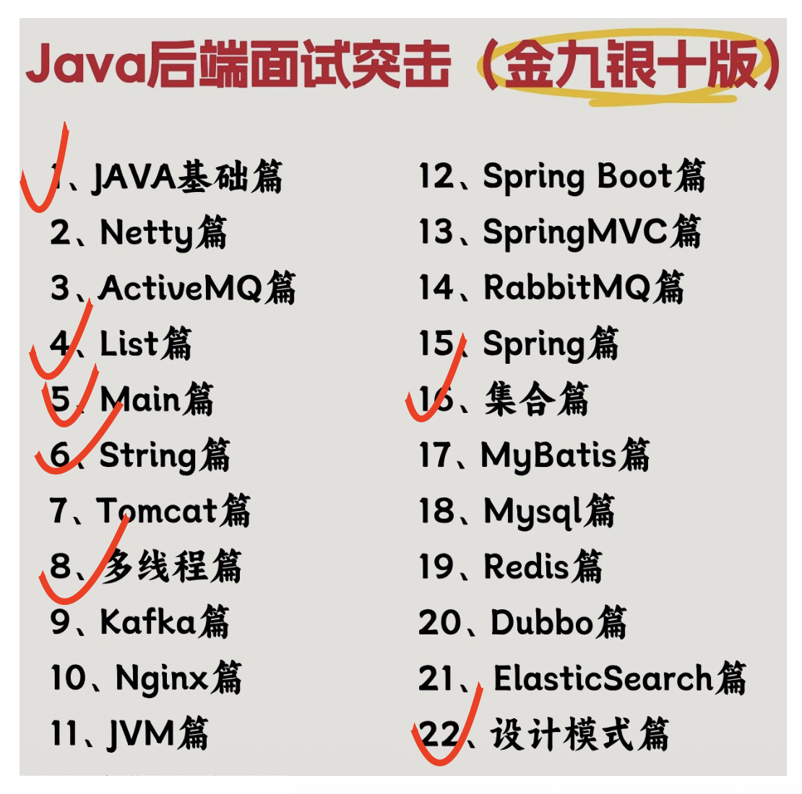

# Introduction

课程目标：专注于 Java 在桌面端和服务器上的编程，并且学完后能够用 Java 实现一个小的软件系统。

要学的内容包括：

- 作为一门语言的 Java
- IO，异常(exception)，RTTI（运行时类型识别(runtime type identification)）
- 线程(thread)
- JDBC，套接字(socket)
- 设计模式(design pattern)
- Lambda 表达式，流
- 并行(parallel)，并发(concurrency)，分布式(distributed)


## Background

编程语言

- 是一种让计算机做事情的语言（而不是人和计算机对话的语言）
- 编译型（比如 C） v.s. 解释型（比如 Python）

学哪个语言？

- 现代的编程语言在语法上的差异很小，几乎都是C-like语言
- 语言的能力/适用领域主要是由库和传统所决定的
    - PTA 的后端是用 [Kotlin](https://kotlinlang.org/) 写的
    - 杭州的小公司（20-30 人左右）通常接的是政府或国企的单，之前他们很信任微软，后来反过来，变得完全不信任微软，因此开发语言从 .NET -> Java

Java 生逢其时（恰好今年（2025）是 Java 诞生三十周年）

- 计算模式在演变
    - 主机 -> 单机 -> C/S -> B/S ->移动与云
        - C/S(client-server)推销的是数据库厂商
    - 计算在远端 -> 计算在桌面 -> 桌面计算远端存储 -> 桌面交互远端计算和存储 -> 前端交互远端计算和存储
        - Java 具有跨平台能力，在国内没什么用，在美国就很有用，因为要适配旧机器
- Java 一直不太擅长桌面，但是桌面不那么重要了
- 语言上升是因为有库，有人写库是因为它流行

前端/后端模式

- CGI（公共网关接口）-> MVC（模式-视图-控制器）-> 服务化
    - 从前：一次点击做一次提交换一个新页面下来
    - 现在：一点动作做一次提交得到新数据做部分刷新
- 网站不再是提供网页的站，而是服务提供者
    - 前端：HTML、CSS、JavaScript
    - 后端：Java、PHP、.net、Python 以及 JavaScript
- 函数、库、微服务、智能体

Java 遇到的挑战：

- 一门语言独领风骚 25 年了，总有人想要挑战的
- Java 还是带有明显的 20 年前的语言的特色：编译执行
    - Java 源码 -> 字节码 -> 虚拟机执行
    - 新的语言普遍采用解释执行
- Java 起步的时候也是做网页中运行的程序的，但是 Java 太重了（代码量大）

但 Java 的应用还是很广泛

- Java仍然是大多数情况下首先想到的
    - 程序是人写的，用惯的工具不会一下子扔了的
    - Java 适合于很多场合，不仅仅是服务器后端
- 语言的生命周期是很长的
    - Java还在不断发展：IoC、泛型、Lambda 和流计算
- 新语言的问题
    - 普遍在应对多人协同开发上存在弱点

!!! abstract "结论"

    - 对计算机本身（体系结构、操作系统、编译）感兴趣 -> C
    - 想编程解决手头的问题（统计、AI、桌面小程序）-> Python
    - 有明确的需求（求职）-> 人家要什么学什么（PHP、JavaScript、C++）
    - 还没想好 -> Java（JD 中提及最多的语言）
        - 但是 JD 中的“精通 Java”指的是以 Java 为编程语言的全套体系（课上只讲下面打勾的部分）

            <div style="text-align: center">
                
            </div>

Java 是：

- 一种编译型语言
- 一种高效的 OOP 语言
- UNIX 世界的一位成员
    - 最开始用在 SUN(Stanford University Network) 公司的 Solaris 操作系统中，而该操作系统正是 UNIX 家族的一位成员
- 被广泛应用于各类应用中

Java 简史：

- 诞生：1995.5.23
- 1991：Java 之父 [James Gosling](https://www.wikiwand.com/en/articles/James_Gosling) 发明了一款机顶盒(set-top box)

    <div style="text-align: center">
        
    </div>

    - 机顶盒可触屏，有投票、点播功能
    - 想将其推销给美国电视公司，但失败了
    - 但一年后另一个团队开发了类似的产品（DEC 的 VOD），却被接受了
- 1994：OAK 和 FirstPerson
- 1995：Java 和 HotJava
    - SUN 和 Netscape（网景，当时世界上最大的浏览器公司，后被微软的 IE 击败）合作开发 Java
    - 由于有一家芯片公司已注册 OAK 的商标，所以后来改成 Java（爪哇，印尼岛屿）这么一个有“异域风情”的名称
    - 爪哇特产咖啡，因此 Java 的 logo...

更多介绍见这里：<http://xhslink.com/n/9toSTiVMa5j>


## Running a Java Program

下图简要概括了 Java 程序的运行机制：

<figure style=" width: 80%" markdown="span">
    
    
    <figcaption></figcaption>
</figure>

要想运行一个 Java 程序，需要具备以下条件：

- Java 源程序（~~废话~~）
- Java 平台(platform)
    - JVM（Java 虚拟机）
    - Java API（应用程序接口(application program interface)），就是 Java 的标准库
        - 文件名为 `rt.jar`，实则为一个 zip 文件，可解压，解压后可看到一堆 `.class` 文件
        - 还有一个 `rt.dll`（Windows）或 `rt.so`（Unix）文件，里面包含了用 C 语言写的函数被编译后的结果；而 `rt.jar` 只存储 Java 相关的内容
- 基于硬件的平台（即操作系统）


## Features

Java 的跨平台特性意味着

- 可移植性(portable)
    - JVM 支持跨平台
    - 统一的数据类型，不受制于系统和硬件
- 性能
    - 性能低的表现
        - Java 编译出来的字节码不能直接被 CPU 运行，因此 Java 在底层仍然属于解释执行的
        - 代码检查需要时间
        - 用到栈，而栈在内存中，访问速度不如寄存器
    - 性能高的表现
        - JIT（即时(just-in-time)）
            - 这个词原本来自丰田的生产管理方式，后来延伸至 CS 领域
            - Java 利用了局部性(locality)，缓存被编译成机器码的字节码，下次遇到相同代码时可直接调用缓存了的机器码，提高执行效率
        - 多线程 -> 并行
        - 字节码的设计简单（仅 8 位长，最多也就 256 种）

Java 还具备稳定性，并遵循 KISS(keep it simple, stupid) 原则。

- （不太准确的说法）没有指针
    - 实际上 Java 是有指针的，只是指针无法计算
    - Java 访问对象时只能通过指针去访问，并且一旦指定某个对象后就不得修改
    - Java 的指针不像 C++ 有星号
- （数组）索引检查
    - 提高安全性，但是增加了额外的运行时间
- 自动内存管理
- 形式上和 C++ 类似

C++ 有，但 Java 没有的东西：

- 多继承
- 虚继承
- 模板（但有泛型）
- 运算符重载

Java 的动态性体现在：

- Java 没有一个具体程序的概念
- Java 相信所有的类和对象放在同一块空间
    - 所以 Java 的 main 函数一定是属于某个类的，好处是可为每个类都可以创建 main 函数，然后可以自己指定执行哪个 main 函数；坏处是为了写一个 main 函数，不得不写一个完整的类
- Java 程序的编译结果只是这块空间的一部分
- 而“运行程序”的意思是开启空间中某个类的某一方法的线程

Java 对象的存储：

- 对 C 而言，高效是最重要的，所以程序员可自行控制内存的分配和释放
- 但对 Java 而言，所有的对象在运行时要构建好，并且要被存储在堆中
    - 所以必须自己创建对象，但对象不能被我们手动销毁——垃圾回收机制会帮我们清除不再使用的对象
    - 不过有少数对象可存储在栈中，但程序员无法直接管理

Java 具备单根结构：

- Java 中的每个类都是 `Object` 类的后代
- 所以所有的 Java 对象都是 `Object` 的对象
- 因此，容器就是一个能保存对象的对象

>注：C++ 是唯一一个没有单根结构的 OOP 语言。


## Fundamentals

创建第一个 Java 程序：

```java title="Main.java"
public class Main {
    public static void main(String[] args) {
        // out is static member of System (not connected with :: as C++ does)
        System.out.println("Hello World!");
    }
}
```

编译和运行：

```bash
# compilation
javac Main.java
# execution
java Main
```

从标准输入中读取整数：

```java title="A.java"
import java.util.Scanner;

public class A {
    public static void main(String[] args) {
        // in is a pointer
        Scanner in = new Scanner(System.in);
        // attain integer from standard input
        int i = in.nextInt();
        System.out.println("Hello World!");
        System.out.println(i);
        in.close();
    }   
}
```

读取字符串：

- `#!java in.next()`：读入一个单词，单词的标志是空白字符（空格、Tab 键和换行）
- `#!java in.nextLine()`：读取一整行

??? info "注"

    Scanner 运行速度慢（可能 Scanner 还没读好，等价的 C++ 程序已经运行完毕了），解决方法是自己编写一个逐字节读取的程序。

关于对象的处理：

- 对象不能自己保存自己，需要用一个“句柄”(handle)指代它
- 比如 `#!java String s;` 中，`s` 就是一个句柄，但当前没有指代任何东西

关于 `#!java new` 运算符：

```java
String s = new String("a string");
```

上面的语句做了以下事情：

1. 创建一个 `#!java String` 对象
2. 对象被初始化为 `"a string"`
3. 创建了一个指向 `#!java String` 的作为句柄的变量
4. 将对象赋值给这个句柄变量