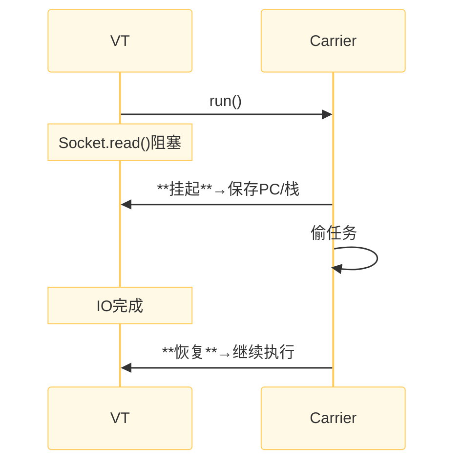
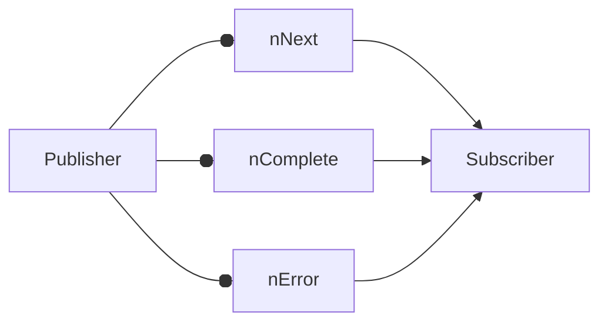

# Virtual Thread and Reactive

百万并发 `HttpServer`

```java
// 平台线程
Executors.newFixedThreadPool(200) -> OOM

// 虚拟线程
Executors.newVirtualThreadPerTaskExecutor() -> 1M + 连接
```

本地 Demo：1s 创建 1M 虚拟线程，内存 < 1GB

| 维度 | 平台线程 | 虚拟线程 |
| :--- | :--- | :--- |
| 内存 | 1MB/栈 | $\approx$ 几百字节 |
| 创建 | 系统调用 | 用户态 |
| 数量 | 数千 | 数百万 |
| 阻塞代价 | 内核调度 | 挂起续体 |

>冷知识：虚拟线程曾用名为「纤程(fiber)」

虚拟线程核心：Continuation 续体

<!-- <div style="text-align: center">
    
</div> -->



挂起/恢复由 JVM 完成，OS 无感知。

创建虚拟线程的方法：

```java
// ① 快速创建
Thread v = Thread.startVirtualThread(() -> task());

// ② Builder
Thread.ofVirtual().name("vt-", 0).start(() -> task());

// ③ Executor
try (var exe = Executors.newVirtualThreadPerTaskExecutor()) {
    exe.submit(() -> task());
}
```

**结构化并发**(structured concurrency)：自动 `join`、取消剩余、错误传播

```java
try (var scope = new StructuredTaskScope.ShutdownOnFailure()) {
    Future<String> f1 = scope.fork(() -> rpc1());
    Future<String> f2 = scope.fork(() -> rpc2());
    scope.join();               // 等全部完成
    scope.throwIfFailed();      // 任一失败抛异常
    return f1.resultNow() + f2.resultNow();
}
```

阻塞不再是罪：I/O 示例

```java
//虚拟线程内阻
塞read
try (var server = ServerSocketChannel.open()) {
    server.bind(new InetSocketAddress(8080));
    while (true) {
        SocketChannel ch = server.accept();
        Thread.startVirtualThread(() -> {
            try {
                ch.read(buf);  // 阻塞 -> 挂起
                ch.write(buf);
            } catch (IOException ignore) {}
        });
    }
}
```

- 阻塞不会占用平台线程，性能 ≈ NIO

**固定**(pinning)**陷阱**

```java
synchronized (lock) {       // 内部 Monitor
    InputStream.read();     // 阻塞 -> pinned
}
```

- 虚拟线程仍占用平台线程
- 解决：
    - 改用 `ReentrantLock`
    - 避免在 `synchronized` 内阻塞 I/O

调试与监控：

- jstack：显示 `VirtualThread[#123]`
- jcmd：`Thread.dump_to_file`
- VisualVM：插件 2.1+ 可聚合 VT
- JFR：JDK20+ 记录 VT 事件

---
**Reactive** 编程思想：



Reactor 核心 API：

```java
// Mono（0|1）
Mono<String> mono =
    Mono.fromCallable(() -> rpc())
        .subscribeOn(Schedulers.parallel())
        .timeout(Duration.ofSeconds(2))
        .onErrorReturn("fallback");

// Flux（N）
Flux<Integer> flux =
    Flux.range(1, 5)
        .map(i -> i * 2)
        .filter(i -> i > 5);
```

**背压**(back-pressure)机制：

```java
Flux.interval(Duration.ofMillis(1))   // 生产快
    .onBackpressureBuffer(1000)       // 缓冲 1k
    .subscribe(i -> slowConsumer(i)); // 消费慢
```

溢出时丢弃/报错/缓冲，防止 OOM。

VT + Reactive：对比选择

| 维度 | 虚拟线程 | Reactive |
| :--- | :--- | :--- |
| 代码风格 | 同步阻塞 | 链式回调 |
| 学习成本 | 低 | 高 (操作符) |
| 调试 | 栈可追踪 | 回调栈深 |
| 适用 | IO密集 | IO密集+高组合 |
| 背压 | 无 (需额外) | 原生 |

二选一？-> 混合：VT 调用 Reactive 客户端

性能对比：VT vs NIO vs Reactive

- 场景：Echo 服务器，1k 并发连接
- 平台线程：12k QPS，内存 800MB
- NIO+Reactor：28k QPS，内存 300MB
- 虚拟线程：27k QPS，内存 <300MB