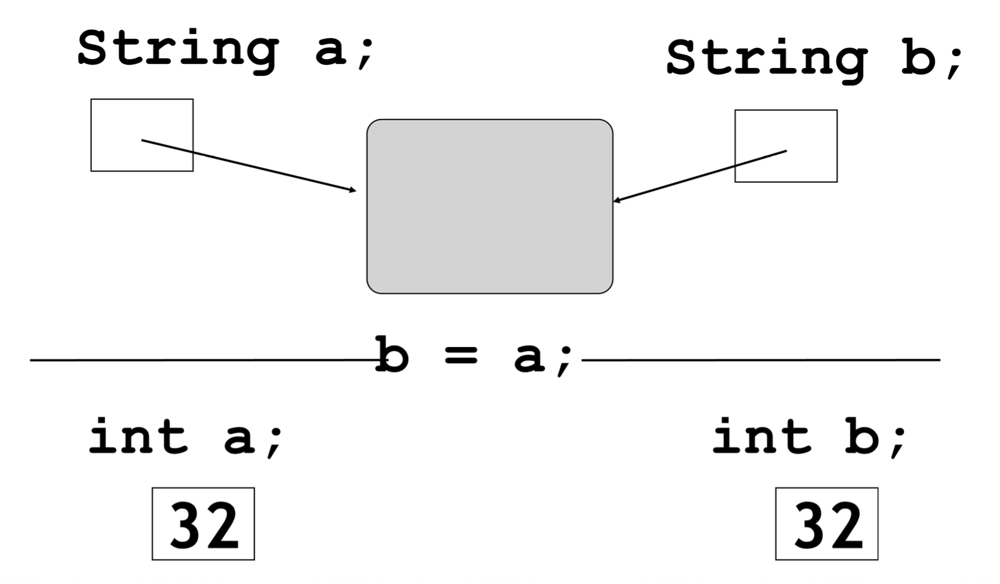

# Basic Java

## Data Types and Wrapper Classes

- Java 的数值基本类型

    |类型|大小|最小值|最大值|
    |:-|:-|:-|:-|
    |`#!java byte`|1B|-128|127|
    |`#!java short`|2B|-32768|32767|
    |`#!java int`|4B|–2,147,483,648|2,147,483,647|
    |`#!java long`|8B|–9,223,372,036,854,775,808|9,223,372,036,854,775,807|
    |`#!java float`|4B|大约 –3.4E+38，有 7 个有效位|大约 3.4E+38，有 7 个有效位|
    |`#!java double`|8B|大约 –1.7E+308，有 15 个有效位|约 1.7E+308，有 15 个有效位|

    !!! note "注"

        Java 没有 `unsigned`，主要是因为 Java 足够安全健壮（内存安全、类型安全），无需 `unsigned` 的约束。

        反观 C/C++ 之所以有 `#!cpp unsigned`，是因为表达裸二进制计算（机器中的计算）的需要。
    
- 特殊的数字格式

    ```java
    145_345.23  // 可以在数字里的任何地方放下划线
    0b11001011  // 二进制
    // 0x：十六进制；0：八进制
    ```

- 非数值的基本类型
    - `#!java boolean`：`#!java true`, `#!java false`
    - `#!java char`：16 位，采用 Unicode-16 编码

- **包装类**(wrapper class)：一个其对象包装或包含基本数据类型的类。当我们创建一个包装类的对象时，它包含一个字段，在这个字段中我们可以存储基本数据类型。换句话说，我们可以将基本值包装进包装类对象中。
    - 包装类包括：

        ```java
        Byte
        Short
        Integer
        Long
        Float
        Double
        Char
        Boolean
        ```

- 创建包装对象
    - 所有包装类型的 `#!java public` 构造器 已在 JDK 9 被标记为 `#!java @Deprecated(since="9", forRemoval=true)`，并在 JDK 16 正式移除；现在无论 `#!java new Integer(123)` 还是 `#!java new Double(3.14)` 都会编译失败
    - 官方理由：
        - 构造函数每次强制生成新对象，浪费内存
        - `#!java valueOf` 工厂方法利用内部缓存（-128~127 默认缓存在 IntegerCache）
        - 字符串驻留、`#!java Boolean` 的 `#!java true`/`#!java false` 单例（类的对象有且仅有一个）保持一致语义
        - 为未来值类型（Valhalla）铺路，彻底消灭包装对象
        - 正确的做法：

            ```java
            // 1. 工厂方法（推荐）
            Integer a = Integer.valueOf(123);

            // 2. 自动装箱（语法糖，底层仍调 valueOf）
            Integer b = 123;

            // 3. 字符串解析
            Integer c = Integer.valueOf("123");

            // 4. 若需要创建“绝对新对象”——几乎没这需求，真需要就 new 完后别放入任何缓存
            // （JDK 16 以后已无法做到，必须反射或 MethodHandles，但属于黑魔法）
            ```

- **自动装箱**(auto-box)和**自动拆箱**(auto-unbox)：包装类型和对应的基础类型之间可以直接赋值

    ```java
    class Geeks {
        public static void main(String[] args) {
            int b; // Primitive data type
            Integer a; // Integer wrapper class

            b = 357; // assigning value to primitive

            a = b; // auto-boxing or auto wrapping converting primitive int to Integer object
            
            System.out.println("The primitive int b is: " + b);
            System.out.println("The Integer object a is: " + a);
        }
    }
    ```

- **预生成对象**(pre-created object)：落在以下范围内，用的还是同一对象，否则就会创建新的对象
    - 对于整数类型：-128~127
    - 对于字符类型：0~127
    - 对于布尔：`#!java true` 和 `#!java false`
    - 对于浮点数：没有预生成对象

    ```java
    Integer i1 = 12; // what if 1200
    Integer i2 = 12; // what if 1200
    System.out.println(i1 == i2);  // == 判断两个指针是否指向同一个对象
    // true，如果是 1200（超范围了）就是 false
    ```


## Strings

- 创建 `String` 对象

  ```java
  String s1 = "Hello";
  int age = 25;
  String s2 = "I am" + age + "years young";
  ```

- `String` 的 `+` 运算：

  ```java
  "I’m " + 18     // "I’m 18"
  1 + 2 + "age"   // "3age"
  "age" + 1 + 2   // "age12"
  ```

- `String` 块(block)（和 Python 的类似）：

  ```java
  String html = """
                <html>
                  <body>
                    <p>Hello, world</p>
                  </body>
                </html>
                """;
  ```

  - 起止各一行 `"""` ，单独占一行（开头 `"""` 后不能直接跟内容）
  - 内容自动去掉公共前缀空白，保留相对缩进

- `String` 类型和 `#!java int` 类型的赋值有所不同：

  <div style="text-align: center">
      
  </div>

- `String` 的相等性

    ```java
    // tests identity（比较两个引用是否指向同一个对象）
    if (input == "bye") {
    // ...
    }

    // tests equality（这个才是比较内容的相等性）
    if (input.equals("bye")) {
    // ...
    }
    ```

    - `String` 应始终用 `#!java .equals()` 方法做比较

!!! note "更多 `String` 的 API 见[官方文档](https://docs.oracle.com/javase/8/docs/api/java/lang/String.html)"

- Java 中的 `String` 是**不可变的**(immutable)
    - 不可变的：创建 `String` 实例后内容无法再更改
        - `String` 类没有任何函数改变字符串的内容
    - 然而，声明为 `String` 引用的变量可以在任何时候改变以指向其他 `String` 对象
        - 但仍然无法直接修改 `String` 的内容
    - C++ 是可变的，Python 是不可变的
        - 因此整个 Java 生态可以放心地把 `String` 当成基础设施：随手缓存、随处共享、当 key、当锁、当常量，而无需拷贝或同步

    ??? info "为什么要“不可变”"

        - 并发/线程安全
            - 无状态：对象只读，天然支持多线程共享，无需同步
            - Race-free：写并发代码时不用担心“读到一半被修改”
        - 哈希与索引
            - hashCode 缓存：计算一次后缓存到字段 `hash` ，后续 `HashMap/get` 直接复用，复杂度从 O(n) -> O(1)
            - Key 可信：作为 `HashMap` / `HashSet` 的 key 时，中途内容变化导致哈希漂移的灾难不可能发生（对比 `char[]` 或 `StringBuilder`）
        - 字符串常量池（StringTable）
            - `intern()` 复用：字面量自动入池，相同内容全局一份，节省堆内存
            - 地址比较：`"foo"=="foo"` 直接返回 `true`，JVM 级别优化
        - 安全性与完整性
            - 类加载器隔离：类名、文件路径、权限字符串一旦传入就无法被篡改，防止“在 check 之后、use 之前”被恶意代码改掉
            - 网络/文件句柄：`new URL("http://xxx")` 的协议、主机名不可变，避免校验后地址被替换
        - 编译器 & JVM 优化
            - 字符串折叠：编译期常量表达式 `"a" + "b"` 直接变成 `"ab"` ，减少运行时拼接
            - 栈上优化：逃逸分析后不可变对象可拆成标量替换，消灭堆分配
            - 共享子串：JDK 7 以前 substring 共享底层 `char[]`（offset + count），避免复制；JDK 7 之后虽然改为复制，但仍保留不可变语义，让 JIT 放心做循环不变量外提等优化

    - 除不可变的 `String` 类型外，还有两个常用的可修改的字符串类型：
        - `StringBuffer`：线程安全，同步，性能稍慢
        - `StringBuilder`：非线程安全，不同步，性能更快

        ```java
        // StringBuilder 示例（单线程）
        StringBuilder sb1 = new StringBuilder("Hello");
        sb1.append(" World");

        // StringBuffer 示例（多线程）
        StringBuffer sb2 = new StringBuffer("Hello");
        sb2.append(" World");
        ```

    ??? question "思考"

        === "问题"

            ```java
            String s = "";
            for (int i = 0; i < 100; i++)
                s += i;
            ```

            这个过程会制造 201 个对象，并扔掉 200 个。请问这 201 个对象是哪里制造的？

        === "解答"

            开始 `s` 的初始化 1 次 + 100 次迭代 *（`s` 和 `i` 各创建一次）= 201

    - 如果需要不断运算逐渐形成大的字符串，应该使用 `StringBuffer`

        ```java
        StringBuffer sb = new StringBuffer();
        for (int i = 0; i < 100; i++)
            sb.append("" + i);
        String s = sb.toString();
        ```

- 转换至 `String`
    - 当 Java 在拼接时将数据转换至字符串形式时，它会调用一个由 `String` 定义的 `String` 转换方法 `#!java valueOf()` 的其中一个重载版本
    - `#!java valueOf()` 对所有简单类型和 `Object` 类型都有重载版本
    - 对于简答类型，`#!java valueOf()` 返回一个包含人类可读的，和原数据等价的字符串
    - 每个类都可以实现 `#!java toString()` 方法，因为它是由 `Object` 定义的
    - 对于我们自己创建的类，我们可以重写(override) `#!java toString()` 方法，并提供我们自己编写的简单形式
    - 要实现 `#!java toString()`，只需返回一个包含人类可读的字符串，并能合理描述类的对象的 `String` 对象即可

- 检索来自 `String` 的数据
    - “**类型包装**(type wrapper)”类（`#!java Integer`, `#!java Long`, `#!java Float`, `#!java Double`）提供了一个 `#!java valueOf()` 方法，它能将 `String` 转换为那个类型的对象

    ```java
    String piStr = "3.14159";
    Float pi = Float.valueOf(piStr);
    float pi2 = Float.parseFLOAT(piStr);
    ```


## Classes and Objects

- 定义一个类

    ```java
    class Main {
        public Main(int i) { _i = i; }
        public int get() { return _i; }
        private int _i;
    }
    ```

    - 在闭合花括号后没有 `;`（C++ 是有的）
    - 类的首字母大写，而变量或函数的首字母小写
    - 函数体位于类的花括号内
    - 每个成员要指定访问控制修饰符（比如 `#!java public`）
    - 构造函数中没有初始化列表（好像是 C++ 特有的语法）

- **编译单元**(compliation unit)
    - 每个编译单元必须有一个以 .java 结尾的名称，并且在该编译单元内部可以有一个 `#!java public` 类，该类必须与文件名相同
    - 每个编译单元中只能有一个 `#!java public` 类
    - 当你编译一个 .java 文件时，你会得到一个与文件名完全相同但扩展名为 .class 的输出文件，每个 .java 文件中的每个类都有一个这样的文件
    - 一个可运行的程序是一堆 .class 文件

- 创建一个对象：唯一的方式是使用 `#!java new` 运算符

    ```java
    class Value {
        private int i;
        public Value(int ii) { i = ii;}
        public int get() { return i;}
    }
    public class Main {
        public static void main(String[] args) {
            Value v = new Value(12);
            System.out.println(v.get());
        }
    }
    ```

- 赋值：赋值“从一个对象到另一个对象”是指将句柄从一个位置复制到另一个位置
- 按值传递

    ???+ example "例子"

        === "例1"

            ```java
            void f(int n) {
                n = 9;
            }
            int k;
            k = 10;
            f(k);
            ```

        === "例2"

            ```java
            class Number {
                public int i;
            }
            void f(Number n) {
                n.i = 9;
            }
            Number k = new Number();
            k.i = 10;
            f(k);
            ```

- 关系表达式
    - `==`, `!=` 能处理任意对象，但是要注意
        - 对于基本数据类型，比较的确实是值
        - 对于引用数据类型，比较的却是对象的内存的地址，即判断是否指向同一个对象

- `#!java switch` 表达式
    - 从 Java 12 开始，引入了 `#!java switch` 表达式，它是对传统 `#!java switch` 语句的增强
    - 传统的 `#!java switch` 是**语句**(statement)，只能执行分支逻辑；而新的 `#!java switch` 表达式**可以返回值**，更加简洁、安全

    ```java
    int day = 3;
    String result = switch (day) {
        case 1 -> "Monday";
        case 2 -> "Tuesday";
        case 3 -> "Wednesday";
        case 4 -> "Thursday";
        case 5 -> "Friday";
        case 6，7 -> "weekend"； // 多个值合并
        default -> "Invalid day";
    } ;
    System.out.println(result); // 输出 "Wednesday"
    ```

    - 使用 `->` 箭头语法，避免了传统 `#!java break` 的繁琐
    - `#!java switch` 表达式返回一个值，可以直接赋给变量
    - 支持多个 `#!java case` 合并（用逗号分隔）
    - 必须覆盖所有可能情况，否则需要 `#!java default`
    - `#!java yield`：如果想在 `#!java switch` 分支里写更复杂的逻辑，需要用 `#!java yield` 返回值

        ```java
        int day = 3;
        String result = switch (day) {
            case 1, 2, 3 -> {
                String prefix =
                yield prefix + day; "Early week: ";
                // 用 yield 返回结果
            }
            case 4, 5 -> "Mid week";
            case 6, 7 -> "Weekend";
            default -> throw new IllegalArgumentException("Invalid day: " + day);
        };
        System.out.println(result); // 输出 "Early week: 3"
        ```

    - Java 的 `#!java switch` 表达式之所以不需要 `#!java break`，是因为 `#!java switch` 表达式只会匹配其中一个 `#!java case`，一旦匹配上就执行箭头后面的操作，随后立即退出，不会检查后续的 `#!java case` 了

- 成员初始化
    - Java 竭尽全力确保任何变量在使用前都得到正确初始化
    - 由于任何方法都可以初始化或使用该数据，所以强制用户在数据被使用前将其初始化为适当的值可能并不实际。因此，类的每个基本数据类型成员都会被保证获得一个初始值 `0`
    - 指明初始化

        ```java
        class Measurement {
            boolean b = true;
            char c = 'x';
            int i = 47;
        };

        class Measurement2 {
            Depth o = new Depth();
        };

        class CInit {
            int i = f(); // ...
        }
        class CInit {
            int i = f();
            int k = g(i); // ...
        };

        class CInitWrong { // this is wrong
            int j = g(i);
            int i = f(); // ...
        };
        ```

    - 初始化的顺序：在一个类中，初始化的顺序由类中定义变量的顺序决定（和 C++ 一样）

- `#!java this` 是一个**代理构造函数**(delegating ctor)
    - 关键字 `#!java this` 产生被调用的对象方法的引用
    - `#!java this` 能显式调用另一个构造函数

    ```java
    public class Foo {
        Foo(int x) {
            System.out.println("x=" + x);
        }
        
        Foo(int x, int y) {
            this(x); // ✅ 合法，必须是第一条语句
            System.out.println("y=" + y);
        }
    }
    ```

- 清理(cleanup)：`#!java finalize()`
    - 当垃圾收集器准备释放用于存储对象的内存时，它将首先调用其 `#!java finalize()` 方法
    - 但这个方法和 C++ 的析构函数截然不同
        - 垃圾回收 != 析构
        - 对象可能无法被垃圾回收
        - 垃圾回收仅关乎内存


## Static Members

- 静态成员当然还是类的成员
- `#!java Class` 对象
    - `Class` 对象用于创建类中所有的“常规(regular)”对象。每当创建一个新的类，也会创建一个单独的 `#!java class`对象（并且相应地会被存储在一个同名 .class 文件中）
    - 运行时，当想要创建某个类的对象时，执行程序的 JVM 首先会检查该类型的 `#!java Class` 对象是否已加载。如果未加载，JVM将通过查找具有该名称的 .class 文件来加载它

- 初始化
    - 静态成员将在被加载到类时初始化
    - 初始化的顺序（举个例子）
        1. 第一次创建类型为 `Dog` 的对象，或者第一次访问 `Dog` 类的静态方法或静态字段时，Java 解释器必须定位到 Dog.class
        2. 随着 Dog.class 的加载，其所有的静态初始化器(initializer)都会被执行
        3. 当你创建一个新的 `Dog` 时，`Dog` 对象的构造过程首先在堆上为 `Dog` 对象分配足够的存储空间
        4. 该存储空间被清零，自动将该 `Dog` 对象中的所有原始数据类型设置为它们的默认值
        5. 在字段定义点发生的任何初始化都会被执行
        6. 构造函数将被执行
    - 显式静态初始化：Java 允许在类中特别地“静态构造子句(static construction clause)”（有时称为静态块(static block)）内分组其他静态初始化
    - 显式初始化：Java 为每个对象初始化非静态变量提供了类似的语法


## Packages

Java 的**包**(packages)是对程序的一种组织。

- `#!java import`
    - `#!java import` 关键字用于引入整个库或该库的一个成员

        ```java
        import java.util.*;
        import java.util.Vector;
        ```

    - 包提供了一种管理“**命名空间**(name space)”的机制

- 静态导入

    ```java
    // 一般导入
    import java.lang.Math;
    double r = Math.cos(Math.PI * theta);

    // 静态导入
    import static java.lang.Math.PI;
    import static java.lang.Math.*;
    double r = cos(PI * theta);
    ```

- 定义一个包
    - 回忆一下：包提供了一种管理“**命名空间**(name space)”的机制
    - 库也是一堆这样的类文件

        ```java
        package mypackage;
        public class MyClass {
            // ...
        }
        ```

    - 如果有人想使用 `MyClass`，那 ta 就得必须使用 `#!cpp import` 关键字来使 `mypackage` 中的名称可用

        ```java
        import mypackage.*;
        MyClass m = new MyClass();
        ```

- `#!java CLASSPATH`
    - 将特定包的所有 .class 文件放入单个目录中
    - `#!java CLASSPATH` 包含一个或多个用作搜索 .class 文件的根目录
    - 或可以使用 `-cp` 选项在 java 命令中使用

- 和 C/C++, Python 比较

    |编程语言|语法|实现|
    |:-|:-|:-|
    |C/C++|`#!c #include <stdio.h>`|文本插入，编译时只看原型，链接时需要编译后的二进制代码|
    |Java|`#!java import java.util.Scanner;`|装载类，用RTTI了解类，编译和运行时均需要编译后的二进制代码，会自动编译|
    |Python|`import Pandas`|装载运行 Pandas.py 文件，需要源码可见|


## Access Control

- Java 的访问说明符(access specifiers)（在类的每个成员（无论是字段还是方法）的每个定义前放置）：
    - "friendly"
        - 没有任何修饰符，那么该成员能被同一个包内所有的类访问
        - 默认包(default package)：所有未在任何包中声明且位于同一文件夹中的类都在默认包中

    - `#!java public`：谁都可以访问
    - `#!java private`：只允许相同类访问
    - `#!java protected`（有些 "friendly"）：派生类以及同一个包内的类能够访问

- 类的访问：
    - 每个类都有一个访问控制修饰符
    - 每个编译单元（文件）只能有一个公共类
    - 公共类的名称必须与文件名完全匹配
    - 虽然不典型，但可以有完全没有公共类的编译单元，在这种情况下可以随意命名文件

- 用 `#!java final` 修饰后的东西无法再改变，可修饰的东西有：
    - 字段：值无法改变
    - 方法：派生类无法重写该方法
    - 类：类无法被继承