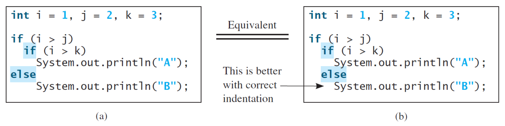

# Basic Java

## Elementary Programming

### Identifiers

**标识符**(identifiers)是一个包括字母、数字、下划线(underscores)（`_`）和美元符号（`$`）的字符序列。

- 不能以数字开头
- 不能是保留字，`#!java true`、`#!java false` 和 `#!java null` 也不行
- 可以是任意长度
- 区分大小写


### Variables

变量的声明、赋值和初始化语法和 C/C++ 基本一样。但不同之处在于

- Java **不区分变量的声明和定义**
- Java **不会**对方法内的局部变量赋予一个**默认值**，而使用未初始化的变量会发生编译错误


### `#!java final`

`#!java final` 的三种用法：

- 修饰**变量**：
    - `#!java final` 变量是**不可改变的**，但它的值可以在运行时初始化，也可以在编译时初始化，甚至可以放在构造函数中初始化，而不必在声明的时候初始化，所以下面的语句均合法：

        ```java
        final int i = 1;                            // 编译时
        final int i2 = (int)(Math.Random() * 10);   // 运行时
        final int i3;                               // 构造函数里再初始化
        ```

    - 如果修饰引用变量，则表示这个变量**不可再指向其它对象**，而不是表示对象内容本身不可更改

        ```java
        final Value v = new Value(); 
        v = new Value();  // 不允许！
        ```

- 修饰**方法**：表示一个函数不可更改，也就是**不能被重载**了，而不是修饰返回值的
- 修饰**类**：表示**整个类不能被继承**了（自然里面的所有方法也相当于被加了 `#!java final`）

>注：Java 有保留字 `#!java const`，但是没有任何实际功能。


### Numerical Data Types

数值基本类型：

|类型|大小|最小值|最大值|
|:-|:-|:-|:-|
|`#!java byte`|1B|-128|127|
|`#!java short`|2B|-32768|32767|
|`#!java int`|4B|–2,147,483,648|2,147,483,647|
|`#!java long`|8B|–9,223,372,036,854,775,808|9,223,372,036,854,775,807|
|`#!java float`|4B|大约 –3.4E+38，有 7 个有效位|大约 3.4E+38，有 7 个有效位|
|`#!java double`|8B|大约 –1.7E+308，有 15 个有效位|约 1.7E+308，有 15 个有效位|

Java 中整型的范围**与**运行 Java 代码的**机器无关**，解决了平台移植的问题。

数值运算符和 C/C++ 基本一致，故不展开介绍。不过这里提一下需要注意的点：

- 在 Java 中，当 `#!java byte`、`#!java short` 或 `#!java char` 类型参与算术运算时，它们会被**自动提升为 `#!java int` 类型**进行计算
    
特殊的数字格式：

```java
145_345.23  // 可以在数字里的任何地方放下划线
0b11001011  // 二进制
// 0x：十六进制；0：八进制
```


### Literals

- 整数字面量
    - 只能赋给整数变量
    - 当字面量太大，变量无法容纳时将会发生编译错误
    - 默认为 `#!java int` 类型；若要指定为 `#!java long` 类型，需要在附加一个 `L` 或 `l` 后缀
- 浮点数字面量
    - 默认为 `#!java double` 类型
    - 若要指定为 `#!java float` 类型，需要在附加一个 `F` 或 `f` 后缀；或者附加一个 `D` 或 `d` 后缀来显式指定 `#!java double`
    - 特殊的浮点数值：
        - 正无穷大：`#!java Double.POSITIVE_INFINITY`
        - 负无穷大：`#!java Double.NEGATIVE_INFINITY`
        - NaN（不是一个数字）：`#!java Double.NaN`
            - 用 `#!java Double.isNaN` 来判断是否是数字


### Type Casting

<figure style=" width: 60%" markdown="span">
    
    
    <figcaption></figcaption>
</figure>

>实线表示无信息丢失的转换，虚线表示可能有精度损失的转换。

**类型转换**(type casting)分为：

- **隐式**(implicit)转换：
    - 类型拓宽：`#!java double d = 3`
- **显式**(explicit)转换：
    - 类型缩窄：`#!java int i = (int)3.0;`
    - 小数部分截断：`#!java int i = (int)3.9;`

如果出现类型缩窄但没有显式转换的情况，编译器很可能会报错。

四舍五入：

```java
double x = 9.997;
int nx = (int) Math.round(x);   // 因为 round 返回值为 long，所以还要转换到 int 上
```


## Selections

布尔类型：

- 关键字为 `#!java boolean`，取值只有 `#!java true` 和 `#!java false`
- **整型与布尔型不能直接转换**
    - 所以当 `even` 为 `#!java boolean` 变量时，`#!java if (even != 0)` 是错的

if-else 语句：

- 基本上和 C/C++ 语法一致
- `#!java else` 自己匹配相同块内最近的 `#!java if` 语句

    ???+ example "例子"

        <div style="text-align: center">
            
        </div>

switch-case 语句：

- 基本上和 C/C++ 语法一致（同样注意各 `#!java case` 结束后 `#!java break` 的使用！）
- `#!java switch` 语句支持以下类型：
    - 基本整数类型：`#!java byte`、`#!java short`、`#!java char`、`#!java int`
    - 包装类：`Byte`、`Short`、`Character`、`Integer`
    - 枚举：`#!java enum`
    - 字符串：`String`
    - 引用类型：自 Java 17/21 起支持所有 `Object`（通过模式匹配）
    - 空值：自 Java 17/21 起支持 `#!java null`（需显式写出 `#!java case null`）
- `#!java case` 语句的值的类型必须和 `#!java switch` 语句的值相同，且仅支持常量表达式（不能在表达式中包含变量）

条件运算符：`#!java boolean-expression ? exp1 : exp2`

运算符优先级：

``` linenums="1"
var++, var--
+, - (Unary plus and minus), ++var, --var
(type) Casting
! (Not)
*
, /, % (Multiplication, division, and remainder)
+, - (Binary addition and subtraction)
<, <=, >, >= (Relational operators)
==, != (Equality)
^ (Exclusive OR)
&& (Conditional AND) Short-circuit AND
|| (Conditional OR) Short-circuit OR
=, +=, -=, *=, /=, %= (Assignment operator)
```

如果具有相同优先级的运算符彼此相邻，它们的结合性决定了计算顺序：**除了赋值运算符**（它是**右结合**的(right-associative)）之外，所有二元运算符都是**左结合**的(left-associative)。


## Mathematical Functions, Characters, and Strings

### `java.lang.Math` 

- 类常量：`PI`、`E`
- 类方法：
    - 三角函数：

        ```java
        sin(double a)
        cos(double a)
        tan(double a)
        acos(double a)
        asin(double a)
        atan(double a)
        ```

    - 指数函数：

        ```java
        exp(double a)
        log(double a)
        log10(double a)
        pow(double a, double b)
        sqrt(double a)
        ```

    - 舍入函数：

        ```java
        double ceil(double x)
        double floor(double x)
        double rint(double x)     // 舍入到最近的整数；如果离两个整数一样近，那就舍入到偶数
        int round(float x)        // (int) Math.floor(x + 0.5) 
        long round(double x)      // (long) Math.floor(x + 0.5)
        ```

    - `#!java max(a, b)` 和 `#!java min(a, b)`
    - `#!java abs(a)`
    - 随机函数：`random()`，返回 `[0.0, 1.0)` 范围内的随机 `#!java double` 值


### Character Data Type

- Java 字符使用 **Unicode** 字符集和 **UTF-16** 编码方案，占用 **2 个字节**，以 `\u` 开头，表示为四个十六进制数字，从 `\u0000` 到 `\uFFFF`
- 一定用**单引号**包裹
- 递增运算符 `++` 和递减运算符 `--` 也可以用于 `#!java char` 变量，以获取下一个或前一个 Unicode 字符
- 字符和整数类型间的转换：

    ```java
    int i = 'a';    // Same as int i = (int)'a';
    char c = 97;    // Same as char c = (char)97;
    ```

- `Character` 类方法：

    ```java
    isDigit(ch)             // 是否为数字
    isletter(ch)            // 是否为字母
    isletterOrDigit(ch)     // 是否为字母或数字
    isLowerCase(ch)         // 是否为小写字母
    isUpperCase(ch)         // 是否为大写字母
    tolowerCase(ch)         // 转小写字母
    toUpperCase(ch)         // 转大写字母
    ```


### `String` Type

- `String` 实际上是 Java 库中的一个预定义类，被称为**引用类型**(reference type)，而不是基本类型(primitive type)
- 初始化：

    ```java
    String s1 = "Hello";

    String s2 = new String("Hello");

    char[] data = {'a', 'b', 'c'};
    String s3 = new String(data);
    ```

- `String` 对象的简单方法（**实例方法**(instance methods)）：

    ```java
    length()            // 字符串长度
    charAt(index)       // 指定索引下的字符
    concat(s1)          // 和另一个字符串拼接
    toUpperCase()       // 所有字母转大写
    toLowerCase()       // 所有字母转小写
    trim()              // 移除字符串两边的空白字符
    ```

    - 调用实例方法的语法：`referenceVariable.methodName(arguments)`
    - 非实例方法被称为**静态方法**(static methods)，可以在不使用对象的情况下调用

- 比较字符串：

    ```java
    equals(s1)                  // 两个字符串是否相等
    equalsIgnoreCase(s1)        // 同 equals，但大小写不敏感
    compareTo(s1)               // 字符串是否大于 s1，返回一个整数，
                                // 正数/0/负数分别表示比 s1 大/相等/小
    compareToIgnoreCase(s1)     // 同 compareToIgnoreCase，但大小写不敏感
    startswith(prefix)          // 字符串是否以特定前缀开始
    endsWith(suffix)            // 字符串是否以特定后缀结束
    ```

    - 注意：使用 `==` 是在比较两个引用是否指向同一个对象（一般不会这么做，往往是搞错用法了）

- 获取子字符串：

    ```java
    substring(beginIndex)               // 从 beginIndex 开始到最后的子字符串
    substring(beginIndex, endIndex)     // 从 beginIndex 开始到 endIndex - 1
                                        //（不包括 endIndex）的子字符串
    ```

- 在字符串中寻找字符或子字符串

    ```java
    indexOf(ch)                 // 字符 ch 第一次出现时的索引，若没找到返回 -1
    indexOf(ch, fromIndex)      // 从 fromIndex 开始，字符 ch 第一次出现时的索引，若没找到返回 -1
    indexOf(s)                  // 字符串 s 第一次出现时的索引，若没找到返回 -1
    indexOf(s, fromIndex)       // 从 fromIndex 开始，字符串 s 第一次出现时的索引，若没找到返回 -1

    // 寻找最后一次出现的索引，和前 4 个方法对应
    lastIndexOf(ch)
    lastIndexOf(ch, fromIndex)
    lastIndexOf(s)
    lastIndexOf(s, fromIndex)
    ```

- 字符串与数字的转换：

    ```java
    // 字符串 —> 数字
    int intValue = Integer.parseInt(intString);
    double doubleValue = Double.parseDouble(doubleString);

    // 数字 -> 字符串
    String s1 = String.valueOf(number1);
    String s2 = number2 + "";
    ```

    - `valueOf` 是 `String` 类的**静态方法**
    - 实际上 `valueOf` 做的事是直接调用并返回该对象的 `toString()` 方法（除了 `null` 对象返回字符串 `"null"`），后者是由 `Object` 定义的
        - 对于自定义类，我们可以重写 `toString()` 方法，返回一个包含人类可读的字符串，并能合理描述类的对象的 `String` 对象

- 替换和分割字符串：

    ```java
    // 返回一个新的字符串，将此字符串中所有匹配的字符替换为新字符
    replace(oldChar: char, newChar: char): String
    // 返回一个新的字符串，该字符串将此字符串中的第一个匹配子串替换为新子串
    replaceFirst(oldString: String, newString: String): String
    // 返回一个新的字符串，该字符串将此字符串中所有匹配的子字符串替换为新子字符串
    replaceAll(oldString: String, newString: String): String
    // 返回由 delimiter（分隔符）分割的子字符串组成的字符串数组
    split(delimiter: String): String[]
    ```

    - 支持**正则表达式**(regular expressions)（包括 `matches` 方法）

- 字符串格式（**静态方法**）：`#!java String.format(format, item1, item2, ..., itemk)`

- `+` 运算（拼接）：

    ```java
    "I’m " + 18     // "I’m 18"
    1 + 2 + "age"   // "3age"
    "age" + 1 + 2   // "age12"
    ```

    - 字符串和数字相加时，数字会自动转换为字符串

- 块(block)语法（和 Python 类似）：

    ```java
    String html = """
                    <html>
                    <body>
                        <p>Hello, world</p>
                    </body>
                    </html>
                    """;
    ```

    - 起止各一行 `"""` ，单独占一行（开头 `"""` 后不能直接跟内容）
    - 内容自动去掉公共前缀空白，保留相对缩进

- `String` 是**不可变的**(immutable)，即创建 `String` 实例后内容无法再更改
    - 因此没有任何函数能改变字符串的内容
    - 但声明为 `String` 引用的变量可以在任何时候改变以指向其他 `String` 对象

    ??? info "为什么要“不可变”"

        >来自 wk 课件（~~但看起来像是 AI 回答的~~）

        - 并发/线程安全
            - 无状态：对象只读，天然支持多线程共享，无需同步
            - 无竞争：写并发代码时不用担心“读到一半被修改”
        - 哈希与索引
            - hashCode 缓存：计算一次后缓存到字段 `hash` ，后续 `HashMap/get` 直接复用，复杂度从 O(n) -> O(1)
            - 键可信：作为 `HashMap` / `HashSet` 的 key 时，中途内容变化导致哈希漂移的灾难不可能发生（对比 `char[]` 或 `StringBuilder`）
        - 字符串常量池（StringTable）
            - `intern()` 复用：字面量自动入池，相同内容全局一份，节省堆内存
            - 地址比较：`"foo"=="foo"` 直接返回 `true`，JVM 级别优化
        - 安全性与完整性
            - 类加载器隔离：类名、文件路径、权限字符串一旦传入就无法被篡改，防止“在 check 之后、use 之前”被恶意代码改掉
            - 网络/文件句柄：`new URL("http://xxx")` 的协议、主机名不可变，避免校验后地址被替换
        - 编译器 & JVM 优化
            - 字符串折叠：编译期常量表达式 `"a" + "b"` 直接变成 `"ab"` ，减少运行时拼接
            - 栈上优化：逃逸分析后不可变对象可拆成标量替换，消灭堆分配
            - 共享子串：JDK 7 以前 substring 共享底层 `char[]`（offset + count），避免复制；JDK 7 之后虽然改为复制，但仍保留不可变语义，让 JIT 放心做循环不变量外提等优化

    - 要想支持字符串的修改，可以采用 `StringBuilder` 和 `StringBuffer` 类（[之后会介绍](3.md#stringbuilder-and-stringbuffer)）

>更多 `String` 的 API 见[官方文档](https://docs.oracle.com/javase/8/docs/api/java/lang/String.html)。


### Input: The `Scanner` Class

使用步骤：

1. 导入包：`#!java import java.util.Scanner;`
2. 创建对象：连接到输入流（如 `System.in`）
3. 读取数据：调用相应的方法获取输入
4. 关闭资源：使用完毕后关闭流（良好的编程习惯）

???+ example "例子"

    ```java
    import java.util.Scanner;

    public class Test {
        public static void main(String[] args) {
            // 1. 创建 Scanner 对象，读取标准输入
            Scanner sc = new Scanner(System.in);

            System.out.println("请输入一个整数：");
            // 2. 读取数据
            if (sc.hasNextInt()) {
                int num = sc.nextInt();
                System.out.println("你输入的是：" + num);
            }

            // 3. 关闭资源
            sc.close();
        }
    }
    ```

常用读取方法：

```java
Scanner(source: File)        // 创建一个从指定文件读取数据的 Scanner 对象
Scanner(source: String)      // 创建一个从指定文件读取数据的 String 对象
close()
hasNext(): boolean           // 如果 Scanner 的输入中还有另一个 token，则返回 true
next(): String
nextByte(): byte
nextShort(): short
nextInt(): int
nextLong(): long
nextFloat(): float
nextDouble(): double
useDelimiter(pattern: String): Scanner    // 设置分隔符模式
```

- `next()`：读取下一个标记(token)，以空白符（空格、制表符和换行符等）作为分隔
    - 可简单理解为读取一个单词，跳过开头的空白字符，并且再次读到空白字符就立即停止读取（空白字符不会读进来）

- `nextLine()`：读取整行内容，直到遇到回车符
- `nextInt()`：将下一个标记解析为 `#!java int` 类型
- `nextDouble()`：将下一个标记解析为 `#!java double` 类型
- `hasNext...()`：判断是否还有下一个指定类型的内容，常用于校验输入

也可以设置字符编码

```java
Scanner in = new Scanner(Paths.get("myfile.txt"), "UTF-8");
```

!!! warning "注意事项"

    - `nextInt()` 与 `nextLine()` 混用问题：
        - 当先调用 `nextInt()` 再调用 `nextLine()` 时，`nextInt()` 只会读取数字，而数字后面的回车换行符会留在缓冲区；接着调用的 `nextLine()` 会直接读取到这个回车符，导致看起来好像“跳过”了输入
        - 解决方法：在 `nextInt()` 之后多写一行额外的 `nextLine()` 来消费掉那个多余的回车符
    - 性能问题：内部使用正则表达式进行匹配，虽然功能强大且方便，但读取速度较慢
        - 如果对性能需求敏感，建议改用 `BufferedReader` 以获得更好的性能


### Formatted Output

格式化输出语句：`#!java System.out.printf(format, items)`。其中 `format` 是一个包含字符串和格式说明符的字符串。**格式说明符**(format specifier)指定 item（可能是一个数值、字符、布尔值或字符串）应该如何显示，且都以百分号开始。

常用说明符：

- `%b`：布尔值
- `%c`：字符
- `%d`：整数
- `%f`：浮点数
- `%e`：采用标准科学计数法的数字
- `%s`：字符串

<figure style=" width: 70%" markdown="span">
    
    
    <figcaption></figcaption>
</figure>

占位符完整格式为：`%[index$][标识]*[最小宽度][.精度]转换符`。

- `%`：占位符的起始字符，若要在占位符内部使用 `%`，则需要写成 `%%`
- `[index$]`：位置索引从 1 开始计算，用于指定对索引相应的实参进行格式化并替换掉该占位符
- `[标识]`：用于增强格式化能力，可同时使用多个 `[标识]`，但某些标识是不能同时使用的
- `[最小宽度]`：用于设置格式化后的字符串最小长度，若使用 `[最小宽度]` 而无设置 `[标识]`，那么当字符串长度小于最小宽度时，则以左边补空格的方式凑够最小宽度
- `[.精度]`：对于浮点数类型格式化使用，设置保留小数点后多少位
- `转换符`：用于指定格式化的样式，和限制对应入参的数据类型

??? note "字符、字符串的格式化"

    - 占位符格式：`%[index$][标识][最小宽度][转换符]`
    - 可用标识：
        - `-`：在最小宽度内左对齐，右边用空格补上
    - 可用转换符：
        - `s`：字符串类型
        - `c`：字符类型，实参必须为 `#!java char` 或 `#!java int`、`#!java short` 等可转换为 `#!java char` 类型的数据类型，否则抛 `IllegalFormatConversionException` 异常
        - `b`：布尔类型，只要实参为非 `#!java false` 的布尔类型，均格式化为字符串 `#!java true`，否则为字符串 `#!java false`
        - `n`：平台独立的换行符（与通过 `System.getProperty("line.separator")` 是一样的）

??? note "整数的格式化"

    - 占位符格式：`%[index$][标识]*[最小宽度]转换符`
    - 可用标识：
        - `-`：在最小宽度内左对齐，不可以与 `0` 标识一起使用
        - `0`：若内容长度不足最小宽度，则在左边用 `0` 来填充
        - `#`：对 8 进制和 16 进制，8 进制前添加一个 `0`，16 进制前添加 `0x`
        - `+`：结果总包含一个 `+` 或 `-` 号
        - 空格：正数前加空格，负数前加 `-` 号
        - `,`：只用于十进制，每 3 位数字间用 `,` 分隔
        - `(`：若结果为负数，则用括号括住，且不显示符号

    - 可用转换符：
        - `b`：布尔类型
        - `d`：整数类型（十进制）
        - `x`：整数类型（十六进制）
        - `o`：整数类型（八进制）
        - `n`：平台独立的换行符，也可通过 `System.getProperty("line.separator")` 获取

??? note "浮点数的格式化"

    - 占位符格式：`%[index$][标识][最小宽度][.精度]转换符`
    - 可用标识：同整数
    - 可用转换符：
        - `b`：布尔类型
        - `n`：换行符
        - `f`：浮点数型（十进制），显示 9 位有效数字，且会进行四舍五入
        - `a`：浮点数型（十六进制）
        - `e`：指数类型（如 9.38e+5）
        - `g`：浮点数型没，比 `%f`，`%a` 长度短些，显示 6 位有效数字，且会进行四舍五入

??? note "日期时间的格式化"

    - 占位符格式：`%[index$]t转换符`
    - 日期转换符：
        - `c`：星期六 十月 27 14:21:20 CST 2007
        - `F`：2007-10-27
        - `D`：10/27/07
        - `r`：02:25:51 下午
        - `T`：14:28:16
        - `R`：14:28
        - `b`：月份简称
        - `B`：月份全称
        - `a`：星期简称
        - `A`：星期全称
        - `C`：年前两位（不足两位补零）
        - `y`：年后两位（不足两位补零）
        - `j`：当年的第几天
        - `m`：月份（不足两位补零）
        - `d`：日期（不足两位补零）
        - `e`：日期（不足两位不补零）

    - 时间转换符：
        - `H`：24 小时制的小时（不足两位补零）
        - `k`：24 小时制的小时（不足两位不补零）
        - `I`：12 小时制的小时（不足两位补零）
        - `i`：12 小时制的小时（不足两位不补零）
        - `M`：分钟（不足两位补零）
        - `S`：秒（不足两位补零）
        - `L`：毫秒（不足三位补零）
        - `N`：毫秒（不足 9 位补零）
        - `p`：小写字母的上午或下午标记，如中文为“下午”，英文为pm
        - `z`：相对于 GMT 的时区偏移量，如 +0800
        - `Z`：时区缩写，如 CST
        - `s`：自 1970-1-1 00:00:00 起经过的秒数
        - `Q`：自 1970-1-1 00:00:00 起经过的毫秒


## Loops

- `#!java while` 循环和 `#!java do-while` 循环基本上和 C/C++ 一致
- 带标签的 `#!java break` 语句，实现智能跳出语句块（而非跳入）
    - 标签可用在任何语句中，甚至在 `#!java if` 或块语句中

    ```java
    first:for (int j = 0; j < 5; j++) {
        second:for (int i = 0; i < 5; i++) {
            if (i == 0) {
                System.out.println(i);
                break first;
            }
        }
    }
    ```

- `#!java for` 循环也和 C/C++，其中 Java 5 引入了更加简洁的 `for-in` 语法，用于数组和容器：

    ```java
    int[] arr = {1, 2, 3, 4, 5};
    for (int num : arr)
        System.out.println(num);
    ```


## Methods

**方法**(methods)是一个被分组在一起以执行某一操作的语句集合。

<div style="text-align: center">
    
</div>

- **方法签名**(method signature)：方法名和参数列表的组合
- **形式参数**(formal parameters)（形参）：方法头中定义的变量
- **实际参数**(actual parameters)（实参）：调用方法时传递的参数值
- 返回值类型

Java 方法是**按值传参**的，传递的是变量或引用的副本，所以在方法内对参数修改不会改变方法外的变量或引用。

方法的**重载**(overloading)是指在一个类中可以定义多个**名称相同但参数列表不同**的方法。注意区分重载和**重写**(overriding)：

<div align=center markdown>

| 特性 | 方法重载 | 方法重写 |
| :--- | :--- | :--- |
| 发生范围 | 同一个类中 | 父子类之间 |
| 方法名 | 必须相同 | 必须相同 |
| 参数列表 | 必须不同 | 必须相同 |
| 返回值 | 可以不同 | 必须相同（或其子类） |
| 判定时间 | 编译阶段 | 运行阶段 |

</div>

**模糊调用**(ambiguous invocation)：有时对于方法的调用可能会有两个或更多可能的匹配，但编译器无法确定最具体的匹配，这是一个**编译错误**。可能的原因有：

- 方法重载时，多个方法的参数列表可能存在一定的重叠，导致编译器无法确定调用哪个方法
- 方法调用中涉及自动类型转换或可变参数时，可能会有多个方法同时符合调用条件

???+ example "例子"

    ```java
    public class AmbiguousOverloading {
        public static void main(String[] args) {
            System.out.println(max(1, 2));
        }

        public static double max(int num1, double num2) {
            if (num1 > num2)
                return num1;
            else
                return num2;
        }

        public static double max(double num1, int num2) {
            if (num1 > num2)
                return num1;
            else
                return num2;
        }
    }
    ```


## Arrays

**数组**(array)是一种表示相同类型数据集合的数据结构。


### Single-Dimensional Arrays

- 数组变量声明：

    ```java
    datatype[] arrayRefVar;
    datatype arrayRefVar[];      // 可以这么写，但不推荐
    ```

- 创建数组：`#!java arrayRefVar = new datatype[arraySize];`
- 一步完成数组的声明和创建：`#!java datatype[] arrayRefVar = new datatype[arraySize];`
- 被 `#!java final` 的数组不可以指向其他数组对象，但数组元素是可变的
- 数组创建后**长度固定不变**，其值为 `rrayRefVar.length`；并且**所有元素会被赋予默认值**
    - 数值基础类型：`0`
    - `#!java char` 类型：`\u0000`
    - `#!java boolean` 类型：`#!java false`

- 数组长度：`arrayRefVar.length`
- 通过索引访问数组元素：`arrayRefVar[index]`，`index` 范围为 `[0, arrayRefVar.length-1]`
- 数组**初始化器**(intializer)：一步完成声明、创建和初始化的简写语法，注意一定要在一条语句内完成，不能拆成多句

    ```java
    double[] myList = {1.9, 2.9, 3.4, 3.5};

    // 以下语句是错误的！
    double[] myList;
    myList = {1.9, 2.9, 3.4, 3.5};
    ```

- 数组分配在**堆**上
- `[]` 运算符被预定义为**检查数组边界**，而且没有指针运算，就不能通过 `a+1` 得到下一个元素
- `main` 函数中的 `String[] args` 参数表示命令行参数；注意 `args[0]` 就是第一个参数，程序名没有存储在 `args` 中
- 复制数组：
    - 如果直接使用赋值语句（比如 `list2 = list1;`），那么这只是让 `list2` 同时引用了 `list1` 的对象，并没有真的创建数组副本（**浅拷贝**）

        <div style="text-align: center">
            
        </div>

    - 正确实现（**深拷贝**）：
        - 手动实现：新建数组，利用循环逐元素复制

            ```java
            int[] sourceArray = {2, 3, 1, 5, 10};
            int[] targetArray = new int[sourceArray.length];
            for (int i = 0; i < sourceArrays.length; i++)
                targetArray[i] = sourceArray[i];
            ```

        - `#!java System.arraycopy(sourceArray, src_pos, targetArray, tar_pos, length)` 函数
            - 例子：`#!java System.arraycopy(sourceArray, 0, targetArray, 0, sourceArray.length);`
        
        - `#!java Arrays.copyOf(array, length)` 方法
            - 第 2 个参数是新数组的长度，这个方法通常用来改变数组的大小
                - 如果数组元素是数值型，则多余的元素被赋值为 `0`；若是布尔型，则赋值为 `#!java false`
                - 如果长度小于原始数组长度，则只拷贝前面的元素
            - 例子：
            
                ```java
                int[] copiedLuckyNumbers = Arrays.copyOf(luckNumbers, 2 * luckyNumbers.length);
                ```

- **匿名数组**(anonymous array)：数组没有对应的显式引用变量
    - 例子：`#!java printArray(new int[]{3, 1, 2, 6, 4, 2});`（`printArray()` 是自定义函数）

- 虽说 Java **按值传递**参数，但对于数组这种引用类型而言，复制到方法中的参数值是指向数组实际内容的引用，因此修改数组参数是**会实际影响到数组内容的**


### MultiDimensional Arrays

- 声明/创建二维数组：

    ```java
    // 声明
    dataType[][] refVar;

    // 创建数组并赋值
    refVar = new dataType[10][10];
    // 注意：声明时可以缺省第二维的长度，但必须要指明第一维的长度
    refVar = new dataType[10][];    // OK
    refVar = new dataType[][10];    // Error!

    // 二合一
    dataType[][] refVar = new dataType[10][10];

    // 另一种语法
    dataType refVar[][] = new dataType[10][10];
    ```

- 数组初始化器：使用简写记号完成声明 + 创建 + 初始化

    ```java
    int[][] array = {
        {1, 2, 3},
        {4, 5, 6},
        {7, 8, 9},
        {10, 11, 12}
    };
    ```

- 长度：

    <div style="text-align: center">
        
    </div>

- 二维数组的每一行可以有不同的长度，这样的数组称为**锯齿状数组**(ragged array)

    ```java
    int[][] matrix = {
        {1, 2, 3, 4, 5},
        {2, 3, 4, 5},
        {3, 4, 5},
        {4, 5},
        {5}
    };

    /**
    matrix.length is 5
    matrix[0].length is 5
    matrix[1].length is 4
    matrix[2].length is 3
    matrix[3].length is 2
    matrix[4].length is 1
    */
    ```