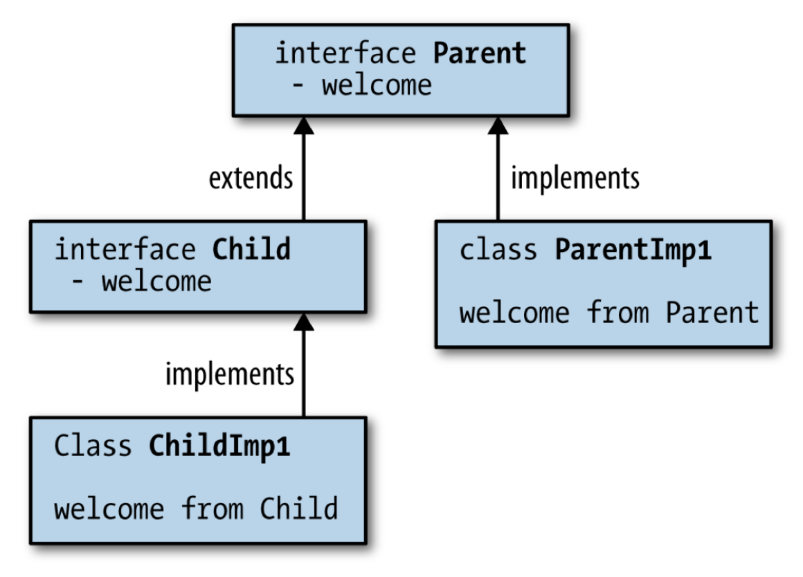

# Inheritance and Polymorphism

## Inheritance

**继承**(inheritance)是面向对象设计方法论的重要组成部分，是一种将一个类的行为或实现定义为另一个类的超集的能力。通过继承，可以在类之间分享字段和方法。而在 Java 中，继承自然是一个关键的技术。

继承的语法如下：

```java
class ThisClass extends SuperClass {
    // class body
}
```

- 继承与构造函数(ctor)
    - 将继承特性视为嵌入的对象
    - 子类对象的一部分就是超类对象
    - 因此超类的那部分必须在子类初始化之前进行初始化，也就是说要先构造好基类
    - 如果没有向基类显式传递参数，那么就会调用默认构造函数
    - 对于带参的超类构造函数，使用 `#!java super` 关键字来调用这个构造函数并传参

- 没有**名称隐藏**(name hiding)：Java 允许子类定义和超类名称相同但参数列表不同的方法，此时这个方法不会覆盖超类的同名方法
- 不会被继承的东西：
    - 构造函数
    - 私有数据被隐藏，但仍然存在

- 初始化和类加载
    - TBD

- **向上转型**(upcasting)：
    - 将对象句柄当作其基类型的句柄来处理
    - 子类和超类的关系为：新类是现有类的一种类型

- **方法调用绑定**(method call binding)：连接方法调用与方法体，应调用哪个函数？
    - **静态绑定**(static binding)：按代码调用函数
    - **动态绑定**(dynamic binding)：调用对象的函数

- **覆盖**(override)
    - 当超类和子类的方法名和函数均相同时，子类方法会覆盖超类方法
    - 对字段、构造函数和私有方法不适用


## Abstract Functions and Abstract Classes

- **抽象类**(abstract class)是为了创建一个对所有从它派生的类的公共接口
- **抽象方法**(abstract method)是不完整的，只有声明，没有方法体；包含抽象方法的类就是抽象类
- **接口**(interface)：完全的抽象类
    - 接口中的所有方法都是 `#!java public` 的
    - 接口中所有的数据成员都是 `#!java public static final`
    - 定义接口

        ```java
        public interface InterfaceName extends BaseInterfaces
        ```

    - 从接口继承

        ```java
        class ClassName implements interfaces
        ```

    - 接口可作为类使用
    - 一个接口可以继承自多个接口，但不能继承自类
    - 一个类可实现多个接口

- `#!java default`：接口可以拥有包含函数体的“默认”函数

    ```java
    public interface Greeting {
        // 普通抽象方法
        void sayHello(String name);

        // default 方法：带默认实现，实现类可复用也可覆盖
        default void sayHi(String name) {
            System.out.println("Hi, " + name + " (from default method)");
        }
    }

    class EnglishGreeting implements Greeting {
        @Override
        public void sayHello(String name) {
            System.out.println("Hello, " + name);
        }
    }
    ```

- 默认方法和子类化

    { width=30% align=right }

    ```java
    public interface Parent {
        public void message(String body);
        public default void welcome() { message("Parent: Hi!"); }
        public String getLastMessage();
    }

    public interface Child extends Parent {
        public default void welcome() { message("Child: Hi!"); }
    }
    ```


## POJO and Records

## Enums

## Inner Classes

## Lambda Expression