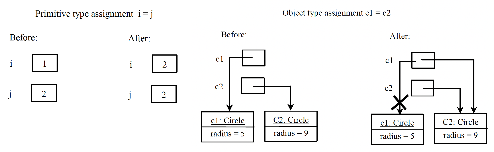
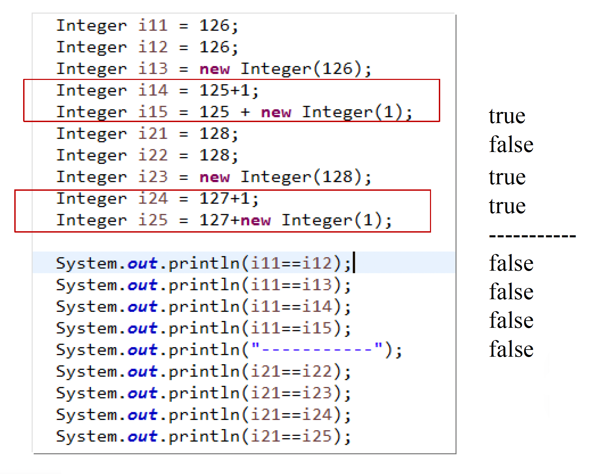
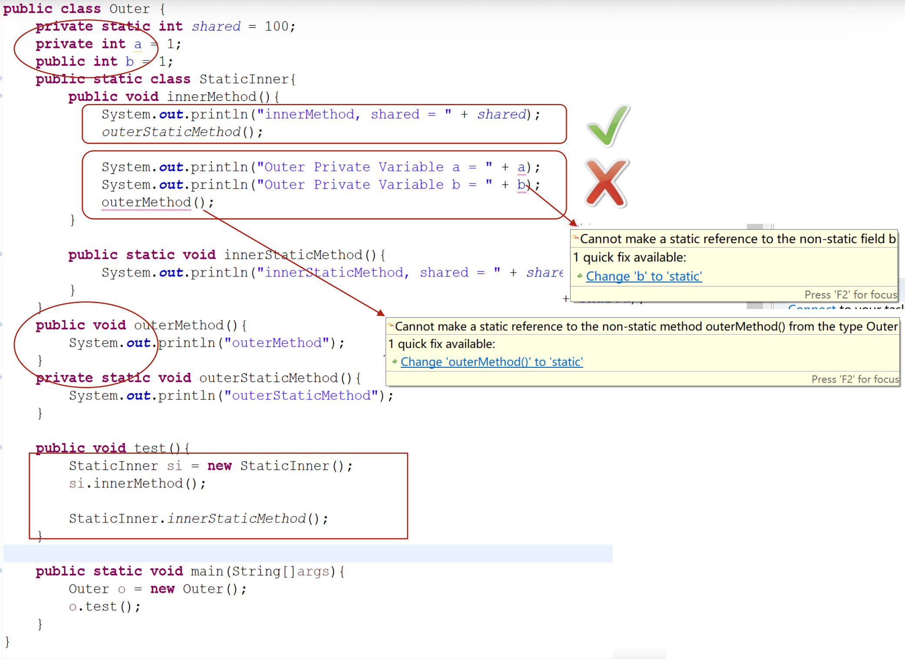
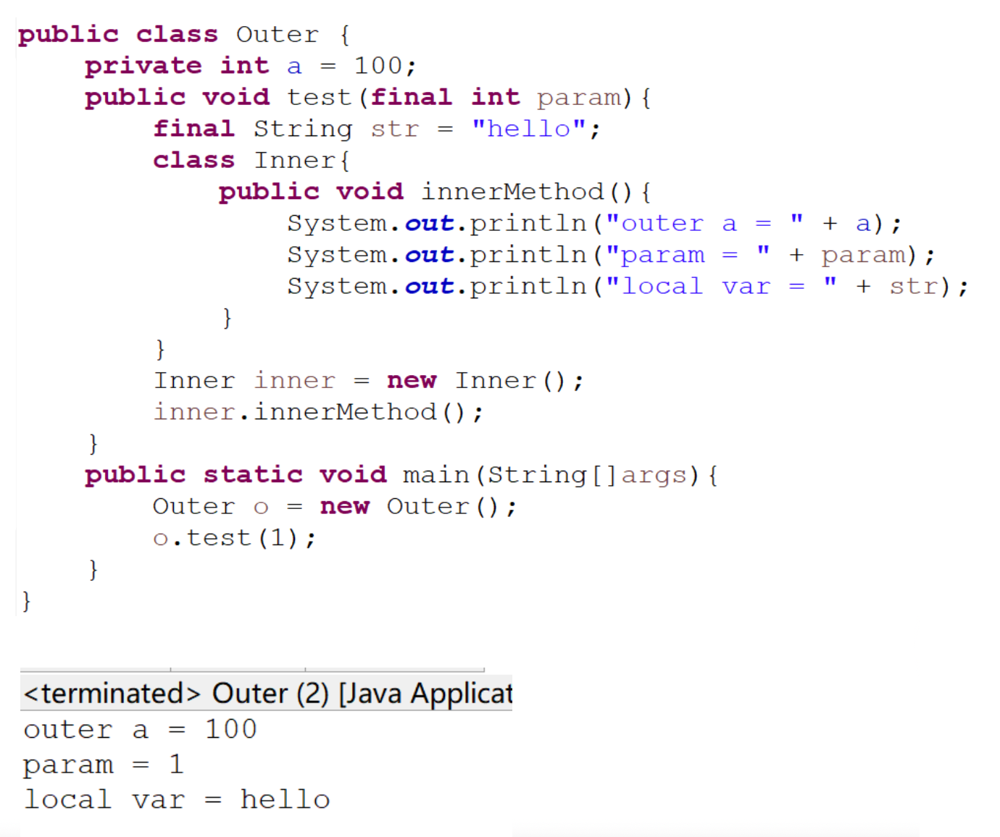

# Oriented-Object Programming

**面向对象编程**(object-oriented programming, OOP)是指使用**对象**的编程。


## Classes and Objects

- **对象**(objects)：现实世界中能被唯一识别的实体
    - 一个对象有唯一的身份、状态和行为
    - 对象的**状态**(state)由一组带有当前值的**数据字段**(data fields)（又称为**属性**(properties)）构成
    - 对象的**行为**(behavior)由一组**方法**(methods)定义
    - 对象实例（以及数组）所需的内存都是在**堆**上分配的

- **类**(classes)是定义相同类型对象的构造
    - Java 类使用**变量**来定义数据字段，用**方法**来定义行为
    - **UML 类图**(UML class diagram)：通过图形化方式展示类的属性和方法

???+ example "例子"

    ```java
    class Circle {
        // Data field
        /** The radius of this circle */
        double radius = 1.0;
        
        // Consturctors
        /** Construct a circle object */
        Circle() {
        }

        /** Construct a circle object */
        Circle(double newRadius) {
            radius = newRadius;
        }
        
        // Method
        /** Return the area of this circle */
        double getArea() {
            return radius * radius * 3.14159;
        }
    }
    ```


### Constructors

另外，类提供了一组叫做**构造函数**(constructors)的特殊方法，用于从类中构造对象，并起到初始化对象的作用。

- 没有参数的构造函数被称为**无参构造函数**(no-arg constructor)
- 构造函数名必须与类名相同
- 构造函数没有返回类型，连 `#!java void` 也没有
- 创建对象时要用 `#!java new` 运算符调用构造函数
- **默认构造函数**(default constructors)
    - 定义类时可能没有构造函数，此时一个带有空函数体的无参构造函数会被**隐式**(implicitly)定义，该函数就是默认构造函数
    - 该函数仅在**没有任何显式定义的构造函数**时自动提供

- 声明对象引用变量：`#!java ClassName objectRefVar;`
- 声明 + 创建：`#!java ClassName objectRefVar = new ClassName();`
- 访问对象成员：
    - 引用对象数据：`#!java objectRefVar.data`
    - 调用对象方法：`#!java objectRefVar.methodName(arguments)`

- 数据字段的默认值
    - 引用类型：`#!java null`
    - 数值类型：`0`
    - 布尔类型：`#!java false`
    - 字符类型：`#!java \u0000`
    - 注意：Java **不会为方法内的局部变量赋予默认值**，直接使用会发生编译错误

- Java 中数据成员的初始化过程：
    1. **默认初始化**：实际上是把刚分配的对象内存都置零
    2. **指定初始化**：进行定义处的初始化（直接给变量赋值，或者一个直接写在 class 里的块）
    3. **构造函数初始化**

- 基本数据类型和对象类型在拷贝变量操作上的区别：

    <div style="text-align: center">
        
    </div>


### Garbage Collection

**垃圾回收**(garbage collection)：JVM 自动回收不再被引用的对象所占的空间，因此程序员无需手动删除或释放对象。

如果程序员知道不再需要的对象，也可以通过**将引用变量显式赋值为 `#!java null`**，提示 JVM 来回收。

???+ example "案例研究"

    ```java hl_lines="19-23"
    import java.util.Arrays;
    import java.util.EmptyStackException;

    // Can you spot the "memory leak"?
    public class Stack {
        private Object[] elements;
        private int size = 0;
        private static final int DEFAULT_INITIAL_CAPACITY = 16;

        public Stack() {
            elements = new Object[DEFAULT_INITIAL_CAPACITY];
        }

        public void push(Object e) {
            ensureCapacity();
            elements[size++] = e;
        }

        public Object pop() {
            if (size == 0)
                throw new EmptyStackException();
            return elements[--size];
        }

        /**
         * Ensure space for at least one more element, roughly
         * doubling the capacity each time the array needs to grow.
         */
        private void ensureCapacity() {
            if (elements.length == size)
                elements = Arrays.copyOf(elements, 2 * size + 1);
        }
    }
    ```

    高亮区域的代码存在**内存泄漏**的风险，因为弹出的 `elements` 元素是不再使用的对象，但 `pop()` 函数并没有释放 `elements` 数组对它的引用。

内存泄漏的来源：

- 类自己管理内存
- 缓存：当把对象引用放到缓存中，就容易被遗忘
    - 解决方案：可以用**软引用**(soft reference)（用来描述一些还有用但并非必须的对象；在系统将要发生内存溢出异常之前，将会把这些对象列进回收范围之中进行第二次回收）来实现缓存

>过时特性：当垃圾回收器准备释放用于存储对象的内存时，它将首先调用其 `finalize()` 方法（最新版本的 Java 已移除该方法）。


### Special Classes

- `java.util.Date`：一个与系统无关的日期和时间封装
    - 使用 `Date` 类创建关于当前日期和时间的实例，并用 `toString()` 方法返回日期和时间的字符串形式

    <div style="text-align: center">
        
    </div>

- `java.util.Random`：提供一组随机数生成器

    <div style="text-align: center">
        
    </div>

    - 如果两个 `Random` 对象有相同的种子，它们将会生成相同的数字序列


### Static Variables, Constants, and Methods

??? info "实例变量和方法"

    - 实例变量属于特定的实例
    - 实例方法由类的实例调用

声明静态变量/方法/常量要用 `#!java static` 关键字。

- **静态变量**(static variables)为类的所有实例共享
- **静态方法**(static methods)不与特定对象绑定
    - **只能访问静态变量和调用其他静态方法**，而不能访问实例变量，也不能调用其他实例方法
- **静态常量**(static constants)（全局常量）是所有类实例共享的 `#!java final` 变量（`#!java final static`）

???+ note "类和对象的生命周期"

    - 当程序运行的时候，第一次 `#!java new` 创建一个类的对象，或通过类名访问静态变量或静态方法时，Java 会**将类加载进内存，为这个类分配一块空间**（其实是方法区），这块空间会包括类的定义、它的变量和方法信息，还有类的静态变量，**并对静态变量赋值**
    - 类加载进内存后，一般不会释放，直到程序结束
    - 一般情况，**类只会加载一次**，所以静态变量在内存中只存在一份
    - 通过 `#!java new` 创建一个对象时，对象产生，在内存中会存储这个对象的实例变量值；每 `#!java new` 一次，都会产生一个对象，会有一份独立的实例变量

???+ note "变量的作用域"

    - **实例**和**静态**变量的作用域是整个类；它们可以在类内的任意地方被声明
    - **局部**变量的作用域从其声明开始，延续到包含该变量的代码块结束；在可以使用之前，必须显式初始化局部变量


### Visibility Modifiers and Accessor/Mutator Methods

Java 提供以下几类修饰符(modifiers)（按可见性从高到低排序）：

1. `#!java public`：类、数据和方法对**任何包内的任何类**可见
    - 同一个 .java 文件内最多只有一个类能被 `#!java public` 修饰，并且这个被修饰类的类名和文件名相同
2. `#!java protected`：数据和方法可以被**同一个包中的任何类或其子类访问**，即使这些子类位于不同的包中
3. 默认情况下无修饰符，此时类、变量和方法能被**同一个包内的其他任何类**访问
4. `#!java private`：数据和方法**仅能被声明它们的类**访问
    - 利用 get 和 set 式的方法实现对 `#!java private` 属性的读取和修改

???+ example "例子"

    <div style="text-align: center">
        
    </div>

`#!java private` 的构造函数：

- **不能创建类的实例**，类只能被静态访问
    - 例子：Java 提供的 `Math` 类的构造函数就是 `#!java private Math() {}`

- 能创建类的实例，但**只能被类的静态方法调用**
    - 常见场景：单例模式

        ??? example "例子"

            ```java
            public class Runtime {
                private static Runtime currentRuntime = new Runtime();

                /**
                 * Returns the runtime object associated with the current Java application.
                * Most of the methods of class <code>Runtime</code> are instance
                * methods and must be invoked with respect to the current runtime object.
                *
                * @return  the <code>Runtime</code> object associated with the current
                * Java application.
                */
                public static Runtime getRuntime() {
                    return currentRuntime;
                }

                /** Don't let anyone else instantiate this class */
                private Runtime() {}
            }
            ```

- 只能被其他构造函数调用，用于减少重复代码

!!! warning "注意"

    - 子类可以重写其超类中的 `#!java protected` 方法，并将其可见性更改为 `#!java public`
    - 但**子类不能削弱在超类中定义的方法的可访问性**
        - 示例：如果一个方法在超类中被定义为 `#!java public`，则它必须在子类中也被定义为 `#!java public`


### Immutable Objects and Classes

- **不可变对象**(immutable objects)：一个对象的内部内容在创建后不能被更改
- 它的类被称为**不可变类**(immutable classes)
- 同时满足以下条件的类是不可变的：
    - 不要提供任何会修改对象状态的方法（mutator）
    - 被 `#!java final` 修饰的类，这样保证类不会被继承，防止粗心或恶意的子类假装对象的状态已改变
    - 所有字段用 `#!java final` 或 `#!java private` 修饰
    - 没有返回可变数据字段对象引用的访问器方法

- 优点：
    - 不可变对象比较简单，可以只有一种状态，即被创建时的状态
    - 不可变对象本质上是**线程安全**的
    - 不可变的类可以提供静态工厂，把频繁被请求的实例**缓存**起来
    - 不需要进行保护性拷贝，因为拷贝始终都是原始的对象

- 缺点：对于每一个不同的值都需要一个单独的对象

- Java 提供的不可变类：
    - `String`
    - 基本类型的包装类（如 `Integer`, `Long` 等）
    - `BigInteger` 和 `BigDecimal`
    - `LocalDate`, `LocalTime`, `LocalDateTime`（Java 8 引入）

???+ example "例子"

    === "例1"

        ```java hl_lines="15-17"
        public class Student {
            private int id;
            private BirthDate birthDate;

            public Student(int ssn,
                        int year, int month, int day) {
                id = ssn;
                birthDate = new BirthDate(year, month, day);
            }

            public int getId() {
                return id;
            }

            public BirthDate getBirthDate() {
                return birthDate;
            }
        }
        ```

        必要时进行保护性拷贝。对于上面的代码，将高亮区域代码替换为：

        ```java
        public BirthDate getBirthDate() {
            return new BirthDate(birthDate.getYear(),birthDate.getMonth(),
                                    birthDate.getDay());
        }
        ```

    === "例2"

        类具有公有的静态 `#!java final` 数组域，或者返回这种域的访问方法，这是安全漏洞的一个常见根源。

        ```java
        // Potential security hole!
        public static final Thing[] VALUES = {...};
        ```

        修正问题的两种方法：

        ```java
        private static final Thing[] PRIVATE_VALUES = {...};
        public static final List<Thing> VALUES = 
            Collections.unmodifiableList(Arrays.asList(PRIVATE_VALUES));
        ```

        ```java
        private static final Thing[] PRIVATE_VALUES = {...};
        public static final Thing[] values() {
            return PRIVATE_VALUES.clone();
        }
        ```

### The `#!java this` Keyword

`#!java this` 关键字是指代对象自身的引用名称。常见用法有：

- 引用类的隐藏数据字段
- 能让**构造函数**调用相同类的其他构造函数

???+ example "例子"

    ```java
    public class Circle {
        private double radius;
        public Circle(double radius) {
            // this must be explicitly used to reference the data
            // field radius of the object being constructed
            this.radius = radius;  
        }

        public Circle() {
            // this is used to invoke another constructor
            this(1.0);
        }

        public double getArea() {
            // Every instance variable belongs to an instance represented by this,
            // which is normally omitted
            return this.radius * this.radius * Math.PI;
        }
    }
    ```


### Packages

**包**(package)是一个为了方便管理组织 Java 文件的目录结构，并防止不同 Java 文件之间发生命名冲突。

- `#!java package` 语句作为 Java 源文件的第一条语句（若缺省该语句，则指定为无名包）
- 约定俗成地，给包起名为把**域名倒过来写**，并用 `.` 来指明包（目录）的层次
- Java 编译器把包对应于文件系统的目录管理
- 例子：`#!java package com.sun;`，该文件中所有的类位于 `.\com\sun` 目录下
- 类的导入：
    - 在每个类前添加完整的包名：`#!java java.time.LocalDate today = java.time.LocalDate.now();`
    - 使用 `#!java import` 语句

        ```java
        import java.time.*;
        LocalDate today = LocalDate.now();
        ```

        - 使用 `*` 对代码的大小也没有任何负面的影响
        - 也可以只导入包中的特定类：`#!java import java.time.LocalDate;`
        - 当导入的多个包中存在同名类时，可以通过指定包名来区分
        - `#!java import` **不会递归**，只会引入当前包下的直接类；试图嵌套引入的形式也是无效的，如 `#!java import java.util.*.*`
        - 由于编译器会自动导入 `java.lang` 包，所以使用以下类时无需手动导入这个包
            - `String`
            - `System`
            - `Object`
            - `Math`
            - `Exception`
            - `Enum`
            - 所有包装类，比如 `Integer`, `Double` 等

        - **静态导入**：导入静态方法和静态域
            - 例子：`#!java import static java.lang.System.*;`

- 将类放入包中
    - 要将类放到包中，必须将包的名字放在源文件的开始
    - 如果没有放置 `#!java package` 语句，则这个类被放置在**默认包**中
    - 需要将类文件放置在其所属包对应的相对路径下，编译器也会将 `.class` 文件放到相同的目录结构中
    - 编译器在编译源文件时不检查目录结构
    - 当 JVM 加载某个 `class` 时，它首先找到环境变量 `CLASSPATH`，将其中的目录作为查找 `.class` 文件的根目录

    ???+ example "例子"

        ```java title="Employee.java"
        package com.horstmann.corejava

        public class Employee {
            ...
        }
        ```

        需要将 `Employee.java` 放到 `com/horstmann/corejava` 目录下。


### JAR

**JAR** 全称 Java 归档(archive)。它将一组 Java 类和支持文件组合成一个使用 ZIP 格式压缩的单个文件，并赋予 `.JAR` 扩展名。

- 优点：
    - 压缩 -> 下载更快
    - 只有一个文件 -> 更简洁
    - 可执行

- 创建：`jar -cvf filename.jar files`
- 运行：`java -jar filename.jar`
- manifest 文件：用于创建可运行的 JAR 程序
- 可为 JAR 嵌入外部资源，比如图像、音频、输入数据文件等


## Thinking in Objects

**类抽象**(class abstraction)意味着将类的实现与类的使用分开。

- 类的创建者提供了对该类的描述，并让用户知道如何使用该类
- 类的用户不需要了解该类是如何实现的；实现细节被**封装**(encapsulated)并隐藏在用户之外


### Association, Aggregation and Composition

- **关联**(association)：两个对象之间的关系，即定义了对象之间的多重性(multiplicity)，比如**一对一**、**一对多**、**多对一****和多对多**
- **聚合**(aggregation)：关联的一种特殊情况，表示对象之间的有向关联，是一种 **"has-a" 关系**（一个对象包含了另一个对象）
    - 聚合可能出现在相同类的对象中
- **组合**(composition)：聚合的一种特殊情况，此时被包含的对象**无法**在容器对象不存在的情况下**独立存在**

这三种关系在 UML 类图中分别用以下箭头表示（从左到右）：

<div style="text-align: center">
    
</div>


### Wrapper Classes

**包装类**(wrapper classes)是一种将基本数据类型封装为对象的类，包括：

```java
Boolean
Character
Short
Byte
Integer
Long
Float
Double
```

- 包装类**没有无参构造函数**
- 所以包装类的实例是**不可变的**，也就是说一旦对象创建后其内部值无法改变

关于数值包装类：

- `Integer` 和 `Double` 类的属性和方法：

    <div style="text-align: center">
        
    </div>

- 构造函数：既可以从**基本数据类型**构造，也可从**表示数值的字符串**构造包装类对象，比如有以下构造函数：

    ```java
    public Integer(int value)
    public Integer(String s)
    public Double(double value)
    public Double(String s)
    ```

- 常量：每个数值包装类都有常量 `MAX_VALUE` 和 `MIN_VALUE`
    - `MAX_VALUE` 表示对应基本数据类型的最大值
    - `MIN_VALUE`
        - `Byte`, `Short`, `Integer`, `Long`：分别对应 `#!java byte`, `#!java short`, `#!java int`, `#!java long` 的最小值
        - `Float`, `Double`：分别表示 `#!java float` 和 `#!java double` 的**最小正数**

- 转换方法：由 `Number` 类定义了 `doubleValue`, `floatValue`, `intValue`, `longValue` 和 `shortValue` 的抽象方法，将对象转换为基本类型值
- 静态的 `#!java valueOf(String s)` 方法：创建新对象，根据指定字符串初始化值

    ```java
    Double doubleObject = Double.valueOf("12.4");
    Integer integerObject = Integer.valueOf("12");
    ```

- 将字符串解析为数字的（静态）方法：
    - `parseInt`：将数值字符串解析为 `#!java int` 值
    - `parseDouble`：将数值字符串解析为 `#!java double` 值
    - 每个数值包装类都有两个**重载**的解析方法，用于将数字字符串解析为适当的数字值（十进制/十六进制）

        ```java
        String str = "123";
        int num = Integer.parseInt(str);

        String hexStr = "1a";
        int hexNum = Integer.parseInt(hexStr, 16);

        String hexStrWithPrefix = "0x1a";
        int hexNum1 = Integer.parseInt(hexStrWithPrefix, 16);   // NumberFormatException
        int hexNum2 = Integer.decode(hexStrWithPrefix);         // OK!
        // But actually Integer.decode() returns an Integer object but not an int value
        ```

- 基本类型和包装类的自动转换

    <div style="text-align: center">
        
    </div>

    - **自动装箱**(auto-boxing)：基本类型 -> 包装类（自动调用 `valueOf()` 方法）
    - **自动拆箱**(auto-unboxing)：包装类 -> 基本类型（自动调用 `xxxValue()` 方法）
    - 自动装箱会带来额外的性能开销，在需要频繁装箱和拆箱的场合，建议使用基本类型

- `BigInteger` 和 `BigDecimal`：
    - 来自 `java.math` 包，用于计算非常大的整数或高精度的浮点值
    - 这两个类都是不可变的
    - 它们都扩展了 `Number` 类并实现了 `Comparable` 接口

    ??? example "例子"

        ```java
        BigInteger a = new BigInteger("9223372036854775807");
        BigInteger b = new BigInteger("2");
        BigInteger c = a.multiply(b); // 9223372036854775807 * 2
        System.out.println(c);

        BigDecimal a = new BigDecimal(1.0);
        BigDecimal b = new BigDecimal(3);
        BigDecimal c = a.divide(b, 20, BigDecimal.ROUND_UP);
        System.out.println(c);
        ```

- 所有的包装类都会重写 [`Object` 类](#the-object-class)的 `toString`、`equals` 和 `hashCode` 方法；并且由于数值包装类和字符包装类还实现了 `Comparable` [接口](#interfaces)，因此它们还实现了 `compareTo` 方法


### Constant Pool

Java 中的**常量池**(constant pool)技术，是为了方便快捷地创建某些对象而出现的。

- 当需要一个对象时，就可以从池中取一个出来，如果池中没有则创建一个；相较于重复创建相等变量节省了很多时间
- 常量池其实也就是一个内存空间，存在于**方法区**中
- JVM 的编译器将源程序编译成 `class` 文件后，会用一部分字节分类存储常量；这些常量集中在 `class` 中的一个区域存放，一个紧接着一个，这就是常量池
- 基本类型的包装类的大部分都实现了常量池技术，只有两种浮点数类型的包装类没有实现
- 但 `Byte`, `Short`, `Integer`, `Long`, `Character` 这 5 种**整型的包装类**也只是对从 **-128 到 127** 的对象使用对象池，也即对象不负责创建和管理大于 127 和小于 -128 的这些类的对象
- 利用**缓存**机制实现常量池：为了减少不必要的内存消耗和内存开辟次数，`Integer` 里做了一个缓存，缓存了从 -128 到 127 之间的 `Integer` 对象，总共是 256 个对象

???+ example "例子"

    <div style="text-align: center">
        
    </div>

    划红框的两个部分的区别是：
    
    - 前者可以在编译器优化
    - 后者则在运行自动拆箱并计算


### Interned Strings

由于字符串是不可变的并且经常被使用，为了提高效率和节省内存，JVM 为具有相同字符序列的字符串字面量使用唯一的实例。这样的实例称为 **interned**（驻留）。

对于 `#!java String s = "java"`，在编译成 `.class` 时能够识别为同一字符串的，自动优化成常量。所以如果有多个字符串`"java"`，则它们都会引用自同一 `String` 对象。也就是说 `#!java String s = "java"` 中的 `"java"` 值在程序编译期就确定下来了的。

???+ example "例子"

    === "例1"

        <div style="text-align: center">
            
        </div>

        - 若使用 `#!java new` 运算符则会创建新的对象
        - 若使用字符串初始化器(initializer)，如果驻留对象已创建，那么就不会创建新的对象
        - 第一个返回 `#!java false`，第二个返回 `#!java true`

    === "例2"

        ```java
        package test;

        public class ConstantPool2 {

            public static void main(String[] args) {
                String s1 = "Hello";
                String s2 = "Hello";
                String s3 = "Hel" + "lo";
                String s4 = "Hel" + new String("lo");
                String s5 = new String("Hello");
                String s6 = s5.intern();
                String s7 = "H";
                String s8 = "ello";
                String s9 = s7 + s8;

                System.out.println(s1 == s2);
                System.out.println(s1 == s3);
                System.out.println(s1 == s4);
                System.out.println(s1 == s9);
                System.out.println(s4 == s5);
                System.out.println(s1 == s6);
            }
        }
        ```

        输出为：

        ```
        true
        true
        false
        false
        false
        true
        ```

        - 像 `s7 + s8` 这种字符串拼接的情况涉及到两个变量相加，而 Java 编译器无法在编译期间确定这两个变量的具体内容，因此底层会创建一个 `StringBuilder` 对象，通过调用 `append()` 方法将两个字符串拼接起来，最后调用 `toString()` 生成一个新的 `String` 对象。因此这种时候是不会被自动池化的，需要显式调用 `intern()` 方法。
        - `s1 == s6` 这两个相等完全归功于 `intern` 方法，`s5` 在堆中，内容为 `Hello`，`intern` 方法会尝试将 `Hello` 字符串添加到常量池中，并**返回其在常量池中的地址**，因为常量池中已经有了 `Hello` 字符串，所以 `intern` 方法直接返回地址；而 `s1` 在编译期就已经指向常量池了，因此 `s1` 和 `s6` 指向同一地址，相等。


### `StringBuilder` and `StringBuffer`

`StringBuilder` / `StringBuffer` 类作为 `String` 的替代类，但更加灵活，因为它们支持在字符串缓冲区中增加、插入和附加新内容；而 `String` 对象创建后就固定不变了。

关于 `StringBuilder`：

- 构造函数：

    ```java
    StringBuilder()                // 构建一个容量为16的空字符串构建器
    StringBuilder(capacity: int)   // 构建具有指定容量的字符串构建器
    StringBuilder(s: String)       // 构建一个具有指定字符串的字符串构建器
    ```

- 修改字符串：

    ```java
    // 将字符数组附加到字符串构建器
    append(data: char[]): StringBuilder
    // 将子数组附加到字符串构建器
    append(data: char[], offset: int, len: int): StringBuilder
    // 将基本类型值作为字符串附加到字符串构建器
    append(v: aPrimitiveType): StringBuilder
    // 将字符串附加到字符串构建器
    append(s: String): StringBuilder

    // 删除自 startIndex 到 endIndex 的字符串
    delete(startIndex: int, endIndex: int): StringBuilder
    // 删除指定索引的字符
    deleteCharAt(index: int): StringBuilder

    // 在指定索引处将数组中的子数组插入到构建器中
    insert(index: int, data: char[], offset: int, len: int): StringBuilder
    // 在特定位置偏移处将数据插入到构建器中
    insert(offset: int, data: char[]): StringBuilder
    // 将转换成字符串的值插入到构建器中
    insert(offset: int, b: aPrimitiveType): StringBuilder
    // 在特定位置偏移处将字符串插入到构建器中
    insert(offset: int, s: String): StringBuilder

    // 替换此构建器中从 startIndex 到 endIndex 的字符为指定的字符串
    replace(startIndex: int, endIndex: int, s: String): StringBuilder

    // 反转构建器中的字符
    reverse(): StringBuilder

    // 在此构建器中，在指定索引处设置一个新字符
    setCharAt(index: int, ch: char): void
    ```

- 获取/设置信息

    ```java
    toString(): String                    // 从字符串构建器返回一个字符串对象
    capacity(): int                       // 返回此字符串构建器的容量
    charAt(index: int): char              // 返回指定索引处的字符
    length(): int                         // 返回此构建器中的字符数
    setLength(newLength: int): void       // 设置此构建器的新长度
    substring(startIndex: int): String    // 返回从 startIndex 开始的子字符串
    // 返回从 startIndex 到 endIndex-1 的子字符串
    substring(startIndex: int, endIndex: int): String
    trimToSize(): void                    // 减少字符串生成器使用的存储大小
    ```

`StringBuffer` 的接口和 `StringBuilder` 完全一致。

???+ abstract "`String` vs `StringBuilder` vs `StringBuffer`"

    - 执行速度：`StringBuilder` > `StringBuffer` > `String`
    - 线程安全：
        - `StringBuilder`：**线程非安全的**
        - `StringBuffer`：**线程安全的**，修改缓冲区的方式是同步的

    - 使用总结：
        - 如果要操作**少量**的数据用 -> `String`
        - **单线程**操作字符串缓冲区下操作**大量**数据 -> `StringBuilder`
        - **多线程**操作字符串缓冲区下操作**大量**数据 -> `StringBuffer`


### Enum

Java 中的**枚举类型**采用关键字 `#!java enum` 来定义。所有的枚举类型都是继承自 `java.lang.Enum` 类型。

- 枚举类型本质上是 `#!java int` 值
- 通过 `#!java public static final` 域为每个枚举常量导出实例的类
- 由于没有可访问的构造函数，枚举类型是真正的 `#!java final`；枚举类型是实例受控的，是单例(singleton)的泛型化
- 提供编译时的**类型安全**：若声明参数的类型为枚举类型，则传到该参数上的任何非 `#!java null` 对象引用一定属于该枚举类型的取值之一
- **不能在方法内部声明**枚举
- 方法：
    - `ordinal()`：返回枚举值在枚举类中的顺序，这个顺序根据枚举值**声明的顺序**而定，从 0 开始
    - `valueOf(name: String)`：静态方法，通过枚举值名称获取对应的枚举实例
    - `toString()`：返回枚举值的名称
        - `name()` 方法也具备相同功能，但它被声明为 `#!java final` 且无法修改，因此建议优先用 `toString()`
    - `values()`：按照声明顺序返回它的值数组

- 支持 `#!java switch`：

    ```java hl_lines="5-9"
    public static void main(String[] args) {
        Light l = Light.valueOf("RED");
        System.out.println("selected: " + l);
        System.out.println("ordinal: " + Light.RED.ordinal());
        switch(l){
            case RED: System.out.println("red!"); break;
            case GREEN: System.out.println("green!"); break;
            case YELLOW: System.out.println("yellow!"); break;
        }
    }
    ```

- 可以关联不同的数据，也可以添加任意的方法和域，来增强枚举类型
- **特定于常量的方法实现**
    - 这样就不会出现添加新枚举值后忘记添加对应的处理逻辑的情况了，因为编译器就会提示我们必须覆盖 `apply` 方法
    - 缺点：很难在枚举常量之间共享代码

    ???+ example "例子"

        ```java
        public enum Operation {
            PLUS {
                double apply(double x, double y) {
                    return x + y;
                }
            },
            MINUS {
                double apply(double x, double y) {
                    return x - y;
                }
            },
            TIMES {
                double apply(double x, double y) {
                    return x * y;
                }
            },
            DIVIDE {
                double apply(double x, double y) {
                    return x / y;
                }
            };

            abstract double apply(double x, double y);
        }
        ```

- **策略枚举**：将处理委托给另一个枚举类型

    ???+ example "例子"

        ```java
        public enum Day {
            MONDAY(DayType.WEEKDAY), TUESDAY(DayType.WEEKDAY), WEDNESDAY(
                DayType.WEEKDAY), THURSDAY(DayType.WEEKDAY), FRIDAY(DayType.WEEKDAY), SATURDAY(
                DayType.WEEKDAY), SUNDAY(DayType.WEEKDAY);
            private final DayType dayType;

            Day(DayType daytype) {
                this.dayType = daytype;
            }

            void apply() {
                dayType.apply();
            }

            private enum DayType {
                WEEKDAY {
                    @Override
                    void apply() {
                        System.out.println("hi, weekday");
                    }
                },
                WEEKEND {
                    @Override
                    void apply() {
                        System.out.println("hi, weekend");
                    }
                };
                abstract void apply();
            }
        }
        ```

## Inheritance and Polymorphism

### Superclasses and Subclasses

- 子类(subclass)继承父类(superclass)（又称超类）用到的关键字是 `#!java extends`

    ```java
    public class Subclass extends Superclass {
        // some statements
    }
    ```

- Java 仅支持**单继承**，也就是最多继承自一个类
- 没有显式继承任何类的类继承自 `Object` 类
- **父类的构造函数不会被子类继承**(inherited)，子类需要显式/隐式调用父类的构造函数
    - **显式调用**时要用 `#!java super` 关键字（`#!java super(args);`）
    - 若没有显式使用该关键字，则会**自动调用父类的无参构造函数**（没有的话会触发编译错误）
    - **父类的构造函数总是会被调用**：构造函数可以调用重载的构造函数或其父类的构造函数；如果它们都没有被显式调用，编译器会将 `super()` 作为构造函数中的第一个语句（即无参构造函数）

        ```java hl_lines="2"
        public A(double d) {
            super();
            // some statements
        }
        ```

        >即便代码中没有显式使用 `super()`，编译器也会自动补上。

        ??? example "例子"

            ```java
            class A {
                int i;
                A(int i) { this.i = i * 2; }
            }

            class B extends A {
                public static void main(String[] args) {
                    B b = new B(2);
                }
                B(int x) {
                    System.out.println(x);
                }
            }
            ```

            这段代码不会通过编译，原因就是上面说的那些。

- 调用顺序类初始化时构造函数的调用顺序：
    1. 初始化对象的存储空间为零或 `#!java null` 值
    2. 调用父类构造函数
    3. 按顺序分别调用类成员变量和实例成员变量的初始化表达式
    4. 调用本身构造函数内容

- 当子类的实例变量和超类的变量重名时，**子类变量会隐藏超类变量**
    - 注意：超类变量不会被覆盖，重名的实例变量和类变量是两个不同的变量，都会被保留
    - 可以使用 `#!java super.variableName` 访问被隐藏的超类变量
    - 如果把子类实例赋值给超类对象的引用，也会访问到被隐藏的类变量
- 调用父类方法：`#!java super.methodName()`
- **重写**(override)父类方法：子类修改了在超类中定义的方法的实现
    - 要求**方法签名**必须和父类方法**相同**
    - 仅当实例方法是可被访问时才能被重写，因此 **`#!java private` 方法不可被重写**
        - 如果子类中定义了在父类中标为 `#!java private` 的同名方法，则两者毫无关联
    
    - **静态方法**能被继承，但**无法被重写**
        - 如果在父类定义的静态方法在子类中被重新定义，那么该方法在父类中的定义会被**隐藏**

    - 推荐使用 `#!java @Override` 注解，让编译器检查是否真的重写了方法，若没有重写会发生编译错误
    - 比较重写和重载
        - **重写**
            - 发生在通过继承而相关的不同类中
            - 方法的选择是动态的（**运行时**）
        - **重载**(overloading)
            - 既可以发生在同一个类中，也可以发生在由于继承而相关的不同类中
            - 方法的选择是静态的（**编译时**）

    - `#!java final` 方法**无法被重写**

- `#!java final` 类**无法被继承**


### Polymorphism

**多态**(polymorphism)：超类型的变量可以引用子类型的对象。其中由子类定义的类型称为**子类型**(subtype)，由超类定义的类型称为**超类型**(supertype)。

```java
SuperType obj = new SubType();
```

**动态绑定**(dynamic binding)：所使用的实现将在运行时由 JVM 动态确定。其工作原理为：

- 假设一个对象 `o` 是类 `C1`、`C2`、...、`Cn-1` 和 `Cn` 的实例，其中 `C1` 是 `C2` 的子类，`C2` 是 `C3` 的子类，...，`Cn-1` 是 `Cn` 的子类；也就是说，`Cn` 是最一般的类（在 Java 中就是 `Object` 类），而 `C1` 是最具体的类
- 如果 `o` 调用了方法 `p`，JVM 将按照 `C1`、`C2`、...、`Cn-1` 和 `Cn` 的顺序搜索方法 `p` 的实现；一旦找到实现，搜索停止，并调用第一个找到的实现

??? example "例子"

    ```java
    class A {
        private int i = baz();
        public int baz() { 
            System.out.print("A"); 
            return 0; 
        }     
    }     

    class B extends A {         
        private int i = baz();         
        public int baz() {
            System.out.print("B");
            return 10;
        }         
        public static void main(String[] args) {
            A a = new B();
        }
    }
    ```

    ??? question "运行结果？"

        `BB`

        注意 `baz` 方法被 `B` 重写了，所以即便在一开始对父类初始化时，调用的 `baz()` 实际上是 `B` 的实现。

**泛型编程**(generic programming)：一种通过将数据类型参数化，从而实现代码在多种数据类型上通用且类型安全的编程范式。

- 如果一个方法的参数类型是超类，那就可以向这个方法传递任何参数子类的对象
- 当一个对象在方法中使用时，被调用的对象方法的特定实现是**动态确定的**

**转型**(casting)：除了使用转型运算符转换变量的基本类型外，还可以在继承层级中将某个类类型的对象转换为另一个类。

- **向上转型**(upcasting)：子类对象可以**隐式**转换为超类类型

    ```java
    Object o = new Student();
    ```

- **向下转型**(downcasting)：超类转化为子类类型时必须**显式**转换
    - 有可能会失败，此时会抛出异常，而不会像 C++ 那样生成一个 `#!java null` 对象

    ```java
    Student b = (Student)o;
    ```

- 使用 `#!java instanceof` 运算符来测试一个对象是否是某个类的实例

    ???+ example "例子"

        ```java
        Object myObject = new Circle();

        // some statements

        if (myObject instanceof Circle) {
            System.out.println("The circle diameter is " +
                ((Circle)myObject).getDiameter());
            // some statements
        }
        ```


### The `Object` Class

每个 Java 类都继承自 `java.lang.Object` 类。如果一个类在定义时没有指定继承，则该类的超类是 `Object`。

`Object` 实现的方法：

```java
Object()
registerNatives(): void
getClass(): Class<?>
hashCode(): int
equals(Object): boolean
clone(): Object
toString(): String
notify(): void
notifyAll(): void
wait(long): void
wait (long, int): void
wait(): void
finalize(): void
```

- `toString()`：返回对象的字符串表示形式
    - 该字符串由对象的类名、at 符号（`@`）以及代表该对象的数字组成

        ```java
        public String tostring() {
            return getClass().getName() + "@" + Integer.toHexString(hashCode());
        }
        ```

- `equals()`：比较两个对象的内容
    - 默认实现：

        ```java
        public boolean equals(Object obj) {
            return this == obj;
        }
        ```

    - 注意：`==` 比较运算符用于比较两个基本数据类型的值，或**确定两个对象是否具有相同的引用**；而 `equals` 方法旨在测试两个对象是否具有相同的内容（前提是该方法在对象的定义类中被修改）

- `clone()`：创建并返回当前对象的一个副本
    - 要使一个类能够调用 `clone()` 方法，该类必须实现 `Cloneable` 接口（标记接口，无任何方法）
    - 默认提供的克隆行为是**浅拷贝**，所以深拷贝需手动实现


### Principles behind Classes and Objects

- 类加载过程：第一次使用类时，才会加载类
    - 分配内存保存类的信息
    - 给类变量（静态变量）赋默认值
    - 加载父类
    - 设置父子关系
    - 执行类初始化代码
    - 定义静态变量时的赋值语句
    - 静态初始化代码块

- 对象创建过程
    - 分配内存
    - 对所有实例变量赋默认值
    - 执行实例初始化代码

- 继承是把双刃剑
    - 继承是实现代码重用的有力手段
    - 但它并非是完成这项工作的最佳手段，原因在于：**继承打破了封装性**，也就是子类依赖于其超类中特定功能的实现（由于动态绑定）；而超类的实现有可能会随着发行版本的不同而有所变化；如果真的发生了变化，则子类有可能遭到破坏
    - 如何应对：
        - 避免使用：
            - 使用 `#!java final`
            - 优先使用组合而非继承
            - 使用接口
        
        - 正确使用


### Nested Classes

可以在一个类的内部定义另一个类，这种类称为**嵌套类**(nested classes)。其中外面的类叫**外部类**(outer class)，内部的类称为**内部类**(inner class)。

- 一个类可以有多个内部类
- 内部类与包含它的外部类有比较密切的关系，而与其他类关系不大
- 内部类可以声明为 `#!java private`，从而实现对外完全隐藏
- 内部类只是 Java 编译器的概念，而 JVM 不知道内部类这回事，因为**每个内部类都会编译为一个独立的类**，生成一个独立的 `class` 文件
- 内部类和外部类可以互相访问对方的**私有**成员变量和方法，多个内部类可以相互访问对方的私有成员变量和方法
- 调用内部类方法：
    - 如果内部类没有这样的方法，则假定是调用外部类中同名的那个方法
    - 如果内部类和外部类都有同名的方法，则假定是调用内部类中的方法
    - 如果内部类和外部类都有同名的方法，并且意图调用外部类中的方法，则必须使用以下调用方式：

        ```java
        OuterClassName.this.methodName()
        ```

- 可以在内部类里继续嵌套内部类
    - 规则同上，但名称更长
    - 示例：假设 `A` 有公共内部类 `B`，`B` 有公共内部类 `C`，那么以下语句是合法的：

        ```java
        A aObject = new A();
        A.B bObject = aObject.new B();
        A.B.C cObject = bObject.new C();
        ```

- 4 种内部类：
    - **静态内部类**(static inner class)
        - 带有 `#!java static` 关键字
        - 与一般的类差不多，可以有静态变量、静态方法、成员变量、成员方法、构造函数等
        - 可以**访问外部类的静态变量和方法**（无论 `#!java private` 还是 `#!java public`），但**不可访问外部类的实例成员变量和方法**
    
        ??? example "例子"

            <div style="text-align: center">
                
            </div>

    - **成员内部类**
        - 没有 `#!java static` 修饰符
        - 外部类也可以直接使用内部类，而内部类也可以访问外部类的所有成员变量和方法（此时不区分 `#!java public` 和 `#!java private`）
        - 成员内部类对象**需要与一个外部类对象绑定**

            ```java
            // 正确做法
            Outer outer = new Outer();
            Inner inner = outer.new Inner();

            // 错误做法
            Outer.Inner inner = new Outer.Inner();
            ```

        ??? example "例子"

            <div style="text-align: center">
                
            </div>

    - **方法内部类**(local class)
        - **定义在方法中**，只能在定义的方法内用
        - 如果方法是**实例方法**, 除了静态变量和方法，内部类还可以直接访问外部类的实例变量和方法（类似成员内部类）
        - 如果方法是**静态方法**，则内部类只能访问外部类的静态变量和静态方法（类似静态内部类）
        - 可以访问**方法的参数和局部变量**，但必须是 `#!java final` 的
            - 因为方法结束之后，虽然局部变量会被释放，但在方法内创建的内部类对象可能仍然存在于堆中，所以内部类对象不能使用非 `#!java final` 的变量

        ??? example "例子"

            <div style="text-align: center">
                
            </div>

    - **匿名内部类**(anonymous class)
        - 没有名字，只能被使用一次
        - 没有单独的类定义，它在**创建对象的同时定义类**
        - **没有构造函数**，但可以根据参数列表调用对应的父类构造函数
        - 可以定义实例变量和方法
        - 可以有初始化代码块
        - 与方法内部类一样，可以访问外部类的所有变量和方法，以及方法中的 `#!java final` 参数和局部变量

        ??? example "例子"

            <div style="text-align: center">
                
            </div>


## Abstract Classes and Interfaces

### Abstract Classes

- **抽象类**(abstract class)是相对于**具体类**(concrete class)而言的，是一种**不能直接实例化**的类（因此不能使用 `#!java new` 运算符创建对象）；开头使用 `#!java abstract` 关键字修饰
- **抽象方法**(abstract methods)不能包含在非抽象类中
    - 如果一个抽象超类的子类没有实现所有抽象方法，则该子类必须被定义为抽象的
    - 换句话说，在一个从抽象类扩展的非抽象子类中，**所有抽象方法都必须实现**，即使它们在子类中没有被使用

- 可以定义抽象类的**构造函数**，这些构造函数会在其子类的构造函数中被调用
- 一个包含抽象方法的类必须是抽象的，但可以定义一个**不包含抽象方法的抽象类**，作为定义新子类的**基类**(base class)
- 即便超类是具体类，子类也可以是抽象类
- 子类可以重写其父类中的方法，将其定义为抽象方法
    - 这种情况很少见，但在父类中该方法实现对于子类无效的时候很有用
    - 此时子类必须被定义为抽象类

- 抽象类可以作为**数据类型**使用

    ???+ example "例子"

        ```java
        // GeometricObject 为抽象类
        GeometricObject[] geo = new GeometricObject[10];
        // 此时每个数组元素的值均为 null
        ```

??? example "例子"

    >由 Gemini 3 Pro 生成。

    === "抽象父类"

        ```java hl_lines="1 10"
        // 抽象类不能被实例化
        abstract class Animal {
            private String name;

            public Animal(String name) {
                this.name = name;
            }

            // 抽象方法：只有声明，没有方法体
            // 强制要求子类必须实现这个方法
            public abstract void makeSound();

            // 普通方法：所有子类都可以继承并直接使用
            public void sleep() {
                System.out.println(name + " 正在睡觉...");
            }

            public String getName() {
                return name;
            }
        }
        ```

    === "具体子类"

        ```java
        // 猫类
        class Cat extends Animal {
            public Cat(String name) {
                super(name);
            }

            // 实现父类的抽象方法
            @Override
            public void makeSound() {
                System.out.println(getName() + " 说: 喵喵喵~");
            }
        }

        // 狗类
        class Dog extends Animal {
            public Dog(String name) {
                super(name);
            }

            // 实现父类的抽象方法
            @Override
            public void makeSound() {
                System.out.println(getName() + " 说: 汪汪汪!");
            }
        }
        ```

    === "使用"

        ```java
        public class Main {
            public static void main(String[] args) {
                // 合法：创建抽象类类型的数组引用
                Animal[] animals = new Animal[2];

                // 放入具体的子类对象
                animals[0] = new Dog("旺财");
                animals[1] = new Cat("小咪");

                for (Animal a : animals) {
                    a.makeSound(); // 展现多态性：调用的分别是子类实现的方法
                    a.sleep();     // 调用的是父类的普通方法
                }
            }
        }
        ```


### Interfaces

**接口**(interface)是一种类似于类的结构，仅包含**常量**和**抽象方法**。在许多方面，接口类似于抽象类，但接口的目的是**为对象指定共同的行为**。

- 定义接口：

    ```java
    public interface InterfaceName {
        // constant declarations;
        // abstract method signatures;
    }
    ```

    - 接口内的所有的数据字段都是 `#!java public static final` 的，所有方法都是 `#!java public abstract` 的，定义时不用写出这些修饰符
    - 接口不能被 `#!java private` 或 `#!java protected` 修饰

- 接口在 Java 中被视为一个特殊的类；每个接口都被编译成一个独立的字节码文件，就像一个普通的类
- 不能使用 `#!java new` 运算符为接口创建实例
- 可以将接口用作变量的数据类型或类型转换的结果
- 实现接口的关键字为 `#!java implements`
- 一个类可以实现多个接口

    ```java
    interface Interfacel{}
    interface Interface2{}
    public class Test implements Interfacel, Interface2 {

    }
    ```

    - 在少数情况下，一个类要实现的多个接口之间可能存在冲突信息（例如，两个相同的常量但值不同，或者两个具有相同签名但返回类型不同的方法），编译器会检测到这类错误

- 接口可以继承一个或多个接口，但不能继承抽象类

    ```java
    interface IBasel{
    }
    interface IBase2 {
    }
    interface IChild extends IBasel, IBase2 {
    }
    ```

- 接口内可定义的方法（Java 8 引入）：
    - **默认方法**：
        - 使用 `#!java default` 关键字
        - 提供了接口方法的默认实现，实现类可以选择重写该默认方法
        - 主要是为了函数式数据处理的需求，便于给接口增加功能
    - **静态方法**：
        - 属于接口本身，而不是实现类
        - 只能**通过接口名调用**，而不能通过实现类或对象调用

    ???+ example "例子"

        ```java
        interface IDemo {
            void hello();
            public static void test() {
                System.out.println("hello");
            }
            default void hi() {
                System.out.println("hi");
            }
        }
        ```

    - 也可以不定义任何方法
    - 除非接口中的方法是默认方法或者静态方法，否则**非抽象类**必须提供接口中**所有抽象方法**的具体实现代码

- 这两类方法可以是 `#!java private` 的（Java 9 之前只允许 `#!java public`）
    - 引入 `#!java private` 的目的是为了可复用代码
    - `#!java private` 方法：只能在接口中被其他默认方法和或静态方法调用，**不能被实现类访问**
    - `#!java private` 静态方法：只能在接口中被其他静态方法调用，**不能被实现类或默认方法访问**


## Records

借助 Java 的**记录**(record)（关键字为 `#!java record`），我们只需要一行代码就能定义一个功能完整的实体类。

???+ example "例子"

    ```java
    public record User(Long id, String name) {}
    ```

    Java 编译器会自动生成以下内容：

    - 所有字段都是 `#!java final` 的，意味着记录是**不可变对象**
    - 一个包含所有参数的**构造函数**
    - **与字段同名的只读访问方法**（不是 getXXX 之类的，就是 XXX 本身）
    - 自动实现的 `equals` 和 `hashCode` 方法，确保两个数据相同的记录对象被视为相等
    - 一个打印出所有字段信息的 `toString` 方法

记录的设计目标是**透明的数据载体**。为了保持简单，它有一些硬性规定：

- **不能继承其他类**，因为它已经隐式继承了 `java.lang.Record` 类
- 同时记录也是 `#!java final` 的，**不允许被其他类继承**
- 但**可以实现接口**，这让它在处理某些业务逻辑时依然保持灵活性

我们可以在记录内部定义**静态字段或静态方法**，也可以**自定义构造函数**来增加校验逻辑。

??? example "例子"

    ```java
    public record User(Long id, String name) {
        // Constructor
        public User {
            // Data verification
            if (name == null || name.isBlank()) {
                throw new IllegalArgumentException("Username cannot be null!");
            }
            if (id != null && id < 0) {
                throw new IllegalArgumentException("ID cannot be negative number!");
            }
            // After verification, the field will be automatically filled
            // so there is no need to write this.id = id
        }

        // Static method
        public static User anonymous(Long id) {
            return new User(id, "Anonymous");
        }
    }
    ```

    ```java
    public class Main {
        public static void main(String[] args) {
            User user = new User(101L, "Bob");

            System.out.println("User ID: " + user.id());
            System.out.println("Username: " + user.name());

            User anon = User.anonymous(102L);
            System.out.println("Anonymous User: " + anon);
        }
    }
    ```

使用场景：

- 非常适合作为 API 的返回值、数据库查询结果的映射（DTO）或者是集合中的键，因为它极大地减少了样板代码，让开发者的注意力集中在数据结构本身
- 由于记录天生不可变，它在多线程环境下是**线程安全的**，这非常符合现代函数式编程的趋势