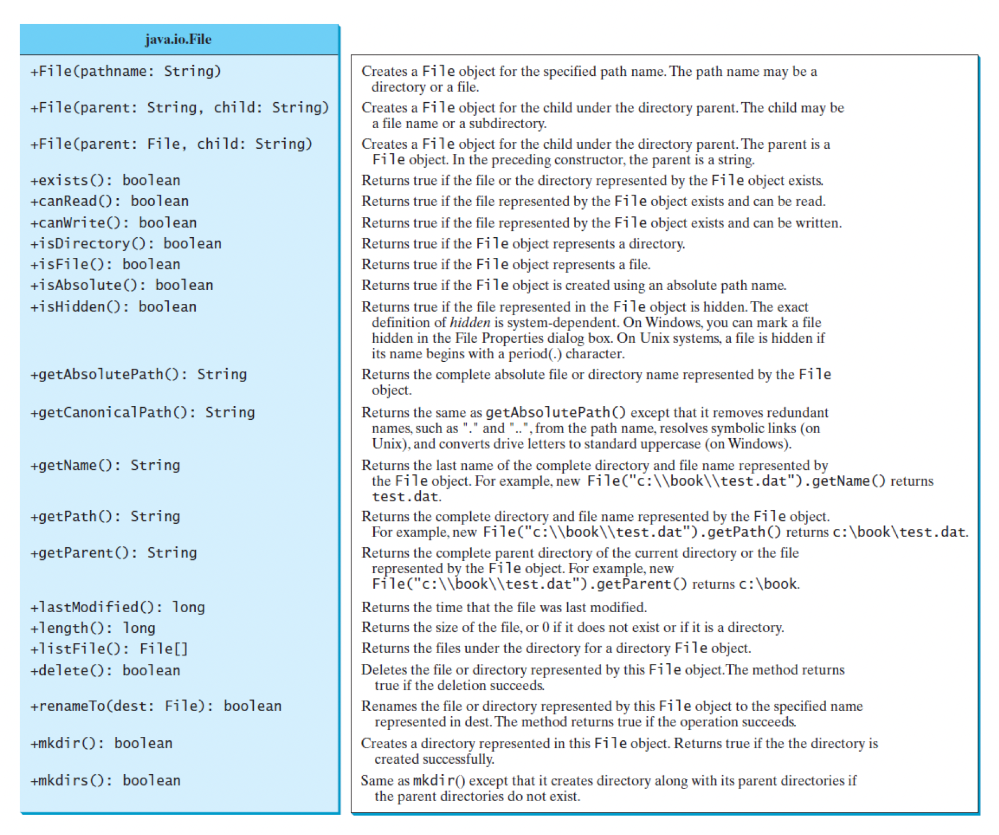
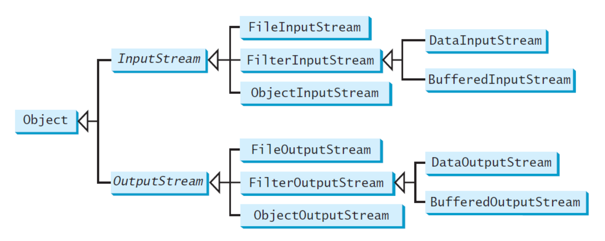
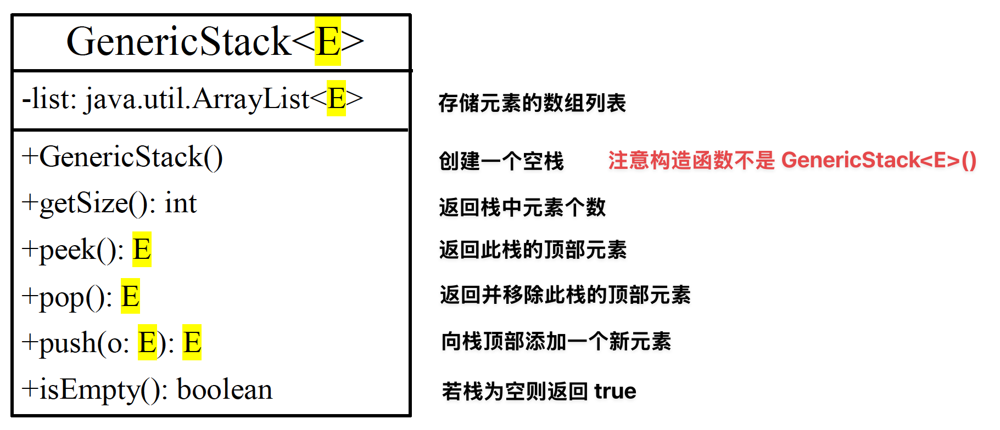
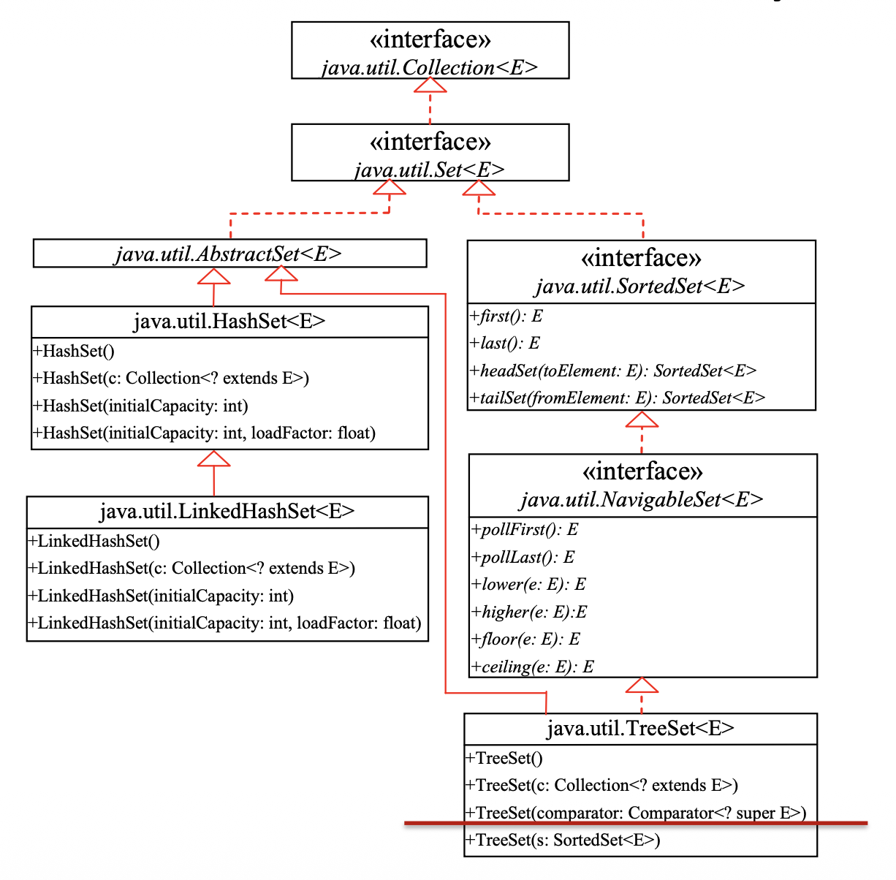
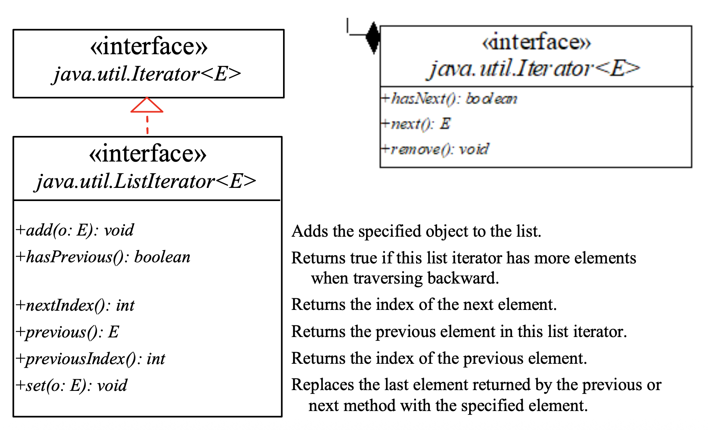
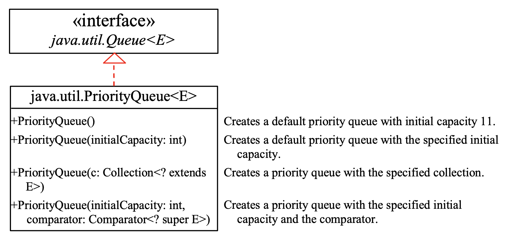
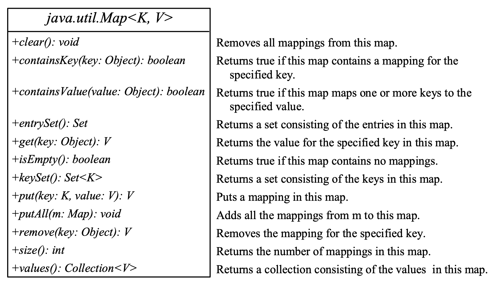
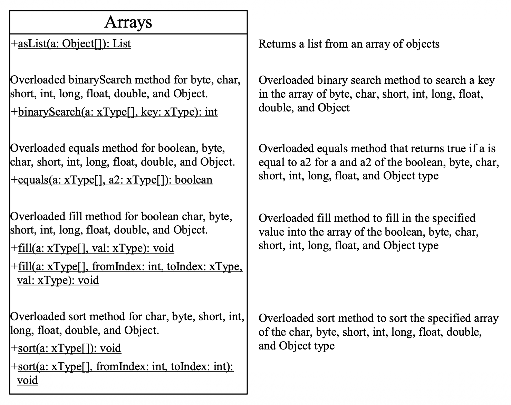
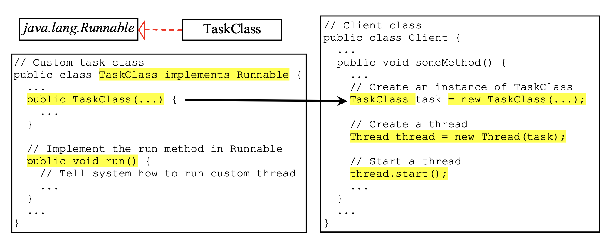
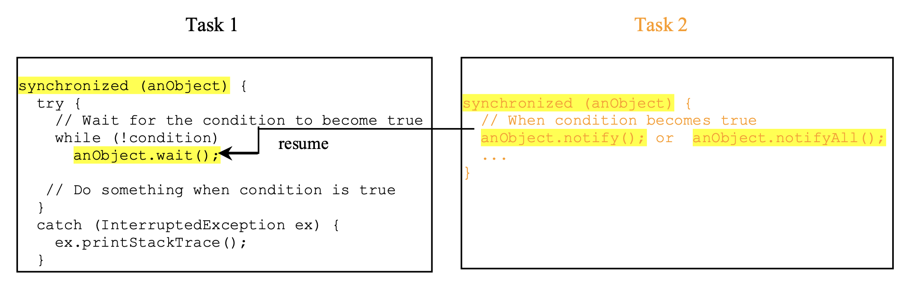

# Advanced Features

## Exception Handling and Text I/O

### Exception

**异常**(exception)是程序运行过程中出现的非正常情况，以对象的形式包装错误信息，通过抛出和捕获机制让开发者能够优雅地处理程序故障。

- 异常类型：

    <div style="text-align: center">
        
    </div>

    - `Exception` 类表示**异常**，描述由程序和外部条件导致的错误，可以在程序中被捕获和处理
        - `RuntimeException` 类表示**运行时异常**，由程序错误导致，需要修改代码才能修复
            - 比如不良的转型、访问越界数组、数值错误等
    - `Error` 类表示**系统错误**(system errors)
        - JVM 发生了不可恢复的故障，例如内存溢出
        - 这种错误很少发生，若发生，只能通知用户，并尝试优雅地终止程序（不能恢复）

- 异常还可以分为：
    - **未检查型异常**(unchecked exception)：包括 `RuntimeException`、`Error` 以及它们的子类，在多数情况下反映了程序中不可恢复的逻辑错误
        - `NullPointerException`：在给引用变量分配对象之前通过该引用变量访问对象时抛出
        - `IndexOutOfBoundsException`：访问数组中超出数组边界的元素时抛出
        - 为了避免过度使用 `#!java try-catch` 块而变得繁琐，Java 不强制要求编写代码来捕获这类异常
    - **检查型异常**(checked exception)：其他所有异常，此时编译器会强制程序员检查和处理异常
        - 如果一个方法声明了检查型异常，那么调用它的时候必须将其放在 `#!java try-catch` 块中，或者通过声明抛出该异常

        ??? example "例子"

            <div class="grid" markdown>

            ```java hl_lines="5"
            void p1() {
                try {
                    p2();
                }
                catch (IOException ex) {
                    ...
                }
            }
            ```

            ```java hl_lines="1"
            void p1() throws IOException {
                p2();
            }
            ```

            </div>

- 声明异常：每个方法必须说明它可能抛出的检查型异常类型

    ```java
    public void myMethod() 
    throws IOException, OtherException
    ```

- 抛出异常：当程序检测到错误时，程序可以创建一个适当异常类型的实例并抛出它
    - 何时该抛出异常：
        - 方法中发生异常
        - 若希望调用者处理该异常，应该创建一个异常对象并将其抛出
        - 如果可以在发生异常的方法中处理它，则无需抛出

    ```java
    throw new TheException();

    TheException ex = new TheException();
    throw ex;
    ```

    ??? example "例子"

        ```java
        public void setRadius(double newRadius)
        throws IllegalArgumentException {
            if (newRadius >= 0)
                radius = newRadius;
            else
                throw new IllegalArgumentException(
                            "Radius cannot be negative");
        }
        ```


- 捕捉异常：

    ```java
    try {
        // Statements that may throw exceptions
    } catch (Exception1 exVar1) {
        // handler for exception1;
    } catch (Exception2 exVar2) {
        // handler for exception2;
    }
    ...
    catch (ExceptionN exVar3) {
        // handler for exceptionN;
    }
    ```

    - 可以使用多个 `#!java catch` 语句来捕获 `#!java try` 语句块中可能发生的多种异常
    - 异常发生后，JVM 会**由上而下来检测**当前 `#!java catch` 语句块所捕获的异常是否与 `#!java try` 语句块中某个发生的异常匹配；若匹配，则不执行其他的 `#!java catch` 语句块
    - 如果多个 `#!java catch` 语句块捕获的是**同种类型**的异常，则捕获**子类**异常的 `#!java catch` 语句块要放在捕获父类异常的 `#!java catch` 语句块前面

- 重新抛出异常：

    ```java hl_lines="6"
    try {
        // statements;
    } catch(TheException ex) {
        // perform operations before exits;
        throw ex;
    }
    ```

- `#!java finally` 子句：无论程序使用何种方式退出 `#!java try-catch` 块，该子句内的代码都会被执行
    
    ```java hl_lines="7-9"
    try {
        // statements;
    } catch(TheException ex) {
        // handling ex;
    } finally {
        // finalStatements;
    }
    ```
    
    - 更具体的，finally 块会在以下情况发生之后执行：
        - `#!java try` 块中的代码正常执行完毕
        - 在 `#!java try` 块中抛出异常
        - 在 `#!java try` 块中执行 `#!java return`, `#!java break`, `#!java continue`
        - `#!java catch` 块中代码执行完毕
        - 在 `#!java catch` 块中抛出异常
        - 在 `#!java catch` 块中执行 `#!java return`, `#!java break`, `#!java continue`

    - 注意：如果在 `#!java catch` 块中抛出异常（或者 `#!java return` 等情况），则 `#!java try-catch` 块之后的代码不会执行，但是 `#!java finally` 中的代码始终会执行

        ??? example "例子"

            ```java hl_lines="9 14"
            try {
                statement1;
                statement2;
                statement3;
            } catch(Exception1 ex) {
                handling ex;
            } catch(Exception2 ex) {
                handling ex;
                throw ex;        // (1)
            } finally {
                finalStatements;
            }

            Next statement;      // (2)
            ```

            1.  重新抛出异常，将控制权转移给调用者
            2.  这条语句不会执行，因为已经抛出异常了

    - 使用 `#!java finally` 块释放资源
    - `#!java finally` 块不能抛出异常
        - 因为如果在 `#!java finally` 块中抛出异常，`#!java try-catch` 块的异常就不能抛出，外部捕捉到的异常就是 `#!java finally` 块中的异常信息，而 `#!java try-catch` 块中发生的真正的异常堆栈信息则丢失了

- 抛出自定义异常异常时带上原始异常信息
- 打印异常信息时带上异常堆栈

    ```java hl_lines="6"
    public void method3() {
        try {
            method2();
        } catch(MyException e) {
            // 对异常进行处理
            e.printStackTrace(); // 打印异常信息
        }
    }
    ```

- 守护线程中需要捕捉 `RuntimeException`
    - **守护线程**是指在需要长时间运行的线程，其生命周期一般和整个程序的时间一样长，用于提供某种持续的服务
    - 因此需要对 `RuntimeException` 进行保护，避免因为某一次偶发的异常而导致线程被终止

- 使用异常时需注意：异常处理通常需要更多的时间和资源，因为它需要实例化一个新的异常对象、回滚调用栈并将错误传播到调用方法
    - 所以不要用异常来处理简单且在预期内的情况

- 定义自定义异常类
    - 尽可能使用 API 中已有的异常类
    - 如果预定义的类不够用，通过扩展 `Exception` 或其子类来定义自定义异常类

    ??? example "例子"

        ```java
        /** 自定义异常类，用于处理无效的半径输入 */
        public class InvalidRadiusException extends Exception {
            private double radius;

            /** 构造一个异常对象 */
            public InvalidRadiusException(double radius) {
                super("Invalid radius: " + radius);
                this.radius = radius;
            }

            /** 返回触发异常的半径值 */
            public double getRadius() {
                return radius;
            }
        }

        /** 包含半径设置逻辑的类 */
        public class CircleWithRadiusException {
            /** 圆的半径 */
            private double radius;

            /** 设置新半径，如果半径小于 0 则抛出自定义异常 */
            public void setRadius(double newRadius) throws InvalidRadiusException {
                if (newRadius >= 0) {
                    radius = newRadius;
                } else {
                    throw new InvalidRadiusException(newRadius);
                }
            }
        }
        ```


### Assertions

**断言**(assertions)包含一个**布尔表达式**，该表达式应在程序执行期间为真，可用于确保程序正确性并避免逻辑错误。

- 声明：使用 `#!java assert` 关键字

    ```java
    assert assertion;
    assert assertion : detailMessage;
    ```

    其中 `assertion` 是布尔表达式，`detailMessage` 是基本类型或 `Object` 值

- 执行：
    - Java 会评估断言；如果为假，将抛出 `AssertionError` 异常
    - `AssertionError` 类有一个无参构造函数和七个重载的单参数构造函数，参数类型分别为 `#!java int`、`#!java long`、`#!java float`、`#!java double`、`#!java boolean`、`#!java char` 和 `#!java Object`
    - 对于没有详细信息的断言语句，使用无参的 `AssertionError` 构造函数
    - 对于带有详细信息的断言语句，使用合适的 `AssertionError` 构造函数以匹配消息的数据类型
    - 由于 `AssertionError` 是 `Error` 的子类，当断言为假时，程序会在控制台显示消息并退出

    ??? example "例子"

        ```java
        public class AssertionDemo {
            public static void main(String[] args) {
                int i; int sum = 0;
                for (i = 0; i < 10; i++) {
                    sum += i;
                }
                assert i == 10;
                assert sum > 10 && sum < 5 * 10 : "sum is " + sum;
            }
        }
        ```

- 运行带断言的程序：
    - **默认**情况下在运行时**禁用**断言
    - 要启用断言，需要使用 `–enableassertions` 或 `-ea` 选项
    - 还可以手动禁用断言：使用 `–disableassertions` 或 `-da` 选项

???+ abstract "断言 vs 异常"

    - 断言不应用来替代异常处理
    - 异常处理关注鲁棒性，断言关注正确性
    - 与异常处理一样，断言也不用于常规测试，而是用于内部一致性和有效性检查
    - 不要在 `#!java public` 方法中使用断言进行参数检查


### Text I/O

- `File` 类：用于文件名及其目录路径的包装类
    - 它提供了一个抽象，以机器无关的方式处理文件和路径名的大部分机器相关复杂性
    - 属性和方法汇总：

        <div style="text-align: center">
            
        </div>

    - 它封装了文件或路径的属性，但不包含用于从/向文件读取/写入数据的方法

- 存储数据的两种方式
    - 文本格式：字符序列，是人类可读的形式
    - 二进制格式：用字节表示的数据项

- 文本 I/O **需要编码和解码**：JVM 在写入字符时将 Unicode 转换为文件特定的编码，在读取字符时将文件特定的编码转换为 Unicode

- 使用 `java.io.PrintWriter` 写数据

    ```java
    PrintWriter(filename: String)     // 为指定文件创建 PrintWriter 对象
    print(s: String): void
    print(c: char): void
    print(cArray: char[]): void
    print(i: int): void
    print(l: long): void
    print(f: float): void
    print(d: double): void
    print(b: boolean): void
    ```

    - 它还包含重载的 `println` 和 `printf` 方法，用法同 `print`，但 `println` 支持换行，`printf` 支持格式字符串（[之前](2.md#formatted-output)介绍过）
    - 可以指定**字符集**，否则会使用运行这个程序的机器的默认编码，可能在不同的机器上有不同的表现

        ```java
        PrintWriter out = new PrintWriter("myfile.txt", "UTF-8");
        ```

    ??? example "例子"

        ```java
        import java.io.PrintWriter;
        import java.io.File;

        public class WriteData {
            public static void main(String[] args) throws Exception {
                java.io.File file = new java.io.File("scores.txt");
                if (file.exists()) {
                    System.out.println("File already exists");
                    System.exit(0);
                }

                // 创建文件
                java.io.PrintWriter output = new java.io.PrintWriter(file);

                // 向文件写入格式化输出
                output.print("John T Smith ");
                output.println(90);
                output.print("Eric K Jones ");
                output.println(85);

                // 关闭文件
                output.close();
            }
        }
        ```

- 使用 `java.util.Scanner` 读数据

    ```java
    Scanner(source: File)        // 创建一个从指定文件读取数据的 Scanner 对象
    Scanner(source: String)      // 创建一个从指定文件读取数据的 String 对象
    close()
    hasNext(): boolean           // 如果 Scanner 的输入中还有另一个 token，则返回 true
    next(): String
    nextByte(): byte
    nextShort(): short
    nextInt(): int
    nextLong(): long
    nextFloat(): float
    nextDouble(): double
    useDelimiter(pattern: String): Scanner    // 设置分隔符模式
    ```

    - 也可以设置字符编码

        ```java
        Scanner in = new Scanner(Paths.get("myfile.txt"), "UTF-8");
        ```


## Binary I/O

### Basics

**二进制 I/O** 不需要额外的转换。

- 将一个字节写入文件时，原始字节会被复制到文件中
- 从文件中读取一个字节时，将返回文件中的确切字节

二进制 I/O 类：

<div style="text-align: center">
    
</div>

- `InputStream`

    ```java
    // 从输入流中读取下一个字节的数据
    // 返回的字节值为 0 到 255 范围内的 int 值
    // 如果没有可用的字节，因为已到达流的末尾，则返回值 -1
    read(): int

    // 从输入流中读取最多 b.length 字节到数组 b，并返回实际读取的字节数
    // 流结束时返回 -1
    read(b: byte[]): int

    // 从输入流中读取字节并存储到 b[off], b[off+1], ..., b[off+len-1]
    // 返回实际读取的字节数
    // 在流的末尾返回 -1
    read(b: byte[], off: int, len: int): int

    available(): int             // 返回可以从输入流中读取的字节数
    close(): void                // 关闭此输入流并释放与该流相关的任何系统资源
    skip(n: long): long          // 跳过并丢弃此输入流中的 n 字节数据，实际跳过的字节数将被返回
    markSupported(): boolean     // 测试此输入流是否支持 mark 和 reset 方法
    mark(readlimit: int): void   // 标记此输入流中的当前位置
    reset(): void                // 将此流重新定位到上次在该输入流上调用 mark 方法时的位置
    ```

    - 如果在流的末尾继续读取数据，将会发生 `EOFException`；因此使用 `input.available()` 来检查文件结束，当 `input.available() == 0` 时表示文件结束

- `OutputStream`

    ```java
    // 将指定的字节写入此输出流，参数 b 是一个整数值
    // (byte) b 被写入输出流
    write(int b): void

    // 将数组 b 中的所有字节写入输出流
    write(b: byte[]): void

    // 将 b[off], b[off+1], ..., b[off+len-1] 写入输出流
    write(b: byte[], off: int, len: int): void

    close(): void    // 关闭此输出流并释放与该流相关的任何系统资源
    flush(): void    // 刷新此输出流，并强制将任何缓冲的输出字节写出
    ```

- `FileInputStream`
    - 构造函数：

        ```java
        public FileInputStream(String filename)
        public FileInputStream(File file)
        ```

        尝试创建一个不存在的文件的 `FileInputStream` 时，将发生 `java.io.FileNotFoundException`

- `FileOutputStream`
    - 构造函数：

        ```java
        public FileOutputStream(String filename)
        public FileOutputStream(File file)
        public FileOutputStream(String filename, boolean append)
        public FileOutputStream(File file, boolean append)
        ```

    - 如果文件不存在，将会创建一个新文件
    - 如果文件已经存在，
        - 前两个构造函数将删除文件中的当前内容
        - 要保留当前内容并将新数据追加到文件中，请使用最后两个构造函数，并将 `#!java true` 传递给 `append` 参数

- **过滤器流**(filter streams)是用于某种目的过滤字节的流
    - 基本的字节输入流提供了一个只能用于读取字节的读取方法
    - 如果想要读取整数、双精度浮点数或字符串，你需要一个过滤器类来包装字节输入流
    - `FilterInputStream` 和 `FilterOutputStream` 是过滤数据的基类
    - 当需要处理基本数值类型时，使用 `DataInputStream` 和 `DataOutputStream` 来过滤字节

- `DataInputStream`：从流中读取字节，并将它们转换为适当的基本类型值或字符串
    - 继承自 `FileInputStream`，并实现 `DataInput` 接口
    - 方法：

        ```java
        readBoolean(): boolean
        readByte(): byte
        readChar(): char
        readFloat(): float
        readDouble(): double
        readInt(): int
        readLong(): long
        readshort(): short
        readLine(): String
        readUTF(): String
        ```

    - 注意：必须以存储的相同顺序和格式读取数据
    

- `DataOutputStream`：将基本类型值或字符串转换为字节，并将字节输出到流中
    - 继承自 `FileOutputStream`，并实现 `DataOutput` 接口
    - 方法：

        ```java
        writeBoolean(b: boolean): void
        writeByte(v: int): void
        writeBytes(s: String): void
        writeChar(c: char): void
        writeChars(s: String): void
        writeFloat(v: float): void
        writeDouble(v: double): void
        writeInt(v: int): void
        writeLong(v: long): void
        writeShort(v: short): void
        writeUTF(s: String): void
        ```

- `BufferedInputStream` / `BufferedOutputStream`：
    - 没有包含新方法，所有方法继承自 `InputStream` / `OutputStream` 类
    - 但它们利用缓冲区加速 I/O
    - 构造函数：

        ```java
        // Create a BufferedInputStream
        public BufferedInputStream(InputStream in)
        public BufferedInputStream(InputStream in, int bufferSize)

        // Create a BufferedOutputStream
        public BufferedOutputStream(OutputStream out)
        public BufferedOutputStream(OutputStreamr out, int bufferSize)
        ```

- `Reader` 是读取字符流的抽象类，`Writer` 是写入字符流的抽象类

    ```java
    /** Reader */
    // 读取单个字符
    int read()
    // 将字符读入数组
    int read(char[] cbuf)
    // 将字符读入数组的某一部分
    abstract int read(char[] cbuf, int off, int len)
    // 跳过字符
    long skip(long n)
    // 关闭该流并释放与之关联的所有资源
    abstract void close()

    /** Writer */
    // 写入字符数组
    void write(char[] cbuf)
    // 写入字符数组的某一部分
    abstract void write(char[] cbuf, int off, int len)
    // 写入单个字符
    void write(int c)
    // 写入字符串
    void write(String str)
    // 写入字符串的某一部分
    void write(String str, int off, int len)
    // 将指定字符添加到此 writer
    Writer append(char c)
    // 将指定字符序列添加到此 writer
    Writer append(CharSequence csq)
    // 将指定字符序列的子序列添加到此 writer
    Writer append(CharSequence csq, int start, int end)
    // 关闭此流，但要先刷新它
    abstract void close()
    // 刷新该流的缓冲
    abstract void flush()
    ```

    - `InputStreamReader`：字节流转字符流

        ```java
        // 构造方法:
        // 创建一个使用默认字符集的 InputStreamReader
        InputStreamReader(InputStream in)

        // 创建使用给定字符集的 InputStreamReader
        InputStreamReader(InputStream in, Charset cs)

        // 创建使用给定字符集解码器的 InputStreamReader
        InputStreamReader(InputStream in, CharsetDecoder dec)

        // 创建使用指定字符集的 InputStreamReader
        InputStreamReader(InputStream in, String charsetName)

        // 特有方法:
        // 返回此流使用的字符编码的名称
        String getEncoding()
        ```

    - `OutputStreamWriter`：字符流转字节流

        ```java
        // 构造方法:
        // 创建一个使用默认字符编码的 OutputStreamWriter
        OutputStreamWriter(OutputStream out)

        // 创建使用给定字符集的 OutputStreamWriter
        OutputStreamWriter(OutputStream out, Charset cs)

        // 创建使用给定字符集编码器的 OutputStreamWriter
        OutputStreamWriter(OutputStream out, CharsetEncoder enc)

        // 创建使用指定字符集的 OutputStreamWriter
        OutputStreamWriter(OutputStream out, String charsetName)

        // 特有方法:
        // 返回此流使用的字符编码的名称
        String getEncoding()
        ```

    - `BufferedReader`、`BufferedWriter`：字符缓冲流

        ```java
        /** BufferedReader */
        // 构造方法:
        // 创建一个使用默认大小输入缓冲区的缓冲字符输入流
        BufferedReader(Reader in)
        // 创建一个使用指定大小输入缓冲区的缓冲字符输入流
        BufferedReader(Reader in, int sz)
        // 特有方法:
        // 读取一个文本行
        String readLine()

        /** BufferedWriter */
        // 构造方法:
        // 创建一个使用默认大小输出缓冲区的缓冲字符输出流
        BufferedWriter(Writer out)
        // 创建一个使用给定大小输出缓冲区的缓冲字符输出流
        BufferedWriter(Writer out, int sz)
        // 特有方法:
        // 写入一个行分隔符
        void newLine()
        ```

    - `FileReader`：`InputStreamReader` 类的直接子类，用来读取字符文件，使用默认字符编码

        ```java
        // 构造函数
        FileReader(File file)             // 用 File 对象来构造 FileReader
        FileReader(FileDescriptor fd)     // 用文件描述符构造 FileReader
        FileReader(String fileName)       // 用文件的路径名来构造FileReader

        public String getEncoding()       // 返回这个流使用的编码方式
        ```

    - `FileWriter`：`OutputStreamWriter` 类的直接子类，用来写入字符文件，使用默认字符编码

        ```java
        // 还是用 File 对象构造，如果第二个参数为 true 的话，
        // 表示以追加的方式写数据，从文件尾部开始写起
        FileWriter(File file, boolean append)
        // 用文件描述符来构造 FileWriter
        FileWriter(FileDescriptor fd)
        // 用文件描述符来构造，第二个参数为 true 的话，表示以追加的形式写入数据
        FileWriter(FileDescriptor fd, boolean append)
        // 用文件的路径名来构造 FileWriter
        FileWriter(String fileName)
        // 用文件路径名来构造 FileWriter，第二个参数为 true 的话，表示以追加的形式写入文件
        FileWriter(String fileName, boolean append)
        ```


### Object I/O

`ObjectInputStream` / `ObjectOutputStream` 能执行对象的 I/O：

- `ObjectInputStream` 继承自 `InputStream`，并实现了 `ObjectInput` 和 `ObjectStreamConstants` 接口
- `ObjectOutputStream` 继承自 `OutputStream`，并实现了 `ObjectOutput` 和 `ObjectStreamConstants` 接口
- 构造函数：

    ```java
    // Create an ObjectInputStream
    public ObjectInputStream(InputStream in)

    // Create an ObjectOutputStream
    public ObjectOutputStream(OutputStream out)
    ```


### `#!java Serializable`

- `#!java Serializable` 接口：
    - 并非所有对象都可以写入输出流，而可以写入对象流的对象被认为是**可序列化的**(serializable)
    - 可序列化对象是 `java.io.Serializable` 接口的实例，因此可序列化对象的类必须实现 `#!java Serializable`
    - `#!java Serializable` 接口是一个**标记接口**(markder interface)，它没有方法，因此您需要在实现 `#!java Serializable` 的类中添加额外代码
    - 实现此接口使 Java 序列化机制能够自动处理存储对象和数组的过程
    - 凡是实现 `Serializable` 接口的类都有一个表示序列化版本标识符的静态 `#!java long` 类型变量：`#!java private static final long serialVersionUID`，它是根据类名、接口名、成员方法及属性等生成的一个 64 位哈希字段

- `#!java trasient` 关键字：
    - 一个包含非可序列化的实例数据字段的 `#!java Serializable` 的对象**不可以**被序列化
    - 要使此类对象能够被序列化，可以使用 `#!java transient` 关键字标记这些数据字段，以告诉 JVM 在将对象写入对象流时忽略这些字段

    ??? example "例子"

        ```java
        public class Foo implements java.io.Serializable {
            private int v1;
            private static double v2;
            private transient A v3 = new A();
        }
        class A { } // A is not serializable
        ```

        - 当 `Foo` 类的对象被序列化时，只有变量 `v1` 被序列化
        - 变量 `v2` 没有被序列化，因为它是一个静态变量
        - 变量 `v3` 没有被序列化，因为它被标记为 `#!java transient`
        - 如果 `v3` 没有被标记为 `#!java transient`，将会发生 `java.io.NotSerializableException`

- 序列化数组：
    - 当数组中的所有元素可序列化时，该数组可序列化
    - 此时整个数组可以通过 `writeObject` 写入文件，稍后使用 `readObject` 恢复

    ??? example "例子"

        ```java
        public class TestObjectStreamForArray {
            public static void main(String[] args)
                throws ClassNotFoundException, IOException {
                int[] numbers = {1, 2, 3, 4, 5};
                String[] strings = {"John", "Susan", "Kim"};

                try ( // 为 array.dat 创建一个输出流
                    ObjectOutputStream output = new ObjectOutputStream(new 
                        FileOutputStream("array.dat", true));
                ) {
                    // 将数组写入对象输出流
                    output.writeObject(numbers);
                    output.writeObject(strings);
                }

                try ( // 为 array.dat 创建一个输入流
                    ObjectInputStream input = 
                        new ObjectInputStream(new FileInputStream("array.dat"));
                ) {
                    int[] newNumbers = (int[])(input.readObject());
                    String[] newStrings = (String[])(input.readObject());

                    // 显示数组内容
                    for (int i = 0; i < newNumbers.length; i++)
                        System.out.print(newNumbers[i] + " ");
                    System.out.println();

                    for (int i = 0; i < newStrings.length; i++)
                        System.out.print(newStrings[i] + " ");
                }
            }
        }
        ```

- 反序列化后的对象**不需要**调用构造函数重新构造
- 序列前的对象与序列化后的对象**地址不同**，并且实现了**深拷贝**


### The `RandomAccessFile` Class

前面介绍的所有流被称为**只读**或**只写**流，而且这些流的外部文件是**顺序**(sequential)文件，无法在不创建新文件的情况下进行更新，通常需要修改文件或向文件中插入新记录。而 Java 提供了 `RandomAccessFile` 类，支持从随机位置读取和写入文件。

```java
RandomAccessFile(file: File, mode: String)
RandomAccessFile(name: String, mode: String)
close(): void
// 返回从文件开头到下一个 read 或 write 发生位置的偏移量（以字节为单位）
getFilePointer(): long
length(): long
read(): int
read(b: byte[]): int
read(b: byte[], off: int, len: int): int
// 设置从流的开始到下一个 read 或 write 发生的位置的偏移量（以 pos 中指定的字节为单位）
seek(pos: long): void
// 为文件设置新长度
setLength(newLength: long): void
// 跳过 n 字节的输入
skipBytes(int n): int
write(b: byte[]): void
write(b: byte[], off: int, len: int): void
```

随机访问文件中有一个特殊的标记，称为**文件指针**(file pointers)。

- 读写操作发生在文件指针的位置
- 当文件被打开时，文件指针设置在文件的开头
- 向文件读取或写入数据时，文件指针会向前移动到下一个数据

许多 `RandomAccessFile` 中的方法与 `DataInputStream` 和 `DataOutputStream` 中的方法相同，比如 `readInt()`、`readLong()`、`writeDouble()`、`readLine()`、`writeInt()` 和 `writeLong()` 可以在数据输入流或数据输出流以及 `RandomAccessFile` 流中使用。


### Piped I/O

`PipedOutputStream` 和 `PipedInputStream` 分别是管道输出流和管道输入流，它们的作用是**让多线程可以通过管道进行线程间的通讯**。在使用管道通信时，必须将 `PipedOutputStream` 和 `PipedInputStream` 配套使用。

使用管道通信时，大致的流程是：

- 在线程 A 中向 `PipedOutputStream` 中写入数据，这些数据会自动的发送到与 `PipedOutputStream对` 应的 `PipedInputStream`中，进而存储在 `PipedInputStream` 的缓冲中
- 此时，线程 B 通过读取 `PipedInputStream` 中的数据，这样就可以实现线程 A 和线程 B 的通信

`PipedReader` 和 `PipedWriter` 也是管道输入流和输出流。它们和 `PipedInputStream`/`PipedOutputStream` 区别是前者操作的是**字符**，后者是字节。两者的 API 几乎相同，都能输出各种形式的数据，构造函数也几乎相同。


## Recursion

这部分不是 Java 特色，仅凭前面学过的语法知识以及从其他语言学到的递归就能写出来。所以这块就略过了。


## Generics

**泛型**(generics)是**参数化类型**(parameterize types)的特性。利用这个特性，我们可以定义一个具有泛型类型的类或方法，**编译器**可以使用具体类型来替换这些泛型类型。其关键优点是能够让错误在**编译时**被检测出来。

<div style="text-align: center">
    
</div>

- 泛型类

    <div style="text-align: center">
        
    </div>

    ??? code "实现部分"

        ```java
        public class GenericStack<E> {
            private java.util.ArrayList<E> list = new java.util.ArrayList<E>();

            public int getSize() {
                return list.size();
            }

            public E peek() {
                return list.get(getSize() - 1);
            }

            public void push(E o) {
                list.add(o);
            }

            public E pop() {
                E o = list.get(getSize() - 1);
                list.remove(getSize() - 1);
                return o;
            }

            public boolean isEmpty() {
                return list.isEmpty();
            }

            @Override
            public String toString() {
                return "stack: " + list.toString();
            }
        }
        ```

    - 支持多个类型参数

        ```java
        public class Pair<U, V> {
            U first;
            V second;
            // ...
        }
        ```

- 泛型方法

    ```java
    public static <E> void print(E[] list) {
        for (int i = 0; i < list.length; i++)
            System.out.print(list[i] + " ");
        System.out.println();
    }
    ```

    - 调用：

        ```java
        Integer[] integers = {1, 2, 3, 4, 5};
        String[] strings = {"London", "Paris", "New York", "Austin"};
        GenericMethodDemo.<Integer>print(integers);
        GenericMethodDemo.<String>print(strings);
        ```

    - 若编译器能推断出所调用的方法，则可以省略类型参数

        ```java
        GenericMethodDemo.print(integers);
        GenericMethodDemo.print(strings);
        ```

    - 也支持多个类型参数

        ```java
        public static <U, V> Pair<U, V> makePair(U first, V second) {
            Pair<U, V> pair = new Pair<>(first, second);
            return pair;
        }
        ```

- 泛型接口

    ```java
    public interface Comparable<T> {
        public int compareTo(T o);
    }
    ```

- **有界泛型类型**(bounded generic type)

    ???+ example "例子"

        ```java hl_lines="7"
        public static void main(String[] args ) {
            Rectangle rectangle = new Rectangle(2, 2);
            Circle circle = new Circle (2);
            System.out.println("Same area? " + equalArea(rectangle, circle));
        }

        public static <E extends GeometricObject> boolean
        equalArea(E object1, E object2) {
            return object1.getArea() == object2.getArea();
        }
        ```

        - 根据参数，找共同的超类
        - 调用 `#!java equalArea(GeometricOjbect o1, GeometricObject o2)`
        - 然后 `#!java object.getArea()` 再是动态绑定

- 参数化类型**没有**实际类型参数的**继承关系**

    <div style="text-align: center">
        
    </div>

    - 举例：`#!java List<Integer> list = new List<Object>();` 报错，反之亦然
    - 泛型的继承关系需要通过通配符实现

- **通配符**(wildcards)：
    - **无限制通配符**(unbounded wildcards) `#!java <?>`：用于代表某种**不确定的类型**
        - 当只需要处理与具体类型无关的逻辑（例如获取 `List` 的长度）时非常有用
        - 从这种容器中取出的元素只能被视为 `Object` 类型
    - **上限通配符**(upper bounded wildcards) `#!java <? extends T>`：限定了类型的上界
        - 它表示类型必须是 `T` 类型本身或者是它的**子类**
        - 例子：使用 `#!java List<? extends Number>` 时，可以确定从中读取出的数据一定是 `Number` 类型
    - **下限通配符**(lower bounded wildcards) `#!java <? super T>`：限定了类型的下界
        - 它表示类型必须是 `T` 类型本身或者是它的**父类**
        - 例子：当需要往容器中存放 `T` 类型的对象时，使用 `#!java List<? super T>` 可以确保容器能够兼容该类型


- 泛型是通过一种称为**类型擦除**(type erasure)的方法实现的
    - 编译器使用泛型类型信息来编译代码，但随后会将其擦除，因此**运行时无法获取泛型信息**
    - 这种方法使得泛型代码能够与使用基本类型的遗留代码**向后兼容**

- **泛型类为其所有实例共享**，不管这些实例的实际类型是什么

    ???+ example "例子"

        ```java
        GenericStack<String> stack1 = new GenericStack<String>();
        GenericStack<Integer> stack2 = new GenericStack<Integer>();
        ```

        尽管 `#!java GenericStack<String>` 和 `#!java GenericStack<Integer>` 是两种类型，但只有一个 `GenericStack` 类被加载到 JVM 中。

- 限制：
    - 不能创建泛型类型的实例
        - 例子：`#!java E object = new E();` 会报错
  
    - 不允许用泛型类型来创建泛型数组
        - 例子：`#!java E[] elements = new E[100];`
        - 可以用 `#!java E[] elements = (E[]) new Object[100]` 来规避，但仍有一个编译警告

    - 泛型类的静态上下文中不能使用类型参数
        - 泛型类的所有实例都有相同的运行时类，所以泛型类的静态变量和方法是被它的所有实例共享的
        - 所以在静态方法、数据域或初始化语句中，为了类而引用泛型参数是非法的

        ???+ example "例子"

            ```java hl_lines="2-6"
            public class Test<E>{
                public static void m(E o1){ // illegal
                }
                static {
                    E o2;
                }
            }
            ```

    - 泛型类不能继承 `java.io.Throwable`，也就是说异常类不能是泛型类
        - JVM 必须检查 `#!java try` 子句中抛出的异常类型是否与 `#!java catch` 子句中指定的类型匹配，但（如果用了泛型）在运行期间类型信息不知道

        ???+ example "例子"

            ```java
            try {
                doSomeStuff();
            } catch (SomeException<Integer> e) {
                // ignore that
            } catch (SomeException<String> e) {
                crashAndBurn()
            }
            ```

            `#!java SomeException<Integer>` 和 `#!java SomeException<String>` 都被擦除为同一类型，JVM 无法区分异常实例，因此无法确定应该执行哪个 `#!java catch` 块。


## Collections

**容器**(collections)是一个容器对象，表示一组通常称为元素的对象。

<div style="text-align: center">
    
</div>

- `Set` 和 `List` 是 `Collection` 的子接口

<div style="text-align: center">
    
</div>

`Collection` 接口是操作对象容器的根接口：

<div style="text-align: center">
    
</div>


### The `Set` Interface

`Set` 接口继承自 `Collection` 接口。

- 它没有引入新的方法或常量，但它规定 `Set` 实例**不包含重复元素**
- 实现 `Set` 的具体类必须确保不能向集合中添加重复元素；也就是说，集合中不能有两个元素 `e1` 和 `e2`，使得 `#!java e1.equals(e2)` 为 `#!java true`
- `Set` 接口层级结构：

    <div style="text-align: center">
        
    </div>

- `AbstractSet` 类
    - 继承了 `AbstractCollection` 并实现了 `Set` 接口
    - 为 `equals` 方法和 `hashCode` 方法提供了具体实现，从而确保元素不重复
    - 集合的哈希码是集合中所有元素哈希码的总和
    - 由于没有实现 `size` 方法和 `iterator` 方法，因此它是一个**抽象类**

- `HashSet` 类
    - 一个实现了 `Set` 接口具体类
    - 为了提高效率，添加到哈希集合中的对象需要以适当的方式实现 `hashCode` 方法，以便正确分配哈希码
    - 容器内元素顺序与插入顺序无关
    - 集合元素可以是 `#!java null`，但只能放入一个 `#!java null`

    ```java
    // 实例化
    HashSet<E> set = new HashSet<>(); // 默认容量和加载因子
    HashSet<E> setWithCapacity = new HashSet<>(int initialCapacity); // 指定初始容量

    // 添加与删除
    public boolean add(E e);        // 添加元素，若已存在则返回 false
    public boolean remove(Object o); // 删除元素，若不存在则返回 false

    // 查询与判断
    public int size();              // 返回元素个数
    public boolean isEmpty();       // 判断是否为空
    public boolean contains(Object o); // 判断是否包含某元素

    // 清空与迭代
    public void clear();            // 清空所有元素
    public Iterator<E> iterator();  // 获取迭代器
    ```

- `LinkedHashSet` 类
    - 继承了 `HashSet` 类，同样是根据元素的 `hashCode` 值来决定元素的存储位置，但是它同时使用**双向链表**维护元素的次序，使得元素看起来像是以插入顺序保存的
    - 因为用链表维护顺序，所以在**迭代访问**Set中的全部元素时，性能比 `HashSet` **好**，但是**插入**时性能稍微**差**于 `HashSet`
    - 方法签名同 `HashSet`

- `SortedSet` 接口
    - `Set` 的子接口，保证集合内的元素是有序的(sorted)

- `TreeSet` 类
    - 唯一实现 `SortedSet` 接口的具体类
    - 可以利用迭代器按顺序遍历元素
    - 元素可以以两种方式进行排序：
        - 自然排序：使用 `Comparable` 接口
        - 定制排序：若没有实现 `Comparable` 接口，或不想在实现 `Comparable` 接口的类中使用 `compareTo` 方法，可以为集合中的元素指定一个**比较器**(comparator)

        ???+ note "自定义比较器"

            比较器是一个实现 `java.util.Comparator` 接口的类。`Comparator` 接口有两个方法：`compare` 和 `equals`。

            - `#!java public int compare(Object element1, Object element2)`：
                - 如果 `element1` 小于 `element2`，则返回负值
                - 如果 `element1` 大于 `element2`，则返回正值
                - 如果它们相等，则返回零

            - `#!java public boolean equals(Object element)`
                - 如果指定的对象也是一个比较器，并且施加与此比较器相同的排序，则返回 `#!java true`

    ```java
    // 实例化
    TreeSet<E> treeSet = new TreeSet<>(); // 自然顺序排序
    TreeSet<E> customSet = new TreeSet<>(Comparator<? super E> comparator); // 自定义排序

    // 基础增删查（时间复杂度为 O(log n)）
    public boolean add(E e);        // 按排序顺序插入元素
    public boolean remove(Object o); // 移除元素并重新平衡红黑树
    public boolean contains(Object o); // 查找元素

    // 特有的范围与极值查找
    public E first();               // 返回最小（第一个）元素
    public E last();                // 返回最大（最后一个）元素
    public E lower(E e);            // 返回小于 e 的最大元素
    public E higher(E e);           // 返回大于 e 的最小元素
    public E floor(E e);            // 返回小于等于 e 的最大元素
    public E ceiling(E e);          // 返回大于等于 e 的最小元素

    // 视图与迭代
    public NavigableSet<E> descendingSet(); // 返回逆序视图
    public Iterator<E> iterator();          // 按升序遍历
    ```


### The `List` Interface

**列表**(lists)允许在容器(collection)中存储**重复元素**，并且可以指定元素的存放位置，随后**可通过索引访问**该元素。

<div style="text-align: center">
    
</div>

!!! warning "注意"

    列表可以动态增长或缩小，而数组在创建后是固定的。如果不需要插入或删除元素，最有效的数据结构就是**数组**。

??? info "迭代器模式"

    **迭代器**(iterator)模式：一种对象行为型模式，提供一个对象来顺序访问容器对象中的一系列数据，而不暴露容器对象的内部表示。

    ???+ recommend "优点"

        - 访问一个容器对象的内容而无须暴露它的内部表示
        - 遍历任务交由迭代器完成，这简化了容器类
        - 它支持以不同方式遍历一个聚合，甚至可以自定义迭代器的
        子类以支持新的遍历
        - 增加新的容器类和迭代器类都很方便，无须修改原有代码
        - 封装性良好，为遍历不同的容器结构提供一个统一的接口

    ???+ bug "缺点"

        增加了类的个数，这在一定程度上增加了系统的复杂性。

    <div style="text-align: center">
        
    </div>

**列表迭代器**(list iterators) `ListIterator`：

<div style="text-align: center">
    
</div>

- 它是一种更加强大的 `Iterator` 的子类型，但只能用于各种 `List` 类的访问
- 其最大优点是可以**双向移动**
- 它还可以产生相对于迭代器在列表中指向的当前位置的前一个和后一个元素的索引，并且可以使用 `set()` 方法替换它访问过的最后一个元素

迭代器 `it` 的三个基本操作：

- `it.next()`：返回迭代器的下一个元素，并且更新迭代器的状态
- `it.hasNext()`：用于检测容器中是否还有元素
- `it.remove()`：将迭代器返回的元素删除

`List` 接口的具体实现：

- `ArrayList`

    <div style="text-align: center">
        
    </div>

    - 基于动态数组实现
    - 用途：需要通过索引支持**随机访问**，而不在**末尾**之外的位置**插入或删除**元素

    ```java
    // 实例化
    ArrayList<E> list = new ArrayList<>(); // 默认初始容量为 10
    ArrayList<E> listWithCapacity = new ArrayList<>(int initialCapacity); // 指定初始容量

    // 增删改查
    public boolean add(E e);           // 在末尾添加元素
    public void add(int index, E element); // 在指定位置插入元素
    public E remove(int index);        // 删除指定索引处的元素
    public boolean remove(Object o);   // 删除首次出现的指定元素
    public E set(int index, E element); // 修改指定索引处的元素
    public E get(int index);           // 获取指定索引处的元素

    // 状态与搜索
    public int size();                 // 返回元素个数
    public boolean isEmpty();          // 判断是否为空
    public int indexOf(Object o);      // 返回元素首次出现的索引
    public boolean contains(Object o);  // 判断是否包含某元素

    // 调整与转换
    public void trimToSize();          // 将容量调整为当前元素个数
    public void ensureCapacity(int minCapacity); // 手动扩容
    public Object[] toArray();         // 转换为数组
    ```

    ??? bug "`ArrayList` 中迭代器的陷阱"

        - 在迭代过程中，调用容器的**删除**方法，则会抛出**异常**
        - 因为迭代器内部会维护索引位置相关的数据，在迭代过程中，容器**不能发生结构性变化**（添加/插入/删除元素）
        - 解决方案：使用迭代器自带的删除方法（`it.remove()`）

        ???+ example "例子"

            ```java
            Iterator<String> it = list.iterator();
            while (it.hasNext()) {
                String value = it.next();
                if ("target".equals(value)) {
                    it.remove();
                }
            }
            ```

- `LinkedList`

    <div style="text-align: center">
        
    </div>

    - 基于双向链表实现
    - 用途：需要在列表的**任何位置插入或删除元素**

        ```java
        // LinkedList 支持所有 ArrayList 定义的方法，下面仅列举 LinkedList 独有的方法
        // 针对首尾元素的特有方法（ArrayList 不具备）
        public void addFirst(E e);    // 在链表头部添加元素
        public void addLast(E e);     // 在链表尾部添加元素
        public E getFirst();          // 获取第一个元素
        public E getLast();           // 获取最后一个元素
        public E removeFirst();       // 移除并返回第一个元素
        public E removeLast();        // 移除并返回最后一个元素

        // 栈与队列操作（实现 Deque 接口）
        public boolean offer(E e);    // 将元素添加到末尾
        public E poll();              // 移除并返回头元素，为空时返回 null
        public E peek();              // 返回头元素但不移除
        public void push(E e);        // 将元素推入栈顶（头部）
        public E pop();               // 将元素从栈顶（头部）弹出
        ```


### The `Collections` Class

`Collections` 类包含用于**操作**容器(collections)和映射的各种**静态方法**，用于创建**同步**(synchronized)容器类和**只读**(read-only)容器类。

<div style="text-align: center">
    
</div>

```java
// 排序与位置操作
public static void sort(List<T> list);                          // 自然升序排序
public static void sort(List<T> list, Comparator<? super T> c); // 自定义比较器排序
public static void reverse(List<?> list);                       // 反转顺序
public static void shuffle(List<?> list);                       // 随机打乱
public static void swap(List<?> list, int i, int j);            // 交换两个索引处的元素
public static void rotate(List<?> list, int distance);          // 循环移动元素

// 查找与统计
public static int binarySearch(List<? extends T> list, T key);  // 二分查找（需先排序）
public static T max(Collection<? extends T> coll);              // 返回最大元素
public static T min(Collection<? extends T> coll);              // 返回最小元素
public static int frequency(Collection<?> c, Object o);          // 统计元素出现次数
public static int indexOfSubList(List<?> source, List<?> target); // 查找子列表首次出现位置
public static int lastIndexOfSubList(List<?> source, List<?> target); // 查找子列表末次出现位置

// 替换与修改
public static void fill(List<? super T> list, T obj);           // 使用指定元素填充整个列表
public static boolean replaceAll(List<T> list, T oldVal, T newVal); // 替换所有指定的旧值
public static void copy(List<? super T> dest, List<? extends T> src); // 将源列表内容复制到目标列表

// 线程安全化包装（返回同步视图）
public static List<T> synchronizedList(List<T> list);
public static Set<T> synchronizedSet(Set<E> s);
public static Map<K,V> synchronizedMap(Map<K,V> m);

// 不可变与特殊容器
public static List<T> unmodifiableList(List<? extends T> list); // 返回只读列表
public static Set<T> unmodifiableSet(Set<? extends T> s);       // 返回只读集合
public static List<T> emptyList();                              // 获取空的不可变列表
public static <T> List<T> nCopies(int n, T o);                  // 返回包含 n 个相同对象的不可变列表
public static <E> Set<E> singleton(E o);                        // 返回仅含一个元素的不可变容器

// 检查与约束
public static boolean disjoint(Collection<?> c1, Collection<?> c2); // 判断两容器是否有交集
public static <E> Collection<E> checkedCollection(Collection<E> c, Class<E> type); // 运行时类型检查包装
```


### The `Vector` Class

在 Java 2 中，`Vector` 与 `ArrayList` 相同，不同之处在于 `Vector` 包含用于访问和修改向量的**同步方法**。

到目前为止，引入的新容器数据结构都不是同步的；如果需要同步，可以使用容器(collections)类的同步版本。

<div style="text-align: center">
    
</div>


### The `Stack` Class

`Stack` 类表示一个后进先出（LIFO）的对象栈。元素只能从栈顶访问，并且可以从栈顶检索、插入或删除一个元素。

<div style="text-align: center">
    
</div>


### The `Queue` Interface

**队列**(queue)是一种先进先出（FIFO）的数据结构。元素被添加到队列的末尾，并从队列的开头移除。

<div style="text-align: center">
    
</div>


### The `PriorityQueue` Interface

在**优先队列**(priority queue)中，元素被分配优先级。当访问元素时，具有最高优先级的元素会首先被移除。

<div style="text-align: center">
    
</div>


### The `Map` Interface

`Map` 接口将键映射到元素，此时键就像索引。但不同于 `List`，键可以是**任何对象**。

<div style="text-align: center">
    
</div>

`Map` 的具体类：

<div style="text-align: center">
    
</div>

- `HashMap`
    - 在**查找**值、**插入**映射和**删除**映射方面都很高效
    - 容器内元素是无序的

    ```java
    // 实例化
    HashMap<K, V> map = new HashMap<>(); // 默认初始容量 16，加载因子 0.75
    HashMap<K, V> mapWithCapacity = new HashMap<>(int initialCapacity); // 指定初始容量

    // 基础增删改查
    public V put(K key, V value);      // 存储键值对，若键已存在则覆盖旧值并返回旧值
    public V get(Object key);          // 根据键获取值，不存在则返回 null
    public V remove(Object key);       // 根据键移除键值对
    public void clear();               // 清空所有映射

    // 状态判断
    public int size();                 // 返回键值对的数量
    public boolean isEmpty();          // 判断是否为空
    public boolean containsKey(Object key);   // 判断是否包含指定键
    public boolean containsValue(Object value); // 判断是否包含指定值

    // 视图与遍历
    public Set<K> keySet();            // 获取包含所有键的 Set 视图
    public Collection<V> values();     // 获取包含所有值的 Collection 视图
    public Set<Map.Entry<K, V>> entrySet(); // 获取包含所有键值对的 Set 视图

    // 默认值处理（Java 8+）
    public V getOrDefault(Object key, V defaultValue); // 获取值，若不存在则返回默认值
    public V putIfAbsent(K key, V value); // 仅在键不存在时才插入
    ```

- `TreeMap`
    - 实现了 `SortedMap`，适合以排序顺序**遍历**键

    ```java
    // TreeMap 支持所有 HashMap 定义的方法，下面仅列举 TreeMap 独有的方法
    // 排序相关的实例化
    TreeMap<K, V> treeMap = new TreeMap<>(); // 自然顺序排序
    TreeMap<K, V> customMap = new TreeMap<>(Comparator<? super K> comparator); // 自定义比较器

    // 获取极值键值对
    public Map.Entry<K,V> firstEntry();    // 返回键最小的键值对
    public Map.Entry<K,V> lastEntry();     // 返回键最大的键值对
    public K firstKey();                   // 返回最小的键
    public K lastKey();                    // 返回最大的键

    // 范围检索与邻近查找
    public Map.Entry<K,V> lowerEntry(K key);   // 查找严格小于指定键的最大键值对
    public Map.Entry<K,V> higherEntry(K key);  // 查找严格大于指定键的最小键值对
    public Map.Entry<K,V> floorEntry(K key);   // 查找小于或等于指定键的最大键值对
    public Map.Entry<K,V> ceilingEntry(K key); // 查找大于或等于指定键的最小键值对

    // 子集视图
    public SortedMap<K,V> subMap(K fromKey, K toKey); // 返回指定范围内的子映射
    public SortedMap<K,V> headMap(K toKey);           // 返回小于 toKey 的部分
    public SortedMap<K,V> tailMap(K fromKey);         // 返回大于等于 fromKey 的部分

    // 逆序视图
    public NavigableMap<K,V> descendingMap(); // 返回键按降序排列的映射视图
    ```

- `LinkedHashMap`
    - 继承自 `HashMap`，通过链表实现，支持对映射元素的排序，可以按它们被插入映射中的顺序（称为**插入顺序**）或最后访问的顺序，从最近最少访问到最近访问（**访问顺序**）进行检索
    - **无参**构造函数构造一个按**插入顺序**的  `LinkedHashMap`
    - 要构造一个按**访问顺序**的 LinkedHashMap，请使用 `#!java LinkedHashMap(initialCapacity, loadFactor, true)`
    - 方法签名和 `HashMap` 基本一致

!!! warning "注意"

    `Map` 不能直接使用 `Iterator` 遍历！


### The `Arrays` Class

`Arrays` 类包含用于排序和搜索数组、比较数组和填充数组元素的**静态方法**，以及一个将数组转换为列表的方法。

<div style="text-align: center">
    
</div>


### `EnumSet` and `EnumMap`

- `EnumSet`
    - 一个与枚举类型一起使用的专用 `Set` 实现，其所有元素都必须来自**单个枚举类型**（即必须是同类型，且该类型是 `Enum` 的子类）
    - `EnumSet` 是一个抽象类，只能通过它提供的静态方法来返回 `EnumSet` 的实现类的实例
    - 两种不同的实现：
        - 如果 `EnumSet` 大小 < 64，就返回 `RegularEnumSet` 实例（继承自EnumSet），这个 `EnumSet` 实际上只用了一个 `#!java long` 来存储 `EnumSet`
        - 如果 `EnumSet` 大小 >= 64，则返回 `JumboEnumSet` 实例，它使用一个 `#!java long[]` 来存储
        - 这样做的好处很明显：大多数情况下返回的 `RegularEnumSet`效率比 `JumboEnumSet` 高很多

    - `EnumSet` 的效率比 `HashSet` 等效率高

- `EnumMap`
    - 也是 `Map` 接口的实现，映射中的键是 `Enum` 类型
    - 用其它的 `Map`实现（如 `HashMap`）也能完成枚举类型实例到值得映射，但是使用 `EnumMap` 会更加高效：它只能接收同一枚举类型的实例作为键值，并且由于枚举类型实例的数量相对固定并且有限，所以 `EnumMap` 使用**数组**来存放与枚举类型对应的值
    - `EnumMap` 的键不允许为 `#!java null`，但值可以为 `#!java null`，按照键在枚举中的顺序进行保存
    - 非线程安全


## Multithreading

### Threads

- 创建任务和线程：
    - 实现 `Runnable` 接口并将实例传递给 `Thread` 构造函数
    - 继承 `Thread` 类：重写 `run()` 方法

    <div style="text-align: center">
        
    </div>

- `thread.start()` 会**启动一个全新的线程**，实现了真正的并发执行
- `thread.run()` 不会创建任何新线程，仅在当前线程中按顺序执行代码（因此一般不会用它）
- 静态方法 `#!java public static native Thread currentThread();` 返回当前执行的线程对象
- 获取线程的 id 和名称：

    ```java
    public long getId();
    public final String getName();
    ```

- `Thread` 类：

    <div style="text-align: center">
        
    </div>

    - `#!java Thread.yield()` 静态方法：临时释放当前线程的 CPU 时间片
    - `#!java Thread.sleep(long mills)` 静态方法：使线程休眠指定的毫秒数
    - `#!java anotherThread.join()`：强制线程等待另一个线程完成

        ??? example "例子"

            <div style="text-align: center">
                
            </div>

    - `#!java isAlive()`：用于确定线程状态
        - 如果线程处于**就绪**、**阻塞**或**运**行状态，则返回 `#!java true`
        - 如果线程是**新创建且尚未启动**或**已结束**，则返回 `#!java false`
    
    - `#!java interrupt()`：通过以下方式改变线程的中断状态（不会中断一个正在运行的线程）：
        - 如果线程当前处于**就绪**或**运行**状态，则其中断标志被设置
        - 如果线程当前被**阻塞**（`Object.wait`, `Thread.join` 和 `Thread.sleep` 三种情况之一），则会被唤醒并进入**就绪**状态，并抛出 `java.io.InterruptedException`
        - 因此该方法能中断阻塞状态的线程
    
    - `#!java isInterrupted()`：检查线程的中断标志是否被设置；不会清除中断标志
        - `interrupt()` 配合 `isInterrupted()` 能够中断非阻塞状态的线程

    - 守护(daemon)线程

        ```java
        public final void setDaemon(Boolean on)
        public final boolean isDaemon()
        ```

        - 一般程序只有在所有线程都结束时才退出，但守护线程除外；当整个程序中剩下的都是守护线程时，程序才会退出
        - 守护线程一般为辅助线程，当主线程退出时，它就没有存在的意义了，如垃圾回收线程

    - 线程优先级
        - 每个线程被赋予一个默认优先级 `Thread.NORM_PRIORITY`，可以使用 `#!java setPriority(int priority)` 重置
        - 相关常量

            ```java
            Thread.MIN_PRIORITY
            Thread.MAX_PRIORITY
            Thread.NORM_PRIORITY
            ```

    - 弃用方法：`stop()`, `suspend()`, `resume()`


### Thread Synchronization

**竞态条件**(race condition)：任务 1 和任务 2 以一种导致冲突的方式访问一个公共资源。这是多线程程序中常见的问题。如果一个类的对象在多个线程存在的情况下不会导致竞争条件，那么称这个类是**线程安全的**(thread-safe)。

**内存可见性问题**：一个线程对共享变量的修改，可能不被另一个线程及时看到。因为每个线程都有自己的工作内存，而共享变量存储在主内存中。如果线程对共享变量的修改没有及时刷新到主内存就可能出现问题。

- 轻量级的解决方案：为变量声明 `#!java volatile` 关键字，保证读写到内存最新值
- 也可以用下面介绍的 `#!java synchronized` 关键字

为了避免竞态条件，必须防止多个线程同时进入程序的**临界区**(critical region)。

解决竞态条件问题的方法：

- `#!java synchronized` 关键字：被修饰的方法在同一时间内只能被一个线程访问
    - 线程在执行同步方法前会**获取**一个**锁**，执行结束后**释放**锁；其他调用该方法的线程会被阻塞，直到锁被释放
    - 对于**实例**方法，锁是针对调用该方法的**对象**
    - 对于**静态**方法，锁是针对**类**
    - 在执行方法中的代码块时，可以使用同步语句来锁住**任何对象**，而不仅仅是这个对象，这个代码块被称为**同步块**(synchronized block)

        ```java
        synchronized (expr) {
            statements;
        }
        ```

        - 其中表达式 `expr` 的计算结果必须为一个对象引用
        - 如果该对象已被另一个线程锁定，则线程将被阻塞，直到锁被释放
        - 当获得对象的锁时，将执行同步块中的语句，然后释放锁
        - 任何同步实例方法都可以被转换为等价的同步语句

            ```java
            public synchronized void xMethod() {
                // method body
            }

            // equivalent to
            public void xMethod() {
                synchronized (this) {
                    // method body
                }
            }
            ```

    - **可重入性**：对同一个线程，它在获得锁之后，在调用其他需要同样锁的代码时，可以直接调用
        - 并不是所有的锁都是可重入的
        - 可重入是通过记录锁的持有线程和持有数量来实现的

    - 可以保证**内存可见性**：释放锁时，所有的写入都会写回内存；获得锁后，会从内存中读最新数据

- 使用**显式锁**

    <div style="text-align: center">
        
    </div>

    - 锁为 `Lock` 接口的实例，该接口声明了获取和释放锁的方法
    - 锁可能使用 `useCondition()` 方法创建任意数量的 `Condition` 对象，用于线程通信
    - `ReentrantLock` 是 `Lock` 的具体实现，用于创建**互斥锁**

        <div style="text-align: center">
            
        </div>

        - 可以使用指定的**公平性**(fairness)策略创建锁
            - `#!java fair=true` 保证等待时间最长的线程先获得锁
            - `#!java fair=false` 不对等待线程的访问顺序进行排序（默认）

        - 使用公平锁的程序在多个线程访问时，**整体性能**可能比使用默认设置的程序**差**，但获取锁的时间方差较小，并且保证不会出现饥饿现象

- 使用**原子变量**


### Thread Cooperation

线程间的协作(cooperation)：

- **生产者/消费者**协作模式
- **同时开始**
- **等待结束**
    - 主线程将任务分解为若干个子任务，为每个子任务创建一个线程
    - 主线程在继续执行其他任务之前需要等待每个子任务执行完毕
- **异步结果**：将子任务的管理封装为异步调用，异步调用马上返回，但返回的不是最终结果，而是一个一般称为Future的对象，可通过它随后获得最终的结果
- **集合点**：等所有线程到一个集合点后，交换数据和计算结果，在下一次迭代开始前确保所有参与者都已同步

**条件**(condition)是通过对 `Lock` 对象调用 `newCondition()` 方法创建的对象。该对象提供了 `await()`、`signal()` 和 `signalAll()` 方法进行线程通信。

- `await()`：使当前线程进入**等待**状态（会**释放锁**），直到调用 `signal()`，具体过程如下：
    - 把当前线程放入**条件等待队列**，释放对象锁，阻塞等待，线程状态变为 `WAITING` 或 `TIMED_WAITING`
    - 等待时间到或被其他线程调用 `notify` / `notifyAll` 从条件队列中移除，这时要**重新竞争对象锁**
        - 如果能获得锁，线程变为 `RUNNABLE`，并从 `wait` 调用中返回
        - 否则，线程加入对象锁**等待队列**，线程变为 `BLOCKED`，只有在获得锁后才会从 `wait` 调用中返回

- `signal()`：唤醒一个等待中的线程
- `signalAll()`：唤醒所有等待中的线程

---
使用 `wait()`、`notify()` 和 `notifyAll()` 方法来促进线程之间的通信。

<div style="text-align: center">
    
</div>

- 这些方法必须在调用它们的对象的**同步方法**或**同步块**中调用，否则将会抛出 `IllegalMonitorStateException`
- 调用 `wait()` 会暂停线程，同时释放该对象的锁；当线程被通知重启后，将会自动重新获得该锁
- 当条件发生时，可以使用 `notify()` 或 `notifyAll()` 方法通知等待的线程恢复正常执行
    - `notifyAll()` 唤醒所有等待的线程
    - `notify()` 只从等待队列中挑选一个线程唤醒


## Miscellaneous

### Lambda Expressions

**Lambda 表达式**可看作一种具有简洁语法的**匿名方法**(anonymous method)。

- 基本语法：

    ```java
    (type1 param1, type2 param2, ...) -> expression
    (type1 param1, type2 param2, ...) -> { statements; }
    ```

    - 参数的数据类型既可以显式声明，也可以由编译器隐式推断
    - 如果只有一个没有显式数据类型的参数，**可以省略括号**
    - 

- 任何可以接受一个**函数式接口**实例的地方，都可以用 Lambda 表达式


#### Closure

- **闭包**(closure)是由一个函数及其从周围作用域捕获的自由变量组成的组合
    - 函数：一段可执行的代码块
    - 自由变量：在函数内部使用但定义在函数外部的变量
    - 捕获：函数“记住”变量的值（或引用），即使在原始作用域消失后也是如此

- 简而言之：闭包是一个与其环境捆绑在一起的函数
- 闭包作为匿名类

    ```java
    public class ClosureExample {
        public static void main(String[] args) {
            String greeting = "Hello"; // free variable
            
            Runnable r = new Runnable() {
                @Override
                public void run() {
                    System.out.println(greeting + " World");
                }
            };
            r.run();
        }
    }
    ```

- 闭包作为 lambda 表达式

    ```java
    public class ClosureExample {
        public static void main(String[] args) {
            String greeting = "Hello"; // free variable
            Runnable r = () -> System.out.println(greeting + " World");
            r.run();
        }
    }
    ```

- Java 对闭包的限制
    - Java 只捕获 `#!java final` 或实际上是 `#!java final` 的变量（意味着变量在被捕获后不能重新赋值）

        ```java
        int x = 10;
        Runnable r = () -> System.out.println(x);
        // x++; compile error, because `x` must be effectively final
        ```

    - Java 捕获变量的值，而不是变量引用本身
        - 而 JavaScript 的闭包可以直接修改外部变量


#### Functional Interface

**函数式接口**(functional interface, FI)：有且仅有一个抽象方法（`#!java public abstract` 修饰的方法）的接口

- 但可以有多个静态方法和多个默认方法和多个 `Object` 的 `#!java public` 方法
- 可以通过 `#!java @FunctionalInterface` 注解来显式指定一个接口是函数式接口，此时若接口中函数式接口方法少于一个或者多余一个，编译器都会报错

??? example "例子"

    ```java
    @FunctionalInterface
    interface GreetingService {

        /**
         * sayMessage
         *
         * @param message String
         */
        void sayMessage(String message);

        /**
         * 函数式接口里允许定义默认方法
         */
        default void doSomeMoreWork() {
            // Method body
        }

        /**
         * 函数式接口里允许定义静态方法
         */
        static void printHello() {
            System.out.println("Hello");
        }

        /**
         * 函数式接口里允许定义 java.lang.Object 里的 public 方法
         *
         * @param obj Object
         * @return boolean
         */
        @Override
        boolean equals(Object obj);
    }
    ```

- Java 8 里关于函数式接口的包是 `java.util.function`，里面全部是函数式接口，包括：

    ```
    ├── 0 参数
    │   └── Supplier<T> (返回值：T)
    ├── 1 参数
    │   ├── Predicate<T> (返回值：boolean)
    │   ├── Function<T,R> (返回值：R)
    │   ├── Consumer<T> (无返回值)
    │   ├── UnaryOperator<T> (T -> T, Function 特例)
    │   └── 基本类型专用
    │       ├── IntPredicate / LongPredicate / DoublePredicate
    │       ├── IntFunction<R> / LongFunction<R> / DoubleFunction<R>
    │       ├── IntConsumer / LongConsumer / DoubleConsumer
    │       ├── IntSupplier / LongSupplier / DoubleSupplier
    │       └── ToIntFunction<T> / ToLongFunction<T> / ToDoubleFunction<T>
    ├── 2 参数
    │   ├── BiPredicate<T,U> (返回值：boolean)
    │   ├── BiFunction<T,U,R> (返回值：R)
    │   ├── BiConsumer<T,U> (无返回值)
    │   ├── BinaryOperator<T> (T × T -> T, BiFunction 特例)
    │   └── 基本类型专用
    │       ├── ObjIntConsumer<T>
    │       ├── ObjLongConsumer<T>
    │       └── ObjDoubleConsumer<T>
    │
    └── 应用场景...
    ```

    - 基础型
        - `Predicate<T>`：接收一个参数，返回 `#!java boolean`，常用来做条件判断

            ```java
            Predicate<String> isEmpty = s -> s.isEmpty();
            Predicate<Integer> atLeast5 = x-> x>5;
            public inteface Predicate<T> {
                boolean test(T t);
            }
            ```

        - `Function<T, R>`：接收一个参数，返回一个结果，常用于数据转换

            ```java
            Function<String, Integer> length = s -> s.length();
            ```

        - `Consumer<T>`：接收一个参数，没有返回值，常用于执行某些操作（打印、存储等）

            ```java
            Consumer<String> print = s -> System.out.println(s);
            ```

        - `Supplier<T>`：不接收参数，返回一个结果，常用于提供数据

            ```java
            Supplier<Double> random = () -> Math.random();
            ```

    - 运算型
        - `UnaryOperator<T>`：继承自 `Function<T, T>`，接收一个参数，返回相同类型的结果，常用于自我变换

            ```java
            UnaryOperator<Integer> square = x -> x * x;
            ```

        - `BinaryOperator<T>`：继承自 `BiFunction<T, T, T>`，接收两个类型相同的参数，返回一个相同类型的结果，常用于聚合运算（比如 max/min）

            ```java
            BinaryOperator<Integer> add = (a, b) -> a + b;
            BinaryOperator<Integer> addInt = (x,y) -> x+y;
            ```

    - 带两个参数的
        - `BiPredicate<T, U>`：接收两个参数，返回 `#!java boolean`

            ```java
            BiPredicate<String, Integer> longerThan = (s, len) -> s.length() > len;
            ```

        - `BiFunction<T,U,R>`：接收两个参数，返回一个结果

            ```java
            BiFunction<Integer, Integer, String> sumToString = (a, b) -> "Sum=" + (a+b);
            ```

        - `BiConsumer<T,U>`：接收两个参数，没有返回值

            ```java
            BiConsumer<String, Integer> printPair = (s, i) -> System.out.println(s + ":" + i);
            ```

    - 基本类型专用：Java 为了性能，提供了对 `#!java int`，`#!java long`，`#!java double` 的专门版本，比如：
        - `IntPredicate`，`IntFunction<R>`，`IntConsumer`，`IntSupplier`
        - `LongPredicate`，`LongFunction<R>`，`LongConsumer`，`LongSupplier`
        - `DoublePredicate`，`DoubleFunction<R>`，`DoubleConsumer`，`DoubleSupplier`
        - `ToIntFunction<T>`，`ToDoubleFunction<T>`，`ToLongFunction<T>`
        - `ObjIntConsumer<T>`（接收一个对象和一个 `#!java int`）

---
- **急切调用**(eager call)：在 Java 中，当调用形如 $y = f(x)$ 的函数时，$x$ 的值会在调用 $f()$ 之前就会被求解出来。特别地，当 $x$ 是一个调用另一个函数 $g()$ 的表达式时，即 $y = f(g(x))$ 时，$g(x)$ 应该要在调用 $f()$ 之前被执行和调用。这就是急切调用。
- **懒惰调用**(lazy call)：另一种方式是将整个函数调用 $g(x)$ 传递给 $f()$，然后让它在 $f()$ 的内部求解，因此叫做懒惰调用。此时 $f()$ 接收的是函数接口而不是求解好的参数值

???+ example "例子：日志系统"

    TBD

!!! note "关键点"

    - lambda 表达式是一种没有名称的方法，用于传递行为，就像它是数据一样
    - lambda 表达式看起来像这样：

        ```java
        BinaryOperator<Integer> add = (x, y) -> x + y;
        ```

    - 函数式接口是一个具有单个抽象方法的接口，用作 lambda 表达式的类型
    - lambda 表达式使得懒惰求值成为可能

??? info "与 Python 的比较"

    - Python 的 lambda 表达式的结果是函数，而 Java 的是（实现了函数式接口的匿名子类的）对象
    - Python 的 lambda 表达式的结果可以存入任何变量，而 Java 的只能存入所实现的函数式接口的变量
        - 所以 Java 的 lambda 表达式的参数表必须符合其所实现的函数式接口中的函数


### Stream

- **流**(stream)是实现了 `java.util.stream.Stream` 接口的对象，用于执行函数式编程任务
- 有专门针对处理 `#!java int`、`#!java long` 或 `#!java double` 值的流接口
- 流通过一系列处理步骤（称为**流管道**(stream pipeline)）移动元素
    - 管道从数据源开始，对数据源元素执行各种中间操作，并以终端操作结束
    - 流管道是通过**链式调用方法**形成的

- 生成流：可以从各种数据源创建 `Stream`，特别是 `Collections`, `List` 和 `Set`
    - `stream()`：为容器创建**串行流**
    - `parallelStream()`：为容器创建**并行流**
    - 也可以不创建集合来处理 `Stream`，仅需要使用 `Stream.of()` 从一堆对象引用中创建一个 `Stream`

        ```java
        Stream.of("a1", "a2", "a3")
            .findFirst()
            .ifPresent(System.out::println); // al
        ```

    - 特殊类型的 `Stream`：`IntStream`、`LongStream` 和 `DoubleStream` 分别用于处理基本数据类型 `#!java int`,`#!java long` 和 `#!java double`
        - 如 `IntStreams` 可以使用 `IntStream.range()` 来代替常规的 `#!java for` 循环

    - 由数组创建：`Arrays` 的静态方法 `#!java static <T> Stream<T> stream(T[] array)` 可以获取数组流

- 中间操作：
    - 如果 `Stream` 只有中间操作是不会执行的，当执行终端操作的时候才会执行中间操作，这种方式称为**延迟加载**或**惰性求值**
    - 多个中间操作组成一个中间操作链，只有当执行终端操作的时候才会执行一遍中间操作链
    - `#!java Stream<T> distinct()`：去重，通过流所生成元素的 `hashCode()` 和 `equals()` 去除重复元素
    - `#!java Stream<T> filter(Predicate<? super T> predicate)`：接收一个和 `Predicate` 函数（断言型接口）对应 Lambda 表达式，返回一个布尔值，从流中过滤某些元素
    - `#!java Stream<T> sorted(Comparator<? super T> comparator)`：指定比较规则进行排序
    - `#!java Stream<T> limit(long maxSize)`：截断流，使其元素不超过给定数量；如果元素的个数小于 `maxSize`，那就获取所有元素
    - `#!java Stream<T> skip(long n)`：跳过元素，返回一个扔掉了前 n 个元素的流；若流中元素不足 n 个，则返回一个空流
    - `#!java Stream<R> map(Function<? super T, ? extends R> mapper)`：接收一个 `Function` 函数作为参数，该函数会被应用到每个元素上，并将其映射成一个新的元素
        - 应用于具体类型的变体：`mapToInt`, `mapToLong` 和 `mapToDouble`，把原始 `Stream` 转换成一个新的`Stream`，里面的元素都是 `#!java int` / `#!java long` / `#!java double` 类型，可以免除自动装箱/拆箱的额外消耗

    - `#!java Stream<R> flatMap(Function<? super T, ? extends Stream<?extends R>> mapper)`：接收一个 `Function` 函数作为参数，将流中的每个值都转换成另一个流，然后把所有流连接成一个流

- 终端操作：执行中间操作链，并返回结果
    - `#!java void forEach(Consumer<? super T> action)`
    - `#!java <R, A> R collect(Collector<? super T, A, R> collector)`：转化为其他形式，如 `.collect(Collectors.toSet())`、`toList()` 等
    - `#!java boolean allMatch(Predicate<? super T> predicate)`：检查是否匹配所有元素
    - `#!java boolean anyMatch(Predicate<? super T> predicate)`：检查是否至少匹配一个元素
    - `#!java boolean noneMatch(Predicate<? super T> predicate)`：检查是否没有匹配所有元素
    - `#!jaav Optional<T> findFirst()`：返回当前流中的第一个元素
    - `#!java Optional<T> findAny()`：返回当前流中的任意元素
    - `#!java long count()`：返回流中元素总数
    - `#!java Optional<T> max(Comparator<? super T> comparator)`：返回流中最大值
    - `#!java Optional<T> min(Comparator<? super T> comparator)`：返回流中最小值
    - `#!java T reduce(T identity, BinaryOperator<T> accumulator)`：归约操作，将流中元素反复结合起来，得到一个值，返回 `T`


### Reflection

**反射**(reflection)：程序在运行时观察和修改自身结构和行为的过程。

- 基于 RTTI：
    - **RTTI**（运行时类型识别(run-time type identification)）：允许程序在运行时发现和使用在编译时未知类型

- 非 RTTI/传统方法：
    - 假设所有类型**在编译时已知**
    - 面向对象语言中的**多态**：是极有限 RTTI 的特例

反射的特定任务类型：

- **检查**(inspection)：分析对象和类型以收集有关其定义和行为的信息
    - 查找对象的运行时类型信息
    - 查找有关类型（超类型、接口、成员）的信息（**动态类型发现**）

- **操作**(manipulation)：使用检查中获得的信息来更改结构/行为
    - 创建在运行时发现的类型的新实例
    - 动态调用发现的方法（**延迟绑定**：程序使用的类型和方法在编译时未知）
    - 在反射语言中能想象到的最极致的事情：动态重构类型和对象

`java.lang.reflection` 为 Java 提供反射能力。其中 `java.lang.reflect.Class` 是反射 API 的入口点。

- `Class` 是泛型类
- 接口也有 `Class` 对象
- 检索类对象
    - `#!java Object.getClass()`：对象实例可用时（因此基本类型没有这个方法）
    - `#!java .class`：类型可用但没有实例时
    - `#!java Class.forName()`：类的完全限定名可用时

- 检查类
    - 获取类名：`#!java String s = myClass.getName();`
    - 获取类修饰符

        ```java
        int m = myClass.getModifiers();
        bool isPublic = Modifier.isPublic(m);
        bool isAbstract = Modifier.isAbstract(m);
        bool isFinal = Modifier.isFinal(m);
        ```

    - 检测其是否为接口：`#!java bool isInterface = myClass.isInterface();`
    - 通过类获取接口实现：`#!java Class [] itfs = myClass.getInterfaces();`
    - 获取超类：`#!java Class super = myClass.getSuperClass();`

- 发现类成员（`java.lang.reflect.*`）：

    <div style="text-align: center">
        
    </div>

- 程序操作
    - 创建新对象
        - 使用默认构造函数：`#!java java.lang.reflect.Class.newInstance()`
        - 使用带参构造函数：`#!java java.lang.reflect.Constructor. newInstance(Object... initargs)`
    - 调用方法：`.invoke()`
    - 可访问对象(accessible objects)：
        - `#!java boolean isAccessible()`：获取对象的可访问标志
        - `#!java static void setAccessible(AccessibleObject[] array, boolean flag)`：设置一个对象数组的可访问标志，进行单一安全检查
        - `#!java void setAccessible(boolean flag)`：设置此对象的可访问标志为指定的布尔值


### MVC

>注：由于看到 24-25 历年卷的判断题出现了 MVC，所以笔者临时补充了这部分的笔记。但仅罗列了基本的理论知识，并不包含 MVC 在 Java 中的具体应用。

**模型-视图-控制器**(modek-view-controller, **MVC**)方法是一种通过将数据的**存储处理**与数据的**视觉表示**分离来开发组件的方式。

- **模型**：用于存储和处理数据的组件，包含组件的实际内容
- **视图**：用于呈现数据的组件，处理所有基本的组件行为
- **控制器**：通常负责获取数据的组件

<div style="text-align: center">
    
</div>

???+ recommend "优点"

    - 使多种视图成为可能，从而可以通过同一个模型共享数据
    - 简化了编写复杂应用程序的任务，使组件可扩展且易于维护
        - 对视图的更改不会影响模型，反之亦然

模型和视图的**同步**(synchronization)：

- 两者的关系：模型包含数据，而视图使数据可见
- 一旦视图与模型关联，视图会**立即显示**对模型的更新，确保所有模型的视图能**一致地**(consistently)显示相同的数据
- 为了实现一致性并将模型与其依赖的视图同步，模型应当在视图中被使用的属性发生变化时**通知**(notify)视图，这些属性；作为**响应**，视图负责重新显示受属性更改影响的查看区域
- JDK **事件委托模型**(event delegation model)为支持 MVC 组件开发提供了一个更高级的架构
    - 模型可以作为一个带有适当事件和事件监听器注册方法的**源**来实现
    - 视图可以作为一个**监听器**(listener)来实现

MVC 变体：

- **将控制器与视图结合**：在这种情况下，视图不仅呈现数据，还用作与用户交互和接受用户输入的接口

    <div style="text-align: center">
        
    </div>

- **将模型的一部分数据添加到视图中**，以便频繁使用的数据可以直接从视图中访问

