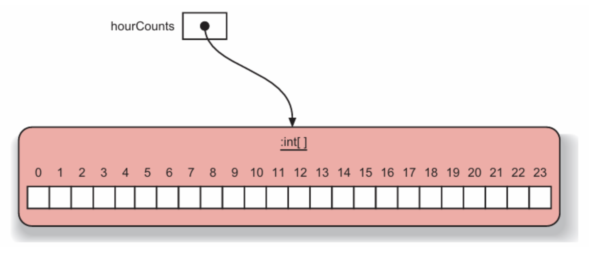
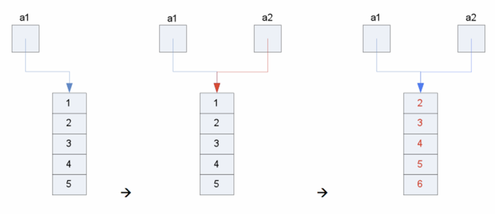
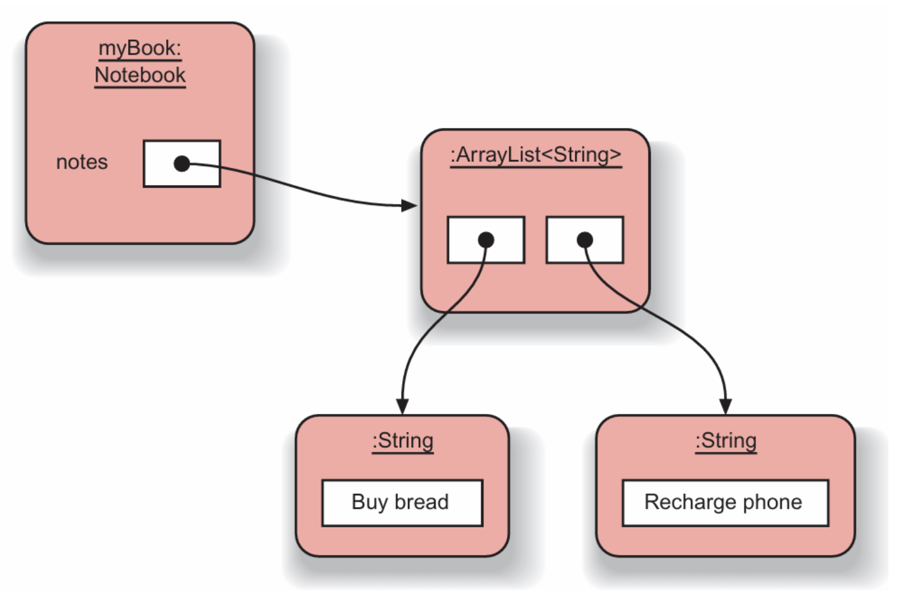

# Containers and Generic

## Array

- 数组是一种特殊类型对象，能够存储固定数量的元素
- 数组应当通过 `#!java new` 在堆上动态分配或**聚合初始化**(aggregate initialization)被创建

    ```java
    int[] a = new int[10];
    int a[] = new int[10];
    int[] a = {1, 2, 3, 4};
    ```

- 数组内所有元素类型相同
- 数组是一个对象

    ```java
    hourCounts = new int[24];
    ```

    <div style="text-align: center">
        
    </div>

- 所有数组都有一个内部成员属性 `length`，表示数组大小
- **合法下标值**(valid subscript value)
    - 编译器会检查是否用的是合法下标值，无论用于右值还是左值
    - 一旦程序运行过程中存在非法下标，就可能会出现数据或代码遭破坏，或程序中止(abort)的情况
    - 所以 Java 有责任确保程序在运行时只使用合法下标值
    - 关键概念：通过边界检查确保索引用于指代范围内的数组元素

- **for-each** 语法：

    ```java
    for ( <type> <variable>: <array> ) {
        // variable...
    }
    ```

    ???+ example "例子"

        ```java hl_lines="6"
        public class ArrayLength {
            public static void main(String[] args) {
                int[] a = new int[(int)(Math.random() * 10)];
                for ( int i = 0; i < a.length; ++i )
                    a[i] = (int)(Math.random() * 100);
                for ( int val : a )
                    System.out.println(val);
                }
        }
        ```

- 数组变量
    - 是指向数组对象的指针
    - 所以 Java 允许数组间的赋值

    <div style="text-align: center">
        
    </div>

    ???+ example "例子"

        ```java hl_lines="4"
        public class ArrayAssignment {
            public static void main(String[] args) {
                int[] a1 = {1, 2, 3, 4, 5};
                int[] a2 = a1;
                for ( int i = 0; i < a2.length; ++i )
                    a2[i]++;
                for ( int v : a1 )
                    System.out.println(v);
            }
        }
        ```

- 对象数组
    - 数组可以将**对象的引用**(references to objects)（句柄(handle)）作为元素存储
    - **注意**：实例化一个对象数组仅预留了存储引用的空间，所以必须要单独实例化每个元素中要存储的对象，比如以下声明：

        ```java
        String[] words = new String[5];
        ```

    - 对象数组中的 for-each

        ```java
        class Value {
            int i;
        }

        Value[] a = new Value[5];
        for ( int i = 0; i < a.length; i++ )
            a[i] = i;
        for ( var x: a )
            x.i++;
        for ( var x: a )
            System.out.println(x.i);
        ```

        - `#!java var` 可自动推断类型（和 C++ 的 `#!cpp auto` 类似）


## Collections

**容器对象**(collection object)是指能存储任意数量的其他对象的对象。常用的容器对象包括：

- `List`：以特定顺序存储元素
- `Set`：不允许有重复元素
- `Map`：一组“键-值”对象对

容器类是**泛型类**(generic class)。

```java
private ArrayList<String> notes;
```

要定义一个容器类的变量，我们需要指定两种类型：

- **集合本身**的类型（此处为 `ArrayList`）
- 存储在集合中的**元素**类型（此处为 `String`）

由于 Java 有类型推断功能，所以无需在 `#!java new` 中重复表述元素类型：

```java
import java.util.ArrayList;
public class Notebook {
    private ArrayList<String> notes = new ArrayList();
}
```

相应的对象结构如下：

<div style="text-align: center">
    
</div>


### Iteration

在容器对象上迭代：

- **索引**

    ```java
    for ( int i = 0; i < lst.size(); i++ ) {
        s += lst.get(i);
    }
    ```

- **for-each**

    ```java
    for ( var x : lst ) {
        s += x;
    }

    public voidlistNotes() {
        for (String note : notes) {
            System.out.println(note);
        }
    }
    ```

- **迭代器**(iterator)

    ```java
    public void listNotes() {
        Iterator<String> it = notes.iterator();
        while (it.hasNext()) {
            System.out.println(it.next());
        }
    }
    ```

    - 迭代器是一种对象，它提供了遍历容器对象中所有元素的功能
    - 此时客户端程序员无需了解或关心该被迭代序列的底层结构
    - 迭代器的工作流程：
        1. 通过调用名为 `#!java iterator()` 的方法，向容器请求一个迭代器；这个迭代器将在首次调用其 `#!java next()` 方法时，准备好返回序列中的第一个元素
        2. 使用 `#!java next()` 获取序列中的下一个对象
        3. 要想检查序列中是否还有更多对象，使用 `#!java hasNext()` 方法
        4. 利用 `#!java remove()` 移除迭代器最后返回的元素


### Implementation

容器实现：实现集合接口的类通常以 `<Implementation-style><Interface>` 的形式命名。下表总结了常见容器的实现：

| Interface | Hash Table | Resizable Array | Balanced Tree | Linked List | Hash Table + Linked List |
| :--------- | :---------- | :--------------- | :------------- | :------------ | :------------------------ |
| Set | `HashSet` |  | `TreeSet` |  | `LinkedHashSet` |
| List |  | `ArrayList` |  | `LinkedList` |  |
| Deque |  | `ArrayDeque` |  | `LinkedList` |  |
| Map | `HashMap` |  | `TreeMap` |  | `LinkedHashMap` |


??? abstract "容器相关术语"

    <div style="text-align: center">
        
    </div>


### Utilities

`Collections` 类的静态成员：

- `#!java min(Collection)`，`#!java max(Collection)`
- `#!java reverse()`
- `#!java copy(List dest, List src)`
- `#!java fill(List list, Object o)`


### Lists

常用的 List 容器有：

- `List`（接口）：以特定顺序维护元素
- `ArrayList`：使用数组实现，插入和删除偏慢
- `LinkedList`：插入和删除成本低，但随机访问慢

???+ abstract "和其他相近容器的比较"

    ```
    Collection
    ├─ List <- 有序、可重复、带索引
    │ ├─ ArrayList
    │ ├─ LinkedList <- 同时也实现了 Deque
    │ └─ Vector
    │     └─ Stack <- Vector 的子类（古老、同步、官方不推荐）
    ├─Queue <- 一端进、一端出，典型 FIFO
    │  ├─ Deque <- 双端队列，两头都能进出
    │  │   ├─ ArrayDeque <- 数组实现，非同步，最快
    │  │   └─ LinkedList <- 链表实现，也能当 List 用
    │  │
    │  ├─ PriorityQueue <- 按优先级出队，不是 FIFO
    │  └─ ConcurrentLinkedQueue...（并发包里的实现）
    ```


#### ArrayList

>官方文档：<https://docs.oracle.com/javase/8/docs/api/java/util/ArrayList.html>

下面罗列 `ArrayList` 常用的 API：

- 添加

    ```java
    boolean add(E e)
    void add(int index, E element)
    boolean addAll(Collection<? extends E> c)
    boolean addAll(int index, Collection<? extends E> c)
    ```

- 删除

    ```java
    E remove(int index)
    boolean remove(Object o)
    boolean removeAll(Collection<?> c)
    boolean removeIf(Predicate<? super E> filter)
    protected void removeRange(int fromIndex, int toIndex)
    void clear()
    boolean retainAll(Collection<?> c)
    ```

- 修改

    ```java
    E set(int index, E element)
    void replaceAll(UnaryOperator<E> operator)
    ```

- 查找

    ```java
    E get(int index)
    int indexOf(Object o)
    int lastIndexOf(Object o)
    boolean contains(Object o)
    boolean containsAll(Collection<?> c)
    ```

- 信息

    ```java
    boolean isEmpty()
    int size()
    ```

- 容量

    ```java
    void ensureCapacity(int minCapacity)
    void trimToSize()
    ```

- 生成

    ```java
    Object[] toArray()
    <T> T[] toArray(T[] a)
    Object clone()
    void sort(Comparator<? super E> c)
    List<E> subList(int fromIndex, int toIndex)
    ```

- 迭代

    ```java
    Iterator<E> iterator()
    ListIterator<E> listIterator()
    ListIterator<E> listIterator(int index)
    ```

- 流

    ```java
    Stream<E> stream()
    Stream<E> parallelStream()
    void forEach(Consumer<? super E> action)
    ```

???+ note "`ArrayList` v.s. `Vector`"

    >对于新代码，推荐使用 `ArrayList` 或 `CopyOnWriteArrayList`/`Collections.synchronizedList`，而非 `Vector`。

    实际选型：

    - 单线程 -> `ArrayList`
    - 多线程且读远多于写 -> `CopyOnWriteArrayList`
    - 多线程读写均衡 -> `Collections.synchronizedList(new ArrayList<>())`
    - 老代码/需要与遗留 API 对接 -> 才继续用 `Vector`


### Sets

常用的 Set 容器有：

- `Set`（接口）：加入 `Set` 的所有元素都是唯一的
- `HashSet`：对象必须定义 `hashCode()`
- `TreeSet`：由树结构支持的有序集合

???+ example "例子"

    ```java
    import java.util.HashSet;
    import java.util.Iterator;
    //...
    HashSet<String> mySet = new HashSet<String>();
    mySet.add("one");
    mySet.add("two");
    mySet.add("three");
    Iterator<String> it = mySet.iterator();
    while(it.hasNext()) {
        //call it.next() to get the next object
        //do something with that object
    }
    ```

如何选择合适的 Sets？

- 日常去重：`HashSet`
- 去重 + 插入顺序：`LinkedHashSet`
- 去重 + 排序/区间：`TreeSet`（单线程）或 `ConcurrentSkipListSet`（并发）
- 并发去重：首选 `#!java ConcurrentHashMap.newKeySet()`（JDK8 + 工厂方法），或 `ConcurrentSkipListSet`
- 读多写少且集合小：`CopyOnWriteArraySet`
- `#!java enum` 专用：`#!java EnumSet.allOf(MyEnum.class)`

如果要将用户自定义对象放入 `Set` 中，需注意：

- 必须
    - 正确覆写 `#!java equals()`，包括以下约定（`Object` 规范节选）：
        - 自反：`#!java x.equals(x)` 必须 `#!java true`
        - 对称：`#!java x.equals(y)` <=> `#!java y.equals(x)`
        - 传递：`#!java x.equals(y) && y.equals(z)` => `#!java x.equals(z)`
        - 一致：多次调用结果不变
        - 与 `#!java null` 比较必须返回 `#!java false`

        ???+ code "实现模板（字段比较 + `#!java null` 安全）"

            ```java
            @Override
            public boolean equals(Object o) {
                if (this == o) return true;
                if (!(o instanceof MyKey)) return false;
                MyKey other = (MyKey) o;
                return Objects.equals(this.name, other.name) && this.age == other.age;
            }
            ```

    - 一致地覆写 `#!java hashCode()`
        - 规则：相等对象必须返回相同哈希值，不相等对象尽量分散
        - 一旦对象进入 `HashSet` ，不要修改参与 `hash`/`equals` 的字段，否则“内存泄漏”式丢失对象

        ???+ code "实现模板"

            ```java
            @Override
            public int hashCode() {
                return Objects.hash(name, age);  // 内部调用 Arrays.hashCode
            }
            ```

- 可选（若想让 `TreeSet` / `ConcurrentSkipListSet` 能排序，以下两者二选一即可）
    - 实现 `Comparable<T>`

        ```java
        class MyKey implements Comparable<MyKey> {
            public int compareTo(MyKey o) {
                int c = this.name.compareTo(o.name);
                return (c != 0) ? c : Integer.compare(this.age, o.age);
            }
        }
        ```

    - 提供外部 `Comparator`

        ```java
        Set<MyKey> set = new TreeSet<>(
            Comparator.comparing(MyKey::getName)
                .thenComparingInt(MyKey::getAge));
        ```

???+ example "完整示例"

    ```java
    public final class MyKey implements Comparable<MyKey> {
        private final String name; // 参与 hash/equals/compare
        private final int age;

        public MyKey(String name, int age) {
            this.name = name;
            this.age = age;
        }

        @Override
        public boolean equals(Object o) { /* 见上 */ }

        @Override
        public int hashCode() { /* 见上 */ }
        
        @Override
        public int compareTo(MyKey o) { /* 见上 */ }
        }
    ```


### Maps

常用的 Map 容器有（和 Set 类似）：

- `Map`（接口）
- `HashMap`
- `TreeMap`

???+ example "例子"

    ```java
    HashMap <String, String> phoneBook = new HashMap<String, String>();
    phoneBook.put("Charles Nguyen", "(531) 9392 4587");
    phoneBook.put("Lisa Jones", "(402) 4536 4674");
    phoneBook.put("William H. Smith", "(998) 5488 0123");
    String phoneNumber = phoneBook.get("Lisa Jones");
    System.out.println(phoneNumber);
    ```

哈希(hashing)和哈希码(hash code)：

- 键需要有 `#!java hashCode()` 方法
- 要想将用户自定义类作为 `HashMap` 的键，必须覆写 `#!java equals()` 和 `#!java hashCode()`

???+ note "选择 Map 类"

    === "单线程场景（非同步，最快）"

        | 实现类 | 底层结构 | Key 可为 null | 有序性 | 备注 |
        | :------ | :---------- | :------------ | :------ | :---- |
        | `HashMap` | 数组 + 链表 + 红黑树（JDK8+） | 允许一个 | 无顺序 | 默认首选，O(1) |
        | `LinkedHashMap` | 继承 `HashMap`，再串一条双向链表 | 允许 | 插入顺序或访问顺序（LRU） | 适合做缓存 |
        | `TreeMap` | 红黑树 | 不可 | 键自然顺序或自定义 `Comparator` | O(log n)，支持区间查询 |

    === "多线程场景（并发级别由低到高）"

        | 实现类 | 同步方式 | Key 可为 null | 并发度 | 备注 |
        | :------ | :---------- | :------------ | :------ | :---- |
        | `Hashtable` | 全表锁 | 不可 | 低 | 上古类，别用 |
        | `#!java Collections.synchronizedMap(new HashMap<>())` | 包装后全表锁 | 不可 | 低 | 简单兼容旧代码 |
        | `ConcurrentHashMap` | 分段锁（JDK7）→桶级锁/无锁（JDK8+） | 不可 | 高 | 读写并行，默认首选 |

    === "特殊用途"

        | 实现类 | 特点 |
        | :------ | :------ |
        | `WeakHashMap` | 键是弱引用，GC 自动清理，适合做“键生命周期随对象”的缓存 |
        | `IdentityHashMap` | 用 `==` 比较键，而不是 `equals`，用于图算法、对象拓扑复制 |
        | `EnumMap` | 键必须是同一 `enum` 类型，内部用数组，比 `HashMap` 快且内存省 |

    ---
    tldr 版：

    - 单线程 / 常规：默认 `HashMap`
    - 需要插入/访问顺序：`LinkedHashMap`
    - 需要排序/区间：`TreeMap`（单线程）或 `ConcurrentSkipListMap`（并发）
    - 并发：首选 `ConcurrentHashMap`；别再 `#!java new Hashtable()`


## Generic

关于**泛型**(generic)：

- 泛型提供了一种向编译器传递容器类型信息的方式，以便进行**类型检查**
- 除了**枚举**、**匿名内部类**和 **`Exception` 类**之外，所有类型都可以拥有泛型参数


**泛型类**(generic class)必须指定两种类型：集合本身的类型（此处为 `ArrayList`），以及存储在集合中的元素类型（此处为 `String`）。

```java
private ArrayList<String> notes;
```

---
将类型作为参数：

```java
class Pair<T> {
    T first;
    T second;
}
```

- `T` 是占位符，生成对象时传具体类型
- 实际上 Java 常用占位符为 `E` 而非 `T`（`E` 代表 element）

---
多类型参数：类型参数数量不限制，按位置对应

```java
class Triple<A, B, C> { }
Triple<String, Integer, Double> t = new Triple<>("Hi", 42, 3.14);
```

---
接口可能也会用到泛型类型：

```java
interface Codec<T> {
    T decode(String s);
}

enum IntCodec implements Codec<Integer> {
    INSTANCE;
    public Integer decode(String s) {
        return Integer.valueOf(s);
    }
}
```

---
定义一个简单的泛型类：

```java
public interface List<E> {
    void add(E x);
    Iterator<E> iterator();
}

public interface Iterator<E> {
    E next();
    boolean hasNext();
}
```

---
泛型类里的静态方法：

- 方法前写 `<T>` ，编译器帮你推

```java
public static <T> List<T> asList(T... a) {
    return Arrays.asList(a);
}

// 类型推断
List<String> names = asList("A", "B");
```

???+ example "例子"

    ```java
    public final class Box<T> {
        private T value;
        public Box(T value) { this.value = value; }
        public T get() { return value; }
        public void set(T value){ this.value = value;}
        
        // 静态泛型工厂，方便创建
        public static <E> Box<E> of(E value) { return new Box<>(value); }

        public static void main(String[] args) {
            Box<String> sBox = Box.of("Hello");
            System.out.println(sBox.get()); // Hello
            Box<Integer> iBox = new Box<>(42);
            iBox.set(iBox.get() + 1);
            System.out.println(iBox.get()); // 43
        }
    }
    ```

---
Java 的泛型方式：

- 代码没有多个副本
- 泛型类型声明一次性编译，并转换为一个单独的类文件
- 泛型声明有形式类型参数
- 为形式类型参数使用简洁（如果可能的话，单字符）且富有启发性的名称

---
泛型与子类型(subtyping)：如果 `Foo` 是 `Bar` 的一个子类型（子类或子接口），而 `G` 是某种泛型类型声明，那么 `G<Foo>` **并不是** `G<Bar>` 的子类型。

```java
List<String> ls = new ArrayList<String>();
List<Object> lo = ls;
lo.add(new Object());
String s = ls.get(0);
```

---
**通配符**(wildcard)：

```java
void printCollection(Collection<?> c) {
    for (Object e : c) {
        System.out.println(e);
    }
}

Collection<?> c = new ArrayList<String>();
c.add(new Object());
```

???+ example "例子"

    以下代码实现 Shape 类及其子类：

    <div style="text-align: center">
        
    </div>


    ```java
    public abstract class Shape {
        public abstract void draw(Canvas c);
    }

    public class Circle extends Shape {
        private int x, y, radius;
        public void draw(Canvas c) { ... }
    }

    public class Rectangle extends Shape {
        private int x, y, width, height;
        public void draw(Canvas c) { ... }
    }

    // To draw them on a canvas
    public void draw(Shape s) {
        s.draw(this);
    }

    public void drawAll(List<Shape> shapes) {
        for (Shape s: shapes) {
            s.draw(this);
        }
    }

    // Bounded wildcards
    public void drawAll(List<? extends Shape> shapes) { ...}
    double sum(List<? extends Number> nums) { /* 只读 */ }
    void fill(List<? super Integer> ints) { /* 只写 */ }
    ```

???+ note "`#!java extends` v.s. `#!java super`"

    `#!java extends` 只能"读"，`#!java super` 只能"写”（相对变量而言）

    | 界限 | 英文含义 | 能放什么 | 能拿什么 | 典型场景 |
    | :------ | :------ | :------ | :------ | :------ |
    | `#!java ? extends Integer` | 上界通配符 | 什么也不能放（除 null） | 只能读出 `Integer` 或其子类 | 消费数据，如求和 |
    | `#!java ? super Integer` | 下界通配符 | 可以写 `Integer` 及其子类 | 只能拿出 `Object`（丧失具体类型） | 生产数据，如填充 |

    ???+ example "例子"

        ```java
        List<? extends Integer> upper = new ArrayList<Integer>();
        Integer i = upper.get(0);  // 读
        upper.add(3);              // 编译失败，不知道具体是 Integer 的哪一级子类型

        List<? super Integer> lower = new ArrayList<Number>();
        lower.add(3);              // 写
        Number n = lower.get(0);   // 读出只能是 Object/Number，丢失具体类型
        ```

---
运行时擦除：

- 泛型只存在于编译期
- 编译后擦除到 `Object` 或通配上限

???+ example "例子"

    ```java
    class Pair<T> {
        T first;
        T second;
    }
    ```

    ```
    $ javap -c -v -p Pair

    T first; // 字节码里 T 被擦成 Object
    descriptor: Ljava/lang/Object;
    ```

对于：

```java
class NumBox<T extends Number> { private T v; }

private java.lang.Number v; // 擦除到 Number，而非 Object
```

OpenJDK 24 的 `javap -p -v` （ 或 `-c -v` ）为了可读性 ，把擦除后的 `Object` / `Number` 又显示成原泛型符号 `T`，但 `Signature` 属性 `Object` 和字节码指令里仍然是 `Object`。

---
泛型不能做的事：

- `#!java new T()`：擦除后无构造
- `#!java T.class`：无具体类型信息
- `#!java List<int>`：基本类型不能用