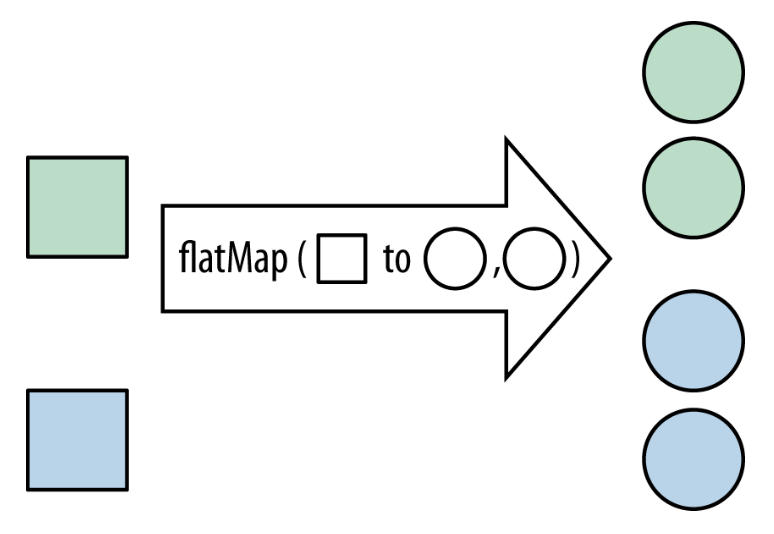

# Stream and Exception

!!! warning "警告"

    这是一堆凌乱的文字，请不要尝试阅读！

## Stream

???+ example "例子"

    === "例1"

        { align=right width=30% }

        ```java
        ArrayList<Artist> artists = new ArrayList<>();

        int cnt = 0;
        for (Artist artist : artists) {
            if (artist.isFrom("London")) {
                cnt++;
            }
        }
        System.out.println(cnt);
        ```

    === "例2"

        { align=right width=30% }

        ```java
        long count = artists.stream()
                            .filter(artist -> artist.isFrom("London"))
                            .count();

        System.out.println(count);
        ```

惰性方式(lazy way)：

```java
artists.stream()
       .filter(artist -> {
            System.out.println("Checking artist: " + artist.getName());
            return artist.isFrom("London");
       })
       .forEach(artist -> System.out.println("Artist from London: " + artist.getName()));
```

???+ note "惰性方式 v.s. 积极方式"

    - `#!java filter()` 返回 `Stream` --> 惰性方式
        - **中间操作**(intermediate operations)，它们只是构建流水线，不会立即执行

    - `#!java count()` 返回 `#!java int` --> 积极方式
        - **终端操作**(terminal operations) 会触发流的计算，并产生最终结果

    - 一次流计算可以有很多个中间操作，但只能有一个终端操作

---
流的原语(primitives)：

- 在 `java.util.stream` 包里，JDK 提供了 4 套专门用于基本类型的流类型，每套都带独立的静态工厂和专用中间/终端操作
- 它们全部实现 `BaseStream` 接口，与 `Stream` 并列，互不继承

| 流类型 | 元素类型 | Lambda 类型 | 专用终端例 |
| :------ | :------ | :------ | :------ |
| `IntStream` | `#!java int` | `#!java int` | `#!java sum()`，`#!java average()`，`#!java summaryStatistics()` |
| `LongStream` | `#!java long` | `#!java long` | 同上 |
| `DoubleStream` | `#!java double` | `#!java double` | 同上 |

- 没有 `FloatStream` / `CharStream` / `BooleanStream`
    - `#!java float` 被提升为 `#!java double`，`#!java char` / `#!java boolean` 用 `IntStream` 装

---
流的引用：`Stream<T>`，任意引用类型 `T`


### Creating Stream

- 来自 `Collection`

    | 来源 | 方法 | 流类型 |
    | :------ | :------ | :------ |
    | `java.util.Collection` | `#!java .stream()`，`#!java .parallelStream()` | `#!java Stream<T>` |
    | `java.util.Map` | `#!java .entrySet().stream()` ... | `#!java Stream<Map.Entry<K,V>>` |

- 来自数组

    | 来源 | 方法 | 流类型 |
    | :------ | :------ | :------ |
    | 任意引用类型数组 | `#!java Arrays.stream(T[])` | `#!java Stream<T>` |
    | 基本类型数组 | `#!java Arrays.stream(int[])` ... | `IntStream / LongStream / DoubleStream` |
    | 指定区间 | `#!java Arrays.stream(array, start, end)` | 同上 |

- 静态工厂方法

    | 类 | 方法 |
    | :------ | :------ |
    | `Stream` | `#!java Stream.of(T…)`，`#!java Stream.ofNullable(T)` |
    | `Stream` | `#!java Stream.empty()` |
    | `Stream` | `#!java Stream.generate(Supplier<T>)` |
    | `Stream` | `#!java Stream.iterate(T, UnaryOperator<T>)` |
    | `Stream` | `#!java Stream.iterate(T, Predicate<T>, UnaryOperator<T>)` （1.9+ 带终止条件） |
    | `IntStream, LongStream, DoubleStream` | `#!java IntStream.of(int…)`，`#!java IntStream.range(1, 10)`，`#!java IntStream.rangeClosed(1, 10)` |

- `Stream` 还可以从缓冲字符流（`BufferedReader`）、文件、正则表达式、随机数发生器、`#!java Optional` 和并行工具产生


### Common Lazy Operations

- `map` 方法

    { align=right width=20% }

    ```java
    List<String> collected = Stream.of("a", "b", "hello")
                                .map(string -> string.toUpperCase())
                                .collect(toList());

    System.out.println(collected);
    ```

- `filter` 方法

    { align=right width=20% }

    ```java
    List<String> beginningWithNumbers
    = Stream.of("a", "1abc", "abc1")
            .filter(value -> Character.isDigit(value.charAt(0)))
            .collect(toList());

    System.out.println(beginningWithNumbers);
    ```

- `flatMap` 方法

    { align=right width=20% }

    ```java
    List<Integer> together = Stream.of(Arrays.asList(1, 2), asList(3, 4))
                                   .flatMap(numbers -> numbers.stream())
                                   .collect(toList());
    
    System.out.println(together);
    ```

### Common Eager Operations

- 迭代

    | 方法名 | 返回类型 | 说明 |
    | :------ | :------ | :------ |
    | `#!java forEach(Consumer)` | `#!java void` | 遍历每个元素 |
    | `#!java forEachOrdered(Consumer)` | `#!java void` | 顺序遍历（适用于并行流） |

    ??? example "例子"

        ```java
        List<String> list = List.of("java", "python", "go");
        list.stream()                       // 拿到流
            .forEach(System.out::println);  // 终端操作：逐行打印

        AtomicInteger sum = new AtomicInteger(0);
        IntStream.rangeClosed(1, 5)         // 1 2 3 4 5
                .forEach(sum::addAndGet);  // 累加
        System.out.println(sum.get());     // 15

        List.of("a", "b", "c", "d")
            .parallelStream()
            .forEachOrdered(System.out::print);  // 保证按原顺序打印
        ```

- 收集

    | 方法名 | 返回类型 | 说明 |
    | :------ | :------ | :------ |
    | `#!java toArray()` | `#!java Object[]` | 转为数组 |
    | `#!java toArray(IntFunction<A[]>)` | `#!java A[]` | 转为指定类型数组 |
    | `#!java collect(Collector)` | `R` | 收集元素到集合或其他结构 |

    ??? example "例子"

        ```java
        Set<String> origins = album.getMusicians()
                                .filter(artist -> artist.getName().startsWith("The"))
                                .map(artist -> artist.getNationality())
                                .collect(toSet());
        ```

- 归约：对于一个值集合，生成单一结果

    | 方法名 | 返回类型 | 说明 |
    | :------ | :------ | :------ |
    | `#!java reduce(...)` | `#!java Optional<T>` 或 `T` | 归约操作 |
    | `#!java min(Comparator)` | `#!java Optional<T>` | 最小值 |
    | `#!java max(Comparator)` | `#!java Optional<T>` | 最大值 |
    | `#!java count()` | `#!java long` | 元素个数 |

    ??? example "例子"

        === "例1"

                ```java
                int count = Stream.of(1, 2, 3).reduce(0, (acc, element) -> acc + element);
                ```

                <div style="text-align: center">
                    
                </div>

        === "例2"

            ```java
            List<Track> tracks = asList(new Track("Bakai", 524),
                new Track("Violets for Your Furs", 378),
                new Track("Time Was", 451));

            Track shortestTrack = tracks.stream()
                                        .min(Comparator.comparing(track -> track.getLength()))
                                        .get();
            ```

- 短路(short-circuiting)

    | 方法名 | 返回类型 | 说明 |
    | :------ | :------ | :------ |
    | `#!java anyMatch(Predicate<T>)` | `#!java boolean` | 一旦找到匹配元素，立即返回 `#!java true` |
    | `#!java allMatch(Predicate<T>)` | `#!java boolean` | 一旦遇到不满足的元素，立即返回 `#!java false` |
    | `#!java noneMatch(Predicate<T>)` | `#!java boolean` | 一旦遇到满足的元素，立即返回 `#!java false` |
    | `#!java findFirst()` | `#!java Optional<T>` | 返回第一个元素，找到即停 |
    | `#!java findAny()` | `#!java Optional<T>` | 返回任意一个元素（并行流中可能更快） |

    ???+ example "例子"

        === "例1"

            ```java
            Stream.iterate(1, i -> i + 1)            // 无限流：1, 2, 3, ...
                .filter(i -> i > 100)
                .findFirst()                       // 短路操作，程序不会无限运行
                .ifPresent(System.out::println);   // 输出 101
            ```

        === "例2（找素数）"

            ```java hl_lines="17"
            // 打印素数个数
            System.out.println(IntStream.range(2, x)
                .filter(i-> {
                    System.out.println("Testing " + i);
                    return x % i == 0;})
                .count());

            // 打印第一个素数
            System.out.println(IntStream.range(2, x)
                .filter(i-> {
                    System.out.println("Testing " + i);
                    return x % i == 0;})
                .findFirst());

            // 并行流
            System.out.println(IntStream.range(2, x)
                .parallel()
                .filter(i-> {
                    System.out.println("Testing " + i);
                    return x % i == 0;})
                .findAny());
            ```


### Parallel Stream

`#!java parallelStream()` 把“串行流”换成“并行流”，底层开启多线程，对数据进行分片 -> 并行处理 -> 结果合并。

???+ example "例子"

    ```java
    List<Integer> list = List.of(1, 2, 3, 4, 5, 6, 7, 8, 9, 10);

    // 并行求和
    int sum = list.parallelStream()
                .mapToInt(Integer::intValue)
                .sum();
    System.out.println(sum); // 55
    ```

何时使用并行流？

- 数据量**小**；线程切换开销：计算收益，**可能更慢**  
- 数据量**大** + **计算重**：明显加速  
- 需要**顺序**：并行后顺序混乱，需要 `forEachOrdered` 或 `sorted` 等额外操作  
- 有**状态** / **锁**：容易出现竞态、性能骤降  

???+ bug "陷阱"

    ```java
    List.of(1,2,3,4,5).parallelStream().forEach(System.out::print);
    // 可能输出 34125，用 forEachOrdered(System.out::print) 或先 sorted()

    List<Integer> bad = new ArrayList<>();
    list.parallelStream().forEach(bad::add);    // 非线程安全，会丢数据
    //用 collect(Collectors.toList()) 或线程安全容器
    ```

性能改善？

```java
long t1 = System.nanoTime();
long a = LongStream.rangeClosed(1, 10_000_000).sum();             // 串行
long t2 = System.nanoTime();
long b = LongStream.rangeClosed(1, 10_000_000).parallel().sum();  // 并行
long t3 = System.nanoTime();
System.out.printf("串行: %d ms，并行: %d ms%n", (t2 - t1) / 10_000_000, (t3 - t2) / 10_000_000);
```

???+ abstract "总结"

    - 容器都支持产生流，另有一些特殊的流类
    - 流的函数有两类：返回流的惰性计算函数接收函数式接口的对象，用于将来计算；返回其他类型的急性计算函数遍历流并调用惰性计算函数
    - 并行流在适合并行计算的场合能实现并行计算


## Exception

运行时错误：

- Java 的基本哲学是“不规范的代码将不会运行”
- 所以处理在运行时可能遇到的各种情况是非常重要的

**异常**(exception)：

- 当问题出现时，你可能不知道该如何应对，但你清楚不能就这样若无其事地继续下去
- 你必须停下来，并且需要有人、在某个地方想出解决的办法

为何需要异常？

- 异常的一大优势在于简化了错误处理代码
- 异常将描述程序员意图执行的代码与实际执行操作的代码分离开来

异常条件是指阻止所在方法或范围的继续进行的问题：

```java
if (t == null)
    throw new NullPointerException();

// or
throw new NullPointerException("t = null");
```

`#!java throw` 关键字：

- 首先使用 `#!java new` 创建一个表示错误情况的对象
- 将得到的引用传递给 `#!java throw`
- 实际上，该对象是从方法中“返回”的
- 异常机制被激活以处理该异常对象

任何 `#!java Throwable`（异常根类）对象的类型可以被抛出。

**捕获**(catch)异常的机制：当异常被抛出时，同一作用域中跟随的所有语句都应被处理，检查周围的作用域：

- 周围是 `#!java try` 吗？
    - 否：离开该作用域。该作用域是方法体吗？
        - 是：返回调用者，然后跳转到第 1 行
        - 否：跳转到第 1 行
    - 是：尝试匹配 `#!java catch`，是否匹配？
        - 是：执行子句并跳转到 `#!java try` 块后的语句
        - 否：跳转到第 1 行

```java
void m() {
    try {
        f();
    } catch (B b) {
    }
    System.out....
}
void f() {
    try {
        g();
        int i=0;
    } catch (A a) {
    }
}
void g() {
    if ( a == null ) {
        throw new B();
        System.....
    }
    System.out....
}
```

捕获更多异常：

```java
try {
    //...
} catch (SecurityException | IOException e) {
    e.printStackTrace();
}
```

捕获任何异常：

```java
catch(Exception e) {
    System.err.println("Caught an exception");
}
```

接口：`#!java throwable`

- `#!java String getMessage();`
- `#!java String toString();`
- `#!java void printStackTrace();`
- `#!java void printStackTrace(PrintStream);`

重新抛出异常：

```java
catch(Exception e) {
    System.err.println("An exception was thrown");
    throw e;
}
```

通过 `#!java finally` 子句执行清理（当需要将内存之外的其他事物恢复至原始状态时，该子句是必须的）：

```java
try {
    // The guarded region: Dangerous activities
    // that might throw A, B, or C
} catch(A a1) {
    // Handler for situation A
} catch(B b1) {
    // Handler for situation B
} catch(C c1) {
    // Handler for situation C
} finally {
    // Activities that happen every time
}
```

离开 try-catch 语句块的四种可能：

- 无事发生
- 异常被抛出，并被捕获
- 异常被抛出，但未被捕获
- 异常被抛出，被捕获，且被重新抛出

异常规范：

- 需要将调用自定义方法时可能抛出的异常告知给客户端程序员
- 可以声称要抛出一个实际上并不会抛出的异常
- 如果自定义方法调用了一个声明抛出异常的方法，必须：
    - 将调用放在 `#!java try` 块中，并为它声明的所有异常设置 `#!java catch` 处理
    - 或者声明抛出这些未处理的异常

异常限制：当重写(override)一个方法时，只能抛出基类方法版本中已指定的异常。

下图展示了标准的 Java 异常：

<div style="text-align: center">
    
</div>

关于运行时异常（`RuntimeException`）：

- 若方法抛出运行时异常则不必声明
    - **已检查**(checked)异常：除 `RuntimeException` 之外的异常
    - **未检查**(unchecked)异常：无需在方法声明中指定的 `RuntimeException`
- 若没有为这类异常提供 try-catch 语句块...

构造函数中的异常：

- 在 Java 中内存是安全的
- 可用 `#!java finally` 子句完成其他明确的工作

???+ abstract "总结"

    - 基本要义和 C++ 相同
    - `#!java Exception` 的子类才能被 `#!java throw`
    - `#!java try...catch...finally`
    - 函数必须声明可能抛出的异常
    - 子类 `#!java override` 的函数不能抛比父类版本更多的异常
    - 子类的构造器必须声明父类构造会抛的全部异常
    - `RuntimeException` 及其子类是未检查异常


## RTTI

**运行时类型识别**(run-time type identification, RTTI)：当仅持有基类型的句柄时，它让你能够找出对象的准确类型。

向上转型(upcast)后：

```java
Object o = new String("RTTI");
System.out.println(o.getClass());
```

- 编译时类型 = `#!java Object`
- 运行时类型 = `#!java String`

关于 `#!java Object`：

- `#!java Object` 是 Java 所有类的基类，每一个类都隐式扩展自 `#!java Object` 类
- `#!java Object` 包含以下类：

```java
public boolean equals(Object x) { ... }
public String toString() { ... }
public Class getClass(Object x) { ... }
public int hashCode() { ... }
protected Object clone(Object x) { ... }
public void wait() { ... }                   // used in multithreading
public void notify() { ... }                 // used in multithreading
```

`#!java Object` 的 RTTI 三件套：

| 方法        | 返回        | 含义             |
|-------------|-------------|------------------|
| `#!java getClass()` | `#!java Class<?>`  | 取得运行时类型对象 |
| `#!java hashCode()` | `#!java int`       | 默认地址散列       |
| `#!java equals()`   | `#!java boolean`   | 默认 `==` 地址     |

其中 `getClass` 是 RTTI 的大门。

获取 `#!java Class` 对象的 3 条路径：

```java
// 1. 已有对象
Class c1 = o.getClass();

// 2. 类字面量（最稳）
Class c2 = String.class;

// 3. 字符串（动态）
Class c3 = Class.forName("java.lang.String");
```

`equals()` 方法：

```java
public static void main (String [ ] args) {
    Shape [ ] shapeList = new Shape [3];
    shapeList[0] = new Circle(5.0);
    shapeList[1] = new Rectangle(3.0, 4.0);
    shapeList[2] = new Circle(6.0);
    for (int i = 0; i < shapeList.length; i++) {
        Class c = shapeList[i].getClass( );
        if (c.equals(Circle.class))
            System.out.println(“I can be cast as a Circle”);
        else if (c.equals(Rectangle.class))
            System.out.println(“I can be cast as a Rectangle”);
    }
}
```

`#!java instanceof`：

```java
Class c = x.getClass( );
if (c.equals(Circle.class)){ } // Compares 2 classes
if (x instanceof Circle) { } // Tests whether object x is an instance of a class
// Alternatively (but equivalently) use the isInstance() method of an object with a class parameter
if (c.isInstance(x) ) { } 
```

动态创建：不用 `#!java new` 的“工厂”

- `#!java c.getDeclaredConstructor().newInstance()` 替代 `#!java new`

    ```java
    Scanner sc = new Scanner(System.in);
    String clsName = sc.nextLine();                  // 输入 java.util.Date
    Object obj = Class.forName(clsName)
                    .getDeclaredConstructor()
                    .newInstance();
    System.out.println(obj.toString());
    int[] a = Array.newInstance(int.class, 5);       // 快速创建数组
    Shape[] b = Array.newInstance(Circle.class, 5);  // 快速创建数组
    ```

- 输错类名 -> `#!java ClassNotFoundException`

`#!java Class` 的方法：

```java
c1.getName()                                // 全限定名
c1.getSimpleName()                          // 简称
cl.getSuperclass()                          // 父类
c1.isInterface()                            // 是否接口
c1.newInstance()                            // JDK9+ 弃用
c1.getDeclaredConstructor().newInstance()   // 替代
```

**反射**(reflection)：运行时类信息

- 哪里使用反射？
    - 在基于组件的(component-based)编程中，使用应用程序构建工具中的快速应用程序开发(rapid application development, RAD)来构建项目
    - 为了提供在网络上创建和执行远程平台上的对象的能力。这被称为远程方法调用(remote method invocation)，它允许 Java 程序（版本 1.1 及以上）在多台机器上分布对象

获取字段值：

```java
Field fields[] = c.getFields();
try {
    for (int i = 0; i < fields.length; i++) {
        System.out.print(fields[i].getName() + " = ");
        System.out.println(fields[i].getInt(note));
    }
} catch(Exception e) {
}
```

调用方法：

```java
note = new Note();
c = note.getClass();
Method meth = c.getMethod("play", null);
meth.invoke(note, null);

Class<?> c = Student.class;
Object stu = c.getDeclaredConstructor().newInstance();
Method m = c.getMethod("setName", String.class);
m.invoke(stu, "Alice");
```

访问 `#!java private` 成员：`#!java setAccessible(true)` 可打开 `#!java private` 成员。

类装载器 3 层模型

```
Bootstrap (平台类，null)
↑
Extension (ext 目录)
↑
Application(classpath)
```

代码验证：

```java
System.out.println(String.class.getClassLoader()); // null
System.out.println(this.getClass().getClassLoader()); // AppClassLoader
```

双亲委派 = “先让老爹扛，老爹扛不动再自己上” 的加载策略：

- 任何类加载器收到加载请求，先不自己加载，而是委派给父加载器
- 父加载器如果找不到类，才回退到原加载器自己加载
- 层层向上直到 Bootstrap，保证核心类（ `java.*` ）全局唯一，防止户篡改
- 结果：
    - `java.lang.String` 永远由 Bootstrap 加载，你写的同名类永远进不来
    - 类加载顺序自顶向下，类在 JVM 里全局唯一，安全 + 避免重复加载

插件工厂实战：

```java
interface Pet {
    void makeSound();
}
class Dog implements Pet {
    public void makeSound() {
    System.out.println("woof");
}
}
// 工厂
public static Pet create(String className) throws Exception {
    return (Pet) Class.forName(className)
                      .getDeclaredConstructor()
                      .newInstance();
}
```

输入 `Dog` → 立刻发声

常见 RTTI 异常：

| 异常 | 触发场景 |
| :--- | :--- |
| `ClassNotFoundException` | 类名写错/未在 classpath |
| `InstantiationException` | 企图 new 抽象类/接口 |
| `IllegalAccessException` | 私有构造且无 `#!java setAccessible(true)` |
| `InvocationTargetException` | 调用了错误参数的函数 |

框架魔法怎么来的？

```java
List<String> list = new ArrayList<>();
```

提问：

- 反射能拿到 `String` 吗？
- Spring 怎么给任意类注入依赖？

泛型擦除 — 运行时真相

```java
Method m = list.getClass().getMethod("get", int.class);
Type ret = m.getGenericReturnType(); // 不是 String！
System.out.println(ret); // E
```

- 擦除：字节码里只剩 `Object`
- API：`getGenericReturnType()` / `getGenericParameterTypes()`

`ParameterizedType` 解析：

```java
if (ret instanceof ParameterizedType) {
    ParameterizedType p = (ParameterizedType) ret;
    System.out.println("Raw : " + p.getRawType()); // interface java.util.List
    System.out.println("Actual Args: " + Arrays.toString(p.getActualTypeArguments()));
}
```

结果： `[class java.lang.String]`

TypeToken 套路（Google Guava）

```java
TypeToken<List<String>> token = new TypeToken<List<String>>() {};
Type type = token.getType(); // 捕获完整参数化类型
```

本质：匿名子类保存泛型签名 → 框架通用技巧

动态代理 Proxy — 无侵入日志

```java
MyService target = new MyService();
MyService proxy = (MyService) Proxy.newProxyInstance(
    target.getClass().getClassLoader(),
    target.getClass().getInterfaces(),
    (proxyObj, method, args) -> {
        System.out.println(">> " + method.getName());
        Object result = method.invoke(target, args);
        System.out.println("<< " + method.getName());
        return result;
});
proxy.work(); // 自动打印前后日志
```

`java.lang.reflect.Proxy` : 动态代理工厂，能在运行时凭空生成一个实现了指定接口的新类（名字类似 `$Proxy0` ） ，并把对它的所有方法调用统一转到所提供的一个 `InvocationHandler` 身上：

```java
MyService target = new MyService();                     // 真实对象
MyService proxy = (MyService) Proxy.newProxyInstance(
    target.getClass().getClassLoader(),                 // 1. 用哪个类加载器
    target.getClass().getInterfaces(),                  // 2. 要实现的接口列表
    (proxyObj, method, args) -> {                       // 3. 调用处理器
        System.out.println("before " + method.getName());
        Object result = method.invoke(target, args);    // 转发给真实对象
        System.out.println("after " + method.getName());
        return result;
    });
proxy.work(); // 实际进入 InvocationHandler.invoke(...)
```

Proxy 特点

- 只能代理接口，不能代理普通类；
- 代理类是运行时字节生成，无源码文件；
- 任何方法调用 -> 统一进 `invoke()`
- 适合做日志、事务、权限等横切逻辑（Spring AOP 的底层之一）

MethodHandle — JSR 292 新武器

```java
MethodHandles.Lookup lookup = MethodHandles.lookup();
MethodType mt = MethodType.methodType(String.class, int.class);
MethodHandle mh = lookup.findVirtual(String.class, "substring", mh);
String result = (String) mh.invoke("Hello", 2); // "llo"
```

优势：

- 字节码 `invokedynamic` -> JIT 优化更激进
- 可保持 安全权限检查（比 `Method.invoke` 快）

性能对比（JMH 1 亿次）

| 方式 | 吞吐量（ops/ms） |
| :--- | :--- |
| 直接调用 | 2,500,000 |
| `Method.invoke` | 120,000 |
| `MethodHandle` | 700,000 |

-> 代理/框架底层首选 `MethodHandle`

**JMH**（Java Microbenchmark Harness，微基准测试框架），用于在方法级/代码块级精确测量性能，避免 JVM 预热、JIT 优化、死码消除等干扰，是 Java 性能调优的事实标准工具：

- 纳秒级精度计时，支持吞吐量、平均耗时、采样耗时等多种模式
- 注解驱动，零依赖嵌入 Maven/Gradle，一键 mvn package 出可执行 jar
- 防止错误优化：自动处理循环展开、DCE、分支预测等陷阱

模块系统壁垒 — JDK 17+ 反射受限

```java
Field f = Unsafe.class.getDeclaredField("theUnsafe");
f.setAccessible(true); // 运行期可能抛出异常
// InaccessibleObjectException: Unable to make field accessible
```

打开模块 — 启动参数

```sh
java --add-opens java.base/sun.misc=ALL-UNNAMED \
     --add-opens java.base/java.lang=ALL-UNNAMED \
     Main
```

或 `module-info.java`

```
opens com.example to spring.core;
```

示例：不安全的反射获取

```java
Field theUnsafe = Unsafe.class.getDeclaredField("theUnsafe");
theUnsafe.setAccessible(true);
Unsafe unsafe = (Unsafe) theUnsafe.get(null);
long addr = unsafe.allocateMemory(1024); // 堆外内存
```

警告：仅限学习，生产用 `VarHandle` / Panama

框架链路串讲

- Spring BeanWrapper → 属性注入 = `Field.set`
- MyBatis Reflector → 方法缓存 = `MethodHandle`
- Spring AOP → CGLIB 字节增强 = 继承 + `Enhancer` （`Proxy` 的升级版）