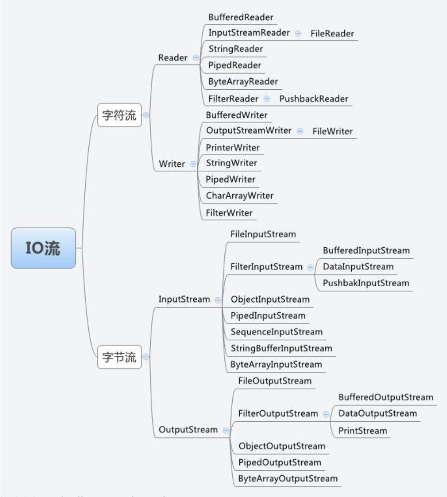

# Optional and I/O

## Optional

???+ note "空指针异常(null pointer exception, NPE)"

    以下代码可能存在的问题是什么？

    ```java
    String version = computer.getSoundcard().getUSB().getVersion();
    ```

    这段代码看起来相当合理。然而，许多计算机（例如树莓派）实际上并没有配备声卡。那么，`getSoundcard()` 的结果会是什么呢？

    一种常见（但不好）的做法是返回空引用(null reference)来表示没有声卡。不幸的是，这意味着调用 `getUSB()` 将试图从一个空引用中获取 USB 端口信息，这会在运行时导致 `NullPointerException`，并阻止程序继续运行。

`#!java Optional<T>` 在 Java 8 中作为 `java.util` 包的一部分被引入。它的目的是帮助开发者以更安全、更表达性的方式处理可空值。该类的作用是提供一个类型级别的解决方案，用于表示**可选值**，而不是空引用。

???+ bug "使用 `#!java null`"

    ```java
    public String findUserNameById(int id) {
        if (id == 1) {
            return "Alice";
        } else {
            return null; // user not found
        }
    }

    // Caller code
    String name = findUserNameById(2);
    if (name != null) {
        System.out.println("User: " + name.toUpperCase());
    } else {
        System.out.println("User not found");
    }
    ```

    使用 `#!java null` 的问题：

    - 必须记得在所有地方检查空值
    - 但很容易忘记 -> 于是出现了 `NullPointerException`
    - API 契约不明确（方法可能返回 `#!java null`，但从函数签名中看不出来）

所以要避免使用 `NullPointerException`。

- 使用 `#!java Optional` 可以明确表示值可能缺失的情况
- 与返回 `#!java null`（可能会被遗忘，导致后续出现 NPE）不同，应返回一个 `#!java Optional<T>`
- 这迫使调用者必须处理“空”的情况

    ```java
    Optional<String> findNameById(int id) {
        return id == 1 ? Optional.of("Alice") : Optional.empty();
    }
    ```

???+ example "例子"

    ```java
    import java.util.Optional;
    public Optional<String> findUserNameById(int id) {
        if (id == 1) {
            return Optional.of("Alice");
        } else {
            return Optional.empty(); // explicit "no value"
        }
    }

    // Caller code
    String name = findUserNameById(2).map(String::toUpperCase)    // only runs if present
                                    .orElse("User not found");   // default value
    System.out.println(name);
    ```

好处：

- API 能明确表示值的缺失（`#!java Optional<String>`）
- 使用 `map`、`ifPresent`、`orElse` 等时，没有 `NullPointerException` 出现的风险
- 代码更短、更简洁、更具表现力
    - 提升可读性和意图：返回 `#!java Optional<T>` 可明确表明“结果可能存在，也可能不存在”

        ```java
        String getUserName();            // Might return null (ambiguous)
        Optional<String> getUserName();  // Explicit: value might be absent
        ```

    - 鼓励函数式编程的风格：`#!java Optional` 提供了诸如 `.map()`、`.filter()`、`.ifPresent()`、`.orElse()` 的方法，避免使用冗长的 `#!java if (x != null)` 检查

        ```java
        String name = findNameById(2).map(String::toUpperCase).orElse("Unknown");
        ```

    - 避免误使用 `#!java null`
        - `#!java null` 没有明确的含义，它可能表示“未设置(not set)”、“未找到(not found)”、“发生错误(error occurred)”等
        - `#!java Optional.empty()` 明确表达了值的缺失

    - 更清楚的 APIs：与其编写诸如“此方法可能返回空值”之类的注释文档，不如直接通过类型系统中的 `#!java Optional` 来强制实施这一点

???+ failure "不要做这些事！"

    - 在实体或数据传输对象（DTO）中不要使用 `#!java Optional` 作为字段类型（因为这会造成不必要的包装开销）
        - 主要将其用作方法的返回类型
    - 避免用在参数上使用 `#!java Optional`（因为这会使调用代码变得混乱）

`#!java Optional` 是一个泛型类，可以指明 `#!java Optional` 的数据类型。

---
下面介绍一些 `#!java Optional` 相关的方法：

- 创建 `#!java Optional` 对象：
    - `empty()`

        ```java
        public void whenCreatesEmptyOptional_thenCorrect() {
            Optional<String> empty = Optional.empty();
            assertFalse(empty.isPresent());
        }
        ```

        `isPresent()` 用于检查 `#!java Optional` 内部是否存在值，只有在我们使用非空值创建 `#!java Optional` 时，`#!java Optional` 中才存在值

    - `of()`

        ```java
        public void givenNonNull_whenCreatesNonNullable_thenCorrect() {
            String name = "baeldung";
            Optional<String> opt = Optional.of(name);
            assertTrue(opt.isPresent());
        }
        ```

        然而，传递给 `of()` 方法的参数不能为空，否则将得到一个 `NullPointerException`

    - `ofNullable()`：但如果期望有一些 `#!java null`，可以使用 `#!java ofNullable()` 方法

        ```java
        @Test
        public void givenNonNull_whenCreatesNullable_thenCorrect() {
            String name = "baeldung";       // String name = null;
            Optional<String> opt = Optional.ofNullable(name);
            assertTrue(opt.isPresent());
        }
        ```

        这样做的话，如果我们传入一个空引用，它不会抛出异常，而是返回一个空的 `#!java Optional` 对象

- 检查是否存在
    - `isPresent()`：当我们从方法中获取到一个 `#!java Optional` 对象或自己创建了一个时，可以使用 `isPresent()` 方法来检查其中是否包含值

        ```java
        public void givenOptional_whenIsPresentWorks_thenCorrect() {
            Optional<String> opt = Optional.of("Baeldung");
            assertTrue(opt.isPresent());

            opt = Optional.ofNullable(null);
            assertFalse(opt.isPresent());
        }
        ```

        若包装值不为空，则此方法返回 `#!java true`

    - `isEmpty()`

        ```java
        public void givenOptional_whenIsPresentWorks_thenCorrect() {
            Optional<String> opt = Optional.of("Baeldung");
            assertFalse(opt.isEmpty());

            opt = Optional.ofNullable(null);
            assertTrue(opt.isEmpty());
        }
        ```

- 条件行动(conditional action)
    - `ifPresent()` 方法使我们能够在找到非空值时，在包装值上运行一些代码
    - 在典型函数式编程风格中，我们可以对确实存在的对象执行操作：

        ```java
        public void givenOptional_whenIfPresentWorks_thenCorrect() {
            Optional<String> opt = Optional.of("baeldung");
            opt.ifPresent(name -> System.out.println(name.length()));
        }
        ```

- 默认值
    - `orElse()`：用于检索 `#!java Optional` 实例内部的包装值
        - 它接受一个参数，该参数作为默认值
        - 若存在则返回包装值，否则返回参数

        ```java
        @Test
        public void whenOrElseWorks_thenCorrect() {
            String nullName = null;
            String name = Optional.ofNullable(nullName).orElse("john");
            assertEquals("john", name);
        }
        ```

    - `orElseGet()`：与 `orElse()` 方法类似，但它并非在 `#!java Optional` 值不存在时接受一个值返回，而是接受一个供应商函数接口(supplier functional interface)，该接口被调用并返回调用值：

        ```java
        public void whenOrElseGetWorks_thenCorrect() {
            String nullName = null;
            String name = Optional.ofNullable(nullName).orElseGet(() -> "john");
            assertEquals("john", name);
            }
        ```

    - 两者的区别：

        ```java
        public String getMyDefault() {
            System.out.println("Getting Default Value");
            return "Default Value";
        }
        public void whenOrElseGetAndOrElseOverlap_thenCorrect() {
            String text = null;
            String defaultText = Optional.ofNullable(text).orElseGet(this::getMyDefault);
            assertEquals("Default Value", defaultText);
            defaultText = Optional.ofNullable(text).orElse(getMyDefault());
            assertEquals("Default Value", defaultText);
        }
        ```

    - 请注意，当使用 `orElseGet()` 来检索包装值时，由于包含的值存在，`getMyDefault()` 方法甚至可能没有被调用
    - 然而，当使用 `orElse()` 时，无论包装的值是否存在，都会创建默认对象，因此在这种情况下只是创建了一个永远不会使用的冗余对象

- 异常——`orElseThrow()`：为处理缺失值添加了一种新的方法；当包装的值不存在时，它不返回默认值，而是抛出一个异常

    ```java
    public void whenOrElseThrowWorks_thenCorrect() {
        String nullName = null;
        String name = Optional.ofNullable(nullName).orElseThrow(
            IllegalArgumentException::new);
    }
    ```

    -  Java 10 引入了 `orElseThrow()` 方法的简化无参版本：在 `#!java Optional` 为空的情况下，它抛出 `NoSuchElementException` 异常：

        ```java
        whenNoArgOrElseThrowWorks_thenCorrect() {
            String nullName = null;
            String name = Optional.ofNullable(nullName).orElseThrow();
        }
        ```

- 返回值——`get()`：检索包装值的最终方法

    ```java
    public void givenOptional_whenGetsValue_thenCorrect() {
        Optional<String> opt = Optional.of("baeldung");
        String name = opt.get();
        assertEquals("baeldung", name);
    }
    ```

    然而，与前面的三种方法不同，`get()` 只能在包装的对象不为 `#!java null` 时返回一个值；否则，它将抛出一个 `NoSuchElementException` 的异常：

    ```java
    @Test(expected = NoSuchElementException.class)
    public void givenOptionalWithNull_whenGetThrowsException_thenCorrect() {
        Optional<String> opt = Optional.ofNullable(null);
        String name = opt.get();
    }
    ```

    - 这是 `get()` 方法的主要缺陷；理想情况下，`#!java Optional` 应该帮助我们避免这种未预见的异常，因此这种方法与 `#!java Optional` 的目标相悖，可能会在未来的版本中被弃用

- 条件返回——`filter()`：
    - 对包装值进行内联测试(inline test)
    - 它接受一个谓词(predicate)作为参数，并返回一个 `#!java Optional` 对象
    - 如果包装值通过谓词的测试，那么 `#!java Optional` 对象将原样返回

    ```java
    public void whenOptionalFilterWorks_thenCorrect() {
        Integer year = 2016;
        Optional<Integer> yearOptional = Optional.of(year);
        boolean is2016 = yearOptional.filter(y -> y == 2016).isPresent();
        assertTrue(is2016);
        boolean is2017 = yearOptional.filter(y -> y == 2017).isPresent();
        assertFalse(is2017);
    }
    ```

    - `filter` 方法可根据预定义的规则拒绝包装值，比如拒绝错误格式的电子邮件，或不够强的密码等

- 转换值——`map()`：转换 `#!java Optional` 的值

    ```java
    public void givenOptional_whenMapWorks_thenCorrect() {
        List<String> companyNames = Arrays.asList(
            "paypal", "oracle", "", "microsoft", "", "apple"
        );
        Optional<List<String>> listOptional = Optional.of(companyNames);
        int size = listOptional.map(List::size)
                               .orElse(0);
        assertEquals(6, size);
    }
    ```

    - 在这个例子中，`#!java Optional` 对象内部包装一个字符串列表，并使用它的 `map` 方法对包含的列表执行操作（检索列表的大小）
    - `map` 方法返回计算结果的 `#!java Optional` 的包装，然后必须在返回的 `#!java Optional` 上调用一个适当的方法来检索其值

>注：实际上还有更多的 `#!java Optional` 方法，限于篇幅这里就不再介绍了。


## I/O

- 创建一个良好的输入/输出（I/O）系统是语言设计者面临的困难任务之一
- Java I/O 的基本概念是**流**(stream)，它是单向和单维的

Java 有三套 I/P API：

- `InputStream` / `OutputStream`：处理以字节为单元的**二进制数据**
- Reader / Writer：处理以字符为单位的**文本**
- nio: Channel + Buffer：实现非阻塞异步访问，关注 **socket**
- nio 2.0: Path + Files + AsynchronousFileChannel：关注**文件系统**和文件读写

这3套不是替代的关系，而是：

- 逐层依赖（利用）
- 各有用处（场景）

<div style="text-align: center">
    
</div>


### InputStream and OutputStream

- 以**字节**为单位处理数据
- 分为两大类：
    - **media**：代表各种实际介质，处理底层操作，是其他流类的底层基础：在其上构建其他流类 `FileInputStream`，`ByteArrayInputStream`，`PipedInputStream`
    - **filter**：代表对各种数据的读写，可连接/堆叠
        - 与用户程序的接口：其他流类上产生 Stream，在 Stream 上做实际数据读写 `DataInputStream`，`ZipInputStream`，`ObjectInputStream`

`InputStream` 基本操作：

```java
int read();
read(byte b[]);
read(byte[],int off,int len);
skip(long n);
int available();
void mark();
void reset();
boolean markSupported();
close();
```

程序可以从 OS 得到本地文字编码，用字节数组构造 `String` 对象的时候可以指定不同的文字编码。

`OutputStream` 基本操作：

```java
write();
write(int b);
write(byte b[]);
write(byte b[],int off,int len);
flush();
close();
```

???+ example "例子"

    把文件前 16 字节读进字节数组，然后一定要关掉流。

    ```java
    FileInputStream fis = null;
    try {
        fis = new FileInputStream("data.bin");
        byte[] buf = new byte[16];
        fis.read(buf);
        System.out.println(Arrays.toString(buf));
    } catch (IOException e) {
        e.printStackTrace();
    } finally {
        if (fis != null) {
            try {
                fis.close();
            } catch (IOException e) {
                e.printStackTrace();
            }
        }
    }
    ```

try-with-resource

```java
try (FileInputStream fis = new FileInputStream("data.bin")) {
    byte[] buf = new byte[16];
    fis.read(buf);
    System.out.println(Arrays.toString(buf));
} catch (IOException e) {
    e.printStackTrace();
}
```

- 把任何实现 `java.lang.AutoCloseable` 的资源写在 `#!java try()` 括号里，无论正常结束还是异常跳出，编译器都会在 `#!java finally` 里按**打开顺序的逆序**自动调用 `close()`
- 代码更短、异常不丢失、不会忘关流
- 可以带有多个资源

用于基本类型的流：

- 在普通字节流外套一层，按 IEEE/网络字节序（**大端序**）直接读写**基本类型**和 **UTF**，保证“写啥读啥”跨平台
- 适合二进制协议、文件头、网络包等场景
- 这两个类提供了重载的函数来读写数据
    - `DataInputStream`
    - `DataOutputStream`


### Reader and Writer

- 如果文件本身是 **Unicode-16** 的，可以直接用 `FileReader` 和 `FileWriter` 来打开文件读写
- 否则应该用 `InputStreamReader` 和 `OutputStreamWriter` 将字节流转成 Reader / Writer 来读写
    - 在这两个桥类中实现了本地文字编码和 Unicode-16 之间的互相转换
    - 可以在其构造函数中指定所用的文字编码
    - Linux 和 macOS 用 **UTF-8**, Windows 用 **GBK**
    - VSCode 的编辑器用 UTF-8，终端则跟着 OS
    - 在中国订单开发软件，对外接口必须使用 GBK

桥类：

```java
PrintWriter pw = new PrintWriter(
    new BufferedWriter(
        new OutputStreamWriter(
            new FileOutputStream(“abc.txt”),"GBK")));
```

格式化输出：对于 `PrintWriter`
    
- `#!java public PrintWriter format(String format, Object... args)`
- `#!java public PrintWriter printf(String format, Object... args)`

格式化输入：

- 对于一个简单的文本扫描器(text scanner)，可以使用**正则表达式**解析基本类型和字符串
- 扫描器通过分隔符模式(delimiter pattern)将输入拆分为 token，默认情况下匹配空白字符
- 然后可以使用各种 `next` 方法将结果标记转换为不同类型的值

```java
Scanner sc = new Scanner(System.in);
int i = sc.nextInt();
Scanner sc = new Scanner(new File("myNumbers"));
while (sc.hasNextLong()) {
    long aLong = sc.nextLong();
}
```

`File` 类表示特定名称的文件或特定名称的目录内的一组文件。

压缩：`ZipInputStream` / `ZipOutputStream` 是 Java 自带的 ZIP 压缩/解压包装流

- 读写顺序必须一个条目一个条目地线性进行，适合小文件或单线程场景
- 不支持随机读写，不能修改已存在的 ZIP

关于 JAR：

```
jar [options] destination [manifest] inputfile(s)
jar cf myJarFile.jar *.class
jar tf myJarFile.jar
javac -cp lib1.jar;lib2.jar ...
java xxx.jar
```

将 javaw 注册为 .jar 文件的打开软件，就可以实现双击 Java 程序运行的效果。


### Object Serialization

!!! warning "区别概念"

    - serial: 序列号(serial number)、串行（与并行相对）
    - 对象**串行化**：把（立体）的对象变成串行（一维）的字节流
    - 对象**序列化**：把对象变成字节序列

程序是一次性运行的：

```java
List<Cat> lst = new List<>();
lst.add(new Cat());
lst.add(new Cat());
lst.add(new Cat());
```

- 经过一段时间的运行，三只小猫有了各自的成员变量的数值
- 但是程序结束后，这些小猫就消失了
- 如何将他们保存下来，下次再启动程序时，能继续上次运行结束时的状态

保存程序运行状态：

- 用数据文件/数据库记录每个成员变量的值，下次启动时读入并一一赋值
    - 缺点：代码复杂且容易错漏
- **对象串行化**：从语言和实现层面将整个对象的内容打包成串行的字节序列
    - 优点：代码简洁不会漏掉成员

对象串行化：

- 串行化：内存对象 -> 字节序列
- 反串行化：字节序列 -> 内存对象
- 用途：缓存、网络传输、深拷贝、对象放数据库、构件化实现
- 关键词：Java 原生机制 = `#!java Serializable`（标记接口）
- 可将任何实现 `#!java Serializable` 接口的对象转换为一系列字节，这些字节可以在后续完全恢复，以重新生成原始对象
- 要串行化一个对象，需要创建一个 `OutputStream` 对象，然后将其包装在 `ObjectOutputStream` 对象中；此时只需调用 `writeObject()`，对象就会被串行化并发送到 `OutputStream`
- 要逆转该过程，需要将 `InputStream` 包装在 `ObjectInputStream` 中，并调用 `readObject()`
    - 返回的仍然是一个向上转型的 `Object` 引用，因此必须进行**向下转型**(downcast)以纠正类型

???+ example "例子"

    ```java
    public class Cat implements Serializable {
        private static final long serialVersionUID = 1L;
        private String name;
        private int age;
        // getter / setter 构造已备好
    }
    ```

    - `Serializable` 是空接口，没有函数
    - `serialVersionUID` 用以识别不同版本

写入文件：

```java
List<Cat> cats = List.of(new Cat("Luna", 2), new Cat("Milo", 3));
try (ObjectOutputStream oos = new ObjectOutputStream(
                              new FileOutputStream("cats.ser"))) {
    oos.writeObject(cats);
}
```

- 不仅不需要逐一写成员，甚至直接写整个容器

读回数据：

```java
try (ObjectInputStream ois = new ObjectInputStream(
                             new FileInputStream("cats.ser"))) {
    List<Cat> resurrected = (List<Cat>) ois.readObject();
    resurrected.forEach(System.out::println);
}
```

更多字段：

```java
class ABC implements Serializable {
    private int i=0xcafebabe;
}
public class Test {
    public static void main(String[] args) {
        A a = new A();
        try (ObjectOutputStream out = new ObjectOutputStream(
                                      new BufferedOutputStream(
                                      new FileOutputStream("data.bin")))) {
            out.writeObject(a);
            out.close();
        } catch (SecurityException | IOException e) {
            e.printStackTrace();
        }
    }
}
```

- 写入对象时，此对象引用的所有对象都将写入流中
- 读取回的对象是一个新对象
- 读取回的对象不是由任何构造函数创建的

要是没有类的话？

- 将一个对象串行化并通过互联网发送到远程端，这个对象可以在另一端反串行化吗？
- 类会一起被串行化吗？

`serialVersionUID` 字段：

- 写入文件后，修改源文件中的 `serialVersionUID`，然后尝试读取它
- 将引发 `InvalidClassException`

`transient` 字段

- `transient` 字段意味着这些字段的值是瞬时的(transient)，不应被串行化
- 用途：密码等

自定义 `readObject` 和 `writeObject`：

```java
private void writeObject(ObjectOutputStream out) throws IOException {
    out.defaultWriteObject();                // 先写普通字段
    out.writeObject(encrypt(password));      // 手动写加密后密码
}
```

- 它们并非 `Serializable` 的函数，但是
- 只要签名对，JVM 会反射调用私有的这两个方法，实现“热补丁”逻辑

`Externalizable` 接口

- `Serializable` 的替代
- 需要自己写 `writeExternal` / `readExternal`，完全手动，性能更高，版本可控
- `Serializable` = “自动挡”， `Externalizable` = “手动挡”

防火墙

- `ObjectInputFilter` 是 Java 9 引入的“反串行化防火墙”⸺在对象还被原之前就截字节流，按你设定的规则（类名、对象图深度、数组长度、引用数等）直接 `ALLOW` / `REJECT` / `UNDECIDED` ，把危险的 gadget 链挡在门外
- 实战场景：
    - 网络协议：RMI、JMX、Socket 直接接收字节流前设置白名单，阻断 `gadget` 链
    - 文件缓存：只允许指定业务 DTO 被还原

```java
ObjectInputFilter f = ObjectInputFilter.allowFilter(
    clazz -> clazz.getName().startsWith("com.example.trusted"),
    ObjectInputFilter.Status.REJECTED);
```