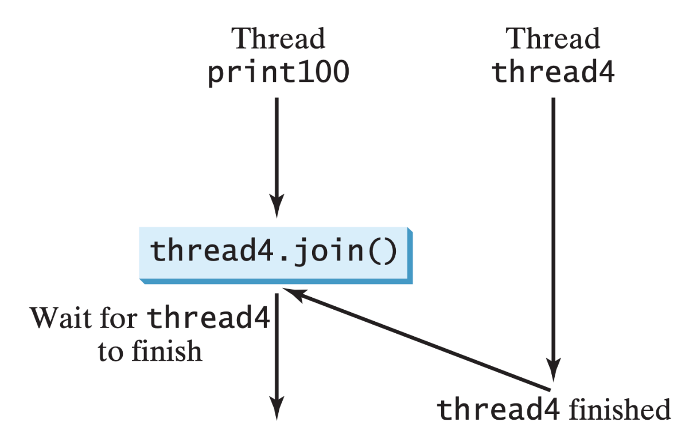

# Threads

## Thread Creation

在 Java 中，创建一个线程的方式如下：

1. 创建一个实现接口 `Runnable` 的类，并重写 `run()` 方法，其中包含线程的代码
2. 创建新类的对象
3. 使用 `Runnable` 对象作为构造函数的参数，创建 `Thread` 类的对象
4. 调用 `Thread` 对象的 `start()` 方法以启动线程

四种创建线程的方法：

| 方法 | 优点 | 缺点 |
| :--- | :--- | :--- |
| `#!java extends Thread` | 简单 | 单继承浪费 |
| `#!java implements Runnable` | 解耦 | 无返回值 |
| `#!java implements Callable<V>` | 可抛异常+返回值 | 需线程池支持 |
| 虚拟线程 | 轻量级, JVM管理, 内存占用小 | |

多线程和多核：

- JVM 用 OS 线程来实现 Java 线程
- OS 在各个核上分配线程
- 因此 Java 的线程也有可能在不同的核上同时执行
- 但是在 Java 一侧无法干预

关于 `Callable`：

- `Callable<T>` 是泛型函数式接口，`call()` 需要返回 `T` 类型的值
- 它只能用在线程池中，提交给线程池后得到一个 `Future<T>`

    ???+ example "例子"

        ```java
        Callable<Integer> callable = () -> {
            int sum = 0;
            for (int j = 1; j <= 100; j++) {
                sum += j;
            }
            System.out.println(Thread.currentThread().getName()
                + " 完成任务" + taskId + "，计算结果=" + sum);
            return sum;
        };
        ```

- 由 `Future<T>.get()` 阻塞返回计算结果


### Virtual Threads

虚拟线程：

```java
for (int i = 0; i < 1_000_000; i++) {
    Thread.startVirtualThread(()->{
        System.out.println("Virtual Hello "+i);
    });
}
```

创建虚拟线程的几种方式：

```java
// 方式1：直接创建并启动
Thread. startVirtualThread(()-> {
    System.out.println("快速启动！");
});

// 方式2：创建但不启动
Thread vt = Thread.ofVirtual().unstarted(O -> {
    System.out.println("稍后启动");
});
vt.start();

// 方式3：使用构建器
Thread vt2 = Thread.ofVirtual()
    .name("my-virtual-thread")
    .start(() -> {
        System.out.println("有名字的虚拟线程");
    });
```

虚拟线程适用场景：

- 适合：I/O 密集型任务，包括网络请求处理、数据库操作、文件读写等
- 不适合：计算密集型任务、需要精确控制的场合以及使用 ThreadLocal 的场合

---
使用 Lambda 表达式创建线程：Lambda 使用 invokedynamic 延迟生成 `Runnable` 实例，节省类尺寸。

启动 100 个线程：

```java
IntStream.range(0, 100)
    .mapToObj(i -> (Runnable) () ->
        System.out.println(Thread.currentThread().getName()))
    .forEach(r -> new Thread(r).start());
```

运行后 `jconsole` 观察：线程数瞬间 > 100，系统负载升高

生命周期（6 个阶段）：

<div style="text-align: center">
    
</div>

{ align=right width=30% }

`Runnable` 的方法：

```java
join()
Thread.sleep()
Thread.yield()
```

如何停止线程运行：

- 线程不能从外部直接结束（`kill`），必须等待线程自己结束，否则内存以外的资源无法释放
- 如果线程在跑无限循环，需要用共享变量通知线程结束，因为对该共享变量的访问需要做保护

线程的运行时信息：

```java
Thread.currentThread()
getName()
getThreadGroup()
getPriority()
isAlive()
isDaemon()
```


## Daemon Threads

**守护线程**(daemon thread)：

- 不会阻止 JVM 退出
- JVM 只关心**用户线程**（非守护线程）是否全部结束；当最后一个用户线程退出时，JVM 就立即终止，不管守护线程是否还在运行

| 场景 | 是否可设为守护 |
| :--- | :--- |
| 业务计算、订单落库 | 禁止——可能丢数据 |
| 日志异步刷盘、监控心跳、定时清理临时文件 | 推荐——不阻碍下机 |
| 在 `#!java finally` 里释放锁 | 危险——可能没机会执行 |

`jstack` 定位 BLOCKED vs WAITING：

```bash
$ java DeadlockDemo
$ jps
12345 DeadlockDemo
$ jstack -l 12345 | grep -A 20 "Found one Java-level deadlock"
```


## Thread Pools

**线程池**(thread pool)解决“无限制创建”痛点：

- 降低资源消耗：复用线程
- 提高响应速度：任务直达
- 统一管理：可监控、可配置

`ThreadPoolExecutor` 的参数：

```java
public ThreadPoolExecutor(
    int corePoolSize,
    int maximumPoolSize,
    long keepAliveTime,
    TimeUnit unit,
    BlockingQueue<Runnable> workQueue,
    ThreadFactory threadFactory,
    RejectedExecutionHandler handler
)
```

- `corePoolSize`（核心线程数）
    - 线程池"常驻"线程数量，即使它们处于空闲也不会被回收（除非 `#!java allowCoreThreadTimeOut = true`）
    - 提交任务时，若 `workerCount < corePoolSize` ，直接新建线程，不入队
    - 一旦达到核心，后续任务先入队，不再新建线程
    - I/O 密集型计算推荐核心线程数 = 核心数 * 2 + 1
    - 踩坑：
        - 设置过大 -> 启动即创建大量空转线程，浪费 CPU
        - 设置过小 -> 高并发时任务全进队列，吞吐上不去

- `maximumPoolSize`（最大线程数）
    - 含义：线程池允许创建的最大线程数
    - 生效条件：队列已满且 `workerCount < maximumPoolSize` 时，才会继续新建非核心线程
    - 踩坑：
        - 与无界队列（如 `#!java new LinkedBlockingQueue<>()`）配合时，此参数永远失效⸺队列永远不会满，线程数不会超过核心数
        - 线上 OOM（Out Of Memory）常见原因：`Executors.newFixedThreadPool()` 内部把核心数与最大值设成一样，且用无界队列，任务暴涨时内存被队列吃光

- `keepAliveTime`（线程存活时间）
    - 当线程数 > `corePoolSize` 时，多余空闲线程的最大存活时间
    - 单位由下一个参数指定，0 表示立即终止
    - 特例：若 `#!java allowCoreThreadTimeOut = true`，则核心线程也会被回收

- `unit`（时间单位）
    - 类型：`java.util.concurrent.TimeUnit`
    - 常用：`SECONDS`、`MILLISECONDS`
    - 仅与 `keepAliveTime` 配套使用，无其他逻辑

- `workQueue`（阻塞队列）
    - 存放尚未被执行的任务
    - 选型直接决定吞吐与内存：

        | 队列实现 | 特性 | 场景 | 风险 |
        | :--- | :--- | :--- | :--- |
        | `ArrayBlockingQueue` | 有界, FIFO | 精准控制内存 | 队列满才开新线程，需调大 max |
        | `LinkedBlockingQueue` | 可配置边界, 默认无界 | 任务平稳 | 任务暴涨 → OOM |
        | `SynchronousQueue` | 容量为 0, 必须直接交接 | 高并发短任务 | 线程数会飙到 max，需调大 max |
        | `PriorityBlockingQueue` | 优先级排序 | 调度系统 | 同优先级任务可能饥饿 |

- `threadFactory`（线程工厂）
    - 指定如何创建 `Thread` 对象
    - 默认：`Executors.defaultThreadFactory()`
        - 线程名格式 `pool-N-thread-M`
        - 非守护线程的优先级为 `Thread.NORM_PRIORITY`
    - 推荐自定义：
        - 给线程起业务名，方便 `jstack` 定位；
        - 设置未捕获异常处理器（`UncaughtExceptionHandler`），防止异常被吞
        - 按需把线程设为守护线程（慎用，可能随 JVM 提前退出）

- `handler`（拒绝策略）
    - 触发时机：
        1. 线程数已达到 `maximumPoolSize`
        2. 且 `workQueue` 已满
        3. 继续提交新任务
    - JDK 内置 4 种：

        | 实现类 | 行为 | 适用场景 |
        | :--- | :--- | :--- |
        | `AbortPolicy` (默认) | 抛 `RejectedExecutionException` | 快速失败，调用方捕获异常 |
        | `CallerRunsPolicy` | 由提交线程自己执行任务 | 做平滑限流，但可能拖慢主流程 |
        | `DiscardPolicy` | 直接丢弃任务，不抛异常 | 可接受丢消息 (如日志上报) |
        | `DiscardOldestPolicy` | 丢弃队列最靠前的任务，再重试提交 | 实时行情，旧数据价值低 |

    - 自定义：实现 `RejectedExecutionHandler` 接口，可报警/写磁盘/持久化到 MQ

???+ abstract "总结"

    ```
      core     <=     workerCount      <=     max
        ↑                 ↑                    ↑
    常驻线程            当前线程               上限线程
        |                 |                    |
        |                 |                    |
        [1]--------------[2]------------------[3]
                          |
                          v
                  keepAliveTime + unit   →   回收非核心线程
                          ↓
                      workQueue          ←   任务堆积策略
                          ↓
                    threadFactory        ←   线程名、异常、守护
                          ↓
                       handler           ← 队列满 + 线程满时的拒绝逻辑
    ```

线程池的申请与释放：

- 线程池对外只有“提交任务（`submit()`）” 这一入口；线程的“申请-归还”完全由内部 `addWorker()` / `processWorkerExit()` 自动完成，没有 `borrowThread()` / `returnThread()` 这类接口，这正是“池”能简化并发编程的核心原因：
    - `execute(Runnable)`：提交任务，无返回，无法得知任务执行进展
    - `submit(Runnable / Callable)`：提交任务，返回 `Future`
    - `invokeAll / invokeAny(...)`：批量提交
- 任务结束自动归还，不建议去拿池里真正干活的 `Thread` 对象

线程池常见问题：

- 把核心数设为 0 会怎样？
    - 所有线程都会成为“非核心”，任务一来先入队；若队列容量为 0（`SynchronousQueue`），则立即新建线程到最大值
- 如何让核心线程也能超时回收？
    - `#!java executor.allowCoreThreadTimeOut(true);` 即可
- 为什么 `Executors.newFixedThreadPool(200)` 可能导致 OOM？
    - 内部 `#!java new LinkedBlockingQueue<Runnable>()` 默认无界，任务积压时堆内存被队列对象占满，线程数却永远不会超过 200

???+ example "示例：`FixedThreadPool` OOM"

    ```java
    ExecutorService pool = Executors.newFixedThreadPool(5);
    while (true) {
        pool.submit(() -> {
            Thread.sleep(60_000); // 模拟慢任务
        });
    }
    ```

    1 min 内 1 GB -> 抛出 `OutOfMemoryError: unable to create native thread`

自定义 `ThreadFactory` 模板：

```java
public class NamedThreadFactory implements ThreadFactory {
    private final AtomicInteger seq = new AtomicInteger(0);
    public Thread newThread(Runnable r) {
        Thread t = new Thread(r);
        t.setName("biz-pool-" + seq.incrementAndGet());
        t.setUncaughtExceptionHandler((th, ex) ->
            log.error("线程{}异常", th.getName(), ex));
        return t;
    }
}
```