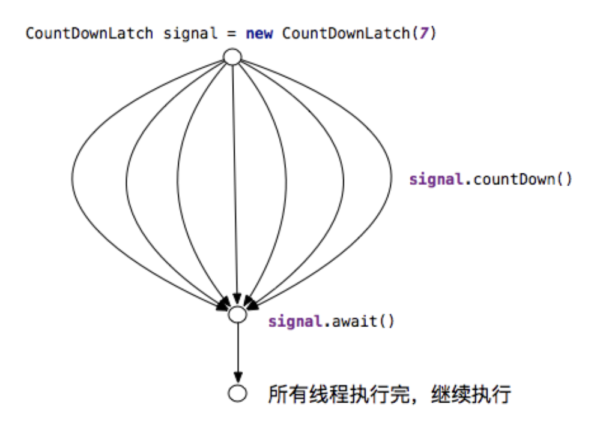
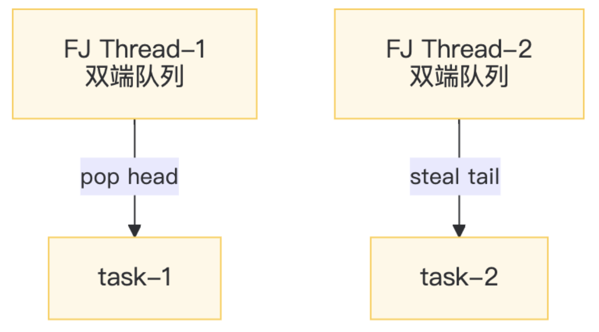

# Thread Coordination and Parallel Streams

## Problems of Thread Coordination

在多线程环境下，如果没有额外的同步辅助工具，主线程往往不知道子线程何时完成，只能通过循环检查标志位来等待。这样的“**忙等**”会导致 CPU 长时间空转（占用 100% CPU），不仅浪费资源，还可能因为判断不及时而错过正确的时机，或者由于等待条件不准确而过早执行后续操作。总体而言，没有辅助器时并发代码往往难编写、易出错，CPU 空转严重，实时性也很差。


```
┌──────────────┐     ┌──────────────┐
│  主线程：点火  │     │  主线程：发炮  │
└──────┬───────┘     └──────┬───────┘
       │ while(!ok)         │ while(!ready)
       ▼                    ▼
  CPU 100% 空转       错过时机 / 早发炮
```

为了解决这些线程协作难题，Java 提供了多种**同步辅助器**(synchronizer)，如 `CountDownLatch`、`CyclicBarrier`、`Phaser` 等。它们分别针对不同的并发场景：

- 当主线程需要**等待多个子任务**完成时，可使用 `CountDownLatch`
- 当一组线程需要**反复在多个阶段互相等待**时，可使用 `CyclicBarrier`
- 当线程的数量和阶段需要**动态变化**时，则可使用更灵活的 `Phaser`
- 如果需要**汇总**并行任务的结果，还可以借助 ForkJoin / Future 来收集各线程的返回值

| 工具 | 计数 | 重用 | 动态注册 | 场景 |
| :--- | :--- | :--- | :--- | :--- |
| `CountDownLatch` | 一次性 | ❌ | ❌ | 火箭发射 |
| `CyclicBarrier` | 循环 | ✅ | ❌ | 多批合并 |
| `Phaser` | 循环 | ✅ | ✅ | 分阶段任务 |

通过这些工具，可以将原本时序不可预测的并发执行转变为可预测、可等待、可汇合的同步流程。


## CountDownLatch

**`CountDownLatch`** 是一个一次性的倒计时锁存器，用来让一个线程（通常是主线程）等待若干其他线程完成工作。

- 内部维护一个计数器，初始值为需要等待的线程数量
- 每当一个子线程完成任务后，就调用 `countDown()` 将计数器减一
- 而主线程在调用 `await()` 后将一直阻塞，直到计数器减到 0
- 这样就避免了主线程反复检查状态，能够“一步到位”地等待所有子线程完成
- `CountDownLatch` **不能重用**（计数归零后即失效），适用于一对多的线程协调（多个子线程 -> 一个主线程汇合）

<div style="text-align: center">
    
</div>

典型使用场景是主线程需要等待多个并行任务的结果。例如火箭发射前的检查，需要并行执行燃料、电路、通信等多个检查项，主线程在所有检查完成后才能点火。

- 如果不使用 `CountDownLatch`，主线程可能不得不使用类似 `#!java while(!checkDone)` 的循环反复查询每个检查项状态（不仅代码复杂，还需考虑可见性和加锁问题）。
- 而使用 `CountDownLatch`，可以让每个检查线程完成时调用一次 `countDown()`，主线程简单地在 `await()` 等待即可，大大简化了代码，消除了繁忙等待，也避免了过早点火的风险。

下面是 `CountDownLatch` 的基本用法示例：

```java
CountDownLatch latch = new CountDownLatch(10);
for (int i = 0; i < 10; i++) {
    new Thread(() -> {
        doWork();
        latch.countDown(); // -1
    }).start();
}
latch.await();   // 主线程等待
launch();        // 点火
```

下面给出一个具体的示例代码，演示使用 `CountDownLatch` 等待 10 个并发任务（检查员）完成后再继续主线程操作：

```java
ExecutorService pool = Executors.newFixedThreadPool(10);
CountDownLatch latch = new CountDownLatch(10);
for (int i = 1; i <= 10; i++) {
    final int id = i;
    pool.submit(() -> {
        Thread.sleep(ThreadLocalRandom.current().nextInt(500, 1500));
        System.out.println(LocalTime.now() + " 检查员 " + id + " OK");
        latch.countDown();
    });
}
latch.await();
System.out.println(LocalTime.now() + " === 点火起飞 ===");
pool.shutdown();
```

运行结果：10 个检查员耗时不同，但主线程在等待计数器归零后统一进行“点火起飞”。


## CyclicBarrier

**CyclicBarrier** 提供了一种让一组线程互相等待的机制，只有当指定数量的线程都到达屏障（调用 `await()` ）时，所有线程才会继续执行。

- 它就像一道循环使用的栅栏，凑齐固定数量的线程就打开栅栏放行，然后可以重置并等待下一批线程
- 这是 `CyclicBarrier` 相对于 `CountDownLatch` 最大的区别：后者是一次性的，而前者可以反复重用

<div style="text-align: center">
    
</div>

可以用“大巴车等待乘客”的现实例子来类比：

- 大巴要坐满（例如 4 人）才发车，返回站点后又可以接下一批乘客继续发车
- 同理，在 `CyclicBarrier` 中，线程就像乘客，`barrier.await()` 相当于上车等待，栅栏打开的动作可以通过提供的回调（`barrierAction`）执行，例如发车前的合并计算或日志记录等
- 线程在每一批全部到齐后同时继续，接着进入下一次循环

一个典型应用场景是需要对一组线程进行分批次的同步，例如每日有多批数据需要处理，每批由若干文件并行解析，解析完后需要将结果合并。

- 当使用 `CyclicBarrier` 时，可以让同一组线程处理完一批数据后在栅栏处等待，直到该批所有线程都完成解析，然后执行栅栏的合并动作，接着栅栏自动重置，线程继续处理下一批数据。这样无需手动跟踪计数和重置，大大简化了流程控制。

`CyclicBarrier` 的基本用法如下：

```java
CyclicBarrier barrier = new CyclicBarrier(4,       // 4 人发车
    () -> System.out.println(">>> 栅栏动作 <<<"));  // 发车回调

// 线程上车
barrier.await(); // 阻塞直到 4 个线程都 await
```

- 构造时指定参与线程数（parties）和可选的栅栏动作，线程在适当时机调用 `await()` 等待其他线程
- 上面的代码创建了一个需要 4 个线程共同等待的栅栏，并指定了一个简单的回调动作。
- 在实际使用时，每个线程完成自身任务后调用一次 `barrier.await()`
- 当第 4 个线程也调用 `await` 时，栅栏打开，回调动作（如打印信息）执行，计数器自动重置为 4，以便下一轮使用

需要注意的是，如果某个线程在等待过程中被**中断**或**超时**，会导致栅栏被打破，所有等待的线程都会抛出**异常**（`BrokenBarrierException`），从而提前结束本轮同步。

???+ abstract "与 `CountDownLatch` / `Phaser` 的对比"

    | 特性 | `CountDownLatch` | `CyclicBarrier` | `Phaser` |
    | :--- | :--- | :--- | :--- |
    | 方向 | 线程->主 | 线程彼此 | 线程彼此 |
    | 重用 | 一次性 | 可循环 | 可循环 |
    | 动态加入 | ❌ | ❌ | ✅ |
    | 回调 | 无 | `barrierAction` | `phaseAction` |
    | 异常处理 | 无 | `broken` 状态 | 可 `onAdvance` |


## Phaser

**Phaser** 是更为灵活的同步屏障，支持动态增加或减少参与线程，并且可以划分为多个阶段连续执行。

- 可以把它看作是对 `CyclicBarrier` 的扩展：去除了“固定参与者数量”和“单一阶段”的限制，让线程可以在运行中随时加入或退出，而且可以设置多个阶段逐一同步

`Phaser` 的核心概念：

- `phase`：当前所处的阶段编号（从 0 开始，每通过一次屏障阶段号加一）
- `party`：当前注册的参与者数量（可动态 `register` 增加或 `arriveAndDeregister` 减少）
- 线程调用 `arrive()` 表示自己到达了当前阶段但不等待，调用 `arriveAndAwaitAdvance()` 则表示到达后等待其他线程，一起进入下一个阶段。

当所有注册的线程都到达后，`Phaser` 会将 `phase` 加一，解除所有线程的阻塞，让它们进入下一阶段。

`Phaser` 允许在运行过程中动态增加新的参与者（`register`）或注销已有参与者（`arriveAndDeregister`），因此非常适合需要在执行过程中调整线程数量的场景。

<div style="text-align: center">
    
</div>

<!-- `Phaser` 的典型应用场景包括多阶段的任务处理或游戏关卡控制等。例如在一个多关卡游戏中，玩家线程可以在任意关卡加入或离开，每一关都需要当前所有玩家到齐后才能进入下一关。 -->

一个使用 `Phaser` 的示例场景是 MapReduce 框架：

- 在 Map 阶段，如果根据数据量发现需要启动额外的 Mapper 线程，`Phaser` 可以动态注册新线程并确保它们也参与后续的同步
- 相比之下，`CountDownLatch` 或 `CyclicBarrier` 由于需要在开始时固定计数，无法方便地支持“中途加人”

下面示例代码演示了 `Phaser` 的用法：

```java
Phaser phaser = new Phaser(1); // 主线程先注册 1 个参与者
// 动态加入玩家线程
for (int i = 0; i < 3; i++) {
    final int player = i;
    phaser.register(); // 新增一个参与者
    new Thread(() -> {
        while (!phaser.isTerminated()) {
        System.out.println("玩家" + player + " 进入第" + phaser.getPhase() + "关");
        doWork();
        phaser.arriveAndAwaitAdvance(); // 抵达当前关卡并等待其他人
        }
    }).start();
}

// 主线程控制总共 3 个阶段
for (int phase = 0; phase < 3; phase++) {
    System.out.println("=== 第" + phase + "关 BOSS 被击杀 ===");
    phaser.arriveAndAwaitAdvance(); // 主线程抵达关卡（同步关卡结束）
}
phaser.arriveAndDeregister(); // 主线程退出，party 减至 0，`Phaser` 自动终止
```

- 主线程初始化 `Phaser` 并注册自己为参与者之一，然后陆续启动若干玩家线程参与三个阶段的闯关游戏
- 玩家线程可以在任意时刻加入，每关结束后都会同步，然后继续下一关；主线程在第三关结束后退出并终止 `Phaser`

下面是对应的状态机图：

```java
注册人数 > 0
  ├─ arrive()                -> 计数-1，不阻塞
  ├─ arriveAndAwaitAdvance() -> 计数-1 并睡眠，直到计数=0
  │                              ↓
  │                    触发 onAdvance(phase, registeredParties)
  │                          ↓
  │                      phase+1，重置 arrive 计数，唤醒全部
  │                          │
  └─ isTerminated() = false ← 循环
         ↑
    party=0（无人注册）
```

- 当 `registeredParties=0` 时自动终止，生命周期结束

另外，`Phaser` 提供了 `#!java onAdvance(int phase, int registeredParties)` 回调方法，允许在每个阶段完成时执行自定义操作，并决定是否终止。通过继承 `Phaser` 并重写该方法，可以实现在阶段切换时释放资源、记录日志或根据条件结束。

例如下面代码所示，重写的 `onAdvance` 会在每关结束时打印日志，并在第 2 关（`phase >= 2`）结束后返回 `#!java true` 以终止 `Phaser`：

```java
`Phaser` phaser = new `Phaser`() {
    @Override
    protected boolean onAdvance(int phase, int registeredParties) {
        System.out.printf("=== 第%d关结束，剩余玩家%d ===%n", phase, registeredParties);
        return phase >= 2; // true=终止
    }
};
```

- 每过一关自动回调，可用来释放资源、记录日志、决定是否继续


## ForkJoinPool

**ForkJoinPool** 是 Java 7 引入的一种用于并行计算的特殊线程池，实现了**分治算法**优化和**工作窃取**调度机制。

- 它特别适合将大型任务拆分成多个子任务并行执行，然后再将子结果合并
- `ForkJoinPool` 的核心思想是递归地 fork（拆分）任务和 join（合并）结果，每个工作线程都维护一个**双端队列**(deque)存放任务
- 线程在自己的队列头部（top）取出任务执行，当自己的任务做完后，会去偷取其他线程队列尾部（base）的任务来执行（这就是工作窃取）
- 由于线程大多在各自队列的头尾无锁地取任务，只有在窃取时使用少量同步（CAS），因此 `ForkJoinPool` 可以高效地利用多核 CPU 处理计算密集型任务

<div style="text-align: center">
    
</div>

Java 提供了一个全局的 `ForkJoinPool` 公共池： `ForkJoinPool.commonPool()` ，其并行度默认设为 CPU 核心数。

- `parallelStream` 和 `CompletableFuture` 默认会使用这个公共池执行并行任务
- 当然我们也可以根据需要创建自己的 `ForkJoinPool` 实例来调整线程并行度或隔离任务

`ForkJoinPool` 结构一览：

```java
ForkJoinPool
├─ ForkJoinWorkerThread[] workers   // 工作线程池
├─ WorkQueue[] workQueues           // 每个线程一个双端队列
│   ├─ top（队头） ← 自己 pop
│   └─ base（队尾）← 别人 steal
└─ ctl（64 位）                      // 活跃/总线程数、偷取指针等子控制
```

使用范式：

1. 继承 `RecursiveTask`（有返回值）或 `RecursiveAction`（无返回）
2. 重写 `compute()` -> “先拆后合”
3. 提交到 `ForkJoinPool`

下面是一个示例 `ForkJoinTask`，计算 0 到 N 的整数和。它继承 `RecursiveTask`，阈值 `THRESHOLD` 决定了不再拆分的最小区间长度，小于阈值时直接顺序计算，大于则拆分成两半并分别计算：

```java
class SumTask extends RecursiveTask<Long> {
    static final int THRESHOLD = 10_000;
    final int start, end;
    SumTask(int s, int e) { start = s; end = e; }
    @Override
    protected Long compute() {
        if (end - start <= THRESHOLD) {     // 足够小 -> 顺序算
            long sum = 0;
            for (int i = start; i < end; i++) {
                sum += i;
            }
            return sum;
        }
        int mid = (start + end) >>> 1;
        SumTask left = new SumTask(start, mid);
        SumTask right = new SumTask(mid, end);
        left.fork();                        // 异步左边
        long rightAns = right.compute();    // 同步右边（当前线程）
        long leftAns = left.join();         // 等左边结果
        return leftAns + rightAns;
    }
}
```

下面演示如何使用 `ForkJoinPool` 来执行上述任务并获取结果：

```java
ForkJoinPool pool = new ForkJoinPool(4); // 可指定并行度
long ans = pool.invoke(new SumTask(0, 100_000_000));
System.out.println(ans);
```

在 4 核 CPU 的机器上测试，使用 `ForkJoinPool` 将 0~1亿求和任务加速了约 2.8 倍，相比单线程和使用 `IntStream` 顺序求和更快。


## Usages and Pitfalls of ParallelStream

Java 8 的 Stream API 提供了**并行流**，方便地利用多核并行处理数据集。开发者可以通过 `Collection.parallelStream()` 或 `Stream.parallel()` 将流转换为并行模式。

- 这时框架会将流的数据拆分为多个子部分（由 `Spliterator` 分割），把任务封装为 `ForkJoinPool` 的子任务并提交到全局公共线程池（`commonPool`）中执行，最后将各子任务的结果汇总，呈现为流操作的最终结果
- 这一切对程序员而言都是透明的，无需显式使用线程，就能利用并行计算加速处理

然而，并行流在某些情况下会遇到性能或死锁的陷阱，需要特别注意避免：

- 共用的 `ForkJoinPool` 线程被阻塞
    - 并行流依赖公共线程池的固定线程数来提升性能，但如果每个并行任务内部发生长时间阻塞（例如等待 I/O 或争夺锁），可能会把池中的线程全部占满，导致整个并行计算挂起。举例来说：

        ```java
        IntStream.range(0, 8).parallel().forEach(i -> {
        // 模拟耗时阻塞操作（例如 IO）
        LockSupport.parkNanos(Duration.ofSeconds(10).toNanos());
        });
        ```

        - 上述代码启动了 8 个并行任务
        - 如果机器的 CPU 核心数也是 8，那么 `ForkJoinPool`.commonPool() 默认会创建 8 个工作线程
        - 每个线程都被 `parkNanos` 调用了 10 秒钟进行阻塞，结果这 8 个任务全部陷入等待状态
        - 由于公共线程池的线程已被占满，在这段时间内没有空闲线程去执行其他任务，导致整个 JVM 中使用该池的并行流都处于停滞状态
        - 简而言之，所有并行任务阻塞后，计算就无法继续推进

- 并行流操作共享 `Collections.synchronizedList` 导致死锁
    - 下面的示例演示了使用线程安全列表的不当方式：

        ```java
        List<Integer> list = Collections.synchronizedList(new ArrayList<>());
        IntStream.range(0, 100).parallel().forEach(list::add);
        ```

        - 按理说 `synchronizedList` 是线程安全的，但在并行流下多个线程同时调用 `list.add()` 时，其内部锁会出现嵌套竞争，存在死锁的风险
        - 在上述代码中，多个 `ForkJoin` 工作线程可能同时争夺 `synchronizedList` 的内部锁，彼此等待，导致所有线程都阻塞
        - 通过 `jstack` 等工具可以看到，`ForkJoinPool` 中的工作线程全部卡在 `synchronized` 的锁上，整个并行操作无法继续执行，吞吐量瞬间降为 0
        
针对以上陷阱，建议在使用并行流时遵循以下原则：

- 避免在并行流中执行长时间阻塞的操作：对于可能阻塞的任务（例如网络 I/O、文件 I/O 等），可以考虑使用自定义的线程池来执行，或增加 `ForkJoinPool` 的并行度，以免耗尽公共线程池的线程
- 避免并行流中共享可变状态，尤其不要使用带全局锁的集合（如 `Collections.synchronizedList`），以免引发线程竞争和死锁问题
- 必要时使用**自定义 `ForkJoinPool`**：如果默认的 `commonPool` 不能满足需求（例如需要隔离某些并行任务或调整线程数量），可以自行创建 `ForkJoinPool`，并通过 `#!java pool.submit(() -> stream.parallel().forEach(...))` 的方式来执行并行流，这样可以在特定场景下避免因 `commonPool` 被占满或锁竞争导致的全局性能问题

通过了解上述机制和限制，合理地使用并行流可以在提升程序性能的同时，避免掉入陷阱，并充分发挥多核并行计算的优势。