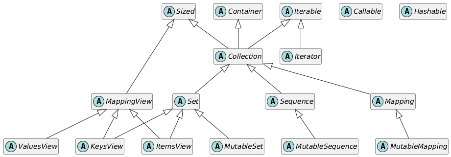
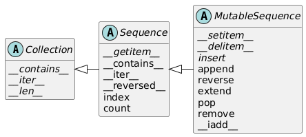
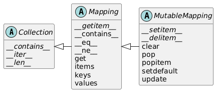
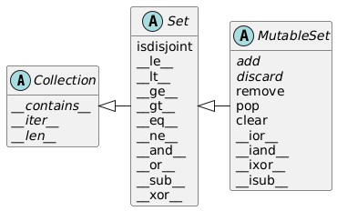

# Chap 3：类和协议

## 符合 Python 风格的对象

前面几章介绍了很多内置对象的行为和用法，现在我们需要学会自己定义一个符合“Python 风格”的类，比如实现一些 Python 中常见的特殊方法等，下面将会展开介绍。

??? example "一个符合 Python 风格的自定义类"

    ```py
    """
    A two-dimensional vector class

        >>> v1 = Vector2d(3, 4)
        >>> print(v1.x, v1.y)
        3.0 4.0
        >>> x, y = v1
        >>> x, y
        (3.0, 4.0)
        >>> v1
        Vector2d(3.0, 4.0)
        >>> v1_clone = eval(repr(v1))
        >>> v1 == v1_clone
        True
        >>> print(v1)
        (3.0, 4.0)
        >>> octets = bytes(v1)
        >>> octets
        b'd\\x00\\x00\\x00\\x00\\x00\\x00\\x08@\\x00\\x00\\x00\\x00\\x00\\x00\\x10@'
        >>> abs(v1)
        5.0
        >>> bool(v1), bool(Vector2d(0, 0))
        (True, False)


    Test of ``.frombytes()`` class method:

        >>> v1_clone = Vector2d.frombytes(bytes(v1))
        >>> v1_clone
        Vector2d(3.0, 4.0)
        >>> v1 == v1_clone
        True


    Tests of ``format()`` with Cartesian coordinates:

        >>> format(v1)
        '(3.0, 4.0)'
        >>> format(v1, '.2f')
        '(3.00, 4.00)'
        >>> format(v1, '.3e')
        '(3.000e+00, 4.000e+00)'


    Tests of the ``angle`` method::

        >>> Vector2d(0, 0).angle()
        0.0
        >>> Vector2d(1, 0).angle()
        0.0
        >>> epsilon = 10**-8
        >>> abs(Vector2d(0, 1).angle() - math.pi/2) < epsilon
        True
        >>> abs(Vector2d(1, 1).angle() - math.pi/4) < epsilon
        True


    Tests of ``format()`` with polar coordinates:

        >>> format(Vector2d(1, 1), 'p')  # doctest:+ELLIPSIS
        '<1.414213..., 0.785398...>'
        >>> format(Vector2d(1, 1), '.3ep')
        '<1.414e+00, 7.854e-01>'
        >>> format(Vector2d(1, 1), '0.5fp')
        '<1.41421, 0.78540>'


    Tests of `x` and `y` read-only properties:

        >>> v1.x, v1.y
        (3.0, 4.0)
        >>> v1.x = 123
        Traceback (most recent call last):
        ...
        AttributeError: can't set attribute 'x'


    Tests of hashing:

        >>> v1 = Vector2d(3, 4)
        >>> v2 = Vector2d(3.1, 4.2)
        >>> len({v1, v2})
        2

    """

    from array import array
    import math

    class Vector2d:
        __match_args__ = ('x', 'y')

        typecode = 'd'

        def __init__(self, x, y):
            self.__x = float(x)
            self.__y = float(y)

        @property
        def x(self):
            return self.__x

        @property
        def y(self):
            return self.__y

        def __iter__(self):
            return (i for i in (self.x, self.y))

        def __repr__(self):
            class_name = type(self).__name__
            return '{}({!r}, {!r})'.format(class_name, *self)

        def __str__(self):
            return str(tuple(self))

        def __bytes__(self):
            return (bytes([ord(self.typecode)]) +
                    bytes(array(self.typecode, self)))

        def __eq__(self, other):
            return tuple(self) == tuple(other)

        def __hash__(self):
            return hash((self.x, self.y))

        def __abs__(self):
            return math.hypot(self.x, self.y)

        def __bool__(self):
            return bool(abs(self))

        def angle(self):
            return math.atan2(self.y, self.x)

        def __format__(self, fmt_spec=''):
            if fmt_spec.endswith('p'):
                fmt_spec = fmt_spec[:-1]
                coords = (abs(self), self.angle())
                outer_fmt = '<{}, {}>'
            else:
                coords = self
                outer_fmt = '({}, {})'
            components = (format(c, fmt_spec) for c in coords)
            return outer_fmt.format(*components)

        @classmethod
        def frombytes(cls, octets):
            typecode = chr(octets[0])
            memv = memoryview(octets[1:]).cast(typecode)
            return cls(*memv)
    ```

### 对象表示形式

Python 提供以下几种获取对象字符串表示形式的标准方式（特殊方法）：

- `__repr__`：以便于**开发者**理解的方式返回对象的字符串表示形式。Python 控制台或调试器在显示对象时采用这种方式。对应函数为 `repr()`
- `__str__`：以便于**用户**理解的方式返回对象的字符串表示形式。使用 `print()` 打印对象时采用这种方式。对应函数为 `str()`
- `__bytes__`：获取对象的字节序列表现形式。对应函数为 `bytes()`
- `__format__(format_spec)`：以特殊的格式化代码显示对象的字符串表示形式。对应函数或方法为 `format()` 和 `str.format()`，以及 `f` 字符串
    - 其中 `format_spec` 是格式说明符，它是 `format(my_obj, format_spec)` 的第二个参数，也是 `f` 字符串内 `{}` 内代换字段中冒号右边的部分（左边是字段名），还是 `fmt.str.format()` 中的 `fmt`
    - 格式说明符使用的表示法叫做**格式规范微语言**(format specification mini-language)，它为一些内置类型提供了专用的表示代码：
        - 整数：`'bcdoxXn'`，其中 `b` 和 `x` 表示二进制和十六进制
        - 浮点数：`'eEfFgGn%'`，其中`f` 和 `%` 表示小数形式和百分数
        - 字符串：`s`
        - 转换标志：`!s`、`!r`、`!a`

    - 为自定义的格式代码选择字母时，应避免使用其他类型用到过的字母（如上所示，虽然用了也不会出错）

    - 如果一个类没有定义 `__format__` 方法，那么该方法就会从 `object` 继承，并返回 `str(my_object)`，此时若传入格式说明符，则 `object.__format__` 会抛出 `TypeError`


### 备选构造函数

在自定义类时，可能需要不止一种创建实例的构造函数。除了默认的 `__init__` 方法外，我们还可以自定义方法，作为备选的构造函数。通常会配合 `classmethod` 装饰器来定义备选构造函数，它的作用是：定义操作类而不是操作实例的方法，此时该方法接收的第一个参数是类本身（通常取名为 `cls`）而非实例（`self`）。

还有一个类似的装饰器 `staticmethod`，它也会改变方法的调用方式，但貌似用处不大。


### 可哈希的对象

为了让对象变得可哈希，需要：

- 必须实现 `__hash__` 方法和 `__eq__` 方法
    - 建议根据元组的分量计算哈希值，也可以用异或运算符计算
- 让实例不可变（使属性变为只读）
    - 使用两个前导下划线 `__`，将属性标记为“私有”
    - 用 `@property` 装饰器将读值方法(getter)标记为特性(property)

    ```py
    class My_Class:
        def __init__(self, x, y):
            self.__x = float(x)
            self.__y = float(y)

        @property
        def x(self):
            return self.__x

        @property
        def y(self):
            return self.__y
    ```


#### “私有”属性和“受保护”的属性

之所以将“私有”属性打引号，是因为 Python 实际上无法像 Java 那样使用 `private` 修饰符创建私有属性，但是可以用 `__` 前导实现类似功能。带这一前导的属性名会被存入实例属性 `__dict__` 中，而且这个属性的前面会加上一个下划线和类名（比如 `__x` 会变成 `_My_Class__x`）。这个功能成为**名称改写**(name mangling)，它的目的是避免意外访问，但不能防止故意的破坏，因为只要知道改写私有属性名称的机制，任何人都能直接读取私有属性。

但是有不少 Python 程序员不喜欢这种双下划线前缀，因此他们约定：带单个下划线前缀的属性是“受保护”的属性。虽然 Python 解释器不会对这样的属性名做特殊处理，但不少程序员均遵守这一约定，就和遵守常量名大写的约定一样。

不过，在模块中，如果顶层名称使用一个前导下划线，那么的确会有影响：

- 对 `from mymod import *` 来说，`mymod` 中前缀为一个下划线的名称不会被导入
- 然而，可以通过具体指明该名称的方式来导入，比如 `from mymod import _privatefunc`


### 支持位置模式匹配

如果自定义类能够保存好类的属性，并且使类的实例成为可迭代对象，那么该实例应当支持[关键字类模式](dataStruct.md#模式匹配_3)。然而，要想让实例支持位置模式，需要为类添加一个名为 `__match_args__` 的类属性，按照在位置模式匹配中的使用顺序列出实例属性。

- `__match__args__` 应当列出必需的参数，可选的参数则不必列出


### 使用 \_\_slot\_\_ 节省空间

默认情况下，Python 把各个实例的属性存储在 `__dict__` 字典中，但是字典消耗的内存很多。优化方法是使用 `__slots__` 存储实例属性，它会将属性名称存储在一个隐藏的引用数组中，因此消耗的内存比字典少。

- `__slots__` 必须在定义类时声明（紧跟 `class` 语句的下一行），之后再添加或修改均无效
- 属性名称可以存储在一个元组或列表中，而存储在元组中可以明确表明 `__slots__` 无法修改
- 若设置了 `__slots__`，则无法访问该实例的 `__dict__` 属性
- 设定不在 `__slots__` 中的属性会抛出 `AttributeError`
- 子类只能继承 `__slots__` 的部分效果，因此对于设置了 `__slots__` 的类，它的子类需要再次声明 `__slots__` 属性
- 如果子类的 `__slots__ = ()`（空元组），表示子类仅接受基类的 `__slots__` 属性列出的属性名称；若子类需要额外属性，则在子类的 `__slots__` 属性中列出来
- 若将 `'__dict__'` 添加到 `__slots__` 列表中，则实例会在各个实例独有的引用数组中存储 `__slots__` 的名称，不过也支持动态创建属性，存储在常规的 `__dict__` 中
- 若定义了 `__slots__`，且想把该类的实例作为弱引用的目标，则必须把 `'__weakref__'` 添加到 `__slots__` 中


### 覆盖类属性

在 Python 中，**实例属性**是在类定义中声明的，并以 `self.` 开头的变量；而类属性是在类定义中声明的，但不以 `self.` 开头的变量。

- Python 中，类属性可为实例属性提供默认值
- 如果为不存在的实例属性赋值，那么将会创建一个新实例属性，它会覆盖同名的类属性
- 如果想修改类属性的值，那么必须直接在类上修改，无法通过实例修改；如果想修改所有实例属性的默认值，则可通过 `#!py My_Class.attr = val` 来修改


## 序列的特殊方法

下面具体介绍一些与自定义序列类型的类相关的知识。

- 序列类型的构造函数最好接受可迭代对象为参数
- 如果序列类型的实例包含的项超过 6 个，那么 `repr()` 生成的字符串就会使用 `...` 省略其余项的表示，因为 `repr` 是用于调试的，一般而言在控制台或日志上输出成千上万行的内容是不太合理的
    - 同样因为调试目的，`repr()` 绝对不能抛出异常，如果实现方法有问题，应尽量输出有用的内容，让用户能够识别
    - 也可以用 `reprlib` 模块中的 `repr` 函数自行设置生成长度有限的表现形式

- 根据前面介绍的[鸭子类型](functObj.md#类型的具体含义)，只要让类的**行为**像序列，那么它的实例就是一个序列。要做到这一点，Python 的序列协议（具体概念见下面）只需要 `__len__` 和 `__getitem__` 两个方法即可。


### 协议和鸭子类型

- 在面向对象编程中，**协议**(protocol)是非正式的接口，只在文档中定义，不在代码中定义
- 协议是非正式的，没有强制力，因此如果知道类的具体使用场景，那么通常只需实现协议的一部分
- Python 3.8 开始支持[**协议类**](functObj.md#静态协议)（即 `typing.Protocol`），这里的“协议”与上面给出的概念不同，具体可分为：
    - 静态协议：协议类规定的协议，这类协议的实现必须提供静态类中定义的所有方法
    - 动态协议：传统意义上的协议

- 在 Python 文档中，如果看到“文件类对象”这样的表述，通常说的就是协议，它的意思是：“行为基本与文件一致，实现了部分文件接口，满足上下文相关需求的东西。”


### 切片

通过实现 `__getitem__` 特殊方法来设计符合预期的切片行为：切片得到的都是各自类型的实例。

```py
def __getitem__(self, key):
    if isinstance(key, slice):               # 如果 key 是 slice 对象
        cls = type(self)                     # 获取构造实例的类
        return cls(self._components[key])    # 调用类的构造函数，创建新的实例
    index = operator.index(key)              # key 是单个索引
    return self._components[index]
```

>注：这样实现的类不支持多维索引，因此使用索引元组或多个切片会抛出错误。


### 动态存取属性

如果想要设置多个只读特性，可以用上一节介绍的 `@property` 装饰器为每个属性定义一个读值方法，但这样有些麻烦。更合理的方式是使用特殊方法 `__getattr__`，它的运行机制为：

1. 对于 `my_obj.x` 表达式，Python 会检查 `my_obj` **实例**有没有名为 `x` 的属性
2. 若没有，就到类（`my_obj.__class__`）中查找
3. 若还没有，就沿着继承图继续往上找
4. 若依旧找不到，则调用 `my_obj` 所属类中定义的 `__getattr__` 方法，传入 `self` 和属性名称的字符串形式（`'x'`）

其他注意事项：

- 可结合 `__match_args__`，让 `__getattr__` 实现的动态属性支持位置模式匹配
- 在实现 `__getattr__` 时，可以设置 `AttributeError` 错误信息，以应对不合预期的行为
- 根据上述运行机制，如果运行过程中为实例属性赋值，那么实例属性就会覆盖 `__getattr__` 方法，使得该方法无法再被调用。解决方法是实现 `__setattr__` 方法，以限制实例属性的赋值
    - 对于被限制的属性，需要在 `__setattr__` 中编写合适的处理方式；对于其他属性，默认采用超类的 `__setattr__` 方法，即调用 `super().__setattr__()`

- 虽然 `__slots__` 属性也可以防止创建新实例属性，但是这个属性最主要的目的还是用于节省内存，因此不建议用在这里


### 哈希和快速等值测试

对于包含大量项的序列，要实现其所属类的 `__hash__` 方法，如果直接对整个序列使用 `hash()` 函数，由于需要构建整个序列，因此消耗的资源较多，不太合适。更合理的做法是：使用 `^`（异或）运算符计算所有项（或对应的哈希值），将计算结果作为哈希值。在具体实现中，[`functools.reduce` 归约函数](functObj.md#高阶函数)是最能胜任这一任务的方式：

```py
# 创建生成器表达式，惰性计算各个分量的哈希值
hashes = (hash(x) for x in self._components)
# 使用 xor 函数计算聚合的哈希值，第三个参数是初始值
functools.recude(operator.xor, hashes, 0)
```

---
对于等值比较，通过形如 `#!py tuple(self) == tuple(other)` 的简单方式进行比较，需要复制两个完整的列表，如果列表中包含多项，那么效率就会很低。解决方法是依次比较两个序列相同位置上的项，这里会用到 `zip` 函数，它能并行迭代两个或多个可迭代对象，返回的元组可以拆包成变量，分别对应各个输入对象中的一个元素。现在特殊方法 `__eq__` 的实现如下所示：

```py
def __eq__(self, other):
    return len(self) == len(other) and all(a == b for a, b in zip(self, other))
    # 归约函数 all() 只有当所有比较结果为真时返回 True，有一个错的就返回 False
```

使用 `zip` 函数时需注意：

- 当其中一个可迭代对象耗尽时，`zip` 不发出警告就停止执行
- `zip` 还有一个可选的参数 `strict`，决定是否会因为可迭代对象的长度不同而报错（`ValueError`），默认值为 `False`
- `zip` 函数可用于转置矩阵，比如：

    ```py
    >>> b = [(1, 2), (3, 4), (5, 6)]
    >>> list(zip(*b))
    [(1, 3, 5), (2, 4, 6)]
    ```

- 还有一个类似的函数 `itertools.zip_longest`，它使用可选的 `fillvalue`（默认值为 `None`）来填充缺失值，因此可以继续生成元组，直到最后一个可迭代对象耗尽


## 接口、协议和抽象基类

面向对象编程全靠接口，在 Python 中，支撑一个类型的是它提供的方法，也就是接口。

### 类型图

Python 提供 4 种接口的定义和使用方式，下面以类型图的形式呈现：

<figure style=" width: 60%" markdown="span">
    
    
    <figcaption></figcaption>
</figure>

>- 结构类型：类型基于对象的结构（对象提供的方法），与对象所属的类或超类无关
>- 名义类型：类型要求对象有明确的类型名称——对象所属类或超类的名称


- **鸭子类型**：自 Python 诞生以来默认使用的类型实现方式
- **大鹅类型**：自 Python 2.6 以来，由抽象基类支持的方式，会在运行时检查对象是否符合抽象基类的要求
- **静态类型**：自 Python 3.5 以来，由 `typing` 模块支持，由外部类型检查工具实施检查
- **静态鸭子类型**：自 Python 3.5 以来，由 `typing.Protocol` 的子类支持，由外部类型检查工具实施检查


### 协议

!!! info "注"

    这里所讲的“协议”不是 HTTP 这种网络协议，而是「对象协议」，它指明了为了履行某个角色，对象必须实现哪些方法。

    在 Python 文档中，“协议”一词基本上是指非正式接口，因为 Python 并不要求完全实现协议，有时根据需要可实现部分协议。

可以将 Python 协议分为：

- **动态协议**：一种隐含的、按约定定义、在文档中描述的非正式协议，Python 中大多数重要的动态协议由解释器支持
    - 对象可以只实现动态协议的一部分
    - 动态协议无法通过静态类型检查工具检查
- **静态协议**：由 PEP 544 定义的协议，自 Python 3.8 开始支持，要使用 `typing.Protocol` 子类显式定义
    - 若想满足静态协议，则对象必须提供协议类中声明的每一个方法，即使程序用不到
    - 静态协议可用静态类型检查工具确认

这两种协议的共同点是：无须通过名称（比如通过继承）声明支持什么协议。


### 鸭子类型

在前面的[章节](functObj.md#类型的具体含义)中，已经大致介绍过鸭子类型，下面来进一步了解鸭子类型。

- 遵守既定协议很有可能增加利用现有标准库或第三方代码的可能性
- **猴子补丁**(monkey patch)：在<u>运行时</u>（比如在交互式控制台中）动态修改模块、类或函数，而不改动源码，以增加功能或修正 bug
    - 缺点：打补丁的代码与被打补丁的程序耦合十分紧密，而且往往要处理文档中没有明确说明的私有属性
- **防御性编程**：提供一套提高安全的实践
    - 对于 Python 等动态类型语言，“**快速失败**”（尽早抛出运行时错误）可以提升程序的安全性，让程序更易于维护
    - 举例：
        - 若函数接受一系列项，在内部按列表处理，则无需使用类型检查强制要求传入一个列表，而是立即利用参数构建一个列表（`list()`），这样的话若参数不是可迭代对象，则抛出意义明确的 `TypeError` 异常（或者用 `try/except` 语句自定义错误消息）；而类型提示不在运行时强制检查，且无法对 `Any` 类型（与所有类型相容）进行有效检查，因此很难确定程序崩溃的根源
        - 若数据太多，或需要就地修改数据，那么不应该用 `list()` 复制数据，而应使用 `isinstance(x, abc.MutableSequence)` 做运行时检查

- **EAFP 原则**——取得原谅比获取许可容易(Easier to ask for forgiveness than permission)：不事先检查，执行可能的非法运算，发生错误后再处理


### 抽象基类、大鹅类型

- **抽象基类**：提供一种定义接口的方式，是鸭子类型的补充。
    - 声明抽象基类的标准方式是继承 `abc.ABC` 或其他抽象基类
    - 抽象基类内可以定义抽象方法和具体方法
        - 抽象方法：使用 `@abstractmethod` 装饰器标记（注意一定要紧贴 `def` 语句放置，即使有多个装饰器叠放），主体通常只有文档字符串。虽然抽象基类可以有实现代码，但是子类也必须覆盖抽象方法，不过可以用 `super()` 函数调用抽象方法，在此基础上添加功能
        - 具体方法：只能依赖抽象基类定义的接口（只能使用抽象基类中的其他具体方法、抽象方法或特性）
    - 把函数参数类型提示中的具体类型换成抽象基类能为调用方提供更大的灵活性
    - 通过继承抽象基类可以得到具体子类；即便不继承，也可以将通过注册得到[**虚拟子类**](#虚拟子类)
    - 不建议自己创建抽象基类，能用好现有的抽象基类就足够了
    - 滥用抽象基类会导致灾难性后果，表明语言太注重表面形式了

    ??? example "例子"

        ```py
        import abc

        class Tombola(abc.ABC):  

            @abc.abstractmethod
            def load(self, iterable): 
                """Add items from an iterable."""

            @abc.abstractmethod
            def pick(self):
                """Remove item at random, returning it.

                This method should raise `LookupError` when the instance is empty.
                """

            def loaded(self):
                """Return `True` if there's at least 1 item, `False` otherwise."""
                return bool(self.inspect())

            def inspect(self):
                """Return a sorted tuple with the items currently inside."""
                items = []
                while True:
                    try:
                        items.append(self.pick())
                    except LookupError:
                        break
                self.load(items)
                return tuple(items)
        ```

- **大鹅类型**：一种利用抽象基类实现运行时检查方式，要求：
    - 定义抽象基类的子类，明确表明实现既有的接口
    - 运行时检查类型时通常使用 `isinstance` 和 `issubclass` 测试，它们的句法类似，且第二个参数要使用抽象基类，而不是具体类
        - `isinstance` 的第二个参数可以是一个元组，包含多个抽象基类，只要有一个满足时返回 `True`
        - 且不能滥用，否则可能会导致代码异味
        - 若在检查之后要根据对象的类型执行不同的操作，应该使用**多态**，即采用一定的方式定义类，让解释器把调用分派给正确的方法，而不是用 `if/elif/else` 块硬编码分派逻辑


#### 标准库中的抽象基类

Python 标准库中大多数的抽象基类来自 `collections.abc` 模块，少数来自 `io` 包和 `numbers` 包等，但 `collections.abc` 的抽象基类最常用，下面展示该模块中 17 个抽象基类的 UML 类图（涉及到多重继承）：

<div style="text-align: center">
    
</div>

- `Iterable`、`Container`、`Sized`：每个容器都应该继承这 3 个抽象基类，或者实现兼容的协议
    - `Iterable`：通过 `__iter__` 方法支持迭代
    - `Container`：通过 `__contains__` 方法支持 `in` 运算符
    - `Sized`：通过 `__len__` 方法支持 `len()` 函数
- `Collection`：自身没有方法，目的是方便子类化 `Iterable`、`Container` 和 `Sized`
- `Sequence`、`Mapping`、`Set`：主要的不可变容器类型，但各自都有可变的子类 `MutableSequence`、`MutableMapping`、`MutableSet`

    <div style="text-align: center">
        
        
        
    </div>

- `MappingView`：映射方法 `.items()`、`.keys()`、`.values()` 返回的对象分别实现了 `ItemsView`、`KeysView`、`ValuesView` 定义的接口，前两个还实现了 `Set` 接口，支持集合运算
- `Iterator`：`Iterable` 的子类
- `Callable`、`Hashable`：不是容器，在类型检查中分别用于指定可调用和可哈希的对象

!!! note "补充"

    - 在 `collections.abc` 中，每个抽象基类的具体方法都是作为类的公开接口实现的，因此无须知道实例的内部结构
    - 标准库中有两个名为 `abc` 的模块：
        - `collections.abc`：该模块在 `collections` 包之外实现的，因此要与 `collections` 分开导入
        - `abc` 模块：每个抽象基类都依赖该模块，但是不用导入它，除非自定义新的抽象基类
    - 建议不要使用 `isinstance(obj, some_type)` 检查 `Callable`、`Hashable` 和 `Iterable`，特别是后两者结果并不准确。应该分别使用 `callable(obj)`、`hash(obj)`、`iter(obj)` 来检验。


#### 虚拟子类

注册虚拟子类的方式：在抽象基类上调用 `register` 类方法，具体有两种实现方法：

- 作为普通函数调用（放在类定义之后）：`#!py MyAbstractClass.register(MySubclass)`
- 更常用的做法是作为**装饰器**使用（放在类定义之前，紧贴 `class` 语句）：

    ```py
    @MyAbstractClass.register
    class MySubclass():
        ...
    ```

注册后使用 `issubclass` 和 `isinstance` 函数判断 `MySubclass` 是否为 `MyAbstractClass` 的子类，结果均为 `True`。

实际上，类的继承关系由 `__mro__`（method resolution order，方法解析顺序）这个特殊类属性指定，它会按顺序列出类及其真实存在的超类，而 Python 会按这个顺序搜索方法。所以使用 `MySubclass.__mro__` 查看发现并没有 `MyAbstractClass`。


#### 使用抽象基类实现结构类型

!!! note "结构类型"

    通过对象公开接口的结构判断对象的类型，如果一个对象实现了某个类型定义的方法，那么该对象就与该类型相容。

    动态鸭子类型和静态鸭子类型时实现结构类型的两种方式。

抽象基类最常用于实现名义类型，但某些抽象基类也支持结构类型，通过 `__subclasshook__` 这一特殊的类方法实现的。

???+ example "例子"

    ```py
    >>> class Struggle:
    ...     def __len__(self): return 23
    ...     
    >>> from collections import abc
    >>> isinstance(Struggle(), abc.Sized)
    True
    >>> issubclass(Struggle, abc.Sized)
    True
    ```

    因此，只实现了 `__len__` 方法的类 `Struggle` 被视为抽象基类 `abc.Sized` 的子类。下面来看 Python 源码中对 `Sized` 的定义（[源码链接](https://github.com/python/cpython/blob/main/Lib/_collections_abc.py#L403C1-L415C30)）：

    ```py hl_lines="9-13"
    class Sized(metaclass=ABCMeta):

        __slots__ = ()

        @abstractmethod
        def __len__(self):
            return 0

        @classmethod
        def __subclasshook__(cls, C):
            if cls is Sized:
                return _check_methods(C, "__len__")
            return NotImplemented
    ```

- 对于自己编写的抽象基类，`__subclasshook__` 的可信度并不高，因为即使某个类具备与抽象基类所有名称相同的方法，我们也不敢肯定这个类的行为与抽象基类相似。只有当这个类被定义为抽象基类的子类，或者使用 `register` 方法注册时，才能确定两者行为的相似性。


### 静态协议

静态协议的基本概念已在[前面章节](functObj.md#静态协议)中介绍过，下面就来学习更深入的内容。


#### 运行可检查的静态协议

- 定义 `typing.Protocol` 的子类时，可借由 `@runtime_checkable` 装饰器让协议支持在运行时使用 `isinstance/issubclass` 检查
- 除了 `Protocol` 外，`typing` 模块中还提供了一些可在运行时检查的协议，包括 `SupportsComplex`、`SupportsFloat` 等旨在检查数值类型可否转换类型的协议
- 局限：
    - 类型提示在运行时一般会被忽略
    - `isinstance/issubclass` 只检查有无特定的方法，不检查方法的签名，更不会就爱你差方法的类型注解


#### 设计静态协议

- 单方法协议（窄协议(narrow protocol)）实现的静态鸭子类型更有用且更灵活
- 客户代码协议：在使用协议的函数的附近定义协议
- 上述两种协议都能有效避免紧密耦合，正符合**接口隔离原则**(interface segregation principle)：不应强迫客户依赖用不到的接口
- 建议静态协议采用以下命名约定：
    - 使用朴素的名称命名协定，清楚表明概念（比如 `Iterator` 和 `Container`）
    - 使用 `SupportX` 形式命名提供一到两个方法的协议（比如 `SupportsInt`、 `SupportsRead` 和 `SupportsReadSeek`）
        - 更方便的命名：对于只有一个方法的协议，如果方法名称是动词，则在末尾加上 -er 或 -or
    - 使用 `HasX` 形式命名有可读属性和可写属性，或者有读值方法和设值方法的协议（比如 `HasItems` 和 `HasFileno`）


#### 扩展静态协议

如果实际使用中发现协议需要多个方法，那么不要直接为协议添加方法，最好衍生原协议，创建一个新协议。扩展协议时需注意以下问题：

- 若希望衍生的协议可在运行时检查，则必须再次应用装饰器 `@runtime_checkable`，因为该装饰器的行为不被继承
- 每个协议都必须明确把 `typing.Protocol` 列出来，作为基类；另外再列出要扩展的协议
- 只需在衍生的协议中声明新增的方法即可，其他方法都会从原协议继承过来

??? example "例子"

    ```py
    # 扩展 RandomPicker 协议
    from typing import Protocol, runtime_checkable
    from randompick import RandomPicker

    @runtime_checkable
    class LoadableRandomPicker(RandomPicker, Protocol):
        def load(self, Iterable) -> None: ...
    ```


#### numbers 模块中的抽象基类和 Numeric 协议

- 标准库中的 `numbers` 包的抽象基类可用于做运行时类型检查，比如想检查是否为整数/浮点数/复数，可以用 `isinstance(x, numbers.Integral/Real/Complex)` 来测试
- 但 `numbers` 包不是为静态类型检查设计的，因此对于 `x: numbers.Number` 声明，Mypy 不允许对 `x` 做任何算术运算或调用任何方法
- 因此，对于数值类型的静态类型检查，一种可行的方法是利用 `statistics` 模块的类型提示（但仅支持标准库内的数据类型）：

    ```py
    Number = Union[float, Decimal, Fraction]
    _NumberT = TypeVar('_NumberT', float, Decimal, Fraction)
    ```

- 更适合静态类型检查的方法是使用 `typing` 模块的协议，比如 `SupportsComplex`、`SupportsFloat` 等。但是当涉及到复数时，运行时类型检查的结果就不可靠了


## 继承

!!! warning "警告"

    - 不建议过度使用继承（不仅仅是多重继承），因为超类与子类紧密耦合，这意味着对程序某一部分的更改可能会对其他部分产生意想不到的深远影响，从而使系统变得脆弱且难以理解。
    - 实际上自定义的函数，或者标准库中现有的类足以帮助我们完成很多任务，无需自己创建类
    - 如果发现自己在构建多层类层次结构，那么可能发生以下事件中的一个或多个：
        - 重新发明轮子 -> 使用现有的框架或库
        - 使用的框架设计不良 -> 尝试寻找替代品
        - 过度设计 -> 遵守 **KISS 原则**（Keep It Simple, Stupid）
        - 对现有框架不满，决定新造一个框架


### super() 函数

子类中覆盖超类的方法（常见的有 `__init__` 方法）通常利用 `super()` 函数来调用超类中相应的方法，然后在此基础上进行扩充。

!!! warning "不推荐的做法"

    虽然可以直接在子类中调用超类的方法而不使用 `super()` 函数，但不推荐这种做法，原因有：

    - 这是对基类的硬编码。如果之后修改了超类的名称，说不定忘记修改子类中出现的原超类的名称，这就埋下了 bug
    - `super` 实现的逻辑能够处理多重继承涉及的类层次结构，且使用更为方便

`super` 函数提供两个可选的（位置）参数：

- `type`：指定实现方法的超类，默认值为 `super()` 调用所在方法所属的类
- `object_or_type`：接收方法调用的对象或类，在实例方法中调用 `super()` 时，默认值为 `self`


### 子类化内置类型

- 用 C 语言实现（CPython）的内置类型通常不调用用户定义的类覆盖的方法；并且内置类型的方法调用的其他类的方法如果被覆盖了，则也不会被调用。

??? example "例子"

    === "例1"

        ```py
        >>> class DoppelDict(dict):
        ...     def __setitem__(self, key, value):
        ...         super().__setitem__(key, [value] * 2)
        ... 
        >>> dd = DoppelDict(one=1)
        >>> dd
        {'one': 1}
        >>> dd['two'] = 2
        >>> dd
        {'one': 1, 'two': [2, 2]}
        >>> dd.update(three=3)
        >>> dd
        {'one': 1, 'two': [2, 2], 'three': 3}
        ```

    === "例2"

        ```py
        >>> class AnswerDict(dict):
        ...     def __getitem__(self, key):
        ...         return 42
        ... 
        >>> ad = AnswerDict(a='foo')
        >>> ad['a']
        42
        >>> d = {}
        >>> d.update(ad)
        >>> d['a']
        'foo'
        >>> d
        {'a': 'foo'}
        ```

- 上述行为违背了面向对象编程的一个基本原则：应该始终从实例（`self`）所属的类开始搜索方法，即使在超类实现的类中调用也是如此。
- 因此，用户自定义的类应该继承 `collections` 模块中的类，比如 `UserDict`、`UserList` 和 `UserString`，这些类做了特殊设计（使用 Python 编写），因此易于扩展。


### 多重继承

!!! info "注"

    - 在 Python 标准库中，多重继承最明显的用途是用于 `collections.abc` 包；并且 Python 文档中使用「混入方法」来称呼很多容器抽象基类中实现的具体方法，而提供混入方法的抽象基类既是接口定义，也是混入类。

#### 方法解析顺序

任何实现多重继承的语言都要处理潜在的命名冲突，这种冲突由超类实现同名方法时引起，被称为“菱形问题”(diamond problem)。

对于某个类 `MyClass` 的方法 `my_method`，且它的超类中也出现同名方法，则它的唤醒(invoke)过程由以下两个因素决定：

- `MyClass` 类的方法解析顺序：每个类都有名为 `__mro__` 的属性，它的值是一个元组，按照方法解析顺序（使用 [C3 算法](https://www.python.org/download/releases/2.3/mro/)计算，同时考虑<u>继承图</u>和<u>子类声明超类的顺序</u>）列出各个超类，从当前类一直到 `object` 类，用于决定唤醒顺序
- `my_method` 方法中使用的 `super()`：决定方法是否被唤醒
    - 调用 `super()` 的方法叫**协作方法**(cooperative method)，利用协作方法可以实现**协作多重继承**。而非协作方法可能导致不易发现的 bug，因此建议非根类的每一个方法 `m` 都调用 `super().m()`
        - 协作的方法必须具有兼容的签名

??? example "例子"

    ```py title="diamond.py"
    class Root:
        def ping(self):
            print(f'{self}.ping() in Root')

        def pong(self):
            print(f'{self}.pong() in Root')

        def __repr__(self):
            cls_name = type(self).__name__
            return f'<instance of {cls_name}>'


    class A(Root):
        def ping(self):
            print(f'{self}.ping() in A')
            super().ping()

        def pong(self):
            print(f'{self}.pong() in A')
            super().pong()


    class B(Root):
        def ping(self):
            print(f'{self}.ping() in B')
            super().ping()

        def pong(self):
            print(f'{self}.pong() in B')


    class Leaf(A, B):
        def ping(self):
            print(f'{self}.ping() in Leaf')
            super().ping()
    ```

    运行结果：

    ```py
    >>> leaf1 = Leaf()
    >>> leaf1.ping()
    <instance of Leaf>.ping() in Leaf
    <instance of Leaf>.ping() in A
    <instance of Leaf>.ping() in B
    <instance of Leaf>.ping() in Root
    >>> leaf1.pong()
    <instance of Leaf>.pong() in A
    <instance of Leaf>.pong() in B
    ```

    下图形象展示两种方法的唤醒顺序（用蓝色虚线箭头表示）：

    <figure style=" width: 45%" markdown="span">
        
        
        <figcaption></figcaption>
    </figure>

    <figure style=" width: 45%" markdown="span">
        
        
        <figcaption></figcaption>
    </figure>


`super()` 与方法解析顺序的交互是动态的，具体见下面的例子：

??? example "例子"

    ```py
    from diamond import A    # 导入上个例子中的类 A

    class U():
        def ping(self):
            print(f'{self}.ping() in U')
            super().ping()

    class LeafUA(U, A): 
        def ping(self):
            print(f'{self}.ping() in LeafUA')
            super().ping()
    ```

    运行结果：

    ```py
    >>> u = U()
    >>> u.ping()
    <__main__.U object at 0x000001A97D46CEC0>.ping() in U
    Traceback (most recent call last):
    File "<python-input-1>", line 1, in <module>
        u.ping()
        ~~~~~~^^
    File "D:\University\CS\self-learning\FluentPython\example-code-2e\14-inheritance\diamond2.py", line 55, in ping
        super().ping()  # <3>
        ^^^^^^^^^^^^
    AttributeError: 'super' object has no attribute 'ping'
    >>> leaf2 = LeafUA()
    >>> leaf2.ping()
    <instance of LeafUA>.ping() in LeafUA
    <instance of LeafUA>.ping() in U
    <instance of LeafUA>.ping() in A
    <instance of LeafUA>.ping() in Root
    >>> LeafUA.__mro__
    (<class '__main__.LeafUA'>, <class '__main__.U'>, <class 'diamond.A'>, <class 'diamond.Root'>, <class 'object'>)
    ```

    可以看到，如果直接创建 `U` 实例并调用 `ping` 方法就会报错，但是在 `LeafUA` 实例中调用 `ping` 方法却不会因为 `U.ping` 报错。


#### 使用建议

- 优先使用**对象组合**（以及分派），把行为带给不同的类，而不是类继承
- 理解不同情况下使用继承的原因：
    - 继承接口：创建子类型，实现“是什么”的关系，这种情况下使用**抽象基类**（或 `typing.Protocol`）显式表示接口
    - 继承实现：通过重用避免代码重复，这种情况可以利用[**混入**](#混入类)
- 为用户提供**聚合类**：这种类的结构主要继承自混入类，自身没有添加结构或行为，对客户代码非常有用
    - 聚合类的主体不一定为空，只是经常为空而已
- 仅子类化为子类化设计的类
    - 子类化复杂的类并覆盖类的方法容易出错，因为超类中的方法可能在不知不觉中忽略子类覆盖的行为
    - 如果必须子类化，则要看原类是不是为了扩展而设计的，判断依据可以是类的名称/相关文档/文档字符串/代码注释
    - 如果某个类/方法使用 `@final` 装饰器，那么类型检查工具会认为该类/方法不应该子类化或被覆盖
- 避免子类化具体类：因为具体类的实例通常有内部状态，覆盖依赖内部状态的方法时很容易破坏状态


### 混入类

**混入类**(mixin)：为使用它的类提供额外的功能，但自身却不单独使用，即无法实例化，并且不保存内部状态。

- 因此混入类不能作为具体类的唯一基类，因为混入类不为具体对象提供全部功能，而是增加或定制子类或同级类的行为
- 在 Python 中，混入类只是一种约定，语言层面没有显式支持
- 混入类依赖一个同级类，该类实现或继承了签名相同的方法
- 要让混入类发挥作用，在子类的方法解析顺序中，它要出现在其他类前面，也就是说，在类声明语句中，混入类必须出现在基类元组的首位

??? example "例子"

    ```py
    import collections

    def _upper(key):
        try:
            return key.upper()
        except AttributeError:
            return key

    class UpperCaseMixin:
        def __setitem__(self, key, item):
            super().__setitem__(_upper(key), item)

        def __getitem__(self, key):
            return super().__getitem__(_upper(key))

        def get(self, key, default=None):
            return super().get(_upper(key), default)

        def __contains__(self, key):
            return super().__contains__(_upper(key))

    class UpperDict(UpperCaseMixin, collections.UserDict):
        pass

    class UpperCounter(UpperCaseMixin, collections.Counter):
        """Specialized 'Counter' that uppercases string keys""" 
    ```

    运行结果：

    ```py
    >>> d = UpperDict([('a', 'letter A'), (2, 'digit two')])
    >>> list(d.keys())
    ['A', 2]
    >>> d['b'] = 'letter B'
    >>> 'b' in d
    True
    >>> d['a'], d.get('B')
    ('letter A', 'letter B')
    >>> list(d.keys())
    ['A', 2, 'B']
    >>>
    >>>
    >>> c = UpperCounter('BaNanA')
    >>> c.most_common()
    [('A', 3), ('N', 2), ('B', 1)]
    ```


## 类型提示进阶

### 函数签名重载

在 Python 中，同一个函数可以接受不同的参数组合，这些不同的参数组合使用 `@typing.overload` 装饰器注解。

- 重载的签名放在函数具体的签名和实现前面，且重载的签名后面无需具体实现，可用 `...` 替代
- 函数具体实现的签名没有类型提示
- 使用 `@overload` 的关键优势在于：可以根据参数的类型尽量准确声明返回值的类型

??? example "例子"

    ```py
    import functools
    import operator
    from collections.abc import Iterable
    from typing import overload, Union, TypeVar

    T = TypeVar('T')
    S = TypeVar('S')

    @overload
    def sum(it: Iterable[T]) -> Union[T, int]: ...
    @overload
    def sum(it: Iterable[T], /, start: S) -> Union[T, S]: ...
    def sum(it, /, start=0):
        return functools.reduce(operator.add, it, start)
    ```


### TypedDict

`typing.TypedDict` 用于键固定的字典类型提示，具体作用为：

- 使用与类相似的句法注解字典，为各个字段的值提供类型提示
- 通过一个构造函数来告诉类型检查工具，字典应具有指定的键和指定类型的值（传入关键字参数，也可以传入一个包含字典字面量的字典参数）

通过这种构造函数创建的是普通字典，因此：

- 伪类声明中的字段不创建实例属性（因此不能使用 `object.field` 表示法读取数据）
- 不能通过初始化方法为字段指定默认值
- 不允许定义方法

没有类型检查工具，`TypedDict` 只具备注释功能，可为阅读代码的人提供些许帮助。

??? example "例子"

    ```py title="books.py"
    from typing import TypedDict

    class BookDict(TypedDict):
        isbn: str
        title: str
        authors: list[str]
        pagecount: int
    ```

    使用这个字典：

    ```py
    from books import BookDict
    from typing import TYPE_CHECKING

    def demo() -> None:
        book = BookDict(
            isbn='0134757599',
            title='Refactoring, 2e',
            authors=['Martin Fowler', 'Kent Beck'],
            pagecount=478
        )
        authors = book['authors']
        if TYPE_CHECKING:
            reveal_type(authors)

        # 无效操作
        authors = 'Bob'
        book['weight'] = 4.2
        del book['title']


    if __name__ == '__main__':
        demo()
    ```

    使用 Mypy 做类型检查的结果：

    ```sh
    $ mypy demo_books.py
    demo_books.py:13: note: Revealed type is "builtins.list[builtins.str]"
    demo_books.py:14: error: Incompatible types in assignment (expression has type "str", variable has type "list[str]")  [assignment]
    demo_books.py:15: error: TypedDict "BookDict" has no key "weight"  [typeddict-unknown-key]
    demo_books.py:16: error: Key "title" of TypedDict "BookDict" cannot be deleted  [misc]
    Found 3 errors in 1 file (checked 1 source file)
    ```

!!! warning "警告"

    处理具有动态类型的数据（比如 JSON 或 XML）时，`TypedDict` 无法取代运行时数据验证。如果想做数据验证，可以使用 [pydantic 库](https://github.com/pydantic/pydantic/)。


### 类型校正

`typing.cast(typ, val)` 是一个特殊函数，用于**类型校正**，具体来说是用于处理不受控制的代码中存在的类型检查问题或不正确的类型提示。

- 在运行时，`typing.cast` 什么也不做
- PEP 484 要求类型检查工具务必“听信” `cast` 中所述的类型
- 使用样例：

    ```py
    from typing import cast

    def find_first_str(a: list[object]) -> str:
        index = next(i for i, x in enumerate(a) if isinstance(x, str))
        return cast(str, a[index])
    ```


- 不要过于依赖使用 `cast` 静默 Mypy 报错。经常使用 `cast` 也是一种代码异味，可能意味着类型提示有误，或者使用了低质量的依赖
- 但彻底不使用 `cast` 也是不明智的，主要是因为其他变通方法更糟：
    - `# type: ignore` 注释提供的信息量更少
    - 使用 `Any` 有连锁反应，因为 `Any` 与所有类型相容，一旦滥用，类型推导可能导致级联效应，破坏类型检查工具对代码中其他部分的检错能力


### 运行时读取类型提示

- Python 会在导入时读取函数、类和模块中的类型提示，把类型提示以字典形式存储在 `__annotation__` 属性中
    - `return` 键对应返回值类型提示
    - 注解在导入时由解释器求解

    ??? example "例子"

        ```py title="clip_annot.py"
        def clip(text: str, max_len: int = 80) -> str:
            ...
        ```

        ```py
        >>> from clip_annot import clip
        >>> clip.__annotations__
        {'text': <class 'str'>, 'max_len': <class 'int'>, 'return': <class 'str'>}
        ```


- 类型提示使用量的增加会引起以下问题：
    - 若类型提示很多，那么导入模块使用的 CPU 和内存会更多 <- 类型提示存储在 `__annotation__` 属性（字典）中
    - 引用尚未定义的类型需要使用字符串，而不是真正的类型
        - 由于「向前引用」问题（类型提示需要引用同一模块后面定义的类），有时必须以字符串形式存储注解
        - 并且当方法返回同一类的新对象时，由于类对象直到 Python 完全求解类主体之后才被定义，因此类型提示必须返回使用类名的字符串形式，比如：

        ```py
        class Rectangle:
            # ...
            def stretch(self, factor: float) -> 'Rectangle':
                return Rectangle(width=self.width * factor)
        ```

- 不要直接读取 `__annotations__` 属性，应使用 `inspect.get_annotations`（Python 3.10 之后）或 `typing.get_type_hints`（Python 3.5 之后）
    - 它们可以将以字符串字面量表示的向前引用会放在 `globals` 命名空间和 `locals` 命名空间中求解
    - 缺陷：在运行时消耗较大，并且无法解析所有类型

- 若在代码开头使用以下 `import` 语句：

    ```py
    from __future__ import annotations
    ```

    那么 `__annotations__` 属性存储的所有类型提示都是普通的字符串了

    ??? example "例子"

        ```py title="clip_annot.py"
        from __future__ import annotations
        def clip(text: str, max_len: int = 80) -> str:
            ...
        ```

        ```py
        >>> from clip_annot import clip
        >>> clip.__annotations__
        {'text': 'str', 'max_len': 'int', 'return': 'str'}
        ```


### 泛化类

与泛化相关的术语：

- **泛型**：具有一个或多个类型变量的类型（比如 `LottoBlower[T]`、`abc.Mapping[KT, VT]`）
- **形式类型参数**：泛型声明中出现的类型变量（比如 `abc.Mapping[KT, VT]` 中的 `KT`、`VT`）
- **参数化类型**：使用具体类型参数声明的类型（比如 `LottoBlower[int]`、`abc.Mapping[str, float]`）
- **具体类型参数**：声明参数化类型时为参数提供的具体类型（比如 `LottoBlower[int]` 中的 `int`）

泛化类声明通常使用多重继承，因为需要子类化 `Generic`，以声明形式类型参数。

??? example "例子：创建泛化类"

    ```py
    import random

    from collections.abc import Iterable
    from typing import TypeVar, Generic

    from tombola import Tombola

    T = TypeVar('T')

    class LottoBlower(Tombola, Generic[T]):

        def __init__(self, items: Iterable[T]) -> None:
            self._balls = list[T](items)

        def load(self, items: Iterable[T]) -> None:
            self._balls.extend(items)

        def pick(self) -> T:
            try:
                position = random.randrange(len(self._balls))
            except ValueError:
                raise LookupError('pick from empty LottoBlower')
            return self._balls.pop(position)

        def loaded(self) -> bool:
            return bool(self._balls)

        def inspect(self) -> tuple[T, ...]:
            return tuple(self._balls)
    ```


### 型变

!!! warning "警告"

    真正需要关注型变的基本上是代码库作者。所以，对于一般的程序员而言，可以略过这块比较晦涩难懂的内容。

型变(variance)的种类：

- **不变**(invariance)：不管实参之间是否存在关系，当两个参数化类型之间不存在超类型或子类型关系时，泛型 `L` 是不变的。也就是说，如果 `L` 是不变的，那么 `L[A]` 就不是 `L[B]` 的超类型或子类型，两个方向都是不相容的。
    - Python 中的可变容器、`TypeVar` 创建的形式参数默认是不可变的
    - 一般来说，若一个形式类型参数既出现在方法参数的类型提示中，又出现在方法的返回值类型中，那么该参数必须是不可变的，因为要确保更新容器和从容器中读取时的类型安全性
- **协变**(covariance)：给定两个类型 `A` 和 `B`，`B` 和 `A` 相容，而且均不是 `Any`，即 `A :> B`。当满足 `C[A] :> C[B]` 时，泛型 `C` 是可协变的。
    - 其中 `A :> B` 表示 `A` 是 `B` 的超类型，或 `A` 与 `B` 类型相同；`B <: A` 表示 `B` 是 `A` 的子类型，或 `A` 与 `B` 类型相同
    - 使用 `TypeVar` 声明类型变量时，设置关键字参数 `covariant=True`，使其可协变
    - 可协变的形式类型参数一般约定以 `_co` 为后缀
    - 不可变容器、迭代器、`Callable` 类型的返回值类型可以是协变的
- **逆变**(contravariance)：对于 `A :> B`，当满足 `K[A] <: K[B]` 时，泛型 `K` 是可逆变的，逆转了具体类型参数的子类型关系
    - 可逆变容器通常是只写的数据结构（也叫做「接收器」(sink)）
    - 使用 `TypeVar` 声明类型变量时，设置关键字参数 `contravariant=True`，使其可逆变
    - 可逆变的形式类型参数一般约定以 `_contra` 为后缀
    - `Callable([ParamType, ...], ReturnType)` 中的参数类型是可逆变的

!!! note "协变经验法则"

    - 若一个形式类型参数定义的是从对象中获取的数据类型，那么该形式类型参数可能是**协变**的
    - 若一个形式类型参数定义的是从对象初始化之后向对象输入的数据类型，那么该形式类型参数可能是**逆变**的

    >输入可协变，输出可逆变。

    - 若一个形式类型参数同时定义上述两类数据类型，那么该形式类型参数可能是**不变**的
    - 保险起见，形式类型参数最好是不变的


### 泛化静态协议

???+ example "例子"

    ```py
    from typing import Protocol, runtime_checkable, TypeVar

    T_co = TypeVar('T_co', covariant=True)

    @runtime_checkable
    class RandomPicker(Protocol[T_co]):
        def pick(self) -> T_co: ...
    ```


## 运算符重载

!!! info "注"

    虽然广义上说，函数调用（`()`）、属性访问（`.`）、项访问、切片（`[]`）也算 Python 的运算符，但本节只讨论一元运算符和中缀运算符。

在部分语言中，运算符重载可能已被滥用，给程序员带来困惑，并导致意想不到的 bug 出现。但使用得当的话，运算符重载可以使 API 变得更哈用，增加代码的可读性。因此，Python 平衡了灵活性、可用性和安全性，为运算符重载施加一定的限制：

- 不能改变内置类型的运算符表达的意思
- 不能新建运算符，只能重载现有的运算符
- 有些运算符不能重载：`is`、`and`、`or` 和 `not`（不过对应的按位运算符可以重载）

!!! warning "警告"

    实现一元运算符和中缀运算符的特殊方法一定不能修改操作数，使用这些运算符的表达式预期结果是创建新对象。只有增量赋值运算符可以修改第一个操作数，即 `self`。


### 一元运算符

下面列出 Python 中的一元运算符：

- `-`（由 `__neg__` 实现）：一元取负算术运算符
- `+`（由 `__pos__` 实现）：一元取正算术运算符
    - 虽然绝大多数情况下 `x == +x`，但也有一些例外：
        - 与 `decimal.Decimal` 相关：如果令 `y = +x` 后，`x` 的精度发生变化，那么 `y != x`
        - 与 `collections.Counter` 相关：在 `Counter` 对象前的 `+` 会被视为与一个空的 `Counter` 对象相加，结果会得到一个新的 `Counter`，且仅保留大于0的计数器
- `~`（由 `__invert__` 实现）：按位取反整数
- `abs()`（由 `__abs__` 实现）：取绝对值

一元运算符对应的特殊方法只有一个参数 `self`。实现特殊方法时，注意应该始终返回合适类型的新实例，不要修改 `self`。


### 算术运算符

???+ abstract "算术运算符总结"

    |运算符|正向方法|反向方法|就地方法|说明|
    |:-|:-|:-|:-|:-|
    |`+`|`__add__`|`__radd__`|`__iadd__`|加法或拼接|
    |`-`|`__sub__`|`__rsub__`|`__isub__`|减法|
    |`*`|`__mul__`|`__rmul__`|`__imul__`|乘法或重复复制|
    |`/`|`__truediv__`|`__rtruediv__`|`__itruediv__`|除法|
    |`//`|`__floordiv__`|`__rfloordiv__`|`__ifloordiv__`|整除|
    |`%`|`__mod__`|`__rmod__`|`__imod__`|求模|
    |`divmod()`|`__divmod__`|`__rdivmod__`|`__idivmod__`|返回由整除的商和模数组成的元组|
    |`**`, `pow()`|`__pow__`|`__rpow__`|`__ipow__`|求幂（`pow()` 有第三个可选参数 `modulo`）|
    |`@`|`__matmul__`|`__rmatmul__`|`__imatmul__`|矩阵乘法|
    |`&`|`__and__`|`__rand__`|`__iand__`|按位与|
    |`|`|`__or__`|`__ror__`|`__ior__`|按位或|
    |`^`|`__xor__`|`__rxor__`|`__ixor__`|按位异或|
    |`<<`|`__lshift__`|`__rlshift__`|`__ilshift__`|按位左移|
    |`>>`|`__rshift__`|`__rrshift__`|`__irshift__`|按位右移|

Python 为中缀运算符提供了特殊的分派机制，下面以 `+` 为例：


<div style="width=60%; text-align: center">
  <pre class="mermaid">
    graph TB
    start(a + b) --> a_add{a 有 \_\_add__ 方法吗？}
    a_add -- 是 --> a_has_method["获取 a.\_\_add__() 的结果"]
    a_add -- 否 --> b_radd{b 有 \_\_radd__ 方法吗？}
    a_has_method --> NI1{结果是 NotImplemented 吗？}
    NI1 -- 是 --> b_radd
    NI1 -- 否 --> return(返回结果)
    b_radd -- 是 --> b_has_method["获取 b.\_\_radd__(a) 的结果"]
    b_radd -- 否 --> b_has_no_method(抛出 TypeError)
    b_has_method --> NI2{结果是 NotImplemented 吗？}
    NI2 -- 是 --> b_has_no_method
    NI2 -- 否 --> return
  </pre>
</div>


!!! info "注"

    - 不要将 `NotImplemented` 和 `NotImplementedError` 搞混，
        - 前者是特殊的单例值，如果中缀运算符特殊方法不能处理给定的操作数，则要把它返回给解释器
        - 后者是一种异常，抽象类中的占位方法会把它抛出，以提醒子类必须实现

    - 如果中缀运算符抛出异常，那么它将终止运算符分派机制。对于 `TypeError`，通常最好将其捕获，然后返回 `NotImplemented`，这样解释器就会尝试调用反向运算符方法。如果操作数是不同的类型，那么对调之后，反向运算符方法可能会正确运算
    - 检测无法处理的操作数的方法：
        - 法1——鸭子类型：直接尝试执行运算，若有问题，就捕获 `TypeError` 异常。缺点是可能输出容易让人误解的错误消息或意料之外的效果
        - 法2——大鹅类型：显式使用 `isinstance` 测试，更能预知结果

    - 如果中缀运算符的正向方法只处理与 `self` 属于同一类型的操作数，那么就无须实现对应的反向方法，因为按照定义，反向方法是为了处理类型不同的操作数


反向方法的实现相当简单：只要当运算符满足交换律时，将该方法委托给对应的正向方法即可，比如：

```py
def __radd__(self, other):
    return self + other

# 或者直接这样做：
# __radd__ = __add__
```


### 比较运算符

???+ abstract "比较运算符总结"

    |分组|中缀运算符|正向方法调用|反向方法调用|后备机制|
    |:-|:-|:-|:-|:-|
    |相等性|`a == b`|`a.__eq__(b)`|`b.__eq__(a)`|返回 `id(a) == id(b)`|
    ||`a != b`|`a.__ne__(b)`|`b.__ne__(a)`|返回 `not (a == b)`|
    |排序|`a > b`|`a.__gt__(b)`|`b.__lt__(a)`|抛出 `TypeError`|
    ||`a < b`|`a.__lt__(b)`|`b.__gt__(a)`|抛出 `TypeError`|
    ||`a >= b`|`a.__ge__(b)`|`b.__le__(a)`|抛出 `TypeError`|
    ||`a <= b`|`a.__le__(b)`|`b.__ge__(a)`|抛出 `TypeError`|

比较运算符在处理上与算术运算符的主要区别在于：

- 正向调用和反向调用使用的是同一系列的方法，只是对调了参数
- 对于 `==` 和 `!=`，如果缺少反向方法或返回 `NotImplemented`，那么 Python 就会比较对象的 ID，而不抛出 `TypeError`


### 增量赋值运算符

- 如果一个类没有实现就地运算符，那么增量赋值运算符只是语法糖：`a += b` 的作用与 `a = a + b` 完全一样。对于不可变类型，这是预期行为
- 如果实现了就地运算符方法，那么使用增量赋值运算符运算时就会用到就地运算符方法，即对于可变类型，就地修改左侧操作数，而不创建新对象作为结果
- 对于序列类型，增量赋值运算符右侧的操作数往往可以是任何可迭代对象