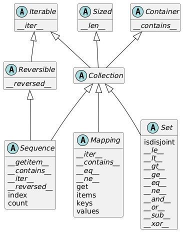

# Chap 1：数据结构

## Python 数据模型

**Python 数据模型**是 Python 语言的 API，确立序列、函数、迭代器、协程、类、上下文管理器等部分的行为，而这些行为则依靠**特殊方法**（又称“魔术方法”）实现。

- 特殊方法的名称前后两端都有双下划线，比如 `__getitem__`、`__len__`等
- 自定义对象发生以下行为时都会用到特殊方法：
    - 容器
    - 属性存取
    - 迭代（包括使用 `async` 的异步迭代）
    - 运算符重载
    - 函数和方法调用
    - 字符串表示形式和格式化
    - 使用 `await` 的一步变成
    - 对象创建和解构
    - 使用 `with` 和 `async with` 语句管理上下文

- 数据模型 & 特殊方法的好处：
    - 不需要记住标准操作的方法名称（获取项数可以直接用 `len()`，而不用什么 `.size()`、`.length()` 之类的）
    - 可以充分利用 Python 标准库，无须重新造轮子

- 一般情况下，特殊方法供 Python 解释器调用，而非用户
    - 因此在编写代码一般不会直接调用特殊方法（唯一的例外是 `__init__` 方法），而是调用对应的内置函数，这些函数通常速度更快，且提供额外服务
    - 对于内置类型，Python 解释器有时可以直接读取其C语言底层实现中的结构体字段，而无需调用方法（一种 shortcut）（比如 `len(my_object)` 会直接读取 `ob_size` 字段的值（当 `my_object` 是某个内置类型的实例时））
    
- 很多时候，特殊方法是隐式调用的（比如 `for i in x:` 语句会间接调用 `x.__iter__()`（如果有）或 `x.__getitem__()` 方法）
- 特殊方法的核心用途：
    - **模拟数值类型**：`+` -> `__add__`，`*` -> `__mul__`，...
        - 运算符重载
    - **对象的字符串表示形式**：
        - `repr()` -> `__repr__`：获取对象的字符串表现形式
            - 若自定义类 `myClass` 未定义该方法，该类下的实例在控制台上只能以类似 `<myClass object at 0x12345678>` 的形式呈现
            - 在表达式求值结果上调用 `repr` 函数的效果类似格式化字符串（`%` 运算符或 `str.format` 方法）
            - 自己实现 `__repr__` 方法时，建议在 f 字符串中使用 `!r`，以标准的表示形式显示变量类型
            - `__repr__` 方法返回的字符串应当没有歧义，最好与源码保持一致，方便重新创建所表示的对象
        - `str()` -> `__str__`：返回对终端用户友好的字符串
    - **对象的布尔值**：`bool()` -> `__bool__`（`True` or `False`）
        - 如果没有实现 `__bool__` 方法，则会尝试调用 `__len__`，若其值为0，则返回 `False`，否则返回 `True`
        - 一般也不会直接调用 `bool()`，因为任何对象都可以直接在布尔值上下文中使用
    - **容器 API**
        - 基本容器类型的 [UML 类图](https://zh.wikipedia.org/wiki/%E9%A1%9E%E5%88%A5%E5%9C%96)，介绍了 Python 中最重要的容器接口

        <div style="text-align: center">
            
        </div>

        - 图中所有的类都是**抽象基类**（后面会详细讨论的），斜体方法都是抽象方法（带“抽象”的不能直接创建实例或直接使用，只能通过子类继承间接使用）
        - 抽象基类 `Collection` 统一顶层的3个基本接口，每个容器类型均应实现：
            - `Iterable`：支持 `for`、拆包和其他迭代方式
            - `Sized`：支持内置函数 `len`
            - `Container`：支持 `in` 运算符

            Python 不强制要求具体类继承这些抽象基类中的任何一个

        - `Collection` 有3个重要的专用接口：
            - `Sequence`：规范 `list` 和 `str` 等内置类型的接口
            - `Mapping`：被 `dict`、`collection.defaultdict` 等实现
            - `Set`：是 `size` 和 `frozenset` 两个内置类型的接口
                - 它的所有特殊方法实现的都是中缀运算符

- 特殊方法汇总（超半数以上的特殊方法用于实现各类运算符）：
    - 表1：特殊方法名称（不含运算符）

    |分类|方法名称|
    |:-|:-|
    |字符串（字节）表示形式|`__repr__` `__str__` `__format__` `__bytes__` `__fspath__`|
    |转化为数值|`__bool__` `__complex__` `__int__` `__float__` `__hash__` `__index__`|
    |模拟容器|`__len__` `__getitem__` `__setitem__` `__delitem__` `__contains__`|
    |迭代|`__iter__` `__aiter__` `__next__` `__anext__` `__reversed__`|
    |可调用对象或执行协程|`__call__` `__await__`|
    |上下文管理|`__enter__` `__exit__` `__aexit__` `__aenter__`|
    |构造和解构实例|`__new__` `__init__` `__del__`|
    |属性管理|`__getattr__` `__getattribute__` `__setattr__` `__delattr__` `__dir__`|
    |属性描述符|`__get__` `__set__` `__delete__` `__set_name__`|
    |抽象基类|`__instancecheck__` `__subclasscheck__`|
    |类元编程|`__prepare__` `__init_subclass__` `__class_getitem__` `__mro_entries__`|

    - 表2：运算符的符号和背后的特殊方法

    |运算符分类|符号|方法名称|
    |:-|:-|:-|
    |一元数值运算符|`-` `+` `abs()`|`__neg__` `__pos__` `__abs__`|
    |各种比较运算符|`<` `<=` `==` `!=` `>` `>=`|`__lt__` `__le__` `__eq__` `__ne__` `__gt__` `__ge__`|
    |算术运算符|`+` `-` `*` `/` `//` `%` `@` `divmod()` `round()` `**` `pow()`|`__add__` `__sub__` `__mul__` `__truediv__` `__floordiv__` `__mod__` `__matmul__` `__divmod__` `__round__` `__pow__`|
    |反向算术运算符|（交换算术运算符的操作数）|`__radd__` `__rsub__` `__rmul__` `__rtruediv__` `__rfloordiv__` `__rmod__` `__rmatmul__` `__rdivmod__` `__rpow__`|
    |增量赋值算术运算符|`+=` `-=` `*=` `/=` `//=` `%=` `@=` `**=`|`__iadd__` `__isub__` `__imul__` `__itruediv__` `__ifloordiv__` `__imod__` `__imatmul__` `__ipow__`|
    |按位运算符|`&` `|` `^` `<<` `>>` `~`|`__and__` `__or__` `__xor__` `__lshift__` `__rshift__` `__invert__`|
    |反向按位运算符|（交换按位运算符的操作数）|`__rand__` `__ror__` `__rxor__` `__rlshift__` `__rrshift__`|
    |增量赋值按位运算符|`&=` `|=` `^=` `<<=` `>>=`|`__iand__` `__ior__` `__ixor__` `__ilshift__` `__irshift__`|


## 序列

序列可分为容器序列和扁平序列。

- **容器序列**：可存放不同类型的项，其中包括嵌套容器，比如 `list`、`tuple`、`collections.deque`
    - 序列内实际存放的是所包含对象的**引用**，也就是说序列内的每一项都是引用，不是实际值
    - 任何 Python 对象在内存中都有一个包含元数据的标头，比如 `float` 的内存标头有一个值字段 `ob_fval`（双精度）和两个元数据字段 `ob_refcnt`（对象的引用计数）和 `ob_type`（指向对象类型的指针）
- **扁平序列**：可存放同种简单类型的项，比如 `str`、`bytes`、`array.array`
    - 序列存放的是原始机器值，比如字节、整数、浮点数等，更为紧凑

???+ example "例子"

    <figure style=" width: 70%" markdown="span">
        
        
        <figcaption></figcaption>
    </figure>

序列还可以按可变性分类，分为：

- **可变序列**：`list`、`bytearray`、`array.array`、`collection.deque`
    - 可变序列继承不可变序列的所有方法，并实现了更多方法
- **不可变序列**：`tuple`、`str`、`bytes`

内置的具体序列类型不是 `Sequence` 和 `MutableSequence` 抽象基类的子类，而是一种**虚拟子类**(virtual subclass)（通过注册将一个类声明为另一个类的子类，而无需直接继承）。

### 列表推导式和生成器表达式

**列表推导式**是构建列表的常用技巧，它的形式大致如下所示：

```py hl_lines="2"
>>> symbols = "$¢£¥€¤"
>>> codes = [ord(symbol) for symbol in symbols if ord(s) > 127]
>>> codes
[162, 163, 165, 8364, 164]
```

- 列表推导式应保持简短，若超过两行，最好将语句拆开，或者用 `for` 循环重写
    - Python 会忽略 `[]`、`{}` 和 `()` 内部的换行，因此列表、列表推导式、元组、字典等结构可以分为多行书写，无需使用续行转义符 `\`；并且最后一项后面的逗号将会被忽略（对于**元组**，建议加上这个逗号；对于只有一个项的元组则必须加上逗号，否则就不是元组了）
- 局部作用域（也适用于生成器表达式）：
    - 列表推导式的 `for` 子句中赋值的变量在局部作用域内，也就是说列表外就无法使用该变量了
    - 但使用 `:=` 赋值的变量在列表推导式返回后依然可以访问，它的作用域限定在函数内
- 使用 `map` 和 `filter` 两个函数可以实现相同效果，但是会更复杂，且速度并不比列表推导式快。对于上例，等价形式为：

    ```py
    codes = list(filter(lambda c: c > 127, map(ord, symbols)))
    ```
- 将列表推导式用于多个可迭代对象，可以生成**笛卡尔积**（每一项都是由可迭代对象中的项构成的元组，列表长度为各个可迭代对象长度的乘积）

    ??? example "例子"

        ```py
        # 列表推导式
        >>> colors = ['black', 'white']
        >>> sizes = ['S', 'M', 'L']
        >>> tshirts = [(color, size) for color in colors for size in sizes]
        >>> tshirts
        [('black', 'S'), ('black', 'M'), ('black', 'L'), ('white', 'S'), ('white', 'M'), ('white', 'L')]

        # 等价的双重 for 循环（注意循环顺序）
        >>> for color in colors:
        ...     for size in sizes:
        ...         print((color, size))
        ... 
        ('black', 'S')
        ('black', 'M')
        ('black', 'L')
        ('white', 'S')
        ('white', 'M')
        ('white', 'L')
        ```

---
**生成器表达式**在形式上与列表推导式的唯一差别是将方括号改为圆括号，但它相比列表推导式占用内存空间更少，因为它不会直接构造整个列表，而是逐个生成项。

- 如果生成器表达式是函数唯一的参数，则无需额外的圆括号括起来

??? example "接着上面“笛卡尔积”的例子"

    ```py
    >>> colors = ['black', 'white']
    >>> sizes = ['S', 'M', 'L']
    >>> for tshirt in (f'{c} {s}' for c in colors for s in sizes):
    ...     print(tshirt)
    ... 
    black S
    black M
    black L
    white S
    white M
    white L
    ```

### 元组

**元组**(tuple)的两大用途：

- 没有字段名称的记录
    - 元组的项数固定，且<u>假定</u>顺序固定（否则会破坏元组中字段的含义）
    - **拆包**(unpacking)是常用的操作，用于获取元组中单独的每一项，我们可以将不感兴趣的项赋给虚拟变量 `_`

    ??? example "例子"

        ```py
        # 以下三行都将元组作为记录
        >>> lax_coordinates = (33.9425, -118.408056)
        >>> city, year, pop, chg, area = ('Tokyo', 2003, 32_450, 0.66, 8014)  # 拆包
        >>> traveler_ids = [('USA', '31195855'), ('BRA', 'CE342567'), ('ESP', 'XDA305856')]  # 元组列表
        >>> for passport in sorted(traveler_ids):
        ...     print('%s/%s' % passport)
        ...     
        BRA/CE342567
        ESP/XDA305856
        USA/31195855
        >>> for country, _ in traveler_ids:
        ...     print(country)
        ...     
        USA
        BRA
        ESP
        ```

- 不可变列表
    - 好处：意图清晰（长度固定）、性能优越（相比列表占用内存少）
    - 注意，虽然元组中的引用不可改动，但是如果引用的是可变对象，改动对象后，元组的值也会随之变化。这种存放可变项的元组是不可哈希的，因而这类数组不能作为字典的键或集合的元素

        ??? example "例子"

            ```py
            >>> a = (10, 'alpha', [1, 2])
            >>> b = (10, 'alpha', [1, 2])
            >>> a == b
            True
            >>> b[-1].append(99)
            >>> a == b
            False
            >>> b
            (10, 'alpha', [1, 2, 99])
            ```

    - 利用内置函数 `hash` 判断一个元组的值是否固定（下列代码也适用于其他对象）

        ```py
        >>> def fixed(o):
        ...     try:
        ...         hash(o)
        ...     except TypeError:
        ...         return False
        ...     return True
        ... 
        >>> tf = (10, 'alpha', (1, 2))
        >>> tm = (10, 'alpha', [1, 2])
        >>> fixed(tf)
        True
        >>> fixed(tm)
        False
        ```

???+ abstract "元组相比列表的优势"

    |元组|列表|
    |:-|:-|
    |求解元组字面量时，只需一次操作即可生成对应的字节码|求解列表字面量时，字节码将每个元素当作独立的变量推入数据栈，然后构建列表|
    |给定元组`t`，`tuple(t)`直接返回`t`的引用|给定列表`l`，`list(l)`创建`l`的副本|
    |元组实例长度固定，分配的内存空间正好够用|列表实例内存空间会留的更多，应对随时追加的元素|
    |元组中项的引用存储在元组结构体的一个数组内|列表将引用数组的指针存在其他地方，因为列表可以变长；若超出当前分配空间，Python 就要重新分配引用数组来腾出空间，从而导致 CPU 缓存效率低下|

??? abstract "列表与元组方法比较"

    |方法|列表|元组|说明|
    |:-|:-|:-|:-|
    |`s.__add__(s2)`|●|●|`s + s2`：拼接|
    |`s.__iadd__(s2)`|●||`s += s2`：就地拼接|
    |`s.append(e)`|●||在最后一个元素后追加一个元素|
    |`s.clear()`|●||删除所有项|
    |`s.__contains__(e)`|●|●|`e in s`|
    |`s.copy()`|●||浅拷贝列表|
    |`s.count(e)`|●|●|计算元素出现的次数|
    |`s.__delitem__(p)`|●||删除位置 `p` 上的项|
    |`s.extend(it)`|●||追加可迭代对象 `it` 中的项|
    |`s.__getitem__(p)`|●|●|`s[p]`：获取指定位置上的项|
    |`s.__getnewargs__()`||●|支持使用 `pickle` 优化序列化|
    |`s.index(e)`|●|●|找出 `e` 首次出现的位置|
    |`s.insert(p, e)`|●||在位置 `p` 上的项之前插入元素 `e`|
    |`s.__iter__()`|●|●|获取迭代器|
    |`s.__len__()`|●|●|`len(s)`：项数|
    |`s.__mul__()`|●|●|`s * n`：重复拼接|
    |`s.__imul__()`|●||`s *= n`：就地重复拼接|
    |`s.__rmul__()`|●|●|`n * s`：反向重复拼接|
    |`s.pop([p])`|●||移除并返回最后一项或可选的位置 `p` 上的项|
    |`s.remove(e)`|●||把 `e` 的值从首次出现的位置上移除|
    |`s.reverse()`|●||就地翻转项的顺序|
    |`s.__reversed__()`|●||获取逆序的迭代器|
    |`s.__setitem__(p, e)`|●||`s[p] = e`：把 `e` 放在位置 `p` 上，覆盖现有的项|
    |`s.sort([key], [reverse])`|●||就地排序，`key` 和 `reverse` 是可选的关键字参数|


### 拆包

**拆包**(unpacking)：获取序列中单独的项

- **并行赋值**(parallel assignment)：把可迭代对象中的项赋给变量元组，形如：

    ```py
    >>> lax_coordinates = (33.9435, -118.408056)
    >>> lattitude, longitude = lax_coordinates
    >>> lattitude
    33.9435
    >>> longitude
    -118.408056
    ```

    - 利用拆包可以轻松交换两个变量的值：`a, b = b, a`
    - 也可以利用拆包接收函数的多个返回值

- `*` 号的两种用法
    - 在变量前加上前缀`*`，该变量便可以捕获余下任意数量的参数，常用于并行赋值
        - 但是 `*` 前缀同时只能用于一个变量，但可以是任意位置上的变量

        ??? example "例子"

            ```py
            >>> a, b, *rest = range(5)
            >>> a, b, rest
            (0, 1, [2, 3, 4])
            >>> a, *rest, b = range(5)
            >>> a, rest, b
            (0, [1, 2, 3], 4)
            ```

    - 在函数的参数/列表、元组或集合字面量上使用前缀 `*`，可以对其进行拆包
        - 可以多次使用 `*`

        ??? example "例子"

            ```py
            # 函数参数
            >>> def fun(a, b, c, d, *rest):
            ...     return  a, b, c, d, rest
            ... 
            >>> fun(*[1, 2], 3, *range(4, 7))
            (1, 2, 3, 4, (5, 6))

            # 序列字面量
            >>> *range(4), 4
            (0, 1, 2, 3, 4)
            >>> [*range(4), 4]
            [0, 1, 2, 3, 4]
            >>> {*range(4), 4, *(5, 6, 7)}
            {0, 1, 2, 3, 4, 5, 6, 7}
            ```

- 拆包的对象可以嵌套，若嵌套结构能够对应起来，那么 Python 就可以正确处理了

    ```py
    >>> name, _, _, (lan, lon) = ('Tokyo', 'JP', 36.933, (35.69, 139.69))
    >>> name, lan, lon
    ('Tokyo', 35.69, 139.69)
    ```

### 模式匹配

**模式匹配**是 Python 3.10 新增的功能，它由 `match/case` 语句实现，类似 C 语言的 `switch/case`，但是更为强大。

???+ example "例子"

    ```py hl_lines="12-14"
    metro_areas = [
        ('Tokyo', 'JP', 36.933, (35.689722, 139.691667)),
        ('Delhi NCR', 'IN', 21.935, (28.613889, 77.208889)),
        ('Mexico City', 'MX', 20.142, (19.433333, -99.133333)),
        ('New York-newark', 'US', 20.104, (40.808611, -74.020386)),
        ('Sao Paulo', 'BR', 19.649, (-23.547778, -46.635833)),
    ]

    def main():
        print(f'{"":15} | {"lattitude":>9} | {"longitude":>9}')
        for record in metro_areas:
            match record:
                case [name, _, _, (lat, lon)] if lon <= 0:
                    print(f'{name:15} | {lat:9.4f} | {lon:9.4f}')

    if __name__ == '__main__':
        main()
    ```

- `match` 关键字后面的表达式称为**匹配对象**(subject)（一般为序列，包括 `list`、`tuple`、`memoryview`、`range`、`array.array` 和 `collections.deque`）
- 匹配对象会与依次尝试与 `case` 子句中的**模式**（一般为序列）匹配，若匹配得上，则执行子句内的语句，随后退出；若不匹配，则继续尝试匹配下一个 `case` 子句，直到最后一个
    - 可以在最后设置这样的 `case` 子句：`case _:`，用于处理默认或异常情况（类似 C 语言的 `default` 子句），这是一个不错的习惯
    - 还可以为 `case` 子句设置可选的，由 `if` 关键字指定的**卫语句**(guard clause)，用于设置额外的匹配条件（比如上例中的 `if lon <= 0`
    - 序列模式可以是元组或列表，或任意形式的嵌套元组或列表，因为序列模式中圆括号和方括号无区别
    - 但在 `match/case` 上下文中， `str`、`bytes` 和 `bytearray` 实例不作为序列处理，而被视为“原子值”，以避免意想不到的 bug
    - 模式中的 `_` 可用于匹配相应位置的任意一项，但不绑定匹配值；此外 `_` 是唯一可在模式中出现多次的变量
        - `*_` 匹配任意数量的项，且不绑定匹配值；而 `*extra` 则将匹配值绑定到变量 `extra` 上
        - 在序列模式中，一个序列只能有一个 `*`，嵌套的序列也遵从这个规则
    - 模式中的任一部分均可使用 `as` 关键字绑定到变量上（比如 `case [name, _, _, (lat, lon) as coord]:`，此时 `coord == (lat, lon)`）
    - 还可以为模式的每项添加类型信息——借用了构造函数调用的语法，但在模式上下文中仅用于检查类型（比如 `case [str(name), _, _, (float(lat), float(lon))]:`）


### 切片

- 切片和区间（`range`）不包括最后一项的原因
    - 容易判断切片或区间的长度，比如 `range(3)` 和 `my_list[:3]` 都只有3项
    - 方便在索引 `x` 处将序列拆成不重叠的两部分，比如 `my_list[:x]` 和 `my_list[x:]`
- 切片可以指定步长（`s[a:b:c]` 中的 `c`），可正可负（负数表示逆向）
- 实际上，切片的索引是一个**切片对象**（在 `s[a:b:c]` 中切片对象为 `slice(a, b, c)`）
    - 可以为切片对象命名，提升代码可读性

    ??? example "例子"

        ```py
        invoice = """
        0.....6.................................40...........52...55........
        1909  Pimoroni PiBrella                     $17.50       3    $52.50
        1489  6mm Tactile Switch x20                 $4.95       2    $9.90
        1510  Panavise Jr. - PV-201                 $28.00       1    $28.00
        1601  PiTFT Mini Kit 320x240                $34.95       1    $34.95
        """
        SKU = slice(0, 6)
        DESCRIPTION = slice(6, 40)
        UNIT_PRICE = slice(40, 52)
        QUANTITY = slice(52, 55)
        ITEM_TOTAL = slice(55, None)
        line_items = invoice.split('\n')[2:]
        for item in line_items:
            print(item[UNIT_PRICE], item[DESCRIPTION])
        ```

    - 切片类型除了有 `start`、`stop`、`step` 属性外，还有 `indices` 属性，它的用法为：`#!py s.indices(len) -> (start, stop, stride)` —— 给定长度为 `len` 的序列，计算 `s` 表示的扩展切片的起始索引(start)和结尾索引(stop)，以及步幅(stride)，超出边界的索引会被裁掉，就像常规切片一样。

- `[]` 内可接受多个索引或切片，以逗号分隔，相关的特殊方法 `__getitem__` 和 `__setitem__` 会将这多个索引或切片看作一个元组
    - 在 Numpy 中，`numpy.ndarray` 表示的二维数组可用 `a[i, j]` 获取数组元素，还可用 `a[m:n, k:l]` 获取二维切片
    - 但除了 `memoryview` 外，Python 内置序列类型都是一维的，因此仅支持一个索引或切片，不支持索引或切片元组
    - **省略号**（`...`，三个句点，`ellipsis` 类中 `Ellipsis` 对象的别名）也可作为索引、切片或函数参数
        - 在 Numpy 中，省略号常作为快捷句法，比如在多维切片中，对于四维数组 `x`，`x[i, ...] == x[i, :, :, :,]`

- 使用切片更改可变序列的部分项
    - 若赋值目标为一个切片，则右边必须是一个可迭代对象

??? example "例子"

    ```py
    >>> l = list(range(10))
    >>> l
    [0, 1, 2, 3, 4, 5, 6, 7, 8, 9]
    >>> l[2:5] = [20, 30]
    >>> del l[5:7]
    >>> l
    [0, 1, 20, 30, 5, 8, 9]
    >>> l[3::2] = [11, 22]
    >>> l
    [0, 1, 20, 11, 5, 22, 9]
    >>> l[2:5] = 100
    Traceback (most recent call last):
    File "<python-input-67>", line 1, in <module>
        l[2:5] = 100
        ~^^^^^
    TypeError: must assign iterable to extended slice
    >>> l[2:5] = [100]
    >>> l
    [0, 1, 100, 22, 9]
    ```


### 拼接

拼接用到的运算符是 `+` 和 `*`，功能为：

- `+`：拼接两个同类型序列，且都不可修改，拼接结果为同类型的新序列
- `*`：序列 * 整数 -> 多次拼接同一个序列，结果为一个新创建的序列
    - 若序列内包含可变项，则乘法操作后会得到多个指向同一可变项的引用，而非独立的副本

    ??? example "例子"

        ```py
        >>> weird_board = [['_'] * 3] * 3  # 实际上这是一种浅拷贝
        >>> weird_board
        [['_', '_', '_'], ['_', '_', '_'], ['_', '_', '_']]
        >>> weird_board[1][2] = 'O'
        >>> weird_board
        [['_', '_', 'O'], ['_', '_', 'O'], ['_', '_', 'O']]

        # 等价操作为：
        >>> row = ['_'] * 3
        >>> board = []
        >>> for i in range(3):
        ...     board.append(row)
        ```

        如果想要得到独立的可变项副本，则需要用到列表推导式或生成器表达式

        ```py
        >>> board = [['_'] * 3 for i in range(3)]
        >>> board
        [['_', '_', '_'], ['_', '_', '_'], ['_', '_', '_']]
        >>> board[1][2] = 'X'
        >>> board
        [['_', '_', '_'], ['_', '_', 'X'], ['_', '_', '_']]
        ```

这两种操作均不会修改操作数本身。但若想通过拼接就地修改序列，则使用这些运算符对应的增量赋值形式 `+=` 和 `*=`

- 用于可变序列时，仅在原可变序列的基础上增添新项；而用于不可变序列（除字符串外）时，则会重新创建一个新序列，因此效率较低

??? question "一个关于 `+=` 运算符的谜题"

    === "问题"

        ```py
        >>> t = (1, 2, [30, 40])
        >>> t[2] += [50, 60]
        ```

        上述代码的结果如何？

    === "答案"

        ```py
        >>> t = (1, 2, [30, 40])
        >>> t[2] += [50, 60]
        Traceback (most recent call last):
        File "<python-input-102>", line 1, in <module>
            t[2] += [50, 60]
            ~^^^
        TypeError: 'tuple' object does not support item assignment
        >>> t
        (1, 2, [30, 40, 50, 60])
        ```


### 排序

与排序相关的方法或函数：

- `list.sort` 方法：就地排序列表，不创建副本，返回值为 `None`
    - 使用这种返回值的好处是让用户知道接收者已被更改，没有创建新对象；坏处是这使得该方法不能级联调用
- `sorted()` 函数：返回新创建的排好序的列表，且可接收任何可迭代对象作为参数，但不会改变原可迭代对象的内容

它们均接受两个可选的关键词参数：

- `reverse`：值为 `True` 时按降序排序，默认值为 `False`
- `key`：一个单参数的函数，作用于每个项，作为排序依据，默认值是恒等函数（即比较项本身）。比如 `key=str.lower` 执行不区分大小写的排序，而 `key=len` 按字符长度为字符串排序
    - 使用 `key` 参数后，即使列表内的项类型不同，也可以参与排序
    - 这个参数类似 C 语言 `qsort()` 中的比较函数（接受双参数），但是 `key` 参数效率更高，因为它指定的函数仅为每一项调用一次（时间复杂度 $O(N)$），而双参数比较函数则要在每次比较时调用一次（时间复杂度 $O(N^2)$）

Python 主要使用的排序算法是 [Timsort](https://en.wikipedia.org/wiki/Timsort)，这是一种自适应算法，可根据数据的排序方式在插入排序和归并排序之间切换。


### 其他序列

#### 数组

若列表中只包含同种类型的数值，那么使用数组类型 `array.array` 会更加高效。

>虽然常说列表可以存放各种类型的项，但是这么做往往是没有意义的，因为包含不同类型项的列表无法使用某些方法或函数，比如没法排序。

- 除了支持所有可变序列的操作外，还有快速加载项和保存项的方法
- 数组存放的不是完整的数值类型实例，而是相应机器值的压缩字节
- 创建 `array` 对象时需提供类型代码，用单个字母表示，比如：
    - `b`：8位符号整数（对应 C 语言的 `signed char`，范围为 -128~127）
    - `h`：16位符号整数
    - `d`：双精度浮点数

- 访问（读/写）用 `array` 方法创建的二进制文件比存储相同内容的文本文件的速度快得多，且存储空间更小


??? abstract "`list` 和 `array` 的方法及属性比较"

    |方法或属性|`list`|`array`|说明|
    |:-|:-|:-|:-|
    |`s.__add__(s2)`|●|●|`s + s2`：拼接|
    |`s.__iadd__(s2)`|●|●|`s += s2`：就地拼接|
    |`s.append(e)`|●|●|在末尾追加元素|
    |`s.byteswap()`||●|交换数组中所有项的字节，转换字节序|
    |`s.clear()`|●||删除所有项|
    |`s.__contains__()`|●|●|`e in s`|
    |`s.copy()`|●||浅拷贝列表|
    |`s.__copy__()`||●|为 `copy.copy` 提供支持|
    |`s.count(e)`|●|●|计算元素出现次数|
    |`s.__deepcopy__()`||●|为优化 `copy.deepcopy` 提供支持|
    |`s.__delitem__(p)`|●|●|删除位置 `p` 上的项|
    |`s.extend(it)`|●|●|追加可迭代对象 `it` 中的项|
    |`s.frombytes(b)`||●|追加字节序列中的项（解释为压缩机器值）|
    |`s.fromfile(f, n)`||●|追加二进制文件 `f` 中的 `n` 项（解释为压缩机器值）|
    |`s.fromlist(l)`||●|追加列表中的项；一旦抛出 `TypeError`，一项也不追加|
    |`s.__getitem__(p)`|●|●|`s[p]`：获取指定位置上的项或切片|
    |`s.index(e)`|●|●|查找 `e` 首次出现的位置|
    |`s.insert(p, e)`|●|●|在 `p` 位置上的项之前插入元素 `e`|
    |`s.itemsize`||●|数组中每一项的字节长度|
    |`s.__iter__()`|●|●|获取迭代器|
    |`s.__len__()`|●|●|`len(s)`：项数|
    |`s.__mul__()`|●|●|`s * n`：重复拼接|
    |`s.__imul__()`|●|●|`s *= n`：就地重复拼接|
    |`s.__rmul__()`|●|●|`n * s`：反向重复拼接|
    |`s.pop([p])`|●|●|删除并返回位置 `p` 上的项（默认为最后一项）|
    |`s.remove(e)`|●|●|把 `e` 的值从首次出现的位置上删除|
    |`s.reverse()`|●|●|就地翻转项的顺序|
    |`s.__reversed__()`|●||获取从后向前遍历项的迭代器|
    |`s.__setitem__(p, e)`|●|●|`s[p] = e`：把 `e` 放在位置 `p` 上，覆盖现有的项或切片|
    |`s.sort([key], [reverse])`|●||就地对项排序，`key` 和 `reverse` 是可选的关键字参数|
    |`s.tobytes()`||●|返回项的压缩机器值，结果为一个 `bytes` 对象|
    |`s.tofile(f)`||●|把项的压缩机器值存入二进制文件 `f`|
    |`s.tolist()`||●|返回项的数值对象，结果为一个 `list` 对象|
    |`s.typecode`||●|单字符字符串，即项的 C 语言类型|


#### memoryview

`memoryview` 是一种共享内存的序列类型，可以在不复制字节的情况下处理数组切片。

- `memory.cast` 方法用于改变读写多字节单元的方式，无需移动位，返回值为另一个 `memoryview` 对象，但始终共享内存

??? example "例子"

    === "例1"

        ```py
        >>> from array import array
        >>> octets = array('B', range(6))    # 创建一个 6 字节的数组
        >>> m1 = memoryview(octets)
        >>> m1.tolist()
        [0, 1, 2, 3, 4, 5]
        >>> m2 = m1.cast('B', [2, 3])        # 2 行 3 列
        >>> m2.tolist()
        [[0, 1, 2], [3, 4, 5]]
        >>> m3 = m1.cast('B', [3, 2])        # 3 行 2 列
        >>> m3.tolist()
        [[0, 1], [2, 3], [4, 5]]
        >>> m2[1, 1] = 22
        >>> m3[1, 1] = 33
        >>> octets
        array('B', [0, 1, 2, 33, 22, 5])     # 证明 octets, m1, m2, m3 之间的内存是共享的
        ```

    === "例2"

        ```py
        # 修改一个 16 位整数数组中某一项的字节，从而改变该项的值
        >>> import array
        >>> numbers = array.array('h', [-2, -1, 0, 1, 2])
        >>> memv = memoryview(numbers)
        >>> len(memv)
        5
        >>> memv[0]
        -2
        >>> memv_oct = memv.cast('B')
        >>> memv_oct.tolist()
        [254, 255, 255, 255, 0, 0, 1, 0, 2, 0]    # 补码 + 小端序
        >>> memv_oct[5] = 4
        >>> numbers
        array('h', [-2, -1, 1024, 1, 2])
        ```

#### Numpy

[NumPy](https://numpy.org/) 是 Python 的核心科学计算库，提供高效的多维数组对象和工具，支持大规模数据操作、数学计算及线性代数等，广泛应用于数据分析、机器学习等领域。

这里仅稍微提一下 Numpy，更具体的用法可参考[官方文档](https://numpy.org/doc/stable/)。

- `numpy.arrange(n)`：创建一个包含0~n-1（整数）的 `numpy.ndarray` 对象
- `.shape`：查看数组维度
- `.shape = a, b`：改变数组维度
- `.transpose()`：转置数组（行列交换）
- `numpy.loadtxt(filename)`：从文本文件加载数据
- `numpy.save(filename)`：将数组保存到 .npy 二进制文件中（无需指出后缀名）
- `numpy.load(filename, method)`：以 `method` 方法（比如 `r+`）从 .npy 二进制文件中读取数组


#### 双端队列和其他队列

`collections.deque` 实现一种线程安全的双端队列，旨在快速在两端插入和删除项（但删除中间项的速度不快）。

- 用 `deque()` 构造函数创建双端队列时，可以用可选（且只读）的 `maxlen` 参数设定 `deque` 实例的最大长度。当队列填满时，从一端插入项，就会从另一端丢弃相等数量的项

??? abstract "`list` 和 `deque` 方法比较"

    |方法|列表|元组|说明|
    |:-|:-|:-|:-|
    |`s.__add__(s2)`|●||`s + s2`：拼接|
    |`s.__iadd__(s2)`|●|●|`s += s2`：就地拼接|
    |`s.append(e)`|●|●|在右端（最后）追加一个元素|
    |`s.appendleft(e)`||●|在左端（开头）追加一个元素|
    |`s.clear()`|●|●|删除所有项|
    |`s.__contains__(e)`|●||`e in s`|
    |`s.copy()`|●||浅拷贝列表|
    |`s.__copy__()`||●|为 `copy.copy`（浅拷贝）提供支持|
    |`s.count(e)`|●|●|计算元素出现的次数|
    |`s.__delitem__(p)`|●|●|删除位置 `p` 上的项|
    |`s.extend(i)`|●|●|把可迭代对象 `i` 中的项追加到右端|
    |`s.extendleft(i)`||●|把可迭代对象 `i` 中的项追加到左端|
    |`s.__getitem__(p)`|●|●|`s[p]`：获取指定位置上的项或切片|
    |`s.index(e)`|●||找出 `e` 首次出现的位置|
    |`s.insert(p, e)`|●||在位置 `p` 上的项之前插入元素 `e`|
    |`s.__iter__()`|●|●|获取迭代器|
    |`s.__len__()`|●|●|`len(s)`：项数|
    |`s.__mul__()`|●||`s * n`：重复拼接|
    |`s.__imul__()`|●||`s *= n`：就地重复拼接|
    |`s.__rmul__()`|●||`n * s`：反向重复拼接|
    |`s.pop([p])`|●|●|移除并返回最后一项或可选的位置 `p` 上的项|
    |`s.popleft()`||●|移除并返回第一项|
    |`s.remove(e)`|●|●|把 `e` 的值从首次出现的位置上移除|
    |`s.reverse()`|●|●|就地翻转项的顺序|
    |`s.__reversed__()`|●|●|获取逆序的迭代器|
    |`s.rotate(n)`||●|把 `n` 项从一端移到另一端|
    |`s.__setitem__(p, e)`|●|●|`s[p] = e`：把 `e` 放在位置 `p` 上，覆盖现有的项|
    |`s.sort([key], [reverse])`|●||就地排序，`key` 和 `reverse` 是可选的关键字参数|

Python 标准库还提供以下队列实现：

- `queue`：提供几个同步（即线程安全）队列类：`SimpleQueue`、`Queue`、`LifoQueue` 和 `PriorityQueue`
    - 除 `SimpleQueue` 外，其他类都可以通过 `maxsize` 参数（设置正整数）来设置边界
- `multiprocessing`：单独实现 `SimpleQueue` 和 `Queue`，还提供专用的 `JoinableQueue`
- `asyncio`：提供 `Queue`、`LifoQueue`、`PriorityQueue` 和 `JoinableQueue`，但为管理异步编程任务而做了修改
- `heapq`：没有实现任何队列类，仅提供 `heappush` 和 `heappop` 等函数

!!! info "注"

    如果在代码中经常检查容器中是否存在某一项（使用 `in` 操作符），那么应考虑使用 `set` 作为存储容器，因为 Python 为 `set` 成员检查做了优化，速度更快。但注意 `set` 不是序列，因为里面的项是无序的。


## 字典和集合

所有 Python 程序都会用到字典，因为：

- 一些 Python 核心结构在内存中以字典的形式存在，比如类和实例属性、模块命名空间，以及函数的关键字参数
- `__builtin__.__dict__` 存储所有内置类型、对象和类

字典和集合的底层实现均依赖**哈希表**。

### 字典和映射

字典是 Python 最常用的映射类型，所以适用于映射的方法也一定适用于字典。下面介绍的内容不会对字典和映射做出明显区分。

#### 字典推导式

直接看例子：

???+ example "例子"

    ```py hl_lines="13 17-19"
    >>> dial_codes = [
    ...     (880, 'Banladesh'),
    ...     (55, 'Brazil'),
    ...     (86, 'China'),
    ...     (91, 'India'),
    ...     (62, 'Indonesia'),
    ...     (81, 'Japan'),
    ...     (234, 'Nigeria'),
    ...     (92, 'Pakistan'),
    ...     (7, 'Russia'),
    ...     (1, 'United States'),
    ... ]
    >>> country_dial = {country : code for code, country in dial_codes}
    >>> country_dial
    {'Banladesh': 880, 'Brazil': 55, 'China': 86, 'India': 91, 'Indonesia': 62, 'Japan': 81, 'Nigeria': 234, 'Pakistan': 92, 'Russia': 7, 'United States': 1}
    >>> {code : country.upper()
    ...     for country, code in sorted(country_dial.items())
    ...     if code < 70}
    {55: 'BRAZIL', 62: 'INDONESIA', 7: 'RUSSIA', 1: 'UNITED STATES'}
    ```


#### 映射拆包

`**` 前缀用于映射的拆包，可以应用在：

- 函数参数：`**` 可用于多个参数，但要求所有键都是字符串且是唯一的，这类参数可用于捕获没有明确指定名称的关键字参数

    ??? example "例子"

        ```py
        >>> def dump(**kwargs):
        ...     return kwargs
        ...     
        >>> dump(**{'x': 1}, y=2, **{'z': 3})
        {'x': 1, 'y': 2, 'z': 3}
        ```

- `dict` 字面量：也可以多次使用 `**`，且允许键重复（后面的键会覆盖前面同名的键）

??? example "例子"

    ```py
    >>> {'a': 0, **{'x': 1}, 'y': 2, **{'z': 3, 'x': 4}}                                                                                
    {'a': 0, 'x': 4, 'y': 2, 'z': 3}
    ```

#### 合并映射

- `|` 运算符用于合并两个映射，返回合并后的新映射
    - 新映射的类型与左操作数的类型一致，但涉及到用户定义的类型时，也可能与右操作数的类型一致
- `|=` 增量运算符用于就地合并映射

??? example "例子"

    ```py
    >>> d1 = {'a': 1, 'b': 3}
    >>> d2 = {'a': 2, 'b': 4, 'c': 6}
    >>> d1 | d2
    {'a': 2, 'b': 4, 'c': 6}
    >>> d1
    {'a': 1, 'b': 3}
    >>> d1 |= d2
    >>> d1
    {'a': 2, 'b': 4, 'c': 6}
    ```


#### 模式匹配

在“序列”一节介绍的 `match/case` 语句的**匹配对象**也可以是映射，而映射的**模式**看似是 `dict` 字面量，实则能匹配 `collections.abc.Mapping` 的任何具体子类或虚拟子类。

- 不同类型的模式可以组合和嵌套，因为借助**解构**可以处理嵌套的映射和序列等结构化记录（JSON API（除了 `true`、`false` 和 `null` 拼写不同外，JSON 与 Python 完全兼容）、半结构化的数据库等）
- 模式中键的顺序无关紧要（即便匹配对象是一个 `OrderedDict`）
- 不同于序列模式，只要匹配对象中的一部分能够与映射模式完全匹配，那么就视为成功匹配
- 因此没有必要使用 `**extra` 匹配多余的键值对，若需要的话请将 `**extra` 放在模式的末尾；而 `**_` 是无效的
- 虽然通过 `__getitem__` 方法（`d[key]`）在映射中查找键时会始终成功（因为若键不存在则会自动创建），但是在模式匹配中，仅当匹配对象在运行 `match` 语句之前已经含有所需的键

??? example "例子"

    ```py
    def get_creator(record: dict) -> list:
        match record:
            case {'type': 'book', 'api': 2, 'authors': [*names]}:
                return names
            case {'type': 'book', 'api': 1, 'author': name}:
                return [name]
            case {'type': 'book'}:
                raise ValueError(f"Invalid 'book' record: {record!r}")
            case {'type': 'movie', 'director': name}:
                return [name]
            case _:
                raise ValueError(f"Invalid record: {record!r}")
    ```


#### 自动处理缺失的键

有两种方法：

- 用 `defaultdict` 替代普通的 `dict`：若用 `d[k]`（`__getitem__` 方法）找不到键，那么 `collections.defaultdict` 会使用指定的默认值（调用 `default_factory` 生成缺失的值）创建对应的项
- 定义 `dict` 或其他映射类型的子类，实现 `__missing__` 方法（`dict`本身无法直接调用该方法）。但不同映射类型对查找缺失键的行为不一致：
    - `dict` 子类：只有 `d[k]`（`__getitem__` 方法）会调用 `__missing__` 方法
    - `collections.UserDict` 子类：`d[k]` 和 `d.gets(k)` 在查找确实键时会调用 `__missing__` 方法
    - `abc.Mapping` 子类
        - 以最简单的方法实现 `__getitem__` 方法：此时永不触发 `__missing__` 方法
        - 让 `__getitem__` 调用 `__missing__`：`d[k]`、`d.gets(k)` 和 `k in d` 在查找缺失键时会调用 `__missing__` 方法

!!! warning "注意"

    `__missing__` 的实现逻辑容易出错，有时还要以特殊的逻辑实现 `__setitem__`，以免行为不一致或出现意外错误。

??? example "例子"

    ```py
    class StrKeyDict0(dict):

        def __missing__(self, key):
            if isinstance(key, str):
                raise KeyError(key)
            return self[str(key)]
        
        def get(self, key, default=None):
            try:
                return self[key]
            except KeyError:
                return default
        
        def __contains__(self, key):
            return key in self.keys() or str(key) in self.keys()
    ```


#### 其他映射类型

- `collections.OrderedDict`：保留键顺序的字典。但是自 Python 3.6 起，`dict` 也具备保留键顺序的功能，因此该映射类型用途变得不是很大。尽管如此，它与普通的 `dict` 还有以下的一些差异（按日常使用频率排序）：
    - `OrderedList` 的等值检查考虑顺序
    - `OrderedList` 的 `popitem()` 可通过一个可选参数指定移除哪一项
    - `OrderedList` 多了一个 `move_to_end()` 方法，便于把元素的位置移到某一端
    - 从算法上看，`OrderedList` 处理频繁重新排序操作的效果比 `dict` 好，因此更适合用于跟踪近期存取情况（比如用于 LRU 缓存中）
- `collections.ChainMap`：存放一组映射
    - 查找时将这些映射看作一个整体，且根据在构造函数中出现的顺序依次查找，一旦找到指定的键就结束了

        ??? example "例子"

            ```py
            >>> d1 = dict(a=1, b=3)
            >>> d2 = dict(a=2, b=4, c=6)
            >>> from collections import ChainMap
            >>> chain = ChainMap(d1, d2)
            >>> chain['a']
            1
            >>> chain['c']
            6
            ```

    - `ChainMap` 实例里实际上存的是映射的引用，且 `ChainMap` 的更新或插入操作仅影响首个输入映射

        ??? example "例子（书接上回）"

            ```py
            >>> chain['c'] = -1
            >>> d1
            {'a': 1, 'b': 3, 'c': -1}
            >>> d2
            {'a': 2, 'b': 4, 'c': 6}
            ```

    - 应用：实现支持嵌套作用域的语法解释器，按嵌套层级从内到外，一个映射表示一个作用域环境

        ??? example "例子"

            ```py
            import builtins
            pylookup = ChainMap(locals(), globals(), var(builtins))
            ```

- `collections.Counter`：一种对键计数的映射，更新现有的键，计数随之增加
    - 方法：    
        - `.most_common([n])`：返回一个有序元组列表，包括前 `n` 个计数值最大的项及其数量

    ??? example "例子"

        ```py
        >>> import collections
        >>> ct = collections.Counter('abracadabra')
        >>> ct
        Counter({'a': 5, 'b': 2, 'r': 2, 'c': 1, 'd': 1})
        >>> ct.update('aaaaazzz')
        >>> ct
        Counter({'a': 10, 'z': 3, 'b': 2, 'r': 2, 'c': 1, 'd': 1})
        >>> ct.most_common(3)
        [('a', 10), ('z', 3), ('b', 2)]
        ```

    - 应用：统计可哈希对象的实例数量、多重集(multiset)

- `shelve.Shelf`：持久存储字符串键（以 `pickle` 二进制格式序列化的）与 Python 对象（可被 `pickle` 模块序列化）之间的映射
    - `shelve.open` 返回一个 `shelve.Shelf` 实例（一个简单的键值 DBM 数据库，背后是 `dbm` 模块）
    - `shelve.Shelf` 不仅提供映射类型的基本方法，还提供了一些 I/O 管理方法，比如 `sync` 和 `close`
    - `Shelf` 实例是上下文管理器，因此可用 `with` 块确保在使用后关闭

- `collection.UserDict`：用于创建新的映射类型
    - 自定义映射类型时应继承这个映射类型，而不是 `dict`
    - `UserDict` 内部有一个 `dict` 实例，名为 `data`，用于存放具体的值，这样可避免 `__setitem__` 等特殊方法意外递归，还能简化 `__contains__` 的实现

    ??? example "例子"

        ```py
        import collections

        class StrKeyDict(collections.UserDict):

            def __missing__(self, key):
                if isinstance(key, str):
                    raise KeyError(key)
                return self[str(key)]
            
            def __contains__(self, key):
                return key in self.data
            
            def __setitem__(self, key, item):
                self.data[str(key)] = item
        ```

此外，关于映射类型的抽象基类 `MutableMapping` 和 `Mapping` 提供了一些有用的方法：

- `MutableMapping.update`：使用 `self[key] = value` 添加项，最终调用子类实现的 `__setitem__`
- `Mapping.get`


#### 不可变映射

标准库提供的映射类型都是可变的，但有时我们需要防止用户更改映射。`type` 模块提供的包装类 `MappingProxyType` 能将映射包装成一个 `mappingproxy` 实例（原映射的动态代理），此时该映射只能被读取，无法被修改。

??? example "例子"

    ```py
    >>> from types import MappingProxyType
    >>> d = {1: 'A'}
    >>> d_proxy = MappingProxyType(d)
    >>> d_proxy
    mappingproxy({1: 'A'})
    >>> d_proxy[1]
    'A'
    >>> d_proxy[2] = 'x'
    Traceback (most recent call last):
    File "<python-input-24>", line 1, in <module>
        d_proxy[2] = 'x'
        ~~~~~~~^^^
    TypeError: 'mappingproxy' object does not support item assignment
    >>> d[2] = 'B'
    >>> d_proxy
    mappingproxy({1: 'A', 2: 'B'})
    >>> d_proxy[2]
    'B'
    ```


#### 字典视图

`dict` 的实例方法 `.keys()`、`.values()`、`.items()` 分别返回 `dict_keys`、`dict_values` 和 `dict_items` 类的实例，这些方法合称为**字典视图**，是 `dict` 内部实现的数据结构的只读投影（可迭代对象）。

- 不能使用 `[]` 获取视图中的项
- `dict_keys`、`dict_values` 和 `dict_items` 是内部类，不能通过 `__builtins__` 或标准库的任何模块获取，尽管可以得到实例，但在 Python 代码中不能自己手动创建
- `dict_values` 只实现了 `__len__`、`__iter__`、`__reversed__` 3种特殊方法
- 当且仅当 `dict` 中所有制均可哈希时，`dict_items` 视图才可当作集合使用，否则对 `dict_items` 作集合运算将会抛出 `TypeError: unhashable type 'T'`；而 `dict_keys` 视图始终可当做集合使用

??? abstract "其余字典视图的集合运算"

    |方法|`frozenset`|`dict_keys`|`dict_items`|说明|
    |:-|:-|:-|:-|:-|
    |`s.__add__(z)`|●|●|●|`s & z`|
    |`s.__rand__(z)`|●|●|●|反向 `&` 运算符|
    |`s.__contains__()`|●|●|●|`e in s`|
    |`s.copy()`|●|●|●|浅拷贝 `s`|
    |`s.difference(it, ...)`|●|●|●|`s` 和可迭代对象 `it` 的差集|
    |`s.intersection(it, ...)`|●|●|●|`s` 和可迭代对象 `it` 的交集|
    |`s.isdisjoint(z)`|●|●|●|`s` 和 `z` 不相交|
    |`s.issubset(it)`|●|●|●|`s` 和可迭代对象 `it` 的子集|
    |`s.issuperset(it)`|●|●|●|`s` 和可迭代对象 `it` 的超集|
    |`s.__iter__()`|●|●|●|获取遍历 `s` 的迭代器|
    |`s.__len__()`|●|●|●|`len(s)`|
    |`s.__or__()`|●|●|●|`s | z`|
    |`s.__ror__()`|●|●|●|反向 `|` 运算符|
    |`s.__reversed__()`|●|●|●|获取逆序遍历 `s` 的迭代器|
    |`s.__sub__()`|●|●|●|`s - z`|
    |`s.__rsub__()`|●|●|●|反向 `-` 运算符|
    |`s.symmetric_difference(it)`|●|●|●|`s & set(it)` 的补集|
    |`s.union(it, ...)`|●|●|●|`s` 和可迭代对象 `it` 的并集|
    |`s.__xor__()`|●|●|●|`s ^ z`|
    |`s.__rxor__()`|●|●|●|反向 `^` 运算符|


#### 映射类型的标准 API

`collections.UserDict` 类和标准库中所有具体映射类都在实现中封装了基本的 `dict`，而 `dict` 又建立在哈希表之上，因此所有的映射类型的键都是**可哈希的**——哈希码（用 `__hash__()` 方法获取）在整个生命周期中永不改变，且可与其他对象比较（使用 `__eq__()` 方法）。

- 数值类型、不可变的扁平类型（`str`、`bytes`）、不可变且所含对象全是可哈希的容器类型（`frozenset`）均是可哈希的
- 在不同的 Python 版本或设备架构下，同一对象的哈希码也会有所不同，这是因为计算哈希时采用**加盐**（生成随机值）处理的方法

实际使用 `dict` 时需注意：

- 键必须是可哈希的对象
- 通过键访问项的速度非常快（因为哈希）
- Python 3.6 版本以上的 `dict` 会保留项的顺序
- 尽管 `dict` 内存布局紧凑，但仍然会占用大量内存空间（比如要为哈希表留白）
- 为节省内存，不要在 `__init__` 方法

??? abstract "常用映射方法"

    |方法|`dict`|`defaultdict`|`OrderedDict`|说明|
    |:-|:-|:-|:-|:-|
    |`d.clear()`|●|●|●|删除所有项|
    |`d.__contains__()`|●|●|●|`k in d`|
    |`d.copy()`|●|●|●|浅拷贝|
    |`d.__copy__()`||●||为 `copy.copy(d)` 提供支持|
    |`d.default_factory`||●||由 `__missing__` 调用的可调用对象，用于设置缺失的值（属性而非方法）|
    |`d.__delitem__(k)`|●|●|●|`del d[k]`：删除键 `k` 对应的项|
    |`d.fromkeys(it, [initial])`|●|●|●|根据可迭代对象中的键构建一个映射，可选参数 `initial` 指定初始值（默认为 `None`）|
    |`d.get(k, [default])`|●|●|●|获取键 `k` 对应的项，不存在时返回 `default` 或 `None`|
    |`d.__getitem__(k)`|●|●|●|`d[k]`：获取键 `k` 对应的项|
    |`d.items()`|●|●|●|获取项视图，即 `(key, value)` 对|
    |`d.__iter__()`|●|●|●|获取遍历键的迭代器|
    |`d.keys()`|●|●|●|获取键视图|
    |`d.__len__()`|●|●|●|`len(d)`：项数|
    |`d.__missing__()`||●||当 `__getitem__` 找不到相应的键时调用|
    |`d.move_to_end(k, [last])`|||●|把 `k` 移到开头或结尾（`last` 默认为 `True`）|
    |`d.__or__(other)`|●|●|●|`d1 | d2`：合并 `d1` 和 `d2`，新建一个 `dict` 对象|
    |`d.__ior__(other)`|●|●|●|`d1 |= d2`：使用 `d2` 中的项更新 `d1`|
    |`d.pop(k, [default])`|●|●|●|删除并返回 `k` 对应的项，如果没有键 `k`，则返回 `default` 或 `None`|
    |`d.popitem()`|●|●|●|删除并返回（`(key, value)` 的形式）最后插入的项|
    |`d.__reversed__()`|●|●|●|`reversed(d)`：按插入顺序逆向遍历键的迭代器|
    |`d.__ror__(other)`|●|●|●|`other | dd`：反向合并运算符|
    |`d.setdefault(k, [default])`|●|●|●|若 `d` 中有键 `k`，则返回 `d[k]`；否则，把 `d[k]` 设为 `default`，并返回 `default`|
    |`d.__setitem__(k, v)`|●|●|●|`d[k] = v`：把键 `k` 对应的值设为 `v`|
    |`d.update(m, [**kwargs])`|●|●|●|使用映射或可迭代对象中的键值对更新 `d`|
    |`d.values()`|●|●|●|获取值视图|


### 集合

集合是一个不包含重复项的容器，包括 `set` 类型以及不可变形式 `frozenset`。

- 集合元素必须是可哈希的对象，但 `set` 类型本身不可哈希，而 `frozenset` 类型是可哈希的
- 集合类型提供了许多集合运算（并/交/差/对称差...），巧妙使用这些运算可以减少代码量，缩短程序运行时间

    ??? example "例子"

        ```py
        # 统计 needles a在 haystack 中出现的次数
        found = len(needles & haystack)    # 二者均为集合类型

        # 不使用交集运算符
        found = 0
        for n in needles:
            if n in haystack:
                found += 1

        # 支持任何可迭代类型（但有额外开销）
        found = len(set(needles) & set(haystack))

        # 另一种方式
        found = len(set(needles).intersection(haystack))
        ```

- `set` 字面量用 `{}` 括起来；但是空集合没有字面量表示法，必须写作 `set()`。字面量表示法速度快，且可读性强
- `frozenset` 也没有字面量表示法，必须用构造函数创建
- 集合推导式：与列表推导式在形式上的区别就是将方括号改为花括号

    ??? example "例子"

        ```py
        >>> from unicodedata import name     
        # 构造一个元素为 Unicode 名称中带有 'SIGN' 一词的 Latin-1 字符
        >>> {chr(i) for i in range(32, 256) if 'SIGN' in name(chr(i), '')}
        {'>', '#', '±', '§', '¤', '×', '®', '¢', '©', '=', '÷', '£', '°', 'µ', '¬', '%', '$', '+', '¥', '¶', '<'}
        # 不同 Python 进程得到的输出顺序不同
        ```

- 实际使用集合时需注意：
    - 集合元素必须是可哈希的对象
    - 成员测试效率非常高
    - 与字典类似，集合也占用大量内存
    - 集合内不考虑顺序
    - 向集合添加元素后，现有元素的顺序可能会发生改变

- 集合运算
    - 集合数学运算

        ??? abstract "表格"

            |数学符号|Python 运算符|方法|说明|
            |:-|:-|:-|:-|
            |$S \cap Z$|`s & z`|`s.__and__(z)`|`s` 和 `z` 的交集|
            ||`z & s`|`s.__rand__(z)`|反向 `&` 运算符|
            |||`s.itersection(it, ...)`|`s` 和根据可迭代对象 `it` 等构建的集合的交集|
            ||`s &= z`|`s.__iand__(z)`|使用 `s` 和 `z` 的交集更新 `s`|
            |||`s.intersection_update(it, ...)`|使用`s` 和根据可迭代对象 `it` 等构建的集合的交集更新 `s`|
            |$S \cup Z$|`s | z`|`s.__or__(z)`|`s` 和 `z` 的并集|
            ||`z | s`|`s.__ror__(z)`|反向 `|` 运算符|
            |||`s.union(it, ...)`|`s` 和根据可迭代对象 `it` 等构建的集合的并集|
            ||`s |= z`|`s.__ior__(z)`|使用 `s` 和 `z` 的并集更新 `s`|
            |||`s.update(it, ...)`|使用`s` 和根据可迭代对象 `it` 等构建的集合的并集更新 `s`|
            |$S - Z$|`s - z`|`s.__sub__(z)`|`s` 和 `z` 的差集|
            ||`z - s`|`s.__rsub__(z)`|反向 `-` 运算符|
            |||`s.difference(it, ...)`|`s` 和根据可迭代对象 `it` 等构建的集合的差集|
            ||`s -= z`|`s.__isub__(z)`|使用 `s` 和 `z` 的差集更新 `s`|
            |||`s.difference_update(it, ...)`|使用`s` 和根据可迭代对象 `it` 等构建的集合的差集更新 `s`|
            |$S \Delta Z$|`s ^ z`|`s.__xor__(z)`|对称差集（`s & z` 的补集）|
            ||`z ^ s`|`s.__rxor__(z)`|反向 `^` 运算符|
            |||`s.symmetric_difference(it)`|`s & set(it)` 的补集|
            ||`s ^= z`|`s.__ixor__(z)`|使用 `s` 和 `z` 的对称差集更新 `s`|
            |||`s.symmetric_difference_update(it, ...)`|使用`s` 和根据可迭代对象 `it` 等构建的集合的对称差集更新 `s`|


    - 集合比较运算

        ??? abstract "表格"

            |数学符号|Python 运算符|方法|说明|
            |:-|:-|:-|:-|
            |$S \cap Z = \emptyset$||`s.isdisjoint(z)`|`s` 和 `z` 不相交|
            |$e \in S$|`e in s`|`s.__contains__(e)`|元素 `e` 是 `s` 的成员|
            |$S \subseteq Z$|`s <= z`|`s.__le__(z)`|`s` 是 `z` 的子集|
            |||`s.issubset(it)`|`s` 是由可迭代对象 `it` 构建的集合的子集|
            |$S \subset Z$|`s < z`|`s.__lt__(z)`|`s` 是 `z` 的真子集|
            |$S \supseteq Z$|`s >= z`|`s.__ge__(z)`|`s` 是 `z` 的超集|
            |||`s.issuperset(it)`|`s` 是由可迭代对象 `it` 构建的集合的超集|
            |$S \supset Z$|`s > z`|`s.__gt__(z)`|`s` 是 `z` 的真超集|

    - 集合的其他方法

        ??? abstract "表格"

            |方法|`set`|`frozenset`|说明|
            |:-|:-|:-|:-|
            |`s.add(e)`|●||把元素 `e` 添加到 `s` 中|
            |`s.clear()`|●||删除 `s` 中的全部元素|
            |`s.copy()`|●|●|浅拷贝 `s`|
            |`s.discard(e)`|●||从 `s` 中删除元素 `e`（如果存在 `e`）|
            |`s.__iter__()`|●|●|获取遍历 `s` 的迭代器|
            |`s.__len__()`|●|●|`len(s)`|
            |`s.pop()`|●||从 `s` 中删除并返回一个元素，若 `s` 为空，则抛出 `KeyError`|
            |`s.remove(e)`|●||从 `s` 中删除元素 `e`，若`e` 不在 `s` 中，则抛出 `KeyError`|


## Unicode 文本和字节序列

### Unicode 字符串

Python 3 中，`str` 对象中获取的项是 Unicode 字符。下面简单介绍 Unicode 标准：

- **码点**(codepoint)：字符的标识，取值范围是U+0000~U+10FFFF（U+ 为十六进制前缀）
    - 由此可见，一个字符的大小在1字节到3字节之间
    - 在 Python 中，码点可以用形如 `'\u0000'` 的形式表示 
- **编码**(code)：码点与字节序列之间转换时使用的算法，比如 UTF-8、UTF-16LE 等
    - **编码**(encode)：码点 -> 字节序列，`str` 对象的对应方法为 `.decode()`
    - **解码**(decode)：字节序列 -> 码点，`bytes` 对象的对应方法为 `.encode()`
- 在 Python 3中，Unicode 字面量还可以用 `\N{}` 转义字符表示，花括号内填写字符的官方名称，比如：
    - `'…'` <-> `'\N{HORIZONTAL ELLIPSIS}'`
    - `'∞'` <-> `'\N{INFINITY}'`
    - `'㊷'` <-> `'\N{CIRCLED NUMBER FORTY TWO}'`

### 字节序列

Python 内置2类基本的字节序列类型：不可变类型 `bytes` 和可变类型 `bytearray`

- 字节序列的项是0~255之间的整数（1字节）
- 字节序列的切片仍然是字节序列，即使是长度为1的切片也是字节序列，而非整数
    - 事实上，除了 `str` 类型外，对于其余序列类型，一个项 != 长度为1的切片
- `bytes` 字面量以 `b` 开头，后跟对应的字符串形式，而字符串有以下几种显示方式：
    - 字节项为32~126（空格~波浪号）的整数 -> 使用 ASCII 字符
    - 制表符、换行符、回车符、反斜杠符 -> 分别使用转义字符 `\t`、`\n`、`\r`、`\\`
    - 字节序列内同时包含两种引号 `'` 和 `"` -> 整个序列使用 `'` 分隔，序列内的 `'` 转义为 `\'`
    - 其他 -> 使用十六进制转义字符（形如 `\x00`）
- `bytearray` 对象没有字面量表示法，而以 `bytearray()` 的形式显示，参数是一个 `bytes` 字面量
- 除了格式化方法 `format` 和 `format_map`，以及处理 Unicode 数据的方法（`casefold`、`isdecimal`、`isidentifier`、`isnumeric`、`isprintable`、`encode`）外，字节序列支持 `str` 的所有方法
- 字节序列独有的方法是 `fromhex`，用于解析十六进制数字对，构建字节序列

    ```py
    >>> bytes.fromhex('31 4B CE A9')
    b'1K\xce\xa9'
    ```

- 字节序列的构造函数（`bytes()` 和 `bytearray()`）可以接收以下参数（三选一）
    - 一个 `str` 对象和 `encoding` 关键字参数
    - 一个可迭代对象，项为0~255之间的整数
    - 一个实现缓冲协议的对象（例如 `bytes`、`bytearray`、`memoryview`、`array.array`），构造函数会将其复制到新的字节序列上（可能涉及到类型转换）


### 编码解码器

**编码解码器**(codec, encoder/decoder)：用于文本和字节之间的相互转换。

- 每个编码解码器都有一个名称（比如 `utf_8`），而且可能会有一些别名（比如 `utf8`、`utf-8`、`U8`）
- 这些名称可以传给 `open()`、`str.encode()`、`bytes.decode()` 等函数的 `encoding` 参数
- 常见的编码有：
    - `latin1`/`iso8859_1`：众多编码（比如 `cp1252` 和 Unicode 等）的基础
    - `cp1252`：微软制定的 `latin1` 的超集
    - `cp437`：IBM PC 最初的字符集，与 `latin1` 不兼容
    - `gb2312`：用于编码简体中文的陈旧标准，亚洲语言使用较广泛的多字节编码之一
    - `utf-8`：目前 Web 应用最常用的 8 位编码
    - `utf-16le`：UTF 16位编码方案的一种形式。所有的 UTF-16 支持通过转移序列（称为“代理对”(surrogate pair)）表示超过 U+FFFF 的码点
        - `'le'` 指的是小端序(little-endian)：低位字节在前面，高位字节在后面
    - `utf-16be`：UTF 16大端序


### 处理编码和解码问题

与编解码相关的常见报错有：

- `UnicodeEncodeError`：`str` -> 字节序列时出错
    - 多数非 UTF 编码解码器只能处理 Unicode 字符的一小部分子集，若在编码过程中，目标编码没有定义某个字符，就会产生这类错误
- `UnicodeDecodeError`：字节序列 -> `str`时出错
    - 并非所有字节都包含有效的 ASCII 字符或 Unicode 码点，若解码时采用这两种编码中的一种，遇到无法转换的字节时就会产生这类错误
    - 然而，`cp2512`、`iso8859_1` 等陈旧的8位编码能够解码任何字节而不产生错误。所以，若采用错误的8位编码，就会生成**乱码**（或称为鬼符）而不报错
- `SyntaxError`：源码的编码与预期不符
    - 若 Python 3 源代码中出现非 UTF-8 字符，且没有声明编码，那么就会产生此类错误

下面分别介绍这3类错误的处理方法。

#### UnicodeEncodeError

处理方法为：在 `str.encode()` 函数中指定关键词参数 `errors`，它接收字符串值，可以以下几种值之一：

- `'strict'`（默认）：抛出 `UnicodeEncodeError` 错误
- `'ignore'`：跳过无法编码的字符
    - 这种做法往往不太恰当，会导致数据悄无声息地消失
- `'replace'`：无法编码的字符用 `'?'` 代替
    - 虽然也会丢失数据，但至少告诉用户出了问题
- `'xmlcharrefreplace'`：把无法编码的字符替换成 XML 实体

??? example "例子"

    ```py
    >>> city.encode('cp437')
    Traceback (most recent call last):
    File "<python-input-28>", line 1, in <module>
        city.encode('cp437')
        ~~~~~~~~~~~^^^^^^^^^
    File "...\Python\Python313\Lib\encodings\cp437.py", line 12, in encode
        return codecs.charmap_encode(input,errors,encoding_map)
            ~~~~~~~~~~~~~~~~~~~~~^^^^^^^^^^^^^^^^^^^^^^^^^^^
    UnicodeEncodeError: 'charmap' codec can't encode character '\xe3' in position 1: character maps to <undefined>
    encoding with 'cp437' codec failed
    >>> city.encode('cp437', errors='ignore')
    b'So Paulo'
    >>> city.encode('cp437', errors='replace')
    b'S?o Paulo'
    >>> city.encode('cp437', errors='xmlcharrefreplace')
    b'S&#227;o Paulo'
    ```

编码解码器的错误处理方式可以扩展——可以为 `errors` 参数注册额外的字符串，做法是把一个名称和一个错误处理函数传给 `codecs.register_error` 函数，具体实现见[相关文档](https://docs.python.org/zh-cn/3.13/library/codecs.html#codecs.register_error)。


#### UnicodeDecodeError

同上，也可在 `bytes.decode()` 函数中指定 `errors` 参数，取值有：

- `'replace'`：用 `�`（Unicode 码点为 U+FFFD，表示未知字符）替代无法转换的字节

为避免解码错误的发生，我们还可以通过以下技巧，从字节序列中找出编码方式：

- 若 `\b'\x00'` 经常出现，那很有可能是 16 位或 32 位编码，而不是 8 位编码，因为纯文本中不能包含空字符
- 若 `\b'\x20\x00'` 经常出现，那就可能是 UTF-16LE 编码中的空格字符
- 采用 Python 第三方库 [Chardet](https://github.com/chardet/chardet)，它能识别所支持的多种编码，既可在 Python 程序中使用，也有相应的命令行工具 `chardetect`

    ```sh
    $ chardetect README.md
    README.md: utf-8 with confidence 0.99
    ```

- **BOM**（byte-order mark，字节序标记）：字节序列开头的额外字节，指明编码方式（具体来说是采取哪种编码顺序）
    - UTF-16 编码下的字节序列，若开头为 `b'\xff\xfe'`（不可见字符 `ZERO WIDTH NOBREAK SPACE`(U+FEFF)），那么采用的是小端序，即 UTF-16LE（Intel x86 架构默认用小端序）。UTF-16 编码解码器会把开头的这些字符去掉，只提供真正的文本内容
        - 根据 Unicode 标准，如果采用 UTF-16 编码且没有 BOM，那么应假定使用的是 UTF-16BE（大端序）
        - 如果指明了 UTF-16LE 或 UTF-16BE，则不生成 BOM
    - BOM 仅对单字符占多字节的编码方式有意义，对 UTF-8 这种单字符单字节的编码就不需要用 BOM 了
    - 尽管如此，某些 Windows 应用程序依然会在 UTF-8 编码的文件中添加 BOM，像这种带 BOM 的 UTF-8 编码称为 UTF-8-SIG，字节序列开头为 `b'\xef\xbb\xbf'`
        - [Python 文档](https://docs.python.org/zh-cn/3.13/library/codecs.html#encodings-and-unicode)不建议在 UTF-8 编码中添加 BOM


#### SyntaxError

处理方法：

- 在文件顶部添加如下所示的 `coding` 注释：

    ```py
    # coding: cp1252
    ```

- 最好让源代码采用 UTF-8 编码，这样就不用这多余的注释了


### 处理文本文件

处理文本文件的最佳实践是“Unicode 三明治”原则：

- 上层：输入时解码字节序列（`bytes` -> `str`）
    - 内置函数 `open()` 读取文件时会做必要的解码
- 中层：只处理文本（100% `str`）
- 下层：输出时编码文本（`str` -> `bytes`）
    - `.write(text)` 方法写入文件时会做必要的编码

关于文件访问的函数或方法：

- `fp = open(filename, method, encoding='utf_8')`：打开文件
    - 默认采用文本模式（`method` 不带 `'b'` 时），返回一个使用指定编码的 `TextIOWrapper` 对象
    - 若 `method` 带 `'b'`，则表示以二进制模式读取文件，此时返回一个 `BufferedReader` 对象
        - 通常情况下，不要以二进制模式读取文本文件，它一般只用于打开二进制文件
- `fp.read(encoding='utf_8')`：读取文件内容（字符串）
- `fp.write(text, encoding='utf_8')`：向文件写入内容（字符串），并返回 Unicode 字符数

!!! note "建议"

    对于上述函数，请最好指明 `encoding` 参数，否则的话 Python 会采用默认编码方式，而这很容易会导致错误。

- `fp.encoding`：返回编码方式（字符串）
- `os.stat(filename).st_size`：返回文件的字节数（需导入 `os` 模块）

??? example "例子：查看自己电脑的默认编码方式"

    执行以下脚本：

    ```py title="default_encodings.py"
    import locale
    import sys

    expressions = """
        locale.getpreferredencoding()
        type(my_file)
        my_file.encoding
        sys.stdout.isatty()
        sys.stdout.encoding
        sys.stdin.isatty()
        sys.stdin.encoding
        sys.stderr.isatty()
        sys.stderr.encoding
        sys.getdefaultencoding()
        sys.getfilesystemencoding()
    """

    my_file = open('dummy', 'w')

    for expression in expressions.split():
        value = eval(expression)
        print(f'{expression:>30} -> {value!r}')
    ```

    执行结果：

    === "Windows 11 24H2"

        ```sh
        $ python default_encodings.py
        locale.getpreferredencoding() -> 'cp936'
                        type(my_file) -> <class '_io.TextIOWrapper'>
                    my_file.encoding -> 'cp936'
                sys.stdout.isatty() -> True
                sys.stdout.encoding -> 'utf-8'
                    sys.stdin.isatty() -> True
                    sys.stdin.encoding -> 'utf-8'
                sys.stderr.isatty() -> True
                sys.stderr.encoding -> 'utf-8'
            sys.getdefaultencoding() -> 'utf-8'
        sys.getfilesystemencoding() -> 'utf-8'
        ```

    === "Ubuntu 24.04 LTS"

        ```sh
        $ python default_encodings.py
        locale.getpreferredencoding() -> 'UTF-8'
                        type(my_file) -> <class '_io.TextIOWrapper'>
                    my_file.encoding -> 'UTF-8'
                sys.stdout.isatty() -> True
                sys.stdout.encoding -> 'utf-8'
                    sys.stdin.isatty() -> True
                    sys.stdin.encoding -> 'utf-8'
                sys.stderr.isatty() -> True
                sys.stderr.encoding -> 'utf-8'
            sys.getdefaultencoding() -> 'utf-8'
        sys.getfilesystemencoding() -> 'utf-8'
        ```

    === "MacOS"

        等我暑假买了 MacBook 再说...

    由此可见，Windows 中更容易遇到编码问题（~~Only Windows can do（误）~~）

!!! abstract "总结：Python 的默认编码"

    - 打开文件时若没有指定 `encoding` 参数，则默认编码由 `locale.getpreferredencoding()` 指定
    - 在 Python 3.6 之前，`sys.stdout/stdin/stderr` 编码由环境变量 `PYTHONIOENCODING` 设置；之后的 Python 会忽略这个变量，在交互式环境下的标准I/O使用 UTF-8 编码，重定向概念股到文件中的I/O则使用 `locale.getpreferredencoding()` 定义的编码
    - 在二进制数据与 `str` 之间转换时，Python 内部使用 `sys.getdefaultencoding()`
    - 编解码文件名时使用 `sys.getfilesystemencoding()`
    - 对于 `open()` 函数，若传入的文件名参数是 `str` 类型，则使用 `sys.getfilesystemencoding()`；若传入的是 `bytes` 类型，直接传给操作系统 API


### Unicode 字符串规范化

Python 认为不同码点但等价的 Unicode 字符表示法（称为标准等价物(canonical equivalent)）是不同的，但我们希望将其视为相同的表示法，因此在比较前需要将 Unicode 字符串规范化。具体来说要使用 `unicodedata.normalize(strategy, string)` 函数，它接受两个参数：

- `strategy`：规范化的策略，可取值有：`NFC`、`NFD`、`NFKC`、`NFKD`
    - NFC(Normalization Form C)：使用最少的码点构成等价的字符串
        - 用户输入的文本默认采取这种规范策略，但建议还是用 `normalize()` 函数显式规范化
        - 有些单体字符在 NFC 规范化后会变成另一个单体字符，即使两者看起来没什么区别，需要当心
    - NFD(Normalization Form D)：把合成字符分解成基字符和单独的组合字符
    - NFKC/NFKD：更严格的 NFC/NFD
        - K 表示兼容性(compatibility)，因为这类策略对“兼容字符”有影响——兼容字符会被替换为一个或多个字符，以兼容现有标准
        - 因此这种策略可能会导致数据损失和信息曲解（比如将 `'½'` 分解成 `'1⁄2'`），应只在特殊情况下使用

- `string`：要被规范化的字符串

---
有时，我们不希望区分字符串的大小写，因此需要对字符串进行大小写同一化——先把所有文本变成小写，再做些其他转换。具体操作由 `str.casefold()` 方法实现。

- 对于只包含 `latin1` 字符的字符串 `s`，`s.casefold()` 的结果等同于 `s.lower()`
- 两个例外：
    - “微”符号 `'μ'` 变成小写希腊字母 `'μ'`（对于大多数字体，两者看起来是一样的）
    - 德语 Eszett(ß) 变成 ss


### Unicode 文本排序

Python 内置的排序方法或函数对 ASCII 字符串的排序表现良好，但是对非 ASCII 字符串就不太行。Python 对非 ASCII 字符串的标准排序方式是使用 `locale.strxfrm` 函数，以便采用适合所在区域的字符串比较方法。使用格式为：`sorted(str, key=locale.strxfrm)`。使用前需注意：

- 在排序前要先设置合适的区域——调用 `locale.setlocale(locale.LC_COLLATE, <your_locale>)`
- 区域设置全局有效，因此不应在库内调用该函数；程序在启动进程设定区域，此后不应修改
- 操作系统必须支持所设定的区域，否则 `setlocale` 函数会抛出异常

更简便的方法是使用第三方库 [pyuca](https://github.com/jtauber/pyuca)，实现了更为好用的 Unicode 排序算法，无需考虑区域设置，并且可以自定义排序方式。

??? example "使用例子"

    ```py
    # 这个例子只是稍微展示一下这个库的用法
    # 由于非 ASCII 字符很难用键盘敲出来，所以排序的都是 ASCII 字符，因此很难看出这个库的威力
    >> import pyuca
    >>> coll = pyuca.Collator()
    >>> fruits = ['caju', 'atemoia', 'caja', 'acai', 'acerola']
    >>> sorted_fruits = sorted(fruits, key=coll.sort_key)
    >>> sorted_fruits
    ['acai', 'acerola', 'atemoia', 'caja', 'caju']
    ```

另一个表现更好的 Unicode 排序方法是采用 [PyICU](https://github.com/ovalhub/pyicu) 库。


### Unicode 数据库

Unicode 标准提供了一个完整的数据库（许多结构化文本文件），不仅包含了码点与字符名称之间的映射表，还包括了各个字符的元数据，以及字符之间的关系，很多字符串方法都是基于这些信息实现的。

- `unicodedata.category(char)` 函数返回 `char` 在 Unicode 数据库中的类别（用两个字母表示）
    - 一般不会直接用这个方法，而是用诸如 `str.isalpha()`、`str.isdigit()` 等方法来做粗略的判断
- `unicodedata.name(char)` 函数返回一个字符在 Unicode 标准中的官方名称 
- Unicode 标准知道数字符号中的数值内容，这点可以用 `unicodedata.name()`、`unicodedata.numeric()`、`str.isdecimal()`、`str.isnumeric()` 函数或方法来判断


## 数据类构建器

**数据类**(data class)是一种简单的类，仅作为字段的容器，几乎没有额外的功能。

如果使用常规的类的创建方法来保存字段，对于同一个字段至少需要写3遍（作为 `__init__` 方法的参数、`self.属性 = 参数` 中的属性和参数），这样的实现相当繁琐；并且功能有限（无法直接比较字段，缺乏有效的字符串表示法等等）。好在，Python 提供了以下几种简化数据类构建过程的类构建器：

- `collections.namedtuple`：具名元组
- `typing.NamedTuple`：带类型提示的具名元组
- `@dataclasses.dataclass`：一种类装饰器，可实现更为复杂的功能

这些类构建器的主要功能如下：

???+ note "主要功能"

    >`x`表示数据类的实例

    |功能|`namedtuple`|`NamedTuple`|`dataclass`|
    |:--|:-----------|:-----------|:----------|
    |可变实例|否|否|是|
    |`class` 语句句法|否|是|是|
    |构造字典|`x._asdict()`|`x._asdict()`|`dataclasses.asdict(x)`|
    |获取字段名称|`x._fields`|`x._fields`|`[f.name for f in dataclasses.fields(x)]`|
    |获取默认值|`x._field_defaults`|`x._field_defaults`|`[f.default for f in dataclasses.fields(x)]`|
    |获取字段类型|N/A|`x.__annotations__`|`x.__annotations__`|
    |更改之后创建新实例|`x._replace(...)`|`x._replace(...)`|`dataclasses.replace(x, ...)`|
    |运行时定义新类|`namedtuple(...)`|`NamedTuple(...)`|`dataclasses.make_dataclass(...)`|

    - 可变实例：
        - 由于 `namedtuple` 和 `NamedTuple` 构建的类是 `tuple` 的子类，因此它们的实例是不可变的
        - `dataclass` 默认构建可变的类，但也可以用关键字参数 `frozen=True` 指定不可变的实例
    - `class` 语句句法：`NamedTuple` 和 `dataclass` 支持常规的 `class` 语句句法，方便为构建的类添加方法和文档字符串
    - 构造字典：三者都提供了构建字典的方法或函数
    - 获取字段名称和默认值：
        - `namedtuple` 和 `NamedTuple` 的名称和默认值均分别从类属性 `._fileds` 和 `._field_defaults` 中获取
        - 而 `dataclass` 的名称和默认值则来自由 `fields` 函数返回的 `Field` 对象中的 `name` 和 `default` 属性
    - 获取字段类型：虽然 `NamedTuple` 和 `dataclass` 的字段类型可以从 `__annotations__` 类属性（值为字段名到类型的映射）中获取，但不应直接读取这个属性，建议通过 `typing.get_type_hints(MyClass)` 函数获取
    - 更改之后创建新实例：三者都提供了相应的方法或函数
    - 运行时定义新类：三者均提供了默认的函数调用句法，便于动态构建数据类，更加灵活


### namedtuple

`namedtuple` 是一个工厂(factory)方法，使用指定名称和字段构建 `tuple` 子类，具有字段名称、类名和提供有用信息的 `__repr__` 方法。

- 创建 `namedtuple` 时（调用函数 `namedtuple()`）需要的参数
    - 【必】类名（`str`）
    - 【必】字段名称列表：产生字符串的可迭代对象，或一个以空格分隔字段名的字符串
    - 【选】`defaults`关键字参数，值为一个包含 N 项的可迭代对象，为右侧 N 个字段指定默认值

- 创建 `namedtuple` 实例的方法有：
    - 构造函数：提供的字段值必须与字段一一对应
    - `._make()` 方法：根据可迭代对象构建实例
- 可通过字段名或索引来访问字段

??? example "例子"

    ```py
    # 定义一个具名元组类型
    >>> from collections import namedtuple
    >>> City = namedtuple('City', 'name country population coordinates')
    >>> tokyo = City('Tokyo', 'JP', 36.933, (35.689722, 139.691667))
    >>> tokyo
    City(name='Tokyo', country='JP', population=36.933, coordinates=(35.689722, 139.691667))
    >>> tokyo.population
    36.933
    >>> tokyo.coordinates
    (35.689722, 139.691667)
    >>> tokyo[1]
    'JP'

    # 具名元组的属性和方法
    >>> City._fields
    ('name', 'country', 'population', 'coordinates')
    >>> Coordinate = namedtuple('Coordinate', 'lat lon')
    >>> delhi_data = ('Delhi NCR', 'IN', 21.935, Coordinate(28.613889, 77.208889))
    >>> delhi = City._make(delhi_data)
    >>> delhi._asdict()
    {'name': 'Delhi NCR', 'country': 'IN', 'population': 21.935, 'coordinates': Coordinate(lat=28.613889, lon=77.208889)}
    >>> import json
    >>> json.dumps(delhi._asdict())
    '{"name": "Delhi NCR", "country": "IN", "population": 21.935, "coordinates": [28.613889, 77.208889]}'

    # 构建一个具名元组，为字段指定默认值
    >>> Coordinate = namedtuple('Coordinate', 'lat lon reference', defaults=['WGS84'])
    >>> Coordinate(0, 0)
    Coordinate(lat=0, lon=0, reference='WGS84')
    >>> Coordinate._field_defaults
    {'reference': 'WGS84'}
    ```

- 虽然 `namedtuple` 没有 `class` 句法，但是也可以为其注入方法（过程有些麻烦）。由于一般不会这样做，所以就不展开描述了。


### NamedTuple

`NamedTuple` 是一种带类型提示的具名元组，与 `namedtuple` 最大的区别在于多了类属性 `__annotations__`。

- 既可以调用 `NamedTuple()` 函数创建 `NamedTuple`
    - 法1：
    
        ```py
        Coordinate = typing.NamedTuple('Coordinate', [('lat', float), ('lon', float)])
        ```

    - 法2：

        ```py
        Coordinate = typing.NamedTuple('Coordinate', lat=float, lon=float)
        ```


- 也可以用 `class` 句法定义 `NamedTuple`

    ```py
    from typing import NamedTuple

    # 虽然 NamedTuple 看起来是超类，但实际上并不是，这里使用元类这一高级功能创建类
    class Coordinate(NamedTuple):
        lat: float                  # 每个实例字段都要标出类型
        lon: float
        reference: str = 'WGS84'    # 还可以指定默认值
    ```

#### 类型提示

**类型提示**（或注解）：声明函数参数、返回值、变量和属性的预期类型。

- Python 编译器和解释器不强制要求指明类型信息，并且类型提示不影响 Python 程序的运行，即使实际类型与预期类型不一致，Python 既不报错，也不发出警告
- 因此，类型提示主要为第三方类型检查工具提供支持，比如 [Mypy](https://mypy-lang.org/) 或 [Pycharm IDE](https://www.jetbrains.com/pycharm/) 内置的类型检查器。
- 变量注解的基本语法：

    ```py
    # 注意代码风格
    var_name: some_type = default_value
    ```

    - `var_name`：变量名
    - `some_type`：类型，定义数据类时最常用以下几种类型：
        - 一个具体类（比如 `str`、`FrenchDeck` 等）
        - 一个参数化容器类型（比如 `list[int]`、`tuple[str, float]` 等）
        - `typing.Optional`（比如 `Optional[str]` 等）
    - `default_value`：（可选）默认值

- 虽然类型提示不影响 Python 程序运行，但 Python 在导入模块时会读取类型提示，以增强数据类的功能

    ???+ note "案例分析"

        对比以下两个类：

        === "一个简单的类，带有类型提示"

            ```py
            class DemoPlainClass:
                a: int            # a 出现在 __annotations__ 中，但不是类属性，因为没有绑定值
                b: float = 1.1    # b 既在 __annotations__ 中，也是一个类属性
                c = 'spam'        # c 不在 __annotations__ 中，是一个类属性
            ```
            这 3 个属性均不出现在 DemoPlainClass 的实例中，若访问实例 o 的这些属性，
            
            - o.a 会抛出 AttributeError，
            - o.b 和 o.c 会检索类属性，值分别为 1.1 和 'spam'


        === "使用 `typing.NamedTuple` 构建一个类"

            ```py
            class DemoNTClass(typing.NamedTuple):
                a: int            # a 既在 __annotations__ 中，也是实例属性
                b: float = 1.1    # b 既在 __annotations__ 中，也是实例属性
                c = 'spam'        # c 不在 __annotations__ 中，是一个普通的类属性
            ```

            - 类属性 `a` 和 `b` 是**描述符**，可理解为特性读值方法(property getter)，即不带调用运算符 `()` 的方法，用于读取实例属性
            - 注意这些属性都是不可变的，并且创建实例后不得添加新的属性
            
            ??? code "运行结果"

                ```py
                >>> DemoNTClass.__annotations__
                {'a': <class 'int'>, 'b': <class 'float'>}
                >>> DemoNTClass.a
                _tuplegetter(0, 'Alias for field number 0')
                >>> DemoNTClass.b
                _tuplegetter(1, 'Alias for field number 1')
                >>> DemoNTClass.c
                'spam'
                >>> DemoNTClass.__doc__
                'DemoNTClass(a, b)'
                >>> nt = DemoNTClass(8)
                >>> nt.a
                8
                >>> nt.b
                1.1
                >>> nt.c
                'spam'
                ```

### dataclass

- `dataclass` 使用 `class` 句法创建：

    ```py
    from dataclasses import dataclass

    @dataclass
    class DemoDataClass:
        a: int
        b: float = 1.1
        c = 'spam'
    ```

    - 与 `NamedTuple` 相比最大的区别在于没有所谓的描述符，因此属性 `a` 仅在实例中存在，并不存在类里面
    - 此外，该数据类的实例是可变的，甚至可以为不存在的属性赋值
    - `@dataclass` 不允许为字段赋予可变的默认值（会报错，但仅对 `list`、`dict`、`set` 有效，其他可变值不会引起 `@dataclass` 的注意）
        - 解决方法为：调用 `dataclasses.field` 函数，设置参数 `default_factory=value`，其中 `value` 可以是一个函数，一个类或其他可调用对象。此外，`field` 函数还接受以下参数：

        ??? abstract "`field` 函数接受的关键字参数"

            |参数|作用|默认值|
            |:-|:-|:-|
            |`default`|字段的默认值|`_MISSING_TYPE`（哨符值，表示未提供该参数）|
            |`default_factory`|不接受参数的函数，用于产生默认值|`_MISSING_TYPE`|
            |`init`|把字段作为参数传给 `__init__` 方法|`True`|
            |`repr`|把 `__repr__` 方法中使用手段|`True`|
            |`compare`|在 `__eq__`、`__lt__` 等比较方法中使用字段|`True`|
            |`hash`|在 `__hash__` 方法中使用字段计算哈希值|`None`|
            |`metadata`|用户定义的数据映射，`@dataclass` 忽略该参数|`None`|


        - 这样的话每个实例获得的都是默认值的副本，而不是共用一个默认值对象

        ??? example "例子"

            ```py
            from dataclasses import dataclass, field

            @dataclass
            class ClubMember:
                name: str
                guests: list = field(default_factory=list)
            ```

- `@dataclass` 装饰器可以接受的参数有：

    ```py
    @dataclass(*, init=True, repr=True, eq=True, order=False, 
                  unsafe_hash=False, frozen=False)
    ```

    ??? abstract "详细说明"

        |参数|作用|默认值|备注|
        |:-|:-|:-|:-|
        |`init`|生成 `__init__`|`True`|若用户自己实现了 `__init__`，则忽略该参数|
        |`repr`|生成 `__repr__`|`True`|若用户自己实现了 `__repr__`，则忽略该参数|
        |`eq`|生成 `__eq__`|`True`|若用户自己实现了 `__eq__`，则忽略该参数|
        |`order`|生成 `__lt__`、`__le__`、`__gt__`、`__ge__`|`False`|设为 `True` 时，表示允许排序数据类的实例；若 `eq=False`，或自行定义或继承其他用于比较的方法，则抛出异常|
        |`unsafe_hash`|生成 `__hash__`|`False`|语义复杂，有多个问题需要注意，详见 `dataclass` 函数的文档|
        |`frozen`|让实例不可变|`False`|防止意外更改实例，相对安全，但不是绝对不可变|

    - 通常会更改以下参数的值：`frozen=True`（防止意外更改类的实例），`order=True`（允许排序类的实例）
    - 若 `eq` 和 `frozen` 参数的值都是 `True`，那么 `@dataclass` 将生成一个合适的 `__hash__` 方法，确保实例是可哈希的
    - 若 `frozen=False`，那么 `@dataclass` 把 `__hash__` 设为 `None`，覆盖从任何超类继承的 `__hash__` 方法，表示实例不可哈希

- 初始化后处理方法 `__post_init__` 经常用于执行验证，以及根据其他字段计算一个字段的值

    ??? example "例子"

        ```py
        from dataclasses import dataclass
        from club import ClubMember

        @dataclass
        class HackerClubMember(ClubMember):                        
            all_handles = set()                                     
            handle: str = ''                                       

            def __post_init__(self):
                cls = self.__class__                                
                if self.handle == '':                               
                    self.handle = self.name.split()[0]
                if self.handle in cls.all_handles:                  
                    msg = f'handle {self.handle!r} already exists.'
                    raise ValueError(msg)
                cls.all_handles.add(self.handle)                    
        ```

- 有时需要为类变量添加类型提示，此时需要用到 `typing.ClassVar` 伪类型，借助泛型表示法 `[]` 设定变量类型，同时声明为类属性（比如 `#!py all_handles: ClassVar[set[str]] = set()` 表示一个类型为字符串构成的集合，默认值为空集合的类属性）
    - 若类型为 `ClassVar` 时，不为属性生成实例字段

- 有时还会将不作为实例字段的参数传给 `__init__` 方法，这种参数称为“仅作初始化的变量”(init-only variable)，通过伪类型 `typing.InitVar` 实现，句法与 `ClassVar` 一致。`InitVar` 会阻止 `@database` 把参数视为常规字段，因而该参数不会被设为实例属性，也就不会出现在 `.fields` 函数返回的列表中，但可以被传入 `__post_init__` 方法内


### 代码异味

**代码异味**(code smell)：代码中的任何可能导致深层次问题的症状。

>关于“代码异味”的具体表述参见 [wiki](https://zh.wikipedia.org/wiki/%E4%BB%A3%E7%A0%81%E5%BC%82%E5%91%B3)

数据类的使用可能会导致代码异味，因为数据类只是存放数据的容器，自身并没有定义其他行为或功能，而别的函数或方法会用到这些数据类的实例，这样就会给代码维护带来很大的麻烦，并且这违背了面向对象编程的一个原则：数据和处理数据的函数应放在同一个类里。因此，除非遇到以下情况，否则的话平时建议不要构建和使用数据类：

- 把数据类当作脚手架：刚开始设计类的时候，可以先临时用数据类进行简单实现，之后再为其定义方法。
- 把数据类作为中间表述：数据类可用于构建将要导出为 JSON 或其他交换格式的记录，也可用于存储刚从其他系统导入的数据。注意此时应把数据类实例当作不可变对象处理。


### 模式匹配

在 `match/case` 语句的模式匹配中，类模式通过类型和属性（可选）匹配类实例，而类模式的匹配对象可以是任何类的实例。类模式有3种变体：

- 简单类模式：
    - 最简单的形式：`#!py case type():`，其中 `type` 可以是以下几种内置类型：`bytes`、`dict`、`float`、`frozenset`、`int`、`list`、`set`、`str`、`tuple`，注意括号不要省去（否则会视为普通的变量名）
    - 括号内也可以指明变量名（比如 `#!py case[str(name), _, _, (float(lat), float(lon))]:`）
- 关键字类模式：
    - 此时类模式的句法是一个类的实例，`#!py case MyClass(attr1=val1):` 表示只要匹配到的 `MyClass` 实例中 `attr1` 属性的值等于 `val1` 就算成功匹配了，其余属性就不需考虑了
    - 还可以将变量绑定到实例的属性上，比如 `#!py case MyClass(attr1=val1, attr2=var)`，这里将属性 `attr2` 绑定到变量 `var` 上
        - `attr2` 与 `var` 重名也没有问题
    
    - 这种方法可读性高，但使用较为繁琐

- 位置类模式：
    - `#!py case MyClass(val1)`：设置第一个属性的值为 `val1`
    - `#!py case MyClass(val1, _, var)`：设置第一个属性的值为 `val1`，并将变量 `var` 绑定到第三个属性上
    - 若类里面有一个特殊类属性 `__match_args__`，则该类可以采用这种位置类模式，而位置类模式中属性的顺序就是 `__match_args__` 声明的顺序
    
一个类模式中可以同时使用关键字参数和位置参数。


## 对象引用、可变性、垃圾回收

### 对象引用

#### 变量

Python 变量不是一个个独立的“盒子”，应该将其理解为附加在对象上的标注，也就是说，**变量是对象的引用**。

- 若两个变量引用同一个对象，那么通过其中一个变量改变对象后，从另一个变量中可以看到该对象的改变
- 对变量的赋值，实际上是将变量分配给对象的过程，更确切的说法是将变量**绑定**到对象上
- 在赋值语句中，`=` 右侧先执行，因为在绑定名称前，对象必须存在
- 对于增量赋值（比如 `+=`、`*=`等），若左边变量绑定的是不可变对象，则创建新对象；若为可变对象，则就地修改
- 同一个对象可以被绑定多个变量，这些变量称为**别名**
    - 用 `is` 运算符（比较两个对象的标识）或 `id` 函数（返回对象标识的整数表示，这个值在对象的生命周期内不会改变，平时很少直接使用）检验这些别名，发现它们是相同的，即具备同一性
    - 而对于不同的对象，即使它们的值是相等的，它们的标识仍然是不同的

- 一般情况下，我们更加关心对象的相等性，而非同一性，这时需要用到 `==` 运算符比较两个对象的值
    - 一般来说，`is` 运算符只用于检测 `None`，如果不确定的话，还是建议用 `==` 比较
    - 但是 `is` 运算符比 `==` 快，因为它不能重载

- 像[元组](#元组)这样的不可变容器，存储的是对象的引用，而它们的“不变性”指的是容器内项的标识不变，而容器的值可能因为可变项的值的变化而变化


#### 浅拷贝和深拷贝

- **浅拷贝**：仅复制最外层的容器，副本中的项是源容器中的项的引用
    - 可通过构造函数（比如 `list()`）或切片 `[:]` 实现（对不可变类型同样有效），也可以使用 `copy.copy` 函数对任意对象做浅拷贝
    - 若所有项都是不可变的，这种复制不会出现什么问题；但如果存在可变项，就会产生 bug

    ??? example "一个很有意思的例子"

        ```py
        l1 = [3, [66, 55, 44], (7, 8, 9)]
        l2 = list(l1)
        l1.append(100)
        l1[1].remove(55)          # <1>
        print('l1:', l1)
        print('l2:', l2)
        l2[1] += [33, 22]
        l2[2] += (10, 11)         # <2>
        print('l1:', l1)
        print('l2:', l2)
        ```

        建议用 [Python Tutor](https://pythontutor.com/visualize.html) 执行上述代码并观看动画效果，有助于对“浅拷贝”这一概念更深入的理解。

        === "<1>"

            <div style="text-align: center">
                
            </div>

        === "<2>"

            <div style="text-align: center">
                
            </div>

- **深拷贝**：副本不共享内部对象的引用，使用 `copy.deepcopy` 函数对任意对象做深拷贝
    - 深拷贝时，如果对象有循环引用，那么就可能会陷入无限循环，`deepcopy` 函数会以优雅的方式处理循环引用

    ??? example "例子"

        ```py
        >>> a = [10, 20]
        >>> b = [a, 30]
        >>> a.append(b)
        >>> a
        [10, 20, [[...], 30]]
        >>> from copy import deepcopy
        >>> c = deepcopy(a)
        >>> c
        [10, 20, [[...], 30]]
        ```

- 可通过实现特殊方法 `__copy__` 和 `__deepcopy__` 来修改 `copy` 和 `deepcopy` 的行为


#### 函数参数

Python 唯一支持的参数传递模式是**共享传参**(call by sharing)：函数的形参获取实参引用的副本，也就是说函数的形参是实参的别名。
>这种传参方式结合了常规的按值传递（形参为实参副本）和按引用传递（形参为指向实参的指针）。

- 因此，函数可能会修改作为参数传入的可变对象（比如会修改 `list` 的实参，但不会改变 `int` 或 `tuple` 类型的实参），但无法修改对象的标识
- 避免使用可变对象作为参数的默认值，否则会出现意想不到的 bug。因为根据 Python 的共享传参模式，如果这个默认值被赋给类属性（此时类属性变成参数默认值的别名），且这个类的多个实例都用到这个默认值，那么对类属性值的修改就会改变这个默认值，从而影响后续的函数调用
    - 因此，建议将 `None` 作为接受可变对象参数的默认值

- 如果不希望通过函数形参的改变来修改实参的话，记得在函数内部创建形参的副本，然后让函数在这个副本上操作


#### 驻留

**驻留**(interning)：共享字符串或整数字面量的一种优化措施
    - CPython 不会驻留所有字符串和整数，并且没有相关文档的说明
    - 千万不要依赖这种驻留行为，它只是 Python 解释器内部实现的功能，用于提升解释器的速度

??? example "例子"

    ```py
    >>> s1 = "123"
    >>> s2 = "123"
    >>> s1 is s2
    True
    >>> i1 = 1
    >>> i2 = 1
    >>> i1 is i2
    True
    >>> i1 = 114514
    >>> i2 = 114514
    >>> i1 is i2
    False
    ```


### del 和垃圾回收

- 关于 `del`：
    - `del` 不是函数而是语句，尽管它可以写做 `del x` 或 `del(x)`，但后者不是函数调用
    - `del` 语句删除的是引用而不是对象，当然如果删除的是最后一个引用，那么可能会导致对象被当作垃圾回收了

- 关于**垃圾回收**(garbage collection)：
    >“对象绝不会自行销毁；然而，对象不可达时，可能会被当作垃圾回收。”

    - 除了用 `del` 可能会删除最后一个引用外，对变量的重新绑定也可能会导致对象的销毁
    - 在 [CPython](https://github.com/python/cpython)（最广泛使用的 Python 解释器，用 C 语言实现）中，垃圾回收使用的主要算法是**引用计数**，当引用计数归时，对象立即被销毁：CPython 在对象上调用 `__del__` 方法（如果定义的话），然后释放分配给对象的内存
    - CPython 2.0 新增分代垃圾回收算法，用于检测引用循环涉及的对象组
    - 对象的**弱引用**(weak reference)不增加对象的引用计数，因而不阻碍目标对象被当作垃圾回收（比如 `weakref.finalize(my_obj, callback)` 函数会为对象 `my_obj` 注册一个回调函数 `callback`，当对象被销毁时调用该函数，因此该函数需要引用 `my_obj`，但不会影响它的垃圾回收）
    - Python 没有直接销毁对象的机制