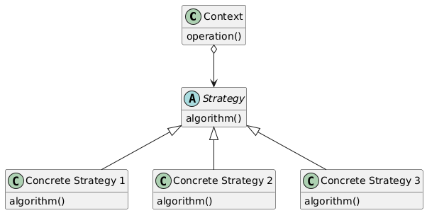

# Chap 2：函数即对象

## 函数是一等对象

**一等对象**(first-class object)指的是满足以下条件的程序实体：

- 在运行时创建
- 能赋值给变量或数据结构中的元素
- 能作为参数传给函数
- 能作为函数的返回结果

在 Python 中，函数也符合上述条件，因此函数是一等对象。

- `__doc__` 属性用于生成对象的帮助文本
- 可以将函数直接复制给变量，然后通过变量名调用该函数


### 高阶函数

**高阶函数**(higher-order function)：接受函数为参数，或把函数作为结果返回的函数。

- 内置函数 `sorted`、`map`、`filter`、`reduce` 等都属于高阶函数
    - `map(function, iterable)`：返回一个可迭代对象，所含的项是把第一个参数（函数）应用到第二个参数（一个可迭代对象）中各个元素得到的结果
        - 在 Python 3 中，`map` 函数是惰性的，它会创建一个生成器，按需产出结果，因此能节省内存
    - 不过，更为现代和方便的[列表推导式和生成器表达式](#列表推导式和生成器表达式)可以替代 `map` 和 `filter`
    - `reduce` [归约函数](https://zh.wikipedia.org/wiki/Fold_(%E9%AB%98%E9%98%B6%E5%87%BD%E6%95%B0))来自 `functools` 模块，它的句法与 `map` 类似，作用是将一系列值归约成单个值
        - `reduce` 还有可选的第三个参数，作为初始值，但建议最好提供这个参数。如果可迭代对象为空，那么返回值就是这个初始值；否则在归约循环中，以这个初始值作为第一个参数（例如，对 `+`、`|`、`^` 来说，初始值应为0，而对 `*` 和 `&` 来说，初始值应为1）
        - 映射归约(map-reduce)：把函数应用到各个元素上，生成一个新序列（映射），然后计算聚合值（归约）

        <figure style=" width: 60%" markdown="span">
            
            
            <figcaption></figcaption>
        </figure>

    - 内置的归约函数还有：
        - `all(iterable)`：`iterable` 中没有表示假值的元素时返回 `True`
        - `any(iterable)`：`iterable` 中只要有元素是真值就返回 `True`


### 匿名函数

**匿名函数**，顾名思义便是没有名称的函数，在 Python 中由 lambda 函数实现。

- lambda 函数的主体只能是表达式，因此像 `while`、`try`，乃至 `=` 赋值等语句都不允许出现在 lambda 函数的主体部分
- 但是可以用 `:=` 赋值表达式，不过这种情况下的 lambda 函数可能过于复杂，建议用 `def` 定义方法重构函数
- lambda 函数主要的作用是作为高阶函数的参数，除此之外很少会用到 lambda 函数


### 可调用对象

可调用对象指的是可以使用调用运算符 `()` 的对象，可以用内置的 `callable()` 函数判断。Python 3.9 后的版本提供以下几种可调用对象：

- 用户定义的函数：使用 `def` 语句或 `lambda` 表达式创建的函数
- 内置函数：使用 C 语言（CPython）实现的函数
- 内置方法：使用 C 语言实现的方法
- 方法：在类主体中定义的函数
- 类：调用类时运行 `__new__` 方法创建一个实例，然后运行 `__init__` 方法来初始化实例，最后再将实例返回给调用方
- 类的实例：若类定义了 `__call__` 方法，那么它的实例可以作为函数调用
- 生成器函数：主体中有 `yield` 关键字的函数或方法。调用生成器函数返回一个生成器对象
- 原生协程函数：使用 `async def` 定义的函数或方法。调用原生协程函数返回一个协程对象
- 异步生成器函数：使用 `async def` 定义，且主体中有 `yield` 关键字的函数或方法。调用异步生成器函数返回一个异步生成器，供 `async for` 使用


### 用户定义的可调用类型

通过实现实例方法 `__call__`，我们便可以使任何 Python 对象都能像函数一样被调用。

???+ example "例子"

    ```py
    import random

    class BingoCage:

        def __init__(self, items):
            self._items = list(items)
            random.shuffle(self._items)

        def pick(self):
            try:
                return self._items.pop()
            except IndexError:
                raise LookupError('pick from empty BingoCage')
            
        def __call__(self):
            return self.pick()
    ```

    运行结果：

    ```py
    >>> bingo = BingoCage(range(3))
    >>> bingo.pick()
    0
    >>> bingo()
    1
    >>> callable(bingo)
    True
    ```

- 实现 `__call__` 方法后，必须在内部维护一个状态，让它在多次调用之间存续（涉及到闭包）
- `__call__` 的另一个用处是实现装饰器

>[闭包和装饰器](#装饰器和闭包)都会在后面介绍到


### 形参声明句法

#### 仅限关键字参数

定义函数时，在参数列表中加入参数 `*`，`*` 后面（右边）的参数就是仅限关键字参数，即调用时一定要指出参数名称的参数。

???+ example "例子"

    ```py
    >>> def f(a, *, b):
    ...     return a, b
    ...     
    >>> f(1, b=2)
    (1, 2)
    >>> f(1, 2)
    Traceback (most recent call last):
    File "<python-input-2>", line 1, in <module>
        f(1, 2)
        ~^^^^^^
    TypeError: f() takes 1 positional argument but 2 were given
    ```


#### 仅限位置参数

定义函数时，在参数列表中加入参数 `/`，`/` 前面（左边）的参数就是仅限位置参数，即调用时不能指出参数名称的参数。

- 在 `/` 后面的参数不会受到影响

???+ example "例子"

    ```py
    >>> def divmod(a, b, /):
    ...     return (a // b, a % b)
    ... 
    >>> divmod(10, 4)
    (2, 2)
    >>> divmod(a=10, b=4)
    Traceback (most recent call last):
    File "<python-input-5>", line 1, in <module>
        divmod(a=10, b=4)
        ~~~~~~^^^^^^^^^^^
    TypeError: divmod() got some positional-only arguments passed as keyword arguments: 'a, b'
    ```


### 函数式编程

#### operator 模块

在函数式编程中，经常需要把算术运算符当作函数使用，而 Python 的 `operator` 模块提供了这样的函数，比如 `mul` 函数实现了 `*` 运算符的功能。下面列出了 `operator` 模块中定义的部分函数列表（省略以 `_` 开头的名称，因为它们基本上是实现细节）：

```py
[name for name in dir(operator) if not name.startswith('_')]
['abs', 'add', 'and_', 'attrgetter', 'call', 'concat', 'contains', 
'countOf', 'delitem', 'eq', 'floordiv', 'ge', 'getitem', 'gt', 'iadd', 
'iand', 'iconcat', 'ifloordiv', 'ilshift', 'imatmul', 'imod', 'imul', 
'index', 'indexOf', 'inv', 'invert', 'ior', 'ipow', 'irshift', 'is_', 
'is_not', 'isub', 'itemgetter', 'itruediv', 'ixor', 'le', 'length_hint', 
'lshift', 'lt', 'matmul', 'methodcaller', 'mod', 'mul', 'ne', 'neg', 
'not_', 'or_', 'pos', 'pow', 'rshift', 'setitem', 'sub', 'truediv', 
'truth', 'xor']
```

- 大部分函数的功能可以从它们的名称中直接看出来
- 以 `i` 开头的函数对应增量赋值运算符的形式：若第一个参数是可变类型，则函数会就地修改第一个参数；否则的话直接返回运算结果，不修改参数

下面介绍 `operator` 模块中比较特殊的函数：

- `itemgetter`：从序列中读取项
    - 该函数接受单个或多个索引（`int` 类型），返回由根据索引提取的值构成的元组

    ??? example "例子"

        ```py
        >>> metro_data = [
        ...     ('Tokyo', 'JP', 36.933),
        ...     ('Delhi NCR', 'IN', 21.935),
        ...     ('Mexico City', 'MX', 20.142),
        ...     ('New York-Newark', 'US', 20.104),
        ...     ('Sao Paulo', 'BR', 19.648),
        ... ]                                                                                                                               
        >>> from operator import itemgetter                                                                                                 
        >>> cc_name = itemgetter(1, 0)                                                                                                      
        >>> for city in metro_data:
        ...     print(cc_name(city))
        ... 
        ('JP', 'Tokyo')
        ('IN', 'Delhi NCR')
        ('MX', 'Mexico City')
        ('US', 'New York-Newark')
        ('BR', 'Sao Paulo')
        ```

- `attrgetter`：从对象中读取属性
    - 该函数接受单个或多个属性名（`str` 类型），返回由根据属性名提取的值构成的元组
    - 如果属性名中包含 `.`，那么函数就会深入嵌套对象，检索属性

    ??? example "接着上面的例子"

        ```py
        >>> from collections import namedtuple
        >>> Metropolis = namedtuple('Metropolis', 'name cc pop')
        >>> metro_areas = [Metropolis(name, cc, pop) for name, cc, pop in metro_data]
        >>> metro_areas[0]
        Metropolis(name='Tokyo', cc='JP', pop=36.933)
        >>> from operator import attrgetter
        >>> name_pop = attrgetter('name', 'pop')
        >>> 
        >>> for city in sorted(metro_areas, key=attrgetter('pop')):
        ...     print(name_pop(city))
        ... 
        ('Sao Paulo', 19.648)
        ('New York-Newark', 20.104)
        ('Mexico City', 20.142)
        ('Delhi NCR', 21.935)
        ('Tokyo', 36.933)
        ```

- `methodcaller`：会在对象上调用参数指定的方法
    - 第一个参数为 `str` 类型，表示方法名称，后面的参数作为该方法的参数（或者说冻结了一些参数）；返回的是一个可调用的方法

    ??? exaxmple "例子"

        ```py
        >>> from operator import methodcaller
        >>> s = 'The time has come'
        >>> upcase = methodcaller('upper')
        >>> upcase(s)
        'THE TIME HAS COME'
        >>> hyphenate = methodcaller('replace', ' ', '-')
        >>> hyphenate(s)
        'The-time-has-come'
        ```

#### functools.partial

另一种可以冻结参数的函数是 `functools.partial`，它可以根据提供的可调用对象产生一个新可调用对象，为原可调用对象的某些参数绑定预定的值。

- 该函数返回的是一个 `functools.partial` 对象
- 该对象提供了访问原函数、固定参数和关键字参数的属性 `.func` 、`.args` 和 `.keywords`

??? example "例子"

    ```py
    >>> from tagger import tag
    >>> tag
    <function tag at 0x0000020BC5E68B80>
    >>> from functools import partial
    >>> picture = partial(tag, 'img', class_='pic-frame')
    >>> picture(src='wumpus.jepg')
    ''
    >>> picture
    functools.partial(<function tag at 0x0000020BC5E68B80>, 'img', class_='pic-frame')   
    >>> picture.func
    <function tag at 0x0000020BC5E68B80>
    >>> picture.args
    ('img',)
    >>> picture.keywords
    {'class_': 'pic-frame'}
    ```

## 函数中的类型提示

!!! warning "警告"

    不要过分使用或依赖类型提示！类型提示在大型工程项目中可能会发挥不小的价值，但如果只是学习或者写一些小项目的话，那么可能不需要类型提示；而且如果什么都要做类型检查，则必将失去部分 Python 的表现力。让我们坦然接受没有类型提示的代码~

??? info "[Typeshed](https://github.com/python/typeshed) 项目和存根文件"

    到目前为止（Python 3.13），Python 的标准库内应该还没有注解，但是 Mypy、Pycharm 等可在 Typeshed 项目中找到所需要的类型提示。这些类型提示位于一种**存根文件**(stub file)中，扩展名为 .pyi，文件中保存带注解的函数和方法签名，没有实现，有点儿类似 C 语言的头文件。


### 渐进式类型

**渐进式类型系统**(gradual type system)具有以下性质：

- 是可选的：默认情况下，类型检查工具不应对没有类型提示的代码发出警告。当类型检查工具无法确定对象的类型时，会假定其为与其他所有类型都兼容的 `Any` 类型
    - 可以通过特殊的注释让类型检查工具忽略代码中指定的行，比如在导入的包旁添加注释 `# type: ignore` 便可以禁止 Mypy 报告类型提示的问题
    - 类型检查工具通常不允许变量的类型发生变化
- 不在运行时捕获错误：类型提示相关的问题由静态类型检查工具、lint 程序或 IDE 捕获。在运行时不能阻止把不一致的值传给函数或分配给变量
    - 类型检查工具可以从表达式中推导出结果的类型
- 不能改善性能：到目前为止，任何 Python 运行时都没有根据类型提示来实现一定的优化

---
前面提到过最常用的类型检查工具 [Mypy](https://github.com/python/mypy)，可以用它来体验 Python 的渐进式类型系统。这里稍微介绍一下它的用法：

- 安装：`pip install mypy`
- 使用：`mypy test.py`
- 如果输出结果的最后一行出现 `Success` 绿色字样，表明 Mypy 没有发现问题；否则的话 Mypy 就会报告 `error`（错误） 或 `note`（提示）   
- 可用命令行选项（以下选项会使 Mypy 检查更严格）：
    - `--disallow-untyped-defs`：Mypy 报告没有为参数和返回值添加类型的函数定义
    - `--disallow-incomplete-defs`：Mypy 报告没有添加完整类型提示（比如只为返回值添加注解，而参数没有注解）的函数定义
    - `--disallow-any-expr`：不允许表达式中出现 `Any` 类型
- 可以通过 mypy.ini 配置文件设置 Mypy 命令行选项，避免每次执行命令时都要输入长长的选项
    - 供参考的配置文件：

    ```
    [mypy]
    python_version = 3.13
    warn_unused_config = True
    disallow_incomplete_defs = True
    ```

    - 该配置文件既可针对全局，也可针对单个模块

- `typing.TYPE_CHECKING` 常量在 Python 程序运行时始终为 `False`，但是在使用类型检查工具时，这个值会“假装”为 `True`，因此结合 `if` 语句可以在 Python 代码中编写一些仅在类型检查时才执行的操作
- `reveal_type()` 是 Mypy 提供的调试设施，无需使用 `import` 导入。Mypy 每遇到一个 `reveal_type()` 就输出一条个显示参数推导类型的调试信息
    - 注意：该函数不能在运行时调用，因为它不是常规函数（所以可以结合上面那个常量来使用）

- 一开始为空的容器通常需要注解，否则 Mypy 无法推导出容器的类型

---
渐进式类型系统中，存在一种名为**相容**(consistent-with)的关系，相容的规则如下：

- 对于 `T1` 及其子类型 `T2`，`T2` 与 `T1` 相容（[里氏替换原则](https://en.wikipedia.org/wiki/Liskov_substitution_principle)，LSP）
    - `int` 与 `float` 相容，`float` 与 `complex` 相容
- 任何类型都与 `Any` 相容：声明为 `Any` 类型的参数接受任何类型的对象
- `Any` 与任何类型都相容：始终可以把 `Any` 类型的对象传给预期其他类型的参数

>相容的表述顺序不可随意替换，即 A 与 B 相容 != B 与 A 相容

??? example "例子"

    ```py
    from typing import Any

    class T1:
        ...

    class T2(T1):
        ...

    def f1(p: T1) -> None:
        ...

    def f2(p: T2) -> None:
        ...

    def f3(p: Any) -> None:
        ...

    def f4():       # 返回值类型隐含 Any
        ...


    o0 = object()
    o1 = T1()
    o2 = T2()

    f1(o2)    # 有效
    f2(o1)    # 类型错误

    f3(o0)
    f3(o1)    # 都有效（规则2）
    f3(o2)

    o4 = f4()    # 推导出类型为 Any

    f1(o4)
    f2(o4)    # 都有效（规则3）
    f3(o4)
    ```

    运行结果：

    ```sh
    $ mypy .\test.py
    test.py:27: error: Argument 1 to "f2" has incompatible type "T1"; expected "T2"  [arg-type]
    Found 1 error in 1 file (checked 1 source file)
    ```


### 类型的具体含义

在 PEP 483 中，类型被认为是一系列值和一系列可操作这些值的函数。再结合实际经验，我们可以认为：Python 的**类型由受支持的操作定义**。

在渐进式类型系统中，有以下两类相互影响的类型：

- [**鸭子类型**](https://zh.wikipedia.org/wiki/%E9%B8%AD%E5%AD%90%E7%B1%BB%E5%9E%8B)(duck typing)：
    - Python、JavaScript、Ruby 等支持此种类型
    - 对象有类型，但是变量（包括参数）没有类型
    - 在实践中，为对象声明的类型无关紧要，重要的是对象具体支持什么操作
    - 只有在运行时尝试操作对象时，才会进行鸭子类型相关的检查，但不会在运行时关注声明的类型
    - 这比名义类型更灵活，但运行时可能存在更多潜在的错误
- **名义类型**(nominal typing)：
    - C++、Java、C#、带类型提示的 Python 等支持此种类型
    - 对象和变量都有类型，但对象只存在于运行时
    - 类型检查工具只读取使用类型提示注解变量（包括参数）的源码，而不运行程序的任何部分
    - 因此名义类型会在静态检查阶段，即运行代码之前检测错误，但有时会拒绝实际可运行的代码


### 注解中可用的类型

#### Any 类型

`Any` 类型是动态类型的基础，即**动态类型**，来自 `typing` 模块。

- `Any` 是一种魔术类型，位于类型层次结构的顶部和底部，它既是最一般的类型（用 `n: Any` 注解的参数可接受任何类型的值），也是最特定的类型（支持所有可能的操作）（在类型检查工具看来是这样的）
- 实际上，并不存在支持所有操作的类型，因此使用 `Any` 不利于类型检查工具完成核心任务，即检测潜在的非法操作，防止运行时异常导致程序崩溃


#### 简单的类型和类

- 像 `int`、`float`、`str` 和 `bytes` 等简单的类型可以直接在类型提示中使用
- 标准库、外部包中的具体类，以及用户定义的具体类，也可以在类型提示中使用
- [抽象基类](#抽象基类)在类型提示中也能用到
- 对类来说，**相容**的定义与子类型相似：子类与所有超类相容


#### Optional 类型和 Union 类型

前面提到过：尤其是对于可变类型，函数参数的默认值应设为 `None`，此时的类型提示应写成以下形式：`#!py var_name: Optional[some_type] = None`，其中 `Optional` 来自 `typing` 模块，表示 `var_name` 的值可以是 `some_type` 类型的值或者 `None`。

- `Optional[some_type]` 是 `Union[some_type, None]` 的简写形式
- 从 Python 3.10 开始，可以进一步简化形式为 `some_type | None`；`|` 运算符还可用于构建 `isinstance` 和 `issubclass` 的第二个参数
- 应尽量避免创建返回 `Union` 类型值的函数，因为这会迫使用户在运行时检查返回值的类型，以决定如何处理
    - 如果返回值的类型与参数类型一致，那么可以使用下面介绍的类型变量和重载

- `Union[]` 至少需要两种类型。嵌套的 `Union` 类型与扁平的 `Union` 类型效果相同（比如 `#!py Union[A, B, Union[C, D]] == Union[A, B, C, D]`
- `Union[]` 所含的类型之间不应相容，否则的话就有些画蛇添足了


#### 泛化容器

大多数 Python 容器是异构的，即容器内项的类型可以是不同的。但实际这样做并没有什么意义，我们往往需要指定容器内项的类型，在 Python 中通过**泛型**(generics)来实现。

- 基本句法：`#!py container[item]`，其中 `item` 表示项的类型，`container` 为以下接受泛化类型提示形式的容器中的一种：

    ```py
    list         collections.deque    abc.Sequence    abc.MutableSequence
    set          abc.Container        abc.Set         abc.MutableSet
    frozenset    abc.Collection
    ```

- 当 `item` 为 `Any` 类型时，泛化类型提示与一般的类型提示没有什么区别
- Python 的静态类型系统并没有为常用的 `array.array` 提供很好的类型提示


#### 元组类型

元组类型的注解分为以下几种情况：

- 用作记录的元组：使用 `tuple` 注解，字段的类型在 `[]` 内声明
- 带有具名字段，用作记录的元组：强烈建议使用 `typing.NamedTuple`（的子类）注解
    - `typing.NamedTuple`（的子类）是 `tuple` 的子类，因此前者的实例可以通过 Mypy 对 `tuple` 类型的检查
- 用作不可变序列的元组
    - 若想注解长度不定、用作不可变序列的元组，则只能指定一个类型，后跟逗号和 `...`，即形如 `tuple[some_type, ...]`
    - 在类型提示中， `tuple[Any, ...]` 与 `tuple` 等价


#### 泛化映射

泛化映射类型使用 `MappingType[KeyType, ValueType]` 的形式注解（比如 `dict[str, set[str]]`）

- 当把 `dict` 用作记录时，一般情况下所有键都应使用 `str` 类型，而值的类型取决于键的含义


#### 抽象基类

抽象基类的类型提示应遵循**伯斯塔尔定律**(Postel's Law)或**稳健性法则**(Robustness Principle)：

- 发送时要保守：函数的返回值始终应该是一个具体对象/类型
- 接收时要大方：函数的参数应接受抽象类型，而不是具体类型，这样对调用方来说更加灵活


#### Iterable

`Iterable` 接受所有的可迭代对象，可以用 `[]` 指明项的类型（泛型），因此很适合作为注解参数的类型。

??? example "例子"

    ```py title="replacer.py" hl_lines="3"
    from collections.abc import Iterable

    FromTo = tuple[str, str]

    def zip_replace(text: str, changes: Iterable[FromTo]) -> str:
        for from_, to in changes:
            text = text.replace(from_, to)
        return text
    ```

    运行结果：

    ```py
    >>> from replacer import zip_replace
    >>> l33t = [('a', '4'), ('e', '3'), ('i', '1'), ('o', '0')]
    >>> text = 'mad skilled noob powned leet'
    >>> zip_replace(text, l33t)
    'm4d sk1ll3d n00b p0wn3d l33t'
    ```

??? note "类型别名(type alias)"

    - 在上个例子中的高亮行，`FromTo` 是一个类型别名，这里将类型直接赋值给了变量，提高可读性
    - Python 3.10 还引入了特殊类型 `TypeAlias`，进一步提升可读性，且让类型检查更容易，用法如下：

    ```py
    from typing import TypeAlias

    FromTo: TypeAlias = tuple[str, str]
    ```


#### 参数化泛型和 TypeVar

参数化泛型是一种特殊的泛型，句法形如 `container[T]`，其中 `T` 是类型变量，通过 `typing.TypeVar()` 创建（比如 `#!py T = TypeVar('T')`）。

- 每次使用 `T` 时，`T` 都会与具体的类型绑定，这样就可以在结果的类型中使用参数的类型了
- 有时，需要限制可以赋予 `T` 的类型，下面提供几种限制的方法：
    - 受限的 `TypeVar`：`TypeVar` 还可以接受一些为止参数，以对类型参数施加限制
        - 比如 `NumberT = TypeVar('NumberT', float, Decimal, Fraction)` 仅允许 `NumberT` 在 `float` 等三种类型之中
    - 有界的 `TypeVar`：`TypeVar` 提供了一个可选的关键字参数 `bound`，为可接受的类型设定一个上边界
        - 比如当 `bound=Hashable` 时，类型参数可以是 `Hashable` 或它的任何子类型

- 此外，`typing` 模块提供了一个预定义的类型变量，名为 `AnyStr`，表示类型为 `str` 或 `bytes` 中的一种。它的定义如下：

    ```py
    AnyStr = TypeVar('AnyStr', bytes, str)
    ```


#### 静态协议

在 Python 中，静态协议通过 `typing.Protocol` 的子类定义。

- 然而，实现协议的类不会与定义协议的类建立任何关系，不继承，也不用注册
- 类型检查工具负责查找可用的协议类型，进行用法检查
- 协议的定义：协议主体内可以定义一个或多个方法，方法的主体为 `...`
- 如果类型 `T` 实现了协议 `P` 定义的所有方法且类型签名匹配，那么 `T` 就与 `P` 相容
- 协议类型的优势：类型无须做任何特殊声明就可以与协议类型相容，因此协议可以利用现有类型或不受我们控制的代码实现的类型创建
- `typing.Protocol` 是**静态鸭子类型**(static duck typing)（简单理解为能被静态类型检查工具检查的鸭子类型）

直接讲概念还是太抽象了，建议阅读下面的例子。

??? example "例子"

    最开始，我们定义了这样一个函数：

    ```py
    # 返回排位靠前的 n 个元素
    def top(series: Iterable[T], length: int) -> list[T]:
        ordered = sorted(series, reserve=True)
        return ordered[:length]
    ```

    现在需要限制 `T` 的范围，因为 `series` 必须支持使用 `sorted` 函数排序，且它的项能够在可选参数 `key` 传入的函数内计算。实践结果表明，如果可迭代对象支持 `<` 运算符，就能够使用 `sorted` 函数了。然而并没有只支持 `<` 运算符的类型，因此我们需要通过协议来实现。

    ```py title="comparable.py"
    from typing import Protocol, Any

    class SupportLessThan(Protocol):
        def __lt__(self, other: Any) -> bool: ...
    ```

    ```py title="top.py"
    from collections.abc import Iterable
    from typing import TypeVar

    from comparable import SupportLessThan

    LT = TypeVar('LT', bound=SupportLessThan)

    def top(series: Iterable[T], length: int) -> list[T]:
        ordered = sorted(series, reserve=True)
        return ordered[:length]
    ```

#### Callable

`collections.abc` 模块提供的 `Callable` 类型，用于注解回调函数或高阶函数返回的可调用对象。

- `Callable` 类型可像这样参数化：`Callable[[ParamType1, ParamType2], ReturnType]`，其中方括号内第一项为参数列表，可以包含0个或多个类型
- 可选或关键字参数没有专门的注解句法，因此这种类型很少用作回调类型
- 如果不想指定参数类型，可以将整个参数列表替换为 `...`，即 `Callable[..., ReturnType]`
- 如果不想接受参数，那么让参数列表变为空列表 `[]`
- `Callable` 类型中有一个重要概念——“**型变**”(variance)，一共有以下几类情况：
    - **协变**(covariant)：`Callable` 的返回值类型发生的型变，具体指返回值的子类型关系的变化方向与其对应的 `Callable` 类型的变化方向相同的现象
        - 比如 `Callable[[], int]` 是 `Callable[[], float]` 的子类型，因为 `int` 是 `float` 子类型
    - **逆变**(contravariant)：`Callable` 的参数类型发生的型变，具体指参数的子类型关系的变化方向与其对应的 `Callable` 类型的变化方向相反的现象
        - 比如 `Callable([float], None)` 是 `Callable([int], None)` 的子类型
    - **不变**(invariant)：目前，可以认为大多数参数化泛型是不变的


#### NoReturn

这种特殊类型仅用于注解绝不反悔的函数的返回值类型，这样的函数通常会抛出异常（比如 `sys.exit()` 会抛出 `SystemExit` 异常，终止 Python 进程，它的函数签名为：`#!py def exit(_status: object = ...) -> NoReturn: ...`）。


### 注解仅限位置参数和变长参数

- 任意个位置参数的类型提示 `*param1: some_type`：在函数主体中，`param1` 的类型为 `tuple[some_type, ...]`
- 任意个关键字参数的类型提示 `**param2: some_type`：在函数主体中，`param2` 的类型为 `dict[str, some_type]`
    - 如果 `param2` 接收不同类型的值，那么注解为：`**param2: Any`


### 类型不完美，测试须全面

虽然像 Mypy 这种静态类型检查工具能够发现很多 bug，但这种方法还是有以下缺陷：

- 很难发现以下问题：
    - 误报：代码中正确的类型被检查工具报告有错误
    - 漏报：代码中错误的类型没有被检查工具报告有错误
- 一些便捷的功能无法做静态检查，比如像 `config(**settings)` 这种参数拆包
- 一般来说，类型检查工具对特性、描述符、元类和元编程等高级功能的支持很差，或者根本无法理解
- 类型检查工具跟不上 Python 版本的变化，可能拒绝使用语言新功能的代码，甚至崩溃
- 通常，类型提示对捕获业务逻辑中的错误没有帮助
- 静态类型检查工具不鼓励使用 Python 的动态功能


## 装饰器和闭包

### 装饰器基础

**装饰器**(decorator)是一种可调用对象，其参数是另一个函数（被装饰的函数）。它可能会对被装饰的函数做些处理，然后返回函数，或者把函数替换为另一个函数或可调用对象。

- 假设有以下装饰器：

    ```py
    @decorate
    def target():
        print('running target()')
    ```

    上述代码等价于下面的代码：

    ```py
    def target():
        print('running target()')

    target = decorate(target)
    ```

- 装饰器的基本性质：
    - 装饰器是一个函数或其他可调用对象
    - 装饰器可以把被装饰的函数替换成别的函数
    - 装饰器在加载模块时（**导入**(`import`)时）立即执行，而被装饰的函数只在显式调用时执行

    ??? example "例子"

        ```py title="registration.py"
        registry = []  

        def register(func):  
            print(f'running register({func})') 
            registry.append(func)  
            return func 

        @register 
        def f1():
            print('running f1()')

        @register
        def f2():
            print('running f2()')

        def f3(): 
            print('running f3()')

        def main(): 
            print('running main()')
            print('registry ->', registry)
            f1()
            f2()
            f3()

        if __name__ == '__main__':
            main()  
        ```

        运行结果：

        ```sh
        $ python .\registration.py         
        running register(<function f1 at 0x0000017AA5831440>)
        running register(<function f2 at 0x0000017AA59444A0>)
        running main()
        registry -> [<function f1 at 0x0000017AA5831440>, <function f2 at 0x0000017AA59444A0>]
        running f1()
        running f2()
        running f3()
        ```

        如果导入 `registration.py` 模块，则得到如下输出：

        ```py
        >>> import registration
        running register(<function f1 at 0x000002838314C900>)
        running register(<function f2 at 0x000002838314C7C0>)
        ```

        查看 `registry` 的值：

        ```py
        >>> registration.registry
        [<function f1 at 0x000002838314C900>, <function f2 at 0x000002838314C7C0>]
        ```

- 装饰器的常用方式：
    - 装饰器通常在一个模块中定义，然后再应用到其他模块中的函数上
    - 大多数装饰器会在内部定义一个函数，然后将其返回（涉及到[闭包](#闭包)）
    - 典型行为：把被装饰的函数替换为新函数，新函数接受的参数与被装饰的函数一样，而且（通常）会返回被装饰函数本该返回的值，同时还会做一些额外操作

- 多个装饰器可以叠放，类似嵌套函数，会先应用最接近函数签名的装饰器

### 变量作用域规则

在介绍闭包前，需要先对 Python 的变量作用域规则有一个大致的了解。

Python 一共有 3 种变量作用域：

- 模块全局作用域：在类或函数块外部分配值的名称
- 函数局部作用域：通过参数或在函数主体中直接分配值的名称
- “非局部”作用域

Python 不要求声明变量，但是会假定在函数主体中赋值的变量是局部变量。所以就会有以下神奇的行为：

??? example "例子"

    ```py
    >>> b = 6
    >>> def f2(a):
    ...     print(a)
    ...     print(b)
    ...     b = 9
    ... 
    >>> f2(3)
    3
    Traceback (most recent call last):
    File "<python-input-2>", line 1, in <module>
        f2(3)
        ~~^^^
    File "<python-input-1>", line 3, in f2
        print(b)
            ^
    UnboundLocalError: cannot access local variable 'b' where it is not associated with a value
    ```

    可以看到，即使 `b` 先前在函数外面赋过值了，由于函数主体部分有为 `b` 赋值的语句，因此 Python 会将函数主体出现的 `b` 视作局部变量。而在 `print()` 函数执行前，局部变量 `b` 还没有赋过值，因此就会产生上面的报错。

另外需要注意的是，变量的种类（是不是局部变量）在函数主体中不能改变，也就是说，变量在函数内不能一会儿是全局变量，一会儿又是局部变量。

!!! abstract "总结：变量查找逻辑"

    Python 字节码编译器根据以下规则获取函数主体中出现的变量。

    - 如果是 `global x` 声明，则 `x` 来自模块全局作用域，并赋予那个作用域中 `x` 的值
    - 如果是 [`nonlocal x` 声明](#nonlocal-声明)，则 `x` 来自最近一个定义它的外层函数，并赋予那个函数中局部变量 `x` 的值
    - 如果 `x` 是参数，或在函数主体中赋了值，那么 `x` 就是局部变量
    - 如果引用了 `x`，但是没有赋值也不是参数，则遵循以下规则：
        - 在外层函数主体的局部作用域内查找 `x`
        - 如果未找到，则从模块全局作用域内读取
        - 如果仍未找到，则从 `__builtins__.__dict__` 中读取


### 闭包

>注：请不要将这里介绍的“[闭包](https://zh.wikipedia.org/zh-hans/%E9%97%AD%E5%8C%85_(%E8%AE%A1%E7%AE%97%E6%9C%BA%E7%A7%91%E5%AD%A6))”与数学中的“[闭包](https://zh.wikipedia.org/wiki/%E9%97%AD%E5%8C%85_(%E6%95%B0%E5%AD%A6))”概念混为一谈。

**闭包**(closure)：延伸了作用域的函数 `f`，包括函数主体引用的非全局变量和局部变量，这些变量必须来自包含 `f` 的外部函数的局部作用域。

概念有些抽象，需要结合以下例子理解：

???+ example "例子"

    ```py hl_lines="4-9"
    """ 一个计算累计平均值的高阶函数 """
    def make_averager():
        # 以下高亮部分是一个闭包
        series = []         # 自由变量

        def averager(new_value):
            series.append(new_value)
            total = sum(series)
            return total / len(series)

        return averager
    ```

    运行结果：

    ```py
    >>> avg = make_averager()
    >>> avg(10)
    10.0
    >>> avg(11)
    10.5
    >>> avg(15)
    12.0
    ```

上个例子中出现了“**自由变量**”(free variable) 的概念，它指的是未在局部作用域中绑定的变量。我们可以通过函数的 `__code__` 属性查看函数内部的局部变量和自由变量的名称（分别对应 `__code__` 下的 `.co_varnames` 和 `co_freevars` 属性）。

此外，自由变量的值保存在函数的 `__closure__` 属性，其中的各项对应 `__code__.co_freevars` 的一个名称，这些项是 `cell` 对象，有一个名为 `cell_contents` 的属性，保存真正的值。

??? example "接着上面的例子"

    ```py
    >>> avg.__code__.co_varnames                                                                                                        
    ('new_value', 'total')
    >>> avg.__code__.co_freevars
    ('series',)
    >>> avg.__closure__
    (<cell at 0x000002838294CBB0: list object at 0x0000028382AB1940>,)
    >>> avg.__closure__[0].cell_contents
    [10, 11, 15]
    ```


### nonlocal 声明

!!! bug "关于 Python 闭包的小问题"

    对于数值、字符串、元组等不可变类型（只能读取，不能更新），如果在闭包内创建这样的（自由）变量 `var`，并在函数主体部分对变量进行赋值，那么会隐式创建局部变量 `var`，此时 `var` 就不再是自由变量，因此也就不会被保存在闭包内。

    >对于可变类型（比如上面例子中的列表），则不会出现这个问题...

解决方案是使用 `nonlocal` 关键字，它的作用是把变量标记为自由变量，即便在函数中为变量赋予新值（此时闭包中保存的变量也会随之更新）。

??? example "例子"

    ```py
    def make_averager():
        count = 0
        total = 0

        def averager(new_value):
            nonlocal count, total
            count += 1
            total += new_value
            return total / count

        return averager
    ```


### 标准库中的装饰器

标准库提供了一些装饰器，这里介绍一些实用的装饰器：

- `functools.wraps` 装饰器可以将相关的属性从被装饰的函数上复制到新函数中，句法为：
    
    ```py
    # 装饰器函数
    def decorate(func):
        @functools.wraps(func)
        def new_func(*args, **kwargs):    # 同时接受位置参数和关键字参数
            ...
        return new_func
    ```

- `functools.cache`：实现了**备忘**(memoization)，即能保存函数的返回值，避免传入相同参数时重复计算

    ??? example "例子"

        下面通过实现斐波那契数的递归算法来展示 `functools.cache` 的威力。

        === "一般实现"

            ```py
            from clockdemo import clock

            @clock    # 自定义的装饰器，用于显示函数运行时间，不必了解其具体实现
            def fibonacci(n):
                if n < 2:
                    return n
                return fibonacci(n - 2) + fibonacci(n - 1)

            if __name__ == '__main__':
                print(fibonacci(6))
            ```

            运行结果：

            ```sh
            $ python .\fibo_demo.py      
            [0.00000030s] fibonacci(0) -> 0
            [0.00000060s] fibonacci(1) -> 1
            [0.00016380s] fibonacci(2) -> 1
            [0.00000040s] fibonacci(1) -> 1
            [0.00000020s] fibonacci(0) -> 0
            [0.00000090s] fibonacci(1) -> 1
            [0.00019410s] fibonacci(2) -> 1
            [0.00038560s] fibonacci(3) -> 2
            [0.00082390s] fibonacci(4) -> 3
            [0.00000030s] fibonacci(1) -> 1
            [0.00000030s] fibonacci(0) -> 0
            [0.00000020s] fibonacci(1) -> 1
            [0.00028860s] fibonacci(2) -> 1
            [0.00042970s] fibonacci(3) -> 2
            [0.00000030s] fibonacci(0) -> 0
            [0.00000040s] fibonacci(1) -> 1
            [0.00013580s] fibonacci(2) -> 1
            [0.00000030s] fibonacci(1) -> 1
            [0.00000020s] fibonacci(0) -> 0
            [0.00000030s] fibonacci(1) -> 1
            [0.00016610s] fibonacci(2) -> 1
            [0.00031820s] fibonacci(3) -> 2
            [0.00061330s] fibonacci(4) -> 3
            [0.00133420s] fibonacci(5) -> 5
            [0.00228590s] fibonacci(6) -> 8
            8
            ```

        === "使用 `functools.cache`"

            ```py hl_lines="3"
            from clockdemo import clock

            @functools.cache    # 叠放装饰器，@cache 应用到 @clock 返回的函数上
            @clock    
            def fibonacci(n):
                if n < 2:
                    return n
                return fibonacci(n - 2) + fibonacci(n - 1)

            if __name__ == '__main__':
                print(fibonacci(6))
            ```

            运行结果：

            ```sh
            python .\fibo_demo_cache.py
            [0.00000080s] fibonacci(0) -> 0
            [0.00000260s] fibonacci(1) -> 1
            [0.00048760s] fibonacci(2) -> 1
            [0.00000190s] fibonacci(3) -> 2
            [0.00076330s] fibonacci(4) -> 3
            [0.00000140s] fibonacci(5) -> 5
            [0.00099660s] fibonacci(6) -> 8
            8
            ```

    - 缺点：如果缓存较大，则该装饰器可能会耗尽所有内存。因此该装饰器跟适合短期运行的命令行脚本；对于长期运行的进程，推荐使用 `functools.lru_cache`，并合理设置 `maxsize` 参数

- `functools.lru_cache`：实现的功能与 `functools.cache` 一致，但配置上更加灵活，它接受以下关键字参数：
    - `maxsize`：设置最多存储的条目数。一旦缓存被填满，继续往缓存加入条目后，最不常用的条目会被丢弃，为新条目腾出空间（采用 LRU(least recently used) 策略）
        - 为了得到最佳性能，应将 `maxsize` 设为 2 的次方
        - 默认值为 128。如果令 `maxsize=None`，则条目永远不会被丢弃，可能导致内存消耗过多（效果与 `functools.cache` 一致）
    - `typed`：决定是否把不同参数类型得到的结果分开保存。
        - 默认值为 `False`，表示合在一起保存，此时值相等，但类型不同的参数只会被存储一次。如果令 `typed=True`，则分开保存
    - 句法：如果不指定参数，则直接写作 `@functools.lru_cache`，否则写成形如 `@functools.lru_cache(maxsize=2**10, typed=True)` 的形式

- `functools.singledispatch`

    ???+ info "引入"

        有时，我们希望设计一个能够根据不同数据类型采取不同方式处理的函数。
    
        - 常见的做法是将函数编程一个分派函数，即使用一串 `if/elif/...` 或 `match/case/...` 调用专门的函数。这种做法的缺点是由于各个专门函数之间的耦合过于紧密，因此不便于模块的扩展，还显得笨拙。
        - 更好的做法是使用 `functools.singledispatch` 装饰器，它可以将整体方案拆成多个模块，甚至可以为第三方包中无法编辑的类型提供专门的函数。
            - 使用 `@singledispatch` 装饰的普通函数变成了**泛化函数**(generic function)（指根据第一个参数的类型，以不同方式执行相同操作的一组函数）的入口，而这样的函数称为**单分派**(single dispatch)函数（如果根据多个参数选择专门的函数，那就是多分派）
            - 因此，我们可以在系统的任何地方或任何模块注册专门函数，可扩展性很强

    - 被 `@singledispatch` 装饰的函数称为基函数
    - 各个专门函数使用 `@<base>.register` 装饰，其中 `<base>` 是基函数的函数名
    - 专门函数的名称无关紧要，所以可以用 `_` 表示
    - `singledispatch` 逻辑会寻找与指定类型最匹配的实现，与实现在代码中出现的顺序无关
    - 若不想活不能为被装饰的类型添加类型提示，则可以把类型传给 `@<base>.register` 装饰器
    - `@<base>.register` 装饰器会返回装饰之前的函数，因此可以叠放多个 `register` 装饰器，让同一个实现支持两个或多个类型
    - 应尽量注册抽象基类的专门函数，而不直接处理具体实现，这样可以使代码兼容更多的类型

    ??? example "例子"

        ```py
        from functools import singledispatch
        from collections import abc
        import fractions
        import decimal
        import html
        import numbers

        @singledispatch
        def htmlize(obj: object) -> str:
            content = html.escape(repr(obj))
            return f'<pre>{content}</pre>'

        @htmlize.register
        def _(text: str) -> str:
            content = html.escape(text).replace('\n', '<br/>\n')
            return f'<p>{content}</p>'

        @htmlize.register
        def _(seq: abc.Sequence) -> str:
            inner = '</li>\n<li>'.join(htmlize(item) for item in seq)
            return '<ul>\n<li>' + inner + '</li>\n</ul>'

        @htmlize.register
        def _(n: numbers.Integral) -> str:
            return f'<pre>{n} (0x{n:x})</pre>'

        @htmlize.register
        def _(n: bool) -> str:
            return f'<pre>{n}</pre>'

        @htmlize.register(fractions.Fraction)
        def _(x) -> str:
            frac = fractions.Fraction(x)
            return f'<pre>{frac.numerator}/{frac.denominator}</pre>'

        @htmlize.register(decimal.Decimal)
        @htmlize.register(float)
        def _(x) -> str:
            frac = fractions.Fraction(x).limit_denominator()
            return f'<pre>{x} ({frac.numerator}/{frac.denominator})</pre>'
        ```

### 参数化装饰器

我们还可以让自定义的装饰器接受更多的参数，具体做法是创建一个**装饰器工厂函数**来接受这些参数，然后再返回一个装饰器，应用到被装饰的函数上。这么说还是有些抽象，看了下面的例子后就懂了：

???+ example "例子"

    ```py title="registration_param.py"
    registry = set()

    # 装饰器工厂函数，接收一个可选的关键字参数
    def register(active=True):     # active 参数用于启用或禁用函数注册功能
        def decorate(func):        # 真正的装饰器
            print('running register'
                f'(active={active})->decorate({func})')
            if active:
                registry.add(func)
            else:
                registry.discard(func)

            return func
        return decorate

    @register(active=False)    # 装饰器工厂函数必须作为函数调用
    def f1():
        print('running f1()')

    @register()                # 即使没有参数也要保留调用运算符()
    def f2():
        print('running f2()')

    def f3():
        print('running f3()')
    ```

    导入该模块后的结果是：

    ```py
    >>> import registration_param
    running register(active=False)->decorate(<function f1 at 0x000002532C7FCB80>)
    running register(active=True)->decorate(<function f2 at 0x000002532C7FC900>)
    >>> registration_param.registry
    {<function f2 at 0x000002532C7FC900>}
    ```

    可以看到，`f1` 并没有被注册，只有 `f2` 注册了。

装饰器工厂函数也可以不用 `@` 句法，可以像常规函数那样调用。句法为 `register()(f)`，其中 `register` 是装饰器工厂函数，`f` 是被装饰的函数，第一个括号填写可选的参数（比如上例中的 `active=False`）


#### 基于类的装饰器

前面的介绍中，我们一直采用函数实现装饰器，事实上也可以用类创建装饰器，下面来比对这两种不同的实现方式：

???+ example "相同装饰器的不同实现"

    === "函数实现"

        ```py
        import time

        DEFAULT_FMT = '[{elapsed:0.8f}s] {name}({args}) -> {result}'

        def clock(fmt=DEFAULT_FMT):    
            def decorate(func):
                def clocked(*_args):
                    t0 = time.perf_counter()
                    _result = func(*_args)
                    elapsed = time.perf_counter() - t0
                    name = func.__name__
                    args = ', '.join(repr(arg) for arg in _args)
                    result = repr(_result)
                    print(fmt.format(**locals()))
                    return _result
                return clocked
            return decorate
        ```

    === "类实现"

        ```py
        import time

        DEFAULT_FMT = '[{elapsed:0.8f}s] {name}({args}) -> {result}'

        class clock:    # 现在 clock 类是参数化装饰器工厂

            def __init__(self, fmt=DEFAULT_FMT):
                self.fmt = fmt

            def __call__(self, func):    # clock 实例成为可调用对象
                def clocked(*_args):
                    t0 = time.perf_counter()
                    _result = func(*_args)
                    elapsed = time.perf_counter() - t0
                    name = func.__name__
                    args = ', '.join(repr(arg) for arg in _args)
                    result = repr(_result)
                    print(self.fmt.format(**locals()))
                    return _result
                return clocked
        ```

    两种实现得到的装饰器的用法是一样的。


## 使用一等函数实现设计模式

!!! info "注"

    本节内容是对[《设计模式：可复用面向对象软件的基础》](https://book.douban.com/subject/34262305/)（介绍设计模式的开山之作，涵盖 23 个模式；以下简称为《设计模式》）中提到的部分模式的 Python 实现。由于本人之前从未接触过设计模式，所以理解上可能存在一些偏差，请见谅（当然如果发现问题的话可以提出来）。

    感觉自己很难讲清楚这些东西，所以写的比较简略和粗糙...

在软件工程中，**设计模式**(design pattern)指解决常见设计问题的一般性方案。虽然设计模式和语言无关，但是语言确实会影响到设计模式的使用。对于 Python 而言，有些模式可能根植于 Python 中，也有些模式通过 Python 得到更为简洁的实现。本节仅讨论一些因 Python 的“函数是一等对象”的特性而得到简化的模式：策略模式和命令模式。


### 策略模式

《设计模式》对**策略模式**(strategy pattern)的定义如下（《流畅的 Python》对这部分的翻译太烂了，以下内容摘自[菜鸟教程](https://www.runoob.com/design-pattern/strategy-pattern.html)）：

>在策略模式定义了一系列算法或策略，并将每个算法封装在独立的类中，使得它们可以互相替换。通过使用策略模式，可以在运行时根据需要选择不同的算法，而不需要修改客户端代码。

策略模式的 UML 类图如下所示：

<div style="text-align: center">
    
</div>

- 上下文：提供一个服务，把一些计算委托给实现不同算法的可互换组件
- 策略：实现不同算法的组件共同的接口
- 具体策略：策略的具体子类

策略对象通常是很好的**享元**(flyweight)，即可以同时在多个上下文中使用的可共享的对象，这使得在每个新的上下文中使用相同策略时不必新建具体策略对象，从而减少消耗。

在常规的实现中（比如用 C++ 编写代码），具体策略可能是一个只有一个方法的类，继承自策略这个抽象基类，并且策略实例没有属性（即没有内部状态）。在 Python 中，我们就可以把具体策略改写为一个个简单的函数，并且移除表示策略的抽象基类，这样得到的代码不仅更为简洁，而且用起来也更加方便。

建议将所有具体策略放在同一个模块（Python 文件）中，便于阅读和扩展。

???+ note "读取某个模块下的全部策略（函数）"

    - 法1：根据名称读取策略
        - 使用内置函数 `global()`：返回一个字典，表示当前的全局符号表（始终针对当前模块，即函数或方法定义的模块，而不是调用它们的模块）
        - 该字典的键为策略名称（`str` 类型），值为对应的策略（函数对象 `function` 类型）

    - 法2：模块内省
        - 使用 `inspect` 模块，其中的 `inspect.getmembers` 函数用于获取模块中对象的属性（包括函数对象），第一个参数为模块名（不用引号包裹），第二个参数是可选的判断条件（可以用 `inspect.isfunction` 判断是否为函数）

???+ note "使用装饰器改进策略模式"

    将策略作为注册装饰器，每个具体策略都被这个策略装饰。这样的好处在于：

    - 具体策略无需使用特殊的名称（前面的方法需要设定特殊名称，以便辨别是不是策略）
    - 装饰器的使用能够突出被装饰函数（具体策略）的作用，还便于临时禁用某个具体策略（将装饰器注释掉即可）
    - 具体策略可以在系统的任何地方定义，只要使用了对应的策略装饰器，十分灵活


### 命令模式

**命令模式**(command pattern)的目的是解耦调用操作的对象（调用者）和提供实现的对象（接收者）。

命令模式的 UML 类图如下所示（用 PlantUML 画图发现换不了行，正在解决这个问题，图先不放上来了）

- 调用者(invoker)
- 命令(command)
- 具体命令(concrete command)
- 接收者(receiver)
- 客户(client)

具体做法是：

- 在调用者和接收者之间放一个 `Command` 对象，让它实现只有一个方法的接口，调用接收者中的方法执行所需的操作。这样调用者无需了解接收者的接口，而且不同的接收者可以适应不同的 `Command` 。调用者有一个具体的命令，通过 `execute` 方法执行
- 可以不为调用者提供 `Command` 实例，而是给它一个函数 `command()`。而具体命令可以通过定义了 `__call__` 方法的类实现

