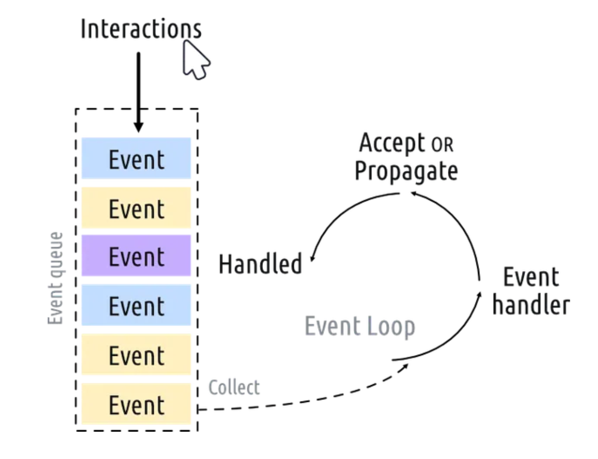
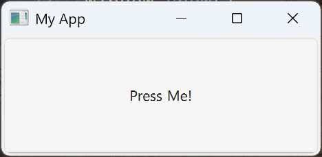
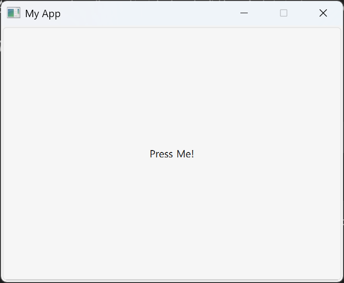

# PyQt6 库

!!! info "学习动机"

    在做实验室项目的时候，我被分配到的活是要用 PyQt6 写一个小的应用。当时由于时间原因，没有任何 PyQt6 的基础的我都是靠 gh Copliot 编写的，自己也就稍微 debug 了一下。现在空下来后，我想好好学一下这个库，感觉它挺好玩的，目前就打算学个皮毛。

!!! abstract "参考资料"

    - [PyQt6 教程](https://www.pythonguis.com/pyqt6-tutorial/)（特别适合入门，本笔记基本上就是它的翻译，唯二的不足就是全英文没有暗黑模式）
    - [PyQt6 文档](https://doc.qt.io/qt-6/)（建议直接看英文，中文是机器翻译的）


## 应用创建

一句话介绍 PyQt：**一种用于搭建 GUI 应用程序的 Python 库**。

首先，请安装 PyQt6 库：

```sh
pip install pyqt6
```

通过以下代码创建一个最简单的 PyQt6 应用：

```py title="app.py"
from PyQt6.QtWidgets import QApplication, QWidget

import sys

app = QApplication(sys.argv)

window = QWidget()
window.show()  

app.exec()
```

然后执行以下命令即可运行程序：

```sh
python app.py
```

结果：

<div style="text-align: center">
    
</div>

!!! note "一些解释"

    - 可以通过点击右上角的关闭键退出程序；直接在控制台用`Ctrl+C`中止程序是没有用的。
    - PyQt6 提供了很多的**模块**(modules)和类，比如这里用到了来自 `QtWidgets` 模块的 `QApplication`（应用处理程序）和 `QWidget`（基础的GUI部件）。主要用到的模块还有 `QtGui` 和 `QtCore`。
    - 这里我们让 `QApplication` 实例接收命令行参数（`sys.argv`），如果确信不需要命令行参数的话，可以用一个空列表（`[]`）取代它（也就是说`QApplication()`必须接收列表类型的参数）
    - 在 Qt 中**所有顶层的部件(widget)都是窗口**，也就是说它们没有父亲，也没有被嵌套于别的部件或布局中。这些没有父亲的部件（窗口）默认是看不到的，所以创建之后**一定**要调用`.show()`方法使其可见。
    - 最后的`app.exec()`语句用于开启**事件循环**。


### 事件循环

**事件循环**(event loops)的示意图：

<div style="text-align: center">
    
</div>

- 每个 PyQt 应用程序有且仅有一个 `QApplication` 对象，该对象保存应用程序的事件循环——管理所有用户与GUI间交互的核心循环。一个应用程序只有一个正在运行的事件循环。
- 在应用程序上的每个交互（包括按下按钮、鼠标的点击或移动等）都会产生一个事件，它会被放置在**事件队列**(event queue)内。
- 在事件循环的每次迭代中，事件队列都会受到检查，若发现存在正在等候处理的事件，则该事件会被交给特定的**事件处理程序**(event handler)处理，处理完事件后就将控制权还给事件循环，继续处理其他的事件。

### 窗口

虽然在前面说过，所有的顶层部件都是窗口，但真正作为窗口的对象实际上是 `QMainWindow`。用 `window = QMainWindow()` 替代 `app.py` 中的 `window = QWidget()` 后仍然得到一模一样的窗口。但只有一个窗口做不了任何事，我们需要个性化的窗口，解决方案是将 `QMainWindow` 子类化，即基于 `QMainWindow` 创建一个类，然后在构造函数 `__init__()` 中完成对窗口的设置。

???+ code "代码实现"

    ```py
    import sys

    from PyQt6.QtCore import QSize, Qt
    from PyQt6.QtWidgets import QApplication, QMainWindow, QPushButton


    class MainWindow(QMainWindow):
        def __init__(self):
            super().__init__()

            self.setWindowTitle("My App")
            button = QPushButton("Press Me!")
            self.setCentralWidget(button)


    app = QApplication(sys.argv)

    window = MainWindow()
    window.show()

    app.exec()
    ```

!!! note "分析"

    - 构造函数内首先调用 `.setWindowTitle()` 的方法来改变窗口标题
    - 这里用到了新的部件：`QPushButton`，用于创建按钮
    - 在构造函数中，我们用到了 `QMainWindow` 的 `.setCentralWidget` 方法，将部件（这里是按钮）放置在窗口内，默认情况下部件会占据整个窗口控件
    - 基于 PyQt 类创建类时必须写好构造函数 `__init__()`

运行程序后，可以看到以下窗口（窗口被我拉长了，以便看到窗口标题）

<div style="text-align: center">
    
</div>

现在我们可以通过拖拉窗口的边或角来改变窗口的尺寸。关于窗口大小的设置，PyQt6 提供了以下方法（这些方法适用于任何部件）：

- `.setFixedSize()`：设置固定的窗口大小
- `.setMinimumSize()`：设置最小窗口大小
- `.setMaximumSize()`：设置最大窗口大小

??? example "例子"

    ```py
    import sys

    from PyQt6.QtCore import QSize, Qt
    from PyQt6.QtWidgets import QApplication, QMainWindow, QPushButton

    class MainWindow(QMainWindow):
        def __init__(self):
            super().__init__()

            self.setWindowTitle("My App")
            button = QPushButton("Press Me!")
            # create a fixed size window of 400x300 pixels
            self.setFixedSize(QSize(400, 300))
            self.setCentralWidget(button)

    app = QApplication(sys.argv)

    window = MainWindow()
    window.show()

    app.exec()
    ```

    运行结果（固定大小的 400 x 300 的窗口，无法拖动边或角来改变尺寸）：

    <div style="text-align: center">
        
    </div>


## 信号

### 信号和狭槽

### 事件

## 部件

### QLabel

### QCheckBox

### QComboBox

### QListWidget

### QLineEdit

### QSpinBox and QDoubleSpinBox

### QSlider

### QDial

## 布局

### 垂直布局 QVBoxLayout

### 水平布局 QHBoxLayout

### 嵌套布局

### 网格布局 QGridLayout

### 堆叠布局 QStackedLayout

## 菜单

### 工具栏

### 菜单

## 对话

## 多窗口