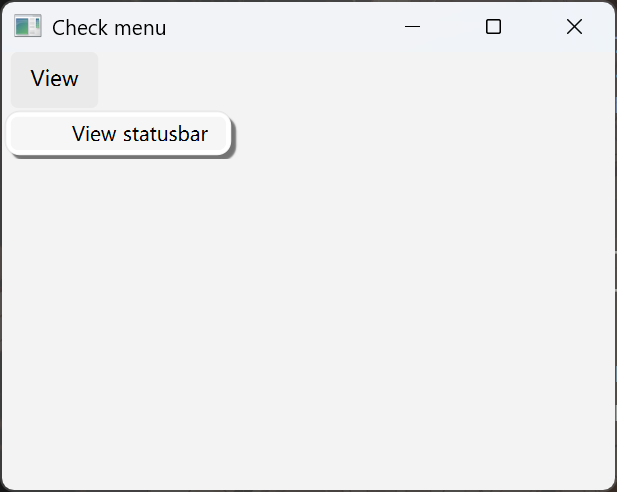
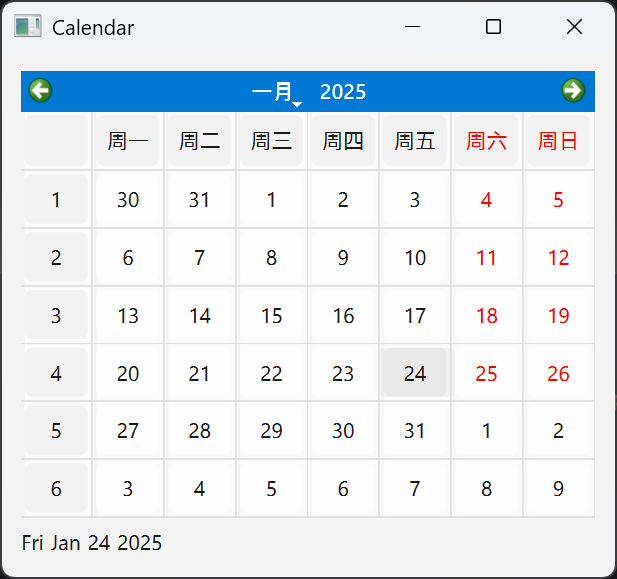

# PyQt6 库

!!! info "学习动机"

    在做实验室项目的时候，我被分配到的活是要用 PyQt6 写一个小的应用。当时由于时间原因，没有任何 PyQt6 的基础的我都是靠 gh Copliot 编写的，自己也就稍微 debug 了一下。现在空下来后，我想好好学一下这个库，感觉它挺好玩的，目前就打算学个皮毛。

    同时我想借这份笔记尝试扭转一个我自认为不好的记笔记习惯——过于啰嗦，这个“坏习惯”困扰了我很久。因为我的时间和精力有限，对于有些可以速成的知识，我更希望以提纲式的风格来整理，而非给出详细的解释。


!!! abstract "参考资料"

    - [PyQt6 中文教程](https://maicss.com/pyqt/v6/)：本笔记为该教程的提炼总结（事实上这个教程也是某个英文教程的翻译）
    - [PyQt6 英文教程](https://www.pythonguis.com/pyqt6-tutorial/)：比较适合入门，但全英文 + 没有暗黑模式有点劝退；且讲得过于啰嗦，不便速成
    - [PyQt6 文档](https://doc.qt.io/qt-6/)：建议直接看英文，中文是机器翻译的


## 引入

一句话介绍 PyQt6：一个用于 GUI 编程的 Python 库（[Qt](https://www.qt.io/) 的 Python 实现）。

### 安装

```sh
pip install PyQt6
```


### 模块

PyQt6 包含以下模块：

- `QtCore`：非 GUI 的核心库，处理时间、文件、目录、各种类型的数据、流(stream)、URLs，mime 类型、线程和进程。
- `QtGui`：窗口系统集成、事件处理、2D 图形，基本图像、字体、文本
- `QtWidgets`：用户界面
- `QtDBus`：使用 D-Bus 处理 IPC 通讯
- `QtNetwork`：网络编程
- `QtHelp`：创建、查看和搜索文档
- `QtXml`：处理 XML 文件
- `QtSvg`：显示 SVG
- `QtSql`：数据库
- `QtTest`：提供了对 PyQt6 应用进行单元测试的工具


### 版本

- `QT_VERSION_STR` 可以显示 Qt 的版本信息
- `PYQT_VERSION_STR` 可以显示 PyQt 的版本信息

它们均来自 `QtCore`


## 创建程序

???+ code "第一个 PyQt6 应用程序"

    ```py
    import sys
    from PyQt6.QtWidgets import QApplication, QWidget

    def main():
        app = QApplication(sys.argv)

        w = QWidget()
        w.resize(250, 200)
        w.move(300, 300)

        w.setWindowTitle('Hello World!')
        w.show()

        sys.exit(app.exec())


    if __name__ == '__main__':
        main()
    ```

运行结果：

<div style="text-align: center">
    
</div>

!!! note "解释"

    - 每个 PyQt6 应用程序都必须创建一个应用程序对象，其中`sys.argv` 是来自命令行的参数列表，如果不想用命令行参数，可用空列表 `[]` 替代 `sys.argv`
    - `QWidget`（部件）是 PyQt6 所有用户界面对象的基类，它有一个默认构造函数（没有父级）。**没有父级（顶层）的小部件称为窗口**
    - 用到的方法：
        - `.resize(w, h)`：改变部件尺寸（`w`、`h`表示宽度和高度）
        - `.move(x, y)`：将部件移动到屏幕指定坐标处
        - `.setWindowTitle(str)`：设置窗口标题
        - `.show()`：显示部件

    - `app.exec()`：进入应用程序的主循环，开始接收、处理事件
        - `sys.exit()`方法确保一个干净的退出

### 气泡提示

`QtWidgets`模块中的 `QToolTip` 类用于创建气泡，相关的方法有：

- `QToolTip.setFont()`：设置字体，接收 `QFont()` 类的参数
    - `QFont(fontStyle, fontSize)`：指定字体，其中 `fontStyle` 指定字体样式（字符串），`fontSize`指定字体大小（正整数）

- `QWidget.setToolTip()`：为部件创建气泡提示框，可以使用富文本内容
- `QPushButton.setToolTip()`：为按钮创建气泡提示框，可以使用富文本内容


### 按钮

`QtWidgets`模块中的 `QPushButton` 类用于创建按钮，相关的方法有：

- `QPushButton(buttonName, parent)`：创建 `QPushButton` 对象，其中 `buttonName` 为按钮名称（字符串），`parent` 为按钮的父部件（`QWidget` 类）
- `.resize(w, h)`：设置按钮尺寸
- `.sizeHint()`：使用系统建议的尺寸
- `.move(x, y)`：移动按钮位置


### 弹窗

以下代码创建了关闭弹窗：

???+ code "代码实现"

    ```py
    class Example(QWidget):

        def __init__(self):
            super().__init__()

            self.initUI()

        def initUI(self):

            self.setGeometry(300, 300, 350, 200)
            self.setWindowTitle('Message box')
            self.show()

        # 关闭 QWidget 操作会产生 QCloseEvent 事件
        # 重新实现 closeEvent 事件处理，替换部件的默认行为

        def closeEvent(self, event):

            # 创建了一个带有两个按钮的消息框：是和否。
            # 第一个参数是标题栏，
            # 第二个参数是对话框显示的消息文本，
            # 第三个参数是对话框中的按钮组合，
            # 最后一个参数是默认选中的按钮，
            # 返回值存储在变量 reply 中。

            reply = QMessageBox.question(self, 'Message',
                        "Are you sure to quit?", QMessageBox.StandardButton.Yes |
                        QMessageBox.StandardButton.No, QMessageBox.StandardButton.No)

            if reply == QMessageBox.StandardButton.Yes:
                event.accept()
            else:
                event.ignore()
    ```


### 窗口居中

调用以下方法实现窗口居中：

???+ code "代码实现"

    ```py
    # 作为上述 Example 类的一个方法
    def center(self):
        # 得到一个矩形的窗口，这里可以放置所有类型的窗口
        qr = self.frameGeometry()

        # 从屏幕属性里计算出分辨率，然后计算出中心点位置
        cp = self.screen().availableGeometry().center()

        # 把矩形窗口的中心点放置到屏幕窗口的中心点
        qr.moveCenter(cp)

        # 把应用窗口的左上方点坐标移动到矩形窗口的左上方
        self.move(qr.topLeft())
    ```


## 状态栏、菜单栏、工具栏

`QMainWindow` 类提供了主程序窗口。在这里可以创建一个具有状态栏、工具栏和菜单栏的经典应用程序框架。

- **状态栏**：显示状态信息，通常位于应用程序窗口的**底部**
- **工具栏**：有一些按钮和应用程序中的一些常用命令
- **菜单栏**：位于各种菜单中的一组命令

### 状态栏

??? code "代码实现"

    ```py hl_lines="13"
    import sys
    from PyQt6.QtWidgets import QMainWindow, QApplication

    class Example(QMainWindow):
        def __init__(self):
            super().__init__()
            self.initUI()

        def initUI(self):
            # QMainWindow 自带状态栏部分
            # 可用 .statusBar() 方法控制状态栏对象
            # 使用状态栏对象的 .showMessage() 方法设置消息文本
            self.statusBar().showMessage('Ready')
            self.setGeometry(300, 300, 350, 250)
            self.setWindowTitle('Statusbar')
            self.show()

    def main():
        app = QApplication(sys.argv)
        ex = Example()
        sys.exit(app.exec())

    if __name__ == '__main__':
        main()
    ```

效果图：

<div style="text-align: center">
    
</div>


### 菜单栏

??? code "代码实现"

    ```py
    import sys
    from PyQt6.QtWidgets import QMainWindow, QApplication
    from PyQt6.QtGui import QIcon, QAction


    class Example(QMainWindow):
        def __init__(self):
            super().__init__()
            self.initUI()

        def initUI(self):
            exitAct = QAction(QIcon('exit.png'), '&Exit', self)  # 创建一个带有特定图标和 Exit 标签的行为(action)
            exitAct.setShortcut('Ctrl+Q')  # 快捷键
            exitAct.setStatusTip('Exit application')  # 状态提示，出现在状态栏（窗口底部）
            # 若选择该行为，则会触发信号
            # 该信号与 QApplication 组件的退出操作连接
            # 因此选中该行为后会退出程序
            exitAct.triggered.connect(QApplication.instance().quit)  

            self.statusBar()

            menubar = self.menuBar()  # 创建菜单栏
            fileMenu = menubar.addMenu('&File')  # 为菜单栏添加菜单项
            fileMenu.addAction(exitAct)  # 为菜单项添加行为

            self.setGeometry(300, 300, 350, 250)
            self.setWindowTitle('Simple menu')
            self.show()

    def main():
        app = QApplication(sys.argv)
        ex = Example()
        sys.exit(app.exec())

    if __name__ == '__main__':
        main()
    ```

效果图：

<div style="text-align: center">
    
</div>


#### 子菜单

??? code "代码实现（仅专注于 `initUI()` 方法的实现）"

    ```py
    def initUI(self):
        menubar = self.menuBar()
        fileMenu = menubar.addMenu('File')

        # 使用 QMenu() 创建一个新的子菜单项
        impMenu = QMenu('Import', self)
        impAct = QAction('Import mail', self)
        impMenu.addAction(impAct)  # 为子菜单项添加行为

        newAct = QAction('New', self)

        fileMenu.addAction(newAct)
        fileMenu.addMenu(impMenu)

        self.setGeometry(300, 300, 350, 250)
        self.setWindowTitle('Submenu')
        self.show()
    ```

效果图：

<div style="text-align: center">
    
</div>


#### 勾选菜单

??? code "代码实现（仅专注于 `initUI()` 方法的实现）"

    ```py
        def initUI(self):
            self.statusbar = self.statusBar()
            self.statusbar.showMessage('Ready')

            menubar = self.menuBar()
            viewMenu = menubar.addMenu('View')

            # 使用 checkable 参数创建一个可以勾选的菜单
            viewStatAct = QAction('View statusbar', self, checkable=True)
            viewStatAct.setStatusTip('View statusbar')
            # 因为状态栏默认可见，所以使用 setChecked 方法勾选菜单
            viewStatAct.setChecked(True)
            viewStatAct.triggered.connect(self.toggleMenu)

            viewMenu.addAction(viewStatAct)

            self.setGeometry(300, 300, 350, 250)
            self.setWindowTitle('Check menu')
            self.show()


        def toggleMenu(self, state):
            if state:
                self.statusbar.show()
            else:
                self.statusbar.hide()
    ```

效果图：

<div style="text-align: center">
    
    
</div>


#### 环境菜单

**环境菜单**(context menu)：点击鼠标右键弹出的菜单（命令列表）。

??? code "代码实现（仅专注于 `initUI()` 方法的实现）"

    ```py
        def initUI(self):
            self.setGeometry(300, 300, 350, 250)
            self.setWindowTitle('Context menu')
            self.show()

        # 重新实现 .contextMenuEvent() 方法，调出一个上下文菜单
        def contextMenuEvent(self, event):
            cmenu = QMenu(self)

            newAct = cmenu.addAction("New")
            openAct = cmenu.addAction("Open")
            quitAct = cmenu.addAction("Quit")
            # .exec 方法使得环境菜单能被调用，且出现在光标所在位置上
            action = cmenu.exec(self.mapToGlobal(event.pos()))

            # 点击环境菜单中的 Quit 命令，便可退出程序
            if action == quitAct:
                QApplication.instance().quit()
    ```

效果图：

<div style="text-align: center">
    
</div>


### 工具栏

??? code "代码实现（仅专注于 `initUI()` 方法的实现）"

    ```py
    def initUI(self):
        # 退出行为
        exitAct = QAction(QIcon('exit24.png'), 'Exit', self)
        exitAct.setShortcut('Ctrl+Q')
        exitAct.triggered.connect(QApplication.instance().quit)

        # .addToolBar()：创建工具栏
        self.toolbar = self.addToolBar('Exit')
        self.toolbar.addAction(exitAct)

        self.setGeometry(300, 300, 350, 250)
        self.setWindowTitle('Toolbar')
        self.show()
    ```

效果图：

<div style="text-align: center">
    
</div>


## 布局

有以下几种放置部件的方法：

- :-1:**绝对定位**：以像素为单位指定每个小部件的位置和大小，但有以下局限性：
    - 部件不会随着窗口的大小改变而改变
    - 部件在不同平台上可能会有不同的外观
    - 如果窗口大小改变，部件可能会重叠或丢失

- :+1:使用 PyQt6 自带的**布局类**：
    - `QHBoxLayout`：水平布局
    - `QVBoxLayout`：垂直布局

    ??? example "例子"

        ???+ code "代码实现（仅专注于 `initUI()` 方法的实现）"

            ```py
            def initUI(self):
                # 创建两个按钮
                okButton = QPushButton("OK")
                cancelButton = QPushButton("Cancel")

                # 创建水平框布局
                hbox = QHBoxLayout()
                # 在两按钮之前增加一个可拉伸的空间
                # 因此按钮会被推到窗口右侧
                hbox.addStretch(1)  
                hbox.addWidget(okButton)
                hbox.addWidget(cancelButton)

                # 创建垂直框布局
                vbox = QVBoxLayout()
                # 将把带有按钮的水平框推到窗口的底部
                vbox.addStretch(1)
                vbox.addLayout(hbox)

                self.setLayout(vbox)

                self.setGeometry(300, 300, 350, 250)
                self.setWindowTitle('Buttons')
                self.show()
            ```

        效果图：

        <div style="text-align: center">
            
        </div>

    - `QGridLayout`：网格布局，把空间分为多行多列

    ??? example "例子"

        === "例1：计算器按钮布局"

            ???+ code "代码实现（仅专注于 `initUI()` 方法的实现）"

                ```py
                def initUI(self):
                    # 设置网格布局
                    grid = QGridLayout()
                    self.setLayout(grid)

                    # 按钮名称
                    names = ['Cls', 'Bck', '', 'Close',
                            '7', '8', '9', '/',
                            '4', '5', '6', '*',
                            '1', '2', '3', '-',
                            '0', '.', '=', '+']

                    # 按钮位置
                    positions = [(i, j) for i in range(5) for j in range(4)]

                    # 将按钮放置在网格布局中
                    for position, name in zip(positions, names):

                        if name == '':
                            continue

                        button = QPushButton(name)
                        grid.addWidget(button, *position)

                    self.move(300, 150)
                    self.setWindowTitle('Calculator')
                    self.show()
                ```

            效果图：

            <div style="text-align: center">
                
            </div>

        === "例2：评论框布局"

            ???+ code "代码实现（仅专注于 `initUI()` 方法的实现）"

                ```py
                def initUI(self):
                    title = QLabel('Title')
                    author = QLabel('Author')
                    review = QLabel('Review')

                    # QLineEdit()：单行文本框
                    # QTextEdit()：多行文本框
                    titleEdit = QLineEdit()
                    authorEdit = QLineEdit()
                    reviewEdit = QTextEdit()

                    grid = QGridLayout()
                    grid.setSpacing(10)

                    grid.addWidget(title, 1, 0)
                    grid.addWidget(titleEdit, 1, 1)

                    grid.addWidget(author, 2, 0)
                    grid.addWidget(authorEdit, 2, 1)

                    grid.addWidget(review, 3, 0)
                    # reviewEdit 组件占用5行1列
                    grid.addWidget(reviewEdit, 3, 1, 5, 1)

                    self.setLayout(grid)

                    self.setGeometry(300, 300, 350, 300)
                    self.setWindowTitle('Review')
                    self.show()
                ```

            效果图：

            <div style="text-align: center">
                
            </div>


## 事件和信号

### 事件

GUI 应用程序是**事件**(event)驱动的。事件主要由应用程序的用户触发，但也可以通过其他方式生成，例如 Internet 连接、窗口管理器或定时器。当我们调用应用程序的 `exec()` 方法时，应用程序进入**主循环**,主循环获取事件并将它们发送到对象。

在事件模型里，有三个要素：

- **事件源**(event source)：状态改变的对象，它会产生事件
- **事件对象**(event object)：即事件本身，封装了事件源中的状态变化
- **事件目标**(event target)：要被通知的对象，事件源对象将处理事件的任务委托给事件目标


### 信号和插槽

PyQt6 有独特的**信号**(signals)和**插槽**(slots)机制来处理事件，用于对象之间的通信，当特定事件发生时触发。插槽可以是可调用的 Python 脚本，当触发连接的信号时会调用插槽脚本（可以理解成**钩子** (hooks)或**回调函数**(callback)）。信号和插槽机制涉及到的三要素为：

- **发送者**(sender)：触发信号的对象
    - 通过部件的 `.sender()` 方法可以获取触发该部件事件的发送者

    ??? example "例子"

        ???+ code "代码实现"

            ```py
            import sys
            from PyQt6.QtWidgets import QMainWindow, QPushButton, QApplication


            class Example(QMainWindow):

                def __init__(self):
                    super().__init__()

                    self.initUI()


                def initUI(self):

                    btn1 = QPushButton("Button 1", self)
                    btn1.move(30, 50)

                    btn2 = QPushButton("Button 2", self)
                    btn2.move(150, 50)

                    # 两个按钮绑定了同一个插槽
                    # 调用触发者方法确定了是哪个按钮触发的事件
                    btn1.clicked.connect(self.buttonClicked)
                    btn2.clicked.connect(self.buttonClicked)

                    self.statusBar()

                    self.setGeometry(300, 300, 450, 350)
                    self.setWindowTitle('Event sender')
                    self.show()


                def buttonClicked(self):

                    sender = self.sender()

                    msg = f'{sender.text()} was pressed'
                    self.statusBar().showMessage(msg)


            def main():

                app = QApplication(sys.argv)
                ex = Example()
                sys.exit(app.exec())


            if __name__ == '__main__':
                main()
            ```

- **接收者**(receiver)：接收信号的对象
- **插槽**(slot)：对信号做出反应的方法

我们还可以利用 `QObject` 主动触发信号。

??? example "例子"

    ???+ code "代码实现"

        ```py
        import sys
        from PyQt6.QtCore import pyqtSignal, QObject
        from PyQt6.QtWidgets import QMainWindow, QApplication

        # 创建了名为 closeApp 的信号
        # 在鼠标按下的时候触发，和关闭插槽 QMainWindow 绑定
        class Communicate(QObject):
            closeApp = pyqtSignal()


        class Example(QMainWindow):
            def __init__(self):
                super().__init__()
                self.initUI()

            def initUI(self):
                # 自定义信号 closeApp 绑定到 QMainWindow 的关闭插槽上
                self.c = Communicate()
                self.c.closeApp.connect(self.close)
                self.setGeometry(300, 300, 450, 350)
                self.setWindowTitle('Emit signal')
                self.show()

            # 在窗口上点击鼠标按钮的时候，触发 closeApp 信号，程序终止
            def mousePressEvent(self, e):
                self.c.closeApp.emit()

        def main():
            app = QApplication(sys.argv)
            ex = Example()
            sys.exit(app.exec())

        if __name__ == '__main__':
            main()
        ```

### 事件处理程序

PyQt 为所有的事件都提供了默认的**处理程序**(handler)实现，这样的事件称为**默认事件**。默认事件可能有自己的逻辑，比如拖选，点击，有的可能只是一个空函数。

- 空函数都需要重新覆盖原来的实现，以达到事件处理的目的
- 有默认事件处理函数的，也有可能被覆盖实现，比如禁用自带的拖选，或者重写拖选的效果等

??? example "例子：重新实现 `keyPressEvent` 的事件处理器"

    ???+ code "代码实现"

        ```py
        import sys
        from PyQt6.QtCore import Qt
        from PyQt6.QtWidgets import QWidget, QApplication


        class Example(QWidget):

            def __init__(self):
                super().__init__()
                self.initUI()


            def initUI(self):
                self.setGeometry(300, 300, 350, 250)
                self.setWindowTitle('Event handler')
                self.show()


            def keyPressEvent(self, e):
                if e.key() == Qt.Key.Key_Escape.value:
                    self.close()


        def main():
            app = QApplication(sys.argv)
            ex = Example()
            sys.exit(app.exec())


        if __name__ == '__main__':
            main()
        ```

    按下 `Escape` 键后，窗口会关闭。


### 事件对象

事件对象是一个 Python 对象，包含了一系列描述这个事件的属性，具体内容要看触发的事件。

??? example "例子"

    下面的应用程序可以展示鼠标光标在窗口的坐标。

    ???+ code "代码实现"

        ```py
        import sys
        from PyQt6.QtCore import Qt
        from PyQt6.QtWidgets import QWidget, QApplication, QGridLayout, QLabel


        class Example(QWidget):
            def __init__(self):
                super().__init__()
                self.initUI()

            def initUI(self):
                grid = QGridLayout()
                x = 0
                y = 0
                self.text = f'x: {x},  y: {y}'
                self.label = QLabel(self.text, self)
                grid.addWidget(self.label, 0, 0, Qt.AlignmentFlag.AlignTop)

                # 鼠标跟踪默认是关闭的，
                # 此时只有当鼠标移动且按下鼠标时，组件才会接收到事件
                # 开启鼠标跟踪后，只移动鼠标不按下鼠标按钮，也能接收到事件
                self.setMouseTracking(True)
                self.setLayout(grid)
                self.setGeometry(300, 300, 450, 300)
                self.setWindowTitle('Event object')
                self.show()

            # e 是事件对象，它包含了事件触发时候的数据
            # 通过它的 .position().x() 和 .position().y() 方法可以获取鼠标的 x 和 y 坐标
            def mouseMoveEvent(self, e):
                x = int(e.position().x())
                y = int(e.position().y())
                text = f'x: {x},  y: {y}'
                self.label.setText(text)

        def main():
            app = QApplication(sys.argv)
            ex = Example()
            sys.exit(app.exec())

        if __name__ == '__main__':
            main()
        ```

    效果图：

    <div style="text-align: center">
        
    </div>


## 对话框

在计算机程序中，**对话框**(dialog)是用于与应用程序 “交谈” 的窗口，用于诸如从用户那里获取数据或更改应用程序设置之类的事情。

PyQt6 提供了以下几种对话框：

- `QInputDialog`：输入对话框，输入值可以是字符串、数字或列表中的项目。

    ??? example "例子"

        ???+ code "代码实现"

            ```py
            from PyQt6.QtWidgets import (QWidget, QPushButton, QLineEdit, QInputDialog, QApplication)
            import sys


            class Example(QWidget):
                def __init__(self):
                    super().__init__()
                    self.initUI()

                def initUI(self):
                    self.btn = QPushButton('Dialog', self)
                    self.btn.move(20, 20)
                    self.btn.clicked.connect(self.showDialog)
                    self.le = QLineEdit(self)
                    self.le.move(130, 22)
                    self.setGeometry(300, 300, 450, 350)
                    self.setWindowTitle('Input dialog')
                    self.show()

                def showDialog(self):
                    # 打开了输入对话框，
                    # 第一个参数是对话框标题，
                    # 第二个参数是对话框里的提示信息，
                    # 对话框会返回输入的文本和一个布尔值
                    # 如果点击 OK 按钮，这个布尔值是 true
                    text, ok = QInputDialog.getText(self, 'Input Dialog', 'Enter your name:')
                    if ok:
                        self.le.setText(str(text))

            def main():
                app = QApplication(sys.argv)
                ex = Example()
                sys.exit(app.exec())


            if __name__ == '__main__':
                main()
            ```

    效果图：

    <div style="text-align: center">
        
        
    </div>

- `QColorDialog`：颜色对话框，可以选择不同的颜色

    ??? example "例子"

        ???+ code "代码实现"

            ```py
            from PyQt6.QtWidgets import (QWidget, QPushButton, QFrame,
                    QColorDialog, QApplication)
            from PyQt6.QtGui import QColor
            import sys


            class Example(QWidget):
                def __init__(self):
                    super().__init__()
                    self.initUI()

                def initUI(self):
                    # 初始背景颜色
                    col = QColor(0, 0, 0)
                    self.btn = QPushButton('Dialog', self)
                    self.btn.move(20, 20)
                    self.btn.clicked.connect(self.showDialog)
                    self.frm = QFrame(self)
                    self.frm.setStyleSheet("QWidget { background-color: %s }" % col.name())
                    self.frm.setGeometry(130, 22, 200, 200)
                    self.setGeometry(300, 300, 450, 350)
                    self.setWindowTitle('Color dialog')
                    self.show()


                def showDialog(self):
                    col = QColorDialog.getColor()
                    # 检查颜色是否有效
                    # 如果点击取消按钮，没有返回可用的颜色值
                    # 如果返回的颜色是有效值，就使用样式表修改背景颜色
                    if col.isValid():
                        self.frm.setStyleSheet("QWidget { background-color: %s }" % col.name())

            def main():
                app = QApplication(sys.argv)
                ex = Example()
                sys.exit(app.exec())


            if __name__ == '__main__':
                main()
            ```

    效果图：

    <div style="text-align: center">
        
        
    </div>

- `QFontDialog`：字体对话框，可以选择字体样式、大小、粗细等

    ??? example "例子"

        ???+ code "代码实现"

            ```py
            from PyQt6.QtWidgets import (QWidget, QVBoxLayout, QPushButton, QSizePolicy, QLabel, QFontDialog, QApplication)
            import sys

            class Example(QWidget):
                def __init__(self):
                    super().__init__()
                    self.initUI()

                def initUI(self):
                    vbox = QVBoxLayout()
                    btn = QPushButton('Dialog', self)
                    btn.setSizePolicy(QSizePolicy.Policy.Fixed, QSizePolicy.Policy.Fixed)
                    btn.move(20, 20)
                    vbox.addWidget(btn)
                    btn.clicked.connect(self.showDialog)
                    self.lbl = QLabel('Knowledge only matters', self)
                    self.lbl.move(130, 20)
                    vbox.addWidget(self.lbl)
                    self.setLayout(vbox)
                    self.setGeometry(300, 300, 450, 350)
                    self.setWindowTitle('Font dialog')
                    self.show()

                def showDialog(self):
                    # 弹出字体选择对话框
                    # getFont 方法返回了选择的字体名称和 ok 参数，
                    # 如果点击 Ok 按钮，ok 的值是 True，反则是 False
                    font, ok = QFontDialog.getFont()
                    if ok:
                        self.lbl.setFont(font)

            def main():
                app = QApplication(sys.argv)
                ex = Example()
                sys.exit(app.exec())


            if __name__ == '__main__':
                main()
            ```

    效果图：

    <div style="text-align: center">
        
        
        
    </div>


- `QFileDialog`：文件对话框，可以选中文件或文件夹，用作选择或保存操作

    ??? example "例子"

        ???+ code "代码实现"

            ```py
            from PyQt6.QtWidgets import (QMainWindow, QTextEdit, QFileDialog, QApplication)
            from PyQt6.QtGui import QIcon, QAction
            from pathlib import Path
            import sys


            class Example(QMainWindow):
                def __init__(self):
                    super().__init__()
                    self.initUI()

                def initUI(self):
                    self.textEdit = QTextEdit()
                    self.setCentralWidget(self.textEdit)
                    self.statusBar()
                    openFile = QAction(QIcon('open.png'), 'Open', self)
                    openFile.setShortcut('Ctrl+O')
                    openFile.setStatusTip('Open new File')
                    openFile.triggered.connect(self.showDialog)
                    menubar = self.menuBar()
                    fileMenu = menubar.addMenu('&File')
                    fileMenu.addAction(openFile)
                    self.setGeometry(300, 300, 550, 450)
                    self.setWindowTitle('File dialog')
                    self.show()

                def showDialog(self):
                    # 使用 path 模块来确定用户的主目录
                    home_dir = str(Path.home())
                    # 弹出 QFileDialog
                    # getOpenFileName 的第一个参数字符串是标题，
                    # 第二个字符串指定对话框工作目录
                    fname = QFileDialog.getOpenFileName(self, 'Open file', home_dir)
                    if fname[0]:
                        f = open(fname[0], 'r')
                        with f:
                            data = f.read()
                            self.textEdit.setText(data)

            def main():
                app = QApplication(sys.argv)
                ex = Example()
                sys.exit(app.exec())


            if __name__ == '__main__':
                main()
            ```

    效果图：

    <div style="text-align: center">
        
        
    </div>


## 组件

### QCheckBox

`QCheckBox` 组件有两个状态：选中和非选中，由复选框和文字组成，用于表示某个属性的开闭状态。

??? example "例子"

    ???+ code "代码实现"

        ```py
        from PyQt6.QtWidgets import QWidget, QCheckBox, QApplication
        from PyQt6.QtCore import Qt
        import sys


        class Example(QWidget):
            def __init__(self):
                super().__init__()
                self.initUI()

            def initUI(self):
                cb = QCheckBox('Show title', self)
                cb.move(20, 20)
                # 勾选复选框
                cb.toggle()
                # 把用户定义的 changeTitle 方法和 stateChanged 信号连接起来
                cb.stateChanged.connect(self.changeTitle)
                self.setGeometry(300, 300, 350, 250)
                self.setWindowTitle('QCheckBox')
                self.show()

            def changeTitle(self, state):
                # 如果复选框被勾选，窗口标题会显示 'QCheckBox'，否则显示空白（空字符串）
                if state == Qt.CheckState.Checked.value:
                    self.setWindowTitle('QCheckBox')
                else:
                    self.setWindowTitle(' ')

        def main():
            app = QApplication(sys.argv)
            ex = Example()
            sys.exit(app.exec())


        if __name__ == '__main__':
            main()
        ```

    效果图：

    <div style="text-align: center">
        
        
    </div>


### QPushButton

QPushButton 作为切换按钮时有两个状态：按下(pressed)与释放(released)。

??? example "例子"

    用特定按钮的按下与否来改变组件的背景颜色。

    ???+ code "代码实现"

        ```py
        from PyQt6.QtWidgets import (QWidget, QPushButton, QFrame, QApplication)
        from PyQt6.QtGui import QColor
        import sys

        class Example(QWidget):
            def __init__(self):
                super().__init__()
                self.initUI()

            def initUI(self):
                # 初始颜色为黑色
                self.col = QColor(0, 0, 0)

                redb = QPushButton('Red', self)
                # 设置按钮为可选，从而创建一个切换按钮（具备按下和释放两种状态）
                redb.setCheckable(True)
                redb.move(10, 10)
                # 把用户自定义的方法和点击信号绑定，用点击信号改变一个布尔值
                redb.clicked[bool].connect(self.setColor)

                greenb = QPushButton('Green', self)
                greenb.setCheckable(True)
                greenb.move(10, 60)
                greenb.clicked[bool].connect(self.setColor)

                blueb = QPushButton('Blue', self)
                blueb.setCheckable(True)
                blueb.move(10, 110)
                blueb.clicked[bool].connect(self.setColor)

                self.square = QFrame(self)
                self.square.setGeometry(150, 20, 100, 100)
                self.square.setStyleSheet("QWidget { background-color: %s }" %
                                        self.col.name())

                self.setGeometry(300, 300, 300, 250)
                self.setWindowTitle('Toggle button')
                self.show()

            def setColor(self, pressed):
                # 获取到点击的按钮
                source = self.sender()
                if pressed:
                    val = 255
                else:
                    val = 0

                if source.text() == "Red":
                    self.col.setRed(val)
                elif source.text() == "Green":
                    self.col.setGreen(val)
                else:
                    self.col.setBlue(val)

                self.square.setStyleSheet("QFrame { background-color: %s }" % self.col.name())

        def main():
            app = QApplication(sys.argv)
            ex = Example()
            sys.exit(app.exec())


        if __name__ == '__main__':
            main()
        ```

    效果图：

    <div style="text-align: center">
        
        
        
    </div>


### QSlider

`QSlider` 是一个简单的滑块小部件，可以前后拖动，通过这种方式为特定的任务选择一个值，有时比输入数字更自然。

??? example "例子"

    ???+ code "代码实现"

        ```py
        from PyQt6.QtWidgets import (QWidget, QSlider, QLabel, QApplication)
        from PyQt6.QtCore import Qt
        from PyQt6.QtGui import QPixmap
        import sys


        class Example(QWidget):
            def __init__(self):
                super().__init__()
                self.initUI()

            def initUI(self):
                # 创建水平滑块
                sld = QSlider(Qt.Orientation.Horizontal, self)
                sld.setFocusPolicy(Qt.FocusPolicy.NoFocus)
                sld.setGeometry(30, 40, 200, 30)
                # 把 valueChanged 信号和用户定义的 changeValue 方法绑定
                sld.valueChanged[int].connect(self.changeValue)
                self.label = QLabel(self)
                # 创建一个 QLabel 组件，并给它初始化一个静音的图标
                self.label.setPixmap(QPixmap('mute.png'))
                self.label.setGeometry(250, 40, 80, 30)
                self.setGeometry(300, 300, 350, 250)
                self.setWindowTitle('QSlider')
                self.show()

            # 根据滑块的值，修改标签的图像
            def changeValue(self, value):
                if value == 0:
                    self.label.setPixmap(QPixmap('mute.png'))
                elif 0 < value <= 30:
                    self.label.setPixmap(QPixmap('min.png'))
                elif 30 < value < 80:
                    self.label.setPixmap(QPixmap('med.png'))
                else:
                    self.label.setPixmap(QPixmap('max.png'))

        def main():
            app = QApplication(sys.argv)
            ex = Example()
            sys.exit(app.exec())


        if __name__ == '__main__':
            main()
        ```


### QProgressBar

`QProgressBar` 是一个动态的进度条部件，用于显示任务的进度。PyQt6 提供了水平和垂直的进度条，并且可以设置最小值和最大值，默认分别为 0 和 99。

??? example "例子"

    ???+ code "代码实现"

        ```py
        from PyQt6.QtWidgets import (QWidget, QProgressBar, QPushButton, QApplication)
        from PyQt6.QtCore import QBasicTimer
        import sys

        class Example(QWidget):
            def __init__(self):
                super().__init__()
                self.initUI()

            def initUI(self):
                # 创建水平精度条
                self.pbar = QProgressBar(self)
                self.pbar.setGeometry(30, 40, 200, 25)
                self.btn = QPushButton('Start', self)
                self.btn.move(40, 80)
                self.btn.clicked.connect(self.doAction)

                # 使用定时器对象启动进度条
                self.timer = QBasicTimer()
                self.step = 0
                self.setGeometry(300, 300, 280, 170)
                self.setWindowTitle('QProgressBar')
                self.show()

            def timerEvent(self, e):
                if self.step >= 100:
                    self.timer.stop()
                    self.btn.setText('Finished')
                    return
                self.step = self.step + 1
                self.pbar.setValue(self.step)

            def doAction(self):
                if self.timer.isActive():
                    self.timer.stop()
                    self.btn.setText('Start')
                else:
                    # 调用定时器的开始方法，触发定时器事件
                    # 方法有两个参数，超时时间和接收事件的对象
                    self.timer.start(100, self)
                    self.btn.setText('Stop')

        def main():
            app = QApplication(sys.argv)
            ex = Example()
            sys.exit(app.exec())


        if __name__ == '__main__':
            main()
        ```

    效果图：

    <div style="text-align: center">
        
    </div>


### QCalendarWidget

`QCalendarWidget` 提供了一个月视图的日历组件，它能让用户简单直观的选择日期。

??? example "例子"

    ???+ code "代码实现"

        ```py
        from PyQt6.QtWidgets import (QWidget, QCalendarWidget, QLabel, QApplication, QVBoxLayout)
        from PyQt6.QtCore import QDate
        import sys

        class Example(QWidget):
            def __init__(self):
                super().__init__()
                self.initUI()

            def initUI(self):
                vbox = QVBoxLayout(self)
                # 创建日历部件
                cal = QCalendarWidget(self)
                cal.setGridVisible(True)
                # 选中一个日期，会触发 clicked[QDate] 信号，
                # 信号是和用户定义的 showDate() 方法绑定
                cal.clicked[QDate].connect(self.showDate)
                vbox.addWidget(cal)
                self.lbl = QLabel(self)
                date = cal.selectedDate()
                self.lbl.setText(date.toString())
                vbox.addWidget(self.lbl)
                self.setLayout(vbox)
                self.setGeometry(300, 300, 350, 300)
                self.setWindowTitle('Calendar')
                self.show()

            def showDate(self, date):
                self.lbl.setText(date.toString())

        def main():
            app = QApplication(sys.argv)
            ex = Example()
            sys.exit(app.exec())


        if __name__ == '__main__':
            main()
        ```

    效果图：

    <div style="text-align: center">
        
    </div>


### QPixmap

`QPixmap` 是用于处理图像的小组件，为显示图像进行了优化。相关方法有：

- `QPixmap(pictureName)`：创建一个 `QPixmap` 对象，`pictureName` 是图像文件的路径
- 一些部件（比如 `QLabel`）具有 `setPixmap()` 方法，可以将 `QPixmap` 对象作为参数传入，从而显示图像


### QLineEdit

`QLineEdit`是一个可以输入单行文本的组件，它有撤消和重做、剪切和粘贴以及拖放功能。

??? example "例子"

    在编辑器里输入的文本会立即显示在标签部件里。

    ???+ code "代码实现"

        ```py
        import sys
        from PyQt6.QtWidgets import (QWidget, QLabel, QLineEdit, QApplication)


        class Example(QWidget):
            def __init__(self):
                super().__init__()
                self.initUI()

            def initUI(self):
                self.lbl = QLabel(self)
                # 创建 QLineEdit 部件
                qle = QLineEdit(self)
                qle.move(60, 100)
                self.lbl.move(60, 40)
                # 如果编辑器的文本发生了变化，就调用 onChanged 方法
                qle.textChanged[str].connect(self.onChanged)
                self.setGeometry(300, 300, 350, 250)
                self.setWindowTitle('QLineEdit')
                self.show()

            def onChanged(self, text):
                # 把输入的文本设置到标签组件里
                self.lbl.setText(text)
                # 使用 adjustSize 方法调整文字显示
                self.lbl.adjustSize()

        def main():
            app = QApplication(sys.argv)
            ex = Example()
            sys.exit(app.exec())


        if __name__ == '__main__':
            main()
        ```

    效果图：

    <div style="text-align: center">
        
    </div>


### QSplitter

`QSplitter` 允许用户通过拖动子部件之间的边界来控制子部件的大小。

??? example "例子"

    ???+ code "代码实现"

        ```py
        import sys
        from PyQt6.QtCore import Qt
        from PyQt6.QtWidgets import (QWidget, QHBoxLayout, QFrame, QSplitter, QApplication)

        class Example(QWidget):
            def __init__(self):
                super().__init__()
                self.initUI()

            def initUI(self):
                hbox = QHBoxLayout(self)

                topleft = QFrame(self)
                # 给框架组件设置一些样式，这样更容易看清楚边界
                topleft.setFrameShape(QFrame.Shape.StyledPanel)

                topright = QFrame(self)
                topright.setFrameShape(QFrame.Shape.StyledPanel)

                bottom = QFrame(self)
                bottom.setFrameShape(QFrame.Shape.StyledPanel)

                splitter1 = QSplitter(Qt.Orientation.Horizontal)
                splitter1.addWidget(topleft)
                splitter1.addWidget(topright)

                splitter2 = QSplitter(Qt.Orientation.Vertical)
                splitter2.addWidget(splitter1)
                splitter2.addWidget(bottom)

                hbox.addWidget(splitter2)
                self.setLayout(hbox)

                self.setGeometry(300, 300, 450, 400)
                self.setWindowTitle('QSplitter')
                self.show()

        def main():
            app = QApplication(sys.argv)
            ex = Example()
            sys.exit(app.exec())

        if __name__ == '__main__':
            main()
        ```

    效果图：

    <div style="text-align: center">
        
    </div>


### QComboBox

`QComboBox` 是下拉选框组件，能让用户在一系列选项中进行选择。

??? example "例子"

    ???+ code "代码实现"

        ```py
        import sys
        from PyQt6.QtWidgets import (QWidget, QLabel, QComboBox, QApplication)

        class Example(QWidget):
            def __init__(self):
                super().__init__()
                self.initUI()

            def initUI(self):
                self.lbl = QLabel('Ubuntu', self)
                combo = QComboBox(self)
                # 创建有五个选项的 QComboBox 组件
                combo.addItem('Ubuntu')
                combo.addItem('Mandriva')
                combo.addItem('Fedora')
                combo.addItem('Arch')
                combo.addItem('Gentoo')
                combo.move(50, 50)
                self.lbl.move(50, 150)
                # 如果选择了一个选项，就调用 onActivated 方法
                combo.textActivated[str].connect(self.onActivated)
                self.setGeometry(300, 300, 450, 400)
                self.setWindowTitle('QComboBox')
                self.show()

            def onActivated(self, text):
                self.lbl.setText(text)
                self.lbl.adjustSize()

        def main():
            app = QApplication(sys.argv)
            ex = Example()
            sys.exit(app.exec())


        if __name__ == '__main__':
            main()
        ```

    效果图：

    <div style="text-align: center">
        
    </div>


## 拖放

在计算机图形界面中，**拖放**(drag)是点击一个对象不放，把它放在另外一个地方或者另外一个对象上面的操作，这使得用户能够直观地做复杂的事情。一般来说，这会触发很多类型的行为，或者在两个对象上建立多种关系。

通常可以拖放两种事物：**数据**或**图形对象**。

- 将图像从一个应用程序拖到另一个应用程序，操作的是二进制数据
- 在浏览器中拖动一个选项卡并将其移动到另一个位置，操作的是一个图形组件

PyQt6 提供了 `QDrag` 类，它为基于 `MIME` 的拖放数据传输提供支持，能够处理拖放操作中的大部分细节，传输的数据包含在 `QMimeData` 对象中。

??? example "例子"

    === "例1"

        !!! warning "注意"

            该例子的效果在我的电脑中没能复现。

        ???+ code "代码实现"

            ```py
            import sys

            from PyQt6.QtWidgets import (QPushButton, QWidget, QLineEdit, QApplication)


            class Button(QPushButton):
                def __init__(self, title, parent):
                    super().__init__(title, parent)
                    # 处理部件的释放事件
                    self.setAcceptDrops(True)
                # 仅接受纯文本数据类型
                def dragEnterEvent(self, e):
                    if e.mimeData().hasFormat('text/plain'):
                        e.accept()
                    else:
                        e.ignore()
                # 处理释放事件：修改按钮组件的文本
                def dropEvent(self, e):
                    self.setText(e.mimeData().text())


            class Example(QWidget):
                def __init__(self):
                    super().__init__()
                    self.initUI()

                def initUI(self):
                    edit = QLineEdit('', self)
                    # 使行编辑器能够被拖放
                    edit.setDragEnabled(True)
                    edit.move(30, 65)
                    button = Button("Button", self)
                    button.move(190, 65)
                    self.setWindowTitle('Simple drag and drop')
                    self.setGeometry(300, 300, 300, 150)

            def main():
                app = QApplication(sys.argv)
                ex = Example()
                ex.show()
                app.exec()


            if __name__ == '__main__':
                main()
            ```

    === "例2"

        窗口里有个按钮部件，
        
        - 鼠标左键点击它，会在控制台打印 press 消息，
        - 鼠标右键可以点击拖放它

        ???+ code "代码实现"

            ```py
            import sys

            from PyQt6.QtCore import Qt, QMimeData
            from PyQt6.QtGui import QDrag
            from PyQt6.QtWidgets import QPushButton, QWidget, QApplication

            class Button(QPushButton):
                def __init__(self, title, parent):
                    super().__init__(title, parent)

                # 处理拖放操作
                # 定义鼠标右键为触发拖放操作的按钮
                def mouseMoveEvent(self, e):
                    if e.buttons() != Qt.MouseButton.RightButton:
                        return
                    mimeData = QMimeData()

                    # 创建 QDrag 对象，以提供基于 MIME 数据类型的拖放操作
                    drag = QDrag(self)
                    drag.setMimeData(mimeData)
                    drag.setHotSpot(e.position().toPoint() - self.rect().topLeft())
                    
                    # 执行拖放操作
                    dropAction = drag.exec(Qt.DropAction.MoveAction)

                def mousePressEvent(self, e):
                    super().mousePressEvent(e)
                    if e.button() == Qt.MouseButton.LeftButton:
                        print('press')

            class Example(QWidget):
                def __init__(self):
                    super().__init__()
                    self.initUI()

                def initUI(self):
                    self.setAcceptDrops(True)
                    self.button = Button('Button', self)
                    self.button.move(100, 65)
                    self.setWindowTitle('Click or Move')
                    self.setGeometry(300, 300, 550, 450)

                def dragEnterEvent(self, e):
                    e.accept()

                # 处理鼠标释放按钮后的操作：
                # 把组件的位置修改为鼠标当前坐标
                def dropEvent(self, e):
                    position = e.position()
                    self.button.move(position.toPoint())
                    # 指定拖放操作的类型：鼠标移动
                    e.setDropAction(Qt.DropAction.MoveAction)
                    e.accept()

            def main():     
                app = QApplication(sys.argv)
                ex = Example()
                ex.show()
                app.exec()

            if __name__ == '__main__':
                main()
            ```

        效果图：

        <div style="text-align: center">
            
            
        </div>


## 日期和时间

`QtCore` 模块中的 `QDate`，`QDateTime`，`QTime` 类用于处理日期和时间，其中：

- `QDate`：处理公历中的日期的类，有获取、比较或操作日期的方法
- `QTime`：处理时间的类，提供了比较时间、确定时间和其他各种时间操作方法
- - `QDateTime`：前两者的组合

具体方法：

- 获取当前日期/时间：
    - `QDate.currentDate()`：当前日期，格式：yyyy-mm-dd（ISO）或 dd Mon. yyyy（RFC2822）
    - `QTime.currentTime()`：当前时间，格式：hh:mm:ss
    - `QDateTime.currentDateTime()`：当前日期&时间，格式：Wk. Mon. dd hh:mm:ss yyyy
    - 返回不同格式的日期（`now = QDate.currentDate()`）：
        - ISO：`now.toString(Qt.DateFormat.ISODate)`
        - RFC2822：`now.toString(Qt.DateFormat.ISODate)`

- 天数（`d = QDate(2025, 1, 23)` 创建一个带具体日期的对象）
    - `d.daysInMonth()`：返回指定月份的天数
    - `d.daysInMonth()`：返回指定年份的天数

- 天数差：`date1.daysTo(date2)`，计算 `|date1 - date2|`，单位为天，其中 `date1, date2` 均为 `QDate` 类对象
- 时间计算：通过 `QDateTime` 对象中形如 `.addxxx()` 的方法实现对时间的加减（接收一个整数参数，可正可负）
    - `.addDays()`：日
    - `.addMonths()`：月
    - `.addYears()`：年
    - `.addSecs()`：秒


## 绘画

目前用不到，就暂且不学了...

## 自定义组件

目前用不到，就暂且不学了...


