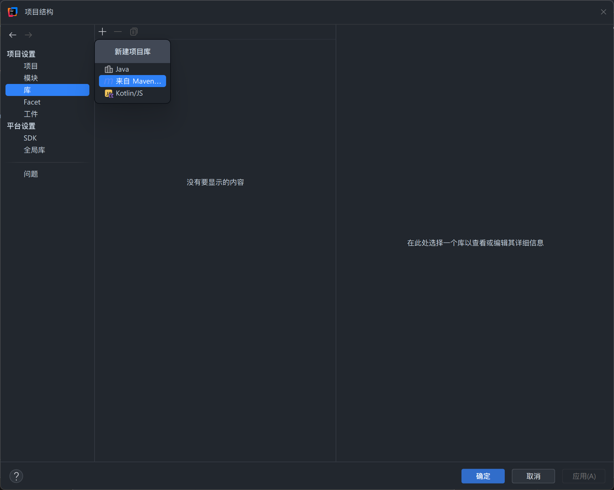
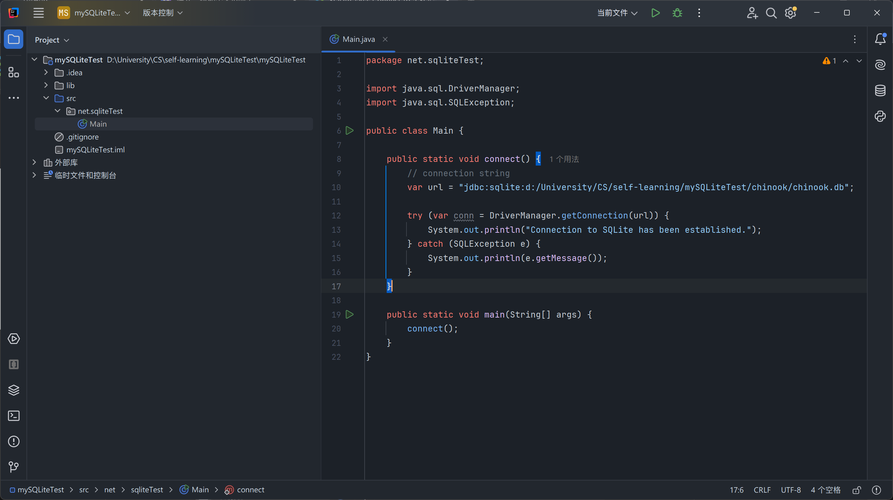

# SQLite

!!! abstract "参考资料"

    - [官网](https://www.sqlite.org/index.html)
    - [英文教程](https://www.sqlitetutorial.net/)：本笔记主要参考这篇教程写的
        - 为了让笔记更为精简，我忽略了其中一些简单的例子，如果想要跟着例子学习的话请直接阅读这篇教程（~~不过个人觉得没有必要~~）
    - [菜鸟教程](https://www.runoob.com/sqlite/sqlite-tutorial.html)
    - [wiki](https://en.wikipedia.org/wiki/SQLite)
    - SQLite API 相关：
        - [Python sqlite3 库](https://docs.python.org/zh-cn/3.13/library/sqlite3.html)


## 介绍

[SQLite](https://en.wikipedia.org/wiki/SQLite) 是一个提供关系型数据库管理系统的软件库。名称中的 "lite" 表现的是 SQLite 在设置、数据库管理和需求资源等方面的**轻量化**(lightweighted)本质。具体来说，SQLite 具备以下显著特点：

- **自给**(self-contained)：不需要操作系统或外部库提供很多资源，这使得它能够在任何环境下（包括嵌入式系统）运行，可移植性高。
- **无需服务器**(severless)：一般的 RDBMS，比如 MySQL 和 PostgreSQL 需要一台单独的服务器，应用程序通过 TCP/IP 协议的发送和请求来访问数据库服务器。然而，SQLite 的数据库就集成在应用程序中，应用程序可以直接从数据库中读写数据。

<div style="text-align: center">
    
</div>

- **零配置**(zero-configuration)：正因为 SQLite 的无服务器架构，因此我们无须事先配置 SQLite
- **事务处理的**(transactional)：SQLite 的事务遵守 ACID，即具备原子性(atomic)、一致性(consistent)、隔离性(isolated)和持久性(durable)的特征

此外，SQLite 还具备以下独特之处：

- 使用动态类型，因此能在表中的任何列存储任何值，可无视声明的类型
- 允许通过单个数据库连接来同时访问多个数据库文件
- 由于 SQLite 创建的数据库位于内存中，因此原型设计(prototyping)和测试的速度会非常快

!!! question "何时使用 SQLite 呢？"

    - 嵌入式应用
    - 本地存储：SQLite 很适合那些需要在本地存储用户偏好、设置和缓存的应用
    - 跨平台应用：SQLite 支持多平台运行
    - 快速的原型设计和开发
    - 物联网(IoT)设备：由于 IoT 使用资源有限，因此轻量级的 SQLite 能胜任这种情况


## 下载&安装

前往官方的[下载页](https://www.sqlite.org/download.html)，根据自己的电脑类型下载合适的版本。下面以 Windows 版本和 Linux 版本为例：

=== "Windows 11"

    1. 在下载页中找到 Windows 版本，点击下图红色方框处的链接下载。

        <div style="text-align: center">
            
        </div>

    2. 下载好后解压压缩包，得到文件夹，然后点击进入。

        <div style="text-align: center">
            
        </div>

    3. 按住 Shift 键，然后右键点击文件夹里的空白部分，呼出 Windows 10 风格的菜单，点击带有“终端”字样的选项。

        <div style="text-align: center">
            
        </div>

        >熟悉命令行操作的小伙伴可以用 `cd` 命令切换到 sqlite 所在目录，无需遵守2, 3两步

    4. 在终端命令行中输入 `sqlite`，如果输出如下所示的信息，则说明 SQLite 可以正常运行。

        <div style="text-align: center">
            
        </div>

    5.（可选，但十分推荐）退出 SQLite 程序（输入 `.quit` 命令），将 sqlite 所在目录迁移到合适的位置，然后设置环境变量，使得 SQLite 在电脑的任何目录下都可以运行。
    
    - 按下 Win + R 键，打开“运行”界面，输入 sysdm.cpl 后敲回车，进入“系统属性”界面

        <div style="text-align: center">
            
        </div>

    - 点击该界面的“高级”选项卡，然后点击“环境变量”按钮

        <div style="text-align: center">
            
        </div>

    - 在“环境变量”界面选中 Path 并双击，编辑该环境变量。然后在该界面新建项，内容为 SQLite 程序的目录（我这里放在 D:\sqlite 目录下）

        <div style="text-align: center">
            
            
        </div>

    - 最后不要忘记点击三个“确定”按钮，依次退出上述打开的界面，这样才能保存我们的设置
    - 重新打开终端，输入 `sqlite3`，如果不出意外的话，在任何目录下应当都可以启动 SQLite 了（现在我在 HOME 目录下也能打开 SQLite 了）！

        <div style="text-align: center">
            
        </div>


=== "Ubuntu 24.04 LTS"

    超级简单，只要输入以下命令即可：

    ```sh
    $ sudo apt update               # 更新
    $ sudo apt install sqlite3      # 不要忘记最后的 3
    $ sqlite3                       # SQLite，启动！
    ```

    如果出现类似下面的打印信息，说明安装成功啦！

    ```
    SQLite version 3.45.3 2024-04-15 13:34:05
    Enter ".help" for usage hints.
    Connected to a transient in-memory database.
    Use ".open FILENAME" to reopen on a persistent database.
    sqlite>
    ```

=== "macOS 15.4"

    和 Ubuntu 的类似，安装命令为 `brew install sqlite3`，也是相当简单的。


此外，SQLite 还有 GUI 工具，比如：

- [SQLiteStudio](https://github.com/pawelsalawa/sqlitestudio)
- [DBeaver](https://dbeaver.io/)
- [DB Browser for SQLite](https://sqlitebrowser.org/)

不过，鉴于笔者时间有限，外加笔者喜欢用命令行访问数据库的习惯（~~感觉这样更像一名 CSer~~），所以这些工具的安装和使用就不再介绍了，对此感兴趣的读者可以点击这些链接或者在网上搜索相关教程进行学习。


## 命令行环境

最开始，我们需要在命令行环境执行 `sqlite3 path/to/my_database.db` 指令，用 SQLite **打开**已经存在的数据库文件，或者**创建**不存在的数据库文件。如果命令行的开头变成了 `sqlite>`，说明 SQLite 成功启动。

在 SQLite 中，所有的命令都是以 `.` 开头的。这里先介绍一些最基本，也是最常用的 SQLite 命令：


- `.open .open FILENAME`：也可以在 SQLite 内打开数据库文件
- `.databases`：显示当前 SQLite 连接的数据库，它至少会显示一个名为 `main` 的数据库
    - 如果一个数据库都没有，会显示：

        ```
        sqlite> .databases
        main: "" r/w
        ```

    - 可以使用 `attach` 语句将本地数据库文件连接到 SQLite 上：

        ```sql
        attach database "c:\sqlite\db\chinook.db" AS chinook;
        ```

    - 现在就有一些新的数据库了：

        ```
        sqlite> .databases
        main: "" r/w
        chinook: c:\sqlite\db\chinook.db r/w
        ```

- `.tables`：显示数据库中所有的表
    - 该命令支持模式(pattern)匹配（类似 SQL 的 `LIKE` 子句）
        - 匹配的字符串必须用单引号包裹
        - 比如 `%` 表示一个或多个字符，那么 `%es` 就表示以 `es` 结尾的字符串，因此：

        ```
        sqlite> .open C:\Users\qzy\Downloads\chinook\chinook.db
        sqlite> .tables '%es'
        employees    genres       invoices     media_types
        ```

- `.schema TABLE`：显示名为 `TABLE` 的表的结构，即模式(schema)

    ??? example "例子"

        ```
        sqlite> .schema albums
        CREATE TABLE IF NOT EXISTS "albums"
        (
            [AlbumId] INTEGER PRIMARY KEY AUTOINCREMENT NOT NULL,
            [Title] NVARCHAR(160)  NOT NULL,
            [ArtistId] INTEGER  NOT NULL,
            FOREIGN KEY ([ArtistId]) REFERENCES "artists" ([ArtistId])
                        ON DELETE NO ACTION ON UPDATE NO ACTION
        );
        CREATE INDEX [IFK_AlbumArtistId] ON "albums" ([ArtistId]);
        ```

    - 如果只输入 `.schema`，那么就会显示所有表的结构
    - 如果想要查看所有表，包括与 SQLite 状态相关的表的结构及其内容，可以输入 `.fullschema` 命令

- `indexes`：显示当前数据库的全部索引
    - `indexes TABLE`：只显示名为 `TABLE` 的表的索引
- `.help`：打印帮助信息，显示各种 SQLite 命令以及选项
- `.quit`：退出 SQLite 命令行界面
- 格式化查询输出相关的命令：
    - `.mode column`：将输出模式设置为 `column`
    - `.header on`：显示列名
    - `.nullvalue NULL`：设置空值字面量

    这样可以使输出的内容更加美观。
    
    ??? example "例子"

        设置完上述指令后，可以打印出更加工整的表结构：

        ```
        sqlite> pragma table_info('albums');
        cid  name      type           notnull  dflt_value  pk
        ---  --------  -------------  -------  ----------  --
        0    AlbumId   INTEGER        1                    1
        1    Title     NVARCHAR(160)  1                    0
        2    ArtistId  INTEGER        1                    0
        ```

- `.output FILENAME`：执行该命令后，之后的查询结果都会保存在 `FILENAME` 文件下（可指定路径）
    - `.output` 命令会重新让查询结果显示在标准输出（即命令行）中

- `.read FILENAME`：执行保存在 `FILENAME` 内的 SQL 语句
    - 对于多行、重复的 SQL 语句而言，这个功能就很有用了

- `.dump`：将 SQLite 数据库的整个结构和数据转化为单个的文本文件
    - 默认情况下，该命令会在屏幕上输出 SQL 语句。为了将输出转向文件，需要在 `.dump` 命令前使用 `.output FILENAME` 命令，这样就可以将数据库存在 `FILENAME` 文件中
    - `.dump TABLE`：可以存储指定的表格
    - `.schema` 命令也可以实现转存功能

- CSV 文件导入：
    - 先使用 `.mode` 命令让 SQLite 切换到 CSV 模式
    - 然后使用 `.import FILE TABLE` 命令导入 csv 文件
    
        ```
        sqlite> .mode csv
        sqlite> .import c:/sqlite/city.csv cities
        ```

- CSV 文件导出：
    - 使用 `.header` 以显示结果集合的标题行
    - 使用 `.mode` 命令让 SQLite 切换到 CSV 模式
    - 输出 CSV 文件
    - 最后还可以跟一个 `SELECT` 语句，用于指定数据库的哪些数据要存在 CSV 文件内

    ???+ example "例子"

        ```
        >sqlite3 c:/sqlite/chinook.db
        sqlite> .headers on
        sqlite> .mode csv
        sqlite> .output data.csv
        sqlite> SELECT customerid,
        ...>        firstname,
        ...>        lastname,
        ...>        company
        ...>   FROM customers;
        sqlite> .quit
        ```

---
在 SQLite 中，我们可以输入任何合法的 SQL 语句。

- SQL 语句可以拆成多行，敲回车可以切换到下一行，用分号表示一条语句的结束，比如：

    ```sql
    sqlite> select *
        ...> from albums
        ...> order by AlbumId
        ...> limit 3;
    ```

    再敲回车的话，SQLite 就开始执行这条语句，并给出相应的输出。

- 如果敲到一半，发现语句写错的话，那么很遗憾，SQLite 不支持退格到上面的行，所以若发现前面行的错误的话，就不得不提前结束，从头再来——输入分号敲回车，提前结束 SQL 语句的编写。


## 基础语法

学了《数据库系统》课程后，发现 SQLite 只是 SQL 的其中一种实现，它支持大多数的 SQL 语句，因此这里就不再列出详细的语法规则。对此不太了解的读者可以阅读我的数据库笔记的 Lec 3-5（已完更！）。

- [Lec 3: Introduction to SQL](../sys/db/3.md)
- [Lec 4: Intermediate SQL](../sys//db/4.md)
- [Lec 5: Advanced SQL](../sys/db/5.md)

下面只会介绍一些带有 SQLite 特色的语法。


### 全文本搜索

在介绍**全文本搜索**(full-text search)的功能前，有必要了解一下**虚拟表格**(virtual table)的概念——它是 SQLite 的一种扩展，它看起来像一般的表格，但它们的区别在于数据的来源不同：一般表格的数据来源于数据库文件；而虚拟表格则通过调用自定义代码，从多个数据源来获取数据。

SQLite 的全文本搜索功能便是借助 **FTS5** 虚拟表格模块实现的。下面使用 `CREATE VIRTUAL TABLE` 语句来创建 FTS5 表格：

```sql
CREATE VIRTUAL TABLE table_name 
USING FTS5(column1, column2...);
```

注意，创建 FTS5 表格时不得添加类型、约束和主键声明，否则 SQLite 就会报错。创建 FTS5 表格时，SQLite 还会添加一个隐式的 `rowid` 列。

默认情况下，FTS5 对大小写不敏感。

下面介绍全文本搜索的三种方式：

- 在 `WHERE` 子句中使用 `MATCH` 运算符，比如：

    ```sql
    SELECT * 
    FROM posts 
    WHERE posts MATCH 'fts5';
    ```

- 在 `WHERE` 子句中使用 `=` 运算符，比如：

    ```sql
    SELECT * 
    FROM posts 
    WHERE posts = 'fts5';
    ```

- 使用“表格-值函数”语法，更为简便，比如：

    ```sql
    SELECT * 
    FROM posts('fts5');
    ```

一个真正的全文本搜索是由多个短语构成的，每个短语之间用 `+` 运算符拼接。

???+ example "例子"

    ```sql
    SELECT * 
    FROM posts 
    WHERE posts MATCH 'learn SQLite';
    ```

    该语句会查找所有包含 `learn SQLite` 的记录。

`*` 运算符用于**前缀搜索**(prefix search)，即匹配以某个短语开头的项。

???+ example "例子"

    ```sql
    SELECT * 
    FROM posts
    WHERE posts = 'search*';
    ```

    该语句会查找所有包含以 `search` 开头的短语的记录。

---
还可以在 `MATCH` 匹配字符串内使用布尔运算符 `AND`、`OR`、`NOT`，它们的作用分别是：

- `"q1 AND q2"`：需要同时匹配 `q1` 和 `q2`
- `"q1 OR q2"`：只需匹配 `q1` 和 `q2` 中的一个就算成功匹配了
- `"q1 NOT q2"`：需要匹配 `q1` 但不匹配 `q2`

可以使用多个布尔运算符连接多个短语，并且可以用 `()` 改变求解顺序。

???+ example "例子"

    === "例1"

        ```sql
        SELECT * 
        FROM posts 
        WHERE posts MATCH 'search AND sqlite OR help';
        ```

        该语句会查找所有同时包含 `search` 和 `sqlite`，或者只包含 `help` 的记录。


    === "例2"

        ```sql
        SELECT * 
        FROM posts 
        WHERE posts MATCH 'search AND (sqlite OR help)';
        ```

        该语句会查找所有同时包含 `search`，以及 `sqlite` 或 `help` 的记录。

---
SQLite 还为 FTS5 表格的全文本查询提供了三个内建的辅助函数：

- `bm25()`：返回一个值，反应当前匹配的精度，值越低表示匹配效果越好
- `highlight()`：返回查询内容的副本，并且搜索条目的外面用特殊的标记包裹，比如 `<b> search term </b>`
- `snippet()`：选择文本中的一个短片段，以最大化其包含搜索条目的数量

???+ example "例子"

    ```sql
    SELECT highlight(posts,0, '<b>', '</b>') title, 
        highlight(posts,1, '<b>', '</b>') body
    FROM posts 
    WHERE posts MATCH 'SQLite'
    ORDER BY rank;
    ```

    返回结果：

    <div style="text-align: center">
        
    </div> 


## API

目前有大量的编程语言提供了 SQLite 相关的 API，所以这里列举一些常用的 API 使用方法。

!!! warning "注意"

    本笔记假定读者已经十分熟悉这些编程语言，所以不会介绍这些编程语言的语法细节。


### Python

Python 提供了内建的 `sqlite3` 模块，可以让程序员在 Python 上定义和操纵 SQLite 数据库，无需使用第三方库。不要忘记在程序开头处先导入 `sqlite3` 模块：

```py
import sqlite3
```


#### 创建、连接数据库

首先，通过 `sqlite3` 模块的 `connect()` 函数创建一个新的 SQLite 数据库，或者打开一个已经存在的数据库。该函数会返回一个 `Connection` 对象实例，我们可以在该实例上执行各种数据库操作。

```py
conn = sqlite3.connect(database_file)
```

当我们不使用数据库的时候，不要忘记关闭与数据库的连接（就像文件的打开和关闭那样），这一操作通过 `close()` 方法实现：

```py
conn.close()
```

实际编写代码的时候，建议按照以下方式创建数据库：

```py
import sqlite3

try:
    with sqlite3.connect("my.db") as conn:
        # interact with database
        pass
except sqlite3.OperationalError as e:
    print("Failed to open database:", e)
```

- 使用 `with` 语句，程序会自动帮我们关闭与数据库的连接，这样就无需显式调用 `close()` 方法了
- 使用 `try...except` 语句捕获创建数据库时发生的错误

---
可以向 `connect()` 函数中传入字符串字面量 `':memory:'`，这样可以把新创建的数据库放在**内存**中，这种数据库会一直存在，直到整个程序结束为止。

```py
conn = sqlite3.connect(':memory:')
```


#### CRUD

下面介绍如何在 Python 中实现对 SQLite 表格的增删查改。

- 创建表格：
    - 在创建/打开数据库后（假定数据库内容存在 `conn` 这一 `Connection` 对象实例内），调用其 `cursor()` 方法，以创建 `Cursor` 对象

        ```py
        cursor = conn.cursor()
        ```

- 然后，调用 `Cursor` 对象的 `execute()` 方法，向里面传入 SQLite 的 `CREATE TABLE` 语句，让 Python 执行其中的语句
- 之后，调用 `commit()` 函数来完成对数据库的更改
    - 如果忘记调用的话，数据库的内容就不会被改动
- 完整的代码为：

        ```py
        import sqlite3

        database = '<your_database>'
        create_table = '<create_table_statement>'

        try:
            with sqlite3.connect(database) as conn:
                cursor = conn.cursor()
                cursor.execute(create_table)   
                conn.commit()

        except sqlite3.OperationalError as e:
            print(e)
        ```

    ??? example "例子"

        ```py
        import sqlite3

        sql_statements = [ 
            """CREATE TABLE IF NOT EXISTS projects (
                    id INTEGER PRIMARY KEY, 
                    name text NOT NULL, 
                    begin_date DATE, 
                    end_date DATE
                );""",

            """CREATE TABLE IF NOT EXISTS tasks (
                    id INTEGER PRIMARY KEY, 
                    name TEXT NOT NULL, 
                    priority INT, 
                    project_id INT NOT NULL, 
                    status_id INT NOT NULL, 
                    begin_date DATE NOT NULL, 
                    end_date DATE NOT NULL, 
                    FOREIGN KEY (project_id) REFERENCES projects (id)
                );"""
        ]

        # create a database connection
        try:
            with sqlite3.connect('my.db') as conn:
                # create a cursor
                cursor = conn.cursor()

                # execute statements
                for statement in sql_statements:
                    cursor.execute(statement)

                # commit the changes
                conn.commit()

                print("Tables created successfully.")
        except sqlite3.OperationalError as e:
            print("Failed to create tables:", e)
        ```

- 插入数据：大体流程与创建表格类似，唯一的不同在于要让 Python 执行的是 SQLite 插入语句，因此传入 `execute()` 方法的参数应该是类似下面的插入语句：

    ```sql
    INSERT INTO table_name(c1, c2)
    VALUES(?,?)
    ```

- 更新数据：大体流程与创建表格类似，唯一的不同在于要让 Python 执行的是 SQLite 更新语句，因此传入 `execute()` 方法的参数应该是更新语句，但可以用 `?` 作为占位符，该占位符之后会被真实的值替代。下面给出完整的代码：

    ```py
    update_statement = 'UPDATE sample_table SET column1=?, column2=? WHERE id = ?'

    conn = sqlite3.connect(database)
    cur = conn.cursor()
    cur.execute(update_statement, (value1, value2, id,))
    conn.commit()
    conn.close()
    ```

- 删除数据：大体流程与创建表格类似，唯一的不同在于要让 Python 执行的是 SQLite 删除语句，因此传入 `execute()` 方法的参数应该是删除语句，但可以用 `?` 作为占位符，该占位符之后会被真实的值替代。下面给出完整的代码：

    ```py
    sql = 'DELETE FROM sample_table WHERE id = ?'
    conn = sqlite3.connect(database)
    cur = conn.cursor()
    cur.execute(sql, (id,))
    conn.commit()
    conn.close()
    ```

- 查询数据：大体流程与创建表格类似，但有以下区别：
    - 传入 `execute()` 方法的参数为查询语句
    - 用 `fetch` 类方法获取数据，替代原来 `commit()` 函数改变数据库的操作。有以下几种不同的 `fetch` 方法：
        - `fetchall()`：获取满足查询语句的行记录，返回的是元组列表，每个元组包含一个行记录的字段值
        - `fetchone()`：返回的是表示一个行记录的元组
        - `fetchany(size)`：返回数量为 `size` 的元组
    - 也可以使用 `?` 占位符

    ??? example "例子"

        ```py
        import sqlite3

        def get_task_by_id(id: int) -> tuple:
            try:
                with sqlite3.connect('my.db') as conn:
                    cur = conn.cursor()
                    cur.execute('select id, name, priority from tasks where id =?', (id,))
                    row = cur.fetchone()
                    return row, None
            except sqlite3.OperationalError as e:
                return None, e      

        if __name__ == '__main__':
            task, error = get_task_by_id(1)
            if error is not None:
                print(f'Error: {error}')
            else:
                print(task)
        ```


### Java

Java 提供了一些连接 SQLite 数据库的接口，一些是 C 语言 API 的包装器(wrappers)，而另一些实现了 JDBC(Java Database Connectivity) 下的 API。下面我们主要来学习 [`SQLiteJDBC`](https://mvnrepository.com/artifact/org.xerial/sqlite-jdbc) 包的使用，它是 SQLite 的 JDBC 驱动，包含了 Java 类和本地的 SQLite 库。


#### 创建、连接数据库

环境：Windows 11 24H2 + IntelliJ IDEA 2024.2.1（或者更高的版本）。

>这里使用 IntelliJ IDEA 主要是因为这个 IDE 对 Java 编程而言相当方便，如果用 VSCode 的话还得要手动配置，比较麻烦。


1. 创建 Java 项目

    - 打开 IntelliJ IDEA，新建项目：

        <div style="text-align: center">
            
        </div>

    - 进入项目后的界面：

        <div style="text-align: center">
            
        </div>


2. 将 `SQLiteJDBC` 加入到项目中

    - 右击项目文件夹，在弹出的菜单中点击“打开模块设置”

        <div style="text-align: center">
            
        </div>

    - 在“项目结构”界面选择“库”，然后点击加号，选中“来自 Maven...”

        <div style="text-align: center">
            
        </div>

    - 在输入框中输入 sqlite-jdbc，找到最新版本的库，按下图所示内容选择对应选项，点击“确定”

        <div style="text-align: center">
            
        </div>

    - 如图所示，我们成功导入了这个库，再次点击“确定”

        <div style="text-align: center">
            
        </div>

3. 创建并运行 Java 程序

    - 新建 Java 类

        <div style="text-align: center">
            
        </div>

    - 点击 “Java 类” 后输入类的名称

        <div style="text-align: center">
            
        </div>

    - 创建好后，在代码编辑区中输入以下代码：

        ```java
        package net.sqliteTest;

        import java.sql.DriverManager;
        import java.sql.SQLException;

        public class Main {
            public static void connect() {
                // 连接字符串，指定 SQLite 数据库所在目录
                var url = "jdbc:sqlite:d:/University/CS/self-learning/mySQLiteTest/chinook/chinook.db";  // 换成你自己的目录！

                // 尝试建立连接
                // 这里用到了 try-with-resources 语句（即 try 关键字和语句块之间还有括号）
                // 这样的话程序在结束前会自动关闭连接
                try (var conn = DriverManager.getConnection(url)) {
                    System.out.println("Connection to SQLite has been established.");
                } catch (SQLException e) {
                    // 打印报错信息
                    System.out.println(e.getMessage());
                }
            }

            // 主方法调用 connect() 方法
            public static void main(String[] args) {
                connect();
            }
        }
        ```

        <div style="text-align: center">
            
        </div>

    - 运行代码：

        <div style="text-align: center">
            
        </div>

        如果在控制台上看到 `Connection to SQLite has been established.`，说明成功建立起和数据库的连接。


#### CRUD

- 创建数据库：当连接一个不存在的数据库时，程序会为我们自动创建一个新的数据库。

    ??? example "例子"

        ```java
        // 创建一个名为 my.db 的 SQLite 数据库
        // 该数据库位于和程序相同的目录下
        import java.sql.DriverManager;
        import java.sql.SQLException;

        public class Main {
            public static void createDatabase() {
                String url = "jdbc:sqlite:my.db";

                try (var conn = DriverManager.getConnection(url)) {
                    if (conn != null) {
                        var meta = conn.getMetaData();
                        System.out.println("The driver name is " + meta.getDriverName());
                        System.out.println("A new database has been created.");
                    }
                } catch (SQLException e) {
                    System.err.println(e.getMessage());
                }
            }
            
            public static void main(String[] args) {
                createDatabase();
            }
        }
        ```

        运行上述代码后，可以看到目录中多出了 my.db 数据库文件：

        <div style="text-align: center">
            
        </div>


!!! warning "注意"

    之后我就省略导入语句和类的声明（反正都是一样的），只给出方法的实现。

- 创建表格：
    1. 声明一个 `CREATE TABLE` 语句的字符串
    2. 连接数据库
    3. 从 `Connection` 对象（就是 `getConnection()` 方法的返回值）中创建一个 `Statement` 类的实例
    4. 通过执行 `executeUpdate()` 方法来执行 `CREATE TABLE` 语句

    ??? example "例子"

        ```java
        public static void createTable() {
            var url = "jdbc:sqlite:my.db";

            // 创建表格的 SQL 语句
            var sql = "CREATE TABLE IF NOT EXISTS warehouses ("
                    + "	id INTEGER PRIMARY KEY,"
                    + "	name text NOT NULL,"
                    + "	capacity REAL"
                    + ");";

            try (
                var conn = DriverManager.getConnection(url);
                var stmt = conn.createStatement();
            ) {
                // 执行 SQL 语句
                stmt.execute(sql);
            } catch (SQLException e) {
                System.out.println(e.getMessage());
            }
        }
        ```

- 插入数据
    1. 连接数据库
    2. 准备 `INSERT` 语句，使用 `?` 作为参数占位符
    3. 从 `Connection` 对象中创建 `PreparedStatement` 的实例
    4. 使用 `PreparedStatement` 对象的 set 方法，用具体值替换占位符，比如 `setInt()`、`setString()`
    5. 调用 `PreparedStatement` 对象的 `executeUpdate()` 方法执行

    ??? example "例子"

        ```java
        public static void insertData() {
            String url = "jdbc:sqlite:my.db";

            // 准备好具体参数值
            var names = new String[] {"Raw Materials", "Semifinished Goods", "Finished Goods"};
            var capacities = new int[] {3000,4000,5000};

            // 预备语句
            String sql = "INSERT INTO warehouses(name,capacity) VALUES(?,?)";

            try (
                var conn = DriverManager.getConnection(url);
                var pstmt = conn.prepareStatement(sql);
            ) {
                for (int i = 0; i < 3; i++) {
                    // 应用具体值
                    pstmt.setString(1, names[i]);
                    pstmt.setDouble(2, capacities[i]);
                    pstmt.executeUpdate();
                }

            } catch (SQLException e) {
                System.err.println(e.getMessage());
            }  
        }
        ```

        检验插入是否成功：

        <div style="text-align: center">
            
        </div>

- 更新数据：直接参照 `INSERT` 语句的做法，只要将 `INSERT` 语句换成 `UPDATE` 语句即可
- 查询数据：
    - 创建 `Connection` 对象来连接 SQLite 数据库
    - 创建来自该对象的 `Statement` 实例
    - 调用 `Statement` 对象的 `executeQuery` 方法来创建 `ResultSet` 类的实例（即查询结果）
    - 之后在循环中，通过 `next()` 方法来逐行遍历结果
    - 最后可以使用 get 方法来获取具体的属性值，比如 `getInt()`、`getString()`、`getDouble()`

    ??? example "例子"

        === "例1"

            ```java
            public static void selectData() {
                var url = "jdbc:sqlite:my.db";
                var sql = "SELECT id, name, capacity FROM warehouses";

                try (var conn = DriverManager.getConnection(url);
                        var stmt = conn.createStatement();
                        var rs = stmt.executeQuery(sql)) {

                    while (rs.next()) {
                        System.out.printf("%-5s%-25s%-10s%n",
                                rs.getInt("id"),
                                rs.getString("name"),
                                rs.getDouble("capacity")
                        );
                    }
                } catch (SQLException e) {
                    System.err.println(e.getMessage());
                }
            }
            ```

            运行结果：

            ```
            1    Raw Materials            3000.0    
            2    Semifinished Goods       4000.0    
            3    Finished Goods           5000.0 
            ```

        === "例2（使用预备语句构建带参数的 SQL 查询语句）"

            ```java
            public static void selectDataWithPrams() {
                var url = "jdbc:sqlite:my.db";
                var sql = "SELECT id, name, capacity FROM warehouses WHERE capacity > ?";
                var capacity = 3600;

                try (var conn = DriverManager.getConnection(url);
                        var pstmt = conn.prepareStatement(sql)) {

                    pstmt.setDouble(1, capacity);

                    var rs = pstmt.executeQuery();

                    while (rs.next()) {
                        System.out.printf("%-5s%-25s%-10s%n",
                                rs.getInt("id"),
                                rs.getString("name"),
                                rs.getDouble("capacity")
                        );
                    }
                } catch (SQLException e) {
                    System.err.println(e.getMessage());
                }
            }
            ```

            运行结果：

            ```
            2    Semifinished Goods       4000.0    
            3    Finished Goods           5000.0 
            ```

- 删除数据：类似插入数据的步骤，只是将语句换为 `DELETE` 语句

    ??? example "例子"

        ```java
        public static void deleteData() {
            var url = "jdbc:sqlite:my.db";
            var sql = "DELETE FROM warehouses WHERE id = ?";
            var id = 3;

            try (var conn = DriverManager.getConnection(url);
                    var pstmt = conn.prepareStatement(sql)) {

                pstmt.setInt(1, id);

                // execute the delete statement
                pstmt.executeUpdate();

            } catch (SQLException e) {
                System.err.println(e.getMessage());
            }
        }
        ```


#### 事务

!!! info "注"

    这里假设你对“事务”这一概念有所了解，如果不清楚的话，建议看这篇[笔记](https://note.noughtq.top/sys/db/4)。

默认情况下，使用 JDBC 连接 SQLite 数据库时启用自动提交(auto-commit)模式，也就是说每执行一条 SQL 语句，语句都会被提交从而生效。如果想要禁用这一模式的话，需要使用 `Connection` 对象的 `setAutoCommit(false)` 方法，但此时需要手动提交和回滚，也是用 `Connection` 对象的方法 `commit()` 和 `rollback()` 分别实现。

???+ example "例子"

    在执行这段函数前，请先在 sqlite 中执行以下创建表格语句：

    ```sql
    CREATE TABLE materials (
        id INTEGER PRIMARY KEY, 
        description TEXT NOT NULL
    );

    CREATE TABLE inventory (
        warehouse_id INTEGER,
        material_id INTEGER,
        qty REAL,
        PRIMARY KEY (warehouse_id, material_id),
        FOREIGN KEY (warehouse_id) REFERENCES warehouses (id),
        FOREIGN KEY (material_id) REFERENCES materials (id)
    );
    ```

    接下来创建一个简单的事务，由函数 `addInventory()` 实现：

    ```java
    public class Main {
        public void addInventory(String material, int warehouseId, double qty) {
            String url = "jdbc:sqlite:my.db";

            // 准备设置具体值
            int materialId = 0;
            try (var conn = DriverManager.getConnection(url)) {
                // 禁用自动提交模式
                conn.setAutoCommit(false);

                // 准备插入语句
                try (
                    var pstmt1 = conn.prepareStatement("INSERT INTO materials(description) VALUES(?)")
                ) {
                    pstmt1.setString(1, material);
                    pstmt1.executeUpdate();
                } catch (SQLException e) {
                    conn.rollback();
                }
                // 获取刚刚插入的数据
                try (
                    var stmt = conn.createStatement()
                ) {
                    var generatedKeys = stmt.executeQuery("SELECT last_insert_rowid()");

                    if (generatedKeys.next()) {
                        materialId = generatedKeys.getInt(1);
                    }
                } catch (SQLException e) {
                    conn.rollback();
                }

                // 另一条插入语句
                try (var pstmt2 = conn.prepareStatement("INSERT INTO inventory(warehouse_id,material_id,qty) VALUES(?,?,?)")) {
                    pstmt2.setInt(1, warehouseId);
                    pstmt2.setInt(2, materialId);
                    pstmt2.setDouble(3, qty);
                    pstmt2.executeUpdate();
                } catch (SQLException e) {
                    conn.rollback();
                }

                // 提交
                conn.commit();
            } catch (SQLException e){
                e.printStackTrace();
            }
        }

        public static void main(String[] args) {
            var app = new Main();
            app.addInventory("HP Laptop", 3, 100);
        }
    }
    ```

    检验结果：

    ```sql
    sqlite> SELECT
    ...>   name,
    ...>   description,
    ...>   qty
    ...> FROM
    ...>   materials
    ...>   INNER JOIN inventory ON inventory.material_id = materials.id
    ...>   INNER JOIN warehouses ON warehouses.id = inventory.warehouse_id;
    Finished Goods|HP Laptop|100.0
    ```


### Go

#### 创建、连接数据库

1. 先创建一个目录（文件夹），然后进入到该目录。
2. 创建一个 Go 模块：

    ```sh
    go mod init sqlitetutorial.net/go
    ```

    执行完该命令后，可以看到目录上多了一个 go.mod 的文件

3. 初始化 SQLite 驱动：

    ```sh
    go get github.com/glebarez/go-sqlite
    ```

    这个 `go-sqlite` 是 Go 本地包 `database-sql` 下的一个纯 Go 语言的驱动。

4. 创建 main.go 文件，编写以下代码：

    ```go title="country.go"
    package main

    // 导入标准库的包和模块
    import (
        "database/sql"
        "fmt"
        _ "github.com/glebarez/go-sqlite"
    )

    func main() {
        // （创建和）连接到 SQLite 数据库
        // 如果 my.db 文件不存在的话，执行以下语句就会创建该文件
        db, err := sql.Open("sqlite", "./my.db")
        // 如果想要连接内存中的数据库，可以讲第二个参数改为 ":memory:"
        if err != nil {
            fmt.Println(err)
            return
        }

        // 关闭连接
        defer db.Close()
        fmt.Println("Connected to the SQLite database successfully.")

        // 获取 SQLite 的版本号
        var sqliteVersion string
        err = db.QueryRow("select sqlite_version()").Scan(&sqliteVersion)
        if err != nil {
            fmt.Println(err)
            return
        }

        fmt.Println(sqliteVersion)
    }
    ```

5. 观察运行结果：

    ```sh
    $ go run main.go
    Connected to the SQLite database successfully.
    3.41.2
    ```

    查看目录：

    ```sh
    $ ls
    go.mod  go.sum  main.go  my.db
    ```


#### CRUD

- 创建表格：
    1. 连接到数据库：

        ```go
        db, err := sql.Open("sqlite", "./my.db")
        ```

    2. 构造 `CREATE TABLE` 语句：

        ```go
        sql := "CREATE TABLE table...";
        ```

    3. 调用 `DB` 实例 `db` 的 `Exec()` 方法，执行 SQL 语句：

        ```go
        _, err = db.Exec(sql)
        ```

    ??? example "例子"

        1. 创建 country.go 文件，专门存放创建表格相关的函数：

            ```go title="country.go"
            package main

            import (
                "database/sql"
                _ "github.com/glebarez/go-sqlite"
            )

            func CreateTable(db *sql.DB) (sql.Result, error)  {
                sql := `CREATE TABLE IF NOT EXISTS countries (
                            id INTEGER PRIMARY KEY,
                            name TEXT NOT NULL,
                            population INTEGER NOT NULL,
                            area INTEGER NOT NULL
                );`

                return db.Exec(sql)
            }      
            ```

        2. 修改上面给出的 main.go 文件，使其调用 `CreateTable()` 函数：

            ```go title="main.go"
            // 其余部分不变
            func main() {
                // 连接数据库
                db, err := sql.Open("sqlite", "./my.db")
                if err != nil {
                    fmt.Println(err)
                    return
                }

                defer db.Close()
                fmt.Println("Connected to the SQLite database successfully.")

                // 创建表格
                _, err = CreateTable(db)    
                if err != nil {
                    fmt.Println(err)
                    return
                }

                fmt.Println("Table countries was created successfully.")
            }
            ```

        3. 编译&运行上述程序：

            ```sh
            $ go run country.go main.go
            Connected to the SQLite database successfully.
            Table countries was created successfully.
            ```

        4. 查看结果：

            ```sh
            $ sqlite3 my.db
            SQLite version 3.43.2 2023-10-10 13:08:14
            Enter ".help" for usage hints.
            sqlite> .tables
            countries
            sqlite> .schema
            CREATE TABLE countries (
                                    id INTEGER PRIMARY KEY,
                                    name TEXT NOT NULL,
                                    population INTEGER NOT NULL,
                                    area INTEGER NOT NULL
                );
            sqlite> .quit
            ```

- 插入数据
    1. 连接数据库
    2. 构造插入语句

        ```go
        sql := "INSERT INTO table...";
        ```

        我们可以像插入语句传递数据，用 `?` 作为占位符
    
    3. 执行语句

        ```go
        result, err = db.Exec(sql)
        ```

        如果要传递数据，则 `Exec()` 方法需要传递更多的参数：

        ```go
        result, err = db.Exec(sql, value1, value2, ...)
        ```

        其中 `result` 是一个结构体实例，它实现了 `Result` 接口，该接口有以下两类方法：

        - `LastInsertID()`：返回由 SQLite 生成的 ID
        - `RowsAffected()`：返回受影响的行数

    ??? example "例子"

        1. 在 country.go 新增 `Insert()` 函数，实现插入功能：

            ```go title="country.go"
            func Insert(db *sql.DB, c *Country) (int64, error) {
                sql := `INSERT INTO countries (name, population, area) 
                        VALUES (?, ?, ?);`
                result, err := db.Exec(sql, c.Name, c.Population, c.Area)
                if err != nil {
                    return 0, err
                }
                return result.LastInsertId()
            }
            ```

        2. 修改原有的 main.go 文件，使其调用 `Insert()` 函数，并且打印被插入的数据：

            ```go title="main.go"
            func main() {
                // 连接数据库
                db, err := sql.Open("sqlite", "./my.db")
                if err != nil {
                    fmt.Println(err)
                    return
                }

                defer db.Close()
                fmt.Println("Connected to the SQLite database successfully.")

                // 准备插入数据（结构体）
                country := &Country{
                    Name: "United States", 
                    Population: 329064917, 
                    Area: 9826675,
                }

                // 插入数据
                countryId, err := Insert(db, country)
                if err != nil {
                    fmt.Println(err)
                    return
                }
                
                // 打印刚刚插入的数据
                fmt.Printf(
                    "The country %s was inserted with ID:%d\n",
                    country.Name,
                    countryId,
                )
            }
            ```

        3. 编译&运行上述程序：

            ```sh
            $ go run country.go main.go
            Connected to the SQLite database successfully.
            The country United States was inserted with ID:1
            ```

        4. 用命令行工具查看：

            ```sh
            $ sqlite3 my.db
            SQLite version 3.43.2 2023-10-10 13:08:14
            Enter ".help" for usage hints.
            sqlite> .header on
            sqlite> .mode column
            sqlite> .nullvalue null
            sqlite> SELECT * FROM countries;
            id  name           population  area   
            --  -------------  ----------  -------
            1   United States  329064917   9826675
            sqlite> .quit
            ```

- 更新数据：大致流程与插入数据类似，只要将 SQL 插入语句改为更新语句即可。所以就直接看下面的例子吧：

    ??? example "例子"    

        1. 在 country.go 新增 `Update()` 函数，实现插入功能：

            ```go title="country.go"
            func Update(db *sql.DB, id int, population int) (int64, error) {
                sql := `UPDATE countries SET population = ? WHERE id = ?;`
                result, err := db.Exec(sql, population, id)
                if err != nil {
                    return 0, err
                }
                return result.RowsAffected()
            }
            ```

        2. 修改原有的 main.go 文件，使其调用 `Update()` 函数：

            ```go title="main.go"
            func main() {
                // 连接数据库
                db, err := sql.Open("sqlite", "./my.db")
                if err != nil {
                    fmt.Println(err)
                    return
                }

                defer db.Close()
                fmt.Println("Connected to the SQLite database successfully.")

                // 更新数据
                _, err = Update(db, 1, 346037975)
                if err != nil {
                    fmt.Println(err)
                    return
                } 
            }
            ```

        3. 编译&运行上述程序：

            ```sh
            $ go run country.go main.go
            Connected to the SQLite database successfully.
            ```

        4. 用命令行工具查看：

            ```sh
            $ sqlite3 my.db
            SQLite version 3.43.2 2023-10-10 13:08:14
            Enter ".help" for usage hints.
            sqlite> .header on
            sqlite> .mode column
            sqlite> .nullvalue null
            sqlite> SELECT * FROM countries WHERE id = 1;
            id  name           population  area   
            --  -------------  ----------  -------
            1   United States  346037975   9826675
            sqlite> .quit
            ```

            比对上一个例子看，这里的 `population` 属性值已更新。

- 删除数据的流程与插入和更新同理，故不再赘述
- 查询数据
    - 查询单行记录

        ???+ example "例子"

            1. 在 country.go 新增 `FindById()` 函数，实现单行查询功能：

                ```go title="country.go"
                func FindById(db *sql.DB, id int) (*Country, error) {
                    sql := `SELECT * FROM countries WHERE id = ?`
                    // 执行查询语句，并返回单行记录
                    row := db.QueryRow(sql, id)
                    // 创建结构体实例
                    c := &Country{}
                    // 将查询结果放到结构体实例内
                    err := row.Scan(&c.Id, &c.Name, &c.Population, &c.Area)
                    if err != nil {
                        return nil, err
                    }
                    return c, nil
                }
                ```

            2. 修改原有的 main.go 文件，使其调用 `FindById()` 函数，并且打印部分查询结果：

                ```go title="main.go"
                func main() {
                    // 连接数据库
                    db, err := sql.Open("sqlite", "./my.db")
                    if err != nil {
                        fmt.Println(err)
                        return
                    }

                    defer db.Close()
                    fmt.Println("Connected to the SQLite database successfully.")

                    // 查询单行记录
                    country, err := FindById(db, 1)
                    if err != nil {
                        fmt.Println(err)
                        return
                    }

                    fmt.Println(country.Name)
                } 
                ```

            3. 编译&运行上述程序：

                ```sh
                $ go run country.go main.go
                Connected to the SQLite database successfully.
                United States
                ```       

    - 查询多行记录

        ???+ example "例子"

            1. 在 country.go 新增 `FindAll()` 函数，实现多行查询功能：

                ```go title="country.go"
                func FindAll(db *sql.DB) ([]Country, error) {
                    sql := `SELECT * FROM countries ORDER BY name`
                    
                    // 执行查询语句，返回多行记录
                    rows, err := db.Query(sql)
                    if err != nil {
                        return nil, err
                    }
                    // 当退出函数时，断开与行记录对象的连接
                    defer rows.Close()

                    // 创建结构体切片
                    var countries []Country
                    // 遍历每个行记录
                    for rows.Next() {
                        c := &Country{}
                        // 将行记录存放到结构体上
                        err := rows.Scan(&c.Id, &c.Name, &c.Population, &c.Area)
                        if err != nil {
                            return nil, err
                        }
                        // 将单个结构体附加到切片末尾
                        countries = append(countries, *c)
                    }
                    return countries, nil
                }
                ```

            2. 修改原有的 main.go 文件，使其调用 `FindAll()` 函数，并且打印所有的 `country` 属性值：

                ```go title="main.go"
                func main() {
                    // 连接数据库
                    db, err := sql.Open("sqlite", "./my.db")
                    if err != nil {
                        fmt.Println(err)
                        return
                    }

                    defer db.Close()
                    fmt.Println("Connected to the SQLite database successfully.")

                    // 查找所有的国家
                    countries, err := FindAll(db)
                    if err != nil {
                        fmt.Println(err)
                        return
                    }
                    for _, c := range countries {
                        fmt.Printf("%s\n", c.Name)
                    }        
                }
                ```

            3. 编译&运行上述程序：

                ```sh
                $ go run country.go main.go
                Connected to the SQLite database successfully.
                Bangladesh
                Brazil
                China
                Ethiopia
                India
                Indonesia
                Nigeria
                Pakistan
                Russia
                United States
                United States
                ```


#### 导入 CSV 数据

直接来看下面的例子：

???+ example "例子"

    1. 准备一份 CSV 表格

        ```csv
        name,population,area
        India,1450935791,2973190
        China,1419321278,9388211
        United States,345426571,9147420
        Indonesia,283487931,1811570
        Pakistan,251269164,770880
        Nigeria,232679478,910770
        Brazil,211998573,8358140
        Bangladesh,173562364,130170
        Russia,144820423,16376870
        Ethiopia,132059767,1000000
        ```

    2. 在 country.go 新增 `ReadCSV()` 函数，实现读取 CSV 的功能：

        ```go title="country.go"
        func ReadCSV(filename string) ([]Country, error) {
            // 打开 CSV 文件
            file, err := os.Open(filename)
            if err != nil {
                return nil, err
            }
            defer file.Close()


            // 读取 CSV 数据
            reader := csv.NewReader(file)
            records, err := reader.ReadAll()
            if err != nil {
                return nil, err
            }

            // 解析 CSV 数据
            var countries []Country
            for _, record := range records[1:] { 	// 跳过表头
                population, err := strconv.Atoi(record[1])
                if err != nil {
                    return nil, err
                }
                area, err := strconv.Atoi(record[2])
                if err != nil {
                    return nil, err
                }
                country := Country{
                    Name:       record[0],
                    Population: population,
                    Area:       area,
                }
                countries = append(countries, country)
            }

            return countries, nil
        }
        ```

    3. 修改原有的 main.go 文件，使其调用 `ReadCSV()` 函数，并且将 CSV 数据插入到数据库中：

        ```go title="main.go"
        func main() {
            // 连接数据库
            db, err := sql.Open("sqlite", "./my.db")
            if err != nil {
                fmt.Println(err)
                return
            }

            defer db.Close()
            fmt.Println("Connected to the SQLite database successfully.")

            // 准备插入数据（结构体）
            country := &Country{
                Name: "United States", 
                Population: 329064917, 
                Area: 9826675,
            }

            // 读取 CSV 文件
            countries, err := ReadCSV("countries.csv")
            if err != nil {
                fmt.Println(err)
                return
            }

            // 向数据库插入数据
            for _, country := range countries {
                _, err := Insert(db, &country)
                if err != nil {
                    fmt.Println(err)
                    break
                }
            }
        }
        ```

    4. 编译&运行上述程序：

        ```sh
        $ go run country.go main.go
        Connected to the SQLite database successfully.
        ```

    5. 用命令行工具查看：

        ```sh
        $ sqlite3 my.db
        SQLite version 3.43.2 2023-10-10 13:08:14
        Enter ".help" for usage hints.
        sqlite> .header on
        sqlite> .mode column
        sqlite> .nullvalue null
        sqlite> SELECT * FROM countries;
        id  name           population  area    
        --  -------------  ----------  --------
        1   United States  346037975   9826675 
        2   India          1450935791  2973190 
        3   China          1419321278  9388211 
        4   United States  345426571   9147420 
        5   Indonesia      283487931   1811570 
        6   Pakistan       251269164   770880  
        7   Nigeria        232679478   910770  
        8   Brazil         211998573   8358140 
        9   Bangladesh     173562364   130170  
        10  Russia         144820423   16376870
        11  Ethiopia       132059767   1000000 
        sqlite> .quit
        ```

        可以看到，CSV 数据成功被插入到数据库内。