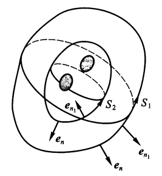

# 第十章 第二类曲线积分与第二类曲面积分

???+ info 

	+ 第一类积分：**重积分**的积分区域是*无向的*
	+ 第二类积分：**定积分**的积分区域是*有向的*，所以请关注题目中规定的积分区域方向

## 第二类曲线积分

### 概念

定义：

设$\Gamma$是以A, B为端点的光滑曲线，并指定从A到B的方向为曲线方向，在$\Gamma$上每一点M处作曲线的**单位切矢量**：$\bm{e_T} = \cos{\alpha} \bm{i} + \cos{\beta} \bm{j} + \cos{\gamma} \bm{k}$，方向与指定曲线方向一致($\alpha, \beta, \gamma$分别为$\bm{e_T}$与Ox轴、Oy轴、Oz轴正向的夹角)，

又设$\bm{A}(M) = P(x, y, z)\bm{i} + Q(x, y, z)\bm{j} + R(x, y, z)\bm{k}$，其中P, Q, R为定义在 $\Gamma$上的有界函数，则$\bm{A \cdot e_T} = P \cos{\alpha} + Q \cos{\beta} + R \cos{\gamma}$在$\Gamma$上的第一类曲线积分
$$
\int\limits_{\Gamma} \bm{A \cdot e_T}\ \mathrm{d}s = \int\limits_{\Gamma}(P \cos{\alpha} + Q \cos{\beta} + R\cos{\gamma}) \mathrm{d}s
$$

称为$\bm{A}(P)$沿$\Gamma$从A到B的**第二类曲线积分**。

>注：
>
>+ $\oint$表示**封闭曲线**上的第二类曲线积分
>+ 第二类曲线积分又称为对**坐标**曲线积分

性质：

+ $\int\limits_{\Gamma_{AB}}(\bm{A \cdot e_T}) \mathrm{d}s = - \int\limits_{\Gamma_{BA}}(\bm{A \cdot e_T}) \mathrm{d}s$，若记$\Gamma^+ = \Gamma_{AB}, \Gamma^- = \Gamma_{BA}$，则：$\int\limits_{\Gamma^+}(\bm{A \cdot e_T}) \mathrm{d}s = - \int\limits_{\Gamma^-}(\bm{A \cdot e_T}) \mathrm{d}s$
+ 若$\Gamma$是由$\Gamma_1, \Gamma_2$首尾相接而成，则：$\int\limits_\Gamma(\bm{A \cdot e_T}) \mathrm{d}s = \int\limits_{\Gamma_1}(\bm{A \cdot e_T}) \mathrm{d}s + \int\limits_{\Gamma_2}(\bm{A \cdot e_T}) \mathrm{d}s$
+ $\int\limits_{\Gamma}[\alpha \bm{F_1}(x, y, z) + \beta \bm{F_2}(x, y, z)] \mathrm{d}\bm{r} = \alpha \int\limits_{\Gamma}\bm{F_1}(x, y, z) \mathrm{d}\bm{r} + \beta \int\limits_{\Gamma}\bm{F_2}(x, y, z) \mathrm{d}\bm{r}$

记$d \bm{s} = \bm{e_T} ds$，称为曲线的*有向弧元*。

第二类曲线积分的四种形式：

+ $\int\limits_{\Gamma_{AB}} \bm{A \cdot e_T} \mathrm{d}s$ (第二类曲线积分 $\Rightarrow$ 第一类曲线积分)
+ $\int\limits_{\Gamma_{AB}} \bm{A} \mathrm{d} \bm{s}$
+ $\int\limits_{\Gamma_{AB}} (P \cos{\alpha} + Q \cos{\beta} + R \cos{\gamma}) \mathrm{d}s$
+ $\int\limits_{\Gamma_{AB}} (P\mathrm{d}x + Q\mathrm{d}y + R\mathrm{d}z)$

⭐**定理1**： 设光滑曲线$\Gamma_{AB}$的方程为$\begin{cases}x = x(t) \\ y = y(t) \\ z = z(t)\end{cases}$，点A, B对应参数分别为$t_A, t_B$，且$\bm{A}(x, y, z) = (P(x, y, z), Q(x, y, z), R(x, y, z))$的分量P, Q, R在$\Gamma$上连续，则

$$
\begin{align}
& \int\limits_{\Gamma_{AB}} \bm{A \cdot e_T}\ \mathrm{d}s \notag \\
= & \int_{t_A}^{t_B} [P(x(t), y(t), z(t)) \cdot x'(t) + Q(x(t), y(t), z(t)) \cdot y'(t) + R(x(t), y(t), z(t)) \cdot z'(t)]\ \mathrm{d}t \notag
\end{align}
$$

>本质：第二类曲线积分 $\Rightarrow$ 定积分

### 格林公式

若函数P, Q在有界闭区域$D \subset R^2$上连续且有一阶连续偏导数，则：

$$
\iint\limits_D (\dfrac{\partial Q}{\partial x} - \dfrac{\partial P}{\partial y}) \mathrm{d}x\mathrm{d}y = \oint\limits_\Gamma P \mathrm{d}x + Q\mathrm{d}y
$$

其中$\Gamma$为区域D的边界曲线，并取正向。

格林公式的行列式表示法：

$$
\iint\limits_{D} \begin{vmatrix}\dfrac{\partial}{\partial x} & \dfrac{\partial}{\partial y} \\ P & Q\end{vmatrix} \mathrm{d}x\mathrm{d}y = \oint\limits_\Gamma P \mathrm{d}x + Q\mathrm{d}y
$$

>本质：第二类曲线积分 $\Rightarrow$ 二重积分

???+ info "证明(历年卷考到过类似的证明思想)"

	

	
	
	

	

	
	

	>第三种情况用于处理**有“洞”的区域**，使用格林公式的时候，要算上整个区域所有曲线的积分（注意每条曲线的**方向**）

!!! note "计算技巧"

	+ 若直接求某条曲线的第二类积分太复杂，可以先**补一些直线**，形成封闭曲线，然后利用格林公式转化为求二重积分的问题，再计算这些直线上的第二类积分，答案即为<u>封闭曲线的积分 - 所有添补的直线的积分</u>。注意**方向**的问题，不要搞错符号！
	+ 令P = -y，Q = x，可得计算**平面区域面积S**的公式：$S = \dfrac{1}{2}\oint\limits_\Gamma -y\mathrm{d}x + x\mathrm{d}y$。
+ 若要求三维的封闭曲线的第二类积分，用[斯托克斯公式](#斯托克斯公式)

### 平面曲线积分与路径无关性

+ 平面单连通区域：没有“洞”的区域——D内任一封闭曲线所包围的面积均包含于D内
+ 平面复连通区域：有“洞”的区域

**定理2**：设$D \subset R^2$是平面单连通区域，若函数P, Q在区域D上连续，且有一阶连续偏导数，则以下4个条件等价：

+ 沿D中任一按段光滑的闭曲线L，有$\oint\limits_L P\mathrm{d}x + Q\mathrm{d}y = 0$
+ 对D中任一按段光滑曲线L，曲线积分$\int\limits_L P\mathrm{d}x + Q\mathrm{d}y$与路径无关，只与L的起点和终点有关
+ $P\mathrm{d}x + Q\mathrm{d}y$是D内某一函数u的全微分，即$\mathrm{d}u = P\mathrm{d}x + Q\mathrm{d}y, \dfrac{\partial u}{\partial x} = P, \dfrac{\partial u}{\partial y} = Q$
+ 在D内的每一点处，有$\dfrac{\partial P}{\partial y} = \dfrac{\partial Q}{\partial x}$

???+ note "注"

	若第二类曲线积分$\int_{A(x_0, y_0)}^{B(x_1, y_1)} P(x, y) \mathrm{d}x + Q(x, y) \mathrm{d}y$与路径无关，则可用一元函数的定积分表示：
	
	$$
	\int_{A(x_0, y_0)}^{B(x_1, y_1)} P(x, y) \mathrm{d}x + Q(x, y) \mathrm{d}y = \int_{x_0}^{x_1} P(x, y_0)\mathrm{d}x + \int_{y_0}^{y_1}Q(x_1, y)\mathrm{d}y
	$$

	---
	由定理知u(x, y)为$P \mathrm{d}x + Q \mathrm{d}y$的一个原函数，则有：

	$$
	u(x, y) = \int_{x_0}^{x} P(x, y)\mathrm{d}x + \int_{y_0}^{y}Q(x, y)\mathrm{d}y + C
	$$

	若$(0, 0) \in D$，则可简写为：$\int_0^x P(x, y)\mathrm{d}x + \int_0^yQ(x, y)\mathrm{d}y + C$

**曲线积分的牛顿-莱布尼茨公式**：若$\mathrm{d}u = P\mathrm{d}x + Q\mathrm{d}y$，其中P, Q有连续偏导数，则：
$$
\int_{A(x_0, y_0)}^{B(x_1, y_1)} P \mathrm{d}x + Q \mathrm{d}y = u(x, y) |_{A(x_0, y_0)}^{B(x_1, y_1)} = u(x_1, y_1) - u(x_0, y_0)
$$

???+ note "解题技巧"

	若题目给出了轨迹曲线的方程(较为复杂)以及它的起点和终点，若用定理2发现路径无关性，则我们可以直接将路径改为<u>曲线起点和终点的连线(直线)</u>，这样就简化了计算过程。

**定理3**：设在复连通区域D内，P, Q具有连续的偏导数且$\dfrac{\partial P}{\partial y} \equiv \dfrac{\partial Q}{\partial x}$，则环绕同一些洞的任意两条闭曲线（同向）上的曲线积分都相等。

!!! warning "注意"

	在求第二类曲线方程前，一定要先判断积分区域上是否有取不到的“洞”(关注积分内函数的分母部分，常常是x或y无法取到0)。若存在这样的洞，根据定理3，我们需要另外找一个包含该洞的、且能够简化计算的曲线方程(根据积分内函数的特征构造)。

## 第二类曲面积分

### 概念

>*定侧曲面*：指定法线方向的双侧曲面

定义：

设S是光滑有界的定侧曲面，记S上的每点M(x, y, z)处沿曲面定侧的**单位法矢量**为：$\bm{e_n}(M) = \cos{\alpha} \bm{i} + \cos{\beta} \bm{j} + \cos{\gamma} \bm{k}$

又设$\bm{A}(M) = P(x, y, z)\bm{i} + Q(x, y, z)\bm{j} + R(x, y, z)\bm{k},\ (x, y, z)\in S$，其中P, Q, R为定义在S上的有界函数，则$\bm{A \cdot e_n} = P \cos{\alpha} + Q \cos{\beta} + R \cos{\gamma}$在$\Gamma$上的第一类曲面积分
$$
\iint\limits_S \bm{A \cdot e_n}\ \mathrm{d}S = \iint\limits_{\Gamma}(P \cos{\alpha} + Q \cos{\beta} + R\cos{\gamma}) \mathrm{d}S
$$
称为$\bm{A}(P)$沿定侧曲面S的**第二类曲面积分**

>第二类曲面积分又称为对**坐标**曲面积分

??? info "方向的规定"

	+ $\cos \alpha$：> 0 为前侧，< 0 为后侧
	+ $\cos \beta$：> 0 为右侧，< 0 为前侧
	+ $\cos \gamma$：> 0 为上侧，< 0 为下侧

	>解题时根据题目规定的方向做，这里的规定仅适用于没有任何规定的情况

性质：

+ $\iint\limits_{S^+}(\bm{A \cdot e_n}) \mathrm{d}S = - \iint\limits_{S^-}(\bm{A \cdot e_n}) \mathrm{d}S$
+ 若S是由两个无公共内点的曲面块$S_1, S_2$，且$S_1, S_2$的侧与S的侧一致，则：$\iint\limits_S(\bm{A \cdot e_n}) \mathrm{d}S = \iint\limits_{S_1}(\bm{A \cdot e_n}) \mathrm{d}S + \iint\limits_{S_2}(\bm{A \cdot e_n}) \mathrm{d}S$

记$d \bm{s} = \bm{e_n} ds$，称为曲面的*有向面积元素*。

第二类曲面积分的四种形式：

+ $\iint\limits_{S} \bm{A \cdot e_n} \mathrm{d}S$ (第二类曲面积分 $\Rightarrow$ 第一类曲面积分)
+ $\iint\limits_S \bm{A} \mathrm{d} \bm{S}$
+ $\iint\limits_{S} (P \cos{\alpha} + Q \cos{\beta} + R \cos{\gamma}) \mathrm{d}S$
+ $\iint\limits_S P(x, y, z)\mathrm{d}y\mathrm{d}z + Q(x, y, z)\mathrm{d}z\mathrm{d}x + R(x, y, z)\mathrm{d}x\mathrm{d}y$
>注：第4种形式中，若$\bm{e_n}$改变方向时，它们都要改变符号，与二重积分的面积元素$\mathrm{d}x\mathrm{d}y$总取正值是不同的。

### 计算

计算方法：

$$
\begin{align}
& \iint\limits_S P(x, y, z)\mathrm{d}y\mathrm{d}z + Q(x, y, z)\mathrm{d}z\mathrm{d}x + R(x, y, z)\mathrm{d}x\mathrm{d}y \notag \\
= & \iint\limits_S P(x, y, z)\mathrm{d}y\mathrm{d}z + \iint\limits_S Q(x, y, z)\mathrm{d}z\mathrm{d}x + \iint\limits_S R(x, y, z)\mathrm{d}x\mathrm{d}y \notag
\end{align}
$$

然后分别计算这3项：

+ $\iint\limits_S P(x, y, z)\mathrm{d}y\mathrm{d}z = \mathrm{sgn}(\dfrac{\pi}{2} - \alpha) \iint\limits_{\sigma_{yz}} R(x(y, z), y, z)\mathrm{d}\sigma$
+ $\iint\limits_S Q(x, y, z)\mathrm{d}z\mathrm{d}x = \mathrm{sgn}(\dfrac{\pi}{2} - \beta) \iint\limits_{\sigma_{zx}} R(x, y(x, z), z)\mathrm{d}\sigma$
+ $\iint\limits_S R(x, y, z)\mathrm{d}x\mathrm{d}y = \mathrm{sgn}(\dfrac{\pi}{2} - \gamma) \iint\limits_{\sigma_{xy}} R(x, y, z(x, y))\mathrm{d}\sigma$

>注：可以利用**轮换对称**的性质减少计算量。

### 高斯公式

设空间区域V由分片光滑的双侧封闭曲面S构成，若函数P, Q, R在V上连续，且有一阶连续偏导数，则
$$
\iiint\limits_V(\dfrac{\partial P}{\partial x} + \dfrac{\partial Q}{\partial y} + \dfrac{\partial R}{\partial z}) \mathrm{d}x\mathrm{d}y\mathrm{d}z = \oiint\limits_S P \mathrm{d}y\mathrm{d}z + Q \mathrm{d}z\mathrm{d}x + R \mathrm{d}x\mathrm{d}y 
$$
其中S取外侧。

>本质：第二类曲面积分 $\Rightarrow$ 三重积分

???+ info "注"

	+ 虽然上面规定S取外侧，但是题目可能会取内侧为正侧，需要当心！
	+ 若S为封闭的简单曲面，$\bm{l}$为任何固定方向，则$\oiint_S \cos{(\bm{n, l})} \mathrm{d}S = 0$，其中$\bm{n}$是曲面的法矢量。

!!! note "解题技巧"

	+ 在计算之前，可以先利用给出的曲面方程，对积分的被积函数进行化简
	+ 我们可以通过**构造**的方法，通过增添几个面，使原本不封闭的曲面封闭，然后利用高斯公式求解，最后减去在这多出的几个平面上的积分即可得到要求的结果。

### 散度场

定义：

设$\bm{A}(x, y, z) = (P(x, y, z), Q(x, y, z), R(x, y, z))$为空间区域V上的向量函数，对V上的每一点(x, y, z)，称函数$\dfrac{\partial P}{\partial x} + \dfrac{\partial Q}{\partial y} + \dfrac{\partial R}{\partial z}$为向量函数$\bm{A}$在点$M(x, y, z)$处的**散度**，记作$\mathrm{div}\ \bm{A}(x, y, z)$

则高斯公式可以改写为：$\iiint\limits_V \mathrm{div}\ \bm{A} \mathrm{d}V = \oiint\limits_S \bm{A} \cdot \mathrm{d}\bm{S}$

令V收缩到点$M_0$，得到：$\mathrm{div}\ \bm{A}(M_0) = \lim\limits_{V \rightarrow M_0} \dfrac{\oiint_S \bm{A} \cdot \mathrm{d}\bm{S}}{\Delta V}$

**散度场**：向量场A的散度div A所构成的数量场

???+ info "物理意义"

	假设某一不可压缩流体的流速为向量函数$\bm{A}$，经过封闭曲面$S$的流量是$\oiint\limits_S \bf{A}\cdot \mathrm{d}S$，则$\mathrm{div}\ \bm{A}$表示流量对体积的变化率，称它为$\bm{A}$在点$M_0$的**流量密度**

	+ $\mathrm{div}\ \bm{A}(M_0) > 0$：每一单位时间内有一定数量的流体流出这一点 $\Rightarrow$ **源**

	+ $\mathrm{div}\ \bm{A}(M_0) < 0$：每一单位时间内有一定数量的流体被这一点吸收 $\Rightarrow$ **汇**

	+ 若对每一点皆有$\mathrm{div}\ \bm{A} = 0$，称$\bm{A}$为**无源场**

推论：

1. 若在封闭曲面S所包围的区域V中处处有$\mathrm{div}\ \bm{A} = 0$，则$\oiint_S \bm{A} \cdot \mathrm{d}\bm{S} = 0$
2. 如果仅在区域V中某些点（或子区域上）$\mathrm{div}\ \bm{A} \ne 0$或$\mathrm{div}\ \bm{A}$不存在（下图阴影部分），其他点都有$\mathrm{div}\ \bm{A} = 0$，则通过保卫这些点或子区域（称为“洞”）的V内任一封闭曲面积分都是相等的，即是一个常数，有：

$$
\oiint\limits_{S_1} \bm{A} \cdot \mathrm{d}\bm{S} = \oiint\limits_{S_2} \bm{A} \cdot \mathrm{d}\bm{S}
$$

其中$S_1, S_2$是包围散度不等于0，或不存在的点（或区域）的任意两个封闭曲面，其法线单位矢量向外

> 注：该结论与上一节[路径无关性](#平面曲线积分与路径无关性)最后那个定理十分类似

## 斯托克斯公式、空间曲线积分与路径无关性

### 斯托克斯公式

规定双侧曲面S的侧与其边界曲线L的方向(用**右手定则**确定)，如图所示：

**定理4：斯托克斯公式**

设光滑曲面S的边界L是按段光滑的连续曲线，若函数P, Q, R在S(连同L)上连续，且有一阶连续偏导数，则：

$$
\begin{align}
& \iint\limits_S(\dfrac{\partial R}{\partial y} - \dfrac{\partial Q}{\partial z})\mathrm{d}y\mathrm{d}z + (\dfrac{\partial P}{\partial z} - \dfrac{\partial R}{\partial x})\mathrm{d}y\mathrm{d}z + (\dfrac{\partial Q}{\partial x} - \dfrac{\partial P}{\partial y})\mathrm{d}y\mathrm{d}z \notag \\
= & \oint\limits_LP\mathrm{d}x + Q\mathrm{d}y + R\mathrm{d}z \notag
\end{align}
$$

其中S的侧面与L的方向按右手法则确定(见上图)。

斯托克斯公式的行列式表示法：

$$
\iint\limits_S \begin{vmatrix}\mathrm{d}y\mathrm{d}z & \mathrm{d}z\mathrm{d}x & \mathrm{d}x\mathrm{d}y \\ \dfrac{\partial}{\partial x} & \dfrac{\partial}{\partial y} & \dfrac{\partial}{\partial z} \\ P & Q & R\end{vmatrix} 
= \iint\limits_S \begin{vmatrix}\cos \alpha & \cos \beta & \cos \gamma \\  \dfrac{\partial}{\partial x} & \dfrac{\partial}{\partial y} & \dfrac{\partial}{\partial z} \\ P & Q & R\end{vmatrix}\mathrm{d}S
= \oint\limits_LP\mathrm{d}x + Q\mathrm{d}y + R\mathrm{d}z
$$

>斯托克斯公式建立起**第二类曲线积分**和**第二类曲面积分**之间的联系

!!! note "总结"

	+ 求**平面**曲线的第二类积分 $\Rightarrow$ **[格林公式](#格林公式)**
	+ 求**空间**曲线的第二类积分 $\Rightarrow$ **斯托克斯公式**

### 空间曲线积分与路径无关性

**定理5**

设$\Omega \subset \mathbf{R}^3$为空间线单连通区域，若函数P, Q, R在$\Omega$上连续，且有一阶连续偏导数，则以下四个条件是等价的：

+ 对于$\Omega$内任一按段光滑的封闭曲线L，有$\oint\limits_LP\mathrm{d}x + Q\mathrm{d}y + R\mathrm{d}z = 0$
+ 对于$\Omega$内任一按断光滑的曲线$\Gamma$，曲线积分$\oint\limits_LP\mathrm{d}x + Q\mathrm{d}y + R\mathrm{d}z$与路径无关，仅与起点、终点有关
+ $P\mathrm{d}x + Q\mathrm{d}y + R\mathrm{d}z$是$\Omega$内某一函数u(x, y, z)的全微分，即存在$\Omega$上的函数u(x, y, z)，使

$$
\mathrm{d}u = P\mathrm{d}x + Q\mathrm{d}y + R\mathrm{d}z
$$

+ $\dfrac{\partial P}{\partial y} = \dfrac{\partial Q}{\partial x}$, $\dfrac{\partial Q}{\partial z} = \dfrac{\partial R}{\partial y}$, 
$\dfrac{\partial R}{\partial x} = \dfrac{\partial P}{\partial z}$在$\Omega$内处处成立

>注：这个定理与[平面积分的路径无关性](#平面曲线积分与路径无关性)的定理2对应

???+ info "注"

	+ 空间线单连通区域：该空间区域V中任意封闭曲线L不越过V的边界曲面，可连续收缩为V中的一点。
	+ 空间面单连通区域：该空间区域V中任意封闭曲面S不越过V的边界曲面，可连续收缩为V中的一点。

???+ note "一种化简方法"

	若曲线积分$I = \oint\limits_{\Gamma_{AB}}P\mathrm{d}x + Q\mathrm{d}y + R\mathrm{d}z$与路径无关，则可以将原路径转化为*折线路径*，便于计算

	

	
	

	此时有：

	$$
	I = \int^{x_1}_{x_0}P(x, y_0, z_0)\mathrm{d}x + \int^{y_1}_{y_0}Q(x_1, y, z_0)\mathrm{d}y + \int^{z_1}_{z_0}P(x_1, y_1, z)\mathrm{d}z
	$$

	---
	若曲线积分仍满足上述条件，则：
	
	$$
	u(x, y, z) = \int^{x}_{x_0}P(x, y_0, z_0)\mathrm{d}x + \int^{y}_{y_0}Q(x, y, z_0)\mathrm{d}y + \int^{z}_{z_0}P(x, y, z)\mathrm{d}z + C
	$$

	若$(0, 0, 0) \in V$，则取$(x_0, y_0, z_0) = (0, 0, 0)$，使计算方便。
	
### 旋度场

定义：

设$\bm{A}(x, y, z) = (P(x, y, z), Q(x, y, z), R(x, y, z))$ 为空间区域V上的向量函数，对V上一点 $M(x, y, z)$ ，定义向量函数 $(\dfrac{\partial R}{\partial y} - \dfrac{\partial Q}{\partial z}, \dfrac{\partial P}{\partial z} - \dfrac{\partial R}{\partial x}, \dfrac{\partial Q}{\partial x} - \dfrac{\partial P}{\partial y})$，称它为向量函数$\bm{A}$在点$M(x, y, z)$处的**旋度**，记作$\mathbf{rot}\ \bm{A}$。

行列式表示法：

$$
\mathbf{rot}\ \bm{A} = \begin{vmatrix}\bm{i} & \bm{j} & \bm{k} \\ \dfrac{\partial}{\partial x} & \dfrac{\partial}{\partial y} & \dfrac{\partial}{\partial z} \\ P & Q & R \end{vmatrix}
$$

设$\bf{e}_T$是曲线L在点$M(x, y, z)$处于指定的方向一致的单位切向量，向量$\mathrm{d}\bm{s} = \bf{e}_T \mathrm{d}s$称为<u>弧长元素向量</u>。

$\therefore$ 斯托克斯公式の第3种表示法：

$$
\iint\limits_S \mathbf{rot}\ \bm{A} \cdot \mathrm{d}\bm{S} = \oint\limits_L \bm{A} \cdot \mathrm{d}\bm{s}
$$

???+ note "旋度与坐标系选取的无关性"

	如图所示：

	

	
	

	由斯托克斯公式の第3种表示法 + 二重积分的中值定理，可得：

	$$
	(\mathbf{rot}\ \bm{A} \cdot \bm{e}_n)_{M_0} = \lim\limits_{D \rightarrow M_0} \dfrac{\oint\limits_L \bm{A} \cdot \mathrm{d}\bm{s}}{D}
	$$

	其中上式左端为$\mathbf{rot}\ \bm{A}$在*法线方向上的投影*。该式可作为旋度的另一个定义形式。

+ **旋度场**：由向量函数$\bm{A}$的旋度$\mathbf{rot}\ \bm{A}$所定义的向量场
+ 沿闭曲线L的**环流量**：$\oint\limits_L \bm{A} \cdot \mathrm{d}\bm{s}$
+ **无旋场**：$\mathbf{rot}\ \bm{A} = 0$

??? info "物理意义"

	流体的速度场的旋度的法线投影在曲面上对面积的曲面积分 = 流体在曲面边界上的环流量

### 向量微分算子

**向量微分算子(Nabla算子或哈密顿算子)**：$\nabla = \dfrac{\partial}{\partial x}\bm{i} + \dfrac{\partial}{\partial y}\bm{j} + \dfrac{\partial}{\partial z}\bm{k}$

二阶微分算子：$\nabla^2 = \dfrac{\partial^2 u}{\partial x^2} + \dfrac{\partial^2 u}{\partial y^2} + \dfrac{\partial^2 u}{\partial z^2}$

可以用向量微分算子改写上面的式子：

+ 高斯公式：$\iiint\limits_V \nabla \cdot \bm{A} \mathrm{d}V = \oiint\limits_S \bm{A} \cdot \mathrm{d}S$
+ 斯托克斯公式：$\iint\limits_S (\nabla \times \bm{A}) \cdot \mathrm{d}S = \oint\limits_S \bm{A} \cdot \mathrm{d}s$