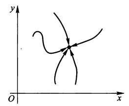
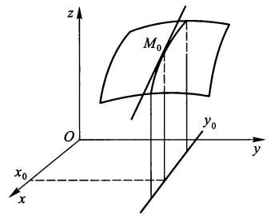
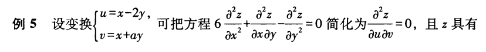
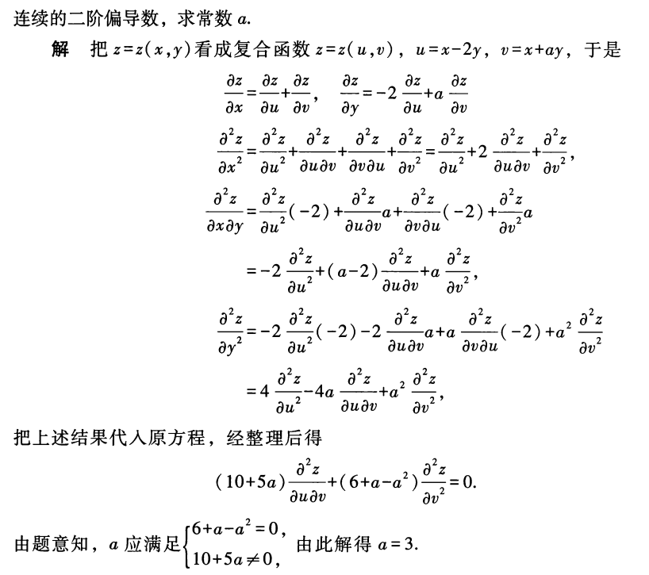
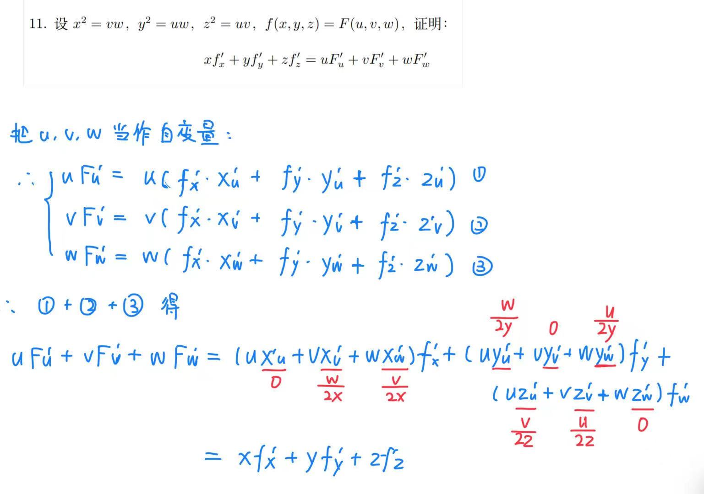
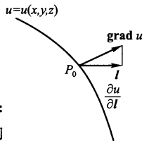
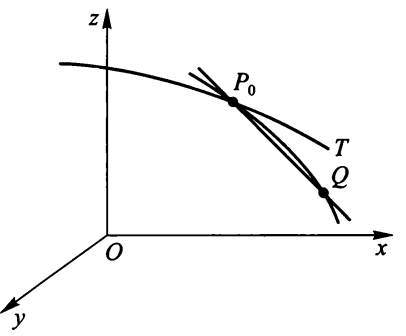
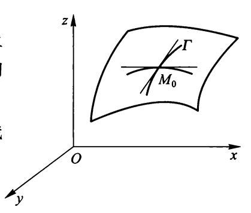

# 第八章 多元函数微分学

## 多元函数的极限与连续性

### 平面点集
 
> 注：平面点集的概念不会直接考察，故这里省略了。

### 多元函数的极限

多元函数(以二元为例，以此类推)的**极限**：

设二元函数$z = f(P) = f(x, y)$在点$P_0(x_0, y_0)$的某邻域$\mathring{U}(P_0)$内有意义。若存在常数A，$\forall \ \varepsilon > 0,\ \exists\ \delta > 0$，当$0 < \rho(P, P_0) < \delta$时($\rho$表示两点间距离)，都有$|f(P) - A| < \varepsilon$成立，则称A为f(P)当点P趋向于$P_0$时的极限，记作：

$$
\lim\limits_{(x, y) \rightarrow (x_0, y_0)}f(x, y) = A \quad \text{or} \quad \lim\limits_{P \rightarrow P_0}f(x, y) = A \quad \text{or} \quad \lim\limits_{\tiny\begin{array}{cccc}x \rightarrow x_0 \\ y \rightarrow y_0\end{array}}f(x, y) = A 
$$

???+ note

    点P趋向于$P_0$的方式可以有无数种，我们可以通过找反例判断极限不存在——**归结原则**：
    
    + 2个特殊路径趋于点$P_0$，它们的极限存在但不相等
    + 存在1个特殊路径的极限不存在

    ⭐我们经常通过**寻找特殊路径**的方法判断极限不存在。常见特殊路径有的有$y = kx^\alpha$，$y = x$的多项式，等等。

区别下面两者的概念：

+ 累次极限：2次求<u>一元</u>函数的极限——$\lim\limits_{x \rightarrow x_0} \lim\limits_{y \rightarrow y_0}f(x, y)$，$\lim\limits_{y \rightarrow y_0} \lim\limits_{x \rightarrow x_0}f(x, y)$
+ 二重极限：求<u>二元</u>函数的极限——$\lim\limits_{\tiny\begin{array}{cccc}x \rightarrow x_0 \\ y \rightarrow y_0\end{array}}f(x, y)$

**定理1**：若2个累次极限和二重极限均存在，则三者相等。

推论：若2个累次极限存在但不相等，则二重极限不存在.

???+ note "注"
 
    注：一元函数极限中的性质和结论，在多元函数极限理论中都适用，比如：

    + 单调有界定理
    + 夹逼定理
    + 换元
    + ~~洛必达法则~~（换成一元函数后方可使用）

### 多元函数的连续性

若$f(P) = f(x, y)$在点$P_0(x_0, y_0)$的某邻域$U(P_0)$内有意义，且$\lim\limits_{\tiny\begin{array}{cccc}x \rightarrow x_0 \\ y \rightarrow y_0\end{array}}f(x, y) = f(x_0, y_0)$，则称$f(P)$在点$P_0(x_0, y_0)$处连续

记$\Delta z = f(x, y) - f(x_0, y_0) = f(x_0 + \Delta x, y_0 + \Delta y) - f(x_0, y_0)$，被称为函数的**全增量**，连续的定义可改写为$\lim\limits_{\tiny\begin{array}{cccc}\Delta x \rightarrow 0 \\ \Delta y \rightarrow 0\end{array}}\Delta z$

+ 函数对x的**偏增量**：$\Delta_x z \stackrel{\text{def}} = f(x, y_0) - f(x_0, y_0) = f(x_0 + \Delta x, y_0) - f(x_0, y_0)$ 
+ 函数对y的**偏增量**：$\Delta_y z \stackrel{\text{def}} = f(x_0, y) - f(x_0, y_0) = f(x_0, y_0 + \Delta y) - f(x_0, y_0)$ 

不连续的点为**间断点**

???+ note "关于多元函数连续性的一些结论"

    + 多元连续函数的*四则运算*或*复合*之后的函数仍为连续函数
    + 一切多元初等函数在其定义域内仍为连续函数
    + 仍然适用的定理：
    
        + 有界性定理
        + 最值定理
        + 介值定理：$\forall\ \mu \in [m, M],\ \exists\ Q \in D,\ s.t.\ f(Q) = \mu$

## 偏导数与全微分

### 偏导数

设函数z = f(x, y)在点$P_0(x_0, y_0)$的某邻域内有定义，

若极限
$$
\lim\limits_{\Delta x \rightarrow 0} \dfrac{\Delta_x z}{\Delta x} = \lim\limits_{\Delta x \rightarrow 0} \dfrac{f(x_0 + \Delta x, y_0) - f(x_0, y_0)}{\Delta x} = \lim\limits_{x \rightarrow x_0} \dfrac{f(x, y_0) - f(x_0, y_0)}{x - x_0}
$$
存在，则称该极限值为z = f(x, y)在点$P_0$处**关于x的偏导数**，记为：

$$
f'_x(x_0, y_0) \quad \text{or} \quad \left.\dfrac{\partial z}{\partial x}\right|_{\tiny\begin{array}{cccc}x = x_0 \\ y = y_0\end{array}} \quad \text{or} \quad \left.z_x'\right|_{\tiny\begin{array}{cccc}x = x_0 \\ y = y_0\end{array}} \quad \text{or} \quad \left.\dfrac{\partial}{\partial x}f(x, y)\right|_{\tiny\begin{array}{cccc}x = x_0 \\ y = y_0\end{array}}
$$

否则称在该点的偏导数不存在。

同理定义**关于y的偏导数**：

$$
\begin{align}
& f'_y(x_0, y_0) \quad \text{or} \quad \left.\dfrac{\partial z}{\partial y}\right|_{\tiny\begin{array}{cccc}x = x_0 \\ y = y_0\end{array}} \quad \text{or} \quad \left.z_y'\right|_{\tiny\begin{array}{cccc}x = x_0 \\ y = y_0\end{array}} \quad \text{or} \quad \left.\dfrac{\partial}{\partial y}f(x, y)\right|_{\tiny\begin{array}{cccc}x = x_0 \\ y = y_0\end{array}} \notag \\
&  = \lim\limits_{\Delta y \rightarrow 0} \dfrac{\Delta_y z}{\Delta y} = \lim\limits_{\Delta y \rightarrow 0} \dfrac{f(x_0, y_0 + \Delta y) - f(x_0, y_0)}{\Delta y} = \lim\limits_{y \rightarrow y_0} \dfrac{f(x_0, y) - f(x_0, y_0)}{y - y_0} \notag
\end{align} 
$$

若对于某一区域G的每一点(x, y)关于x(或y)偏导数都存在，即极限
$$
\lim\limits_{\Delta x \rightarrow 0}\dfrac{\Delta_x z}{\Delta x} = \lim\limits_{\Delta x \rightarrow 0} \dfrac{f(x + \Delta x, y) - f(x, y)}{\Delta x}
$$
存在，称该极限为z = f(x, y)在G上*关于x的偏导函数*，简称偏导数，记作：
$$
f'_x(x, y) = \dfrac{\partial z}{\partial x} = z_x' = \dfrac{\partial}{\partial x}f(x, y)
$$
同理得*关于y的偏导函数*，这里就省略了。

??? question "如何计算偏导数？"

    求关于某个变量x的偏导数，<u>把其他变量看作常量</u>，然后就按照一元函数求导的方法求。

几何意义(以偏导数$f_x'(x_0, y_0)$为例)：曲面z = f(x, y)与平面$y = y_0$的交线在点$M_0$处的*切线*对Ox轴的*斜率*

高阶偏导数：二阶及以上的偏导数。

+ 二阶偏导数：

$$
\begin{align}
& \dfrac{\partial}{\partial x}(\dfrac{\partial z}{\partial x}) = \dfrac{\partial^2 z}{\partial x^2} = f''_{xx}(x, y) = z''_{xx} \notag \\
& \dfrac{\partial}{\partial y}(\dfrac{\partial z}{\partial x}) = \dfrac{\partial^2 z}{\partial x \partial y} = f''_{xy}(x, y) = z''_{xy} \notag \\
& \dfrac{\partial}{\partial x}(\dfrac{\partial z}{\partial y}) = \dfrac{\partial^2 z}{\partial y \partial x} = f''_{yx}(x, y) = z''_{yx} \notag \\
& \dfrac{\partial}{\partial y}(\dfrac{\partial z}{\partial y}) = \dfrac{\partial^2 z}{\partial y^2} = f''_{yy}(x, y) = z''_{yy} \notag \\
\end{align}
$$

>注：
>
>+ 中间2行被称为二阶混合偏导数
>+ 高阶导数的形式和表示法以此类推

:star:**定理2**：若函数z = f(x, y)的二阶混合偏导数都在点$P_0(x_0, y_0)$处连续，则这些混合偏导数在该点的值相等

???+ note "解题技巧"

    + ==轮换对称== (形式相同，只是换了个变量的情况下，两者取值相等，可以减少计算量)
    + ……

### 全微分

若二元函数z = f(x, y)在点(x, y)处的全增量可以表示为：
$$
\Delta z = A \Delta x + B \Delta y + o(\rho)\ (\rho = \sqrt{(\Delta x)^2 + (\Delta y)^2} \rightarrow 0)
$$
其中A, B与变量x, y的增量$\Delta x, \Delta y$无关，而仅与x, y有关，则称f(x, y)在点(x, y)处**可微**，其中$A\Delta x + B\Delta y$被称为f(x, y)在(x, y)处的全微分，记作$\mathrm{d}z$。

全微分の四则运算：

+ $\mathrm{d}(u \pm v) = \mathrm{d}u \pm \mathrm{d}v$
+ $\mathrm{d}(uv) = v\mathrm{d}u + u\mathrm{d}v$，特别地，$\mathrm{d}(cu) = c\mathrm{d}u$
+ $\mathrm{d}(\dfrac{u}{v}) = \dfrac{v\mathrm{d}u - u \mathrm{d}v}{v^2} \ (v \ne 0)$

**定理3：**

+ 可微 $\rightarrow$ **连续**
+ 可微 $\rightarrow$ **偏导数都存在**，且$A = f'_x(x, y), B = f'_y(x, y)$

>注：反之均*不*成立，且箭头右侧的2个结果不能互推成立。

由定理3的第2条知二元函数全微分可表示为：
$$
\mathrm{d}u = \dfrac{\partial u}{\partial x}\mathrm{d}x + \dfrac{\partial u}{\partial y} \mathrm{d}y
$$

???+ note "🌟验证多元函数<u>在某一点不可微</u>的方法"

    1. 在某点不连续
    2. 在某点至少有一个偏导数不存在
    3. ❗在某点2个偏导数均存在，但是

    $$
    \begin{align}
    & \lim\limits_{\tiny\begin{array}{cccc}\Delta x \rightarrow 0 \\ \Delta y \rightarrow 0\end{array}} \dfrac{\Delta z - (A \Delta x + B \Delta y)}{\rho} \notag \\
    = & \lim\limits_{{\tiny\begin{array}{cccc}x \rightarrow x_0 \\ y \rightarrow y_0\end{array}}} \dfrac{f(x, y) - f(x_0, y_0) - f'_x(x_0, y_0)(x - x_0) - f'_y(x_0, y_0)(y - y_0)}{\sqrt{(x - x_0)^2 + (y - y_0)^2}} \notag
    \end{align}
    $$

    不存在，或存在但$\ne 0$

    ???+ note "第3步的化简技巧"

        + 如果直接硬算做不通，那就换成**极坐标**，即令$x = \rho \cos \theta, y = \rho \sin \theta$，这样更便于化简(历年卷出现过几次了)
        + 如果用极坐标都不行，尝试<u>基本不等式 + 夹逼定理</u>

    需要注意的是，这3步都需要执行，且按顺序(连续、偏导、极限)执行，直到能够肯定多元函数不可微，或者完成3个步骤后发现该函数是可微的。

**定理4(可微的充分条件)**：

函数的**所有偏导数**在某点均**连续** $\rightarrow$ 在该点处**可微**。

---
全增量公式：
$$
\Delta z = f_x'(x_0, y_0) \Delta x + f'_y(x_0, y_0) \Delta y + \varepsilon_1 \Delta x + \varepsilon_2 \Delta y
$$
其中$\lim\limits_{\tiny\begin{array}{cccc}\Delta x \rightarrow 0 \\ \Delta y \rightarrow 0\end{array}} \varepsilon_1 = 0,\ \lim\limits_{\tiny\begin{array}{cccc}\Delta x \rightarrow 0 \\ \Delta y \rightarrow 0\end{array}} \varepsilon_2 = 0$

~~(不做要求)全微分的近似计算~~：当$|\Delta x|, |\Delta y|$很小时，
$$
f(x + \Delta x, y + \Delta y) \approx f(x, y) + f'_x(x, y)\Delta x + f_y'(x, y) \Delta y
$$

## 复合函数微分法

### 复合函数的偏导数

**链式法则**：

若函数 $u = \varphi(x, y),\ v = \psi(x, y)$在点(x, y)处的偏导数都存在，z = f(u, v)在点(u, v)处可微，则复合函数$z = f[\varphi(x, y), \psi(x, y)]$在点(x, y)处的偏导数存在：
$$
\dfrac{\partial z}{\partial x} = \dfrac{\partial z}{\partial u} \cdot \dfrac{\partial u}{\partial x} + \dfrac{\partial z}{\partial v} \cdot \dfrac{\partial v}{\partial x} \quad \quad \dfrac{\partial z}{\partial y} = \dfrac{\partial z}{\partial u} \cdot \dfrac{\partial u}{\partial y} + \dfrac{\partial z}{\partial v} \cdot \dfrac{\partial v}{\partial y}
$$
特别地，若z = f(u, v)，$u = \varphi(x),\ v = \psi(x)$，则
$$
\dfrac{\mathrm{d} z}{\mathrm{d} x} = \dfrac{\mathrm{d} z}{\mathrm{d} u} \cdot \dfrac{\mathrm{d} u}{\mathrm{d} x} + \dfrac{\mathrm{d} z}{\mathrm{d} v} \cdot \dfrac{\mathrm{d} v}{\mathrm{d} x}
$$
这被称为**全导数**。

???+ example "重点理解这个🌰"

    设z = f(x, y, u), u = u(x, y)，则偏导数

    $$
    \begin{align}
    & \dfrac{\partial z}{\partial x} = \dfrac{\partial f}{\partial x} \cdot \dfrac{\mathrm{d} u}{\mathrm{d} x} + \dfrac{\partial f}{\partial y} \cdot \dfrac{\partial y}{\partial x} + \dfrac{\partial f}{\partial u} \cdot \dfrac{\partial u}{\partial x}  =  \dfrac{\partial f}{\partial x} + \dfrac{\partial f}{\partial u} \cdot \dfrac{\partial u}{\partial x} \notag \\
    & \dfrac{\partial z}{\partial y} = \dfrac{\partial f}{\partial y} + \dfrac{\partial f}{\partial u} \cdot \dfrac{\partial u}{\partial y} \notag
    \end{align}
    $$

    注意：这里$\dfrac{\partial z}{\partial x}$与$\dfrac{\partial f}{\partial x}$是2个不同的概念:
    
    + 前者表示<u>复合函数</u>z = f[x, y, u(x, y)]对x的偏导数
    + 后者表示<u>外函数</u>z = f(x, y, u)对中间变量x求偏导数

对于复合函数的偏导数，为了方便起见，我们往往使用数字下标i表示对第i个变量的偏导数，比如$f'_1, f'_2$等等

!!! note ":star2:一类重要题型：**变量替换**后化简偏导数的方程"

    ??? example "例题"

        === "例1"

            

            
            

            

            
            

        === "例2"

            

            
            

### 复合函数的全微分

设$z = f(x, y), u = \varphi(x, y), v = \psi(x, y)$均可微，则$z = f(u, v)$的全微分为
$$
\mathrm{d}z = \dfrac{\partial z}{\partial u}\mathrm{d}u + \dfrac{\partial z}{\partial v} \mathrm{d}v = \dfrac{\partial z}{\partial x}\mathrm{d}x + \dfrac{\partial z}{\partial y} \mathrm{d}y
$$
可以看出，无论u, v是自变量还是中间变量，全微分的表达形式不变——**一阶微分形式不变性**

>注：高阶多元函数不具备该性质

## 隐函数的偏导数

### 隐函数的偏导数

**定理5**：隐函数存在定理

设F(x, y, z)在点$P_0(x_0, y_0, z_0)$的某一邻域内有连续的偏导数，且$F(x_0, y_0, z_0) = 0,\ F'_z (x_0, y_0, z_0) \ne 0$，则方程$F(x, y, z) = 0$在$P_0(x_0, y_0, z_0)$的某一邻域内恒能唯一确定一个连续且具有连续偏导数的函数z = f(x, y)，满足$z_0 = f(x_0, y_0)$，并有：
$$
\dfrac{\partial z}{\partial x} = -\dfrac{F_x'}{F_z'} \quad \quad \dfrac{\partial z}{\partial y} = -\dfrac{F_y'}{F_z'} 
$$

### 隐函数组的偏导数

**定理6**：隐函数组存在定理

设方程组

$$
\begin{cases}
F(x, y, u, v) = 0 \\
G(x, y, u, v) = 0 
\end{cases}
$$

确定隐函数组u = u(x, y), v = v(x, y)，该方程组在点$P_0(x_0, y_0, u_0, v_0)$的某一邻域内具有对各个变量的连续导数，则偏导数所组成的函数行列式（或称**二阶雅可比行列式**）为：

$$
J = \dfrac{\partial (F, G)}{\partial (u, v)} = \begin{vmatrix}\dfrac{\partial F}{\partial u} & \dfrac{\partial F}{\partial v} \\ \dfrac{\partial G}{\partial u} & \dfrac{\partial G}{\partial v}\end{vmatrix}
$$

在点$P_0$处不等于0，则方程组在该邻域恒能唯一确定一组连续且具有连续偏导数的函数组u = (x, y), v = (x, y)，满足$u_0 = u(x_0, v_0), v_0 = v(x_0, y_0)$，并有：

$$
\begin{align}
& \dfrac{\partial u}{\partial x} = - \dfrac{1}{J} \dfrac{\partial (F, G)}{\partial (x, v)}= - \dfrac{\begin{vmatrix}F_x' & F'_v \\ G_x' & G_v'\end{vmatrix}}{\begin{vmatrix}F_u' & F'_v \\ G_u' & G_v'\end{vmatrix}} \notag \\
\notag \\
& \dfrac{\partial v}{\partial x} = - \dfrac{1}{J} \dfrac{\partial (F, G)}{\partial (u, x)}= - \dfrac{\begin{vmatrix}F_u' & F'_x \\ G_u' & G_x'\end{vmatrix}}{\begin{vmatrix}F_u' & F'_v \\ G_u' & G_v'\end{vmatrix}} \notag \\
\notag \\
& \dfrac{\partial u}{\partial y} = - \dfrac{1}{J} \dfrac{\partial (F, G)}{\partial (y, v)}= - \dfrac{\begin{vmatrix}F_y' & F'_v \\ G_y' & G_v'\end{vmatrix}}{\begin{vmatrix}F_u' & F'_v \\ G_u' & G_v'\end{vmatrix}} \notag \\
\notag \\
& \dfrac{\partial v}{\partial y} = - \dfrac{1}{J} \dfrac{\partial (F, G)}{\partial (u, y)}= - \dfrac{\begin{vmatrix}F_u' & F'_y \\ G_u' & G_y'\end{vmatrix}}{\begin{vmatrix}F_u' & F'_v \\ G_u' & G_v'\end{vmatrix}} \notag \\
\end{align}
$$

???+ tip "更推荐的做法:+1:"

    上述公式无须死记硬背(~~相信也不会有人这么干吧~~)，下面有更容易记忆的方法：
    
    1. 还是对于上面的方程组，每个方程的两边同时求微分
    2. 然后将$\mathrm{d}u$和$\mathrm{d}v$看作未知数，用$\mathrm{d}x$和$\mathrm{d}y$表示两者
    3. 利用全微分的知识，可以知道我们要求的偏导数即为$\mathrm{d}x$和$\mathrm{d}y$前面的系数

## 场的方向导数与梯度

### 场的方向导数

定义：

设数量场三元函数u在点$P_0(x_0, y_0, z_0)$的某邻域$U(P_0) \subset \mathbf{R}^3$内有定义，$\bm{l}$为从点$P_0$出发的射线，$P(x, y, z)$为$\bm{l}$上且含于$U(P_0)$内的任一点，以$\rho$表示两点间距离，若极限
$$
\lim\limits_{\rho \rightarrow 0} \dfrac{u(P) - u(P_0)}{\rho} = \lim\limits_{\rho \rightarrow 0} \dfrac{\Delta_{\bm{l}}u}{\rho}
$$
存在，称此极限为u在点$P_0$沿方向$\bm{l}$的方向导数，记作$\left.\dfrac{\partial u}{\partial \bm{l}}\right|_{P_0}$。

**定理7**：

若函数u在点$P_0(x_0, y_0, z_0)$处可微，则u在点$P_0$处沿任一方向$\bm{l}$的方向导数都存在，且：

$$
\left.\dfrac{\partial u}{\partial \bm{l}}\right|_{P_0} = \left.\dfrac{\partial u}{\partial x}\right|_{P_0} \cos \alpha + \left.\dfrac{\partial u}{\partial y}\right|_{P_0} \cos \beta + \left.\dfrac{\partial u}{\partial z}\right|_{P_0} \cos \gamma
$$

其中，方向$\bm{l}$上的单位矢量$\bf{e}_{\bm{l}} = (\cos \alpha, \cos \beta, \cos \gamma)$

!!! note "细节"

    若题目要求函数的某个**间断点**的方向导数，那么需要用**定义**求解，而不能用定理7做。用定义做的时候可以利用**极坐标**化简。
    >只有当题目给出方向导数的方向使用极坐标表示的时候，才可以用极坐标( ~~目前我还没遇到其他类型的方向~~ )

>注：
> 
> + 这里的$\alpha, \beta, \gamma$分别是$OP_0$与x轴，y轴和z轴(正向)的夹角
> + 方向导数存在，函数不一定可微
> + 方向导数的存在性与偏导数的存在性没有直接关联，即知道其中一个，无法推出另一个是否成立

### 梯度

定义：

矢量$\dfrac{\partial u}{\partial x} \bm{i} + \dfrac{\partial u}{\partial y} \bm{j} + \dfrac{\partial u}{\partial z} \bm{k} = (\dfrac{\partial u}{\partial x}, \dfrac{\partial u}{\partial y}, \dfrac{\partial u}{\partial z})$被称为函数u(P)在点P处的**梯度**，即为$\mathbf{grad}\ u$。

易知 $|\mathbf{grad}\ u(P_0)| = \left.\sqrt{(\dfrac{\partial u}{\partial x})^2 + (\dfrac{\partial u}{\partial y})^2 + (\dfrac{\partial u}{\partial z})^2}\right|_{P_0}$

$\therefore \left.\dfrac{\partial u}{\partial \bm{l}}\right|_{P_0} = |\mathbf{grad}\ u(P_0)|\cos \theta$，其中$\theta$是矢量$\mathbf{grad}\ u(P_0)$与$\bm{l}$的夹角

???+ note "一些结论"

    + u在点$P_0$处沿方向$\bm{l}$的方向导数 = 梯度在$\bm{l}$上的投影，即

    $$
    \left.\dfrac{\partial u}{\partial \bm{l}}\right|_{P_0} = \mathbf{grad}\ u(P_0) \cdot \bm{e}_l
    $$

    

    
    

    + $\theta = 0$时，方向导数最大；$\theta = \dfrac{\pi}{2}$时，方向导数为0；$\theta = \pi$时，方向导数最小

运算法则：

+ $\mathbf{grad}\ (\alpha u + \beta v) = \alpha \mathbf{grad}\ u+ \beta \mathbf{grad}\ v$
+ $\mathbf{grad}\ (u \cdot v) = u \mathbf{grad}\ v + v \mathbf{grad}\ u$
+ $\mathbf{grad}\ f(u) = f'(u) \mathbf{grad}\ u$

## 多元函数的极值与应用

### 多元函数的泰勒公式

**定理8(泰勒定理)**：

若函数f在点$P_0(x_0, y_0)$的某邻域$U(P_0)$内有直到n + 1阶的连续偏导数，则对$U(P_0)$内任一点$(x_0 + h, y _0 + k)$，存在$\theta \in (0, 1)$，使得：

$$
\begin{align}
f(x_0 + h, y_0 + k) = & f(x_0, y_0) + (h\dfrac{\partial}{\partial x} + k\dfrac{\partial}{\partial y}) + \notag \\
& \dfrac{1}{2!} (h\dfrac{\partial}{\partial x} + k\dfrac{\partial}{\partial y})^2f(x_0, y_0) + \dots + \notag \\
& \dfrac{1}{n!}(h\dfrac{\partial}{\partial x} + k\dfrac{\partial}{\partial y})^n f(x_0, y_0) + \notag \\
& \dfrac{1}{(n+1)!}(h\dfrac{\partial}{\partial x} + k\dfrac{\partial}{\partial y})^{n+1} f(x_0 + \theta h, y_0 + \theta k) \notag
\end{align}
$$

上式被称为f在点$P_0$处的**n阶泰勒公式**。

其中等式右侧最后一项被称为*拉格朗日余项*，记作$R_n$

特别地，当$(x_0, y_0) = (0, 0)$时，称上式为**麦克劳林公式**

二元函数的**拉格朗日中值公式**：

$$
f(x_0 + h, y_0 + k) - f(x_0, y_0) = hf_x'(x_0 + \theta h, y_0 + \theta k) + kf_y'(x_0 + \theta h, y_0 + \theta k)
$$

???+ note "推论"

    设f(x, y)在区域G上具有连续的一阶偏导数：

    + 若$f_x'(x, y) \equiv 0, (x, y) \in G$，则f(x, y)在G上<u>仅是y的函数</u>
    + 若$f_y'(x, y) \equiv 0, (x, y) \in G$，则f(x, y)在G上<u>仅是x的函数</u>
    + 若$f_x'(x, y) \equiv 0, f_y'(x, y) \equiv 0, (x, y) \in G$，则f(x, y)在G上是<u>常值函数</u>

### 多元函数的极值

定义：

设函数z = f(x, y)在点$P_0(x_0, y_0)$的某邻域$U(P_0)$内有定义，若对任何点$P(x, y) \in U(P_0)$，都有$f(P) \ge f(P_0)$ (或$f(P) \le f(P_0)$)，则称函数f在点$P_0$处取到**极值**，点$P_0$被称为f的**极值点**。

**定理9(极值的必要条件)**：

若函数f在点$P_0(x_0, y_0)$存在偏导数且在点$P_0$处取极值，则有：

$$
f_x'(x_0, y_0) = 0,\ f_y'(x_0, y_0) = 0
$$
此时称$P_0$为f的**稳定点**或**驻点**

>注：若f存在偏导数，则极值点一定是稳定点，反之不一定

???+ note "取极值的情况"

    + $f_x'(x_0, y_0), f_y'(x_0, y_0)$都存在，且$f_x'(x_0, y_0) = 0,\ f_y'(x_0, y_0) = 0$，即$P_0(x_0, y_0)$为**稳定点**
    + $f_x'(x_0, y_0), f_y'(x_0, y_0)$至少有一个不存在，此时$P_0(x_0, y_0)$为极值点的**怀疑点**

**定理10(极值的充分条件)**：

设函数z = f(x, y)在点$P_0(x_0, y_0)$某邻域$U(P_0)$内连续，且有二阶连续偏导数，如果$f_x'(x_0, y_0) = 0,\ f_y'(x_0, y_0) = 0$，设$A = f_{xx}''(x_0, y_0), B = f_{xy}''(x_0, y_0), C = f_{yy}''(x_0, y_0)$，则：

+ $B^2 - AC < 0 \Rightarrow $ $f(x_0, y_0)$一定是极值，且
    
    + $A > 0$或$C > 0 \Rightarrow $ 极小值
    + $A < 0$或$C < 0 \Rightarrow $ 极大值

+ $B^2 - AC > 0 \Rightarrow $ $f(x_0, y_0)$不是极值
+ $B^2 - AC = 0 \Rightarrow $ 无法判断

---
!!! note "何处取最值？"

    + 稳定点
    + 偏导数不存在的点
    + 边界点

---
**条件极值问题**：附有约束条件的极值问题

方法：**拉格朗日乘数法**

???+ example "例题"

    在所给条件$G(x, y, z) = 0$的条件下，求目标函数$u = f(x, y, z)$的极值

    解：

    引入拉格朗日函数 $L(x, y, z, \lambda) = f(x, y, z) + \lambda G(x, y, z)$

    求极值点，即求下列方程组的解：

    $$
    \begin{cases}
    f_x' + \lambda G_x' = 0 \\ 
    f_y' + \lambda G_y' = 0 \\
    f_z' + \lambda G_z' = 0 \\
    G(x, y, z) = 0 \\
    \end{cases}
    $$

    得到极值点后，代入函数u，即可求得极值

更一般的拉格朗日函数：

$$
\begin{align}
& L(x_1, x_2, \dots, x_n, \lambda_1, \lambda_2, \dots, \lambda_m) \notag \\
= & f(x_1, x_2, \dots, x_n) + \sum\limits_{k = 1}^m\lambda_k \psi_k(x_1, x_2, \dots, x_n) \notag
\end{align}
$$

其中$\lambda_1, \lambda_2, \dots, \lambda_m$被称为**拉格朗日乘数**

## 偏导数在几何上的应用

### 矢值函数微分法

**矢值函数**；$\bm{r}(t) = x(t)\bm{i} + y(t)\bm{j} + z(t)\bm{k}$

**矢量导数**：

若极限$\lim\limits_{\Delta t \rightarrow 0} \dfrac{\Delta x}{\Delta t}$, $\lim\limits_{\Delta t \rightarrow 0} \dfrac{\Delta y}{\Delta t}$, $\lim\limits_{\Delta t \rightarrow 0} \dfrac{\Delta z}{\Delta t}$都存在，则极限

$$
\lim\limits_{\Delta t \rightarrow 0} \dfrac{\Delta \bm{r}}{\Delta t} = x'(t)\bm{i} + y'(t)\bm{j} + z'(t)\bm{k}
$$

被称为$\bm{r}$在t处的矢量导数，记作$\bm{r}'(t)$或$\dfrac{\mathrm{d}\bm{r}}{\mathrm{d}t}$

几何意义：曲线上的切矢量

>注：不要和前面的[方向导数](#场的方向导数)弄混!!!

### 空间曲线的切线与法平面

空间曲线的参数方程为：$x = x(t), y = y(t), z = z(t)$

切线$P_0T$：

$$
\dfrac{x - x_0}{x'(t_0)} = \dfrac{y - y_0}{y'(t_0)} = \dfrac{z - z_0}{z'(t_0)}
$$

点$P_0$处的法平面：

$$
x'(t_0) (x - x_0) + y'(t_0) (y - y_0) + z'(t_0) (z - z_0) = 0
$$

### 空间曲面的切平面与法线

!!! note "分类"

    === "曲面方程：$F(x, y, z) = 0$"

        

        
        

        === "切平面"

            $$
            F_x'(x_0, y_0, z_0) (x - x_0) + F_y'(x_0, y_0, z_0) (y - y_0) + F_z'(x_0, y_0, z_0) (z - z_0) = 0
            $$

        === "法线"

            $$
            \dfrac{x - x_0}{F_x'(x_0, y_0, z_0)} = \dfrac{y - y_0}{F_y'(x_0, y_0, z_0)} = \dfrac{z - z_0}{F_z'(x_0, y_0, z_0)}
            $$

    === "曲面方程：$z = f(x, y)$"

        === "切平面"

            $$
            f_x'(x_0, y_0) (x - x_0) + f_y'(x_0, y_0) (y - y_0) - (z - z_0) = 0
            $$

        === "法线"

            $$
            \dfrac{x - x_0}{f_x'(x_0, y_0)} = \dfrac{y - y_0}{f_y'(x_0, y_0)} = \dfrac{z - z_0}{-1}
            $$

对于曲线$\Gamma :\begin{cases}F(x, y, z) = 0 \\ G(x, y, z) = 0 \end{cases}$在点$P_0(x_0, y_0, z_0)$

切线方程为：

$$
\begin{cases}
F_x'(P_0)(x - x_0) + F_y'(P_0)(y - y_0) + F_z'(z - z_0) = 0 \\ 
G_x'(P_0)(x - x_0) + G_y'(P_0)(y - y_0) + G_z'(z - z_0) = 0 
\end{cases}
$$

切线向量为：$\bm{v} = \bm{n_1} \times \bm{n_2} = \begin{vmatrix}\bm{i} & \bm{j} & \bm{k} \\ F_x'(P_0) & F_y'(P_0) & F_z'(P_0) \\ G_x'(P_0) & G_y'(P_0) & G_z'(P_0)\end{vmatrix}$

>其实就是将一般式方程转化成点向式方程