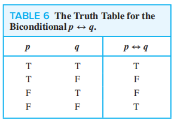
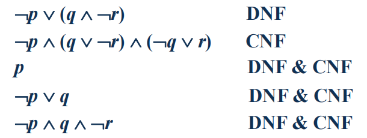
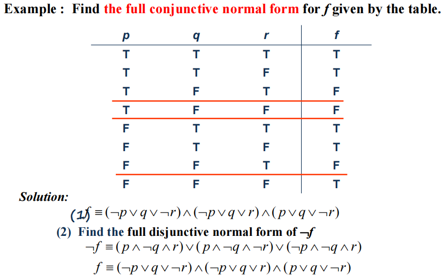
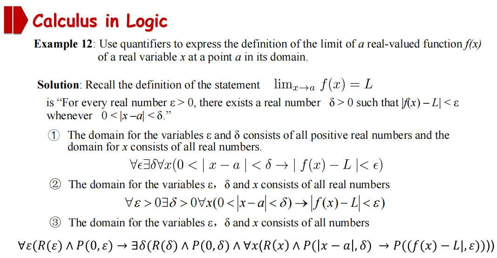
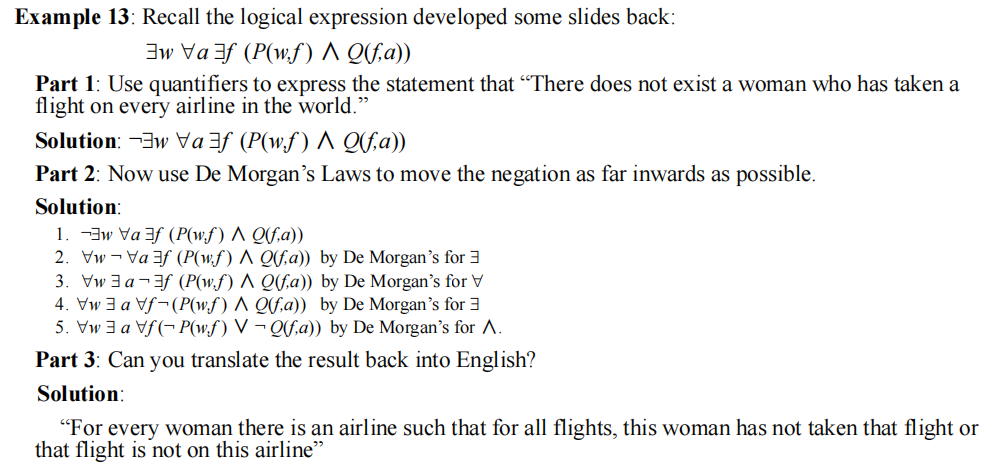

# Chap 1 The Foundations: Logic and Proofs

??? abstract "核心知识"

	+ 命题逻辑
		+ 基本运算：否定、合取、析取、异或、条件、双条件...
		+ 逻辑等价：**常用恒等式(德摩根定理等)**
		+ 范式：(主)合取/析取范式
	+ 谓词与量词
		+ 量词：全称、存在、唯一...
		+ 量词的德摩根定理
		+ 嵌套量词
		+ 前束范式
	+ **推理规则**(重点:exclamation:)
	+ 证明
		+ 反证法(包括空证明、平凡证明)
		+ 归谬法
		+ 穷举证明
		+ 构造/非构造存在证明
		+ ...
	
	>这一章经常会考应用题

## Propositional Logic

### Propositions

+ **命题(proposition)**：一个陈述句，要么真要么假，但不同时为真为假
+ **命题变量(proposition variables)**一般用字母(e.g. $p, q, r, s \dots$)表示

分类：

+ **原子命题(atomic proposition)**不能被表示成更简单的形式的命题
+ **复合命题(compound proposition)**由一些命题通过**逻辑运算符(logic operators)**连接而成的命题

### Truth Tables

（略）

???+ note "注"

	+ 如果有$n$个命题变量，那么真值表就会有$2^n$行
	+ 如果有$n$个命题变量，那么就可以构造出$2^{2^n}$个不同的命题(需要用到[计数](6.md)的知识)

### Logic Operator

> 假设$p, q$为两个不同的命题

+ **否定(negation)**：$\neg p$ (读作*not p*)
+ **合取(conjunction)**：$p \land q$ (读作*p and q*)
> 注：有时候*but*也表示 $\land$

+ **析取(disjunction)**：$p \lor q$​ (读作*p or q*)

+ **异或(exclusive or, XOR)**：$p \oplus q$​ (读作*p XOR q*)
???+ note "注"

	+ *either…or…*表示XOR
	+ *or*有时也表示XOR，具体结合语境看，所以**or**有两种含义：
		+ **inclusive or**: $\lor$​
		+ **exclusive or**: $\oplus$

#### Conditional Statements

+ **条件语句(conditional statements, or implication)**：$p \rightarrow q$ (读作 *if p, then q*)

<div style="text-align: center; margin-top: 15px;">

</div>

???+ note "相关知识"
 
	+ $p$被称为**前提(hypothesis)**, $q$被​称为**结论(conclusion)**
 	+ 条件语句的多种表述：

	<div style="text-align: center; margin-top: 15px;">
	
	</div>

	❗重点记住这两个，很容易混淆： ==$p$ only if $q$==， ==$q$ unless $\neg p$​==

	+ 从真值表可以看出，前提和结论之间不必有任何关联，$p \rightarrow q$只取决于$p$和$q$​的真值
	+ **Implication Law**: $p \rightarrow q \equiv \neg p \lor q$  ([等价命题](#logical-equivalence)那一讲会讲到的)

!!! note "命题的转化"

	+ **逆命题(converse)**：$q \rightarrow p$
	+ **逆否命题(contrapositive)**：$\neg q \rightarrow \neg p$​
	+ **否命题(inverse)**：$\neg p \rightarrow \neg q$

	注：<u>逆否命题</u>与原命题**等价(equivalent)**

**双条件句(bioconditional, or bi-implication)**：$p \leftrightarrow q$​ (读作 *p if and only if q*)

<div style="text-align: center; margin-top: 15px;">

</div>

???+ note "相关知识"
 
	+ 双条件句的多种表达：

 		+ $p$ is necessary and sufficient for $q$
 		+ if $p$ then $q$, and conversely
 		+ $p$ *iff*$q$ (*iff*= if and only if)
 		+ $p$ exactly when $q$
	+ $p \leftrightarrow q \equiv (p \rightarrow q) \land  (q \rightarrow p)$​
	+ 双条件句的含蓄表述：可能使用*if, then*或 *only if*来表示 if and only if
	+ 在[数逻](../../system/dld/2.md#exclusive-or-operator-and-gates)中，这种形式也被称为**同或(XNOR)**

#### Precedence

<div style="text-align: center; margin-top: 15px;">

</div>

### Logic and Bit Operations

**位(Bit)**：一种表示两种可能值的记号，即`0`和`1`。计算机用位表示信息，位也能用来表示真值

**布尔变量(Boolean variable)**：值为`true`或`false`的变量
> 上面所有表格中的`T`可用`1`代替，`F`可用`0`代替

**位串(Bit strings)**：由0个或多个位构成的序列，它的**长度**即位的个数

按位运算(Bitwise operations)：

+ **按位或(bitwise OR)**
+ **按位与(bitwise AND)**
+ **按位异或(bitwise XOR)**

<div style="text-align: center; margin-top: 15px;">

</div>

### Supplements(from Exercises)

**模糊逻辑(Fuzzy Logic)**：一个命题的真值是$[0,1]$间的数。真值为0的命题被认为是`false`，真值为1则被认为为`true`，0-1之间的数表明不同的真实程度。常用于人工智能中。

## Application of Propositional Logic

### Translating English Sentences

方法: 找原子命题，找逻辑运算符，然后组合起来

### System Specifications

<u>上一部分 + **一致(consistent)**</u>的概念：存在一组命题变量的可能赋值(真值)，对于一组命题中的每一条命题均成立。

### ~~Boolean Search~~

> 一些搜索引擎的高级搜索会用到这种方式，这里就不作叙述

### Logic Puzzles

看看课本例题

### ~~Logic Circuits~~

>详见：[数逻第2章](../../system/dld/2.md)

## Propositional Equivalences

### Logical Equivalence

+ **永真(Tautology)**：真值总是为真的命题
+ **永假(Contradiction)**：真值总是为假的命题
+ **Contingency**：既非永真亦非永假的命题

**逻辑等价(Logically equivalent)**：两个复合命题在不同的赋值情况下的真值始终相等，即$p \leftrightarrow q$​为*永真*，记作$p \equiv q$

🌟重要逻辑等价表 

<div style="text-align: center; margin-top: 15px;">

</div>
<div style="text-align: center; margin-top: 0px;">

</div>

???+ info "一些补充"

	+ *conditional-disjunction equivalence*：$p \rightarrow q \equiv \neg p \lor q$
	+ *Exportation law*：$(p \land q) \rightarrow r \equiv p \rightarrow (q \rightarrow r)$
	+ *Absurdity law*：$(p \rightarrow q) \land (p \rightarrow \neg q) \equiv \neg p$

### Using De Morgan's Laws

🌟**德·摩根定律(De Morgan's Laws)**

+ $\neg (p \land q) \equiv \neg p \lor \neg q$
+ $\neg(p \lor q) \equiv \neg p \land \neg q$

拓展版：

+ $\neg(\bigvee ^ n _{j = 1}p_j) \equiv \bigwedge ^ n _{j = 1} \neg p_j$​
> 即$\neg(p_1 \lor p_2 \lor \dots \lor p_n) \equiv (\neg p_1 \land \neg p_2 \land \dots \land \neg p_n)$

+ $\neg (\bigwedge ^ n _{j = 1}p_j) \equiv \bigvee ^ n _{j = 1} \neg p_j$
> 即$\neg (p_1 \land p_2 \land \dots \land p_n) \equiv (\neg p_1 \lor \neg p_2 \lor \dots \lor \neg p_n)$

> 注：使用时注意**改变连接符**​

### Constructing New Logical Equivalence

题型：

+ 证明两个逻辑命题等价
+ 证明某个逻辑命题永真
+ ……

这需要我们灵活使用上表的规律

### Propositional Satisfiablilty

若存在一种赋值，使得某个复合命题的值为真，则称该命题是**satisfiable(可满足的)**（类似上面[一致](#system-specifications)的概念），这样的一种赋值被称为可满足性问题的一个**解**；否则称该命题是**unsatisfiable(不可满足的)**

### Applications

**The n-Queens Problem**

??? question "问题"

	在$n \times n$的棋盘上放置$n$个皇后。皇后可以攻击同行、同列、同一对角线（两条）上的棋子。请找到能使$n$个皇后不会互相攻击的摆法。

	<div style="text-align: center; margin-top: 15px;">
	
	</div>

	??? note "分析"

		+ 先保证**每行**<u>至少</u>有一个皇后：$Q_1 = \bigwedge\limits^n_{i = 1} \bigvee\limits^n_{j = 1}p(i, j)$
		+ 然后保证**每行**<u>至多</u>有一个皇后：$Q_2 = \bigwedge\limits^n_{i = 1} \bigwedge\limits^{n-1}_{j = 1} \bigwedge\limits^n_{k = j + 1}(\neg p(i, j) \vee \neg p(i, k))$
		+ 再确保**每列**<u>至多</u>有一个皇后：$Q_3 = \bigwedge\limits^n_{j = 1} \bigwedge\limits^{n-1}_{i = 1} \bigwedge\limits^n_{k = i + 1}(\neg p(i, j) \vee \neg p(k, j))$​

		> 这三个条件的成立能使“每列至少有一个皇后”的条件自动成立

		+ 接着确定**两条对角线**：

			+ $Q_4 = \bigwedge\limits^n_{i = 2} \bigwedge\limits^{n - 1}_{j = 1} \bigwedge\limits^{min(i - 1, n - j)}_{k = 1}(\neg p (i, j) \vee \neg p (i - k, k + j))$
			+ $Q_5 = \bigwedge\limits^n_{i = 1} \bigwedge\limits^{n - 1}_{j = 1} \bigwedge\limits^{min(n - i, n - j)}_{k = 1}(\neg p (i, j) \vee \neg p (i + k, j + k))$

		> 这里其实还有点问题，目前我还没仔细研究😝

		+ 最后并在一起便得到最终的解（命题）
		$$
		Q = Q_1 \wedge Q_2 \wedge Q_3 \wedge Q_4 \wedge Q_5
		$$

>注：[Chap 11](11.md#backtracking-applications)还会讲到该问题

**Sudoku Puzzle**

> 看书，这里略过🐶

### Supplements(from Exercises, but important❗)

>注：这里的补充部分与dld高度重合，可以参考[数逻](../../system/dld/2.md)的部分，那里讲得更加详细

#### Other Logical Operators

+ **Sheffer stroke**：与非(NAND)，符号“$|$”，$p | q \equiv \neg (p \wedge q)$
+ **Peirce arrow**：或非(NOR)，符号“$\downarrow$”，$p \downarrow q \equiv \neg(p \vee q)$

#### The Dual of a Compound Proposition

复合命题$S$的**对偶(命题)$S^*$**仅包含逻辑运算符$\vee$，$\wedge$和$\neg$，且满足以下要求：

+ 保持$\neg$不变
+ 将$\vee$替换为$\wedge$，$\wedge$替换为$\vee$
+ 将`T`替换为`F`，`F`替换为`T`。 

#### Functionally Complete Collection of Logical Operators

当每个复合命题逻辑等价于一个与它使用相同逻辑运算符集的复合命题，则称这个逻辑运算符集是**功能完备的(functionally complete)**

e.g. $\{ \neg, \wedge, \vee, \rightarrow, \leftrightarrow\}, \{ \neg, \wedge, \vee\}, \{ \neg, \wedge\}, \{ \neg, \vee\}, \{ | \}, \{ \downarrow\}$均可为全功能集

> 拓展——极小全功能集：没有冗余（指从来没用过的）逻辑运算符的全功能集

#### 🌟 Normal Forms

>注：该概念类似数逻的["标准形式"](../../system/dld/2.md#standard-forms)

+ **析取范式(disjunctive normal form, DNF)**= 字面量与<u>合取从句</u>的**析取**
	+ *literal(字面量)*：命题变量及其否定
	+ *conjunctive clauses(合取从句)*：单个命题变量(或取补后)的合取，比如：$p \wedge q, p \wedge \neg q, \neg p \wedge q, \neg p \wedge \neg q$ 

+ **合取范式(conjunctive normal form, CNF)**= 字面量与<u>析取从句</u>的**合取**

>注：具体参照[数逻](../../system/dld/2.md#standard-forms-1)**SOP**和**POS**的概念

🌰

<div style="text-align: center; margin-top: 0px;">

</div>

**定理**：所有的逻辑命题都有与之对应的等价的DNF或CNF

如何得到范式？

1. 先消去$\rightarrow , \leftrightarrow$(公式见上图)
2. 令$\neg$的使用范围缩小至单个原子命题（命题变量），这里常用到德·摩根定律和双重否定律
3. 再使用交换律、分配律和结合律得到范式

🌰（计算量有点大…）

<div style="text-align: center; margin-top: 15px;">

</div>

---
**主析取范式(full disjunctive normal form)**= 最小项的析取

+ **Minterm**(最小项)：所有变量(或取补后)的*合取*，且每个变量都仅出现一次
+ **Maxterm**(最大项)：所有变量(或取补后)的*析取*，...

>注：具体参照[数逻](../../system/dld/2.md#minterms-and-maxterms)**SOM**和**POM**

如何获得？

+  **计算法**

	+ 先将命题转化至DNF的形式
	+ 如果某个析取从句的变量小于$n$个，则利用否定律和分配律补上缺少的变量，再计算整理

🌰

<div style="text-align: center; margin-top: 15px;">

</div>

+ **真值表法**

	+ 列真值表
	+ 找到所有复合命题为**T**的赋值情况
	+ 对于每种赋值情况，如果变量为**T**保持不变，**F**则取$\neg$，然后进行合取
	+ 对所有得到的合取再析取，便得到了Full DNF

> 注：可以用类似的方法求Full CNF，看下面的例子更好理解，或者看[数逻相应部分](../../system/dld/2.md#som-and-pom)

<div style="text-align: center; margin-top: 15px;">

</div>

## Predicates and Quantifiers

### Predicates

**命题函数(propositional function)**：$P(x_1, x_2, \dots , x_n)$，是一种对命题的泛化(generalization)。当它的*所有*变量被替换为**域**(domain)里的**具体值**，或受*量词(quantifier)*约束时，命题函数就成为一个命题（有真值）

当命题函数有$n$个变量时，$P$被称为**$n$位谓词($n$​-ary predicate)**

**连接符**(就是条件和双条件语句)也可以用于谓词逻辑中。如果整个表达式中的变量都是命题（这里特指赋有具体值的命题函数），那么该表达式就是一个命题，否则就不是命题。

??? info "不重要的知识(可忽略)"

	+ **前置条件(preconditions)**：描述合法输入的语句
	+ **后置条件(postconditions)**：当程序运行时输出得到满足的条件
	> 注：可用于检测计算机程序的正确性

	🌰对于以下交换两个变量值的程序：
	```
	temp := c
	x := y
	y := temp
	```
	前置条件$P(x) \equiv (x = a, y = b)$（即输入），后置条件$Q(x) \equiv (x = b, y = a)$（即输出）。

### Quantifiers

+ **全称量词(universal quantifiers)**：符号$\forall$

	$\forall xP(x)$意思是“for *all*/ *every*/ *arbitrary*/… $x$, $P(x)$”

	$\forall xP(x) \equiv P(x_1) \wedge P(x_2) \wedge \dots \wedge P(x_n)$
	> 这里假定$x$定义域非空，否则$\forall x P(x) \equiv T$​

+ **存在量词(existential quantifiers)**：符号$\exists$

	$\exists x P(x)$意思是“*there exists*/ *for some*/ *for at least one*/ *there is*/… an $x$, $P(x)$​”

	$\exists xP(x) \equiv P(x_1) \vee P(x_2) \vee \dots \vee P(x_n)$
	> 这里假定$x$定义域非空，否则$\exists x P(x) \equiv F$​

 + **唯一量词(uniqueness quantifiers)**：符号$\exists !$

	$\exists !xP(x)$意思是“$P(x) \text{ is true for one and only one }x \text{ in the universe of discourse}$​”

	$\exists !P(x) \equiv \exists x (P(x) \wedge \forall y (P(y) \rightarrow y = x))$​

	>这个量词可由前两种量词表示出来，因此<u>不常用</u>

> 注：量词的优先级<u>高于所有逻辑运算符</u>

### Quantifiers over Finite Domains

考虑在**有限域**(finite domain)的情况——可以通过循环(loop)逐一判断定义域内每个变量

+ 对于$\forall x P(x)$，如果每个$P(x)$均为真，则为真；只要有一个是错的则为假，循环结束
+ 对于$\exists xP(x)$，如果有一个$P(x)$为真，则为真，循环结束；当循环结束后仍找不到值为真的$P(x)$，则为假

### Binding Variables

+ 如果一个量词用于变量$x$，我们说这个变量是被**绑定(bound)**的
+ 如果一个变量没有被绑定或者被赋予具体值，我们说这个变量时**自由(free)**的

### Logical Equivalence Involving Quantifiers

谓词命题中的**逻辑等价(Logical equivalence)**：充要条件为两个命题有相同的真值，不论它们*谓词*和*变量域*是什么。

### Negating Quantified Expressions

🌟**量词的德·摩根定律**

<div style="text-align: center; margin-top: 15px;">

</div>

???+ info "补充"

	$$
	\forall x (A(x) \wedge B(x)) \equiv \forall xA(x) \wedge \forall xB(x)
	$$
	$$
	\exists x (A(x) \vee B(x)) \equiv \exists xA(x) \vee \exists xB(x)
	$$
	​
	但是，

	$$
	\begin{align}
	\forall x (A(x) \vee B(x)) & \nLeftrightarrow \forall xA(x) \vee \forall xB(x) \notag \\
	\exists x (A(x) \wedge B(x)) & \nLeftrightarrow \exists xA(x) \wedge \exists xB(x) \notag 
	\end{align}
	$$

	​然而，

	$$
	\begin{align}
	\forall x (A(x) \vee B(x)) & \Leftarrow \forall xA(x) \vee \forall xB(x) \notag \\
	\exists x (A(x) \wedge B(x)) & \Rightarrow \exists xA(x) \wedge \exists xB(x) \notag 
	\end{align}
	$$

	---
	>注：这里的$x$与$P$无关

	$$
	\begin{align}
	\forall xA(x) \vee P & \equiv \forall x(A(x) \vee P) \notag \\
	\forall xA(x) \wedge P & \equiv \forall x(A(x) \wedge P) \notag \\
	\exists xA(x) \vee P & \equiv \exists x(A(x) \vee P) \notag \\
	\exists xA(x) \wedge P & \equiv \exists x(A(x) \wedge P) \notag
	\end{align}
	$$

	下面四个公式可由上面四个公式推导得来

	$$
	\begin{align}
	\forall x (B \rightarrow A(x)) & \equiv B \rightarrow \forall xA(x) \notag \\
	\exists x (B \rightarrow A(x)) & \equiv B \rightarrow \exists xA(x) \notag \\
	\forall x(A(x) \rightarrow B) & \equiv \exists xA(x) \rightarrow B \notag \\
	\exists x(A(x) \rightarrow B) & \equiv \forall xA(x) \rightarrow B \notag 
	\end{align}
	$$

### Translating from English into Logical Expressions

🌟Tips:

+ $\text{All } P(x) \text{ are } Q(x) \text{: } \forall x(P(x) \rightarrow Q(x))$
+ $\text{No } P(x) \text{ are } Q(x) \text{: } \forall x(P(x) \rightarrow \neg Q(x)) \equiv \neg \exists x(P(x) \wedge Q(x))$
+ $\text{Some } P(x) \text{'s are } Q(x) \text{: } \exists x(P(x) \wedge Q(x))$
+ $\text{Some } P(x) \text{'s are not } Q(x) \text{: } \exists x(P(x) \wedge \neg Q(x))$

???+ question "例题"

	$U = \{\text{lions}, \text{mammals}, \text{carnivorous animals}\}$

	+ $L(x)$: *x*is a lion
	+ $M(x)$: *x*is a mammal
	+ $C(x)$: x is a carnivorous animal

	题目：

	+ “No mammal is a carnivorous animal. ”
	$$
	\neg \exists x(M(x) \wedge C(x))
	$$
	+ ❗ “If any lion is a mammal then it is also a carnivorous animal. ”
	$$
	\forall x ((L(x) \wedge M(x)) \rightarrow C(x))
	$$

### ~~Logic Programming~~

> 见书本$P_{55-56}$

## Nested Quantifiers

**嵌套量词(Nested Quatifiers)**：一个包含在另一个量词的量词

循环(loop)思想：对于命题$P(x, y)$，就有两重循环，遍历$x$和$y$。以下例子均外层循环$x$，内层循环$y$

+ 对于$\forall x\forall y P(x, y)$，当所有情况均为真时，结果为真；否则为假
+ 对于$\forall x \exists yP(x, y)$，对于每一趟外层循环，只要有一种子情况为真，结果为真；否则为假
+ 对于$\exists x \forall y P(x, y)$，如果存在一趟外层循环，其所有子情况均为真，结果为真；否则为假
+ 对于$\exists x \exists y P(x, y)$，只要有一种情况为真，结果为真；否则为假

### Order of Quantifiers

量词的<u>顺序不得随意更改</u>，除非所有量词都是同一种量词

<div style="text-align: center; margin-top: 15px;">

</div>

### Translations

>下面都是一些例题

#### The Conversion between Nested Quantifiers and English

**Nested Quantifiers $\rightarrow$ English**

???+ example "例题"

	=== "例1"

		<div style="text-align: center; margin-top: 15px;">
		
		</div>

	=== "例2"

		<div style="text-align: center; margin-top: 15px;">
		
		</div>

**English $\rightarrow$ Nested quantified logical expressions**

???+ example "例题"

	=== "例1"

		<div style="text-align: center; margin-top: 15px;">
		
		</div>

	=== "例2"

		<div style="text-align: center; margin-top: 15px;">
		
		</div>

#### Translating Mathematical Statements into Statements involving Nested Quantifiers

???+ example "例题"

	=== "例1"

		=== "题目"

			<div style="text-align: center; margin-top: 15px;">
			
			</div>

		=== "答案"

			$$
			\begin{align}
			& \text{solution1: }\forall x \forall y ((x > 0) \wedge (y > 0) \rightarrow (x + y > 0)) \notag \\
			& \text{solution2: }\forall x > 0 \forall y > 0 (x + y >0) \notag 
			\end{align}
			$$

	=== "例2"

		<div style="text-align: center; margin-top: 15px;">
		
		</div>

### Negating Nested Quantifiers

理论部分见[前束范式](#prenex-normal-form)一节

???+ example "例题"

	=== "例1"

		<div style="text-align: center; margin-top: 15px;">
		
		</div>

	=== "例2"

		<div style="text-align: center; margin-top: 15px;">
		
		</div>

### Supplements(from Exercises)

#### Prenex Normal Form

**前束范式(prenex normal form, PNF)**：它的形式如下：
$$
Q_1x_1Q_2x_2\dots Q_kx_kP(x_1, x_2,\dots, x_k)
$$
其中$Q_i, i = 1, 2, \dots, k$仅代表**全称量词**$\forall$或**存在量词**$\exists$，$P(x_1, x_2, \dots, x_n)$是*没有量词修饰*的谓词。

???+ warning "注意!"
  
	1. PNF可以没有量词修饰
	2. 所有否定符号$\neg$只能出现在$P()$括号里面

怎么得到PNF:

1. 消除所有$\rightarrow$和$\leftrightarrow$
2. 将所有否定号$\neg$移到最内层，即$\neg$直接修饰单个谓词或命题(使用**德摩根定理**)
3. ⭐如果对于同一个变量有不同的量词修饰（见下面eg中打红圈的部分），则只保留其中一个，剩下的替换为不同的变量，这样方便最后一步的进行
4. 将所有量词提到最前面

:chestnut:

<div style="text-align: center; margin-top: 15px;">

</div>

## Rules of Inference

### Valid Arguments in Propositional Logic

???+ note "一些定义"

	+ **论证(argument)**：在命题逻辑中，指一系列的命题
	+ **前提(premises)**：除了最后一个以外的所有命题
	+ **结论(conclusion)**：最后的命题
	+ **论证形式(argument form)**：在命题逻辑中，指的是一系列包含命题变量的复合命题

两种形式：
 
+ $(p_1 \wedge p_2 \wedge \dots \wedge p_n) \rightarrow q$​
+ 
 	$$
	\begin{align}
	& p_1 \notag \\
	& p_2 \notag \\
	& \dots \notag \\
	& \underline{p_n} \notag \\ 
	& q \notag
	\end{align}
	$$

 **合法(valid)**：
 
 + 当所有前提为真时结论为真，称一个*论证*是**合法的**
 + 当所有前提均为真时结论为真，不论前提中某些特定命题是否被命题变量取代，称一个*论证形式*是**合法的**，即$(p_1 \wedge p_2 \wedge \dots \wedge p_n) \rightarrow q$**永真**

### Rules of Inference for Propositional Logic

🌟

<div style="text-align: center; margin-top: 15px;">

</div>

???+ note "注"

	+ 在推理过程中除了使用上述**推理规则**外，还可以使用之前学过的**[逻辑等价](#logical-equivalence)**的恒等式
	+ 推理的有效性 $\ne$​ 结论的真实性（可以从后面的例子中看出来），因为合法的论证中如果有一个或多个假设是错误的，将会得到错误的结论，但它仍是**合法的论证(valid arguments)**

### Resolution

考虑下面两种情况：

+ 令$r = q$，则$(p \vee q) \wedge (\neg p \vee q) \rightarrow q$
+ 令$r = F$，则$(p \vee q) \wedge \neg p \rightarrow q$（析取三段论）

由于上述特性，**归结(resolutions)**常用于自动推理或构建自动定理证明系统

使用归结作为唯一的推理方法来构建命题逻辑中的证明，前提和假设必须被表达为<u>析取从句</u>(仅通过析取将***单个***变量或其否定连接起来)

### Using Rules of Inference to Build Arguments

解题方法：

1. 选择命题变量
2. 将问题翻译成命题逻辑，得到前提和结论
3. 利用逻辑等价和推理规则构造合法的论证 

!!! warning "注意格式规范：一列**Step**，一列**Reason**"

???+ example "例题"

	=== "例1"

		<div style="text-align: center; margin-top: 15px;">
		
		</div>

		<div style="text-align: center; margin-top: 0px;">
		
		</div>

	=== "例2"

		<div style="text-align: center; margin-top: 15px;">
		
		</div>

下面这个方法在某些情况(比如下面的例子)下很有用：

$$
(p_1 \wedge p_2 \wedge \dots \wedge p_n) \rightarrow (p \rightarrow q) \equiv (p_1 \wedge p_2 \wedge \dots \wedge p_n \wedge p) \rightarrow q 
$$

:chestnut:

<div style="text-align: center; margin-top: 15px;">

</div>

### Fallacies

谬误(Fallacy)分类2类：

+ **肯定结论(affirming the conclusion)**：$((p \rightarrow q) \wedge q) \rightarrow p$
+ **否定假设(denying the hypothesis)**：$((p \rightarrow q) \wedge \neg p) \rightarrow \neg q$

>注：这些是错误示例，了解即可，不要当成正确的结论用！

### Rules of Inference for Quantified Statements

<div style="text-align: center; margin-top: 15px;">

</div>

🌰：

<div style="text-align: center; margin-top: 15px;">

</div>
<div style="text-align: center; margin-top: 0px;">

</div>

### Combining Rules of Inference for Propostions and Quantified Statements

+ **全称假言推理(universal modus ponens)**

$$
\begin{align}
& \forall x (P(x) \rightarrow Q(x)) \notag \\
& P(a) \text{ , where a is a particular} \notag \\
& \underline{\quad \text{element in the domain} \quad} \notag \\
& \therefore Q(a) \notag 
\end{align}
$$
	
+ **全称拒取式(universal modus tollens)**
	
$$
\begin{align}
& \forall x (P(x) \rightarrow Q(x)) \notag \\
& \neg Q(a) \text{ , where a is a particular} \notag \\
& \underline{\quad \text{element in the domain} \quad} \notag \\
& \therefore \neg P(a) \notag
\end{align}
$$

## Introduction to Proofs

### Some Terminology

+ **定理(theorem)**：(已知)值为真的语句
>在数学的传统中，定理中的*全称量词*往往会省略
+ **命题(proposition)**：不那么重要的定理，有时也被称为*facts*或*result*
+ **证明(proof)**：通过合法的论证来证明定理的正确性
+ **公理(axiom)**：关于数学的潜在的假设（值为真），或已被证明的定理的假设，或先前证明过的定理
+ **引理(lemma)**：有助于证明其他结果的不那么重要的定理
+ **推论(corollary)**：可直接从已证的定理中得到的结果
+ **猜想(conjecture)**：不清楚真假的语句，通常基于部分证据、启发式的论证或专家的直觉，有待证明

### Methods of Proving Theorems

#### Direct Proofs

>就是用前面介绍过的方法证明

为了证明$p \rightarrow q$是正确的($p$是指所有前提的*合取*)，我们需要

+ 假设所有前提均为真
+ 使用<u>推理规则(rules of inference)、公理、定义、先前证明过的定理和任何逻辑等价关系</u>来证明结论的正确性

???+ info "正式证明(Formal Proofs) vs 非正式证明(Informal Proofs)"

	+ F：每一步及其采用的规则都写出来
	+ I：每步可采用不止一条推理规则，可以跳步，一些公理和论证规则可能没有明确表示出来

	当我们利用前提条件一步步推下去时发现走不下去了，这时我们要采用间接证明法

#### Indirect Proofs

**反证法(proofs by contraposition)**
利用$p \rightarrow q \equiv \neg q \rightarrow \neg p$

+ 假设结论错误（即$\neg q$为真）
+ 使用<u>推理规则(rules of inference)、公理、定义、先前证明过的定理和任何逻辑等价关系</u>来证明前提也是错误的（即$\neg p$为真）
>注：如果有多个前提，我们只需要证出*一个前提*为假即可

特殊情况：

+ **空证明(vacuous proof)**：只要证出$p$为假，$p \rightarrow q$即为真 
+ **平凡证明(trivial proof)**：只要证出$q$为真，$p \rightarrow q$即为真（数学归纳法常用到）

**归谬法(proofs by contradiction)**

+ 证明*单个定理*$p$为真

	+ 假设$p$为假，即$\neg p$为真
	+ 得到一组矛盾关系$q \wedge \neg q (\equiv F)$，使得$\neg p \rightarrow (q \wedge \neg q)$为假，这样就能说明$p$为真

:chestnut:：[证明有无穷多个质数](4.md#the-sieve-of-eratosthenes)

+ 证明*条件语句*$p \rightarrow q$为真

	+ 假设$p$为真，$q$为假
	+ 证明$\neg p$也为真，得到矛盾（$p \wedge \neg p$一直为假），因此$q$为真

:chestnut:

<div style="text-align: center; margin-top: 15px;">

</div>

**等价证明(proof of equivalence)**：

+ 证明$p \leftrightarrow q$为真，利用$p \leftrightarrow q \equiv (p \rightarrow q) \wedge (q \rightarrow p)$
+ 证明多个命题$p_1 \leftrightarrow p_2 \leftrightarrow \dots \leftrightarrow p_n$等价，利用其等价于$(p_1 \rightarrow p_2) \wedge (p_2 \rightarrow p_3) \wedge \dots \wedge (p_n \rightarrow p_1)$

### Mistakes in Proofs

很多错误结果来自于一些没有按逻辑遵循先前步骤的步骤

**循环论证(circular reasoning(begging the question)**：某些步骤的正确性建立在自身支持的基础上 

>很简单的🌰：小明有罪，因为他有罪
>
>更多的例子见[wiki](https://zh.wikipedia.org/wiki/%E5%BE%AA%E7%92%B0%E8%AB%96%E8%AD%89#%E7%A4%BA%E4%BE%8B)

## Proof Methods and Strategy

### Exhaustive Proof and Proof by Cases

前提$p$可能由一系列情况的析取($p_1 \vee p_2 \vee \dots \vee p_n$)构成，这时可以采用**分类证明(proof by cases)**的方法，利用$(p_1 \vee p_2 \vee \dots \vee p_n) \rightarrow q \equiv (p_1 \rightarrow q) \wedge (p_2 \rightarrow q) \wedge \dots \wedge (p_n \rightarrow q)$

因此，对于规模相对较小的情况，我们可以采用**穷举法证明(exhaustive proof)**

有时，直接证明可能不知从何开始，这时可以采用分类证明的方法——每种情况可能会提供额外的信息，有助于推动证明的进行

**[不失一般性(without loss of generality, WLOG)](https://zh.wikipedia.org/wiki/%E4%B8%8D%E5%A4%B1%E4%B8%80%E8%88%AC%E6%80%A7)**

### Existence Proofs

证明$\exists xP(x)$为真

+ **构造存在证明(constructive existence proof)**：

	+ 证明对于定义域内的某些$c$，$P(c)$为真
	+ 通过**存在推广(existence generalization)**得到$\exists xP(x)$为真

+ **非构造存在证明(nonconstructive existence proof)**：假设定义域内不存在任何一个$c$，使得$P(c)$为真，推出矛盾

### Uniqueness Proofs

唯一性证明利用$\exists x(P(x) \wedge \forall y(y \ne x \rightarrow \neg P(y)))$

### Disproof by Counterexample

要证明$\neg \forall xP(x)$（即$\exists x \neg P(x)$）为真，只要找到一个$c$，使得$P(c)$为假

### Noexistence Proofs

要证明$\neg \exists xP(x)$（即$\forall x \neg P(x)$）为真，利用**归谬法**：假设一个$c$，使得$P(c)$为真，若存在矛盾就能证明该命题为真

### Universally Quantified Assertions

要证明$\forall xP(x)$为真，需要找到对于任意$x$，$P(x)$为真，然后使用*UG(全称推广)*即可

### Proof Strategies

+ **正向推理(forward reasoning)**：通过前提、公理和已知定理得到结论
+ **反向推理(backward reasoning)**：要证语句$q$为真，找到另外一个语句$p$，使得$p \rightarrow q$（也就是所谓要证$\dots$，即证$\dots$）


