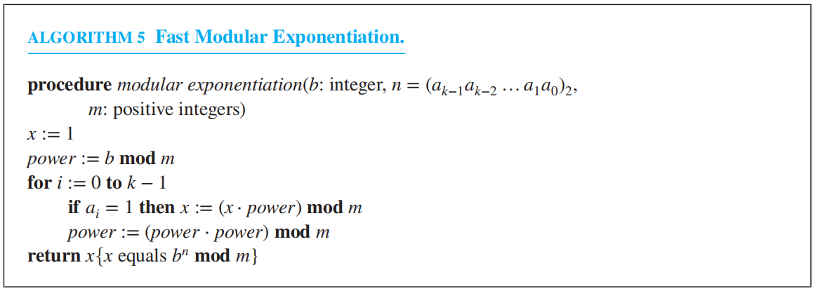
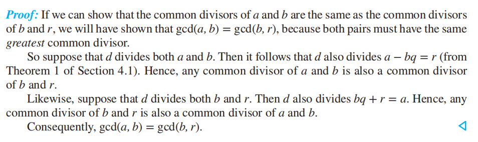
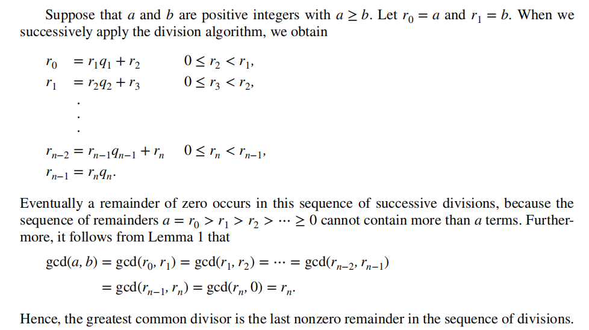
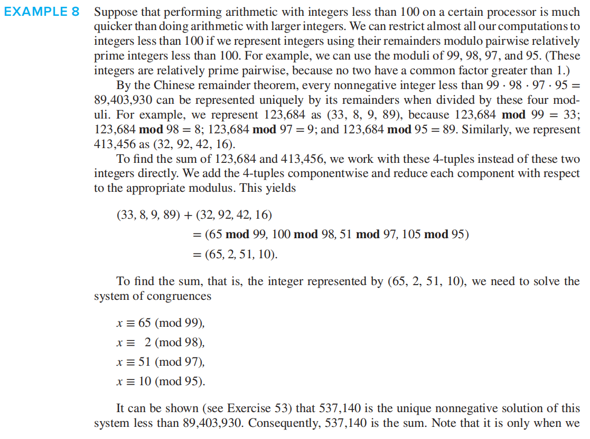
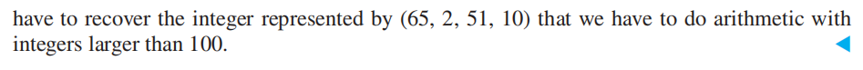

# Chap 4 Number Theory and Cryptography

??? abstract "核心知识"

	+ 除法
		+ 一堆定理
		+ 模除运算
	+ 质数
		+ 试除法
		+ 埃氏筛
		+ 最大公约数、最小公倍数
		+ **欧几里得算法**
		+ **裴蜀定理**
	+ 同余
		+ **求解线性同余的方法**
		+ **中国余数定理**
		+ 费马小定理
		+ 伪质数

## Divisibility and Modular Arithmetic

### Division

定义：如果$a, b$是整数且$a \ne 0$，当存在整数$c$使得$b = ac$，我们说$a$**整除**$b$，记作$a | b$。其中$a$是$b$的**因数(divisor/factor)**，$b$是$a$的**倍数(multiple)**。$a \nmid b$则表示$a$不整除$b$

注：对于**正**整数$n, d$，存在$\lfloor \dfrac{n}{d} \rfloor$个不超过$n$的**正**整数满足被$d$整除

**定理1**：令$a, b, c$为整数，$a \ne 0$，则：

+ 如果$a | b$且$a | c$，则$a | (b + c)$
+ 如果$a | b$，那么对于所有整数$c$，均满足$a | bc$
+ 如果$a | b$且$b | c$，则$a | c$

**推论1**：如果$a, b, c$为整数，$a \ne 0$，使得$a | b$且$a | c$，那么对于任意整数$m, n$，都有$a | mb + nc$成立

### The Division Algorithm

**定理2——除法算法(the Division Algorithm)**：令$a$为整数，$d$为正整数，那么存在唯一整数$q$和$r$，$0 \le r < d$，使得$a = dq + r$

其中，$d$被称为**除数(divisor)**，$a$被称为**被除数(dividend)**，$q$被称为**商(quotient)**，$r$被称为**余数(remainder)**，且有以下关系：

+ $q = a \ \mathbf{div}\  d \quad r = a \ \mathbf{mod}\  d$
+ $a \ \mathbf{div}\ d = \lfloor \dfrac{a}{d} \rfloor \quad a \ \mathbf{mod}\ b = a - d\lfloor \dfrac{a}{d} \rfloor$

>当被除数为负数时，记住一条原则：==余数不能是负数==

### Modular Arithmetic

定义：如果$a, b$为整数，且$m$是正整数，当$m$能整除$a - b$时，我们称**$a, b$模$m$同余**，记作$a \equiv b (\text{mod } m)$。否则，记作$a \not\equiv b (\text{mod } m)$。其中$m$被称为**模(modulus)**

**定理3**：令$a, b$为整数，且$m$为正整数。当且仅当$a \ \mathbf{mod}\ m = b \ \mathbf{mod}\ m$成立时，$a \equiv b (\text{mod } m)$

**定理4**：令$a, b$为整数，且$m$为正整数。当且仅当存在整数$k$，使得$a = b + km$时，$a \equiv b (\text{mod } m)$ 

所有与$a$模$m$同余的整数构成了$a$模$m$的**同余类(congruence class)**
>注：同余类是一种**[等价类](9.md#equivalence-classes)**

**定理5**：令$m$为正整数，如果$a \equiv b(\text{mod } m)$且$c \equiv d(\text{mod } m)$，那么
$$
a + c \equiv b + d(\text{mod } m) \quad ac \equiv bd(\text{mod } m)
$$
:star:**推论2**：令$a, b$为整数，且$m$为正整数。那么有：

$$
\begin{align}
(a + b)\ \mathbf{mod}\ m = ((a\ \mathbf{mod}\ m) + (b\ \mathbf{mod}\ m))\ \mathbf{mod}\ m \notag \\
ab\ \mathbf{mod}\ m = ((a\ \mathbf{mod}\ m)(b\ \mathbf{mod}\ m))\ \mathbf{mod}\ m \notag
\end{align}
$$

### Arithmetic Modulo $m$

我们将算术运算的域限定到$\mathbf{Z}_m$，它是不超过$m$的非负数集合，即$\{0, 1, \dots, m - 1\}$，那么有以下定义：

+ $a +_m b = (a + b)\ \mathbf{mod}\ m$
+ $a \cdot_m b = (a \cdot b)\ \mathbf{mod}\ m$

其中$+_m$和$\cdot_m$运算被称作**算术模$m$(arithmetic modulo $m$)**，具有于普通算术运算类似的性质：

+ **封闭性(closure)**：如果$a, b \in \mathbf{Z}_m$，则$a +_m b, a \cdot_m b \in \mathbf{Z}_m$
+ **可结合性(associativity)**：如果$a, b \in \mathbf{Z}_m$，则$(a +_m b)+_m c = a +_m (b +_m c)$，$(a \cdot_m b)\cdot_m c = a \cdot_m (b \cdot_m c)$
+ **可交换性(commutativity)**：如果$a, b \in \mathbf{Z}_m$，则$a +_m b = b +_m a$，$a \cdot_m b = b \cdot_m a$
+ **单位元素(identity elements)**：0和1分别是加法模m和乘法模m的单位元素，即$a \in \mathbf{Z}_m$，$a +_m 0 = 0 +_m a$，且$a \cdot_m 1 = 1 \cdot_m a$
+ **可加逆(additive inverses)**：如果$a \ne 0 \in \mathbf{Z}_m$，则$m - a$是$a$模$m$的可加逆，0的可加逆是其自身，即$a +_m (m - a) = 0, \ 0 +_m 0 = 0$
+ **分配性(distributivity)**：如果$a, b, c \in \mathbf{Z}_m$，则$a \cdot_m (b +_m c) = (a \cdot_m b) +_m (a \cdot_m c)$，$(a +_m b) \cdot_m c = (a \cdot_m c) +_m (b \cdot_m c)$

---
+ 带有*模加法*的$\mathbf{Z}_m$被称为**可交换组(commutative group)**
+ 带有*模加法*和*模乘法*的$\mathbf{Z}_m$被称为**可交换环(commutative ring)**

### Supplements(from Exercises)

+ 如果$a|b$且$b|a$，那么$a = \pm b$
+ $\lceil \dfrac{n}{k} \rceil = \lfloor \dfrac{n - 1}{k} \rfloor + 1$
+ 如果$a \equiv b \text{ (mod } m)$且$c \equiv d \text{ (mod } m)$，其中$a, b, c, d, m$为整数，$m \ge 2$，那么$a - c \equiv b - d \text{ (mod } m)$
+ 假设$n | m$，其中$m, n$为大于1的整数，如果$a \equiv b \text{ (mod } m)$，其中$a, b$为整数，那么$a \equiv b\text{ (mod } n)$
+ 假设$a, b, c, m$为整数，$m \ge 2$，$c > 0$，且$a \equiv b \text{ (mod } m)$，则$ac \equiv bc \text{ (mod } mc)$
+ 假设$a, b, k, m$为整数，$m \ge 2$，$k > 1$，且$a \equiv b \text{ (mod } m)$，则$a^k \equiv b^k \text{ (mod } m)$

## ~~Integer Representation and Algorithms~~

>注：隐藏了一些老生常谈的知识点，推荐看一下模指数运算

??? info "可忽略"

	### Representations of Integers

	**定理1($n$的基底$b$扩展, base $b$ expansion of $n$)**：令$b$为大于1的整数，如果$n$是正整数，则它能用以下形式唯一表示：
	$$
	n = a_kb^k + a_{k - 1}b^{k - 1} + \dots + a_1b + a_0
	$$
	其中$k$是非负数，$a_0, a_1, \dots, a_k$是小于$b$的非负数，且$a_k \ne 0$

	常见类型：

	+ **十进制扩展(decimal expansion)**——基底为10
	+ **二进制扩展(binary expansion)**——基底为2
	+ **八进制扩展(octal expansion)**——基底为8
	+ **十六进制扩展(hexadecimal expansion)**——基底为16
	>*字节(Byte)*是长度为8的位串，它常用2位十六进制数表示

	

	
	

	----
	**基底转换**的方法(对整数$n$进行基底$b$扩展)：

	+ 首先，$b | n$得到商和余数，即$n = bq_0 + a_0,\ 0 \le a_0 < b$，其中$a_0$是$n$的基底$b$扩展中最低位的数
	+ 然后继续$b | a_0$，得到$q_0 = bq_1 + a_1,\ 0 \le a_1 < b$，其中$a_1$是$n$的基底$b$扩展中的第二位数
	+ 持续这个步骤，直到商为0的时候结束，这样我们从右到左得到$n$的基底$b$扩展

	算法描述：

	

	
	

	+ **二**进制 $\rightarrow$ **八**进制：三位二进制 = 一位八进制
	+ **二**进制 $\rightarrow$ **十六**进制：四位二进制 = 一位十六进制

	### Algorithms for Integer Operations

	假设有两个用二进制表示的数$a, b$

	$$
	a = (a_{n - 1}a_{n - 2}\dots a_1a_0)_2,\ b = (b_{n - 1}b_{n - 2}\dots b_1b_0)_2
	$$

	=== "**二进制加法**"

		$$
		\begin{cases}
		a_0 + b _0 = c_0 \cdot 2 + s_0&\text{if i = 0,} \\
		a_i + b_i + c_{i - 1} = c_i \cdot 2 + s_i & \text{if 0 < i < n,} \\
		s_n = c_{n - 1} & \text{if i = n}
		\end{cases} \quad \therefore a + b = (s_ns_{n - 1}s_{n - 2}\dots s_1s_0)_2
		$$

		算法：

		

		
		

		加法运算次数：$O(n)$

	=== "**二进制乘法**"

		$$
		\begin{align}
		ab & = a(b_02^0 + b_12^1 + \dots + b_{n - 1}2^{n - 1}) \notag \\
		& = a(b_02^0) + a(b_12^1)+ \dots + a(b_{n - 1}2^{n - 1}) \notag 
		\end{align}
		$$

		为了得到$ab_j2^j$，我们通过在其后面填上$j$个0位的方法，将其向左**移动**$ab_jj$个位置

		算法：

		

		
		

		移位次数：$O(n^2)$，加法次数：$O(n^2)$

	=== "**整除，求余运算**"

		算法(这是个*暴力算法*)：

		

		
		

		+ 该算法同样适用于$a$为负数的情况
		+ 位运算次数：$O(q \log a),\ a > d$

### Modular Exponentiation

>适用场合：当进行**求余**运算的数**非常大**时($b^n \ \mathbf{mod}\ m$)

方法：
令$n = (a_{k - 1}\dots a_1a_0)_2$，则$b^n = b^{a_{k-1}\cdot 2^{k - 1} + \dots + a_1 \cdot 2 + a_0} = b^{a_{k - 1} \cdot 2^{k - 1}} \dots b^{a_1 \cdot 2} \cdot b^{a_0}$，要求$b^n \ \mathbf{mod}\ m$，计算：

$$b \ \mathbf{mod}\ m, b^2 \ \mathbf{mod}\ m, b^4 \ \mathbf{mod}\ m, \dots, b^{2^{k - 1}}\ \mathbf{mod}\ m$$

，然后将所有$a_j = 1$对应的$b^{2^j} \ \mathbf{mod}\ m$相乘，对积求余，即可得到结果

算法：

乘法次数：$O(\log_2(n))$，位运算次数：$O((\log m)^2 \log n)$

🌰

### Supplements(from Exercises)

+ 二进制**反码(one's complement)**：最左边一位是*符号位*，0代表+，1代表-。对于剩下的位：

	+ 正数：保持原来的二进制表示
	+ 负数：每一位**取反**—— $0 \rightarrow 1$，$1 \rightarrow 0$

+ 二进制**补码(two's complement)**：最左边一位是*符号位*，0代表+，1代表-。对于剩下的位：

	+ 正数：保持原来的二进制表示
	+ 负数：每一位**取反**—— $0 \rightarrow 1$，$1 \rightarrow 0$后，再+1

>注：
>
>+ 教材给出的做法：剩下的位 = $2^{n - 1} - |x|$
>+ 具体内容见[数逻](../../sys/dld/3.md#unsigned-2s-complement-subtraction)

+ **[BCD码](../../sys/dld/1.md#binary-coded-decimalbcd)**：对于一个整数，它的每个位*分别*用4位二进制表示

+ **康托扩展(Cantor expansion)**：$a_n n! + a_{n - 1} (n - 1)! + \dots + a_2 2! + a_1 1!$，其中$0 \le a_i \le i, i = 1, 2, \dots, n$

## Primes and Greatest Common Divisors

### Primes

定义：

+ 对于大于1的整数$p$，如果它唯一的正因数是1和它自身，则$p$被称为**质数(素数)(primes)**
+ 不是质数的正整数（大于1）被称为**合数(composite)**

>注：
>
>+ 1既不是质数，也不是合数
>+ 当且仅当存在一个整数$a$，使得$a | n$且$1 < a < n$，那么整数$n$为合数

**定理1——算术基本定理(THE FUNDAMENTAL THEOREM OF ARITHMETIC)**：每一个大于1的整数能够被*唯一*表示为<u>一个质数</u>；或者<u>两个及多个质数的乘积</u>，这些质因数按照非递减的顺序排列。

### Trial Division

**定理2**：如果$n$是合数，则$n$拥有小于等于$\sqrt n$的质因数

**试除法(trial division)**：要判断整数$n$是否为质数，可以让$n$除以小于等于$\sqrt n$的所有质数。如果这些数都无法整除$n$，则说明$n$为质数，否则$n$为合数。这是一种*暴力算法(brute-force algorithm)*。

**分解质因式(prime factorization)**：要得到$n$的质因式，通过一连串的质数整除$n$，从最小的质数2开始：

+ 如果$n$有质因数，那么将会找到一个不超过$\sqrt n$的质数$p$。因此如果没有找到不超过$\sqrt n$的质数，说明$n$是质数
+ 否则的话，即找到质因数$p$，那么按照前面的步骤，继续对$\dfrac{n}{p}$分解质因式，直到得到一个质数为止。

### The Sieve of Eratosthenes

**埃拉托斯提尼筛(the sieve of Eratosthenes)**：用来找到不超过指定正整数的所有质数 

>方法：找出所有不超过$\sqrt n$的质数，然后从小到大依次将它们的倍数(不超过$n$)删去，剩下的数就是不超过$n$的质数。下面的🌰(寻找$\le$ 100的质数)会更加直观地体现这一方法👇

---
**定理3**：有*无穷多个*质数

???+ note "证明"

	采用*归谬法*，由欧几里得证明，被认为是最优雅的数学证明之一：

	

	
	

**梅森质数(Mersenne primes)**：形如$2^p - 1$的质数，其中$p$为质数。

+ 一般认为最大的质数(虽然无法找到)就是一种梅森质数
+ 如果$p$不为质数，则$2^p - 1$也不是质数
+ *[Lucas-Lehmer test](https://en.wikipedia.org/wiki/Lucas%E2%80%93Lehmer_primality_test)*：验证形如$2^p - 1$($p$为质数)的数是否为质数的一种测试

---
**定理4——质数(素数)定理(THE PRIME NUMBER THEOREM)**：当$x$无限增长时，$\pi(x)$，即不超过$x$的质数的个数，与$\dfrac{x}{\ln x}$的比值趋向于1。（即$\lim\limits_{x \rightarrow \infty} \dfrac{\pi (x)}{x/ \ln x} = 1$）

这张表直观地反映了这个定理👇

应用：

+ 从不超过$n$的正整数中随机选择一个数是质数的概率是：$\dfrac{\pi (x)}{x} = \dfrac{x/ \ln x}{x} = \dfrac{1}{\ln x}$

+ 正整数$n$是质数的概率也是$\dfrac{1}{\ln n}$

---
每一个*等差数列(arithmetic progression)*$ak + b, k = 1,2, \dots$（其中$a, b$没有大于1的公约数），拥有无穷多个质数

### Conjectures and Open Problems About Primes

+ 对于每一个拥有整数系数的多项式$f(n)$，存在正整数$y$，使得$f(y)$为合数
+ **哥德巴赫猜想(Goldbach's Conjecture)**：对于每一个大于2的*偶数*$n$，总能被分解为*两个质数的和*。

	虽然尚未得到完全的证明，但大多数数学家认为它是正确的。下面是一些弱化的结果：

	+ 每个大于2的偶数至多是6个质数之和
	+ 每个足够大的正整数是一种质数的和，或者要么是一个质数，要么是两个质数的乘积

+ 存在无穷多个正整数$n$，使得$n^2 + 1$要么是质数，要么是至多两个质数的乘积
+ **孪生素数猜想(The Twin Prime Conjecture)**：
	+ *孪生素数(Twin primes)*：相差2的质数对
	+ 已经证明：有无穷多对$p$和$p+2$，$p$为质数，$p+2$为质数或者两个质数的乘积
	+ 令$P(n)$表示有无穷多对相差为$n$的质数。*有界间隙猜想(bounded gap conjecture)*——存在整数$N$，使得$P(N)$为真。

>参考资料：[张益唐](https://zh.wikipedia.org/wiki/%E5%BC%A0%E7%9B%8A%E5%94%90)

### Greatest Common Divisors and Least Common Multiples

定义：令$a, b$为非0整数，使得$d|a$且$d|b$的最大整数$d$被称为$a$和$b$**最大公约数(greatest common divisor)**，记作$\text{gcd}(a, b)$

+ 如果两个整数的最大公约数是1，称这两个数**互质(relatively prime)**
+ 对于一组整数$a_1, a_2, \dots, a_n$，如果$\text{gcd}(a_i, a_j) = 1, 1 \le i < j \le n$，那么称这组整数**两两互质(pairwise relatively prime)**

对两个正整数$a, b$分解质因数，得到：

$$a = p_1^{a_1}p_2^{a_2}\dots p_n^{a_n},\ b = p_1^{b_1}p_2^{b_2}\dots p_n^{b_n}$$

那么：$\text{gcd}(a, b) = p_1^{\min (a_1, b_1)} p_2^{\min (a_2, b_2)} \dots p_n^{\min (a_n, b_n)}$

---
定义：令$a, b$为非0整数，能被$a$和$b$整除的最小整数被称为$a$和$b$**最小公倍数(least common multiple)**，记作$\text{lcm}(a, b)$

与上面同理：$\text{lcm}(a, b) = p_1^{\max (a_1, b_1)} p_2^{\max (a_2, b_2)} \dots p_n^{\max (a_n, b_n)}$

**定理5**：令$a, b$为正整数，那么$ab = \text{gcd}(a, b) \cdot \text{lcm}(a, b)$

### The Euclidean Algorithm

**欧几里得算法(辗转相除法)(Euclidean algorithm)**：一种找到最小公约数的高效算法

**引理1**：令$a = bq + r$，其中$a, b, q, r$为整数，那么$\text{gcd}(a, b) = \text{gcd}(b, r)$

??? note "证明"

	

	
	

通过这个引理，我们可以得到欧几里得算法的流程：

算法：

时间复杂度：$O(\log b)$

### gcds as Linear Combinations

**定理6——裴蜀定理(BEZOUT'S THEOREM)**：如果$a, b$是正整数，那么存在正数$s, t$，使得$\text{gcd}(a, b) = sa + tb$
>其中$s, t$被称为*裴蜀系数(Bezout coefficients)*，上面的等式被称为*裴蜀恒等式(Bezout's identity)*

将两个数的最大公约数表示为两个数的**线性组合(linear combination)**的方法：

+ 将欧几里得算法的结果往回代(先*向前*运用欧几里得算法，再*向后*代入中间值)
+ **拓展欧几里得算法(extended Euclidean algorithm)**：
	先令$s_0 = 1, s_1 = 0, t_0 = 0, t_1 = 1$，然后令$s_j = s_{j - 2} - q_{j - 1}s_{j - 1}$，$t_j  = t_{j - 2} - q_{j - 1}t_{j - 1}$，其中$j = 2, 3, \dots, n$，$q_j$是欧几里得算法中得到的一系列商，那么$\text{gcd}(a, b) = s_na+t_nb$

???+ example "例题"

	=== "方法1"

		

		
		

	=== "方法2"

		

		
		

**引理2**：如果$a, b, c$为正整数，使得$\text{gcd}(a, b) = 1$且$a | bc$，那么$a | c$

**引理3**：如果$p$是质数，且对于每个整数$a_i$，$p | a_1a_2\dots a_n$，那么$\exists i \in [1, n]$，$p\ |\ a_i$

**定理7**：令$m$为正整数，$a, b, c$为整数，如果$ac \equiv bc (\text{mod } m)$且$\text{gcd}(c, m) = 1$，那么$a \equiv b (\text{mod } m)$

### Supplements(from Exercises)

+ 如果$a, m$是大于1的整数，且$m$是奇数，那么$a^m + 1$是合数
+ 对于任意正整数$n$，存在$n$个连续的合数
+ 如果一个数等于*除自身外所有因数的和*，那么这个数被称为**完美(perfect)数**
+ **欧拉函数(Euler $\phi$-function)**：$\phi (n) =$ 不超过$n$的与$n$互质的正整数的个数
+ 如果$a, b$是正整数，那么$(2^a - 1) \ \mathbf{mod}\ (2^b - 1) = 2^{a \ \mathbf{mod}\ b} - 1$
+ 如果$a, b$是正整数，那么$\text{gcd}(2^a - 1, 2^b - 1) = 2^{\text{gcd}(a, b)} - 1$
+ 如果$a, b, m$是整数，$m \ge 2$，且$a \equiv b (\text{mod } m)$，那么$\text{gcd}(a, m) = \text{gcd}(b, m)$
+ 对于所有等差数列$ak + b, k = 1, 2, \dots$，其中$a, b$为正整数，在其中总存在一个合数

## Solving Congruences

### Linear Congruences

**线性同余(linear congruences)**：形如$ax \equiv b (\text{mod } m)$的同余，其中$m$是正整数，$a, b$是整数，$x$是变量

线性同余$ax \equiv b(\text{mod } m)$的**解(solution)**是所有满足同余关系的整数$x$，求解方法后面会讲到。

---
$a$模$m$的**逆(inverse)**：$\overline{a}$，满足$\overline{a}a \equiv 1(\text{mod } m)$

**定理1**：如果$a, m$互质，且$m > 1$，那么$a$模$m$的逆存在，且该逆对模$m$是*唯一的*

如何找到$a$模$m$的逆？

+ 当$m$较小时，采用观察法（暴力算法）
+ 高效的做法：由已知得$\text{gcd}(a, m) = 1$，按照与[上例](#gcds-as-linear-combinations)相同的方法，逆转欧几里得算法的步骤，得到最大公约数的线性组合表示，即$sa + tm = 1$，则$sa + tm \equiv 1 (\text{mod } m)$。因为$tm \ \mathbf{mod}\ m = 0$，所以$sa \equiv 1 (\text{mod } m)$，因此$s$即为$a$模$m$的逆。

??? example "例题"

	

	
	

	

	
	

如何求解$ax \equiv b (\text{mod } m)$？ 

+ 找到$\overline{a}$，即$a$模$m$的逆
+ 对式子两边同时乘上$\overline{a}$

🌰：

### The Chinese Remainder Theorem

**定理2——中国余数定理(THE CHINESE REMAINDER THEOREM)**：令$m_1, m_2, \dots, m_n$为两两互质且大于1的正整数，且$a_1, a_2, \dots, a_n$为任意整数，那么下面方程组：

$$
\begin{align}
x & \equiv a_1 (\text{mod } m_1) \notag \\
x & \equiv a_2 (\text{mod } m_2) \notag \\
& \cdot \notag \\
& \cdot \notag \\
& \cdot \notag \\
x & \equiv a_n (\text{mod } m_n) \notag \\
\end{align}
$$

有**唯一解**的模$m = m_1m_2 \dots m_n$。也就是说，存在一个解$x, 0 \le x < m$，所有其他的解与$x$模$m$同余

!!! note "如何构造**联立解(simultaneous solution)**？"

	=== "法1"

		+ 先令$M_k = \dfrac{m}{m_k}, k = 1, 2, \dots, n$
		+ 因为$m_i, m_k(i \ne k)$没有大于1的公因数，所以$\text{gcd}(m_k, M_k) = 1$。由定理1知，存在整数$y_k$是$M_k$模$m_k$的逆，使得$M_ky_k \equiv 1 (\text{mod } m_k)$
		+ 得到$x = a_1M_1y_1 + a_2M_2y_2 + \dots + a_nM_ny_n$

		下面证明这个式子为联立解：

		+ 对于上面方程组中的第$k$行，因为$M_j \equiv 0 (\text{mod } m_k), j \ne k$，所以除了第$k$项外，这个和式中的其他项与0模$m_k$同余
		+ 又因为$M_ky_k \equiv 1 (\text{mod } m_k)$
		+ 所以$x \equiv a_kM_ky_k \equiv a_k (\text{mod } m_k), k = 1, 2, \dots, n$，因而$x$可以满足所有$n$个同余关系

		🌰

		

		
		

		

		
		

	=== "法2——**回代(back substitution)**"

		利用4.1节[定理4](#modular-arithmetic)，根据已知条件往回代，最后可以得到形如$x = mk + r$的形式，则所有解为$x \equiv r (\text{mod } m)$

		:chestnut:：

		

		
		

		>注：倒数第3行最右边那个$u$应该是$v$

### Computer Arithmetic with Large Integers

令$m_1, m_2, \dots, m_n$为两两互质的模数，$m$为它们的积。由**中国余数定理**，可以得到对于一个整数$a,\ 0 \le a < m$，它能够被*唯一*表示为由它分别除以$m_i, i = 1, 2, \dots, n$得到的余数构成的$n$*元组*，即

$$
a \triangleq (a \ \mathbf{mod}\ m_1, a \ \mathbf{mod}\ m_2, \dots, a \ \mathbf{mod}\ m_n)
$$

对于大数的算术运算:

+ 我们可以先将其转化为上述$n$元组的形式，对其进行*分量式运算(componentwise operations)*
+ 然后利用前面求解同余方程组的方法将结果*还原*为正常的表示，即为我们得到的结果

+ 这么做的好处是：不仅可以进行范围更大的算术运算，而且还提升运算速度（不同的模运算可以并行处理）
+ 一般选择形如$2^k - 1(k \in \mathbf{Z^+})$的数作为大数运算的模数，因为这样不仅容易进行二进制模运算，而且更容易找到两两互质的模数

这个🌰可以更清楚地展现该方法的威力：

### Fermat's Little Theorem

**定理3——费马小定理(MERMAT'S LITTLE THEOREM)**：如果$p$是质数，$a$为整数，且$p \nmid a$，那么
$$
a^{p - 1} \equiv 1 (\text{mod } p) \ \text{ , i.e. } \ a^p \equiv a (\text{mod } p)
$$
亦即：如果$a \in \mathbf{Z}_p$，那么$a^{p - 1} = 1 \in \mathbf{Z}_p$

!!! question "如何计算$a^n \ \mathbf{mod}\ p$（$p$是质数且$p \nmid a$）?"

	+ 利用除法算法，得到$n = q(p - 1) + r$
	+ 由费马小定理知，$a^n = a^{q(p - 1) + r} = (a^{p - 1})^qa^r \equiv 1^qa^r \equiv a^r (\text{mod } p)$

### Pseudoprimes

在[前面](#the-sieve-of-eratosthenes)，我们介绍过判断一个整数$n$是否为质数的方法，但这个方法太低效了——那么有没有更高效的方法？

中国古代的数学家发现，当$n$为奇数时，它是**质数**的充要条件是$2^{n - 1} \equiv 1 (\text{mod } n)$。然而，有些**合数**也满足这个式子，这样的整数被称为对于基底为2的**伪质数(pseudoprimes)**

定义：令$b$为正整数，如果$n$为合数，且$b^{n - 1} \equiv 1(\text{mod } n)$，那么$n$被称为*对于基底为$b$的伪质数*

+ 我们可以选择多个基底来确定$n$是否为质数。如果$n$通过所有测试，说明$n$要么为质数，要么是对于所有已测试的基底的*伪质数*
+ 对于不超过$x(x \in \mathbf{R}^+)$的正整数，对于基底为$b$的伪质数的个数远小于质数的个数。但即便如此，也无法用这种方法区分质数和伪质数

定义：如果一个合数$n$，对于所有正整数$b$，$\text{gcd}(b, n) = 1$，如果满足$b^{n - 1} \equiv 1(\text{mod } n)$，这样的数$n$被称为**卡迈克尔数(Carmichael number)**
>注：
>
>+ 卡迈克尔数属于伪质数，且有无穷多个卡迈克尔数
>+ [更具体的介绍](https://en.wikipedia.org/wiki/Carmichael_number)

### ~~Primitive Roots and Discrete Logarithm~~

定义：以质数$p$为模的**原根(primitive root)**$r$，$r \in \mathbf{Z}_p$，使得$\mathbf{Z}_p$中的每一个非零元素都是$r$的幂
>注：对于每一个质数$p$，总存在以质数$p$为模的原根

定义：假设$p$为质数，$r$是以$p$为模的原根，$a$是整数且$a \in [1, p - 1]$。如果$r^e \ \mathbf{mod}\ p = a$且$0 \le e \le p - 1$，称$e$为以$r$为底数，关于$a$模$p$的**离散对数(discrete logarithm)**，记作$\log_ra = e$

*离散对数问题(discrete logarithm problem)*：以上述$p, r, a$为输入，得到$e$。看似简单的问题，但目前没有多项式时间的算法能够解出结果。

### Supplements(from Exercises)

+ 如果$m$是大于1的整数，且$ac \equiv bc(\text{mod } m)$，那么$a \equiv b(\text{mod} \dfrac{m}{\text{gcd}(c, m)})$
+ 如果$p$为质数，那么对于在$(1, p - 1)$之间的整数，能被划分成$\dfrac{p - 3}{2}$对整数，满足每对整数互为模$p$的逆
+ **威尔逊定理(Wilson's theorem)**：当$p$为质数时，满足$(p-1)! \equiv - 1 (\text{mod } p)$
+ 令$m_1, m_2, \dots, m_n$为两两互质且大于等于2的整数，如果$a \equiv b (\text{mod } m_i), i = 1, 2, \dots, n$，那么$a \equiv b (\text{mod } m )$，其中$m = m_1m_2 \dots m_n$（可用这个结论来证明中国余数定理）
+ 如果$p$为奇质数，那么对于梅森数$2^p - 1$，它的所有因数都将形如$2kp + 1$，其中$k$为非负数
+ 令$n$为正整数，且令$n - 1 = 2^st$，其中$s$为非负数，$t$为正奇数。如果$b^t \equiv 1(\text{mod } n)$，或者对于某些$j \in [0, s - 1]$，$b^{2^jt} \equiv -1 (\text{mod } n)$，那么称$n$通过**对于基底为$b$的米勒测试(Miller's test for the base $b$)**。
+ 对于一个合数$n$，如果它能通过对于基底为$b$的米勒测试，那么称它为**对于基底为$b$的强伪质数(strong pseudoprime to the base $b$)**
	>一个合数通过的米勒测试小于$\dfrac{n}{4}$种基底$b(1 < b < n)$
+ 令$m$为正整数，如果整数$a$满足$\text{gcd}(a, m) = 1$且$x^2 \equiv a(\text{mod } m)$有解，那么称$a$关于$m$的**平方剩余(quadratic residue)**。如果$a$不是关于$m$的平方剩余，但满足$\text{gcd}(a, m) = 1$，那么称$a$关于$m$的**平方非剩余(quadratic nonresidue)**
+ 如果$p$为奇质数，且整数$a$无法被$p$整除，那么对于**勒让德符号(Legendre symbol)**$(\dfrac{a}{p})$，如果$a$是关于$m$的平方剩余，其值为1，否则为-1。它具有以下性质(以下$p$均为奇质数)：
	+ 如果$a, b$为整数，且$a \equiv b (\text{mod } p)$，那么$(\dfrac{a}{p}) = (\dfrac{b}{p})$
	+ **欧拉准则(Euler's criterion)**：如果正整数$a$满足$p \nmid a$，那么$(\dfrac{a}{p}) \equiv a^{\frac{p - 1}{2}}(\text{mod } p)$
	+ 如果整数$a,b$无法被$p$整除，那么$(\dfrac{ab}{p}) = (\dfrac{a}{p}) (\dfrac{b}{p})$

## ~~Applications of Congruences~~

### Hashing Functions

>具体见[数据结构基础](../../algo/fds/5.md)

**散列函数(Hashing function)**$h$用**键(key)**唯一表示记录(records)。它会给键为$k$的记录分配内存地址$h(k)$。它具有以下特征：容易求解，是*满射函数*

一种最常用的散列函数：$h(k) = k \ \mathbf{mod}\ m$，$m$为可用内存的个数

因为散列函数**不是***单射函数*，因此可能存在不止一个数据被分配到同一个内存地址的情况，我们称这种情况为**冲突(collision)**。一种解决冲突的方法是：为内存位置被占的数据，分配从该位置开始第一个未被占用的内存位置。这种方法可用**线性探测函数(linear probing function)**表示：$h(k, i) = h(k) + i \ \mathbf{mod}\ m$

### Pseudorandom Numbers

通过系统方法生成的“随机”数并不真的随机，这样的数被称为**伪随机数(pseudorandom numbers)**

生成伪随机数最常用的方法是**线性同余法(linear congruential method)**：

+ 选择4个整数：**模数(modulus)**$m$，**乘数(multiplier)**$a$，**增量(increment)**$c$，**种子(seed)**$x_0$，且$2 \le a < m, 0 \le c < m, 0 \le x_0 < m$
	>$c$通常设为0
+ 通过连续使用以下递归定义的函数，获得一系列的伪随机数$\{x_n\}$，对于所有$n$，满足$0 \le x_n < m$
$$
x_{n+1} = (ax_n + c)\ \mathbf{mod}\ m
$$
如果要得到0-1之间的伪随机数(经常使用)，只需上面将得到伪随机数除以$m$，即$\dfrac{x_n}{m}$是在0-1之间的伪随机数

上述伪随机数生成器被称为**纯乘法生成器(pure multiplicative generator)**

>线性同余法虽然方便，但是它无法像真正的同余数那样显示一些重要的统计学性质。对于这类问题，应采用别的方法

### Check Digits

**校验位(Check digit)**：通常位于位串的末尾，用来侦测位串是否有错误

???+ example "应用"

	=== "**奇偶校验位**"

		数字信息通常被表示为位串，且被划分为指定规模的块。将每个块存储或传输前，一个额外的为，即奇偶校验位，被添加在每个块的后面。对于一个位串$x_1x_2\dots x_n$，它的奇偶校验位$x_{n + 1} = x_1 + x_2 + \dots x_n \ \mathbf{mod}\ 2$

		所以如果块中有偶数个1，$x_{n + 1} = 0$；如果有奇数个1，$x_{n + 1} = 1$。因此，奇偶校验位只能侦测奇数个数位的错误，而无法判断偶数个数位的错误

		>[参考](../../sys/dld/1.md#error-detection)

	=== "**通用商品代码(Universal Product Codes, UPCs)**"

		最常用的UPC由12位十进制数构成：第1位表示产品类型，接下来的5位表示生产商，再接下来的5位表示特定产品，最后1位为校验位，它由以下式子决定：
		$$
		3x_1 + x_2 + 3x_3 +x_4 + 3x_5 + x_6 + 3x_7 + x_8 + 3x_9 + x_{10} + 3x_{11} + x_{12} \equiv 0 (\text{mod } 10)
		$$

	=== "**国际标准图书编号(International Standard Book Number, ISBN-10)**"

		它是由出版商分配的十位码（也有13位的，见Supplements）$x_1x_2\dots x_{10}$，它能表示语言、出版商、由出版商为书本分配的号码，和校验位（单个数字或X(表示10)），它满足：
		$$
		x_{10} \equiv \sum\limits_{i = 1}^9ix_i(\text{mod } 11) \quad \text{, or }\sum\limits_{i = 1}^{10}ix_i \equiv 0(\text{mod } 11)
		$$
		
		常见错误：

		+ **单个错误(single error)**：识别码中的某一位出错
			如何找到？
			对于某个整数$j$，满足$y_i = \begin{cases}x_i &, \text{ if } i \ne j \\ x_j + a &, \text{ if }i = j\end{cases}$，其中$a \in [-10, 10]$且$a \ne 0$，此时$a = y_j - x_j$为第$j$位上的错误，满足关系
			$$\sum\limits_{i = 1}^{10}iy_i = (\sum\limits_{i = 1}^{10}ix_i) + ja \equiv ja \not\equiv 0 (\text{mod } 11)$$
		+ **换位错误(transposition error)**：识别码中其中2位被意外地交换了
			如何找到？
			对于两个不同的整数$j, k$，使得$y_j = x_k$且$y_k = x_j$；而且当$i \ne j$且$i \ne k$时，$y_i = x_i$，那么满足关系
			$$\sum\limits_{i = 1}^{10}iy_i = (\sum\limits_{i = 1}^{10}ix_i) + (jx_k - jx_j) + (kx_j - kx_k) \equiv (j - k)(x_k - x_j) \not\equiv 0 (\text{mod } 11)$$

### Supplements(from Exercises)

+ 另一种解决散列冲突的方法：**双重散列(double hashing)**——使用最初的散列函数$h(k) = k\ \mathbf{mod}\ p$和第二个散列函数$g(k) = (k + 1)\ \mathbf{mod}\ (p - 2)$。当冲突发生时，我们使用**检测序列(probing sequence)**$h(k, i) = (h(k) + i \cdot g(k))\ \mathbf{mod}\ p$
+ **平方取中法(middle-square method)**：从1个n位整数开始生成伪随机数。将这个数平方，并在结果左边填充0，使其长度为2n。取这个结果中间n位数字作为伪随机数序列的下一个数字
+ **幂生成器(power generator)**（用来生成伪随机数）：指定质数$p$和正整数$d$，满足$p \nmid d$，和一个种子$x_0$。伪随机数$x_1, x_2, \dots$通过递归定义$x_{n+1} = x_n^d \ \mathbf{mod}\ p$

## ~~Cryptography~~

### Classsical Cryptography

### Public Key Cryptography

### The RSA Cryptosystem

#### Encryption

#### Decryption

#### RSA as a Public Key System

### Cryptographic Protocols

### Homomorphic Encryption

