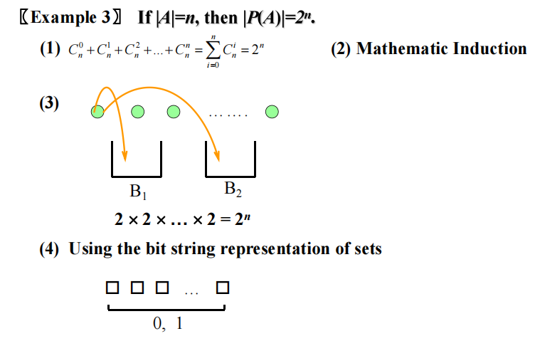
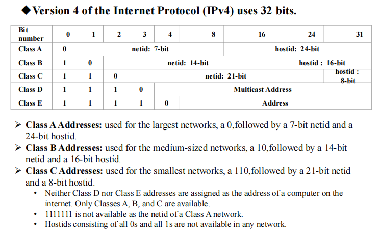
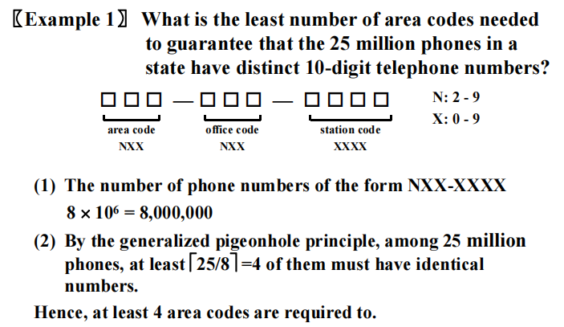
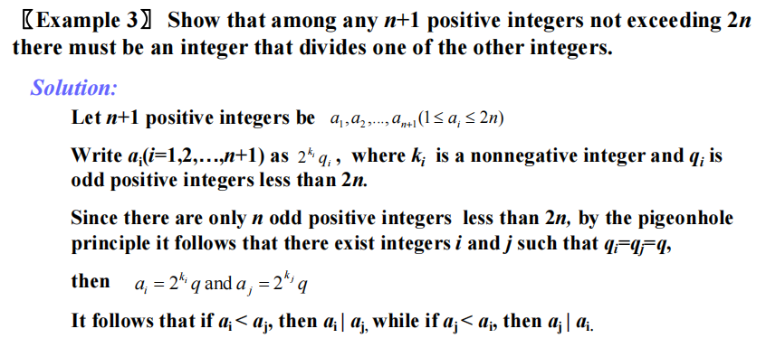
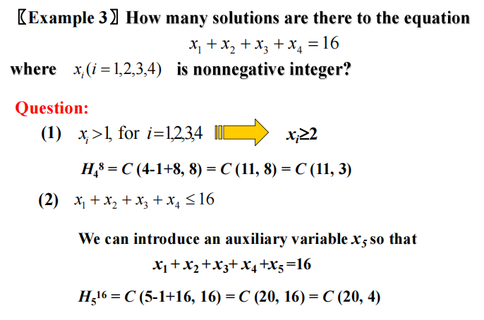
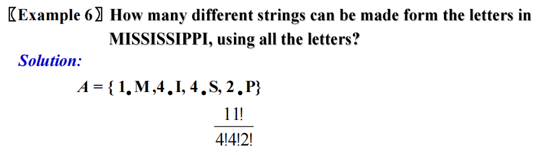
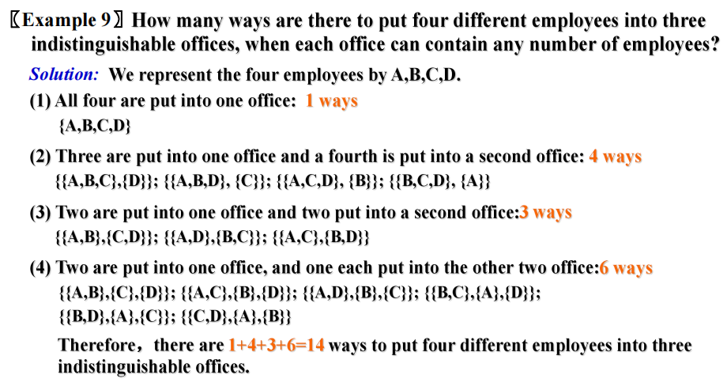

# Chap 6 Counting

??? abstract "核心知识"

	+ 基本计数方法：积、和、减(容斥原理)、除
	+ **鸽巢原理**：推广形式，关注例题
	+ 排列、组合
		+ 基本版本
		+ 可重版本
		+ **几类问题**
			+ 不可区分物体的排列
			+ 可区分/不可区分的物体放入可区分/不可区分的箱子里（共4种情况）
	+ 二项式定理

## The Basics of Counting

### Basic Counting Principles

**乘积法则(THE PRODUCT RULE)**：假设一个流程可以被分成两个阶段，如果有$n_1$种方法完成第一个阶段，且对于完成第一个阶段的每一种方法，有$n_2$种对应的方法完成第二个阶段，那么就有$n_1n_2$种方法完成整个流程。

拓展版本：假设一个流程可以被分成一系列阶段$T_1, T_2, \dots, T_m$。如果每个阶段$T_i, i = 1, 2, \dots, m$有$n_i$种方法完成（不论前面的任务是怎么完成的），那么就有$n_1n_2 \dots n_m$种方法完成整个流程。

!!! example "例题"

	=== "计数函数(counting functions)"

		

		
		

	=== "计数单射函数(counting one-to-one funcitons)"

		

		
		
	

	=== "计数有限集合的子集(counting subsets of a finite set)"

		如果$|A| = n$，那么$|P(A)| = 2^n$

		证明：

		

		
		
	

		如果$A_1, A_2, \dots, A_n$是有限集合，那么它们的笛卡尔积的元素个数等于这些集合元素个数的乘积，即：

		$$|A_1 \times A_2 \times \dots \times A_m| = |A_1| \cdot |A_2| \cdot \dots \cdot |A_m|$$

---
**和法则(THE SUM RULE)**：如果一个任务既要被包含$n_1$步的方法完成，也要被包含$n_2$步的方法完成，且$n_1$步形成的集合与$n_2$步形成的集合不相交，则总共需要$n_1 + n_2$步来完成该任务。

拓展版本：假设一个任务要被包含$n_1$步的方法、包含$n_2$步的方法……包含$n_m$的方法完成，且这些步骤形成的集合两两不相交，那么完成这个任务的总步数为$n_1 + n_2 + \dots + n_m$。

因此，对于两两互不相交的集合，我们可以得到以下公式：
$$
|A_1 \cup A_2 \cup \dots \cup A_m| = |A_1| + |A_2| + \dots + |A_m| \text{ when } A_i \cap A_j = \emptyset \text{ for all } i, j
$$

### More Complex Counting Problems

???+ example "例题"

	=== "计算可能的密码个数"

		

		
		
	

	=== "计算IP地址(IPv4)个数"

		

		
		

		

		
		
		

		>注：IPv4(32位)地址已经耗尽，IPv6(128位)的出现解决IP地址不足的问题

### The Subtraction Rule (Inclusion-Exclusion for Two Sets)

**减法法则(THE SUBTRACTION RULE)**：如果一个任务既要$n_1$步完成，也要$n_2$步完成，则完成任务的总步数为：$n_1 + n_2 - $ 这2个不同方法包含的相同步骤数。

减法法则又被称为**容斥原理(principinclusion-exclusion)**

$$|A_1 \cup A_2| = |A_1| + |A_2| - |A_1 \cap A_2|$$

🌰

	 

### The Division Rule

**除法法则(THE DIVISION RULE)**：如果一个任务有$n$种方法完成，那么对于每种方法$w$，有且仅有$d$种方法与$w$等价，因此完成该任务共需$\dfrac{n}{d}$步

>注：这里表述有些问题，可能会误导读者，推荐理解下面的表述:point_down:

另外形式的表述(容易理解一点😊)：

+ 集合版本：如果一个有限集合$A$是由$n$个两两不相交的子集构成的并集，且每个子集有$d$个元素，那么$n = \dfrac{|A|}{d}$
+ 函数版本：如果$f: A \rightarrow B$，$A, B$均为有限集合，且$\forall y \in B$，有且仅有$d$个$x \in A$，使得$f(x) = y$，那么$|B| = \dfrac{|A|}{d}$

🌰

	

### Tree Diagrams

我们可以使用**树状图(tree diagram)**解决简单的计数问题：

+ 用*分支*表示每种可能的选择
+ 用*叶子*表示每种可能的结果

>我的理解：其实就是枚举法，只能用于数据规模较小的情况

???+ example "例题"

	=== "例1"

		

		
		
	
		

		
		
	

	=== "例2"

		

		
		
	
		

		
		
	

	=== "例3"

		

		
		
	

## The Pigeonhole Principle

**定理1——鸽巢原理(THE PIGEONHOLE PRINCIPLE)**：如果$k$为正整数，有$k+1$个或更多的物体放入$k$个箱子中，那么至少存在一个箱子包含2个或多个物体。
>鸽巢原理又被称为*狄利克雷抽屉原理(Dirchlet drawer principle)*

**推论1**：一个从具有$k+1$或更多元素的集合映射到具有$k$个元素的集合的函数**不是***单射*的

🌰

+ 这里的1, 11, 111等数都是十进制的，没有二进制！
+ 那两个余数相同的数相减，得到的数一定是n的倍数(同余的定义)，且仅由0和1构成

### The Generalized Pigeonhole Principle

**定理2——广义鸽巢原理(THE GENERALIZED PIGEONHOLE PRINCIPLE)**：如果$N$个物体放入$k$个箱子里，则至少有一个箱子里至少容纳$\lceil \dfrac{N}{k} \rceil$个物体

??? note "证明"

	

	
	

用函数形式表示：对于一个函数$f: A \rightarrow B$，如果$\lceil \dfrac{|A|}{|B|} \rceil = i$，那么存在元素$a_1, a_2, \dots, a_i \in A$，使得$f(a_1) = f(a_2) = \dots = f(a_i) = b \in B$

!!! question "一类常见问题"

	求出物体的最少个数，满足：当这些物体分布于$k$个箱子里时，至少有$r$个物体位于其中一个箱子里

	解答：最少个数$N = k(r - 1) + 1$

🌰

### Some Elegant Applications of the Pigeonhole Principle

???+ example "例题"

	=== "例1"

		

		
		

		注：$2^{k_i}q_i \le 2n$

	=== ":star:例2"

		

		
		

	=== "例3"

		>来自课后习题，是对例2的补充和提升

		=== "问题"

			

			
			

		=== "答案"

			

			
			

			

			
			
	

+ **子序列(subsequence)**：包含一些原始序列的项并保持原来的顺序的序列
+ **严格递增(strictly increasing)**：如果序列中的每一项都大于前一项
+ **严格递减(strictly decreasing)**：如果序列中的每一项都小于前一项

**定理3**：具有$n^2+1$个不同实数的序列包含一个长度为$n+1$的子序列，满足*严格递增*或*严格递减*

???+ note "证明"

	

	
	

---

???+ example "例题"

	

	
	

	

	
	

这个例子反映了鸽巢原理在**拉姆齐理论(Ramsey theory)**的应用

**拉姆齐数(Ramsey number)**$R(m, n)$（$m, n \ge 2, m, n \in \mathbf{N}^+$）：派对中最小的人数，满足其中要么有$m$个相互的朋友，要么有$n$个相互的敌人（假设派对中的每一对人要么是朋友要么是敌人）。它具有以下性质：

+ $R(m, n) = R(n, m)$
+ $R(2, n) = n$

>参考：[wiki](https://zh.wikipedia.org/wiki/%E6%8B%89%E5%A7%86%E9%BD%90%E5%AE%9A%E7%90%86)

## Permutations and Combinations

### Permutations

对一组不同对象的**排列(permutation)**是对这些对象的有序安排。

对集合中$r$个元素的有序安排被称为$r$**排列($r$-permutation)**，记作$P(n, r)$

**定理1**：如果$n$是正整数，整数$r$满足$1 \le r < n$，那么
$$
P(n, r) = n(n - 1)(n - 2)\dots (n - r + 1)
$$
>注：$P(n, 0) = 1$

**推论1**：如果$n, r$为整数，满足$0 \le r \le n$，则$P(n, r) = \dfrac{n!}{(n - r)!}$

🌰

### Combinations

对包含$n$个元素的集合的$r$**组合($r$-combination)**是从集合对$r$个元素的无序选择，记作$C(n, r)$

有时也记作$\left( \begin{array}{cccc}n \\ r\end{array} \right)$，被称为**二项式系数(binomial coefficient)**，这将在[下一节](#binomial-coefficients-and-identities)中讲到

**定理2**：对于$n$个元素的集合的$r$组合($n$为非负整数，且整数$r$满足$0 \le r \le n$)，等于
$$
C(n, r) = \dfrac{n!}{r!(n - r)!}
$$

+ 观察到$C(n, r) = \dfrac{P(n, r)}{P(r, r)} = \dfrac{n(n - 1) \dots (n - r + 1)}{r!}$
+ 在手工运算时，需要通过消去分子分母的公因数来简化计算

**推论2**：令$n, r$为非负整数，满足$r \le n$，则$C(n, r) = C(n, n - r)$ 

---
定义：对于一个恒等式的**组合证明法(combinatorial proof)**分为两类：

+ **算两次证明法(double counting proof)**：使用计数参数来证明等号两边对同样的物体进行计数，但采用不同的方法
+ **双射证明法(bijective proof)**：证明在通过等号两边的计数得到的对象集合之间存在双射关系

🌰用组合证明法来证明推论2：

### Supplements(from Exercises)

**$n$的循环$r$排列(circular $r$-permutation of $n$)**：$n$个人中的$r$个围着圆桌坐下，每个座位认为是一样的

## Binomial Coefficients and Identities

### The Binomial Theorem

**二项表达式(binomial expression)**：两项之和，比如$x + y$（这些项也可以是常量和变量之积）

**定理1——二项式定理(THE BINOMIAL THEOREM)**：令$x, y$为变量，$n$为非负整数，则

$$
\begin{align}
(x + y)^n & = \sum\limits_{j = 0}^n\left( \begin{array}{cccc}n \\ j\end{array}\right)x^{n - j}y^j \notag \\
& = \left( \begin{array}{cccc}n \\ 0\end{array}\right)x^n+\left( \begin{array}{cccc}n \\ 1\end{array}\right)x^{n - 1}y + \dots + \left( \begin{array}{cccc}n \\ n - 1\end{array}\right)xy^{n - 1} + \left( \begin{array}{cccc}n \\ n\end{array}\right)y^n \notag 
\end{align}
$$

>可以使用组合证明法证明，具体见教材$P_{438}$

**推论1**：令$n$为非负整数，则$\sum\limits_{k = 0}^n\left( \begin{array}{cccc}n \\ k\end{array}\right) = 2^n$

**推论2**：令$n$为正整数，则$\sum\limits_{k = 0}^n(-1)^k\left( \begin{array}{cccc}n \\ k\end{array}\right) = 0$ 

这个推论表明：

$$\left( \begin{array}{cccc}n \\ 0\end{array}\right) + \left( \begin{array}{cccc}n \\ 2\end{array}\right) + \left( \begin{array}{cccc}n \\ 4\end{array}\right) + \dots = \left( \begin{array}{cccc}n \\ 1\end{array}\right) + \left( \begin{array}{cccc}n \\ 3\end{array}\right) + \left( \begin{array}{cccc}n \\ 5\end{array}\right) + \dots = 2^{n - 1}$$

>上面两个定理均可用组合证明法证明，具体见教材$P_{439}$

**推论3**：令$n$为非负整数，则$\sum\limits_{k = 0}^n 2^k\left( \begin{array}{cccc}n \\ k\end{array}\right) = 3^n$

### Pascal's Identity and Triangle

**定理2——帕斯卡恒等式(PASCAL'S INDENTITY)**：令$n, k$为正整数，满足$n \ge k$，则

$$
\left( \begin{array}{cccc}n + 1\\ k\end{array}\right) = \left( \begin{array}{cccc}n \\ k - 1\end{array}\right) + \left( \begin{array}{cccc}n \\ k\end{array}\right)
$$

>注：
>
>+ 该定理也可以用组合证明法证明，具体见教材$P_{440}$
>+ 该定理可以用来*递归定义*二项式系数

**帕斯卡三角形(Pascal's triangle)**，又称**杨辉三角**

### Other Identities Involving Binomial Coefficients

**定理3——范德蒙德恒等式(VANDERMONDE'S IDENTITY)**：令$m, n, r$为非负整数，且$r$不超过$m$和$n$，则

$$
\left( \begin{array}{cccc}m + n \\ r\end{array}\right) = \sum\limits_{k = 0}^{r}\left( \begin{array}{cccc}m \\ r - k\end{array}\right)\left( \begin{array}{cccc}n \\ k\end{array}\right)
$$

??? note "证明"

	令$A, B$为两个不相交集合，且$|A| = m, |B| = n$。$\left( \begin{array}{cccc}m + n \\ r\end{array}\right)$表示从$A \cup B$中挑出$r$个元素，它等价于满足从$B$中挑出$k$个元素，从$A$中挑出$m - k$个元素的所有$r+1$种($0 \le k \le r$)情况

**推论4**：如果$n$为非负整数，那么

$$
\left( \begin{array}{cccc}2n \\ n\end{array}\right) = \sum\limits_{k = 0}^n\left( \begin{array}{cccc}n \\ k\end{array}\right)^2
$$

**定理4**：令$r, n$为非负整数，且满足$r \le n$，则

$$
\left( \begin{array}{cccc}n + 1\\ r + 1\end{array}\right) = \sum\limits_{j = r}^n\left( \begin{array}{cccc}j \\ r\end{array}\right)
$$

??? note "证明"

	利用*位串*

	+ $\left( \begin{array}{cccc}n + 1\\ r + 1\end{array}\right)$表示在长度为$n + 1$的位串中有$r + 1$个‘1’
	+ 右边的式子中，$j$表示最后一个(第r + 1个)‘1’的位置的前一个位置，则$\left( \begin{array}{cccc}j \\ r\end{array}\right)$表示对前面$r$个‘1’进行组合(记住第r+1个‘1’的位置已经固定，不需要动)。然后将所有情况相加，便等于左边的式子

### Supplements(from Exercises)

+ 如果整数$k, n$满足 $1 \le k \le n$，那么 $\left( \begin{array}{cccc}n \\ k\end{array}\right) \le \dfrac{n^k}{2^{k - 1}}$
+ **六边形恒等式(hexagon identity)**：如果整数$k, n$满足 $1 \le k < n$，那么$\left( \begin{array}{cccc}n - 1\\ k - 1\end{array}\right)\left( \begin{array}{cccc}n \\ k + 1\end{array}\right)\left( \begin{array}{cccc}n + 1\\ k\end{array}\right) = \left( \begin{array}{cccc}n - 1\\ k\end{array}\right)\left( \begin{array}{cccc}n \\ k - 1\end{array}\right)\left( \begin{array}{cccc}n + 1\\ k + 1\end{array}\right)$
+  如果$k, r, n$为非负整数且$r \le n, k \le r$，则$\left( \begin{array}{cccc}n \\ r\end{array}\right)\left( \begin{array}{cccc}r \\ k\end{array}\right) = \left( \begin{array}{cccc}n \\ k\end{array}\right)\left( \begin{array}{cccc}n - k \\ r - k\end{array}\right)$
+ **朱世杰恒等式(hockeystick identity)**：$\sum\limits_{k = 1}^r\left( \begin{array}{cccc}n + k \\ k\end{array}\right) = \left( \begin{array}{cccc}n + r + 1\\ r\end{array}\right)$，其中$n, r$为正整数
+ 如果$n$为正整数，那么$\left( \begin{array}{cccc}2n \\ 2\end{array}\right) = 2\left( \begin{array}{cccc}n \\ 2\end{array}\right) + n^2$
+ $\sum\limits_{k = 1}^nk\left( \begin{array}{cccc}n \\ k\end{array}\right) = n2^{n - 1}$
+ $\sum\limits_{k = 1}^nk\left( \begin{array}{cccc}n \\ k\end{array}\right)^2 = n\left( \begin{array}{cccc}2n - 1\\ n - 1\end{array}\right)$

## Generalized Permutations and Combinations

!!! warning "考试时，若计算量太大，只需列式即可，不必算出结果"

### Permutation with Repetition

**定理1**：对包含$n$类对象的集合进行$r$排列，如果*允许重复*，则总数为$n^r$

### Combination with Repetition

**定理2**：对包含$n$类对象的集合进行$r$组合，如果*允许重复*，则总数为$C(n - 1 + r, r) = C(n - 1 + r, n - 1)$，记作$H_n^r$

???+ note "证明"

	+ 用$n - 1$个竖线($|$)划分出$n$个小块，每当集合中第$i$个元素在组合中出现一次时，就在第$i$个小块的位置上添加一个星号($*$)，比如$**|*|\quad |**\ *$
	+ 当完成$r$组合后，应当得到$n - 1$个竖线和$r$个星号，问题就转化为
		+ 在$n - 1 + r$个位置（所有竖线和星号个数的总和）上放置$r$个星号(由于每个星号都是一样的，所以是个组合问题)，空出$n - 1$个位置放置竖线，因此是$C(n - 1 + r, r)$
		+ 或者反过来，先放置$n - 1$个竖线，空出的$r$个位置放星号，得到$C(n - 1 + r, n - 1)$

???+ example "例题"

	=== "例1"

		

		
		

	=== "例2"

		

		
		

	=== "例3"

		

		
		

		
		对于(1)，$x_i \ge 2$ 意味着每个小块至少有两个星号，一共有4个小块，因此剩下的星号个数为16 - 4 *2 = 8个，然后对这8个星号和3根竖线进行$r$组合

总结：

### Permutation with Indistinguishable Objects

**定理3**：对$n$个物体进行排列，其中有$n_1$个属于类型1的物体，$n_2$个属于类型2的物体，$\dots, n_k$个属于类型$k$的物体，则排列种数为$\dfrac{n!}{n_1!n_2!\dots n_k!}$
>注：$n = \sum\limits_{j = 1}^kn_j$

??? note "证明"

	先对$n_1$个属于类型1的物体排列，然后对$n_2$个属于类型2的物体排列，以此类推，最后对$n_k$个属于类型$k$的物体排列，因此得到：

	$$
	\begin{align}
	& C(n, n_1) \cdot C(n - n_1, n_2) \cdot \dots \cdot C(n -n_1 - n_2 - \dots -n_{k - 1}, n_k) \notag \\
	= & \dfrac{n!}{n_1!(n - n_1)!} \cdot \dfrac{(n - n_1)}{n_2!(n - n_1 - n_2)!} \cdot \dots \cdot \dfrac{(n - n_1 - n_2 - \dots - n_{k - 1})}{n_k!(n - n_1 - n_2 - \dots - n_k)!} \notag \\
	= & \dfrac{n!}{n_1!n_2!\dots n_k!} \notag 
	\end{align}
	$$

	>注：对$n_j$个相同物体进行排列，等于对这些物体的组合

:chestnut:

### Distributing Objects into Boxes

不难想到，很多计数问题都可以抽象为<u>计算将物体放入箱子的方法个数</u>。现在让我们来看一下这两种情况：

+ **可区分的(distinguishable, labeled)**：每个物体或箱子都是不同的
+ **不可区分的(indistinguishable, unlabeled)**：可以把物体或箱子看成是相同的

对于物体和箱子，都有可能具备上述两种情况中的一种，因此共有以下四种情况，其中前两者可以用**闭合公式(closed formula)**来表述
>**闭合公式**：可以用有限步的运算，求解包含数字、变量、函数值的表达式

#### Distinguishable Objects and Distinguishable Boxes

**定理4**：将$n$个可区别的物体放入$k$个可区分的箱子中(因此$n_i$表示放入第$i$个箱子里的物体个数，$i = 1, 2, \dots, k$)，则方法个数为$\dfrac{n!}{n_1!n_2!\dots n_k!}$
>不难发现，定理3和定理4之间存在*双射*关系

🌰

#### Indistinguishable Objects and Distinguishable Boxes

结论：将$r$个不可区分的物体放入$n$个可区分的箱子的方法数为$C(n - 1 + r, n - 1)$种

>注：这类问题和对具有$n$元素集合的可重$r$组合之间存在*双射*关系

🌰

#### Distinguishable Objects and Indistinguishable Boxes

正如前文所言，没有一种闭合公式能够求解将$n$个可区分物体放入$j$个不可区分的箱子的方法数。但是，有一种数可以用来求解这类问题——**第二类斯特林数(Stirling numbers of the second kind)**，记作$S(n, j)$，它表示<u>将n个可区分物体放入j个不可区分的箱子，且每个箱子非空</u>的方法数。它有以下性质：

+ $S(r, 1) = S(r, r) = 1 (r \ge 1)$
+ $S(r, 2) = 2^{r - 1} - 1$
+ $S(r, r - 1) = C(r, 2)$
+ $S(r + 1, n) = S(r, n - 1) + nS(r, n)$
+ 可以将$S(n, j)$看作将具有$n$个元素的集合划分为$j$个不相交的子集的方法数
+ 利用容斥原理，可以得到$S(n, j) = \dfrac{1}{j!}\sum\limits_{i = 0}^{j - 1}(-1)^j\left( \begin{array}{cccc}j \\ i\end{array}\right)(j - i)^n$
在[Chap 8](8.md#the-number-of-onto-functions)中，我们会利用**满射函数的个数**与第二类斯特林数之间的**双射**关系得到更便于记忆的公式(满射函数的个数就是利用容斥原理推出来的)。

+ 将$n$个可区分物体放入$k$个不可区分的箱子的方法数为$\sum\limits_{j = 1}^kS(n, j) = \sum\limits_{j = 1}^k\dfrac{1}{j!}\sum\limits_{i = 0}^{j - 1}(-1)^j\left( \begin{array}{cccc}j \\ i\end{array}\right)(j - i)^n$
>求和是因为这里采用了分类讨论的思想，分为：保证1个箱子非空的情况，保证2个箱子非空的情况，...，保证k个箱子非空的情况。

>第一类斯特林数用的不多，感兴趣的可以见最后的Supplements

???+ example "例题"

	=== "例1"

		

		
		

	=== "例2"

		

		
		

#### Indistinguishable Objects and Indistinguishable Boxes

可以将这类题看作：求解至多$k$个非递增顺序排列的整数之和等于$n$的所有可能情况数，即$a_1 + a_2 + \dots + a_k = n$，其中$a_1, a_2, \dots, a_k$为正整数，满足$a_1 \ge a_2 \ge \dots \ge a_k$
，称$a_j\ (j \in [1, k])$为将正整数$n$划分为$j$个正整数的**隔板(partition)**，记$p_k(n)$为将$n$划分为至多$k$个正整数的隔板个数。那么将$n$个不可区分的对象放入$k$个不可区分的箱子的方法数即为$p_k(n)$

>注：没有闭合公式能够求解这类问题

🌰

### Supplements(from Exercises)

+ **多项式定理(Multinomial Theorem)**：如果$n$为正整数，则

$$
(x_1 + x_2 + \dots + x_m)^n = \sum\limits_{n_1 + n_2 + \dots + n_m = n}C(n;n_1, n_2, \dots, n_m)x_1^{n_1}x_2^{n_2} \dots x_m^{n_m}
$$

其中$C(n;n_1, n_2, \dots, n_m) = \dfrac{n!}{n_1!n_2! \dots n_m!}$

## ~~Generating Permutations and Combinations~~

### Generating Permutations

:dart:：按**词典序(lexicographic/dictionary ordering)**列出所有$n$个元素的排列情况

>由于时间问题，具体原理就不分析了，直接贴上算法的伪代码

### Generating Combinations

>利用位串，具体原理也不分析了

### Supplements(from Exercises)

另一种生成组合的方法是利用**康托数(Cantor digits)**，具体略

## Supplements

+ **无符号第一类斯特林数(signless Stirling number of the first kind)**：记作$c(n, k)$，其中整数$n, k$满足$1 \le k \le n$，它等于为$n$个人分配$k$个圆桌上的座位，使得至少有一个人有座位的方法数。对于两种方法，如果每个人都有相同的左右邻居，则认为这两种方法是一样的

