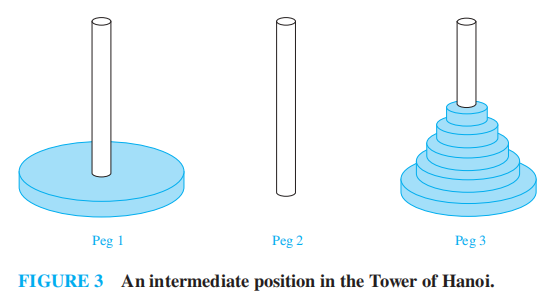
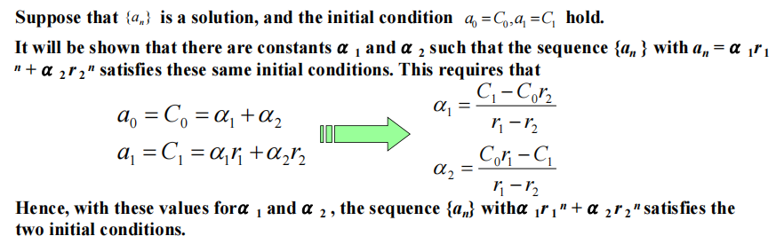
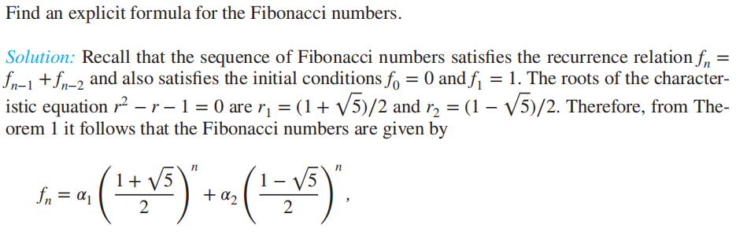
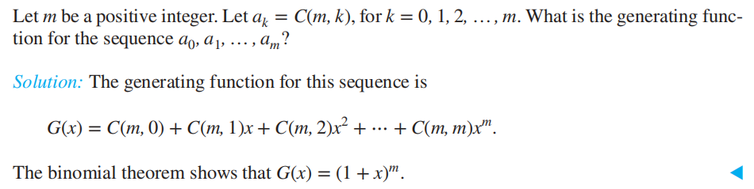
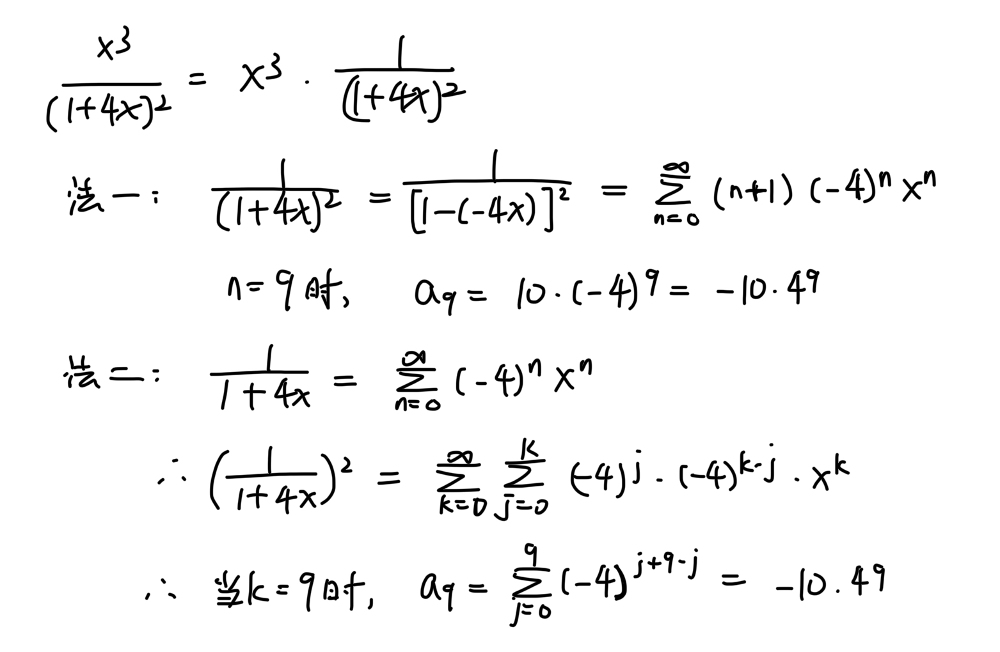
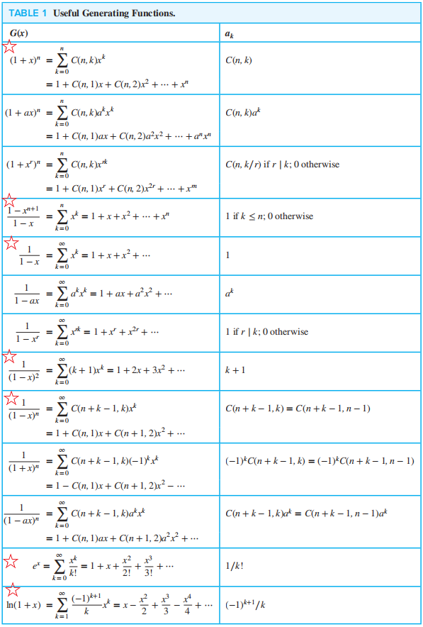
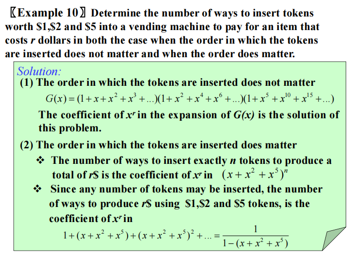
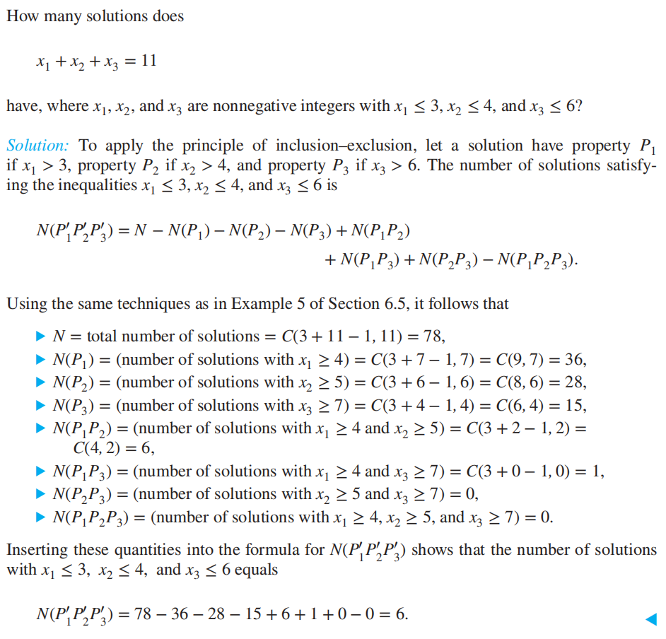

# Chap 8 Advanced Counting Techniques

??? abstract "核心知识"

	+ **求解线性齐次/非齐次递推关系**
	+ **生成函数**：计数、求解递推关系...
	+ **容斥原理**（的推广）
		+ 计算满射函数的个数
		+ 错排

## Applications of Recurrence Relations

### Modelling with Recurrence Relations

回顾：

+ **[递归定义](5.md#recursively-defined-functions)**
+ **[递推关系](2.md#recurrence-relations)**
+ 递推关系的**解(solution)**：满足递推关系的某个序列

???+ example "例子"

	=== "斐波那契数与兔子繁殖问题"

		

		
		

		看到"Total pairs"那列数的特征，不难发现这是一个斐波那契数，因此递推关系为：

		$$
		f_n = \begin{cases}f_{n - 1}+f_{n-2} & \text{if } n 
		\ge 3 \\ 1 & \text{if } n = 1 \text{ or } n = 2\end{cases}
		$$

		其中，$f_{n - 1}$表示上个月已有的兔子，$f_{n - 2}$表示具有生育能力(2个月及以上)的兔子繁殖的后代，它们的总和即为这个月的兔子总数

	=== "汉诺塔问题(the tower of Hanoi puzzle)"

		

		
		

		

		
		

		解：完成这一目标分为三步

		+ 将上面的$n - 1$个盘子移到第三个销钉上($H_{n - 1}$步)
		+ 将最大的盘子移到第二个销钉上(1步)
		+ 最后将那$n - 1$个盘子移到第二个销钉上($H_{n - 1}$步)

		因此，我们得到递推关系：$H_n = 2H_{n - 1} + 1$

		

		
		

		初始条件：$H_1 = 1$

		最后，我们可以得到$H_n = 2^n - 1$

		>注：汉诺塔问题有多种变种问题，其中较为知名的是**Reve's puzzle**：本质上是有四个销钉的汉诺塔问题(还是原来的那套规则)。虽然没有人能够得到求解具有$p$个销钉的泛化汉诺塔问题的最小移动步数的通法，但是有人已经证明有4个销钉的汉诺塔问题的算法。

		??? example "某个变种(来自课后习题)"

			=== "题目"

				

				
				

			=== "答案"

				

				
				

				

				
				

	=== "关于位串"

		

		
		

		解：分为2种情况：

		+ 以1结尾的n位位串：只要在长度为$n-1$的位串末尾添加1即可，因此有$a_{n - 1}$个位串
		+ 以0结尾的n位位串：易知倒数第二位一定是1(否则违反了"不存在2个连续的0"的条件)，那么问题可以转化为在长度为$n-2$的位串末尾添加“10”，因此有$a_{n - 2}$个位串

		综上，我们可以得到递推关系：$a_n = a_{n - 1} + a_{n - 2}, n \ge 3$

		易知初始条件为：$a_1 = 2, a_2 = 3$
		>注：$a_n = f_{n + 2}$（斐波那契数）

	=== "码字枚举"

		

		
		

		解：分2种情况讨论：

		+ 在$n - 1$位**合法**(偶数个0)字符串末尾添加除了0以外的数字，因此有$9a_{n - 1}$个$n$位合法字符串
		+ 在$n - 1$位**非法**(奇数个0)字符串末尾添加0(奇数变偶数，现在就合法了)，因此有$10^{n - 1} - a_{n - 1}$个$n$位合法字符串

		综上，递推关系：$a_n = 9a_{n - 1} + (10^{n - 1} - a_{n - 1}) = 8a_{n  -1} + 10^{n - 1}$

	=== "添加括号改变乘法顺序"

		

		
		

		分析：

		+ 观察到有一个乘法运算符一定在所有括号之外，因为它要执行最后的乘法运算
		+ 那么，我们假设最后的乘号在$x_k$和$x_{k+1}$之间，那么就有$C_kC_{n - k - 1}$种添加括号的方法($C_k$代表运算符前面$k$个数添加括号的方法数，$C_{n - k - 1}$代表运算符后面$n - k - 1$个数添加括号的方法数)
		+ 最后，可以得到递推关系

		$$
		\begin{align}C_n = & C_0C_{n - 1} + C_1C_{n - 2} + \dots + C_{n - 2}C_1 + C_{n - 1}C_0 \notag \\ = & \sum\limits_{k = 0}^{n - 1}C_kC_{n - k - 1} \notag \end{align}
		$$

		其中初始条件为$C_0 = 1, C_1 = 1$

		+ 最后我们可以得到$C_n = \dfrac{C(2n, n)}{n + 1}$，且$C_n \sim \frac{4^n}{n^{3/2}\sqrt \pi}$
		+ 序列$\{C_n\}$被称为**卡特兰数(Catalan numbers)**，除了上述例子外，它可以解决很多的计数问题(就我所知，它可以计算出栈的所有情况数(入栈的元素是递增的)。具体可[戳这](https://en.wikipedia.org/wiki/Catalan_number#))

### ~~Algorithms and Recurrence Relations~~

在很多对算法及其复杂度的研究中，递推关系发挥着重要作用，比如：

+ **分治算法(divide-and-conquer algorithm)**
+ **动态规划(dynamic programming)**：将问题递归拆分成更简单的、**可重叠**的子问题，然后通过子问题的解来计算整个问题的解，这个过程就需要用到**递推关系**

分支算法在8.3节会详细阐述，这里我们仅讨论动态规划，下面会通过一个典型🌰来解释其中的思想：

??? example "例题"

	[之前的例子](3.md#greedy-algorithms)中，我们用*贪心算法*求得在同一大厅里安排讲座的最优解，现在稍微改变一下条件：对于每场讲座，新增变量$w_i$，表示每场讲座到座的学生数。

	修改后的问题：有$n$场讲座，讲座$j$在$t_j$时刻开始，在$e_j$时刻结束，会有$w_j$位学生到场。现在我们要安排讲座，使得所有安排上的讲座的到场学生总人数最大。

	预先处理：

	+ 我们用$T(j)$表示到场的最大人数，它是前$j$个讲座中得到的最优安排。因此$T(n)$表示到场的最大人数，它是从所有$n$个讲座中得到的最优安排
	+ 首先，我们按照结束时间对所有讲座按升序排序，然后根据排好的顺序重新给$n$个讲座编号，使得$e_1 \le e_2 \le \dots \le e_n$
	+ 如果两场讲座能放在相同的安排中，也就是说，它们在时间上不重叠，称这两场讲座是*可兼容的(compatible)*。我们用$p(j)$表示最大的整数$i$，$i < j$且$e_i \le s_j$；如果不存在这样的整数，则$p(j) = 0$

	具体问题：

	

	
	

	

	
	

	分析：

	+ 我们首先得到递推关系，若$j \le n$，则前$j$场讲座中的最优安排有两种可能：
		+ 把讲座$j$纳入最优安排中：显然，讲座$p(j) + 1, \dots, j - 1$不会出现在最优安排中，因为它们与讲座$j$不兼容。而且，最优安排一定包含讲座$1, 2, \dots, p(j)$的某几个。因此加上讲座$j$，我们得到$T(j) = w_j + T(p(j))$
		+ 不把讲座$j$纳入最优安排中：此时来自讲座$1, 2, \dots, j$的最优安排等同于来自讲座$1, 2, \dots, j - 1$的最优安排，即$T(j) = T(j - 1)$
	+ 因此，我们得到递推关系：$T(j) = \max(w_j + T(p(j)), T(j - 1))$

	下面，我们通过伪代码实现这一算法。注意，我们通过存储每个$T(j)$的值来提高算法效率，因为这样只需要计算一次$T(j)$即可，否则的话算法的最坏复杂度就是指数级的。我们将这一过程称为**记忆(memorization)**

	

	
	

	>注：上述算法只能算出最多的到场人数，没有得到最优安排中包含哪些讲座。为了确定哪些讲座被包含在最优安排中，我们需要利用这一事实：当且仅当$w_j + T(p(j)) \ge T(j - 1)$时，讲座$j$会在前$j$个讲座的最优安排中。具体算法这里就不写了(这是道练习题)

### Supplements(from Exercises)

+ 令$S(m, n)$为从具有$m$个元素的集合映射到具有$n$个元素的集合的*满射(onto)函数*的所有可能情况数，它满足递推关系：$S(m, n) = n^m - \sum\limits_{i = 1}^{n - 1}C(n, k)S(m, k)$，其中$m \le n$，且$n > 1$，初始条件为$S(m, 1) = 1$
+ **约瑟夫问题(Josephus problem)**：有$n$个人，编号为$1 \sim n$，站成一个圈。从1号开始报数，报到x的人淘汰，然后被淘汰的人的下一个人重新从1开始报数，直到只剩下一人，用$J(n)$表示幸存者的编号([wiki](https://en.wikipedia.org/wiki/Josephus_problem))
+ 解决Reve's puzzle的算法：[Frame-Stewart algorithm](https://en.wikipedia.org/wiki/Tower_of_Hanoi#Frame%E2%80%93Stewart_algorithm)
+ **逆向差分(backward difference)**：通过一下方法递归定义：
	+ **第一差分(first difference)**：$\nabla a_n  = a_n - a_{n - 1}$
	+ **第$(k+1)$差分($(k+1)$st difference)**：$\nabla ^{k + 1}a_n = \nabla ^k a_n - \nabla ^k a_{n - 1}$
	**差分方程**：包含序列$\{a_n\}$(关于$a_n, \nabla a_n, \nabla ^2 a_n, \dots$)及其差分的方程

## Solving Linear Recurrence Relations

**$k$阶常系数线性齐次递推关系(linear homogeneous recurrence relation of degree $k$ with constant coefficient)**：用下列形式表示的递推关系
$$
a_n = c_1a_{n - 1} + c_2a_{n - 2} + \dots + c_ka_{n - k}
$$
其中$c_1, c_2, \dots, c_k$为实数，且$c_k \ne 0$

特征：

+ **线性(linear)**：等号右边是序列中前几项与常系数之积的和
+ **齐次(homogeneous)**：每项次数不超过1
+ **常数(constant)**：序列中的每一项系数都是常数，而非关于$n$的函数
+ **k阶(degree)**：$a_n$是由序列中的前*k*项表达的

通过**强归纳法**，满足这种递推关系的序列由递推关系和$k$个首条件$a_0 = C_0, a_1 = C_1, \dots, a_{k - 1} = C_{k - 1}$表示

### Solving Linear Homogeneous Recurrence Relations with Constant Coefficients

!!! question "如何求解"

	=== "关键1"

		+ 这种递推关系有形如$a_n = r^n$的解，$r$为常数。如果这个是递推关系的解，则它的充要条件是$r^n = c_1r^{n - 1} + c_2r^{n - 2} + \dots + c_kr^{n - k}$
		+ 然后两边同除以$r^{n - k}$($r \ne 0$)，将等号右边的东西全部移到左边，得到
		$$
		r^k - c_1r^{k - 1} - c_2r^{k - 2} - \dots - c_{k - 1}
		r - c_k = 0
		$$
		因此，当且仅当$r$是上述方程的解时，$a_n = r^n$为递推关系的解。我们称上述方程为**特征方程(characteristic equation)**，称这个方程的解为**特征根(characteristic roots)**

	=== "关键2"

		线性齐次递推关系的两个解的**线性组合**也是它的解。如果

		$$
		\begin{align}s_n & = c_1s_{n - 1} + c_2s_{n - 2} + \dots + c_ks_{n - k} \notag \\ 
		t_n & =  c_1t_{n - 1} + c_2t_{n - 2} + \dots + c_kt_{n - k}\notag \end{align}
		$$

		那么

		$$
		\begin{align}
		b_1s_n + b_2t_n = & b_1(c_1s_{n - 1} + c_2s_{n - 2} + \dots + c_ks_{n - k}) + b_2(c_1t_{n - 1} + c_2t_{n - 2} + \dots + c_kt_{n - k}) \notag \\
		= & c_1(b_1s_{n - 1} + b_2t_{n - 1}) + c_2(b_1s_{n - 2} + b_2t_{n - 2}) + \dots + c_k(b_1s_{n - k} + b_2t_{n - k}) \notag 
		\end{align}
		$$

		其中$b_1, b_2$为实数。那么$b_1s_n + b_2t_n$显然也为相同的线性齐次递推关系的解

先从 ~~简单的~~ 二阶情况分析：

**定理1**：令$c_1, c_2$为实数。假设$r^2 - c_1r - c_2 = 0$有两个不同的解$r_1, r_2$，那么当且仅当$a_n = \alpha_1r_1^n + \alpha_2r_2^n$($n = 0,1,2, \dots$，且$\alpha_1, \alpha_2$为常数)时，序列$\{a_n\}$是递推关系$a_n = c_1a_{n - 1} + c_2a_{n - 2}$的解

??? note "证明"

	+ 如果$r_1, r_2$为特征方程的根，且$\alpha_1, \alpha_2$为常数，那么序列$\{a_n\}$是递推关系$a_n = c_1a_{n - 1} + c_2a_{n - 2}$的解

	

	
	

	+ 如果序列$\{a_n\}$是解，那么对于某些常数$\alpha_1, \alpha_2$，$a_n = \alpha_1r_1^n + \alpha_2r_2^n$
		
	

	
	

	通过上述证明，我们已经知道$\{a_n\}$和$\{\alpha_1r_1^n + \alpha_2r_2^n\}$都是递推关系的解，且当$n = 0$和$n = 1$时满足首条件，因为对于有2个首条件的2阶线性齐次递推关系有唯一解，因此$a_n = \alpha_1r_1^n + \alpha_2r_2^n$

>注：我们有可能会得到复数根，但这不在我们的讨论范围内

🌰：斐波那契数公式

---
>定理2用来处理**重根**的情况

**定理2**：令$c_1, c_2$为实数，且$c_2 \ne 0$。假设$r^2 - c_1r - c_2 = 0$只有一个根$r_0$，那么当且仅当$a_n = \alpha_1r_0^n + \alpha_2nr_0^n$($n = 0,1,2, \dots$，且$\alpha_1, \alpha_2$为常数)时，序列$\{a_n\}$是递推关系$a_n = c_1a_{n - 1} + c_2a_{n - 2}$的解

🌰

---
讨论更一般的情况：

**定理3**：令$c_1, c_2, \dots, c_k$为实数。假设特征方程

$$r^k - c_1r^{k - 1} - c_2r^{k - 2} - \dots - c_{k - 1}r - c_k = 0$$

有$k$个不同的根$r_1, r_2, \dots, r_k$，那么当且仅当

$$
a_n = \alpha_1r_1^n + \alpha_2r_2^n + \dots + \alpha_kr_k^n
$$

其中$n = 0,1,2, \dots$，且$\alpha_1, \alpha_2, \dots, \alpha_k$为常数，序列$\{a_n\}$是递推关系

$$a_n = c_1a_{n - 1} + c_2a_{n - 2} + \dots + c_ka_{n - k}$$

的解

---
**定理4**：令$c_1, c_2, \dots, c_k$为实数。假设特征方程

$$r^k - c_1r^{k - 1} - c_2r^{k - 2} - \dots - c_{k - 1}r - c_k = 0$$

有$t$个不同的根$r_1, r_2, \dots, r_t$，重数分别为$m_1, m_2, \dots, m_t$，满足$m_i \ge 1$($i = 1, 2, \dots, t$)，且$m_1 + m_2 + \dots + m_t = k$，那么当且仅当

$$
\begin{align}a_n = & (\alpha_{1, 0} + \alpha_{1, 1}n + \dots + \alpha_{1, m_1 - 1}n^{m_1 - 1})r_1^n \notag \\ & + (\alpha_{2, 0} + \alpha_{2, 1}n + \dots + \alpha_{2, m_2 - 1}n^{m_2 - 1})r_2^n \notag \\ & + \dots + (\alpha_{t, 0} + \alpha_{t, 1}n + \dots + \alpha_{t, m_t - 1}n^{m_t - 1})r_t^n \notag \end{align}
$$

其中$n = 0,1,2, \dots$，且$\alpha_{i, j}$($1 \le i \le t, 0 \le j \le m_i - 1$)为常数，序列$\{a_n\}$是递推关系

$$a_n = c_1a_{n - 1} + c_2a_{n - 2} + \dots + c_ka_{n - k}$$

的解

### Linear Nonhomogeneous Recurrence Relations with Constant Coefficients

**常系数线性非齐次递推关系(linear nonhomogeneous recurrence relation with constant coefficient)**：用下列形式表示的递推关系
$$
a_n = c_1a_{n - 1} + c_2a_{n - 2} + \dots + c_ka_{n - k} + F(n)
$$
其中$c_1, c_2, \dots, c_k$为实数，$F(n)$是不等于0，且仅由$n$决定的函数

递推关系
$$
a_n = c_1a_{n - 1} + c_2a_{n - 2} + \dots + c_ka_{n - k}
$$
被称为**关联齐次递推关系(associated homogeneous recurrence relation)**

---
如何求解？

**定理5**：如果$\{a_n^{(p)}\}$是常系数线性非齐次递推关系的**特殊解(particular solution)**，那么所有的解具有$\{a_n^{(p)} + a_n^{(h)}\}$的形式，其中$\{a_n^{(h)}\}$是关联齐次递推关系的解

??? note "证明"

	

	
	

虽然没有通法来找到关于任意函数$F(n)$的解，但是对于某些类型的函数，比如多项式或者常数幂，是有办法可以解决的，定理6给出了方法：

**定理6**：假设$\{a_n\}$满足线性非齐次递推关系
$$
a_n = c_1a_{n - 1} + c_2a_{n - 2} + \dots + c_ka_{n - k} + F(n)
$$

其中$c_1, c_2, \dots, c_k$为实数，且

$$F(n) = (b_tn^t + b_{t - 1}n^{t - 1} + \dots + b_1n + b_0)s^n$$

其中$b_0, b_1, \dots , b_t$和$s$为实数。

+ 如果$s$不是关联齐次递推关系的特征方程的根，那么就有以下形式的特殊解：

$$
(p_tn^t + p_{t-1}n^{t-1} + \dots + p_1n + p_0)s^n
$$

+  如果$s$是特征方程的根，且重数为$m$，那么就有以下形式的特殊解：

$$
n^m(p_tn^t + p_{t-1}n^{t-1} + \dots + p_1n + p_0)s^n
$$

???+ example "例题"

	=== "例1"

		

		
		

		

		
		

	=== "例2"

		

		
		

### Supplements(from Exercises)

+ 斐波那契数$f_{n+1} = C(n, 0) + C(n - 1. 1)+ \dots + C(n - k, k)$，其中$n$为正整数，且$k = \lfloor \dfrac{n}{2} \rfloor$

## ~~Divide-and-Conquer Algorithms and Recurrence Relations~~

## Generating Functions

定义：实数序列$a_0, a_1, \dots, a_k, \dots$的**生成函数(generating functions)**是一个无限级数：
$$
G(x) = a_0 + a_1x + \dots + a_kx^k + \dots = \sum\limits_{k = 0}^\infty a_kx^k
$$
>注：这种形式的生成函数有时称作*普通生成函数(ordinary generating function)*，用于区分其他形式的生成函数

定义**有限**实数序列$a_0, a_1, \dots, a_n$的生成函数：令$a_{n+1} = 0, a_{n+2} = 0$，以此类推，这样将无限序列缩小至有限序列。因此这种无限序列$\{a_n\}$的生成函数$G(x)$就变成一个$n$**阶多项式**($a_jx^j = 0, j > n$)
$$
G(x) = a_0 + a_1x + \dots + a_nx^n
$$
🌰

### Useful Facts About Power Series

**定理1**：令$f(x)=\sum\limits_{k=0}^{\infty}a_kx^k,\ g(x)=\sum\limits_{k=0}^{\infty}b_kx^k$，那么

$$
f(x) + g(x) = \sum\limits_{k=0}^{\infty}(a_k+b_k)x^k \quad f(x)g(x) = \sum\limits_{k=0}^\infty (\sum\limits_{j=0}^ka_jb_{k-j})x^k
$$

>注：定理1仅在幂级数在区间内*收敛(converge)*时有效(本节中所有级数均认为是收敛的)。然而生成函数的理论并不局限于这种级数，在那样的情况下级数就不一定收敛了。定理1可以作为生成函数的加法和乘法的定义

???+ example "例题"

	=== "例1"

		

		
		

		+ 利用幂级数乘法的特征
		+ 答案可作为结论使用

	=== "例2"

		(摘自期中卷)

		

		
		

		

		
		

定义：令$u$为**实数**，$k$为非负整数。那么**扩展二项式系数(extended binomial coefficient)**$\left( \begin{array}{cccc}u \\ k\end{array}\right)$可定义为：

$$
\left( \begin{array}{cccc}u \\ k\end{array}\right) = \begin{cases}\dfrac{u(u-1)\dots(u-k+1)}{k!} & \text{if }k > 0 \\ 1 & \text{if } k = 0\end{cases} 
$$

>注：如果二项式系数的首参数是*负整数*，那么扩展二项式系数可用一般二项式系数表示：$\left( \begin{array}{cccc} -n \\ r\end{array}\right) = (-1)^r\left( \begin{array}{cccc} n + r - 1 \\ r\end{array}\right) = (-1)^rC(n+r-1, r)$ 

**定理2——扩展二项式定理(THE EXTENDED BINOMIAL THEOREM)**：令$x$为实数且$|x| < 1$，$u$为实数，那么

$$
(1+x)^u = \sum\limits_{k = 0}^\infty \left( \begin{array}{cccc} u \\ k\end{array}\right)x^k
$$

>注：
>
>+ 定理2需要用麦克劳林级数证明
>+ 当$u$为正整数，该定理就降级为一般的二项式定理（注意：当$k > u$时，$\left( \begin{array}{cccc} u \\ k\end{array}\right) = 0$)

🌟常用的生成函数表([vgf](../../math/calculus/11.md)也用得到)

>注：上面十三个生成函数中，重点记忆标⭐的核心公式，其他公式都是在这些核心公式的基础上推出来的

### Counting Problems and Generating Functions

生成函数可用来解决$n$元素集合中的可重$r$组合问题，比如这种形式：
$$
e_1 + e_2 + \dots + e_n = C
$$
其中$C$是常数，$e_i$为非负整数且可能有一些具体限制。

:chestnut:

!!! note "利用生成函数计算$n$元素集合中的可重$r$组合的个数"

	易知生成函数$G(x) = (1 + x + x^2 + \dots)^n = \dfrac{1}{(1-x)^n} = (1-x)^{-n}(|x| < 1)$

	又因为$(1-x)^{-n} = (1 + (-x))^{-n} = \sum\limits_{r = 0}^\infty \left( \begin{array}{cccc} -n \\ r\end{array}\right)(-x)^r$(扩展二项式定理)

	而$\left( \begin{array}{cccc} -n \\ r\end{array}\right)(-1)^r = (-1)^rC(n+r-1, r) \cdot (-1)^r = C(n+r-1, r)$(见扩展二项式系数下面的注)

	所以结果为$C(n + r - 1, r)$，与第6章的结论相同

:chestnut:：拓展(答案可作为结论记忆)

???+ example "例题"

	=== "例1"

		

		
		

	=== "例2"

		

		
		

		>注：要理解为什么是否考虑**顺序**会产生不同的生成函数

### Using Generating Functions to Solve Recurrence Relations

直接看这个🌰，就能理解怎么用生成函数求解递推关系的问题

>注意等号两边乘$x^n$后再求和时的**起始项**问题(Solution的第3行)：若递推关系中的最小项为$a_{n - k}$，则起始项从$n = k$开始，且一定要一致

### Proving Identities via Generating Functions

???+ example "例题"

	=== "例1"

		

		
		

		

		
		

	=== "例2"

		

		
		

### Supplements(from Exercises)

+ **指数生成函数(exponential generating functions)**：$\sum\limits_{n=0}^{\infty}\dfrac{a_n}{n!}x^n$
+ **概率生成函数(probability generating functions)**：$G_X(x) = \sum\limits_{k = 0}^\infty p(X(s) = k)x^k$

## Inclusion-Exclusion

### The Principle of Inclusion-Exclusion

在之前，我们已经了解计算两个集合$A , B$的并集的元素个数公式：
$$
|A \cup B| = |A| + |B| - |A \cap B|
$$
这个公式称为**容斥原理(the principle of inclusion-exclusion)**。现在，我们将它扩展至三个集合的公式：
$$
|A \cup B \cup C| = |A| + |B| + |C| - |A \cap B| - |A \cap C| - |B \cap C| + |A \cap B \cap C|
$$
推导过程可以用Venn图清楚地展现：

最后，我们将容斥原理运用于$n$个集合，于是有了下面的定理：

**定理1——容斥原理(THE PRINCIPLE OF INCLUSIVE-EXCLUSIVE)**：令$A_1, A_2, \dots, A_n$为有限集合，那么：

$$
\begin{align}
|A_1 \cup A_2 \cup \dots \cup A_n| = & \sum\limits_{1 \le i \le n} |A_i| - \sum\limits_{1 \le i < j \le n} |A_i \cap A_j| \notag \\
+ & \sum\limits_{1 \le i < j < k \le n} |A_i \cap A_j \cap A_k| - \dots + (-1)^{n+1}|A_1 \cap A_2 \cap \dots \cap A_n| \notag
\end{align}
$$

??? note "证明"

	+ 我们要证明并集中的每个元素仅被算了一遍。假设$a$是$A_1, A_2, \dots, A_n$中$r$个集合的共有元素($1 \le r \le n$)
	+ 在$\sum|A_i|$中，这个元素被算了$C(r, 1)$次。在$\sum|A_i \cap A_j|$中，这个元素被算了$C(r, 2)$次。更一般的，在$m$个集合的并集之和中，这个元素被算了$C(r, m)$次
	+ 通过等号右侧公式，我们可以计算这个元素总共被算了$C(r, 1) - C(r, 2) + C(r, 3) - \dots + (-1)^{r+1}C(r, r)$次
	+ 由6.4节引理2知，$\sum\limits_{k = 0}^n(-1)^k\left( \begin{array}{cccc}n \\ k\end{array}\right) = 0$ ，所以$\sum\limits_{k = 1}^n(-1)^{k+1}C(r, k) = 1$ ，这就说明该元素仅被算了一遍，这就证明了上述定理的正确性

>注：对于$n$个集合的容斥原理，等号右边有$2^n-1$项

## Applications of Inclusion-Exclusion

### An Alternative Form of Inclusion-Exclusion

容斥原理的另一种可替换的形式：求解集合中不满足所有$n$条性质$P_1, P_2, \dots, P_n$的元素个数

分析：
令$A_i$表示具有满足性质$P_i$的元素的子集。具有所有$P_{i_1}, P_{i_2}, \dots, P_{i_k}$的性质的元素个数记为$N(P_{i_1}, P_{i_2}, \dots, P_{i_k})$，所以
$$
|A_{i_1} \cap A_{i_2} \cap \dots \cap A_{i_k}| = N(P_{i_1}, P_{i_2}, \dots, P_{i_k})
$$
那么我们要求的就是$N(P_1' P_2' \dots P_n')$，则
$$
N(P_1' P_2' \dots P_n') = N - |A_1 \cup A_2 \cup \dots \cup A_n|
$$
由容斥原理，我们可以得到：

$$
\begin{align}
N(P_1' P_2' \dots P_n') & = N - N(P_1P_2 \dots P_n) \notag \\
& = N - \sum\limits_{1 \le i \le n} N(P_i) + \sum\limits_{1 \le i < j \le n} N(P_iP_j) \notag \\
& - \sum\limits_{1 \le i < j < k \le n} N(P_iP_jP_k) + \dots + (-1)^{n}N(P_1P_2 \dots P_n) \notag
\end{align}
$$

来看个🌰：（容斥原理 + 可重r组合）

### The Sieve of Eratosthenes

回顾：[埃氏筛](4.md#the-sieve-of-eratosthenes)

用到上面刚学的方法，我们可以求得100以内的质数个数为
$$
4 + N(P_1'P_2'P_3'P_4')
$$
其中'4'代表小于$\sqrt{10}$的4个质数2,3,5,7，$P_1$代表能被2整除的数，$P_2$代表能被3整除的数，$P_3$代表能被5整除的数，$P_4$代表能被7整除的数

后续过程：

### The Number of Onto Functions

**定理1**：令$m, n$为正整数，且$m \ge n$，那么就有
$$
n^m - C(n, 1)(n - 1)^m + C(n, 2)(n - 2)^m - \dots + (-1)^{n - 1}C(n, n - 1)\cdot 1^m
$$
个从有$m$个元素的集合映射到有$n$个元素的集合的**满射函数**

???+ note "证明"

	+ 令$A = \{a_1, a_2, \dots, a_m\}, B = \{b_1, b_2, \dots, b_n\}$，$P_i$表示$b_i$不在函数的范围内，则我们要求的就是$N(P_1'P_2' \dots P_n')$($P_1'P_2' \dots P_n'$表示$B$中所有元素都在函数范围内，即*满射*)
	+ 容易得到

	$$\begin{align}
	N = n^m, \ \sum\limits_{1 \le i \le n}N(P_i) = C(n, 1)(n - 1)^m \notag \\
	\sum\limits_{1 \le i < j \le n}N(P_iP_j) = C(n, 2)(n - 2)^m, \notag \\
	\dots, \notag \\
	(-1)^nN(P_1P_2\dots P_n) = (-1)^nN(P_1P_2 \dots P_n) = 0 \notag
	\end{align}
	$$

	于是得到上述定理

从有$m$个元素的集合映射到有$n$个元素的集合的满射函数，对应于将$m$个可区分的物体放入$n$个不可区分的箱子，且保证每个箱子非空的问题([传送门](6.md#distinguishable-objects-and-indistinguishable-boxes))。

因此，满射函数的个数 = $n!S(m, n)$，其中$S(m, n)$为*第二类斯特林数*

### Derangements

**错排问题(derangement)**：使得所有物体均不在它原来的位置上的排列，用$D_n$表示$n$个物体的错排个数

**定理2**：集合中$n$个元素的错排个数为
$$
D_n = n![1 - \dfrac{1}{1!} + \dfrac{1}{2!} - \dfrac{1}{3!} + \dots + (-1)^n\dfrac{1}{n!}]
$$

???+ note "证明"

	令$P_i$表示满足将元素$i$固定在原位的排列，那么$n$个元素的错排个数就是
	$$
	D_n = N(P_1'P_2' \dots P_n')
	$$
	使用本节开篇得到的公式，可以得到

	$$
	\begin{align}
	D_n= & N - \sum\limits_{i} N(P_i) + \sum\limits_{i < j} N(P_iP_j) \notag \\
	- & \sum\limits_{i < j < k} N(P_iP_jP_k) + \dots + (-1)^{n}N(P_1P_2 \dots P_n) \notag
	\end{align}
	$$

	+ $N = n!$，对$n$个元素的全排列
	+ $N(P_i) = (n - 1)!$，固定1个元素，对剩余$n - 1$个元素进行全排列
	+ 以此类推，$N(P_{i_1} P_{i_2} \dots P_{i_m}) = (n - m)!$，固定$m$个元素，对剩余$n - m$个元素进行全排列

	又因为从$n$个元素中选择$m$个元素固定共有$C(n, m)$中可能的情况，所以
	$$
	\sum\limits_{1 \le i_1 < i_2 < \dots i_m \le n}N(P_{i_1} P_{i_2} \dots P_{i_m}) = C(n, m)(n - m)!
	$$
	将所有情况汇总，得到

	$$
	\begin{align}
	D_n = & n! - C(n, 1)(n - 1)! + C(n , 2)(n - 2)! - \dots + (-1)^nC(n, n)(n - n)! \notag \\
	= & n! - \dfrac{n!}{1!(n - 1)!}(n - 1)! + \dfrac{n!}{2!(n - 2)!}(n - 2)! - \dots + (-1)^n\dfrac{n!}{n!0!}0! \notag \\
	= & n![1 - \dfrac{1}{1!} + \dfrac{1}{2!} - \dfrac{1}{3!} + \dots + (-1)^n\dfrac{1}{n!}] \notag
	\end{align}
	$$

错排的概率为$\dfrac{D_n}{n!} = 1 - \dfrac{1}{1!} + \dfrac{1}{2!} - \dots + (-1)^n \dfrac{1}{n!}$

因为$e^x = \sum\limits_{j = 0}^\infty \dfrac{x^j}{j!}$，所以可以推出$e^{-1} = \dfrac{D_n}{n!} \approx 0.368$

### Supplements(from Exercises)

关于错排数$D_n$的递推关系式：

+ $D_n = (n - 1)(D_{n - 1} + D_{n - 2}),\ n \ge 2$
+ $D_n = nD_{n - 1} + (-1)^n,\ n \ge 1$
