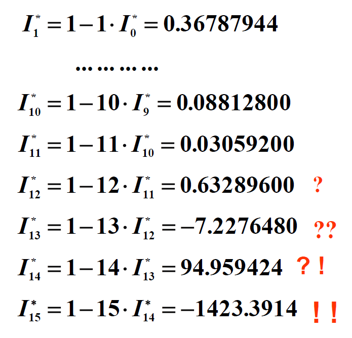
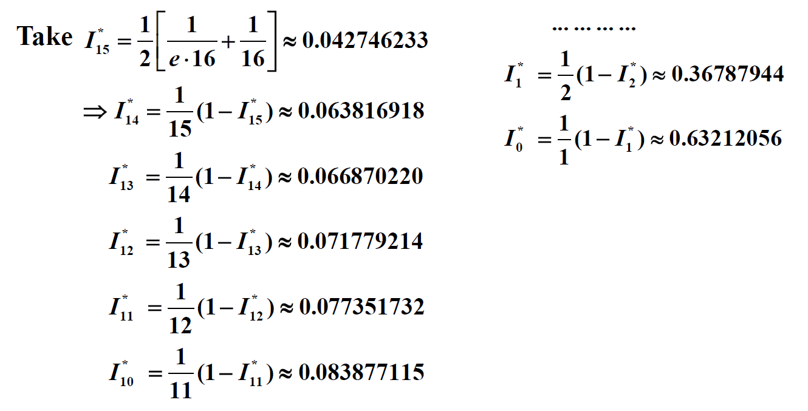

# Chap 1: Mathematical Premiminaries

???+ info "课程概览"

    ??? question "Q1：数值分析是什么？"

        

            
        

    ??? question "Q2：这门课程介绍什么？"

        - 介绍经典的近似方法
            - 在理想化的数学世界中，我们可以有无限位数的数字。但是在计算机的世界中，每个数字只有固定、有限的位数，这意味着只有部分有理数才能被精确表示，因此大多数数字都是近似表示的。但在多数情况下，这样的近似是可以被接受的。
        - 解释这些方法如何、为何、何时能期望它们正常工作
        - 为我们未来在科学计算方向的研究打下坚实基础

        建议看一下 [wiki 的定义](https://en.wikipedia.org/wiki/Numerical_analysis)，讲得更清楚！

## Roundoff Errors and Computer Arithmetic

??? question "讨论1：近似表示 $\int_0^1 e^{-x^2} dx$"

    使用泰勒展开式表示 $e^{-x^2}$，因此：

    $$
    \begin{align}
    \int_0^1 e^{-x^2} dx & = \int_0^1 (1 - x^2 + \dfrac{x^4}{2!} - \dfrac{x^6}{3!} + \dfrac{x^8}{4!} - \dots) dx \notag \\
    & = \underbrace{1 - \dfrac{1}{3} + \dfrac{1}{2!} \times \dfrac{1}{5} - \dfrac{1}{3!} \times \dfrac{1}{7}}_{S_4} + \underbrace{\dfrac{1}{4!} \times \dfrac{1}{9} - \dots}_{R_4} \notag
    \end{align}
    $$

    令 $\int_0^1 e^{-x^2} dx = S_4 = 1 - \dfrac{1}{3} + \dfrac{1}{10} - \dfrac{1}{42} \approx 1 - 0.333 + 0.1 - 0.024 = 0.743$

    因为余数 $|R_4| = |\dfrac{1}{4!} \times \dfrac{1}{9} - \dfrac{1}{5!} \times \dfrac{1}{11} + \dots| < \dfrac{1}{4!} \times \dfrac{1}{9} < 0.005$，所以上述结果保留到千分位。

    综上：

    - 舍入误差 < 0.0005 * 2 = 0.001
    - 截断误差 < 0.005
    - |总误差| < 0.006

    接下来马上介绍误差的概念~

在数学上，误差(error)可以分为：

- **截断误差**(truncation error)：从用于近似表示无限级数的，截断或有限的求和中得到的误差
- **舍入误差**(roundoff error)：执行实数计算时得到的误差。由于机器只能表示有限位的数字，因此进行算术运算时会产生这种误差

用规范化(normalized)的十进制浮点数形式表示实数（$k$位十进制机器数）：

$$
\pm 0.d_1 d_2 \dots d_k \times 10^n \quad \text{where } 1 \le d_1 \le 9 \text{ and } 0 \le d_i \le 9 (i = 2, \dots, k)
$$

具体来说，假如给定一个实数 $y = \textcolor{cornflowerblue}{0.d_1 d_2 \dots d_k} d_{k+1} d_{k+2} \dots \times \textcolor{cornflowerblue}{10^n}$，那么它对应的浮点数形式为：

$$
fl(y) = \begin{cases}0.d_1 d_2 \dots d_k \times 10^n & \text{Chopping} \\ chop(y + 5 \times 10^{n - (k+1)}) = 0.\delta_1 \delta_2 \dots \delta_k \times 10^n & \text{Rounding}\end{cases}
$$

此外，误差又可以分为（假设 $p^*$ 是 $p$ 的近似形式）：

- **绝对误差**(absolute error)：$|p - p^*|$
- **相对误差**(relative error)：$\dfrac{|p - p^*|}{|p|}, p \ne 0$

如果 $t$ 是满足下面关系的最大非负整数，那么称 $p^*$ 是 $p$ 保留至 $t$ 位**有效数字**(significant digits)的近似形式。

$$
\dfrac{|p - p^*|}{p} < 5 \times 10^{-t}
$$

>所以有效数字的定义是从**相对误差**出发的。

回到前面对截断和舍入的讨论，比较一下它们的相对误差：

- **截断**(chopping)

    $$
    \begin{align}
    \Big|\dfrac{p - p^*}{p}\Big| & = \Big| \dfrac{0.d_1 d_2 \dots d_k d_{k+1} \dots \times 10^n - 0.d_1 d_2 \dots d_k \times 10^n}{0.d_1 d_2 \dots d_k d_{k+1} \dots \times 10^n} \Big| \notag \\
    & = \Big|\dfrac{0.d_{k+1} d_{k+2} \dots}{0.d_1 d_2 \dots}\Big| \times 10^{-k} \le \dfrac{1}{0.1} \times 10^{-k} = 10^{-k+1} \notag
    \end{align}
    $$

- **舍入**(rounding)

    $$
    \Big|\dfrac{p - p^*}{p}\Big| \le \dfrac{0.5}{0.1} \times 10^{-k} = 0.5 \times 10^{-k+1}
    $$

舍入误差对计算结果的影响：

- 两个近乎相等的数字相减，会导致有效位数的抵消

    ??? example "例子"

        $a_1 = 0.1234\textcolor{red}{5}, a_2 = 0.1234\textcolor{red}{6}$ 都有 5 位有效数字，但是 $a_2 - a_1 = 0.0000\textcolor{red}{1}$ 只有 1 位有效数字。

- 用一个很小的数去除（或用很大的数去乘）另一个数，会导致误差的扩大

    ??? example "例子"

        假如有一个值 $a = \dfrac{p}{q}$，它的近似结果为 $a^* = \dfrac{p + \varepsilon_p}{q + \varepsilon_q}$。那么：

        - 绝对误差$e_{\text{abs}} = |a^* - a|$
        - 相对误差$e_{\text{rel}} = \dfrac{e_{\text{abs}}}{a}$

        我们可以把绝对误差看作是 $q$ 关于 $\dfrac{p}{q}$ 的函数，对它求导，我们就能观察绝对误差的变化率。所以：

        $$
        \begin{align}
        e_{\text{abs}}'(q) & = \dfrac{d\frac{p}{q}}{dq} \notag \\
        & = -\dfrac{p}{q^2} \notag
        \end{align}
        $$

        因此，如果 $q$ 是一个很小的数，那么对其稍加改动，绝对误差就会产生很大的变化。

启示：在让计算机计算数学公式前，要先对公式化简，以降低对精度的影响。

??? question "讨论2"

    === "问题"

        计算 $f(x) = x^3 - 6.1x^2 + 3.2x + 1.5$ 在 $x = 4.71$ 时的值，保留 3 位有效数字。

    === "分析"

        比较精确计算，以及分别使用截断和舍入两种方法近似的结果：

        

            
        

        最终结果：

        - Exact = -14.263899
        - Chopping = -13.5
        - Rounding = -13.4

        相对误差：

        - Chopping = 5%
        - Rounding = 6%

        因此两种近似方法得到结果误差都偏大，而且舍入近似法效果更差。
        
        ---
        下面介绍一种可以使近似结果更为精确的方法——[**秦九韶算法**](https://en.wikipedia.org/wiki/Horner%27s_method)(又称 Horner's Method)，它可以将多项式转化为：

        $$
        \begin{align}
        & a_0 + a_1 x + a_2 x^2 + a_3 x^3 + \dots + a_n x^n \notag \\
        = & a_0 + x(a_1 + x(a_2 + x(a_3 + \dots + x(a_{n-1} + xa_n) \dots ))) \notag
        \end{align}
        $$
        
        利用这一公式，我们可以将原函数转换为：

        $$
        f(x) = x^3 - 6.1x^2 + 3.2x + 1.5 = ((x - 6.1)x + 3.2)x + 1.5
        $$

        最终结果：

        - Chopping = -14.2
        - Rounding = -14.3

        相对误差：

        - Chopping = 0.45%
        - Rounding = 0.25%

## Algorithms and Convergence

!!! definition "定义"

    若算法满足：对初始数据的微小改动对最终结果的影响不大，那么称这样的算法是**稳定的**(stable)，否则就是**不稳定的**(unstable)。如果算法仅对某些特定的初始数据改动是稳定的，那么称这种算法是**条件稳定的**(conditionally stable)。

!!! definition "定义"

    令 $E_0 > 0$ 表示初始误差，$E_n$ 表示 $n$ 次运算后的误差。
    
    - 如果$E_n \approx C n E_0$，其中 $C$ 是与 $n$ 独立的常量，那么称误差是**线性**(linear)增长的
    - 如果 $E_n \approx C^n E_0$，其中 $C > 1$，那么称误差是**指数**(exponential)增长的

!!! note "注"

    - 误差的**线性**增长通常是不可避免的，且当 $C$ 和 $E_0$ 都很小的时候，一般而言结果是**可被接受的**
    - 误差的**指数**增长应当避免，因为即使对于很小的 $n$，$C^n$ 的值也可能变得很大。无论 $E_0$ 的大小如何，这样的误差都会导致**不可接受的**不精确结果。

???+ example "例子"

    === "题目"

        计算 $I_n = \dfrac{1}{e} \int_0^1 x^n e^x dx, n = 0, 1, 2, \dots$

    === "分析"

        === "法1"

            - 通过分部积分法，可以得到：$I_n = 1 - nI_{n-1}$
            - $I_0 = \dfrac{1}{e} \int_0^1 e^x dx = 1 - \dfrac{1}{e} \approx 0.63212056 = I_0^*$，对应的绝对误差 $|E_0| = |I_0 - I_0^*| < 0.5 \times 10^{-8}$
            - 此外，可以得到不等式：$\dfrac{1}{e} \int_0^1 x^n e^0 dx < I_n < \dfrac{1}{e} \int_0^1 x^n e^1 dx$，因此 $I_n \in \Big(\dfrac{1}{e(n+1)}, \dfrac{1}{n+1}\Big)$
            - 然而，借助第 1 步的等式和第 2 步的近似结果，我们继续计算后面的结果，发现：

                

                    
                

                误差越来越大，才算了十几项计算的结果就变得很离谱，明显超出第 3 步得到的不等式范围

            ??? question "讨论3：出现上述情况的原因？"

                绝对误差 $|E_n| = |I_n - I_n^*| = |(1 - nI_{n-1}) - (1 - nI_{n-1}^*)| = n|E_{n-1}| = \dots = n!|E_0|$，所以误差是以阶乘速度增长的，比指数级别的增长还要快得多！

        === "法2"

            - 在法1基础上，将等式 $I_n = 1 - nI_{n-1}$ 转换为等价形式 $I_{n-1} = \dfrac{1}{n} (1 - I_n)$
            - 同样根据法1得到的不等式，我们取中间值作为 $I_n$ 的近似值，即令 $I_n^* = \dfrac{1}{2} \Big[\dfrac{1}{e(N+1)} + \dfrac{1}{N+1}\Big] \approx I_n$
            - 此时的绝对误差为：$|E_n| = |I_n - I_n^*| \rightarrow 0, n \rightarrow +\infty$
            - 现在得到的计算结果如下所示：

                

                    
                

                可以看到，计算结果的误差变得很小了，到达可以被接受的程度

            - 这种转换之所以可行，是因为 $|E_{n-1}| = \Big| \dfrac{1}{n} (1 - I_n) - \dfrac{1}{n} (1 - I_n^*) \Big| = \dfrac{1}{n}|E_n|$，从而 $|E_n| = \dfrac{1}{N(N-1)\dots(n+1)} |E_N|$，也就是说即使当$n$变得很大，误差还是很小，是稳定的误差

>对应的[作业练习](hw.md#chap-1-mathematical-premiminaries)📝