# Chap 2: Solutions of Equations in One Variable

??? abstract "核心知识"

    - 一些求一元方程根的近似方法：
        - 二分法
        - 不动点迭代
        - 牛顿法
    - 误差分析
    - 一些加速收敛的方法：
        - Aitken's $\Delta^2$ 法
        - Steffensen 法


!!! info "注"

    本章要探讨的问题是：**求 $f(x) = 0$（一元方程）的根(root)**。


## The Bisection Method

第一种求根方法是**二分法**(bisection method)。它的思路非常简单，以微积分课程中介绍过的**介值定理**(intermediate value theorem)为理论依据，通过二分不断逼近真正的根。

???+ theorem "介值定理"

    如果 $f \in C[a, b]$（$C$ 表示连续函数）且 $K$ 是介于 $f(a)$ 和 $f(b)$ 之间的任意值，那么存在一个数 $p \in (a, b)$，使得 $f(p) = K$

    <div style="text-align: center">
        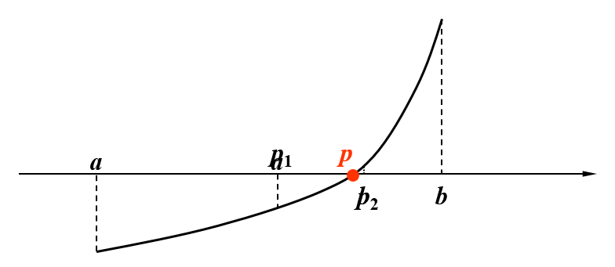
    </div>

接下来基于上图来演示二分法的过程：

???+ play "过程演示"

    === "Step 1"

        <div style="text-align: center">
            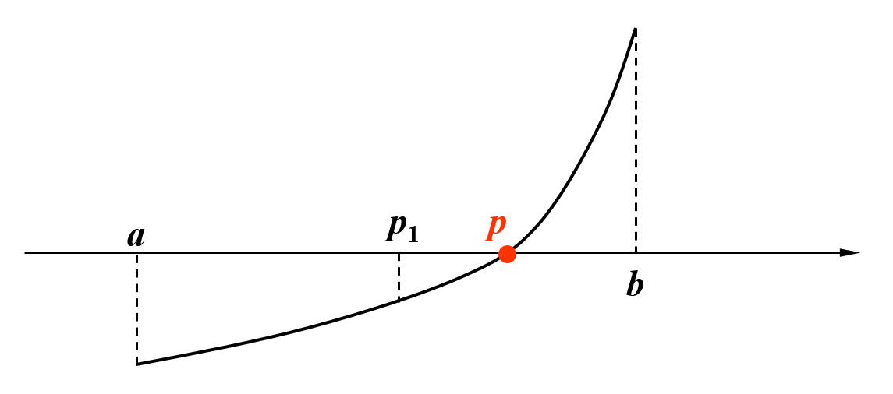
        </div>

        在 $a, b$ 之间取中点 $p_1$。观察图像，并根据介值定理，$f(p_1), f(b)$ 之间存在取值为0的情况，那么真正的根 $p$ 一定落在 $p_1$ 和 $b$ 之间，所以接下来令 $p_1$ 为下界 $a$，继续二分。

    === "Step 2"

        <div style="text-align: center">
            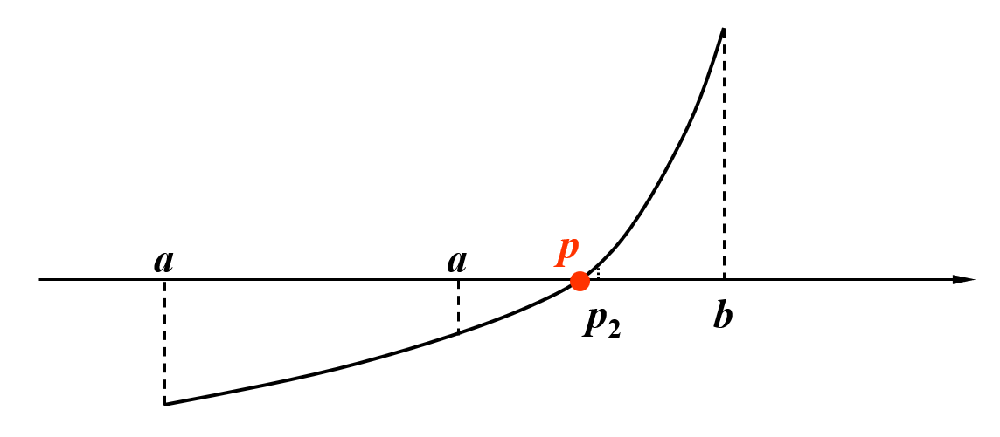
        </div>

        在 $a$（原来为 $p_1$）, $b$ 之间取中点 $p_2$。观察图像，并根据介值定理，$f(a), f(p_2)$ 之间存在取值为0的情况，那么真正的根 $p$ 一定落在 $a$ 和 $p_2$ 之间，所以接下来令 $p_2$ 为上界 $b$，继续二分。

    === "Step X"

        后续过程同上所述。
        
        ??? question "讨论：那么，这一迭代过程何时结束呢？"

            以下几种条件都可作为停止迭代的根据：

            - 绝对误差：$|p_N - p_{N-1}| < \varepsilon$
            - 相对误差：$\dfrac{|p_N - p_{N-1}|}{|p_N|} < \varepsilon$
            - 函数值：$|f(p_N)| < \varepsilon$

            然而，使用误差作为依据的时候需要当心：因为在实践中，存在序列 $\{p_N\}$ 发散的情况，这个时候不应该将误差作为判断依据。

            <div style="text-align: center">
                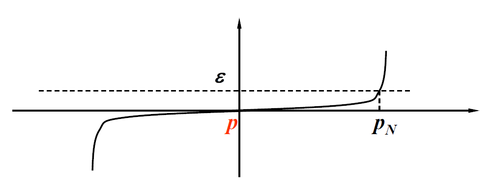
            </div>   

!!! theorem "定理"

    假设 $f \in C[a, b]$ 且满足 $f(a) \cdot f(b) < 0$，那么二分法将产生一个序列 $\{p_n\} (n = 1, 2, \dots)$，用于逼近 $f$ 的一个零点 $p$，并满足：

    $$
    |p_n - p| \le \dfrac{b - a}{2^n} \quad \text{when } n \ge 1
    $$

    ??? proof "证明"

        当 $n \ge 1$ 时，有

        $$
        b_n - a_n = \dfrac{1}{2^{n-1}}(b - a) \quad \text{and} \quad p \in (a_n, b_n)
        $$

        成立。因为 $n \ge 1$ 时，有 $p_n = \dfrac{1}{2}(a_n + b_n)$，所以

        $$
        |p_n - p| \le \dfrac{1}{2}(b_n - a_n) = \dfrac{b - a}{2^n}
        $$

        成立。

???+ code "二分法的实现"

    在连续函数 $f$ 的区间 $[a, b]$ 上寻找 $f(x) = 0$ 的解，其中 $f(a), f(b)$ 符号相反。

    - 输入：端点 $a, b$；容忍值(tolerance) $TOL$；最大迭代次数 $N_{max}$
    - 输出：$p$ 的近似解或失败信息

    ```cpp hl_lines="4 9"
    Step 1  Set i = 1;
                FA = f(a);
    Step 2  while (i <= N_max) do steps 3-6
            Step 3  Set p = a + (b - a) / 2;  // computer p_i
                    FP = f(p);
            Step 4  if (FP == 0) or (b - a) / 2 < TOL then Output(p);
                    STOP;  // successful
            Step 5  Set i++;
            Step 6  if sign(FA) * sign(FP) > 0 then Set a = p; FA = FP;
                    else set b = p;  // update a_i, b_i
    Step 7  Output(Method failed after N_max iterations);  // unsuccessful
            Stop.
    ```

    ??? question "思考伪代码中的高亮部分"

        === "问题"

            - 为什么取中值的代码不写成 `p = (a + b) / 2`？
            - 为什么判断上下界的代码不写成 `FA * FP > 0`？
        
        === "答案"

            主要是为了防止**溢出**(overflow)。因为无论是 `a + b` 还是 `FA * FP`，如果它们的符号一致，且数值特别大的时候，它们的和或积可能是计算机无法表示出来的东西，也就是产生了溢出的问题，此时该算法可能返回的是一个意料之外的结果，而不产生报错。所以我们需要好好关注这些细节！


!!! abstract "对二分法的评价"

    优点：

    - 简单，只要求函数 $f$ 是连续的
    - 结果总是会收敛到真正的解
    
    缺点：

    - 收敛速度过慢，并且在计算过程中，更好的介值近似可能在不经意间被抛弃掉了
    - 不适用于寻找多根和复数根的情况

!!! note "实际使用时的建议"

    - 在使用二分法之前先画一幅 $f(x)$ 的草图，先观察二分法是否可行
    - 或者用一个子程序将完整的区间划分为多个子区间 $[a_k, b_k]$，这样的话即使 $f(a) \cdot f(b)$，也可以保证 $f(a_k) \cdot f(b_k) < 0$


## Fixed-Point Iteration

接下来介绍第二种求根方法：**不动点迭代**(fixed-point iteration)。

>wiki: [Fixed point](https://en.wikipedia.org/wiki/Fixed_point_(mathematics))

首先，我们要将 $f(x)$ 的根看作 $g(x)$ 的不动点，即：

$$
f(x) = 0 \xLeftrightarrow{\text{equivalent}} x = g(x)
$$

基本思路是：从初始的近似值 $p_0$ 开始，通过 $p_n = g(p_{n-1})$（其中 $n \ge 1$），产生序列 $\{p_n\}_{n=0}^\infty$。如果该序列能收敛到 $p$，且 $g$ 是一个连续函数，那么：

$$
p = \lim\limits_{n \rightarrow \infty} p_n = \lim\limits_{n \rightarrow \infty} g(p_{n-1}) = g(\lim\limits_{n \rightarrow \infty} p_{n-1}) = g(p) 
$$

这个方法看似特别简单：只需不断的迭代，我们总能找到解。但实际上，并不是所有的 $g(x)$ 都能做到让序列收敛，具体来看下面几个例子：

???+ example "例子"

    === "题目"

        判断以下几种 $g(x)$ 中，哪个能做到收敛，为什么？

        >建议在阅读答案前，先自己动手画画看

        <div style="text-align: center">
            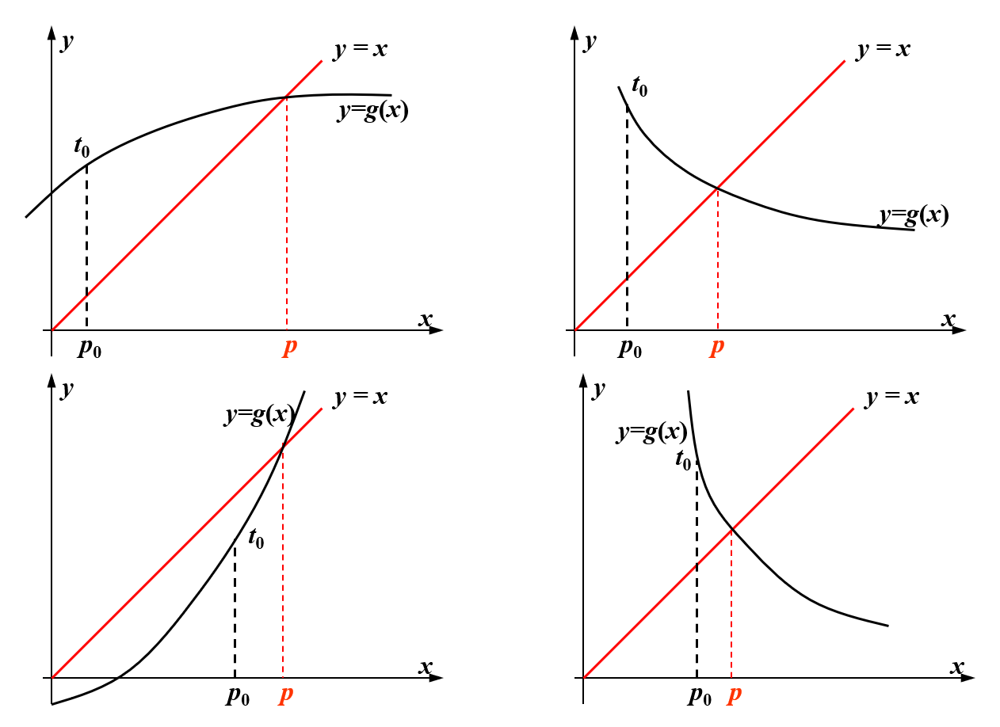
        </div>  

    === "答案"

        <div style="text-align: center">
            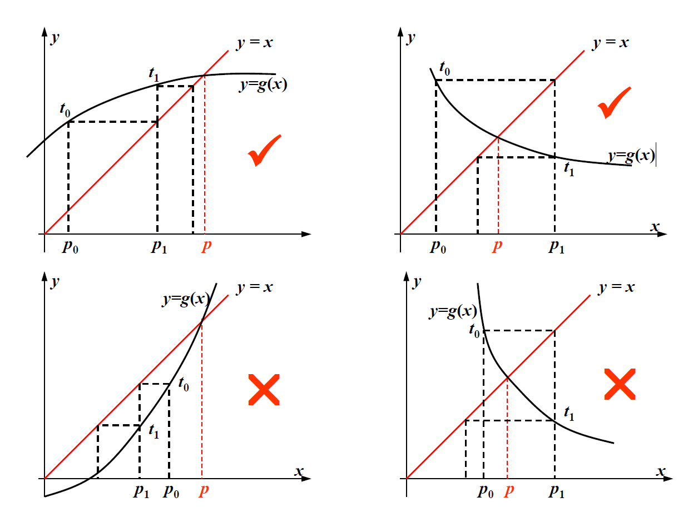
        </div>  

        >~~让我不禁回忆起浙江高考恶心人的数列大题~~

!!! theorem "不动点定理"

    令 $g \in C[a, b]$，且满足 $\forall x \in [a, b]$，有 $g(x) \in [a, b]$。并且一阶导函数 $g'$ 存在于区间 $(a, b)$，且满足 $\forall x \in (a, b)$，$\exists$ 常数 $k \in (0, 1)$ 使得 $|g'(x)| \le k$ 成立。那么 $\forall p_0 \in [a, b]$，由 $p_n = g(p_{n-1}), n \ge 1$ 定义的序列会收敛到位于区间 $[a, b]$ 上的唯一不动点。

    ??? proof "证明"

        对于上述定理，我们需要证明三个点：

        - “不动点”：令 $f(x) = g(x) - x$，因为 $a \le g(x) \le b$，所以 $f(a) = g(a) - a \ge 0$ 且 $f(b) = g(b) - b \le 0$。由**介值定理**知，$f$ 一定有一个根，因此 $g$ 有一个不动点
        - “唯一”：（用**反证法**证明）
            - 假设 $p, q$ 都是 $g$ 在区间 $[a, b]$ 上的两个不同的不动点
            - 根据**均值定理**(mean value theorem)，存在一个位于 $p, q$ 的数 $\xi$，满足 $g(p) - g(q) = g'(\xi)(p - q)$
            - 因为 $g(p) = p, g(q) = q$，所以可以得到 $(1 - g'(\xi))(p - q) = 0$，和已知条件矛盾，因此假设不成立，即“不动点是唯一的”结论成立

        - “收敛”：即证明 $\lim\limits_{n \rightarrow \infty} |p_n - p| = 0$
            - 因为 $\forall x \in [a, b]$，$g(x) \in [a, b]$，所以 $\forall n \ge 0$，$p_n$ 都是有定义的
            - 因此：

                $$
                \begin{align}
                |p_n - p| & = |g(p_{n-1}) - g(p)| = |g'(\xi)||p_{n-1} - p| \le k|p_{n-1} - p| \notag \\
                & \le k^2 |p_{n-2} - p| \le \dots \le k^n|p_0 - p| \notag
                \end{align}
                $$

            - 根据条件，$k \in (0, 1)$，所以 $k^n \rightarrow 0$，因此 $\lim\limits_{n \rightarrow \infty} |p_n - p| = 0$ 成立

!!! note "推论"

    如果 $g$ 满足不动点定理的假设，那么用 $p_n$（$\forall n \ge 1$）近似表示 $p$ 所产生的误差边界为：

    $$
    |p_n - p| \le \dfrac{1}{1 - k}|p_{n+1} - p_n| \quad \text{and} \quad |p_n - p| \le \dfrac{k^n}{1 - k} |p_1 - p_0|
    $$

    ??? proof "证明"

        - $|p_{n+1} - p_n| \ge |p_n - p| - |p_{n+1} - p| \ge |p_n - p| - k|p_n - p|$
        - $|p_{n+1} - p_n| = |g(x_n) - g(x_{n-1})| = |g'(\xi_n)(p_n - p_{n-1})| \le k|p_n - p_{n-1}| \le \dots \le k^n |p_1 - p_0|$

    ??? question "讨论：思考这两个不等式的意义"

        - 前者可以用来控制计算的精度
        - 后者告诉我们：$k$ 越小，收敛速度越快

???+ code "不动点迭代的实现"

    给定一个初始近似值 $p_0$，找到 $p = g(p)$ 的一个解。

    - 输入：初始近似值 $p_0$；容忍值 $TOL$；最大迭代次数 $N_{max}$
    - 输出：近似解 $p$ 或错误信息

    ```cpp
    Step 1  Set i = 1;
    Step 2  while (i <= N_max) do steps 3-6
            Step 3  Set p = g(p_0);  // compute p_i
            Step 4  if |p - p_0| < TOL then Output(p);  // successful
                STOP;
            Step 5  Set i++;
            Step 6  Set p_0 = p;  // update p_0
    Step 7  Output(The method failed after N_max iterations);  // unsuccessful
    ```

???+ example "例题"

    === "题目"

        <div style="text-align: center">
            
        </div> 

    === "解答"

        如果无脑迭代的话，会得到以下结果：

        <div style="text-align: center">
            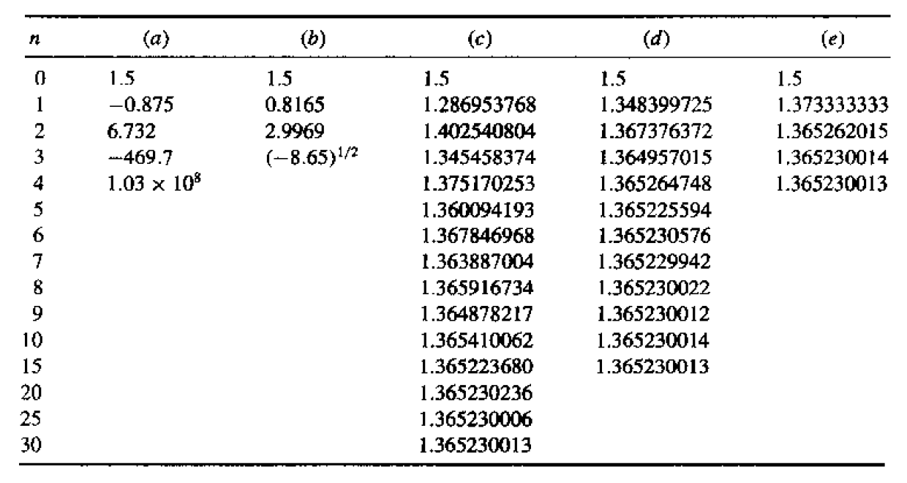
        </div> 

        可以看到 a 和 b 不太行，c, d, e 都可以迭代下去。不行的原因分别是一个不收敛，另一个出现对负数开根号的情况。但即使是 OK 的那几个，也有一些小小的差别：

        - c. 在区间 $[1, 1.5]$ 时，$k \approx 0.66$，也就是说该方程收敛较慢
        - d. $k \approx 0.15$，收敛速度中等
        - e. $k$ 更小，收敛很快（实际上它就是下面要介绍的[牛顿法](#newtons-method)）


## Newton's Method

最后要介绍的求根方法是**牛顿法**(Newton's method)，它的基本思想是使用[**泰勒展开式**](https://en.wikipedia.org/wiki/Taylor_series)(Taylor's expansion)来线性化一个非线性的函数。

具体来说，令 $p_0 \in [a, b]$ 为 $p$ 的一个近似值，满足 $f'(p) \ne 0$。考虑以下 $f(x)$ 关于 $p_0$ 的泰勒多项式：

$$
f(x) = f(p_0) + f'(p_0)(x - p_0) + \dfrac{f''(\xi_x)}{2!} (x - p_0)^2 \quad \text{where } \xi_x \text{ lies between } p_0 \text{ and } x
$$

假设 $|p - p_0|$ 很小，那么 $(p - p_0)^2$ 会更小，那么：

$$
0  = f(p) \approx f(p_0) + f'(p_0) (p - p_0) \Rightarrow p \approx p_0 - \dfrac{f(p_0)}{f'(p_0)}
$$

???+ play "动画演示"

    === "Step 1"

        先取一个近似值 $p_0$。
        
        <div style="text-align: center">
            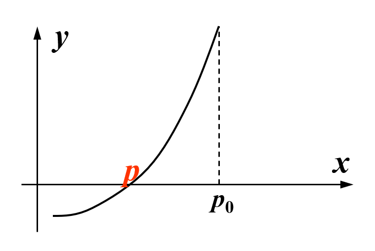
        </div>     
        
        求该位置下的导数，然后在对应点上做一条切线，该切线与 x 轴的交点即为下一个近似值，该近似值更加接近于真实值。

        <div style="text-align: center">
            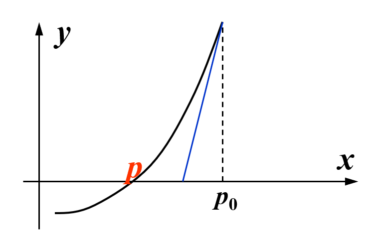
        </div>  


    === "Step 2"

        <div style="text-align: center">
            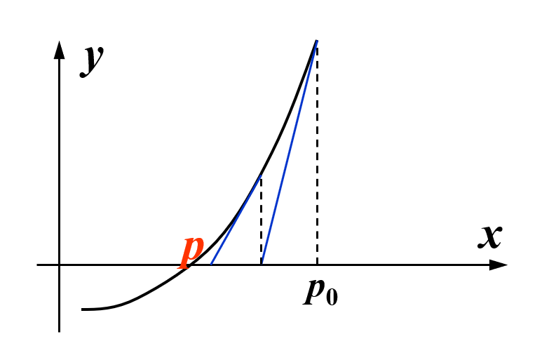
        </div>  

        从新的近似值出发，求该位置下的导数，然后在对应点上做一条切线，该切线与 x 轴的交点即为下一个近似值，该近似值更加接近于真实值。

    === "Step X" 

        重复上述过程，直至逼近真正的解 $p$。

        将这些过程压缩在一张图中：

        <div style="text-align: center">
            
        </div>  

        
从上述过程中，我们不难得到以下递推关系式：

$$
p_n = p_{n-1} - \dfrac{f(p_{n-1})}{f'(p_{n-1})} \quad \text{for } n \ge 1
$$

!!! theorem "定理"

    令 $f \in C^2[a, b]$（即函数具有二阶连续导数）。如果 $p \in [a, b]$ 满足 $f(p) = 0$ 且 $f'(p) \ne 0$，那么存在一个 $\delta > 0$，使得牛顿法产生一个序列 $\{p_n\} (n = 1, 2, \dots)$，对任意近似值 $p_0 \in [p - \delta, p + \delta]$，该序列收敛于 $p$。

    ??? proof "证明"

        牛顿法本质上就是一种不动点迭代：$p_n = g(p_{n-1}), n \ge 1$，满足 $g(x) = x - \dfrac{f(x)}{f'(x)}$。我们需要回答以下问题：

        - $g(x)$ 是否在 $p$ 的邻近区域内连续
            - 因为 $f'(p) \ne 0$ 且连续，所以在 $p$ 的邻近区域内，$f'(x) \ne 0$
        - $g'(x)$ 是否在 $p$ 的邻近区域内被 $0 < k < 1$ 约束
            - 因为 $g'(x) = \dfrac{f(x) f''(x)}{[f'(x)]^2}$，所以 $g'(p) = 0$
            - 又因为 $f''(x)$ 连续，所以 $g'(x)$ 很小，且在 $p$ 的邻近区域内连续
        - $g(x)$ 是否将 $[p - \delta, p + \delta]$ 映射到自身
            - $|g(x) - p| = |g(x) - g(p)| = |g'(\xi)||x - p| \le k|x - p| < |x - p| < \delta$

???+ code "牛顿法的实现"

    给定一个初始近似值 $p_0$，找到 $f(x) = 0$ 的一个解。

    - 输入：初始近似值 $p_0$；容忍值 $TOL$；最大迭代次数 $N_{max}$
    - 输出：近似解 $p$ 或错误信息

    ```cpp hl_lines="3"
    Step 1  Set i = 1;
    Step 2  while (i <= N_max) do steps 3-6
            Step 3  Set p = p_0 - f(p_0) / f'(p_0);  // compute p_i
            Step 4  if |p - p_0| < TOL then Output(p);  // successful
                STOP;
            Step 5  Set i++;
            Step 6  Set p_0 = p;  // update p_0
    Step 7  Output(The method failed after N_max iterations);  // unsuccessful
    ```

    >相比不动点迭代的实现，只有高亮行发生了变化。

!!! warning "注意"

    牛顿法的收敛性取决于初始近似值的选择。如下图所示，如果选择不当的话，牛顿法就会失效：

    <div style="text-align: center">
        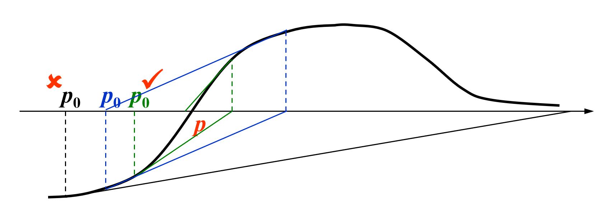
    </div>

??? info "补充：割线法"

    牛顿法的缺陷在于计算导数 $f'(x)$ 过于复杂，根据以下导数定义：

    $$
    f'(p_{n-1}) = \lim\limits_{x \rightarrow p_{n-1}} \dfrac{f(x) - f(p_{n-1})}{x - p_{n-1}}
    $$

    令 $x = p_{n-2}$，可以得到：

    $$
    f'(p_{n-1}) \approx \dfrac{f(p_{n-1}) - f(p_{n-2})}{p_{n-1} - p_{n-2}}
    $$

    将上述近似代入到牛顿法中，可以得到：

    $$
    p_n = p_{n-1} - \dfrac{f(p_{n-1})(p_{n-1} - p_{n-2})}{f(p_{n-1}) - f(p_{n-2})}
    $$

    上述方法就是**割线法**(secant method)，它的具体实现如下：

    ???+ code "割线法的实现"

        给定一个初始近似值 $p_0$ 和 $p_g1$，找到 $f(x) = 0$ 的一个解。

        - 输入：初始近似值 $p_0, p_1$；容忍值 $TOL$；最大迭代次数 $N_{max}$
        - 输出：近似解 $p$ 或错误信息

        ```cpp hl_lines="3"
        Step 1  Set i = 2; q_0 = f(p_0); q_1 = f(p_1); 
        Step 2  while (i <= N_max) do steps 3-6
                Step 3  Set p = p_1 - q_1(p_1 - p_0) / (q_1 - q_0);  // compute p_i
                Step 4  if |p - p_1| < TOL then Output(p);  // successful
                    STOP;
                Step 5  Set i++;
                Step 6  Set p_0 = p_1; q_0 = q_1; p_1 = p; q_1 = f(p); // update p_0, q_0, p_1, q_1
        Step 7  Output(The method failed after N_max iterations);  // unsuccessful
        ```
        

## Error Analysis for Iterative Methods

!!! definition "定义"

    假设 $\{p_n\} (n = 0, 1, 2, \dots)$ 是一个收敛到 $p$ 的序列，且 $\forall n, p_n \ne p$。若存在正常数 $\alpha, \lambda$，使得：

    $$
    \lim\limits_{n \rightarrow \infty} \dfrac{|p_{n+1} - p|}{|p_n - p|^\alpha} = \lambda
    $$

    成立，那么 $\{p_n\} (n = 0, 1, 2, \dots)$ 以阶数 $\alpha$ 收敛到 $p$，且渐进误差常量为 $\lambda$。

    - 若 $\alpha = 1$，那么序列是**线性**(linearly)收敛的
    - 若 $\alpha = 2$，那么序列是**二次**(quadratically)收敛的

    所以，$\alpha$ 越大，收敛速度越快。

    >注意：阶数 $\alpha$ 可以不是整数。


!!! question "思考"

    === "问题"

        对于 $g'(p) \ne 0$ 的迭代法，收敛的阶数是多少？

    === "解答"

        $$
        \lim\limits_{n \rightarrow \infty} \dfrac{|p_{n+1} - p|}{|p_n - p|^\alpha} = \lim\limits_{n \rightarrow \infty} \dfrac{g'(\xi_n)|p_n - p|}{|p_n - p|^\alpha} = |g'(p)|
        $$

        因此是线性收敛的。

!!! question "讨论"

    === "问题"

        牛顿法的收敛阶数是多少（此时 $g'(p) = 0$）？

    === "解答"

        通过泰勒展开式可以得到：

        $$
        \begin{align}
        0 = f(p) & = f(p_n) + f'(p_n)(p - p_n) + \dfrac{f''(\xi_n)}{2!} (p - p_n)^2 \notag \\
        \Rightarrow p & = \underbrace{p_n - \dfrac{f(p_n)}{f'(p_n)}}_{p_{n+1}} - \dfrac{f''(\xi_n)}{2! f'(p_n)}(p - p_n)^2 \Rightarrow \dfrac{|p_{n+1} - p|}{|p_n - p|^2} = \dfrac{f''(\xi_n)}{2f'(p_n)} \notag
        \end{align}
        $$

        只要 $f'(p) \ne 0$（在一个简单根附近），那么牛顿法至少是**二次收敛**的。

!!! theorem "定理"

    令 $p$ 是 $g(x)$ 的不动点。如果存在一些常量 $\alpha \ge 2$，使得 $g \in C^\alpha [p - \delta, p + \delta], \textcolor{red}{g'(p) = \dots = g^{(\alpha - 1)}(p) = 0}$ 且 $\textcolor{red}{g^{(\alpha)}(p) \ne 0}$。那么关于 $p_n = g(p_{n-1}), n \ge 1$ 的迭代是<span style="text-color: red"> $\alpha$ 阶</span>收敛的。

    ??? proof "证明"

        $$
        p_{n+1} = g(p_n) = \underbrace{g(p)}_{=p} + g'(p)(p_n - p) + \dots + \underbrace{\dfrac{g^{(\alpha)}(\xi_n)}{\alpha !}}_{=\lambda(\text{when } n \rightarrow \infty)}(p_n - p)^\alpha
        $$
        
!!! question "讨论"

    === "题目"

        如果根**不是**简单的(simple)（即有**重根**(multiple roots)），那么牛顿法的收敛阶数是多少？

    === "答案"

        如果 $p$ 是 $f$ 中的一个根，且重数(multiplicity)为 $m$，那么 $f(x) = (x - p)^m q(x)$ 且 $q(p) \ne 0$。

        根据牛顿法：$p_n = g(p_{n-1}) \text{ for } n \ge 1 \text{ with } g(x) = x - \dfrac{f(x)}{f'(x)}$，得到：

        $$
        g'(p) = \Big|1 - \dfrac{f'(p)^2 - f(p)f''(p)}{f'(p)^2}\Big| = 1 - \dfrac{1}{m} < 1
        $$

        所以此时牛顿法收敛，但不是二次收敛。

幸运的是，存在一种可以加快收敛速度的方法：将有重根的 $f$ 转换为等价的另一个有**简单根**的函数，在这个新的函数上使用牛顿法。具体来说：

- 令 $\mu(x) = \dfrac{f(x)}{f'(x)}$，那么 $f$ 的重根 = $\mu$ 的简单根
- 在 $\mu$ 上应用牛顿法：

    $$
    g(x) = x - \dfrac{\mu(x)}{\mu'(x)} = x - \dfrac{f(x)f'(x)}{[f'(x)]^2 - f(x)f''(x)}
    $$

!!! abstract "对上述方法的评价"

    - 优点：二次收敛
    - 缺点：
        - 需要额外计算 $f''(x)$
        - 分母是两个都接近于0的数的差


## Accelerating Convergence

### Aitken's $\Delta^2$ Method

!!! definition "定义（作为背景知识）"

    对于给定的序列 $\{p_n\} (n = 1, 2, \dots)$，**前向差**(forward difference) $\Delta p_n = p_{n+1} - p_n (n \ge 0)$。更高次的幂 $\Delta^k p_n$ 可以被递归定义为 $\Delta^k p_n = \Delta (\Delta^{k-1} p_n) (k \ge 2)$

虽然二次收敛效果很好，但并不是所有方法都能二次收敛——我们还得关注那些**线性收敛**的方法。因此下面将介绍一些能够加速线性收敛的技术。我们先来认识第一种方法：**Aitken's $\Delta^2$ 方法**。

???+ proof "推导过程"

    假设 $\{p_n\}_{n=0}^\infty$ 是线性收敛的序列，且极限为 $p$。为了构造一个收敛至 $p$ 更快的序列 $\{\hat{p_n}\}$，我们先假设 $p_n - p, p_{n+1} - p, p_{n+2} - p$ 的结果符号一致，且 $n$ 足够大，使得 

    $$
    \dfrac{p_{n+1} - p}{p_n - p} \approx \dfrac{p_{n+2} - p}{p_{n+1} - p}
    $$

    成立。那么通过一系列的转化，可以得到：

    $$
    p \approx \dfrac{p_{n+2}p_n - p_{n+1}^2}{p_{n+2} - 2p_{n+1} + p_n}
    $$

    再次转化，得到：$p \approx p_n - \dfrac{(p_{n+1} - p_n)^2}{p_{n+2} - 2p_{n+1} + p_n}$

    >这里用到了[不动点迭代](#fixed-point-iteration)的知识。
    
    利用前面介绍的前向差概念，替换上述等式中的记号，最终得到以下公式，即为 Atiken's $\Delta^2$ 方法所得到的加速收敛序列的递推公式：

$$
\hat{p}_n = \{\Delta^2\}(p_n) = p_n - \dfrac{(\Delta p_n)^2}{\Delta^2 p_n} (n \ge 0)
$$

Aitken's $\Delta^2$ 方法的思想在于：用多项低阶去产生高阶精度，从而避免多次迭代。


!!! theorem "定理"

    假设序列 $\{p_n\} (n = 1, 2, \dots)$ 线性收敛到极限 $p$；且对于所有充分大的数 $n$，有 $(p_n - p)(p_{n+1} - p) > 0$。那么序列 $\{\hat{p}_n\} (n = 1, 2, \dots)$ 收敛到 $p$ 的速度快于 $\{p_n\} (n = 1, 2, \dots)$，即：

    $$
    \lim\limits_{n \rightarrow \infty} \dfrac{\hat{p}_n - p}{p_n - p} = 0
    $$


### Steffensen's Method

在 Aitken's $\Delta^2$ 方法的基础上稍作修改，我们就能得到用于加速**二次收敛**的技术——**Steffensen 方法**。用这种方法构造出来的序列如下所示：

$$
\begin{align}
p_0^{(0)}, p_1^{(0)} = g(p_0^{(0)}), p_2^{(0)} = g(p_2^{(0)})  \notag \\
p_0^{(1)} = \{\Delta^2\}(p_0^{(0)}), p_1^{(1)} = \{\Delta^2\}(p_0^{(1)}) , p_2^{(1)} = \{\Delta^2\}(p_1^{(1)})\notag \\
p_0^{(2)} = \{\Delta^2\}(p_0^{(1)}), \dots \notag
\end{align}
$$

!!! warning "注意"

    该方法的使用前提是 $g'(p) \ne 1$。

???+ code "算法：Steffensen 加速"

    对于给定初始值 $p_0$，寻找 $x = g(x)$ 的解。

    - 输入：初始近似值 $p_0$；容忍值 $TOL$；最大迭代次数 $N_{max}$
    - 输出：近似解 $x$ 或失败信息

    ```cpp
    Step 1  Set i = 1;
    Step 2  while (i <= N_max) do steps 3-6
            Step 3  Set p_1 = g(p_0);
                        p_2 = g(p_1);
                        p = p_0 - (p_1 - p_0)^2 / (p_2 - 2 * p_1 + p_0);
            Step 4  if |p - p_0| < TOL then Output(p);  // successful
                STOP;
            Step 5  Set i++;
            Step 6  Set p_0 = p;  // update p_0
    Step 7  Output(The method failed after N_max iterations);  // unsuccessful
    ```

>对应的[作业练习](hw.md#chap-2-solutions-of-equations-in-one-variable)📝

>对应[小测2](quizzes.md)💯