# Chap 3: Interpolation and Polynomial Approximation

??? abstract "核心知识"

    - 拉格朗日插值多项式
        - Neville 法
    - 差商、牛顿插值法
    - 埃尔米特插值法
    - 三次样条插值法

如果函数 $y = f(x)$ 的计算过于复杂，或者甚至是未知的，一种近似求解的办法是：首先在一组点序列 $x_0, \dots, x_n$ 上获取一组函数值 $y_0 = f(x_0), \dots, y_n = f(x_n)$，然后根据这些值构造一个相对简单的近似函数 $g(x) \approx f(x)$。

如果 $g(x)$ 满足 $\forall\ i = 0, \dots, n, g(x_i) = f(x_i)$，我们称 $g(x)$ 为 $f(x)$ 的**插值函数**(interpolating function)。最常见的插值函数形式是**代数多项式**(algebraic polynomials)。

<div style="text-align: center">
    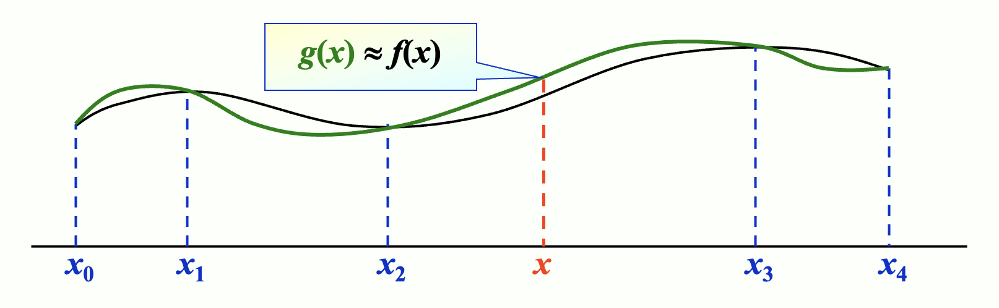
</div>


## Interpolation and the Lagrange Polynomial

目标：找到 $n$ 阶多项式 $P_n(x) = a_0 + a_1 x + \dots + a_n x^n$，使得 $\forall\ i = 0, \dots, n, P_n(x_i) = y_i$。

>注：对任何 $i \ne j$，必须满足 $x_i \ne x_j$

当 $n = 1$ 时：给定 $x_0, x_1; y_0, y_1$。找到 $P_1(x) = a_0 + a_1 x$，使得 $P_1(x_0) = y_0, P_1(x_1) = y_1$。此时 $P_1(x)$ 是一个经过给定两点 $(x_0, y_0), (x_1, y_1)$ 的**线函数**(line function)，即：

$$
\begin{align}
P_1(x) & = y_0 + \dfrac{y_1 - y_0}{x_1 - x_0}(x - x_0) \notag \\
& = \underbrace{\Big(\dfrac{x - x_1}{x_0 - x_1}\Big)}_{\textcolor{red}{L_{1, 0}}(x)} y_0 + \underbrace{\Big(\dfrac{x - x_0}{x_1 - x_0}\Big)}_{\textcolor{red}{L_{1, 1}}(x)} y_1 = \sum\limits_{i=0}^1 \textcolor{red}{L_{1, i}}(x)y_i \notag
\end{align}
$$

其中标红的项被称为**拉格朗日基**(Lagrange Basis)，它满足：$L_{1, i}(x_j) = \delta_{ij} = \begin{cases}1 & \text{if } i = j \\ 0 & \text{if } i \ne j\end{cases}$（称为 **Kronecker 符号**）

---
当 $n \ge 1$ 时：我们要寻找 $L_{n, i}(x)\ (i = 0, \dots, n)$，使得 $L_{n, i} (x_j) = \delta_{ij}$。然后令 $P_n(x) = \sum\limits_{i=0}^n L_{n, i}(x) y_i$。因此 $P_n(x_i) = y_i$。

每个 $L_{n, i}$ 都有 $n$ 个根 $x_0 \dots \widehat{x_i} \dots x_n$。可以得到：

$$
L_{n, i}(x) = C_i (x - x_0) \dots (\widehat{x - x_i}) \dots (x - x_n) = C_i \prod\limits_{\substack{j \ne i \\ j = 0}}^n (x - x_j)
$$

当 $L_{n, i}(x_i) = 1$ 时，$C_i = \prod\limits_{j \ne i} \dfrac{1}{x_i - x_j}$

$$
L_{n, i}(x) = \prod\limits_{\substack{j \ne i \\ j = 0}}^n \dfrac{(x - x_j)}{(x_i - x_j)} \Rightarrow P_n(x) = \sum\limits_{i=0}^n L_{n, i}(x) y_i
$$

这里的 $P_n(x)$ 就是**n 阶拉格朗日插值多项式**(n-th Lagrange interpolating polynomial)。

???+ question "Quiz"

    === "题目"

        <div style="text-align: center">
            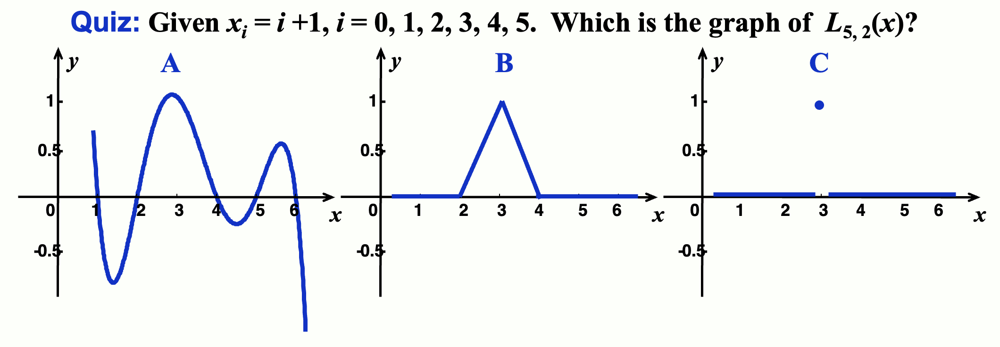
        </div>

    === "答案"

        A

        - 首先，拉格朗日多项式一定是个连续函数 -> C❌
        - 其次，从它的式子就可以看出，它不可能是直线（$n=5$ 表明它是六次曲线）-> B❌

!!! theorem "定理"

    如果 $x_0, x_1, \dots, x_n$ 是 $n + 1$ 个不同的数，且用函数 $f$ 得到这 $n + 1$ 个数对应的函数值，那么最终得到的 n 阶多项式就是**唯一的**（和[拉格朗日多项式](#interpolation-and-the-lagrange-polynomial)、[牛顿插值法](#newtons-interpolation)等具体的构造方法无关）。

    ??? proof "证明"

        （反证法）如果不是唯一的，那么存在两个多项式 $P_n(x)$ 和 $Q_n(x)$，它们都满足插值条件。这样我们可以得到一个多项式 $D(x) = P_n(x) - Q_n(x)$，它的阶数 $\le n$。但 $D(x)$ 有 $n + 1$ 个不同的根 $x_0, x_1, \dots, x_n$，这和它的阶数条件矛盾。因此假设不成立，这样就证明了多项式的唯一性。

!!! note "注"

    插值多项式不是唯一的，除非它的阶数被约束在不超过 $n$ 的范围内。

    相应的反例就是 $P(x) = L_n(x) + p(x) \prod\limits_{i=0}^n (x - x_i)$，其中 $p(x)$ 可以是任意阶数的多项式。

---
下面我们来分析**余项**(remainder)：假如 $a \le x_0 < x_1 < \dots < x_n \le b$ 且 $f \in C^{n+1} [a, b]$。考虑截断误差 $R_n(x) = f(x) - P_n(x)$

??? theorem "罗尔定理"

    如果 $\varphi(x)$ 足够平滑，且 $\varphi(x_0) = \varphi(x_1) = 0$，那么 $\exists \xi \in (x_0, x_1)$，使得 $\varphi'(\xi) = 0$。

    一般来说，如果 $\varphi(x_0) = \varphi(x_1) = \varphi(x_2) = 0$，那么 $\exists \xi_0 \in (x_0, x_1), \xi_1 \in (x_1, x_2)$，使得 $\varphi'(\xi_0) = \varphi'(\xi_1) = 0$，那么 $\exists \xi \in (\xi_0, \xi_1)$，使得 $\varphi''(\xi) = 0$

    同理，$\varphi(x_0) = \dots = \varphi(x_n) = 0 \Rightarrow \exists \xi \in (a, b)$，使得 $\xi^{(n)}(\xi) = 0$

$R_n(x)$ 至少有 $n + 1$ 个根 $\Rightarrow R_n(x) = K(x) \prod\limits_{i=0}^n (x - x_i)$ 

修正任何 $x \ne x_i\ (i = 0, \dots, n)$。定义为 $t \in [a, b]$ 定义函数 $g$ 为：

$$
g(t) = R_n(t) - K(x) \prod\limits_{i=0}^n (t - x_i)
$$

$g(x)$ 有 $n + 2$ 个不同的根 $x_0, \dots, x_n, x\ \Rightarrow g^{(n+1)}(\xi_x) = 0, \xi_x \in (a, b)$

$$
\begin{align}
& f^{(n+1)}(\xi_x) - \cancel{P_n^{(n+1)}(\xi_x)} - K(x)(n+1)! = R_n^{(n+1)}(\xi_x) - K(x)(n+1)! \notag \\
& \Rightarrow K(x) = \dfrac{f^{(n+1)}(\xi_x)}{(n+1)!} \notag
\end{align}
$$

因此 $R(x) = \dfrac{f^{(n+1)}(\xi_x)}{(n+1)!} \prod\limits_{i=0}^n (x - x_i)$

!!! note "注"

    - 因为大多数情况下 $\xi_x$ 无法确定，因此我们会获取 $f^{(n+1)}$ 的上界。也就是说，得到一个估计值 $M_{n+1}$，满足 $\forall\ x \in (a, b),\ |f^{(n+1)}(x)| \le M_{n+1}$，并且取 $\dfrac{M_{n+1}}{(n+1)!} \prod\limits_{i=0}^n |x - x_i|$ 为总误差的上界。
    - 对于任意阶数 $\le n$ 的多项式函数 $f$，插值多项式是精确的，因为 $f^{(n+1)}(x) \equiv 0$。

???+ example "例子"

    === "例1"

        === "题目"

            假设为 $f(x) = e^x\ (x \in [0, 1])$ 做一个表格，表格中的每一项精确到8位小数，并且步幅为 $h$。对于绝对误差不超过 $10^{-6}$ 的线性插值，$h$ 应该是多少？

        === "解答"

            假设 $[0, 1]$ 被划分为 $n$ 个等间距的子区间 $[x_0, x_1], [x_1, x_2], \dots, [x_{n-1}, x_n]$，且 $x$ 在区间 $[x_k, x_{k+1}]$ 上。那么估计误差为：

            $$
            \begin{align}
            |f(x) - P_1(x)| & = \Big|\dfrac{f^{(2)}(\xi)}{2!}(x - x_k)(x - x_{k+1})\Big| \notag \\
            & = \Big|\dfrac{e^\xi}{2}(x - kh)(x - (k+1)h)\Big| \le \dfrac{e}{2} \times \dfrac{h^2}{4} \notag
            \end{align}
            $$

            $\dfrac{eh^2}{8} \le 10^{-6} \quad \Rightarrow \quad h \le 1.72 \times 10^{-3}$

            方便起见，我们就取 $n = 1000, h = 0.001$ 好了。

    === "例2"

        === "题目"

            给定 $\sin \dfrac{\pi}{6} = \dfrac{1}{2}, \sin \dfrac{\pi}{4} = \dfrac{1}{\sqrt{2}}, \sin \dfrac{\pi}{3} = \dfrac{\sqrt{3}}{2}$。使用关于 $\sin x$ 的线形和二次拉格朗日多项式，计算 $\sin 50 \degree$ 并评估误差。

            （已知 $\sin 50 \degree = 0.7660444...$）

        === "解答"

            - 先使用 $x_0, x_1$ 和 $x_1, x_2$ 计算线形插值。

                - 使用 $x_0 = \dfrac{\pi}{6}, x_1 = \dfrac{\pi}{4}$
                    - $P_1(x) = \dfrac{x - \frac{\pi}{4}}{\frac{\pi}{6} - \frac{\pi}{4}} \times \dfrac{1}{2} + \dfrac{x - \frac{\pi}{6}}{\frac{\pi}{4} - \frac{\pi}{6}} \times \dfrac{1}{\sqrt{2}}$
                    - $50 \degree = \dfrac{5\pi}{18}$
                    - $\sin 50 \degree \approx P_1(\dfrac{5 \pi}{18}) \approx 0.77614$
                    - $f(x) = \sin x, f^{(2)} = - sin \xi_x, \xi_x \in (\dfrac{\pi}{6}), \dfrac{\pi}{3}$，且 $\dfrac{1}{2} < \sin \xi_x < \dfrac{\sqrt{3}}{2}$
                    - $R_1 (x) = \dfrac{f^{(2)(\xi_x)}}{2!}(x - \dfrac{\pi}{6})(x - \dfrac{\pi}{4})$，得到 $-0.01319 < R_1(\dfrac{5\pi}{18}) < -0.00762$，因此**外推误差** $\approx -0.01001$
                - 使用 $x_1 = \dfrac{\pi}{4}, x_2 = \dfrac{\pi}{3}$
                    - 计算得到 $\sin 50 \degree \approx 0.76008, 0.00538 < \widetilde{R_1}(\dfrac{5\pi}{18}) < 0.00660$
                    - 因此插值误差 $\approx 0.00596$
                
                ???+ note "外推 v.s. 插值"

                    - **外推**(extrapolation)：在已知数据点范围之**外**，估计或预测未知数据点的值。
                    - **插值**(interpolation)：在已知数据点范围之**内**，估计或预测未知数据点的值。

                    由于 $\dfrac{\pi}{6} < \dfrac{\pi}{4} < 50 \degree < \dfrac{\pi}{3}$，因此使用 $x_0, x_1$ 属于外推，而 $x_1, x_2$ 属于插值。一般而言，**插值效果优于外推**。

            - 再使用 $x_0, x_1, x_2$ 计算二次插值。

                - $P_2(x) = \frac{(x - \frac{\pi}{4})(x - \frac{\pi}{3})}{(\frac{\pi}{6} - \frac{\pi}{4})(\frac{\pi}{6} - \frac{\pi}{2})} \times \dfrac{1}{2} + \frac{(x - \frac{\pi}{6})(x - \frac{\pi}{3})}{(\frac{\pi}{4} - \frac{\pi}{6})(\frac{\pi}{4} - \frac{\pi}{3})} \times \dfrac{1}{\sqrt{2}} +  \frac{(x - \frac{\pi}{6})(x - \frac{\pi}{4})}{(\frac{\pi}{3} - \frac{\pi}{6})(\frac{\pi}{3} - \frac{\pi}{4})} \times \dfrac{\sqrt{3}}{2}$
                - $\sin 50 \degree \approx P_2(\dfrac{5\pi}{18}) \approx 0.76543$
                - $R_2(x) = \dfrac{- \cos \xi_x}{3!}(x - \dfrac{\pi}{6})(x - \dfrac{\pi}{4})(x - \dfrac{\pi}{3}),\ \dfrac{1}{2} < \cos \xi_x < \dfrac{\sqrt{3}}{2}$
                - $0.00044 < R_2(\dfrac{5 \pi}{18}) < 0.00077$，所以二次插值的误差 $\approx 0.00061$

            !!! note "注"
            
                看起来更高次的插值法通常会带来更好的结果，但并不总是如此。


### Neville's Method

!!! bug "拉格朗日多项式的缺陷"

    如果发现当前拉格朗日多项式的精度不够，那我们就会考虑更多的插值点。但这样的话我们就得从头开始计算拉格朗日基，前面的工作都浪费掉了。

    而接下来介绍的 Neville 法就能利用之前算好的插值多项式继续计算，无需重复计算。

!!! definition "定义"

    令 $f$ 是关于 $x_0, x_1, \dots, x_n$ 的函数，并假设 $m_1, \dots, m_k$ 是 $k$ 个不同的整数且满足 $\forall i, 0 \le m_i \le n$。拉格朗日多项式在 $k$ 个点 $x_{m_1}, \dots, x_{m_k}$ 上与 $f(x)$ 具有相同值时，记作 $P_{m_1, \dots, m_k}(x)$。

!!! theorem "定理"

    令 $f$ 是关于 $x_0, x_1, \dots, x_k$ 的函数，并令 $x_i, x_j$ 为其中两个不相等的数，那么：

    $$
    P(x) = \dfrac{(x - x_j)P_{0, 1, \dots, j-1, j+1, \dots, k}(x) - (x - x_i)P_{0, 1, \dots, i-1, i+1, \dots, k}(x)}{x_i - x_j}
    $$

    描述了在 $k+1$ 个点 $x_0, x_1, \dots, x_k$ 上向 $f$ 插值的第 $k$ 个拉格朗日多项式。

    ??? proof "证明"

        - 对任意 $0 \le r \le k$ 且 $r \ne i \text{ and } j$，两个在分子上插值多项式等于 $f(x_r)$，因此 $P(x_r) = f(x_r)$
        - 第一个在分子上的多项式等于 $f(x_i)$，且第二项为0，所以 $P(x_i) = f(x_i)$。同理，$P(x_j) = f(x_j)$
        - 因此，在 $k+1$ 个点 $x_0, x_1, \dots, x_k$ 上向 $f$ 插值的第 $k$ 个拉格朗日多项式是唯一的

上述定理表明插值多项式可以**递归**生成。比如，它们可以以下表所示的方式，一行行地生成插值多项式：

$$
\begin{matrix}
x_0 & P_0 & & & & \\
x_1 & P_1 & P_{0, 1} & & & \\
x_2 & P_2 & P_{1, 2} & P_{0, 1, 2} & & \\
x_3 & P_3 & P_{2, 3} & P_{1, 2, 3} & P_{0, 1, 2, 3} \\
x_4 & P_4 & P_{3, 4} & P_{2, 3, 4} & P_{1, 2, 3, 4} & P_{0, 1, 2, 3, 4}
\end{matrix}
$$

上述过程被称为 **Neville 法**。但 $P$ 的记号显得过于笨重（一堆下标表示参与到多项式中的插值点）。观察发现，只需要两个下标就行了——我们用新的记号 $Q_{i, j}(x)\ (0 \le j \le i)$ 来表示阶数为 $j$ 的，在 $(j+1)$ 个数 $x_{i-j}, x_{i-j+1}, \dots, x_{i-1}, x_i$ 上的插值多项式，即：$Q_{i, j} = P_{i-j, i-j+1, \dots, i-1, i}$。那么上面的表格就可以转化为：

$$
\begin{matrix}
x_0 & Q_{0, 0} & & & & \\
x_1 & Q_{1, 0} & Q_{1, 1} & & & \\
x_2 & Q_{2, 0} & Q_{2, 1} & Q_{2, 2} & & \\
x_3 & Q_{3, 0} & Q_{3, 1} & Q_{3, 2} & Q_{3, 3} \\
x_4 & Q_{4, 0} & Q_{4, 1} & Q_{4, 2} & Q_{4, 3} & Q_{4, 4}
\end{matrix}
$$

而上面定理给出的递推公式可以转化为：

$$
Q_{i, j}(x) = \dfrac{(x - x_{i - j})Q_{i, j-1}(x) - (x - x_i)Q_{i-1, j-1}(x)}{x_i - x_{i - j}}
$$

观察发现，求上面表格某一项的值时，我们会用到其左侧和左上角的两个项。

??? code "算法：Neville 迭代插值"

    求解对于数 $x$，在 $n+1$ 个不同的数 $x_0, \dots, x_n$ 上的函数 $f$ 的插值多项式 $P$。

    - 输入：数 $x_0, x_1, \dots, x_n$；值 $f(x_0), f(x_1), \dots, f(x_n)$，分别作为 $Q$ 的第1列 $Q_{0, 0}, Q_{1, 0}, \dots, Q_{n, 0}$ 上的值。
    - 输出：表 $Q$，其中 $P(x) = Q_{n, n}$

    ```c
    Step 1  for i = 1, 2, ..., n:
                for j = 1, 2, ..., i:
                    set Q[i][j] = ((x - x[i-j]) * Q[i][j-1] - (x - x[i]) * Q[i-1][j-1]) / (x[i] - x[i-j]);
    Step 2  Output(Q);
            STOP;
    ```


## Divided Difference

>Divided differences is a recursive division process. Given a sequence of data points $(x_0,y_0),\dots,(x_n,y_n)$, the method calculates the coefficients of the interpolation polynomial of these points in the Newton form.  -- [Wikipedia](https://en.wikipedia.org/wiki/Divided_differences)

- **1阶差商**：$f[x_i, x_j] = \dfrac{f(x_i) - f(x_j)}{x_i - x_j} (i \ne j, x_i \ne x_j)$
- **2阶差商**：$f[x_i, x_j, x_k] = \dfrac{f[x_i, x_j] - f[x_j, x_k]}{x_i - x_k} (i \ne k, x_i \ne x_k)$
- **$k+1$阶差商**：

    $$
    \begin{align}
    f[x_0, \dots, x_{k+1}] & = \dfrac{f[\textcolor{cornflowerblue}{x_0}, x_1, \dots, x_k] - f[x_1, \dots, x_k, \textcolor{cornflowerblue}{x_{k+1}}]}{\textcolor{cornflowerblue}{x_0 - x_{k+1}}} \notag \\
    & = \dfrac{f[x_0, \dots, x_{k-1}, \textcolor{cornflowerblue}{x_k}] - f[x_0, \dots, x_{k-1}, \textcolor{cornflowerblue}{x_{k+1}}]}{\textcolor{cornflowerblue}{x_k - x_{k+1}}} \notag
    \end{align}
    $$

事实上，$f[x_0, \dots, x_k] = \sum\limits_{i=0}^k \dfrac{f(x_i)}{\omega_{k+1}' (x_i)}$，其中 $\omega_{k+1}(x) = \prod\limits_{i=0}^k (x - x_i), \omega_{k+1}'(x_i) = \prod\limits_{\substack{j = 0 \\ j \ne i}}^k (x_i - x_j)$。这个公式的要点在于：$f[x_0, \dots, x_k]$ 的值和 $x_0, \dots, x_k$ 的顺序无关。


### Newton's Interpolation

目标：得到 $N_n(x) = a_0 + a_1(x - x_0) + a_2(x - x_0)(x - x_1) + \dots + a_n(x - x_0) \dots (x - x_{n-1})$

我们将1阶差商、2阶差商、...、$k+1$阶差商展开，得到：

$$
\begin{cases}
f(x) = f(x_0) + (x - x_0)f[x, x_0] & (1)\\
f[x, x_0] = f[x_0, x_1] + (x - x_1)f[x, x_0, x_1] & (2)\\
\dots\ \dots\ \dots\\
f[x, x_0, \dots, x_{n-1}] = f[x_0, \dots, x_n] + (x - x_n) f[x, x_0, \dots, x_n] & (n-1)
\end{cases}
$$

计算 $(1) + (x - x_0) \times (2) + \dots + (x - x_0) \dots (x - x_{n-1}) \times (n-1)$，得到：

$$
\begin{align}
f(x) = & \textcolor{red}{f(x_0) + f[x_0, x_1](x - x_0) + f[x_0, x_1, x_2](x - x_0)(x - x_1) + \dots} \notag \\
& \textcolor{red}{+ f[x_0, \dots, x_n](x - x_0) \dots (x - x_{n-1})} \notag \\
& \textcolor{green}{+ f[x, x_0, \dots, x_n](x - x_0) \dots (x - x_{n-1})(x - x_n)} \notag
\end{align}
$$

其中红色部分就是我们要求的 $N_n(x)$ ，而绿色部分是 $R_n(x)$。所以，$a_i = f[x_0, \dots, x_i]$

??? code "算法：牛顿插值差商公式"

    求得对于数 $x$，在 $n+1$ 个不同的数 $x_0, \dots, x_n$ 上的函数 $f$ 的插值多项式 $P$ 的差商系数。

    - 输入：数 $x_0, x_1, \dots, x_n$；值 $f(x_0), f(x_1), \dots, f(x_n)$，分别记作 $F_{0, 0}, F_{1, 0}, \dots, F_{n,0}$。
    - 输出：数 $F_{0, 0}, F_{1, 1}, F_{n, n}$，其中 $P(x) = \sum\limits_{i=0}^n F_{i, i} \prod_{j=0}^{i-1} (x - x_j)$

    ```c
    Step 1  for i = 1, 2, ..., n:
                for j = 1, 2, ..., i:
                    set F[i][j] = (F[i][j-1] - F[i-1][j-1]) / (x[i] - x[i-j]);
    Step 2  Output(F[0][0], F[1][1], ..., F[n][n]);  // F[i][i] is f[x[0], x[1], ..., x[i]]
            STOP;
    ```

!!! note "注"

    - 因为第 n 个插值多项式是唯一的，所以 $N_n(x) \equiv P_n(x)$
    - 它们必须有相同的截断误差，即：

        $$
        \begin{align}
        & f[x, x_0, \dots, x_n] \omega_{k+1} (x) = \dfrac{f^{(n+1)}(\xi_x)}{(n+1)!} \omega_{k+1}(x) \notag \\
        & \Rightarrow f[x_0, \dots, x_k] = \dfrac{f^{(k)}(\xi)}{k!}, \xi \in (x_{\text{min}}, x_{\text{max}}) \notag
        \end{align}
        $$

    - 牛顿插值法的求解过程和 Neville 法类似：

        $$
        \begin{matrix}
        f(x_0) & & & & & \notag \\
        f(x_1) & f[x_0, x_1] & & & & \notag \\
        f(x_2) & f[x_1, x_2] & f[x_0, x_1, x_2] & & & \notag \\
        \dots & \dots & \dots & & & \notag \\
        f(x_{n-1}) & \dots & \dots & & & \notag \\
        f(x_n) & f[x_{n-1}, x_n] & f[x_{n-2}, x_{n-1}, x_n] & & f[x_0, \dots, x_n] \notag \\
        f(x_{n+1}) & f[x_n, x_{n+1}] & f[x_{n-1}, x_n x_{n+1}] & \dots & f[x_1, \dots, x_{n+1}] & f[x_0, \dots, x_{n+1}] \notag 
        \end{matrix}
        $$


### Formulae with Equal Spacing

如果这些点是等间距的，即 $x_i = x_0 + ih\ (i = 0, \dots, n)$，那么：

- **前向差**(forward difference)：$\Delta f_i = f_{i+1} - f_i, \Delta^k f_i = \Delta(\Delta^{k-1} f_i) = \Delta^{k-1} f_{i+1} - \Delta^{k-1} f_i$
- **后向差**(backward difference)：：$\nabla f_i = f_i - f_{i-1}, \nabla^k f_i = \nabla(\nabla^{k-1} f_i) = \nabla^{k-1} f_i - \nabla^{k-1} f_{i-1}$
- **中心差**(centered difference)：$\delta^k f_i = \delta^{k-1} f_{i+\frac{1}{2}} - \delta^{k-1} f_{i - \frac{1}{2}}$，其中 $f_{i \pm \frac{1}{2}} = f(x_i \pm \dfrac{h}{2})$


### Some Important Properties

- 线性：$\Delta(a \cdot f(x) + b \cdot g(x)) = a \Delta f + b \Delta g$
- 如果 $f(x)$ 是一个 $m$ 阶多项式，那么 $\Delta^k f(x)\ (0 \le k \le m)$ 是一个 $m - k$ 阶多项式且 $\Delta^k f(x) = 0\ (k > m)$
- 差值还能从以下函数中得到：
    - $\Delta^n f_k = \sum\limits_{j=0}^n (-1)^j \left( \begin{array}{cccc}n \\ j\end{array}\right) f_{n+k-j}$
    - $\nabla^n f_k = \sum\limits_{j=0}^n (-1)^{n-j} \left( \begin{array}{cccc}n \\ j\end{array}\right) f_{k+j-n}$

- 反之亦然：$f_{n+k} = \sum\limits_{j=0}^n \left( \begin{array}{cccc}n \\ j\end{array}\right) \Delta^j f_k$
- $f[x_0, \dots, x_k] = \dfrac{\Delta^k f_0}{k! h^k}, f[x_n, x_{n-1}, \dots, x_{n-k}] = \dfrac{\nabla^k f_n}{k!h^k}$。从 $R_n$ 可以得到：$f^{(k)}(\xi) = \dfrac{\Delta^k f_0}{h^k}$

!!! note "总结"

    - **牛顿前向差公式**(Newton forward-difference formula)：令 $x = x_0 + th$，那么 
    
        $$
        \begin{align}
        N_n(x) & = N_n(x_0 + th) = \sum\limits_{k=0}^n \left( \begin{array}{cccc}t \\ k\end{array}\right) \Delta^k f(x_0), \notag \\
        & = f(x_0) + t \Delta f(x_0) + \dfrac{t(t-1)}{2!} \Delta^2 f(x_0) + \dots + \dfrac{t(t-1) \dots (t-n+1)}{n!} \Delta^n f(x_0) \notag \\
        R_n(x) & = \dfrac{f^{(n+1)} (\xi)}{(n+1)!} t(t-1) \dots (t-n)h^{n+1}, \xi \in (x_0, x_n) \notag
        \end{align}
        $$

    - **牛顿后向差公式**(Newton backward-difference formula)：颠倒点的顺序，即计算 $N_n(x) = f(x_n) + f[x_n, x_{n-1}](x - x_n) + \dots + f[x_n, \dots, x_0](x - x_n) \dots (x - x_1)$。令 $x = x_n + th$，那么 
    
        $$
        \begin{align}
        N_n(x) & = N_n(x_n + th) = \sum\limits_{k=0}^n \underbrace{(-1)^k \left( \begin{array}{cccc}-t \\ k\end{array}\right)}_{C_{t+k-1}^k} \nabla^k f(x_n) \notag \\
        & = f(x_n) + t \nabla f(x_n) + \dfrac{t(t+1)}{2!} \nabla^2 f(x_n) + \dots + \dfrac{t(t+1) \dots (t+n-1)}{n!} \nabla^n f(x_n) \notag
        \end{align}
        $$


## Hermite Interpolation

???+ note "密切多项式"

    令 $x_0, x_1, \dots, x_n$ 为在 $[a, b]$ 上的 $n+1$ 个不同的数，$m_i$ 是和 $x_i$ 关联的非负整数（$i = 0, \dots, n$）。假设 $f \in C^m[a, b]$，其中 $m = \max\limits_{0 \le i \le n}m_i$，那么用于近似 $f$ 的**密切多项式**(osculating polynomial)为满足以下条件的阶数最小的多项式 $P(x)$：

    $$
    \dfrac{d^k P(x_i)}{dx^k} = \dfrac{d^k f(x_i)}{dx^k},\ \text{for each } i = 0, \dots, n \text{ and } k = 0, \dots, m
    $$

    >相比前面提到的插值多项式，密切多项式还要求**k阶导数相等**，因而得到了更准确、更光滑的插值曲线。

目标：找到一个**密切多项式** $P(x)$，使得 $\forall i = 0, 1, \dots, n, P(x_i) = f(x_i), P'(x_i) = f'(x_i), \dots, P^{(m_i)}(x_i) = f^{(m_i)}(x_i)$。

!!! note "注"

    - 给定 $N$ 个条件（即有 $N$ 个方程），$N - 1$ 阶多项式就能确定下来
    - 与 $f$ 以及所有在**一个点** $x_0$ 上的 $\le m_0$ 阶的导数吻合的密切多项式就是一个**泰勒多项式**：

        $$
        P(x) = f(x_0) + f'(x_0)(x - x_0) + \dots + \dfrac{f^{(m_0)}(x_0)}{m_0!}(x - x_0)^{m_0}
        $$

        且余项 $R(x) = f(x) - \varphi(x) = \dfrac{f^{(m_0 + 1)}(\xi)}{(m_0 + 1)!}(x - x_0)^{(m_0 + 1)}$

    - 当 $\forall i = 0, 1, \dots, n,\ m_i = 1$ 时，此时的多项式为**埃尔米特多项式**(Hermite polynomials)

一般情况下，给定 $x_0, \dots, x_n; y_0, \dots, y_n$ 以及 $y_0', \dots, y_n'$，埃尔米特多项式 $H_{2n+1}(x)$ 满足对于所有的 $i$，$H_{2n+1}(x_i) = y_i$ 且 $H_{2n+1}'(x_i) = y_i'$

???+ note "用待定系数法求解埃尔米特多项式"

    令 $H_{2n+1}(x) = \sum\limits_{i=0}^n y_i h_i(x) + \sum\limits_{i=0}^n y_i' \widehat{h_i}(x)$，其中 $h_i(x_j) = \delta_{ij}, h_i'(x_j) = 0, \widehat{h_i}(x_j) = 0, \widehat{h_i}'(x_j) = \delta_{ij}$

    - $h_i(x)$：对应**函数值** $y_i$
        - $x_0, \dots, \widehat{x_i}, \dots, x_n$ 是重数为2的根 $\Rightarrow\ h_i(x) = (A_i x + B_i) L_{n, i}^2(x)$
        - $A_i, B_i$ 能通过 $h_i(x_i) = 1, h_i'(x_i) = 0$ 求解
        - $h_i(x) = [1 - 2L_{n, i}'(x_i)(x - x_i)L_{n, i}^2(x)]$
    - $\widehat{h_i}(x)$：对应**导数值** $y_i'$
        - 除了 $x_i$ 外，所有的根 $x_0, \dots, x_n$ 的重数均为2，得到：
        - $\begin{cases}\widehat{h_i}(x) = C_i(x - x_i) L_{n, i}^2(x) \\ \widehat{h_i}'(x_i) = 1 \Rightarrow C_i = 1\end{cases} \quad \Rightarrow \quad \widehat{h_i}(x) = (x - x_i) L_{n, i}^2(x)$

    如果 $a = x_0 < x_1 < \dots < x_n = b, f \in C^{2n}[a, b]$，那么 $R_n(x) = \dfrac{f^{(2n+2)}(\xi_x)}{(2n+2)!}\Big[\prod\limits_{i=0}^n (x - x_i) \Big]^2$ 

??? question "思考"

    === "题目"

        给定 $x_i = i + 1, i = 0, 1, 2, 3, 4, 5$，哪一个是 $\widehat{h_2}(x)$？

        <div style="text-align: center">
            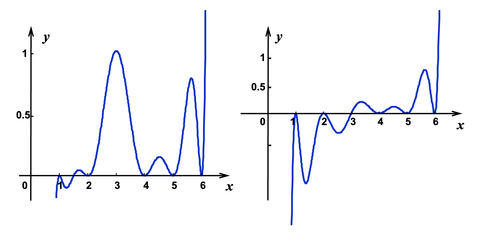
        </div>

    === "答案"

        <div style="text-align: center">
            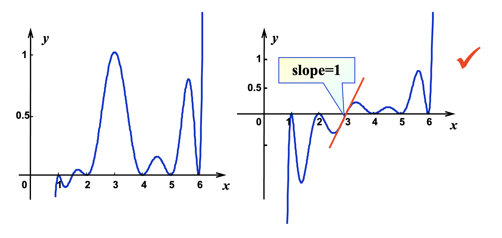
        </div>

???+ example "例子"

    === "例1"

        === "题目"

            假设 $x_0 \ne x_1 \ne x_2$。给定 $f(x_0), f(x_1), f(x_2)$ 和 $f'(x_1)$，寻找多项式 $P(x)$，满足 $P(x_i) = f(x_i),\ i = 0, 1, 2$，且 $P'(x_1) = f'(x_1)$。并分析误差。

        === "解答"

            首先，$P(x)$ 的阶必须 $\le 3$（本题给出 4 个条件（3个函数值 + 1个导数值），根据前面“注”的第一条，最多能确定 3 阶多项式）。

            与拉格朗日多项式类似，我们假设埃尔米特多项式的形式为：$P_3(x) = \sum\limits_{i=0}^2 f(x_i) h_i(x) + f'(x_1) \widehat{h_1}(x)$。接着根据已知条件，用待定系数法可以得到：
            
            $$h_i(x_j) = \delta_{ij}, h_i'(x_1) = 0, \widehat{h_1}(x_i) = 0, \widehat{h_1}'(x_1) = 1$$

            - $h_0(x)$：有根 $x_1, x_2$，且 $h_0'(x_1) = 0 \quad \Rightarrow \quad x_1$ 是一个重根
                - $\begin{cases}h_0(x) = C_0(x - x_1)^2(x - x_2) \\ h_0(x_0) = 1 \Rightarrow C_0\end{cases} \quad \Rightarrow \quad h_0(x) = \dfrac{(x - x_1)^2(x - x_2)}{(x_0 - x_1)^2(x_0 - x_2)}$
            - $h_2(x)$：与 $h_0(x)$ 类似
            - $h_1(x)$：有根 $x_0, x_2 \Rightarrow h_1(x) = (Ax + B)(x - x_0)(x - x_2)$。$A, B$ 可通过 $h_1(x_1) = 0$ 和 $h_1'(x_1) = 0$ 求解
            - $\widehat{h_1}(x)$：有根 $x_0, x_1, x_2 \Rightarrow \widehat{h_1}(x) = C_1(x - x_0)(x - x_1)(x - x_2)$。$h_1(x_1) = 1 \Rightarrow C_1$ 能被求解

            其误差分析类似拉格朗日误差分析：

            $$
            \begin{align}
            R_3(x) & = f(x) - P_3(x) \notag \\
            & = K(x)(x - x_0)(x - x_1)^2(x - x_2) \notag \\
            & \Rightarrow K(x) = \dfrac{f^{(4)}(\xi_x)}{4!} \notag
            \end{align}
            $$

    === "例2"

        === "题目"

            <div style="text-align: center">
                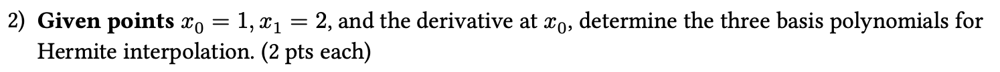
            </div>

        === "解答"

            根据已知条件，可以得到：

            $$
            h_0(x) = \begin{cases}h_0(1) = 1 \\ h_0'(1) = 0 \\ h_0(2) = 0 \end{cases} \quad \widehat{h_0}(x) = \begin{cases}\widehat{h_0}(1) = 0 \\ \widehat{h_0'}(1) = 1 \\ \widehat{h_0}(2) = 0 \end{cases} \quad h_1(x) = \begin{cases}h_1(1) = 0 \\ h_1'(1) = 0 \\ h_1(2) = 1 \end{cases}
            $$

            下面按照从易到难的顺序求解这3个未知量：

            - 求解 $h_1(x)$
                - 由条件知，$x = 1$ 是二重根
                - 那么可以令 $h_1(x) = C(x - 1)^2$
                - 再利用剩下那个条件，代进去计算，解得 $C = 1$
                - 所以 $h_1(x) = (x - 1)^2$
            - 求解 $\widehat{h_0}(x)$
                - 由条件知，$x = 1, x = 2$ 均为该函数的根
                - 那么可以令 $\widehat{h_0}(x) = C(x - 1)(x - 2)$
                - 利用剩下的导数条件（需要先对 $\widehat{h_0}(x)$ 求导），解得 $C = -1$
                - 所以 $\widehat{h_0}(x) = -(x - 1)(x - 2)$
            - 求解 $h_0(x)$
                - 由于根据已知条件只能确定 $x = 2$ 是其中一根，另一根未知，所以只好假设 $h_0(x) = ax^2 + bx + c$
                - 将三个条件代进去，得到三元一次方程，解得 $a = -1, b = 2, c = 0$
                - 所以 $h_0(x) = -x^2 + 2x = x(2 - x)$

!!! theorem "定理"

    如果 $f \in C^1[a, b]$ 且 $x_0, \dots, x_n \in [a, b]$ 是不同的数，那么在函数 $f$ 及其导数 $f'$ 一致的最小次数唯一多项式即为次数不超过 $2n+1$ 的埃尔米特多项式：

    $$
    H_{2n+1}(x) = \sum\limits_{j=0}^n f(x_j) H_{n,j}(x) + \sum\limits_{j=0}^n f'(x_j) \widehat{H}_{n,j}(x)
    $$

    其中 $H_{n,j} = [1 - 2(x - x_j) L'_{n,j}(x_j)]L_{n,j}^2(x)$，$\widehat{H}_{n,j}(x) = (x - x_j) L^2_{n,j}(x)$。在这里，$L_{n,j}(x)$ 指代的是$n$阶多项式中第$j$个拉格朗日系数。

    另外，若 $f \in C^{2n-2}[a, b]$，那么

    $$
    f(x) = H_{2n+1}(x) + \dfrac{(x - x_0)^2 \dots (x - x_n)^2}{(2n+2)!}f^{(2n+2)}(\xi)
    $$

    $\xi$ 为某个满足 $a < \xi < b$ 的数。

    ??? proof "证明"

        <div style="text-align: center">
            
        </div>

        <div style="text-align: center">
            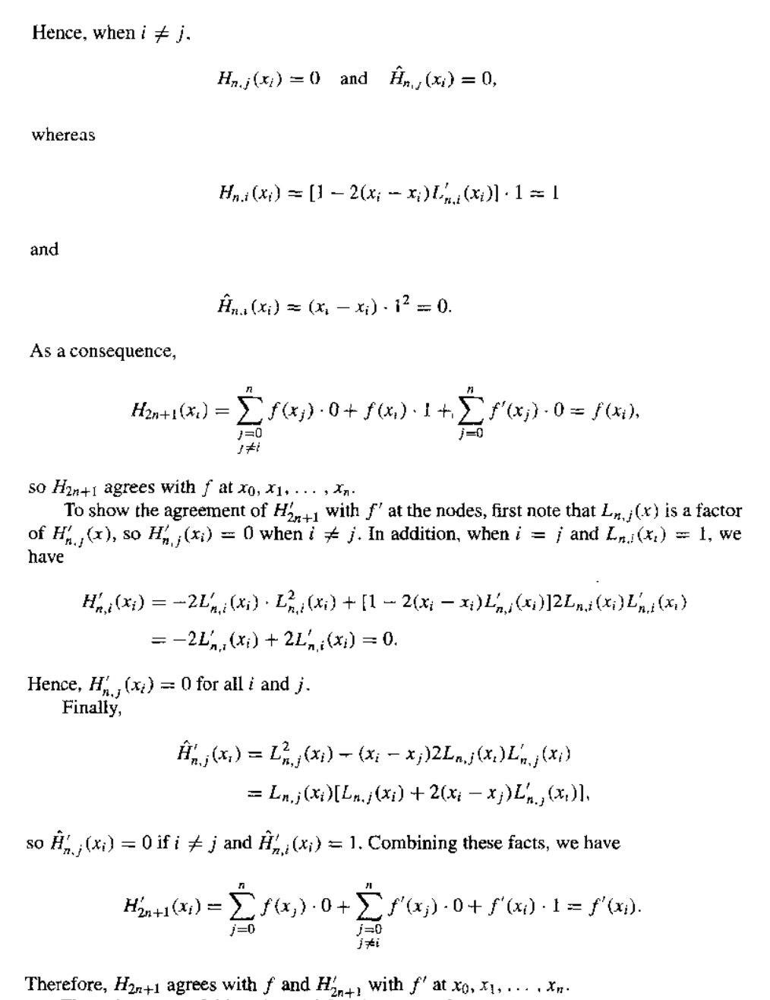
        </div>

??? code "算法：埃尔米特插值"

    求得在 $n+1$ 个不同的数 $x_0, \dots, x_n$ 上的函数 $f$ 的埃尔米特插值多项式 $H(x)$ 的系数。

    - 输入：数 $x_0, x_1, \dots, x_n$；值 $f(x_0), f(x_1), \dots, f(x_n)$ 以及 $f'(x_0), \dots, f'(x_n)$
    - 输出：数 $Q_{0,0}, Q_{1, 1}, \dots, Q_{2n+1, 2n+1}$，其中 

        $$
        \begin{align}
        H(x) = & Q_{0,0} + Q_{1,1}(x - x_0) + Q_{2,2}(x - x_0)^2 + Q_{3,3}(x - x_0)^2(x - x_1) \notag \\
        & + Q_{4,4}(x - x_0)^2(x - x_1)^2 + \dots \notag \\
        & + Q_{2n+1, 2n+1}(x - x_0)^2(x - x_1)^2 \dots (x - x_{n-1})^2(x - x_n) \notag
        \end{align}
        $$

    ```c
    Step 1  for i = 1, 2, ..., n do Step 2 and 3:
        Step 2  Set z[2*i] = x[i];
                    z[2*i+1] = x[i];
                    Q[2*i][0] = f(x[i]);
                    Q[2*i+1][0] = f(x[i]);
                    Q[2*i+1][1] = f`(x[i]);
        Step 3  if i != 0 then set Q[2*i][1] = (Q[2*i][0] - Q[2*i-1][0]) / (z[2*i] - z[2*i-1]);
    Step 4  for i = 2, 3, ..., 2*n+1:
                for j = 2, 3, ..., i set Q[i][j] = (Q[i][j-1] - Q[i-1][j-1]) / (z[i] - z[i-j]);
    Step 5  Output(Q[0][0], Q[1][1], ..., Q[2*n+1][2*n+1]);
            STOP.
    ```    


## Cubic Spline Interpolation

???+ example "例子"

    考虑关于函数 $f(x) = \dfrac{1}{1 + x^2}$ 在点 $x_i = -5 + \dfrac{10}{n}i \in [-5, 5] \ (i = 0, \dots, n)$ 的拉格朗日多项式 $P_n(x)$

    <div style="text-align: center">
        
    </div>

    可以看到，我们无法用多项式（这些彩色曲线）较为准确地近似函数（黑色曲线）。正如前面所说，增加多项式的阶数不能保证更好的近似结果，因为高阶多项式更容易发生**振荡**(oscillation)，反而会加大误差（即[**龙格现象**](https://en.wikipedia.org/wiki/Runge%27s_phenomenon)(Runge's phenomenon)）。


!!! info "一些尝试"

    === "**按段线性插值**(piecewise linear interpolation)"

        思路：在每个子区间 $[x_i, x_{i+1}]$ 上，通过线性多项式近似表示 $f(x)$，即：

        $$
        f(x) \approx P_1(x) = \dfrac{x - x_{i+1}}{x_i - x_{i+1}}y_i + \dfrac{x - x_i}{x_{i+1} - x_i} y_{i+1} \text{ for } x \in [x_i, x_{i+1}]
        $$

        令 $h = \max |x_{i+1} - x_i|$，那么 $P_1^h(x) \xrightarrow{\text{uniform}} f(x), h \rightarrow 0$

        !!! bug "缺点：不够平滑"


    === "**埃尔米特按段多项式**(Hermite Piecewise Polynomials)"

        思路：给定 $x_0, \dots, x_n;\ y_0, \dots, y_n;\ y_0', \dots, y_n'$，在区间 $[x_i, x_{i+1}]$ 的两个端点上构造一个关于 $y, y'$ 的3阶埃尔米特多项式

        !!! bug "缺点：计算导数不太容易"

这里介绍一种更好的方法：**三次样条插值**(cubic spline interpolation)。

>wiki：[样条](https://en.wikipedia.org/wiki/Flat_spline)

!!! definition "定义"

    给定一个定义在 $[a, b]$ 上的函数 $f$，以及一组节点 $a = x_0 < x_1 \dots < x_n = b$，关于 $f$ 的**三次样条插值器**(cubic spline interpolant) $S$ 是一个满足下面条件的函数：

    - $S(x)$ 是一个分段函数，在每个子区间 $[x_i, x_{i+1}]$ 上是一个三次多项式 $S_i(x)$（$i = 0, 1, \dots, n - 1$）
    - $S(x_i) = f(x_i),\ i = 0, 1, \dots, n$
    - $S_{i+1}(x_{i+1}) = S_i(x_{i+1}),\ i = 0, 1, \dots, n - 2$
    - $S_{i+1}'(x_{i+1}) = S_i'(x_{i+1}),\ i = 0, 1, \dots, n - 2$
    - $S_{i+1}''(x_{i+1}) = S_i''(x_{i+1}),\ i = 0, 1, \dots, n - 2$

    >后面三个条件确保了三次样条插值的**光滑性**。

    <div style="text-align: center">
        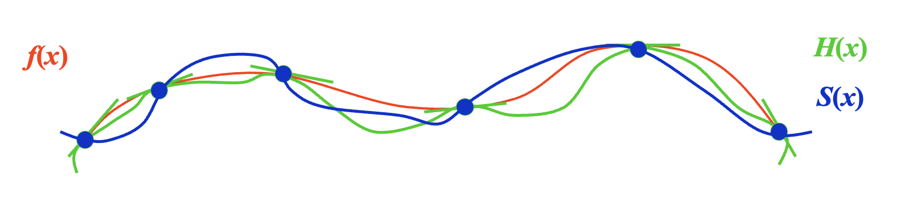
    </div>


### Method of Bending Moment

令 $h_j = x_j - x_{j-1}$ 且 对于 $x \in [x_{j-1}, x_j],\ S(x) = S_j(x)$（$S_j(x)$是3阶多项式），那么 $S_j''(x)$ 是一个1阶多项式，并能通过 $f$ 上的2个节点值确定下来。

假设 $S_j''(x_{j-1}) = M_{j-1}, S_j''(x_j) = M_j$（**弯矩**(bending moment)），那么 $\forall x \in [x_{j-1}, x_j]$，$S_j''(x) = M_{j-1} \dfrac{x_j - x}{h_j} + M_j \dfrac{x - x_{j-1}}{h_j}$

对 $S_j''$ 积分，可以得到：

- $S_j'(x) = -M_{j-1} \dfrac{(x_j - x)^2}{2h_j} + M_{j-1} \dfrac{(x - x_{j-1})^2}{2h_j} + A_j$
- $S_j(x) = M_{j-1} \dfrac{(x_j - x)^3}{6h_j} + M_{j-1} \dfrac{(x - x_{j-1})^3}{6h_j} + A_jx + B_j$

其中 $A_j, B_j$ 能通过方程 $S_j(x_{j-1}) = y_{j-1}, S_j(x_j) = y_j$ 求解。可以得到：

- $A_j = \dfrac{y_j - y_{j-1}}{h_j} - \dfrac{M_j - M_{j-1}}{6}h_j$
- $A_j x + B_j = (y_{j-1} - \dfrac{M_{j-1}}{6} h_j^2) \dfrac{x_j - x}{h_j} + (y_j - \dfrac{M_j}{6}h_j^2)\dfrac{x - x_{j-1}}{h_j}$

现在我们来求解 $M_j$：因为 $S'$ 在 $x_j$ 上是连续的，所以：

- $[x_{j-1}, x_j]$: $S_j'(x) = -M_{j-1} \dfrac{(x_j - x)^2}{2h_j} + M_j \dfrac{(x - x_{j-1})^2}{2h_j} + f[x_{j-1}, x_j] - \dfrac{M_j - M_{j-1}}{6}h_j$
- $[x_j, x_{j+1}]$: $S_{j+1}'(x) = -M_j \dfrac{(x_{j+1} - x)^2}{2h_{j+1}} + M_{j+1} \dfrac{(x - x_j)^2}{2h_{j+1}} + f[x_j, x_{j+1}] - \dfrac{M_{j+1} - M_j}{6}h_{j+1}$

根据 $S_j'(x_j) = S_{j+1}'(x_j)$，我们可以结合 $M_{j-1}, M_j, M_{j+1}$ 的系数——定义 $\lambda_j = \dfrac{h_{j+1}}{h_j + h_{j+1}}, \mu_j = 1 - \lambda_j, g_j = \dfrac{6}{h_j + h_{j+1}} (f[x_j, x_{j+1}] - f[x_{j-1}, x_j])$，可以得到：$\mu_j M_{j-1} + 2M_j + \lambda_j M_{j+1} = g_j\ (1 \le j \le n - 1)$（下图就是这个递推式的矩阵表示（一个三对角矩阵））。也就是说，我们有 $n+1$ 个未知数，但只有 $n-1$ 个方程，所以还需要2个额外的边界条件。

<div style="text-align: center">
    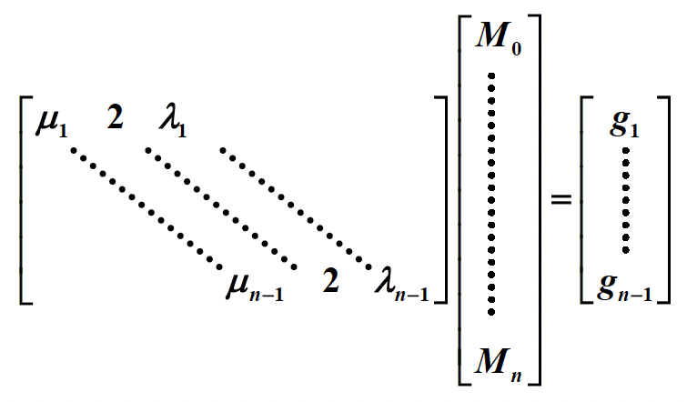
</div>

- **固定边界**(clamped boundary)：$S'(a) = y_0', S'(b) = y_n'$
    - $[a, x_1]$: $S_1'(x) = -M_0 \dfrac{(x_1 - x)^2}{2h_1} + M_1 \dfrac{(x - a)^2}{2h_1} + f[x_0, x_1] - \dfrac{M_1 - M_0}{6}h_1$
    - 在 $[x_{n-1}, b]$ 上 $S_n'$ 也是类似的：$\begin{cases}2M_0 + M_1 = \dfrac{6}{h_1} (f[x_0, x_1] - y_0') = g_0 \\ M_{n-1} + 2M_n = \dfrac{6}{h_n} (y_n' - f[x_{n-1}, x_n]) = g_n\end{cases}$

    ??? code "算法：固定三次样条"

        <div style="text-align: center">
            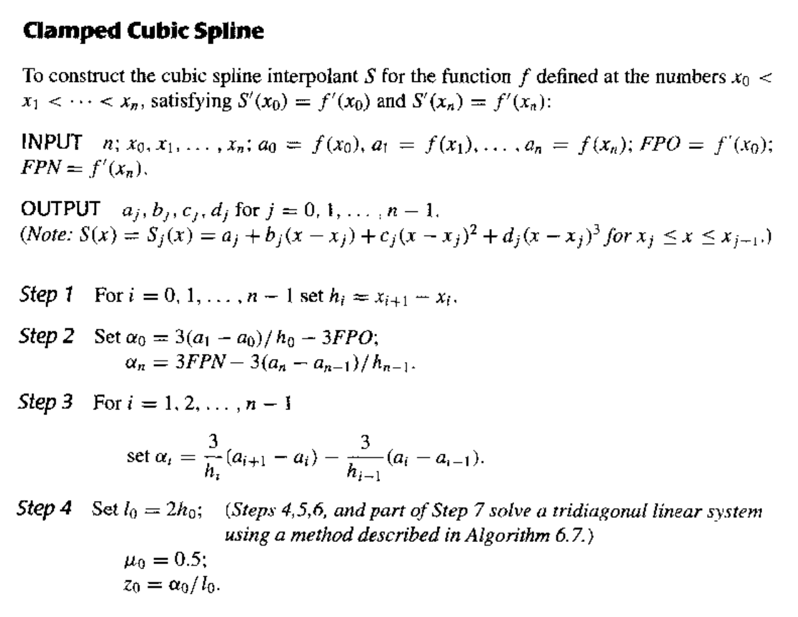
        </div>

        <div style="text-align: center">
            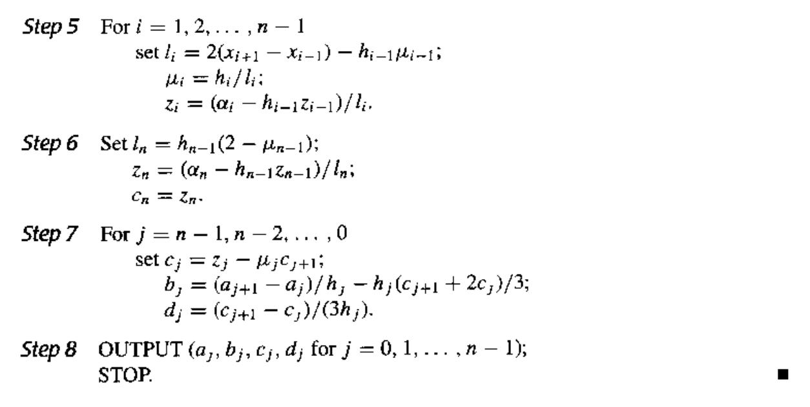
        </div>

- **自由边界**(free boundary)：$S''(a) = y_0'' = M_0, S''(b) = y_n'' = M_n$，且 $M_0 = M_n = 0$ 时
    - 那么 $\lambda_0 = 0, g_0 = 2y_0'';\ \mu_n = 0, g_n = 2y_n''$
    - 此时的样条称为**自然样条**(natural spline)

    ??? code "算法：自然三次样条"

        <div style="text-align: center">
            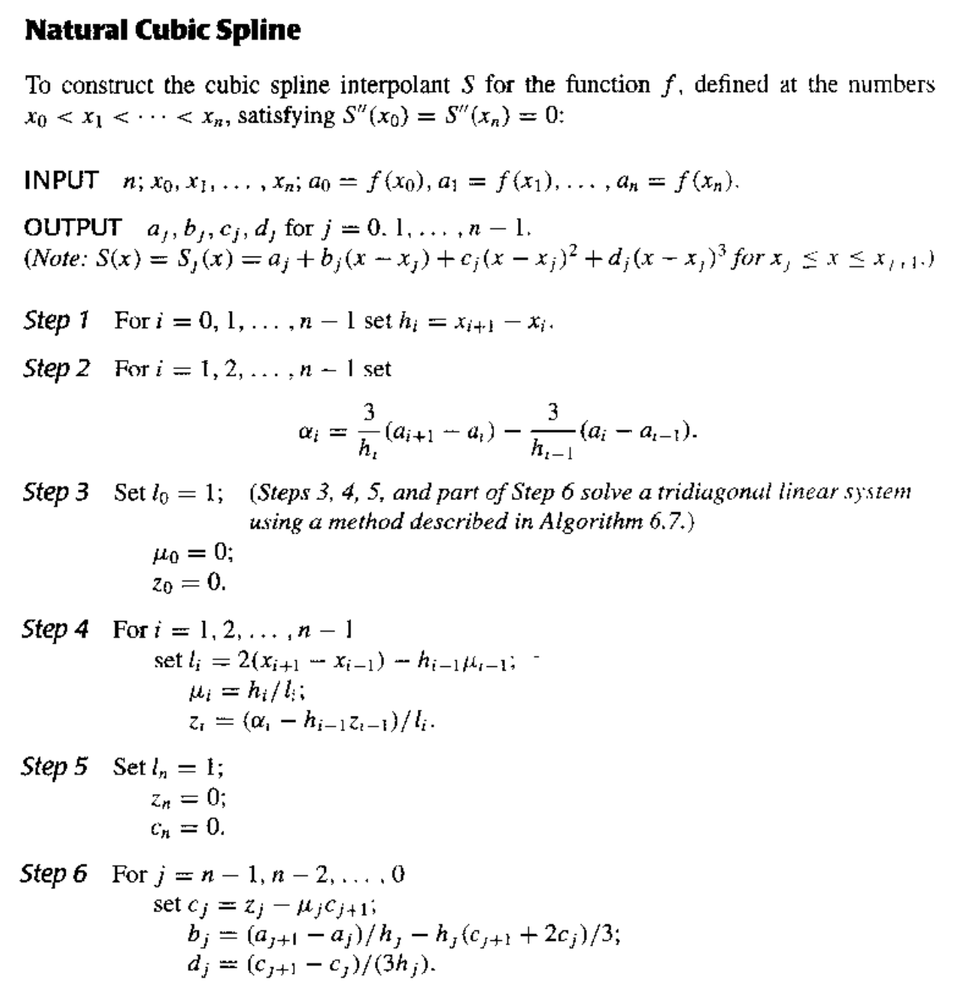
        </div>

        <div style="text-align: center">
            
        </div>

- **周期边界**(periodic boundary)：如果 $f$ 是周期函数，即 $y_n = y_0$ 且 $S'(a^+) = S'(b^-) \Rightarrow M_0 = M_n$

    <div style="text-align: center">
        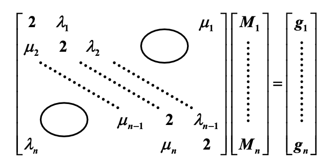
    </div>

!!! note "注"

    - 只要系数矩阵是严格对角占优的，那么三次样条能通过边界被**唯一**确定
    - 如果 $f \in C[a, b]$ 且 $\dfrac{\max h_i}{\min h_i} \le C < \infty$，那么当 $h_i \rightarrow 0$ 时，$S(x) \xrightarrow{\text{uniform}} f(x)$。也就是说，在保证不增加样条阶数的情况下，可通过增加节点个数来提升近似精度

!!! code "算法概述：三次样条插值法"

    1. 计算 $\mu_j, \lambda_j, g_j$
    2. 求解 $M_j$
    3. 找到包含 $x$ 的子区间，即找到相应的 $j$
    4. 通过 $S_j(x)$ 得到 $f(x)$ 的近似值

>对应的[作业练习](hw.md#chap-3-interpolation-and-polynomial-approximation)📝

>对应[小测7](quizzes.md)💯