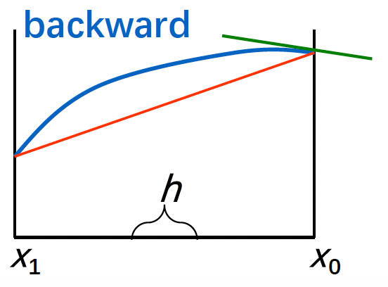
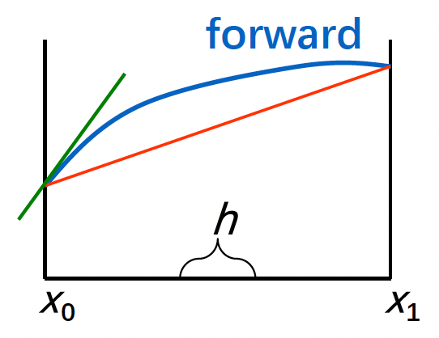
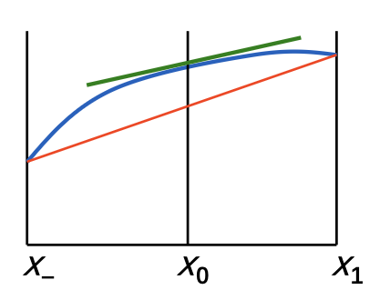
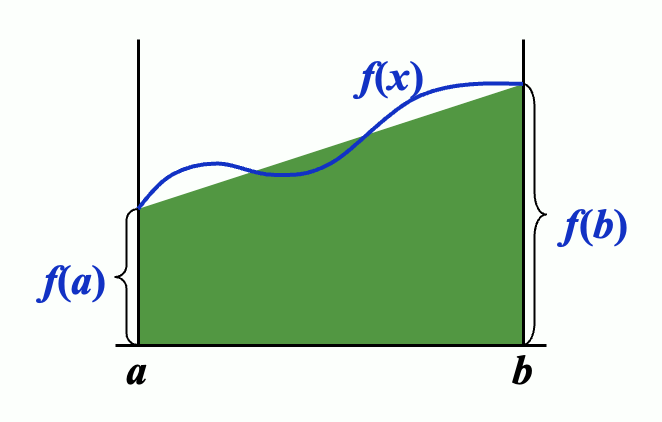
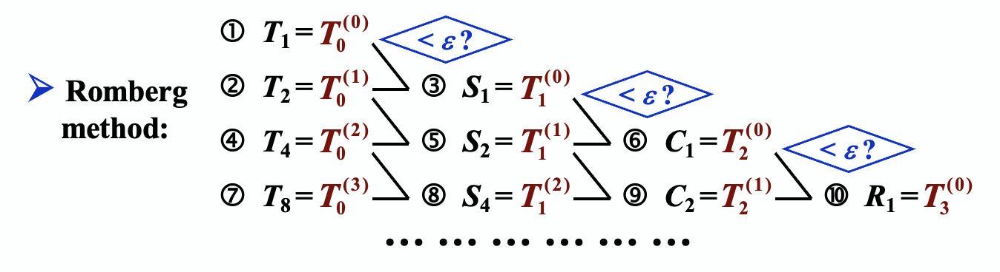

# Chap 4: Numerical Differentiation and Integration

## Numerical Differentiation

目标：对于给定的 $x_0$，近似计算 $f'(x_0)$（即**数值微分**(numerical differentiation)）

微分计算公式：$f'(x_0) = \lim\limits_{h \rightarrow 0} \dfrac{f(x_0 + h) - f(x_0)}{h}$


{ width=25% align=right }
{ width=25% align=right }

- 后向：$f'(x_0) \approx \dfrac{f(x_0 + h) - f(x_0)}{h}$
- 前向：$f'(x_0) \approx \dfrac{f(x_0) - f(x_0 - h)}{h}$

<br/>
<br/>
<br/>

现在我们用 $f(x)$ 的带有插值点 $x_0, x_0 + h$ 的拉格朗日多项式来近似表示 $f(x)$：

$$
\begin{align}
f(x) & = \dfrac{f(x_0)(x - x_0 - h)}{x_0 - x_0 - h} + \dfrac{f(x_0 + h)(x - x_0)}{x_0 + h - x_0} \notag \\
& + \dfrac{(x - x_0)(x - x_0 - h)}{2} f''(\xi_x) \notag \\
f'(x) & = \dfrac{f(x_0 + h) - f(x_0)}{h} + \dfrac{2(x - x_0) - h}{2} f''(\xi_x) \notag \\
& + \dfrac{(x - x_0)(x - x_0 - h)}{2} \cdot \dfrac{d}{dx} [f''(\xi_x)] \notag
\end{align}
$$

因此 $f'(x_0) = \dfrac{f(x_0 + h) - f(x_0)}{h} - \dfrac{h}{2}f''(\xi)$

---
接下来用插值点为 $\{x_0, x_1, \dots, x_n\}$ 的拉格朗日多项式来近似表示 $f(x)$

$$
\begin{align}
f(x) & = \sum\limits_{k=0}^n f(x_k) L_k(x) + \dfrac{(x - x_0) \dots (x - x_n)}{(n+1)!} f^{(n+1)}(\xi_x) \notag \\
f'(x_j) & = \sum\limits_{k=0}^n f(x_k)L_k'(x_j) + \dfrac{f^{(n+1)}(\xi_j)}{(n+1)!} \prod\limits_{\substack{k = 0 \\ k \ne j}}^n (x_j - x_k) \notag
\end{align}
$$

!!! note "注"

    - 一般来说，更多的评估点（即这里的插值点）会带来更大的近似精度
    - 但另一方面，随着评估点的增加，舍入误差也在变大，因此数值微分是**不稳定的**！

??? example "例子"

    === "例1"

        === "题目"

            给定三个点 $x_0, x_0 + h, x_0 + 2h$，请求得关于每个点的三点公式，然后选出对于 $f'(x)$ 而言最佳的三点公式。

        === "解答"

            $$
            \begin{align}
            f'(x_0) & = \dfrac{1}{h}\Big[-\dfrac{3}{2} f(x_0) + 2f(x_0 + h) - \dfrac{1}{2}f(x_0 + 2h) \Big] + \dfrac{h^2}{3} f^{(3)}(\xi_0) \notag \\
            f'(x_0 + h) & = \dfrac{1}{h} \Big[ -\dfrac{1}{2} f(x_0) + \dfrac{1}{2} f(x_0 + 2h) \Big] - \dfrac{h^2}{6} f^{(3)}(\xi_1) \notag \\
            \Rightarrow f'(x_0) & = \dfrac{1}{2h} \Big[f(x_0 + h) - f(x_0 - h) \Big] - \dfrac{h^2}{6} f^{(3)} (\xi_1) \notag 
            \end{align}
            $$

            <div style="text-align: center">
                
            </div>

    === "例2"

        === "题目"

            寻找近似计算 $f''(x_0)$ 的方式。

        === "解答"

            考虑在 $x_0$ 处的 $f(x_0 + h), f(x_0 - h)$ 的泰勒展开式：

            $$
            \begin{align}
            f(x_0 + h) & = f(x_0) + f'(x_0) h + \dfrac{1}{2}f''(x_0)h^2 + \dfrac{1}{6} f'''(x_0) h^3 + \dfrac{1}{24} f^{(4)} (\xi_1) h^4 \notag \\
            f(x_0 - h) & = f(x_0) - f'(x_0) h + \dfrac{1}{2}f''(x_0)h^2 - \dfrac{1}{6} f'''(x_0) h^3 + \dfrac{1}{24} f^{(4)} (\xi_{-1}) h^4 \notag
            \end{align}
            $$

            因此：$f''(x_0) = \dfrac{1}{h^2} [f(x_0 - h) - 2f(x_0) + f(x_0 + h)] - \dfrac{h^2}{12} f^{(4)} (\xi)$


## Elements of Numerical Integration

目标：近似计算 $I = \int_a^b f(x) dx$（即**数值求积**(numerical quadratrue)）

思路：使用 $f(x)$ 的**拉格朗日插值多项式**——从区间 $[a, b]$ 上选择一组不同的点 $a \le x_0 < x_1 \dots < x_n \le b$。拉格朗日多项式为 $P_n(x) = \sum\limits_{k=0}^n f(x_k) L_k(x)$，因此：

$$
\int_a^b f(x) dx \approx \sum\limits_{k=0}^n f(x_k) \int_a^b L_k(x) dx
$$

令 $A_k = \int_a^b L_k(x) dx = \int_a^b \prod\limits_{j \ne k} \dfrac{x - x_j}{x_k - x_j} dx$

误差 $R[f]$ 为：

$$
\begin{align}
& R[f] \notag \\
= & \int_a^b f(x) dx - \sum\limits_{k=0}^n A_kf(x_k) \notag \\
= & \int_a^b [f(x) - P_n(x)] dx = \int_a^b R_n(x) dx \notag \\
= & \int_a^b \dfrac{f^{(n+1)}(\xi_x)}{(n+1)!} \prod\limits_{k=0}^n(x - x_k)dx \notag
\end{align}
$$

!!! definition "定义"

    求积公式的**精度**(degree of accuracy/precision)为最大的正整数 $n$，使得公式对于每个 $x^k(k = 0, 1, \dots, n)$ 都是精确的。

??? example "例子"

    === "题目"

        考虑在 $[a, b]$ 上的线性插值，我们有 $P_1(x) = \dfrac{x - b}{a - b}f(a) + \dfrac{x - a}{b - a}f(b)$。可以得到：

        - $A_1 = A_2 = \dfrac{b - a}{2}$
        - $\int_a^b f(x) dx \approx \dfrac{b - a}{2}[f(a) + f(b)]$

        请计算上述公式的精度。

    === "解答"

        考虑 $x^k(k = 0, 1, \dots)$：

        - $x^0$：$\int_a^b 1dx = b - a = \dfrac{b - a}{2}[1 + 1]$
        - $x^1$：$\int_a^b xdx = \dfrac{b^2 - a^2}{2} = \dfrac{b - a}{2}[a + b]$
        - $x^2$：$\int_a^b x^2dx = \dfrac{b^3 - a^3}{3} = \dfrac{b - a}{2}[a^2 + b^2]$

        <div style="text-align: center">
            
        </div>

        因此精度阶数 = 1

---
对于等间距的节点 $x_i = a + ih, h = \dfrac{b - a}{n}, i = 0, 1, \dots, n$

$$
\begin{align}
A_i & = \int_{x_0}^{x_n} \prod\limits_{j \ne i} \dfrac{x - x_j}{x_i - x_j} dx \notag \\
& = \int_0^n \prod\limits_{i \ne j} \dfrac{(t - j)h}{(i - j)h} \times h dt = \dfrac{(b - a)(-1)^{n-i}}{ni!(n - i)!} \int_0^n \prod\limits_{i \ne j} (t - j) dt \notag 
\end{align}
$$

!!! note "注"

    科茨系数不取决于 $f(x)$ 或 $[a, b]$，而仅由 $n, i$ 决定。因此我们可以从一张表中找出这些系数。上述公式称为**牛顿-科茨公式**(Newton-Cotes formula)

- $n = 1$
    - $C_0^{(1)} = C_1^{(1)} = \dfrac{1}{2}$
    - $\int_a^b f(x) dx \approx \dfrac{b - a}{2}[f(a) + f(b)]$（称为**梯形法则**(trapezoidal rule)）
    - $R[f] = \int_a^b \dfrac{f''(\xi_x)}{2!}(x-a)(x-b) dx = -\dfrac{1}{12}h^3f''(\xi)$
    - $\xi \in [a, b], h = \dfrac{b - a}{1}$
    - 精度 = 1
- $n = 2$
    - $C_0^{(2)} = \dfrac{1}{6}, C_1^{(2)} = \dfrac{2}{3}, C_2^{(2)} = \dfrac{1}{6}$
    - $\int_a^b f(x) dx \approx \dfrac{b - a}{6}[f(a) + 4f(\dfrac{a+b}{2}) + f(b)]$（称为**辛普森法则**(Simpson's rule)）
    - $R[f] = -\dfrac{1}{90} h^5 f^{(4)}(\xi)$
    - $\xi \in (a, b), h = \dfrac{b - a}{2}$
    - 精度 = 3
- $n = 3$：**辛普森 3/8 法则**，精度 = 3，$R[f] = -\dfrac{3}{80}h^5 f^{(5)}(\xi)$
- $n = 4$：**科茨法则**(Cotes' Rule)，精度 = 5，3，$R[f] = -\dfrac{8}{945}h^7 f^{(6)}(\xi)$

!!! theorem "定理"

    对于使用 $n+1$ 个点的牛顿-科茨公式，$\exists \xi \in (a, b)$，使得：

    $$
    \int_a^b f(x) dx = \sum\limits_{k=0}^n A_k f(x_k) + \dfrac{h^{n+3}f^{(n+2)}(\xi)}{(n+2)!} \int_0^n t^2(t - 1) \dots (t - n) dt
    $$

    - 如果 $n$ 为偶数，那么 $f \in C^{n+2}[a, b]$ 且 $\int_a^b f(x) dx = \sum\limits_{k=0}^n A_k f(x_k) + \dfrac{h^{n+2}f^{(n+1)}(\xi)}{(n+1)!} \int_0^n t(t - 1) \dots (t - n) dt$
    - 如果 $n$ 为奇数，那么  $f \in C^{n+1}[a, b]$


## Compotsite Numerical Integration

由于高阶多项式的密切性质，我们用**分段**(piecewise)插值的方式来近似 $f(x)$。而这个方式用到了低阶的牛顿-科茨公式。


### Composite Trapezoidal Rule

**复合梯形公式**(composite trapezoidal rule)涉及到的变量有：$h = \dfrac{b-a}{n}, x_k = a + kh\ (k=0, \dots, n)$。

我们将梯形公式作用在每个区间 $[x_{k-1}, x_k]$ 上，即：

$$
\int_{x_{k-1}}^{x_k} f(x)dx \approx \dfrac{x_k - x_{k-1}}{2} [f(x_{k-1}) + f(x_k)], k = 1, \dots, n \Rightarrow \\
\int_a^b f(x)dx \approx \sum\limits_{k=1}^n \dfrac{h}{2}[f(x_{k-1}) + f(x_k)] = \dfrac{h}{2}\Big[f(a) + 2\sum\limits_{k=1}^{n-1} f(x_k) + f(b) \Big] = \textcolor{cornflowerblue}{T_n} \\
\begin{align}
R[f] & = \sum\limits_{k=1}^n \Big[-\dfrac{h^3}{12} f''(\xi_k)\Big] = -\dfrac{h^2}{12}(b-a) \dfrac{\sum\limits_{k=1}^n f''(\xi_k)}{n} \notag \\
& = -\dfrac{h^2}{12}(b-a) f''(\xi), \xi \in (a, b) \notag
\end{align}
$$

>$R[f]$ 的公式涉及到**中值定理**(MVT)。


### Composite Simpson's Rule

**复合辛普森公式**(composite Simpson rule)涉及到的变量和复合梯形公式一致：$h = \dfrac{b-a}{n}, x_k = a + kh\ (k=0, \dots, n)$。

我们将辛普森公式作用在每个区间 $[x_{k-1}, x_k]$ 上，即：

$$
\int_{x_{k-1}}^{x_k} f(x)dx \approx \dfrac{h}{6} [f(x_{k}) + 4 f(x_{k+\frac{1}{2}}) + f(x_{k+1})], k = 1, \dots, n \Rightarrow \\
\int_a^b f(x)dx \approx \dfrac{h}{6}\Big[f(x_a) + 4\sum\limits_{k=0}^{n-1}f(x_{k+\frac{1}{2}}) + 2\sum\limits_{k=0}^{n-2}f(x_{k+1}) + f(x_b)\Big] = \textcolor{cornflowerblue}{S_n} \\
R[f] = -\dfrac{b-a}{180} \Big(\dfrac{h}{2}\Big)^4 f^{(4)}(\xi)
$$

!!! note "注"

    为了简化记号，我们令 $n' = 2n$，那么 $h' = \dfrac{b-a}{n'} = \dfrac{h}{2}, x_k = a+kh'$，所以：

    $$
    S_n = \dfrac{h'}{3}[f(a) + 4 \sum\limits_{odd\ k} f(x_k) + 2 \sum\limits_{even\ k} f(x_k) + f(b)]
    $$

---
上述的复合集成技术都是**稳定的**。来看下面这个例子：

???+ example "例子"

    考虑在 $[a, b]$ 上有 $n$ 个子区间的辛普森法则。假设 $f(x_i)$ 由 $f^*(x_i)$ 近似，满足 $f(x_i) = f^*(x_i) + \varepsilon_i\ (i = 0, \dots, n)$，那么累积误差为：

    $$
    e(h) = \Big|\dfrac{h}{3}[\varepsilon_0 + 4 \sum\limits_{odd\ k} \varepsilon_k + 2 \sum\limits_{even\ k} \varepsilon_k + \varepsilon_n]\Big|
    $$

    若 $|\varepsilon_i| < \varepsilon\ (i = 0, \dots, n)$，那么：

    $$
    e(h) < \dfrac{h}{3} [\varepsilon + 4(n/2)\varepsilon + 2(n/2-1)\varepsilon + \varepsilon] = nh\varepsilon = (b-a)\varepsilon
    $$

    可以看到，当我们修正分区，以确保准确性时，增加的计算量**不会**带来更多的舍入误差。

??? question "讨论"

    === "题目"

        使用 $n=8$ 梯形法则和辛普森法则来近似 $\pi = \int_0^1 \dfrac{4}{1+x^2} dx$。

    === "答案"

        $$
        \begin{align}
        T_8 & = \dfrac{1}{16}\Big[f(0) + 2\sum\limits_{k=1}^7f(x_k) + f(1)\Big] \quad \text{where } x_k = \dfrac{k}{8} \notag \\
        & = \textcolor{green}{3.1}\textcolor{red}{383988494} \notag
        \end{align} \\
        \begin{align}
        S_4 & = \dfrac{1}{24}\Big[f(0) + 4\sum\limits_{odd}f(x_k)+ 2\sum\limits_{even}f(x_k) + f(1)\Big] \quad \text{where } x_k = \dfrac{k}{8} \notag \\
        & = \textcolor{green}{3.141592}\textcolor{red}{502} \notag
        \end{align}
        $$

        在编程的时候，我们通常会将一个子区间划分为两个均等宽度的更小的子区间。也就是说，令 $n = 2^k\ (k = 0, 1, \dots)$

        当 $k=9$ 时，$T_{512} = \textcolor{green}{3.141592}\textcolor{red}{02}$

        $\dfrac{4}{3}T_8 - \dfrac{1}{3}T_4 = \textcolor{green}{3.141592}\textcolor{red}{502} = S_4$


## Romberg Integration

回顾一下梯形法则的误差公式：$R_n[f] = -\dfrac{h^2}{12}(b-a)f''(\xi)$。当我们将每个子区间的长度缩减至原来的一半时，

$$
R_{2n}[f] = -\Big(\dfrac{h}{2}\Big)^2 \dfrac{1}{12}(b-a)f''(\xi') \approx \dfrac{1}{4}R_n[f]
$$

从而得到：$\dfrac{I - T_{2n}}{I - T_n} \approx \dfrac{1}{4}$，解得 $I \approx \dfrac{4T_{2n} - T_n}{4 - 1} = \dfrac{4}{3}T_{2n} - \dfrac{1}{3}T_n = S_n$

一般情况下：

- $\dfrac{4T_{2n} - T_n}{4 - 1} = S_n$
- $\dfrac{4^2S_{2n} - S_n}{4^2 - 1} = C_n$
- $\dfrac{4^3C_{2n} - C_n}{4^3 - 1} = R_n$ -> **Romberg 序列**(Romberg sequence)

**Rombert 法**如下所示：

<div style="text-align: center">
    
</div>

??? code "算法：Romberg"

    近似积分 $I = \int_a^b f(x) dx$，选择整数 $n > 0$

    - 输入：端点 $a, b$；整数 $n$
    - 输出：数组 $R$（按行计算 $R$；只保留最后2行）

    ```c
    Step 1  Set h = b - a;
                R[1][1] = h / 2(f(a) + f(b));
    Step 2  Output(R[1][1]);
    Step 3  for i = 2, ..., n do steps 4-8:
        // approximation from Trapezoidal method
        Step 4  Set R[2][1] = 1/2 * [R[1][1] + h * sum(k=1, pow(2, i-2), f(a + (k - 0.5) * h))];
        Step 5  for j = 2, ..., i:
                    // extrapolation
                    set R[2][j] = R[2][j-1] + (R[2][j-1] - R[1][j-1]) / (pow(4, j-1) - 1);
        Step 6  Output(R[2][j] for j = 1, 2, ..., i);
        Step 7  Set h /= 2;
        Step 8  for j = 1, 2, ..., i set R[1][j] = R[2][j];    // update row 1 of R
    Step 9  STOP.
    ```


## Richardson's Extrapolation

目标：使用低阶公式获取高精度的结果。

假设对于某些 $h \ne 0$，我们有公式 $T_0(h)$，用于近似未知量 $I$，并且其截断误差的形式为：

$$
T_0(h) - I = \alpha_1 h + \alpha_2 h^2 + \alpha_3 h^3 + \dots
$$

用 $h$ 一半的值替代自身，我们有：

$$
T_0(h/2) - I = \alpha_1 (h/2) + \alpha_2 (h/2)^2 + \alpha_3 (h/2)^3 + \dots
$$

结合上述两个公式，我们就可以将精度从 $O(h)$ 提升至 $O(h^2)$：

$$
\dfrac{2T_0(\frac{h}{2}) - T_0(h)}{2 - 1} - I = -\dfrac{1}{2}\alpha_2 h^2 - \dfrac{3}{4} \alpha_3 h^3 - \dots
$$

令 $T_1 = \dfrac{2T_0(\frac{h}{2}) - T_0(h)}{2 - 1} = I + \beta_1 h^2 + \beta_2 h^3 + \dots$。类似地，我们可以将精度提升至 $O(h^3)$：

$$
T_2 = \dfrac{2^2T_1(\frac{h}{2}) - T_1(h)}{2^2 - 1} = I + \gamma_1 h^3 + \gamma_2 h^4 + \dots
$$

实际上，我们可以将精度可以提升到任意阶数 $m+1$：

$$
T_m = \dfrac{2^mT_{m-1}(\frac{h}{2}) - T_{m-1}(h)}{2^m - 1} = I + \delta_1 h^{m+1} + \delta_2 h^{m+2} + \dots
$$


## Adapative Quadrature Methods

目标：预测函数变化量，根据变化的需求调整步幅。

前面介绍的复合积分方法的缺点是：对所有区间递归划分子区间，这样计算量太大，而且还有产生了许多不必要的计算，这很浪费。因此，我们采用一种仅对具有**较大误差**(large error)的区间进行划分的方法，避免额外的计算。我们称这样的方法为**自适应求积方法**(adapative quadrature mehtods)。

那么什么算“较大误差”呢？一种简单的确定策略是使用 $\int_a^b f(x) dx$ 的总误差 $\varepsilon$ 来确定边界：在长度为 $h$ 的区间中，误差应该要小于 $h \dfrac{\varepsilon}{b - a}$。当误差超过这个值时，我们就认为是较大误差，需要继续划分该区间。

接下来的问题就是如何估计一个区间的误差。这里我们暂时仅考虑辛普森法则下的误差估计——即如何估计：

$$
\varepsilon(f, a, b) \approx \int_a^b f(x)dx - S(a, b) = \dfrac{h^5}{90} f^{(4)}(\xi)
$$

其中 $h = \dfrac{b-a}{2}, \xi \in [a, b]$。

这个问题的答案在例2中给出。

??? example "例子"

    === "例1"

        !!! play "动画演示"

            <div style="text-align: center">
                
            </div>

    === "例2"

        考虑基于复合辛普森法则的自适应方法：

        $$
        \int_a^b f(x)dx = S(a, b) - \dfrac{h^5}{90}f^{(4)}(\xi)
        $$

        其中 $S(a, b) = \dfrac{h}{3}[f(a) + 4f(a + h) + f(b)], h = \dfrac{b-a}{2}$。令：

        $$
        \begin{align}
        S\Big(a, \dfrac{a+b}{2}\Big) = \dfrac{h}{6}[f(a) + 4f(a + h/2) + f(a + h)] \notag \\
        S\Big(\dfrac{a+b}{2}, b\Big) = \dfrac{h}{6}[f(a + h) + 4f(a + 3h/2) + f(b)] \notag
        \end{align}
        $$

        那么：

        $$
        \int_a^b f(x) dx = S\Big(a, \dfrac{a+b}{2}\Big) + S\Big(\dfrac{a+b}{2}, b\Big) - \dfrac{1}{16} \times \dfrac{h^5}{90}f^{(4)}(\eta) \\
        \begin{align}
        &\ \Big| \int_a^b f(x) dx - S\Big(a, \dfrac{a+b}{2}\Big) - S\Big(\dfrac{a+b}{2}, b\Big) \Big| \notag \\
        \approx &\ \dfrac{1}{15} \Big|S(a, b) - S\Big(a, \dfrac{a+b}{2}\Big) - S\Big(\dfrac{a+b}{2}, b\Big) \Big| \notag \\
        < &\ \varepsilon \notag
        \end{align}
        $$

        可以看到，相比一般的辛普森法则，结合自适应方法后误差只有原来的 $\dfrac{1}{15}$ 🎉


## Gaussian Quadrature

目标：构造一个公式 $\int_a^b w(x) f(x) dx \approx \sum\limits_{k=0}^n A_k f(x_k)$，对于 $n+1$ 个点而言精度为 $2n+1$。

思路：确定 $2n+2$ 个未知量 $x_0, \dots, x_n;\ A_0, \dots, A_n$，使得公式在 $f(x) = 1, x, x^2, \dots, x^{2n+1}$ 上都是精确的。点 $x_0, \dots, x_n$ 被称为**高斯点**(Gaussian points)，这个方法被称为**高斯求积**(Gaussian quadrature)

??? question "讨论"

    === "题目"

        使用 $n = 1$ 的高斯求积近似表示 $\int_0^1 \sqrt{x} f(x) dx$。

    === "解答"

        假设 $\int_0^1 \sqrt{x} f(x) dx \approx A_0 f(x_0) + A_1 f(x_1)$。

        公式必须在 $f(x) = 1, x, x^2, x^3$ 上精确表示。计算 $\begin{cases}\frac{2}{3} = A_0 + A_1 \\ \frac{2}{5} = A_0 x_0 + A_1 x_1 \\ \frac{2}{7} = A_0 x_0^2 + A_1 x_1^2 \\ \frac{2}{9} = A_0x_0^3 + A_1 x_1^3\end{cases}$，解得：$\begin{cases}x_0 \approx 0.8212 \\ x_1 \approx 0.2899 \\ A_0 \approx 0.3891 \\ A_1 \approx 0.2776\end{cases}$

!!! theorem "定理"

    当且仅当 $W(x) = \prod\limits_{k=0}^n(x - x_k)$ 与所有阶数不超过 $n$ 的多项式正交时，$x_0, \dots, x_n$ 是**高斯点**。

    ??? proof "证明"

        - 若 $x_0, \dots, x_n$ 是高斯点，则公式 $\int_a^b w(x) f(x) dx \approx \sum\limits_{k=0}^nA_kf(x_k)$ 的精度至少为 $2n+1$。那么对于任意多项式 $P_m(x)\ (m \le n)$，$P_m(x) W(x)$ 的阶数不超过 $2n+1$。因此上述公式对于 $P_m(x) W(x)$ 而言是精确的，也就是说：

            $$
            \int_a^b w(x) P_m(x) W(x) dx = \sum\limits_{k=0}^n A_k P_m(x_k) W(x_k) = 0
            $$

        - 要证明 $x_0, \dots, x_n$ 是高斯点，我们需要证明公式对任意多项式 $P_m(x)\ (m \le 2n + 1)$ 是精确的。令 $P_m(x) = W(x) q(x) + r(x)$，那么 
        
            $$
            \begin{align}
            \int_a^n w(x) P_m(x) dx & = \int_a^n w(x) W(x) q(x) dx + \int_a^n w(x) r(x) dx = \sum\limits_{k=0}^n A_k r(x_k) \notag \\
            & = \sum\limits_{k=0}^n A_k P_m(x_k) \notag
            \end{align}
            $$

正交多项式的集合 $\{\varphi_0, \varphi_1, \dots, \varphi_n, \dots\}$ 是线性独立的，且 $\varphi_{n+1}$ 和任何多项式 $P_m(x)\ (m \le n)$ 正交。所以，如果我们拿 $\varphi_{n+1}$ 作为 $W(x)$，那么 **$\varphi_{n+1}$ 的根**就是高斯点了。

??? example "例子"

    === "题目"

        使用高斯求积来近似计算 $\int_0^1 \sqrt{x} f(x) dx$，其中 $n = 1$

    === "解答"

        假设 $\int_0^1 \sqrt{x} f(x) dx \approx A_0 f(x_0) + A_1 f(x_1)$。

        1. 构造正交多项式 $\varphi_2$。令 $\varphi_0(x) = 1, \varphi_1(x) = x + a, \varphi_2(x) = x^2 + bx + c$
            - $(\varphi_0, \varphi_1) = 0 \Rightarrow \int_0^1 \sqrt{x} (x + a) dx = 0 \Rightarrow a = - \dfrac{3}{5}$
            - $(\varphi_0, \varphi_2) = 0 \Rightarrow \int_0^1 \sqrt{x} (x^2 + bx + c) dx = 0 \Rightarrow a = - \dfrac{10}{9}$
            - $(\varphi_1, \varphi_2) = 0 \Rightarrow \int_0^1 \sqrt{x} (x - \dfrac{3}{5})(x + bx + c) dx = 0 \Rightarrow a = \dfrac{5}{21}$
            - $\therefore \varphi_2(x) = x^2 - \dfrac{10}{9}x + \dfrac{5}{21}$

        2. 找到 $\varphi_2$ 的两个根，作为高斯点 $x_0, x_1$：$x_{0;1} = \dfrac{\frac{10}{9} \pm \sqrt{(\frac{10}{9})^2 - \frac{20}{21}}}{2}$

        3. 因为这个公式必须在 $f(x) = 1, x$ 上是精确的，所以我们能比较容易地求解 $A_0, A_1$ 的线性方程组

        最终结果为：$x_0 \approx 0.8212, x_1 \approx 0.2899, A_0 \approx 0.3891, A_1 \approx 0.2776$

        现在使用上述结果来近似计算$\int_0^1 \sqrt{x} e^x dx$

        $$
        \int_0^1 \sqrt{x} f(x) dx \approx A_0 e^{x_0} + A_1 e^{x_1} = 0.3891 \times e^{0.8212} + 0.2776 \times e^{0.2899} \approx 1.2555
        $$

        而 $\int_0^1 \sqrt{x} (2x-1) dx = \dfrac{2}{15}$ 是精确的。

一些特殊的正交多项式：

- **勒让德多项式**(Legendre polynomials)：定义在 $[-1, 1]$ 上且 $w(x) \equiv 1$

    $$
    P_k(x) = \dfrac{1}{2^k k!} \dfrac{d^k}{dx^k}(x^2 - 1)^k \quad \quad (P_k, P_l) = \begin{cases}0 & k \ne l \\ \dfrac{2}{2k+1} & k = l\end{cases}
    $$

    $P_0 = 1, P_1 = x, (k + 1)P_{k+1} = (2k + 1)xP_k - kP_{k-1}$

    使用 $P_{n+1}$ 的根的公式称为**高斯-勒让德求积公式**。

- **切比雪夫多项式**(Chebyshev polynomials)：定义在 $[-1, 1]$ 上且 $w(x) = \dfrac{1}{\sqrt{1 - x^2}}$

    $$
    T_k(x) = \cos (k \times \arccos x)
    $$

    $T_{n+1}$ 的根为 $x_k = \cos \Big(\dfrac{2k + 1}{2n + 2} \pi \Big) \quad (k = 0, \dots, n)$

    公式 $\int_{-1}^1 \dfrac{1}{\sqrt{1 - x^2}} f(x) dx = \sum\limits_{k=0}^n A_k f(x_k)$ 称为**高斯-切比雪夫求积公式**。

    - 注意到积分端点 $\pm 1$ 是积分上的**奇点**(singular points)，此时在等间距的点上使用牛顿-科茨公式会出现问题；而高斯积分能够避免这个问题。

>对应的[作业练习](hw.md#chap-4-numerical-differentiation-and-integration)📝