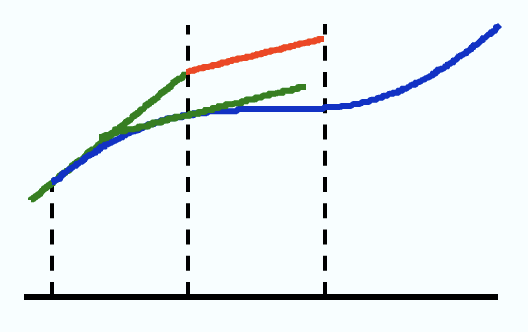
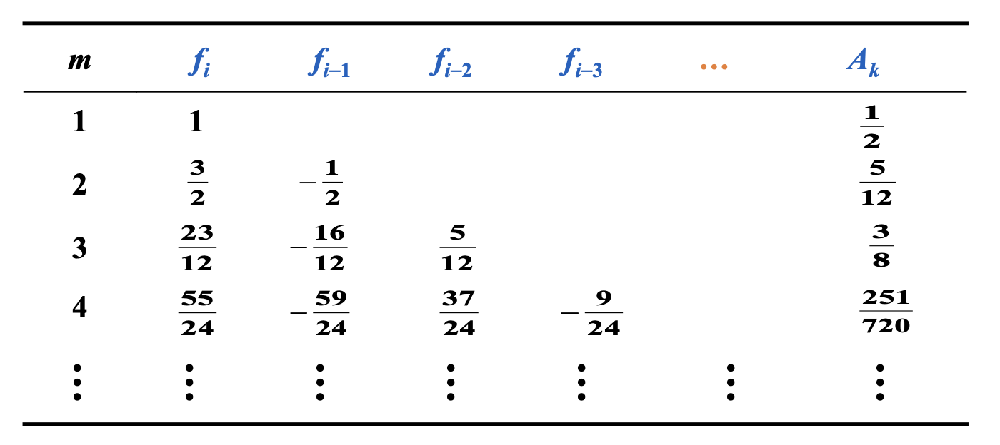
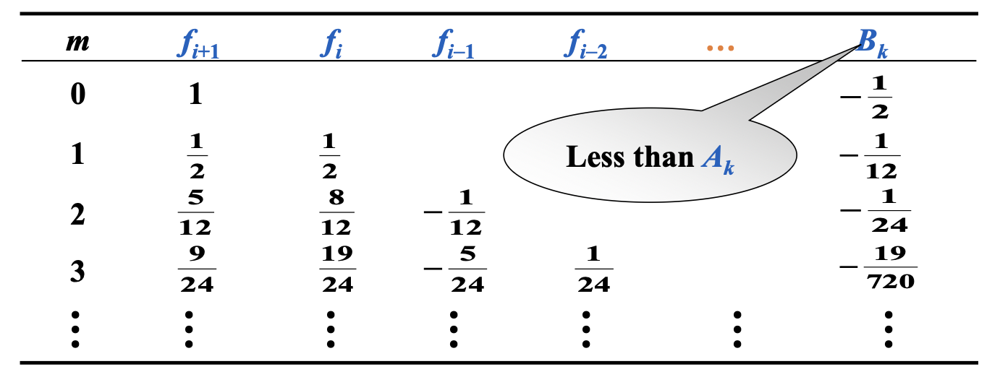
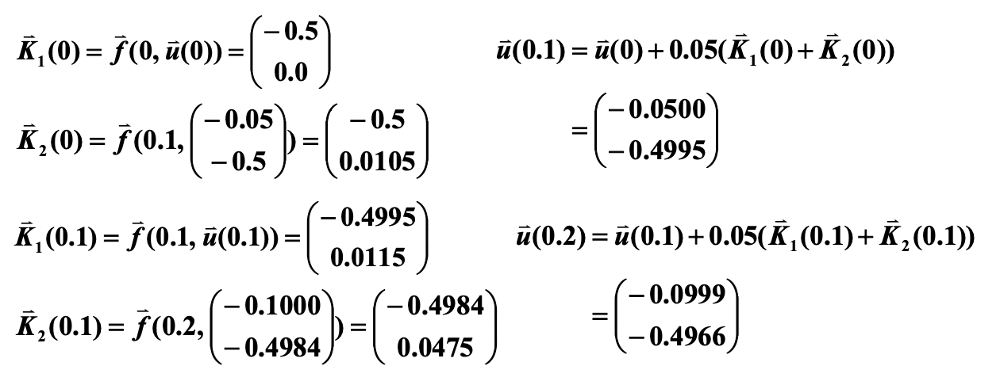
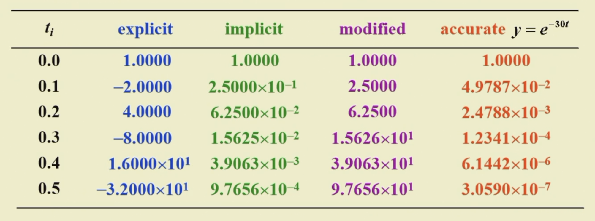
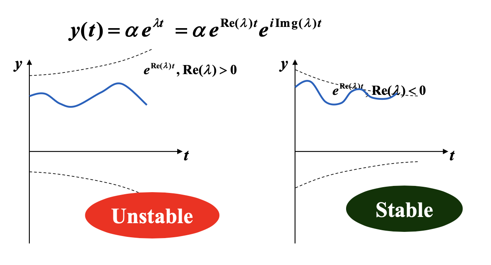
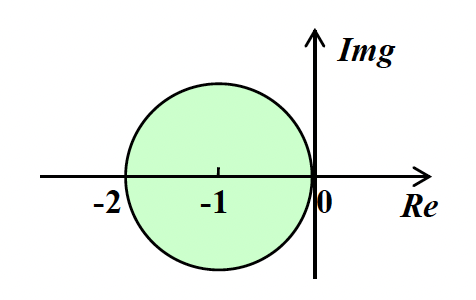
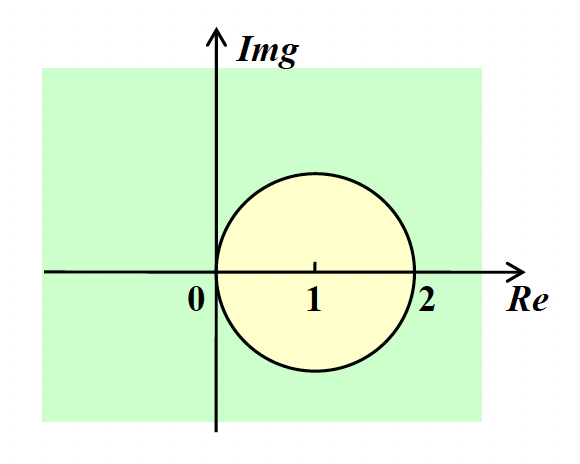
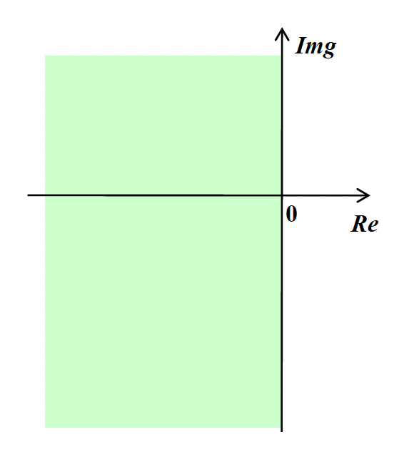
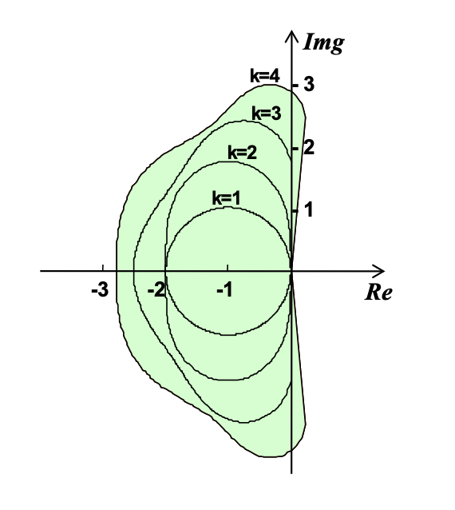

# Chap 5: Initial-Value Problems for Ordinary Differential Equations

## The Elementary Theory of Initial-Value Problems

1阶[常微分方程](https://en.wikipedia.org/wiki/Ordinary_differential_equation)(ordinary differential equations)的[**初值问题**](https://en.wikipedia.org/wiki/Initial_value_problem)(initial-value problems, IVP)：

$$
\begin{cases}
\dfrac{dy}{dx} = f(t, y), t \in [a, b] \\
y(a) = \alpha
\end{cases}
$$

目标：在一组网格点(mesh points) $a = t_0 < t_1 < \dots < t_n = b$ 上（通常是等间距的）计算 $y(t)$ 的近似值。也就是说，计算 $w_i \approx y(t_i) = y_i\ (i = 1, \dots, n)$。

!!! definition "定义"

    对于函数 $f(t, y)$，若存在常数 $L > 0$，满足：
    
    $$
    |f(t, y_1) - f(t, y_2)| \le L|y_1 - y_2|
    $$

    我们称该函数满足在变量 $y \in D \subset R^2$ 上的 **Lipschitz 条件**。

!!! theorem "定理"

    假设 $D = \{(t, y)\ |\ a \le t \le b, -\infty < y < \infty\}$，且 $f(t, y)$ 在 $D$ 上连续。若 $f$ 满足在变量 $y \in D$ 上的 Lipschitz 条件，那么初值问题

    $$
    y'(t) = f(t, y), a \le t \le b, y(a) = \alpha
    $$

    有唯一解 $y(t)$（$a \le t \le b$）。

!!! definition "定义"

    若初值问题

    $$
    y'(t) = f(t, y), a \le t \le b, y(a) = \alpha
    $$

    满足以下条件，我们称之为**适定性问题**(well-posed problem)：

    - 问题存在唯一解 $y(t)$
    - $\forall \varepsilon > 0$，存在正常数 $k(\varepsilon)$，使得当 $|\varepsilon_0| < \varepsilon$，并且 $\delta(t)$ 在 $[a, b]$ 上连续且 $|\delta(t)| < \varepsilon$ 时，对于

    $$
    z'(t) = f(t, z) + \delta(t), a \le t \le b, z(a) = \alpha + \varepsilon_0
    $$

    （上述式子称为扰动问题(perturbed problem)），存在唯一解 $z(t)$，满足 $|z(t) - y(t)| < k(\varepsilon) \cdot  \varepsilon\ (a \le t \le b)$

!!! theorem "定理"

    假设 $D = \{(t, y)\ |\ a \le t \le b, -\infty < y < \infty\}$，且 $f(t, y)$ 在 $D$ 上连续。若 $f$ 满足在变量 $y \in D$ 上的 Lipschitz 条件，那么初值问题

    $$
    y'(t) = f(t, y), a \le t \le b, y(a) = \alpha
    $$

    具有适定性(well-posed)。

 
## Euler's Method

>此处可以回顾前面提出的[目标](#the-elementary-theory-of-initial-value-problems)。

{ width=30% align=right }

$y'(t_0) \approx \dfrac{y(t_0 + h) - y(t_0)}{h}\ \Rightarrow\ y(t_1) \approx y(t_0) + hy'(t_0) = \alpha + hf(t_0, \alpha)$

**差分方程**(difference equations)：$\begin{cases}w_0 = \alpha \\ w_{i+1} = w_i + hf(t_i, w_i)\end{cases}\ (i = 0, \dots, n - 1)$

!!! theorem "定理"

    假设 $f$ 是连续的，且满足 Lipschitz 条件，其常数 $L \in D = \{(t, y)\ |\ a \le t \le b, -\infty < y < \infty \}$；且存在常数 $M, \forall\ a \le t \le b$，满足 $|y''(t)| \le M$。

    令 $y(t)$ 为初值问题 $y'(t) = f(t, y), a \le t \le b, y(a) = \alpha$ 的唯一解，且 $w_0, w_1, \dots, w_n$ 为通过欧拉法（对于某些正整数 $n$）得到的近似值，那么：

    $$
    |y_i - w_i| \le \dfrac{hM}{2L}[e^{L(t_i - a)} - 1] \quad (i = 0, 1, \dots, n)
    $$

!!! note "注"

    $y''(t)$ 可在不知道 $y(t)$ 的情况下被计算出来：

    $$
    y''(t) = \dfrac{d}{dt}y'(t) = \dfrac{d}{dt}f(t, y(t)) = \dfrac{\partial}{\partial t}f(t, y(t)) + \dfrac{\partial}{\partial y}f(t, y(t)) \cdot f(t, y(t))
    $$

代入舍入误差后，差分方程为：$\begin{cases}w_0 = \alpha \textcolor{red}{+ \delta_0} \\ w_{i+1} = w_i + hf(t_i, w_i) \textcolor{red}{+ \delta_{i+1}}\end{cases}(i = 0, \dots, n - 1)$

!!! theorem "定理"

    令 $y(t)$ 为初值问题 $y'(t) = f(t, y), a \le t \le b, y(a) = \alpha$ 的唯一解，且 $w_0, w_1, \dots, w_n$ 为使用上述差分方程得到的近似值。若 $|\delta_i| < \delta\ (i = 0, \dots, n)$，那么 $\forall\ i$

    $$
    |y_i - w_i| \le \dfrac{1}{L} \Big(\dfrac{hM}{2} + \dfrac{\delta}{h}\Big)[e^{L(t_i - a)} - 1] + |\delta_0|e^{L(t_i - a)}
    $$

    >其中 $h \ge \sqrt{2 \delta / M}$

## High Order Taylor Methods

!!! definition "定义"

    差分法 $\begin{cases}w_0 = \alpha \\ w_{i+1} = w_i + h\varphi(t_i, w_i)\end{cases} (i = 0, \dots, n - 1)$ 的**局部截断误差**(local truncation error)为：

    $$
    \tau_{i+1}(h) = \dfrac{y_{i+1} - (y_i + h\varphi(t_i, y_i))}{h} = \dfrac{y_{i+1} - y_i}{h} - \varphi(t_i, y_i) \quad (i = 0, \dots, n - 1)
    $$

!!! note "注"

    局部截断误差就是 $\dfrac{y_{i+1} - w_{i+1}}{h}$（基于假设 $w_i = y_i$）。

欧拉法的局部截断误差：

$$
\begin{align}
\tau_{i+1} & = \dfrac{y_{i+1} - w_{i+1}}{h} = \dfrac{[y_i + hy'(t_i) + \frac{h^2}{2}y''(\xi_i)] - [y_i + hf(t_i, y_i)]}{h} \notag \\
& = \dfrac{h}{2} y''(\xi_i) = O(h) \notag
\end{align}
$$

>所以欧拉法的**阶数为1**

!!! note "注"

    可通过 $n = 1$ 时泰勒展开式得到的欧拉法近似表示 $y(t)$。

高阶泰勒法公式为：

$$
y_{i+1} = y_i + hf(t_i, y_i) + \dfrac{h^2}{2} f'(t_i, y_i) + \dots + \dfrac{h^n}{n!}f^{(n-1)}(t_i, y_i) + \dfrac{h^{(n+1)}}{(n+1)!}f^{(n)}(\xi_i, y(\xi_i))
$$

对于阶数为 $n$ 的泰勒法，其对应的差分方程为：

$$
\begin{cases}w_0 = \alpha \\ w_{i+1} = w_i + hT^{(n)}(t_i, w_i)\end{cases} (i = 0, \dots, n - 1)
$$

其中 $T^{(n)}(t_i, w_i) = f(t_i, w_i) + \dfrac{h}{2}f'(t_i, w_i) + \dots + \dfrac{h^{n-1}}{n!} f^{(n-1)}(t_i, w_i)$

若 $y \in C^{n+1}[a, b]$，那么局部截断误差是 $O(h^n)$。

??? question "讨论"

    === "题目"

        应用 $n = 10$ 的 3 阶泰勒法，解决初值问题 $y' = y - t^2 + 1, 0 \le t \le 2, y(0) = 0.5$。

    === "解答"

        找到 $f$ 的前两个导数：

        - $f(t, y(t)) = y(t) - t^2 + 1$
        - $f'(t, y(t)) = y'(t) - 2t = y(t) - t^2 + 1 - 2t$
        - $f''(t, y(t)) = y'(t) - 2t - 2 = y(t) - t^2 - 2t - 1$

        得到：

        $$
        \begin{align}
        T^{(3)}(t_i, w_i) & = f(t_i, w_i) + \dfrac{h}{2} f'(t_i, w_i) + \dfrac{h^2}{6}f''(t_i, w_i) \notag \\
        & = \Big(1 + \dfrac{h}{2} + \dfrac{h^2}{6} \Big)(w_i - t_i^2 + 1) - \Big(1 + \dfrac{h}{3}\Big)ht_i - \dfrac{h^2}{3} \notag
        \end{align}
        $$

        通过3阶泰勒法，得到差分方程：$\begin{cases}w_0 = 0.5 \\ w_{i+1} = w_i + h\Big[\Big(1 + \dfrac{h}{2} + \dfrac{h^2}{6}\Big)(w_i - t_i^2 + 1) - \Big(1 + \dfrac{h}{3}ht_i - \dfrac{h^2}{3}\Big)\Big]\end{cases}$

        因为 $n = 10$，那么 $h = 0.2, t_i = 0.2i, w_{i+1} = 1.22133w_i - 0.00855i^2 - 0.00853i + 0.21867$。

### Other Euler's Methods

- **隐式欧拉法**(implicit Euler's method)
    - $y'(t_0) \approx \dfrac{y(t_0) - y(t_0 - h)}{h}\ \Rightarrow\ \textcolor{red}{y(t_1)} \approx y(t_0) + hy'(t_1) + \alpha + hf(t_1, \textcolor{red}{y(t_1)})$
    - 差分方程为 $\begin{cases}w_0 = \alpha \\ \textcolor{red}{w_{i+1}} = w_i + hf(t_{i+1}, \textcolor{red}{w_{i+1}})\end{cases} (i = 0, \dots, n - 1)$
    - 通常以迭代形式求解 $w_{i+1}$，其初始值通过显式法给出
    - 隐式欧拉法的局部截断误差为 $\tau_{i+1} = \dfrac{y_{i+1} - w{i+1}}{h} = -\dfrac{h}{2}y''(\xi_i) = O(h)$

- **梯形法**(trapezoidal method)
    - 差分方程为 $\begin{cases}w_0 = \alpha \\ \textcolor{red}{w_{i+1}} = w_i + \dfrac{h}{2}[f(t_i, w_i) + f(t_{i+1}, \textcolor{red}{w_{i+1}})]\end{cases} (i = 0, \dots, n - 1)$
    - 注：局部截断误差为 $O(h^2)$；但必须以迭代方式求解隐式方程。

- **两步法**(double-step method)
    - $y'(t_0) = \dfrac{1}{2h}[y(t_0 + h) - y(t_0 - h)] - \dfrac{h^2}{6}y^{(3)}(\xi_1)\ \Rightarrow\ y(t_2) \approx y(t_0) + 2hf(t_1, y(t_1))$
    - 差分方程为 $\begin{cases}w_0 = \alpha \\ w_{i+1} = w_{i-1} + 2hf(t_i, w_i)\end{cases} (i = 1, \dots, n - 1)$
    - 该方法要求两个初始点向前移动，故得其名；而先前讨论的方法都是**单步法**(single-step methods)。
    - 若假设 $w_{i-1} = y_{i-1}, w_i = y_i$，那么局部截断误差为 $O(h^2)$

!!! abstract "比较上述各法的优劣

    |方法|👍|👎|
    |:-:|:-:|:-:|
    |欧拉显式法|简单|低阶精度|
    |欧拉隐式法|稳定|低阶精度、耗时|
    |梯形法|更精确|耗时|
    |两步法|更精确、显式|要求一个额外的初始点|

## Runge-Kutta Methods

**Runge-Kutta 法**是一种具有高阶局部截断误差的单步方法，无需计算 $f$ 的导数。

思路：在这样的单步方法中，我们考虑一条在点 $(t_i, w_i), (t_{i+1}, w_{i+1})$ 之间的线段的斜率。我们可以通过**找到更好的斜率**来改善结果。

观察欧拉法：

$$
\begin{cases}
w_{i+1} & = w_i + h\Big[ \dfrac{1}{2} K_1 + \dfrac{1}{2} K_2 \Big] \\
K_1 & = f(t_i, w_i) \\
K_2 & = f(t_i + h, w_i + hK_1)
\end{cases}
$$

- 斜率是否必须是 $K_1, K_2$ 的平均值？
- 步幅是否必须为 $h$？

我们将其进一步泛化：

$$
\begin{cases}
w_{i+1} & = w_i + h[\textcolor{red}{\lambda_1} K_1 + \textcolor{red}{\lambda_2} K_2 ] \\
K_1 & = f(t_i, w_i) \\
K_2 & = f(t_i + \textcolor{red}{p}h, w_i + \textcolor{red}{p}hK_1)
\end{cases}
$$

我们要找到 $\lambda_1, \lambda_2, p$，使得该方法的局部阶段误差的阶数为2。

1. 写出 $K_2$ 在 $(t_i, y_i)$ 上的泰勒展开式：

    $$
    \begin{align}
    K_2 & = f(t_1 + ph, y_i + phK_1) \notag \\
    & = f(t_i, y_i) + phf_t(t_i, y_i) + phK_1f_y(t_i, y_i) + O(h^2) \notag \\
    & = y'(t_i) + phy''(t_i) + O(h^2) \notag 
    \end{align}
    $$

    ??? note "注"

        $$
        \begin{align}
        y''(t) & = \dfrac{d}{dt}f(t, y) \notag \\
        & = f_t(t, y) + f_y(t, y) \dfrac{dy}{dt} \notag \\
        & = f_t(t, y) + f_y(t, y)f(t, y) \notag
        \end{align}
        $$

2. 将 $K_2$ 代入到第一个式子中：

    $$
    \begin{align}
    w_{i+1} & = y_i + h\{\lambda_1 y'(t_i) + \lambda_2[y'(t_i) + phy''(t_i) + O(h^2)]\} \notag \\
    & = y_i + (\lambda_1 + \lambda_2) hy'(t_i) + \lambda_2 ph^2 y''(t_i) + O(h^3) \notag
    \end{align}
    $$

3. 找到 $\lambda_1, \lambda_2, p$，使得 $\tau_{i+1} = (y_{i+1} - w_{i+1}) / h = O(h^2)$

---
$$
\begin{align}
w_{i+1} & = y_i + (\lambda_1 + \lambda_2) hy'(t_i) + \lambda_2 ph^2 y''(t_i) + O(h^3) \notag \\
y_{i+1} & = y_i + hy'(t_i) + \dfrac{h^2}{2} y''(t_i) + O(h^3) \notag
\end{align}
$$

可以得到：$\lambda_1 + \lambda_2 = 1, \lambda_2 p = \dfrac{1}{2}$（3 个未知数，2 个方程）

所以有无穷多个解。而由这两个方程得到的一系列方法被称为 **2阶 Runge-Kutta 法**(Runge-Kutta method of order 2)。

!!! note "注"

    修改后的欧拉法就是龙格-库塔法的一种特殊情况（$p = 1, \lambda_1 = \lambda_2 = \dfrac{1}{2}$）

???+ note "其他方法"

    - **中点法**(midpoint method)：将从二阶泰勒法中的 $T^{(2)}(t, y)$ 用 $f(t + h / 2, y + (h / 2)f(t, y))$ 替换得到的差分方程法。

        $$
        \begin{cases}
        w_0 = \alpha \\
        w_{i+1} = w_i + hf(t_i + \dfrac{h}{2}, w_i + \dfrac{h}{2}f(t_i, w_i))
        \end{cases}
        \quad (i = 0, \dots, N - 1)
        $$

    - **改进欧拉法**(modified Euler method)：

        $$
        \begin{cases}
        w_0 = \alpha \\
        w_{i+1} = w_i + \dfrac{h}{2}[f(t_i, w_i) + f(t_{i+1}, w_i + hf(t_i, w_i))]
        \end{cases}
        \quad (i = 0, \dots, N - 1)
        $$

    - **Heun 法**：

        $$
        \begin{cases}
        w_0 = \alpha \\
        w_{i+1} = w_i + \dfrac{h}{4}[f(t_i, w_i) + 3f(t_i + \dfrac{2}{3}h, w_i + \dfrac{2}{3}hf(t_i, w_i))]
        \end{cases}
        \quad (i = 0, \dots, N - 1)
        $$

---
计算更高精度：

$$
\begin{cases}
w_{i+1} & = y_i + h[\textcolor{red}{\lambda_1} K_1 + \textcolor{red}{\lambda_2} K_2 + \dots + \textcolor{red}{\lambda_m} K_m] \\
K_1 & = f(t_i, w_i) \\
K_2 & = f(t_i + \textcolor{red}{\alpha_2} h, w_i + \textcolor{red}{\beta_{21}} hK_1) \\
K_3 & = f(t_i + \textcolor{red}{\alpha_3} h, w_i + \textcolor{red}{\beta_{31}} hK_1 + \textcolor{red}{\beta_{32}} hK_2) \\
\dots \\
K_m & = f(t_i + \textcolor{red}{\alpha_m} h, w_i + \textcolor{red}{\beta_{m1}} hK_1 + \textcolor{red}{\beta_{m2}} hK_2 + \dots + \textcolor{red}{\beta_{m, m-1}} hK_{m-1}) \\
\end{cases}
$$

最流行的是经典 4 阶 Runge-Kutta 法：

$$
\begin{cases}
w_{i+1} = w_i + \dfrac{h}{6}(K_1 + 2K_2 + 2K_3 + K_4) \\
K_1 = f(t_i, w_i) \\
K_2 = f(t_i + \dfrac{h}{2}, w_i + \dfrac{h}{2} K_1) \\
K_3 = f(t_i + \dfrac{h}{2}, w_i + \dfrac{h}{2} K_2) \\
K_4 = f(t_i + h, w_i + hK_3)
\end{cases}
$$

!!! note "注"

    - 在使用 Runge-KUtta 法时，主要的计算量在于求解 $f$。Butcher 已经帮我们建立好了每步求值次数与局部截断误差阶数之间的关系：

        |每步求值次数|2|3|4|5-7|8-9|n≥10|
        |:-:|:-:|:-:|:-:|:-:|:-:|:-:|
        |最佳可能的 LTE|$O(h^2)$|$O(h^3)$|$O(h^4)$|$O(h^{n-1})$|$O(h^{n-2})$|$O(h^{n-3})$|

    - 因为 Runge-Kutta 法时基于泰勒展开式的，所以 $y$ 不得不足够平滑，以获取在高阶方法下的更高的精度。通常低阶方法相比高阶方法会采用更小的步幅。

## Multistep Methods

思路：使用 $y, y'$ 在多个网格点(mesh points)上的线性组合，以得到更好的近似值 $y(t_{i+1})$。

**多步法**(multistep method)的一般形式如下：

$$
w_{i+1} = \textcolor{red}{a_{m-1}} w_i + \textcolor{red}{a_{m-2}} w_{i-1} + \dots + \textcolor{red}{a_0} w_{i+1-m} + h[\textcolor{red}{b_m} f_{i+1} + \textcolor{red}{b_{m-1}} f_i + \dots + \textcolor{red}{b_0} f_{i+1-m}]
$$

- 在隐式法中，$b_m \ne 0$
- 在显式法中，$b_m = 0$

具体方法：从积分中获取。在 $[t_i, t_{i+1}]$ 上对 $y'(t) = f(t, y)$ 进行积分，得到：

$$
y(t_{i+1}) - y(t_i) = \int_{t_i}^{t_{i+1}} f(t, y(t)) dt
$$

关键是**近似计算积分**。不同的近似方法会得到不同的差分方程。

### Adams-Bashforth Explicit $m$-step Technique

使用**牛顿后向差分**公式，在 $(t_i, f_i), (t_{i-1}, f_{i-1}), \dots, (t_{i+1-m}, f_{i+1-m})$ 上对 $f$ 进行插值，并得到 $P_{m-1}(t)$。或者令 $t = t_i + sh, s \in [0, 1]$，我们有：

$$
\int_{t_i}^{t_{i+1}} f(t, y(t)) dt = h \int_0^1 P_{m-1}(t_i + sh) ds + h \int_0^1 \underbrace{R_{m-1}}_{\substack{\text{local} \\ \text{truncation} \\ \text{error}}}(t_i + sh) ds
$$

最后得到显式公式：$w_{i+1} = w_i + h\int_0^1 P_{m-1}(t_i + sh)ds$

!!! definition "定义"

    多步法的局部截断误差为：

    $$
    \tau_{i+1}(h) = \dfrac{y_{i+1} - (a_{m-1}y_i + \dots + a_0 y_{i+1-m})}{h} - [b_m f_{i+1} + \dots + b_0 f_{i+1-m}]
    $$

    其中 $i = m-1, m, \dots, n - 1$

???+ example "例子"

    === "题目"

        请求出 Adams-Bashforth 2步显式法。

    === "解答"

        使用牛顿后向差分公式，在 $(t_i, f_i), (t_{i-1}, f_{i-1})$ 上对 $f$ 插值：

        $$
        P_1(t_i + sh) = f_i + s \nabla f_i = f_i + s(f_i - f_{i-1})
        $$

        得到 $w_{i+1} = w_i + h \int_0^1 [f_i + s(f_i - f_{i-1})] ds = w_i + \dfrac{h}{2} (3f_i - f_{i-1})$

        局部截断误差为：

        $$
        \begin{align}
        \tau_{i+1} & = \dfrac{y(t_{i+1}) - w_{i+1}}{h} = \int_0^1 R_1 (t_i + sh) ds \notag \\
        & = \int_0^1 \dfrac{d^2 f(\xi_i, t(\xi_i))}{dt^2} \dfrac{1}{2!} sh(s+1)h ds = \dfrac{5}{12} h^2 y'''(\widetilde{\xi_i}) \notag
        \end{align}
        $$

!!! note "注"

    一般来说，对于 $\tau = A_mh^my^{(m+1)}(\xi_i)$，$A_m$ 和系数 $f_i, f_{i-1}, f_{i+1-m}$ 能从表格中找到。

    

        
    

Adams-Bashforth 4 步显式法：$w_{i+1} = w_i + \dfrac{5}{24} (55f_i - 59 f_{i-1} + 37 f_{i-2} - 9f_{i-3})$

### Adams-Moulton Implicit $m$-step Technique

使用牛顿前向差分公式，在 $(t_{i+1}, \textcolor{red}{f_{i+1}}), (t_i, f_i), \dots, (t_{i+1-m}, f_{i+1-m})$ 上对 $f$ 进行插值，并得到 $P_m(t)$。类似的，我们可以得到一组 $\tau_{i+1} = B_m h^{m+1} y^{(m+2)} (\xi_i)$ 的隐式公式。

    

Adams-Moulton 3 步隐式法：$w_{i+1} = w_i + \dfrac{h}{24} (9 f_{i+1} + 19 f_i - 5 f_{i-1} + f_{i-2})$

### Adams Predictor-Corrector System

1. 用**Runge-Kutta 法**计算前 $m$ 个初始值
2. 用 **Adams-Bashforth 显式**法进行预测
3. 用 **Adams-Moulton 隐式**法进行校正

!!! note "注"

    - 对于上述步骤用到的三个公式，它们的局部截断误差必须有**相同的阶数**。
    - 最受欢迎的系统是将 4 阶 Adams-Bashforth 法作为预测器，将 1 次迭代下的 Adams-Moulton 法作为校正器，而起始值通过 4 阶 Runge-Kutta 法获得。

### Derive from Taylor Expansion

$$
w_{i+1} = \textcolor{red}{a_{m-1}}w_i + \textcolor{red}{a_{m-2}}w_{i-1} + \dots + \textcolor{red}{a_0}w_{i+1-m} + h[\textcolor{red}{b_{m}}f_{i+1} + \textcolor{red}{b_{m-1}}f_i + \dots + \textcolor{red}{b_0}f_{i+1-m}]
$$

思路：扩展在关于 $t_i$ 的泰勒级数里的 $y_{i-1}, \dots, y_{i+1-m}$ 和 $f_{i+1}, f_{i-1}, \dots, f_{i+1-m}$，并让 $h^k$ 的系数相等，以获得 $a_0, \dots, a_{m-1}$ 和 $b_0, \dots, b_m$。

???+ example "例子"

    === "题目"

        请求出形如以下形式的 4 阶公式：

        $$
        w_{i+1} = \textcolor{red}{a_2}w_i + \textcolor{red}{a_1}w_{i-1} + \textcolor{red}{a_0}w_{i-2} + h[\textcolor{red}{b_3}f_i + \textcolor{red}{b_2}f_{i-1} + \textcolor{red}{b_1}f_{i-2} + \textcolor{red}{b_0}f_{i-3}]
        $$

    === "解答"

        在 $t_i$ 处扩展 $y_{i-1}, y_{i-2}, f_{i-1}, f_{i-2}, f_{i-3}$ 和 $y(t_{i+1})$

        假设 $w_i = y_i$ 的情况下，$\tau_{i+1} = \dfrac{y_{i+1} - w_{i+1}}{h} = O(h^4)$

        $$
        \begin{align}
        y_{i-1} = & y_i - hy_i' + \dfrac{1}{2} h^2 y_i'' - \dfrac{1}{6}h^3 y_i''' + \dfrac{1}{24}h^4 y_i^{(4)} + O(h^5) \notag \\
        y_{i-2} = & y_i - 2hy_i' + 2 h^2 y_i'' - \dfrac{4}{3}h^3 y_i''' + \dfrac{2}{3}h^4 y_i^{(4)} + O(h^5) \notag \\
        f_{i-1} = & y_i' - hy_i'' + \dfrac{1}{2}h^2 y_i''' - \dfrac{1}{6}h^3y_i^{(4)} + O(h^4) \notag \\
        f_{i-2} = & y_i' - 2hy_i'' + 2h^2 y_i''' - \dfrac{4}{3}h^3y_i^{(4)} + O(h^4) \notag \\
        f_{i-3} = & y_i' - 3hy_i'' + \dfrac{9}{2}h^2 y_i''' - \dfrac{9}{2}h^3y_i^{(4)} + O(h^4) \notag \\
        \end{align}
        $$

        $$
        y(t_{i+1}) = y_i + hy_i' + \dfrac{1}{2}h^2y_i'' + \dfrac{1}{6}h^3 y_i''' + \dfrac{1}{24}h^4 y_i^{(4)} + O(h^5)
        $$

        有 5 个方程，7 个未知量。

        - 令 $a_0 = a_1 = 0$ -> **Adams-Bashforth 显式**法
        - 用 $f_{i+1}$ 替换 $f_{i-1}$，并令 $a_0 = a_1 = 0$ -> **Adams-Bashforth 隐式**法
        - 用 $w_{i-3}$ 替换 $f_{i-3}$，我们能得到另一组阶数为 4 的方法，包括了显式 **Milne 法**：

            $$
            w_{i+1} = w_{i-3} + \dfrac{4h}{3}(2f_i - f_{i-1} + 2f_{i-2})
            $$

            其截断误差为 $\dfrac{14}{45}h^4y^{(5)}(\xi_i), \xi_i \in (t_{i-3}, t_{i+1})$

        - 令 $a_0 = 0, a_1 = 1$ -> **Simpson 隐式法**

            $$
            w_{i+1} = w_{i-1} + \dfrac{h}{3}(f_{i+1} + 4f_i + f_{i-1})
            $$

            其截断误差为 $-\dfrac{h^4}{90}y^{(5)}(\xi_i), \xi_i \in (t_{i-1}, t_{i+1})$

## Higher-Order Equations and Systems of Differential Equations

### m-th Order System of 1st-Order IVP

$$
\begin{cases}
u_1'(t) = f_1(t, u_1(t), \dots, u_m(t)) \\
\dots \\
u_m'(t) = f_m(t, u_1(t), \dots, u_m(t))
\end{cases}
$$

初始条件为：$u_1(a) = \alpha_1, u_2(a) = \alpha_2, \dots, u_m(a) = \alpha_m$

令 $\bm{y} = \begin{bmatrix}u_1 \\ \vdots \\ u_m\end{bmatrix}, \bm{f} = \begin{bmatrix}f_1 \\ \vdots \\ f_m\end{bmatrix}, \bm{\alpha} = \begin{bmatrix}\alpha_1 \\ \vdots \\ \alpha_m\end{bmatrix}$，可以得到：$\begin{cases}\bm{y}'(t) = \bm{f}(t, \bm{y}) \\ \bm{y}(a) = \bm{\alpha}\end{cases}$

### Higher-Order Differential Equation

$$
\begin{cases}
y^{(m)}(t) = f(t, y, y', \dots, y^{(m-1)}), a \le t \le b \\
y(a) = \alpha_1, y'(a) = \alpha_2, \dots, y^{(m-1)}(a) = \alpha_m
\end{cases}
$$

思路：将高阶的微分方程归约到一个 1 阶的微分方程组。

令 $u_1(t) = y(t), u_2(t) = y'(t), \dots, u_m(t) = y^{(m-1)}(t)$，得到：

$$
\begin{cases}
u_1' = y' = u_2 \\
u_2' = y'' = u_3 \\
\vdots \\
u_{m-1}' = y^{(m-1)} = u_m \\
u_m' = y^{(m)} = f(x, u_1, \dots, u_m)
\end{cases}
$$

初始条件为 $u_1(a) = \alpha_1, u_2(a) = \alpha_2, \dots, u_m(a) = \alpha_m$。

??? example "例子"

    === "题目"

        使用欧拉法求解以下 IVP（$h = 0.1$）

        $$
        \begin{align}
        & y'' - 2y' + y = te^t - 1.5t + 1 \quad \text{for } 0 \le t \le 0.2 \notag \\
        & y(0) = 0, y'(0) = -0.5 \notag
        \end{align}
        $$

    === "解答"

        令 $u_1(t) = y(t), u_2(t) = y'(t)$，得到：

        $$
        \begin{cases}
        u_1'(t) = u_2(t) \\
        u_2'(t) = te^t - 1.5t + 1 - u_1(t) + 2u_2(t)
        \end{cases}
        $$

        初始条件为 $u_1(0) = 0, u_2(0) = -0.5$

        根据

        $$
        \begin{align}
        w_{i+1} & = w_1 + h\Big[\dfrac{1}{2}K_1 + \dfrac{1}{2}K_2\Big] \notag \\
        K_1 & = f(t_i, w_i) \notag \\
        K_2 & = f(t_i + h, w_i + hK_1) \notag
        \end{align}
        $$

        ，计算：

        

            
        

        精确解为：$y(t) = \dfrac{t^3 e^t}{6} - te^t + 2e^t - 1.5t - 2$

## Stability

!!! definition "定义"

    当局部截断误差为 $\tau_i(h)$ 的一步微分方程法满足下面的条件时，我们认为它和近似得到的微分方程是**一致的**(consistent)：

    $$
    \lim\limits_{h \rightarrow 0} \max\limits_{1 \le i \le n} |\tau_i(h)| = 0
    $$

    对于多步法，还要求对于 $i = 1, 2, \dots, m-1$，有 $\lim\limits_{h \rightarrow 0}|w_i - y_i| = 0$

!!! definition "定义"

    当满足下面的条件时，我们认为一步微分方程法关于近似得到的微分方程**收敛**(convergent)：

    $$
    \lim\limits_{h \rightarrow 0} \max\limits_{1 \le i \le n} |w_i - y_i| = 0
    $$ 

    多步法和上面的一样。

!!! definition "定义"

    若在初始条件中的小改变或小扰动产生对应较小的近似值变化，那么称该方法是**稳定的**(stable)。

??? question "讨论"

    === "题目"

        使用欧拉显式法和隐式法，以及改进欧拉法解决以下初值问题：$y'(t) = -30y(t), y(0) = 1$，区间为 $[0, 0.5], h = 0.1$。

    === "解答"

        

            
        

!!! definition "定义"

    将某个方法用在一个简单的**检验方程**(test equation)上：$y' = \lambda y, y(0) = \alpha$，其中 $\text{Re}(\lambda) < 0$。假设摄入误差仅在初始点被引入。如果这个初始误差在特定步幅 $h$ 上被缩小的话，那么该方法关于 $H = \lambda h$ 是**绝对稳定的**(absolutely stable)。所有 $H$ 构成的集合称为**绝对稳定性区域**(the region of absolute stability)。

    当 $A$ 的绝对稳定性区域大于 $B$ 时，称法 $A$ 比法 $B$ **更稳定**。

    ???+ example "例子"

        

            
        

??? example "例子"

    === "例1"

        考虑欧拉显式法 $w_{i+1} = w_i + hf_i$

        { width=30% align=right }
        
        $$
        w_{i+1} = w_i + h\lambda w_i = \alpha(1 + H)^{i+1}
        $$

         

        $$
        \alpha^* = \alpha + \varepsilon \Rightarrow w_{i+1}^* = \alpha^* (1 + H)^{i+1} \Rightarrow \varepsilon_{i+1} = w_{i+1}^* - w_{i+1} = (1 + H)^{i + 1}\varepsilon
        $$

        因此要想保证误差减小，必须满足 $|1 + H| < 1$。

    === "例2"

        考虑欧拉隐式法 $w_{i+1} = w_i + hf_{i+1}$

        { width=30% align=right }

        $$
        w_{i+1} = \Big(\dfrac{1}{1 - H}\Big)w_i \Rightarrow \varepsilon_{i+1} = \Big(\dfrac{1}{1 - H}\Big)^{i+1} \varepsilon
        $$

        因此要想保证误差减小，必须满足 $|1 - H| < 1$。

        !!! note "注"

            它是**无条件稳定的**(unconditionally stable)。

    === "例3"

        考虑 2 阶 Runge-Kutta 隐式法：

        $$
        \begin{cases}
        w_{i+1} = w_i + hK_1 \\
        K_1 = f(t_i + \dfrac{h}{2}, w_i + \dfrac{h}{2}K_1)
        \end{cases}
        $$

        { width=20% align=right }

        可以得到 $K_1 = \dfrac{\lambda w_i}{1 - \frac{\lambda h}{2}} \Rightarrow w_{i+1} = \Big(\dfrac{2+H}{2-H}\Big)w_i \Rightarrow \Big|\dfrac{2+H}{2-H}\Big| < 1$

        !!! note "注"

            它是**无条件稳定的**(unconditionally stable)。

         

        ???+ note "补充：1-4阶的 Runge-Kutta 显式法"

            { width=30% align=right }

            $$
            \begin{cases}
            w_{i+1} & = w_i + \dfrac{h}{6} (K_1 + 2K_2 + 2K_3 + 2K_4) \\
            K_1 & = f(t_i, w_i) \\
            K_2 & = f(t_i + \dfrac{h}{2}, w_i + \dfrac{h}{2} K_1) \\
            K_3 & = f(t_i + \dfrac{h}{2}, w_i + \dfrac{h}{2} K_2) \\
            K_4 & = f(t_i + h, w_i + \dfrac{h}{2} K_3) \\
            \end{cases}
            $$

            $$
            \begin{align}
            K_1 & = \lambda w_i \notag \\
            K_2 & = \lambda w_i (1 + \dfrac{H}{2}) \notag \\
            K_3 & = \lambda w_i (1 + \dfrac{H}{2} + \dfrac{H^2}{4}) \notag \\
            K_4 & = \lambda w_i (1 + H + \dfrac{H^2}{2} + \dfrac{H^3}{4}) \notag \\
            w_{i+1} & = w_i \Big(1 + H + \dfrac{H^2}{2} + \dfrac{H^3}{6} + \dfrac{H^4}{24}\Big)
            \end{align}
            $$

    === "例4"

        === "题目"

            考虑以下 IVP 组（刚性组(stiff system)）：

            $$
            \begin{cases}
            u_1' & = 9u_1 + 24u_2 + 5 \cos t - \dfrac{1}{3} \sin t, \quad u_1(0) = \dfrac{4}{3} \\
            u_2' & = -24u_1 - 51u_2 - 9 \cos t + \dfrac{1}{3} \sin t, \quad u_1(0) = \dfrac{2}{3}
            \end{cases}
            $$

            如何选择步幅 $h$，以保证应用欧拉显式法之后的稳定性？

        === "解答"

            唯一解为：$\begin{cases}u_1(t) = 2e^{-3t} - e^{-39t} + \dfrac{1}{3} \cos t \\ u_2(t) = -e^{-3t} + 2e^{-39t} - \dfrac{1}{3} \cos t\end{cases}$。

            矩阵 $\begin{bmatrix}9 & 24 \\ -24 & 51\end{bmatrix}$ 的特征值为 $\lambda_1 = -3, \lambda_2 = -39$

            $-2 < \lambda h < 0 \Rightarrow h < \dfrac{2}{39} \approx 0.051$

>对应的[作业练习](hw.md#chap-5-initial-value-problems-for-ordinary-differential-equations)📝