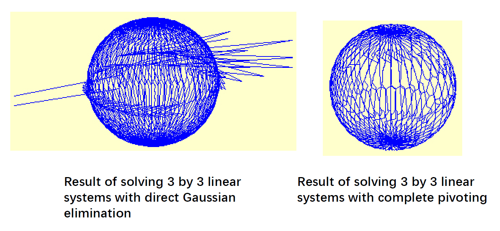
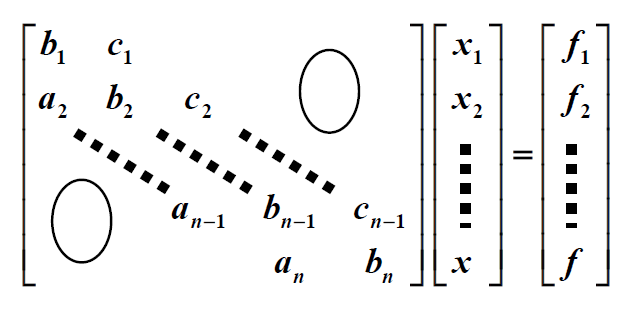
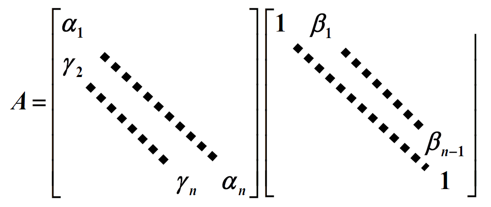

# Chap 6: Direct Methods for Solving Linear Systems

目标：求解 $A \bm{x} = \bm{b}$

## Linear Systems for Equations

### Gaussian Elimination

**高斯消元法**(Gaussian elimination)的基本思路：

- 首先将矩阵 $A$ 归约成一个**上三角**(upper-triangular)矩阵
- 然后通过**回代**(backward-substitution)来求解未知量

<div style="text-align: center">
    
</div>

先来看**消元**(elimination)的实现：先令 $A^{(1)} = A = (a_{ij}^{(1)})_{n \times n}, \bm{b}^{(1)} = \bm{b} = \begin{bmatrix}b_1^{(1)} \\ \vdots \\ b_n^{(1)}\end{bmatrix}$

- 第1步：
    - 如果 $a_{11}^{(1)} \ne 0$，计算 $m_{i1} = \dfrac{a_{i1}^{(1)}}{a_{11}^{(1)}}, (i = 2, \dots, n)$
    - 那么增广矩阵(augmented matrix)的第 $i$ 行 $\text{row}_i$为：$m_{i1} \times \text{row}_1$，得到

        $$
        \left[
        \begin{array}{cccc|c}
        a_{11}^{(1)} & a_{12}^{(1)} & \cdots & a_{1n}^{(1)} & b_1^{(1)} \\
        0 & & A^{(2)} & & \bm{b}^{(2)} \\
        \end{array}
        \right]
        $$

        其中 $\begin{cases}a_{ij}^{(2)} = a_{ij}^{(1)} - m_{i1} a_{1j}^{1} \\ b_i^{(2)} = b_i^{(1)} - m_{i1} b_1^{(1)}\end{cases}, (i, j = 2, \dots, n)$


- 第k步：
    - 如果 $a_{kk}^{(k)} \ne 0$，计算 $m_{ik} = \dfrac{a_{ik}^{(k)}}{a_{kk}^{(k)}}, (i = k+1, \dots, n)$
    - $\begin{cases}a_{ij}^{(k+1)} = a_{ij}^{(k)} - m_{ik} a_{kj}^{k} \\ b_i^{(k+1)} = b_i^{(k)} - m_{ik} b_k^{(k)}\end{cases}, (i, j = k+1, \dots, n)$

- n-1 步后：

    $$
    \begin{bmatrix} a_{11}^{(1)} & a_{12}^{(1)} & \dots & a_{1n}^{(1)} \\ & a_{22}^{(2)} & \dots & a_{2n}^{(2)} \\ & & \dots & \vdots \\ & & & a_{nn}^{(n)}\end{bmatrix} \begin{bmatrix}x_1 \\ x_2 \\ \vdots \\ x_n\end{bmatrix} = \begin{bmatrix}b_1^{(1)} \\ b_2^{(2)} \\ \vdots \\ b_n^{(n)}\end{bmatrix}
    $$

---
接下来看**回代**：

- $x_n = \dfrac{b_n^{(n)}}{a_{nn}^{(n)}}$
- $x_i = \dfrac{b_i^{(i)} - \sum\limits_{j=i+1}^n a_{ij}^{(i)} x_j}{a_{ii}^{(i)}}, (i = n - 1, \dots, 1)$
- 我们必须找到最小的整数 $k \ge i$ 且 $a_{ki}^{(i)} \ne 0$，然后交换第 $k$ 行和第 $i$ 行


### Amount of Computation

现在我们来统计一下计算量（仅考虑乘法/除法）。

- 消元：$\sum\limits_{k=1}^{n-1} (n - k)(n - k + 2) = \dfrac{n^3}{3} + \dfrac{n^2}{2} - \dfrac{5}{6}n$
- 回代：$1 + \sum\limits_{i=1}^{n-1}(n - i + 1) = \dfrac{n^2}{2} + \dfrac{n}{2}$

所以对于很大的 $n$，乘法和除法的总数大约为 $\textcolor{red}{\dfrac{n^3}{3}}$。


## Pivoting Strategies

在求解线性方程组中，如果**主元**(pivot)过小，可能会产生问题。因此，我们给出以下解决对策：

>除非有特殊说明，以下的 $k$ 指的是第 $k$ 次高斯消元。

### Partial Pivoting

**部分主元法**(partial pivoting)（或称为最大列主元法(maximal column pivoting)）：找到最小的 $p$，使得 $|a_{pk}^{(k)}| = \max\limits_{k \le i \le n} |a_{ik}^{(k)}|$，然后交换第 $p$ 行和第 $k$ 行。

???+ example "例子"

    === "题目"

        求解线性方程组 $\begin{cases}30.00 x_1 + 594100 x_2 = 591700 \\ 5.291 x_1 - 6.130 x_2 = 46.78\end{cases}$，舍入精度为 4 位。

    === "分析"

        TBD


### Scaled Partial Pivoting

**缩放部分主元法**(scaled partial pivoting)（或称为缩放列主元法(scaled-column pivoting)）：将一行中最大的元素放在主元的位置上。

- 第1步：定义每一行的缩放因子 $s_i = \max\limits_{1 \le j \le n} |a_{ij}|$
- 第2步：（对于第 $k$ 次高斯消元，）找到最小的 $p \ge k$，使得 $\dfrac{|a_{pk}^{(k)}|}{s_p} = \max\limits_{k \le i \le n} \dfrac{|a_{ik}^{(k)}|}{s_i}$，然后交换第 $p$ 行和第 $k$ 行

!!! note "注"

    缩放因子**只计算一次**（在高斯消元前），以确保计算效率。


### Complete Pivoting

**完全主元法**(complete pivoting)（或称为最大主元法(maximal pivoting)）：搜索所有的元素 $a_{ij} (i, j = k, \dots, n)$，找出其中数值最大的元素。通过**互换**(interchange)行和列，使得该元素来到主元的位置上。

<div style="text-align: center">
    
</div>


### Amount of Computation

- 部分主元法：需要 $O(n^2)$ 次额外的**比较**
- 缩放部分主元法：需要 $O(n^2)$ 次额外的**比较**，以及 $O(n^2)$ 次**除法**
- 完全主元法：需要 $O(\dfrac{n^3}{3})$ 次额外的**比较**

!!! note "注"

    如果新的缩放因子在行交换的时候才被确定，那么缩放部分主元法需要 $O(\dfrac{n^3}{3})$ 次额外的**比较**，以及 $O(n^2)$ 次**除法**


## Matrix Factorization

**矩阵分解**(matrix factorization)借助高斯消元法实现：

- 第 1 步：
    - $m_{i1} = \dfrac{a_{i1}}{a_{11}} (a_{11} \ne 0)$
    - 令 $L_1 = \begin{bmatrix}1 & & & \\ -m_{21} & 1 & & \\ \vdots & & \ddots \\ -m_{n1} & & &1\end{bmatrix}$，那么 $L_1 [A^{(1)} \quad \bm{b}^{(1)}] = \begin{bmatrix}a_{11}^{(1)} & \dots a_{1n}^{(1)} & b_1^{(1)} \\ 0 & A^{(2)} & \bm{b}^{(2)}\end{bmatrix}$
- 第 n-1 步：
    
    $$
    L_{n-1}L_{n-2} \dots L_1 [A \quad \bm{b}] = \begin{bmatrix}a_{11}^{(1)} & a_{12}^{(1)} & \dots & a_{1n}^{(1)} & b_1^{(1)}\\ & a_{22}^{(2)} & \dots & a_{2n}^{(2)} & b_2^{(2)} \\ & & \dots & \vdots & \vdots\\ & & & a_{nn}^{(n)} & b_n^{(n)}\end{bmatrix}
    $$

    其中 $L_k = \begin{bmatrix}1 & & & & \\ & \ddots & & & \\ & & 1 & & \\ & & -m_{k+1, k} & & \\ & & \vdots &\ddots & \\ & & -m_{n, k} & & 1\end{bmatrix}$


!!! definition "定理"

    若高斯消元法能够在不使用行互换的基础上求解线性方程组 $A \bm{x} = \bm{b}$，那么矩阵 $A$ 可以被因式分解为一个下三角矩阵 $L$ 和上三角矩阵 $U$ 的乘积。

    如果矩阵是 unitary（酉矩阵？但 NA 应该不讨论复数？），那么分解是**唯一的**。

    ??? proof "唯一性证明"

        如果分解不是唯一的，那么存在 $L_1, L_2, U_1, U_2$，使得 $A = L_1 U_1 = L_2 U_2$，因此：

        $$
        \underbrace{U_1U_2^{-1}}_{\text{Upper-triangular}} = L_1^{-1} L_2 U_2 U_2^{-1} = \underbrace{L_1^{-1} L_2}_{\substack{\text{Lower-triangular} \\ \text{with diagnoal entries } \textcolor{red}{1}}} = I
        $$

!!! note "注"

    如果 $U$ 是 unitary 的，那么这种分解就称为**Crout 分解**。Crout 分解能够通过对$A^T$ $LU$ 分解。也就是说，找到 $A^T = LU$，那么 $A = U^T L^T$ 就是 $A$ 的 Crout 分解。


## Special Types of Matrices

### Strictly Diagonally Dominant Matrix

**严格对角占优矩阵**(strictly diagonally dominant matrix)满足：

$$
|a_{ii}| > \sum\limits_{\substack{j = 1 \\ j \ne i}}^n |a_{ij}|
$$

!!! definition "定理"

    - 严格对角占优矩阵 $A$ 是**非奇异的**(nonsigular)。
    - 在这种矩阵上使用高斯消元法**无需**行或列的**互换**
    - 并且计算将相对于舍入误差的增长保持**稳定**

    ??? proof "证明"

        - $A$ 是非奇异的——反证法证明
        - 高斯消元法无需行或列的互换——归纳法证明：通过高斯消元法得到的每一个矩阵 $A^{(2)}, A^{(3)}, \dots, A^{(n)}$ 都是严格对角占优的
        - 略过


### Choleski's Method for Positive Definite Matrix

!!! definition "定义"

    对于一个矩阵 $A$，如果它是**对称的**，且 $\forall \bm{x} \ne \bm{0}, \bm{x}^T A \bm{x} > 0$ 成立，那么称该矩阵是**正定**(positive definite)矩阵。

正定矩阵 $A$ 的性质：

- $A^{-1}$ 也是正定的，且 $a_{ii} > 0$
- 当 $i \ne j$ 时，$\max |a_{ij}| \le \max |a_{kk}|, (a_{ij})^2 < a_{ii} a_{jj}$
- $A$ 的每个前导主子矩阵(leading principal submatrices) $A_k$ 的行列式(determinant)都是正的

??? proof "证明见教材 $P_{401-402}$"

考虑正定矩阵 $A$ 的 $LU$ 分解：

<div style="text-align: center">
    
</div>

$A$ 是对称矩阵，$L = \widetilde{U}^T$，$A = LDL^T$

令 $D^{\frac{1}{2}} = \begin{bmatrix}\sqrt{u_{11}} & & & \\ & \sqrt{u_{22}} & & \\ & & & & \\ & & & \sqrt{u_{nn}}\end{bmatrix}$，$\widetilde{L} = LD^{\frac{1}{2}}$ 仍然是一个上三角矩阵，因此 $A = \widetilde{L} \widetilde{L}^T$

综上，若 $A$ 是正定矩阵，那么：

- 当 $L$ 是一个 unitary 的下三角矩阵，并且 $D$ 是一个对角项均为正数的对角矩阵时，$A$ 可被分解为 $LDL^T$
- 当 $L$ 是一个对角线上均为非零元素的下三角矩阵时，$A$ 可被分解为 $LL^T$

???+ code "算法：Choleski 法"

    目标：将规模为 $n \times n$ 的对称的正定矩阵 $A$ 分解为 $LL^T$，其中 $L$ 是下三角矩阵。

    输入：$n$ 维矩阵 $A$，其元素为 $a_{ij}, 1 \le i, j \le n$
    
    输出：矩阵 $L$，其元素为 $l_{ij}, 1 \le j \le i, 1 \le i \le n$

    ```cpp
    Step 1  set l_11 = sqrt(a_11);
    Step 2  for j = 2, ..., n, set l_j1 = a_j1 / l_11;
    Step 3  for i = 2, ..., n - 1 do steps 4 and 5
        Step 4  set l_ii = sqrt(a_ii - sum(pow(l_ik, 2), 1, i - 1))
        // LDL^T is faster, but must be modified to solve Ax = b

        Step 5  for j = i + 1, ..., n, set l_ji = (a_ji - sum(l_jk * l_ik, 1, i - 1)) / l_ii;
    Step 6  set l_nn = sqrt(a_nn - sum(pow(l_nk, 2), 1, n - 1))
    Step 7  output (l_ij for j = 1, ..., i and i = 1, ..., n);
    Stop.
    ```


### Crout Reduction for Tridiagonal Linear System

<div style="text-align: center">
    
</div>

对于上述形式的线性方程组，有以下求解步骤：

1. 寻找矩阵 $A$ 的 Crout 分解

    <div style="text-align: center">
        
    </div>

2. 求解 $L\bm{y} = \bm{f} \Rightarrow y_1 = \dfrac{f_1}{\alpha_1}, y_i = \dfrac{(f_i - r_i y_{i-1})}{\alpha_i} (i = 2, \dots, n)$
3. 求解 $U\bm{x} = \bm{y} \Rightarrow x_n = y_n, x_i = y_i - \beta_i x_{i+1}$

!!! definition "定理"

    如果 $A$ 是三对角线矩阵，且是对角线占优的，并满足 $|b_1| > |c_1| > 0, |b_n| > |a_n| > 0, a_i \ne 0, c_i \ne 0$，那么 $A$ 是非奇异的，对应的线性方程组有解。

!!! note "注"

    - 如果 $A$ 是严格对角占优的，那么没有必要让所有的 $a_i, b_i, c_i$ 都是非零的
    - 该方法是稳定的，因为所有从计算过程中获得的值会被约束在原有元素的范围内
    - 计算量为 $O(n)$