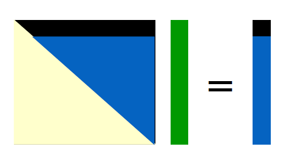
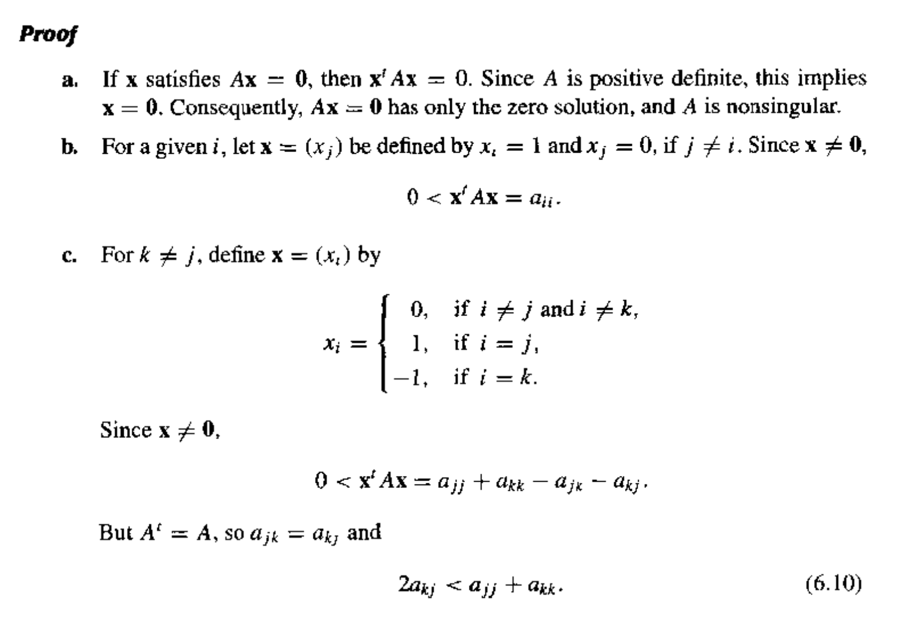
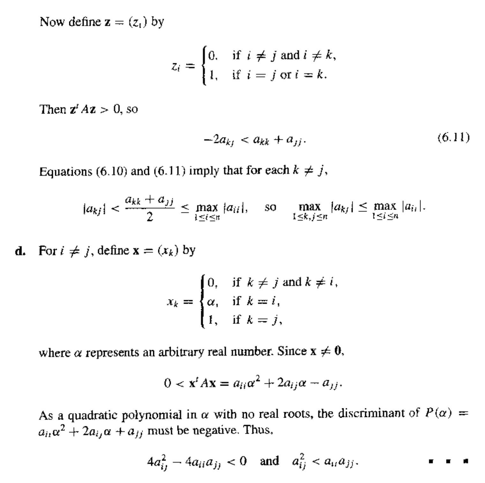
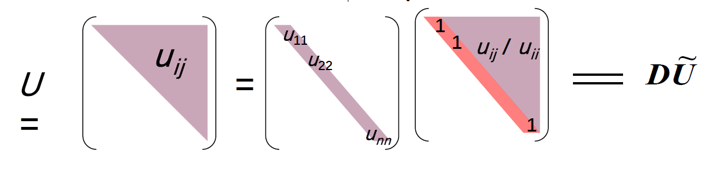

# Chap 6: Direct Methods for Solving Linear Systems

??? abstract "核心知识"

    - 高斯消元法
    - 一些选取主元的策略
        - 部分主元法
        - 缩放部分主元法
        - 完全主元法
    - 矩阵分解：LU 分解
    - 一些特殊矩阵
        - 严格对角占优矩阵
        - 正定矩阵 -> Choleski 法
        - 三对角矩阵 -> Crout 分解


目标：求解 $A \bm{x} = \bm{b}$

!!! info "注"

    在继续第6章（以及第7章）的学习前，建议先回顾**线性代数**的知识，否则理解起来可能比较吃力（但有些内容就是线性代数中学过的，比如下面的高斯消元法）。

??? note "逆矩阵的求解"

    个人比较喜欢**高斯-约旦消元法**(Gauss-Jordan elimination)（计算机也常用这种方法），其大致步骤如下：

    1. 构造增广矩阵 $[A | I]$
    2. 对增广矩阵进行行初等变换（目标是将左侧的 $A$ 变为单位矩阵 $I$）：
        - 交换两行。
        - 将某一行乘以一个非零常数。
        - 将某一行的一个倍数加到另一行。 
    3. 检查结果：如果左侧成功变为 $I$，则右侧的矩阵就是 $A^{-1}$。如果左侧在变换过程中出现全零行（或列），则 $A$ 不可逆。


## Linear Systems for Equations

### Gaussian Elimination

**高斯消元法**(Gaussian elimination)的基本思路：

- 首先将矩阵 $A$ 归约成一个**上三角**(upper-triangular)矩阵
- 然后通过**回代**(backward-substitution)来求解未知量

<div style="text-align: center">
    
</div>

先来看**消元**(elimination)的实现：先令 $A^{(1)} = A = (a_{ij}^{(1)})_{n \times n}, \bm{b}^{(1)} = \bm{b} = \begin{bmatrix}b_1^{(1)} \\ \vdots \\ b_n^{(1)}\end{bmatrix}$

- 第1步：
    - 如果 $a_{11}^{(1)} \ne 0$，计算 $m_{i1} = \dfrac{a_{i1}^{(1)}}{a_{11}^{(1)}}, (i = 2, \dots, n)$
    - 那么增广矩阵(augmented matrix)的第 $i$ 行 $\text{row}_i$为：$m_{i1} \times \text{row}_1$，得到

        $$
        \left[
        \begin{array}{cccc|c}
        a_{11}^{(1)} & a_{12}^{(1)} & \cdots & a_{1n}^{(1)} & b_1^{(1)} \\
        0 & & A^{(2)} & & \bm{b}^{(2)} \\
        \end{array}
        \right]
        $$

        其中 $\begin{cases}a_{ij}^{(2)} = a_{ij}^{(1)} - m_{i1} a_{1j}^{1} \\ b_i^{(2)} = b_i^{(1)} - m_{i1} b_1^{(1)}\end{cases}, (i, j = 2, \dots, n)$


- 第k步：
    - 如果 $a_{kk}^{(k)} \ne 0$，计算 $m_{ik} = \dfrac{a_{ik}^{(k)}}{a_{kk}^{(k)}}, (i = k+1, \dots, n)$
    - $\begin{cases}a_{ij}^{(k+1)} = a_{ij}^{(k)} - m_{ik} a_{kj}^{k} \\ b_i^{(k+1)} = b_i^{(k)} - m_{ik} b_k^{(k)}\end{cases}, (i, j = k+1, \dots, n)$

- n-1 步后：

    $$
    \begin{bmatrix} a_{11}^{(1)} & a_{12}^{(1)} & \dots & a_{1n}^{(1)} \\ & a_{22}^{(2)} & \dots & a_{2n}^{(2)} \\ & & \dots & \vdots \\ & & & a_{nn}^{(n)}\end{bmatrix} \begin{bmatrix}x_1 \\ x_2 \\ \vdots \\ x_n\end{bmatrix} = \begin{bmatrix}b_1^{(1)} \\ b_2^{(2)} \\ \vdots \\ b_n^{(n)}\end{bmatrix}
    $$

---
接下来看**回代**：

- $x_n = \dfrac{b_n^{(n)}}{a_{nn}^{(n)}}$
- $x_i = \dfrac{b_i^{(i)} - \sum\limits_{j=i+1}^n a_{ij}^{(i)} x_j}{a_{ii}^{(i)}}, (i = n - 1, \dots, 1)$
- 我们必须找到最小的整数 $k \ge i$ 且 $a_{ki}^{(i)} \ne 0$，然后交换第 $k$ 行和第 $i$ 行

??? code "代码实现"

    求解 $n \times n$ 线性方程组：

    $$
    \begin{align}
    E_1: & a_{11} x_1 + a_{12} x_2 + \dots + a_{1n} x_n = a_{1, n+1} \notag \\
    E_2: & a_{21} x_1 + a_{22} x_2 + \dots + a_{2n} x_n = a_{2, n+1} \notag \\
    \vdots \quad &  \quad \vdots \quad \quad \quad\ \vdots \quad \quad \quad \quad \quad \quad \vdots \quad \quad \quad \vdots \notag \\
    E_n: & a_{n1} x_1 + a_{n2} x_2 + \dots + a_{nn} x_n = a_{n, n+1} \notag \\
    \end{align}
    $$

    - 输入：未知量和方程的数量 $n$；增广矩阵 $A = (a_{ij})$，其中 $1 \le i \le n, 1 \le j \le n+1$
    - 输出：解 $x_1, x_2, \dots, x_n$，或者线性方程组没有唯一解的信息

    ```cpp
    Step 1  for i = 1, ..., n - 1 do Steps 2-4:
        Step 2  Let p be the smallest integer with i <= p <= n and a[p][i] != 0;
                if no integer p can be found
                    then Output('no unique solution exists');
                    STOP;
                // row exchange
        Step 3  if p != i then perform (E[p]) <-> (E[i]);
                // elimination
        Step 4  for j = i + 1, ..., n do Step 5 and 6:
            Step 5  Set m[j][i] = a[j][i] / a[i][i]
            Step 6  Perform (E[j] - m[j][i] * E[i]) -> (E[i])
        Step 7  if a[n][n] = 0 then Output('no unique solution exists');
                    STOP;
                // backward substitution
        Step 8  Set x_n = a[n][n+1] / a[n][n]
        Step 9  for i = n - 1, ..., 1 set x[i] = [a[i][n+1] - sum(j=i+1, n, a[i][j] * x[j])] / a[i][i];
        Step 10 Output(x[1], ..., x[n]);
                STOP;    // success
    ```


### Amount of Computation

现在我们来统计一下计算量（仅考虑乘法/除法）。

- 消元：$\sum\limits_{k=1}^{n-1} (n - k)(n - k + 2) = \dfrac{n^3}{3} + \dfrac{n^2}{2} - \dfrac{5}{6}n$
- 回代：$1 + \sum\limits_{i=1}^{n-1}(n - i + 1) = \dfrac{n^2}{2} + \dfrac{n}{2}$

所以对于很大的 $n$，乘法和除法的总数大约为 $\textcolor{red}{\dfrac{n^3}{3}}$。也就是说，高斯消元法的时间复杂度为 **$O(n^3)$**。


## Pivoting Strategies

>除非有特殊说明，以下的 $k$ 指的是第 $k$ 次高斯消元。

???+ bug "一般高斯消元法的问题"

    在高斯消元的过程中，如果其中一个**主元**(pivot) $a_{kk}^{(k)} = 0$，那么就需要进行行交换 $(E_k) \leftrightarrow (E_p)$，其中 $p$ 是最小的满足 $p > k$ 且 $a_{pk}^{(k)} \ne 0$ 的整数。但为了减小舍入误差，即使主元并不等于0的时候也要做行交换。

    如果 $a_{kk}^{(k)}$ 相比 $a_{jk}^{(k)}$ 较小的话，那么乘数 $m_{jk} = \dfrac{a_{jk}^{(k)}}{a_{kk}^{(k)}}$ 会大于1，导致误差的积累。并且在回代的时候，$x_k$ 的值因为分母 $a_{kk}^{(k)}$ 的值过小，其计算误差也会被放大。

所以，我们需要选取合适的主元以减小误差。下面给出一些选取主元的策略。

???+ info "置换矩阵"

    找到合适的主元后，一般我们会做一个行交换。在后面涉及到[矩阵分解](#matrix-factorization)的时候，“行交换”这一操作就可以用一个**置换矩阵**(permutation matrix) $P$ 来表示。它的元素基于**单位矩阵**(identity matrix) $I$，在此基础上对里面的元素做行交换，便可表示对应的行交换操作。

    比如 $P_{12} = \begin{bmatrix}0 & 1 & 0 \\ 1 & 0 & 0 \\ 0 & 0 & 1\end{bmatrix}$ 表示交换第1行和第2行。如果 $\bm{x} = \begin{bmatrix}x_1 \\ x_2 \\ x_3\end{bmatrix}$，那么 $P_{12} \bm{x} = \begin{bmatrix}x_2 \\ x_1 \\ x_3\end{bmatrix}$。


### Partial Pivoting

**部分主元法**(partial pivoting)（或称为最大列主元法(maximal column pivoting)）：找到最小的 $p$，使得 $|a_{pk}^{(k)}| = \max\limits_{k \le i \le n} |a_{ik}^{(k)}|$，然后交换第 $p$ 行和第 $k$ 行。

??? code "代码实现"

    求解 $n \times n$ 线性方程组：

    $$
    \begin{align}
    E_1: & a_{11} x_1 + a_{12} x_2 + \dots + a_{1n} x_n = a_{1, n+1} \notag \\
    E_2: & a_{21} x_1 + a_{22} x_2 + \dots + a_{2n} x_n = a_{2, n+1} \notag \\
    \vdots \quad &  \quad \vdots \quad \quad \quad\ \vdots \quad \quad \quad \quad \quad \quad \vdots \quad \quad \quad \vdots \notag \\
    E_n: & a_{n1} x_1 + a_{n2} x_2 + \dots + a_{nn} x_n = a_{n, n+1} \notag \\
    \end{align}
    $$

    - 输入：未知量和方程的数量 $n$；增广矩阵 $A = (a_{ij})$，其中 $1 \le i \le n, 1 \le j \le n+1$
    - 输出：解 $x_1, x_2, \dots, x_n$，或者线性方程组没有唯一解的信息

    ```cpp
    Step 1  for i = 1, ..., n set NROW(i) = i;    // initialize row pointer
    Step 2  for i = 1, ..., n - 1 do Steps 3-6:    // elimination process
        Step 3  Let p be the smallest integer with i <= p <= n and
                |a(NROW(p), i)| = max_{i <= j <= n}|a(NROW(j), i)|;
        Step 4  if a(NROW(p), i) = 0 then Output('no unique solution exists');
                    STOP;
        Step 5  if NROW(i) != NROW(p) then set NCOPY = NROW(i);    // simulated row interchange
                                              NROW(i) = NROW(p);
                                              NROW(p) = NCOPY;
        Step 6  for j = i + 1, ..., n do Steps 7-8:
            Step 7  Set m(NROW(j), i) = a(NROW(j), i) / a(NROW(i), i);
            Step 8  Perform (E_NROW(j) - m(NROW(j), i) * E_NROW(i)) -> (E_NROW(j));
        Step 9  if a(NROW(n), n) = 0 then Output('no unique solution exists');
                    STOP;
        // start backward substitution
        Step 10 Set x[n] = a(NROW(n), n + 1) / a(NROW(n), n);
        Step 11 for i = n - 1, ..., 1
                    set x[i] = (a(NROW(i), n + 1) - sum(j=i+1, n, a(NROW(i), j) * x[j])) / a(NROW(i), i);
        Step 12 Output(x[1], ..., x[n]);    // procedure completed successfully
                STOP;
    ```

???+ example "例子"

    === "题目"

        求解线性方程组 $\begin{cases}30.00 x_1 + 594100 x_2 = 591700 \\ 5.291 x_1 - 6.130 x_2 = 46.78\end{cases}$，舍入精度为 4 位。

    === "分析"

        可以看到，虽然根据部分主元法，解方程时无需交换行，然而注意到第一个方程中同一行的元素量级相差巨大，而第二行元素的量级比较接近，所以会产生较大的误差（这也反映了部分主元法的缺陷）。


### Scaled Partial Pivoting

**缩放部分主元法**(scaled partial pivoting)（或称为缩放列主元法(scaled-column pivoting)）：将一行中最大的元素放在主元的位置上。

- 第1步：定义每一行的**缩放因子**(scale factor) $s_i = \max\limits_{1 \le j \le n} |a_{ij}|$（即每行中**绝对值最大**的元素）
- 第2步：（对于第 $k$ 次高斯消元，）找到最小的 $p \ge k$，使得 $\dfrac{|a_{pk}^{(k)}|}{s_p} = \max\limits_{k \le i \le n} \dfrac{|a_{ik}^{(k)}|}{s_i}$，然后交换第 $p$ 行和第 $k$ 行

!!! note "注"

    缩放因子**只计算一次**（在高斯消元前），以确保计算效率。

??? code "代码实现"

    和部分主元法的实现相比，区别在于前3步，后续步骤都是一样的，因此下面只列出前3步：

    ```cpp
    Step 1  for i = 1, ..., n set s_i = max_{1 <= j <= n}(|a_ij|);
                              if s_i = 0 then Output('no unique solution exists');
                                              STOP;
    Step 2  for i = 1, ..., n - 1 do Steps 3-6:    // elimination process
        Step 3  Let p be the smallest integer with i <= p <= n and
                |a(NROW(p), i)| / s(NROW(p)) = max_{i <= j <= n}(|a(NROW(j), i)| / s(NROW(j)));
    ```

??? question "缩放部分主元法的好处在哪里？"

    一般的部分主元法考虑的是**绝对大小**（当前列绝对值最大的元素），而缩放部分主元法考虑的是**相对大小**（当前列中，元素绝对值与该行最大绝对值之比最大的元素）。虽然一般的部分主元法足以应对大多数情况，但从数值稳定性上看，后者能够在矩阵元素有较大量级差异的极端情形下能够减少误差的积累，从而表现出更好的稳定性（比如 $1$ 和 $10^5$ 这么大的量级差异）。


### Complete Pivoting

**完全主元法**(complete pivoting)（或称为最大主元法(maximal pivoting)）：搜索所有的元素 $a_{ij} (i, j = k, \dots, n)$，找出其中数值最大的元素。通过**互换**(interchange)行和列，使得该元素来到主元的位置上。


### Amount of Computation

- 部分主元法：需要 $O(n^2)$ 次**比较**
- 缩放部分主元法：需要 $O(n^2)$ 次**比较**，以及 $O(n^2)$ 次**除法**（初始计算）
- 完全主元法：需要 $O(\dfrac{n^3}{3})$ 次**比较**

>所以，要想追求更好的稳定性，就要以更大的计算量为代价。

!!! note "注"

    如果新的缩放因子在行交换的时候才被确定，那么缩放部分主元法需要 $O(\dfrac{n^3}{3})$ 次额外的**比较**，以及 $O(n^2)$ 次**除法**


## Matrix Factorization

高斯消元法是一种简单粗暴的方法，但效率不是很高。因此下面介绍一种基于高斯消元法实现的改进方法——**矩阵分解**(matrix factorization)。它的计算过程如下：

- 第 1 步：
    - $m_{i1} = \dfrac{a_{i1}}{a_{11}} (a_{11} \ne 0)$
    - 令 $L_1 = \begin{bmatrix}1 & & & \\ -m_{21} & 1 & & \\ \vdots & & \ddots \\ -m_{n1} & & &1\end{bmatrix}$（这就是**第一高斯变换矩阵**(first Gaussian transformation matrix)），那么 $L_1 [A^{(1)} \quad \bm{b}^{(1)}] = \begin{bmatrix}a_{11}^{(1)} & \dots a_{1n}^{(1)} & b_1^{(1)} \\ 0 & A^{(2)} & \bm{b}^{(2)}\end{bmatrix}$

- 第 k 步：
    - **第k高斯变换矩阵**(kth Gaussian transformation matrix)：$L_k = \begin{bmatrix}1 & & & & \\ & \ddots & & & \\ & & 1 & & \\ & & -m_{k+1, k} & & \\ & & \vdots &\ddots & \\ & & -m_{n, k} & & 1\end{bmatrix}$（空的地方都是0）

- 第 n-1 步：
    
    $$
    L_{n-1}L_{n-2} \dots L_1 [A \quad \bm{b}] = \begin{bmatrix}a_{11}^{(1)} & a_{12}^{(1)} & \dots & a_{1n}^{(1)} & b_1^{(1)}\\ & a_{22}^{(2)} & \dots & a_{2n}^{(2)} & b_2^{(2)} \\ & & \dots & \vdots & \vdots\\ & & & a_{nn}^{(n)} & b_n^{(n)}\end{bmatrix}
    $$

!!! theorem "定理"

    若高斯消元法能够在不使用行互换的基础上求解线性方程组 $A \bm{x} = \bm{b}$，那么矩阵 $A$ 可以被因式分解为一个下三角矩阵 $L$ 和上三角矩阵 $U$ 的乘积，即 $A = LU$。

    其中：

    $$
    U = \begin{bmatrix}a_{11}^{(1)} & a_{12}^{(1)} & \dots & a_{1n}^{(1)} \\ 0 & a_{22}^{(2)} & \dots & a_{2n}^{(2)} \\ \vdots & \vdots & \ddots & \vdots \\ 0 & \dots & \dots & a_{nn}^{(n)}\end{bmatrix} \quad L = \begin{bmatrix}1 & 0 & \dots & 0 \\ m_{21} & 1 & \dots & 0 \\ \vdots & \vdots & \ddots & \vdots \\ m_{n1} & \dots & m_{n, n-1} & 1\end{bmatrix} \quad m_{ji} = \dfrac{a_{ji}^{(i)}}{a_{ii}^{(i)}}
    $$

    如果矩阵 $L$ 是**单位的**(unitary)（也就是说主对角线元素都是1），那么得到的矩阵分解是**唯一的**。

    ??? proof "唯一性证明"

        如果分解不是唯一的，那么存在 $L_1, L_2, U_1, U_2$，使得 $A = L_1 U_1 = L_2 U_2$，因此：

        $$
        \underbrace{U_1U_2^{-1}}_{\text{Upper-triangular}} = L_1^{-1} L_2 U_2 U_2^{-1} = \underbrace{L_1^{-1} L_2}_{\substack{\text{Lower-triangular} \\ \text{with diagnoal entries } \textcolor{red}{1}}} = I
        $$

!!! note "注"

    如果 $U$ 也是**单位的**，那么这种分解就称为[**Crout 分解**](https://en.wikipedia.org/wiki/Crout_matrix_decomposition)。我们可通过对 $A^T$ 的 $LU$ 分解来实现 Crout 分解。也就是说，找到 $A^T = LU$，那么 $A = U^T L^T$ 就是 $A$ 的 Crout 分解。

??? code "$LU$ 分解的代码实现"

    将 $n \times n$ 的矩阵 $A = (a_{ij})$ 分解为下三角矩阵 $L = (l_{ij})$ 和上三角矩阵 $U = (u_{ij})$，也就是说 $A = LU$，其中 $L$ 或 $U$ 的主对角线元素均为1。

    - 输入：维度 $n$；$A$ 的元素 $a_{ij}, 1 \le i, j \le n$；$L$ 的对角元素 $l_{11} = \dots = l_{nn} = 1$ 或 $U$ 的对角元素 $u_{11} = \dots = u_{nn} = 1$
    - 输出：$L$ 的项 $l_{ij}, 1 \le j \le i, 1 \le i \le n$，以及 $U$ 的项 $u_{ij}, i \le j \le n, 1 \le i \le n$

    ```cpp
    Step 1  Select l_11 and u_11 satisfying l_11 * u_11 = a_11;
            if l_11 * u_11 = 0 then Output('Factorization impossible');
                Stop;
    Step 2  for j = 2, ..., n set u_1j = a_1j / l_11;    // first row of U
                                  l_j1 = a_j1 / u_11;    // first column of L
    Step 3  for i = 2, ..., n - 1 do Steps 4 and 5:
        Step 4  Select l_ii and u_ii safisfying l_ii * u_ii = a_ii - sum(k=1, i-1, l_ik * u_ki);
                if l_ii * u_ii = 0 then Output('Factorization impossible');
                    Stop;
        Step 5  for j = i + 1, ..., n:
                    set u_ij = 1 / l_ii * (a_ij - sum(k=1, i-1, l_ik * u_kj));    // ith row of U
                    set l_ji = 1 / u_ii * (a_ji - sum(k=1, i-1, l_jk * u_ki));    // ith column of L
    Step 6  Select l_nn and u_nn satisfying l_nn * u_nn = a_nn - sum(k=1, n-1, l_nk * u_kn);
    // if l_nn * u_nn = 0, then A = LU but A is singular
    Step 7  Output(l_ij for j = 1, ..., i and i = 1, ..., n);
            Output(u_ij for j = i, ..., n and i = 1, ..., n);
            STOP;
    ```

    这样我们只得到了 $L$ 和 $U$，还没有解出这个线性方程组（矩阵），所以还要继续往下转换。

    因为 $A \bm{x} = LU \bm{x} = \bm{b}$，所以我们令 $\bm{y} = U\bm{x}$，

    - 先解 $L \bm{y} = \bm{b}$
        - $y_1 = \dfrac{b_1}{l_{11}}$
        - $y_i = \dfrac{1}{l_{ii}} \Big[b_i - \sum\limits_{j=1}^{i-1} u_{ij} y_j\Big]$
    - 再解 $U \bm{x} = \bm{y}$
        - $x_n = \dfrac{y_n}{u_{nn}}$
        - $x_i = \dfrac{1}{u_{ii}} \Big[y_i - \sum\limits_{j=i+1}^n u_{ij} x_j\Big]$

??? abstract "高斯消元法 v.s. LU 分解（by Gemini 2.5 Flash）"

    | 特性             | 一般高斯消元法（直接对 $[A\|b]$） | LU分解                                       |
    | :--------------- | :------------------------------- | :------------------------------------------- |
    | **基本思想**     | 将 $[A\|b]$ 转化为 $[U'\|b']$      | 将 $A$ 分解为 $L$ 和 $U$                     |
    | **求解 $Ax=b$**  | 每次 $O(N^3)$                    | 分解 $O(N^3)$，每次求解 $O(N^2)$            |
    | **多右端向量**   | 每次 $O(N^3)$                    | **高效**：分解一次 $O(N^3)$，后续每次 $O(N^2)$ |
    | **计算 $A^{-1}$** | $O(N^4)$                         | **高效**：$O(N^3)$                           |
    | **计算 $\det(A)$** | 需记录消元过程                   | **直接**：对角线元素乘积                     |
    | **结构**         | 紧密耦合 $A$ 和 $b$              | **模块化**：分解与求解分离                   |
    | **存储**         | 每次重新计算                     | $L, U$ 可存储重用                            |
    | **数值稳定性**   | 依赖于主元选择                   | 依赖于主元选择，通常与主元法结合             |


## Special Types of Matrices

### Strictly Diagonally Dominant Matrix

**严格对角占优矩阵**(strictly diagonally dominant matrix)满足：

$$
|a_{ii}| > \sum\limits_{\substack{j = 1 \\ j \ne i}}^n |a_{ij}|
$$

即对角线元素的绝对值是其所在行内所有元素的绝对值中的最大者。

!!! theorem "定理"

    - 严格对角占优矩阵 $A$ 是**非奇异的**(nonsigular)（即行列式不为0，且存在逆矩阵）
    - 在这种矩阵上使用高斯消元法**无需**行或列的**互换**
    - 并且计算将相对于舍入误差的增长保持**稳定**

    ??? proof "证明"

        - $A$ 是非奇异的——反证法证明
        - 高斯消元法无需行或列的互换——归纳法证明：通过高斯消元法得到的每一个矩阵 $A^{(2)}, A^{(3)}, \dots, A^{(n)}$ 都是严格对角占优的
        - 略过


### Choleski's Method for Positive Definite Matrix

!!! definition "定义"

    对于一个矩阵 $A$，如果它是**对称的**，且 $\forall \bm{x} \ne \bm{0}, \bm{x}^T A \bm{x} > 0$ 成立，那么称该矩阵是**正定**(positive definite)矩阵。

!!! theorem "定理"

    正定矩阵 $A$ 的性质：

    a. $A$ 是非奇异的

    b. $a_{ii} > 0, i = 1, 2, \dots n$

    c. $\max_{1 \le k, j \le n} |a_{kj}| \le \max_{1 \le i \le n} |a_{ii}|$

    d. $(a_{ij})^2 < a_{ii} a_{jj}, i \ne j$

    PPT 上还有这些性质：

    - $A^{-1}$ 也是正定的
    - $A$ 的每个**前导主子矩阵**(leading principal submatrices) $A_k$ 的行列式(determinant)都是正的

    ??? info "前导主子矩阵"

        矩阵 $A$ 的前导主子矩阵为 $A_k = \begin{bmatrix}a_{11} & a_{12} & \dots & a_{1k} \\ a_{21} & a_{22} & \dots & a_{2k} \\ \vdots & \vdots & \ddots & \vdots \\ a_{k1} & a_{k2} & \dots & a_{kk} \end{bmatrix}, 1 \le k \le n$

    ??? proof "证明"

        <div style="text-align: center">
            
        </div>

        <div style="text-align: center">
            
        </div>

---
我们将 $A = LU$ 中的 $U$ 进一步拆分成对角矩阵 $D$ 和单位上三角矩阵 $\widetilde{U}$：

<div style="text-align: center">
    
</div>

可以推导出：$A$ 是对称矩阵（$A = A^T \rightarrow LU = LD \widetilde{U} = \widetilde{U^T} DL^T$）$\Rightarrow L = \widetilde{U}^T \Rightarrow A = LDL^T$。这样我们得到了另一种矩阵分解—— $LDL^T$ 分解：

??? code "$LDL^T$ 分解的代码实现"

    将 $n \times n$ 的矩阵 $A = (a_{ij})$ 分解为 $LDL^T$ 的形式，其中 $L$ 是下三角矩阵，对角线元素均为1；$D$ 为对角矩阵，对角线上的元素均为正数。

    - 输入：维度 $n$；$A$ 的元素 $a_{ij}, 1 \le i, j \le n$
    - 输出：$L$ 的项 $l_{ij}, 1 \le j \le i, 1 \le i \le n$，以及 $D$ 的项 $u_{i}, 1 \le i \le n$

    ```cpp
    Step 1  for i = 1, ..., n do Steps 2-4:
        Step 2  for j = 1, ..., i - 1, set v_j = l_ij * d_j;
        Step 3  Set d_i = a_ii - sum(j=1, i-1, l_ij * v_j);
        Step 4  for j = i + 1, ..., n, set l_ji = (a_ji - sum(k=1, i-1, l_jk * v_k)) / d_i;
    ```

---
令 $D^{\frac{1}{2}} = \begin{bmatrix}\sqrt{u_{11}} & & & \\ & \sqrt{u_{22}} & & \\ & & & & \\ & & & \sqrt{u_{nn}}\end{bmatrix}$，$\widetilde{L} = LD^{\frac{1}{2}}$ 仍然是一个上三角矩阵，因此 $A = \widetilde{L} \widetilde{L}^T$

>因为前导主子矩阵都是正的，所以 $u_{ii} > 0$

综上，若 $A$ 是**正定矩阵**，那么：

- 当 $L$ 是一个对角线元素均为1的下三角矩阵，并且 $D$ 是一个对角项均为正数的对角矩阵时，$A$ 可被分解为 $LDL^T$
- 当 $L$ 是一个对角线上均为非零元素的下三角矩阵时，$A$ 可被分解为 $LL^T$

???+ code "算法：Choleski 法"

    目标：将规模为 $n \times n$ 的对称的正定矩阵 $A$ 分解为 $LL^T$，其中 $L$ 是下三角矩阵。

    输入：$n$ 维矩阵 $A$，其元素为 $a_{ij}, 1 \le i, j \le n$
    
    输出：矩阵 $L$，其元素为 $l_{ij}, 1 \le j \le i, 1 \le i \le n$

    ```cpp
    Step 1  set l_11 = sqrt(a_11);
    Step 2  for j = 2, ..., n, set l_j1 = a_j1 / l_11;
    Step 3  for i = 2, ..., n - 1 do steps 4 and 5
        Step 4  set l_ii = sqrt(a_ii - sum(pow(l_ik, 2), 1, i - 1))
        // LDL^T is faster, but must be modified to solve Ax = b

        Step 5  for j = i + 1, ..., n, set l_ji = (a_ji - sum(l_jk * l_ik, 1, i - 1)) / l_ii;
    Step 6  set l_nn = sqrt(a_nn - sum(pow(l_nk, 2), 1, n - 1))
    Step 7  output (l_ij for j = 1, ..., i and i = 1, ..., n);
    Stop.
    ```

??? note "Choleski 法的优点（by Gemini 2.5 Flash）"

    - 数值稳定性高：Choleski 法在数值上非常稳定，因为它不需要主元选择。由于矩阵是正定的，可以保证对角线元素 $l_{ii}$ 的平方根总是正实数，并且不会出现除以零的情况。
    - 计算效率高：相比于一般的 LU 分解（需要 $2N^3/3$ 次浮点运算），Choleski 法只需要大约 $N^3/3$ 次浮点运算，因为它利用了矩阵的对称性，只需要计算 $L$ 的下三角部分（或 $U$ 的上三角部分）。这使得它在处理大型对称正定系统时非常高效。
    - 存储效率高：由于 $L$ 和 $L^T$ 之间存在关系，我们只需要存储 $L$（或 $U$），这节省了存储空间。
    - 保证正定性：如果 Choleski 法成功完成（即所有 $l_{ii}$ 都是正实数），则可以确认原始矩阵是正定的。反之，如果分解过程中遇到负数或零的平方根，则矩阵不是正定的。


### Crout Reduction for Tridiagonal Linear System

???+ info "带状矩阵"

    对于一个 $n \times n$ 的矩阵，如果有整数 $p, q$，满足 $1 < p, q < n$，当 $i + p \le j$ 或 $j + q \le i$ 时，有 $a_{ij} = 0$，那么称该矩阵为**带状矩阵**(band matrix)，其**带宽**(bandwidth)为 $w = p + q - 1$。

当 $p = q = 2$ 时，$w = 3$，此时的矩阵称为**三对角矩阵**(tridiagonal matrix)，其形式如下：

$$
A = \begin{bmatrix}a_{11} & a_{12} & 0 & \dots & \dots & 0 \\ a_{21} & a_{22} & a_{23} & \dots & \dots & \vdots \\ 0 & a_{32} & a_{33} & \dots & \dots & \vdots \\ \vdots & \ddots & \ddots & \ddots & \ddots & a_{n-1, n} \\ 0 & \dots & \dots & 0 & a_{n, n-1} & a_{nn}\end{bmatrix}
$$

对于上述形式的线性方程组（$A \bm{x} = \bm{f}$），我们采用一种特殊的 $LU$ 分解，称为 **Crout 分解**。下面给出具体求解步骤：

1. 寻找矩阵 $A$ 的 Crout 分解，$L, U$ 分别为：

    $$
    L = \begin{bmatrix}l_{11} & 0 & \dots & \dots & 0 \\ l_{21} & l_{22} & \ddots & & \vdots \\ 0 & \ddots & \ddots & \ddots & 0 \\ 0 & \dots & 0 & l_{n, n-1} & l_{nn}\end{bmatrix} \quad U = \begin{bmatrix}1 & u_{12} & 0 & \dots & 0 \\ 0 & 1 & \ddots & \ddots & \vdots \\ \vdots & & \ddots & \ddots & u_{n-1, n} \\ 0 & \dots & \dots & 0 & 1\end{bmatrix}
    $$

2. 求解 $L\bm{y} = \bm{f} \Rightarrow y_1 = \dfrac{f_1}{l_{11}}, y_i = \dfrac{(f_i - l_{i, i-1} y_{i-1})}{l_{ii}} (i = 2, \dots, n)$
3. 求解 $U\bm{x} = \bm{y} \Rightarrow x_n = y_n, x_i = y_i - u_{i,i+1} x_{i+1}$

!!! theorem "定理"

    如果 $A$ 是三对角线矩阵，且是对角线占优的，并满足 $|b_1| > |c_1| > 0, |b_n| > |a_n| > 0, a_i \ne 0, c_i \ne 0$，那么 $A$ 是非奇异的，对应的线性方程组有解。

!!! note "注"

    - 如果 $A$ 是严格对角占优的，那么没有必要让所有的 $a_i, b_i, c_i$ 都是非零的
    - 该方法是稳定的，因为所有从计算过程中获得的值会被约束在原有元素的范围内
    - 计算量为 $O(n)$

??? code "代码实现"

    求解 $n \times n$ 的线性方程组：

    $$
    \begin{align}
    E_1: a_{11} x_1 + a_{12} x_2 \quad \quad \quad \quad \quad \quad \quad \quad \quad \quad \quad \quad \quad & = a_{1, n+1} \notag \\
    E_2: a_{21} x_1 + a_{22} x_2 + a_{23} x_3 \quad \quad \quad \quad \quad \quad \quad \quad \quad \ \ & = a_{2, n+1} \notag \\
    \vdots \quad \quad \quad \quad \quad \quad \quad \quad \quad \vdots \quad \quad \quad \quad \quad \quad \quad \quad \quad \quad \ \ & \ \ \vdots \notag \\
    E_{n-1}: \quad a_{n-1, n-2} x_{n-2} + a_{n-1, n-1} x_{n-1} + a_{n-1, n} x_n & = a_{n-1, n+1} \notag \\
    E_{n}: \quad \quad \quad \quad \quad \quad \quad \quad \quad \quad \ a_{n, n-1} x_{n-1} + a_{n, n} x_n & = a_{n, n+1} \notag \\
    \end{align}
    $$

    假设这个线性方程组有唯一解。

    - 输入：维度 $n$；$A$ 的元素
    - 输出：解 $x_1, \dots, x_n$

    ```cpp
    Step 1  Set l_11 = a_11;
                u_12 = a_12 / l_11;
                z_1 = a_{1,n+1} / l_11;
    Step 2  for i = 2, ..., n-1 set l_{i, i-1} = a_{i, i-1};    // ith row of L
                                    l_ii = a_ii - l_{i, i-1} * u_{i-1, i};
                                    u_{i, i+1} = a_{i, i+1} / l_ii;    // (i+1)th column of U
                                    z_i = (a_{i, n+1} - l_{i, i-1} * z_{i-1}) / l_ii;
    Step 3  Set l_{n, n-1} = a_{n, n-1};    // nth row of L
                l_nn = a_nn - l_{n, n-1} * u_{n-1, n};
                z_n = (a_{n, n+1} - l_{n, n-1} * z_{n-1}) / l_nn;
    // Step 4 and 5 solve Ux = z
    Step 4  x_n = z_n;
    Step 5  for i = n-1, ..., 1 set x_i = z_i - u_{i, i+1} * x_{i+1};
    Step 6  Output(x_1, ..., x_n);
            STOP;
    ```

>对应的[作业练习](hw.md#chap-6-direct-methods-for-solving-linear-systems)📝

>对应[小测3和4](quizzes.md)💯