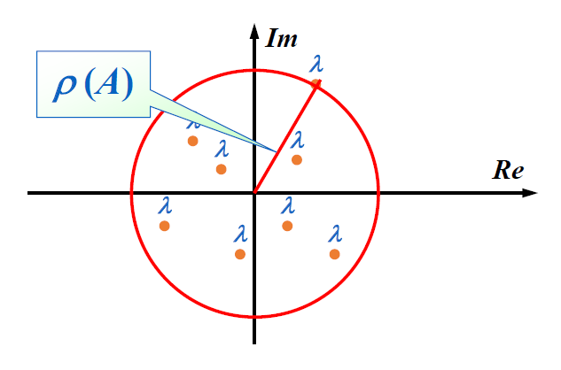
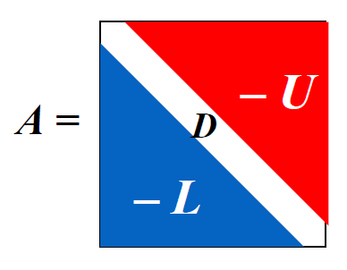
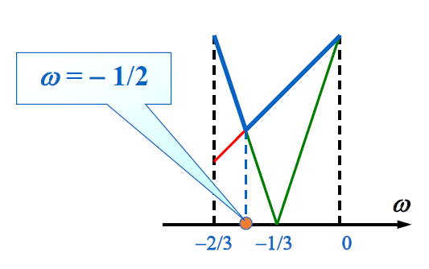

# Chap 7: Iterative Techniques in Matrix Algebra

目标：同第6章，还是求解 $A \bm{x} = \bm{b}$。

!!! info "思路"

    类似求解 $f(x) = 0$ 用的不动点迭代：
    
    - 先将 $A \bm{x} = \bm{b}$ 转化为等价的 $\bm{x} = T\bm{x} + \bm{c}$ 的形式
    - 然后从初始猜测值 $\bm{x}^{(0)}$ 开始 $\bm{x}^{(k+1)} = T\bm{x}^{(k)} + \bm{c}$ 的迭代，得到（收敛的）序列 $\{\bm{x}^{(k)}\}$

上述思路的优势在于：

- 可以通过迭代次数来控制精度
- 迭代技术被实际运用于求解**稀疏的**(sparse)线性方程组

接下来我们需要分析：

- 如何设计一个迭代方案
- 在何种条件下序列将会收敛
- 某个方法的收敛速度有多快
- 误差评估


## Norms of Vectors and Matrices

### Vector Norms

在 $R^n$ 上的**向量范数**(vector norm)是一个函数 $\| \cdot \|$。$\forall \bm{x}, \bm{y} \in R^n, \alpha \in C$，它将基于以下性质，从 $R^n$ 映射到 $R$：

- **正定**：$\| \bm{x} \| \ge 0, \| \bm{x} \| = 0 \Leftrightarrow \bm{x} = \bm{0}$
- **齐次**(homogeneous)：$\| \alpha \bm{x} \| = |\alpha| \cdot \| \bm{x} \|$
- **三角不等式**：$\| \bm{x} + \bm{y}\| \le \| \bm{x} \| + \| \bm{y} \|$

一些常用的范数：

- $\| \bm{x} \|_1 = \sum\limits_{i=1}^n \|x_i\|$
- $\| \bm{x} \|_2 = \sqrt{\sum\limits_{i=1}^n |x_i|^2}$（欧几里得范数）
- $\| \bm{x} \|_p = \Big( \sum\limits_{i=1}^n |x_i|^p \Big)^{\frac{1}{p}}$
- $\| \bm{x} \|_\infty = \max\limits_{1 \le i \le n} |x_i|$

注：$\lim\limits_{p \rightarrow \infty} \| \bm{x} \|_p = \| \bm{x} \|_{\infty}$

!!! definition "一些定义和定理"

    === "定义1"

        若 $\forall \varepsilon > 0$，$\exists N(\varepsilon) \in N$，使得 $\|\bm{x}^{(k)} - \bm{x}\| < \varepsilon$ 成立，那么在 $R^n$ 上的向量序列 $\{ \bm{x}^{(k)} \}_{k=1}^{\infty}$ 关于范数 $\| \cdot \|$ 收敛到 $\bm{x}$。

    === "定理1"

        当且仅当 $\lim\limits_{k \rightarrow \infty} x_i^{(k)} = x_i\ (i = 1, 2, \dots, n)$ 时，那么在 $R^n$ 上的向量序列 $\{\bm{x}\}_{k=1}^{\infty}$ 关于范数 $\| \cdot \|_{\infty}$ 收敛到 $\bm{x}$。

    === "定义2"

        若存在正常数 $C_1, C_2$，使得 $C_1 \|\bm{x}\|_B \le \|\bm{x}\|_A \le C_2 \| \bm{x} \|_B$，那么 $\| \cdot \|_A$ 和 $\| \cdot \|_B$ 是等价的。


    === "定理2"

        所有在 $R^n$ 上的向量范数都是等价的。


### Matrix Norms

对于所有规模为 $n \times n$ 的矩阵，**矩阵范数**(matrix norms)是一个实数值函数 $\| \cdot \|$。对于所有规模为 $n \times n$ 的矩阵 $A, B$ 以及所有的 $\alpha \in C$，满足：

- **正定**：$\| A \| \ge 0, \| A \| = 0 \Leftrightarrow A = O$
- **齐次**：$\| \alpha A \| = |\alpha| \cdot \| A \|$
- **三角不等式**：$\| A + B \| \le \| A \| + \| B \|$
- :star2: **一致性**(consistency)：$\| AB \| \le \| A \| \cdot \| B \|$

（下面两个小人的讨论未整理）

一些常用的范数：

- **弗罗贝尼乌斯范数**(Frobenius norm)：$\| A \|_F = \sqrt{\sum\limits_{i=1}^n \sum\limits_{j=1}^n |a_{ij}|^2}$
- **自然范数**(natural norm)
    - **算子范数**(operator norm)（和向量范数 $\| \cdot \|$ 关联）

        $$
        \| A \|_p = \max\limits_{\bm{x} \ne \bm{0}} \dfrac{\| A \bm{x} \|_p}{\| \bm{x} \|_p} = \max\limits_{\| \bm{x} \|_p = 1} \| A\bm{x} \|_p
        $$

    - **谱范数**(spectral norm)：$\begin{cases} \| A \|_{\infty} = \max\limits_{1 \le i \le n} \sum\limits_{j=1}^n |a_{ij}| \\ \| A \|_1 = \max\limits_{1 \le j \le n} \sum\limits_{i=1}^n |a_{ij}| \\ \| A \|_2 = \sqrt{\lambda_{\max} (A^T A)}\end{cases}$


        ??? proof "证明 $A \|_{\infty} = \max\limits_{1 \le i \le n} \sum\limits_{j=1}^n |a_{ij}|$"

            1. 证明 $\| A \|_{\infty} = \max\limits_{\| \bm{x} \|_{\infty} = 1} \| A \bm{x} \|_{\infty} \le \max\limits_{1 \le i \le n} \sum\limits_{j=1}^n |a_{ij}|$

                $$
                \| A \bm{x} \|_{\infty} = \max\limits_{1 \le i \le n} |(A \bm{x})_i| = \max\limits_{1 \le i \le n} |\sum\limits_{j=1}^n a_{ij} x_j| \le \max\limits_{1 \le i \le n} \sum\limits_{j=1}^n |a_{ij}| \cdot \max\limits_{1 \le i \le n} |x_j|
                $$

            2. 证明 $\| A \|_{\infty} = \max\limits_{\| \bm{x} \|_{\infty} = 1} \| A\bm{x} \|_{\infty} \ge \max\limits_{1 \le i \le n} \sum\limits_{j=1}^n |a_{ij}|$

                - 令第 $p$ 行为最大行，即满足 $\sum\limits_{j=1}^n |a_{pj}| = \max\limits_{1 \le i \le n} \sum\limits_{j=1}^n |a_{ij}|$
                - 取一个特殊的单位向量 $\bm{x}$ 使得 $x_j = \begin{cases} 1, & \text{if } a_{pj} \ge 0 \\ -1, & \text{if } a_{pj} < 0 \end{cases}$

                $$
                \| A \bm{x} \|_{\infty} = \max\limits_{1 \le i \le n} \Big| \sum\limits_{j=1}^n a_{ij} x_j\Big| \ge \Big| \sum\limits_{j=1}^n a_{pj} x_j \Big| = \Big| \sum\limits_{j=1}^n |a_{pj}| \Big| = \max\limits_{1 \le i \le n} \sum\limits_{j=1}^n |a_{ij}|
                $$


## Eigenvalues and Eigenvectors

矩阵 $A$ 的**谱半径**(spectral radius) $\rho(A) = \max{| \lambda |}$，其中 $\lambda$ 是 $A$ 的特征值。

<div style="text-align: center">
    
</div>

!!! definition "定理"

    如果 $A$ 是一个 $n \times n$ 的矩阵，那么对于所有的自然范数 $\| \cdot \|$，有 $\rho(A) \le \| A \|$ 成立。

    ??? proof "证明"

        对于 $A$ 的任何特征值 $\lambda$ 以及特征向量 $\| \bm{x} \|$，且 $\| \bm{x} \| = 1$，有：

        $$
        |\lambda| \cdot \| \bm{x} \| = \| \lambda \bm{x} \| = \| A\bm{x} \| \le \| A \| \cdot \| \bm{x} \|
        $$

若 $\forall i, j = 1, 2, \dots, n$，有 $\lim\limits_{k \rightarrow \infty} (A^k)_{ij} = 0$，那么称规模为 $n \times n$ 的矩阵 $A$ 是**收敛**的。


## Iterative Techniques for Solving Linear Systems

### Jacobi Iterative Method

对于线性方程组 $\begin{cases}a_{11}x_1 + a_{12}x_2 + \dots + a_{1n}x_n = b_1 \\ a_{21}x_1 + a_{22}x_2 + \dots + a_{2n}x_n = b_2 \\ \dots \\ a_{n1}x_1 + a_{n2}x_2 + \dots + a_{nn}x_n = b_n\end{cases}$，当 $a_{ii} \ne 0$ 时，可以解得：

$$
\begin{cases}
x_1 = \dfrac{1}{a_{11}}(-a_{12}x_2 - \dots - a_{1n}x_n + b_1) \\ x_2 = \dfrac{1}{a_{22}}(-a_{21}x_1 - \dots - a_{2n}x_n + b_1) \\ x_n = \dfrac{1}{a_{nn}}(-a_{n1}x_1 - \dots - a_{1n, n-1}x_{n-1} + b_n) 
\end{cases}
$$

用矩阵形式表示上述线形方程组，并转化为以下形式：

<div style="text-align: center">
    
</div>

那么：

$$
\begin{align}
A\bm{x} = \bm{b} & \Leftrightarrow (D - L - U)\bm{x} = \bm{b} \notag \\
& \Leftrightarrow D\bm{x} = (L + U) \bm{x} + \bm{b} \notag \\
& \Leftrightarrow \bm{x} = \underbrace{D^{-1} (L + U)}_{T_j} \bm{x} + \underbrace{D^{-1} \bm{b}}_{\bm{c_j}} \notag \\
\dots & \dots \notag
\end{align}
$$

所以对于第 $k$ 次高斯消元而言，$\bm{x}^{(k)} = T_j \bm{x}^{(k-1)} + \bm{c_j}$，其中 $T_j$ 被称为**雅可比迭代矩阵**(Jacobi iterative matrix)。

???+ code "算法：雅可比迭代方法"

    对于给定的初始近似解 $\bm{x}^{(0)}$，求解 $A\bm{x} = \bm{b}$

    - 输入：方程和未知数的个数 $n$，矩阵元素 $a[][]$，常数项 $b[]$，初始近似解 $X0[]$，容忍值 $TOL$，最大迭代次数 $N_{max}$
    - 输出：近似解 $X[]$ 或错误信息

    ```c
    Step 1  Set k = 1;
    Step 2  while (k <= N_max) do step 3-6
            Step 3  for i = 1, ..., n
                        Set X_i = (b_i - sum(j=1, j!=i, j<=n, a_ij X0_j)) / a_ii;  // compute x_k
            Step 4  if norm(X - X_0)_infty = max(1<=i<=n, X_i - X0_i) < TOL then Output(X[]);
                    STOP;    // successful
            Step 5  for i = 1, ..., n  Set X0[] = X[];  // update X0
            Step 6  Set k++;
    Step 7  Output (Maximum number of iterations exceeded);
            STOP.    // unsuccessful
    ```


### Gauss-Seidel Iterative Method

观察线性方程组的解：

$$
\begin{align}
x_2^{(k)} & = \dfrac{1}{a_{22}}(\textcolor{red}{-a_{21}x_1^{(k)}} - a_{23}x_3^{(k-1)} - a_{24}x_4^{(k-1)} - \dots - a_{2n}x_n^{k-1} + b_2) \notag \\ 
x_3^{(k)} & = \dfrac{1}{a_{33}}(\textcolor{red}{-a_{31}x_1^{(k)} - a_{32}x_2^{(k)}} - a_{34}x_4^{(k-1)} - \dots - a_{3n}x_n^{k-1} + b_3) \notag \\ 
\dots \notag \\ 
x_n^{(k)} & = \dfrac{1}{a_{nn}}(\textcolor{red}{-a_{n1}x_1^{(k)} -a_{n2}x_2^{(k)} -a_{n3}x_3^{(k)} - \dots - a_{n, n-1}x_{n-1}^{k}} + b_n) \notag
\end{align}
$$

用矩阵形式表述为：

$$
\begin{align}
& \bm{x}^{(k)} = D^{-1} (L\bm{x}^{(k)} + U\bm{x}^{(k-1)}) + D^{-1} \bm{b} \notag \\
\Leftrightarrow & (D - L)\bm{x}^{(k)} = U\bm{x}^{(k-1)} + \bm{b} \notag \\
\Leftrightarrow & \bm{x}^{(k)} = \underbrace{(D - L)^{-1} U }_{T_g} \bm{x}^{(k-1)} + \underbrace{(D - L)^{-1}}_{\bm{c}_g} \bm{b} \notag
\end{align}
$$

其中 $T_g$ 为**高斯-赛德尔迭代矩阵**(Gauss-Seidel iterative matrix)。


### Convergence of Iterative Method

现在我们来考察迭代法 $\bm{x}^{(k)} = T\bm{x}^{(k-1)} + \bm{c}$ 的收敛性。

!!! definition "定理"

    以下语句是等价的：

    - $A$ 是一个收敛矩阵
    - 对于某些自然范数，$\lim\limits_{n \rightarrow \infty} \| A^n \| = 0$
    - 对于所有自然范数，$\lim\limits_{n \rightarrow \infty} \| A^n \| = 0$
    - $\textcolor{red}{\rho(A) < 1}$
    - $\forall \bm{x},\ \lim\limits_{n \rightarrow \infty} A^n \bm{x} = \bm{0}$

>下面一串式子有待理解和整理：

$$
\textcolor{red}{\bm{e}^{(k)}} = \bm{x^{(k)}} - \bm{x^*} = (T\bm{x^{(k-1)}} + \bm{c}) - (T\bm{x^*} + \bm{c}) = T(\bm{x}^{(k-1)} - \bm{x^*}) = \textcolor{red}{T \bm{e^{(k-1)}}}
$$

根据上述递推式，可以得到 $\bm{e^{(k)}} = T^k \bm{e^{(0)}}$，因此 

$$
\|\bm{e^{(k)}}\| \le \| T \| \cdot \| \bm{e^{(k-1)}} \| \le \dots \le \| T \|^k \cdot \| \bm{e^{(0)}} \|
$$

- 充分条件：$\|T\| < 1\ \Rightarrow\ \|T\|^k \rightarrow 0\ \text{as}\ k \rightarrow \infty$
- 必要条件：$\bm{e^{(k)}} \rightarrow \bm{0}\ \text{as}\ k \rightarrow \infty\ \Rightarrow T^k \rightarrow O$

!!! definition "定理"

    $\forall \bm{x^{(0)}} \in R^n$，由 $\bm{x}^{(k)} = T\bm{x}^{(k-1)} + \bm{c}\ (k \ge 1)$ 定义的序列 $\{ \bm{x^{(k)}} \}_{k=0}^\infty$，当且仅当 $\textcolor{red}{\rho(T) < 1}$ 时，会收敛到 $\bm{x} = T\bm{x} + \bm{c}$ 的唯一解。

    ??? proof "证明"

        - 假如 $\rho(T) < 1$，那么

            $$
            \begin{align}
            \bm{x}^{(k)} & = T\bm{x}^{(k-1)} + \bm{c} = T(T\bm{x}^{(k-2)} + \bm{c}) + \bm{c} = T^2 \bm{x^{(k-2)}} + (T + I)\bm{c} \notag \\
            & = \dots = \cancel{T^k\bm{x^{(0)}}} + (\textcolor{red}{T^{k-1} + \dots + T + I})\bm{c} \notag
            \end{align}
            $$

            又因为 $\rho(T) < 1 \Rightarrow (I - T)^{-1} = \sum\limits_{j=0}^{\infty} T^j$，所以：

            $$
            \lim\limits_{k \rightarrow \infty} \bm{x}^{(k)} = \lim\limits_{k \rightarrow \infty} T^k\bm{x^{(0)}} + \lim\limits_{k \rightarrow \infty} (T^{k-1} + \dots + T + I)\bm{c} = (I - T)^{-1} \bm{c}
            $$

        - $\lim\limits_{k \rightarrow \infty} \bm{e}^{(k)} \rightarrow \bm{0}\ \Rightarrow\ \lim\limits_{k \rightarrow \infty} T^k \bm{e^{(0)}} = \bm{0} \text{ for any } \bm{e^{0}}$，所以 $\rho(T) < 1$

!!! definition "定理"

    对于任意满足 $\|T\| < 1$ 的自然矩阵以及给定的向量 $\bm{c}$，那么 $\forall \bm{x^{(0)}} \in R^n$，由 $\bm{x}^{(k)} = T\bm{x}^{(k-1)} + \bm{c}$ 定义的序列 $\{ \bm{x^{(k)}} \}_{k=0}^\infty$ 会收敛到向量 $\bm{x} \in R^n$，并且由以下误差边界：

    - $\| \bm{x} - \bm{x^{(k)}}\| \le \|T\|^k \| \bm{x} - \bm{x^{0}}\|$
    
    > $\| \bm{x} - \bm{x^{(k)}}\| \approx \rho(T)^k \| \bm{x} - \bm{x^{0}}\|$

    - $\| \bm{x} - \bm{x^{(k)}}\| \le \dfrac{\|T\|^k}{1 - \|T\|} \| \bm{x^{(1)}} - \bm{x^{0}}\|$

!!! definition "定理"

    如果 $A$ 是一个严格对角占优矩阵，那么对于任意选择的初始近似解 $\bm{x^{(0)}}$，无论使用雅可比方法还是高斯-赛德尔方法，都可以让序列 $\{ \bm{x^{(k)}} \}_{k=0}^\infty$ 收敛到 $A\bm{x} = \bm{b}$ 的唯一解。

    ??? proof "证明（提示）"

        只需证明 $\forall |\lambda| \ge 1$，有 $|\lambda I - T| \ne 0$。也就是说，$\lambda$ 不能称为对应迭代矩阵 $T$ 的特征值。


### Relaxation Methods

接下来我们从另一个角度审视高斯-赛德尔方法：

$$
\begin{align}
x_i^{(k)} & = \dfrac{1}{a_{ii}} \Big[ b_i - \sum\limits_{j=1}^{i-1} a_{ij} x_i^{(k)} - \sum\limits_{j=i+1}^n a_{ij} x_j^{(k-1)} \Big] \notag \\
& = x_i^{(k-1)} + \dfrac{r_i^{(k)}}{a_{ii}} \quad \text{ where } r_i^{(k)} = b_i - \sum\limits_{j < i} a_{ij} x_j^{(k)} - \sum\limits_{j \ge i} a_{ij} x_j^{(k-1)} \notag
\end{align}
$$

令 $x_i^{(k)} = x_i^{(k-1)} + \textcolor{red}{\omega} \dfrac{r_i^{(k)}}{a_{ii}}$。对于正数 $\omega$ 的某种选择，我们能够减少残差向量的范数，并且得到更快的收敛。这样的方法称为**松弛法**(relaxation methods)。

- $0 < \omega < 1$：欠松弛法(under-relaxation methods)
- $\omega = 1$：高斯-赛德尔方法
- $\omega > 1$：逐次超松弛法(successive over-relaxation methods, SOR)

用矩阵形式可以表述为：

$$
\begin{align}
x_i^{(k)} & = x_i^{(k-1)} + \omega \dfrac{r_i^{(k)}}{a_{ii}} = (1 - \omega)x_i^{(k-1)} + \dfrac{\omega}{a_{ii}} \Big[ -\sum\limits_{j<i} a_{ij} x_j^{(k)} - \sum\limits_{j>i} a_{ij} x_j^{k-1} + b_i \Big] \notag \\
& \Rightarrow\ \bm{x^{(k)}} = (1 - \omega) \bm{x^{(k-1)}} + \omega D^{-1} [L \bm{x^{(k)}} + U \bm{x^{(k-1)}} + \bm{b}] \notag \\
& \Rightarrow\ \underbrace{(D - \omega L)^{-1} [(1 - \omega) D + \omega U]}_{T_{\omega}} \bm{x}^{(k-1)} + \underbrace{(D - \omega L)^{-1} \omega}_{\bm{c_\omega}} \bm{b} \notag
\end{align}
$$

显然，矩阵 $T_\omega$ 的表示过于复杂。幸运的是，我们还有以下更为简单的表示方法。

!!! definition "一些定理"

    === "定理1"

        Kahan 定理：若 $a_{ii} \ne 0\ (i = 1, 2, \dots, n)$，那么 $\rho(T_\omega) \ge |\omega - 1|$，这也就意味着 SOR 方法仅在 $0 < \omega < 2$ 时收敛。

    === "定理2"

        Ostrowski-Reich 定理：若 $A$ 是**正定**矩阵且 $0 < \omega < 2$，那么 SOR 方法对于任意初始近似解均能收敛。

    === "定理3"

        如果 $A$ 是**正定**的**三对角线**矩阵，那么 $\rho(T_g) = |\rho(T_j)|^2 < 1$，且 SOR 方法中 $\omega$ 的最优选择是 $\omega = \dfrac{2}{1 + \sqrt{1 - |[\rho(T_j)]^2|}}$，此时 $\rho(T_\omega) = \omega - 1$。

!!! question "讨论"

    === "题目"

        给定 $A = \begin{bmatrix}2 & 1 \\ 1 & 2\end{bmatrix}, \bm{b} = \begin{bmatrix}1 \\ 2\end{bmatrix}$，以及迭代法 $\bm{x^{(k)}} = \bm{x^{(k-1)}} + \omega (A\bm{x^{k-1}} - \bm{b})$，那么：

        - 当 $\omega$ 取什么值时，该方法会收敛？
        - 当 $\omega$ 取什么值时，该方法的收敛速度最快？

    === "解答"

        考虑 $T = I + \omega A$ 的特征值，解得 $\lambda_1 = 1 + \omega, \lambda_2 = 1 + 3 \omega$

        - 要使该方法收敛，需满足 $\rho(T) < 1 \quad \Rightarrow -\dfrac{2}{3} < \omega < 0$
        - 现在考虑 $\rho(T) = \max\{|1 + \omega|, |1 + 3\omega|\}$ 在何时取最小值——可以画图研究：

        <div style="text-align: center">
            
        </div>

        发现当 $\omega = -\dfrac{1}{2}$ 时取值最小。

