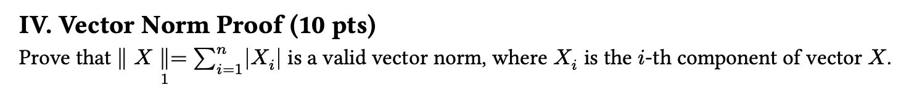
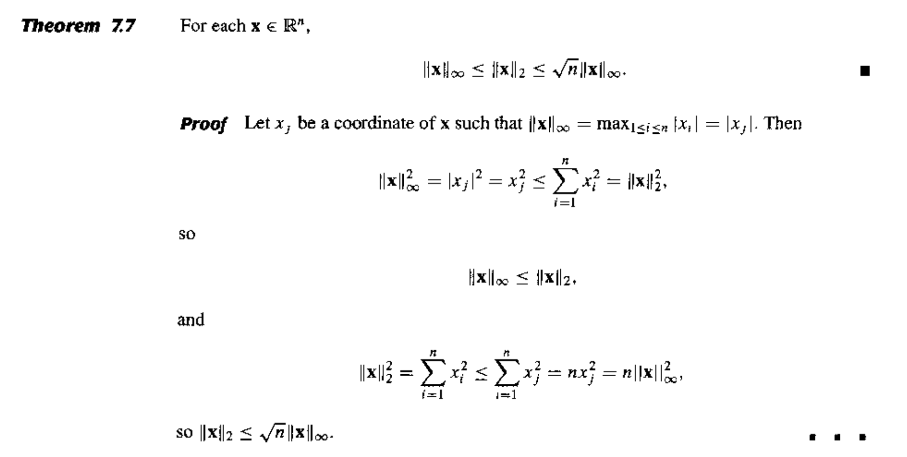
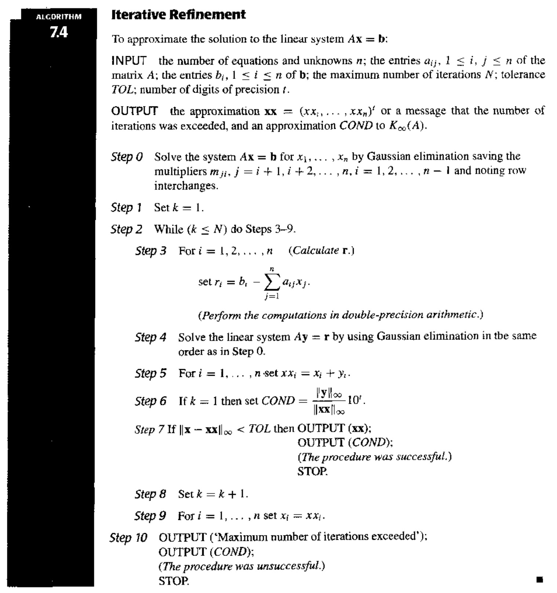

# Chap 7: Iterative Techniques in Matrix Algebra

??? abstract "核心知识"

    - 范数
        - 向量范数
        - 矩阵范数
    - 特征值和特征向量、谱半径
    - 各类迭代方法
        - 雅可比迭代法
        - 高斯-塞德尔迭代法
        - SOR
    - 收敛速度、误差边界
    - 迭代优化

目标：同第6章，还是求解 $A \bm{x} = \bm{b}$。

!!! info "思路"

    类似求解 $f(x) = 0$ 用的不动点迭代：
    
    - 先将 $A \bm{x} = \bm{b}$ 转化为等价的 $\bm{x} = T\bm{x} + \bm{c}$ 的形式
    - 然后从初始猜测值 $\bm{x}^{(0)}$ 开始 $\bm{x}^{(k+1)} = T\bm{x}^{(k)} + \bm{c}$ 的迭代，得到（收敛的）序列 $\{\bm{x}^{(k)}\}$

上述思路的优势在于：

- 可以通过迭代次数来控制精度
- 迭代技术被实际运用于求解**稀疏的**(sparse)线性方程组

接下来我们需要分析：

- 如何设计一个迭代方案
- 在何种条件下序列将会收敛
- 某个方法的收敛速度有多快
- 误差评估


## Norms of Vectors and Matrices

### Vector Norms

在 $R^n$ 上的**向量范数**(vector norm)是一个 $R^n \rightarrow R$ 的函数 $\| \cdot \|$。$\forall \bm{x}, \bm{y} \in R^n, \alpha \in C$，它满足以下性质：

- **正定**：$\| \bm{x} \| \ge 0;\ \| \bm{x} \| = 0 \Leftrightarrow \bm{x} = \bm{0}$
>此“正定”非彼[正定](6.md#choleskis-method-for-positive-definite-matrix)

- **齐次**(homogeneous)：$\| \alpha \bm{x} \| = |\alpha| \cdot \| \bm{x} \|$
- **三角不等式**：$\| \bm{x} + \bm{y}\| \le \| \bm{x} \| + \| \bm{y} \|$

??? example "例子"

    === "题目"

        <div style="text-align: center">
            
        </div>

    === "解答"

        就证明这个范数满足上述三条性质就行了，很简单的！

一些常用的范数：

- $\| \bm{x} \|_1 = \sum\limits_{i=1}^n |x_i|$
- $\| \bm{x} \|_2 = \sqrt{\sum\limits_{i=1}^n |x_i|^2}$（**欧几里得范数**，即我们熟知的**模长**）
- $\| \bm{x} \|_p = \Big( \sum\limits_{i=1}^n |x_i|^p \Big)^{\frac{1}{p}}$（**$p$ 范数**）
- $\| \bm{x} \|_\infty = \max\limits_{1 \le i \le n} |x_i|$（**无穷范数**）

注：$\lim\limits_{p \rightarrow \infty} \| \bm{x} \|_p = \| \bm{x} \|_{\infty}$

!!! theorem "一些定义和定理"

    向量的收敛性：

    === "定义1"

        若 $\forall \varepsilon > 0$，$\exists N(\varepsilon) \in N$，使得 $\|\bm{x}^{(k)} - \bm{x}\| < \varepsilon$ 成立，那么在 $R^n$ 上的向量序列 $\{ \bm{x}^{(k)} \}_{k=1}^{\infty}$ 关于范数 $\| \cdot \|$ 收敛到 $\bm{x}$。

    === "定理1"

        当且仅当 $\lim\limits_{k \rightarrow \infty} x_i^{(k)} = x_i\ (i = 1, 2, \dots, n)$ 时，那么在 $R^n$ 上的向量序列 $\{\bm{x}\}_{k=1}^{\infty}$ 关于范数 $\| \cdot \|_{\infty}$ 收敛到 $\bm{x}$。

    范数的等价性：

    === "定义2"

        若存在正常数 $C_1, C_2$，使得 $C_1 \|\bm{x}\|_B \le \|\bm{x}\|_A \le C_2 \| \bm{x} \|_B$，那么 $\| \cdot \|_A$ 和 $\| \cdot \|_B$ 是等价的。

    === "定理2"

        所有在 $R^n$ 上的向量范数都是等价的。

    下面证明了 $\| \cdot \|_2$ 和 $\| \cdot \|_\infty$ 的等价性：

    ??? proof "证明"

        <div style="text-align: center">
            
        </div>


### Matrix Norms

对于所有规模为 $n \times n$ 的矩阵，**矩阵范数**(matrix norms)是一个实数值函数 $\| \cdot \|$。对于所有规模为 $n \times n$ 的矩阵 $A, B$ 以及所有的 $\alpha \in C$，满足：

- **正定**：$\| A \| \ge 0;\ \| A \| = 0 \Leftrightarrow A = O$
- **齐次**：$\| \alpha A \| = |\alpha| \cdot \| A \|$
- **三角不等式**：$\| A + B \| \le \| A \| + \| B \|$
- :star2: **一致性**(consistency)：$\| AB \| \le \| A \| \cdot \| B \|$

下面整理了一些常用的范数：

- **弗罗贝尼乌斯范数**(Frobenius norm)：$\| A \|_F = \sqrt{\sum\limits_{i=1}^n \sum\limits_{j=1}^n |a_{ij}|^2}$
- **自然范数**(natural norm)
    - **算子范数**(operator norm)（和向量范数 $\| \cdot \|$ 关联，所以也可称为 **$p$ 范数**）

        $$
        \| A \|_p = \max\limits_{\bm{x} \ne \bm{0}} \dfrac{\| A \bm{x} \|_p}{\| \bm{x} \|_p} = \max\limits_{\| \bm{x} \|_p = 1} \| A\bm{x} \|_p
        $$

    - **无穷范数**：$\| A \|_{\infty} = \max\limits_{1 \le i \le n} \sum\limits_{j=1}^n |a_{ij}|$

        ??? proof "证明 $\|A \|_{\infty} = \max\limits_{1 \le i \le n} \sum\limits_{j=1}^n |a_{ij}|$"

            1. 证明 $\| A \|_{\infty} = \max\limits_{\| \bm{x} \|_{\infty} = 1} \| A \bm{x} \|_{\infty} \le \max\limits_{1 \le i \le n} \sum\limits_{j=1}^n |a_{ij}|$

                $$
                \| A \bm{x} \|_{\infty} = \max\limits_{1 \le i \le n} |(A \bm{x})_i| = \max\limits_{1 \le i \le n} |\sum\limits_{j=1}^n a_{ij} x_j| \le \max\limits_{1 \le i \le n} \sum\limits_{j=1}^n |a_{ij}| \cdot \max\limits_{1 \le i \le n} |x_j|
                $$

            2. 证明 $\| A \|_{\infty} = \max\limits_{\| \bm{x} \|_{\infty} = 1} \| A\bm{x} \|_{\infty} \ge \max\limits_{1 \le i \le n} \sum\limits_{j=1}^n |a_{ij}|$

                - 令第 $p$ 行为最大行，即满足 $\sum\limits_{j=1}^n |a_{pj}| = \max\limits_{1 \le i \le n} \sum\limits_{j=1}^n |a_{ij}|$
                - 取一个特殊的单位向量 $\bm{x}$ 使得 $x_j = \begin{cases} 1, & \text{if } a_{pj} \ge 0 \\ -1, & \text{if } a_{pj} < 0 \end{cases}$

                $$
                \| A \bm{x} \|_{\infty} = \max\limits_{1 \le i \le n} \Big| \sum\limits_{j=1}^n a_{ij} x_j\Big| \ge \Big| \sum\limits_{j=1}^n a_{pj} x_j \Big| = \Big| \sum\limits_{j=1}^n |a_{pj}| \Big| = \max\limits_{1 \le i \le n} \sum\limits_{j=1}^n |a_{ij}|
                $$

    - **1-范数**：$\| A \|_1 = \max\limits_{1 \le j \le n} \sum\limits_{i=1}^n |a_{ij}|$
    - **2-范数**（又称**谱范数**(spectral norm)）：$\| A \|_2 = \sqrt{\lambda_{\max} (A^T A)}$

???+ note "推论"

    对于任意向量 $\bm{z} \ne 0$，矩阵 $A$ 以及任意自然范数 $\| \cdot \|$，我们有：

    $$
    \| A \bm{z} \| \le \| A \| \cdot \| \bm{z} \|
    $$

    成立。

??? question "所以范数到底是什么？"

    PPT 上没有讲清楚我们要学范数的原因（虽然可以根据上下文推测出它会被用于迭代求解线性方程组），所以看这些概念的时候难免会一头雾水。于是，我还是让老朋友 Gemini 2.5 Flash 帮我用相对通俗的语言简单说明范数的意义，进而理解学习范数的原因：

    - 是什么？——范数是广义上的“长度”或“大小”，是任何满足三条基本性质（非负、齐次、三角不等式）的函数。
    - 有什么用？——它是一把万能的“尺子”，核心意义在于**量化**。
        - 它量化了**距离**，让我们可以在抽象空间中比较“远近”。
        - 它量化了**误差**，成为机器学习和优化问题的基石。
        - 它量化了**模型复杂度**（通过正则化），帮助我们构建更健壮的模型。

    简而言之，没有范数，我们就无法衡量和比较，现代机器学习和许多科学计算领域的大厦都将无从谈起。


## Eigenvalues and Eigenvectors

???+ info "特征值和特征向量"

    - 如果 $A$ 是一个方阵，那么 $A$ 的**特征多项式**(characteristic polynomial)为 $p(\lambda) = \det (A - \lambda I)$
    - 特征方程 $p(\lambda) = 0$ 的解就是矩阵 $A$ 的**特征值**(eigenvalues)
    - 若存在特征值 $\lambda$和向量 $\bm{x} \ne \bm{0}$，满足 $(A - \lambda I) \bm{x} = \bm{0}$，那么 $\bm{x}$ 就是 $A$ 的**特征向量**(eigenvector)

    这么说感觉很抽象（~~尤其是对笔者这种已经很久没有接触过线性代数题目的人~~）。所以建议各位观看 [3b1b 的相关视频](https://www.youtube.com/watch?v=PFDu9oVAE-g&list=PLZHQObOWTQDPD3MizzM2xVFitgF8hE_ab&index=14)，对特征值和特征向量有一个更为直观形象的认识。

矩阵 $A$ 的**谱半径**(spectral radius) $\rho(A) = \max{| \lambda |}$，其中 $\lambda$ 是 $A$ 的特征值（复数范围，所以 $|\lambda|$ 表示特征值的**模长**）。

<div style="text-align: center">
    
</div>

!!! theorem "定理"

    如果 $A$ 是一个 $n \times n$ 的矩阵，那么对于所有的自然范数 $\| \cdot \|$，有 $\rho(A) \le \| A \|$ 成立。

    ??? proof "证明"

        对于 $A$ 的任何特征值 $\lambda$ 以及特征向量 $\| \bm{x} \|$，且 $\| \bm{x} \| = 1$，有：

        $$
        |\lambda| \cdot \| \bm{x} \| = \| \lambda \bm{x} \| = \| A\bm{x} \| \le \| A \| \cdot \| \bm{x} \|
        $$

若 $\forall i, j = 1, 2, \dots, n$，有 $\lim\limits_{k \rightarrow \infty} (A^k)_{ij} = 0$，那么称规模为 $n \times n$ 的矩阵 $A$ 是**收敛**的。


## Iterative Techniques for Solving Linear Systems

当线性方程组维度不高的时候，很少会用到迭代方法，因为迭代方法达到足够精度所需的时间超过用高斯消元法计算的时间。不过在大型的线性方程组，迭代方法在存储和计算上的效率优势会变得更为明显。

下面介绍一些常见的求解线性方程组的迭代方法。


### Jacobi Iterative Method

对于线性方程组 $\begin{cases}a_{11}x_1 + a_{12}x_2 + \dots + a_{1n}x_n = b_1 \\ a_{21}x_1 + a_{22}x_2 + \dots + a_{2n}x_n = b_2 \\ \dots \\ a_{n1}x_1 + a_{n2}x_2 + \dots + a_{nn}x_n = b_n\end{cases}$，当 $a_{ii} \ne 0$ 时，不难得到：

$$
\begin{cases}
x_1 = \dfrac{1}{a_{11}}(-a_{12}x_2 - \dots - a_{1n}x_n + b_1) \\ x_2 = \dfrac{1}{a_{22}}(-a_{21}x_1 - \dots - a_{2n}x_n + b_1) \\ x_n = \dfrac{1}{a_{nn}}(-a_{n1}x_1 - \dots - a_{1n, n-1}x_{n-1} + b_n) 
\end{cases}
$$

用矩阵形式表示上述线形方程组，并转化为以下形式：

<div style="text-align: center">
    
</div>

那么：

$$
\begin{align}
A\bm{x} = \bm{b} & \Leftrightarrow (D - L - U)\bm{x} = \bm{b} \notag \\
& \Leftrightarrow D\bm{x} = (L + U) \bm{x} + \bm{b} \notag \\
& \Leftrightarrow \bm{x} = \underbrace{D^{-1} (L + U)}_{T_j} \bm{x} + \underbrace{D^{-1} \bm{b}}_{\bm{c_j}} \notag
\end{align}
$$

因此该迭代法的递推公式为：$\bm{x}^{(k)} = T_j \bm{x}^{(k-1)} + \bm{c_j}$，其中 $T_j$ 被称为**雅可比迭代矩阵**(Jacobi iterative matrix)。

>看起来矩阵表示更为简洁，但算的时候我们就可以直接用上面给出的线性方程组解来计算（下面给出的算法也正是这么做的）。

???+ code "算法：雅可比迭代方法"

    对于给定的初始近似解 $\bm{x}^{(0)}$，求解 $A\bm{x} = \bm{b}$

    - 输入：方程和未知数的个数 $n$，矩阵元素 $a[][]$，常数项 $b[]$，初始近似解 $X0[]$，容忍值 $TOL$，最大迭代次数 $N_{max}$
    - 输出：近似解 $X[]$ 或错误信息

    ```c linenums="1" hl_lines="4 7"
    Step 1  Set k = 1;
    Step 2  while (k <= N_max) do step 3-6
            Step 3  for i = 1, ..., n
                        Set X[i] = (b[i] - sum(j=1, j!=i, j<=n, a[i][j] * X[0][j])) / a[i][i];  // compute x^k
            Step 4  if norm(X - X0)_infty = max(1<=i<=n, X[i] - X0[i]) < TOL then Output(X[]);
                    STOP;    // successful
            Step 5  for i = 1, ..., n  Set X0[] = X[];  // update X0
            Step 6  Set k++;
    Step 7  Output (Maximum number of iterations exceeded);
            STOP.    // unsuccessful
    ```

    考虑高亮行：

    - 第4行：`a[i][i]` 有可能为0，不过由于在计算过程中不会修改矩阵 $A$，因此我们可以在计算前为矩阵元素**重新排序**，以保证 `a[i][i] != 0`。如果无法通过重排避免这一问题，那么矩阵 $A$ 就是**奇异的**。
    - 第7行：$X^{(k+1)}$ 必须等到 $X^{(k)}$ 的项全部算出来，因此要用两个向量来存储结果。但这样就有些浪费空间了，因为我们最后只会用到一个向量。


### Gauss-Seidel Iterative Method

观察线性方程组的解：

$$
\begin{align}
x_2^{(k)} & = \dfrac{1}{a_{22}}(\textcolor{red}{-a_{21}x_1^{(k)}} - a_{23}x_3^{(k-1)} - a_{24}x_4^{(k-1)} - \dots - a_{2n}x_n^{k-1} + b_2) \notag \\ 
x_3^{(k)} & = \dfrac{1}{a_{33}}(\textcolor{red}{-a_{31}x_1^{(k)} - a_{32}x_2^{(k)}} - a_{34}x_4^{(k-1)} - \dots - a_{3n}x_n^{k-1} + b_3) \notag \\ 
\dots \notag \\ 
x_n^{(k)} & = \dfrac{1}{a_{nn}}(\textcolor{red}{-a_{n1}x_1^{(k)} -a_{n2}x_2^{(k)} -a_{n3}x_3^{(k)} - \dots - a_{n, n-1}x_{n-1}^{k}} + b_n) \notag
\end{align}
$$

用矩阵形式表述为：

$$
\begin{align}
& \bm{x}^{(k)} = D^{-1} (L\bm{x}^{(k)} + U\bm{x}^{(k-1)}) + D^{-1} \bm{b} \notag \\
\Leftrightarrow & (D - L)\bm{x}^{(k)} = U\bm{x}^{(k-1)} + \bm{b} \notag \\
\Leftrightarrow & \bm{x}^{(k)} = \underbrace{(D - L)^{-1} U }_{T_g} \bm{x}^{(k-1)} + \underbrace{(D - L)^{-1}}_{\bm{c}_g} \bm{b} \notag
\end{align}
$$

因此该迭代法的递推公式为：$\bm{x}^{(k)} = T_g \bm{x}^{(k-1)} + c_g \bm{b}$，其中 $T_g$ 为**高斯-塞德尔迭代矩阵**(Gauss-Seidel iterative matrix)。

??? code "算法：高斯-塞德尔迭代方法"

    对于给定的初始近似解 $\bm{x}^{(0)}$，求解 $A\bm{x} = \bm{b}$

    - 输入：方程和未知数的个数 $n$，矩阵元素 $a[][]$，常数项 $b[]$，初始近似解 $X0[]$，容忍值 $TOL$，最大迭代次数 $N_{max}$
    - 输出：近似解 $X[]$ 或错误信息

    ```c
    Step 1  Set k = 1;
    Step 2  while (k <= N_max) do step 3-6
            Step 3  for i = 1, ..., n
                        Set X[i] = (-sum(j=1, i-1, a[i][j] * x[j]) - sum(j=i+1, n, a[i][j] * X0[j]) + b[i]) / a[i][i];  // compute x^k
            Step 4  if norm(X - X0)_infty = max(1<=i<=n, X[i] - X0[i]) < TOL then Output(X[]);
                    STOP;    // successful
            Step 5  for i = 1, ..., n  Set X0[] = X[];  // update X0
            Step 6  Set k++;
    Step 7  Output (Maximum number of iterations exceeded);
            STOP.    // unsuccessful
    ```

!!! note "注"

    上述两种迭代方法**不总是收敛的**。并且存在雅可比迭代法失败，但高斯-塞德尔迭代法成功的情况，反之亦然。

??? abstract "雅可比迭代法 v.s. 高斯-塞德尔迭代法（by Gemini 2.5 Flash）"

    | 特性           | 雅可比迭代法 (Jacobi Iteration)                               | 高斯-塞德尔迭代法 (Gauss-Seidel Iteration)                          |
    | :------------- | :------------------------------------------------------------ | :------------------------------------------------------------------ |
    | **信息利用**   | 计算 $x_i^{(k+1)}$ 时，完全使用 $x^{(k)}$ 的所有分量。      | 计算 $x_i^{(k+1)}$ 时，使用 $x_1^{(k+1)}, \dots, x_{i-1}^{(k+1)}$（最新值）和 $x_{i+1}^{(k)}, \dots, x_n^{(k)}$（旧值）。 |
    | **收敛速度**   | 通常比高斯-塞德尔慢。                                         | 通常比雅可比快（如果收敛的话）。                                    |
    | **收敛条件**   | 迭代矩阵 $B_J = -D^{-1}(L+U)$ 的谱半径 $\rho(B_J) < 1$。     | 迭代矩阵 $B_{GS} = -(D+L)^{-1}U$ 的谱半径 $\rho(B_{GS}) < 1$。     |
    | **并行性**     | **易于并行化**，因为每个分量的计算是独立的。                  | **难以并行化**，因为每个分量的计算依赖于前一个分量的最新值。        |
    | **内存需求**   | 需要存储 $x^{(k)}$ 和 $x^{(k+1)}$ 两套向量。                 | 可以在原地更新，只需要存储一套向量（但实际实现可能仍用两套）。      |
    | **实现复杂度** | 相对简单。                                                    | 略复杂，需要注意更新顺序。                                          |
    | **适用矩阵**   | 对角占优矩阵（严格对角占优或不可约对角占优）保证收敛。        | 对角占优矩阵（严格对角占优或不可约对角占优）保证收敛。对于对称正定矩阵，高斯-塞德尔也保证收敛。 |
    | **鲁棒性**     | 相对较差，有时会发散。                                        | 相对较好，通常比雅可比更稳定。                                      |


### Convergence of Iterative Method

现在我们来考察迭代法 $\bm{x}^{(k)} = T\bm{x}^{(k-1)} + \bm{c}$ 的收敛性。

!!! theorem "定理"

    以下语句是等价的：

    - $A$ 是一个收敛矩阵
    - 对于<u>某些</u>自然范数，$\lim\limits_{n \rightarrow \infty} \| A^n \| = 0$
    - 对于<u>所有</u>自然范数，$\lim\limits_{n \rightarrow \infty} \| A^n \| = 0$
    - $\textcolor{red}{\rho(A) < 1}$（比较常用）
    - $\forall \bm{x},\ \lim\limits_{n \rightarrow \infty} A^n \bm{x} = \bm{0}$

    ??? note "一些补充说明（主要针对第4和5点）"

        $$
        \textcolor{red}{\bm{e}^{(k)}} = \bm{x^{(k)}} - \bm{x^*} = (T\bm{x^{(k-1)}} + \bm{c}) - (T\bm{x^*} + \bm{c}) = T(\bm{x}^{(k-1)} - \bm{x^*}) = \textcolor{red}{T \bm{e^{(k-1)}}}
        $$

        根据上述递推式，可以得到 $\bm{e^{(k)}} = T^k \bm{e^{(0)}}$，因此 

        $$
        \|\bm{e^{(k)}}\| \le \| T \| \cdot \| \bm{e^{(k-1)}} \| \le \dots \le \| T \|^k \cdot \| \bm{e^{(0)}} \|
        $$

        - 充分条件：$\|T\| < 1\ \Rightarrow\ \|T\|^k \rightarrow 0\ \text{as}\ k \rightarrow \infty$
        - 必要条件：$\bm{e^{(k)}} \rightarrow \bm{0}\ \text{as}\ k \rightarrow \infty\ \Rightarrow T^k \rightarrow O$

!!! theorem "定理"

    $\forall \bm{x^{(0)}} \in R^n$，由 $\bm{x}^{(k)} = T\bm{x}^{(k-1)} + \bm{c}\ (k \ge 1)$ 定义的序列 $\{ \bm{x^{(k)}} \}_{k=0}^\infty$，当且仅当 $\textcolor{red}{\rho(T) < 1}$ 时，会收敛到 $\bm{x} = T\bm{x} + \bm{c}$ 的唯一解。

    >可以把这个定理看作是[**不动点定理**](2.md#fixed-point-iteration)在矩阵中的应用。

    ??? proof "证明"

        - 假如 $\rho(T) < 1$，那么

            $$
            \begin{align}
            \bm{x}^{(k)} & = T\bm{x}^{(k-1)} + \bm{c} = T(T\bm{x}^{(k-2)} + \bm{c}) + \bm{c} = T^2 \bm{x^{(k-2)}} + (T + I)\bm{c} \notag \\
            & = \dots = \cancel{T^k\bm{x^{(0)}}} + (\textcolor{red}{T^{k-1} + \dots + T + I})\bm{c} \notag
            \end{align}
            $$

            又因为 $\rho(T) < 1 \Rightarrow (I - T)^{-1} = \sum\limits_{j=0}^{\infty} T^j$，所以：

            $$
            \lim\limits_{k \rightarrow \infty} \bm{x}^{(k)} = \lim\limits_{k \rightarrow \infty} T^k\bm{x^{(0)}} + \lim\limits_{k \rightarrow \infty} (T^{k-1} + \dots + T + I)\bm{c} = (I - T)^{-1} \bm{c}
            $$

        - $\lim\limits_{k \rightarrow \infty} \bm{e}^{(k)} \rightarrow \bm{0}\ \Rightarrow\ \lim\limits_{k \rightarrow \infty} T^k \bm{e^{(0)}} = \bm{0} \text{ for any } \bm{e^{0}}$，所以 $\rho(T) < 1$

!!! theorem "定理"

    对于任意满足 $\|T\| < 1$ 的自然矩阵以及给定的向量 $\bm{c}$，那么 $\forall \bm{x^{(0)}} \in R^n$，由 $\bm{x}^{(k)} = T\bm{x}^{(k-1)} + \bm{c}$ 定义的序列 $\{ \bm{x^{(k)}} \}_{k=0}^\infty$ 会收敛到向量 $\bm{x} \in R^n$，并且由以下误差边界：

    - $\| \bm{x} - \bm{x^{(k)}}\| \le \|T\|^k \| \bm{x} - \bm{x^{0}}\|$
        - $\| \bm{x} - \bm{x^{(k)}}\| \approx \rho(T)^k \| \bm{x} - \bm{x^{0}}\|$。因此，**谱半径越小，迭代法的收敛速度越快**

    - $\| \bm{x} - \bm{x^{(k)}}\| \le \dfrac{\|T\|^k}{1 - \|T\|} \| \bm{x^{(1)}} - \bm{x^{0}}\|$

    >该定理同样对应“[不动点定理](2.md#fixed-point-iteration)”一节中给出的那2个不等式推论

    !!! proof "证明可以看[前辈的笔记](https://note.jiepeng.tech/CS/NA/Chapter_07/#error-bounds-for-iterative-methods)"

!!! theorem "定理"

    如果 $A$ 是一个严格对角占优矩阵，那么对于任意选择的初始近似解 $\bm{x^{(0)}}$，无论使用雅可比方法还是高斯-塞德尔方法，都可以让序列 $\{ \bm{x^{(k)}} \}_{k=0}^\infty$ 收敛到 $A\bm{x} = \bm{b}$ 的唯一解。

    ??? proof "证明（提示）"

        只需证明 $\forall |\lambda| \ge 1$，有 $|\lambda I - T| \ne 0$。也就是说，$\lambda$ 不能称为对应迭代矩阵 $T$ 的特征值。


### Relaxation Methods

???+ note "残差向量"

    假设 $\widetilde{\bm{x}} \in \mathbb{R}^n$ 是线性方程组 $A \bm{x} = \bm{b}$ 的近似解，那么关于该线性方程组的 $\widetilde{\bm{x}}$ 的**残差向量**(residual vector)为 $\bm{r} = \bm{b} - A \widetilde{\bm{x}}$

接下来我们从残差向量的角度审视高斯-塞德尔方法：

$$
\begin{align}
x_i^{(k)} & = \dfrac{1}{a_{ii}} \Big[ b_i - \sum\limits_{j=1}^{i-1} a_{ij} x_i^{(k)} - \sum\limits_{j=i+1}^n a_{ij} x_j^{(k-1)} \Big] \notag \\
& = x_i^{(k-1)} + \dfrac{r_i^{(k)}}{a_{ii}} \quad \text{ where } r_i^{(k)} = b_i - \sum\limits_{j < i} a_{ij} x_j^{(k)} - \sum\limits_{j \ge i} a_{ij} x_j^{(k-1)} \notag
\end{align}
$$

令 $x_i^{(k)} = x_i^{(k-1)} + \textcolor{red}{\omega} \dfrac{r_i^{(k)}}{a_{ii}}$。对于正数 $\omega$ 的某种选择，我们能够减少残差向量 $\bm{r}$ 的范数，并且得到更快的收敛。这样的方法称为**松弛法**(relaxation methods)。根据 $\omega$ 的大小，我们有以下几类松弛法：

- $0 < \omega < 1$：**欠松弛法**(under-relaxation methods)
- $\omega = 1$：**高斯-塞德尔方法**
- $\omega > 1$：**逐次超松弛法**(successive over-relaxation methods, **SOR**)
    - 通常能加速收敛，这就是“超松弛”的由来——它“超前”地调整了更新方向，使得迭代步长更大，更快地逼近真实解

用矩阵形式可以表述为：

$$
\begin{align}
x_i^{(k)} & = x_i^{(k-1)} + \omega \dfrac{r_i^{(k)}}{a_{ii}} = (1 - \omega)x_i^{(k-1)} + \dfrac{\omega}{a_{ii}} \Big[ -\sum\limits_{j<i} a_{ij} x_j^{(k)} - \sum\limits_{j>i} a_{ij} x_j^{k-1} + b_i \Big] \notag \\
& \Rightarrow\ \bm{x^{(k)}} = (1 - \omega) \bm{x^{(k-1)}} + \omega D^{-1} [L \bm{x^{(k)}} + U \bm{x^{(k-1)}} + \bm{b}] \notag \\
& \Rightarrow\ \underbrace{(D - \omega L)^{-1} [(1 - \omega) D + \omega U]}_{T_{\omega}} \bm{x}^{(k-1)} + \underbrace{(D - \omega L)^{-1} \omega}_{\bm{c_\omega}} \bm{b} \notag
\end{align}
$$

也就是说，SOR 迭代法的递推公式为：$\bm{x}^{(k)} = T_\omega \bm{x}^{(k-1)} + \bm{c}_\omega \bm{b}$。

显然，矩阵 $T_\omega$ 的表示过于复杂，因而很难准确得到它的谱半径。但好在我们还可以走以下“捷径”，有助于我们选择合适的 $\omega$ 值。

!!! theorem "一些定理"

    === "定理1"

        **Kahan 定理**：若 $a_{ii} \ne 0\ (i = 1, 2, \dots, n)$，那么 $\rho(T_\omega) \ge |\omega - 1|$，这也就意味着 SOR 方法仅在 $0 < \omega < 2$ 时收敛。

    === "定理2"

        **Ostrowski-Reich 定理**：若 $A$ 是**正定**矩阵且 $0 < \omega < 2$，那么 SOR 方法对于任意初始近似解均能收敛。

    === "定理3"

        如果 $A$ 是**正定**的**三对角线**矩阵，那么 $\rho(T_g) = |\rho(T_j)|^2 < 1$，且 SOR 方法中 $\omega$ 的最优选择是 $\omega = \dfrac{2}{1 + \sqrt{1 - |[\rho(T_j)]^2|}}$，此时 $\rho(T_\omega) = \omega - 1$。

!!! question "讨论"

    === "题目"

        给定 $A = \begin{bmatrix}2 & 1 \\ 1 & 2\end{bmatrix}, \bm{b} = \begin{bmatrix}1 \\ 2\end{bmatrix}$，以及迭代法 $\bm{x^{(k)}} = \bm{x^{(k-1)}} + \omega (A\bm{x^{(k-1)}} - \bm{b})$，那么：

        - 当 $\omega$ 取什么值时，该方法会收敛？
        - 当 $\omega$ 取什么值时，该方法的收敛速度最快？

    === "解答"

        考虑 $T = I + \omega A$ 的特征值，解得 $\lambda_1 = 1 + \omega, \lambda_2 = 1 + 3 \omega$

        - 要使该方法收敛，需满足 $\rho(T) < 1 \quad \Rightarrow -\dfrac{2}{3} < \omega < 0$
        - 现在考虑 $\rho(T) = \max\{|1 + \omega|, |1 + 3\omega|\}$ 在何时取最小值（即收敛速度最快的时候）——我们可以画图研究：

        <div style="text-align: center">
            
        </div>

        发现当 $\omega = -\dfrac{1}{2}$ 时取值最小。

??? code "算法：SOR 迭代法"

    对于给定的初始近似解 $\bm{x}^{(0)}$ 和参数 $\omega$，求解 $A\bm{x} = \bm{b}$

    - 输入：方程和未知数的个数 $n$，矩阵元素 $a[][]$，常数项 $b[]$，初始近似解 $X0[]$，参数 $\omega$，容忍值 $TOL$，最大迭代次数 $N_{max}$
    - 输出：近似解 $X[]$ 或错误信息

    ```c
    Step 1  Set k = 1;
    Step 2  while (k <= N_max) do step 3-6
            Step 3  for i = 1, ..., n
                        Set X[i] = (1 - omega) * X0[i] + (omega * (-sum(j=1, i-1, a[i][j] * x[j]) - sum(j=i+1, n, a[i][j] * X0[j]) + b[i])) / a[i][i]  // compute x^k
            Step 4  if norm(X - X0)_infty = max(1<=i<=n, X[i] - X0[i]) < TOL then Output(X[]);
                    STOP;    // successful
            Step 5  for i = 1, ..., n  Set X0[] = X[];  // update X0
            Step 6  Set k++;
    Step 7  Output (Maximum number of iterations exceeded);
            STOP.    // unsuccessful
    ```


## Error Bounds and Iterative Refinement

目标：研究 $A$ 和 $\bm{b}$ 的误差会如何影响 $A \bm{x} = \bm{b}$ 的解 $\bm{x}$？

假设 <u>$A$ 是准确的，$\bm{b}$ 有误差 $\delta \bm{b}$</u>，那么带有误差的解可以写成 $\bm{x} + \delta \bm{x}$。可以得到：

$$
A (\bm{x} + \delta \bm{x}) = \bm{b} + \delta \bm{b} \Rightarrow \dfrac{\| \delta \bm{x} \|}{\| \bm{x} \|} \le \| A \| \cdot \| A^{-1} \| \cdot \dfrac{\| \delta \bm{b} \|}{\| \bm{b} \|}
$$

其中 $\| A \| \cdot \| A^{-1} \|$ 被称为**相对放大因子**(relative amplification factor)。

??? proof "证明"

    由 $\bm{b} = A\bm{x}$，根据范数的性质可以得到 $\|\bm{b}\| \le \|A\| \cdot \|\bm{x}\|$，因此 $\dfrac{1}{\|\bm{x}\|} \le \dfrac{\|A\|}{\|\bm{b}\|}$。所以：

    $$
    \dfrac{\| \delta \bm{x} \|}{\| \bm{x} \|} \le \dfrac{\| A \| \cdot \| A^{-1} \|}{\| \bm{b} \|} \cdot \| \delta \bm{b} \|
    $$

!!! theorem "定理"

    如果矩阵 $B$ 在某些自然范数上满足 $\| B \| < 1$，那么：

    - $I \pm B$ 是非奇异的
    - $\| (I \pm B)^{-1} \| \le \dfrac{1}{1 - \| B \|}$

---
假如 <u>$\bm{b}$ 是准确的，$A$ 有误差 $\delta A$</u>，那么带有误差的解可以写成 $\bm{x} + \delta \bm{x}$。可以得到：

$$
\begin{align}
& (A + \delta A) (\bm{x} + \delta \bm{x}) = \bm{b} \notag \\
\Rightarrow & \dfrac{\| \delta \bm{x} \|}{\| \bm{x} \|} \le \dfrac{\| A^{-1} \| \cdot \| \delta A \|}{1 - \| A^{-1} \| \cdot \| \delta A \|} = \dfrac{\| A^{-1} \| \cdot \| A \| \cdot \frac{\| \delta A \|}{\| A \|}}{1 - \| A^{-1} \| \cdot \| A \| \cdot \frac{\| \delta A \|}{\| A \|}} \notag
\end{align}
$$

其中 $\| A \| \cdot \| A^{-1} \|$ 是误差放大的关键因子，被称为**条件数**(condition number)，记作 $K(A)$。

- 如果 $K(A)$ 接近1，那么矩阵 $A$ 是**良态的**(well-conditioned)
- 如果 $K(A)$ 比远大于1，那么矩阵 $A$ 是**病态的**(ill-conditioned)

!!! theorem "定理"

    假设 $A$ 是非奇异的，且 $\| \delta A \| < \dfrac{1}{\| A^{-1} \|}$。那么 $(A + \delta A) (\bm{x} + \delta \bm{x}) = \bm{b} + \delta \bm{b}$ 的解 $\bm{x} + \delta \bm{x}$ 近似于 $A \bm{x} = \bm{b}$ 的解 $\bm{x}$，（相对）误差为：

    $$
    \dfrac{\| \delta \bm{x} \|}{\| \bm{x} \|} \le \dfrac{K(A)}{1 - K(A) \frac{\| \delta A\|}{\| A \|}} \Big(\dfrac{\| \delta A \|}{\| A \|} + \dfrac{\| \delta \bm{b} \|}{\| \bm{b} \|} \Big)
    $$

!!! note "注"

    >条件数 $K(A)_i$ 的下标 $i$ 表示所使用的[矩阵范数](#matrix-norms)的类型（比如 $i=2$ 表示的就是 2-范数）

    - 如果 $A$ 是**对称的**，那么 $K(A)_2 = \dfrac{\max |\lambda|}{\min |\lambda|}$
    - 对于所有自然范数 $\| \cdot \|_p$，$K(A)_p \ge 1$
    - $\forall\ \alpha \in R, K(\alpha A) = K(A)$
    - 如果 $A$ 是正交的（即 $A^{-1} = A^T$），那么 $K(A)_2 = 1$
    - 对于所有正交矩阵 $R$，$K(RA)_2 = K(AR)_2 = K(A)_2$

???+ question "讨论"

    === "问题"

        对于给定的 $A = \begin{bmatrix}1 & 0.99 \\ 0.99 & 0.98\end{bmatrix}, \bm{b} = \begin{bmatrix}1.99 \\ 1.97\end{bmatrix}$

        1. 计算 $K(A)_2$
        2. 给 $\bm{b}$ 一个很小的扰动 $\delta \bm{b} = \begin{bmatrix}-0.97 \times 10^{-4} \\ 0.106 \times 10^{-3}\end{bmatrix}$，原方程的解会有什么变化？

    === "解答"

        直接从[前辈笔记](https://note.jiepeng.tech/CS/NA/Chapter_07/#_9)上 copy 下来的：

        <div style="text-align: center">
            
        </div>
        <div style="text-align: center">
            
        </div>


### Iterative Refinement

!!! theorem "定理"

    假设 $\bm{x}^*$ 是 $A \bm{x} = \bm{b}$ 的近似解，$A$ 是一个非奇异矩阵，$\bm{r} = \bm{b} - A\bm{x}$ 是 $\bm{x}^*$ 的残差向量。那么对于任意自然范数，$\| \bm{x} - \bm{x}^* \| \le \| \bm{r} \| \cdot \| A^{-1} \|$。且如果 $\bm{x} \ne \bm{0}, \bm{b} \ne \bm{0}$，那么：

    $$
    \dfrac{\| \bm{x} - \bm{x}^* \|}{\| \bm{x} \|} \le K(A) \dfrac{\| \bm{r} \|}{\| \bm{b} \|}
    $$

**迭代优化**(iterative refinement)的步骤为：

1. $A \bm{x} = \bm{b} \Rightarrow$ 近似解 $\bm{x}_1$
2. $\bm{r}_1 = \bm{b} - A \bm{x}_1$
3. $A \bm{d}_1 = \bm{r}_1 \Rightarrow \bm{d}_1$
    - 如果 $\bm{d}_1$ 是精确的，那么 $\bm{x}_2 = \bm{x}_1 + A^{-1} (\bm{b} - A\bm{x}_1) = A^{-1} \bm{b}$，$\bm{x}_2$ 也是精确的。
4. $\bm{x}_2 = \bm{x}_1 + \bm{d}_1$

之后重复 2-4 步。

??? code "算法：迭代优化"

    <div style="text-align: center">
        
    </div>


>对应的[作业练习](hw.md#chap-7-iterative-techniques-in-matrix-algebra)📝

>对应[小测5和6](quizzes.md)💯