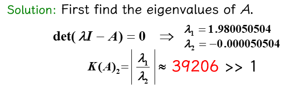

# Chap 7: Iterative Techniques in Matrix Algebra

目标：同第6章，还是求解 $A \bm{x} = \bm{b}$。

!!! info "思路"

    类似求解 $f(x) = 0$ 用的不动点迭代：
    
    - 先将 $A \bm{x} = \bm{b}$ 转化为等价的 $\bm{x} = T\bm{x} + \bm{c}$ 的形式
    - 然后从初始猜测值 $\bm{x}^{(0)}$ 开始 $\bm{x}^{(k+1)} = T\bm{x}^{(k)} + \bm{c}$ 的迭代，得到（收敛的）序列 $\{\bm{x}^{(k)}\}$

上述思路的优势在于：

- 可以通过迭代次数来控制精度
- 迭代技术被实际运用于求解**稀疏的**(sparse)线性方程组

接下来我们需要分析：

- 如何设计一个迭代方案
- 在何种条件下序列将会收敛
- 某个方法的收敛速度有多快
- 误差评估


## Norms of Vectors and Matrices

### Vector Norms

在 $R^n$ 上的**向量范数**(vector norm)是一个函数 $\| \cdot \|$。$\forall \bm{x}, \bm{y} \in R^n, \alpha \in C$，它将基于以下性质，从 $R^n$ 映射到 $R$：

- **正定**：$\| \bm{x} \| \ge 0, \| \bm{x} \| = 0 \Leftrightarrow \bm{x} = \bm{0}$
- **齐次**(homogeneous)：$\| \alpha \bm{x} \| = |\alpha| \cdot \| \bm{x} \|$
- **三角不等式**：$\| \bm{x} + \bm{y}\| \le \| \bm{x} \| + \| \bm{y} \|$

一些常用的范数：

- $\| \bm{x} \|_1 = \sum\limits_{i=1}^n \|x_i\|$
- $\| \bm{x} \|_2 = \sqrt{\sum\limits_{i=1}^n |x_i|^2}$（**欧几里得范数**）
- $\| \bm{x} \|_p = \Big( \sum\limits_{i=1}^n |x_i|^p \Big)^{\frac{1}{p}}$（**$p$ 范数**）
- $\| \bm{x} \|_\infty = \max\limits_{1 \le i \le n} |x_i|$（**无穷范数**）

注：$\lim\limits_{p \rightarrow \infty} \| \bm{x} \|_p = \| \bm{x} \|_{\infty}$

!!! theorem "一些定义和定理"

    向量的收敛性：

    === "定义1"

        若 $\forall \varepsilon > 0$，$\exists N(\varepsilon) \in N$，使得 $\|\bm{x}^{(k)} - \bm{x}\| < \varepsilon$ 成立，那么在 $R^n$ 上的向量序列 $\{ \bm{x}^{(k)} \}_{k=1}^{\infty}$ 关于范数 $\| \cdot \|$ 收敛到 $\bm{x}$。

    === "定理1"

        当且仅当 $\lim\limits_{k \rightarrow \infty} x_i^{(k)} = x_i\ (i = 1, 2, \dots, n)$ 时，那么在 $R^n$ 上的向量序列 $\{\bm{x}\}_{k=1}^{\infty}$ 关于范数 $\| \cdot \|_{\infty}$ 收敛到 $\bm{x}$。

    范数的等价性：

    === "定义2"

        若存在正常数 $C_1, C_2$，使得 $C_1 \|\bm{x}\|_B \le \|\bm{x}\|_A \le C_2 \| \bm{x} \|_B$，那么 $\| \cdot \|_A$ 和 $\| \cdot \|_B$ 是等价的。

    === "定理2"

        所有在 $R^n$ 上的向量范数都是等价的。

    下面证明了 $\| \cdot \|_2$ 和 $\| \cdot \|_\infty$ 的等价性：

    ??? proof "证明"

        <div style="text-align: center">
            
        </div>


### Matrix Norms

对于所有规模为 $n \times n$ 的矩阵，**矩阵范数**(matrix norms)是一个实数值函数 $\| \cdot \|$。对于所有规模为 $n \times n$ 的矩阵 $A, B$ 以及所有的 $\alpha \in C$，满足：

- **正定**：$\| A \| \ge 0, \| A \| = 0 \Leftrightarrow A = O$
- **齐次**：$\| \alpha A \| = |\alpha| \cdot \| A \|$
- **三角不等式**：$\| A + B \| \le \| A \| + \| B \|$
- :star2: **一致性**(consistency)：$\| AB \| \le \| A \| \cdot \| B \|$

下面整理了一些常用的范数：

- **弗罗贝尼乌斯范数**(Frobenius norm)：$\| A \|_F = \sqrt{\sum\limits_{i=1}^n \sum\limits_{j=1}^n |a_{ij}|^2}$
- **自然范数**(natural norm)
    - **算子范数**(operator norm)（和向量范数 $\| \cdot \|$ 关联，所以也可称为 **$p$ 范数**）

        $$
        \| A \|_p = \max\limits_{\bm{x} \ne \bm{0}} \dfrac{\| A \bm{x} \|_p}{\| \bm{x} \|_p} = \max\limits_{\| \bm{x} \|_p = 1} \| A\bm{x} \|_p
        $$

    - **无穷范数**：$\| A \|_{\infty} = \max\limits_{1 \le i \le n} \sum\limits_{j=1}^n |a_{ij}|$

        ??? proof "证明 $\|A \|_{\infty} = \max\limits_{1 \le i \le n} \sum\limits_{j=1}^n |a_{ij}|$"

            1. 证明 $\| A \|_{\infty} = \max\limits_{\| \bm{x} \|_{\infty} = 1} \| A \bm{x} \|_{\infty} \le \max\limits_{1 \le i \le n} \sum\limits_{j=1}^n |a_{ij}|$

                $$
                \| A \bm{x} \|_{\infty} = \max\limits_{1 \le i \le n} |(A \bm{x})_i| = \max\limits_{1 \le i \le n} |\sum\limits_{j=1}^n a_{ij} x_j| \le \max\limits_{1 \le i \le n} \sum\limits_{j=1}^n |a_{ij}| \cdot \max\limits_{1 \le i \le n} |x_j|
                $$

            2. 证明 $\| A \|_{\infty} = \max\limits_{\| \bm{x} \|_{\infty} = 1} \| A\bm{x} \|_{\infty} \ge \max\limits_{1 \le i \le n} \sum\limits_{j=1}^n |a_{ij}|$

                - 令第 $p$ 行为最大行，即满足 $\sum\limits_{j=1}^n |a_{pj}| = \max\limits_{1 \le i \le n} \sum\limits_{j=1}^n |a_{ij}|$
                - 取一个特殊的单位向量 $\bm{x}$ 使得 $x_j = \begin{cases} 1, & \text{if } a_{pj} \ge 0 \\ -1, & \text{if } a_{pj} < 0 \end{cases}$

                $$
                \| A \bm{x} \|_{\infty} = \max\limits_{1 \le i \le n} \Big| \sum\limits_{j=1}^n a_{ij} x_j\Big| \ge \Big| \sum\limits_{j=1}^n a_{pj} x_j \Big| = \Big| \sum\limits_{j=1}^n |a_{pj}| \Big| = \max\limits_{1 \le i \le n} \sum\limits_{j=1}^n |a_{ij}|
                $$

    - **1-范数**：$\| A \|_1 = \max\limits_{1 \le j \le n} \sum\limits_{i=1}^n |a_{ij}|$
    - **2-范数**（又称**谱范数**(spectral norm)）：$\| A \|_2 = \sqrt{\lambda_{\max} (A^T A)}$

???+ note "推论"

    对于任意向量 $\bm{z} \ne 0$，矩阵 $A$ 以及任意自然范数 $\| \cdot \|$，我们有：

    $$
    \| A \bm{z} \| \le \| A \| \cdot \| \bm{z} \|
    $$

    成立。


## Eigenvalues and Eigenvectors

???+ info "特征值和特征向量"

    - 如果 $A$ 是一个方阵，那么 $A$ 的**特征多项式**(characteristic polynomial)为 $\rho(\lambda) = \det (A - \lambda I)$
    - 特征方程 $p(\lambda) = 0$ 的解就是矩阵 $A$ 的**特征值**(eigenvalues)
    - 若存在特征值 $\lambda$和向量 $\bm{x} \ne \bm{0}$，满足 $(A - \lambda I) \bm{x} = \bm{0}$，那么 $\bm{x}$ 就是 $A$ 的**特征向量**(eigenvector)

    这么说感觉很抽象（~~尤其是对笔者这种已经很久没有接触过线性代数题目的人~~）。所以建议各位观看 [3b1b 的相关视频](https://www.youtube.com/watch?v=PFDu9oVAE-g&list=PLZHQObOWTQDPD3MizzM2xVFitgF8hE_ab&index=14)，对特征值和特征向量有一个更为直观形象的认识。

矩阵 $A$ 的**谱半径**(spectral radius) $\rho(A) = \max{| \lambda |}$，其中 $\lambda$ 是 $A$ 的特征值。

<div style="text-align: center">
    
</div>

!!! theorem "定理"

    如果 $A$ 是一个 $n \times n$ 的矩阵，那么对于所有的自然范数 $\| \cdot \|$，有 $\rho(A) \le \| A \|$ 成立。

    ??? proof "证明"

        对于 $A$ 的任何特征值 $\lambda$ 以及特征向量 $\| \bm{x} \|$，且 $\| \bm{x} \| = 1$，有：

        $$
        |\lambda| \cdot \| \bm{x} \| = \| \lambda \bm{x} \| = \| A\bm{x} \| \le \| A \| \cdot \| \bm{x} \|
        $$

若 $\forall i, j = 1, 2, \dots, n$，有 $\lim\limits_{k \rightarrow \infty} (A^k)_{ij} = 0$，那么称规模为 $n \times n$ 的矩阵 $A$ 是**收敛**的。

!!! theorem "定理"

    以下语句是等价的：

    - $A$ 是一个收敛矩阵
    - 对于某些自然范数，$\lim\limits_{n \rightarrow \infty} \| A^n \| = 0$
    - 对于所有自然范数，$\lim\limits_{n \rightarrow \infty} \| A^n \| = 0$
    - $\rho(A) < 1$
    - $\forall\ \bm{x}, \lim\limits_{n \rightarrow \infty} A^n \bm{x} = \bm{0}$


## Iterative Techniques for Solving Linear Systems

当线性方程组维度不高的时候，很少会用到迭代方法，因为迭代方法达到足够精度所需的时间超过用高斯消元法计算的时间。不过在大型的线性方程组，迭代方法在存储和计算上的效率优势会变得明显。

下面介绍一些常见的求解线性方程组的迭代方法。


### Jacobi Iterative Method

对于线性方程组 $\begin{cases}a_{11}x_1 + a_{12}x_2 + \dots + a_{1n}x_n = b_1 \\ a_{21}x_1 + a_{22}x_2 + \dots + a_{2n}x_n = b_2 \\ \dots \\ a_{n1}x_1 + a_{n2}x_2 + \dots + a_{nn}x_n = b_n\end{cases}$，当 $a_{ii} \ne 0$ 时，可以解得：

$$
\begin{cases}
x_1 = \dfrac{1}{a_{11}}(-a_{12}x_2 - \dots - a_{1n}x_n + b_1) \\ x_2 = \dfrac{1}{a_{22}}(-a_{21}x_1 - \dots - a_{2n}x_n + b_1) \\ x_n = \dfrac{1}{a_{nn}}(-a_{n1}x_1 - \dots - a_{1n, n-1}x_{n-1} + b_n) 
\end{cases}
$$

用矩阵形式表示上述线形方程组，并转化为以下形式：

<div style="text-align: center">
    
</div>

那么：

$$
\begin{align}
A\bm{x} = \bm{b} & \Leftrightarrow (D - L - U)\bm{x} = \bm{b} \notag \\
& \Leftrightarrow D\bm{x} = (L + U) \bm{x} + \bm{b} \notag \\
& \Leftrightarrow \bm{x} = \underbrace{D^{-1} (L + U)}_{T_j} \bm{x} + \underbrace{D^{-1} \bm{b}}_{\bm{c_j}} \notag \\
\dots & \dots \notag
\end{align}
$$

因此该迭代法的递推公式为：$\bm{x}^{(k)} = T_j \bm{x}^{(k-1)} + \bm{c_j}$，其中 $T_j$ 被称为**雅可比迭代矩阵**(Jacobi iterative matrix)。

???+ code "算法：雅可比迭代方法"

    对于给定的初始近似解 $\bm{x}^{(0)}$，求解 $A\bm{x} = \bm{b}$

    - 输入：方程和未知数的个数 $n$，矩阵元素 $a[][]$，常数项 $b[]$，初始近似解 $X0[]$，容忍值 $TOL$，最大迭代次数 $N_{max}$
    - 输出：近似解 $X[]$ 或错误信息

    ```c linenums="1" hl_lines="4 7"
    Step 1  Set k = 1;
    Step 2  while (k <= N_max) do step 3-6
            Step 3  for i = 1, ..., n
                        Set X_i = (b_i - sum(j=1, j!=i, j<=n, a_ij * X0_j)) / a_ii;  // compute x^k
            Step 4  if norm(X - X0)_infty = max(1<=i<=n, X_i - X0_i) < TOL then Output(X[]);
                    STOP;    // successful
            Step 5  for i = 1, ..., n  Set X0[] = X[];  // update X0
            Step 6  Set k++;
    Step 7  Output (Maximum number of iterations exceeded);
            STOP.    // unsuccessful
    ```

    考虑高亮行：

    - 第4行：`a_ii` 有可能为0，不过由于在计算过程中不会修改矩阵 $A$，因此我们可以在计算前为矩阵元素**重新排序**，以保证 `a_ii != 0`。如果无法通过重排避免这一问题，那么矩阵 $A$ 就是**奇异的**。
    - 第7行：$X^{(k+1)}$ 必须等到 $X^{(k)}$ 的项全部算出来，因此要用两个向量来存储结果。但这样就有些浪费空间了，因为我们最后只会用到一个向量。


### Gauss-Seidel Iterative Method

观察线性方程组的解：

$$
\begin{align}
x_2^{(k)} & = \dfrac{1}{a_{22}}(\textcolor{red}{-a_{21}x_1^{(k)}} - a_{23}x_3^{(k-1)} - a_{24}x_4^{(k-1)} - \dots - a_{2n}x_n^{k-1} + b_2) \notag \\ 
x_3^{(k)} & = \dfrac{1}{a_{33}}(\textcolor{red}{-a_{31}x_1^{(k)} - a_{32}x_2^{(k)}} - a_{34}x_4^{(k-1)} - \dots - a_{3n}x_n^{k-1} + b_3) \notag \\ 
\dots \notag \\ 
x_n^{(k)} & = \dfrac{1}{a_{nn}}(\textcolor{red}{-a_{n1}x_1^{(k)} -a_{n2}x_2^{(k)} -a_{n3}x_3^{(k)} - \dots - a_{n, n-1}x_{n-1}^{k}} + b_n) \notag
\end{align}
$$

用矩阵形式表述为：

$$
\begin{align}
& \bm{x}^{(k)} = D^{-1} (L\bm{x}^{(k)} + U\bm{x}^{(k-1)}) + D^{-1} \bm{b} \notag \\
\Leftrightarrow & (D - L)\bm{x}^{(k)} = U\bm{x}^{(k-1)} + \bm{b} \notag \\
\Leftrightarrow & \bm{x}^{(k)} = \underbrace{(D - L)^{-1} U }_{T_g} \bm{x}^{(k-1)} + \underbrace{(D - L)^{-1}}_{\bm{c}_g} \bm{b} \notag
\end{align}
$$

因此该迭代法的递推公式为：$\bm{x}^{(k)} = T_g \bm{x}^{(k-1)} + c_g \bm{b}$，其中 $T_g$ 为**高斯-塞德尔迭代矩阵**(Gauss-Seidel iterative matrix)。

??? code "算法：高斯-塞德尔迭代方法"

    对于给定的初始近似解 $\bm{x}^{(0)}$，求解 $A\bm{x} = \bm{b}$

    - 输入：方程和未知数的个数 $n$，矩阵元素 $a[][]$，常数项 $b[]$，初始近似解 $X0[]$，容忍值 $TOL$，最大迭代次数 $N_{max}$
    - 输出：近似解 $X[]$ 或错误信息

    ```c
    Step 1  Set k = 1;
    Step 2  while (k <= N_max) do step 3-6
            Step 3  for i = 1, ..., n
                        Set X_i = (-sum(j=1, i-1, a_ij * x_j) - sum(j=i+1, n, a_ij * X0_j) + b_i) / a_ii;  // compute x^k
            Step 4  if norm(X - X0)_infty = max(1<=i<=n, X_i - X0_i) < TOL then Output(X[]);
                    STOP;    // successful
            Step 5  for i = 1, ..., n  Set X0[] = X[];  // update X0
            Step 6  Set k++;
    Step 7  Output (Maximum number of iterations exceeded);
            STOP.    // unsuccessful
    ```

!!! note "注"

    上述两种迭代方法不总是收敛的。并且存在雅可比迭代法失败，但高斯-塞德尔迭代法成功的情况，反之亦然。


### Convergence of Iterative Method

现在我们来考察迭代法 $\bm{x}^{(k)} = T\bm{x}^{(k-1)} + \bm{c}$ 的收敛性。

!!! theorem "定理"

    以下语句是等价的：

    - $A$ 是一个收敛矩阵
    - 对于某些自然范数，$\lim\limits_{n \rightarrow \infty} \| A^n \| = 0$
    - 对于所有自然范数，$\lim\limits_{n \rightarrow \infty} \| A^n \| = 0$
    - $\textcolor{red}{\rho(A) < 1}$
    - $\forall \bm{x},\ \lim\limits_{n \rightarrow \infty} A^n \bm{x} = \bm{0}$

    ??? note "一些补充说明（主要针对第4和5点）"

        $$
        \textcolor{red}{\bm{e}^{(k)}} = \bm{x^{(k)}} - \bm{x^*} = (T\bm{x^{(k-1)}} + \bm{c}) - (T\bm{x^*} + \bm{c}) = T(\bm{x}^{(k-1)} - \bm{x^*}) = \textcolor{red}{T \bm{e^{(k-1)}}}
        $$

        根据上述递推式，可以得到 $\bm{e^{(k)}} = T^k \bm{e^{(0)}}$，因此 

        $$
        \|\bm{e^{(k)}}\| \le \| T \| \cdot \| \bm{e^{(k-1)}} \| \le \dots \le \| T \|^k \cdot \| \bm{e^{(0)}} \|
        $$

        - 充分条件：$\|T\| < 1\ \Rightarrow\ \|T\|^k \rightarrow 0\ \text{as}\ k \rightarrow \infty$
        - 必要条件：$\bm{e^{(k)}} \rightarrow \bm{0}\ \text{as}\ k \rightarrow \infty\ \Rightarrow T^k \rightarrow O$

!!! theorem "定理"

    $\forall \bm{x^{(0)}} \in R^n$，由 $\bm{x}^{(k)} = T\bm{x}^{(k-1)} + \bm{c}\ (k \ge 1)$ 定义的序列 $\{ \bm{x^{(k)}} \}_{k=0}^\infty$，当且仅当 $\textcolor{red}{\rho(T) < 1}$ 时，会收敛到 $\bm{x} = T\bm{x} + \bm{c}$ 的唯一解。

    ??? proof "证明"

        - 假如 $\rho(T) < 1$，那么

            $$
            \begin{align}
            \bm{x}^{(k)} & = T\bm{x}^{(k-1)} + \bm{c} = T(T\bm{x}^{(k-2)} + \bm{c}) + \bm{c} = T^2 \bm{x^{(k-2)}} + (T + I)\bm{c} \notag \\
            & = \dots = \cancel{T^k\bm{x^{(0)}}} + (\textcolor{red}{T^{k-1} + \dots + T + I})\bm{c} \notag
            \end{align}
            $$

            又因为 $\rho(T) < 1 \Rightarrow (I - T)^{-1} = \sum\limits_{j=0}^{\infty} T^j$，所以：

            $$
            \lim\limits_{k \rightarrow \infty} \bm{x}^{(k)} = \lim\limits_{k \rightarrow \infty} T^k\bm{x^{(0)}} + \lim\limits_{k \rightarrow \infty} (T^{k-1} + \dots + T + I)\bm{c} = (I - T)^{-1} \bm{c}
            $$

        - $\lim\limits_{k \rightarrow \infty} \bm{e}^{(k)} \rightarrow \bm{0}\ \Rightarrow\ \lim\limits_{k \rightarrow \infty} T^k \bm{e^{(0)}} = \bm{0} \text{ for any } \bm{e^{0}}$，所以 $\rho(T) < 1$

!!! theorem "定理"

    对于任意满足 $\|T\| < 1$ 的自然矩阵以及给定的向量 $\bm{c}$，那么 $\forall \bm{x^{(0)}} \in R^n$，由 $\bm{x}^{(k)} = T\bm{x}^{(k-1)} + \bm{c}$ 定义的序列 $\{ \bm{x^{(k)}} \}_{k=0}^\infty$ 会收敛到向量 $\bm{x} \in R^n$，并且由以下误差边界：

    - $\| \bm{x} - \bm{x^{(k)}}\| \le \|T\|^k \| \bm{x} - \bm{x^{0}}\|$
    > $\| \bm{x} - \bm{x^{(k)}}\| \approx \rho(T)^k \| \bm{x} - \bm{x^{0}}\|$

    - $\| \bm{x} - \bm{x^{(k)}}\| \le \dfrac{\|T\|^k}{1 - \|T\|} \| \bm{x^{(1)}} - \bm{x^{0}}\|$

    !!! proof "证明可以看[前辈的笔记](https://note.jiepeng.tech/CS/NA/Chapter_07/#error-bounds-for-iterative-methods)"

!!! theorem "定理"

    如果 $A$ 是一个严格对角占优矩阵，那么对于任意选择的初始近似解 $\bm{x^{(0)}}$，无论使用雅可比方法还是高斯-塞德尔方法，都可以让序列 $\{ \bm{x^{(k)}} \}_{k=0}^\infty$ 收敛到 $A\bm{x} = \bm{b}$ 的唯一解。

    ??? proof "证明（提示）"

        只需证明 $\forall |\lambda| \ge 1$，有 $|\lambda I - T| \ne 0$。也就是说，$\lambda$ 不能称为对应迭代矩阵 $T$ 的特征值。


### Relaxation Methods

???+ note "残差向量"

    假设 $\widetilde{\bm{x}} \in \mathbb{R}^n$ 是线性方程组 $A \bm{x} = \bm{b}$ 的近似解，那么关于该线性方程组的 $\widetilde{\bm{x}}$ 的**残差向量**(residual vector)为 $\bm{r} = \bm{b} - A \widetilde{\bm{x}}$

接下来我们从残差向量的角度审视高斯-塞德尔方法：

$$
\begin{align}
x_i^{(k)} & = \dfrac{1}{a_{ii}} \Big[ b_i - \sum\limits_{j=1}^{i-1} a_{ij} x_i^{(k)} - \sum\limits_{j=i+1}^n a_{ij} x_j^{(k-1)} \Big] \notag \\
& = x_i^{(k-1)} + \dfrac{r_i^{(k)}}{a_{ii}} \quad \text{ where } r_i^{(k)} = b_i - \sum\limits_{j < i} a_{ij} x_j^{(k)} - \sum\limits_{j \ge i} a_{ij} x_j^{(k-1)} \notag
\end{align}
$$

令 $x_i^{(k)} = x_i^{(k-1)} + \textcolor{red}{\omega} \dfrac{r_i^{(k)}}{a_{ii}}$。对于正数 $\omega$ 的某种选择，我们能够减少残差向量 $\bm{r}$ 的范数，并且得到更快的收敛。这样的方法称为**松弛法**(relaxation methods)。根据 $\omega$ 的大小，我们有以下几类松弛法：

- $0 < \omega < 1$：**欠松弛法**(under-relaxation methods)
- $\omega = 1$：**高斯-塞德尔方法**
- $\omega > 1$：**逐次超松弛法**(successive over-relaxation methods, **SOR**)

用矩阵形式可以表述为：

$$
\begin{align}
x_i^{(k)} & = x_i^{(k-1)} + \omega \dfrac{r_i^{(k)}}{a_{ii}} = (1 - \omega)x_i^{(k-1)} + \dfrac{\omega}{a_{ii}} \Big[ -\sum\limits_{j<i} a_{ij} x_j^{(k)} - \sum\limits_{j>i} a_{ij} x_j^{k-1} + b_i \Big] \notag \\
& \Rightarrow\ \bm{x^{(k)}} = (1 - \omega) \bm{x^{(k-1)}} + \omega D^{-1} [L \bm{x^{(k)}} + U \bm{x^{(k-1)}} + \bm{b}] \notag \\
& \Rightarrow\ \underbrace{(D - \omega L)^{-1} [(1 - \omega) D + \omega U]}_{T_{\omega}} \bm{x}^{(k-1)} + \underbrace{(D - \omega L)^{-1} \omega}_{\bm{c_\omega}} \bm{b} \notag
\end{align}
$$

也就是说，SOR 迭代法的递推公式为：$\bm{x}^{(k)} = T_\omega \bm{x}^{(k-1)} + \bm{c}_\omega \bm{b}$。

显然，矩阵 $T_\omega$ 的表示过于复杂。幸运的是，我们还有以下更为简单的表示方法。

!!! theorem "一些定理"

    === "定理1"

        **Kahan 定理**：若 $a_{ii} \ne 0\ (i = 1, 2, \dots, n)$，那么 $\rho(T_\omega) \ge |\omega - 1|$，这也就意味着 SOR 方法仅在 $0 < \omega < 2$ 时收敛。

    === "定理2"

        **Ostrowski-Reich 定理**：若 $A$ 是**正定**矩阵且 $0 < \omega < 2$，那么 SOR 方法对于任意初始近似解均能收敛。

    === "定理3"

        如果 $A$ 是**正定**的**三对角线**矩阵，那么 $\rho(T_g) = |\rho(T_j)|^2 < 1$，且 SOR 方法中 $\omega$ 的最优选择是 $\omega = \dfrac{2}{1 + \sqrt{1 - |[\rho(T_j)]^2|}}$，此时 $\rho(T_\omega) = \omega - 1$。

!!! question "讨论"

    === "题目"

        给定 $A = \begin{bmatrix}2 & 1 \\ 1 & 2\end{bmatrix}, \bm{b} = \begin{bmatrix}1 \\ 2\end{bmatrix}$，以及迭代法 $\bm{x^{(k)}} = \bm{x^{(k-1)}} + \omega (A\bm{x^{k-1}} - \bm{b})$，那么：

        - 当 $\omega$ 取什么值时，该方法会收敛？
        - 当 $\omega$ 取什么值时，该方法的收敛速度最快？

    === "解答"

        考虑 $T = I + \omega A$ 的特征值，解得 $\lambda_1 = 1 + \omega, \lambda_2 = 1 + 3 \omega$

        - 要使该方法收敛，需满足 $\rho(T) < 1 \quad \Rightarrow -\dfrac{2}{3} < \omega < 0$
        - 现在考虑 $\rho(T) = \max\{|1 + \omega|, |1 + 3\omega|\}$ 在何时取最小值——可以画图研究：

        <div style="text-align: center">
            
        </div>

        发现当 $\omega = -\dfrac{1}{2}$ 时取值最小。

??? code "算法：SOR 迭代法"

    对于给定的初始近似解 $\bm{x}^{(0)}$ 和参数 $\omega$，求解 $A\bm{x} = \bm{b}$

    - 输入：方程和未知数的个数 $n$，矩阵元素 $a[][]$，常数项 $b[]$，初始近似解 $X0[]$，参数 $\omega$，容忍值 $TOL$，最大迭代次数 $N_{max}$
    - 输出：近似解 $X[]$ 或错误信息

    ```c
    Step 1  Set k = 1;
    Step 2  while (k <= N_max) do step 3-6
            Step 3  for i = 1, ..., n
                        Set X_i = (1 - omega) * X0_i + (omega * (-sum(j=1, i-1, a_ij * x_j) - sum(j=i+1, n, a_ij * X0_j) + b_i)) / a_ii  // compute x^k
            Step 4  if norm(X - X0)_infty = max(1<=i<=n, X_i - X0_i) < TOL then Output(X[]);
                    STOP;    // successful
            Step 5  for i = 1, ..., n  Set X0[] = X[];  // update X0
            Step 6  Set k++;
    Step 7  Output (Maximum number of iterations exceeded);
            STOP.    // unsuccessful
    ```


## Error Bounds and Iterative Refinement

目标：研究 $A$ 和 $\bm{b}$ 的误差会如何影响 $A \bm{x} = \bm{b}$ 的解 $\bm{x}$？

假设 $A$ 是准确的，$\bm{b}$ 有误差 $\delta \bm{b}$，那么带有误差的解可以写成 $\bm{x} + \delta \bm{x}$。可以得到：

$$
A (\bm{x} + \delta \bm{x}) = \bm{b} + \delta \bm{b} \Rightarrow \dfrac{\| \delta \bm{x} \|}{\| \bm{x} \|} \le \| A \| \cdot \| A^{-1} \| \cdot \dfrac{\| \delta \bm{b} \|}{\| \bm{b} \|}
$$

其中 $\| A \| \cdot \| A^{-1} \|$ 被称为**相对放大因子**(relative amplification factor)。

!!! theorem "定理"

    如果矩阵 $B$ 在某些自然范数上满足 $\| B \| < 1$，那么：

    - $I \pm B$ 是非奇异的
    - $\| (I \pm B)^{-1} \| \le \dfrac{1}{1 - \| B \|}$

---
假如 $\bm{b}$ 是准确的，$A$ 有误差 $\delta A$，那么带有误差的解可以写成 $\bm{x} + \delta \bm{x}$。可以得到：

$$
\begin{align}
& (A + \delta A) (\bm{x} + \delta \bm{x}) = \bm{b} \notag \\
\Rightarrow & \dfrac{\| \delta \bm{x} \|}{\| \bm{x} \|} \le \dfrac{\| A^{-1} \| \cdot \| \delta A \|}{1 - \| A^{-1} \| \cdot \| \delta A \|} = \dfrac{\| A^{-1} \| \cdot \| A \| \cdot \frac{\| \delta A \|}{\| A \|}}{1 - \| A^{-1} \| \cdot \| A \| \cdot \frac{\| \delta A \|}{\| A \|}} \notag
\end{align}
$$

其中 $\| A \| \cdot \| A^{-1} \|$ 是误差放大的关键因子，被称为**条件数**(condition number) $K(A)$。

- 如果 $K(A)$ 接近1，那么矩阵 $A$ 是**良态的**(well-conditioned)
- 如果 $K(A)$ 比1大很多，那么矩阵 $A$ 是**病态的**(ill-conditioned)

!!! theorem "定理"

    假设 $A$ 是非奇异的，且 $\| \delta A \| < \dfrac{1}{\| A^{-1} \|}$。那么 $(A + \delta A) (\bm{x} + \delta \bm{x}) = \bm{b} + \delta \bm{b}$ 的解 $\bm{x} + \delta \bm{x}$ 近似于 $A \bm{x} = \bm{b}$ 的解 $\bm{x}$，误差为：

    $$
    \dfrac{\| \delta \bm{x} \|}{\| \bm{x} \|} \le \dfrac{K(A)}{1 - K(A) \| \delta A\| / \| A \|} \Big(\dfrac{\| \delta A \|}{\| A \|} + \dfrac{\| \delta \bm{b} \|}{\| \bm{b} \|} \Big)
    $$

!!! note "注"

    - 如果 $A$ 是对称的，那么 $K(A)_2 = \dfrac{\max |\lambda|}{\min |\lambda|}$
    - 对于所有自然范数 $\| \cdot \|_p$，$K(A)_p \ge 1$
    - $\forall\ \alpha \in R, K(\alpha A) = K(A)$
    - 如果 $A$ 是正交的（即 $A^{-1} = A^T$），那么 $K(A)_2 = 1$
    - 对于所有正交矩阵 $R$，$K(RA)_2 = K(AR)_2 = K(A)_2$

???+ question "讨论"

    === "问题"

        对于给定的 $A = \begin{bmatrix}1 & 0.99 \\ 0.99 & 0.98\end{bmatrix}, \bm{b} = \begin{bmatrix}1.99 \\ 1.97\end{bmatrix}$

        1. 计算 $K(A)_2$
        2. 给 $\bm{b}$ 一个很小的扰动 $\delta \bm{b} = \begin{bmatrix}-0.97 \times 10^{-4} \\ 0.106 \times 10^{-3}\end{bmatrix}$，原方程的解会有什么变化？

    === "解答"

        直接从[前辈笔记](https://note.jiepeng.tech/CS/NA/Chapter_07/#_9)上 copy 下来的：

        <div style="text-align: center">
            
        </div>
        <div style="text-align: center">
            
        </div>


### Iterative Refinement

!!! theorem "定理"

    假设 $\bm{x}^*$ 是 $A \bm{x} = \bm{b}$ 的近似解，$A$ 是一个非奇异矩阵，$\bm{r} = \bm{b} - A\bm{x}$ 是 $\bm{x}^*$ 的残差向量。那么对于任意自然范数，$\| \bm{x} - \bm{x}^* \| \le \| \bm{r} \| \cdot \| A^{-1} \|$。且如果 $\bm{x} \ne \bm{0}, \bm{b} \ne \bm{0}$，那么：

    $$
    \dfrac{\| \bm{x} - \bm{x}^* \|}{\| \bm{x} \|} \le K(A) \dfrac{\| \bm{r} \|}{\| \bm{b} \|}
    $$

**迭代优化**(iterative refinement)的步骤为：

1. $A \bm{x} = \bm{b} \Rightarrow$ 近似解 $\bm{x}_1$
2. $\bm{r}_1 = \bm{b} - A \bm{x}_1$
3. $A \bm{d}_1 = \bm{r}_1 \Rightarrow \bm{d}_1$
    - 如果 $\bm{d}_1$ 是精确的，那么 $\bm{x}_2 = \bm{x}_1 + A^{-1} (\bm{b} - A\bm{x}_1) = A^{-1} \bm{b}$，$\bm{x}_2$ 也是精确的。
4. $\bm{x}_2 = \bm{x}_1 + \bm{d}_1$

之后重复 2-4 步。

??? code "算法：迭代优化"

    <div style="text-align: center">
        
    </div>


>对应的[作业练习](hw.md#chap-7-iterative-techniques-in-matrix-algebra)📝