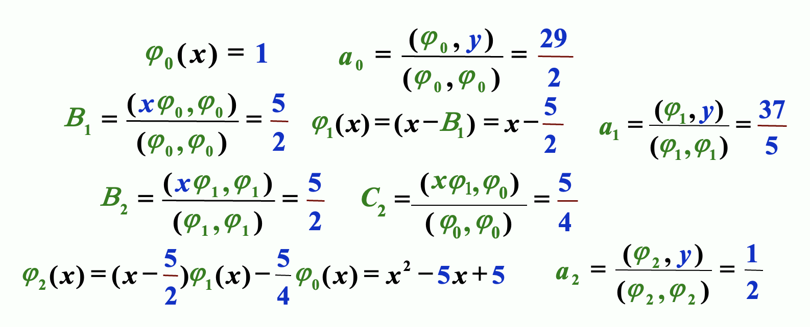

# Chap 8: Approximation Theory

??? abstract "核心知识"

    - LSA
        - 离散
        - 连续：正交多项式
    - 切比雪夫多项式
        - 经济化

近似理论的目标是：给定 $x_1, \dots, x_m$ 和 $y_1, \dots y_m$，寻找更简单的函数 $P(x) \approx f(x)$（近似表示 $f(x)$）。

然而，因为有时 $m$ 可能会特别大，并且 $y_i$ 是不准确的实验数据（即 $y_i \ne f(x_i)$），所以此时更合理的做法是去寻找最佳拟合的 $P(x)$，使得对于所有点而言，$P(x_i) - y_i$ 尽可能小。下面我们就来介绍这些数学方法。


## Discrete Least Square Approximation

目标：确定一个多项式 $P_n(x) = a_0 + a_1 x + \dots a_n x^n$，用于近似表示一组数据 $\{(x_i, y_i)\ |\ i = 1, 2, \dots, m\}$，使得最小二乘误差 $E_2 = \sum\limits_{i=1}^m [P_N(x_i) - y_i]^2$ 最小化，其中 $n \ll m$

关键：$E_2$ 实际上是一个关于 $a_0, a_1, \dots, a_n$ 的函数，也就是说 $E_2(a_0, a_1, \dots, a_n) = \sum\limits_{i=1}^m [a_0 + a_1 x_i + \dots + a_n x_i^n - y_i]^2$。要想让 $E_2$ 最小化，必要条件是 $\dfrac{\partial E_2}{\partial a_k} = 0, k = 0, \dots, n$

$$
\begin{align}
0 & = \dfrac{\partial E_2}{\partial a_k} = 2\sum\limits_{i=1}^m [P_N(x_i) - y_i]^2 \dfrac{\partial P_n(x_i)}{\partial a_k} = 2 \sum\limits_{i=1}^m \Big[\sum\limits_{j=0}^n a_j x_i^j - y_i \Big]x_i^k \notag \\
& = 2\Big\{\sum\limits_{j=0}^n a_j \Big(\sum\limits_{i=1}^m x_i^{j+k}\Big) - \sum\limits_{j=1}^m y_i x_i^k\Big\} \notag
\end{align}
$$

令 $b_k = \sum\limits_{i=1}^m x_i^k, c_k = \sum\limits_{i=1}^m y_i x_i^k$，那么：

$$
\begin{bmatrix}b_{0+0} & \dots & b_{0+n} \\ \vdots & \vdots & \vdots \\ b_{n+0} & \dots & b_{n+n}\end{bmatrix} \begin{bmatrix}a_0 \\ \vdots \\ a_n\end{bmatrix} = \begin{bmatrix}c_0 \\ \vdots \\ c_n\end{bmatrix}
$$

!!! note "注"

    - $P_n(x)$ 的顺序由用户给出，且必须不得超过 $m-1$。若 $n=m-1$，那么 $P_n(x)$ 就是 $E_2 = 0$ 的拉格朗日插值多项式
    - 不强制要求 $P_n(x)$ 是一个多项式
    - 如果要考虑权重 $w_i$ 的话，LSA 的公式就变成：$E_2 = \sum\limits_{i=1}^m w_i [P_N(x_i) - y_i]^2$

??? example "例子"

    === "例1"

        === "题目"

            <div style="text-align: center">
                
            </div>

        === "解答"

            === "法1"

                令 $y \approx P(x) = \dfrac{x}{ax + b}$，寻找 $a, b$，使得 $E_2(a, b) = \sum\limits_{i=1}^m \Big(\dfrac{x_i}{ax_i + b} - y_i\Big)^2$ 最小化。

                **线性化**(linearization)：令 $Y = \dfrac{1}{y}, X = \dfrac{1}{x}$，那么 $Y \approx a + b X$ 就是一个线性问题了。

                将 $(x_i, y_i)$ 转换为 $(X_i, Y_i)$，$a, b$ 就能被解出来了。

            === "法2"

                令 $y \approx P(x) = ae^{-\frac{b}{x}}$，不难发现 $\ln y \approx \ln a - \dfrac{b}{x}$

                **线性化**：令 $Y = \ln y, X = \dfrac{1}{x}, A = \ln a, B = -b$，得到 $Y \approx A + BX$ 这样一个线性问题。

                将 $(x_i, y_i)$ 转换为 $(X_i, Y_i)$，$a, b$ 就能被解出来了（$a = e^A, b = -B, P(x) = ae^{-\frac{b}{x}}$）

    === "例2"

        === "题目"

            <div style="text-align: center">
                
            </div>

        === "解答"

            - 拿那个带权重的 LSA 公式计算，得到一个关于 $a, b$ 的函数
            - 当所有偏导数均为0时，函数值最小；所以在代入具体值前，建议先化简偏导数公式，以减小计算量
            - 得到的偏导数为：$\begin{cases}\dfrac{\partial S}{\partial a} = 0 \Rightarrow \sum w_i x_i y_i = 0 \\ \dfrac{\partial S}{\partial b} = 0 \Rightarrow \sum w_i x_i^3 y_i = 0\end{cases}$
            - 再代入具体值，就可以得到关于 $a, b$ 的二元一次方程
            - 解得 $a = \dfrac{8}{7}, b = \dfrac{23}{49}$


## Orthorgonal Polynomials and Least Squares Approximation

目标：

- 离散版本：给定 $x_1, \dots, x_m;\ y_1, \dots, y_m$，找到更简单的函数 $P(x) \approx f(x)$，使得 $E = \sum\limits_{i=1}^m |P(x_i) - y_i|^2$ 最小化。
- 连续版本：给定在 $[a, b]$ 上的函数 $f(x)$，找到更简单的函数 $P(x) \approx f(x)$，使得 $E = \int_a^b [P(x) - f(x)]^2 dx$ 最小化。

!!! definition "定义"

    对于一组在区间 $[a, b]$ 上的函数 $\{\varphi_0(x), \varphi_1(x), \dots, \varphi_n(x)\}$，当 $\forall x \in [a, b]$，$a_0 \varphi_0(x) + a_1 \varphi_1(x) + \dots + a_n \varphi_n(x) = 0$ 时，有 $a_0 = a_1 \dots = a_n = 0$，那么称这组函数是**线性独立**(linearly independent)的，否则称它们是**线性相关**(linearly dependent)的。

!!! theorem "定理"

    如果 $\varphi_j(x)$ 是一个 $j$ 次多项式（$j = 0, \dots, n$），那么 $\{\varphi_0(x), \varphi_1(x), \dots, \varphi_n(x)\}$ 在任意区间 $[a, b]$ 上都是**线性独立的**(linear independent)。

    ??? proof "证明"

        假设结论不成立，根据定义，$\exists a_0, a_1, \dots, a_n, \forall x \in [a, b]$ 使得 $P(x) = a_0 \varphi_0(x) + a_1 \varphi_1(x) + \dots + a_n \varphi_n(x) = 0$。
        
        此时 $P(x)$ 是一个零多项式，$x^n$ 的系数为0，即 $a_n = 0$，那么 $P(x) = a_0 \varphi_0(x) + a_1 \varphi_1(x) + \dots + a_{n-1} \varphi_{n-1}(x) = 0$。同理可以推出 $a_{n-1} = 0$，以此类推，最终发现所有系数均为0。所以假设不成立，得证。

!!! theorem "定理"

    令 $\Pi_n$ 为一组次数至多为 $n$ 的多项式，如果 $\{\varphi_0(x), \varphi_1(x), \dots, \varphi_n(x)\}$ 是 $\Pi_n$ 内一组线性独立的多项式，那么 $\Pi_n$ 内的任意多项式均可被唯一写做 $\varphi_0(x), \varphi_1(x), \dots, \varphi_n(x)$ 的一个线性组合。

!!! definition "定义"

    对于一般的一组线性独立的函数 $\{\varphi_0(x), \varphi_1(x), \dots, \varphi_n(x)\}$，关于它们的**线性组合** $P(x) = \sum\limits_{j=0}^n a_j \varphi_j(x)$ 被称为**广义多项式**(generalized polynomial)。

一些特殊的多项式：

- $\{\varphi_j(x) = \cos jx\}, \{\psi_j(x) = \sin jx\} \Rightarrow \{\varphi_j(x), \psi_j(x)\}$ 得到的是**三角多项式**(trigonometric polynomial)
- $\{\varphi_j(x) = e^{kjx}, k_i \ne k_j\}$ 得到的是**指数多项式**(exponential polynomial)

!!! definition "定义：权重函数(weight function)"

    - **离散**版本：当对一组离散点 $(x_i, y_i) (i = 1, \dots, n)$ 进行近似时，我们为每个点赋予一个误差项 $w_i$，它是一个正实数。此时我们要考虑让 $E = \sum w_i [P(x_i) - y_i]^2$ 最小化。集合 $\{w_i\}$ 被称为**权重**(weight)。设置权重的目标是为这些点赋予不同的“重要程度”，以便实现更好的近似。
    - **连续**版本：一个在区间 $I$ 上的可积分的函数 $w$ 被称为权重函数，它满足 $\forall x \in I, w(x) \ge 0$，但 $w(x)$ 不会在 $I$ 的任意子区间上消失。此时我们要考虑让 $E = \int_a^b w(x) [P(x) - f(x)]^2 dx$ 最小化。

!!! definition "定义：广义的最小二乘近似(general least square approximation)问题"

    - **离散**版本：给定一组离散点 $(x_i, y_i)$ 和一组对应的权重 $\{w_i\}$（$i = 1, \dots, m$）。我们要找到一个广义多项式 $P(x)$，使得误差 $E = \sum w_i [P(x_i) - y_i]^2$ 最小化。
    - **连续**版本：给定定义在区间 $[a, b]$ 上的一个函数 $f(x)$ 和一个权重函数 $w(x)$。我们要找到一个广义多项式 $P(x)$，使得误差 $E = \int_a^b w(x) [P(x) - f(x)]^2 dx$ 最小化。

---
??? note "内积"

    映射 $V \times V \rightarrow F$ 满足以下三个公理：

    - 共轭对称性：$(x, y) = \overline{(y, x)}$
    - 线性：$(ax, y) = a(x, y), (x + y, z) = (x, z) + (y, z)$
    - 正定性：$(x, x) \ge 0;\ (x, x) = 0 \Rightarrow x = 0$

    内积就是 $x$ 的范数 $\|x\| = \sqrt{(x, x)}$

    对于一般函数 $(f, g)$：

    - 离散版本：$\sum\limits_i f_i g_i = (f_1\ f_2\ \dots\ f_n) \begin{pmatrix}g_1 \\ g_2 \\ \vdots \\ g_n\end{pmatrix} = (f)^T(g)$
    - 连续版本：$\int_a^b f(x)g(x) dx$

    若带有权重函数，即 $(f, g)_w$：

    - 离散版本：

        $$
        \begin{align}
        \sum\limits_i f_i g_i & = (f_1\ f_2\ \dots\ f_n) \begin{pmatrix}w_1 & 0 & \dots & 0 \\ 0 & w_2 & \dots & 0 \\ \vdots & \vdots & \ddots & \vdots \\ 0 & 0 & \dots & w_n\end{pmatrix} \begin{pmatrix}g_1 \\ g_2 \\ \vdots \\ g_n\end{pmatrix} \notag \\
        & = (f)^T[w](g) \notag
        \end{align}
        $$

    - 连续版本：$\int_a^b w(x)f(x)g(x) dx$

对于 $(f, g) = \begin{cases}\sum\limits_{i=1}^m w_i f(x_i) g(x_i) & \text{discrete version} \\ \int_a^b w(x) f(x) g(x) dx & \text{continuous version} \end{cases}$，可以证明它表示的是一个**内积**(inner product)，且 $\|f\| = \sqrt{(f, f)}$ 是一个**范数**。并且当 $(f, g) = 0$ 时，我们称 $f, g$ 是**正交的**(orthogonal)。

因此一般的最小二乘近似问题可以被转换为：

!!! card ""

    <div style="text-align: center" markdown="1">
    寻找一个广义多项式 $P(x)$，使得 $E = (P - y, P - y) = \| P - y \|^2$ 最小化。
    </div>

令 $P(x) = a_0 \varphi_0(x) + a_1 \varphi_1(x) + \dots + a_n \varphi_n(x)$，然后与求解离散问题类似：$\dfrac{\partial E}{\partial a_k} = 0$，即对于所有 $a_k$ 偏导数为0时误差取最小值。将等号左侧公式化简，可以得到：$\sum\limits_{j=0}^n (\varphi_k, \varphi_j) a_j = (\varphi_k, f), k = 0, \dots, n$，也就是说：

$$
\begin{bmatrix}b_{ij} = (\varphi_i, \varphi_j)\end{bmatrix} \begin{bmatrix}a_0 \\ \vdots \\ a_n\end{bmatrix} = \begin{bmatrix}(\varphi_0, f) \\  \vdots \\ (\varphi_n, f)\end{bmatrix} = \varepsilon
$$

??? example "例子"

    === "题目"

        使用 $y = a_0 + a_1 x + a_2 x^2\ (w \equiv 1)$ 近似点集 $\{(1, 4), (2, 10), (3, 18), (4, 26)\}$

    === "解答"

        $\varphi_0(x) = 1, \varphi_1(x) = x, \varphi_2(x) = x^2$，可以计算出：

        <div style="text-align: center">
            
        </div>

        <div style="text-align: center">
            
        </div>

        $\|B\|_{\infty} = 484, \|B^{-1}\|_{\infty} = \dfrac{63}{4} \Rightarrow K(B) = 7623$

---
???+ example "例子"

    当使用 $\varphi_j(x) = x^j$ 和 $w(x) \equiv 1$ 近似 $f(x) \in C[0, 1]$ 时，$(\varphi_i, \varphi_j) = \int_0^1 x^i x^j dx = \dfrac{1}{i + j +1}$（[**希尔伯特矩阵**](https://en.wikipedia.org/wiki/Hilbert_matrix)(Hilbert matrix)）

    改进：如果我们能找到一组一般的线性独立的函数 $\{\varphi_0(x), \varphi_1(x), \dots, \varphi_n(x) \}$，使得任何函数对 $\varphi_i(x), \varphi_j(x)$ 是**正交的**(orthogonal)，那么范数矩阵将会是个**对角矩阵**。此时我们有 $a_k = \dfrac{(\varphi_k, f)}{(\varphi_k, \varphi_k)}$

下面考虑构造**正交多项式**(orthogonal polynomials)。

!!! theorem "定理"

    对于一组在 $[a, b]$ 的多项式函数 $\{\varphi_0(x), \varphi_1(x), \dots, \varphi_n(x)\}$ 以及一个权重函数 $w$，当满足以下条件时，我们认为这些函数是正交的：

    $$
    \varphi_0 (x) \equiv 1, \varphi_1(x) = x - B_1, \varphi_k(x) = (x - B_k)\varphi_{k-1}(x) - C_k \varphi_{k-2}(x)
    $$

    其中 $B_k = \dfrac{(x \varphi_{k-1}, \varphi_{k-1})}{(\varphi_{k-1}, \varphi_{k-1})}, C_k = \dfrac{(x \varphi_{k-1}, \varphi_{k-2})}{( \varphi_{k-2}, \varphi_{k-2})}$

    ???+ info "注"
    
        - 这样构造出来的正交多项式都是[**首一多项式**](https://en.wikipedia.org/wiki/Monic_polynomial)(monic polynomial)（即最高次数项系数为1的多项式）。
        - 该定理正是源自我们在线性代数中学过的[**格拉姆-施密特正交化**](https://en.wikipedia.org/wiki/Gram%E2%80%93Schmidt_process)(Gram-Schmidt process)。

??? example "例子"

    === "例1"

        === "题目"

            （和之前基本一样的）使用 $y = c_0 + c_1 x + c_2 x^2, w \equiv 1$ 近似点集 $\{(1, 4), (2, 10), (3, 18), (4, 26)\}$

        === "解答"

            首先构造正交多项式 $\varphi_0(x), \varphi_1(x), \varphi_2(x)$，令 $y = a_0 \varphi_0(x) + a_1 \varphi_1(x) + a_2 \varphi_2(x)$（$a_k = \dfrac{(\varphi_k, y)}{(\varphi_k, \varphi_k)}$）。接下来就计算出这些值：

            <div style="text-align: center">
                
            </div>

            最终解得 $y = \dfrac{1}{2}x^2 + \dfrac{49}{10}x - \dfrac{3}{2}$

    === "例2"

        === "题目"

            <div style="text-align: center">
                
            </div>

        === "解答"

            知道内积的求解公式和上述正交多项式的构造后，这题其实挺容易的。所以就直接给出答案了：

            - $\varphi_0(x) = 1$
            - $\varphi_1(x) = x - 2$
            - $\varphi_2(x) = x^2 - 4x + \dfrac{8}{3}$

???+ code "算法：正交多项式近似"

    用一个有被容忍值约束的误差的多项式，近似一个给定的函数。

    - 输入：数据个数 $m$；$x[m];\ y[m]$；权重 $w[m]$；容忍值 $TOL$；多项式最大阶数 $Max_n$
    - 输出：近似多项式的系数

    ```c
    Step 1  Set phi_0(x) ≡ 1; 
                a_0 = iprod(phi_0, y) / iprod(phi_0, phi_0); 
                P(x) = a_0 * phi_0(x); 
                err = iprod(y, y) - a_0 * iprod(phi_0, y);
    Step 2  Set B_1 = iprod(x * phi_0, phi_0) / iprod(phi_0, phi_0); 
                phi_1(x) = x - B_1;
                a_1 = iprod(phi_1, y) / iprod(phi_1, phi_1); 
                P(x) += a_1 * phi_1(x); 
                err -= a_1 * iprod(phi_1, y);
    Step 3  Set k = 1;
    Step 4  while ((k < Max_n) && (|err| >= TOL)) do steps 5-7:
        Step 5  k++;
        Step 6  B_k = iprod(x * phi_1, phi_1) / iprod(phi_1, phi_1); 
                C_k = iprod(x * phi_1, phi_0) / iprod(phi_0, phi_0);
                phi_2(x) = (x - B_k) * phi_1(x) - C_k * phi_0(x); 
                a_k = iprod(phi_2, y) / iprod(phi_2, phi_2);
        Step 7  Set phi_0(x) = phi_1(x); phi_1(x) = phi_2(x);
    Step 8  Output(); STOP.
    ```

    ??? question "讨论"

        === "问题"

            这里的 `err` 是否是最小二乘误差，为什么？

        === "解答"

            是的，并且 `err` 的推导公式如下：

            $$
            \begin{align}
            err & = \| P - y \|^2 = (P - y, P - y) = (\sum\limits_{k=0}^n a_k \varphi_k - y, \sum\limits_{i=0}^n a_i \varphi_i - y) \notag \\
            & = \sum\limits_{k=0}^n a_k^2 (\varphi_k, \varphi_k) - 2 \sum\limits_{k=0}^n a_k (\varphi_k, y) + (y, y) = (y, y) - \sum\limits_{k=0}^n a_k (\varphi_k, y) \notag
            \end{align}
            $$


## Chebyshev Polynomials and Economization of Power Series

前面讲过，解决一般的最小二乘近似问题的目标是：

!!! card ""

    <div style="text-align: center" markdown="1">
    寻找一个广义多项式 $P(x)$，使得 $E = (P - y, P - y) = \| P - y \|^2$ 最小化。
    </div>


再次明确：我们的目标是最小化 $\|P - y\|_{\infty}$——这是一个**极小化极大问题**(minimax problem)。


### Targets

目标 1.0：找到 $n$ 阶多项式 $P_n(x)$ 使得 $\|P_n - f\|_{\infty}$ 最小化。

!!! definition "定义"

    如果 $P(x_0) - f(x_0) = \pm \|P - f\|_{\infty}$，那么此时 $x_0$ 被称为 $(\pm)$ **偏差点**(deviation point)（也就是正好在误差边界上的点）。

从任意地方构造出多项式并不容易，但我们能够检验多项式的一些特征：

- 如果 $f \in C[a, b]$ 且 $f$ **不是**一个 $n$ 阶多项式，那么存在一个唯一的多项式 $P_n(x)$，使得 $\|P_n - f\|_{\infty}$ 最小化
- $P_n(x)$ 存在，且必须同时有正负偏差点
- **切比雪夫定理**(Chebyshev Theorem)：$P_n(x)$ 最小化  $\|P_n - f\|_{\infty}\ \Leftrightarrow P_n(x)$ 至少有 $n+2$ 个关于 $f$ 的正负偏差点。也就是说，存在一组点 $a \le t_1 < \dots < t_{n+2} \le b$ 使得 $P_n(t_k) - f(t_k) = \pm(-1)^k \|P_n - f\|_{\infty}$。集合 $\{t_k\}$ 被称为**切比雪夫交替序列**(Chebyshev alternating sequence)。

    >$P_n(x) - f(x)$ 至少有 $n+1$ 个根。

    <div style="text-align: center">
        
    </div>

---
目标 2.0：确定插值点 $\{x_0, \dots, x_n\}$ 使得 $P_n(x)$ 最小化余项 $|P_n(x) - f(x)| = |R_n(x)| = \Big|\dfrac{f^{(n+1)}(\xi)}{(n+1)!} \prod\limits_{i=0}^n (x - x_i)\Big|$

目标 2.1：找到 $\{x_1, \dots, x_n\}$ 使得 $\|w_n\|_{\infty}$ 在 $[-1, 1]$ 最小化，其中 $w_n(x) = \prod\limits_{i=1}^n (x - x_i)$

---
注意到 $w_n(x) = x^n - P_{n-1}(x)$，问题就变成了：

目标 3.0：找到多项式 $P_{n-1}(x)$，使得 $\|x^n - P_{n-1}(x)\|_{\infty}$ 在 $[-1, 1]$ 上最小。

根据切比雪夫定理，我们知道 $P_{n-1}(x)$ 有 $n+1$ 个关于 $x^n$ 的偏差点，也就是说 $w_n(x)$ 在 $n+1$ 个点上交替获得最大值和最小值。


### Chebyshev Polynomials

考虑 $\cos (n \theta)$ 在 $[0, \pi]$ 上的 $n+1$ 个极值。

令 $x = \cos (\theta)$，那么 $x \in [-1, 1]$。我们称 $T_n(x) = \cos (n\theta) = \cos (n \cdot \text{arc} \cos x)$ 为**切比雪夫多项式**(Chebyshev polonomial)。

- $T_n(x)$ 假设在 $t_k = \cos \Big(\dfrac{k}{n} \pi\Big) (k = 0, 1, \dots, n)$ 上，在最大值1和最小值-1之间交替变换，也就是说 $T_n(t_k) = (-1)^k \|T_n(x)\|_{\infty}$
- $T_n(x)$ 有 $n$ 个根 $x_k = \cos \Big(\dfrac{2k - 1}{2n} \pi \Big)(k = 1, \dots, n)$
- $T_n(x)$ 有递推关系式：$T_0(x) = 1, T_1(x) = x, T_{n+1}(x) = 2x T_n(x) - T_{n-1}(x)$
    - $T_n(x)$ 是一个最高阶系数为 $2^{n-1}$ 的 $n$ 阶多项式
- $\{T_0(x), T_1(x), \dots\}$ 在 $[-1, 1]$ 上关于权重函数 $w(x) = \dfrac{1}{\sqrt{1 - x^2}}$ 上正交，也就是说 $(T_n, T_m) = \int_{-1}^1 \dfrac{T_n(x) T_m(x)}{\sqrt{1-x^2}} dx = \begin{cases}0 & n \ne m \\ \pi & n = m = 0 \\ \dfrac{\pi}{2} & n = m \ne 0\end{cases}$

回到之前提到的目标：

- 目标 3.0：找到多项式 $P_{n-1}(x)$，使得 $\|x^n - P_{n-1}(x)\|_{\infty}$ 在 $[-1, 1]$ 上最小。
    - 此时 $w_n(x) = x^n - P_{n-1}(x) = \dfrac{T_n(x)}{2^{n-1}}$
- 目标 2.1：找到 $\{x_1, \dots, x_n\}$ 使得 $\|w_n\|_{\infty}$ 在 $[-1, 1]$ 最小化，其中 $w_n(x) = \prod\limits_{i=1}^n (x - x_i)$
    - 此时 $\min\limits_{w_n \in \widetilde{\Pi}_n} \|w_n\|_{\infty} = \Big\|\dfrac{1}{2^{n-1}} T_n(x)\Big\|_{\infty} = \dfrac{1}{2^{n-1}}$。其中：$\widetilde{\Pi}_n$ 是 $n$ 阶的**首一多项式**，$\{x_1, \dots, x_n\}$ 是 $T_n(x)$ 的 $n$ 个根
- 目标 2.0：确定插值点 $\{x_0, \dots, x_n\}$ 使得 $P_n(x)$ 最小化余项 $|P_n(x) - f(x)| = |R_n(x)| = \Big|\dfrac{f^{(n+1)}(\xi)}{(n+1)!} \prod\limits_{i=0}^n (x - x_i)\Big|$
    - 取 $T_{n+1}(x)$ 上的 $n+1$ 个根作为插值点 $\{x_0, \dots, x_n\}$，然后关于 $f(x)$ 的插值多项式 $P_n(x)$ 假设绝对误差的最小上界为 $\dfrac{M}{2^n (n+1)!}$

??? example "例子"

    === "问题"

        找到在 $[0, 1]$ 上关于 $f(x) = e^x$ 的最佳近似多项式，使得绝对误差不超过 $0.5 \times 10^{-4}$。

    === "解答"

        1. 确定 $n$：
            - 改写变量 $x = \dfrac{a+b}{2} + \dfrac{b-a}{2} t = \dfrac{1}{2}(t+1)$
            - $|R_n| \le \dfrac{e}{(n+1)!} \times \dfrac{1}{2^{2n+1}} < \dfrac{1}{2} \times 10^{-4}$，解得 $n = 4$
        2. 找到 $T_5(t)$ 的根：$t_0 = \cos \dfrac{\pi}{10}, \cos \dfrac{3 \pi}{10}, \cos \dfrac{5 \pi}{10}, \cos \dfrac{7 \pi}{10}, \cos \dfrac{9 \pi}{10}$
        3. 对变量做点改变：
            - $x_0 = \dfrac{1}{2} \Big(\cos \dfrac{\pi}{10} + 1\Big) \approx 0.98$
            - $x_1 = \dfrac{1}{2} \Big(\cos \dfrac{3 \pi}{10} + 1\Big) \approx 0.79$
            - $x_2 = \dfrac{1}{2} \Big(\cos \dfrac{5 \pi}{10} + 1\Big) \approx 0.50$
            - $x_3 = \dfrac{1}{2} \Big(\cos \dfrac{7 \pi}{10} + 1\Big) \approx 0.21$
            - $x_4 = \dfrac{1}{2} \Big(\cos \dfrac{9 \pi}{10} + 1\Big) \approx 0.02$
        4. 用插值点 $x_0, \dots, x_4$ 计算 $L_4(x)$


### Economization of Power Series

目标：给定 $P_n(x) \approx f(x)$，幂级数**经济化**(economization)的目标是在确保精度损失最小的情况下，降低多项式的次数。

考虑一个任意的 $n$ 阶多项式 $P_n(x) = a_n x^n + a_{n-1} x^{n-1} + \dots + a_1 x + a_0$，对应的多项式 $P_{n-1}(x)$ 通过移除 $n$ 阶多项式 $Q_n(x)$（$x^n$ 项的系数为 $a_n$）得到。那么 $\max\limits_{[-1, 1]} |f(x) - P_{n-1}(x)| \le \max\limits_{[-1, 1]} |f(x) - P_n(x)| + \max\limits_{[-1, 1]} |Q_n(x)|$，而 $Q_n(x)$ 能够反映精度的损失。

为了最小化精度损失，$Q_n(x)$ 必须为 $a_n \times \dfrac{T_n(x)}{2^{n-1}}$

!!! note "注"

    - 对于一般区间 $[a, b]$，需要改变变量。也就是说，令 $x = [(b - a) t + (a + b)] / 2$，然后寻找对于 $f(t)$ 在 $[-1, 1]$ 上的（近似）多项式 $P_n(t)$，最终得到 $P_n(x)$。
    - 另一种方法是用 $T_0(x), \dots, T_k(x)$ 的线性组合来表示每一项 $x^k$。比如，$x = T_1(x)$，且 $x^3 = [T_3(x) + 3T_1(x)] / 4$。然后只要从原始多项式中移除切比雪夫函数就行了。

??? example "例子"

    === "题目"

        已知 $f(x) = e^x$ 在 $[-1, 1]$ 上的4阶泰勒多项式为 $P_4 = 1 + x + \dfrac{x^2}{2} + \dfrac{x^3}{6} + \dfrac{x^4}{24}$。它的截断误差的上界为 $|R_4(x)| \le \dfrac{e}{5!} |x^5| \approx 0.023$。请将这个近似多项式的次数降至2。

    === "解答"

        <div style="text-align: center">
            
        </div>

>对应的[作业练习](hw.md#chap-8-approximation-theory)📝

>对应[小测8、9、10](quizzes.md)💯
