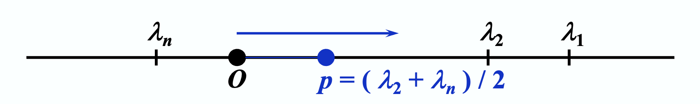

# Chap 9: Approximating Eigenvalues

目标：计算矩阵的主特征值(dominant eigenvalue)，以及对应的特征向量。

## The Power Method

### The Original Method

假设 $A$ 是一个 $n \times n$ 的矩阵，满足 $|\textcolor{red}{\lambda_1}| \textcolor{red}{>} |\lambda_2| \ge \dots \ge |\lambda_n| \ge 0$，且这些特征值对应 $n$ 个线性独立的特征向量。

思路：从任意 $\bm{x^{(0)}} \ne \bm{0}$ 以及 $(\bm{x^{0}}, \bm{v_1})$ 出发

$$
\begin{align}
\bm{x^{(0)}} & = \sum\limits_{j=1}^n \beta_j \bm{v_j}, \beta_1 \ne 0 \notag \\
\bm{x^{(1)}} & = A\bm{x^{(0)}} = \sum\limits_{j=1}^n \beta_j \lambda_j \bm{v_j} \notag \\
\bm{x^{(2)}} & = A\bm{x^{(1)}} = \sum\limits_{j=1}^n \beta_j \lambda_j^2 \bm{v_j} \notag \\
& \dots \notag
\end{align}
$$

发现规律：

$$
\begin{align}
\bm{x^{(k)}} & = A \bm{x^{(k-1)}} = \sum\limits_{j=1}^n \beta_j \lambda_j^k \bm{v_j} \notag \\
& = \lambda_1^k \sum\limits_{j=1}^n \Big(\dfrac{\lambda_j}{\lambda_1}\Big)^k \bm{v_j} \notag
\end{align}
$$

当 $k$ 足够大时，我们有：

$$
\bm{x^{(k)}} \approx \lambda_1^k \beta_1 \bm{v_1}, \bm{x^{(k-1)}} \approx \lambda_1^{k-1} \beta_1 \bm{v_1} \Rightarrow \dfrac{(\bm{x^{(k)}})_i}{(\bm{x^{(k-1)}})_i} \approx \lambda_i
$$


### Normalization

确保在每一步满足 $\| \bm{x} \|_{\infty} = 1$，以确保稳定性。

令 $\| \bm{x^{(k)}} \|_{\infty} = |\bm{x_{p_k}^{(k)}}|$，那么 $\bm{u^{(k-1)}} = \dfrac{\bm{x^{(k-1)}}}{\bm{x^{(k-1)}_{p_{k-1}}}}$ 且 $\bm{x^{(k)}} = A \bm{u^{(k-1)}}$。因而得到：

$$
\bm{u^{(k)}} = \dfrac{\bm{x^{(k)}}}{|\bm{x^{(k)}_{p_k}}|} \rightarrow \bm{v_1} \quad \text{and} \quad \lambda_1 \approx \dfrac{\bm{x_i^{(k)}}}{u_i^{(k-1)}} = \bm{x^{(k)}_{p_{k-1}}}
$$

???+ code "算法：幂法"

    从非零初始向量开始，近似求解规模为 $n \times n$ 的矩阵 $A$ 的主特征值及其特征向量。

    - 输入：维度 $n$，矩阵 $a[][]$，初始向量 $x0[]$，容忍值 $TOL$，最大迭代次数 $N_{max}$
    - 输出：近似特征值 $\lambda$，近似（规范化的）特征向量

    ```c
    Step 1  Set k = 1;
    Step 2  Find index such that [x0[index]] = || x0 ||_infty;
    Step 3  Set x0[] = x0[] / x0[index];    // normalize x0
    Step 4  while (k <= N_max) do steps 5-11
            Step 5  x[] = A * x0[];
            Step 6  lambda = x[index]
            Step 7  Find index such that [x[index]] = || x ||_infty;
            Step 8  if x[index] == 0 then
                        Output("A has the eigenvalue 0", x[0]);
                        STOP.
                    // the matrix is singular and user should try a new x0
            Step 9  err = || x0 - x / x[index] ||_infty;
                    x0[] = x[] / x[index]      // computer u^k
            Step 10 if (err < TOL) then
                        Output(lambda, x0[]);
                        STOP.
            Step 11 Set k++;
    Step 12 Output(Maximum number of iterations exceeded);
            STOP.    // unsucessful
    ```

!!! note "注"

    - 该方法在**多重特征值**（即存在 $\lambda_1 = \lambda_2 = \dots = \lambda_r$）也能生效，因为：

        $$
        \bm{x^{(k)}} = \lambda_1^k \Big[ \sum\limits_{j=1}^r \beta_j \bm{v_j} + \sum\limits_{j=r+1}^n \beta_j \Big(\dfrac{\lambda_j}{\lambda_1}\Big)^k \bm{v_j} \Big] \approx \lambda_1^k \Big( \sum\limits_{j=1}^r \beta_j \bm{v_j} \Big)
        $$

    - 若存在类似 $\lambda_1 = -\lambda_2$ 的情况，那么该方法就会失效。
    - 因为我们无法确保对于任意初始近似向量 $\bm{x^{(0)}}$，$\beta_1 \ne 0$，所以在这种情况下的迭代结果就可能不是 $\bm{v_1}$，而时第一个满足 $(\bm{x^{(0)}}, \bm{v_m}) \ne 0$，关联的特征值为 $\lambda_m$。
    - Aitken $\Delta^2$ 法也能用在这里加快收敛速度。

### Rate of Convergence

在前面的计算中，我们已经得到：

$\bm{x^{(k)}} = A\bm{x^{(k-1)}} = \lambda_1^k \sum\limits_{j=1}^n \Big(\dfrac{\lambda_j}{\lambda_1}\Big)^k \bm{v_j}$

现在，我们的目标是使 $\dfrac{\lambda_2}{\lambda_1}$ 的值尽可能小。

假设 $\lambda_1 > \lambda_2 \ge \dots \lambda_n$，且 $|\lambda_2| > |\lambda_n|$。

<div style="text-align: center">
    
</div>

思路：令 $B = A - pl$，那么 $|\lambda / - A| = |\lambda / - (B + pl)| = |(\lambda - p) / - B|$，这样可以得到 $\lambda_A - p = \lambda_B$。因为 $\dfrac{\lambda_2 - p}{\lambda_1 - p} < \dfrac{|\lambda_2|}{|\lambda_1|}$，寻找 $B$ 的特征值的迭代收敛速度快于关于 $A$ 的迭代。


### Inverse Power Method

如果 $A$ 有特征值 $|\lambda_1| \ge |\lambda_2| \ge \dots \textcolor{red}{> |\lambda_n|}$，那么对于 $A^{-1}$ 满足：

$$
\textcolor{red}{\Big|\dfrac{1}{\lambda_n}\Big| > } \Big|\dfrac{1}{\lambda_{n-1}}\Big| \ge \dots \ge \Big| \dfrac{1}{\lambda_n} \Big|
$$

并且这些特征值对应于相同的特征向量。

>这一块也有待整理。

$A^{-1}$ 的主特征值 $\Leftrightarrow$ $A$ 的特征值中的最小值

$$
\begin{align}
\bm{x^{(k+1)}} & = A^{-1} \bm{x^{(k)}} \notag \\
A \bm{x^{(k+1)}} & = \bm{x^(k)} \notag
\end{align}
$$

思路：如果我们知道 $A$ 的一个特征值 $\lambda_i$ 最接近一个指定值 $p$，那么对于任意的 $j \ne i$，我们有 $|\lambda_i - p| << |\lambda_j - p|$。并且，如果存在 $(A - p')^{-1}$，那么逆幂法能以更快的收敛速度寻找到 $(A - p')^{-1}$ 的主特征值 $\dfrac{1}{\lamnda_i - p}$。
