# Homework

!!! info "注"

    hj 老师不强制要求我们完成作业，但显而易见的是，如果从来没有碰过作业的话，期末包炸的。

    由于时间仓促，我就将作业题目喂给 AI（Gemini 2.5 Pro，是目前最强的 LLM），让它帮我作答。当然，我也会思考一遍的（不然大脑要生锈了）（如果是奇数题的话教材后面还有答案可以比对），所以这里不会出现很离谱的回答。（~~希望是这样的吧~~）

    以下是问题&解答块的格式（自用）

    !!! question "问题（题号）"

        这个出题者很懒，什么都没写。

        ??? note "解答"

            注意到...，略(doge)

## Chap 1: Mathematical Premiminaries

!!! question "问题（1.2.3）"

    Suppose $p^*$ must approximate $p$ with a relative error of at most $10^{-3}$. Find the largest interval in which $p^*$ must lie for each value of $p$:

    - a. 150
    - b. 900
    - c. 1500
    - d. 90

    ??? note "解答"

        **关键步骤：**

        1.  **相对误差的定义**:

            已知相对误差 $\frac{|p - p^*|}{|p|} \le 10^{-3}$。

        2.  **推导 $p^*$ 所在的区间**:

            根据相对误差的定义，我们有：

            $|p - p^*| \le 10^{-3} |p|$

            展开绝对值可得：

            $-10^{-3} |p| \le p - p^* \le 10^{-3} |p|$

            为了得到 $p^*$ 的区间，调整不等式：

            $p - 10^{-3} |p| \le p^* \le p + 10^{-3} |p|$

            由于题目中给定的 $p$ 值均为正数，所以 $|p| = p$。因此，区间变为：

            $p(1 - 10^{-3}) \le p^* \le p(1 + 10^{-3})$

            $p(1 - 0.001) \le p^* \le p(1 + 0.001)$

            $0.999p \le p^* \le 1.001p$

            所以，$p^*$ 必须位于区间 $[0.999p, 1.001p]$ 内。

        3.  **计算各个 $p$ 值对应的区间**:
            * **a. 对于 $p = 150$**:
                $p^*$ 的区间为 $[0.999 \times 150, 1.001 \times 150] = [149.85, 150.15]$

            * **b. 对于 $p = 900$**:
                $p^*$ 的区间为 $[0.999 \times 900, 1.001 \times 900] = [899.1, 900.9]$

            * **c. 对于 $p = 1500$**:
                $p^*$ 的区间为 $[0.999 \times 1500, 1.001 \times 1500] = [1498.5, 1501.5]$

            * **d. 对于 $p = 90$**:
                $p^*$ 的区间为 $[0.999 \times 90, 1.001 \times 90] = [89.91, 90.09]$

!!! question "问题（1.2.11）"

    Let $f(x) = \frac{x \cos x - \sin x}{x - \sin x}$.

    a. Find $\lim_{x\to0} f(x)$.

    b. Use four-digit rounding arithmetic to evaluate $f(0.1)$.

    c. Replace each trigonometric function with its third Maclaurin polynomial, and repeat part (b). (This means to form a new function $f_M(x)$ using the polynomials, simplify this $f_M(x)$ if possible, and then evaluate $f_M(0.1)$ using four-digit rounding arithmetic).

    d. The actual value is $f(0.1) = -1.99899998$. Find the relative error for the values obtained in parts (b) and (c).

    ??? note "解答"

        **a. 求极限 $\lim_{x\to0} f(x)$**

        * **方法**: 使用泰勒展开 (Taylor Expansion) 或洛必达法则 (L'Hôpital's Rule)。此处用泰勒展开：
                $\cos x = 1 - \frac{x^2}{2!} + O(x^4)$
                $\sin x = x - \frac{x^3}{3!} + O(x^5)$
        * **分子**: $x \cos x - \sin x = x(1 - \frac{x^2}{2}) - (x - \frac{x^3}{6}) + O(x^5) = (x - \frac{x^3}{2}) - (x - \frac{x^3}{6}) + O(x^5) = -\frac{x^3}{3} + O(x^5)$
        * **分母**: $x - \sin x = x - (x - \frac{x^3}{6}) + O(x^5) = \frac{x^3}{6} + O(x^5)$
        * **极限**: $\lim_{x\to0} f(x) = \lim_{x\to0} \frac{-x^3/3}{x^3/6} = \frac{-1/3}{1/6} = \mathbf{-2}$.
            (使用洛必达法则三次也可得相同结果。)

        ---

        **b. 使用四位数舍入算术计算 $f(0.1)$**

        * $x = 0.1000$.
        * $\sin(0.1) \approx 0.099833416... \rightarrow \text{rd}_4(\sin(0.1)) = 0.09983$.
        * $\cos(0.1) \approx 0.995004165... \rightarrow \text{rd}_4(\cos(0.1)) = 0.9950$.
        * **计算分子 $N = x \cos x - \sin x$**:
                $x \cos x: 0.1000 \times 0.9950 = 0.09950000 \rightarrow \text{rd}_4(0.09950) = 0.09950$.
                $N = 0.09950 - 0.09983 = -0.00033 \rightarrow \text{rd}_4(-0.00033) = -0.0003300$.
        * **计算分母 $D = x - \sin x$**:
                $D = 0.1000 - 0.09983 = 0.00017 \rightarrow \text{rd}_4(0.00017) = 0.0001700$.
        * **计算 $f(0.1)$**:
                $f(0.1) = \frac{-0.0003300}{0.0001700} = -\frac{33}{17} \approx -1.941176... \rightarrow \text{rd}_4(-1.941176...) = \mathbf{-1.941}$.

        ---

        **c. 用三阶麦克劳林多项式替换三角函数，并重复(b)部分**

        * $\sin x$ 的三阶麦克劳林多项式为 $P_3(x) = x - \frac{x^3}{6}$.
        * $\cos x$ 的三阶麦克劳林多项式为 $Q_3(x) = 1 - \frac{x^2}{2}$. (因为 $x^3$ 项系数为0)
        * 构造新函数 $f_M(x) = \frac{x Q_3(x) - P_3(x)}{x - P_3(x)} = \frac{x(1-x^2/2) - (x-x^3/6)}{x - (x-x^3/6)}$.
        * **代数化简 $f_M(x)$**:
                分子: $x - \frac{x^3}{2} - x + \frac{x^3}{6} = -\frac{3x^3}{6} + \frac{x^3}{6} = -\frac{2x^3}{6} = -\frac{x^3}{3}$.
                分母: $x - x + \frac{x^3}{6} = \frac{x^3}{6}$.
                $f_M(x) = \frac{-x^3/3}{x^3/6} = -2$.
        * **计算 $f_M(0.1)$**:
                $f_M(0.1) = -2$.
        * **使用四位数舍入**: $\text{rd}_4(-2) = \mathbf{-2.000}$.

        ---

        **d. 计算相对误差**

        * 实际值 $p = -1.99899998$.
        * 相对误差公式: $E_r = \frac{|p - p^*|}{|p|}$.

        * **对于 (b) 部分的结果 $p_b^* = -1.941$**:
                $|p - p_b^*| = |-1.99899998 - (-1.941)| = |-0.05799998| = 0.05799998$.
                $|p| = 1.99899998$.
                $E_{r,b} = \frac{0.05799998}{1.99899998} \approx 0.02901449...$
                $E_{r,b} \approx \mathbf{0.02901}$ (保留4位有效数字).

        * **对于 (c) 部分的结果 $p_c^* = -2.000$**:
                $|p - p_c^*| = |-1.99899998 - (-2.000)| = |0.00100002| = 0.00100002$.
                $E_{r,c} = \frac{0.00100002}{1.99899998} \approx 0.00050026...$
                $E_{r,c} \approx \mathbf{0.0005003}$ (保留4位有效数字).

!!! question "问题（1.2.17(b)）"

    Suppose two points $(x_0, y_0)$ and $(x_1, y_1)$ are on a straight line with $y_1 \neq y_0$. Two formulas are available to find the x-intercept of the line:
    
    - Formula 1: $x = \frac{x_0 y_1 - x_1 y_0}{y_1 - y_0}$
    - Formula 2: $x = x_0 - \frac{(x_1 - x_0) y_0}{y_1 - y_0}$

    b. Use the data $(x_0, y_0) = (1.31, 3.24)$ and $(x_1, y_1) = (1.93, 4.76)$ and three-digit rounding arithmetic to compute the x-intercept both ways. Which method is better and why?

    ??? note "解答"

        **数据**:
        $x_0 = 1.31$
        $y_0 = 3.24$
        $x_1 = 1.93$
        $y_1 = 4.76$

        使用三位数舍入算术 (three-digit rounding arithmetic)。

        ---

        **1. 使用公式 1 计算 x 轴截距 ($x_I$)**
        $x_I = \frac{x_0 y_1 - x_1 y_0}{y_1 - y_0}$

        * $t_1 = x_0 y_1 = 1.31 \times 4.76 = 6.2356$.
            $\text{rd}_3(6.2356) = 6.24$.
        * $t_2 = x_1 y_0 = 1.93 \times 3.24 = 6.2532$.
            $\text{rd}_3(6.2532) = 6.25$.
        * 分子 $N = t_1 - t_2 = 6.24 - 6.25 = -0.01$.
            $\text{rd}_3(-0.01) = -0.0100$.
        * 分母 $D = y_1 - y_0 = 4.76 - 3.24 = 1.52$.
            $\text{rd}_3(1.52) = 1.52$.
        * $x_I = \frac{N}{D} = \frac{-0.0100}{1.52} \approx -0.0065789...$.
            $\text{rd}_3(-0.0065789...) = \mathbf{-0.00658}$.

        ---

        **2. 使用公式 2 计算 x 轴截距 ($x_{II}$)**
        $x_{II} = x_0 - \frac{(x_1 - x_0) y_0}{y_1 - y_0}$

        * $t_3 = x_1 - x_0 = 1.93 - 1.31 = 0.62$.
            $\text{rd}_3(0.62) = 0.620$.
        * $t_4 = (x_1 - x_0) y_0 = t_3 \times y_0 = 0.620 \times 3.24 = 2.0088$.
            $\text{rd}_3(2.0088) = 2.01$.
        * 分母 $D_F = y_1 - y_0 = 1.52$ (同上).
        * 分数部分 $F = \frac{t_4}{D_F} = \frac{2.01}{1.52} \approx 1.322368...$.
            $\text{rd}_3(1.322368...) = 1.32$.
        * $x_{II} = x_0 - F = 1.31 - 1.32 = -0.01$.
            $\text{rd}_3(-0.01) = \mathbf{-0.0100}$.

        ---

        **3. 比较与解释**

        * **计算结果**:
            * 公式 1: $x_I = -0.00658$
            * 公式 2: $x_{II} = -0.0100$

        * **更精确的值**:
            为了比较，我们先计算一个更精确的 x 轴截距值（不使用中间步骤的舍入，仅在最后进行三位数舍入）：

            $x_{exact} = \frac{1.31 \times 4.76 - 1.93 \times 3.24}{4.76 - 3.24} = \frac{6.2356 - 6.2532}{1.52} = \frac{-0.0176}{1.52} \approx -0.0115789...$

            $\text{rd}_3(-0.0115789...) = -0.0116$.

        * **哪个方法更好?**
            公式 2 的结果 ($-0.0100$) 比公式 1 的结果 ($-0.00658$) 更接近精确计算并舍入后的值 ($-0.0116$)。因此，**公式 2 在这个例子中更好**。

        * **原因**:
            公式 1 的计算更容易受到舍入误差的影响，特别是在计算分子 $N = x_0 y_1 - x_1 y_0$ 时。

            在此例中，$x_0 y_1 = 6.2356$ (舍入为 $6.24$) 和 $x_1 y_0 = 6.2532$ (舍入为 $6.25$) 是两个非常接近的数。当两个相近的数在各自被舍入后进行相减时，可能会发生灾难性的有效数字损失 (catastrophic cancellation)。

            具体来说，$N_{exact} = -0.0176$，而通过三位数舍入计算得到的分子是 $N_{computed} = -0.0100$。这个差异 ($0.0076$) 相对于 $N_{exact}$ 来说非常大 (相对误差约为 43%)。这个较大的误差随后传播到最终的 $x_I$ 值。

            公式 2 将计算重新排列。虽然其最后一步 $x_0 - F = 1.31 - 1.32 = -0.0100$ 也是两个相近数相减，但在此之前的分数 $F$ 的计算 ($\text{rd}_3(2.01/1.52) = 1.32$) 相对而言其舍入误差较小 (真实值 $F_{exact} \approx 1.32158$，计算值 $F_{computed}=1.32$，误差约为 $0.00158$)。因此，公式 2 整体上能更好地控制由于舍入操作导致的精度损失，从而得到一个更准确的结果。

!!! question "问题（1.3.7）"

    Find the rates of convergence of the following functions as $h \to 0$:

    a. $\lim_{h\to0} \frac{\sin h}{h} = 1$

    b. $\lim_{h\to0} \frac{1 - \cos h}{h} = 0$

    c. $\lim_{h\to0} \frac{\sin h - h \cos h}{h} = 0$

    d. $\lim_{h\to0} \frac{1 - e^h}{h} = -1$

    ??? note "解答"

        一个函数 $f(h)$ 当 $h \to 0$ 时收敛于 $L$，其收敛速度为 $p$ 是指 $f(h) - L = O(h^p)$。我们将使用泰勒级数展开来确定各项的收敛速度。

        **关键泰勒级数展开 (Key Taylor Series Expansions around $h=0$):**

        * $\sin h = h - \frac{h^3}{3!} + \frac{h^5}{5!} - \dots$

        * $\cos h = 1 - \frac{h^2}{2!} + \frac{h^4}{4!} - \dots$

        * $e^h = 1 + h + \frac{h^2}{2!} + \frac{h^3}{3!} + \dots$

        ---

        **a. 对于 $\lim_{h\to0} \frac{\sin h}{h} = 1$**

        令 $f(h) = \frac{\sin h}{h}$ 且 $L=1$。

        $\frac{\sin h}{h} - 1 = \frac{h - \frac{h^3}{6} + O(h^5)}{h} - 1 = \left(1 - \frac{h^2}{6} + O(h^4)\right) - 1 = -\frac{h^2}{6} + O(h^4)$。

        由于误差项中 $h$ 的最低次幂是 $h^2$，所以收敛速度为 **2**。

        $\frac{\sin h}{h} - 1 = O(h^2)$。

        ---

        **b. 对于 $\lim_{h\to0} \frac{1 - \cos h}{h} = 0$**

        令 $f(h) = \frac{1 - \cos h}{h}$ 且 $L=0$。

        $\frac{1 - \cos h}{h} - 0 = \frac{1 - \left(1 - \frac{h^2}{2} + \frac{h^4}{24} - O(h^6)\right)}{h} = \frac{\frac{h^2}{2} - \frac{h^4}{24} + O(h^6)}{h} = \frac{h}{2} - \frac{h^3}{24} + O(h^5)$。

        由于误差项中 $h$ 的最低次幂是 $h^1$，所以收敛速度为 **1**。

        $\frac{1 - \cos h}{h} = O(h)$。

        ---

        **c. 对于 $\lim_{h\to0} \frac{\sin h - h \cos h}{h} = 0$**
        令 $f(h) = \frac{\sin h - h \cos h}{h}$ 且 $L=0$。

        分子: $\sin h - h \cos h = \left(h - \frac{h^3}{6} + \frac{h^5}{120} - \dots\right) - h\left(1 - \frac{h^2}{2} + \frac{h^4}{24} - \dots\right)$

        $= \left(h - \frac{h^3}{6} + \frac{h^5}{120}\right) - \left(h - \frac{h^3}{2} + \frac{h^5}{24}\right) + \dots$

        $= \left(-\frac{1}{6} + \frac{1}{2}\right)h^3 + \left(\frac{1}{120} - \frac{1}{24}\right)h^5 + \dots = \frac{2}{6}h^3 - \frac{4}{120}h^5 + \dots = \frac{1}{3}h^3 - \frac{1}{30}h^5 + \dots$

        所以, $\frac{\sin h - h \cos h}{h} - 0 = \frac{\frac{1}{3}h^3 - \frac{1}{30}h^5 + \dots}{h} = \frac{1}{3}h^2 - \frac{1}{30}h^4 + \dots$。

        由于误差项中 $h$ 的最低次幂是 $h^2$，所以收敛速度为 **2**。

        $\frac{\sin h - h \cos h}{h} = O(h^2)$。

        ---

        **d. 对于 $\lim_{h\to0} \frac{1 - e^h}{h} = -1$**

        令 $f(h) = \frac{1 - e^h}{h}$ 且 $L=-1$。

        $\frac{1 - e^h}{h} - (-1) = \frac{1 - \left(1 + h + \frac{h^2}{2} + \frac{h^3}{6} + \dots\right)}{h} + 1 = \frac{-h - \frac{h^2}{2} - \frac{h^3}{6} - \dots}{h} + 1$

        $= \left(-1 - \frac{h}{2} - \frac{h^2}{6} - \dots\right) + 1 = -\frac{h}{2} - \frac{h^2}{6} - \dots$。

        由于误差项中 $h$ 的最低次幂是 $h^1$，所以收敛速度为 **1**。

        $\frac{1 - e^h}{h} - (-1) = O(h)$。

## Chap 2: Solutions of Equations in One Variable

!!! question "问题（2.1.13）"

    Use Theorem 2.1 to find a bound for the number of iterations needed to achieve an approximation with accuracy $10^{-4}$ to the solution of $x^3 - x - 1 = 0$ lying in the interval $[1, 2]$. Find an approximation to the root with this degree of accuracy.

    **Theorem 2.1:** Suppose that $f \in C[a, b]$ and $f(a) \cdot f(b) < 0$. The Bisection method generates a sequence $\{p_n\}_{n=1}^{\infty}$ approximating a zero $p$ of $f$ with $|p_n - p| \le \frac{b-a}{2^n}$, when $n \ge 1$.

    ??? note "解答"

        **1. 计算所需的迭代次数 $n$**

        根据定理 2.1，经过 $n$ 次迭代后，近似值 $p_n$ 与真解 $p$ 之间的误差满足：

        $|p_n - p| \le \frac{b-a}{2^n}$

        题目要求精度为 $10^{-4}$，所以我们需要找到最小的整数 $n$ 使得：

        $\frac{b-a}{2^n} \le 10^{-4}$

        给定区间 $[a, b] = [1, 2]$，所以 $a=1, b=2$，则 $b-a = 1$。

        不等式变为：

        $\frac{1}{2^n} \le 10^{-4}$

        $2^n \ge 10^4$

        $2^n \ge 10000$

        两边取对数 (以 2 为底)：

        $n \ge \log_2(10000)$

        $n \ge \frac{\ln(10000)}{\ln(2)} \approx \frac{4 \ln(10)}{\ln(2)} \approx \frac{4 \times 2.302585}{0.693147} \approx \frac{9.21034}{0.693147} \approx 13.2877$

        由于 $n$ 必须是整数，所以所需的最小迭代次数为 $n = 14$。

        （验证: $2^{13} = 8192 < 10000$, $2^{14} = 16384 > 10000$）

        **2. 使用二分法找到满足精度要求的近似根**

        设 $f(x) = x^3 - x - 1$。初始区间 $[a_1, b_1] = [1, 2]$。

        $f(1) = 1^3 - 1 - 1 = -1$

        $f(2) = 2^3 - 2 - 1 = 5$

        由于 $f(1)f(2) < 0$，该区间内存在根。

        我们将进行 14 次迭代。在每一步 $k$，计算中点 $p_k = (a_k+b_k)/2$。

        如果 $f(a_k)f(p_k) < 0$，则新区间为 $[a_{k+1}, b_{k+1}] = [a_k, p_k]$。

        否则 (即 $f(p_k)f(b_k) < 0$)，新区间为 $[a_{k+1}, b_{k+1}] = [p_k, b_k]$。

        **迭代过程摘要 (前几步和最后几步):**

        * **k=1:** $a_1=1, b_1=2$. $f(a_1)=-1$.

            $p_1 = (1+2)/2 = 1.5$. $f(p_1) = (1.5)^3 - 1.5 - 1 = 0.875$.

            由于 $f(a_1)f(p_1) < 0$, $a_2=1, b_2=1.5$.

        * **k=2:** $a_2=1, b_2=1.5$. $f(a_2)=-1$.

            $p_2 = (1+1.5)/2 = 1.25$. $f(p_2) = (1.25)^3 - 1.25 - 1 = -0.296875$.

            由于 $f(a_2)f(p_2) > 0$, $a_3=1.25, b_3=1.5$.

        * **k=3:** $a_3=1.25, b_3=1.5$. $f(a_3) \approx -0.296875$.

            $p_3 = (1.25+1.5)/2 = 1.375$. $f(p_3) = (1.375)^3 - 1.375 - 1 \approx 0.224609$.

            由于 $f(a_3)f(p_3) < 0$, $a_4=1.25, b_4=1.375$.

        ... (继续迭代) ...

        经过仔细的 13 次迭代后，我们得到区间 $[a_{14}, b_{14}]$：

        * **k=13 (得到第14个区间 $a_{14}, b_{14}$):**
            $a_{13} = 1.32470703125$, $f(a_{13}) \approx -0.00078082$.

            $b_{13} = 1.324951171875$, $f(b_{13}) \approx +0.00028302$.

            $p_{13} = (a_{13}+b_{13})/2 = 1.3248291015625$.

            $f(p_{13}) \approx -0.00024911$.

            由于 $f(a_{13})f(p_{13}) > 0$ (两者同为负), $a_{14}=p_{13}=1.3248291015625$, $b_{14}=b_{13}=1.324951171875$.

        * **k=14 (计算第14个近似值 $p_{14}$):**

            $a_{14}=1.3248291015625$.

            $b_{14}=1.324951171875$.
            
            $p_{14} = (a_{14}+b_{14})/2 = (1.3248291015625 + 1.324951171875) / 2 = \mathbf{1.32489013671875}$.

        这个值 $p_{14}$ 就是满足精度要求的近似根。其误差 $|p_{14} - p| \le \frac{2-1}{2^{14}} = \frac{1}{16384} \approx 0.000061035$, 这小于给定的精度 $10^{-4}$。

        **结论:**

        * 所需迭代次数 $n = \mathbf{14}$。
        * 满足精度 $10^{-4}$ 的一个近似根为 $p_{14} = \mathbf{1.32489013671875}$。

        !!! warning "注意"

            教材给出的近似根为 1.32477，请谨慎辨别！

!!! question "问题（2.1.15）"

    Let $\{p_n\}$ be the sequence defined by $p_n = \sum_{k=1}^{n} \frac{1}{k}$. Show that $\{p_n\}$ diverges even though $\lim_{n\to\infty} (p_n - p_{n-1}) = 0$.

    ??? note "解答"

        这道题需要我们证明两件事情：

        1. 序列 $\{p_n\}$ (即调和级数的部分和序列) 是发散的。
        2. $\lim_{n\to\infty} (p_n - p_{n-1}) = 0$。

        ---

        **1. 证明序列 $\{p_n\}$ 发散**

        序列 $\{p_n\}$ 定义为 $p_n = 1 + \frac{1}{2} + \frac{1}{3} + \dots + \frac{1}{n}$。这是著名的调和级数的部分和。我们可以通过考察它的一个子序列 $p_{2^m}$ 来证明其发散性：

        考虑 $p_{2^m}$：

        $p_{2^0} = p_1 = 1$

        $p_{2^1} = p_2 = 1 + \frac{1}{2}$

        $p_{2^2} = p_4 = 1 + \frac{1}{2} + \left(\frac{1}{3} + \frac{1}{4}\right)$

        由于 $\frac{1}{3} > \frac{1}{4}$，所以 $\frac{1}{3} + \frac{1}{4} > \frac{1}{4} + \frac{1}{4} = \frac{2}{4} = \frac{1}{2}$。

        因此，$p_4 > 1 + \frac{1}{2} + \frac{1}{2} = 1 + 2 \cdot \frac{1}{2}$。

        $p_{2^3} = p_8 = p_4 + \left(\frac{1}{5} + \frac{1}{6} + \frac{1}{7} + \frac{1}{8}\right)$
        由于 $\frac{1}{5}, \frac{1}{6}, \frac{1}{7}$ 都大于 $\frac{1}{8}$，所以 $\frac{1}{5} + \frac{1}{6} + \frac{1}{7} + \frac{1}{8} > \frac{1}{8} + \frac{1}{8} + \frac{1}{8} + \frac{1}{8} = \frac{4}{8} = \frac{1}{2}$。

        因此，$p_8 > p_4 + \frac{1}{2} > \left(1 + 2 \cdot \frac{1}{2}\right) + \frac{1}{2} = 1 + 3 \cdot \frac{1}{2}$。

        推广这个模式，我们可以得到：

        $p_{2^m} > 1 + m \cdot \frac{1}{2} = 1 + \frac{m}{2}$。

        当 $m \to \infty$ 时，$1 + \frac{m}{2} \to \infty$。由于子序列 $\{p_{2^m}\}$ 发散到无穷大，那么原序列 $\{p_n\}$ 也发散到无穷大。

        因此，序列 $\{p_n\}$ 是发散的。

        ---

        **2. 证明 $\lim_{n\to\infty} (p_n - p_{n-1}) = 0$**

        根据 $p_n$ 的定义：

        $p_n = \sum_{k=1}^{n} \frac{1}{k} = 1 + \frac{1}{2} + \dots + \frac{1}{n-1} + \frac{1}{n}$

        对于 $n \ge 2$，$p_{n-1} = \sum_{k=1}^{n-1} \frac{1}{k} = 1 + \frac{1}{2} + \dots + \frac{1}{n-1}$

        所以，两者的差为：
        $p_n - p_{n-1} = \left(\sum_{k=1}^{n} \frac{1}{k}\right) - \left(\sum_{k=1}^{n-1} \frac{1}{k}\right) = \frac{1}{n}$

        现在我们求其极限：

        $\lim_{n\to\infty} (p_n - p_{n-1}) = \lim_{n\to\infty} \frac{1}{n}$

        由于当 $n \to \infty$ 时，$\frac{1}{n} \to 0$，所以：

        $\lim_{n\to\infty} (p_n - p_{n-1}) = 0$。

        ---

        **结论:**

        我们已经证明了序列 $p_n = \sum_{k=1}^{n} \frac{1}{k}$ (调和级数的部分和) 是发散的，尽管相邻两项的差的极限 $\lim_{n\to\infty} (p_n - p_{n-1})$ 为 0。这说明了级数收敛的一个必要条件 (通项极限为0) 并非充分条件。

!!! question "问题（2.2.3）"

    The following four methods are proposed to compute $21^{1/3}$. Rank them in order, based on their apparent speed of convergence, assuming $p_0 = 1$.

    a. $p_n = \frac{20 p_{n-1} + 21/p_{n-1}^2}{21}$

    b. $p_n = p_{n-1} - \frac{p_{n-1}^3 - 21}{3 p_{n-1}^2}$

    c. $p_n = p_{n-1} - \frac{p_{n-1}^4 - 21 p_{n-1}}{p_{n-1}^2 - 21}$

    d. $p_n = \left(\frac{21}{p_{n-1}}\right)^{1/2}$

    ??? note "解答"

        我们需要计算 $p = 21^{1/3}$，即方程 $x^3 - 21 = 0$ 的根。设 $f(x) = x^3 - 21$。真实根 $p \approx 2.758924$。所有方法都从 $p_0 = 1$ 开始。

        **各方法分析**

        **a. $p_n = \frac{20 p_{n-1} + 21/p_{n-1}^2}{21}$**

        这是一个迭代形式 $p_n = g_a(p_{n-1})$。若收敛到 $p$，则 $p = \frac{20p + 21/p^2}{21} \Rightarrow 21p = 20p + 21/p^2 \Rightarrow p = 21/p^2 \Rightarrow p^3 = 21$。该方法确实收敛到目标根。

        $g_a(x) = \frac{20x}{21} + \frac{1}{x^2}$。

        $g_a'(x) = \frac{20}{21} - \frac{2}{x^3}$。

        在 $p^3=21$ 处，$g_a'(p) = \frac{20}{21} - \frac{2}{21} = \frac{18}{21} = \frac{6}{7}$。

        由于 $0 < |g_a'(p)| = 6/7 < 1$，该方法是**线性收敛**的，收敛因子为 $6/7 \approx 0.857$。

        **b. $p_n = p_{n-1} - \frac{p_{n-1}^3 - 21}{3 p_{n-1}^2}$**

        这是求解 $f(x) = x^3 - 21 = 0$ 的**牛顿法** ($p_n = p_{n-1} - f(p_{n-1})/f'(p_{n-1})$)。

        只要 $f'(p) \neq 0$，牛顿法通常具有**二次收敛**性。此处 $f'(x) = 3x^2$，在 $p=21^{1/3}$ 处不为零。

        **c. $p_n = p_{n-1} - \frac{p_{n-1}^4 - 21 p_{n-1}}{p_{n-1}^2 - 21}$**

        若收敛到 $p$，则 $\frac{p^4 - 21p}{p^2 - 21} = 0 \Rightarrow p(p^3-21)=0$。这意味着它可能收敛到 $p=0$ 或 $p=21^{1/3}$。

        让我们从 $p_0=1$ 开始计算：

        $p_1 = 1 - \frac{1^4 - 21 \cdot 1}{1^2 - 21} = 1 - \frac{1 - 21}{1 - 21} = 1 - \frac{-20}{-20} = 1 - 1 = 0$。

        $p_2 = 0 - \frac{0 - 0}{0 - 21} = 0$。

        因此，对于 $p_0=1$，该序列收敛到 0，而不是 $21^{1/3}$。所以，对于计算 $21^{1/3}$ 而言，此方法**不收敛到目标值**。

        **d. $p_n = \left(\frac{21}{p_{n-1}}\right)^{1/2}$**

        这是一个迭代形式 $p_n = g_d(p_{n-1})$。若收敛到 $p$，则 $p = (21/p)^{1/2} \Rightarrow p^2 = 21/p \Rightarrow p^3 = 21$。该方法确实收敛到目标根。

        $g_d(x) = \sqrt{21} x^{-1/2}$。

        $g_d'(x) = \sqrt{21} (-\frac{1}{2}) x^{-3/2}$。

        在 $p=21^{1/3}$ 处，$g_d'(p) = \sqrt{21} (-\frac{1}{2}) (21^{1/3})^{-3/2} = \sqrt{21} (-\frac{1}{2}) 21^{-1/2} = -\frac{1}{2}$。

        由于 $0 < |g_d'(p)| = 1/2 < 1$，该方法是**线性收敛**的，收敛因子为 $1/2$。

        ---

        **收敛速度比较**

        理论上：

        * 方法 (b) 是二次收敛，通常最快。
        * 方法 (d) 是线性收敛，收敛因子为 $1/2 = 0.5$。
        * 方法 (a) 是线性收敛，收敛因子为 $6/7 \approx 0.857$。
        * 方法 (c) 从 $p_0=1$ 出发不收敛到 $21^{1/3}$ (收敛到0)。

        线性收敛方法中，收敛因子绝对值越小，收敛越快。所以 (d) 比 (a) 快。

        ---

        **从 $p_0=1$ 开始的迭代表现**

        为了观察“表观收敛速度”，我们计算前几项的误差（$e_k = p_k - 21^{1/3}$，其中 $21^{1/3} \approx 2.758924$）：

        | $k$ | 方法(a) $p_k$   | $e_k(a)$  | 方法(b) $p_k$   | $e_k(b)$  | 方法(d) $p_k$   | $e_k(d)$  |
        |-----|-----------------|-----------|-----------------|-----------|-----------------|-----------|
        | 0   | 1               | -1.7589   | 1               | -1.7589   | 1               | -1.7589   |
        | 1   | $\approx 1.9524$| $\approx -0.8065$| $\approx 7.6667$| $\approx 4.9077$| $\approx 4.5826$| $\approx 1.8237$|
        | 2   | $\approx 2.1218$| $\approx -0.6372$| $\approx 5.2271$| $\approx 2.4681$| $\approx 2.1407$| $\approx -0.6182$|
        | 3   | $\approx 2.2429$| $\approx -0.5161$| $\approx 3.7411$| $\approx 0.9822$| $\approx 3.2045$| $\approx 0.4456$|
        | 4   | $\approx 2.3316$| $\approx -0.4274$| $\approx 2.9947$| $\approx 0.2357$| $\approx 2.5599$| $\approx -0.1990$|
        | 5   | $\approx 2.4001$| $\approx -0.3588$| $\approx 2.7769$| $\approx 0.0180$| $\approx 2.8642$| $\approx 0.1052$|
        | 6   | $\approx 2.4538$| $\approx -0.3051$| $\approx 2.7591$| $\approx 0.0002$| $\approx 2.7131$| $\approx -0.0458$|

        方法 (c) 收敛到 0，与目标根的误差为 $|0 - 2.758924| \approx 2.758924$。

        从第5或第6次迭代的结果来看：

        * 方法 (b) 的误差最小，显示出最快的收敛速度。
        * 方法 (d) 的误差其次。
        * 方法 (a) 的误差较大。
        * 方法 (c) 完全偏离目标。

        ---

        **结论与排序**

        基于理论分析和从 $p_0=1$ 开始的迭代表现，这些方法的收敛速度排序如下（从快到慢）：
        
        1. **方法 (b)** (牛顿法，二次收敛)
        2. **方法 (d)** (线性收敛，因子 $1/2$)
        3. **方法 (a)** (线性收敛，因子 $6/7$)
        4. **方法 (c)** (不收敛到 $21^{1/3}$)

        因此，收敛速度排序为： **(b) > (d) > (a) > (c)**。

!!! question "问题（2.2.19）"

    a. Use Theorem 2.3 to show that the sequence defined by $x_n = \frac{1}{2}\left(x_{n-1} + \frac{2}{x_{n-1}}\right)$, for $n \ge 1$, converges to $\sqrt{2}$ whenever $x_0 > \sqrt{2}$.

    ??? info "Theorem 2.3 (Fixed-Point Theorem):"

        Let $g \in C[a, b]$ be such that $g(x) \in [a, b]$ for all $x \in [a, b]$. Suppose, in addition, that $g'(x)$ exists on $(a, b)$ and that a constant $0 < k < 1$ exists with $|g'(x)| \le k$, for all $x \in (a, b)$.

        Then, for any number $p_0 \in [a, b]$, the sequence defined by $p_n = g(p_{n-1})$, $n \ge 1$, converges to the unique fixed point $p$ in $[a, b]$.

    b. Use the fact that $0 < (x_0 - \sqrt{2})^2$ whenever $x_0 \neq \sqrt{2}$ to show that if $0 < x_0 < \sqrt{2}$, then $x_1 > \sqrt{2}$.
    
    c. Use the results of parts (a) and (b) to show that the sequence in (a) converges to $\sqrt{2}$ whenever $x_0 > 0$.

    ??? note "解答"

        令迭代函数为 $g(x) = \frac{1}{2}\left(x + \frac{2}{x}\right)$。序列定义为 $x_n = g(x_{n-1})$。该迭代的目的是找到 $g(x)=x$ 的不动点，即 $x = \frac{1}{2}(x + \frac{2}{x}) \Rightarrow 2x = x + \frac{2}{x} \Rightarrow x = \frac{2}{x} \Rightarrow x^2 = 2$。由于题目条件 $x_0 > 0$，我们寻求正根，即 $p = \sqrt{2}$。

        ---

        **a. 证明当 $x_0 > \sqrt{2}$ 时，序列收敛到 $\sqrt{2}$**

        我们需要使用定理2.3。设 $x_0 > \sqrt{2}$。我们选择区间 $[a, b] = [\sqrt{2}, x_0]$。

        1.  **$g(x)$ 在 $[a, b]$ 上的连续性**:

            函数 $g(x) = \frac{1}{2}x + \frac{1}{x}$ 对于所有 $x \neq 0$ 都是连续的。由于 $\sqrt{2} > 0$，所以在区间 $[\sqrt{2}, x_0]$ 上 $g(x)$ 是连续的。

        2.  **$g(x)$ 将区间 $[a, b]$ 映射到自身 ($g(x) \in [a,b]$ for $x \in [a,b]$)**:

            对于任意 $x \in [\sqrt{2}, x_0]$:

            $g(x) - \sqrt{2} = \frac{1}{2}\left(x + \frac{2}{x}\right) - \sqrt{2} = \frac{x^2 + 2 - 2\sqrt{2}x}{2x} = \frac{(x-\sqrt{2})^2}{2x}$。

            由于 $x \ge \sqrt{2} > 0$，则 $2x > 0$ 且 $(x-\sqrt{2})^2 \ge 0$。因此 $g(x) - \sqrt{2} \ge 0 \Rightarrow g(x) \ge \sqrt{2}$。

            另外，$g(x) - x = \frac{1}{2}\left(x + \frac{2}{x}\right) - x = \frac{1}{x} - \frac{x}{2} = \frac{2-x^2}{2x}$。

            对于 $x > \sqrt{2}$，$x^2 > 2$，所以 $2-x^2 < 0$。由于 $x>0$, $2x>0$, 故 $g(x)-x < 0 \Rightarrow g(x) < x$。

            所以，对于 $x \in (\sqrt{2}, x_0]$，$g(x) < x \le x_0$。

            当 $x=\sqrt{2}$ 时，$g(\sqrt{2}) = \frac{1}{2}(\sqrt{2} + 2/\sqrt{2}) = \sqrt{2}$。

            因此，对于所有 $x \in [\sqrt{2}, x_0]$，我们有 $\sqrt{2} \le g(x) \le x \le x_0$。这意味着 $g(x) \in [\sqrt{2}, x_0]$。

        3.  **$g'(x)$ 的存在性及压缩条件 ($|g'(x)| \le k < 1$)**:
            
            $g'(x) = \frac{d}{dx}\left(\frac{1}{2}x + \frac{1}{x}\right) = \frac{1}{2} - \frac{1}{x^2}$。

            对于 $x \in (\sqrt{2}, x_0)$ (或任何包含 $\sqrt{2}$ 的区间 $(c, d)$ 且 $c > 0$，$g'(x)$ 都存在。

            当 $x > \sqrt{2}$ 时，$x^2 > 2$，所以 $0 < \frac{1}{x^2} < \frac{1}{2}$。

            因此，$g'(x) = \frac{1}{2} - \frac{1}{x^2}$ 满足 $0 < g'(x) < \frac{1}{2}$。

            所以 $|g'(x)| < \frac{1}{2}$。我们可以取 $k = \frac{1}{2}$，满足 $0 < k < 1$。

        4.  **初始点 $x_0$ 在 $[a,b]$ 内**:
            我们的选择 $[a,b]=[\sqrt{2}, x_0]$ 自然包含 $x_0$。

        所有定理2.3的条件均满足。因此，对于 $x_0 > \sqrt{2}$，序列 $x_n = g(x_{n-1})$ 收敛到区间 $[\sqrt{2}, x_0]$ 内的唯一不动点 $p=\sqrt{2}$。

        ---

        **b. 证明若 $0 < x_0 < \sqrt{2}$，则 $x_1 > \sqrt{2}$**

        给定 $0 < x_0 < \sqrt{2}$。我们计算 $x_1 = g(x_0)$。

        $x_1 - \sqrt{2} = \frac{1}{2}\left(x_0 + \frac{2}{x_0}\right) - \sqrt{2} = \frac{x_0^2 + 2 - 2\sqrt{2}x_0}{2x_0} = \frac{(x_0 - \sqrt{2})^2}{2x_0}$。

        因为 $x_0 \neq \sqrt{2}$，所以 $(x_0 - \sqrt{2})^2 > 0$。

        又因为 $0 < x_0 < \sqrt{2}$，所以 $x_0 > 0$，从而 $2x_0 > 0$。

        因此，$\frac{(x_0 - \sqrt{2})^2}{2x_0} > 0$。

        这意味着 $x_1 - \sqrt{2} > 0$，即 $x_1 > \sqrt{2}$。

        ---

        **c. 证明只要 $x_0 > 0$，序列就收敛到 $\sqrt{2}$**

        我们可以分情况讨论 $x_0$ 的取值：

        1. **情况 1: $x_0 > \sqrt{2}$**

            根据 (a) 部分的结论，序列 $\{x_n\}$ 收敛到 $\sqrt{2}$。

        2. **情况 2: $0 < x_0 < \sqrt{2}$**

            根据 (b) 部分的结论，$x_1 = g(x_0) > \sqrt{2}$。

            现在，我们可以将 $x_1$ 视为一个新的起始点。由于 $x_1 > \sqrt{2}$，根据 (a) 部分的结论，从 $x_1$ 开始的序列 $x_1, x_2, x_3, \dots$ 收敛到 $\sqrt{2}$。这意味着原始序列 $x_0, x_1, x_2, \dots$ 也收敛到 $\sqrt{2}$。

        3. **情况 3: $x_0 = \sqrt{2}$**

            如果 $x_0 = \sqrt{2}$，则 $x_1 = g(\sqrt{2}) = \frac{1}{2}\left(\sqrt{2} + \frac{2}{\sqrt{2}}\right) = \frac{1}{2}(\sqrt{2} + \sqrt{2}) = \sqrt{2}$。

            依此类推，$x_n = \sqrt{2}$ 对于所有 $n \ge 0$ 都成立。这是一个常数序列，它收敛到 $\sqrt{2}$。

        综合以上三种情况，只要初始值 $x_0 > 0$，序列 $\{x_n\}$ 总是收敛到 $\sqrt{2}$。

!!! question "问题（2.4.11）"

    The iterative method to solve $f(x) = 0$, given by the fixed-point method $g(x) = x$, where
    
    $$p_n = g(p_{n-1}) = p_{n-1} - \frac{f(p_{n-1})}{f'(p_{n-1})} - \frac{f''(p_{n-1})}{2f'(p_{n-1})} \left[ \frac{f(p_{n-1})}{f'(p_{n-1})} \right]^2, \quad \text{for } n=1, 2, 3, \dots$$

    has $g'(p) = g''(p) = 0$. This will generally yield cubic ($\alpha = 3$) convergence. Expand the analysis of Example 1 to compare quadratic and cubic convergence.

    ??? note "解答"

        题目要求我们基于“Example 1”（见教材 $P_{79}$）的分析框架，来比较二次收敛和三次收敛。Example 1 中比较了线性收敛和二次收敛。我们将类似地构建二次收敛和三次收敛序列，并比较它们的收敛速度。

        1.  **设定比较序列**:

            我们假设目标真值为 $p=0$ (如 Example 1 中所示)。

            * **二次收敛序列 $\{\hat{p}_n\}$**:

                设其满足 $|\hat{p}_{k}| \approx \lambda |\hat{p}_{k-1}|^2$。为与 Example 1 保持一致，我们取渐进误差常数 $\lambda = 0.5$。

                若初始误差为 $|\hat{p}_0|$，则递推可得：

                $|\hat{p}_n| \approx \lambda |\hat{p}_{n-1}|^2 \approx \lambda (\lambda |\hat{p}_{n-2}|^2)^2 = \lambda^3 |\hat{p}_{n-2}|^4 \approx \dots \approx \lambda^{2^n-1} |\hat{p}_0|^{2^n}$。

                若 $|\hat{p}_0|=1$，则 $|\hat{p}_n| \approx (0.5)^{2^n-1}$。

            * **三次收敛序列 $\{\tilde{p}_n\}$**:

                设其满足 $|\tilde{p}_{k}| \approx \mu |\tilde{p}_{k-1}|^3$。为公平比较，我们也取渐进误差常数 $\mu = 0.5$。

                若初始误差为 $|\tilde{p}_0|$，则递推可得：

                $|\tilde{p}_1| \approx \mu |\tilde{p}_0|^3$

                $|\tilde{p}_2| \approx \mu |\tilde{p}_1|^3 \approx \mu (\mu |\tilde{p}_0|^3)^3 = \mu^{1+3} |\tilde{p}_0|^9 = \mu^4 |\tilde{p}_0|^9$

                $|\tilde{p}_3| \approx \mu |\tilde{p}_2|^3 \approx \mu (\mu^4 |\tilde{p}_0|^9)^3 = \mu^{1+12} |\tilde{p}_0|^{27} = \mu^{13} |\tilde{p}_0|^{27}$

                一般的，指数 $k_n$ 满足 $k_{n+1} = 1+3k_n$，且 $k_0=0$。解得 $k_n = \frac{3^n-1}{2}$。
                所以， $|\tilde{p}_n| \approx \mu^{(3^n-1)/2} |\tilde{p}_0|^{3^n}$。

                若 $|\tilde{p}_0|=1$，则 $|\tilde{p}_n| \approx (0.5)^{(3^n-1)/2}$。

        2.  **收敛速度比较表**:

            假设初始误差 $|\hat{p}_0| = |\tilde{p}_0| = 1$，渐进误差常数均为 $0.5$。下表比较了二次收敛和三次收敛在最初几次迭代后的误差大小。

            | $n$ (迭代次数) | 二次收敛误差 $\|\hat{p}_n\| \approx (0.5)^{2^n-1}$ | 三次收敛误差 $\|\tilde{p}_n\| \approx (0.5)^{(3^n-1)/2}$ |
            | :-----------: | :---------------------------------------------: | :-------------------------------------------------: |
            | 1             | $(0.5)^1 = 5.0000 \times 10^{-1}$               | $(0.5)^1 = 5.0000 \times 10^{-1}$                   |
            | 2             | $(0.5)^3 = 1.2500 \times 10^{-1}$               | $(0.5)^4 = 6.2500 \times 10^{-2}$                   |
            | 3             | $(0.5)^7 \approx 7.8125 \times 10^{-3}$         | $(0.5)^{13} \approx 1.2207 \times 10^{-4}$          |
            | 4             | $(0.5)^{15} \approx 3.0518 \times 10^{-5}$       | $(0.5)^{40} \approx 9.0949 \times 10^{-13}$         |
            | 5             | $(0.5)^{31} \approx 4.6566 \times 10^{-10}$      | $(0.5)^{121} \approx 3.7670 \times 10^{-37}$        |

        3.  **分析与结论**:
        
            从上表可以看出：

            * 在第1次迭代后，如果渐进误差常数相同，二次和三次收敛的误差减小程度相似。
            * 从第2次迭代开始，三次收敛序列的误差迅速减小，远快于二次收敛序列。例如，在第4次迭代后，二次收敛的误差约为 $3 \times 10^{-5}$，而三次收敛的误差已达到约 $9 \times 10^{-13}$。到第5次迭代，三次收敛的误差已经小到 $10^{-37}$ 的量级。
            * 这说明题目中给出的迭代方法，由于其 $g'(p)=0$ 和 $g''(p)=0$ 的特性确保了三次收敛，一旦接近真解，其收敛速度会非常快。

            **重要考虑**: 这种高阶收敛性通常是以每次迭代需要更多计算量为代价的。例如，题目中给出的三次收敛方法需要计算函数值 $f(p_{n-1})$ 以及一阶导数值 $f'(p_{n-1})$ 和二阶导数值 $f''(p_{n-1})$。而牛顿法（二次收敛）仅需要 $f(p_{n-1})$ 和 $f'(p_{n-1})$。因此，在实际应用中，需要权衡收敛阶数带来的速度提升和单次迭代计算复杂度增加之间的关系。

## Chap 3: Interpolation and Polynomial Approximation

!!! question "问题（3.1.5）"

    Use Neville's method to approximate $\sqrt{3}$ with the function $f(x) = 3^x$ and the values $x_0 = -2, x_1 = -1, x_2 = 0, x_3 = 1, \text{ and } x_4 = 2$.

    ??? note "解答"

        核心步骤如下：

        1.  **确定插值点和插值节点**

            我们要近似 $\sqrt{3}$。已知函数 $f(x) = 3^x$，若 $f(x) = \sqrt{3}$，则 $3^x = 3^{1/2}$，所以 $x = 1/2$。

            因此，我们要在 $x = 1/2$ 处进行插值计算。

            给定的插值节点为 $x_0 = -2, x_1 = -1, x_2 = 0, x_3 = 1, x_4 = 2$。

        2.  **计算各节点对应的函数值 $y_i = f(x_i)$**

            $y_0 = f(x_0) = 3^{-2} = 1/9$

            $y_1 = f(x_1) = 3^{-1} = 1/3$

            $y_2 = f(x_2) = 3^{0} = 1$

            $y_3 = f(x_3) = 3^{1} = 3$

            $y_4 = f(x_4) = 3^{2} = 9$

        3.  **应用Neville算法构建插值表**

            Neville方法的迭代公式为：

            $Q_{i,k}(x) = \frac{(x-x_{i-k})Q_{i,k-1}(x) - (x-x_i)Q_{i-1,k-1}(x)}{x_i - x_{i-k}}$

            其中 $Q_{i,0} = y_i$。我们计算 $x=1/2$ 时的值。

            构造Neville表如下 (当 $x=1/2$):

            | $i$ | $x_i$ | $Q_{i,0} = y_i$ | $Q_{i,1}$          | $Q_{i,2}$          | $Q_{i,3}$          | $Q_{i,4}$          |
            |-----|-------|-----------------|--------------------|--------------------|--------------------|--------------------|
            | 0   | -2    | $1/9$           |                    |                    |                    |                    |
            |     |       |                 | $Q_{1,1} = 2/3$    |                    |                    |                    |
            | 1   | -1    | $1/3$           |                    | $Q_{2,2} = 3/2$    |                    |                    |
            |     |       |                 | $Q_{2,1} = 4/3$    |                    | $Q_{3,3} = 16/9$   |                    |
            | 2   | 0     | $1$             |                    | $Q_{3,2} = 11/6$   |                    | $Q_{4,4} = 41/24$  |
            |     |       |                 | $Q_{3,1} = 2$      |                    | $Q_{4,3} = 5/3$    |                    |
            | 3   | 1     | $3$             |                    | $Q_{4,2} = 3/2$    |                    |                    |
            |     |       |                 | $Q_{4,1} = 0$      |                    |                    |                    |
            | 4   | 2     | $9$             |                    |                    |                    |                    |

            * 例如，$Q_{1,1} = \frac{(1/2 - (-2))(1/3) - (1/2 - (-1))(1/9)}{-1 - (-2)} = \frac{(5/2)(1/3) - (3/2)(1/9)}{1} = 5/6 - 1/6 = 4/6 = 2/3$。
            * 其余各项 $Q_{i,k}$ 依此类推进行计算。

        4.  **最终近似值**

            Neville方法得到的最高阶插值多项式在 $x=1/2$ 处的近似值为 $Q_{4,4}$。

            $Q_{4,4}(1/2) = \frac{(x-x_0)Q_{4,3}(x) - (x-x_4)Q_{3,3}(x)}{x_4 - x_0}$

            经过计算 (如上表所示):

            $Q_{4,4}(1/2) = \frac{(1/2 - (-2))(5/3) - (1/2 - 2)(16/9)}{2 - (-2)}$

            $Q_{4,4}(1/2) = \frac{(5/2)(5/3) - (-3/2)(16/9)}{4} = \frac{25/6 - (-24/9)}{4} = \frac{25/6 + 8/3}{4} = \frac{25/6 + 16/6}{4} = \frac{41/6}{4} = \frac{41}{24}$

        因此，使用Neville方法得到的 $\sqrt{3}$ 的近似值为 $\frac{41}{24} \approx 1.708333$。
        
        (实际 $\sqrt{3} \approx 1.73205$)

!!! question "问题（3.1.17）"

    Suppose you need to construct eight-decimal-place tables for the common, or base-10, logarithm function $f(x) = \log_{10}(x)$ from $x=1$ to $x=10$ in such a way that linear interpolation is accurate to within $10^{-6}$. Determine a bound for the step size for this table. What choice of step size would you make to ensure that $x=10$ is included in the table?

    ??? note "解答"

        **线性插值误差与步长确定**

        此题要求我们为函数 $f(x) = \log_{10}(x)$ 在区间 $[1, 10]$ 上构建一个表，并确定步长 $h$，使得表中的线性插值误差不超过 $10^{-6}$，同时确保 $x=10$ 是表中的一个节点。

        **1. 线性插值误差公式**

        对于线性插值，其误差 $|E(x)|$ 可以用以下公式界定：

        $$|E(x)| \le \frac{h^2}{8} \max_{\xi \in [x_i, x_{i+1}]} |f''(\xi)|$$

        其中 $h$ 是步长，$f''(\xi)$ 是函数 $f(x)$ 的二阶导数。我们要求 $|E(x)| \le 10^{-6}$。

        **2. 计算函数的二阶导数**

        函数 $f(x) = \log_{10}(x) = \frac{\ln(x)}{\ln(10)}$。

        一阶导数： $f'(x) = \frac{1}{x \ln(10)}$。

        二阶导数： $f''(x) = -\frac{1}{x^2 \ln(10)}$。

        因此，$|f''(x)| = \frac{1}{x^2 \ln(10)}$。

        **3. 确定 $|f''(x)|$ 在区间 $[1, 10]$ 上的最大值**

        函数 $|f''(x)| = \frac{1}{x^2 \ln(10)}$ 在区间 $[1, 10]$上是单调递减的。因此，其最大值在 $x=1$ 处取得：

        $$\max_{x \in [1,10]} |f''(x)| = |f''(1)| = \frac{1}{1^2 \ln(10)} = \frac{1}{\ln(10)}$$

        **4. 确定步长 $h$ 的上界**

        根据误差要求：

        $$\frac{h^2}{8} \cdot \frac{1}{\ln(10)} \le 10^{-6}$$

        $$h^2 \le 8 \ln(10) \cdot 10^{-6}$$

        $$h \le \sqrt{8 \ln(10) \cdot 10^{-6}}$$

        已知 $\ln(10) \approx 2.302585$，则：

        $$h \le \sqrt{8 \times 2.302585 \times 10^{-6}} \approx \sqrt{18.42068 \times 10^{-6}} \approx 4.29193 \times 10^{-3}$$

        所以，步长 $h$ 的一个上界是 $0.00429193$。

        **5. 选择合适的步长 $h$**

        为了确保 $x=10$ 是表中的一个节点，并且表从 $x=1$ 开始，整个区间的长度为 $10-1=9$。设 $N$ 为子区间的数量 (即 $N+1$ 个表点)，则步长 $h = 9/N$，其中 $N$ 必须为整数。

        我们需要满足 $h = 9/N \le 4.29193 \times 10^{-3}$。

        $$N \ge \frac{9}{4.29193 \times 10^{-3}} \approx \frac{9000}{4.29193} \approx 2096.92$$
        
        由于 $N$ 必须是整数，我们选择最小的整数 $N = 2097$。

        对应的步长 $h$ 为：

        $$h = \frac{9}{2097} \approx 0.00429184549...$$

        我们可以选择 $h = 9/2097$ (约等于 $0.00429185$)。这个值小于计算得到的上界 $0.00429193$，因此满足误差要求。

        **结论:**

        * 步长 $h$ 的一个上界约为 $0.00429193$。
        * 为确保 $x=10$ 是表点且满足精度要求，可以选择步长 $h = 9/2097 \approx 0.00429185$。

!!! question "问题（3.2.5(a)(b)）"

    a. Approximate $f(0.05)$ using the following data and the Newton forward divided-difference formula:

    | $x$   | 0.0     | 0.2     | 0.4     | 0.6     | 0.8     |
    | :---- | :------ | :------ | :------ | :------ | :------ |
    | $f(x)$ | 1.00000 | 1.22140 | 1.49182 | 1.82212 | 2.22554 |

    b. Use the Newton backward divided-difference formula to approximate $f(0.65)$.

    ??? note "解答"

        以下是中文解答：

        **a. 使用牛顿前向差商公式近似 $f(0.05)$**

        **1. 差商表 (Forward Differences for $f(0.05)$):**

        我们将构造牛顿前向差商公式所需的差商值。设 $x_0 = 0.0, x_1 = 0.2, x_2 = 0.4, x_3 = 0.6, x_4 = 0.8$。

        $f[x_0] = 1.00000$

        $f[x_0, x_1] = \frac{1.22140 - 1.00000}{0.2 - 0.0} = 1.10700$

        $f[x_1, x_2] = \frac{1.49182 - 1.22140}{0.4 - 0.2} = 1.35210$

        $f[x_2, x_3] = \frac{1.82212 - 1.49182}{0.6 - 0.4} = 1.65150$

        $f[x_3, x_4] = \frac{2.22554 - 1.82212}{0.8 - 0.6} = 2.01710$

        $f[x_0, x_1, x_2] = \frac{1.35210 - 1.10700}{0.4 - 0.0} = 0.61275$

        $f[x_1, x_2, x_3] = \frac{1.65150 - 1.35210}{0.6 - 0.2} = 0.74850$
        
        $f[x_2, x_3, x_4] = \frac{2.01710 - 1.65150}{0.8 - 0.4} = 0.91400$

        $f[x_0, x_1, x_2, x_3] = \frac{0.74850 - 0.61275}{0.6 - 0.0} = 0.22625$

        $f[x_1, x_2, x_3, x_4] = \frac{0.91400 - 0.74850}{0.8 - 0.2} = \frac{0.16550}{0.6} \approx 0.275833$

        $f[x_0, x_1, x_2, x_3, x_4] = \frac{0.275833 - 0.22625}{0.8 - 0.0} = \frac{0.049583}{0.8} \approx 0.061979$

        前向差商公式所需系数:

        $f[x_0] = 1.00000$

        $f[x_0, x_1] = 1.10700$

        $f[x_0, x_1, x_2] = 0.61275$

        $f[x_0, x_1, x_2, x_3] = 0.22625$

        $f[x_0, x_1, x_2, x_3, x_4] \approx 0.061979$

        **2. 牛顿前向差商公式:**

        $P_n(x) = f[x_0] + f[x_0, x_1] + f[x_0, x_1, x_2](x-x_1) + \\dots$

        对于 $x = 0.05$:

        $P_4(0.05) = f[x_0] + f[x_0,x_1] + f[x_0,x_1,x_2](0.05-x_1) + f[x_0,x_1,x_2,x_3](0.05-x_1)(0.05-x_2) + f[x_0,x_1,x_2,x_3,x_4](0.05-x_1)(0.05-x_2)(0.05-x_3)$

        **3. 计算:**

        $P_4(0.05) = 1.00000$

        $+ 1.10700(0.05 - 0.0)$

        $+ 0.61275(0.05 - 0.0)(0.05 - 0.2)$

        $+ 0.22625(0.05 - 0.0)(0.05 - 0.2)(0.05 - 0.4)$
        
        $+ 0.061979(0.05 - 0.0)(0.05 - 0.2)(0.05 - 0.4)(0.05 - 0.6)$

        $P_4(0.05) = 1.00000 + 1.10700(0.05) + 0.61275(0.05)(-0.15) + 0.22625(0.05)(-0.15)(-0.35) + 0.061979(0.05)(-0.15)(-0.35)(-0.55)$

        $P_4(0.05) = 1.00000 + 0.05535 + 0.61275(-0.0075) + 0.22625(0.002625) + 0.061979(-0.00144375)$

        $P_4(0.05) = 1.00000 + 0.05535 - 0.004595625 + 0.0005938125 - 0.000089471$

        $P_4(0.05) \approx 1.051258716 \approx 1.05126$

        **近似结果: $f(0.05) \approx 1.05126$**

        -----

        **b. 使用牛顿后向差商公式近似 $f(0.65)$**

        **1. 差商表 (Backward Differences for $f(0.65)$):**

        我们将使用之前计算的差商表，但关注后向差商公式所需的系数。设 $x_4 = 0.8, x_3 = 0.6, x_2 = 0.4, x_1 = 0.2, x_0 = 0.0$。

        后向差商公式所需系数 (从差商表的底部往上取):

        $f[x_4] = 2.22554$

        $f[x_3, x_4] = 2.01710$

        $f[x_2, x_3, x_4] = 0.91400$

        $f[x_1, x_2, x_3, x_4] \approx 0.275833$

        $f[x_0, x_1, x_2, x_3, x_4] \approx 0.061979$

        **2. 牛顿后向差商公式:**

        $P_n(x) = f[x_n] + f[x_{n-1}, x_n] + f[x_{n-2}, x_{n-1}, x_n](x-x_{n-1}) + \\dots$

        对于 $x = 0.65$ (令 $x_n = x_4 = 0.8$):

        $P_4(0.65) = f[x_4] + f[x_3,x_4] + f[x_2,x_3,x_4](0.65-x_3) + f[x_1,x_2,x_3,x_4](0.65-x_3)(0.65-x_2) + f[x_0,x_1,x_2,x_3,x_4](0.65-x_3)(0.65-x_2)(0.65-x_1)$

        **3. 计算:**

        $P_4(0.65) = 2.22554$

        $+ 2.01710(0.65 - 0.8)$

        $+ 0.91400(0.65 - 0.8)(0.65 - 0.6)$

        $+ 0.275833(0.65 - 0.8)(0.65 - 0.6)(0.65 - 0.4)$

        $+ 0.061979(0.65 - 0.8)(0.65 - 0.6)(0.65 - 0.4)(0.65 - 0.2)$

        $P_4(0.65) = 2.22554 + 2.01710(-0.15) + 0.91400(-0.15)(0.05) + 0.275833(-0.15)(0.05)(0.25) + 0.061979(-0.15)(0.05)(0.25)(0.45)$

        $P_4(0.65) = 2.22554 - 0.302565 + 0.91400(-0.0075) + 0.275833(-0.001875) + 0.061979(-0.00084375)$

        $P_4(0.65) = 2.22554 - 0.302565 - 0.006855 - 0.000517187 - 0.000052277$

        $P_4(0.65) \approx 1.915550536 \approx 1.91555$

        **近似结果: $f(0.65) \approx 1.91555$**

!!! question "问题（3.2.13）"

    For a function $f$, the forward divided differences are given in a table with some missing entries. We are given the values of $x_0 = 0.0$, $x_1 = 0.4$, and $x_2 = 0.7$. We are also given some divided differences: $f[x_1, x_2] = 10$ and $f[x_0, x_1, x_2] = \frac{50}{7}$. Additionally, we know $f[x_2] = 6$. The task is to determine the missing entries in the table, which are $f[x_0]$, $f[x_1]$, and $f[x_0, x_1]$.

    ??? note "解答"

        For a function $f$, the forward divided differences are given in a table with some missing entries. We are given the values of $x_0 = 0.0$, $x_1 = 0.4$, and $x_2 = 0.7$. We are also given some divided differences: $f[x_1, x_2] = 10$ and $f[x_0, x_1, x_2] = \frac{50}{7}$. Additionally, we know $f[x_2] = 6$. The task is to determine the missing entries in the table, which are $f[x_0]$, $f[x_1]$, and $f[x_0, x_1]$.

        **中文解答:**

        我们需要根据给定的前向差商表来确定缺失的条目。

        1.  **计算 $f[x_0, x_1]$:**
            我们知道二阶前向差商的公式为：
            $$f[x_0, x_1, x_2] = \frac{f[x_1, x_2] - f[x_0, x_1]}{x_2 - x_0}$$
            代入已知数值：
            $$\frac{50}{7} = \frac{10 - f[x_0, x_1]}{0.7 - 0.0}$$   $$\frac{50}{7} = \frac{10 - f[x_0, x_1]}{0.7}$$
            解出 $f[x_0, x_1]$:
            $$10 - f[x_0, x_1] = \frac{50}{7} \times 0.7 = 5$$   $$f[x_0, x_1] = 10 - 5 = 5$$

        2.  **计算 $f[x_1]$:**
            我们知道一阶前向差商的公式为：
            $$f[x_1, x_2] = \frac{f[x_2] - f[x_1]}{x_2 - x_1}$$
            代入已知数值：
            $$10 = \frac{6 - f[x_1]}{0.7 - 0.4}$$   $$10 = \frac{6 - f[x_1]}{0.3}$$
            解出 $f[x_1]$:
            $$6 - f[x_1] = 10 \times 0.3 = 3$$   $$f[x_1] = 6 - 3 = 3$$

        3.  **计算 $f[x_0]$:**
            我们知道一阶前向差商的公式为：
            $$f[x_0, x_1] = \frac{f[x_1] - f[x_0]}{x_1 - x_0}$$
            代入已知数值：
            $$5 = \frac{3 - f[x_0]}{0.4 - 0.0}$$   $$5 = \frac{3 - f[x_0]}{0.4}$$
            解出 $f[x_0]$:
            $$3 - f[x_0] = 5 \times 0.4 = 2$$   $$f[x_0] = 3 - 2 = 1$$

        因此，缺失的条目为：
        $f[x_0] = 1$
        $f[x_1] = 3$
        $f[x_0, x_1] = 5$

!!! question "问题（3.3.7）"

    

        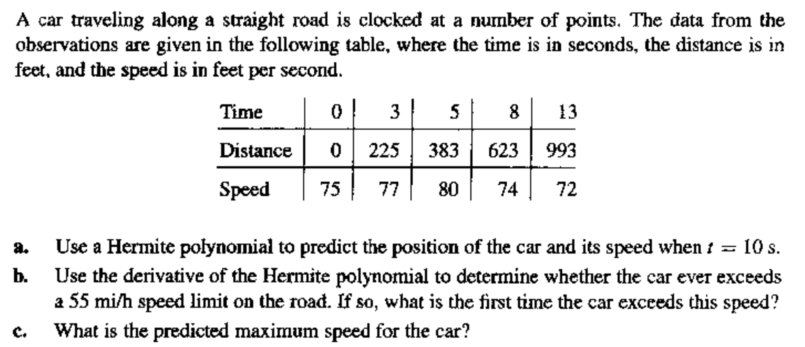
    

    ??? note "解答"

        Gemini 2.5 Pro 没能算对，所以这里就直接贴上教材答案：

        

            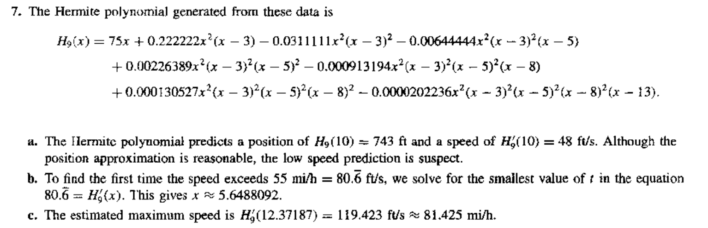
        

!!! question "问题（3.4.9）"

    A natural cubic spline S is defined by:

    $$S(x) = \begin{cases} S_0(x) = 1 + B(x-1) - D(x-1)^3, & \text{if } 1 \le x < 2 \\ S_1(x) = 1 + b(x-2) - \frac{3}{4}(x-2)^2 + d(x-2)^3, & \text{if } 2 \le x \le 3 \end{cases}$$

    If S interpolates the data (1,1), (2,1), and (3,0), find B, D, b, and d.

    ??? note "解答"

        求解自然三次样条函数 $S(x)$ 中的参数 $B, D, b, d$，使其满足给定的插值点 (1,1), (2,1), (3,0)。

        1.  **利用插值条件:**

            * $S(1)=1$:

                $S_0(1) = 1 + B(1-1) - D(1-1)^3 = 1$. 此条件由 $S_0(x)$ 的形式自动满足。

            * $S(2)=1$:

                $S_0(2) = 1 + B(2-1) - D(2-1)^3 = 1 \Rightarrow 1 + B - D = 1 \Rightarrow B - D = 0 \Rightarrow \mathbf{B = D}$. (方程1)

                $S_1(2) = 1 + b(2-2) - \frac{3}{4}(2-2)^2 + d(2-2)^3 = 1$. 此条件由 $S_1(x)$ 的形式自动满足。

            * $S(3)=0$:

                $S_1(3) = 1 + b(3-2) - \frac{3}{4}(3-2)^2 + d(3-2)^3 = 0 \Rightarrow 1 + b - \frac{3}{4} + d = 0 \Rightarrow \mathbf{b + d + \frac{1}{4} = 0}$. (方程2)

        2.  **计算各段样条的一阶和二阶导数:**

            * $S_0'(x) = B - 3D(x-1)^2$
            * $S_0''(x) = -6D(x-1)$
            * $S_1'(x) = b - \frac{3}{2}(x-2) + 3d(x-2)^2$
            * $S_1''(x) = -\frac{3}{2} + 6d(x-2)$

        3.  **利用自然样条的边界条件:**

            * $S''(1)=0$:

                $S_0''(1) = -6D(1-1) = 0$. 此条件由 $S_0(x)$ 定义中不含 $(x-1)^2$ 项自动满足，不提供新的方程。

            * $S''(3)=0$:

                $S_1''(3) = -\frac{3}{2} + 6d(3-2) = 0 \Rightarrow -\frac{3}{2} + 6d = 0 \Rightarrow 6d = \frac{3}{2} \Rightarrow \mathbf{d = \frac{1}{4}}$.

        4.  **求解参数 b:**

            将 $d = \frac{1}{4}$ 代入方程2:

            $b + \frac{1}{4} + \frac{1}{4} = 0 \Rightarrow b + \frac{1}{2} = 0 \Rightarrow \mathbf{b = -\frac{1}{2}}$.

        5.  **利用节点 $x=2$ 处二阶导数的连续性 $S_0''(2) = S_1''(2)$:**

            * $S_0''(2) = -6D(2-1) = -6D$.
            * $S_1''(2) = -\frac{3}{2} + 6d(2-2) = -\frac{3}{2}$.

            (此值也可从 $S_1(x)$ 定义中 $(x-2)^2$ 项的系数 $-\frac{3}{4}$ 得出，即 $S_1''(2) = 2 \times (-\frac{3}{4}) = -\frac{3}{2}$。)

            因此，$-6D = -\frac{3}{2} \Rightarrow \mathbf{D = \frac{1}{4}}$.

        6.  **求解参数 B:**

            根据方程1 ($B=D$):

            $B = D \Rightarrow \mathbf{B = \frac{1}{4}}$.

        7.  **验证节点 $x=2$ 处一阶导数的连续性 $S_0'(2) = S_1'(2)$ (可选步骤，用于检验结果):**

            * $S_0'(2) = B - 3D(2-1)^2 = B - 3D = \frac{1}{4} - 3\left(\frac{1}{4}\right) = -\frac{2}{4} = -\frac{1}{2}$.

            * $S_1'(2) = b - \frac{3}{2}(2-2) + 3d(2-2)^2 = b = -\frac{1}{2}$.

            由于 $S_0'(2) = S_1'(2)$，结果一致。

        综上所述，所求参数为:

        $B = \frac{1}{4}$

        $D = \frac{1}{4}$

        $b = -\frac{1}{2}$

        $d = \frac{1}{4}$

!!! question "问题（3.4.17）"

    

        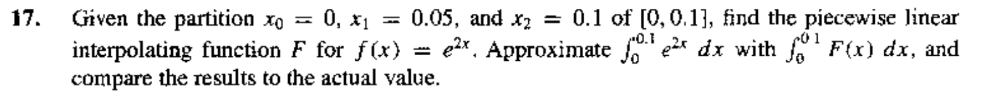
    

    ??? note "解答"

        Gemini 2.5 Pro 没能算对，所以这里就直接贴上教材答案：

        

            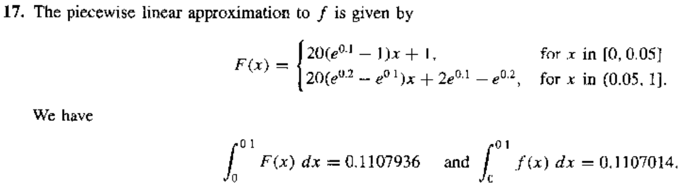
        

## Chap 4: Numerical Differentiation and Integration

!!! question "问题（4.1.7）"

    Use the following data and the knowledge that the first five derivatives of $f$ are bounded on $[1,5]$ by $2, 3, 6, 12$ and $23$, respectively, to approximate $f'(3)$ as accurately as possible. Find a bound for the error.

    Data:

    |$x$ | 1 | 2 | 3 | 4 | 5|
    |:--:|:---:|:---:|:---:|:---:|:---:|
    |$f(x)$ | 2.4142 | 2.6734 | 2.8974 | 3.0976 | 3.2804|

    ??? note "解答"

        **1. 选择数值微分公式** 📝

        我们要近似计算 $f'(3)$。观察数据可知，$x=3$ 是一个数据点，且数据点是等距的，步长 $h=1$。为了尽可能精确地近似 $f'(3)$，我们应该选择一个高阶的差分公式。由于点 $x=3$ 的两侧都有对称的数据点 ($x=1, 2, 4, 5$)，我们可以使用五点中心差分公式，它具有 $O(h^4)$ 的精度。

        五点中心差分公式为：

        $f'(x_0) \approx \frac{f(x_0-2h) - 8f(x_0-h) + 8f(x_0+h) - f(x_0+2h)}{12h}$

        其截断误差项为 $E = \frac{h^4}{30}f^{(5)}(\xi)$，其中 $\xi$ 位于 $(x_0-2h, x_0+2h)$ 区间内。

        **2. 计算 $f'(3)$ 的近似值** 🧮

        取 $x_0=3$ 和 $h=1$：

        $x_0-2h = 3-2(1) = 1$

        $x_0-h = 3-1 = 2$

        $x_0+h = 3+1 = 4$

        $x_0+2h = 3+2(1) = 5$

        对应的函数值为：

        $f(1) = 2.4142$

        $f(2) = 2.6734$

        $f(4) = 3.0976$

        $f(5) = 3.2804$

        代入公式：

        $f'(3) \approx \frac{f(1) - 8f(2) + 8f(4) - f(5)}{12 \times 1}$

        $f'(3) \approx \frac{2.4142 - 8(2.6734) + 8(3.0976) - 3.2804}{12}$

        $f'(3) \approx \frac{2.4142 - 21.3872 + 24.7808 - 3.2804}{12}$

        $f'(3) \approx \frac{(2.4142 + 24.7808) - (21.3872 + 3.2804)}{12}$

        $f'(3) \approx \frac{27.1950 - 24.6676}{12}$

        $f'(3) \approx \frac{2.5274}{12} \approx 0.21061666...$

        因此，$f'(3)$ 的一个高精度近似值为 $0.21062$ (保留5位小数)。

        **3. 计算误差界限** 📉

        题目中给出 $f$ 的前五阶导数在 $[1,5]$ 上分别有界 $M_1=2, M_2=3, M_3=6, M_4=12, M_5=23$。
        五点公式的截断误差界为：

        $|E| \le \frac{h^4 M_5}{30}$

        其中 $h=1$，$M_5 = 23$ (题目给出的 $f^{(5)}(x)$ 的界)。

        $|E| \le \frac{1^4 \times 23}{30} = \frac{23}{30}$

        $\frac{23}{30} \approx 0.76667$

        作为比较，如果我们使用三点中心差分公式 $f'(x_0) \approx \frac{f(x_0+h)-f(x_0-h)}{2h}$，其误差项为 $-\frac{h^2}{6}f'''(\xi')$。其误差界为 $\frac{h^2 M_3}{6} = \frac{1^2 \times 6}{6} = 1$。

        由于 $\frac{23}{30} < 1$，五点公式提供的误差界更小，因此是更精确的选择。

        **关于舍入误差的简要说明：**

        数据 $f(x)$ 给定到小数点后4位，最大舍入误差可认为是 $\epsilon = 0.00005$。对于五点公式，计算值的舍入误差界大约是 $\frac{(1+8+8+1)\epsilon}{12h} = \frac{18 \times 0.00005}{12 \times 1} = 0.000075$。这个值远小于截断误差界 $\frac{23}{30}$，因此截断误差是总误差的主要部分。

        **结论**

        $f'(3)$ 的近似值为 $0.21062$。

        该近似的误差界为 $\frac{23}{30}$ (约 $0.76667$)。

!!! question "问题（4.1.13）"

    Let $f(x) = \cos \pi x$. Use Eq. (4.9) and the values of $f(x)$ at $x = 0.25, 0.5, \text{and } 0.75$ to approximate $f''(0.5)$. Compare this result to the exact value and to the approximation found in Exercise 11 of Section 3.4. Explain why this method is particularly accurate for this problem, and find a bound for the error.

    

        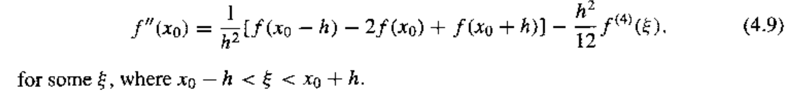
    
    

    ??? note "解答"
    
        Gemini 没能准确回答此题。

        

            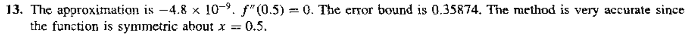
        
    

!!! question "问题（4.3.7）"

    The Trapezoidal rule applied to $\int_0^2 f(x) dx$ gives the value 4, and Simpson's rule gives the value 2. What is $f(1)$?

    ??? note "解答"

        为了求解 $f(1)$ 的值，我们需要写出梯形法则（Trapezoidal rule）和辛普森法则（Simpson's rule）在积分 $\int_0^2 f(x) dx$ 上的基本形式。

        **1. 梯形法则 (Trapezoidal Rule)** 📐

        对于积分 $\int_a^b f(x) dx$，基本的梯形法则公式为：

        $T = \frac{b-a}{2} [f(a) + f(b)]$

        在本题中，$a=0, b=2$，所以：

        $T = \frac{2-0}{2} [f(0) + f(2)] = f(0) + f(2)$

        题目给出梯形法则计算结果为 4，所以：

        $f(0) + f(2) = 4 \quad (*)$

        **2. 辛普森法则 (Simpson's Rule)** 📊

        对于积分 $\int_a^b f(x) dx$，基本的辛普森法则需要计算中点的值，即 $x_m = \frac{a+b}{2}$。公式为：
        
        $S = \frac{b-a}{6} [f(a) + 4f(\frac{a+b}{2}) + f(b)]$

        或者，如果我们设步长 $h = \frac{b-a}{2}$，则公式为 $S = \frac{h}{3} [f(a) + 4f(a+h) + f(b)]$。

        在本题中，$a=0, b=2$，所以中点是 $\frac{0+2}{2} = 1$，步长 $h = \frac{2-0}{2} = 1$。

        $S = \frac{1}{3} [f(0) + 4f(1) + f(2)]$

        题目给出辛普森法则计算结果为 2，所以：

        $\frac{1}{3} [f(0) + 4f(1) + f(2)] = 2$

        $f(0) + 4f(1) + f(2) = 6 \quad (**)$

        **3. 求解 $f(1)$** 💡

        我们现在有两个方程：

        $(*) \quad f(0) + f(2) = 4$

        $(**) \quad f(0) + 4f(1) + f(2) = 6$

        我们可以将方程 $(**)$改写为：

        $[f(0) + f(2)] + 4f(1) = 6$

        将方程 $(*)$ 代入上式：

        $4 + 4f(1) = 6$

        $4f(1) = 6 - 4$

        $4f(1) = 2$

        $f(1) = \frac{2}{4} = \frac{1}{2}$

        因此，$f(1)$ 的值为 $\frac{1}{2}$。

!!! question "问题（4.3.9）"

    9. Find the degree of precision of the quadrature formula

    $$\int_{-1}^{1} f(x) dx \approx f\left(-\frac{\sqrt{3}}{3}\right) + f\left(\frac{\sqrt{3}}{3}\right)$$

    ??? note "解答"

        求积公式的 **精度 (degree of precision)** 是指能使该公式对所有 $k=0, 1, \dots, n$ 次多项式 $f(x)=x^k$ 精确成立的最大整数 $n$。

        我们用 $I(f) = \int_{-1}^{1} f(x) dx$ 表示积分的精确值，用 $Q(f) = f(-\frac{\sqrt{3}}{3}) + f(\frac{\sqrt{3}}{3})$ 表示求积公式的近似值。我们将对 $f(x)=x^k$ (从 $k=0$ 开始) 进行测试。

        **1. 测试 $k=0$: $f(x) = x^0 = 1$**

        精确积分：

        $I(1) = \int_{-1}^{1} 1 \, dx = [x]_{-1}^{1} = 1 - (-1) = 2$

        求积公式近似：

        $Q(1) = 1 + 1 = 2$

        由于 $I(1) = Q(1)$，该公式对于 $f(x)=1$ 是精确的。精度至少为0。

        **2. 测试 $k=1$: $f(x) = x^1 = x$**

        精确积分：

        $I(x) = \int_{-1}^{1} x \, dx = \left[\frac{x^2}{2}\right]_{-1}^{1} = \frac{1^2}{2} - \frac{(-1)^2}{2} = \frac{1}{2} - \frac{1}{2} = 0$

        求积公式近似：

        $Q(x) = \left(-\frac{\sqrt{3}}{3}\right) + \left(\frac{\sqrt{3}}{3}\right) = 0$

        由于 $I(x) = Q(x)$，该公式对于 $f(x)=x$ 是精确的。精度至少为1。

        **3. 测试 $k=2$: $f(x) = x^2$**

        精确积分：

        $I(x^2) = \int_{-1}^{1} x^2 \, dx = \left[\frac{x^3}{3}\right]_{-1}^{1} = \frac{1^3}{3} - \frac{(-1)^3}{3} = \frac{1}{3} - (-\frac{1}{3}) = \frac{2}{3}$

        求积公式近似：

        $Q(x^2) = \left(-\frac{\sqrt{3}}{3}\right)^2 + \left(\frac{\sqrt{3}}{3}\right)^2 = \frac{3}{9} + \frac{3}{9} = \frac{1}{3} + \frac{1}{3} = \frac{2}{3}$

        由于 $I(x^2) = Q(x^2)$，该公式对于 $f(x)=x^2$ 是精确的。精度至少为2。

        **4. 测试 $k=3$: $f(x) = x^3$**

        精确积分：

        $I(x^3) = \int_{-1}^{1} x^3 \, dx = \left[\frac{x^4}{4}\right]_{-1}^{1} = \frac{1^4}{4} - \frac{(-1)^4}{4} = \frac{1}{4} - \frac{1}{4} = 0$

        求积公式近似：

        $Q(x^3) = \left(-\frac{\sqrt{3}}{3}\right)^3 + \left(\frac{\sqrt{3}}{3}\right)^3 = -\left(\frac{3\sqrt{3}}{27}\right) + \left(\frac{3\sqrt{3}}{27}\right) = -\frac{\sqrt{3}}{9} + \frac{\sqrt{3}}{9} = 0$

        由于 $I(x^3) = Q(x^3)$，该公式对于 $f(x)=x^3$ 是精确的。精度至少为3。

        **5. 测试 $k=4$: $f(x) = x^4$**

        精确积分：

        $I(x^4) = \int_{-1}^{1} x^4 \, dx = \left[\frac{x^5}{5}\right]_{-1}^{1} = \frac{1^5}{5} - \frac{(-1)^5}{5} = \frac{1}{5} - (-\frac{1}{5}) = \frac{2}{5}$

        求积公式近似：

        $Q(x^4) = \left(-\frac{\sqrt{3}}{3}\right)^4 + \left(\frac{\sqrt{3}}{3}\right)^4 = \left(\frac{9}{81}\right) + \left(\frac{9}{81}\right) = \frac{1}{9} + \frac{1}{9} = \frac{2}{9}$

        由于 $I(x^4) = \frac{2}{5}$ 而 $Q(x^4) = \frac{2}{9}$，且 $\frac{2}{5} \neq \frac{2}{9}$，该公式对于 $f(x)=x^4$ 不精确。

        **结论**

        该求积公式对于 $x^0, x^1, x^2, x^3$ 都是精确的，但对于 $x^4$ 不精确。因此，该求积公式的精度为 **3**。

        (注：该公式是两点高斯-勒让德 (Gauss-Legendre) 求积公式，其节点为勒让德多项式 $P_2(x)$ 的零点，权重均为1。对于N点高斯求积，其精度为 $2N-1$。在此，$N=2$，所以精度为 $2(2)-1=3$，与计算结果一致。)

!!! question "问题（4.3.11）"

    The quadrature formula $\int_{-1}^{1} f(x) dx \approx c_0 f(-1) + c_1 f(0) + c_2 f(1)$ is exact for all polynomials of degree less than or equal to 2. Determine $c_0, c_1,$ and $c_2$.

    ??? note "解答"

        为了确定系数 $c_0, c_1, c_2$，我们利用求积公式对于次数小于或等于2的多项式（即 $f(x)=1, f(x)=x, f(x)=x^2$）是精确的这一条件。这意味着对于这些函数，积分的精确值等于求积公式给出的近似值。

        令 $I(f) = \int_{-1}^{1} f(x) dx$ 和 $Q(f) = c_0 f(-1) + c_1 f(0) + c_2 f(1)$。

        我们需要 $I(f) = Q(f)$ 对于 $f(x)=1, x, x^2$ 成立。

        **1. 对于 $f(x) = 1$ (0次多项式):**

        精确积分：

        $I(1) = \int_{-1}^{1} 1 \, dx = [x]_{-1}^{1} = 1 - (-1) = 2$

        求积公式：

        $Q(1) = c_0 f(-1) + c_1 f(0) + c_2 f(1) = c_0(1) + c_1(1) + c_2(1) = c_0 + c_1 + c_2$

        由于公式精确，我们有：

        $c_0 + c_1 + c_2 = 2 \quad (1)$

        **2. 对于 $f(x) = x$ (1次多项式):**

        精确积分：

        $I(x) = \int_{-1}^{1} x \, dx = \left[\frac{x^2}{2}\right]_{-1}^{1} = \frac{1^2}{2} - \frac{(-1)^2}{2} = \frac{1}{2} - \frac{1}{2} = 0$

        求积公式：

        $Q(x) = c_0 f(-1) + c_1 f(0) + c_2 f(1) = c_0(-1) + c_1(0) + c_2(1) = -c_0 + 0 \cdot c_1 + c_2 = -c_0 + c_2$

        由于公式精确，我们有：

        $-c_0 + c_2 = 0 \implies c_0 = c_2 \quad (2)$

        **3. 对于 $f(x) = x^2$ (2次多项式):**

        精确积分：

        $I(x^2) = \int_{-1}^{1} x^2 \, dx = \left[\frac{x^3}{3}\right]_{-1}^{1} = \frac{1^3}{3} - \frac{(-1)^3}{3} = \frac{1}{3} - \left(-\frac{1}{3}\right) = \frac{2}{3}$

        求积公式：

        $Q(x^2) = c_0 f(-1) + c_1 f(0) + c_2 f(1) = c_0(-1)^2 + c_1(0)^2 + c_2(1)^2 = c_0(1) + c_1(0) + c_2(1) = c_0 + c_2$

        由于公式精确，我们有：

        $c_0 + c_2 = \frac{2}{3} \quad (3)$

        **4. 求解线性方程组:**

        我们得到以下方程组：

        (1) $c_0 + c_1 + c_2 = 2$

        (2) $c_0 = c_2$

        (3) $c_0 + c_2 = \frac{2}{3}$

        将 (2) 代入 (3):

        $c_0 + c_0 = \frac{2}{3}$

        $2c_0 = \frac{2}{3}$

        $c_0 = \frac{1}{3}$

        根据 (2)，$c_2 = c_0$，所以 $c_2 = \frac{1}{3}$。

        将 $c_0 = \frac{1}{3}$ 和 $c_2 = \frac{1}{3}$ 代入 (1):

        $\frac{1}{3} + c_1 + \frac{1}{3} = 2$

        $c_1 + \frac{2}{3} = 2$

        $c_1 = 2 - \frac{2}{3} = \frac{6}{3} - \frac{2}{3} = \frac{4}{3}$

        **结论:**

        所求的系数为：

        $c_0 = \frac{1}{3}$

        $c_1 = \frac{4}{3}$

        $c_2 = \frac{1}{3}$

        (注：这个求积公式是区间 $[-1,1]$ 上的辛普森法则。)

!!! question "问题（4.3.13）"

    Find the constants $c_0$, $c_1$, and $x_1$ so that the quadrature formula

    $$\int_0^1 f(x) dx = c_0 f(0) + c_1 f(x_1)$$

    has the highest possible degree of precision.

    ??? note "解答"

        Gemini 没能正确解答。

        $c_0 = c_1 = \dfrac{1}{2}$，且最高精度阶为 1。

!!! question "问题（4.4.7(a)(b)）"

    Determine the values of $n$ and $h$ required to approximate

    $$\int_0^2 e^{2x} \sin 3x \, dx$$

    to within $10^{-4}$.

    a. Use the Composite Trapezoidal rule.

    b. Use the Composite Simpson's rule. 

    ??? note "解答"

        Gemini 没能正确解答。

        

            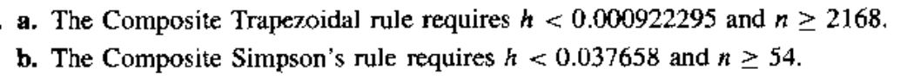
        

!!! question "问题（4.7.1）"

    Approximate the following integrals using Gaussian quadrature with $n=2$, and compare your results to the exact values of the integrals.

    a. $\int_{1}^{1.5} x^2 \ln x \,dx$

    b. $\int_{0}^{1} x^2 e^{-x} \,dx$

    c. $\int_{0}^{0.35} \frac{2}{x^2-4} \,dx$

    d. $\int_{0}^{\pi/4} x^2 \sin x \,dx$

    e. $\int_{0}^{\pi/4} e^{3x} \sin(2x) \,dx$

    f. $\int_{1}^{1.6} \frac{2x}{x^2-4} \,dx$

    g. $\int_{3}^{3.5} \frac{x}{\sqrt{x^2-4}} \,dx$

    h. $\int_{0}^{\pi/4} (\cos x)^2 \,dx$

    ??? note "解答"

        Gemini 没能正确解答。

        

            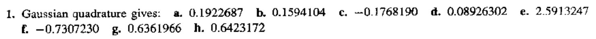
        

!!! question "问题（4.7.5）"

    Determine constants $a, b, c,$ and $d$ that will produce a quadrature formula
    
    $$\int_{-1}^{1} f(x) dx \approx af(-1) + bf(1) + cf'(-1) + df'(1)$$
    
    that has degree of precision 3.

    ??? note "解答"

        为了使求积公式具有3次精度，该公式必须对 $f(x) = 1, x, x^2, x^3$ 精确成立。

        令 $I(f) = \int_{-1}^{1} f(x) dx$ 和 $Q(f) = af(-1) + bf(1) + cf'(-1) + df'(1)$。

        我们需要 $I(f) = Q(f)$ 对于 $f(x) = x^k, k=0, 1, 2, 3$。

        1.  **对于 $f(x) = 1$**:

            $f(-1)=1, f(1)=1, f'(-1)=0, f'(1)=0$.

            $I(1) = \int_{-1}^{1} 1 \,dx = 2$.

            $Q(1) = a(1) + b(1) + c(0) + d(0) = a+b$.

            所以，$a+b = 2$  (方程1)

        2.  **对于 $f(x) = x$**:

            $f(-1)=-1, f(1)=1, f'(-1)=1, f'(1)=1$.

            $I(x) = \int_{-1}^{1} x \,dx = 0$.

            $Q(x) = a(-1) + b(1) + c(1) + d(1) = -a+b+c+d$.

            所以，$-a+b+c+d = 0$  (方程2)

        3.  **对于 $f(x) = x^2$**:

            $f(-1)=1, f(1)=1, f'(-1)=-2, f'(1)=2$.

            $I(x^2) = \int_{-1}^{1} x^2 \,dx = \frac{2}{3}$.

            $Q(x^2) = a(1) + b(1) + c(-2) + d(2) = a+b-2c+2d$.

            所以，$a+b-2c+2d = \frac{2}{3}$  (方程3)

        4.  **对于 $f(x) = x^3$**:

            $f(-1)=-1, f(1)=1, f'(-1)=3, f'(1)=3$.

            $I(x^3) = \int_{-1}^{1} x^3 \,dx = 0$.

            $Q(x^3) = a(-1) + b(1) + c(3) + d(3) = -a+b+3c+3d$.

            所以，$-a+b+3c+3d = 0$  (方程4)

        现在我们求解这个线性方程组：

        1) $a+b = 2$

        2) $-a+b+c+d = 0$

        3) $a+b-2c+2d = \frac{2}{3}$

        4) $-a+b+3c+3d = 0$

        将方程1代入方程3:

        $2 - 2c + 2d = \frac{2}{3} \Rightarrow -2c+2d = -\frac{4}{3} \Rightarrow c-d = \frac{2}{3}$ (方程5)

        从方程2和方程4:

        将方程2从方程4中减去: $(3c+3d) - (c+d) = 0 \Rightarrow 2c+2d=0 \Rightarrow c+d=0$ (方程6)

        解方程5和方程6组成的关于 $c, d$ 的方程组:

        $c-d = 2/3$

        $c+d = 0$

        相加得到 $2c = 2/3 \Rightarrow c = 1/3$.

        代入 $c+d=0$ 得到 $d = -1/3$.

        将 $c=1/3, d=-1/3$ 代入方程2:

        $-a+b+1/3-1/3 = 0 \Rightarrow -a+b=0 \Rightarrow a=b$.

        将 $a=b$ 代入方程1:

        $a+a=2 \Rightarrow 2a=2 \Rightarrow a=1$.

        所以 $b=1$.

        因此，所求常数为：

        $a = 1$

        $b = 1$

        $c = \frac{1}{3}$
        
        $d = -\frac{1}{3}$

## Chap 5: Initial-Value Problems for Ordinary Differential Equations

!!! question "问题（5.3.5(a)(b)）"

    Given the initial-value problem
    $y' = \frac{2}{t}y + t^2e^t, \quad 1 \le t \le 2, \quad y(1)=0,$

    with exact solution $y(t) = t^2(e^t - e)$:

    a. Use Taylor's method of order two with $h=0.1$ to approximate the solution, and compare it with the actual values of $y$.

    b. Use the answers generated in part (a) and linear interpolation to approximate $y$ at the following values, and compare them to the actual values of $y$.

    i. $y(1.04)$

    ii. $y(1.55)$

    iii. $y(1.97)$

    ??? note "解答"

        Gemini 没能正确解答。

        

            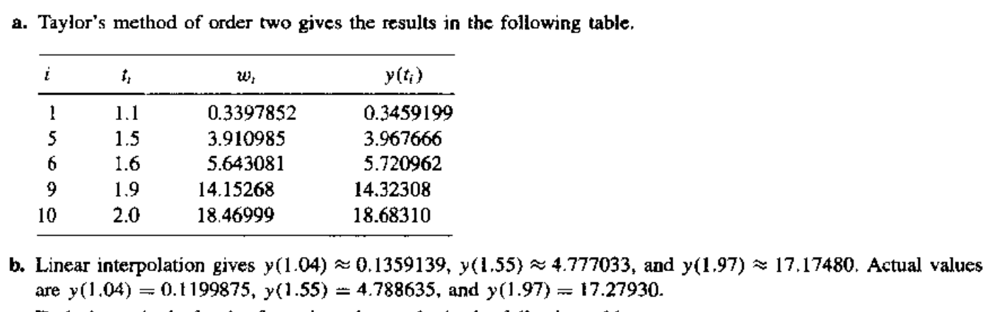
        

!!! question "问题（5.4.1）"

    Use the Modified Euler method to approximate the solutions to each of the following initial-value problems, and compare the results to the actual values.

    a. $y' = te^{3t} - 2y, \quad 0 \le t \le 1, \quad y(0) = 0, \quad \text{with } h = 0.5;$ actual solution $y(t) = \frac{1}{5}te^{3t} - \frac{1}{25}e^{3t} + \frac{1}{25}e^{-2t}$.

    ??? note "解答"

        我们将使用改进欧拉法（Heun法）来求解此初值问题。改进欧拉法的公式如下：

        $w_0 = y(t_0)$

        对于每一步 $i = 0, 1, \dots, N-1$:

        $K_1 = f(t_i, w_i)$

        $K_2 = f(t_{i+1}, w_i + h K_1)$

        $w_{i+1} = w_i + \frac{h}{2}(K_1 + K_2)$

        给定的微分方程为 $f(t,y) = te^{3t} - 2y$。

        初始条件为 $t_0 = 0, w_0 = y(0) = 0$。

        步长 $h = 0.5$。我们需要计算 $t_1 = 0.5$ 和 $t_2 = 1.0$ 处的近似值。

        用到的常数值（近似到7位小数）：

        $e^{1.5} \approx 4.4816891$

        $e^{-1} \approx 0.3678794$

        $e^{3} \approx 20.0855369$

        $e^{-2} \approx 0.1353353$

        **步骤 1: 计算 $w_1$ (即 $y(0.5)$ 的近似值)**

        $t_0 = 0, w_0 = 0$.

        $K_1 = f(t_0, w_0) = f(0, 0) = 0 \cdot e^{3(0)} - 2(0) = 0$.

        $K_2 = f(t_0+h, w_0 + h K_1) = f(0+0.5, 0 + 0.5 \cdot 0) = f(0.5, 0)$.

        $K_2 = 0.5 \cdot e^{3(0.5)} - 2(0) = 0.5 e^{1.5} \approx 0.5 \times 4.4816891 \approx 2.24084455$.

        $w_1 = w_0 + \frac{h}{2}(K_1 + K_2) = 0 + \frac{0.5}{2}(0 + 2.24084455) = 0.25 \times 2.24084455 \approx 0.5602111$.

        **实际值 $y(0.5)$:**

        $y(0.5) = \frac{1}{5}(0.5)e^{3(0.5)} - \frac{1}{25}e^{3(0.5)} + \frac{1}{25}e^{-2(0.5)}$

        $y(0.5) = 0.1 e^{1.5} - 0.04 e^{1.5} + 0.04 e^{-1} = 0.06 e^{1.5} + 0.04 e^{-1}$.

        $y(0.5) \approx 0.06 \times 4.4816891 + 0.04 \times 0.3678794$

        $y(0.5) \approx 0.26890135 + 0.01471518 \approx 0.2836165$.

        **比较 $w_1$ 和 $y(0.5)$:**

        近似值 $w_1 \approx 0.56021$. (保留5位小数)

        实际值 $y(0.5) \approx 0.28362$. (保留5位小数)

        绝对误差 $|w_1 - y(0.5)| \approx |0.56021 - 0.28362| = 0.27659$.

        **步骤 2: 计算 $w_2$ (即 $y(1.0)$ 的近似值)**

        $t_1 = 0.5, w_1 \approx 0.5602111$ (使用上一步更精确的结果进行计算).

        $K_1 = f(t_1, w_1) = f(0.5, 0.5602111) = 0.5 e^{3(0.5)} - 2(0.5602111)$.

        $K_1 \approx 0.5 \times 4.4816891 - 1.1204222 = 2.24084455 - 1.1204222 \approx 1.12042235$.

        $K_2 = f(t_1+h, w_1 + h K_1) = f(1.0, 0.5602111 + 0.5 \times 1.12042235)$.

        $w_1 + h K_1 \approx 0.5602111 + 0.560211175 \approx 1.120422275$.

        $K_2 = f(1.0, 1.120422275) = 1.0 \cdot e^{3(1.0)} - 2(1.120422275)$.

        $K_2 \approx e^3 - 2.24084455 \approx 20.0855369 - 2.24084455 \approx 17.84469235$.

        $w_2 = w_1 + \frac{h}{2}(K_1 + K_2) \approx 0.5602111 + \frac{0.5}{2}(1.12042235 + 17.84469235)$.

        $w_2 \approx 0.5602111 + 0.25 \times 18.9651147 \approx 0.5602111 + 4.741278675 \approx 5.3014898$.

        **实际值 $y(1.0)$:**

        $y(1.0) = \frac{1}{5}(1.0)e^{3(1.0)} - \frac{1}{25}e^{3(1.0)} + \frac{1}{25}e^{-2(1.0)}$

        $y(1.0) = 0.2 e^3 - 0.04 e^3 + 0.04 e^{-2} = 0.16 e^3 + 0.04 e^{-2}$.

        $y(1.0) \approx 0.16 \times 20.0855369 + 0.04 \times 0.1353353$

        $y(1.0) \approx 3.21368590 + 0.00541341 \approx 3.2190993$.

        **比较 $w_2$ 和 $y(1.0)$:**

        近似值 $w_2 \approx 5.30149$. (保留5位小数)

        实际值 $y(1.0) \approx 3.21910$. (保留5位小数)

        绝对误差 $|w_2 - y(1.0)| \approx |5.30149 - 3.21910| = 2.08239$.

        **总结:**

        在 $t=0.5$ 时，改进欧拉法得到的近似值为 $w_1 \approx 0.56021$，实际值为 $y(0.5) \approx 0.28362$，绝对误差约为 $0.27659$。

        在 $t=1.0$ 时，改进欧拉法得到的近似值为 $w_2 \approx 5.30149$，实际值为 $y(1.0) \approx 3.21910$，绝对误差约为 $2.08239$。

        由于步长 $h=0.5$ 相对较大，且函数 $te^{3t}$ 增长迅速，导致近似误差较大。

!!! question "问题（5.4.10）"

    10. Repeat Exercise 1 using the Runge-Kutta method of order four.

    Referring to Exercise 1.a:

    1.a. $y' = te^{3t} - 2y, \quad 0 \le t \le 1, \quad y(0) = 0, \quad \text{with } h = 0.5;$ actual solution $y(t) = \frac{1}{5}te^{3t} - \frac{1}{25}e^{3t} + \frac{1}{25}e^{-2t}$.

    ??? note "解答"

        我们将使用四阶龙格-库塔 (RK4) 方法来求解此初值问题。

        RK4 方法的公式如下：

        $w_0 = y(t_0)$

        对于每一步 $i = 0, 1, \dots, N-1$:

        $k_1 = f(t_i, w_i)$

        $k_2 = f(t_i + \frac{h}{2}, w_i + \frac{h}{2}k_1)$

        $k_3 = f(t_i + \frac{h}{2}, w_i + \frac{h}{2}k_2)$

        $k_4 = f(t_i + h, w_i + hk_3)$

        $w_{i+1} = w_i + \frac{h}{6}(k_1 + 2k_2 + 2k_3 + k_4)$

        给定的微分方程为 $f(t,y) = te^{3t} - 2y$。

        初始条件为 $t_0 = 0, w_0 = y(0) = 0$。

        步长 $h = 0.5$。我们需要计算 $t_1 = 0.5$ 和 $t_2 = 1.0$ 处的近似值。

        用到的常数值 (近似到相关位数)：

        $e^{0.75} \approx 2.117000$

        $e^{1.5} \approx 4.481689$

        $e^{2.25} \approx 9.487736$

        $e^{3} \approx 20.085537$

        $e^{-1} \approx 0.367879$

        $e^{-2} \approx 0.135335$

        **步骤 1: 计算 $w_1$ (即 $y(0.5)$ 的近似值)**

        $t_0 = 0, w_0 = 0, h = 0.5$.

        $k_1 = f(0, 0) = 0 \cdot e^0 - 2(0) = 0$.

        $k_2 = f(0 + 0.25, 0 + 0.25 \cdot 0) = f(0.25, 0) = 0.25 e^{0.75} \approx 0.25 \times 2.117000 \approx 0.529250$.

        $k_3 = f(0.25, 0 + 0.25 \cdot k_2) = f(0.25, 0.25 \times 0.529250) = f(0.25, 0.132313)$.

        $k_3 = 0.25 e^{0.75} - 2(0.132313) \approx 0.529250 - 0.264626 \approx 0.264624$.

        $k_4 = f(0 + 0.5, 0 + 0.5 \cdot k_3) = f(0.5, 0.5 \times 0.264624) = f(0.5, 0.132312)$.

        $k_4 = 0.5 e^{1.5} - 2(0.132312) \approx 0.5 \times 4.481689 - 0.264624 \approx 2.240845 - 0.264624 \approx 1.976221$.

        $w_1 = w_0 + \frac{h}{6}(k_1 + 2k_2 + 2k_3 + k_4)$

        $w_1 = 0 + \frac{0.5}{6}(0 + 2(0.529250) + 2(0.264624) + 1.976221)$

        $w_1 = \frac{0.5}{6}(1.058500 + 0.529248 + 1.976221) = \frac{0.5}{6}(3.563969) \approx 0.296997$.

        **实际值 $y(0.5)$:**

        $y(0.5) = 0.06 e^{1.5} + 0.04 e^{-1} \approx 0.06 \times 4.481689 + 0.04 \times 0.367879$

        $y(0.5) \approx 0.268901 + 0.014715 \approx 0.283616$.

        **比较 $w_1$ 和 $y(0.5)$:**

        近似值 $w_1 \approx 0.296997$.

        实际值 $y(0.5) \approx 0.283616$.

        绝对误差 $|w_1 - y(0.5)| \approx |0.296997 - 0.283616| = 0.013381$.

        **步骤 2: 计算 $w_2$ (即 $y(1.0)$ 的近似值)**

        $t_1 = 0.5, w_1 \approx 0.296997$.

        $k_1 = f(0.5, w_1) = 0.5 e^{1.5} - 2(0.296997) \approx 2.240845 - 0.593994 \approx 1.646851$.

        $k_2 = f(0.5 + 0.25, w_1 + 0.25 k_1) = f(0.75, 0.296997 + 0.25 \times 1.646851)$.

        $w_1 + 0.25 k_1 \approx 0.296997 + 0.411713 \approx 0.708710$.

        $k_2 = 0.75 e^{2.25} - 2(0.708710) \approx 0.75 \times 9.487736 - 1.417420 \approx 7.115802 - 1.417420 \approx 5.698382$.

        $k_3 = f(0.75, w_1 + 0.25 k_2) = f(0.75, 0.296997 + 0.25 \times 5.698382)$.

        $w_1 + 0.25 k_2 \approx 0.296997 + 1.424596 \approx 1.721593$.

        $k_3 = 0.75 e^{2.25} - 2(1.721593) \approx 7.115802 - 3.443186 \approx 3.672616$.

        $k_4 = f(0.5 + 0.5, w_1 + 0.5 k_3) = f(1.0, 0.296997 + 0.5 \times 3.672616)$.

        $w_1 + 0.5 k_3 \approx 0.296997 + 1.836308 \approx 2.133305$.

        $k_4 = 1.0 e^3 - 2(2.133305) \approx 20.085537 - 4.266610 \approx 15.818927$.

        $w_2 = w_1 + \frac{h}{6}(k_1 + 2k_2 + 2k_3 + k_4)$

        $w_2 \approx 0.296997 + \frac{0.5}{6}(1.646851 + 2(5.698382) + 2(3.672616) + 15.818927)$

        $w_2 \approx 0.296997 + \frac{0.5}{6}(1.646851 + 11.396764 + 7.345232 + 15.818927)$

        $w_2 \approx 0.296997 + \frac{0.5}{6}(36.207774) \approx 0.296997 + 3.0173145 \approx 3.314312$.

        **实际值 $y(1.0)$:**

        $y(1.0) = 0.16 e^3 + 0.04 e^{-2} \approx 0.16 \times 20.085537 + 0.04 \times 0.135335$

        $y(1.0) \approx 3.213686 + 0.005413 \approx 3.219099$.

        **比较 $w_2$ 和 $y(1.0)$:**

        近似值 $w_2 \approx 3.314312$.

        实际值 $y(1.0) \approx 3.219099$.

        绝对误差 $|w_2 - y(1.0)| \approx |3.314312 - 3.219099| = 0.095213$.

        **总结:**

        使用四阶龙格-库塔方法：

        在 $t=0.5$ 时，近似值为 $w_1 \approx 0.296997$，实际值为 $y(0.5) \approx 0.283616$，绝对误差约为 $0.013381$。

        在 $t=1.0$ 时，近似值为 $w_2 \approx 3.314312$，实际值为 $y(1.0) \approx 3.219099$，绝对误差约为 $0.095213$。

        与改进欧拉法相比，四阶龙格-库塔方法在相同步长下通常能提供更高的精度。

!!! question "问题（5.4.13）"

    Show that the Midpoint method, the Modified Euler method, and Heun's method give the same approximations to the initial-value problem

    $y' = -y + t + 1, \quad 0 \le t \le 1, \quad y(0) = 1,$
    
    for any choice of $h$. Why is this true?

    ??? note "解答"

        设 $f(t,y) = -y + t + 1$。初始条件为 $w_0 = y(0) = 1$。令 $f_i = f(t_i, w_i)$。

        1. 中点法 (Midpoint Method):

        中点法的公式为：

        $w_{i+1} = w_i + h f(t_i + \frac{h}{2}, w_i + \frac{h}{2} f(t_i, w_i))$

        令 $t_{mid} = t_i + \frac{h}{2}$ 且 $y_{mid} = w_i + \frac{h}{2} f_i = w_i + \frac{h}{2}(-w_i + t_i + 1)$。

        则：

        $f(t_{mid}, y_{mid}) = -y_{mid} + t_{mid} + 1$

        $= -(w_i + \frac{h}{2}(-w_i + t_i + 1)) + (t_i + \frac{h}{2}) + 1$

        $= -w_i - \frac{h}{2}(-w_i + t_i + 1) + t_i + \frac{h}{2} + 1$

        $= (-w_i + t_i + 1) - \frac{h}{2}(-w_i + t_i + 1) + \frac{h}{2}$

        $= f_i - \frac{h}{2}f_i + \frac{h}{2}$

        所以，对于中点法：

        $w_{i+1}^{(Midpoint)} = w_i + h \left( f_i - \frac{h}{2}f_i + \frac{h}{2} \right) = w_i + hf_i - \frac{h^2}{2}f_i + \frac{h^2}{2}$

        2. 休恩法 (Heun's Method):

        休恩法的公式为：

        $k_1 = f(t_i, w_i) = f_i$

        $k_2 = f(t_{i+1}, w_i + h k_1) = f(t_i+h, w_i + h f_i)$

        $w_{i+1} = w_i + \frac{h}{2}(k_1 + k_2)$

        计算 $k_2$：

        $k_2 = -(w_i + h f_i) + (t_i+h) + 1$

        $= -w_i - h f_i + t_i + h + 1$

        $= (-w_i + t_i + 1) - h f_i + h$

        $= f_i - h f_i + h$

        所以，对于休恩法：

        $w_{i+1}^{(Heun)} = w_i + \frac{h}{2}(f_i + (f_i - h f_i + h))$

        $= w_i + \frac{h}{2}(2f_i - h f_i + h)$

        $= w_i + hf_i - \frac{h^2}{2}f_i + \frac{h^2}{2}$

        **比较结果:**

        比较 $w_{i+1}^{(Midpoint)}$ 和 $w_{i+1}^{(Heun)}$ 的表达式，我们发现它们是完全相同的：

        $w_{i+1}^{(Midpoint)} = w_i + hf_i - \frac{h^2}{2}f_i + \frac{h^2}{2}$

        $w_{i+1}^{(Heun)} = w_i + hf_i - \frac{h^2}{2}f_i + \frac{h^2}{2}$

        因此，对于给定的初值问题，中点法和休恩法给出相同的近似值。

        **改进欧拉法 (Modified Euler Method):**

        “改进欧拉法”通常是“休恩法”的另一个名称。如果这里“改进欧拉法”指的是休恩法，那么它自然也给出相同的近似值。在某些文献中，它也可能指中点法，这种情况下结论依然成立。如果它指的是某个其他二阶龙格-库塔方法，如下文所述，结论对于这类线性 $f(t,y)$ 仍然成立。

        **原因分析 (Why is this true?):**

        这种一致性的原因是函数 $f(t,y) = -y + t + 1$ 是一个关于 $t$ 和 $y$ 的线性函数。这意味着它的二阶及更高阶偏导数均为零：

        $\frac{\partial f}{\partial t} = f_t = 1$

        $\frac{\partial f}{\partial y} = f_y = -1$

        $\frac{\partial^2 f}{\partial t^2} = f_{tt} = 0$

        $\frac{\partial^2 f}{\partial t \partial y} = f_{ty} = 0$

        $\frac{\partial^2 f}{\partial y^2} = f_{yy} = 0$

        中点法和休恩法都是二阶龙格-库塔 (RK2) 方法。对于一个一般的两阶段、二阶显式龙格-库塔方法：

        $k_1 = f(t_i, w_i)$

        $k_2 = f(t_i + c_2 h, w_i + a_{21} h k_1)$

        $w_{i+1} = w_i + h(b_1 k_1 + b_2 k_2)$

        其满足二阶条件：$b_1+b_2=1$, $b_2 c_2 = 1/2$, $b_2 a_{21} = 1/2$。

        当 $f(t,y)$ 的二阶偏导数为零时，$k_2$ 的泰勒展开式为：

        $k_2 = f(t_i, w_i) + (c_2 h) f_t(t_i, w_i) + (a_{21} h k_1) f_y(t_i, w_i) = f_i + h(c_2 f_t + a_{21} f_y f_i)$

        于是：

        $w_{i+1} = w_i + h(b_1 f_i + b_2 [f_i + h(c_2 f_t + a_{21} f_y f_i)])$

        $w_{i+1} = w_i + h(b_1+b_2)f_i + h^2 b_2(c_2 f_t + a_{21} f_y f_i)$

        利用二阶条件，上式简化为：

        $w_{i+1} = w_i + h f_i + h^2 (\frac{1}{2} f_t + \frac{1}{2} f_y f_i) = w_i + h f_i + \frac{h^2}{2}(f_t + f_y f_i)$

        对于 $f(t,y) = -y + t + 1$，我们有 $f_t = 1$ 和 $f_y = -1$。代入上式：

        $w_{i+1} = w_i + h f_i + \frac{h^2}{2}(1 - f_i)$

        这与我们之前为中点法和休恩法推导出的表达式 $w_i + hf_i - \frac{h^2}{2}f_i + \frac{h^2}{2}$ 是相同的。
        由于所有满足二阶条件的这类方法（包括中点法、休恩法，以及通常意义下的改进欧拉法）在 $f(t,y)$ 是线性函数时都会简化成相同的迭代表达式，因此它们对这个问题给出相同的近似解，与步长 $h$ 的选择无关。

!!! question "问题（5.6.10）"

    Derive Eq. (5.36) and its local truncation error by using an appropriate form of an interpolating polynomial.

    Equation (5.36) Adams-Moulton Two-Step Implicit Method:

    $w_0 = \alpha, \quad w_1 = \alpha_1,$

    $w_{i+1} = w_i + \frac{h}{12}[5 f(t_{i+1}, w_{i+1}) + 8 f(t_i, w_i) - f(t_{i-1}, w_{i-1})], \quad (5.36)$

    where $i=1, 2, \dots, N-1$. The local truncation error is $\tau_{i+1}(h) = -\frac{1}{24}y^{(4)}(\mu_i)h^3$, for some $\mu_i \in (t_{i-1}, t_{i+1})$.

    ??? note "解答"

        我们通过积分 $y'(t) = f(t, y(t))$ 从 $t_i$ 到 $t_{i+1}$ 来推导该方法：

        $y(t_{i+1}) - y(t_i) = \int_{t_i}^{t_{i+1}} y'(t) dt$

        我们用一个插值多项式 $P_2(t)$ 来近似 $y'(t)$，该多项式通过点 $(t_{i-1}, y'(t_{i-1}))$, $(t_i, y'(t_i))$ 和 $(t_{i+1}, y'(t_{i+1}))$。

        **1. 推导 Adams-Moulton 双步隐式方法公式 (Eq. 5.36)**

        令 $f_k = y'(t_k) = f(t_k, y(t_k))$。我们使用牛顿后向差分公式构造插值多项式 $P_2(t)$，令 $t = t_{i+1} + sh$，其中 $s$ 是一个无量纲变量。积分区间 $[t_i, t_{i+1}]$ 对应于 $s \in [-1, 0]$。

        $P_2(t) = P_2(t_{i+1}+sh) = f_{i+1} + s \nabla f_{i+1} + \frac{s(s+1)}{2} \nabla^2 f_{i+1}$

        其中：

        $\nabla f_{i+1} = f_{i+1} - f_i$

        $\nabla^2 f_{i+1} = f_{i+1} - 2f_i + f_{i-1}$

        积分 $\int_{t_i}^{t_{i+1}} P_2(t) dt = h \int_{-1}^0 P_2(t_{i+1}+sh) ds$:

        $h \int_{-1}^0 \left[ f_{i+1} + s(f_{i+1}-f_i) + \frac{s^2+s}{2}(f_{i+1}-2f_i+f_{i-1}) \right] ds$

        $= h \left[ sf_{i+1} + \frac{s^2}{2}(f_{i+1}-f_i) + \left(\frac{s^3}{6}+\frac{s^2}{4}\right)(f_{i+1}-2f_i+f_{i-1}) \right]_{-1}^0$

        计算定积分：

        $\int_{-1}^0 1 ds = [s]_{-1}^0 = 1$

        $\int_{-1}^0 s ds = [\frac{s^2}{2}]_{-1}^0 = -\frac{1}{2}$

        $\int_{-1}^0 \frac{s(s+1)}{2} ds = \frac{1}{2} [\frac{s^3}{3}+\frac{s^2}{2}]_{-1}^0 = \frac{1}{2} \left( 0 - (-\frac{1}{3}+\frac{1}{2}) \right) = \frac{1}{2} (-\frac{1}{6}) = -\frac{1}{12}$

        所以，积分为：

        $h \left[ 1 \cdot f_{i+1} - \frac{1}{2}(f_{i+1}-f_i) - \frac{1}{12}(f_{i+1}-2f_i+f_{i-1}) \right]$

        $= h \left[ f_{i+1} - \frac{1}{2}f_{i+1} + \frac{1}{2}f_i - \frac{1}{12}f_{i+1} + \frac{2}{12}f_i - \frac{1}{12}f_{i-1} \right]$

        $= h \left[ f_{i+1}(1-\frac{1}{2}-\frac{1}{12}) + f_i(\frac{1}{2}+\frac{2}{12}) - \frac{1}{12}f_{i-1} \right]$

        $= h \left[ f_{i+1}(\frac{12-6-1}{12}) + f_i(\frac{6+2}{12}) - \frac{1}{12}f_{i-1} \right]$

        $= h \left[ \frac{5}{12}f_{i+1} + \frac{8}{12}f_i - \frac{1}{12}f_{i-1} \right]$

        因此，$y(t_{i+1}) - y(t_i) \approx \frac{h}{12}[5f_{i+1} + 8f_i - f_{i-1}]$。

        用 $w_k$ 代替 $y(t_k)$ 并用 $f(t_k, w_k)$ 代替 $f_k$，得到公式 (5.36):

        $w_{i+1} = w_i + \frac{h}{12}[5 f(t_{i+1}, w_{i+1}) + 8 f(t_i, w_i) - f(t_{i-1}, w_{i-1})]$

        **2. 推导局部截断误差**

        局部截断误差 $\tau_{i+1}(h)$ 定义（根据所给误差形式）为：

        $\tau_{i+1}(h) = \frac{y(t_{i+1}) - y(t_i) - \frac{h}{12}[5y'(t_{i+1}) + 8y'(t_i) - y'(t_{i-1})]}{h}$

        这等于：

        $\tau_{i+1}(h) = \frac{1}{h} \left[ \int_{t_i}^{t_{i+1}} y'(t) dt - \int_{t_i}^{t_{i+1}} P_2(t) dt \right] = \frac{1}{h} \int_{t_i}^{t_{i+1}} (y'(t) - P_2(t)) dt$

        插值多项式 $P_2(t)$ 对函数 $y'(t)$ 在节点 $t_{i-1}, t_i, t_{i+1}$ 处的插值误差为：

        $y'(t) - P_2(t) = \frac{(y')'''(\eta(t))}{3!} (t-t_{i-1})(t-t_i)(t-t_{i+1}) = \frac{y^{(4)}(\eta(t))}{6} (t-t_{i-1})(t-t_i)(t-t_{i+1})$

        其中 $\eta(t)$ 位于包含 $t, t_{i-1}, t_i, t_{i+1}$ 的区间内。

        代入 $t = t_{i+1} + sh$，$dt = h ds$：

        $t-t_{i+1} = sh$

        $t-t_i = (s+1)h$

        $t-t_{i-1} = (s+2)h$

        误差积分为：

        $\int_{t_i}^{t_{i+1}} \frac{y^{(4)}(\eta(t))}{6} (s+2)h (s+1)h sh dt = \frac{h^4}{6} \int_{-1}^0 y^{(4)}(\eta(sh)) s(s+1)(s+2) ds$

        函数 $g(s) = s(s+1)(s+2) = s^3+3s^2+2s$ 在区间 $s \in [-1, 0]$ 上符号不变（为负或零）。因此，可以使用积分中值定理，存在某个 $\mu_i \in (t_{i-1}, t_{i+1})$ 使得：

        $\int_{-1}^0 y^{(4)}(\eta(sh)) s(s+1)(s+2) ds = y^{(4)}(\mu_i) \int_{-1}^0 (s^3+3s^2+2s) ds$

        计算积分：

        $\int_{-1}^0 (s^3+3s^2+2s) ds = \left[ \frac{s^4}{4} + s^3 + s^2 \right]_{-1}^0 = 0 - \left( \frac{1}{4} - 1 + 1 \right) = -\frac{1}{4}$

        所以，误差积分项为 $y^{(4)}(\mu_i) (-\frac{1}{4})$。

        代回 $\tau_{i+1}(h)$ 的表达式：

        $\tau_{i+1}(h) = \frac{1}{h} \cdot \frac{h^4}{6} \cdot y^{(4)}(\mu_i) \left(-\frac{1}{4}\right) = -\frac{1}{24} y^{(4)}(\mu_i) h^3$

        这与题目中给出的局部截断误差一致。

!!! question "问题（5.9.5）"

    Change the Adams Fourth-Order Predictor-Corrector Algorithm to obtain approximate solutions to systems of first-order equations.

    Exercise 2: "Use the Runge-Kutta for Systems Algorithm to approximate the solutions of the following higher-order differential equations, and compare the results to the actual solutions."

    * a. $y'' - 2y' + y = t e^t - t, \quad 0 \le t \le 1, \quad y(0)=0, y'(0)=0$, with $h=0.1$; actual solution $y(t) = \frac{1}{6}t^3 e^t - t e^t + 2e^t - t - 2$.

    * b. $t^2 y'' - 2ty' + 2y = t^3 \ln t, \quad 1 \le t \le 2, \quad y(1)=1, y'(1)=0$, with $h=0.1$; actual solution $y(t) = \frac{7}{4}t + \frac{1}{2}t^3 \ln t - \frac{3}{4}t^3$.
    
    * c. $y''' + 2y'' - y' - 2y = e^t, \quad 0 \le t \le 3, \quad y(0)=1, y'(0)=2, y''(0)=0$, with $h=0.2$; actual solution $y(t) = \frac{43}{36}e^t + \frac{1}{4}e^{-t} - \frac{4}{9}e^{-2t} + \frac{1}{6}te^t$.
    * d. $t^3 y''' - t^2 y'' + 3ty' - 4y = 5t^3 \ln t + 9t^3, \quad 1 \le t \le 2, \quad y(1)=0, y'(1)=1, y''(1)=3$, with $h=0.1$; actual solution $y(t) = -t^2 + t \cos(\ln t) + t \sin(\ln t) + t^3 \ln t$.

    Question 5: "Repeat Exercise 2 using the algorithm developed in Exercise 3."

    This means we need to solve problems 2.a, 2.b, 2.c, and 2.d by first converting them into systems of first-order ODEs and then applying the Adams Fourth-Order Predictor-Corrector Algorithm for systems.

    ??? note "解答"

        Gemini 没能正确作答。

        

            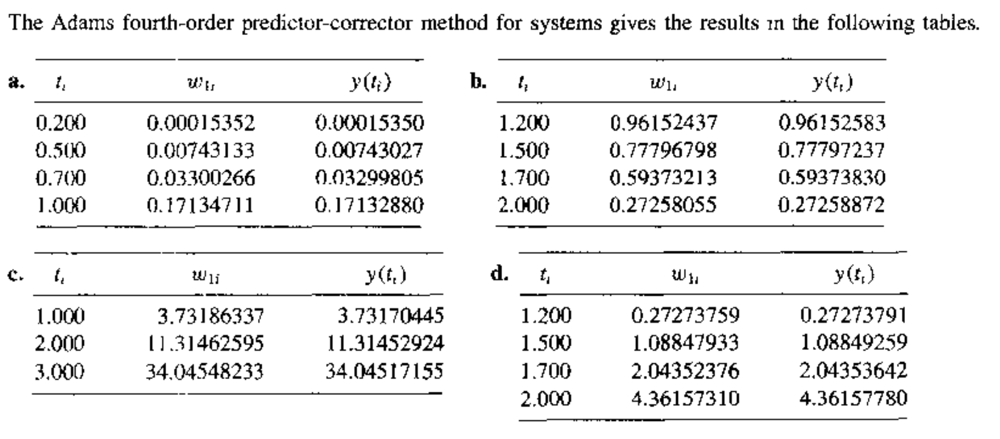
        

!!! question "问题（5.10.7）"

    Investigate stability for the difference method

    $$w_{i+1} = -4w_i + 5w_{i-1} + 2h[f(t_i, w_i) + 2f(t_{i-1}, w_{i-1})],$$

    for $i = 1, 2, \ldots, N-1$, with starting values $w_0, w_1$.

    ??? note "解答"

        接下来，这是该题目的中文解答：

        要研究该差分方法的稳定性，我们首先考察其零稳定性。将差分方法改写为标准形式：
        $$w_{i+1} + 4w_i - 5w_{i-1} = 2h f(t_i, w_i) + 4h f(t_{i-1}, w_{i-1})$$

        **关键步骤**：

        1.  **确定第一特征多项式 $\rho(\xi)$**：
            零稳定性由与方法相关的代数多项式（第一特征多项式）的根确定。该多项式是通过设置 $h=0$ (或者等价地，$f \equiv 0$)得到的：
            $$\rho(\xi) = \xi^2 + 4\xi - 5$$

        2.  **求解 $\rho(\xi)=0$ 的根**：
            $$\xi^2 + 4\xi - 5 = 0$$
            通过因式分解：
            $$(\xi - 1)(\xi + 5) = 0$$
            得到的根为 $\xi_1 = 1$ 和 $\xi_2 = -5$。

        3.  **根据根条件判断零稳定性**：
            为了使线性多步法是零稳定的，其第一特征多项式 $\rho(\xi)$ 的所有根 $\xi_j$ 必须满足以下条件（根条件）：
            * $|\xi_j| \le 1$ 对所有的 $j$ 成立。
            * 如果某个根满足 $|\xi_j| = 1$，则它必须是单根。

            对于此方法：
            * 根 $\xi_1 = 1$ 满足 $|\xi_1| = 1$，并且它是一个单根。
            * 根 $\xi_2 = -5$ 的模为 $|\xi_2| = |-5| = 5$。

        4.  **结论**：
            由于根 $\xi_2 = -5$ 的模为 $5$，它大于 1 ($|\xi_2| > 1$)，这违反了零稳定性的根条件。
            因此，该差分方法**不是零稳定的**。

        一个不是零稳定的线性多步法是**不稳定的**。

## Chap 6: Direct Methods for Solving Linear Systems

!!! question "问题（6.1.8）"

    **Gauss-Jordan Method:** This method is described as follows. Use the $i$th equation to eliminate not only $x_i$ from the equations $E_{i+1}, E_{i+2}, \dots, E_n$, as was done in the Gaussian elimination method, but also from $E_1, E_2, \dots, E_{i-1}$. Upon reducing $[A, \mathbf{b}]$ to:

    $$
    \begin{bmatrix}
    a_{11}^{(1)} & 0 & \cdots & 0 & \vdots & a_{1,n+1}^{(1)} \\
    0 & a_{22}^{(2)} & \cdots & 0 & \vdots & a_{2,n+1}^{(2)} \\
    \vdots & \vdots & \ddots & \vdots & \vdots & \vdots \\
    0 & 0 & \cdots & a_{nn}^{(n)} & \vdots & a_{n,n+1}^{(n)}
    \end{bmatrix}
    $$

    the solution is obtained by setting

    $$x_i = \frac{a_{i,n+1}^{(i)}}{a_{ii}^{(i)}},$$

    for each $i=1, 2, \dots, n$. This procedure circumvents the backward substitution in the Gaussian elimination. Construct an algorithm for the Gauss-Jordan procedure patterned after that of Algorithm 6.1.

    ??? note "解答"

        为了构建高斯-若尔当 (Gauss-Jordan) 消元法的算法，并使其模式与高斯消元法 (Algorithm 6.1) 相似，我们将修改高斯消元法的步骤，主要区别在于高斯-若尔当法会在主元所在列的其他所有行中都消去该变量，并且不需要回代步骤。

        以下是高斯-若尔当消元法的算法：

        **输入**:

        * 未知数和方程的个数 $n$。
        * 增广矩阵 $A = (a_{ij})$，其中 $1 \le i \le n$，$1 \le j \le n+1$。

        **输出**:

        * 解 $x_1, x_2, \dots, x_n$。
        * 或者，当线性方程组没有唯一解时的提示信息。

        **算法步骤**:

        **Step 1**: 对于 $i = 1, 2, \dots, n$，执行 Steps 2–4。(主循环，处理第 $i$ 行和第 $i$ 列作为主元)

        **Step 2**: (为第 $i$ 列选取主元)

        令 $p$ 是满足 $i \le p \le n$ 且 $a_{pi} \neq 0$ 的最小整数。

        如果没有找到这样的整数 $p$ (即第 $i$ 列从第 $i$ 行及以下元素全为0)，则停止执行，并输出信息“线性方程组没有唯一解 (no unique solution exists)”。

        **Step 3**: (行交换)

        如果 $p \neq i$，则执行行交换操作 $(E_p) \leftrightarrow (E_i)$。(交换后，$a_{ii}$ 即为当前非零主元)

        **Step 4**: (对第 $i$ 列进行消元，使得该列中除 $a_{ii}$ 外的其他元素均为0)

        对于 $j = 1, 2, \dots, n$:

            如果 $j \neq i$:

            设置乘数 $m = a_{ji} / a_{ii}$。

            执行行操作 $(E_j - m E_i) \to (E_j)$。具体为，对于 $k = i, \dots, n+1$:

                $a_{jk} \leftarrow a_{jk} - m \cdot a_{ik}$。

            (此操作将使得 $a_{ji}$ 变为0，同时更新第 $j$ 行的其他元素。)

        **Step 5**: (计算解)

        此时，系数矩阵部分应为对角矩阵。

        对于 $i = 1, 2, \dots, n$:

        如果 $a_{ii} = 0$ (这意味着没有唯一解，例如自由变量或无解情况)，则停止执行，并输出信息“线性方程组没有唯一解 (no unique solution exists)”。

        计算 $x_i = a_{i,n+1} / a_{ii}$。

        **Step 6**: 输出解 $(x_1, x_2, \dots, x_n)$，提示“过程成功完成 (Procedure completed successfully)”。

        **与 Algorithm 6.1 (高斯消元法) 的主要区别**:

        1. **主循环**: 高斯-若尔当法的主循环 (Step 1) 进行到 $i=n$，而高斯消元法到 $i=n-1$。
        2. **消元范围**: 高斯-若尔当法的消元 (Step 4) 是针对主元列 ($i$列) 的所有其他行 ($j \neq i$)，而高斯消元法仅针对主元下方的行 ($j > i$)。
        3. **回代**: 高斯-若尔当法在消元结束后直接得到对角矩阵 (或者通过规范化得到单位矩阵)，可以直接求解，不需要高斯消元法中的回代步骤 (Algorithm 6.1 中的 Steps 8-9)。本算法的 Step 5 直接计算解。

!!! question "问题（6.1.11）"

    a. Show that the Gauss-Jordan method requires
    
    $$\frac{n^3}{2} + n^2 - \frac{n}{2} \quad \text{multiplications/divisions}$$
    
    and
    
    $$\frac{n^3}{2} - \frac{n}{2} \quad \text{additions/subtractions.}$$
    
    b. Make a table comparing the required operations for the Gauss-Jordan and Gaussian elimination methods for $n=3, 10, 50, 100$. Which method requires less computation?

    ??? note "解答"

        **Gauss-Jordan 方法的运算次数**

        为了推导高斯-若尔当 (Gauss-Jordan) 方法的运算次数，我们分析其主要步骤。该方法将增广矩阵 $[A|\mathbf{b}]$ 变换为 $[I|\mathbf{x}]$ 的形式（如果主元在过程中被规范化为1），或者变换为一个对角矩阵后通过除法求解。题目给出的求解方式 $x_i = a_{i,n+1}^{(i)}/a_{ii}^{(i)}$ 暗示主元 $a_{ii}$ 在消元过程中不一定被规范化为1。我们将采用与题目公式匹配的计数约定。

        算法步骤回顾（针对 $n \times n$ 线性系统 $[A|\mathbf{b}]$，其中增广矩阵有 $n+1$ 列）：

        1.  外层循环 $i = 1, \dots, n$ (选取主元 $a_{ii}$)。
        2.  内层循环 $j = 1, \dots, n$，但 $j \neq i$ (选取需要操作的行 $E_j$)。此循环执行 $(n-1)$ 次。

            * **除法**: 计算乘数 $m = a_{ji} / a_{ii}$。这需要 1 次除法。
            * 最内层循环 $k = i+1, \dots, n+1$ (操作 $E_j$ 中主元列右侧的元素)。此循环执行 $(n+1) - (i+1) + 1 = n-i+1$ 次。

                * **乘法**: $m \cdot a_{ik}$。共 $(n-i+1)$ 次乘法。
                * **减法**: $a_{jk} - (\text{product})$。共 $(n-i+1)$ 次减法。

            * (元素 $a_{ji}$ 变成 0。按照与目标公式匹配的计数方法，此特定置零操作不计入额外的乘/减运算，其效果通过上述运算实现。)

        **消元阶段的运算次数统计**:

        * **除法次数**:

            对于每个 $i$，有 $(n-1)$ 个 $j$ 需要计算乘数 $m$。

            总除法次数 $= \sum_{i=1}^{n} (n-1) = n(n-1)$。

        * **乘法次数**:

            对于每个 $i$，有 $(n-1)$ 个 $j$，每个 $j$ 需要 $(n-i+1)$ 次乘法。

            总乘法次数 $= \sum_{i=1}^{n} (n-1)(n-i+1) = (n-1) \sum_{i=1}^{n} (n-i+1)$。

            令 $s = n-i+1$。当 $i=1$ 时，$s=n$；当 $i=n$ 时，$s=1$。

            所以总乘法次数 $= (n-1) \sum_{s=1}^{n} s = (n-1) \frac{n(n+1)}{2} = \frac{n(n^2-1)}{2} = \frac{n^3-n}{2}$。

        * **加/减法次数**:

            与乘法次数相同。

            总加/减法次数 $= \frac{n^3-n}{2}$。

        **求解阶段的运算次数**:

        最后，通过 $x_i = a_{i,n+1} / a_{ii}$ (其中 $a_{ii}$ 和 $a_{i,n+1}$ 是变换后的最终值) 计算解，对于 $i=1, \dots, n$。

        这需要 $n$ 次除法。

        **总运算次数**:

        * **总乘法/除法次数**:

            $n(n-1) \text{ (来自 } m \text{ 的除法)} + \frac{n^3-n}{2} \text{ (来自行操作的乘法)} + n \text{ (来自最后求解的除法)}$

            $= n^2-n + \frac{n^3-n}{2} + n = n^2 + \frac{n^3-n}{2} = \frac{2n^2 + n^3-n}{2} = \frac{n^3+2n^2-n}{2}$

            即 $\frac{n^3}{2} + n^2 - \frac{n}{2}$。这与题目公式相符。

        * **总加/减法次数**:

            $\frac{n^3-n}{2}$。

            即 $\frac{n^3}{2} - \frac{n}{2}$。这与题目公式相符。

        ---

        **Part b: Gauss-Jordan 与 Gaussian Elimination 运算次数比较**

        我们将使用以下高斯消元法结合回代求解 (GEBS) 的运算次数公式 (源自 Burden & Faires, Numerical Analysis, 常见的精确计数):

        * **GEBS 乘法/除法次数**: $\frac{n^3}{3} + n^2 - \frac{n}{3} = \frac{n^3+3n^2-n}{3}$
        * **GEBS 加/减法次数**: $\frac{n^3}{3} + \frac{n^2}{2} - \frac{5n}{6} = \frac{2n^3+3n^2-5n}{6}$

        高斯-若尔当 (GJ) 方法的运算次数公式已在 Part a 中给出:

        * **GJ 乘法/除法次数**: $\frac{n^3}{2} + n^2 - \frac{n}{2} = \frac{n^3+2n^2-n}{2}$
        * **GJ 加/减法次数**: $\frac{n^3}{2} - \frac{n}{2} = \frac{n^3-n}{2}$

        下表比较了两种方法所需的运算次数：

        | $n$ | 方法         | 乘法/除法 (M/D)          | 加/减法 (A/S)            |
        |:---:|:------------|:------------------------|:------------------------|
        | 3   | Gauss-Jordan | $\frac{27+18-3}{2} = 21$  | $\frac{27-3}{2} = 12$     |
        |     | Gaussian Elim. | $\frac{27+27-3}{3} = 17$  | $\frac{54+27-15}{6} = 11$ |
        | 10  | Gauss-Jordan | $\frac{1000+200-10}{2} = 595$ | $\frac{1000-10}{2} = 495$ |
        |     | Gaussian Elim. | $\frac{1000+300-10}{3} = 430$ | $\frac{2000+300-50}{6} = 375$ |
        | 50  | Gauss-Jordan | $\frac{125000+5000-50}{2} = 64975$ | $\frac{125000-50}{2} = 62475$ |
        |     | Gaussian Elim. | $\frac{125000+7500-50}{3} = 44150$ | $\frac{250000+7500-250}{6} = 42875$ |
        | 100 | Gauss-Jordan | $\frac{10^6+2 \cdot 10^4-100}{2} = 509950$ | $\frac{10^6-100}{2} = 499950$ |
        |     | Gaussian Elim. | $\frac{10^6+3 \cdot 10^4-100}{3} = 343300$ | $\frac{2 \cdot 10^6+3 \cdot 10^4-500}{6} = 338250$ |

        **结论**:

        从表格中可以看出，对于所有给定的 $n$ 值，高斯消元法结合回代求解 (Gaussian Elimination with Backward Substitution) 所需的乘法/除法次数和加/减法次数均少于高斯-若尔当 (Gauss-Jordan) 方法。

        当 $n$ 较大时，运算次数主要由 $n^3$ 项决定：
        
        * Gauss-Jordan: M/D 和 A/S 均约为 $\frac{n^3}{2}$。
        * Gaussian Elimination: M/D 和 A/S 均约为 $\frac{n^3}{3}$。

        由于 $\frac{n^3}{3} < \frac{n^3}{2}$，**高斯消元法结合回代求解通常需要较少的计算量**。

!!! question "问题（6.5.7）"

    a. Show that the LU Factorization Algorithm requires $\frac{1}{3}n^3 - \frac{1}{3}n$ multiplications/divisions and $\frac{1}{3}n^3 - \frac{1}{2}n^2 + \frac{1}{6}n$ additions/subtractions.

    b. Show that solving $L\mathbf{y} = \mathbf{b}$, where $L$ is a lower-triangular matrix with $l_{ii} = 1$ for all $i$, requires $\frac{1}{2}n^2 - \frac{1}{2}n$ multiplications/divisions and $\frac{1}{2}n^2 - \frac{1}{2}n$ additions/subtractions.

    c. Show that solving $A\mathbf{x} = \mathbf{b}$ by first factoring $A = LU$ and then solving $L\mathbf{y} = \mathbf{b}$ and $U\mathbf{x} = \mathbf{y}$ requires the same number of operations as the Gaussian Elimination Algorithm 6.1.

    d. Count the number of operations required to solve $m$ linear systems $A\mathbf{x}^{(k)} = \mathbf{b}^{(k)}$ for $k=1, \dots, m$ by first factoring $A$ and then using the method of part (c) $m$ times.

    ??? note "解答"

        **a. LU 分解算法的运算次数**

        LU 分解算法 (例如 Doolittle 法，其中 $L$ 的对角线元素 $l_{ii}=1$) 的运算次数可以通过分析其计算 $L$ 和 $U$ 矩阵元素的过程得到。

        考虑将矩阵 $A$ 分解为 $A=LU$。在第 $k$ 步 ($k=1, \dots, n-1$)：

        1.  计算 $L$ 的第 $k$ 列元素 (主元 $u_{kk}$ 下方的元素):

            对于 $i = k+1, \dots, n$，计算 $l_{ik} = a_{ik}^{(k-1)} / a_{kk}^{(k-1)}$。

            这需要 $(n-k)$ 次除法。

        2.  更新子矩阵元素:

            对于 $i = k+1, \dots, n$ 和 $j = k+1, \dots, n$，计算 $a_{ij}^{(k)} = a_{ij}^{(k-1)} - l_{ik} a_{kj}^{(k-1)}$。

            对于每个 $l_{ik}$ (有 $n-k$ 个)，它会作用于 $a_{kj}^{(k-1)}$ 的 $(n-k)$ 个元素 (这些将成为 $U$ 的一部分或在后续步骤中更新)。

            因此，这一步需要 $(n-k)(n-k)$ 次乘法和 $(n-k)(n-k)$ 次减法。

        **总运算次数**:

        * **乘法/除法 (M/D)**:

            除法次数 (用于计算 $l_{ik}$): $\sum_{k=1}^{n-1} (n-k) = \sum_{p=1}^{n-1} p = \frac{(n-1)n}{2}$。

            乘法次数 (用于更新 $a_{ij}$): $\sum_{k=1}^{n-1} (n-k)(n-k) = \sum_{p=1}^{n-1} p^2 = \frac{(n-1)n(2n-1)}{6}$。

            总 M/D = $\frac{n(n-1)}{2} + \frac{n(n-1)(2n-1)}{6} = \frac{3n(n-1) + n(n-1)(2n-1)}{6}$
            $= \frac{n(n-1)(3 + 2n-1)}{6} = \frac{n(n-1)(2n+2)}{6} = \frac{n(n-1)(n+1)}{3} = \frac{n(n^2-1)}{3} = \frac{1}{3}n^3 - \frac{1}{3}n$。

        * **加法/减法 (A/S)**:

            只在更新 $a_{ij}$ 时发生。

            总 A/S = $\sum_{k=1}^{n-1} (n-k)(n-k) = \sum_{p=1}^{n-1} p^2 = \frac{(n-1)n(2n-1)}{6}$
            $= \frac{n(2n^2 - 3n + 1)}{6} = \frac{2n^3 - 3n^2 + n}{6} = \frac{1}{3}n^3 - \frac{1}{2}n^2 + \frac{1}{6}n$。

        这些结果与题目中给出的公式相符。

        ---
        **b. 求解 $L\mathbf{y} = \mathbf{b}$ (前向替换) 的运算次数**

        给定 $L\mathbf{y} = \mathbf{b}$，其中 $L$ 是对角线元素 $l_{ii}=1$ 的下三角矩阵。求解过程 (前向替换) 如下:
        $y_1 = b_1$ (因为 $l_{11}=1$，此步 0 次 M/D, 0 次 A/S)

        对于 $i = 2, \dots, n$:

        $y_i = b_i - \sum_{j=1}^{i-1} l_{ij}y_j$

        对于每个 $y_i$ ($i=2, \dots, n$):

        * 和式 $\sum_{j=1}^{i-1} l_{ij}y_j$ 包含 $(i-1)$ 次乘法。
        * 从 $b_i$ 中减去和式的结果，包含 $(i-1)$ 次减法 (如果看作一系列减法) 或 1 次减法 (如果和式先求出)。标准的计数是 $(i-1)$ 次减法对应 $(i-1)$ 个项。

        **总运算次数**:

        * **乘法/除法 (M/D)**:

            $\sum_{i=2}^{n} (i-1) = \sum_{k=1}^{n-1} k = \frac{(n-1)n}{2} = \frac{1}{2}n^2 - \frac{1}{2}n$。

        * **加法/减法 (A/S)**:

            $\sum_{i=2}^{n} (i-1) = \sum_{k=1}^{n-1} k = \frac{(n-1)n}{2} = \frac{1}{2}n^2 - \frac{1}{2}n$。

        这些结果与题目中给出的公式相符。

        ---
        **c. $A\mathbf{x}=\mathbf{b}$ 通过 LU 分解求解与高斯消元法比较**

        通过 LU 分解求解 $A\mathbf{x}=\mathbf{b}$ 的步骤及运算次数：

        1.  **$A=LU$ 分解**:

            * M/D: $\frac{1}{3}n^3 - \frac{1}{3}n$ (来自 part a)
            * A/S: $\frac{1}{3}n^3 - \frac{1}{2}n^2 + \frac{1}{6}n$ (来自 part a)

        2.  **求解 $L\mathbf{y}=\mathbf{b}$ (前向替换)**:

            * M/D: $\frac{1}{2}n^2 - \frac{1}{2}n$ (来自 part b)
            * A/S: $\frac{1}{2}n^2 - \frac{1}{2}n$ (来自 part b)

        3.  **求解 $U\mathbf{x}=\mathbf{y}$ (后向替换)**:

            $U$ 是上三角矩阵。

            $x_n = y_n / u_{nn}$ (1 次除法)

            对于 $i = n-1, \dots, 1$: $x_i = (y_i - \sum_{j=i+1}^{n} u_{ij}x_j) / u_{ii}$

            这需要 $(n-i)$ 次乘法，$(n-i-1)$ 次加法 (构成和)，1 次减法，1 次除法。

            * M/D (后向替换): $\sum_{i=1}^{n-1} ((n-i) \text{ mults} + 1 \text{ div}) + 1 \text{ div (for } x_n) = \sum_{k=1}^{n-1} (k+1) + 1 = (\frac{(n-1)n}{2} + n-1) + 1 = \frac{n^2-n+2n}{2} = \frac{n^2+n}{2}$。
            * A/S (后向替换): $\sum_{i=1}^{n-1} ((n-i-1) \text{ adds} + 1 \text{ sub}) = \sum_{k=1}^{n-1} k = \frac{(n-1)n}{2} = \frac{n^2-n}{2}$。

        **LU 分解求解总运算次数**:

        * **总 M/D**:

            $(\frac{1}{3}n^3 - \frac{1}{3}n) + (\frac{1}{2}n^2 - \frac{1}{2}n) + (\frac{1}{2}n^2 + \frac{1}{2}n)$

            $= \frac{n^3-n}{3} + \frac{n^2-n+n^2+n}{2} = \frac{n^3-n}{3} + n^2 = \frac{n^3+3n^2-n}{3}$。

        * **总 A/S**:

            $(\frac{1}{3}n^3 - \frac{1}{2}n^2 + \frac{1}{6}n) + (\frac{1}{2}n^2 - \frac{1}{2}n) + (\frac{1}{2}n^2 - \frac{1}{2}n)$

            $= \frac{2n^3-3n^2+n}{6} + \frac{n^2-n}{1} = \frac{2n^3-3n^2+n + 6n^2-6n}{6} = \frac{2n^3+3n^2-5n}{6}$。

        高斯消元法 (Algorithm 6.1，即消元过程将 $A$ 变为 $U$，同时将 $\mathbf{b}$ 变为 $\mathbf{y}$，然后进行后向替换) 的标准运算次数为：

        * M/D: $\frac{n^3+3n^2-n}{3}$
        * A/S: $\frac{2n^3+3n^2-5n}{6}$

        **比较**:

        两种方法的总运算次数完全相同。因此，通过 LU 分解求解 $A\mathbf{x}=\mathbf{b}$ 所需的运算次数与高斯消元法 (Algorithm 6.1) 相同。

        ---
        **d. 求解 $m$ 个线性系统 $A\mathbf{x}^{(k)} = \mathbf{b}^{(k)}$**

        当使用 LU 分解求解 $m$ 个具有相同系数矩阵 $A$ 但不同右端项 $\mathbf{b}^{(k)}$ 的线性系统时：

        1.  **对矩阵 $A$ 进行一次 LU 分解**:

            * M/D: $\frac{1}{3}n^3 - \frac{1}{3}n$
            * A/S: $\frac{1}{3}n^3 - \frac{1}{2}n^2 + \frac{1}{6}n$

        2.  **对于每个系统 $k=1, \dots, m$ (共 $m$ 次)**:

            a.  求解 $L\mathbf{y}^{(k)} = \mathbf{b}^{(k)}$ (前向替换)

            * M/D: $\frac{1}{2}n^2 - \frac{1}{2}n$
            * A/S: $\frac{1}{2}n^2 - \frac{1}{2}n$

            b.  求解 $U\mathbf{x}^{(k)} = \mathbf{y}^{(k)}$ (后向替换)

            * M/D: $\frac{1}{2}n^2 + \frac{1}{2}n$
            * A/S: $\frac{1}{2}n^2 - \frac{1}{2}n$

            单次求解 (前向 + 后向替换) 的运算次数:

            * M/D (单次求解): $(\frac{1}{2}n^2 - \frac{1}{2}n) + (\frac{1}{2}n^2 + \frac{1}{2}n) = n^2$。
            * A/S (单次求解): $(\frac{1}{2}n^2 - \frac{1}{2}n) + (\frac{1}{2}n^2 - \frac{1}{2}n) = n^2 - n$。

        **求解 $m$ 个系统的总运算次数**:

        * **总 M/D**:

            $(\frac{1}{3}n^3 - \frac{1}{3}n) \text{ (LU 分解)} + m \cdot (n^2) \text{ (m 次求解)}$

            $= \frac{1}{3}n^3 + mn^2 - \frac{1}{3}n$。

        * **总 A/S**:

            $(\frac{1}{3}n^3 - \frac{1}{2}n^2 + \frac{1}{6}n) \text{ (LU 分解)} + m \cdot (n^2 - n) \text{ (m 次求解)}$

            $= \frac{1}{3}n^3 - \frac{1}{2}n^2 + \frac{1}{6}n + mn^2 - mn$

            $= \frac{1}{3}n^3 + (m - \frac{1}{2})n^2 - (m - \frac{1}{6})n$。

!!! question "问题（6.6.17）"

    Let 
    
    $$A = \begin{bmatrix} \alpha & 1 & 0 \\ \beta & 2 & 1 \\ 0 & 1 & 2 \end{bmatrix}.$$
    
    Find all values of $\alpha$ and $\beta$ for which
    
    a.  $A$ is singular.

    b.  $A$ is strictly diagonally dominant.

    c.  $A$ is symmetric.

    d.  $A$ is positive definite.

    ??? note "解答"

        给定的矩阵是 $A = \begin{bmatrix} \alpha & 1 & 0 \\ \beta & 2 & 1 \\ 0 & 1 & 2 \end{bmatrix}$。

        **a. 矩阵 $A$ 是奇异的 (singular)**

        矩阵奇异的条件是其行列式为零，即 $\det(A) = 0$。

        计算行列式:

        $\det(A) = \alpha \begin{vmatrix} 2 & 1 \\ 1 & 2 \end{vmatrix} - 1 \begin{vmatrix} \beta & 1 \\ 0 & 2 \end{vmatrix} + 0 \begin{vmatrix} \beta & 2 \\ 0 & 1 \end{vmatrix}$

        $= \alpha(2 \cdot 2 - 1 \cdot 1) - 1(\beta \cdot 2 - 1 \cdot 0)$

        $= \alpha(3) - 2\beta = 3\alpha - 2\beta$。

        要使矩阵 $A$ 奇异，则 $3\alpha - 2\beta = 0$。

        **条件**: $3\alpha = 2\beta$ (或者 $\beta = \frac{3}{2}\alpha$)。

        ---
        **b. 矩阵 $A$ 是严格对角占优的 (strictly diagonally dominant)**

        矩阵 $A$ 严格对角占优的条件是每行对角元素的绝对值大于该行其他非对角元素绝对值之和。

        1.  第一行: $|a_{11}| > |a_{12}| + |a_{13}|$

            $|\alpha| > |1| + |0| \Rightarrow |\alpha| > 1$。

        2.  第二行: $|a_{22}| > |a_{21}| + |a_{23}|$

            $|2| > |\beta| + |1| \Rightarrow 2 > |\beta| + 1 \Rightarrow 1 > |\beta| \Rightarrow |\beta| < 1$。

        3.  第三行: $|a_{33}| > |a_{31}| + |a_{32}|$

            $|2| > |0| + |1| \Rightarrow 2 > 1$。此条件恒成立。

        **条件**: $|\alpha| > 1$ 且 $|\beta| < 1$。

        ---
        **c. 矩阵 $A$ 是对称的 (symmetric)**

        矩阵 $A$ 对称的条件是 $A = A^T$，即 $a_{ij} = a_{ji}$ 对所有 $i, j$ 成立。

        $A = \begin{bmatrix} \alpha & 1 & 0 \\ \beta & 2 & 1 \\ 0 & 1 & 2 \end{bmatrix}$，$A^T = \begin{bmatrix} \alpha & \beta & 0 \\ 1 & 2 & 1 \\ 0 & 1 & 2 \end{bmatrix}$。

        比较非对角元素：

        * $a_{12} = a_{21} \Rightarrow 1 = \beta$。
        * $a_{13} = a_{31} \Rightarrow 0 = 0$ (已满足)。
        * $a_{23} = a_{32} \Rightarrow 1 = 1$ (已满足)。

        **条件**: $\beta = 1$ ($\alpha$ 可以是任意实数)。

        ---
        **d. 矩阵 $A$ 是正定的 (positive definite)**

        矩阵正定的一个必要条件是它必须是对称的。因此，根据 (c) 部的结果，我们必须有 $\beta=1$。

        此时矩阵变为 $A = \begin{bmatrix} \alpha & 1 & 0 \\ 1 & 2 & 1 \\ 0 & 1 & 2 \end{bmatrix}$。

        对称矩阵正定的条件是其所有顺序主子式 (leading principal minors) 均为正。

        1.  一阶顺序主子式 $M_1$:

            $M_1 = \det([\alpha]) = \alpha > 0$。

        2.  二阶顺序主子式 $M_2$:

            $M_2 = \det \begin{bmatrix} \alpha & 1 \\ 1 & 2 \end{bmatrix} = 2\alpha - 1 > 0 \Rightarrow \alpha > \frac{1}{2}$。

        3.  三阶顺序主子式 $M_3$:

            $M_3 = \det(A) = 3\alpha - 2\beta$。将 $\beta=1$ 代入，得到 $M_3 = 3\alpha - 2 > 0 \Rightarrow \alpha > \frac{2}{3}$。

        综合所有条件 ($\beta=1$, $\alpha > 0$, $\alpha > \frac{1}{2}$, $\alpha > \frac{2}{3}$)，得到最严格的条件。

        **条件**: $\beta = 1$ 且 $\alpha > \frac{2}{3}$。

## Chap 7: Iterative Techniques in Matrix Algebra

!!! question "问题（7.1.5(a)）"

    The following linear systems $A\mathbf{x} = \mathbf{b}$ have $\mathbf{x}$ as the actual solution and $\tilde{\mathbf{x}}$ as an approximate solution. Compute $\|\mathbf{x} - \tilde{\mathbf{x}}\|_\infty$ and $\|A\tilde{\mathbf{x}} - \mathbf{b}\|_\infty$.

    a.  
    
    $\frac{1}{2}x_1 + \frac{1}{3}x_2 = \frac{1}{63}$
    
    $\frac{1}{3}x_1 + \frac{1}{4}x_2 = \frac{1}{168}$

    $\mathbf{x} = \begin{pmatrix} 1/7 \\ -1/6 \end{pmatrix}^t$,
    
    $\tilde{\mathbf{x}} = (0.142, -0.166)^t$.

    ??? note "解答"

        给定的线性系统为:

        $$A = \begin{bmatrix} 1/2 & 1/3 \\ 1/3 & 1/4 \end{bmatrix}, \quad \mathbf{b} = \begin{bmatrix} 1/63 \\ 1/168 \end{bmatrix}$$

        实际解为 $\mathbf{x} = \begin{pmatrix} 1/7 \\ -1/6 \end{pmatrix}$，近似解为 $\tilde{\mathbf{x}} = \begin{pmatrix} 0.142 \\ -0.166 \end{pmatrix}$。

        **1. 计算 $\|\mathbf{x} - \tilde{\mathbf{x}}\|_\infty$**

        首先计算向量差 $\mathbf{x} - \tilde{\mathbf{x}}$:

        $$\mathbf{x} - \tilde{\mathbf{x}} = \begin{pmatrix} \frac{1}{7} - 0.142 \\ -\frac{1}{6} - (-0.166) \end{pmatrix}$$

        第一个分量:

        $$\frac{1}{7} - 0.142 = \frac{1}{7} - \frac{142}{1000} = \frac{1}{7} - \frac{71}{500} = \frac{500 - 7 \times 71}{3500} = \frac{500 - 497}{3500} = \frac{3}{3500}$$

        第二个分量:

        $$-\frac{1}{6} + 0.166 = -\frac{1}{6} + \frac{166}{1000} = -\frac{1}{6} + \frac{83}{500} = \frac{-500 + 6 \times 83}{3000} = \frac{-500 + 498}{3000} = \frac{-2}{3000} = -\frac{1}{1500}$$

        所以, $\mathbf{x} - \tilde{\mathbf{x}} = \begin{pmatrix} 3/3500 \\ -1/1500 \end{pmatrix}$。

        接下来计算无穷范数:

        $$\|\mathbf{x} - \tilde{\mathbf{x}}\|_\infty = \max\left(\left|\frac{3}{3500}\right|, \left|-\frac{1}{1500}\right|\right) = \max\left(\frac{3}{3500}, \frac{1}{1500}\right)$$

        比较大小: $\frac{3}{3500} \approx 0.000857$ and $\frac{1}{1500} \approx 0.000667$。

        因此,
        
        $$\|\mathbf{x} - \tilde{\mathbf{x}}\|_\infty = \frac{3}{3500}$$

        ---
        **2. 计算 $\|A\tilde{\mathbf{x}} - \mathbf{b}\|_\infty$**

        首先计算 $A\tilde{\mathbf{x}}$:

        $$A\tilde{\mathbf{x}} = \begin{bmatrix} 1/2 & 1/3 \\ 1/3 & 1/4 \end{bmatrix} \begin{pmatrix} 0.142 \\ -0.166 \end{pmatrix} = \begin{bmatrix} (1/2)(0.142) + (1/3)(-0.166) \\ (1/3)(0.142) + (1/4)(-0.166) \end{bmatrix}$$

        $$= \begin{bmatrix} 0.071 - \frac{0.166}{3} \\ \frac{0.142}{3} - 0.0415 \end{bmatrix} = \begin{bmatrix} \frac{71}{1000} - \frac{166}{3000} \\ \frac{142}{3000} - \frac{166}{4000} \end{bmatrix} = \begin{bmatrix} \frac{213 - 166}{3000} \\ \frac{4 \cdot 142 - 3 \cdot 166}{12000} \end{bmatrix}$$

        $$= \begin{bmatrix} \frac{47}{3000} \\ \frac{568 - 498}{12000} \end{bmatrix} = \begin{bmatrix} \frac{47}{3000} \\ \frac{70}{12000} \end{bmatrix} = \begin{bmatrix} \frac{47}{3000} \\ \frac{7}{1200} \end{bmatrix}$$

        接下来计算 $A\tilde{\mathbf{x}} - \mathbf{b}$:

        $$A\tilde{\mathbf{x}} - \mathbf{b} = \begin{pmatrix} \frac{47}{3000} \\ \frac{7}{1200} \end{pmatrix} - \begin{pmatrix} \frac{1}{63} \\ \frac{1}{168} \end{pmatrix}$$

        第一个分量:

        $$\frac{47}{3000} - \frac{1}{63} = \frac{47 \times 63 - 3000 \times 1}{3000 \times 63} = \frac{2961 - 3000}{189000} = \frac{-39}{189000} = -\frac{13}{63000}$$

        第二个分量:

        $$\frac{7}{1200} - \frac{1}{168} = \frac{7 \times 7 - 1 \times 50}{8400} = \frac{49 - 50}{8400} = -\frac{1}{8400}$$

        (其中 $\text{LCM}(1200, 168) = 8400$)

        所以, $A\tilde{\mathbf{x}} - \mathbf{b} = \begin{pmatrix} -13/63000 \\ -1/8400 \end{pmatrix}$。

        最后计算无穷范数:

        $$\|A\tilde{\mathbf{x}} - \mathbf{b}\|_\infty = \max\left(\left|-\frac{13}{63000}\right|, \left|-\frac{1}{8400}\right|\right) = \max\left(\frac{13}{63000}, \frac{1}{8400}\right)$$

        比较大小: $\frac{13}{63000} \approx 0.000206$ and $\frac{1}{8400} \approx 0.000119$。

        因此,
        
        $$\|A\tilde{\mathbf{x}} - \mathbf{b}\|_\infty = \frac{13}{63000}$$

!!! question "问题（7.1.7）"

    Show by example that $\|\cdot\|_\circledast$, defined by $\|A\|_\circledast = \max_{1 \le i,j \le n} |a_{ij}|$, does not define a matrix norm.

    ??? note "解答"

        要证明一个定义是一个矩阵范数，它必须满足以下所有性质 (对于任意 $n \times n$ 矩阵 $A, B$ 和标量 $\alpha$):

        1.  $\|A\| \ge 0$
        2.  $\|A\| = 0$ 当且仅当 $A = O$ (零矩阵)
        3.  $\|\alpha A\| = |\alpha| \|A\|$
        4.  $\|A+B\| \le \|A\| + \|B\|$ (三角不等式)
        5.  $\|AB\| \le \|A\| \|B\|$ (次乘法性或相容性)

        所给定的定义是 $\|A\|_\circledast = \max_{1 \le i,j \le n} |a_{ij}|$ (矩阵元素绝对值的最大值)。
        这个定义满足前四个性质。然而，它不满足第五个性质，即次乘法性。我们将通过一个例子来证明这一点。

        **例子**:

        考虑 $n=2$ 的情况。

        设矩阵 $A = \begin{bmatrix} 1 & 1 \\ 1 & 1 \end{bmatrix}$ 和 $B = \begin{bmatrix} 1 & 1 \\ 1 & 1 \end{bmatrix}$。

        根据定义 $\|A\|_\circledast = \max_{i,j} |a_{ij}|$:

        * $\|A\|_\circledast = \max(|1|, |1|, |1|, |1|) = 1$。
        * $\|B\|_\circledast = \max(|1|, |1|, |1|, |1|) = 1$。

        因此，$\|A\|_\circledast \|B\|_\circledast = 1 \times 1 = 1$。

        现在计算乘积 $AB$:

        $$AB = \begin{bmatrix} 1 & 1 \\ 1 & 1 \end{bmatrix} \begin{bmatrix} 1 & 1 \\ 1 & 1 \end{bmatrix} = \begin{bmatrix} 1 \cdot 1 + 1 \cdot 1 & 1 \cdot 1 + 1 \cdot 1 \\ 1 \cdot 1 + 1 \cdot 1 & 1 \cdot 1 + 1 \cdot 1 \end{bmatrix} = \begin{bmatrix} 2 & 2 \\ 2 & 2 \end{bmatrix}$$

        计算 $\|AB\|_\circledast$:

        * $\|AB\|_\circledast = \max(|2|, |2|, |2|, |2|) = 2$。

        **比较**:

        我们得到 $\|AB\|_\circledast = 2$ 且 $\|A\|_\circledast \|B\|_\circledast = 1$。
        
        显然，$2 > 1$，所以 $\|AB\|_\circledast > \|A\|_\circledast \|B\|_\circledast$。

        由于次乘法性 $\|AB\| \le \|A\| \|B\|$ 在这个例子中不成立，因此 $\|A\|_\circledast = \max_{i,j} |a_{ij}|$ **不是一个矩阵范数**。

!!! question "问题（7.1.13）"

    Prove that if $\|\cdot\|$ is a vector norm on $\mathbb{R}^n$, then $\|A\| = \max_{\|\mathbf{x}\|=1} \|A\mathbf{x}\|$ is a matrix norm.

    ??? note "解答"

        我们要证明 $\|A\| = \max_{\|\mathbf{x}\|=1} \|A\mathbf{x}\|$ (其中 $\|\cdot\|$ 是 $\mathbb{R}^n$ 上的一个向量范数) 满足矩阵范数的所有定义性质。一个函数 $\|\cdot\|$ 若要成为矩阵范数，必须满足以下条件：

        1.  $\|A\| \ge 0$ (非负性)
        2.  $\|A\| = 0$ 当且仅当 $A = O$ (零矩阵) (正定性)
        3.  $\|\alpha A\| = |\alpha| \|A\|$ 对于任意标量 $\alpha$ (齐次性)
        4.  $\|A+B\| \le \|A\| + \|B\|$ (三角不等式)
        5.  $\|AB\| \le \|A\| \|B\|$ (次乘法性)

        (注：向量 $\mathbf{x}$ 的范数 $\|\mathbf{x}\|$ 是给定的向量范数。函数 $f(\mathbf{x}) = \|A\mathbf{x}\|$ 是连续的，并且定义域 $S = \{\mathbf{x} \in \mathbb{R}^n : \|\mathbf{x}\|=1\}$ 是 $\mathbb{R}^n$ 中的紧集，因此最大值是存在的且定义良好。)

        **1. 非负性: $\|A\| \ge 0$**

        由于 $\|\cdot\|$ 是一个向量范数，对于任意向量 $\mathbf{v}$，$\|\mathbf{v}\| \ge 0$。因此，$\|A\mathbf{x}\| \ge 0$。

        $\|A\| = \max_{\|\mathbf{x}\|=1} \|A\mathbf{x}\|$ 是一系列非负值的最大值，所以 $\|A\| \ge 0$。
        **性质1成立。**

        ---
        **2. 正定性: $\|A\| = 0 \iff A = O$**

        * **如果 $A = O$ (零矩阵)**:

            则对于所有 $\mathbf{x}$， $A\mathbf{x} = \mathbf{0}$ (零向量)。

            所以 $\|A\mathbf{x}\| = \|\mathbf{0}\| = 0$。

            因此，$\|A\| = \max_{\|\mathbf{x}\|=1} \|A\mathbf{x}\| = \max_{\|\mathbf{x}\|=1} (0) = 0$。

        * **如果 $\|A\| = 0$**:

            则 $\max_{\|\mathbf{x}\|=1} \|A\mathbf{x}\| = 0$。

            因为对于所有 $\mathbf{x}$，$\|A\mathbf{x}\| \ge 0$，所以这意味着对于所有 $\|\mathbf{x}\|=1$ 的向量 $\mathbf{x}$，都有 $\|A\mathbf{x}\| = 0$。

            根据向量范数的性质，$\|A\mathbf{x}\| = 0$ 当且仅当 $A\mathbf{x} = \mathbf{0}$。

            因此，对于所有 $\|\mathbf{x}\|=1$ 的 $\mathbf{x}$，都有 $A\mathbf{x} = \mathbf{0}$。

            对于任意向量 $\mathbf{y} \in \mathbb{R}^n$：若 $\mathbf{y} = \mathbf{0}$，则 $A\mathbf{y} = \mathbf{0}$。若 $\mathbf{y} \neq \mathbf{0}$，令 $\mathbf{x}_0 = \mathbf{y}/\|\mathbf{y}\|$，则 $\|\mathbf{x}_0\|=1$。于是 $A\mathbf{x}_0 = \mathbf{0}$，即 $A(\mathbf{y}/\|\mathbf{y}\|) = \mathbf{0}$。由于 $1/\|\mathbf{y}\|$ 是非零标量，所以 $A\mathbf{y} = \mathbf{0}$。

            因为 $A\mathbf{y} = \mathbf{0}$ 对所有 $\mathbf{y} \in \mathbb{R}^n$ 成立，所以 $A$ 必须是零矩阵 $O$。

        **性质2成立。**

        ---
        **3. 齐次性: $\|\alpha A\| = |\alpha| \|A\|$**

        $$\|\alpha A\| = \max_{\|\mathbf{x}\|=1} \|(\alpha A)\mathbf{x}\| = \max_{\|\mathbf{x}\|=1} \|\alpha (A\mathbf{x})\|$$
        
        根据向量范数的性质 $\|\beta \mathbf{v}\| = |\beta| \|\mathbf{v}\|$:
        
        $$\|\alpha A\| = \max_{\|\mathbf{x}\|=1} (|\alpha| \|A\mathbf{x}\|)$$
        
        由于 $|\alpha|$ 是非负常数，可以从最大化运算中提取出来:
        
        $$\|\alpha A\| = |\alpha| \left( \max_{\|\mathbf{x}\|=1} \|A\mathbf{x}\| \right) = |\alpha| \|A\|$$

        **性质3成立。**

        ---
        **4. 三角不等式: $\|A+B\| \le \|A\| + \|B\|$**

        $$\|A+B\| = \max_{\|\mathbf{x}\|=1} \|(A+B)\mathbf{x}\| = \max_{\|\mathbf{x}\|=1} \|A\mathbf{x} + B\mathbf{x}\|$$
        
        根据向量范数的三角不等式 $\|\mathbf{u}+\mathbf{v}\| \le \|\mathbf{u}\|+\|\mathbf{v}\|$:
        
        $$\|A\mathbf{x} + B\mathbf{x}\| \le \|A\mathbf{x}\| + \|B\mathbf{x}\|$$
        
        所以,
        
        $$\|A+B\| \le \max_{\|\mathbf{x}\|=1} (\|A\mathbf{x}\| + \|B\mathbf{x}\|)$$
        
        我们知道 $\max (f(\mathbf{z})+g(\mathbf{z})) \le \max f(\mathbf{z}) + \max g(\mathbf{z})$。因此，
        
        $$\max_{\|\mathbf{x}\|=1} (\|A\mathbf{x}\| + \|B\mathbf{x}\|) \le \left( \max_{\|\mathbf{x}\|=1} \|A\mathbf{x}\| \right) + \left( \max_{\|\mathbf{x}\|=1} \|B\mathbf{x}\| \right)$$

        即 $\|A+B\| \le \|A\| + \|B\|$。

        **性质4成立。**

        ---
        **5. 次乘法性: $\|AB\| \le \|A\| \|B\|$**
        首先证明一个引理：对于任意向量 $\mathbf{z} \in \mathbb{R}^n$，有 $\|A\mathbf{z}\| \le \|A\| \|\mathbf{z}\|$。

        * 若 $\mathbf{z} = \mathbf{0}$，则 $\|A\mathbf{0}\| = \|\mathbf{0}\| = 0$。$\|A\|\|\mathbf{0}\| = \|A\| \cdot 0 = 0$。所以 $0 \le 0$ 成立。
        * 若 $\mathbf{z} \neq \mathbf{0}$，令 $\mathbf{u} = \mathbf{z}/\|\mathbf{z}\|$。则 $\|\mathbf{u}\|=1$。

            $\|A\mathbf{z}\| = \|A(\|\mathbf{z}\|\mathbf{u})\| = \| (\|\mathbf{z}\|) (A\mathbf{u}) \| = \|\mathbf{z}\| \|A\mathbf{u}\|$。

            由于 $\|\mathbf{u}\|=1$，根据 $\|A\|$ 的定义，$\|A\mathbf{u}\| \le \max_{\|\mathbf{w}\|=1} \|A\mathbf{w}\| = \|A\|$。

            所以 $\|A\mathbf{z}\| \le \|\mathbf{z}\| \|A\|$。

        引理证毕。

        现在证明次乘法性:

        $$\|AB\| = \max_{\|\mathbf{x}\|=1} \|(AB)\mathbf{x}\| = \max_{\|\mathbf{x}\|=1} \|A(B\mathbf{x})\|$$

        应用上述引理，令 $\mathbf{z} = B\mathbf{x}$，则 $\|A(B\mathbf{x})\| \le \|A\| \|B\mathbf{x}\|$。

        所以,

        $$\|AB\| \le \max_{\|\mathbf{x}\|=1} (\|A\| \|B\mathbf{x}\|)$$
        
        由于 $\|A\|$ 是一个常数（不依赖于 $\mathbf{x}$），可以从最大化运算中提取出来:
        
        $$\|AB\| \le \|A\| \left( \max_{\|\mathbf{x}\|=1} \|B\mathbf{x}\| \right)$$

        根据 $\|B\|$ 的定义，$\max_{\|\mathbf{x}\|=1} \|B\mathbf{x}\| = \|B\|$。

        因此，$\|AB\| \le \|A\| \|B\|$。

        **性质5成立。**

        由于所有五个性质都成立，所以 $\|A\| = \max_{\|\mathbf{x}\|=1} \|A\mathbf{x}\|$ 是一个矩阵范数。

!!! question "问题（7.2.3）"

    Which of the matrices in Exercise 1 are convergent?

    Exercise 1 lists the following matrices:

    a. $A = \begin{pmatrix} 2 & -1 \\ -1 & 2 \end{pmatrix}$

    b. $B = \begin{pmatrix} 0 & 1 \\ 1 & 1 \end{pmatrix}$

    c. $C = \begin{pmatrix} 0 & 1/2 \\ 1/2 & 0 \end{pmatrix}$

    d. $D = \begin{pmatrix} 1 & 1 \\ -2 & -2 \end{pmatrix}$

    e. $E = \begin{pmatrix} 2 & 1 & 0 \\ 1 & 2 & 0 \\ 0 & 0 & 3 \end{pmatrix}$

    f. $F = \begin{pmatrix} -1 & 2 & 0 \\ 0 & 3 & 4 \\ 0 & 0 & 7 \end{pmatrix}$
    
    g. $G = \begin{pmatrix} 2 & 1 & 1 \\ 2 & 3 & 2 \\ 1 & 1 & 2 \end{pmatrix}$

    h. $H = \begin{pmatrix} 3 & 2 & -1 \\ 1 & -2 & 3 \\ 2 & 0 & 4 \end{pmatrix}$

    ??? note "解答"

        判断一个矩阵 $M$ 是否收敛，我们需要计算它的谱半径 $\rho(M)$。如果 $\rho(M) < 1$，则该矩阵是收敛的。谱半径定义为矩阵特征值绝对值的最大值，即 $\rho(M) = \max_i |\lambda_i|$，其中 $\lambda_i$ 是矩阵 $M$ 的特征值。

        **关键步骤:**

        1.  **计算每个矩阵的特征值 $(\lambda)$。**
        2.  **计算每个矩阵的谱半径 $\rho(M) = \max |\lambda_i|$。**
        3.  **判断谱半径是否小于 1。**

        **各矩阵的分析:**

        a. $A = \begin{pmatrix} 2 & -1 \\ -1 & 2 \end{pmatrix}$

        * 特征方程: $(2-\lambda)^2 - 1 = 0 \Rightarrow \lambda^2 - 4\lambda + 3 = 0$
        * 特征值: $\lambda_1 = 1, \lambda_2 = 3$
        * 谱半径: $\rho(A) = \max(|1|, |3|) = 3$
        * 结论: $3 \not< 1$，不收敛。

        b. $B = \begin{pmatrix} 0 & 1 \\ 1 & 1 \end{pmatrix}$

        * 特征方程: $-\lambda(1-\lambda) - 1 = 0 \Rightarrow \lambda^2 - \lambda - 1 = 0$
        * 特征值: $\lambda_{1,2} = \frac{1 \pm \sqrt{5}}{2}$ (即约为 $1.618$ 和 $-0.618$)
        * 谱半径: $\rho(B) = \max\left(\left|\frac{1+\sqrt{5}}{2}\right|, \left|\frac{1-\sqrt{5}}{2}\right|\right) = \frac{1+\sqrt{5}}{2} \approx 1.618$
        * 结论: $1.618 \not< 1$，不收敛。

        c. $C = \begin{pmatrix} 0 & 1/2 \\ 1/2 & 0 \end{pmatrix}$

        * 特征方程: $\lambda^2 - 1/4 = 0$
        * 特征值: $\lambda_1 = 1/2, \lambda_2 = -1/2$
        * 谱半径: $\rho(C) = \max(|1/2|, |-1/2|) = 1/2 = 0.5$
        * 结论: $0.5 < 1$，**收敛**。 🎉

        d. $D = \begin{pmatrix} 1 & 1 \\ -2 & -2 \end{pmatrix}$

        * 特征方程: $(1-\lambda)(-2-\lambda) + 2 = 0 \Rightarrow \lambda^2 + \lambda = 0$
        * 特征值: $\lambda_1 = 0, \lambda_2 = -1$
        * 谱半径: $\rho(D) = \max(|0|, |-1|) = 1$
        * 结论: $1 \not< 1$，不收敛。

        e. $E = \begin{pmatrix} 2 & 1 & 0 \\ 1 & 2 & 0 \\ 0 & 0 & 3 \end{pmatrix}$

        * 对于左上角 $2 \times 2$ 子矩阵 $\begin{pmatrix} 2 & 1 \\ 1 & 2 \end{pmatrix}$，特征值为 $1, 3$。
        * 特征值: $\lambda_1 = 1, \lambda_2 = 3, \lambda_3 = 3$
        * 谱半径: $\rho(E) = \max(|1|, |3|, |3|) = 3$
        * 结论: $3 \not< 1$，不收敛。

        f. $F = \begin{pmatrix} -1 & 2 & 0 \\ 0 & 3 & 4 \\ 0 & 0 & 7 \end{pmatrix}$ (上三角矩阵)

        * 特征值: $\lambda_1 = -1, \lambda_2 = 3, \lambda_3 = 7$ (对角线元素)
        * 谱半径: $\rho(F) = \max(|-1|, |3|, |7|) = 7$
        * 结论: $7 \not< 1$，不收敛。

        g. $G = \begin{pmatrix} 2 & 1 & 1 \\ 2 & 3 & 2 \\ 1 & 1 & 2 \end{pmatrix}$

        * 特征方程: $\lambda^3 - 7\lambda^2 + 11\lambda - 5 = 0 \Rightarrow (\lambda-1)^2(\lambda-5) = 0$
        * 特征值: $\lambda_1 = 1, \lambda_2 = 1, \lambda_3 = 5$
        * 谱半径: $\rho(G) = \max(|1|, |1|, |5|) = 5$
        * 结论: $5 \not< 1$，不收敛。

        h. $H = \begin{pmatrix} 3 & 2 & -1 \\ 1 & -2 & 3 \\ 2 & 0 & 4 \end{pmatrix}$

        * 特征方程: $(3-\lambda)(\lambda-4)(\lambda+2) = 0$ (展开行列式可得)
        * 特征值: $\lambda_1 = 3, \lambda_2 = 4, \lambda_3 = -2$
        * 谱半径: $\rho(H) = \max(|3|, |4|, |-2|) = 4$
        * 结论: $4 \not< 1$，不收敛。

        **总结:**

        在练习1给出的矩阵中，只有矩阵 **c** 是收敛的。

!!! question "问题（7.3.13）"

    Prove Theorem 7.24. [Hint: If $\lambda_1, \dots, \lambda_n$ are eigenvalues of $T_\omega$, then $\det T_\omega = \prod_{i=1}^n \lambda_i$. Since $\det D^{-1} = \det(D - \omega L)^{-1}$ and the determinant of a product of matrices is the product of the determinants of the factors, the result follows from Eq. (7.17).]

    **Theorem 7.24** (Kahan)

    If $a_{ii} \neq 0$, for each $i = 1, 2, \dots, n$, then $\rho(T_\omega) \ge |\omega - 1|$. This implies that the SOR method can converge only if $0 < \omega < 2$.

    **Eq. (7.17)** is:

    $\mathbf{x}^{(k)} = (D - \omega L)^{-1} [(1-\omega)D + \omega U] \mathbf{x}^{(k-1)} + \omega (D - \omega L)^{-1} \mathbf{b}. \quad (7.17)$

    (From which the SOR iteration matrix is $T_\omega = (D - \omega L)^{-1} [(1-\omega)D + \omega U]$).

    ??? note "解答"

        我们要证明 Kahan 定理 (Theorem 7.24)，即在 $a_{ii} \neq 0$ 的条件下，SOR 迭代矩阵 $T_\omega$ 的谱半径 $\rho(T_\omega) \ge |\omega - 1|$，并且由此推断 SOR 方法收敛的必要条件是 $0 < \omega < 2$。

        **关键步骤:**

        1.  写出 SOR 迭代矩阵 $T_\omega$ 的表达式。
        2.  利用谱半径 $\rho(T_\omega)$ 和行列式 $\det(T_\omega)$ 之间的关系：$\rho(T_\omega) \ge |\det(T_\omega)|^{1/n}$。
        3.  计算 $\det(T_\omega)$。
        4.  推导出 $\rho(T_\omega) \ge |\omega - 1|$。
        5.  根据收敛条件 $\rho(T_\omega) < 1$，推导出 $\omega$ 的取值范围。

        **证明过程:**

        1.  **SOR 迭代矩阵** $T_\omega$ 由式 (7.17) 给出：

            $T_\omega = (D - \omega L)^{-1} [(1-\omega)D + \omega U]$

            其中 $D$ 是 $A$ 的对角部分，$L$ 是 $A$ 的严格下三角部分的负矩阵，$U$ 是 $A$ 的严格上三角部分的负矩阵。题目条件 $a_{ii} \neq 0$ 保证了 $D$ 是可逆的。

        2.  **谱半径与行列式的关系**:

            设 $T_\omega$ 的特征值为 $\lambda_1, \dots, \lambda_n$。则其谱半径 $\rho(T_\omega) = \max_i |\lambda_i|$。

            同时，我们知道 $\det(T_\omega) = \prod_{i=1}^n \lambda_i$。

            因此，$|\det(T_\omega)| = \left| \prod_{i=1}^n \lambda_i \right| = \prod_{i=1}^n |\lambda_i| \le (\max_i |\lambda_i|)^n = (\rho(T_\omega))^n$。

            所以，$\rho(T_\omega) \ge |\det(T_\omega)|^{1/n}$。

        3.  **计算 $\det(T_\omega)$**:

            $\det(T_\omega) = \det((D - \omega L)^{-1} [(1-\omega)D + \omega U])$

            $\det(T_\omega) = \det((D - \omega L)^{-1}) \cdot \det((1-\omega)D + \omega U)$

            $\det(T_\omega) = \frac{\det((1-\omega)D + \omega U)}{\det(D - \omega L)}$

            * 计算分母 $\det(D - \omega L)$:

                矩阵 $D - \omega L$ 是一个下三角矩阵，其对角线元素为 $D$ 的对角线元素 $a_{ii}$ (因为 $L$ 是严格下三角矩阵，$L_{ii}=0$)。

                所以，$\det(D - \omega L) = \prod_{i=1}^n a_{ii} = \det(D)$。

            * 计算分子 $\det((1-\omega)D + \omega U)$:

                矩阵 $(1-\omega)D + \omega U$ 是一个上三角矩阵，其对角线元素为 $(1-\omega)a_{ii}$ (因为 $U$ 是严格上三角矩阵，$U_{ii}=0$)。

                所以，$\det((1-\omega)D + \omega U) = \prod_{i=1}^n (1-\omega)a_{ii} = (1-\omega)^n \prod_{i=1}^n a_{ii} = (1-\omega)^n \det(D)$。

            * 因此，$\det(T_\omega) = \frac{(1-\omega)^n \det(D)}{\det(D)}$。

                因为 $a_{ii} \neq 0$，所以 $\det(D) \neq 0$。

                $\det(T_\omega) = (1-\omega)^n$。

        4.  **推导 $\rho(T_\omega) \ge |\omega - 1|$**:

            将 $\det(T_\omega) = (1-\omega)^n$ 代入第2步的谱半径与行列式的关系中：

            $\rho(T_\omega) \ge |(1-\omega)^n|^{1/n}$

            $\rho(T_\omega) \ge \left( |1-\omega|^n \right)^{1/n}$

            $\rho(T_\omega) \ge |1-\omega|$

            即 $\rho(T_\omega) \ge |\omega - 1|$。

            这就证明了定理的第一部分。

        5.  **推导 SOR 方法收敛的必要条件**:

            为了使 SOR 方法收敛，迭代矩阵的谱半径必须满足 $\rho(T_\omega) < 1$。

            结合已证的结论 $\rho(T_\omega) \ge |\omega - 1|$，我们得到：

            $|\omega - 1| \le \rho(T_\omega) < 1$

            所以，$|\omega - 1| < 1$。

            这个不等式展开为：

            $-1 < \omega - 1 < 1$

            将不等式的每一部分都加上 1：

            $0 < \omega < 2$。

            因此，SOR 方法收敛的必要条件是 $0 < \omega < 2$。

        证毕。

!!! question "问题（7.4.1）"

    Compute the condition numbers of the following matrices relative to $|| \cdot ||_\infty$.

    a. $\begin{pmatrix} 1/2 & 1/3 \\ 1/3 & 1/4 \end{pmatrix}$

    b. $\begin{pmatrix} 3.9 & 1.6 \\ 6.8 & 2.9 \end{pmatrix}$

    c. $\begin{pmatrix} 1 & 2 \\ 1.00001 & 2 \end{pmatrix}$

    d. $\begin{pmatrix} 1.003 & 58.09 \\ 5.550 & 321.8 \end{pmatrix}$

    e. $\begin{pmatrix} 1 & -1 & -1 \\ 0 & 1 & -1 \\ 0 & 0 & -1 \end{pmatrix}$

    f. $\begin{pmatrix} 0.04 & 0.01 & -0.01 \\ 0.2 & 0.5 & -0.2 \\ 1 & 2 & 4 \end{pmatrix}$

    ??? note "解答"

        计算矩阵 $A$ 关于无穷范数 $|| \cdot ||_\infty$ 的条件数，我们使用公式 $K_\infty(A) = ||A||_\infty ||A^{-1}||_\infty$。矩阵的无穷范数是其各行绝对值之和的最大值 ($||A||_\infty = \max_{i} \sum_{j} |a_{ij}|$)。

        **a. $A = \begin{pmatrix} 1/2 & 1/3 \\ 1/3 & 1/4 \end{pmatrix}$**

        1.  $||A||_\infty = \max(1/2+1/3, 1/3+1/4) = \max(5/6, 7/12) = 5/6$.
        2.  $\det(A) = (1/2)(1/4) - (1/3)(1/3) = 1/8 - 1/9 = 1/72$.
            $A^{-1} = 72 \begin{pmatrix} 1/4 & -1/3 \\ -1/3 & 1/2 \end{pmatrix} = \begin{pmatrix} 18 & -24 \\ -24 & 36 \end{pmatrix}$.
        3.  $||A^{-1}||_\infty = \max(|18|+|-24|, |-24|+|36|) = \max(42, 60) = 60$.
        4.  $K_\infty(A) = (5/6) \times 60 = \mathbf{50}$.

        ---
        **b. $A = \begin{pmatrix} 3.9 & 1.6 \\ 6.8 & 2.9 \end{pmatrix}$**

        1.  $||A||_\infty = \max(3.9+1.6, 6.8+2.9) = \max(5.5, 9.7) = 9.7$.
        2.  $\det(A) = (3.9)(2.9) - (1.6)(6.8) = 11.31 - 10.88 = 0.43$.
            $A^{-1} = \frac{1}{0.43} \begin{pmatrix} 2.9 & -1.6 \\ -6.8 & 3.9 \end{pmatrix}$.
        3.  $||A^{-1}||_\infty = \frac{1}{0.43} \max(|2.9|+|-1.6|, |-6.8|+|3.9|) = \frac{1}{0.43} \max(4.5, 10.7) = \frac{10.7}{0.43}$.
        4.  $K_\infty(A) = 9.7 \times \frac{10.7}{0.43} = \frac{9.7 \times 10.7}{0.43} = \frac{103.79}{0.43} = \frac{10379}{43} \approx \mathbf{241.37}$.

        ---
        **c. $A = \begin{pmatrix} 1 & 2 \\ 1.00001 & 2 \end{pmatrix}$**

        1.  $||A||_\infty = \max(1+2, 1.00001+2) = \max(3, 3.00001) = 3.00001$.
        2.  $\det(A) = (1)(2) - (2)(1.00001) = 2 - 2.00002 = -0.00002$.
            $A^{-1} = \frac{1}{-0.00002} \begin{pmatrix} 2 & -2 \\ -1.00001 & 1 \end{pmatrix} = \begin{pmatrix} -100000 & 100000 \\ 50000.5 & -50000 \end{pmatrix}$.
        3.  $||A^{-1}||_\infty = \max(|-100000|+|100000|, |50000.5|+|-50000|) = \max(200000, 100000.5) = 200000$.
        4.  $K_\infty(A) = 3.00001 \times 200000 = \mathbf{600002}$.

        ---
        **d. $A = \begin{pmatrix} 1.003 & 58.09 \\ 5.550 & 321.8 \end{pmatrix}$**

        1.  $||A||_\infty = \max(1.003+58.09, 5.550+321.8) = \max(59.093, 327.35) = 327.35$.
        2.  $\det(A) = (1.003)(321.8) - (58.09)(5.550) = 322.7654 - 322.3995 = 0.3659$.
            $A^{-1} = \frac{1}{0.3659} \begin{pmatrix} 321.8 & -58.09 \\ -5.550 & 1.003 \end{pmatrix}$.
        3.  $||A^{-1}||_\infty = \frac{1}{0.3659} \max(|321.8|+|-58.09|, |-5.550|+|1.003|) = \frac{1}{0.3659} \max(379.89, 6.553) = \frac{379.89}{0.3659}$.
        4.  $K_\infty(A) = 327.35 \times \frac{379.89}{0.3659} = \frac{124355.9915}{0.3659} = \frac{1243559915}{365900} \approx \mathbf{339863.33}$.

        ---
        **e. $A = \begin{pmatrix} 1 & -1 & -1 \\ 0 & 1 & -1 \\ 0 & 0 & -1 \end{pmatrix}$**

        1.  $||A||_\infty = \max(|1|+|-1|+|-1|, |0|+|1|+|-1|, |0|+|0|+|-1|) = \max(3, 2, 1) = 3$.
        2.  $A^{-1} = \begin{pmatrix} 1 & 1 & -2 \\ 0 & 1 & -1 \\ 0 & 0 & -1 \end{pmatrix}$ (通过求解 $AX=I$ 或利用伴随矩阵法得到)。
        3.  $||A^{-1}||_\infty = \max(|1|+|1|+|-2|, |0|+|1|+|-1|, |0|+|0|+|-1|) = \max(4, 2, 1) = 4$.
        4.  $K_\infty(A) = 3 \times 4 = \mathbf{12}$.

        ---
        **f. $A = \begin{pmatrix} 0.04 & 0.01 & -0.01 \\ 0.2 & 0.5 & -0.2 \\ 1 & 2 & 4 \end{pmatrix}$**

        1.  $||A||_\infty = \max(0.04+0.01+0.01, 0.2+0.5+0.2, 1+2+4) = \max(0.06, 0.9, 7) = 7$.
        2.  $\det(A) = 0.04(0.5 \cdot 4 - (-0.2) \cdot 2) - 0.01(0.2 \cdot 4 - (-0.2) \cdot 1) - 0.01(0.2 \cdot 2 - 0.5 \cdot 1)$
            $= 0.04(2.4) - 0.01(1.0) - 0.01(-0.1) = 0.096 - 0.01 + 0.001 = 0.087$.
            $A^{-1} = \frac{1}{0.087} \begin{pmatrix} 2.4 & -0.06 & 0.003 \\ -1.0 & 0.17 & 0.006 \\ -0.1 & -0.07 & 0.018 \end{pmatrix} = \frac{1}{87} \begin{pmatrix} 2400 & -60 & 3 \\ -1000 & 170 & 6 \\ -100 & -70 & 18 \end{pmatrix}$.
        3.  $||A^{-1}||_\infty = \frac{1}{87} \max(2400+60+3, 1000+170+6, 100+70+18)$
            $= \frac{1}{87} \max(2463, 1176, 188) = \frac{2463}{87} = \frac{821}{29}$.
        4.  $K_\infty(A) = 7 \times \frac{2463}{87} = 7 \times \frac{821}{29} = \frac{5747}{29} \approx \mathbf{198.17}$.

!!! question "问题（7.4.9）"

    

        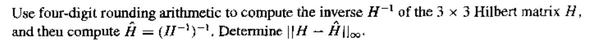
    

    ??? note "解答"

        Gemini 2.5 Pro 没能算对，所以这里就直接贴上教材答案：

        

            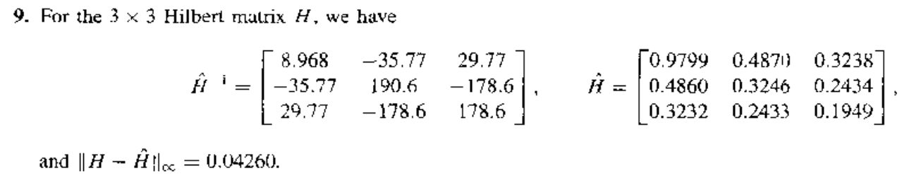
        

## Chap 8: Approximation Theory

!!! question "问题（8.1.5）"

    Given the data:

    $x_i$: 4.0, 4.2, 4.5, 4.7, 5.1, 5.5, 5.9, 6.3, 6.8, 7.1

    $y_i$: 102.56, 113.18, 130.11, 142.05, 167.53, 195.14, 224.87, 256.73, 299.50, 326.72

    a. Construct the least squares polynomial of degree 1, and compute the error.

    b. Construct the least squares polynomial of degree 2, and compute the error.

    c. Construct the least squares polynomial of degree 3, and compute the error.

    d. Construct the least squares approximation of the form $be^{ax}$, and compute the error.

    e. Construct the least squares approximation of the form $bx^a$, and compute the error.

    ??? note "解答"

        以下是针对给定数据构建各种最小二乘逼近并计算误差的关键步骤和结果。误差 $E$ 定义为残差平方和 $E = \sum (y_i - \text{approximation}(x_i))^2$。

        ---
        **a. 一次最小二乘多项式**

        1.  **模型**: $P_1(x) = a_0 + a_1x$。

        2.  **正规方程组**: 通过最小化误差平方和 $E_1 = \sum (y_i - (a_0 + a_1x_i))^2$ 导出：

            $$\begin{pmatrix} N & \sum x_i \\ \sum x_i & \sum x_i^2 \end{pmatrix} \begin{pmatrix} a_0 \\ a_1 \end{pmatrix} = \begin{pmatrix} \sum y_i \\ \sum x_i y_i \end{pmatrix}$$

        3.  **计算系数**:

            * $a_0 \approx -194.1382$
            * $a_1 \approx 72.0845$

            所以，$P_1(x) \approx -194.1382 + 72.0845x$。

        4.  **误差平方和**:

            * $E_1 \approx 329.0132$

        ---
        **b. 二次最小二乘多项式**

        1.  **模型**: $P_2(x) = a_0 + a_1x + a_2x^2$。

        2.  **正规方程组**:

            $$\begin{pmatrix} N & \sum x_i & \sum x_i^2 \\ \sum x_i & \sum x_i^2 & \sum x_i^3 \\ \sum x_i^2 & \sum x_i^3 & \sum x_i^4 \end{pmatrix} \begin{pmatrix} a_0 \\ a_1 \\ a_2 \end{pmatrix} = \begin{pmatrix} \sum y_i \\ \sum x_i y_i \\ \sum x_i^2 y_i \end{pmatrix}$$

        3.  **计算系数**:

            * $a_0 \approx 1.2356$
            * $a_1 \approx -1.1435$
            * $a_2 \approx 6.6182$

            所以，$P_2(x) \approx 1.2356 - 1.1435x + 6.6182x^2$。

        4.  **误差平方和**:

            * $E_2 \approx 0.001443$

        ---
        **c. 三次最小二乘多项式**

        1.  **模型**: $P_3(x) = a_0 + a_1x + a_2x^2 + a_3x^3$。

        2.  **正规方程组**:

            $$\begin{pmatrix} N & \sum x_i & \sum x_i^2 & \sum x_i^3 \\ \sum x_i & \sum x_i^2 & \sum x_i^3 & \sum x_i^4 \\ \sum x_i^2 & \sum x_i^3 & \sum x_i^4 & \sum x_i^5 \\ \sum x_i^3 & \sum x_i^4 & \sum x_i^5 & \sum x_i^6 \end{pmatrix} \begin{pmatrix} a_0 \\ a_1 \\ a_2 \\ a_3 \end{pmatrix} = \begin{pmatrix} \sum y_i \\ \sum x_i y_i \\ \sum x_i^2 y_i \\ \sum x_i^3 y_i \end{pmatrix}$$

        3.  **计算系数**:

            * $a_0 \approx 3.4291$
            * $a_1 \approx -2.3792$
            * $a_2 \approx 6.8456$
            * $a_3 \approx -0.01367$

            所以，$P_3(x) \approx 3.4291 - 2.3792x + 6.8456x^2 - 0.01367x^3$。

        4.  **误差平方和**:

            * $E_3 \approx 0.000527$

        ---
        **d. 最小二乘逼近 $y \approx be^{ax}$**

        1.  **模型**: $y = be^{ax}$。

        2.  **线性化**: 取对数 $\ln y = \ln b + ax$。令 $Y = \ln y, A_0 = \ln b, A_1 = a$。则模型变为 $Y = A_0 + A_1x$。

        3.  **正规方程组 (针对线性化模型)**:

            $$\begin{pmatrix} N & \sum x_i \\ \sum x_i & \sum x_i^2 \end{pmatrix} \begin{pmatrix} A_0 \\ A_1 \end{pmatrix} = \begin{pmatrix} \sum Y_i \\ \sum x_i Y_i \end{pmatrix}$$

        4.  **计算系数**:

            * $A_0 \approx 3.18875$, $A_1 \approx 0.37238$
            * $a = A_1 \approx 0.3724$
            * $b = e^{A_0} \approx e^{3.18875} \approx 24.2588$

            所以，逼近函数为 $y \approx 24.2588 e^{0.3724x}$。

        5.  **误差平方和 (基于原模型)**:

            * $E_d = \sum (y_i - be^{ax_i})^2 \approx 417.6910$

        ---
        **e. 最小二乘逼近 $y \approx bx^a$**

        1.  **模型**: $y = bx^a$。

        2.  **线性化**: 取对数 $\ln y = \ln b + a \ln x$。令 $Y = \ln y, X = \ln x, A_0 = \ln b, A_1 = a$。则模型变为 $Y = A_0 + A_1X$。

        3.  **正规方程组 (针对线性化模型)**:

            $$\begin{pmatrix} N & \sum X_i \\ \sum X_i & \sum X_i^2 \end{pmatrix} \begin{pmatrix} A_0 \\ A_1 \end{pmatrix} = \begin{pmatrix} \sum Y_i \\ \sum X_i Y_i \end{pmatrix}$$

        4.  **计算系数**:

            * $A_0 \approx 1.83086$, $A_1 \approx 2.01954$
            * $a = A_1 \approx 2.0195$
            * $b = e^{A_0} \approx e^{1.83086} \approx 6.2390$

            所以，逼近函数为 $y \approx 6.2390 x^{2.0195}$。

        5.  **误差平方和 (基于原模型)**:
        
            * $E_e = \sum (y_i - bx_i^a)^2 \approx 0.007023$

!!! question "问题（8.2.3）"

    Find the linear least squares polynomial approximation on the interval $[-1, 1]$ for the following functions:

    a. $f(x) = x^2 - 2x + 3$

    b. $f(x) = x^3$

    c. $f(x) = \frac{1}{x+2}$

    d. $f(x) = e^x$

    e. $f(x) = \frac{1}{2}\cos x + \frac{1}{3}\sin 2x$

    f. $f(x) = \ln(x+2)$

    ??? note "解答"

        设所求的线性最小二乘多项式为 $P_1(x) = a_0 + a_1x$。我们的目标是最小化误差平方积分 $E = \int_{-1}^{1} (f(x) - P_1(x))^2 dx$。

        通过令 $\frac{\partial E}{\partial a_0} = 0$ 和 $\frac{\partial E}{\partial a_1} = 0$，我们得到以下正规方程组：

        $a_0 \int_{-1}^{1} 1 dx + a_1 \int_{-1}^{1} x dx = \int_{-1}^{1} f(x) dx$

        $a_0 \int_{-1}^{1} x dx + a_1 \int_{-1}^{1} x^2 dx = \int_{-1}^{1} xf(x) dx$

        在区间 $[-1, 1]$ 上，我们有：

        $\int_{-1}^{1} 1 dx = 2$

        $\int_{-1}^{1} x dx = 0$

        $\int_{-1}^{1} x^2 dx = \frac{2}{3}$

        代入这些值，正规方程组简化为：

        $2a_0 = \int_{-1}^{1} f(x) dx \implies a_0 = \frac{1}{2} \int_{-1}^{1} f(x) dx$

        $\frac{2}{3}a_1 = \int_{-1}^{1} xf(x) dx \implies a_1 = \frac{3}{2} \int_{-1}^{1} xf(x) dx$

        我们将对每个函数分别计算 $a_0$ 和 $a_1$。

        **a. $f(x) = x^2 - 2x + 3$**
        
        1.  $\int_{-1}^{1} (x^2 - 2x + 3) dx = [\frac{x^3}{3} - x^2 + 3x]_{-1}^{1} = (\frac{1}{3} - 1 + 3) - (-\frac{1}{3} - 1 - 3) = \frac{20}{3}$
        2.  $\int_{-1}^{1} x(x^2 - 2x + 3) dx = \int_{-1}^{1} (x^3 - 2x^2 + 3x) dx = [\frac{x^4}{4} - \frac{2x^3}{3} + \frac{3x^2}{2}]_{-1}^{1} = -\frac{4}{3}$
        3.  $a_0 = \frac{1}{2} \cdot \frac{20}{3} = \frac{10}{3}$
        4.  $a_1 = \frac{3}{2} \cdot (-\frac{4}{3}) = -2$

        所以，$P_1(x) = \frac{10}{3} - 2x$

        **b. $f(x) = x^3$**

        1.  $\int_{-1}^{1} x^3 dx = 0$ (奇函数在对称区间的积分为0)
        2.  $\int_{-1}^{1} x(x^3) dx = \int_{-1}^{1} x^4 dx = [\frac{x^5}{5}]_{-1}^{1} = \frac{2}{5}$
        3.  $a_0 = \frac{1}{2} \cdot 0 = 0$
        4.  $a_1 = \frac{3}{2} \cdot \frac{2}{5} = \frac{3}{5}$

        所以，$P_1(x) = \frac{3}{5}x$

        **c. $f(x) = \frac{1}{x+2}$**

        1.  $\int_{-1}^{1} \frac{1}{x+2} dx = [\ln|x+2|]_{-1}^{1} = \ln(3) - \ln(1) = \ln 3$
        2.  $\int_{-1}^{1} \frac{x}{x+2} dx = \int_{-1}^{1} (1 - \frac{2}{x+2}) dx = [x - 2\ln|x+2|]_{-1}^{1} = (1 - 2\ln 3) - (-1 - 0) = 2 - 2\ln 3$
        3.  $a_0 = \frac{1}{2} \ln 3$
        4.  $a_1 = \frac{3}{2} (2 - 2\ln 3) = 3 - 3\ln 3$

        所以，$P_1(x) = \frac{1}{2}\ln 3 + (3 - 3\ln 3)x$

        **d. $f(x) = e^x$**

        1.  $\int_{-1}^{1} e^x dx = [e^x]_{-1}^{1} = e - e^{-1}$
        2.  $\int_{-1}^{1} xe^x dx = [(x-1)e^x]_{-1}^{1} = (0) - (-2e^{-1}) = 2e^{-1}$
        3.  $a_0 = \frac{1}{2}(e - e^{-1}) = \sinh(1)$
        4.  $a_1 = \frac{3}{2} (2e^{-1}) = 3e^{-1}$

        所以，$P_1(x) = \sinh(1) + 3e^{-1}x$

        **e. $f(x) = \frac{1}{2}\cos x + \frac{1}{3}\sin 2x$**

        1.  $\int_{-1}^{1} (\frac{1}{2}\cos x + \frac{1}{3}\sin 2x) dx = \int_{-1}^{1} \frac{1}{2}\cos x dx + \int_{-1}^{1} \frac{1}{3}\sin 2x dx = \frac{1}{2}[\sin x]_{-1}^{1} + 0 = \sin 1$
        2.  $\int_{-1}^{1} x(\frac{1}{2}\cos x + \frac{1}{3}\sin 2x) dx = \int_{-1}^{1} \frac{x}{2}\cos x dx + \int_{-1}^{1} \frac{x}{3}\sin 2x dx = 0 + \frac{1}{3}\int_{-1}^{1} x\sin 2x dx$
        
            $\int x\sin 2x dx = -\frac{x}{2}\cos 2x + \frac{1}{4}\sin 2x$.

            $\frac{1}{3}[-\frac{x}{2}\cos 2x + \frac{1}{4}\sin 2x]_{-1}^{1} = \frac{1}{3} ((-\frac{1}{2}\cos 2 + \frac{1}{4}\sin 2) - (\frac{1}{2}\cos 2 - \frac{1}{4}\sin 2)) = \frac{1}{3}(-\cos 2 + \frac{1}{2}\sin 2) = -\frac{1}{3}\cos 2 + \frac{1}{6}\sin 2$

        3.  $a_0 = \frac{1}{2}\sin 1$
        4.  $a_1 = \frac{3}{2} (-\frac{1}{3}\cos 2 + \frac{1}{6}\sin 2) = -\frac{1}{2}\cos 2 + \frac{1}{4}\sin 2$

        所以，$P_1(x) = \frac{1}{2}\sin 1 + (-\frac{1}{2}\cos 2 + \frac{1}{4}\sin 2)x$

        **f. $f(x) = \ln(x+2)$**

        1.  $\int_{-1}^{1} \ln(x+2) dx = [(x+2)\ln(x+2) - x]_{-1}^{1} = (3\ln 3 - 1) - (0 - (-1)) = 3\ln 3 - 2$
        2.  $\int_{-1}^{1} x\ln(x+2) dx = [\frac{x^2}{2}\ln(x+2) - \frac{x^2}{4} + x - 2\ln(x+2)]_{-1}^{1}$

            $= (\frac{1}{2}\ln 3 - \frac{1}{4} + 1 - 2\ln 3) - (0 - \frac{1}{4} - 1 - 0) = (\frac{3}{4} - \frac{3}{2}\ln 3) - (-\frac{5}{4}) = 2 - \frac{3}{2}\ln 3$

        3.  $a_0 = \frac{1}{2}(3\ln 3 - 2) = \frac{3}{2}\ln 3 - 1$
        4.  $a_1 = \frac{3}{2}(2 - \frac{3}{2}\ln 3) = 3 - \frac{9}{4}\ln 3$

        所以，$P_1(x) = (\frac{3}{2}\ln 3 - 1) + (3 - \frac{9}{4}\ln 3)x$

!!! question "问题（8.2.11）"

    Use the Gram-Schmidt procedure to calculate $L_1, L_2,$ and $L_3$, where {$L_0(x), L_1(x), L_2(x), L_3(x)$} is an orthogonal set of polynomials on $(0, \infty)$ with respect to the weight function $w(x) = e^{-x}$ and $L_0(x) = 1$. The polynomials obtained from this procedure are called the Laguerre polynomials.

    ??? note "解答"

        我们将使用格拉姆-施密特正交化方法，从基函数 $p_0(x)=1, p_1(x)=x, p_2(x)=x^2, p_3(x)=x^3$ 开始构造拉盖尔多项式 $L_0, L_1, L_2, L_3$。

        给定 $L_0(x) = p_0(x) = 1$。

        内积定义为 $\langle f, g \rangle = \int_0^\infty f(x)g(x)e^{-x}dx$。

        一个有用的积分公式是 $\int_0^\infty x^n e^{-x}dx = n!$ (对于非负整数 $n$)。

        **1. 计算 $L_1(x)$**

        $L_1(x) = p_1(x) - \frac{\langle p_1, L_0 \rangle}{\langle L_0, L_0 \rangle} L_0(x)$。这里 $p_1(x)=x$。

        首先计算内积：

        * $\langle L_0, L_0 \rangle = \int_0^\infty 1 \cdot 1 \cdot e^{-x} dx = \int_0^\infty e^{-x} dx = 0! = 1$。
        * $\langle p_1, L_0 \rangle = \langle x, L_0 \rangle = \int_0^\infty x \cdot 1 \cdot e^{-x} dx = \int_0^\infty xe^{-x} dx = 1! = 1$。

        所以，$L_1(x) = x - \frac{1}{1} \cdot 1 = x - 1$。

        **2. 计算 $L_2(x)$**

        $L_2(x) = p_2(x) - \frac{\langle p_2, L_0 \rangle}{\langle L_0, L_0 \rangle} L_0(x) - \frac{\langle p_2, L_1 \rangle}{\langle L_1, L_1 \rangle} L_1(x)$。这里 $p_2(x)=x^2$。

        计算所需的内积：

        * $\langle p_2, L_0 \rangle = \langle x^2, L_0 \rangle = \int_0^\infty x^2 \cdot 1 \cdot e^{-x} dx = 2! = 2$。
        * $\langle L_1, L_1 \rangle = \int_0^\infty (x-1)(x-1)e^{-x} dx = \int_0^\infty (x^2 - 2x + 1)e^{-x} dx = 2! - 2 \cdot 1! + 1 \cdot 0! = 2 - 2 + 1 = 1$。
        * $\langle p_2, L_1 \rangle = \langle x^2, L_1 \rangle = \int_0^\infty x^2(x-1)e^{-x} dx = \int_0^\infty (x^3 - x^2)e^{-x} dx = 3! - 2! = 6 - 2 = 4$。

        所以，$L_2(x) = x^2 - \frac{2}{1} \cdot 1 - \frac{4}{1} (x-1) = x^2 - 2 - 4x + 4 = x^2 - 4x + 2$。

        **3. 计算 $L_3(x)$**

        $L_3(x) = p_3(x) - \frac{\langle p_3, L_0 \rangle}{\langle L_0, L_0 \rangle} L_0(x) - \frac{\langle p_3, L_1 \rangle}{\langle L_1, L_1 \rangle} L_1(x) - \frac{\langle p_3, L_2 \rangle}{\langle L_2, L_2 \rangle} L_2(x)$。这里 $p_3(x)=x^3$。

        计算所需的内积：

        * $\langle p_3, L_0 \rangle = \langle x^3, L_0 \rangle = \int_0^\infty x^3 \cdot 1 \cdot e^{-x} dx = 3! = 6$。
        * $\langle p_3, L_1 \rangle = \langle x^3, L_1 \rangle = \int_0^\infty x^3(x-1)e^{-x} dx = \int_0^\infty (x^4 - x^3)e^{-x} dx = 4! - 3! = 24 - 6 = 18$。
        * $\langle L_2, L_2 \rangle = \int_0^\infty (x^2 - 4x + 2)^2 e^{-x} dx = \int_0^\infty (x^4 - 8x^3 + 20x^2 - 16x + 4)e^{-x} dx = 4! - 8 \cdot 3! + 20 \cdot 2! - 16 \cdot 1! + 4 \cdot 0! = 24 - 48 + 40 - 16 + 4 = 4$。
        * $\langle p_3, L_2 \rangle = \langle x^3, L_2 \rangle = \int_0^\infty x^3(x^2 - 4x + 2)e^{-x} dx = \int_0^\infty (x^5 - 4x^4 + 2x^3)e^{-x} dx = 5! - 4 \cdot 4! + 2 \cdot 3! = 120 - 4 \cdot 24 + 2 \cdot 6 = 120 - 96 + 12 = 36$。

        所以，$L_3(x) = x^3 - \frac{6}{1} \cdot 1 - \frac{18}{1} (x-1) - \frac{36}{4} (x^2 - 4x + 2)$

        $L_3(x) = x^3 - 6 - 18(x-1) - 9(x^2 - 4x + 2)$

        $L_3(x) = x^3 - 6 - 18x + 18 - 9x^2 + 36x - 18$

        $L_3(x) = x^3 - 9x^2 + 18x - 6$。

        **总结：**

        根据格拉姆-施密特正交化过程，我们得到的（首项系数为1的）拉盖尔多项式为：

        * $L_0(x) = 1$
        * $L_1(x) = x - 1$
        * $L_2(x) = x^2 - 4x + 2$
        * $L_3(x) = x^3 - 9x^2 + 18x - 6$

!!! question "问题（8.3.3）"

    Use the zeros of $\tilde{T}_4$ to construct an interpolating polynomial of degree 3 for the functions in Exercise 1.

    The functions in Exercise 1 are given as:
    a. $f(x) = e^x$

    b. $f(x) = \sin x$

    c. $f(x) = \ln(x+2)$

    d. $f(x) = x^4$

    (These functions are considered on the interval $[-1, 1]$ as per the context of Exercise 1).

    ??? note "解答"

        Gemini 没能给出正确答案。

        

            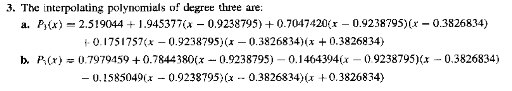
        

        

            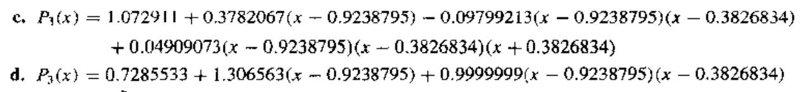
        

!!! question "问题（8.3.7）"

    Find the sixth Maclaurin polynomial for $\sin x$, and use Chebyshev economization to obtain a lesser-degree polynomial approximation while keeping the error less than $0.01$ on $[-1, 1]$.

    ??? note "解答"

        **1. 查找 $\sin x$ 的第六阶麦克劳林多项式**

        $\sin x$ 的麦克劳林级数展开为：

        $\sin x = x - \frac{x^3}{3!} + \frac{x^5}{5!} - \frac{x^7}{7!} + \frac{x^9}{9!} - \dots$

        第六阶麦克劳林多项式 $P_6(x)$ 包含到 $x^6$ 的项。由于 $\sin x$ 是奇函数，其麦克劳林级数只包含 $x$ 的奇数次幂。

        $P_6(x) = \sum_{k=0}^{6} \frac{f^{(k)}(0)}{k!} x^k = x - \frac{x^3}{3!} + \frac{x^5}{5!}$

        $P_6(x) = x - \frac{1}{6}x^3 + \frac{1}{120}x^5$
        
        这是一个5次多项式。

        **2. $P_6(x)$ 的截断误差**

        $P_6(x)$ 近似 $\sin x$ 的误差由泰勒余项 $R_6(x)$ 给出：

        $R_6(x) = \sin x - P_6(x) = -\frac{x^7}{7!} + \frac{x^9}{9!} - \dots$

        对于 $x \in [-1, 1]$，这是一个交错级数（或各项绝对值递减的级数），其误差大小不超过被舍弃的第一项的绝对值：

        $|R_6(x)| \le \left|-\frac{x^7}{7!}\right| \le \frac{1}{7!} = \frac{1}{5040}$ (因为 $|x| \le 1$)。

        **3. 使用切比雪夫多项式表示 $P_6(x)$**

        我们需要将 $x, x^3, x^5$ 用切比雪夫多项式 $T_n(x)$ 表示：

        $T_1(x) = x$

        $T_3(x) = 4x^3 - 3x \implies x^3 = \frac{1}{4}(T_3(x) + 3T_1(x))$

        $T_5(x) = 16x^5 - 20x^3 + 5x \implies x^5 = \frac{1}{16}(T_5(x) + 20x^3 - 5T_1(x))$

        代入 $x^3$ 的表达式到 $x^5$ 中：

        $x^5 = \frac{1}{16}(T_5(x) + 5(T_3(x) + 3T_1(x)) - 5T_1(x)) = \frac{1}{16}(T_5(x) + 5T_3(x) + 10T_1(x))$

        将这些代入 $P_6(x)$:

        $P_6(x) = T_1(x) - \frac{1}{6}\left[\frac{1}{4}(T_3(x) + 3T_1(x))\right] + \frac{1}{120}\left[\frac{1}{16}(T_5(x) + 5T_3(x) + 10T_1(x))\right]$

        $P_6(x) = T_1(x) - \frac{1}{24}T_3(x) - \frac{1}{8}T_1(x) + \frac{1}{1920}T_5(x) + \frac{5}{1920}T_3(x) + \frac{10}{1920}T_1(x)$

        合并同类项：

        $P_6(x) = \frac{1}{1920}T_5(x) + \left(-\frac{1}{24} + \frac{5}{1920}\right)T_3(x) + \left(1 - \frac{1}{8} + \frac{10}{1920}\right)T_1(x)$

        $P_6(x) = \frac{1}{1920}T_5(x) + \left(-\frac{80}{1920} + \frac{5}{1920}\right)T_3(x) + \left(\frac{1920}{1920} - \frac{240}{1920} + \frac{10}{1920}\right)T_1(x)$

        $P_6(x) = \frac{1}{1920}T_5(x) - \frac{75}{1920}T_3(x) + \frac{1690}{1920}T_1(x)$

        $P_6(x) = \frac{1}{1920}T_5(x) - \frac{5}{128}T_3(x) + \frac{169}{192}T_1(x)$

        **4. 切比雪夫经济化**

        $P_6(x)$ 的次数为5。我们尝试舍去包含 $T_5(x)$ 的项来降低次数。

        舍去的项是 $c_5 T_5(x) = \frac{1}{1920}T_5(x)$。

        由于在 $[-1, 1]$ 上 $|T_5(x)| \le 1$，舍去此项引入的误差 $E_{econ,5}$ 最大为 $|\frac{1}{1920}| = \frac{1}{1920}$。

        新的逼近多项式 $Q_3(x) = - \frac{5}{128}T_3(x) + \frac{169}{192}T_1(x)$，这是一个3次多项式。

        $Q_3(x)$ 近似 $\sin x$ 的总误差 $E_{total}$ 满足：

        $|E_{total}| \le |R_6(x)| + E_{econ,5} \le \frac{1}{5040} + \frac{1}{1920}$

        $|E_{total}| \le \frac{8}{40320} + \frac{21}{40320} = \frac{29}{40320} \approx 0.000719$

        由于 $0.000719 < 0.01$，这个3次多项式 $Q_3(x)$ 满足误差要求。

        接下来，我们尝试进一步降低次数，舍去包含 $T_3(x)$ 的项 $-\frac{5}{128}T_3(x)$。

        新的逼近多项式为 $Q_1(x) = \frac{169}{192}T_1(x)$，这是一个1次多项式。

        从 $P_6(x)$ 到 $Q_1(x)$，舍去的项是 $\frac{1}{1920}T_5(x) - \frac{5}{128}T_3(x)$。

        引入的总经济化误差 $E_{econ,5+3}$ 最大为 $|\frac{1}{1920}| + |-\frac{5}{128}| = \frac{1}{1920} + \frac{5}{128} = \frac{21+1575}{40320} = \frac{1596}{40320} = \frac{19}{480}$。

        $Q_1(x)$ 近似 $\sin x$ 的总误差 $E'_{total}$ 满足：

        $|E'_{total}| \le |R_6(x)| + E_{econ,5+3} \le \frac{1}{5040} + \frac{19}{480}$

        $|E'_{total}| \le \frac{8}{40320} + \frac{1596}{40320} = \frac{1604}{40320} \approx 0.03978$

        由于 $0.03978 > 0.01$，这个1次多项式 $Q_1(x)$ 不满足误差要求。

        因此，满足误差要求的、次数较低的逼近多项式是 $Q_3(x)$。

        **5. 将 $Q_3(x)$ 转换回 $x$ 的幂次形式**

        $Q_3(x) = - \frac{5}{128}T_3(x) + \frac{169}{192}T_1(x)$

        $Q_3(x) = - \frac{5}{128}(4x^3 - 3x) + \frac{169}{192}x$

        $Q_3(x) = -\frac{20}{128}x^3 + \frac{15}{128}x + \frac{169}{192}x$

        $Q_3(x) = -\frac{5}{32}x^3 + \left(\frac{15 \times 3}{128 \times 3} + \frac{169 \times 2}{192 \times 2}\right)x$

        $Q_3(x) = -\frac{5}{32}x^3 + \left(\frac{45}{384} + \frac{338}{384}\right)x$

        $Q_3(x) = -\frac{5}{32}x^3 + \frac{383}{384}x$

        **结论**

        第六阶麦克劳林多项式为 $P_6(x) = x - \frac{1}{6}x^3 + \frac{1}{120}x^5$。

        使用切比雪夫经济化得到的、次数较低且在 $[-1, 1]$ 上误差小于 $0.01$ 的多项式是：

        $Q_3(x) = -\frac{5}{32}x^3 + \frac{383}{384}x$

        此多项式的最大误差约为 $0.000719$。

!!! question "问题（8.3.9）"

    Show that for each Chebyshev polynomial $T_n(x)$, we have

    $$\int_{-1}^{1} \frac{[T_n(x)]^2}{\sqrt{1-x^2}} dx = \frac{\pi}{2}$$

    ??? note "解答"

        我们将通过变量替换来证明此等式。切比雪夫多项式 $T_n(x)$ 的定义是 $T_n(\cos \theta) = \cos(n\theta)$。

        **1. 变量替换**

        令 $x = \cos \theta$。这意味着 $\theta = \arccos x$。

        当 $x$ 从 $-1$ 变化到 $1$ 时，$\theta$ 从 $\pi$ 变化到 $0$。

        微分 $x$：$dx = -\sin \theta \, d\theta$。

        分母中的项变为 $\sqrt{1-x^2} = \sqrt{1-\cos^2\theta} = \sqrt{\sin^2\theta} = \sin\theta$ (因为在 $\theta \in [0, \pi]$ 时, $\sin\theta \ge 0$）。

        $T_n(x)$ 变为 $T_n(\cos\theta) = \cos(n\theta)$。

        **2. 积分变换**

        将上述替换代入原积分：

        $$I = \int_{-1}^{1} \frac{[T_n(x)]^2}{\sqrt{1-x^2}} dx = \int_{\pi}^{0} \frac{[\cos(n\theta)]^2}{\sin\theta} (-\sin\theta \, d\theta)$$

        反转积分限并消去 $\sin\theta$ (假设 $\sin\theta \neq 0$ 在积分区间内部，这在端点处通过极限处理)：

        $$I = \int_{0}^{\pi} [\cos(n\theta)]^2 d\theta$$

        **3. 积分计算**

        使用三角恒等式 $\cos^2 A = \frac{1+\cos(2A)}{2}$:

        $$I = \int_{0}^{\pi} \frac{1+\cos(2n\theta)}{2} d\theta = \frac{1}{2} \int_{0}^{\pi} (1+\cos(2n\theta)) d\theta$$

        $$I = \frac{1}{2} \left[ \theta + \frac{\sin(2n\theta)}{2n} \right]_{0}^{\pi}$$

        这个表达式在 $2n \neq 0$ 时，即 $n \neq 0$ 时有效。

        **情况 1: $n \ge 1$ ($n$为非负整数，所以 $n \neq 0$ 意味着 $n \ge 1$)**

        此时，$2n$ 是一个非零整数。

        $$I = \frac{1}{2} \left[ \left(\pi + \frac{\sin(2n\pi)}{2n}\right) - \left(0 + \frac{\sin(0)}{2n}\right) \right]$$

        由于对于整数 $n$, $\sin(2n\pi) = 0$ 且 $\sin(0) = 0$:

        $$I = \frac{1}{2} (\pi + 0 - 0 - 0) = \frac{\pi}{2}$$

        这与题目中给出的公式相符。

        **情况 2: $n=0$**

        当 $n=0$ 时，$T_0(x) = 1$。此时，我们不能使用上面含有 $2n$ 作为分母的表达式。我们应直接计算积分：

        $$I = \int_{0}^{\pi} [\cos(0 \cdot \theta)]^2 d\theta = \int_{0}^{\pi} [1]^2 d\theta = \int_{0}^{\pi} 1 \, d\theta$$

        $$I = [\theta]_{0}^{\pi} = \pi - 0 = \pi$$

        或者，从 $\frac{1}{2} \int_{0}^{\pi} (1+\cos(2n\theta)) d\theta$ 出发，当 $n=0$ 时，$\cos(2n\theta) = \cos(0) = 1$。

        $$I = \frac{1}{2} \int_{0}^{\pi} (1+1) d\theta = \frac{1}{2} \int_{0}^{\pi} 2 \, d\theta = \int_{0}^{\pi} 1 \, d\theta = \pi$$

        **4. 结论**

        通过上述计算，我们发现：
        -   对于 $n \ge 1$，积分 $\int_{-1}^{1} \frac{[T_n(x)]^2}{\sqrt{1-x^2}} dx = \frac{\pi}{2}$。
        -   对于 $n = 0$，积分 $\int_{-1}^{1} \frac{[T_0(x)]^2}{\sqrt{1-x^2}} dx = \pi$。

        因此，题目中所述的等式 $\int_{-1}^{1} \frac{[T_n(x)]^2}{\sqrt{1-x^2}} dx = \frac{\pi}{2}$ 对于 $n \ge 1$ 的切比雪夫多项式 $T_n(x)$ 是成立的。对于 $n=0$ 的情况，$T_0(x)=1$，该积分的结果是 $\pi$。题目表述 "for each Chebyshev polynomial" (对于每一个切比雪夫多项式) 意味着包括 $n=0$。如果严格按照题目表述，那么该命题对于 $n=0$ 的情况不成立，除非上下文对 $T_n(x)$ 有特定范围或对 $T_0(x)$ 有不同的标准化定义（例如 $T_0(x)=1/\sqrt{2}$，但这并非标准定义）。通常，该公式在文献中是针对 $n \ge 1$ 给出的，或者分别给出 $n=0$ 和 $n \ge 1$ 的情况。

## Chap 9: Approximating Eigenvalues

本章没有作业（~~好耶！~~）